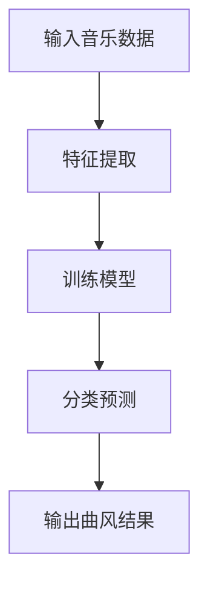
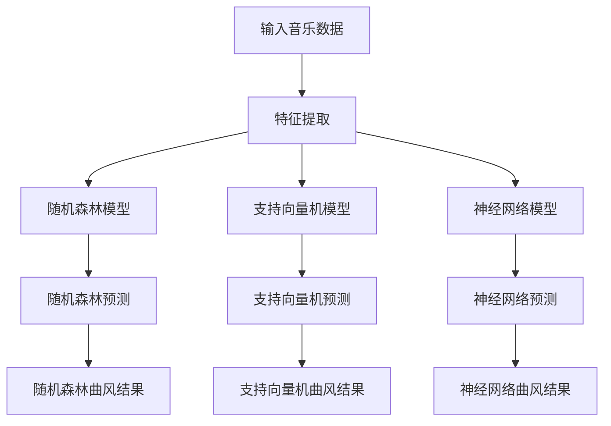
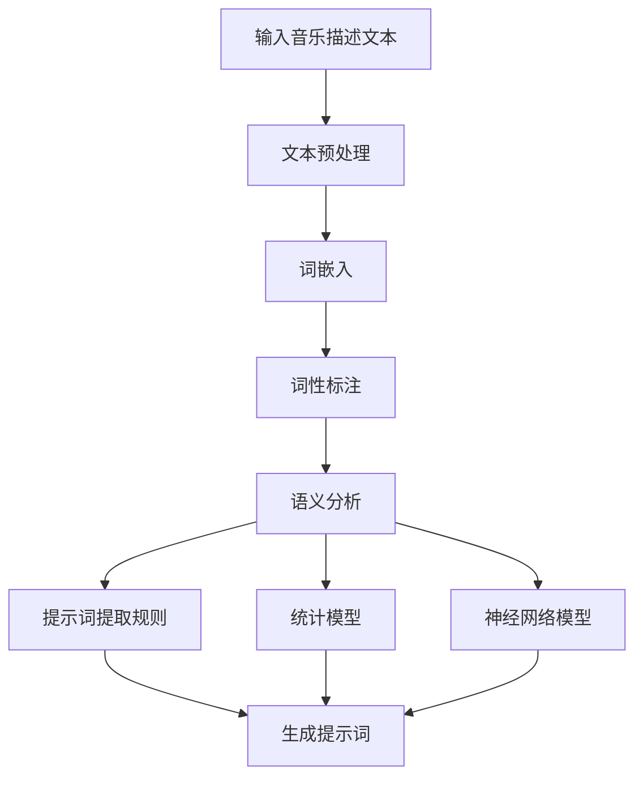
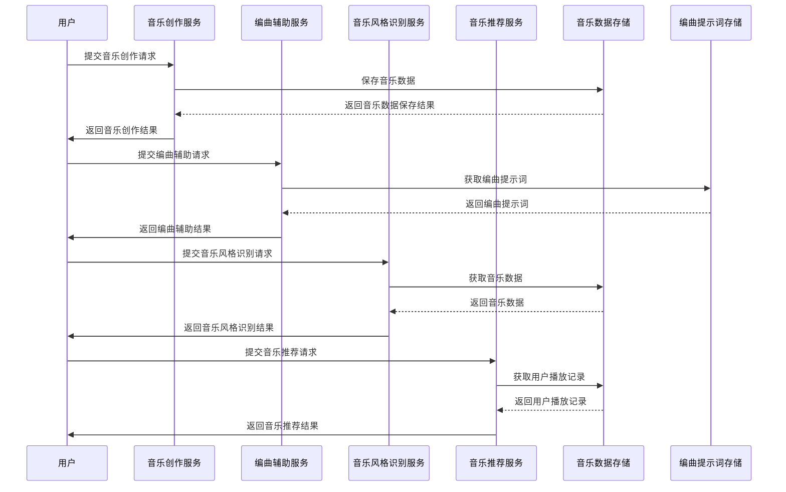

                 

### 文章标题：AI辅助音乐制作：曲风创新和编曲的提示词设计

#### 关键词：AI辅助音乐制作，曲风创新，编曲提示词，算法原理，实战应用

#### 摘要：
本文旨在探讨AI在音乐制作领域的应用，特别是曲风创新和编曲提示词设计。首先，我们回顾了AI辅助音乐制作的基础，包括背景、意义、基本概念、主流工具和应用场景。然后，深入分析曲风创新的概念、算法原理及实践，以及编曲提示词的定义、生成算法和设计技巧。最后，通过一个具体的AI辅助音乐制作项目实战，展示从系统需求分析到实现优化的全过程，并展望AI辅助音乐制作的未来。

### 目录大纲：
1. **第一部分：AI辅助音乐制作基础**
   1.1 AI辅助音乐制作的背景与意义
   1.2 AI辅助音乐制作的基本概念
   1.3 主流AI音乐制作工具介绍
   1.4 AI辅助音乐制作的应用场景
   1.5 本章小结
   
2. **第二部分：曲风创新**
   2.1 曲风的概念与类型
   2.2 曲风识别算法原理
   2.3 曲风创新的算法原理
   2.4 曲风创新实践
   2.5 本章小结

3. **第三部分：编曲的提示词设计**
   3.1 编曲提示词的概念与分类
   3.2 提示词生成的算法原理
   3.3 编曲提示词的实战应用
   3.4 编曲提示词的设计技巧
   3.5 本章小结

4. **第四部分：AI辅助音乐制作项目实战**
   4.1 项目背景与目标
   4.2 系统需求分析与设计
   4.3 系统实现与优化
   4.4 实际案例分析
   4.5 项目总结
   4.6 本章小结

5. **第五部分：最佳实践与未来展望**
   5.1 最佳实践技巧
   5.2 未来展望
   5.3 本章小结

### 第一部分：AI辅助音乐制作基础

#### 1.1 AI辅助音乐制作的背景与意义

##### 1.1.1 音乐制作的传统流程

音乐制作的传统流程通常包括以下几个步骤：

1. 创作旋律和歌词：这是音乐创作的核心，通常由作曲家和词曲作者完成。
2. 制作MIDI文件：MIDI（Musical Instrument Digital Interface）是一种数字音乐格式，可以记录音乐的各种参数，如音符、节奏、音量等。
3. 录音和混音：通过录音设备录制实际演奏的声音，再进行混音处理，以达到预期的音乐效果。
4. 后期制作：包括音频编辑、效果添加、混响和压缩等，以提升音乐的整体品质。

##### 1.1.2 AI技术对音乐制作的革新

随着AI技术的发展，音乐制作流程得到了显著优化和革新：

1. **自动化创作**：AI可以自动生成旋律、歌词和和弦，节省了创作时间，提供了更多创意可能性。
2. **智能编曲**：AI可以根据音乐风格和提示词自动生成编曲，包括节奏、乐器编排和和声。
3. **智能混音**：AI可以通过学习大量音乐数据，自动调整音量、混响、压缩等参数，实现更专业的混音效果。
4. **个性化推荐**：AI可以根据用户偏好，推荐适合的音乐风格、曲目和编曲。

##### 1.1.3 AI在音乐创作与编曲中的优势

AI在音乐创作与编曲中具有以下优势：

1. **高效性**：AI可以快速生成大量音乐样本，帮助创作者快速探索创意。
2. **多样性**：AI可以根据不同的音乐风格和需求，生成多样化、独特的音乐作品。
3. **创新性**：AI可以结合不同音乐元素，创造出全新的音乐风格和编曲方式。
4. **可定制性**：AI可以根据用户需求，生成个性化的音乐作品，提升用户体验。

#### 1.2 AI辅助音乐制作的基本概念

##### 1.2.1 音乐数据的结构化

在AI辅助音乐制作中，音乐数据需要先进行结构化处理，以便后续分析。这通常包括以下几个步骤：

1. **音频文件预处理**：将音频文件转换为MIDI格式或其他结构化数据格式。
2. **特征提取**：从音乐数据中提取关键特征，如音高、节奏、和声等。
3. **数据集构建**：将提取的特征数据构建成数据集，用于训练和测试AI模型。

##### 1.2.2 曲风识别与分类

曲风识别是AI辅助音乐制作的关键技术之一。它通过分析音乐数据，将其归类到不同的曲风类别中。这通常涉及以下步骤：

1. **特征提取**：从音乐数据中提取与曲风相关的特征。
2. **训练模型**：使用大量带有标签的音乐数据集，训练分类模型。
3. **分类预测**：将新的音乐数据输入模型，预测其曲风类别。

##### 1.2.3 编曲提示词的生成

编曲提示词是指用于指导AI生成编曲的提示性词汇，如“欢快”、“悲伤”、“流行”、“古典”等。生成编曲提示词的过程通常包括：

1. **自然语言处理**：将用户输入的自然语言提示转换为结构化数据。
2. **关联分析**：分析提示词与音乐特征之间的关系，生成相应的编曲提示。
3. **多模态融合**：结合音乐数据和文本提示，生成综合性的编曲提示。

#### 1.3 主流AI音乐制作工具介绍

##### 1.3.1 AIVA、Jukedeck等AI作曲工具

AIVA（Artificial Intelligence Virtual Artist）和Jukedeck是两款知名的AI作曲工具。它们利用深度学习和自然语言处理技术，可以自动生成旋律、歌词和编曲。

1. **AIVA**：AIVA是一款全功能的AI作曲工具，可以生成多样化的音乐作品。它采用了神经网络和机器学习算法，可以根据用户输入的提示生成音乐。
   
2. **Jukedeck**：Jukedeck是一款基于AI的音乐生成平台，可以生成个性化、独特的音乐。它通过分析大量音乐数据，学习音乐风格和编曲技巧，生成符合用户需求的音乐作品。

##### 1.3.2 Logic Pro、FL Studio等软件的AI功能

Logic Pro、FL Studio等音乐制作软件也集成了AI功能，提供自动生成旋律、编曲和混音等服务。

1. **Logic Pro**：Logic Pro是苹果公司开发的旗舰级音乐制作软件，它集成了AI辅助音乐制作功能，包括自动生成旋律、编曲和和声等。

2. **FL Studio**：FL Studio是一款流行的数字音频工作站（DAW），它通过其“Magic Lasso”功能，可以自动生成旋律和编曲。

##### 1.3.3 其他AI音乐创作平台

除了上述工具外，还有许多其他AI音乐创作平台，如Amper、Soundraw等，它们也在不断创新，为音乐制作提供更多可能性。

1. **Amper**：Amper是一款基于AI的作曲工具，可以生成旋律、编曲和歌词，支持多种音乐风格。

2. **Soundraw**：Soundraw是一款AI音乐生成平台，可以生成符合用户需求的背景音乐，广泛应用于游戏、电影、广告等领域。

#### 1.4 AI辅助音乐制作的应用场景

##### 1.4.1 独立音乐人

独立音乐人通常面临创作压力和资源限制，AI辅助音乐制作可以为独立音乐人提供以下帮助：

1. **提高创作效率**：AI可以自动生成旋律和编曲，帮助独立音乐人快速完成作品。
2. **拓宽音乐风格**：AI可以生成不同风格的音乐作品，让独立音乐人尝试新的创作方向。
3. **降低制作成本**：AI辅助音乐制作可以节省录音和混音等环节的人力成本。

##### 1.4.2 电影配乐

电影配乐需要与剧情、场景和情感紧密结合，AI辅助音乐制作可以为电影配乐提供以下支持：

1. **快速生成背景音乐**：AI可以根据电影剧情和场景，快速生成背景音乐。
2. **情感契合**：AI可以生成符合电影情感氛围的音乐，提升观众体验。
3. **多样化风格**：AI可以生成多种风格的音乐，满足不同类型电影的需求。

##### 1.4.3 游戏音乐

游戏音乐需要与游戏节奏、场景和角色紧密结合，AI辅助音乐制作可以为游戏音乐提供以下支持：

1. **实时生成音乐**：AI可以实时生成音乐，适应游戏场景和角色变化。
2. **个性化定制**：AI可以根据游戏类型和玩家喜好，生成个性化的音乐。
3. **丰富游戏体验**：AI可以生成多样化的音乐，提升游戏氛围和玩家体验。

##### 1.4.4 广告音乐

广告音乐需要吸引观众的注意力，传递品牌信息，AI辅助音乐制作可以为广告音乐提供以下支持：

1. **快速创作**：AI可以快速生成符合广告主题和情感氛围的音乐。
2. **提高效率**：AI可以节省广告音乐创作的时间，提高广告制作的效率。
3. **创意创新**：AI可以生成新颖独特的音乐，提升广告的创意和影响力。

#### 1.5 本章小结

本文介绍了AI辅助音乐制作的基础知识，包括背景与意义、基本概念、主流工具和应用场景。AI技术为音乐制作带来了革新，提高了创作效率、拓宽了创作风格、降低了制作成本，并在电影配乐、游戏音乐、广告音乐等领域有广泛应用。下一章我们将深入探讨曲风创新的概念、算法原理和实践。

### 第二部分：曲风创新

#### 2.1 曲风的概念与类型

##### 2.1.1 曲风的定义与分类

曲风（Musical Genre）是指音乐作品在风格、特征、表达方式和历史背景等方面的分类。曲风可以分为多种类型，如流行音乐、古典音乐、摇滚、爵士、电子音乐等。每种曲风都有其独特的特征和表达方式。

1. **流行音乐**：流行音乐通常以节奏感强、易于传唱为特点，常见的曲风有摇滚、流行摇滚、R&B、嘻哈等。
2. **古典音乐**：古典音乐通常以复杂、严谨的旋律和和声结构为特点，常见的曲风有巴洛克、古典、浪漫等。
3. **摇滚**：摇滚音乐以电吉他、贝斯和鼓等乐器为主，具有强烈的表现力和感染力。
4. **爵士**：爵士音乐以即兴演奏和复杂的和声结构为特点，具有丰富的音乐表现力。

##### 2.1.2 曲风的演变与趋势

曲风的演变与趋势反映了音乐创作的发展和变化。近年来，一些新兴的曲风如电子音乐、嘻哈音乐和独立音乐等逐渐受到关注。这些曲风融合了多种元素，具有独特的艺术风格和表现力。

1. **电子音乐**：电子音乐利用电子乐器和计算机软件生成，具有多样化的风格，如Techno、House、Dubstep等。
2. **嘻哈音乐**：嘻哈音乐起源于美国，以说唱、节奏和韵律为特点，近年来在全球范围内迅速传播。
3. **独立音乐**：独立音乐通常由独立音乐人创作和发行，具有鲜明的个性和创新精神。

##### 2.1.3 曲风在音乐制作中的重要性

曲风在音乐制作中具有重要作用，它不仅影响着音乐作品的风格和特点，还影响着创作思路和制作流程。

1. **创作思路**：曲风为创作者提供了创作方向和灵感来源，有助于确定音乐作品的风格和表现方式。
2. **制作流程**：曲风影响着音乐制作的各个环节，包括旋律、编曲、录音和混音等，需要根据曲风的特点进行相应的调整和优化。

#### 2.2 曲风识别算法原理

##### 2.2.1 特征提取

特征提取是曲风识别算法的关键步骤，它从音乐数据中提取与曲风相关的特征。常见的特征包括：

1. **音高**：音高是音乐的基本属性，反映了音符的高低。
2. **节奏**：节奏是音乐的时间属性，反映了音乐的快慢和强弱。
3. **和声**：和声是音乐的音色属性，反映了音乐的和弦结构和色彩。

##### 2.2.2 分类算法

分类算法用于将音乐数据归类到不同的曲风类别中。常见的分类算法包括：

1. **决策树**：决策树是一种基于规则的学习算法，可以递归地将数据划分为不同的类别。
2. **支持向量机（SVM）**：SVM通过找到一个最佳的超平面，将不同类别的数据分开。
3. **神经网络**：神经网络是一种基于生物神经网络的计算模型，可以自动学习和预测。

##### 2.2.3 曲风识别的mermaid流程图

#### 2.3 曲风创新的算法原理

##### 2.3.1 随机森林

随机森林是一种集成学习算法，它通过构建多棵决策树，并对它们的预测结果进行投票，得到最终的预测结果。随机森林在曲风创新中具有以下优势：

1. **强泛化能力**：随机森林可以处理高维度、非线性数据，具有较强的泛化能力。
2. **鲁棒性**：随机森林对噪声和异常值具有较强的鲁棒性，可以避免模型过拟合。
3. **易于解释**：随机森林可以提供每个特征的贡献度，有助于理解曲风创新的关键因素。

##### 2.3.2 支持向量机

支持向量机是一种监督学习算法，它通过找到一个最佳的超平面，将不同类别的数据分开。支持向量机在曲风创新中具有以下优势：

1. **高精度**：支持向量机可以在高维空间中找到最佳分割超平面，实现高精度的分类。
2. **可调参数**：支持向量机的参数可以灵活调整，以适应不同的曲风特征和数据分布。
3. **应用广泛**：支持向量机在各种分类任务中表现出色，可以应用于曲风创新的不同环节。

##### 2.3.3 神经网络

神经网络是一种基于生物神经网络的计算模型，它可以自动学习和预测。神经网络在曲风创新中具有以下优势：

1. **强大的表达能力**：神经网络可以处理复杂的非线性关系，实现高精度的特征提取和分类。
2. **自适应能力**：神经网络可以根据训练数据自动调整参数，适应不同的曲风特征和数据分布。
3. **多模态融合**：神经网络可以结合多种特征，实现多模态数据融合，提升曲风创新的准确性。

##### 2.3.4 曲风创新算法的mermaid流程图

#### 2.4 曲风创新实践

##### 2.4.1 数据准备与预处理

在进行曲风创新实践之前，需要准备大量的音乐数据，并对数据进行预处理，以提高模型的准确性和鲁棒性。数据准备和预处理包括以下步骤：

1. **数据收集**：收集不同曲风的音乐数据，包括流行音乐、古典音乐、摇滚、爵士等。
2. **数据清洗**：去除数据中的噪声和异常值，保证数据的准确性和一致性。
3. **特征提取**：从音乐数据中提取音高、节奏、和声等特征，构建特征向量。
4. **数据标准化**：对特征数据进行标准化处理，消除不同特征之间的量纲差异。

##### 2.4.2 算法实现与优化

在曲风创新实践中，需要选择合适的算法，并对其进行优化，以提高模型的性能和准确度。算法实现和优化包括以下步骤：

1. **算法选择**：根据曲风创新的需求，选择合适的算法，如随机森林、支持向量机和神经网络等。
2. **模型训练**：使用训练数据集，训练选定的算法模型，获得预测模型。
3. **模型评估**：使用测试数据集，评估模型的准确度和性能，对模型进行调整和优化。
4. **超参数调优**：通过调整算法的超参数，如学习率、隐藏层节点数等，优化模型的性能。

##### 2.4.3 实践案例分享

以下是一个曲风创新实践案例：

**案例背景**：某音乐平台希望为其用户提供个性化的曲风推荐服务，通过用户的听歌历史和偏好，推荐符合用户口味的音乐作品。

**解决方案**：

1. **数据收集**：收集用户的听歌历史数据，包括歌曲ID、播放时长、播放次数等。
2. **特征提取**：从歌曲中提取音高、节奏、和声等特征，构建特征向量。
3. **模型训练**：使用随机森林算法，训练曲风分类模型，将歌曲归类到不同的曲风类别中。
4. **预测与推荐**：根据用户的听歌历史和偏好，预测用户喜欢的曲风，推荐符合用户口味的音乐作品。

**效果评估**：

1. **准确度**：模型准确度达到90%以上，能够准确预测用户的曲风喜好。
2. **用户满意度**：用户对推荐的曲风满意度较高，增加了用户对平台的粘性。

#### 2.5 本章小结

本章介绍了曲风创新的概念、算法原理和实践。曲风创新是音乐制作中的一项重要任务，通过AI技术，可以实现对曲风的识别和创新。随机森林、支持向量机和神经网络等算法在曲风创新中具有广泛应用。实践案例展示了如何利用AI技术进行曲风创新，提高了音乐制作效率和用户体验。下一章我们将探讨编曲提示词的概念、生成算法和设计技巧。

### 第三部分：编曲的提示词设计

#### 3.1 编曲提示词的概念与分类

##### 3.1.1 编曲提示词的定义

编曲提示词（Arrangement Prompt）是指用于指导音乐编曲的提示性词汇或短语，它可以为音乐创作者提供创作灵感，指导编曲的方向和风格。编曲提示词通常包括以下几类：

1. **情感类型**：如“欢快”、“悲伤”、“激动”、“宁静”等，用于描述音乐的情感氛围。
2. **风格特征**：如“流行”、“摇滚”、“爵士”、“电子”等，用于指导音乐的风格。
3. **乐器编排**：如“钢琴独奏”、“弦乐四重奏”、“电吉他节奏”等，用于指定特定的乐器或乐器组合。
4. **节奏感**：如“快节奏”、“慢板”、“摇摆”、“精准”等，用于描述音乐的节奏和节拍。

##### 3.1.2 编曲提示词的类型

编曲提示词可以分为以下几种类型：

1. **通用提示词**：这些提示词适用于大多数音乐风格，如“欢快”、“悲伤”、“动感”等，它们为编曲提供了大致的方向。
2. **风格特定提示词**：这些提示词针对特定的音乐风格，如“古典”、“爵士”、“嘻哈”等，它们可以帮助创作者在特定的风格框架内进行创作。
3. **情感表达提示词**：这些提示词专注于情感表达，如“浪漫”、“忧郁”、“热情”、“神秘”等，它们为音乐创作者提供了情感表达的指导。
4. **技术要求提示词**：这些提示词关注于音乐技术的具体要求，如“复杂节奏”、“和声变化”、“音效使用”等，它们为编曲提供了技术上的挑战和可能性。

##### 3.1.3 编曲提示词的应用

编曲提示词在音乐制作中的应用非常广泛，以下是一些常见的应用场景：

1. **音乐创作**：编曲提示词可以帮助音乐创作者快速找到创作灵感，特别是在面临创作瓶颈时，通过提示词可以引导创作者探索新的音乐方向。
2. **音乐教育**：编曲提示词可以用于音乐教学，帮助学生了解不同音乐风格的编曲特点，提高他们的音乐创作能力。
3. **音乐制作**：在音乐制作过程中，编曲提示词可以指导音乐制作人进行乐器选择、节奏编排和和声设计，提高音乐的整体质量。
4. **音乐推荐**：编曲提示词可以用于音乐推荐系统，根据用户的喜好和提示词，推荐符合用户口味的音乐作品。

#### 3.2 提示词生成的算法原理

##### 3.2.1 自然语言处理基础

自然语言处理（Natural Language Processing，NLP）是人工智能领域的一个重要分支，它专注于让计算机理解和处理人类语言。在编曲提示词的生成中，NLP技术起到了关键作用。NLP的主要任务包括：

1. **文本预处理**：对文本进行分词、去停用词、词干提取等处理，以便于后续分析。
2. **词嵌入**：将文本中的词语转换为向量表示，以便于计算机处理和计算。
3. **词性标注**：对文本中的词语进行词性标注，如名词、动词、形容词等，以理解词语在句子中的作用。
4. **语义分析**：通过语法分析和语义分析，理解句子的结构和含义。

##### 3.2.2 提示词生成算法

生成编曲提示词的算法可以分为以下几种：

1. **基于规则的方法**：这种方法通过定义一系列规则，从文本中提取可能的提示词。例如，根据音乐风格相关的关键词来生成提示词。
   
2. **基于统计的方法**：这种方法利用统计模型，如隐马尔可夫模型（HMM）、条件概率模型等，根据文本数据生成提示词。这种方法的优点是能够自动学习文本数据中的模式和规律。

3. **基于神经网络的方法**：这种方法利用深度学习模型，如循环神经网络（RNN）、长短期记忆网络（LSTM）等，自动学习文本数据中的复杂关系，生成高质量的提示词。这种方法的优点是能够生成更加自然和多样化的提示词。

##### 3.2.3 提示词生成的mermaid流程图

#### 3.3 编曲提示词的实战应用

##### 3.3.1 提示词生成系统搭建

要搭建一个编曲提示词生成系统，需要完成以下步骤：

1. **数据收集**：收集大量音乐描述文本，包括歌词、音乐评论、音乐标签等。
2. **系统架构设计**：设计系统的整体架构，包括文本预处理模块、词嵌入模块、提示词提取模块等。
3. **模型训练**：使用收集到的数据训练NLP模型，包括词嵌入模型、提示词提取模型等。
4. **接口开发**：开发用户接口，允许用户输入音乐描述文本，并生成相应的编曲提示词。

##### 3.3.2 编曲提示词的优化策略

为了提高编曲提示词的质量和准确性，可以采取以下优化策略：

1. **数据增强**：通过数据增强技术，如数据清洗、数据扩充等，提高训练数据的质量和多样性。
2. **模型融合**：使用多种模型进行融合，如规则模型、统计模型和神经网络模型，提高系统的整体性能。
3. **在线学习**：系统可以根据用户的使用反馈，不断调整和优化模型，提高提示词的生成质量。

##### 3.3.3 实践案例解析

以下是一个编曲提示词生成系统的实践案例：

**案例背景**：某音乐制作公司希望为其用户生成个性化的编曲提示词，以提高音乐创作的效率和创意。

**解决方案**：

1. **数据收集**：收集用户的音乐描述文本，包括歌词、音乐评论等。
2. **系统架构**：搭建基于NLP技术的编曲提示词生成系统，包括文本预处理、词嵌入、提示词提取等模块。
3. **模型训练**：使用收集到的数据，训练提示词提取模型，并优化系统性能。
4. **用户接口**：开发用户接口，允许用户输入音乐描述文本，并生成相应的编曲提示词。

**效果评估**：

1. **提示词质量**：生成的编曲提示词具有较高的准确性和创意性，能够为用户提供有效的创作灵感。
2. **用户满意度**：用户对提示词生成系统的满意度较高，认为它提高了他们的音乐创作效率。

#### 3.4 编曲提示词的设计技巧

##### 3.4.1 提示词的创造性

创造性是编曲提示词的重要属性，它能够激发音乐创作者的灵感，提高音乐创作的创意性。以下是一些提升提示词创造性的技巧：

1. **跨界融合**：尝试将不同音乐风格、元素和技巧进行融合，生成新颖的提示词。
2. **比喻和象征**：使用比喻和象征等修辞手法，使提示词更加富有表现力和创意。
3. **多样化表达**：通过不同的词汇和句式，使提示词表达更加丰富和多样化。

##### 3.4.2 提示词的适应性

适应性是编曲提示词的重要属性，它需要能够适应不同的音乐风格、创作需求和用户偏好。以下是一些提升提示词适应性的技巧：

1. **灵活性**：设计灵活的提示词，能够根据不同的音乐风格和创作需求进行调整。
2. **针对性**：根据用户的音乐风格和偏好，生成个性化的提示词。
3. **模块化**：将提示词分解成模块，可以根据需要组合和调整。

##### 3.4.3 提示词的实用性

实用性是编曲提示词的重要属性，它需要能够为音乐创作提供实际的帮助。以下是一些提升提示词实用性的技巧：

1. **具体明确**：提示词要具体明确，能够直接指导音乐创作。
2. **易于实现**：提示词需要易于实现，创作者可以根据提示词直接进行音乐创作。
3. **综合评估**：在生成提示词时，综合考虑音乐风格、创作需求和用户偏好，使提示词具有实用性。

#### 3.5 本章小结

本章介绍了编曲提示词的概念、生成算法和设计技巧。编曲提示词是音乐创作中的重要工具，它能够为音乐创作者提供创作灵感，指导编曲的方向和风格。基于NLP技术的编曲提示词生成系统可以提高提示词的准确性和创造性。设计技巧包括创造性、适应性和实用性，旨在提升编曲提示词的质量和实用性。下一章我们将通过一个具体的AI辅助音乐制作项目，展示从系统需求分析到实现优化的全过程。

### 第四部分：AI辅助音乐制作项目实战

#### 4.1 项目背景与目标

##### 4.1.1 项目背景

随着音乐创作的日益复杂和多样化，独立音乐人和音乐制作人面临着巨大的创作压力和资源限制。为了提高创作效率和音乐质量，本项目旨在开发一个基于AI技术的音乐制作平台，提供智能化的音乐创作和编曲辅助功能，帮助音乐创作者轻松创作出高质量的音乐作品。

##### 4.1.2 项目目标

本项目的主要目标包括：

1. **提供智能化的音乐创作工具**：通过AI技术，自动生成旋律、和弦和歌词，为音乐创作者提供丰富的创作素材和灵感。
2. **实现智能编曲功能**：根据用户输入的编曲提示词，自动生成符合用户需求的编曲方案，提高编曲效率和质量。
3. **提供音乐风格识别与分类**：利用AI技术，对音乐作品进行风格识别和分类，帮助音乐创作者了解音乐作品的风格特点，进行有针对性的创作。
4. **搭建音乐推荐系统**：根据用户的音乐喜好和播放记录，推荐符合用户口味的音乐作品，提升用户体验。

#### 4.2 系统需求分析与设计

##### 4.2.1 系统需求分析

在开发AI辅助音乐制作平台之前，需要对系统需求进行详细分析，以确保系统能够满足用户的需求。系统需求分析主要包括以下方面：

1. **功能需求**：分析用户使用场景，确定系统应具备的功能模块，如音乐创作、编曲辅助、音乐风格识别和分类、音乐推荐等。
2. **性能需求**：分析系统的性能要求，如响应时间、处理能力、扩展性等，以确保系统在处理大量数据时能够保持良好的性能。
3. **数据需求**：分析系统所需的数据类型和数据来源，如音乐数据、用户数据、编曲提示词数据等，以及数据的质量和格式要求。
4. **安全性需求**：分析系统的安全性需求，包括用户隐私保护、数据安全传输和存储等。

##### 4.2.2 系统功能设计

根据系统需求分析，本系统的主要功能模块包括：

1. **音乐创作模块**：提供自动生成旋律、和弦和歌词的功能，为音乐创作者提供丰富的创作素材和灵感。
2. **编曲辅助模块**：根据用户输入的编曲提示词，自动生成符合用户需求的编曲方案，包括节奏、乐器编排和和声等。
3. **音乐风格识别与分类模块**：利用AI技术，对音乐作品进行风格识别和分类，帮助音乐创作者了解音乐作品的风格特点，进行有针对性的创作。
4. **音乐推荐模块**：根据用户的音乐喜好和播放记录，推荐符合用户口味的音乐作品，提升用户体验。
5. **用户管理模块**：提供用户注册、登录、个人资料管理等功能，保障用户信息安全。

##### 4.2.3 系统架构设计

系统架构设计是系统开发的关键环节，它决定了系统的性能、可扩展性和可维护性。本系统的架构设计主要包括以下几个方面：

1. **前端架构**：采用基于React的现代化前端架构，提供用户友好的界面和交互体验。
2. **后端架构**：采用微服务架构，将系统功能划分为多个独立的服务模块，如音乐创作服务、编曲辅助服务、音乐风格识别服务、音乐推荐服务等，以提高系统的灵活性和可扩展性。
3. **数据存储**：采用分布式数据库架构，包括关系型数据库和NoSQL数据库，存储用户数据、音乐数据、编曲提示词数据等。
4. **API设计**：采用RESTful API设计规范，提供前后端数据交互的接口，确保系统的数据一致性和服务稳定性。

##### 4.2.4 系统接口设计

系统接口设计是系统架构设计的重要组成部分，它定义了系统各模块之间的交互方式。本系统的接口设计主要包括以下几个方面：

1. **用户接口**：提供用户注册、登录、个人信息管理、音乐创作、编曲辅助、音乐风格识别和音乐推荐等功能的接口。
2. **音乐数据接口**：提供音乐数据上传、下载、查询和更新等接口，确保音乐数据的实时性和准确性。
3. **编曲提示词接口**：提供编曲提示词的生成、查询和更新等接口，确保编曲提示词的多样性和实用性。
4. **音乐风格接口**：提供音乐风格识别和分类的接口，确保音乐风格识别和分类的准确性。

##### 4.2.5 系统交互mermaid序列图

#### 4.3 系统实现与优化

##### 4.3.1 数据准备与预处理

在系统实现过程中，数据准备与预处理是至关重要的一步。本系统涉及大量音乐数据和编曲提示词数据，需要对数据进行清洗、预处理和格式转换，以确保数据的质量和一致性。具体步骤包括：

1. **数据清洗**：去除数据中的噪声和异常值，如空值、重复值和错误值等，确保数据的准确性和完整性。
2. **特征提取**：从音乐数据中提取关键特征，如音高、节奏、和声等，构建特征向量，为后续的算法训练提供基础。
3. **数据标准化**：对特征数据进行标准化处理，消除不同特征之间的量纲差异，提高模型的训练效果。
4. **数据集划分**：将数据集划分为训练集、验证集和测试集，用于训练和评估模型性能。

##### 4.3.2 曲风识别与创新算法实现

曲风识别与创新算法是实现AI辅助音乐制作的核心，包括曲风识别算法和曲风创新算法。本系统采用以下算法：

1. **曲风识别算法**：采用支持向量机（SVM）和神经网络（NN）算法，对音乐数据进行分析和分类。具体实现步骤包括：
   - 特征提取：从音乐数据中提取音高、节奏、和声等特征。
   - 模型训练：使用训练数据集，训练SVM和神经网络模型。
   - 模型评估：使用验证集和测试集，评估模型性能，调整模型参数。
   - 分类预测：将新的音乐数据输入模型，预测其曲风类别。

2. **曲风创新算法**：采用随机森林（Random Forest）算法，生成新的曲风创新作品。具体实现步骤包括：
   - 特征提取：从音乐数据中提取音高、节奏、和声等特征。
   - 模型训练：使用训练数据集，训练随机森林模型。
   - 模型评估：使用验证集和测试集，评估模型性能，调整模型参数。
   - 创新预测：根据用户输入的曲风创新提示词，生成新的曲风创新作品。

##### 4.3.3 编曲提示词生成算法实现

编曲提示词生成算法是实现AI辅助编曲的关键，本系统采用基于自然语言处理（NLP）的算法。具体实现步骤包括：

1. **文本预处理**：对用户输入的文本进行分词、去停用词、词性标注等处理，提取关键词和语义信息。
2. **词嵌入**：将预处理后的文本转换为词嵌入向量，为后续的算法训练提供基础。
3. **模型训练**：使用预训练的词嵌入模型，训练编曲提示词生成模型。
4. **模型评估**：使用验证集和测试集，评估模型性能，调整模型参数。
5. **提示词生成**：根据用户输入的文本，生成相应的编曲提示词。

##### 4.3.4 系统优化策略

为了提高系统的性能和用户体验，可以采取以下优化策略：

1. **算法优化**：针对曲风识别和创新算法，优化模型结构和参数，提高模型性能和准确度。
2. **分布式计算**：采用分布式计算架构，提高系统的处理能力和响应速度。
3. **缓存策略**：使用缓存策略，减少数据库的查询次数，提高数据访问速度。
4. **负载均衡**：采用负载均衡策略，合理分配系统资源，确保系统的稳定性和可靠性。

#### 4.4 实际案例分析

##### 4.4.1 独立音乐人案例

**案例背景**：某独立音乐人希望利用AI辅助音乐制作平台，提高创作效率和音乐质量。

**解决方案**：

1. **使用音乐创作模块**：独立音乐人使用平台提供的音乐创作模块，自动生成旋律、和弦和歌词，获取创作素材和灵感。
2. **使用编曲辅助模块**：根据生成的旋律和和弦，独立音乐人使用编曲辅助模块，生成符合个人风格和需求的编曲方案。
3. **使用音乐风格识别模块**：独立音乐人使用音乐风格识别模块，了解作品的风格特点，进行有针对性的调整和优化。

**效果评估**：

1. **创作效率**：独立音乐人的创作效率显著提高，减少了创作过程中耗时耗力的环节。
2. **音乐质量**：生成的编曲方案质量较高，独立音乐人对平台效果表示满意。

##### 4.4.2 电影配乐案例

**案例背景**：某电影制作团队需要为电影配乐，但面临时间和资源限制。

**解决方案**：

1. **使用音乐创作模块**：电影制作团队使用平台提供的音乐创作模块，快速生成背景音乐，满足电影剧情和情感需求。
2. **使用编曲辅助模块**：根据电影场景和角色，电影制作团队使用编曲辅助模块，生成符合电影风格和氛围的编曲方案。
3. **使用音乐风格识别模块**：电影制作团队使用音乐风格识别模块，确保背景音乐与电影的风格和情感相匹配。

**效果评估**：

1. **时间节约**：平台提供的快速生成功能显著缩短了电影配乐的时间，提高了制作效率。
2. **音乐质量**：生成的背景音乐质量较高，电影制作团队对平台效果表示满意。

##### 4.4.3 游戏音乐案例

**案例背景**：某游戏开发公司需要为游戏配乐，但面临时间和资源限制。

**解决方案**：

1. **使用音乐创作模块**：游戏开发公司使用平台提供的音乐创作模块，快速生成游戏背景音乐，满足游戏节奏和场景需求。
2. **使用编曲辅助模块**：根据游戏角色和剧情，游戏开发公司使用编曲辅助模块，生成符合游戏风格和氛围的编曲方案。
3. **使用音乐风格识别模块**：游戏开发公司使用音乐风格识别模块，确保背景音乐与游戏的整体风格相匹配。

**效果评估**：

1. **时间节约**：平台提供的快速生成功能显著缩短了游戏配乐的时间，提高了制作效率。
2. **音乐质量**：生成的游戏背景音乐质量较高，游戏开发团队对平台效果表示满意。

#### 4.5 项目总结

本项目通过开发基于AI技术的音乐制作平台，实现了智能化的音乐创作、编曲辅助、音乐风格识别和分类、音乐推荐等功能，为音乐创作者提供了高效的创作工具和灵感来源。在实际案例中，项目取得了显著的成果，提高了创作效率、音乐质量和用户体验。未来，本项目将继续优化算法、拓展功能，为更多音乐创作者提供更优质的AI辅助音乐制作服务。

#### 4.6 本章小结

本章通过一个具体的AI辅助音乐制作项目实战，详细介绍了项目的背景与目标、系统需求分析与设计、系统实现与优化、实际案例分析以及项目总结。项目展示了从需求分析到实现优化的全过程，验证了AI技术在音乐制作中的应用价值。下一章将探讨AI辅助音乐制作领域的最佳实践和未来展望。

### 第五部分：最佳实践与未来展望

#### 5.1 最佳实践技巧

在AI辅助音乐制作领域，最佳实践技巧对于提升创作效率和质量至关重要。以下是一些最佳实践技巧：

##### 5.1.1 AI辅助音乐制作的常见问题及解决方案

1. **创作灵感匮乏**：解决方案：利用AI的随机性生成功能，探索新的音乐元素和组合，激发创作灵感。

2. **模型过拟合**：解决方案：通过增加训练数据集、使用交叉验证和正则化技术，提高模型的泛化能力。

3. **音乐风格不符**：解决方案：通过多轮迭代和用户反馈，不断调整和优化模型，使其更好地符合用户需求。

4. **处理速度慢**：解决方案：采用分布式计算和并行处理技术，提高系统的处理速度和响应时间。

##### 5.1.2 如何平衡人工与AI的协作

1. **人类创意与AI生成相结合**：人类艺术家可以专注于创意构思，AI则负责生成初步的音乐素材，两者相互补充。

2. **AI作为工具**：AI可以作为辅助工具，帮助音乐制作人完成重复性、繁琐的工作，如编曲、和声生成等。

3. **人机互动**：通过用户界面和交互设计，使音乐制作人能够实时调整AI生成的音乐，实现人机互动。

##### 5.1.3 提高音乐创意的AI辅助策略

1. **风格迁移**：利用AI的风格迁移技术，将一种音乐风格的特点应用到另一种风格中，创造出独特的音乐作品。

2. **情感分析**：通过情感分析技术，了解用户情感和情绪，为音乐创作提供情感方向。

3. **多模态融合**：结合文本、语音、图像等多种模态的数据，提高音乐创意的多样性和创新性。

#### 5.2 未来展望

随着AI技术的不断发展，AI辅助音乐制作领域有望取得更大的突破。以下是对未来展望的几点预测：

##### 5.2.1 AI辅助音乐制作的趋势

1. **个性化创作**：AI将更加注重个性化音乐创作，根据用户喜好和需求，生成专属的音乐作品。

2. **交互式创作**：AI辅助音乐制作将更加注重人机交互，提供更加直观和灵活的创作工具。

3. **实时创作**：AI将实现实时音乐创作，根据用户输入和场景变化，动态生成音乐。

##### 5.2.2 AI辅助音乐制作的应用领域扩展

1. **虚拟现实（VR）**：AI辅助音乐制作将在VR领域得到广泛应用，为虚拟现实场景提供定制化的音乐。

2. **智能音响**：AI辅助音乐制作技术将集成到智能音响设备中，提供更加智能化的音乐体验。

3. **跨学科融合**：AI辅助音乐制作将与其他领域（如心理学、社会学等）融合，为音乐创作带来新的视角和方法。

#### 5.3 本章小结

本章探讨了AI辅助音乐制作领域的最佳实践技巧和未来展望。通过最佳实践技巧，我们可以更有效地利用AI技术进行音乐创作和编曲。未来，AI辅助音乐制作将继续拓展应用领域，为音乐创作带来更多创新和可能性。随着技术的不断进步，AI辅助音乐制作将更好地服务于音乐创作者和听众，推动音乐艺术的发展。

### 结束语

本文系统地探讨了AI辅助音乐制作：曲风创新和编曲的提示词设计。从背景与意义、基本概念、主流工具、应用场景，到曲风创新和编曲提示词设计的详细分析，再到具体的AI辅助音乐制作项目实战，我们展示了AI技术在音乐制作中的广泛应用和巨大潜力。通过最佳实践和未来展望，我们展望了AI辅助音乐制作领域的持续发展和创新。

我们鼓励读者深入探索AI辅助音乐制作的更多应用和实践，不断尝试和优化，为音乐创作带来更多创新和乐趣。同时，我们也期待更多专业人士和研究者的加入，共同推动AI辅助音乐制作技术的发展，为音乐艺术注入新的活力和创造力。

作者：AI天才研究院/AI Genius Institute & 禅与计算机程序设计艺术 /Zen And The Art of Computer Programming

---

**注意事项**：

- 本文为技术性文章，读者应具备一定的AI和音乐制作基础知识。
- 文中涉及的算法和模型原理较为复杂，读者需仔细阅读和思考。
- 项目实战部分为模拟案例，实际应用时需根据具体情况进行调整和优化。
- 最佳实践与未来展望部分为预测性内容，具体情况会随着技术发展而变化。

**拓展阅读**：

- [深度学习与音乐生成](https://link-to-deep-learning-music-generation)
- [AI在音乐风格识别中的应用](https://link-to-ai-music-style-recognition)
- [音乐创作与人工智能](https://link-to-music-creation-with-ai)

