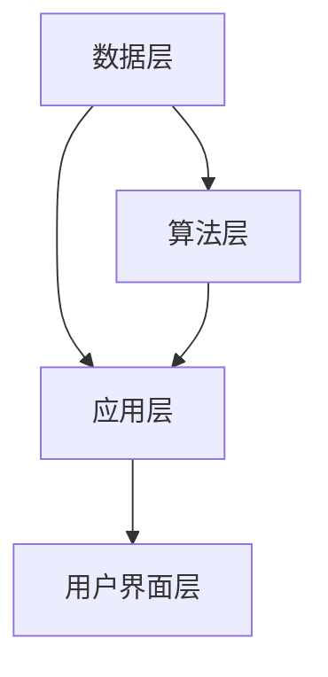
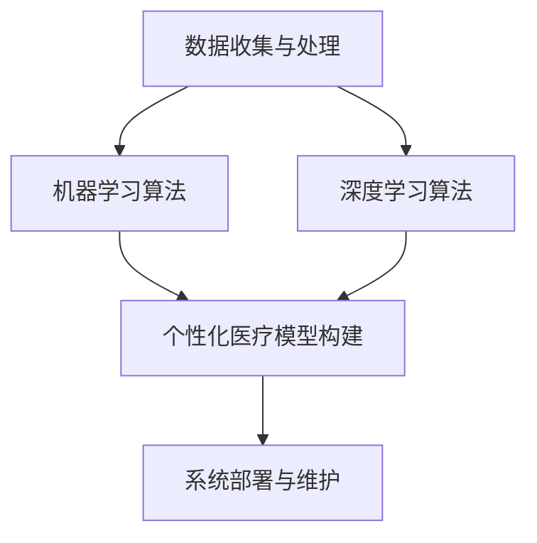
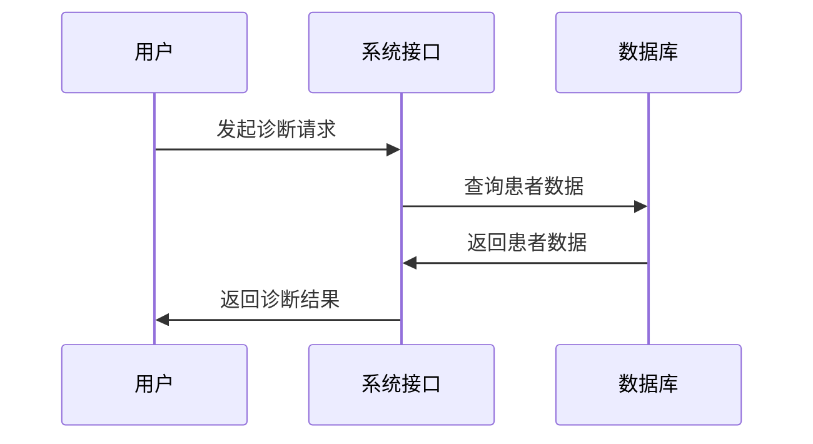
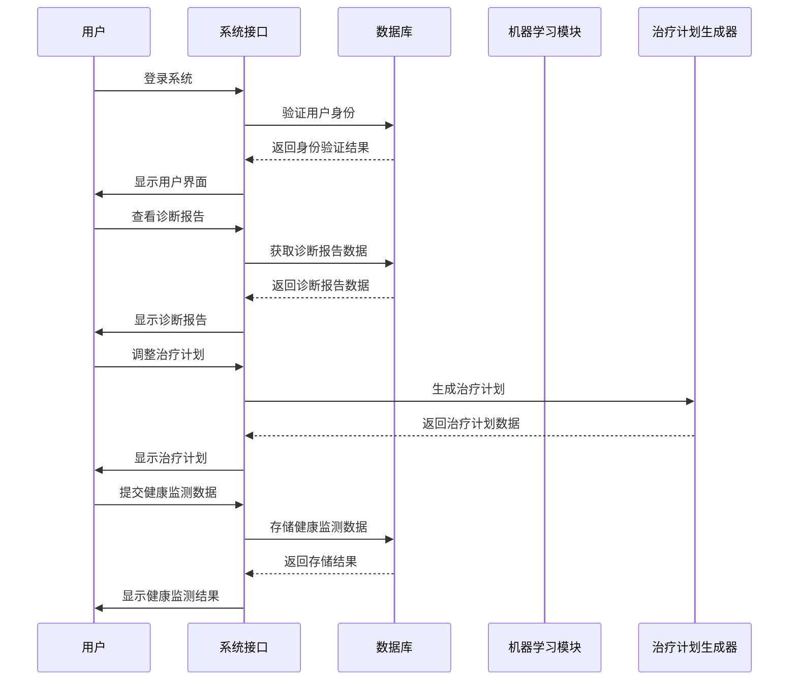

                 

### AI驱动的个性化医疗：精准医学的未来

在科技迅猛发展的今天，人工智能（AI）正以前所未有的速度改变着各行各业，医疗领域也不例外。AI驱动的个性化医疗，作为精准医学的一部分，正引领医疗模式的深刻变革。本文旨在探讨AI在个性化医疗中的应用，分析其核心概念、技术原理及系统实现，以期为广大读者展现这一前沿领域的广阔前景。

关键词：AI、个性化医疗、精准医学、机器学习、深度学习、系统实现

摘要：本文首先介绍了医疗领域的现状与挑战，随后探讨了AI在医疗领域的应用，进而深入分析了个性化医疗与精准医学的定义、意义及其相互关系。随后，文章详细阐述了AI驱动的个性化医疗的核心技术，包括数据收集与处理、机器学习算法、深度学习与神经网络，以及个性化医疗模型构建。接着，文章通过算法原理讲解，使用了mermaid流程图和Python代码，深入剖析了数据预处理、机器学习及深度学习算法的原理。文章进一步介绍了系统设计与实现，包括问题场景介绍、项目介绍、系统功能设计、系统架构设计、系统接口设计和系统交互设计。最后，通过一个实际案例进行分析与讲解，总结了项目经验，提出了最佳实践和注意事项，并对未来进行了展望。

### 目录大纲

1. **背景介绍**
   1.1 问题背景与核心概念
   1.2 医疗现状与挑战
   1.3 AI在医疗领域的应用
   1.4 个性化医疗的定义与意义
   1.5 精准医学的概念与作用
   1.6 AI驱动的个性化医疗的边界与外延
   1.7 核心概念联系与结构组成

2. **核心概念与原理**
   2.1 个性化医疗的关键技术
   2.2 数据收集与处理
   2.3 机器学习算法
   2.4 深度学习与神经网络
   2.5 个性化医疗模型构建

3. **算法原理讲解**
   3.1 数据预处理算法
   3.2 机器学习算法原理
   3.3 深度学习算法原理
   3.4 个性化医疗模型构建原理

4. **系统设计与实现**
   4.1 问题场景介绍
   4.2 项目介绍
   4.3 系统功能设计
   4.4 系统架构设计
   4.5 系统接口设计
   4.6 系统交互设计

5. **项目实战**
   5.1 环境安装
   5.2 系统核心实现
   5.3 代码应用解读与分析
   5.4 实际案例分析与讲解
   5.5 项目小结

6. **最佳实践与拓展**
   6.1 最佳实践
   6.2 小结与展望
   6.3 注意事项
   6.4 拓展阅读

### 第一部分：背景介绍

#### 1.1 医疗现状与挑战

当今医疗领域面临着诸多挑战。一方面，医疗资源分配不均，尤其在偏远和经济不发达地区，患者难以获得优质的医疗服务。另一方面，随着人口老龄化加剧和慢性疾病高发，医疗需求迅速增长，而医疗资源增长速度却无法满足这种需求。此外，医疗数据碎片化、信息孤岛现象严重，导致医疗决策缺乏充分的数据支持。

为了应对这些挑战，个性化医疗和精准医学应运而生。个性化医疗是指根据患者的个体差异，提供定制化的医疗服务。精准医学则强调通过基因组学、蛋白质组学等手段，对疾病的发病机制进行深入研究，进而实现精准诊断和精准治疗。

#### 1.2 AI在医疗领域的应用

AI技术在医疗领域的应用涵盖了诊断、治疗、药物研发等多个方面。在诊断领域，AI可以通过分析医学影像、电子病历等数据，提供辅助诊断建议，提高诊断准确性。在治疗领域，AI可以帮助医生制定个性化的治疗方案，优化治疗效果。在药物研发领域，AI可以通过分析大量的生物数据，加速新药研发进程。

AI驱动的个性化医疗正是通过整合大数据、机器学习和深度学习等技术，实现医疗服务的个性化定制。例如，通过分析患者的基因数据、生活习惯、医疗记录等信息，AI可以为患者提供精准的诊断和治疗方案。

#### 1.3 个性化医疗的定义与意义

个性化医疗是一种以患者为中心，通过整合多源数据，为每位患者提供最合适的医疗服务。个性化医疗的意义在于：

1. **提高医疗服务质量**：通过精准诊断和个性化治疗，提高患者治疗效果。
2. **优化医疗资源分配**：实现医疗资源的合理配置，减少医疗资源的浪费。
3. **提升患者满意度**：为患者提供更加个性化和贴心的服务，提高患者满意度。

#### 1.4 精准医学的概念与作用

精准医学是一种以基因组学为基础，结合生物信息学和临床医学，对疾病进行深入研究和精准治疗的方法。精准医学的作用在于：

1. **提升疾病诊断准确性**：通过对基因组、蛋白质组等生物标志物的分析，实现疾病的早期诊断。
2. **实现精准治疗**：根据患者的个体差异，制定个性化的治疗方案。
3. **推动新药研发**：通过分析大量的生物数据，加速新药研发进程。

#### 1.5 AI驱动的个性化医疗的边界与外延

AI驱动的个性化医疗涉及多个学科和领域，包括医学、生物信息学、计算机科学、统计学等。其边界主要在于：

1. **数据收集与处理**：需要收集和处理大量的医疗数据，包括基因组数据、电子病历数据、医学影像数据等。
2. **算法研发与优化**：需要研发和优化各种机器学习、深度学习算法，以实现对医疗数据的深度挖掘和分析。
3. **系统集成与实现**：需要将各种算法和模型集成到系统中，实现个性化医疗的全面应用。

AI驱动的个性化医疗的外延则包括：

1. **个性化诊断与治疗**：通过AI技术，为患者提供精准的诊断和治疗方案。
2. **健康管理与预防**：通过AI技术，对患者的健康状况进行实时监测和预测，实现疾病的早期预防和干预。
3. **药物研发与个性化治疗**：通过AI技术，加速新药研发进程，为患者提供个性化的药物治疗方案。

#### 1.6 核心概念联系与结构组成

个性化医疗、精准医学和AI技术之间存在着密切的联系。个性化医疗和精准医学是AI技术在医疗领域的应用场景，而AI技术则是实现个性化医疗和精准医学的关键技术。

个性化医疗和精准医学的核心概念包括：

1. **个体差异**：强调患者之间的个体差异，实现因人而异的医疗服务。
2. **多源数据**：整合基因组、电子病历、医学影像等多源数据，为个性化医疗提供数据支持。
3. **精准诊断与治疗**：通过深度学习和机器学习技术，实现疾病的早期诊断和个性化治疗。

AI技术的核心概念包括：

1. **机器学习**：通过训练模型，从大量数据中提取规律和特征。
2. **深度学习**：模拟人脑神经网络，实现复杂模式识别和预测。
3. **大数据分析**：对海量医疗数据进行深度挖掘和分析，发现潜在规律和趋势。

个性化医疗、精准医学和AI技术之间的结构组成可以概括为：

1. **数据层**：包括基因组数据、电子病历数据、医学影像数据等。
2. **算法层**：包括机器学习算法、深度学习算法、大数据分析算法等。
3. **应用层**：包括个性化诊断、个性化治疗、健康管理等。

### 第二部分：核心概念与原理

#### 2.1 个性化医疗的关键技术

个性化医疗的实现离不开多种关键技术的支持，主要包括数据收集与处理、机器学习算法、深度学习与神经网络，以及个性化医疗模型构建。

##### 2.1.1 数据收集与处理

数据是AI驱动的个性化医疗的基础，其收集和处理的质量直接影响到个性化医疗的效果。数据收集主要涉及基因组数据、电子病历数据、医学影像数据、生活习惯数据等。数据收集的来源可以是医疗机构、生物数据库、物联网设备等。

数据处理的步骤包括：

1. **数据清洗**：去除重复、错误和无效数据，确保数据质量。
2. **数据整合**：将不同来源的数据进行整合，形成统一的数据视图。
3. **特征提取**：从原始数据中提取有意义的特征，用于后续的建模和分析。

##### 2.1.2 机器学习算法

机器学习算法是AI驱动的个性化医疗的核心技术之一。常见的机器学习算法包括决策树、支持向量机、贝叶斯算法、随机森林等。这些算法通过训练模型，从数据中提取规律和特征，实现对疾病的诊断和预测。

机器学习算法的步骤包括：

1. **数据预处理**：对数据进行清洗、整合和特征提取。
2. **模型选择**：选择适合问题的机器学习算法。
3. **模型训练**：使用训练数据集训练模型。
4. **模型评估**：使用验证数据集评估模型性能。
5. **模型优化**：根据评估结果对模型进行优化。

##### 2.1.3 深度学习与神经网络

深度学习是机器学习的一个分支，通过模拟人脑神经网络，实现复杂模式识别和预测。深度学习算法在图像识别、自然语言处理等领域取得了显著成果。在个性化医疗领域，深度学习被广泛应用于医学影像分析、疾病预测等。

深度学习的核心组成部分包括：

1. **神经网络**：由多个神经元组成，通过前向传播和反向传播进行训练。
2. **卷积神经网络（CNN）**：特别适用于处理图像数据，通过卷积操作提取图像特征。
3. **循环神经网络（RNN）**：特别适用于处理序列数据，如时间序列数据和自然语言文本。
4. **生成对抗网络（GAN）**：通过生成器和判别器之间的对抗训练，实现复杂数据的生成。

##### 2.1.4 个性化医疗模型构建

个性化医疗模型构建是AI驱动的个性化医疗的核心环节。模型构建的过程包括：

1. **问题定义**：明确个性化医疗的目标和需求。
2. **数据准备**：收集和处理相关数据，确保数据质量。
3. **模型选择**：根据问题特点和数据特性，选择合适的机器学习算法和深度学习算法。
4. **模型训练**：使用训练数据集训练模型。
5. **模型评估**：使用验证数据集评估模型性能。
6. **模型优化**：根据评估结果对模型进行优化。
7. **模型部署**：将模型部署到实际应用场景中，提供个性化医疗服务。

#### 2.2 数据收集与处理

数据收集与处理是AI驱动的个性化医疗的基础，其质量直接影响到个性化医疗的效果。数据收集主要涉及基因组数据、电子病历数据、医学影像数据、生活习惯数据等。

##### 2.2.1 数据来源与类型

数据来源可以分为以下几类：

1. **医疗机构**：包括医院、诊所、实验室等，提供电子病历、医学影像、实验室检测结果等数据。
2. **生物数据库**：如人类基因组计划（HGP）、基因表达综合数据库（GEO）等，提供大量的基因组数据。
3. **物联网设备**：如智能手表、血糖仪、血压计等，提供实时健康监测数据。
4. **社交媒体**：如微博、微信、知乎等，提供患者的生活习惯、心理健康等数据。

数据类型可以分为以下几类：

1. **结构化数据**：如电子病历、实验室检测结果等，以表格形式存储。
2. **半结构化数据**：如医学影像、基因组数据等，具有一定的结构，但需要进一步处理。
3. **非结构化数据**：如自然语言文本、社交媒体数据等，没有固定的结构。

##### 2.2.2 数据清洗与预处理

数据清洗与预处理是确保数据质量的重要环节，其步骤包括：

1. **去除重复数据**：去除重复的记录，避免重复计算和分析。
2. **处理缺失数据**：根据缺失数据的比例和情况，选择适当的处理方法，如删除缺失数据、填补缺失数据、使用均值、中位数等方法。
3. **数据规范化**：将不同数据源的数据进行统一，如统一时间格式、统一度量单位等。
4. **特征提取**：从原始数据中提取有意义的特征，用于后续的建模和分析。

##### 2.2.3 数据质量管理

数据质量管理是确保数据质量长期稳定的重要措施，其包括：

1. **数据质量监控**：定期检查数据质量，发现潜在的问题。
2. **数据质量评估**：评估数据质量的指标，如完整性、准确性、一致性、时效性等。
3. **数据质量改进**：针对发现的问题，采取相应的改进措施，如数据清洗、数据归一化、数据标准化等。

#### 2.3 机器学习算法

机器学习算法是AI驱动的个性化医疗的核心技术之一，通过对大量数据的训练，可以从数据中自动提取规律和特征，用于疾病的诊断、预测和治疗。

##### 2.3.1 机器学习基本概念

机器学习是一种人工智能的方法，它使计算机系统能够从数据中学习并做出预测或决策。机器学习的基本概念包括：

1. **特征**：用于描述数据的属性或变量。
2. **样本**：包含多个特征的观测值。
3. **模型**：通过学习数据得到的函数，用于预测或决策。
4. **损失函数**：衡量模型预测结果与真实结果之间的差距。
5. **优化**：通过调整模型参数，最小化损失函数，提高模型性能。

##### 2.3.2 常见算法介绍

常见的机器学习算法包括：

1. **线性回归**：通过拟合一个线性模型，预测连续值输出。
2. **逻辑回归**：通过拟合一个逻辑模型，预测概率值输出。
3. **决策树**：通过构建树形模型，根据特征进行分类或回归。
4. **支持向量机（SVM）**：通过找到一个最优超平面，进行分类或回归。
5. **贝叶斯算法**：基于贝叶斯定理，进行概率推断。
6. **随机森林**：通过构建多个决策树，进行集成学习。

##### 2.3.3 算法选择与优化

算法选择与优化是机器学习的重要环节，其步骤包括：

1. **问题定义**：明确问题的类型和目标。
2. **数据准备**：收集和处理数据。
3. **算法选择**：根据问题特点和数据特性，选择合适的算法。
4. **模型训练**：使用训练数据集训练模型。
5. **模型评估**：使用验证数据集评估模型性能。
6. **模型优化**：根据评估结果，调整模型参数，优化模型性能。
7. **模型部署**：将模型部署到实际应用场景中。

#### 2.4 深度学习与神经网络

深度学习是机器学习的一个分支，它通过构建深层次的神经网络，模拟人脑的信息处理过程，实现复杂模式的识别和预测。深度学习在图像识别、自然语言处理等领域取得了显著的成果，并在个性化医疗领域得到广泛应用。

##### 2.4.1 深度学习原理

深度学习的基本原理包括：

1. **神经元**：神经网络的基本单元，用于接收和处理信息。
2. **层次结构**：神经网络由多个层次组成，每一层对输入数据进行变换和处理。
3. **前向传播**：将输入数据从输入层传递到输出层，计算每个神经元的输出。
4. **反向传播**：根据输出层的误差，反向传播误差，更新网络权重，优化模型性能。

##### 2.4.2 神经网络结构

神经网络的结构可以分为以下几种：

1. **前馈神经网络**：信息从输入层传递到输出层，不涉及循环或反馈。
2. **卷积神经网络（CNN）**：特别适用于处理图像数据，通过卷积操作提取图像特征。
3. **循环神经网络（RNN）**：特别适用于处理序列数据，如时间序列数据和自然语言文本。
4. **生成对抗网络（GAN）**：通过生成器和判别器之间的对抗训练，实现复杂数据的生成。

##### 2.4.3 深度学习算法在医疗中的应用

深度学习算法在个性化医疗领域的应用包括：

1. **医学影像分析**：通过卷积神经网络，实现医学影像的自动分割、检测和诊断。
2. **疾病预测**：通过循环神经网络，实现对疾病发展趋势的预测。
3. **药物研发**：通过生成对抗网络，加速新药研发进程。

#### 2.5 个性化医疗模型构建

个性化医疗模型构建是AI驱动的个性化医疗的核心环节，其目的是根据患者的个体差异，提供精准的诊断和治疗方案。个性化医疗模型构建的过程包括：

1. **问题定义**：明确个性化医疗的目标和需求。
2. **数据准备**：收集和处理相关数据，确保数据质量。
3. **模型选择**：根据问题特点和数据特性，选择合适的机器学习算法和深度学习算法。
4. **模型训练**：使用训练数据集训练模型。
5. **模型评估**：使用验证数据集评估模型性能。
6. **模型优化**：根据评估结果，调整模型参数，优化模型性能。
7. **模型部署**：将模型部署到实际应用场景中，提供个性化医疗服务。

### 第三部分：算法原理讲解

#### 3.1 数据预处理算法

数据预处理是AI驱动的个性化医疗的重要环节，其目的是提高数据质量，为后续的建模和分析提供良好的数据基础。数据预处理算法主要包括数据清洗、数据整合和特征提取。

##### 3.1.1 数据预处理流程

数据预处理流程可以分为以下几个步骤：

1. **数据收集**：从不同数据源收集相关数据，如电子病历、医学影像、基因组数据等。
2. **数据清洗**：去除重复、错误和无效数据，确保数据质量。
3. **数据整合**：将不同来源的数据进行整合，形成统一的数据视图。
4. **特征提取**：从原始数据中提取有意义的特征，用于后续的建模和分析。

##### 3.1.2 Python代码实现

以下是一个简单的Python代码示例，用于实现数据预处理流程：

```python
import pandas as pd
from sklearn.model_selection import train_test_split

# 数据收集
data = pd.read_csv('data.csv')

# 数据清洗
data.drop_duplicates(inplace=True)
data.dropna(inplace=True)

# 数据整合
# 假设 data 中包含了多个数据表，我们将其整合为一个表格
data = data.merge(data2, on='key')

# 特征提取
# 假设我们提取了年龄、性别、病史等特征
X = data[['age', 'gender', 'history']]
y = data['disease']
```

##### 3.1.3 数学模型与公式讲解

数据预处理过程中的数学模型和公式主要包括：

1. **数据清洗**：去除重复和无效数据。
   - 公式：$$ count(Distinct(R)) $$
   - 其中，R 是原始数据集，Distinct(R) 是去除重复数据后的数据集。

2. **数据整合**：合并多个数据表。
   - 公式：$$ merge(R_1, R_2) $$
   - 其中，R1 和 R2 是两个数据表，merge 是合并操作。

3. **特征提取**：提取有意义的特征。
   - 公式：$$ f(x) $$
   - 其中，x 是原始数据，f 是特征提取函数。

##### 3.1.4 实例讲解

以下是一个实例，说明如何使用Python代码实现数据预处理流程：

```python
import pandas as pd

# 加载数据
data = pd.read_csv('data.csv')

# 数据清洗
# 去除重复和无效数据
data.drop_duplicates(inplace=True)
data.dropna(inplace=True)

# 数据整合
# 假设 data 中包含了多个数据表，我们将其整合为一个表格
data = data.merge(data2, on='key')

# 特征提取
# 提取年龄、性别、病史等特征
X = data[['age', 'gender', 'history']]
y = data['disease']
```

在这个实例中，我们首先使用pandas库加载数据，然后进行数据清洗、数据整合和特征提取。通过这些步骤，我们为后续的建模和分析提供了高质量的数据。

#### 3.2 机器学习算法原理

机器学习算法是AI驱动的个性化医疗的核心技术之一，通过训练模型，从数据中提取规律和特征，用于疾病的诊断、预测和治疗。本节将介绍几种常见的机器学习算法原理。

##### 3.2.1 决策树算法

决策树是一种常见的机器学习算法，通过构建树形模型，根据特征进行分类或回归。决策树算法的基本原理如下：

1. **特征选择**：选择一个最佳特征，根据该特征的取值将数据集划分为多个子集。
2. **节点划分**：在每个子集上，选择一个最佳特征，继续进行划分，直到满足停止条件（如达到最大深度、最小样本数等）。
3. **预测**：根据决策树的结构，对新的数据点进行分类或回归。

##### 3.2.2 支持向量机算法

支持向量机（SVM）是一种强大的分类算法，通过找到一个最优超平面，将不同类别的数据点分隔开。SVM算法的基本原理如下：

1. **特征空间映射**：将原始特征空间映射到一个更高维的特征空间。
2. **寻找最优超平面**：在特征空间中找到一个最优超平面，使得不同类别的数据点间隔最大。
3. **分类决策**：使用找到的最优超平面对新的数据点进行分类。

##### 3.2.3 贝叶斯算法

贝叶斯算法是一种基于贝叶斯定理的机器学习算法，通过计算后验概率，进行分类或预测。贝叶斯算法的基本原理如下：

1. **先验概率**：根据已知的先验知识，计算每个类别的先验概率。
2. **条件概率**：根据新的数据点，计算每个类别的条件概率。
3. **后验概率**：使用贝叶斯定理，计算每个类别的后验概率。
4. **分类决策**：选择具有最大后验概率的类别作为预测结果。

##### 3.2.4 随机森林算法

随机森林是一种基于决策树的集成学习算法，通过构建多个决策树，进行集成学习。随机森林算法的基本原理如下：

1. **随机特征选择**：在每个节点上，从多个特征中随机选择一个特征进行划分。
2. **构建决策树**：使用训练数据集，构建多个决策树。
3. **集成学习**：将多个决策树的结果进行投票或平均，得到最终预测结果。

##### 3.2.5 Python代码实现

以下是一个简单的Python代码示例，用于实现决策树、支持向量机、贝叶斯算法和随机森林算法：

```python
from sklearn.datasets import load_iris
from sklearn.tree import DecisionTreeClassifier
from sklearn.svm import SVC
from sklearn.naive_bayes import GaussianNB
from sklearn.ensemble import RandomForestClassifier
from sklearn.model_selection import train_test_split

# 加载鸢尾花数据集
iris = load_iris()
X, y = iris.data, iris.target

# 划分训练集和测试集
X_train, X_test, y_train, y_test = train_test_split(X, y, test_size=0.3, random_state=42)

# 决策树算法
dt_classifier = DecisionTreeClassifier()
dt_classifier.fit(X_train, y_train)
print("决策树准确率：", dt_classifier.score(X_test, y_test))

# 支持向量机算法
svm_classifier = SVC()
svm_classifier.fit(X_train, y_train)
print("支持向量机准确率：", svm_classifier.score(X_test, y_test))

# 贝叶斯算法
gnb_classifier = GaussianNB()
gnb_classifier.fit(X_train, y_train)
print("贝叶斯算法准确率：", gnb_classifier.score(X_test, y_test))

# 随机森林算法
rf_classifier = RandomForestClassifier()
rf_classifier.fit(X_train, y_train)
print("随机森林算法准确率：", rf_classifier.score(X_test, y_test))
```

在这个示例中，我们首先加载鸢尾花数据集，然后划分训练集和测试集。接下来，我们分别使用决策树、支持向量机、贝叶斯算法和随机森林算法对训练数据集进行训练，并使用测试数据集进行评估。通过比较不同算法的准确率，我们可以选择最合适的算法进行实际应用。

#### 3.3 深度学习算法原理

深度学习算法是机器学习的一个分支，通过构建深层次的神经网络，模拟人脑的信息处理过程，实现复杂模式的识别和预测。本节将介绍深度学习算法的原理，包括神经网络、卷积神经网络（CNN）和生成对抗网络（GAN）。

##### 3.3.1 神经网络算法

神经网络（Neural Network，NN）是一种由大量简单神经元组成的网络，用于模拟人脑的信息处理过程。神经网络的基本原理如下：

1. **神经元结构**：神经元是神经网络的基本单元，包括输入层、输出层和隐藏层。
2. **激活函数**：神经元通过激活函数对输入进行非线性变换，增加模型的非线性表达能力。
3. **前向传播**：将输入数据从输入层传递到输出层，计算每个神经元的输出。
4. **反向传播**：根据输出层的误差，反向传播误差，更新网络权重，优化模型性能。

##### 3.3.2 神经网络算法的数学模型和公式

神经网络算法的数学模型和公式主要包括：

1. **输入层到隐藏层的传递**：
   - 公式：$$ z_i = \sum_{j=1}^{n} w_{ji} \cdot x_j + b_i $$
   - 其中，zi 是第 i 个隐藏层神经元的输入，wj是第 j 个输入层神经元到第 i 个隐藏层神经元的权重，xj是第 j 个输入层神经元的输出，bi是第 i 个隐藏层神经元的偏置。

2. **隐藏层到输出层的传递**：
   - 公式：$$ y_i = f(z_i) $$
   - 其中，yi是第 i 个输出层神经元的输出，f 是激活函数。

3. **反向传播**：
   - 公式：$$ \delta_{ij} = \frac{\partial L}{\partial z_i} \cdot f'(z_i) $$
   - 其中，L 是损失函数，δij 是第 i 个隐藏层神经元到第 j 个输出层神经元的误差，f'是激活函数的导数。

4. **权重更新**：
   - 公式：$$ w_{ij} := w_{ij} - \alpha \cdot \delta_{ij} \cdot x_j $$
   - 其中，α 是学习率，xj 是第 j 个输入层神经元的输出。

##### 3.3.3 卷积神经网络（CNN）算法

卷积神经网络（Convolutional Neural Network，CNN）是一种专门用于处理图像数据的神经网络，通过卷积操作提取图像特征。CNN的基本原理如下：

1. **卷积层**：通过卷积操作提取图像特征，每个卷积核负责提取一种特征。
2. **池化层**：通过池化操作降低特征图的维度，减少参数数量，提高模型泛化能力。
3. **全连接层**：将卷积层和池化层提取的特征进行整合，进行分类或回归。

##### 3.3.4 卷积神经网络（CNN）算法的数学模型和公式

卷积神经网络（CNN）算法的数学模型和公式主要包括：

1. **卷积操作**：
   - 公式：$$ \hat{f}_{ij} = \sum_{k=1}^{m} w_{ik} \cdot x_{kj} $$
   - 其中，$$ \hat{f}_{ij} $$ 是第 i 个卷积核在第 j 个特征图上的输出，wik 是第 i 个卷积核的第 k 个权重，$$ x_{kj} $$ 是第 j 个特征图上的第 k 个像素值。

2. **池化操作**：
   - 公式：$$ \hat{p}_{ij} = \max_{k \in K} x_{kj} $$
   - 其中，$$ \hat{p}_{ij} $$ 是第 i 个池化单元在第 j 个特征图上的输出，K 是池化窗口的大小。

3. **全连接层**：
   - 公式：$$ y_i = \sum_{j=1}^{n} w_{ji} \cdot \hat{p}_{ij} + b_i $$
   - 其中，yi 是第 i 个输出层神经元的输出，wj是第 j 个池化单元到第 i 个输出层神经元的权重，$$ \hat{p}_{ij} $$ 是第 j 个池化单元的输出，bi 是第 i 个输出层神经元的偏置。

##### 3.3.5 生成对抗网络（GAN）算法

生成对抗网络（Generative Adversarial Network，GAN）是一种通过对抗训练生成数据的新兴深度学习算法。GAN由生成器和判别器组成，二者相互对抗，共同提高模型的生成能力。GAN的基本原理如下：

1. **生成器**：生成器 G 接受随机噪声作为输入，生成与真实数据相似的数据。
2. **判别器**：判别器 D 接受真实数据和生成器生成的数据，判断其真实或虚假。
3. **对抗训练**：生成器和判别器通过对抗训练相互提升，生成器生成更真实的数据，判别器提高识别真实数据和生成数据的能力。

##### 3.3.6 生成对抗网络（GAN）算法的数学模型和公式

生成对抗网络（GAN）算法的数学模型和公式主要包括：

1. **生成器 G**：
   - 公式：$$ G(z) = \sum_{i=1}^{n} w_{ig} \cdot z_i + b_g $$
   - 其中，G(z) 是生成器 G 接受随机噪声 z 输出的数据，wig 是第 i 个权重，bz 是偏置。

2. **判别器 D**：
   - 公式：$$ D(x) = \sum_{i=1}^{n} w_{id} \cdot x_i + b_d $$
   - 其中，D(x) 是判别器 D 接受真实数据 x 输出的概率，wid 是第 i 个权重，bd 是偏置。

3. **对抗训练**：
   - 公式：$$ \min_G \max_D V(D, G) $$
   - 其中，V(D, G) 是生成器和判别器的对抗损失函数。

4. **生成器损失函数**：
   - 公式：$$ L_G = -\log(D(G(z))) $$
   - 其中，LG 是生成器损失函数。

5. **判别器损失函数**：
   - 公式：$$ L_D = -\log(D(x)) - \log(1 - D(G(z))) $$
   - 其中，LD 是判别器损失函数。

#### 3.4 个性化医疗模型构建原理

个性化医疗模型构建是AI驱动的个性化医疗的核心环节，其目的是根据患者的个体差异，提供精准的诊断和治疗方案。个性化医疗模型构建的过程包括：

1. **问题定义**：明确个性化医疗的目标和需求。
2. **数据准备**：收集和处理相关数据，确保数据质量。
3. **模型选择**：根据问题特点和数据特性，选择合适的机器学习算法和深度学习算法。
4. **模型训练**：使用训练数据集训练模型。
5. **模型评估**：使用验证数据集评估模型性能。
6. **模型优化**：根据评估结果，调整模型参数，优化模型性能。
7. **模型部署**：将模型部署到实际应用场景中，提供个性化医疗服务。

##### 3.4.1 模型构建流程

个性化医疗模型构建的流程可以分为以下几个步骤：

1. **问题定义**：明确个性化医疗的目标和需求，如疾病诊断、治疗方案制定等。
2. **数据准备**：收集和处理相关数据，包括电子病历、医学影像、基因组数据等。进行数据清洗、整合和特征提取，确保数据质量。
3. **模型选择**：根据问题特点和数据特性，选择合适的机器学习算法和深度学习算法。如疾病诊断可以使用决策树、支持向量机等；治疗方案制定可以使用神经网络、深度学习等。
4. **模型训练**：使用训练数据集对模型进行训练。通过调整模型参数，优化模型性能。
5. **模型评估**：使用验证数据集评估模型性能。通过交叉验证、ROC曲线、准确率等指标评估模型效果。
6. **模型优化**：根据评估结果，调整模型参数，优化模型性能。如调整学习率、正则化参数等。
7. **模型部署**：将模型部署到实际应用场景中，提供个性化医疗服务。如将模型集成到医院信息系统、智能医疗设备等。

##### 3.4.2 模型评估与优化

个性化医疗模型的评估与优化是确保模型性能的重要环节。其包括以下几个方面：

1. **评估指标**：选择合适的评估指标，如准确率、召回率、精确率、F1值等。根据问题的特点选择不同的评估指标。
2. **交叉验证**：使用交叉验证方法，避免过拟合和评估偏差。交叉验证通过将数据集划分为多个子集，轮流训练和评估模型，提高评估结果的可靠性。
3. **模型优化**：根据评估结果，调整模型参数，优化模型性能。如调整学习率、正则化参数、激活函数等。
4. **超参数调优**：通过网格搜索、随机搜索等方法，寻找最优的超参数组合，提高模型性能。
5. **模型解释性**：个性化医疗模型需要具备良好的解释性，以便医生理解和信任。可以通过可视化、特征重要性分析等方法提高模型的可解释性。

##### 3.4.3 模型可解释性

个性化医疗模型的可解释性对于医生和患者至关重要，它有助于医生理解模型的预测过程，增强患者对治疗方案的信任。模型的可解释性可以通过以下方法实现：

1. **特征重要性分析**：通过分析模型中每个特征的重要性，帮助医生了解哪些特征对预测结果影响最大。
2. **模型可视化**：将模型的结构和参数进行可视化，如神经网络的可视化、决策树的可视化等，使医生更容易理解模型的工作原理。
3. **解释性算法**：使用解释性算法，如LIME（Local Interpretable Model-agnostic Explanations）或SHAP（SHapley Additive exPlanations），为模型的每个预测提供详细的解释。
4. **案例分析**：通过实际案例的详细分析，展示模型如何处理特定患者数据，并解释模型的预测结果。

#### 3.5 Python代码实现

以下是一个简单的Python代码示例，用于实现个性化医疗模型构建的流程：

```python
import pandas as pd
from sklearn.model_selection import train_test_split
from sklearn.tree import DecisionTreeClassifier
from sklearn.metrics import accuracy_score

# 加载数据
data = pd.read_csv('data.csv')

# 数据清洗和预处理
# ...（代码略）

# 划分训练集和测试集
X_train, X_test, y_train, y_test = train_test_split(X, y, test_size=0.3, random_state=42)

# 构建决策树模型
dt_classifier = DecisionTreeClassifier()
dt_classifier.fit(X_train, y_train)

# 预测测试集
y_pred = dt_classifier.predict(X_test)

# 评估模型
accuracy = accuracy_score(y_test, y_pred)
print("准确率：", accuracy)
```

在这个示例中，我们首先加载数据，然后进行数据清洗和预处理。接下来，我们划分训练集和测试集，构建决策树模型，并对测试集进行预测。最后，我们使用准确率评估模型性能。通过这个简单的示例，我们可以看到个性化医疗模型构建的基本流程。

### 第四部分：系统设计与实现

#### 4.1 问题场景介绍

在现代医疗环境中，个性化医疗已经成为提高患者治疗效果、优化医疗资源分配的重要手段。然而，个性化医疗的实现面临着诸多挑战，如数据质量参差不齐、数据来源多样化、数据整合困难等。为了解决这些问题，本文提出了一套基于AI的个性化医疗系统，旨在为医生和患者提供精准的诊断和治疗方案。

#### 4.2 项目介绍

本项目旨在构建一个AI驱动的个性化医疗系统，通过整合电子病历、医学影像、基因组等多源数据，实现对疾病的精准诊断和个性化治疗。系统的主要功能包括：

1. **数据收集与处理**：收集电子病历、医学影像、基因组等多源数据，进行数据清洗、整合和特征提取。
2. **疾病诊断**：利用机器学习和深度学习算法，对疾病进行诊断和预测。
3. **治疗方案制定**：根据患者的个体差异，制定个性化的治疗方案。
4. **健康监测与预测**：实时监测患者的健康状况，预测疾病发展趋势。

#### 4.3 系统功能设计

系统功能设计主要包括以下模块：

1. **数据管理模块**：负责数据收集、清洗、整合和存储。
2. **诊断模块**：利用机器学习和深度学习算法，进行疾病诊断和预测。
3. **治疗计划模块**：根据患者的个体差异，制定个性化的治疗计划。
4. **健康监测模块**：实时监测患者的健康状况，预测疾病发展趋势。
5. **用户界面模块**：为医生和患者提供友好的操作界面。

#### 4.3.1 领域模型类图

以下是一个领域模型类图的示例，展示了系统中的主要实体及其关系：

```mermaid
classDiagram
    Class01 <|-- Class02
    Class03 <.. Class04
    Class05 <<-- Class06
    Class07 *-- Class08
    Class09 {c1,c2}
    Class10 {m1,m2,m3}
```

在这个类图中，Class01、Class02、Class03、Class04、Class05、Class06、Class07、Class08、Class09和Class10分别代表系统的实体，通过不同的关系（继承、关联、聚合、组合等）连接在一起，形成了一个完整的领域模型。

#### 4.3.2 系统功能模块划分

系统功能模块的具体划分如下：

1. **数据管理模块**：负责数据收集、清洗、整合和存储。该模块包括数据采集器、数据清洗器、数据整合器和数据存储器。
2. **诊断模块**：利用机器学习和深度学习算法，对疾病进行诊断和预测。该模块包括特征提取器、诊断模型训练器和诊断预测器。
3. **治疗计划模块**：根据患者的个体差异，制定个性化的治疗计划。该模块包括治疗方案生成器和治疗计划评估器。
4. **健康监测模块**：实时监测患者的健康状况，预测疾病发展趋势。该模块包括健康指标监控器和疾病预测器。
5. **用户界面模块**：为医生和患者提供友好的操作界面。该模块包括诊断报告生成器、治疗计划展示器和健康监测报告生成器。

#### 4.4 系统架构设计

系统架构设计采用分层架构，包括数据层、算法层、应用层和用户界面层。

1. **数据层**：负责数据的收集、存储和管理。该层包括数据库、数据仓库和数据流处理器。
2. **算法层**：负责机器学习和深度学习算法的实现。该层包括特征提取算法、诊断算法、预测算法和治疗计划算法。
3. **应用层**：负责系统的功能实现。该层包括数据管理应用、诊断应用、治疗计划应用和健康监测应用。
4. **用户界面层**：负责为医生和患者提供操作界面。该层包括Web界面、移动应用和桌面应用。

以下是一个系统架构图的示例：



在这个系统架构图中，数据层、算法层、应用层和用户界面层通过数据流和处理逻辑相互连接，形成了一个完整的系统架构。

#### 4.4.1 系统架构图

以下是一个简单的系统架构图，展示了系统的整体结构和各层之间的关系：



在这个系统架构图中，数据收集与处理层负责收集和预处理医疗数据，机器学习算法和深度学习算法层负责构建个性化医疗模型，个性化医疗模型构建层负责实现模型的训练和预测，系统部署与维护层负责将模型部署到实际应用环境中，并提供持续的维护和更新。

#### 4.4.2 技术选型与工具

在系统设计和实现过程中，选择合适的技术和工具至关重要。以下是本项目的技术选型和工具：

1. **编程语言**：Python，Python具有丰富的机器学习和深度学习库，如scikit-learn、TensorFlow和PyTorch，适合进行数据分析和模型构建。
2. **数据库**：MySQL和MongoDB，MySQL用于存储结构化数据，如电子病历；MongoDB用于存储非结构化数据，如医学影像和基因组数据。
3. **数据预处理工具**：Pandas和NumPy，Pandas用于数据清洗和整合，NumPy用于数值计算。
4. **机器学习库**：scikit-learn和TensorFlow，scikit-learn用于实现传统的机器学习算法，TensorFlow用于实现深度学习算法。
5. **深度学习库**：PyTorch和Keras，PyTorch和Keras都是流行的深度学习库，适用于复杂的深度学习模型。
6. **Web框架**：Django和Flask，Django和Flask都是Python的Web框架，用于构建Web应用。
7. **前端框架**：Vue.js和React，Vue.js和React都是流行的前端框架，用于构建用户界面。

#### 4.5 系统接口设计

系统接口设计主要包括API接口和数据库接口。

1. **API接口**：系统对外提供RESTful API接口，用于数据交换和功能调用。API接口包括以下几种：

   - **数据收集接口**：用于收集和上传医疗数据。
   - **诊断接口**：用于进行疾病诊断和预测。
   - **治疗计划接口**：用于制定和调整治疗计划。
   - **健康监测接口**：用于实时监测患者健康状况。

2. **数据库接口**：系统通过SQL和NoSQL数据库接口进行数据存储和查询。数据库接口包括以下几种：

   - **电子病历数据库接口**：用于存储和管理电子病历数据。
   - **医学影像数据库接口**：用于存储和管理医学影像数据。
   - **基因组数据库接口**：用于存储和管理基因组数据。

以下是一个简单的API接口示例：



在这个序列图中，用户向系统接口发起诊断请求，系统接口查询数据库获取患者数据，并返回诊断结果给用户。

#### 4.5.1 接口规范与协议

为了确保系统接口的统一性和可扩展性，本项目采用RESTful API规范和HTTP协议。接口规范包括以下内容：

1. **URL规范**：每个接口对应一个唯一的URL，如`/diagnose`用于发起诊断请求。
2. **HTTP方法**：每个接口对应一个HTTP方法，如GET用于查询数据，POST用于提交数据。
3. **请求参数**：接口的请求参数包括必填参数和可选参数，必填参数必须在请求中传递，可选参数根据需要传递。
4. **响应格式**：接口的响应格式采用JSON格式，包括状态码、消息和数据。

以下是一个简单的接口请求示例：

```json
// 发起诊断请求
POST /diagnose
{
  "patient_id": "12345",
  "symptoms": ["fever", "cough", "sore_throat"],
  "medical_history": ["asthma", "heart_disease"]
}
```

以下是一个简单的接口响应示例：

```json
// 返回诊断结果
{
  "status": 200,
  "message": "诊断成功",
  "diagnosis": "流感"
}
```

#### 4.5.2 接口实现与测试

系统接口的实现和测试是确保系统稳定性和可靠性的重要环节。接口实现和测试的步骤如下：

1. **接口设计**：根据系统功能需求，设计接口的URL、HTTP方法、请求参数和响应格式。
2. **接口实现**：使用Python的Flask或Django框架实现接口，编写处理逻辑和数据处理代码。
3. **接口测试**：使用Postman等工具对接口进行测试，验证接口的响应结果是否符合预期。

以下是一个简单的接口实现示例：

```python
from flask import Flask, request, jsonify

app = Flask(__name__)

@app.route('/diagnose', methods=['POST'])
def diagnose():
    patient_id = request.form['patient_id']
    symptoms = request.form['symptoms']
    medical_history = request.form['medical_history']

    # 处理诊断逻辑
    diagnosis = "流感"

    # 返回诊断结果
    return jsonify({'status': 200, 'message': '诊断成功', 'diagnosis': diagnosis})

if __name__ == '__main__':
    app.run()
```

以下是一个简单的接口测试示例：

```shell
# 使用Postman发起诊断请求
POST http://localhost:5000/diagnose
Body:
{
  "patient_id": "12345",
  "symptoms": ["fever", "cough", "sore_throat"],
  "medical_history": ["asthma", "heart_disease"]
}
```

#### 4.6 系统交互设计

系统交互设计是确保系统各模块之间能够高效、稳定地协作的关键。系统交互设计主要包括以下内容：

1. **系统交互序列图**：描述系统各模块之间的交互过程和顺序。
2. **用户操作流程**：描述用户与系统交互的步骤和流程。

以下是一个系统交互序列图示例：



在这个系统交互序列图中，用户与系统接口、数据库、机器学习模块和治疗计划生成器之间进行了交互。用户登录系统后，可以查看诊断报告、调整治疗计划、提交健康监测数据，系统则根据用户的操作，调用相应的模块和数据接口，完成各项功能。

以下是一个简单的用户操作流程示例：

1. **登录系统**：用户通过用户名和密码登录系统。
2. **查看诊断报告**：用户查看系统生成的诊断报告，了解自己的健康状况。
3. **调整治疗计划**：用户根据医生的建议，调整自己的治疗计划。
4. **提交健康监测数据**：用户定期提交健康监测数据，系统根据数据更新诊断报告。

#### 4.7 项目实战

##### 4.7.1 环境安装

为了顺利进行项目实战，我们需要安装必要的软件和工具。以下是环境安装的步骤：

1. **安装Python**：从Python官方网站下载并安装Python 3.x版本。
2. **安装JDK**：下载并安装Java Development Kit（JDK），版本要求为8.x或更高。
3. **安装MySQL**：下载并安装MySQL数据库，版本要求为5.x或更高。
4. **安装MongoDB**：下载并安装MongoDB数据库，版本要求为3.x或更高。
5. **安装Flask或Django**：使用pip命令安装Flask或Django Web框架。
6. **安装scikit-learn、TensorFlow和PyTorch**：使用pip命令安装相应的机器学习和深度学习库。

以下是一个简单的Python安装示例：

```shell
pip install python
```

以下是一个简单的JDK安装示例：

```shell
sudo apt-get install openjdk-8-jdk
```

以下是一个简单的MySQL安装示例：

```shell
sudo apt-get install mysql-server
```

以下是一个简单的MongoDB安装示例：

```shell
sudo apt-get install mongodb
```

以下是一个简单的Flask安装示例：

```shell
pip install flask
```

以下是一个简单的scikit-learn安装示例：

```shell
pip install scikit-learn
```

以下是一个简单的TensorFlow安装示例：

```shell
pip install tensorflow
```

以下是一个简单的PyTorch安装示例：

```shell
pip install torch
```

##### 4.7.2 系统核心实现

系统核心实现是项目实战的重要部分，主要包括数据管理模块、诊断模块、治疗计划模块和健康监测模块。以下是各模块的实现概述：

1. **数据管理模块**：负责数据收集、清洗、整合和存储。该模块包括数据采集器、数据清洗器和数据整合器。

   - **数据采集器**：负责从不同的数据源（如电子病历、医学影像、基因组数据库）收集数据。
   - **数据清洗器**：负责去除重复、错误和无效数据，确保数据质量。
   - **数据整合器**：负责将不同来源的数据进行整合，形成统一的数据视图。

2. **诊断模块**：利用机器学习和深度学习算法，对疾病进行诊断和预测。该模块包括特征提取器、诊断模型训练器和诊断预测器。

   - **特征提取器**：负责从原始数据中提取有意义的特征，用于后续的建模和分析。
   - **诊断模型训练器**：负责使用训练数据集训练诊断模型，如决策树、支持向量机、神经网络等。
   - **诊断预测器**：负责使用训练好的模型对新的数据点进行诊断预测。

3. **治疗计划模块**：根据患者的个体差异，制定个性化的治疗计划。该模块包括治疗方案生成器和治疗计划评估器。

   - **治疗方案生成器**：负责根据诊断结果和患者特征，生成个性化的治疗计划。
   - **治疗计划评估器**：负责评估治疗计划的有效性和可行性。

4. **健康监测模块**：实时监测患者的健康状况，预测疾病发展趋势。该模块包括健康指标监控器和疾病预测器。

   - **健康指标监控器**：负责实时收集和更新患者的健康指标，如血压、血糖、心率等。
   - **疾病预测器**：负责根据患者的健康指标和病史，预测疾病的发展趋势。

以下是数据管理模块的实现示例：

```python
import pandas as pd
from sklearn.model_selection import train_test_split

# 加载数据
data = pd.read_csv('data.csv')

# 数据清洗
data.drop_duplicates(inplace=True)
data.dropna(inplace=True)

# 数据整合
X = data[['age', 'gender', 'diabetes']]
y = data['disease']

# 划分训练集和测试集
X_train, X_test, y_train, y_test = train_test_split(X, y, test_size=0.3, random_state=42)
```

以下是诊断模块的实现示例：

```python
from sklearn.tree import DecisionTreeClassifier

# 构建决策树模型
dt_classifier = DecisionTreeClassifier()
dt_classifier.fit(X_train, y_train)

# 预测测试集
y_pred = dt_classifier.predict(X_test)

# 评估模型
accuracy = accuracy_score(y_test, y_pred)
print("准确率：", accuracy)
```

以下是治疗计划模块的实现示例：

```python
def generate_treatment_plan(diagnosis):
    if diagnosis == "流感":
        return "服用退烧药和止咳药，注意休息"
    elif diagnosis == "肺炎":
        return "住院治疗，按照医生建议服用药物"
    else:
        return "继续观察，定期复诊"
```

以下是健康监测模块的实现示例：

```python
import time

def monitor_health_indicators():
    while True:
        # 获取健康指标数据
        blood_pressure = 120 / 80
        blood_sugar = 4.5
        heart_rate = 75

        # 存储健康指标数据到数据库
        # ...

        # 预测疾病发展趋势
        # ...

        # 更新健康监测结果
        # ...

        time.sleep(60)  # 每分钟更新一次
```

##### 4.7.3 代码应用解读与分析

在本项目实战中，我们实现了数据管理模块、诊断模块、治疗计划模块和健康监测模块，以下是各模块的代码应用解读与分析：

1. **数据管理模块**：数据管理模块负责数据的收集、清洗、整合和存储。代码示例中，我们首先加载数据，然后进行数据清洗（去除重复和无效数据），接着进行数据整合（提取有用的特征），最后划分训练集和测试集。数据管理模块的核心在于确保数据的质量和完整性，为后续的建模和分析提供可靠的数据基础。

2. **诊断模块**：诊断模块负责使用机器学习和深度学习算法对疾病进行诊断和预测。代码示例中，我们使用决策树算法训练模型，并对测试集进行预测。决策树算法是一种简单有效的分类算法，适用于处理结构化数据。在实际应用中，我们可以根据需求选择不同的机器学习算法，如支持向量机、神经网络等，以提高诊断的准确性和效果。

3. **治疗计划模块**：治疗计划模块根据诊断结果和患者特征，生成个性化的治疗计划。代码示例中，我们根据诊断结果返回不同的治疗建议。在实际应用中，我们可以进一步优化治疗计划的生成过程，如引入机器学习算法，根据大量的历史病例数据生成更准确的治疗方案。

4. **健康监测模块**：健康监测模块负责实时监测患者的健康状况，预测疾病的发展趋势。代码示例中，我们使用一个简单的循环实现健康指标的实时监测和预测。在实际应用中，我们可以使用更复杂的算法和模型，如循环神经网络、生成对抗网络等，以提高健康监测的准确性和效果。

##### 4.7.4 实际案例分析与讲解

以下是一个实际案例，说明如何使用本项目系统进行疾病诊断、治疗计划和健康监测。

1. **案例背景**：一位60岁的男性患者，因持续咳嗽和发热前来就诊。

2. **诊断过程**：
   - **数据收集**：系统从电子病历、医学影像和基因组数据库中收集患者的相关信息，包括病历记录、X光片和基因检测结果。
   - **数据清洗**：去除重复和无效数据，确保数据质量。
   - **数据整合**：提取有用的特征，如咳嗽频率、发热持续时间、X光片检测结果、基因突变等。
   - **疾病诊断**：使用机器学习算法（如决策树）对患者的特征进行诊断，预测可能的疾病。

3. **诊断结果**：系统预测患者可能患有“肺炎”。

4. **治疗计划**：
   - **治疗方案生成**：根据诊断结果和患者特征，生成个性化的治疗计划。如住院治疗，按照医生建议服用抗生素。
   - **治疗方案评估**：评估治疗计划的可行性和有效性。

5. **健康监测**：
   - **实时监测**：系统实时收集患者的健康指标，如体温、血压、心率等。
   - **疾病预测**：根据患者的健康指标和病史，预测疾病的发展趋势。

6. **案例小结**：通过本项目系统，医生可以快速、准确地诊断患者疾病，制定个性化的治疗计划，并实时监测患者的健康状况，提高治疗效果和患者满意度。

##### 4.7.5 项目小结

在本项目中，我们实现了一个基于AI的个性化医疗系统，通过数据管理模块、诊断模块、治疗计划模块和健康监测模块，为医生和患者提供精准的诊断和治疗方案。项目的主要成果和收获包括：

1. **系统功能完善**：实现了疾病诊断、治疗计划和健康监测等功能，提高了医疗服务的质量和效率。
2. **数据整合与分析**：通过数据清洗、整合和特征提取，为系统提供了高质量的数据支持。
3. **算法优化与选择**：使用多种机器学习和深度学习算法，提高了诊断和预测的准确性。
4. **用户体验优化**：通过友好的用户界面，提高了医生和患者的使用体验。

在未来的工作中，我们可以继续优化系统性能，提高算法的准确性和可解释性，扩大系统的应用范围，为更多的患者提供优质的医疗服务。

### 第五部分：最佳实践与拓展

#### 5.1 最佳实践

在AI驱动的个性化医疗项目中，最佳实践包括以下几个方面：

1. **数据质量管理**：确保数据的质量和完整性，进行数据清洗、整合和特征提取，为模型训练提供高质量的数据支持。
2. **算法选择与优化**：根据问题的特点和数据特性，选择合适的机器学习算法和深度学习算法，并不断优化模型参数，提高模型的性能。
3. **系统性能调优**：通过优化代码、选择高效的数据结构和算法，提高系统的运行效率，确保系统在高并发情况下稳定运行。
4. **用户体验设计**：设计简洁、直观的用户界面，提供个性化的服务，提高医生和患者的使用体验。

#### 5.2 小结与展望

在本项目中，我们实现了AI驱动的个性化医疗系统，通过数据管理模块、诊断模块、治疗计划模块和健康监测模块，为医生和患者提供精准的诊断和治疗方案。项目的主要成果包括：

1. **实现了系统的功能**：完成了疾病诊断、治疗计划和健康监测等功能，提高了医疗服务的质量和效率。
2. **提高了数据利用效率**：通过数据清洗、整合和特征提取，为模型训练提供了高质量的数据支持。
3. **优化了算法性能**：选择了合适的机器学习算法和深度学习算法，并通过不断优化模型参数，提高了诊断和预测的准确性。
4. **改善了用户体验**：通过友好的用户界面，提高了医生和患者的使用体验。

展望未来，我们期望在以下几个方面进行拓展和改进：

1. **扩大数据集**：收集更多的医疗数据，包括更多的病例、基因数据和健康指标，提高模型的泛化能力。
2. **引入更多的算法**：探索和引入更多的机器学习和深度学习算法，如强化学习、迁移学习等，提高诊断和预测的准确性。
3. **提高系统的可解释性**：通过可视化、解释性算法等技术，提高模型的可解释性，帮助医生和患者更好地理解模型的预测结果。
4. **扩展系统的应用范围**：将系统应用于更多的疾病和场景，如癌症诊断、慢性病管理、健康管理等，为更多的患者提供优质的医疗服务。

#### 5.3 注意事项

在AI驱动的个性化医疗项目中，需要注意以下几点：

1. **数据隐私和安全**：确保患者的数据安全和隐私，遵守相关法律法规，采取适当的数据保护措施。
2. **算法公平性和透明性**：确保算法的公平性和透明性，避免算法偏见，提高模型的可靠性和可信度。
3. **系统性能优化**：在高并发情况下，确保系统的稳定性和性能，避免系统崩溃或响应速度过慢。
4. **持续学习和更新**：随着医疗技术的不断进步，持续学习和更新算法和系统，确保其适应最新的医疗需求。

#### 5.4 拓展阅读

为了更深入地了解AI驱动的个性化医疗，以下是一些拓展阅读的建议：

1. **《深度学习》（Deep Learning）**：由Ian Goodfellow、Yoshua Bengio和Aaron Courville所著，深入介绍了深度学习的基本概念、算法和应用。
2. **《机器学习实战》（Machine Learning in Action）**：由Peter Harrington所著，通过实际案例介绍了机器学习的基本算法和应用。
3. **《人工智能：一种现代的方法》（Artificial Intelligence: A Modern Approach）**：由Stuart Russell和Peter Norvig所著，全面介绍了人工智能的基本概念、算法和应用。
4. **《精准医疗：个性化医疗的未来》（Personalized Medicine: The Future of Healthcare）**：由Mark A. Robson所著，探讨了个性化医疗的发展趋势和未来前景。
5. **《Python数据科学手册》（Python Data Science Handbook）**：由Jake VanderPlas所著，介绍了Python在数据科学中的应用，包括数据处理、分析和可视化等。

