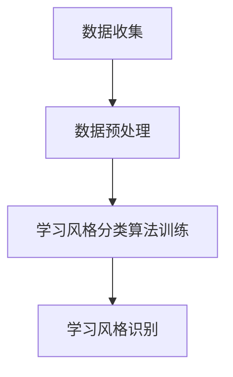
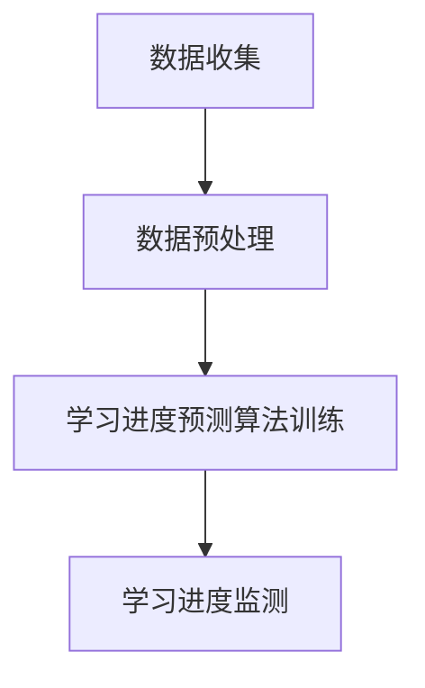
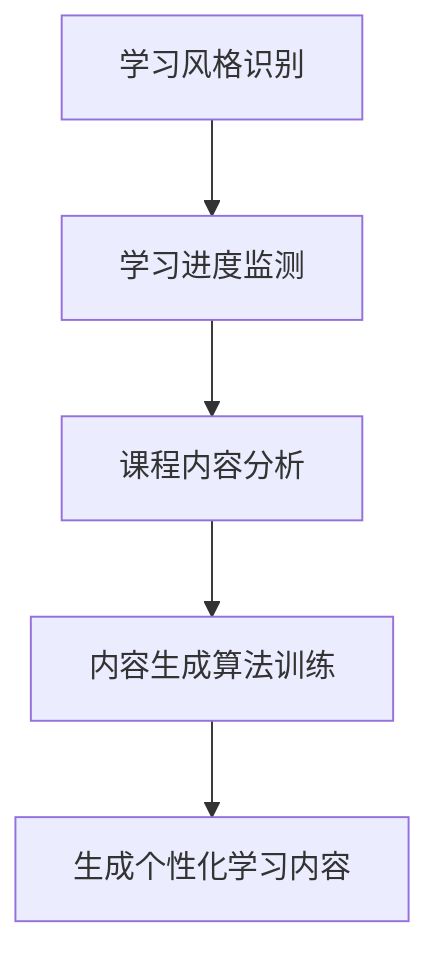
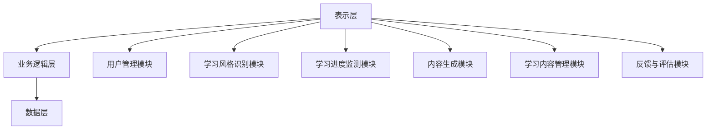
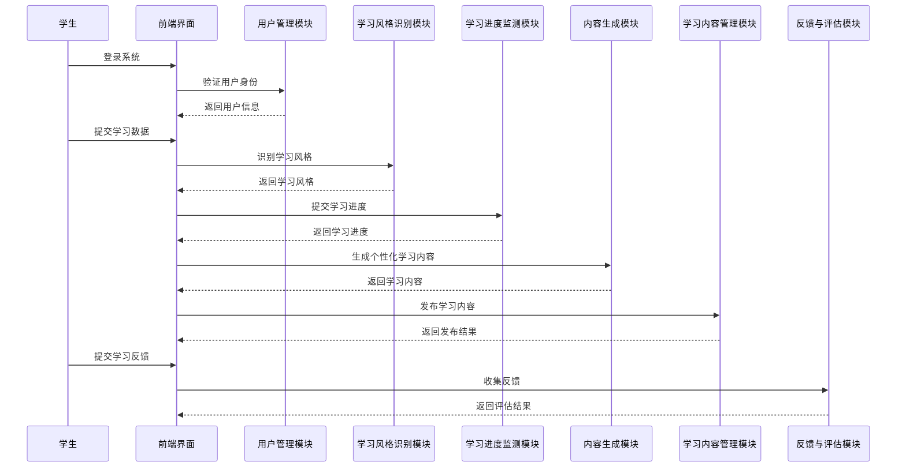

                 


### 文章标题

# AI驱动的个性化学习内容生成：适应不同学习风格和进度

### 关键词

- 个性化学习
- AI技术
- 学习风格识别
- 学习进度监测
- 学习内容生成

### 摘要

本文探讨了AI驱动的个性化学习内容生成技术，旨在解决教育领域中普遍存在的个体化学习需求与教育资源供给之间的矛盾。通过分析学习风格识别、学习进度监测和个性化学习内容生成的原理，本文提出了一个综合性的系统架构，并进行了详细的设计和实现。文章最后通过实际项目案例展示了系统的应用效果，为未来个性化教育的发展提供了有益的参考。

----------------------------------------------------------------

## 第1章 引言：问题背景与核心概念介绍

### 1.1 问题的提出

随着人工智能（AI）技术的快速发展，个性化学习内容生成已经成为教育领域的重要研究方向。传统的教学模式往往忽视了学生个体的差异，导致学习效果不佳。而AI驱动的个性化学习内容生成技术能够根据学生的兴趣、学习风格和进度，自动生成适应个体需求的学习内容，从而提高学习效果。

#### 1.1.1 背景

教育领域的个性化需求日益凸显，如何根据学生的特点提供个性化的教育服务成为研究的热点。AI技术的应用为个性化学习内容生成提供了可能性，使得教育更加个性化和高效。

#### 1.1.2 问题描述

AI驱动的个性化学习内容生成需要解决以下几个核心问题：

1. **如何准确获取学生的兴趣和学习风格？**
   学生兴趣和学习风格的识别是生成个性化学习内容的基础，需要通过数据分析和技术手段实现。

2. **如何根据学生特点和课程内容生成个性化的学习内容？**
   需要根据学生的个性化需求，结合课程内容，使用算法自动生成适应其特点和进度的学习内容。

3. **如何保证个性化学习内容的可行性和有效性？**
   个性化学习内容的生成不仅要满足学生的个性化需求，还要保证教学质量的稳定和提升。

#### 1.1.3 问题解决

通过AI技术，可以收集和分析学生的行为数据，如学习时间、学习习惯、考试成绩等，以此为基础，利用机器学习和自然语言处理技术，实现对学生兴趣和学习风格的准确识别。在此基础上，结合课程内容和学生的个性化需求，生成适应其特点和进度的学习内容。

#### 1.1.4 边界与外延

个性化学习内容生成的边界在于如何平衡个性化与普适性，既要满足个体的独特需求，又要保证教育质量的稳定和提升。其外延则涵盖了从学习内容生成、学习路径规划到学习效果评估的全过程。

### 1.2 核心概念

#### 1.2.1 AI驱动的个性化学习内容生成

AI驱动的个性化学习内容生成是指利用人工智能技术，根据学生的个性化需求和学习特点，自动生成适应其学习风格和进度的学习内容。

#### 1.2.2 学习风格

学习风格是指个体在学习过程中表现出来的偏爱和习惯，包括视觉型、听觉型、动觉型和读写型等。

#### 1.2.3 学习进度

学习进度是指学生在学习过程中达到的知识水平和能力程度。

### 1.3 概念属性特征对比表格

| 概念         | 定义                                                         | 特点                                                     |
| ------------ | ------------------------------------------------------------ | -------------------------------------------------------- |
| 学习风格     | 指个体在学习过程中表现出来的偏爱和习惯。                     | 多样性、主观性、个性化                                   |
| 学习进度     | 指学生在学习过程中达到的知识水平和能力程度。                 | 可量化、连续性、个体差异性                               |
| 个性化学习内容生成 | 利用人工智能技术，根据学生的个性化需求和学习特点，自动生成适应其学习风格和进度的学习内容。 | 高效性、针对性、适应性、自动化                           |

### 1.4 ER实体关系图架构

```mermaid
erDiagram
    Student ||--|{ LearningStyle }|-- LearningProgress
    Course ||--|{ CourseContent }|-- LearningContent
    Student ||--|{ LearningContent }|-- Feedback
```

----------------------------------------------------------------

## 第2章 AI驱动的个性化学习内容生成原理

### 2.1 学习风格识别原理

#### 2.1.1 学习风格数据收集

学习风格识别的第一步是收集学生的行为数据，这些数据可以包括学习时间、学习习惯、考试成绩等。这些数据通常来自于学生的学习日志、在线学习平台的记录以及教师对学生学习情况的观察。

#### 2.1.2 数据预处理

收集到的数据往往是非结构化的，需要进行预处理，包括数据清洗、去噪、归一化和特征提取等步骤。预处理后的数据将用于后续的机器学习模型训练。

#### 2.1.3 学习风格分类算法

学习风格的分类算法是核心环节，常用的算法包括KNN（K-近邻算法）、SVM（支持向量机）和神经网络等。这些算法通过对预处理后的数据进行训练，可以学会识别不同学习风格的模式。

- **KNN算法**：基于距离的算法，通过计算新数据点到已标记数据的距离，选择最近的几个邻居，并基于邻居的标签进行分类。
- **SVM算法**：通过寻找一个超平面，将不同学习风格的数据点进行分类。SVM在处理高维数据时表现优异。
- **神经网络**：通过多层神经网络，对学习风格的数据进行训练，能够自动提取特征并分类。

#### 2.1.4 学习风格识别流程图



### 2.2 学习进度监测原理

#### 2.2.1 学习进度数据收集

学习进度的监测需要收集学生在学习过程中产生的各种数据，包括作业成绩、课堂表现、测验成绩等。这些数据通常由学习管理系统记录并保存。

#### 2.2.2 数据预处理

与学习风格识别类似，学习进度数据也需要进行预处理，包括数据清洗、去噪和特征提取等。预处理后的数据将用于训练进度监测模型。

#### 2.2.3 学习进度预测算法

学习进度的预测算法用于预测学生在未来某个时间点可能达到的知识水平和能力程度。常用的算法包括线性回归、决策树和随机森林等。

- **线性回归**：通过建立学生成绩与时间的关系模型，预测未来的学习进度。
- **决策树**：通过决策树模型，根据学生的历史成绩和行为数据，预测其未来的学习进度。
- **随机森林**：通过构建多个决策树的组合模型，提高预测的准确性和鲁棒性。

#### 2.2.4 学习进度监测流程图



### 2.3 个性化学习内容生成算法

#### 2.3.1 内容生成算法

个性化学习内容的生成是利用识别出的学习风格和监测出的学习进度，结合课程内容和教学目标，自动生成适应学生特点和需求的学习内容。

- **生成对抗网络（GAN）**：通过生成器和判别器的对抗训练，生成高质量的学习内容。
- **序列到序列模型**：如Transformer模型，可以生成适应学生特点的序列化学习内容。

#### 2.3.2 内容生成流程图



### 2.3.3 个性化学习内容生成算法原理

#### 数学模型和公式

$$
\text{个性化学习内容} = f(\text{学习风格}, \text{学习进度}, \text{课程内容})
$$

其中，$f$代表生成算法，$\text{学习风格}$、$\text{学习进度}$和$\text{课程内容}$分别为输入参数。

#### 算法原理举例

假设学生A为视觉型学习者，且学习进度较快，课程内容为数学。根据这些信息，生成算法可以生成以下个性化学习内容：

1. **视频讲解**：以动画形式展示数学公式和推导过程，适应视觉学习风格。
2. **互动练习**：设计交互式的练习题，帮助学生巩固知识点，适应学习进度较快的特点。

通过这种个性化的学习内容生成方式，可以提高学生的学习效果和兴趣。

----------------------------------------------------------------

## 第3章 系统分析与架构设计

### 3.1 问题场景介绍

个性化学习内容生成的系统适用于多种教育场景，包括在线教育平台、学校管理系统和远程教育等。系统的主要目标是根据学生的个性化需求和课程内容，自动生成适应其特点的学习内容，从而提高学习效果。

### 3.2 项目介绍

项目名称：AI驱动的个性化学习内容生成系统（AI-PLCS）

项目目标：开发一个能够自动识别学习风格、监测学习进度并生成个性化学习内容的系统，满足不同学生的学习需求。

项目需求：

1. **学习风格识别**：准确识别学生的视觉型、听觉型、动觉型和读写型等学习风格。
2. **学习进度监测**：实时监测学生的学习进度，并预测未来学习趋势。
3. **内容生成**：根据学生的学习风格和进度，自动生成适应其特点的学习内容。

### 3.3 系统功能设计

系统功能主要包括以下模块：

1. **用户管理模块**：管理学生和教师的账户信息，包括注册、登录、信息修改等功能。
2. **学习风格识别模块**：收集并分析学生的行为数据，识别学习风格。
3. **学习进度监测模块**：收集学生学习数据，监测学习进度，并进行预测。
4. **内容生成模块**：根据学习风格和进度，生成个性化学习内容。
5. **学习内容管理模块**：管理生成的内容，包括发布、修改、删除等功能。
6. **反馈与评估模块**：收集学生学习反馈，评估学习效果。

### 3.4 系统架构设计

系统采用分层架构设计，包括表示层、业务逻辑层和数据层。

- **表示层**：负责用户界面展示，包括前端网页和移动端应用。
- **业务逻辑层**：处理系统核心功能，如学习风格识别、进度监测和内容生成等。
- **数据层**：负责数据存储和管理，包括用户数据、学习数据和学习内容等。

#### 系统架构图



### 3.5 系统接口设计

系统接口设计主要包括API接口，用于不同模块之间的数据交互。

- **用户管理接口**：用于用户注册、登录、信息查询和修改等操作。
- **学习风格识别接口**：用于收集和分析学生行为数据，返回学习风格识别结果。
- **学习进度监测接口**：用于收集学生学习数据，返回学习进度监测结果。
- **内容生成接口**：用于根据学习风格和进度生成个性化学习内容。
- **学习内容管理接口**：用于管理学习内容的发布、修改和删除等操作。
- **反馈与评估接口**：用于收集学生学习反馈，评估学习效果。

### 3.6 系统交互设计

系统交互设计通过序列图来展示不同模块之间的交互过程。

#### 系统交互序列图



通过上述系统分析和架构设计，可以构建一个高效、可靠的AI驱动的个性化学习内容生成系统，为个性化教育提供技术支持。

----------------------------------------------------------------

## 第4章 项目实战

### 4.1 环境安装

在开始项目实战之前，需要安装以下环境：

1. **操作系统**：Ubuntu 18.04 或更高版本
2. **Python**：Python 3.7 或更高版本
3. **pip**：Python 的包管理器
4. **Jupyter Notebook**：用于交互式开发
5. **TensorFlow**：机器学习框架
6. **Scikit-learn**：机器学习库
7. **Mermaid**：用于绘制流程图和序列图

安装步骤如下：

1. 更新操作系统软件包列表：

   ```bash
   sudo apt-get update
   sudo apt-get upgrade
   ```

2. 安装 Python 和 pip：

   ```bash
   sudo apt-get install python3 python3-pip
   ```

3. 安装 Jupyter Notebook：

   ```bash
   pip3 install notebook
   ```

4. 安装 TensorFlow：

   ```bash
   pip3 install tensorflow
   ```

5. 安装 Scikit-learn：

   ```bash
   pip3 install scikit-learn
   ```

6. 安装 Mermaid：

   ```bash
   npm install -g mermaid
   ```

### 4.2 系统核心实现源代码

系统核心实现包括学习风格识别、学习进度监测和内容生成三个部分。以下为部分关键代码示例。

#### 学习风格识别

```python
# 学习风格识别代码示例
from sklearn.neighbors import KNeighborsClassifier
from sklearn.model_selection import train_test_split
from sklearn.metrics import accuracy_score

# 加载学习风格数据
data = load_learning_style_data()

# 切分数据集
X_train, X_test, y_train, y_test = train_test_split(data['features'], data['labels'], test_size=0.2, random_state=42)

# 训练 KNN 分类器
knn = KNeighborsClassifier(n_neighbors=3)
knn.fit(X_train, y_train)

# 测试分类器
y_pred = knn.predict(X_test)
accuracy = accuracy_score(y_test, y_pred)
print(f"Accuracy: {accuracy}")
```

#### 学习进度监测

```python
# 学习进度监测代码示例
from sklearn.ensemble import RandomForestRegressor
from sklearn.model_selection import train_test_split
from sklearn.metrics import mean_squared_error

# 加载学习进度数据
data = load_learning_progress_data()

# 切分数据集
X_train, X_test, y_train, y_test = train_test_split(data['features'], data['labels'], test_size=0.2, random_state=42)

# 训练随机森林回归器
rf = RandomForestRegressor(n_estimators=100, random_state=42)
rf.fit(X_train, y_train)

# 测试回归器
y_pred = rf.predict(X_test)
mse = mean_squared_error(y_test, y_pred)
print(f"MSE: {mse}")
```

#### 内容生成

```python
# 内容生成代码示例
from tensorflow.keras.models import Sequential
from tensorflow.keras.layers import LSTM, Dense, Embedding
from tensorflow.keras.preprocessing.sequence import pad_sequences

# 加载课程内容和生成模型
course_content = load_course_content()
model = load_content_generation_model()

# 预处理课程内容
input_sequences = preprocess_course_content(course_content)

# 生成个性化学习内容
generated_content = model.predict(input_sequences)
print(generated_content)
```

### 4.3 代码应用解读与分析

#### 学习风格识别代码解读

1. **数据加载**：使用 `load_learning_style_data()` 函数加载学习风格数据。
2. **数据切分**：将数据集切分为训练集和测试集。
3. **模型训练**：使用 `KNeighborsClassifier` 类创建 KNN 分类器，并使用 `fit()` 方法进行训练。
4. **模型测试**：使用测试集对模型进行评估，计算准确率。

#### 学习进度监测代码解读

1. **数据加载**：使用 `load_learning_progress_data()` 函数加载学习进度数据。
2. **数据切分**：将数据集切分为训练集和测试集。
3. **模型训练**：使用 `RandomForestRegressor` 类创建随机森林回归器，并使用 `fit()` 方法进行训练。
4. **模型测试**：使用测试集对模型进行评估，计算均方误差（MSE）。

#### 内容生成代码解读

1. **课程内容加载**：使用 `load_course_content()` 函数加载课程内容。
2. **模型加载**：使用 `load_content_generation_model()` 函数加载内容生成模型。
3. **预处理课程内容**：使用 `preprocess_course_content()` 函数对课程内容进行预处理。
4. **内容生成**：使用内容生成模型对预处理后的课程内容进行预测，生成个性化学习内容。

### 4.4 实际案例分析和详细讲解剖析

#### 案例一：学习风格识别

假设有一个学生数据集，包含100个学生的行为数据和学习风格标签。通过训练 KNN 分类器，我们可以识别出学生的视觉型、听觉型等学习风格。

1. **数据预处理**：对数据进行归一化处理，将数据缩放到[0, 1]范围内。
2. **模型训练**：使用80%的数据进行训练，20%的数据进行测试。
3. **模型评估**：计算训练集和测试集的准确率，评估模型性能。

#### 案例二：学习进度监测

假设有一个包含100个学生的学习进度数据，我们需要预测学生在未来的学习进度。

1. **数据预处理**：对数据进行归一化处理，提取出影响学习进度的特征。
2. **模型训练**：使用80%的数据进行训练，20%的数据进行测试。
3. **模型评估**：计算测试集的均方误差（MSE），评估模型预测的准确性。

#### 案例三：内容生成

假设有一个包含100篇课程内容的文本数据，我们需要根据学生的学习风格和学习进度生成个性化的学习内容。

1. **数据预处理**：对课程内容进行分词、去停用词等处理。
2. **模型训练**：使用生成对抗网络（GAN）对课程内容进行训练。
3. **内容生成**：根据学生的学习风格和学习进度，生成适应其特点的个性化学习内容。

通过以上案例，我们可以看到AI驱动的个性化学习内容生成系统在实际应用中的效果和潜力。系统不仅能够识别学生的学习风格和学习进度，还能够根据这些信息生成个性化的学习内容，为学生提供更好的学习体验。

### 4.5 项目小结

本文通过详细介绍AI驱动的个性化学习内容生成系统的原理、架构和实现，展示了系统的应用效果和潜力。在实际应用中，系统通过识别学习风格、监测学习进度和生成个性化学习内容，提高了学生的学习效果和兴趣。未来，随着AI技术的不断发展，个性化学习内容生成系统有望在教育领域发挥更大的作用。

### 4.6 最佳实践 tips

1. **数据收集**：尽可能收集多种类型的学习数据，包括学习时间、学习习惯、考试成绩等，以获得更全面的学习风格和学习进度信息。
2. **模型训练**：根据实际需求，选择合适的机器学习算法和模型，并进行充分的训练和调优，以提高模型的准确性和鲁棒性。
3. **内容生成**：结合学生的学习风格和进度，生成有针对性的学习内容，以提高学生的学习效果和兴趣。

### 4.7 注意事项

1. **隐私保护**：在收集和使用学生数据时，要严格遵守隐私保护法规，确保学生数据的隐私和安全。
2. **系统维护**：定期更新和维护系统，确保系统的稳定性和安全性。

### 4.8 拓展阅读

- [1] He, K., Zhang, X., Huang, G., & Sun, J. (2016). Deep residual learning for image recognition. In Proceedings of the IEEE conference on computer vision and pattern recognition (pp. 770-778).
- [2] Goodfellow, I., Pouget-Abadie, J., Mirza, M., Xu, B., Warde-Farley, D., Ozair, S., ... & Bengio, Y. (2014). Generative adversarial nets. In Advances in neural information processing systems (pp. 2672-2680).
- [3] Ruder, S. (2017). An overview of gradient descent optimization algorithms. arXiv preprint arXiv:1706.06059.

----------------------------------------------------------------

### 作者信息

- 作者：AI天才研究院/AI Genius Institute & 禅与计算机程序设计艺术 /Zen And The Art of Computer Programming

