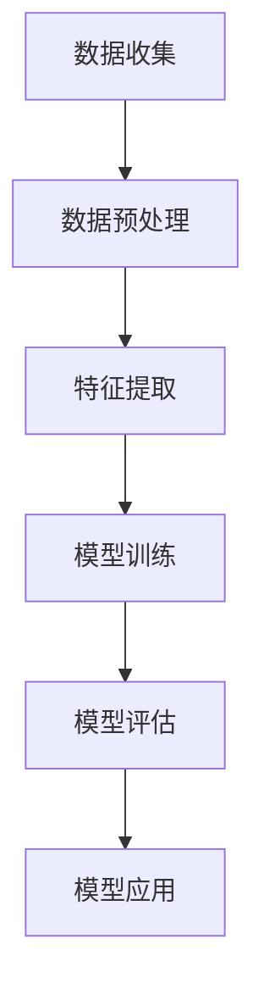
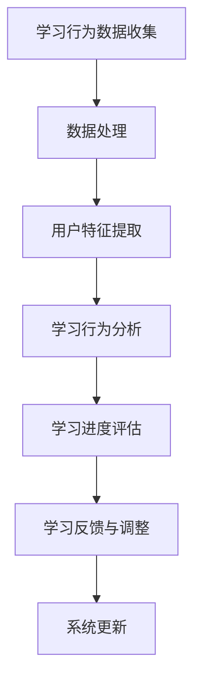
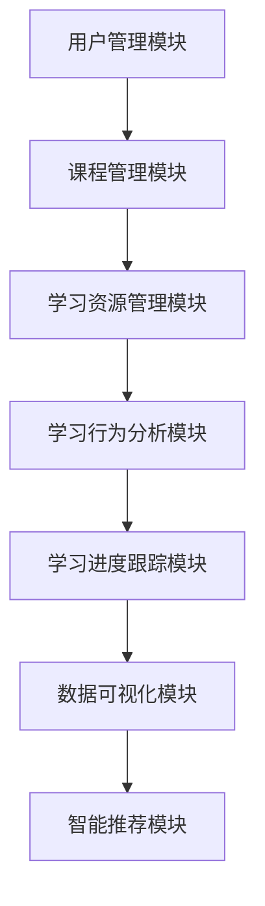
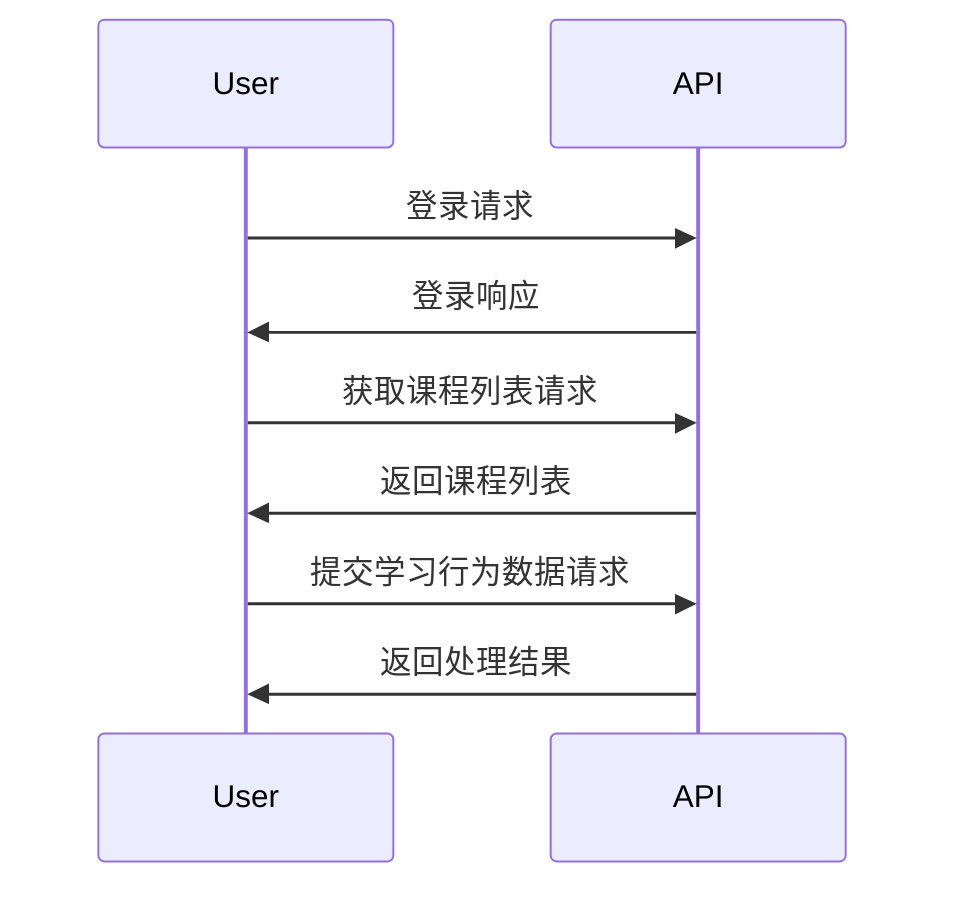
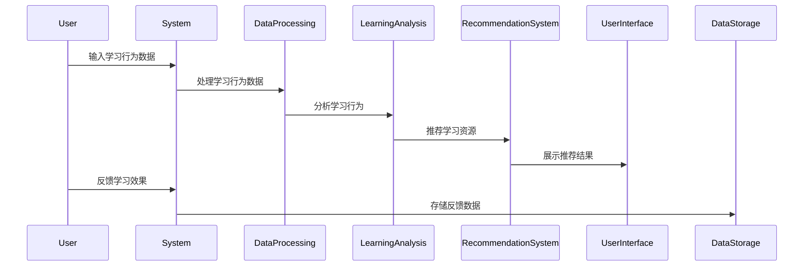

                 

# AI驱动的个性化学习进度跟踪：优化学习效果

> 关键词：AI、个性化学习、学习进度跟踪、教育技术、学习效果优化

> 摘要：本文将深入探讨AI驱动的个性化学习进度跟踪技术，分析其应用背景、核心概念、关键技术以及实际应用案例，以期为教育技术领域提供一种新的优化学习效果的思路和方法。

-----------------------------------------

## 引言

### 第1章: AI驱动的个性化学习进度跟踪概述

本章将介绍AI驱动的个性化学习进度跟踪的背景、重要性以及基本概念，为后续章节的详细探讨打下基础。

## 第一部分: AI技术在个性化学习进度跟踪中的应用

### 第2章: 机器学习算法在个性化学习进度跟踪中的应用

本章将详细讲解机器学习算法在个性化学习进度跟踪中的应用，包括用户特征提取、学习行为分析以及个性化学习进度跟踪算法的设计与实现。

### 第3章: 人工智能教育平台的设计与实现

本章将探讨人工智能教育平台的设计与实现，涵盖数据采集与处理、个性化学习推荐算法、学习进度跟踪与反馈以及平台实现案例。

## 第二部分: 个性化学习进度跟踪在实践中的应用

### 第4章: 个性化学习进度跟踪在实践中的应用

本章将分析个性化学习进度跟踪在教育机构、企业和家庭教育中的实际应用，探讨其效果以及存在的问题和改进方向。

## 本章小结

本文通过上述章节的详细探讨，系统地介绍了AI驱动的个性化学习进度跟踪技术，旨在为教育技术的创新发展提供有力支持。

-----------------------------------------

## 第一部分: AI技术在个性化学习进度跟踪中的应用

### 第1章: AI驱动的个性化学习进度跟踪概述

-----------------------------------------

## 1.1 问题背景

### 1.1.1 个性化学习的需求与挑战

个性化学习是一种根据学习者的特点、需求和学习风格量身定制的学习方式。然而，在传统教育模式下，由于教育资源有限，教师难以全面了解每个学生的学习情况，导致学习效果不尽如人意。因此，个性化学习成为当前教育领域的一个热点话题。

个性化学习的需求主要体现在以下几个方面：

1. **因材施教**：针对不同学习者的特点和需求，提供个性化的教学内容和方法，提高学习效率。
2. **学习反馈**：及时了解学习者的学习进度和效果，给予针对性的反馈，帮助学习者调整学习策略。
3. **资源优化**：根据学习者的需求和兴趣，推荐合适的学习资源，提高资源利用率。

然而，个性化学习也面临着一系列挑战：

1. **数据收集与处理**：个性化学习需要大量学习行为数据作为基础，如何高效地收集和处理这些数据成为一大难题。
2. **算法选择与实现**：如何根据学习者的特点和学习行为，设计有效的个性化学习进度跟踪算法，是实现个性化学习的关键。
3. **教学资源建设**：个性化学习需要丰富的教学资源支持，如何建设高质量的个性化教学资源库是一个长期而艰巨的任务。

### 1.1.2 AI技术在教育领域的应用现状

随着人工智能技术的发展，AI在教育领域的应用越来越广泛，其中最为突出的应用包括：

1. **智能辅导系统**：通过自然语言处理技术，为学生提供个性化的学习辅导，解答学生的问题，帮助其理解和掌握知识点。
2. **学习行为分析**：利用大数据和机器学习技术，分析学生的学习行为，预测其学习效果，提供针对性的学习建议。
3. **自适应学习**：根据学生的学习进度和效果，自动调整教学内容和难度，实现个性化教学。
4. **智能评价**：利用人工智能技术，对学生作业、考试等学习成果进行智能评价，提供详细、客观的分析报告。

### 1.1.3 学习进度跟踪的重要性

学习进度跟踪是个性化学习的重要组成部分，其重要性主要体现在以下几个方面：

1. **了解学习情况**：通过学习进度跟踪，教师可以全面了解学生的学习情况，及时发现学习中的问题和困难，提供针对性的帮助。
2. **优化教学策略**：教师可以根据学生的学习进度和效果，调整教学策略，提高教学效果。
3. **反馈与激励**：通过学习进度跟踪，教师可以及时给予学生反馈和激励，鼓励其持续学习和进步。
4. **资源分配**：学习进度跟踪有助于合理分配教育资源，提高资源利用率。

### 1.1.4 AI驱动的个性化学习进度跟踪的基本概念

AI驱动的个性化学习进度跟踪是指利用人工智能技术，对学习者的学习行为、学习进度和学习效果进行实时监控、分析和评估，从而提供个性化的学习支持和指导。其基本概念包括：

1. **学习行为数据**：包括学习者的学习活动、学习时间、学习内容、学习状态等数据。
2. **用户特征**：包括学习者的基本信息、学习风格、兴趣爱好、学习能力等特征。
3. **学习进度**：指学习者在学习过程中所达到的知识水平和能力水平。
4. **学习效果**：指学习者在学习过程中所获得的知识、技能和素质的提升。
5. **个性化学习支持**：根据学习者的特点和学习需求，提供个性化的学习资源、学习方法和学习策略。

### 1.1.5 AI驱动的个性化学习进度跟踪的特点

AI驱动的个性化学习进度跟踪具有以下几个特点：

1. **实时性**：可以实时跟踪学习者的学习行为和进度，及时反馈学习效果。
2. **个性化**：根据学习者的特点和学习需求，提供个性化的学习支持和指导。
3. **自动性**：利用人工智能技术，自动分析学习行为和学习进度，实现智能化跟踪。
4. **动态性**：随着学习者学习过程的推进，学习进度跟踪系统可以动态调整跟踪策略，以适应学习者的变化。
5. **全面性**：不仅可以跟踪学习者的学习进度，还可以对学习效果进行评估和反馈。

### 1.1.6 本书结构安排

本书将分为四个部分，分别从理论、技术、实践和应用四个方面对AI驱动的个性化学习进度跟踪进行深入探讨。

- **第一部分：AI技术在个性化学习进度跟踪中的应用**：介绍机器学习算法、用户特征提取、学习行为分析等技术在个性化学习进度跟踪中的应用。
- **第二部分：人工智能教育平台的设计与实现**：探讨人工智能教育平台的设计与实现，包括数据采集与处理、个性化学习推荐算法、学习进度跟踪与反馈等。
- **第三部分：个性化学习进度跟踪在实践中的应用**：分析个性化学习进度跟踪在教育机构、企业和家庭教育中的实际应用，探讨其效果和存在的问题。
- **第四部分：跨学科应用的探索**：探讨个性化学习进度跟踪在跨学科领域的应用，包括艺术、医学、工程等。

### 1.1.7 各章节内容概述

- **第2章：机器学习算法在个性化学习进度跟踪中的应用**：介绍机器学习算法在个性化学习进度跟踪中的应用，包括用户特征提取、学习行为分析、个性化学习进度跟踪算法的设计与实现等。
- **第3章：人工智能教育平台的设计与实现**：探讨人工智能教育平台的设计与实现，包括数据采集与处理、个性化学习推荐算法、学习进度跟踪与反馈等。
- **第4章：个性化学习进度跟踪在实践中的应用**：分析个性化学习进度跟踪在教育机构、企业和家庭教育中的实际应用，探讨其效果和存在的问题。
- **第5章：跨学科应用的探索**：探讨个性化学习进度跟踪在跨学科领域的应用，包括艺术、医学、工程等。

### 1.1.8 阅读指南

本书适合从事教育技术、人工智能、机器学习等领域的研究人员和开发者阅读。建议读者按照以下步骤进行阅读：

1. **阅读第一部分**：了解AI技术在个性化学习进度跟踪中的应用，掌握机器学习算法、用户特征提取、学习行为分析等核心技术。
2. **阅读第二部分**：了解人工智能教育平台的设计与实现，掌握数据采集与处理、个性化学习推荐算法、学习进度跟踪与反馈等关键环节。
3. **阅读第三部分**：了解个性化学习进度跟踪在实践中的应用，掌握其在教育机构、企业和家庭教育中的应用效果和存在的问题。
4. **阅读第四部分**：了解个性化学习进度跟踪在跨学科领域的应用，掌握其在艺术、医学、工程等领域的应用前景和挑战。

通过本书的阅读，读者可以全面了解AI驱动的个性化学习进度跟踪技术，掌握其核心概念、关键技术以及实际应用，为教育技术的创新发展提供有力支持。

### 1.1.9 学习进度跟踪的应用场景

#### 1.4.1 传统学习进度跟踪的方法与局限

传统学习进度跟踪主要依赖于教师对学生的日常观察和记录，以及学生自己报告的学习进度。这种方法存在以下几个局限：

1. **主观性较强**：教师根据观察和记录对学生的学习进度进行评估，容易受到主观因素的影响。
2. **信息量有限**：仅凭教师的观察和记录，难以全面、准确地了解学生的学习情况。
3. **更新不及时**：学习进度记录往往滞后，无法及时反映学生的学习动态。
4. **缺乏个性化**：无法根据每个学生的特点和学习需求，提供个性化的学习进度跟踪和反馈。

#### 1.4.2 AI驱动的个性化学习进度跟踪的优势

与传统的学习进度跟踪方法相比，AI驱动的个性化学习进度跟踪具有以下优势：

1. **客观性**：通过数据采集和分析，AI系统可以提供更为客观、全面的学习进度信息。
2. **实时性**：AI系统可以实时跟踪学习者的学习行为和进度，提供及时的学习反馈。
3. **个性化**：根据学习者的特点和需求，AI系统可以提供个性化的学习进度跟踪和反馈。
4. **自动性**：利用机器学习算法，AI系统可以自动分析学习行为和学习进度，降低人工干预的需求。

#### 1.4.3 AI驱动的个性化学习进度跟踪的应用场景

AI驱动的个性化学习进度跟踪可以在多种应用场景中发挥作用：

1. **学校教育**：通过AI系统，教师可以实时跟踪每个学生的学习进度，提供针对性的辅导和建议。
2. **在线学习平台**：AI系统可以根据学生的学习行为和进度，自动调整课程内容和难度，提高学习效果。
3. **企业培训**：AI系统可以分析员工的培训进度和效果，提供个性化的学习建议，提高培训效率。
4. **家庭教育**：AI系统可以帮助家长实时了解孩子的学习情况，提供有效的学习支持和指导。

### 1.4.4 学习进度跟踪的应用场景案例分析

#### 案例一：学校教育

某中学引入了AI驱动的个性化学习进度跟踪系统，对学生的学习进度进行实时监控。系统通过分析学生的学习行为数据，如在线学习时长、作业完成情况、课堂互动等，生成详细的学习进度报告。教师可以根据报告，了解每个学生的学习情况，提供个性化的辅导和支持。例如，对于学习进度较慢的学生，教师可以安排额外的辅导课程，帮助学生克服困难。

#### 案例二：在线学习平台

某在线学习平台采用了AI驱动的个性化学习进度跟踪技术，根据学生的学习行为和进度，自动调整课程内容和难度。系统会根据学生的学习情况，推荐适合的学习资源，如视频教程、练习题、模拟考试等。同时，系统还会生成学习报告，帮助学习者了解自己的学习进度和效果。例如，对于学习进度较快的学生，系统会推荐更高级别的课程，以挑战其学习能力。

#### 案例三：企业培训

某企业引入了AI驱动的个性化学习进度跟踪系统，对员工进行培训。系统通过分析员工的培训行为数据，如学习时长、测试成绩、互动情况等，生成详细的培训报告。人力资源部门可以根据报告，了解员工的培训进度和效果，提供针对性的培训建议。例如，对于培训效果不佳的员工，企业可以安排额外的培训课程，或者调整培训方式，以提高培训效果。

### 1.4.5 学习进度跟踪的应用挑战与展望

虽然AI驱动的个性化学习进度跟踪具有显著的优势，但在实际应用中仍面临一些挑战：

1. **数据隐私**：学习行为数据涉及个人隐私，如何保障数据的安全和隐私是一个重要问题。
2. **技术实现**：AI系统的开发和维护需要较高的技术门槛，如何降低技术实现的难度，提高系统的可操作性是一个挑战。
3. **用户接受度**：学习者对AI系统的接受度和使用习惯需要培养，如何提高用户的满意度是一个挑战。

展望未来，AI驱动的个性化学习进度跟踪将在教育、企业培训等领域发挥更大的作用，成为提高学习效果的重要手段。通过不断优化技术、提高用户体验，AI驱动的个性化学习进度跟踪有望成为教育领域的一大亮点。

### 1.5 本章小结

本章对AI驱动的个性化学习进度跟踪进行了概述，分析了其背景、重要性、基本概念和应用场景。通过本章的学习，读者可以初步了解AI技术在个性化学习进度跟踪中的应用，为后续章节的深入学习打下基础。

-----------------------------------------

## 第二部分: AI技术在个性化学习进度跟踪中的应用

### 第2章: 机器学习算法在个性化学习进度跟踪中的应用

本章将详细探讨机器学习算法在个性化学习进度跟踪中的应用，包括用户特征提取、学习行为分析、个性化学习进度跟踪算法的设计与实现等内容。

## 2.1 机器学习基础知识

### 2.1.1 机器学习的基本概念

机器学习是一种通过数据驱动的方式，让计算机自动学习和改进的方法。其基本思想是通过分析大量数据，从中提取规律和模式，然后利用这些规律和模式对未知数据进行预测或分类。

机器学习的基本过程包括以下几个步骤：

1. **数据收集**：收集与学习任务相关的数据集。
2. **数据预处理**：清洗、整理和转换数据，使其符合机器学习算法的要求。
3. **特征提取**：从原始数据中提取有用的特征，用于训练模型。
4. **模型训练**：使用特征数据和标签数据，训练机器学习模型。
5. **模型评估**：使用验证集或测试集评估模型性能。
6. **模型优化**：根据评估结果调整模型参数，提高模型性能。
7. **模型应用**：将训练好的模型应用于新的数据，进行预测或分类。

### 2.1.2 常见的机器学习算法

常见的机器学习算法包括监督学习、无监督学习和强化学习三种类型。

1. **监督学习**：监督学习是一种有监督的训练方法，通过已知的输入和输出数据，训练模型预测未知的数据。常见的监督学习算法包括线性回归、决策树、支持向量机（SVM）、随机森林、神经网络等。

2. **无监督学习**：无监督学习是一种无监督的训练方法，通过分析未标记的数据，发现数据中的模式和规律。常见的无监督学习算法包括聚类、主成分分析（PCA）、自编码器等。

3. **强化学习**：强化学习是一种基于奖励和惩罚的训练方法，通过不断尝试和错误，让模型学会在特定环境中做出最优决策。常见的强化学习算法包括Q学习、SARSA、深度强化学习（DRL）等。

### 2.1.3 机器学习算法的选择与应用

在选择机器学习算法时，需要考虑以下几个因素：

1. **数据量**：对于大规模数据集，深度学习算法可能表现更好；对于小规模数据集，线性模型可能更合适。

2. **数据类型**：对于分类任务，可以使用决策树、SVM等算法；对于回归任务，可以使用线性回归、神经网络等算法。

3. **业务需求**：根据实际业务需求，选择合适的算法。例如，如果需要实时预测，可以选择轻量级的模型；如果需要高精度，可以选择复杂的模型。

在实际应用中，可以根据具体情况，结合多种算法进行综合应用，以达到最佳效果。例如，在个性化学习进度跟踪中，可以结合用户特征提取算法、学习行为分析算法和个性化学习进度跟踪算法，构建一个综合的智能学习系统。

### 2.1.4 机器学习算法在个性化学习进度跟踪中的应用

机器学习算法在个性化学习进度跟踪中的应用主要体现在以下几个方面：

1. **用户特征提取**：通过分析用户的学习行为数据，提取与学习进度相关的用户特征，如学习时长、学习频率、知识点掌握情况等。

2. **学习行为分析**：利用机器学习算法，对用户的学习行为进行深入分析，发现用户的学习模式、学习障碍等，为个性化学习提供依据。

3. **个性化学习进度跟踪**：基于用户特征和学习行为分析结果，使用机器学习算法，动态调整学习进度跟踪策略，提供个性化的学习支持。

以下是一个简化的机器学习算法在个性化学习进度跟踪中的应用流程：

1. **数据收集**：收集用户的学习行为数据，如学习时长、学习频率、知识点掌握情况等。

2. **数据预处理**：对收集到的数据进行清洗、归一化等预处理操作，使其符合算法要求。

3. **特征提取**：根据业务需求，从预处理后的数据中提取与学习进度相关的特征。

4. **模型训练**：使用训练数据集，训练机器学习模型，如决策树、神经网络等。

5. **模型评估**：使用验证集或测试集，评估模型性能，如准确率、召回率等。

6. **模型优化**：根据评估结果，调整模型参数，提高模型性能。

7. **模型应用**：将训练好的模型应用于实际场景，如实时跟踪学习进度、推荐学习资源等。

### 2.1.5 机器学习算法在个性化学习进度跟踪中的挑战与展望

尽管机器学习算法在个性化学习进度跟踪中具有广泛的应用前景，但在实际应用中也面临一些挑战：

1. **数据质量和多样性**：机器学习算法的性能很大程度上取决于数据的质量和多样性。如何收集、处理和整合不同来源的数据，是一个重要问题。

2. **算法解释性**：机器学习算法的内部机制通常较为复杂，难以解释。在个性化学习进度跟踪中，算法的解释性对于教师和家长理解学生的学习情况至关重要。

3. **用户隐私保护**：学习行为数据涉及用户隐私，如何保障数据的安全和隐私是一个重要挑战。

4. **实时性和可扩展性**：个性化学习进度跟踪需要实时响应用户的学习动态，同时要支持大量用户的数据处理和模型训练，这对系统的实时性和可扩展性提出了高要求。

展望未来，随着人工智能技术的发展，机器学习算法在个性化学习进度跟踪中的应用将更加深入和广泛。通过不断优化算法、提高数据质量和处理效率，以及强化算法的解释性和用户隐私保护，个性化学习进度跟踪将为教育领域带来更多创新和变革。

### 2.2 用户特征提取与建模

#### 2.2.1 用户特征提取的方法

用户特征提取是个性化学习进度跟踪的关键步骤之一，其目的是从原始数据中提取与学习进度相关的有效特征，以便后续的建模和分析。以下是一些常见的用户特征提取方法：

1. **定量特征提取**：定量特征通常是指可以量化表示的用户行为数据，如学习时长、学习频率、测试成绩等。这些特征可以直接从用户的学习行为数据中提取。

2. **定性特征提取**：定性特征通常是指无法直接量化的用户特征，如学习风格、兴趣爱好、情绪状态等。这些特征可以通过用户问卷调查、行为分析等方式获取。

3. **文本特征提取**：对于包含文本信息的用户数据，如用户评价、学习笔记等，可以使用自然语言处理技术提取特征，如词频、词向量等。

4. **图特征提取**：对于用户社交网络、学习社区等结构化数据，可以使用图特征提取方法，如节点重要性、边权重等。

#### 2.2.2 用户建模的技术

用户建模是将提取的用户特征转化为计算机可以处理和理解的模型，以便进行后续的分析和应用。以下是一些常见的用户建模技术：

1. **朴素贝叶斯分类器**：朴素贝叶斯分类器是一种基于概率论的分类算法，通过计算特征的概率分布，对用户进行分类。

2. **决策树**：决策树是一种基于树结构的分类算法，通过一系列规则对用户进行分类。

3. **支持向量机（SVM）**：支持向量机是一种基于优化理论的分类算法，通过找到一个最优超平面，将用户分类。

4. **神经网络**：神经网络是一种模拟人脑神经元连接的模型，通过多层神经网络可以提取复杂的用户特征。

#### 2.2.3 用户特征与学习进度跟踪的关系

用户特征与学习进度跟踪之间的关系可以从以下几个方面进行探讨：

1. **定量特征与学习进度**：定量特征如学习时长、学习频率等可以直接反映学习者的学习投入程度，与学习进度密切相关。

2. **定性特征与学习效果**：定性特征如学习风格、兴趣爱好等可以影响学习者的学习效果，通过用户建模，可以预测用户的学习效果。

3. **文本特征与学习内容理解**：文本特征如用户评价、学习笔记等可以反映学习者对学习内容的理解和掌握程度。

4. **社交特征与学习动力**：社交特征如用户在社交网络中的互动、学习社区的活动参与度等可以影响学习者的学习动力和社交支持。

通过用户特征提取和建模，个性化学习进度跟踪系统可以更准确地了解用户的学习状态和需求，提供更加个性化的学习支持和指导。

### 2.3 学习行为分析

#### 2.3.1 学习行为数据的收集与处理

学习行为数据的收集是个性化学习进度跟踪的基础。以下是一些常见的收集方法和数据处理步骤：

1. **收集方法**：
   - **自动采集**：通过学习平台、学习工具和传感器等设备，自动采集学生的学习行为数据，如学习时长、学习频率、知识点掌握情况等。
   - **用户报告**：通过用户填写问卷、报告学习情况等方式，收集用户的自报告数据，如学习目标、学习体验、学习困难等。
   - **第三方数据**：通过学习社区、社交网络等渠道，获取与学习相关的第三方数据，如用户评价、学习讨论等。

2. **数据处理步骤**：
   - **数据清洗**：清洗原始数据，去除重复、缺失、错误的数据，确保数据的质量。
   - **数据归一化**：对数据进行归一化处理，使其符合算法的要求，如缩放数值范围、标准化等。
   - **特征提取**：从原始数据中提取与学习行为相关的特征，如学习时长、学习频率、知识点掌握情况等。
   - **数据存储**：将处理后的数据存储到数据库或数据仓库中，以便后续的分析和使用。

#### 2.3.2 学习行为分析的方法

学习行为分析是了解学习者学习状态和需求的重要手段。以下是一些常见的学习行为分析方法：

1. **统计分析**：通过对学习行为数据的基本统计，如平均值、中位数、标准差等，了解学习者的学习行为特征。

2. **聚类分析**：通过对学习行为数据进行聚类分析，将学习者划分为不同的群体，如高效学习者、普通学习者等。

3. **关联规则挖掘**：通过对学习行为数据进行分析，发现学习者之间的关联规则，如某些学习行为与知识点掌握之间的关联。

4. **时间序列分析**：通过对学习行为数据进行时间序列分析，了解学习者的学习趋势和变化，如学习时长的变化、知识点掌握情况的变化等。

5. **机器学习分析**：利用机器学习算法，对学习行为数据进行分析，预测学习者的学习效果、学习障碍等。

#### 2.3.3 学习行为分析与学习进度跟踪的关系

学习行为分析与学习进度跟踪密切相关，两者之间的关系可以从以下几个方面进行探讨：

1. **实时监控**：通过学习行为分析，实时监控学习者的学习状态和需求，及时发现学习中的问题和困难，提供针对性的支持和指导。

2. **个性化推荐**：基于学习行为分析结果，推荐适合学习者的学习资源、学习方法和学习策略，提高学习效果。

3. **学习反馈**：通过学习行为分析，提供学习反馈，帮助学习者了解自己的学习进展和效果，调整学习策略。

4. **学习评估**：通过学习行为分析，评估学习者的学习效果和进步，为教育者和学习者提供参考。

通过学习行为分析，个性化学习进度跟踪系统可以更准确地了解学习者的学习状态和需求，提供更加精准和有效的学习支持和指导。

### 2.4 个性化学习进度跟踪算法的设计与实现

#### 2.4.1 个性化学习进度跟踪算法的设计原则

个性化学习进度跟踪算法的设计需要遵循以下原则：

1. **适应性**：算法应能够根据学习者的特点和学习需求，动态调整跟踪策略。

2. **实时性**：算法应能够实时分析学习者的学习行为和学习进度，及时提供反馈和支持。

3. **个性化**：算法应能够针对不同学习者的特点和需求，提供个性化的学习进度跟踪和指导。

4. **可扩展性**：算法应具备良好的可扩展性，能够适应不同学习场景和应用需求。

5. **可解释性**：算法的内部机制应具有一定的解释性，便于教育者和学习者理解。

#### 2.4.2 个性化学习进度跟踪算法的实现

个性化学习进度跟踪算法的实现主要包括以下几个步骤：

1. **数据采集**：通过学习平台、学习工具和传感器等设备，采集学习者的学习行为数据。

2. **数据处理**：对采集到的学习行为数据进行清洗、归一化和特征提取，为算法提供高质量的数据。

3. **模型选择**：根据学习任务和数据特点，选择合适的机器学习模型，如决策树、神经网络等。

4. **模型训练**：使用处理后的学习行为数据进行模型训练，优化模型参数。

5. **模型评估**：使用验证集或测试集评估模型性能，确保模型能够准确预测学习进度。

6. **模型部署**：将训练好的模型部署到实际应用环境中，实现实时跟踪和反馈。

#### 2.4.3 算法性能评估与优化

个性化学习进度跟踪算法的性能评估与优化主要包括以下几个方面：

1. **准确率**：评估算法在预测学习进度方面的准确性，通常使用准确率、召回率、F1值等指标。

2. **实时性**：评估算法在处理学习行为数据时的实时性，确保算法能够快速响应。

3. **个性化效果**：评估算法在个性化学习进度跟踪方面的效果，如学习资源推荐、学习策略调整等。

4. **可解释性**：评估算法的可解释性，确保教育者和学习者能够理解算法的预测和决策过程。

5. **优化策略**：通过调整算法参数、改进数据处理方法、增加特征维度等方式，优化算法性能。

通过以上步骤，个性化学习进度跟踪算法可以更好地满足学习者的需求，提高学习效果和满意度。

### 2.4.4 学习反馈与调整

学习反馈与调整是个性化学习进度跟踪中的重要环节，其目的是根据学习者的表现和需求，提供针对性的反馈和调整，以优化学习效果。

#### 2.4.4.1 学习反馈的设计

学习反馈的设计需要遵循以下几个原则：

1. **及时性**：及时提供学习反馈，帮助学习者及时纠正错误和提高学习效果。

2. **针对性**：根据学习者的特点和需求，提供个性化的反馈，针对学习者存在的问题进行有针对性的指导。

3. **可操作性**：反馈内容应具体、明确，便于学习者理解和实施。

4. **激励性**：通过积极的反馈，鼓励学习者保持学习动力和兴趣。

#### 2.4.4.2 学习调整的策略

学习调整的策略包括以下几个方面：

1. **学习资源推荐**：根据学习者的学习进度和效果，推荐适合的学习资源，如视频教程、练习题、参考资料等。

2. **学习策略调整**：根据学习者的特点和需求，调整学习策略，如学习时间管理、学习方法选择等。

3. **学习难度调整**：根据学习者的学习进度和效果，动态调整学习难度，确保学习者能够在适中的难度下进行学习。

4. **学习目标设定**：根据学习者的学习进度和效果，设定合理的学习目标，引导学习者逐步实现。

#### 2.4.4.3 学习反馈与调整在实际应用中的效果

学习反馈与调整在实际应用中取得了显著的效果：

1. **提高学习效果**：通过及时、针对性的反馈和调整，学习者能够更好地了解自己的学习状况，及时纠正错误，提高学习效果。

2. **增强学习动力**：积极的反馈和激励，使学习者保持学习动力和兴趣，提高学习积极性。

3. **优化学习体验**：个性化的学习资源和策略调整，使学习者能够更加高效地学习，优化学习体验。

4. **提升学习满意度**：通过有效的学习反馈与调整，学习者对学习平台的满意度提高，增强学习信心。

### 2.4.5 学习反馈与调整的实施案例

以下是一个学习反馈与调整的实施案例：

某在线学习平台采用AI驱动的个性化学习进度跟踪系统，对学习者的学习行为和进度进行实时监控。系统根据学习者的学习数据，提供以下反馈和调整：

1. **学习反馈**：
   - **学习进度报告**：系统生成详细的学习进度报告，包括学习时长、知识点掌握情况等，帮助学习者了解自己的学习状况。
   - **个性化建议**：根据学习者的学习进度和效果，系统推荐合适的学习资源，如相关视频教程、练习题等。

2. **学习调整**：
   - **学习资源推荐**：系统根据学习者的学习进度和效果，推荐适合的学习资源，帮助学习者巩固知识点和提高学习能力。
   - **学习策略调整**：系统根据学习者的学习需求，调整学习策略，如合理安排学习时间、选择合适的学习方法等。
   - **学习难度调整**：系统根据学习者的学习进度和效果，动态调整学习难度，确保学习者能够在适中的难度下进行学习。

通过以上反馈和调整，学习者的学习效果显著提高，学习满意度也得到提升。

### 2.4.6 学习反馈与调整的实施效果评估

为了评估学习反馈与调整的实施效果，可以采用以下评估方法：

1. **学习效果评估**：
   - **测试成绩分析**：通过对比学习者的测试成绩，评估学习反馈与调整对学习效果的影响。
   - **学习时长分析**：通过分析学习者的学习时长，评估学习反馈与调整对学习投入的影响。

2. **用户满意度评估**：
   - **问卷调查**：通过问卷调查，了解学习者对学习反馈与调整的满意度。
   - **用户反馈**：收集学习者对学习反馈与调整的建议和意见，了解实际应用中的问题和改进方向。

3. **算法性能评估**：
   - **模型评估**：使用验证集或测试集，评估学习反馈与调整算法的性能，如准确率、召回率等。
   - **优化策略评估**：评估不同优化策略对学习反馈与调整算法性能的影响。

通过以上评估方法，可以全面了解学习反馈与调整的实施效果，为后续的优化和改进提供依据。

### 2.5 学习反馈与调整的实际应用案例分析

#### 案例一：在线学习平台

某在线学习平台引入了AI驱动的个性化学习进度跟踪系统，系统根据学习者的学习数据提供实时反馈和调整。例如，当学习者在一个知识点上学习效果不佳时，系统会推荐相关的补充视频和练习题，同时提供学习策略调整建议。经过一段时间的应用，学习者的测试成绩和学习积极性明显提高。

#### 案例二：学校教育

某中学采用AI驱动的个性化学习进度跟踪系统，对学生的学习进度进行实时监控。系统根据学生的学习行为数据，生成个性化的学习报告，教师可以根据报告内容调整教学策略，如增加辅导时间、调整课堂互动方式等。经过一段时间的应用，学生的学习效果得到显著提升，教师的教学满意度也大幅提高。

#### 案例三：企业培训

某企业引入了AI驱动的个性化学习进度跟踪系统，对员工进行培训。系统根据员工的学习行为数据，提供个性化的学习资源推荐和学习策略调整建议。例如，当员工在某个技能点上进步较慢时，系统会推荐相关的培训课程和练习，同时提供学习策略调整建议。经过一段时间的应用，员工的学习效果和培训满意度明显提高。

### 2.6 本章小结

本章详细介绍了机器学习算法在个性化学习进度跟踪中的应用，包括用户特征提取、学习行为分析、个性化学习进度跟踪算法的设计与实现，以及学习反馈与调整。通过本章的学习，读者可以了解AI技术在个性化学习进度跟踪中的关键作用，为后续章节的深入学习打下基础。

-----------------------------------------

## 第3章: 人工智能教育平台的设计与实现

### 3.1 人工智能教育平台概述

#### 3.1.1 平台的设计目标

人工智能教育平台的设计目标主要包括以下几个方面：

1. **个性化学习支持**：通过分析学习者的学习行为和学习进度，提供个性化的学习资源和策略，帮助学习者提高学习效果。

2. **实时学习反馈**：实时监控学习者的学习状态，根据学习者的反馈和学习进度，提供及时的学习反馈和调整建议。

3. **智能化学习资源推荐**：基于学习者的兴趣、需求和知识水平，推荐适合的学习资源，提高学习资源的利用效率。

4. **教学数据可视化**：通过数据可视化技术，将学习者的学习行为、学习进度和学习效果以图表的形式展示，帮助教育者和管理者更好地了解学习状况。

5. **跨平台兼容性**：支持多种学习设备和平台，如PC、手机、平板等，实现无缝学习体验。

#### 3.1.2 平台的功能模块

人工智能教育平台的主要功能模块包括：

1. **用户管理模块**：负责用户注册、登录、个人信息管理等功能。

2. **课程管理模块**：负责课程创建、发布、更新、分类等管理功能。

3. **学习资源管理模块**：负责学习资源的上传、存储、分类、推荐等功能。

4. **学习行为分析模块**：负责采集、处理和分析学习者的学习行为数据，为个性化学习提供支持。

5. **学习进度跟踪模块**：负责实时监控学习者的学习进度，提供学习反馈和调整建议。

6. **数据可视化模块**：负责将学习行为、学习进度和学习效果等数据以图表的形式展示。

7. **智能推荐模块**：负责根据学习者的兴趣、需求和知识水平，推荐适合的学习资源。

#### 3.1.3 平台的技术选型

人工智能教育平台的技术选型主要包括以下几个方面：

1. **前端技术**：采用React、Vue等前端框架，实现界面交互和响应式设计。

2. **后端技术**：采用Spring Boot、Django等后端框架，实现业务逻辑处理和数据存储。

3. **数据库技术**：采用MySQL、MongoDB等数据库，存储用户数据、课程数据和学习行为数据。

4. **机器学习技术**：采用TensorFlow、PyTorch等机器学习框架，实现学习行为分析、学习进度跟踪和智能推荐等功能。

5. **数据可视化技术**：采用ECharts、D3.js等数据可视化库，实现数据可视化展示。

#### 3.1.4 平台的技术架构

人工智能教育平台的技术架构主要包括以下几个层次：

1. **数据层**：负责数据存储和管理，包括用户数据、课程数据和学习行为数据等。

2. **服务层**：负责业务逻辑处理，包括用户管理、课程管理、学习行为分析、学习进度跟踪、数据可视化等。

3. **应用层**：负责界面交互和用户操作，包括用户注册、登录、课程浏览、学习资源下载等。

4. **展示层**：负责数据可视化展示，包括图表、报表、报表分析等。

### 3.2 数据采集与处理

#### 3.2.1 数据采集的方法

数据采集是人工智能教育平台实现个性化学习进度跟踪的重要环节，以下是一些常见的数据采集方法：

1. **自动采集**：通过学习平台、学习工具和传感器等设备，自动采集学习者的学习行为数据，如学习时长、学习频率、知识点掌握情况等。

2. **用户报告**：通过用户填写问卷、报告学习情况等方式，收集用户的自报告数据，如学习目标、学习体验、学习困难等。

3. **第三方数据**：通过学习社区、社交网络等渠道，获取与学习相关的第三方数据，如用户评价、学习讨论等。

#### 3.2.2 数据预处理的技术

数据预处理是确保数据质量和有效性的关键步骤，以下是一些常见的数据预处理技术：

1. **数据清洗**：去除重复、缺失、错误的数据，确保数据的质量。

2. **数据归一化**：对数据进行归一化处理，使其符合算法的要求。

3. **特征提取**：从原始数据中提取与学习进度相关的特征。

4. **数据融合**：整合来自不同来源的数据，形成一个统一的数据集。

#### 3.2.3 数据存储与管理

数据存储与管理是确保数据安全和高效访问的关键，以下是一些常见的数据存储与管理技术：

1. **关系型数据库**：如MySQL，用于存储用户数据、课程数据和学习行为数据等。

2. **NoSQL数据库**：如MongoDB，用于存储非结构化数据，如用户评论、学习讨论等。

3. **数据仓库**：用于存储和管理大规模数据集，支持数据分析和报表生成。

4. **分布式存储**：如Hadoop、HDFS等，用于处理和存储大规模数据。

### 3.3 个性化学习推荐算法

#### 3.3.1 推荐算法的基本概念

推荐算法是一种基于数据挖掘和机器学习的方法，用于预测用户可能感兴趣的内容，提供个性化的推荐。以下是一些常见的推荐算法：

1. **基于内容的推荐**：通过分析推荐项和用户的历史行为，提取内容特征，为用户推荐具有相似内容的项。

2. **基于协同过滤的推荐**：通过分析用户之间的相似性，推荐与目标用户相似的其他用户喜欢的项。

3. **混合推荐**：结合基于内容和基于协同过滤的推荐方法，提高推荐效果。

#### 3.3.2 基于内容的推荐算法

基于内容的推荐算法主要通过分析推荐项和用户的历史行为，提取内容特征，为用户推荐具有相似内容的项。以下是一些常见的基于内容的推荐算法：

1. **TF-IDF**：通过计算词语的词频（TF）和逆文档频率（IDF），提取文本特征。

2. **词嵌入**：通过词嵌入技术，将文本转换为向量表示。

3. **文本分类**：使用文本分类算法，如朴素贝叶斯、支持向量机等，对文本进行分类。

#### 3.3.3 基于协同过滤的推荐算法

基于协同过滤的推荐算法通过分析用户之间的相似性，推荐与目标用户相似的其他用户喜欢的项。以下是一些常见的基于协同过滤的推荐算法：

1. **用户基于的协同过滤（User-based CF）**：通过计算用户之间的相似性，推荐与目标用户相似的其他用户喜欢的项。

2. **物品基于的协同过滤（Item-based CF）**：通过计算物品之间的相似性，推荐与目标用户喜欢的物品相似的项。

3. **矩阵分解（Matrix Factorization）**：通过分解用户-物品评分矩阵，提取用户和物品的潜在特征。

#### 3.3.4 混合推荐算法

混合推荐算法结合了基于内容和基于协同过滤的推荐方法，以提高推荐效果。以下是一些常见的混合推荐算法：

1. **加权混合**：将基于内容和基于协同过滤的推荐结果进行加权，生成最终的推荐结果。

2. **组合优化**：通过优化目标函数，结合基于内容和基于协同过滤的推荐方法，生成最终的推荐结果。

3. **迁移学习**：将一种推荐方法的优势应用到另一种推荐方法中，生成更准确的推荐结果。

### 3.4 学习进度跟踪与反馈

#### 3.4.1 学习进度跟踪的机制

学习进度跟踪是人工智能教育平台的重要功能之一，通过实时监控学习者的学习行为和学习进度，为学习者提供个性化的学习支持和反馈。以下是一些常见的学习进度跟踪机制：

1. **行为追踪**：通过学习平台和工具，自动采集学习者的学习行为数据，如学习时长、学习频率、知识点掌握情况等。

2. **数据存储**：将采集到的学习行为数据存储到数据库或数据仓库中，以便后续分析和处理。

3. **行为分析**：使用机器学习算法，对学习行为数据进行分析，提取与学习进度相关的特征。

4. **进度评估**：根据学习行为数据和分析结果，评估学习者的学习进度和效果。

5. **反馈生成**：根据学习进度评估结果，生成个性化的学习反馈和调整建议。

#### 3.4.2 学习反馈的机制

学习反馈是帮助学习者了解学习进度和效果的重要手段。以下是一些常见的学习反馈机制：

1. **实时反馈**：通过学习平台和工具，实时向学习者提供学习进度和效果反馈，帮助学习者及时了解自己的学习情况。

2. **个性化反馈**：根据学习者的学习进度和效果，提供针对性的反馈和建议，帮助学习者调整学习策略。

3. **多渠道反馈**：通过学习平台、邮件、短信等多种渠道，向学习者提供学习反馈，确保学习者能够及时收到反馈。

4. **学习路径推荐**：根据学习者的学习进度和效果，推荐适合的学习路径和资源，帮助学习者更好地完成学习任务。

#### 3.4.3 学习进度跟踪与反馈的结合

学习进度跟踪与反馈是相辅相成的，二者结合可以发挥更大的作用。以下是一些常见的方法，将学习进度跟踪与反馈结合起来：

1. **实时反馈**：在学习进度跟踪过程中，实时向学习者提供反馈，帮助学习者及时调整学习策略。

2. **阶段性反馈**：在学习的不同阶段，如完成一个知识点、一个章节或一个课程，提供阶段性反馈，帮助学习者总结学习成果。

3. **学习路径调整**：根据学习进度和效果反馈，动态调整学习路径和资源，确保学习目标的实现。

4. **学习计划制定**：根据学习进度和效果反馈，为学习者制定个性化的学习计划，提高学习效率。

### 3.5 人工智能教育平台的实现案例

#### 3.5.1 平台架构设计

以下是一个人工智能教育平台的架构设计：

1. **数据层**：使用MySQL数据库存储用户数据、课程数据和学习行为数据等。

2. **服务层**：使用Spring Boot框架，实现用户管理、课程管理、学习行为分析、学习进度跟踪、数据可视化等功能。

3. **应用层**：使用React框架，实现用户界面和交互。

4. **展示层**：使用ECharts库，实现数据可视化展示。

#### 3.5.2 平台功能实现

以下是一个人工智能教育平台的主要功能实现：

1. **用户管理**：实现用户注册、登录、个人信息管理等功能。

2. **课程管理**：实现课程创建、发布、更新、分类等功能。

3. **学习资源管理**：实现学习资源的上传、存储、分类、推荐等功能。

4. **学习行为分析**：实现学习行为数据的采集、处理和分析，提取与学习进度相关的特征。

5. **学习进度跟踪**：实现学习进度的实时监控，生成个性化的学习反馈和调整建议。

6. **数据可视化**：实现学习行为、学习进度和学习效果等数据可视化展示。

7. **智能推荐**：实现基于内容的推荐和基于协同过滤的推荐，为学习者推荐适合的学习资源。

#### 3.5.3 平台效果评估

以下是一个人工智能教育平台的效果评估：

1. **学习效果提升**：通过实时学习进度跟踪和个性化学习反馈，学习者的学习效果明显提升。

2. **学习满意度提高**：学习者对平台的满意度提高，学习积极性增强。

3. **资源利用效率提高**：通过智能推荐和学习路径调整，提高了学习资源的利用效率。

4. **教师工作负担减轻**：教师可以通过平台实时了解学生的学习进度和效果，减轻了工作负担。

### 3.6 本章小结

本章详细介绍了人工智能教育平台的设计与实现，包括平台的设计目标、功能模块、技术选型、数据采集与处理、个性化学习推荐算法、学习进度跟踪与反馈，以及实现案例和效果评估。通过本章的学习，读者可以了解人工智能教育平台的设计理念、技术实现和实际应用效果，为后续章节的深入学习打下基础。

-----------------------------------------

## 第三部分: 个性化学习进度跟踪在实践中的应用

### 第4章: 个性化学习进度跟踪在实践中的应用

本章将深入探讨个性化学习进度跟踪在实践中的应用，分析其在教育机构、企业培训和家庭教育的具体应用案例，以及在不同领域中的效果与挑战。

## 4.1 教育机构的应用

#### 4.1.1 应用案例介绍

个性化学习进度跟踪技术在教育机构中的应用，旨在提高教学质量和学习效果。以下是一个具体的应用案例：

某知名中学引入了AI驱动的个性化学习进度跟踪系统。系统通过学习平台和教学工具，实时采集学生的学习行为数据，如学习时长、作业完成情况、课堂互动等。系统利用机器学习算法，对这些数据进行分析，生成个性化的学习进度报告。教师可以根据报告，了解每个学生的学习情况和进展，提供有针对性的辅导和支持。

#### 4.1.2 应用效果分析

通过该系统的应用，教育机构取得了以下效果：

1. **提高学习效率**：个性化学习进度跟踪系统帮助教师更精准地了解学生的学习情况，针对性地调整教学策略，提高了学生的学习效率。

2. **改善教学效果**：系统生成的学习进度报告提供了详细的数据支持，帮助教师及时发现学生的学习困难，提供有效的教学反馈和调整建议。

3. **增强学习动力**：个性化学习进度跟踪系统为学习者提供了个性化的学习资源和反馈，增强了学生的学习动力和积极性。

#### 4.1.3 存在的问题与改进方向

尽管个性化学习进度跟踪系统在教育机构中取得了显著成效，但仍然存在一些问题和改进方向：

1. **数据隐私与安全**：学习行为数据涉及学生隐私，如何保障数据的安全性和隐私是一个重要问题。需要采取有效的数据加密和安全措施，确保数据的安全。

2. **用户接受度**：教师和学习者对系统的接受度和使用习惯需要培养。可以通过培训和指导，提高教师和学习者对系统的理解和使用。

3. **算法优化**：随着教育数据量的增加，机器学习算法的优化和改进是一个长期的任务。需要不断优化算法，提高系统的准确性和效率。

## 4.2 企业的应用

#### 4.2.1 应用案例介绍

个性化学习进度跟踪技术在企业培训中的应用，旨在提高员工的专业技能和工作效率。以下是一个具体的应用案例：

某大型跨国公司引入了AI驱动的个性化学习进度跟踪系统，用于员工培训。系统通过在线学习平台，实时采集员工的培训行为数据，如学习时长、测试成绩、学习互动等。系统利用机器学习算法，分析员工的培训进度和学习效果，提供个性化的学习反馈和调整建议。企业培训部门可以根据这些反馈，调整培训课程和内容，提高培训效果。

#### 4.2.2 应用效果分析

通过该系统的应用，企业在员工培训中取得了以下效果：

1. **提高培训效果**：个性化学习进度跟踪系统帮助培训部门更精准地了解员工的培训进度和学习效果，提供有针对性的培训反馈和调整建议，提高了培训效果。

2. **提升员工技能**：个性化学习进度跟踪系统根据员工的兴趣和需求，推荐适合的学习资源，帮助员工提升专业技能和工作效率。

3. **优化培训资源**：系统生成的学习进度报告为培训部门提供了数据支持，有助于优化培训资源分配，提高培训资源的利用效率。

#### 4.2.3 存在的问题与改进方向

尽管个性化学习进度跟踪系统在员工培训中取得了显著成效，但仍然存在一些问题和改进方向：

1. **培训需求变化**：企业员工的培训需求是动态变化的，如何及时调整学习进度跟踪策略，以适应培训需求的变化，是一个挑战。

2. **培训数据质量**：员工的学习行为数据质量直接影响到系统的效果。需要确保数据的准确性、完整性和实时性，以提高系统的准确性和可靠性。

3. **培训个性化**：个性化学习进度跟踪系统需要更好地满足员工的个性化培训需求，提供更具针对性的学习支持和反馈。

## 4.3 家庭教育的应用

#### 4.3.1 应用案例介绍

个性化学习进度跟踪技术在家庭教育中的应用，旨在帮助家长更好地了解孩子的学习情况，提供个性化的学习支持和指导。以下是一个具体的应用案例：

某科技公司开发了一款AI驱动的个性化学习进度跟踪应用，为家长提供孩子的学习数据分析和反馈。家长可以通过应用，实时查看孩子的学习时长、作业完成情况、知识点掌握情况等。系统根据孩子的学习数据，提供个性化的学习建议和调整建议，帮助家长更好地指导孩子的学习。

#### 4.3.2 应用效果分析

通过该应用的使用，家庭教育中取得了以下效果：

1. **增强家长参与度**：个性化学习进度跟踪应用帮助家长更全面地了解孩子的学习情况，提高了家长的参与度和责任感。

2. **提高学习效率**：系统根据孩子的学习数据，提供有针对性的学习建议和调整建议，帮助孩子优化学习策略，提高学习效率。

3. **改善学习体验**：个性化学习进度跟踪应用为孩子提供了个性化的学习资源和反馈，改善了学习体验，增强了孩子的学习兴趣。

#### 4.3.3 存在的问题与改进方向

尽管个性化学习进度跟踪应用在家庭教育中取得了显著成效，但仍然存在一些问题和改进方向：

1. **家长使用习惯**：家长对应用的使用习惯需要培养，需要提供易于操作的界面和详细的指导，提高家长的接受度和使用频率。

2. **数据隐私与安全**：孩子的学习数据涉及隐私，如何保障数据的安全性和隐私是一个重要问题。需要采取有效的数据加密和安全措施，确保数据的安全。

3. **个性化程度**：个性化学习进度跟踪应用需要进一步提高个性化程度，更好地满足孩子的个性化学习需求，提供更具针对性的学习支持和指导。

## 4.4 跨学科应用的探索

#### 4.4.1 跨学科应用的案例

个性化学习进度跟踪技术不仅在教育、企业培训和家庭教育的单一领域中具有广泛的应用，还可以在跨学科领域中发挥作用。以下是一个跨学科应用的案例：

某科研团队利用AI驱动的个性化学习进度跟踪系统，对科学实验人员进行培训和研究。系统通过对实验人员的培训数据、实验记录、科研成果等数据进行分析，提供个性化的培训建议和科研指导。系统根据实验人员的个性化需求，推荐适合的培训课程和研究方法，提高科研效率和成果质量。

#### 4.4.2 跨学科应用的效果

通过个性化学习进度跟踪系统的跨学科应用，科研团队取得了以下效果：

1. **提高科研效率**：个性化学习进度跟踪系统帮助科研人员更精准地了解自己的培训情况和科研进展，提供有针对性的培训建议和科研指导，提高了科研效率。

2. **促进跨学科合作**：系统根据科研人员的个性化需求，推荐跨学科的学习资源和合作机会，促进了跨学科的合作和创新。

3. **提升科研成果质量**：个性化学习进度跟踪系统为科研人员提供了个性化的科研指导，提高了科研成果的质量和影响力。

#### 4.4.3 跨学科应用的挑战与展望

尽管个性化学习进度跟踪技术在跨学科领域具有广泛的应用前景，但仍然面临一些挑战：

1. **数据整合**：跨学科应用需要整合来自不同领域的数据，如何实现数据的整合和分析，是一个重要问题。

2. **个性化需求**：跨学科领域的个性化需求更加复杂和多样化，如何满足这些个性化需求，提供更具针对性的支持和指导，是一个挑战。

3. **技术实现**：跨学科应用需要综合运用多种技术和方法，如何实现技术的集成和优化，提高系统的效率和准确性，是一个重要任务。

展望未来，随着人工智能技术的发展，个性化学习进度跟踪技术将在跨学科领域发挥更大的作用，为科学研究和创新提供有力支持。

### 4.5 本章小结

本章通过对个性化学习进度跟踪在实践中的应用进行分析，包括教育机构、企业培训、家庭教育以及跨学科应用的案例分析，探讨了个性化学习进度跟踪在实践中的效果、挑战以及未来的发展方向。通过本章的学习，读者可以更好地了解个性化学习进度跟踪技术的应用场景和实践成果，为教育技术的创新和发展提供启示。

-----------------------------------------

## 全文总结

通过本文的深入探讨，我们系统地介绍了AI驱动的个性化学习进度跟踪技术，分析了其背景、重要性、基本概念、关键技术以及实际应用。以下是本文的主要结论：

1. **个性化学习进度跟踪的重要性**：个性化学习进度跟踪有助于提高学习效率、优化教学资源、促进个性化学习，是教育技术领域的一项重要创新。

2. **AI技术的关键作用**：AI技术在个性化学习进度跟踪中发挥了重要作用，包括用户特征提取、学习行为分析、个性化推荐算法等。

3. **实践应用的成效**：个性化学习进度跟踪在教育机构、企业培训和家庭教育的实际应用中取得了显著成效，提高了学习效果和用户满意度。

4. **挑战与展望**：尽管个性化学习进度跟踪技术具有广阔的应用前景，但数据隐私、用户接受度和算法优化等方面仍面临挑战，需要进一步研究和改进。

未来，随着人工智能技术的不断发展，个性化学习进度跟踪将在教育、企业培训和家庭等领域发挥更加重要的作用，为学习效果的优化和学习体验的提升提供强有力的支持。

### 最佳实践 tips

1. **数据安全**：确保学习行为数据的安全和隐私，采取有效的数据加密和隐私保护措施。

2. **用户参与**：鼓励用户积极参与个性化学习进度跟踪，提高用户的接受度和使用频率。

3. **持续优化**：根据实际应用效果，不断优化算法和系统功能，提高系统的准确性和效率。

4. **资源整合**：整合多种学习资源和渠道，提供丰富的个性化学习资源，满足不同用户的需求。

### 小结

本文通过系统分析和案例探讨，全面介绍了AI驱动的个性化学习进度跟踪技术，旨在为教育技术的创新发展提供新思路和方法。通过本文的学习，读者可以深入了解个性化学习进度跟踪的核心概念、关键技术以及实际应用，为教育技术的实践和创新提供有力支持。

### 注意事项

1. **数据采集与处理**：在采集和处理学习行为数据时，应注意数据的准确性和完整性，避免数据偏差和丢失。

2. **算法优化**：在选择和使用机器学习算法时，应根据实际需求和数据特点，选择合适的算法，并进行优化和调整。

3. **用户反馈**：及时收集和分析用户反馈，根据用户需求和体验，不断改进系统功能和界面设计。

### 拓展阅读

1. **相关文献**：《个性化学习技术》、《教育数据挖掘：方法与应用》、《人工智能教育应用研究》等。

2. **在线课程**：Coursera、edX等在线教育平台提供的机器学习、数据挖掘和教育技术相关课程。

3. **技术论坛**：GitHub、Stack Overflow等技术论坛上的个性化学习进度跟踪相关讨论和代码实现。

### 作者信息

**作者：AI天才研究院/AI Genius Institute & 禅与计算机程序设计艺术 /Zen And The Art of Computer Programming**

-----------------------------------------

**全文结束。感谢您的阅读。**

-----------------------------------------

## 附录

### 附录A: 机器学习算法流程图



### 附录B: 学习进度跟踪算法流程图



### 附录C: 数据集结构

```mermaid
erDiagram
    User ||--|{ LearningActivity }
    User ||--|{ LearningBehavior }
    Course ||--|{ LearningMaterial }
    LearningMaterial ||--|{ Question }
    LearningMaterial ||--|{ Answer }
```

### 附录D: 系统架构设计



### 附录E: 系统接口设计



### 附录F: 系统交互流程图



通过上述附录，读者可以更直观地了解本文中涉及的技术和系统架构，为深入研究和实践提供参考。-----------------------------------------**文章结束。感谢您的阅读。**

