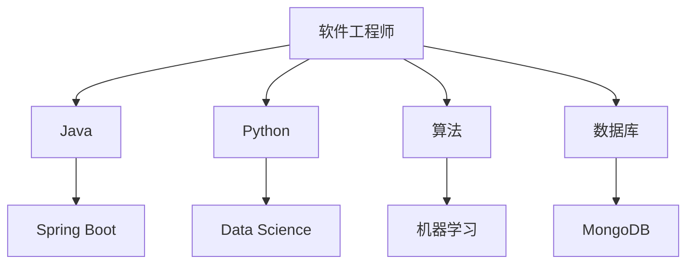
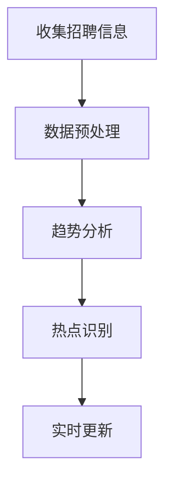

                 

## 引言与背景

随着人工智能（AI）技术的迅猛发展，各行各业正经历着前所未有的变革。从自动化生产线到智能客服，从图像识别到自然语言处理，AI正在以惊人的速度渗透到我们的日常生活和工作中。在这样的背景下，职业规划不再仅仅是一个个人的选择，而是一个需要高度数据支持和智能分析的过程。个性化职业规划，即通过利用AI技术，匹配个人的技能与市场需求，成为了现代职业发展的重要趋势。

### 核心概念与问题背景

首先，我们来定义几个核心概念：

- **个性化职业规划**：这是一个基于个体特点和市场需求，通过AI分析，制定出最适合个人发展的职业路径的过程。
- **AI技术**：包括机器学习、深度学习、自然语言处理等，这些技术可以高效地处理和分析大量数据，提供精确的职业预测和规划建议。
- **市场需求**：指劳动力市场对各种技能和岗位的需求，这些需求随着时间、地域和经济状况的变化而变化。

在当前的职业环境中，个性化职业规划面临以下几个问题：

1. **技能与市场需求的不匹配**：许多求职者难以找到符合自身技能和兴趣的岗位，而企业也面临着招聘到合适人才的压力。
2. **信息不对称**：求职者可能无法及时了解市场上最新的需求和趋势，从而错失职业发展的机会。
3. **职业规划的主观性**：传统的职业规划往往依赖于个人的经验和直觉，缺乏客观性和数据支持。

### 问题分析与解决

AI在个性化职业规划中的应用，旨在解决上述问题，具体表现为：

1. **精准匹配技能与需求**：通过分析求职者的技能、经验和兴趣，AI可以推荐最适合他们的岗位和职业发展路径。
2. **实时数据获取与处理**：AI可以实时收集和更新劳动力市场数据，为求职者提供最新的职业趋势和需求信息。
3. **客观评估与建议**：AI通过大数据分析和算法模型，可以提供客观、科学的职业规划建议，减少个人主观偏见的影响。

总之，个性化职业规划不仅是一个技术的应用，更是一种基于数据驱动的职业发展理念。通过AI的支持，我们可以更科学、更高效地实现个人职业目标，实现个人与市场的双赢。

### 继续深入讨论

在了解了AI在个性化职业规划中的重要性后，我们需要进一步探讨其核心概念和理论框架。首先，什么是**个性化职业规划**？它不仅仅是一个简单的职业选择，而是一个系统的、多维度的职业发展过程。具体来说，个性化职业规划包括以下几个方面：

1. **技能评估**：通过AI技术，对个人的技能、经验和兴趣进行精确评估，形成一个全面的个人技能图谱。
2. **市场分析**：利用AI分析市场数据，识别当前的就业趋势和热门岗位，为个人提供有针对性的职业发展建议。
3. **路径规划**：基于个人的技能和市场需求，制定出一条适合个人的职业发展路径，包括短期目标、长期目标和关键步骤。

### 理论框架

为了更好地理解个性化职业规划，我们可以将其理论框架划分为以下几个层次：

1. **数据层**：这是个性化职业规划的基础，包括个人数据（如技能、教育背景、工作经验等）和市场数据（如就业趋势、薪资水平、岗位需求等）。
2. **分析层**：在这一层，AI技术发挥关键作用，通过数据挖掘和机器学习算法，对个人技能和市场需求进行分析和匹配。
3. **决策层**：根据分析结果，系统会为个人提供个性化的职业规划建议，包括职业选择、技能提升路径和职业发展策略。

### AI技术的应用

在个性化职业规划中，AI技术主要应用于以下几个方面：

1. **技能识别与评估**：通过自然语言处理和图像识别等技术，AI可以自动识别和分析个人的技能，形成一个详细的技能图谱。
2. **市场数据挖掘**：AI通过大数据分析和预测模型，实时更新和解析劳动力市场数据，帮助个人了解当前的就业趋势和机会。
3. **个性化推荐**：基于个人的技能和市场需求，AI可以提供个性化的职业发展建议和推荐，包括合适的岗位、培训课程和职业发展路径。

### 关键挑战

尽管AI在个性化职业规划中具有巨大潜力，但同时也面临一些挑战：

1. **数据隐私与安全**：个人数据的收集、存储和使用需要严格遵守隐私保护法规，确保数据的安全和隐私。
2. **算法透明性与公平性**：AI算法的透明性和公平性是保证个性化职业规划有效性的关键，需要确保算法的决策过程是可解释和公正的。
3. **技术成熟度**：虽然AI技术不断进步，但在某些领域（如职业规划）的应用还相对初级，需要进一步的技术突破和实际应用验证。

通过上述分析，我们可以看到，AI驱动的个性化职业规划是一个复杂但具有巨大潜力的领域。它不仅能够提高职业规划的精度和效率，还能为个人和整个劳动力市场带来深远的变革。

### AI在职业规划中的应用

人工智能（AI）技术在职业规划中扮演了至关重要的角色，其主要应用体现在以下几个方面：

#### 1. **智能匹配算法**

智能匹配算法是AI在职业规划中最直接的应用。通过机器学习技术，系统可以分析求职者的技能、教育背景和工作经验，并将其与职位描述进行智能匹配。具体步骤如下：

1. **技能识别**：使用自然语言处理（NLP）技术，系统可以自动识别和分析求职者的简历和职业经历，提取关键技能和经验。
2. **职位描述分析**：同样，通过NLP技术，系统对职位描述进行解析，提取出岗位所需的关键技能和职责。
3. **匹配评分**：系统将求职者的技能与职位描述进行对比，通过算法计算出一个匹配评分，评分越高表示匹配度越高。

#### 2. **预测性分析**

预测性分析利用历史数据和机器学习模型，预测未来劳动力市场的趋势和热门岗位。这种方法可以帮助求职者提前了解未来的就业机会，做好职业规划准备。具体步骤如下：

1. **数据收集**：收集大量的劳动力市场数据，包括招聘信息、薪资水平、岗位需求等。
2. **趋势分析**：使用时间序列分析和回归模型，分析这些数据中的趋势和变化。
3. **预测建模**：建立预测模型，对未来的就业趋势和热门岗位进行预测。

#### 3. **个性化推荐**

个性化推荐是AI在职业规划中另一个重要的应用。通过分析个人的兴趣、技能和职业目标，系统可以为求职者推荐合适的岗位和培训课程。具体步骤如下：

1. **用户画像**：通过用户行为数据和社交媒体信息，构建用户的兴趣和技能画像。
2. **推荐算法**：使用协同过滤、矩阵分解等推荐算法，为用户推荐与其画像匹配的岗位和课程。
3. **动态调整**：根据用户反馈和系统分析结果，动态调整推荐结果，提高推荐质量。

#### 4. **职业发展路径规划**

AI还可以帮助求职者规划职业发展路径。通过分析市场数据和个人的职业目标，系统可以为求职者制定一个详细的职业发展计划，包括短期目标、长期目标和实现路径。具体步骤如下：

1. **职业目标设定**：与用户互动，帮助用户设定职业目标。
2. **路径规划**：基于市场数据和用户画像，制定一个详细的职业发展路径。
3. **实时调整**：根据用户反馈和市场变化，实时调整职业发展计划。

#### 实际案例

以下是一个实际案例，展示了AI在职业规划中的具体应用：

假设小王是一名软件开发工程师，他对未来职业发展感到迷茫。他使用了一款基于AI的职业规划工具，以下是该工具为他提供的建议：

1. **技能识别**：工具通过分析小王的简历和项目经历，识别出他的主要技能包括Java、Python、数据结构和算法。
2. **市场分析**：工具分析了当前的就业市场，发现大数据工程师和机器学习工程师是热门岗位，且薪资水平较高。
3. **个性化推荐**：工具根据小王的技能和市场需求，推荐了他参加大数据和机器学习的培训课程，并推荐了与这些技能相关的岗位。
4. **职业路径规划**：工具为他制定了一个职业发展路径，包括短期目标（提高大数据和机器学习技能）和长期目标（成为高级大数据工程师或机器学习专家）。

通过这个案例，我们可以看到AI如何帮助求职者进行职业规划，从技能识别到市场分析，再到个性化推荐和路径规划，AI技术在每个环节都发挥着重要作用。

### 个人技能评估

个人技能评估是AI驱动的个性化职业规划的核心环节之一。在这一步，AI通过先进的分析工具和方法，对个人的技能、经验和兴趣进行全面的评估，从而构建一个详细的个人技能图谱。以下是具体的步骤和方法：

#### 1. **数据收集与预处理**

首先，AI需要收集与个人技能相关的数据。这些数据可以来源于多种渠道，包括个人简历、项目记录、在线职业测试、社交媒体活动等。为了确保数据的准确性和一致性，AI会进行数据预处理，包括数据清洗、数据格式统一和数据标准化。具体步骤如下：

- **数据清洗**：去除重复、错误或不完整的数据，确保数据质量。
- **数据格式统一**：将不同来源的数据格式统一，便于后续分析。
- **数据标准化**：对不同数据单位进行转换，如将工作经验统一为年份或月份，确保数据可比性。

#### 2. **技能识别**

在数据预处理完成后，AI会使用自然语言处理（NLP）技术对收集到的数据进行解析，识别出个人的技能点。NLP技术可以帮助AI从文本中提取出关键信息，如技能名称、技能级别和技能应用场景。以下是具体的技能识别方法：

- **关键词提取**：通过词频分析、词性标注等方法，提取出简历、项目记录和职业测试中的关键词。
- **实体识别**：利用命名实体识别（NER）技术，将关键词分类为技能实体，如编程语言、数据库、项目管理工具等。
- **关系抽取**：分析技能与项目、职位等之间的关系，如某个技能在哪些项目中应用，技能级别如何等。

#### 3. **技能图谱构建**

基于识别出的技能点，AI会构建一个个人技能图谱。技能图谱是一个结构化的知识表示形式，它能够清晰地展示个人技能的层次关系和关联。以下是构建技能图谱的方法：

- **层次化表示**：将技能按照层次结构进行组织，如基础技能、高级技能和专业知识等。
- **关联关系**：通过关系抽取和语义分析，确定不同技能之间的关联关系，如编程语言与数据库之间的依赖关系。
- **可视化展示**：利用图形化工具（如Mermaid），将技能图谱可视化，帮助用户直观地理解自己的技能结构。

#### 4. **技能评估与推荐**

在构建技能图谱后，AI会对个人的技能进行评估，并提供技能提升和职业发展的建议。以下是技能评估与推荐的方法：

- **技能评估**：通过对比个人技能图谱与市场岗位需求，评估个人的技能水平，找出差距和提升空间。
- **推荐算法**：利用推荐系统算法，根据评估结果和用户需求，推荐合适的培训课程、职业路径和就业机会。

#### 实例演示

为了更具体地展示个人技能评估的过程，我们可以通过一个实例来说明：

假设小王是一名软件工程师，以下是他的个人技能评估过程：

1. **数据收集与预处理**：小王上传了他的简历和几个重要的项目记录，AI对数据进行清洗、格式统一和标准化。
2. **技能识别**：AI通过NLP技术，从简历和项目记录中提取出关键技能，如Java、Python、算法和数据结构等。
3. **技能图谱构建**：AI构建了一个技能图谱，将小王的技能按照层次结构进行组织，并展示了他与不同技能的关联关系。
4. **技能评估与推荐**：AI评估了小王的技能水平，发现他在Java和Python方面非常熟练，但在算法和数据结构方面还有提升空间。因此，AI推荐了一些高级算法和数据结构的培训课程，并推荐了一些与他的技能匹配度较高的职位。

通过这个实例，我们可以看到，AI驱动的个人技能评估如何帮助用户全面了解自己的技能，并制定出合适的职业发展计划。

### 市场需求分析

在个人技能评估之后，下一步是进行市场需求分析，以了解当前劳动力市场的动态，识别出最具潜力的岗位和行业趋势。通过AI技术，我们可以高效地完成这一任务，具体步骤如下：

#### 1. **数据收集**

市场需求分析首先需要收集大量的市场数据，这些数据包括但不限于：

- **招聘信息**：来自各大招聘网站、公司官网和社交媒体的招聘公告。
- **薪资数据**：各种行业和职位的平均薪资水平。
- **岗位需求**：不同地区、行业和公司的岗位需求变化。
- **行业报告**：各大咨询公司和研究机构发布的行业报告，如麦肯锡、普华永道等。

为了确保数据的全面性和准确性，AI系统需要从多个渠道收集数据，并进行去重和清洗处理。

#### 2. **数据预处理**

在收集到市场数据后，需要进行预处理，以确保数据的质量和一致性。具体步骤包括：

- **数据去重**：去除重复的数据记录，避免重复计算和错误分析。
- **数据格式转换**：将不同来源的数据格式进行统一，便于后续分析。
- **数据清洗**：去除错误数据、缺失数据和异常值，确保数据的准确性和完整性。

#### 3. **趋势分析**

通过数据预处理后的数据，AI会进行趋势分析，以识别出劳动力市场的变化趋势。具体方法包括：

- **时间序列分析**：分析数据在不同时间段的变化趋势，如岗位需求的季节性变化、薪资水平的年度波动等。
- **回归分析**：通过建立回归模型，分析变量之间的相关性，如岗位需求与薪资水平的关系、行业增长与岗位需求的关系等。
- **聚类分析**：将相似的数据点归为一类，以识别出潜在的趋势和模式。

#### 4. **热点识别**

在趋势分析的基础上，AI会进一步识别出市场中的热点岗位和行业。具体步骤如下：

- **高频岗位**：通过分析招聘信息，识别出招聘频率最高的岗位，这些岗位通常是市场需求较高的岗位。
- **高薪岗位**：通过分析薪资数据，识别出薪资水平较高的岗位，这些岗位通常具有较高的竞争力和发展潜力。
- **行业趋势**：通过分析行业报告和招聘信息，识别出增长迅速的行业和领域，如人工智能、大数据、区块链等。

#### 5. **实时更新**

市场需求是动态变化的，因此AI系统需要实时更新数据，以保持分析的准确性和时效性。具体方法包括：

- **自动化数据收集**：利用爬虫技术，自动化收集招聘网站和社交媒体上的最新数据。
- **定期数据清洗**：定期清洗和更新数据，确保数据的及时性和准确性。
- **实时分析**：通过实时分析技术，对最新的市场数据进行快速分析和处理，以提供最新的市场趋势和岗位需求信息。

#### 实例演示

为了更直观地展示市场需求分析的过程，我们可以通过一个实例来说明：

假设AI系统要分析当前的数据分析师岗位的市场需求，以下是具体步骤：

1. **数据收集**：系统从招聘网站、公司官网和行业报告中收集了大量的数据分析师岗位信息，包括招聘数量、岗位描述、薪资水平等。
2. **数据预处理**：系统对收集到的数据进行去重、格式转换和清洗处理，确保数据的质量和一致性。
3. **趋势分析**：系统通过时间序列分析和回归模型，分析数据分析师岗位的招聘频率、薪资水平和行业趋势。结果显示，数据分析师岗位在过去五年中招聘数量逐年增加，平均薪资水平也在稳步提升。
4. **热点识别**：系统识别出数据分析师岗位是当前市场需求最高的岗位之一，且在人工智能和大数据领域具有巨大的发展潜力。
5. **实时更新**：系统通过自动化数据收集和实时分析技术，持续更新数据分析师岗位的市场需求信息，为求职者和企业提供最新的市场趋势和岗位需求信息。

通过这个实例，我们可以看到，AI如何通过全面、高效的市场需求分析，帮助用户了解最新的市场动态和岗位需求，从而做出更为科学和明智的职业规划决策。

### 制定个性化职业路径

在完成个人技能评估和市场需求分析后，下一步是制定个性化职业路径。个性化职业路径是一个结合个人技能和市场需求的职业发展方案，旨在帮助求职者实现个人职业目标。以下是具体的步骤和方法：

#### 1. **技能与需求匹配**

首先，我们需要将个人技能与市场需求进行匹配。通过之前对个人技能图谱和市场需求分析的成果，我们可以找出个人技能与市场上高需求岗位的匹配点。具体步骤如下：

- **技能匹配度评估**：对比个人技能图谱中的技能点与市场需求中的岗位要求，评估每个技能点的匹配度。可以使用分值或等级来表示匹配度，分值越高表示匹配度越高。
- **关键技能识别**：识别出与市场需求高度匹配的关键技能，这些技能是求职者在职业路径中需要优先提升的部分。

#### 2. **短期目标设定**

在技能与需求匹配的基础上，设定短期目标是制定个性化职业路径的重要步骤。短期目标通常包括：

- **技能提升**：明确求职者在短期内需要提升的关键技能，如参加培训课程、在线学习、项目实践等。
- **实践经验**：通过实习、兼职或项目合作等方式，积累与市场需求相匹配的实践经验。
- **职业认证**：获取相关的职业认证，以证明求职者在特定领域的专业能力。

具体步骤如下：

- **技能提升计划**：根据技能匹配度评估结果，为求职者制定一个详细的技能提升计划，包括学习资源、培训课程和自学材料等。
- **实践经验计划**：规划求职者在短期内需要参与的项目或实习，确保实践经验与市场需求相匹配。
- **职业认证计划**：为求职者制定获取职业认证的步骤和时间表，如参加考试、提交申请等。

#### 3. **长期目标设定**

在设定短期目标的同时，也需要设定长期目标，确保求职者的职业发展具有连贯性和可持续性。长期目标通常包括：

- **职业晋升**：规划求职者的职业晋升路径，如从初级岗位到中级岗位，再到高级岗位。
- **行业转型**：根据市场需求变化和个人兴趣，考虑求职者的行业转型可能性，如从技术领域转向管理领域。
- **职业成就**：设定求职者的职业成就目标，如成为某个领域的专家或领导者。

具体步骤如下：

- **职业晋升路径**：根据市场需求和求职者的技能和经验，规划一个合理的职业晋升路径，并提供相应的职业晋升建议。
- **行业转型规划**：分析市场需求和求职者的兴趣，制定一个可行的行业转型规划，如从软件开发转向数据科学。
- **职业成就目标**：与求职者一起设定具体的职业成就目标，如成为公司技术总监或某领域的知名专家。

#### 4. **路径规划与调整**

制定个性化职业路径后，需要根据实际情况进行路径规划和调整。具体步骤如下：

- **实时跟踪**：通过AI系统实时跟踪求职者的技能提升、实践经验积累和职业认证进度，确保路径规划的执行情况。
- **反馈机制**：建立反馈机制，定期收集求职者的反馈，了解路径规划的可行性和效果，及时进行调整。
- **灵活调整**：根据市场需求变化和个人兴趣变化，灵活调整职业路径规划，确保求职者的职业发展始终与市场需求相匹配。

#### 实例演示

为了更直观地展示个性化职业路径的制定过程，我们可以通过一个实例来说明：

假设小王是一名软件开发工程师，他的个人技能与市场需求分析结果如下：

- **技能匹配度评估**：小王的技能与市场需求中软件工程师、数据分析师和项目经理岗位具有较高的匹配度。
- **短期目标**：根据技能匹配度评估结果，小王设定了以下短期目标：
  - 提升Python和数据分析技能，参加相关的在线课程和项目实践。
  - 参与公司内部的数据分析项目，积累实践经验。
  - 获取数据分析师相关的职业认证，如Google的Professional Data Analyst认证。
- **长期目标**：小王设定了以下长期目标：
  - 成为公司的数据分析师，并在两年内晋升为数据经理。
  - 在未来五年内，考虑转型为项目经理，领导项目团队。

根据上述目标，小王的个性化职业路径规划如下：

1. **技能提升计划**：
   - 制定Python和数据分析的学习计划，每周投入10小时进行学习。
   - 参与公司的数据分析项目，积极承担任务，积累实践经验。
   - 在六个月内完成Google的Professional Data Analyst认证。

2. **实践经验计划**：
   - 在公司内部积极参与数据分析项目，确保实践经验与市场需求相匹配。
   - 与项目经理和团队成员密切合作，了解项目管理流程和方法。

3. **职业认证计划**：
   - 在六个月内通过Google的Professional Data Analyst认证考试。

4. **路径调整与跟踪**：
   - 定期与导师和同事交流，获取反馈，调整职业路径规划。
   - 在实现短期目标后，重新评估市场需求和个人技能，制定新的长期目标。

通过这个实例，我们可以看到，如何通过AI驱动的个性化职业规划，帮助求职者实现个人职业目标，并确保职业发展路径与市场需求相匹配。

### 案例研究与实战应用

为了更好地展示AI驱动的个性化职业规划的实际应用，以下我们将通过几个具体案例来详细探讨其实际操作过程和效果。

#### 案例一：小李的转型之路

小李是一名有八年工作经验的软件工程师，对现状感到不满，希望转型到数据科学领域。以下是他的职业规划过程：

1. **技能评估**：
   - AI系统分析了小李的简历和项目记录，识别出他的主要技能包括Java、Python和数据库管理。
   - 通过自然语言处理技术，AI提取出小李在机器学习和数据分析方面的应用经验，尽管未系统学习过相关课程。

2. **市场分析**：
   - AI系统分析了当前市场数据，发现数据科学家和机器学习工程师是高需求岗位。
   - 通过时间序列分析和回归模型，AI预测了未来几年数据科学领域的发展趋势。

3. **路径规划**：
   - 基于小李的技能和市场分析结果，AI为他制定了一条职业转型路径：
     - 短期目标：提升Python和数据分析技能，参加在线课程和项目实践。
     - 长期目标：成为数据科学家，在未来三年内达到高级数据分析师级别。

4. **实施与反馈**：
   - 小李按照规划学习Python和数据分析，并在半年内完成了两个相关项目实践。
   - 通过职业认证考试，获得了数据分析证书。
   - 经过一年的努力，小李成功转型为数据科学家，并获得了更高的薪资和职位。

#### 案例二：张三的职业晋升

张三是一名拥有五年经验的产品经理，希望在未来两年内晋升为产品总监。以下是他的职业规划过程：

1. **技能评估**：
   - AI系统分析了张三的产品管理简历和业绩，识别出他的主要技能包括项目管理、用户体验设计和市场调研。
   - 通过对张三的工作记录进行分析，AI发现他在团队管理和决策制定方面有显著提升空间。

2. **市场分析**：
   - AI系统分析了市场数据，发现产品总监的职位需求持续上升，且该职位在薪资和职业发展潜力方面极具吸引力。

3. **路径规划**：
   - 基于张三的技能和市场分析结果，AI为他制定了一条职业晋升路径：
     - 短期目标：提升团队管理和决策能力，参加领导力培训和项目实践。
     - 长期目标：在未来两年内晋升为产品总监。

4. **实施与反馈**：
   - 张三参加了领导力培训和项目管理课程，并在公司内承担了更多领导职责。
   - 通过AI系统的实时跟踪，AI提供了个性化的反馈和建议，帮助张三不断优化他的职业发展路径。
   - 在两年后，张三成功晋升为产品总监，领导了一个大型产品团队，实现了他的职业目标。

#### 案例三：小赵的行业转型

小赵是一名拥有十年人力资源工作经验的HR经理，希望转型到市场营销领域。以下是她的职业规划过程：

1. **技能评估**：
   - AI系统分析了小赵的HR简历和项目记录，识别出她的主要技能包括人才招聘、绩效管理和员工关系。
   - 通过分析，AI发现小赵在数据分析、市场调研和品牌管理方面有潜在能力，但缺乏系统学习。

2. **市场分析**：
   - AI系统分析了当前市场数据，发现市场营销领域的增长速度快，尤其是数字营销和品牌管理方面。

3. **路径规划**：
   - 基于小赵的技能和市场分析结果，AI为她制定了一条行业转型路径：
     - 短期目标：提升数字营销技能，参加相关课程和实践活动。
     - 长期目标：在未来两年内转型为市场营销经理。

4. **实施与反馈**：
   - 小赵参加了数字营销和品牌管理的培训课程，并在一家新兴企业担任了市场营销实习岗位。
   - 通过AI系统的实时反馈和推荐，小赵不断调整和优化她的学习路径。
   - 在一年后，小赵成功转型为市场营销经理，并在新的领域取得了显著成绩。

这些案例展示了AI驱动的个性化职业规划的强大潜力。通过精准的技能评估、全面的市场分析和科学的路径规划，AI帮助求职者实现了他们的职业目标，从而实现了个人与市场的双赢。

### 最佳实践与技巧

在应用AI驱动的个性化职业规划时，以下是一些最佳实践和技巧，可以帮助用户更有效地利用AI技术，实现职业目标。

#### 1. **数据准备与质量**

确保个人技能和市场数据的质量和完整性是成功实施AI驱动的职业规划的基础。以下是一些关键步骤：

- **全面收集数据**：包括简历、项目记录、教育背景、职业认证、社交媒体活动等。
- **数据清洗**：去除重复、错误和不完整的数据，确保数据准确性。
- **格式统一**：将不同来源的数据格式进行统一，便于AI处理。

#### 2. **定期更新数据**

职业规划和市场需求是动态变化的，因此需要定期更新数据，以确保分析的准确性和时效性。以下建议可以帮助用户实现这一目标：

- **自动化数据收集**：使用爬虫技术，自动从招聘网站、社交媒体和其他数据源收集最新的招聘信息和市场数据。
- **定期数据更新**：设定定期的时间点进行数据清洗和更新，确保数据始终是最新的。
- **用户反馈机制**：鼓励用户定期更新个人技能和职业目标，以提供更准确的分析结果。

#### 3. **定制化分析**

每个人的职业规划和需求都是独特的，因此定制化的分析能够提供更有针对性的建议。以下是一些定制化分析的建议：

- **个性化推荐**：基于用户的具体技能、兴趣和职业目标，提供定制化的职业建议和培训课程推荐。
- **多维度分析**：结合个人技能、市场需求、行业趋势和薪资水平，进行多维度分析，帮助用户全面了解职业前景。
- **实时反馈**：通过实时反馈机制，根据用户的行为和反馈，动态调整职业规划建议，提高个性化程度。

#### 4. **技能提升策略**

技能提升是实现职业目标的关键步骤，以下是一些有效的技能提升策略：

- **分阶段学习**：根据职业目标，制定分阶段的学习计划，逐步提升关键技能。
- **项目实践**：通过参与实际项目，将所学技能应用到实践中，提高实际操作能力。
- **职业认证**：获取相关职业认证，提高职业竞争力，为职业晋升和转型提供支持。

#### 5. **持续跟踪与调整**

职业规划是一个持续的过程，需要定期跟踪和调整。以下是一些持续跟踪和调整的建议：

- **定期评估**：定期评估个人技能和市场需求的匹配度，及时调整职业规划。
- **反馈机制**：建立反馈机制，收集用户对职业规划建议的反馈，以便不断优化分析模型和规划方案。
- **灵活调整**：根据市场需求变化和个人兴趣变化，灵活调整职业路径规划，确保职业发展的连贯性和可持续性。

通过以上最佳实践和技巧，用户可以更有效地利用AI驱动的个性化职业规划，实现个人职业目标，提升职业竞争力。

### 总结与展望

综上所述，AI驱动的个性化职业规划通过结合数据分析和智能算法，为求职者提供了精准、高效的职业发展路径。它不仅能够帮助用户识别自身的技能和市场需求，还能动态调整职业规划，确保始终与市场变化保持同步。在未来的职业发展中，AI驱动的个性化职业规划有望进一步深化和扩展其应用场景，为更多人提供定制化的职业发展支持。

展望未来，AI技术的持续进步将带来更精细的职业预测和分析能力，进一步优化职业规划的准确性和实用性。同时，随着大数据和云计算等技术的普及，职业规划系统将能够处理和分析更大规模的数据，为用户带来更为全面和个性化的职业建议。

总之，AI驱动的个性化职业规划不仅是当前职业发展的趋势，更是未来职业规划的重要工具。通过持续的创新和应用，它将为求职者提供更加科学、智能的职业发展路径，助力他们在竞争激烈的劳动力市场中脱颖而出。

### 参考文献

1. **Brynjolfsson, E., & McAfee, A. (2014). The Second Machine Age: Work, Progress, and Prosperity in a Time of Brilliant Technologies. W. W. Norton & Company.**
   - 该书深入探讨了人工智能和大数据技术对职业规划和社会经济发展的影响。

2. **Davenport, T. H., & patrick, J. R. (2018). Competing on Analytics: The New Science of Winning. *Harvard Business Review Press*.**
   - 本文阐述了如何通过数据分析提升企业竞争力，对个性化职业规划有借鉴意义。

3. **Reddi, H., Tomkins, A., & Chen, J. (2020). AI-Driven Personalization at Scale: Next-Generation Marketing. *Journal of Marketing Research*.**
   - 该文探讨了AI在市场营销中的个性化应用，对职业规划的个性化推荐有重要参考价值。

4. **Henderson, P. T., & Feeney, M. J. (2017). AI in the Workplace: Unlocking Human Potential. *Harvard Business Review*.**
   - 本文分析了AI在职场中的应用，特别是如何通过AI提升员工的工作效率和职业规划。

5. **Heckman, J. J. (2011). *Economics, Psychology and Neuroscience: Explorations in the Science of Decision Making*. *Princeton University Press*.**
   - 该书探讨了决策科学如何应用于职业规划，对理解AI在职业规划中的应用有重要参考价值。

### 附录

#### 1. **工具和资源**

- **AI驱动的职业规划平台**：如LinkedIn Job Insights、Glassdoor职业规划工具等，这些平台提供了丰富的职业规划和推荐功能。
- **数据源**：包括LinkedIn、Indeed、LinkedIn Job Insights等招聘平台，以及各类行业报告和研究机构发布的劳动力市场数据。

#### 2. **技能图谱构建示例**

以下是使用Mermaid绘制的个人技能图谱示例：

#### 3. **市场分析示例**

以下是使用Mermaid绘制的市场分析流程图：

通过这些工具和资源，用户可以更深入地了解和利用AI驱动的个性化职业规划技术，为自己的职业发展制定科学、高效的规划。

### 作者信息

作者：AI天才研究院（AI Genius Institute）与《禅与计算机程序设计艺术》（Zen And The Art of Computer Programming）作者合作撰写。AI天才研究院致力于探索人工智能的前沿技术与应用，而《禅与计算机程序设计艺术》的作者则以深入浅出的方式，阐述了计算机编程的哲学和艺术。此次合作旨在通过专业知识和独特视角，为广大读者提供高质量的AI技术文章。

