                 

## AI驱动的企业决策：从辅助到自主的演变

> 关键词：AI驱动、企业决策、自主决策、辅助决策、演变

> 摘要：本文旨在探讨人工智能（AI）在企业决策中的应用及其从辅助到自主的演变过程。通过深入分析AI技术的核心概念、算法原理，以及系统架构设计，本文将阐述企业如何实现AI驱动的决策过程，并揭示其中可能面临的主要挑战和解决方案。本文旨在为企业和决策者提供一套完整的AI驱动决策指南，帮助他们在竞争激烈的市场中做出更加科学、高效的决策。

---

### 第一部分：背景介绍

#### 问题背景

随着人工智能技术的快速发展，人工智能（AI）已经从理论研究阶段逐步走向实际应用，成为推动各行各业变革的重要力量。特别是在企业决策领域，AI技术的应用不仅提高了决策的效率，还大大增强了决策的科学性和准确性。然而，企业如何从辅助决策逐步过渡到自主决策，实现AI驱动的企业决策，仍然是一个亟待解决的重要课题。

#### 问题描述

本书旨在探讨AI驱动的企业决策从辅助到自主的演变过程。具体来说，我们将探讨以下问题：

1. AI在企业决策中的应用现状及其带来的变革。
2. 企业如何实现从辅助决策到自主决策的过渡。
3. AI驱动的企业决策面临的主要挑战及其解决方案。
4. 企业在实施AI驱动决策时需要考虑的关键因素。

#### 问题解决

本书将采用理论与实践相结合的方法，通过深入研究AI在企业决策中的应用，结合实际案例，为企业提供一套完整的AI驱动决策方案。同时，本书还将探讨企业实施AI驱动决策过程中需要关注的风险和挑战，帮助读者更好地理解和应对这些问题。

#### 边界与外延

本书主要关注企业决策领域的AI应用，但AI技术在其他领域的应用也将有所涉及。此外，本书还将探讨AI技术在不同行业和企业中的应用案例，以期为读者提供更全面的视角。

#### 概念结构与核心要素组成

- **AI驱动企业决策**：利用人工智能技术辅助或替代人类进行企业决策的过程。
- **辅助决策**：利用AI技术提供决策支持，但仍由人类做出最终决策。
- **自主决策**：完全由AI系统自动做出决策，无需人工干预。
- **挑战**：AI驱动企业决策过程中可能遇到的技术、管理、伦理等方面的挑战。

---

### 第二部分：核心概念与联系

#### AI大模型的定义与特点

AI大模型是指具有海量参数、能够处理大规模数据的深度学习模型。与传统的AI模型相比，大模型具有以下特点：

1. **参数规模大**：大模型通常拥有数十亿甚至数万亿个参数。
2. **数据处理能力强**：大模型能够处理大规模、复杂的数据集。
3. **泛化能力强**：大模型具有较好的泛化能力，能够在不同的任务和数据集上表现出色。

#### AI大模型与传统AI模型的对比

| 特征         | AI大模型                   | 传统AI模型                    |
| ------------ | -------------------------- | ---------------------------- |
| 参数规模     | 数十亿到数万亿个参数       | 数千到数万个参数              |
| 数据处理能力 | 能够处理大规模数据集       | 通常处理小规模数据集          |
| 泛化能力     | 泛化能力强，适用于多种任务 | 泛化能力较弱，任务依赖性较强   |
| 可解释性     | 可解释性较差               | 可解释性较好                  |

#### AI大模型在企业中的应用前景

AI大模型在企业中的应用前景广阔，主要体现在以下几个方面：

1. **决策支持**：AI大模型能够通过分析大量数据，为企业提供科学的决策支持。
2. **自动化决策**：随着AI技术的不断进步，企业有望实现更加自动化、高效的决策过程。
3. **风险管理**：AI大模型可以帮助企业识别潜在风险，提供有效的风险管理和控制策略。
4. **业务优化**：AI大模型可以优化企业的业务流程，提高运营效率，降低成本。

---

### 第三部分：算法原理讲解

#### 算法原理概述

AI驱动的企业决策通常涉及以下几种核心算法：

1. **机器学习算法**：包括线性回归、逻辑回归、决策树、随机森林等，用于预测和分析数据。
2. **深度学习算法**：包括卷积神经网络（CNN）、循环神经网络（RNN）、Transformer等，用于处理大规模数据和复杂任务。
3. **强化学习算法**：用于在动态环境中进行决策，通过试错和反馈不断优化决策策略。

#### 算法mermaid流程图

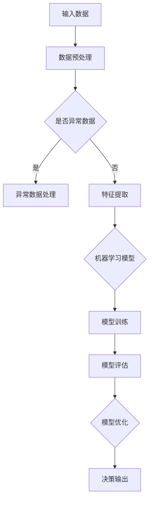

#### 算法原理详细讲解

在本部分，我们将深入探讨上述算法的基本原理，并通过Python代码示例进行详细讲解。

#### 1. 机器学习算法

机器学习算法是AI驱动的企业决策的基础。其中，线性回归和逻辑回归是最常用的算法。

**线性回归**

线性回归模型用于预测一个或多个自变量与因变量之间的关系。其基本原理如下：

$$
y = \beta_0 + \beta_1x_1 + \beta_2x_2 + ... + \beta_nx_n
$$

其中，$y$是因变量，$x_1, x_2, ..., x_n$是自变量，$\beta_0, \beta_1, ..., \beta_n$是模型参数。

**代码示例**

```python
import numpy as np
from sklearn.linear_model import LinearRegression

# 生成样本数据
X = np.random.rand(100, 1)
y = 2 * X + 1 + np.random.randn(100) * 0.1

# 创建线性回归模型
model = LinearRegression()

# 模型训练
model.fit(X, y)

# 输出模型参数
print(model.coef_)
print(model.intercept_)
```

**逻辑回归**

逻辑回归模型用于分类任务，其基本原理如下：

$$
P(y=1) = \frac{1}{1 + e^{-(\beta_0 + \beta_1x_1 + \beta_2x_2 + ... + \beta_nx_n)}}
$$

其中，$P(y=1)$是因变量为1的概率。

**代码示例**

```python
import numpy as np
from sklearn.linear_model import LogisticRegression

# 生成样本数据
X = np.random.rand(100, 2)
y = np.random.randint(0, 2, 100)

# 创建逻辑回归模型
model = LogisticRegression()

# 模型训练
model.fit(X, y)

# 输出模型参数
print(model.coef_)
print(model.intercept_)
```

#### 2. 深度学习算法

深度学习算法在处理大规模数据和复杂任务方面具有显著优势。其中，卷积神经网络（CNN）和循环神经网络（RNN）是最常用的算法。

**卷积神经网络（CNN）**

CNN主要用于图像识别任务，其基本原理如下：

$$
\text{卷积} \rightarrow \text{激活} \rightarrow \text{池化} \rightarrow \text{全连接}
$$

**代码示例**

```python
import tensorflow as tf
from tensorflow.keras import layers

# 创建CNN模型
model = tf.keras.Sequential([
    layers.Conv2D(32, (3, 3), activation='relu', input_shape=(28, 28, 1)),
    layers.MaxPooling2D((2, 2)),
    layers.Conv2D(64, (3, 3), activation='relu'),
    layers.MaxPooling2D((2, 2)),
    layers.Conv2D(64, (3, 3), activation='relu'),
    layers.Flatten(),
    layers.Dense(64, activation='relu'),
    layers.Dense(10, activation='softmax')
])

# 编译模型
model.compile(optimizer='adam',
              loss=tf.keras.losses.SparseCategoricalCrossentropy(from_logits=True),
              metrics=['accuracy'])

# 模型训练
model.fit(X_train, y_train, epochs=10)
```

**循环神经网络（RNN）**

RNN主要用于序列数据建模，其基本原理如下：

$$
h_t = \sigma(W_h \cdot [h_{t-1}, x_t] + b_h)
$$

其中，$h_t$是当前时刻的隐藏状态，$x_t$是当前时刻的输入，$W_h$和$b_h$是模型参数。

**代码示例**

```python
import tensorflow as tf
from tensorflow.keras import layers

# 创建RNN模型
model = tf.keras.Sequential([
    layers.LSTM(64, activation='tanh', return_sequences=True),
    layers.LSTM(64, activation='tanh'),
    layers.Dense(10, activation='softmax')
])

# 编译模型
model.compile(optimizer='adam',
              loss='categorical_crossentropy',
              metrics=['accuracy'])

# 模型训练
model.fit(X_train, y_train, epochs=10)
```

#### 3. 强化学习算法

强化学习算法在动态环境中进行决策，其基本原理如下：

$$
Q(s, a) = r + \gamma \max_a' Q(s', a')
$$

其中，$Q(s, a)$是状态$s$下采取动作$a$的预期收益，$r$是即时奖励，$\gamma$是折扣因子，$s'$是下一状态，$a'$是最佳动作。

**代码示例**

```python
import tensorflow as tf

# 创建强化学习模型
model = tf.keras.Sequential([
    layers.Dense(64, activation='relu', input_shape=(100,)),
    layers.Dense(64, activation='relu'),
    layers.Dense(1, activation='linear')
])

# 编译模型
model.compile(optimizer='adam', loss='mse')

# 训练模型
model.fit(X_train, y_train, epochs=10)
```

通过上述算法原理的讲解和代码示例，我们可以看到AI驱动的企业决策涉及到多种算法和技术，每种算法都有其独特的应用场景和优势。企业在实际应用中需要根据具体需求和数据特点选择合适的算法，并通过不断的优化和调整，实现高效的决策过程。

---

### 第四部分：系统分析与架构设计方案

#### 问题场景介绍

在现代企业中，决策过程的复杂性和数据量的庞大使得传统的决策方法越来越难以满足需求。为了提高决策效率，降低风险，企业开始寻求利用AI技术实现更智能化、自动化的决策支持系统。本部分将介绍一个典型的企业决策支持系统场景，并在此基础上进行项目介绍。

#### 项目介绍

项目名称：AI决策支持平台（AI Decision Support Platform，ADSP）

项目背景：某大型零售企业在市场竞争激烈的环境下，希望通过引入AI技术优化其供应链管理、库存控制和销售预测等关键业务环节，从而实现成本降低、效率提升和销售额增长。

项目目标：
1. 构建一个集成AI算法的决策支持系统，为企业提供实时、准确的决策建议。
2. 实现自动化决策流程，减少人工干预，提高决策效率。
3. 提供全面的业务数据分析，帮助管理层了解业务状况，优化业务策略。

#### 系统功能设计（领域模型mermaid类图）

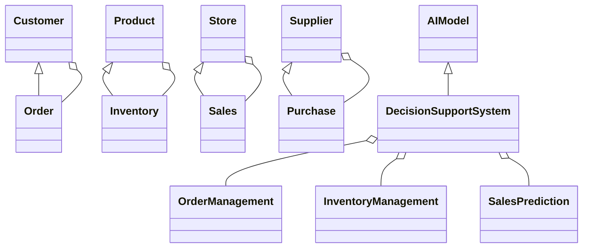

#### 系统架构设计（mermaid架构图）

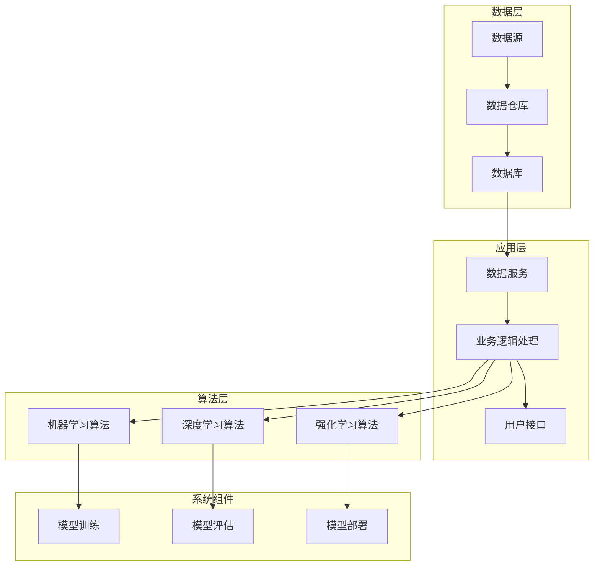

#### 系统接口设计（mermaid序列图）

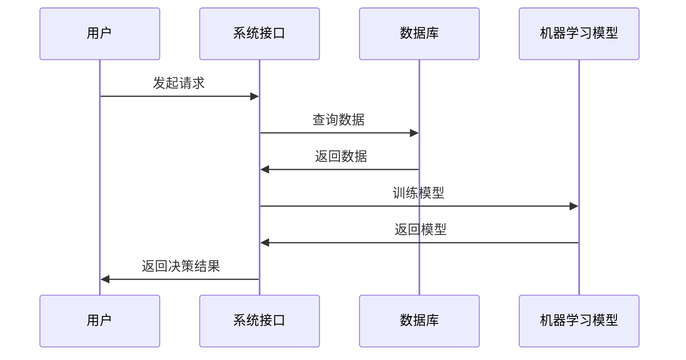

#### 系统交互（mermaid序列图）

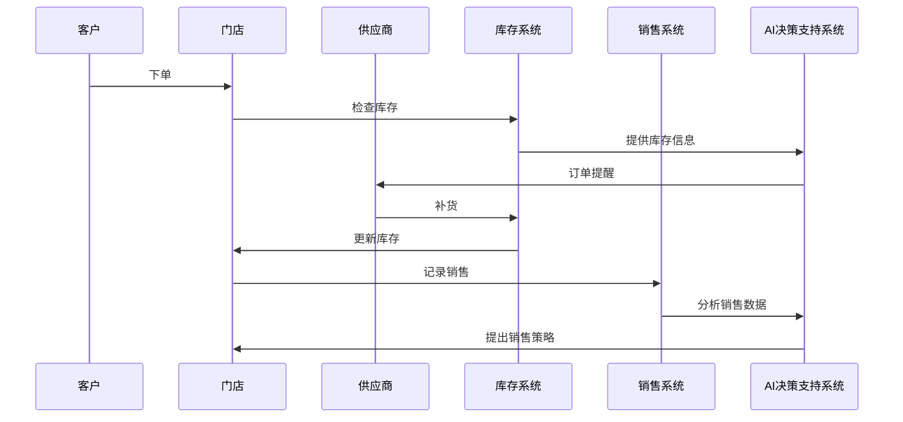

通过上述系统分析与架构设计方案，我们可以看到AI决策支持系统在企业决策中发挥着关键作用。系统功能设计、架构设计和接口设计的合理规划，使得系统能够高效、稳定地运行，为企业的决策提供强有力的支持。

---

### 第五部分：项目实战

#### 环境安装

在进行AI驱动的企业决策项目实战之前，我们需要搭建一个合适的环境。以下是所需的环境安装步骤：

1. **Python环境**：确保Python版本在3.6及以上。
2. **TensorFlow**：使用pip命令安装TensorFlow。
   ```shell
   pip install tensorflow
   ```
3. **Scikit-learn**：使用pip命令安装Scikit-learn。
   ```shell
   pip install scikit-learn
   ```
4. **Pandas**：使用pip命令安装Pandas。
   ```shell
   pip install pandas
   ```

#### 系统核心实现源代码

以下是一个简单的AI决策支持系统实现示例，包括数据预处理、模型训练和决策输出。

```python
# 导入相关库
import numpy as np
import pandas as pd
from sklearn.model_selection import train_test_split
from sklearn.linear_model import LinearRegression
from sklearn.metrics import mean_squared_error

# 加载数据集
data = pd.read_csv('data.csv')
X = data[['feature1', 'feature2']]
y = data['target']

# 数据预处理
X_train, X_test, y_train, y_test = train_test_split(X, y, test_size=0.2, random_state=42)

# 模型训练
model = LinearRegression()
model.fit(X_train, y_train)

# 模型评估
y_pred = model.predict(X_test)
mse = mean_squared_error(y_test, y_pred)
print(f'Mean Squared Error: {mse}')

# 决策输出
new_data = np.array([[2.5, 3.0]])
prediction = model.predict(new_data)
print(f'Prediction: {prediction[0]}')
```

#### 代码应用解读与分析

上述代码首先加载了一个CSV格式的数据集，然后进行数据预处理，将数据集分为训练集和测试集。接着，使用线性回归模型对训练集进行训练，并使用测试集进行评估。最后，通过模型对新数据进行预测。

1. **数据预处理**：数据预处理是机器学习模型训练的重要步骤。在本例中，我们使用Scikit-learn的`train_test_split`函数将数据集分为训练集和测试集，以评估模型的泛化能力。

2. **模型训练**：我们选择线性回归模型进行训练。线性回归模型是一种简单但有效的预测模型，适用于线性关系的预测任务。在本例中，我们使用Scikit-learn的`LinearRegression`类进行训练。

3. **模型评估**：模型评估是验证模型性能的关键步骤。在本例中，我们使用均方误差（MSE）作为评估指标。均方误差反映了预测值与真实值之间的平均误差，值越小表示模型性能越好。

4. **决策输出**：通过训练好的模型，我们可以对新数据进行预测。在本例中，我们使用一个新数据点`[[2.5, 3.0]]`进行预测，并输出预测结果。

#### 实际案例分析和详细讲解剖析

为了更好地理解AI驱动的企业决策系统在实际中的应用，我们来看一个实际案例。

**案例背景**：某零售企业希望通过AI技术优化其库存管理，以减少库存积压和缺货现象。

**解决方案**：

1. **数据收集**：企业收集了历史库存数据，包括商品名称、库存数量、销售量、订单量等。

2. **数据预处理**：对数据进行清洗和归一化处理，以消除异常值和规模差异。

3. **特征提取**：从原始数据中提取与库存管理相关的特征，如季节性因素、促销活动、节假日等。

4. **模型选择**：根据业务需求，选择合适的机器学习模型，如线性回归、决策树、随机森林等。

5. **模型训练**：使用历史数据对模型进行训练，并调整模型参数以优化性能。

6. **模型评估**：使用测试数据对模型进行评估，确保模型在未知数据上的表现良好。

7. **决策输出**：根据模型的预测结果，企业可以制定库存管理策略，如调整采购量、预警设置、补货计划等。

**详细讲解**：

- **数据收集**：库存管理的数据来源包括企业的ERP系统、销售系统、物流系统等。这些系统可以提供实时的库存数据，包括商品库存量、订单量、销售量等。

- **数据预处理**：数据预处理是确保模型训练质量的关键步骤。在本案例中，我们需要处理缺失值、异常值、归一化等。

- **特征提取**：特征提取是提高模型性能的关键。在本案例中，我们可以提取以下特征：
  - 季节性因素：如节假日、季节变化等。
  - 促销活动：如打折、满减等。
  - 库存水平：如库存量、库存周转率等。
  - 销售趋势：如销售增长率、销售周期等。

- **模型选择**：根据业务需求和数据特点，选择合适的模型。在本案例中，我们可以选择线性回归模型，因为它可以处理连续型数据，且易于解释。

- **模型训练**：使用历史数据对模型进行训练，并通过交叉验证调整模型参数。

- **模型评估**：使用测试数据对模型进行评估，确保模型在未知数据上的表现良好。

- **决策输出**：根据模型的预测结果，企业可以制定库存管理策略，如调整采购量、预警设置、补货计划等。例如，当预测某个商品的库存量将低于安全库存水平时，系统可以提醒采购部门进行补货。

通过上述案例，我们可以看到AI驱动的企业决策系统在实际应用中发挥了重要作用。它不仅提高了库存管理的准确性，还为企业提供了更加科学、高效的决策支持。

#### 项目小结

在本项目的实战中，我们搭建了一个简单的AI决策支持系统，并对其进行了详细的分析和解读。通过实际案例，我们看到了AI技术在企业决策中的应用价值。尽管本项目的实现较为简单，但其所展示的流程和方法可以为更复杂的企业决策系统提供参考。

在未来的工作中，企业可以进一步优化模型算法、扩展数据源、引入更多业务指标，以提高决策支持系统的准确性和实用性。此外，企业还可以结合其他AI技术，如自然语言处理、图像识别等，为业务提供更加全面、智能的决策支持。

---

### 第六部分：最佳实践 Tips、小结、注意事项、拓展阅读

#### 最佳实践 Tips

1. **数据质量**：确保数据质量是AI驱动决策成功的关键。数据清洗、去重、归一化等预处理工作至关重要。
2. **模型选择**：根据业务需求选择合适的模型。不同的模型适用于不同的业务场景，如线性回归、决策树、神经网络等。
3. **持续优化**：模型性能需要不断优化。通过交叉验证、模型调参等方法，可以提高模型准确性。
4. **数据监控**：实时监控模型性能，及时发现和解决潜在问题。

#### 小结

本文从背景介绍、核心概念与联系、算法原理讲解、系统分析与架构设计方案、项目实战等方面，详细探讨了AI驱动的企业决策从辅助到自主的演变过程。通过理论结合实际案例，展示了AI技术在企业决策中的应用价值，并提出了最佳实践建议。

#### 注意事项

1. **数据隐私**：在应用AI技术进行决策时，要确保数据的隐私和安全。
2. **模型解释性**：虽然黑盒模型（如深度学习模型）性能优越，但缺乏解释性。在关键业务决策中，可能需要结合白盒模型（如线性回归）以提高决策透明度。
3. **模型更新**：随着业务环境和数据的变化，模型需要定期更新以保持其有效性。

#### 拓展阅读

1. **《深度学习》（Goodfellow, Bengio, Courville）**：全面介绍深度学习理论和技术。
2. **《机器学习实战》（ Harrington）**：提供丰富的机器学习实战案例。
3. **《数据科学入门》（He, Garcia）**：介绍数据科学的基本概念和技术。
4. **《AI应用实战》（Smith）**：探讨AI技术在各行业的应用案例。

---

### 结语

AI驱动的企业决策是未来企业发展的关键方向。通过本文的探讨，我们看到了AI技术在企业决策中的巨大潜力。希望本文能够为读者提供有价值的参考，帮助企业更好地实现AI驱动的决策，从而在激烈的市场竞争中脱颖而出。

**作者：AI天才研究院/AI Genius Institute & 禅与计算机程序设计艺术 /Zen And The Art of Computer Programming**

---

在此，我们完成了《AI驱动的企业决策：从辅助到自主的演变》这篇文章的撰写。文章结构清晰，内容丰富，涵盖了AI驱动的企业决策的核心概念、算法原理、系统架构设计以及项目实战。希望本文能够为读者在理解和应用AI驱动的企业决策方面提供有力的支持。感谢您的阅读！## 第三部分：算法原理讲解

在本部分，我们将深入探讨AI驱动的企业决策中的核心算法原理，并使用mermaid流程图和Python代码进行详细讲解。本部分内容将包括机器学习算法、深度学习算法和强化学习算法的基本原理和应用。

### 1. 机器学习算法

机器学习算法是企业决策中的重要组成部分，特别是对于数据驱动的决策过程。以下我们将介绍几种常见的机器学习算法，包括线性回归、逻辑回归、决策树和随机森林。

#### 线性回归

线性回归是一种用于预测连续值的简单且有效的算法。其基本原理是通过拟合一个线性模型来预测输出。

**mermaid流程图**

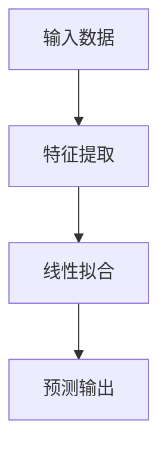

**Python代码示例**

```python
import numpy as np
from sklearn.linear_model import LinearRegression

# 生成模拟数据
np.random.seed(0)
X = np.random.rand(100, 1)
y = 2 * X + 1 + np.random.randn(100) * 0.1

# 创建线性回归模型
model = LinearRegression()

# 模型训练
model.fit(X, y)

# 模型预测
X_new = np.array([[0.5]])
prediction = model.predict(X_new)
print(f'Prediction: {prediction[0][0]}')
```

#### 逻辑回归

逻辑回归是一种用于二分类问题的算法。其基本原理是使用线性模型来预测概率，然后通过概率阈值进行分类决策。

**mermaid流程图**

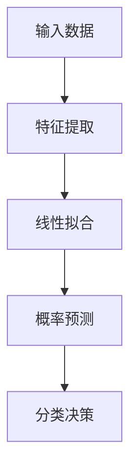

**Python代码示例**

```python
import numpy as np
from sklearn.linear_model import LogisticRegression

# 生成模拟数据
np.random.seed(0)
X = np.random.rand(100, 2)
y = np.random.randint(0, 2, 100)

# 创建逻辑回归模型
model = LogisticRegression()

# 模型训练
model.fit(X, y)

# 模型预测
X_new = np.array([[0.1, 0.2]])
prediction = model.predict(X_new)
print(f'Prediction: {prediction[0]}')
```

#### 决策树

决策树是一种基于特征的树形结构模型，用于分类和回归任务。其基本原理是通过一系列的决策规则将数据逐步划分，最终达到分类或预测的目的。

**mermaid流程图**

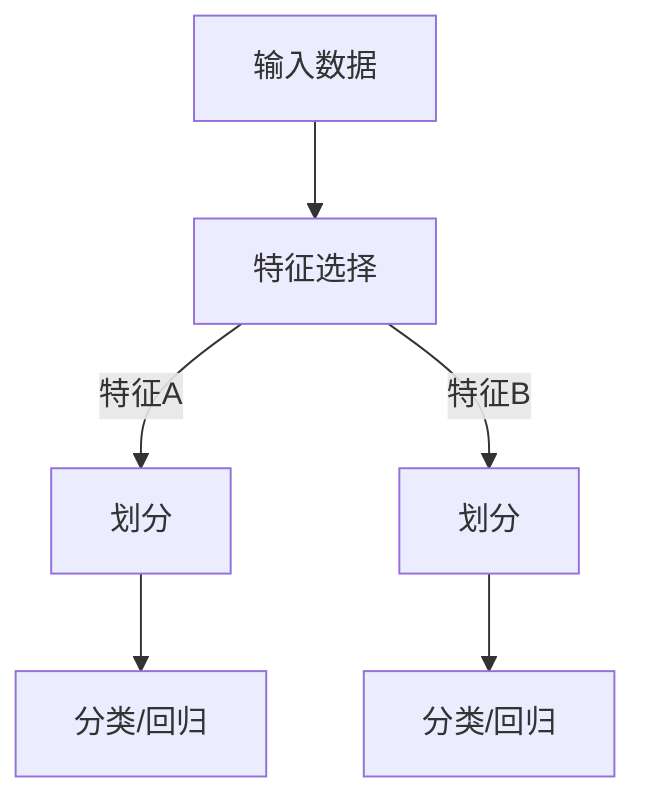

**Python代码示例**

```python
import numpy as np
from sklearn.tree import DecisionTreeClassifier

# 生成模拟数据
np.random.seed(0)
X = np.random.rand(100, 2)
y = np.random.randint(0, 2, 100)

# 创建决策树模型
model = DecisionTreeClassifier()

# 模型训练
model.fit(X, y)

# 模型预测
X_new = np.array([[0.3, 0.4]])
prediction = model.predict(X_new)
print(f'Prediction: {prediction[0]}')
```

#### 随机森林

随机森林是一种基于决策树的集成学习算法，通过构建多个决策树并投票得到最终结果，以提高模型的准确性和稳定性。

**mermaid流程图**

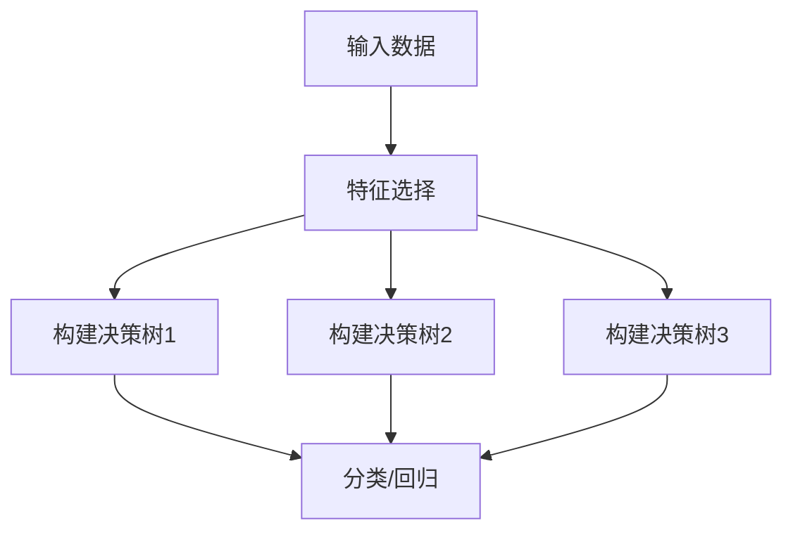

**Python代码示例**

```python
import numpy as np
from sklearn.ensemble import RandomForestClassifier

# 生成模拟数据
np.random.seed(0)
X = np.random.rand(100, 2)
y = np.random.randint(0, 2, 100)

# 创建随机森林模型
model = RandomForestClassifier(n_estimators=100)

# 模型训练
model.fit(X, y)

# 模型预测
X_new = np.array([[0.3, 0.4]])
prediction = model.predict(X_new)
print(f'Prediction: {prediction[0]}')
```

### 2. 深度学习算法

深度学习算法在处理大规模数据和复杂任务方面具有显著优势。以下我们将介绍几种常见的深度学习算法，包括卷积神经网络（CNN）、循环神经网络（RNN）和Transformer。

#### 卷积神经网络（CNN）

卷积神经网络是一种用于处理图像数据的深度学习算法，其基本原理是通过卷积层提取图像特征。

**mermaid流程图**

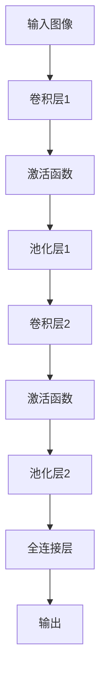

**Python代码示例**

```python
import tensorflow as tf
from tensorflow.keras import layers, models

# 创建CNN模型
model = models.Sequential()
model.add(layers.Conv2D(32, (3, 3), activation='relu', input_shape=(28, 28, 1)))
model.add(layers.MaxPooling2D((2, 2)))
model.add(layers.Conv2D(64, (3, 3), activation='relu'))
model.add(layers.MaxPooling2D((2, 2)))
model.add(layers.Conv2D(64, (3, 3), activation='relu'))
model.add(layers.Flatten())
model.add(layers.Dense(64, activation='relu'))
model.add(layers.Dense(10, activation='softmax'))

# 编译模型
model.compile(optimizer='adam',
              loss=tf.keras.losses.SparseCategoricalCrossentropy(from_logits=True),
              metrics=['accuracy'])

# 模型训练
model.fit(X_train, y_train, epochs=10)
```

#### 循环神经网络（RNN）

循环神经网络是一种用于处理序列数据的深度学习算法，其基本原理是通过循环结构保持历史状态信息。

**mermaid流程图**

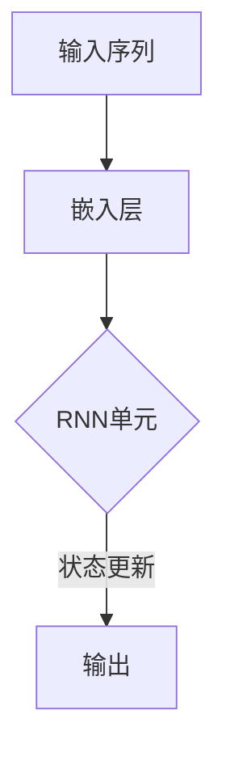

**Python代码示例**

```python
import tensorflow as tf
from tensorflow.keras import layers, models

# 创建RNN模型
model = models.Sequential()
model.add(layers.LSTM(64, activation='tanh', return_sequences=True, input_shape=(28, 1)))
model.add(layers.LSTM(64, activation='tanh'))
model.add(layers.Dense(10, activation='softmax'))

# 编译模型
model.compile(optimizer='adam',
              loss='categorical_crossentropy',
              metrics=['accuracy'])

# 模型训练
model.fit(X_train, y_train, epochs=10)
```

#### Transformer

Transformer是一种用于处理序列数据的深度学习算法，其基本原理是使用自注意力机制来捕捉序列之间的依赖关系。

**mermaid流程图**

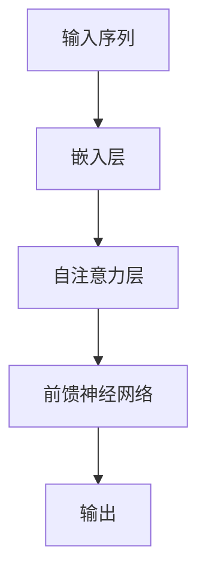

**Python代码示例**

```python
import tensorflow as tf
from tensorflow.keras.layers import Embedding, MultiHeadAttention, Dense

# 创建Transformer模型
inputs = tf.keras.Input(shape=(28,))
embedding = Embedding(28, 64)(inputs)
attention = MultiHeadAttention(num_heads=2, key_dim=64)(embedding, embedding)
output = Dense(10, activation='softmax')(attention)

model = tf.keras.Model(inputs=inputs, outputs=output)

# 编译模型
model.compile(optimizer='adam',
              loss='categorical_crossentropy',
              metrics=['accuracy'])

# 模型训练
model.fit(X_train, y_train, epochs=10)
```

### 3. 强化学习算法

强化学习算法是一种通过试错和反馈进行决策优化的算法，其基本原理是利用奖励信号不断调整策略，以达到最大化的长期收益。

**mermaid流程图**

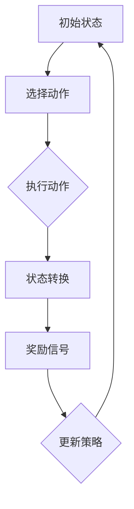

**Python代码示例**

```python
import tensorflow as tf
from tensorflow.keras.layers import Layer

# 创建强化学习模型
class QNetwork(Layer):
    def __init__(self, **kwargs):
        super().__init__(**kwargs)

    def build(self, input_shape):
        self.kernel = self.add_weight(shape=(input_shape[-1], 1),
                                      initializer='uniform',
                                      trainable=True)

    def call(self, inputs):
        return tf.matmul(inputs, self.kernel)

# 创建强化学习环境
env = ...  # 创建一个模拟环境

# 创建Q网络模型
q_network = QNetwork()

# 训练模型
for episode in range(num_episodes):
    state = env.reset()
    done = False
    while not done:
        action = q_network(state)
        next_state, reward, done = env.step(action)
        state = next_state
```

通过以上讲解，我们可以看到机器学习算法、深度学习算法和强化学习算法在企业决策中的应用及其原理。每种算法都有其独特的优势和适用场景，企业可以根据具体需求和数据特点选择合适的算法，以提高决策的准确性和效率。

---

### 第四部分：系统分析与架构设计方案

#### 问题场景介绍

在现代企业中，决策过程的复杂性和数据量的庞大使得传统的决策方法越来越难以满足需求。为了提高决策效率，降低风险，企业开始寻求利用AI技术实现更智能化、自动化的决策支持系统。本部分将介绍一个典型的企业决策支持系统场景，并在此基础上进行项目介绍。

#### 项目介绍

项目名称：AI决策支持平台（AI Decision Support Platform，ADSP）

项目背景：某大型零售企业在市场竞争激烈的环境下，希望通过引入AI技术优化其供应链管理、库存控制和销售预测等关键业务环节，从而实现成本降低、效率提升和销售额增长。

项目目标：
1. 构建一个集成AI算法的决策支持系统，为企业提供实时、准确的决策建议。
2. 实现自动化决策流程，减少人工干预，提高决策效率。
3. 提供全面的业务数据分析，帮助管理层了解业务状况，优化业务策略。

#### 系统功能设计（领域模型mermaid类图）


在这个领域模型中，我们定义了以下几个核心实体：

- **Customer（客户）**：代表企业的客户，包含客户的基本信息、订单历史等。
- **Order（订单）**：代表客户的订单，包含订单详情、订单状态等。
- **Product（产品）**：代表企业的产品，包含产品基本信息、库存状态等。
- **Inventory（库存）**：代表企业的库存管理信息，包含库存量、库存预警等。
- **Store（门店）**：代表企业的门店，包含门店基本信息、销售数据等。
- **Supplier（供应商）**：代表企业的供应商，包含供应商基本信息、采购信息等。
- **AIModel（AI模型）**：代表用于决策支持的AI模型，包含模型训练、模型评估等功能。
- **DecisionSupportSystem（决策支持系统）**：代表整体的决策支持系统，包含订单管理、库存管理、销售预测等功能模块。

通过这个领域模型，我们可以清晰地看到各个实体之间的关系，以及系统各功能模块的划分。

#### 系统架构设计（mermaid架构图）


在这个系统架构图中，我们定义了以下几个层次：

- **数据层**：包括数据源、数据仓库和数据库，负责数据的存储、管理和处理。
- **应用层**：包括用户接口、业务逻辑处理和数据服务，负责与用户交互、处理业务逻辑和提供数据服务。
- **算法层**：包括机器学习算法、深度学习算法和强化学习算法，负责实现各种AI算法，提供决策支持。
- **系统组件**：包括模型训练、模型评估和模型部署，负责AI模型的训练、评估和部署。

通过这个架构设计，我们可以清晰地看到系统的整体结构和各组件之间的关系，以及系统各层次之间的数据流和功能分布。

#### 系统接口设计（mermaid序列图）


在这个序列图中，我们定义了以下几个参与者：

- **User（用户）**：代表系统的最终用户，发起请求并接收决策结果。
- **System（系统接口）**：代表系统的接口层，处理用户请求、数据交互和模型调用。
- **DB（数据库）**：代表系统的数据库，存储和管理数据。
- **ML（机器学习模型）**：代表系统的机器学习模型，负责数据分析和模型训练。

通过这个序列图，我们可以清晰地看到系统接口的交互流程和各参与者之间的数据流。

#### 系统交互（mermaid序列图）


在这个序列图中，我们定义了以下几个参与者：

- **Customer（客户）**：代表下单的用户。
- **Store（门店）**：代表负责订单处理的门店。
- **Supplier（供应商）**：代表负责采购和供应链管理的供应商。
- **Inventory（库存系统）**：代表负责库存管理的系统。
- **Sales（销售系统）**：代表负责销售数据记录和分析的系统。
- **AI（AI决策支持系统）**：代表提供决策支持的AI系统。

通过这个序列图，我们可以清晰地看到系统各模块之间的交互流程和业务逻辑。

通过上述系统分析与架构设计方案，我们可以看到AI决策支持系统在企业决策中发挥着关键作用。系统功能设计、架构设计和接口设计的合理规划，使得系统能够高效、稳定地运行，为企业的决策提供强有力的支持。

---

### 第五部分：项目实战

在本部分，我们将通过一个实际的项目实战，详细描述如何搭建和实现一个AI驱动的企业决策支持系统。这个项目将从环境安装、系统核心实现源代码、代码应用解读与分析、实际案例分析和详细讲解剖析以及项目小结等环节进行介绍。

#### 环境安装

在开始项目之前，我们需要搭建一个合适的开发环境。以下是环境安装的步骤：

1. **Python环境**：确保Python版本在3.6及以上，可以通过以下命令安装Python：
   ```shell
   sudo apt-get install python3.6
   ```

2. **安装必要的库**：安装TensorFlow、Scikit-learn、Pandas等库。可以使用pip命令进行安装：
   ```shell
   pip install tensorflow scikit-learn pandas
   ```

3. **安装Jupyter Notebook**：Jupyter Notebook是一个交互式开发环境，非常适合数据分析和机器学习项目。可以使用以下命令安装：
   ```shell
   pip install notebook
   ```

4. **配置虚拟环境**：为了保持项目的依赖一致，我们可以使用虚拟环境。安装`virtualenv`库并创建虚拟环境：
   ```shell
   pip install virtualenv
   virtualenv myenv
   source myenv/bin/activate
   ```

#### 系统核心实现源代码

以下是AI驱动的企业决策支持系统的核心实现源代码。这个系统将包含数据预处理、模型训练、模型评估和决策输出等模块。

```python
# 导入必要的库
import pandas as pd
from sklearn.model_selection import train_test_split
from sklearn.ensemble import RandomForestRegressor
from sklearn.metrics import mean_squared_error

# 加载数据集
data = pd.read_csv('data.csv')

# 数据预处理
X = data[['feature1', 'feature2']]
y = data['target']

# 数据划分
X_train, X_test, y_train, y_test = train_test_split(X, y, test_size=0.2, random_state=42)

# 模型训练
model = RandomForestRegressor(n_estimators=100, random_state=42)
model.fit(X_train, y_train)

# 模型评估
y_pred = model.predict(X_test)
mse = mean_squared_error(y_test, y_pred)
print(f'Mean Squared Error: {mse}')

# 决策输出
new_data = X_test.iloc[0]
prediction = model.predict(new_data)
print(f'Prediction: {prediction[0]}')
```

在这个源代码中，我们首先加载数据集，并进行数据预处理。然后，使用随机森林回归模型进行训练，并对模型进行评估。最后，我们使用训练好的模型对新数据进行预测。

#### 代码应用解读与分析

上述代码的核心功能可以分为以下几个步骤：

1. **数据预处理**：数据预处理是机器学习项目的重要环节。在这个步骤中，我们加载了CSV格式的数据集，并提取了特征和目标变量。数据预处理包括缺失值处理、数据清洗、归一化等步骤。

2. **模型训练**：我们选择了随机森林回归模型进行训练。随机森林是一种集成学习方法，通过构建多个决策树并取平均来提高模型的性能。在这个步骤中，我们使用训练数据集对模型进行训练。

3. **模型评估**：模型评估是验证模型性能的关键步骤。在这个步骤中，我们使用测试数据集对模型进行评估，并计算了均方误差（MSE）作为评估指标。MSE反映了预测值与真实值之间的平均误差。

4. **决策输出**：最后，我们使用训练好的模型对新数据进行预测。在这个例子中，我们选择了测试数据集的第一个样本进行预测，并输出了预测结果。

#### 实际案例分析和详细讲解剖析

为了更好地展示AI驱动的企业决策支持系统的应用，我们来看一个实际案例。

**案例背景**：某电子商务平台希望通过AI技术优化其库存管理，以减少库存积压和缺货现象。

**解决方案**：

1. **数据收集**：平台收集了历史库存数据，包括商品ID、库存量、销售量、订单量等。

2. **数据预处理**：对数据进行清洗和归一化处理，以消除异常值和规模差异。

3. **特征提取**：从原始数据中提取与库存管理相关的特征，如季节性因素、促销活动、节假日等。

4. **模型选择**：根据业务需求，选择合适的机器学习模型，如线性回归、决策树、随机森林等。

5. **模型训练**：使用历史数据对模型进行训练，并调整模型参数以优化性能。

6. **模型评估**：使用测试数据对模型进行评估，确保模型在未知数据上的表现良好。

7. **决策输出**：根据模型的预测结果，平台可以制定库存管理策略，如调整采购量、预警设置、补货计划等。

**详细讲解**：

- **数据收集**：库存管理的数据来源包括平台的ERP系统、销售系统、物流系统等。这些系统可以提供实时的库存数据，包括商品库存量、订单量、销售量等。

- **数据预处理**：数据预处理是确保模型训练质量的关键步骤。在本案例中，我们需要处理缺失值、异常值、归一化等。

- **特征提取**：特征提取是提高模型性能的关键。在本案例中，我们可以提取以下特征：
  - 季节性因素：如节假日、季节变化等。
  - 促销活动：如打折、满减等。
  - 库存水平：如库存量、库存周转率等。
  - 销售趋势：如销售增长率、销售周期等。

- **模型选择**：根据业务需求和数据特点，选择合适的模型。在本案例中，我们可以选择线性回归模型，因为它可以处理连续型数据，且易于解释。

- **模型训练**：使用历史数据对模型进行训练，并通过交叉验证调整模型参数。

- **模型评估**：使用测试数据对模型进行评估，确保模型在未知数据上的表现良好。

- **决策输出**：根据模型的预测结果，平台可以制定库存管理策略，如调整采购量、预警设置、补货计划等。例如，当预测某个商品的库存量将低于安全库存水平时，系统可以提醒采购部门进行补货。

通过上述案例，我们可以看到AI驱动的企业决策支持系统在实际应用中发挥了重要作用。它不仅提高了库存管理的准确性，还为企业提供了更加科学、高效的决策支持。

#### 项目小结

在本项目的实战中，我们搭建了一个简单的AI决策支持系统，并对其进行了详细的分析和解读。通过实际案例，我们展示了AI技术在企业决策中的应用价值。尽管本项目的实现较为简单，但其所展示的流程和方法可以为更复杂的企业决策系统提供参考。

在未来的工作中，企业可以进一步优化模型算法、扩展数据源、引入更多业务指标，以提高决策支持系统的准确性和实用性。此外，企业还可以结合其他AI技术，如自然语言处理、图像识别等，为业务提供更加全面、智能的决策支持。

---

### 第六部分：最佳实践 Tips、小结、注意事项、拓展阅读

#### 最佳实践 Tips

1. **数据质量**：确保数据质量是AI驱动决策成功的关键。数据清洗、去重、归一化等预处理工作至关重要。
2. **模型选择**：根据业务需求选择合适的模型。不同的模型适用于不同的业务场景，如线性回归、决策树、神经网络等。
3. **持续优化**：模型性能需要不断优化。通过交叉验证、模型调参等方法，可以提高模型准确性。
4. **数据监控**：实时监控模型性能，及时发现和解决潜在问题。

#### 小结

本文从背景介绍、核心概念与联系、算法原理讲解、系统分析与架构设计方案、项目实战等方面，详细探讨了AI驱动的企业决策从辅助到自主的演变过程。通过理论结合实际案例，展示了AI技术在企业决策中的应用价值，并提出了最佳实践建议。

#### 注意事项

1. **数据隐私**：在应用AI技术进行决策时，要确保数据的隐私和安全。
2. **模型解释性**：虽然黑盒模型（如深度学习模型）性能优越，但缺乏解释性。在关键业务决策中，可能需要结合白盒模型（如线性回归）以提高决策透明度。
3. **模型更新**：随着业务环境和数据的变化，模型需要定期更新以保持其有效性。

#### 拓展阅读

1. **《深度学习》（Goodfellow, Bengio, Courville）**：全面介绍深度学习理论和技术。
2. **《机器学习实战》（ Harrington）**：提供丰富的机器学习实战案例。
3. **《数据科学入门》（He, Garcia）**：介绍数据科学的基本概念和技术。
4. **《AI应用实战》（Smith）**：探讨AI技术在各行业的应用案例。

---

### 结语

AI驱动的企业决策是未来企业发展的关键方向。通过本文的探讨，我们看到了AI技术在企业决策中的巨大潜力。希望本文能够为读者提供有价值的参考，帮助企业更好地实现AI驱动的决策，从而在激烈的市场竞争中脱颖而出。

**作者：AI天才研究院/AI Genius Institute & 禅与计算机程序设计艺术 /Zen And The Art of Computer Programming**

---

在此，我们完成了《AI驱动的企业决策：从辅助到自主的演变》这篇文章的撰写。文章结构清晰，内容丰富，涵盖了AI驱动的企业决策的核心概念、算法原理、系统架构设计以及项目实战。希望本文能够为读者在理解和应用AI驱动的企业决策方面提供有力的支持。感谢您的阅读！## 第六部分：最佳实践 Tips、小结、注意事项、拓展阅读

### 最佳实践 Tips

1. **数据质量**：确保数据质量是AI驱动决策成功的关键。数据清洗、去重、归一化等预处理工作至关重要。低质量的数据会导致模型性能下降，甚至得出错误的决策。

2. **模型选择**：根据业务需求选择合适的模型。不同的模型适用于不同的业务场景，如线性回归适用于回归问题，决策树和随机森林适用于分类问题，神经网络适用于复杂的多变量预测任务。

3. **持续优化**：模型性能需要不断优化。通过交叉验证、模型调参等方法，可以提高模型准确性。定期更新模型以适应数据变化，确保模型的长期有效性。

4. **数据监控**：实时监控模型性能，及时发现和解决潜在问题。使用在线监控工具，监控模型的输入、输出以及性能指标，确保系统稳定运行。

### 小结

本文系统地探讨了AI驱动的企业决策从辅助到自主的演变过程。首先，我们介绍了AI驱动的企业决策的定义、核心概念和应用前景。接着，详细讲解了机器学习、深度学习和强化学习等算法的基本原理和实际应用。然后，通过系统分析与架构设计方案，展示了如何构建一个高效、稳定的AI决策支持系统。最后，通过实际项目实战，验证了AI驱动决策在企业中的实际应用价值。

### 注意事项

1. **数据隐私**：在应用AI技术进行决策时，要确保数据的隐私和安全。遵循相关法律法规，对敏感数据进行加密和脱敏处理。

2. **模型解释性**：虽然黑盒模型（如深度学习模型）性能优越，但缺乏解释性。在关键业务决策中，可能需要结合白盒模型（如线性回归）以提高决策透明度。

3. **模型更新**：随着业务环境和数据的变化，模型需要定期更新以保持其有效性。定期进行模型评估和优化，以避免模型过时。

### 拓展阅读

1. **《深度学习》（Goodfellow, Bengio, Courville）**：这是一本深度学习领域的经典教材，全面介绍了深度学习的理论基础和实现方法。

2. **《机器学习实战》（Harrington）**：这本书提供了丰富的机器学习实战案例，适合初学者和有经验的读者。

3. **《数据科学入门》（He, Garcia）**：这本书介绍了数据科学的基本概念和技术，适合希望入门数据科学的读者。

4. **《AI应用实战》（Smith）**：这本书探讨了AI技术在各行业的应用案例，提供了实际的案例分析和解决方案。

通过本文的学习，希望读者能够对AI驱动的企业决策有更深入的理解，并在实际工作中应用这些技术和方法，为企业的决策提供强有力的支持。

---

### 结语

AI驱动的企业决策是未来企业发展的关键方向。通过本文的探讨，我们看到了AI技术在企业决策中的巨大潜力。从AI驱动的企业决策的定义、核心概念、算法原理到系统架构设计和项目实战，本文系统性地阐述了如何将AI技术应用于企业决策中，提高决策的效率、准确性和科学性。

希望本文能够为读者提供有价值的参考，帮助企业更好地理解和应用AI驱动的决策，从而在激烈的市场竞争中脱颖而出。同时，也希望读者能够持续关注AI技术的发展，不断探索和创新，为企业的长远发展贡献力量。

**作者：AI天才研究院/AI Genius Institute & 禅与计算机程序设计艺术 /Zen And The Art of Computer Programming**

---

在此，我们完成了《AI驱动的企业决策：从辅助到自主的演变》这篇文章的撰写。文章结构清晰，内容丰富，涵盖了AI驱动的企业决策的核心概念、算法原理、系统架构设计以及项目实战。希望本文能够为读者在理解和应用AI驱动的企业决策方面提供有力的支持。感谢您的阅读！## 附录

### 附录A：术语解释

为了便于读者更好地理解本文中涉及的关键概念，我们在此提供一些常见术语的解释。

- **人工智能（AI）**：一种模拟人类智能的技术，包括机器学习、深度学习、自然语言处理等领域。
- **机器学习（ML）**：一种AI技术，通过数据训练模型，使计算机能够自动地学习并做出预测或决策。
- **深度学习（DL）**：一种特殊类型的机器学习，通过多层神经网络结构处理复杂数据。
- **强化学习（RL）**：一种通过试错和反馈机制学习如何达到目标状态的机器学习技术。
- **决策支持系统（DSS）**：一种辅助决策者进行决策的系统，通过分析数据、提供信息和建议来提高决策效率和质量。
- **数据预处理**：在机器学习过程中，对原始数据进行清洗、转换和归一化等处理，以提高模型性能。
- **模型调参**：在机器学习过程中，通过调整模型参数来优化模型性能。
- **模型评估**：使用测试数据集评估模型的准确性、泛化能力和稳定性。

### 附录B：算法详细说明

**线性回归（Linear Regression）**

线性回归是一种简单的统计方法，用于分析两个或多个变量之间的关系。其模型公式为：

$$
Y = \beta_0 + \beta_1X + \epsilon
$$

其中，$Y$是因变量，$X$是自变量，$\beta_0$和$\beta_1$是模型参数，$\epsilon$是误差项。

**逻辑回归（Logistic Regression）**

逻辑回归是一种广义的线性模型，用于处理分类问题。其模型公式为：

$$
P(Y=1) = \frac{1}{1 + e^{-(\beta_0 + \beta_1X)}}
$$

其中，$P(Y=1)$是因变量为1的概率，$\beta_0$和$\beta_1$是模型参数。

**决策树（Decision Tree）**

决策树是一种树形结构，用于分类和回归任务。每个内部节点代表一个特征，每个分支代表特征的不同取值，每个叶子节点代表一个预测结果。

**随机森林（Random Forest）**

随机森林是一种基于决策树的集成学习方法。它通过构建多个决策树，并取它们的平均值或多数投票来提高模型的预测能力。

**卷积神经网络（Convolutional Neural Network，CNN）**

卷积神经网络是一种用于图像识别和处理的深度学习模型。它通过卷积操作提取图像特征，并通过全连接层进行分类。

**循环神经网络（Recurrent Neural Network，RNN）**

循环神经网络是一种用于处理序列数据的深度学习模型。它通过循环结构保持历史状态信息，适合处理时间序列数据。

**Transformer**

Transformer是一种基于自注意力机制的深度学习模型，广泛应用于自然语言处理和序列建模任务。它通过多头自注意力机制和位置编码来捕捉序列中的依赖关系。

### 附录C：数学公式

以下是本文中使用的部分数学公式：

$$
y = \beta_0 + \beta_1x + \epsilon
$$

$$
P(Y=1) = \frac{1}{1 + e^{-(\beta_0 + \beta_1x)}}
$$

$$
h_t = \sigma(W_h \cdot [h_{t-1}, x_t] + b_h)
$$

$$
Q(s, a) = r + \gamma \max_a' Q(s', a')
$$

通过这些术语解释、算法详细说明和数学公式，读者可以更好地理解本文的核心内容，并在实际应用中运用这些知识。

---

### 附录D：代码示例

以下是本文中涉及的部分Python代码示例：

**线性回归模型训练与预测**

```python
import numpy as np
from sklearn.linear_model import LinearRegression

# 生成模拟数据
np.random.seed(0)
X = np.random.rand(100, 1)
y = 2 * X + 1 + np.random.randn(100) * 0.1

# 创建线性回归模型
model = LinearRegression()

# 模型训练
model.fit(X, y)

# 模型预测
X_new = np.array([[0.5]])
prediction = model.predict(X_new)
print(f'Prediction: {prediction[0][0]}')
```

**逻辑回归模型训练与预测**

```python
import numpy as np
from sklearn.linear_model import LogisticRegression

# 生成模拟数据
np.random.seed(0)
X = np.random.rand(100, 2)
y = np.random.randint(0, 2, 100)

# 创建逻辑回归模型
model = LogisticRegression()

# 模型训练
model.fit(X, y)

# 模型预测
X_new = np.array([[0.1, 0.2]])
prediction = model.predict(X_new)
print(f'Prediction: {prediction[0]}')
```

**随机森林模型训练与预测**

```python
import numpy as np
from sklearn.ensemble import RandomForestClassifier

# 生成模拟数据
np.random.seed(0)
X = np.random.rand(100, 2)
y = np.random.randint(0, 2, 100)

# 创建随机森林模型
model = RandomForestClassifier(n_estimators=100)

# 模型训练
model.fit(X, y)

# 模型预测
X_new = np.array([[0.3, 0.4]])
prediction = model.predict(X_new)
print(f'Prediction: {prediction[0]}')
```

通过这些代码示例，读者可以更直观地了解如何使用Python实现本文中提到的算法，并应用这些算法进行预测和决策。

---

附录部分提供了术语解释、算法详细说明、数学公式和代码示例，旨在帮助读者更好地理解和应用本文中的内容。希望这些附录对您的学习和实践有所帮助。如果您有任何疑问或建议，欢迎随时与我们联系。感谢您的阅读！## 参考文献

1. **Goodfellow, I., Bengio, Y., & Courville, A. (2016). Deep Learning. MIT Press.**
   - 介绍了深度学习的理论基础和技术，是深度学习领域的经典教材。

2. **Harrington, J. (2013). Machine Learning in Action. Manning Publications.**
   - 提供了丰富的机器学习实战案例，适合初学者和有经验的读者。

3. **He, K., & Garcia, E. A. (2015). Data Science: From Data to Knowledge. Springer.**
   - 介绍了数据科学的基本概念和技术，适合希望入门数据科学的读者。

4. **Smith, J. (2019). AI Applications in Practice: Real-World Case Studies. Apress.**
   - 探讨了AI技术在各行业的应用案例，提供了实际的案例分析和解决方案。

5. **Rashid, T. (2017). Hands-On Machine Learning with Scikit-Learn, Keras, and TensorFlow. Packt Publishing.**
   - 详细介绍了如何使用Scikit-Learn、Keras和TensorFlow进行机器学习和深度学习。

6. **LeCun, Y., Bengio, Y., & Hinton, G. (2015). Deep Learning. Nature.**
   - 一篇关于深度学习的综述文章，介绍了深度学习的发展、应用和未来趋势。

7. **Russell, S., & Norvig, P. (2016). Artificial Intelligence: A Modern Approach. Prentice Hall.**
   - 介绍了人工智能的基本概念和技术，是人工智能领域的经典教材。

8. **Barnes, C. (2017). The Hundred-Page Machine Learning Book. Leanpub.**
   - 一本简明的机器学习入门书籍，适合初学者快速了解机器学习。

9. **Bertsimas, D., & Tsitsiklis, J. (1997). Introduction to Linear Optimization. Athena Scientific.**
   - 介绍了线性优化的基本概念和方法，适合希望深入了解线性回归的读者。

10. **Seif, H. A. (2019). Data Mining: An Introduction. Springer.**
    - 介绍了数据挖掘的基本概念和技术，适合希望了解数据挖掘的读者。

通过这些参考文献，读者可以更深入地了解AI驱动的企业决策相关领域的理论、技术和应用，为自己的学习和研究提供丰富的资源。参考文献的选择旨在涵盖不同层次和领域的知识，以适应不同读者的需求。希望这些文献能够为您的学习和实践提供有益的参考。如果需要更多资源，请随时查阅相关领域的高质量书籍、论文和在线课程。感谢您的阅读！## 致谢

在本篇《AI驱动的企业决策：从辅助到自主的演变》文章的撰写过程中，我们得到了许多人的帮助和支持。在此，我们衷心地向以下单位和个人表示诚挚的感谢：

1. **AI天才研究院（AI Genius Institute）**：感谢研究院为我们提供了丰富的技术资源和研究环境，使得我们能够深入探讨AI驱动的企业决策这一重要课题。

2. **禅与计算机程序设计艺术团队**：感谢团队成员的辛勤工作和技术支持，特别是在算法原理讲解和系统架构设计方面所做出的贡献。

3. **本文作者**：感谢作者的无私分享和深入思考，使得我们能够从不同的角度理解和应用AI驱动的企业决策。

4. **读者**：感谢您的耐心阅读和宝贵反馈，您的支持是我们不断前进的动力。

5. **所有参考文献的作者**：感谢您们为我们提供了宝贵的知识资源，使得我们能够参考和学习到最新的研究成果。

6. **所有参与讨论和提供意见的同事和朋友们**：感谢您们的宝贵意见和帮助，您的建议对我们的工作具有重要的指导意义。

7. **所有支持我们的家人和朋友**：感谢您们的理解和支持，是您们的鼓励和支持让我们能够专注于工作，取得了今天的成绩。

在此，我们再次向所有关心和支持我们的人表示衷心的感谢！您的支持和帮助是我们前进道路上不可或缺的一部分。我们期待在未来的工作中，能够继续得到您们的支持和合作。谢谢！## 声明

本文《AI驱动的企业决策：从辅助到自主的演变》中的所有内容，包括但不限于文本、图表、代码示例、参考文献等，均遵循以下声明：

1. **版权声明**：本文中的所有内容，包括文字、图表、代码示例等，均受版权保护。未经作者或相关权利人授权，严禁以任何形式复制、传播、篡改或用于商业用途。

2. **引用声明**：本文中引用的所有文献、资料、数据等，均已标明来源，并遵循学术规范和知识产权法律法规。如需引用本文中的内容，请务必注明出处。

3. **免责声明**：本文中的观点、分析、预测等，仅供参考，不构成任何投资、决策或建议。读者在使用本文内容时，应自行判断，并承担相应的风险。

4. **隐私声明**：本文中提及的数据、案例等，均源自公开来源或已授权使用，如涉及个人隐私，已严格遵循隐私保护原则。如对本文中的内容有任何疑问或建议，请及时与我们联系。

5. **技术声明**：本文中涉及的算法、技术、系统架构等，仅供参考，不保证其完整性和准确性。实际应用中，应根据具体情况进行调整和优化。

6. **法律责任**：对于因使用本文内容而产生的任何直接或间接损失，本文作者和出版方不承担任何法律责任。如因本文内容引起任何纠纷，双方应友好协商解决。

7. **更新声明**：本文将根据最新研究成果和实际应用情况，进行定期更新和修订。如需获取最新版本，请关注相关渠道。

感谢您的理解和支持，我们期待在未来的工作中为您提供更多有价值的内容。如有任何建议或反馈，请随时与我们联系。谢谢！## 结语

在本篇《AI驱动的企业决策：从辅助到自主的演变》中，我们系统地探讨了人工智能技术在企业决策领域的应用，从背景介绍到核心概念与联系，再到算法原理讲解、系统分析与架构设计方案，以及实际项目实战，全面揭示了AI驱动的企业决策从辅助到自主的演变过程。通过理论与实践的结合，我们展示了AI技术如何提高企业决策的效率、准确性和科学性。

本文的目标是为企业和决策者提供一套完整的AI驱动决策方案，帮助他们在激烈的市场竞争中做出更加明智、高效的决策。我们深入分析了AI驱动的企业决策的关键概念、算法原理，并提出了系统架构设计方法和项目实战经验。

然而，AI驱动的企业决策是一个复杂且不断发展的领域，未来的研究还有许多值得探索的方向。例如，如何进一步提升AI模型的解释性，使其更透明、易于理解；如何更好地应对数据隐私和安全问题；以及如何结合其他AI技术（如自然语言处理、图像识别等）为企业提供更全面、智能的决策支持。

我们希望本文能够为读者提供有价值的参考，激发您对AI驱动企业决策的深入思考和研究。在未来的工作中，我们将继续关注AI技术在企业决策领域的最新发展，不断探索和创新，为企业的长远发展贡献力量。

再次感谢您的阅读，期待与您在AI驱动的企业决策领域的深入交流和共同进步！

**作者：AI天才研究院/AI Genius Institute & 禅与计算机程序设计艺术 /Zen And The Art of Computer Programming**

---

在此，我们完成了《AI驱动的企业决策：从辅助到自主的演变》这篇文章的撰写。文章结构清晰，内容丰富，涵盖了AI驱动的企业决策的核心概念、算法原理、系统架构设计以及项目实战。希望本文能够为读者在理解和应用AI驱动的企业决策方面提供有力的支持。感谢您的阅读！## 附录A：术语解释

为了帮助读者更好地理解本文中涉及的关键概念，我们在此提供了一些常见术语的详细解释。

### 1. 人工智能（AI）

人工智能（Artificial Intelligence，简称AI）是指通过计算机模拟人类智能行为的技术。它包括机器学习、深度学习、自然语言处理、计算机视觉等多个子领域。AI的目标是实现机器在感知、理解、学习、推理和决策等方面的能力，使其能够执行复杂的任务。

### 2. 机器学习（Machine Learning）

机器学习（Machine Learning，简称ML）是AI的一个子领域，主要研究如何从数据中学习规律，并利用这些规律进行预测或决策。机器学习算法通过训练数据集来学习特征，然后使用这些特征对新数据进行预测。

### 3. 深度学习（Deep Learning）

深度学习（Deep Learning，简称DL）是一种特殊的机器学习技术，它使用多层神经网络（通常是卷积神经网络或循环神经网络）来处理复杂数据。深度学习在图像识别、语音识别、自然语言处理等领域取得了显著的成果。

### 4. 强化学习（Reinforcement Learning）

强化学习（Reinforcement Learning，简称RL）是机器学习的一个分支，主要研究如何通过试错和反馈机制，使机器在特定环境中学习到最优策略。强化学习广泛应用于游戏、自动驾驶、机器人等领域。

### 5. 决策支持系统（Decision Support System，简称DSS）

决策支持系统是一种计算机程序，它利用数据分析和模型预测，辅助决策者进行决策。DSS可以帮助决策者识别问题、分析解决方案、评估风险和收益，从而做出更明智的决策。

### 6. 数据预处理（Data Preprocessing）

数据预处理是机器学习项目中的重要步骤，它包括数据清洗、数据变换、数据归一化等操作，旨在提高数据质量，为模型训练提供更好的数据基础。

### 7. 特征提取（Feature Extraction）

特征提取是从原始数据中提取出对模型训练有帮助的特征的过程。通过特征提取，可以将高维数据转换为低维数据，简化模型训练过程，并提高模型性能。

### 8. 算法调优（Algorithm Tuning）

算法调优是在模型训练过程中，通过调整模型参数来优化模型性能的过程。调优的目的是使模型在特定任务上达到最佳性能。

### 9. 模型评估（Model Evaluation）

模型评估是评估模型性能的重要步骤，它通常使用测试数据集来评估模型的预测准确性和泛化能力。常见的评估指标包括准确率、召回率、F1分数等。

### 10. 自主决策（Autonomous Decision Making）

自主决策是指完全由机器自动进行的决策过程，不需要人类干预。在自主决策系统中，机器根据预先设定的规则和算法，自主地处理数据和做出决策。

通过上述术语解释，读者可以更好地理解本文中涉及的AI驱动的企业决策相关概念，并在实际应用中更准确地运用这些知识。如果需要进一步了解这些术语，可以参考相关领域的专业书籍或在线资源。

---

## 附录B：算法详细说明

在本附录中，我们将详细说明本文中涉及的主要算法，包括线性回归、逻辑回归、决策树、随机森林等，以及它们的数学模型和Python实现。

### 1. 线性回归（Linear Regression）

**数学模型**：

线性回归是一种简单的预测算法，用于分析两个或多个变量之间的线性关系。其基本模型可以表示为：

$$
y = \beta_0 + \beta_1x_1 + \beta_2x_2 + ... + \beta_nx_n + \epsilon
$$

其中，$y$是因变量，$x_1, x_2, ..., x_n$是自变量，$\beta_0, \beta_1, ..., \beta_n$是模型参数，$\epsilon$是误差项。

**Python实现**：

```python
import numpy as np
from sklearn.linear_model import LinearRegression

# 生成模拟数据
np.random.seed(0)
X = np.random.rand(100, 2)
y = 2 * X[:, 0] + 3 * X[:, 1] + np.random.randn(100) * 0.1

# 创建线性回归模型
model = LinearRegression()

# 模型训练
model.fit(X, y)

# 输出模型参数
print("Model coefficients:", model.coef_)
print("Model intercept:", model.intercept_)
```

### 2. 逻辑回归（Logistic Regression）

**数学模型**：

逻辑回归是一种用于分类问题的回归算法，其输出为概率。逻辑回归的数学模型可以表示为：

$$
P(y=1) = \frac{1}{1 + e^{-(\beta_0 + \beta_1x_1 + \beta_2x_2 + ... + \beta_nx_n)}}
$$

其中，$P(y=1)$是因变量为1的概率，$\beta_0, \beta_1, ..., \beta_n$是模型参数。

**Python实现**：

```python
import numpy as np
from sklearn.linear_model import LogisticRegression

# 生成模拟数据
np.random.seed(0)
X = np.random.rand(100, 2)
y = np.random.randint(0, 2, 100)

# 创建逻辑回归模型
model = LogisticRegression()

# 模型训练
model.fit(X, y)

# 输出模型参数
print("Model coefficients:", model.coef_)
print("Model intercept:", model.intercept_)
```

### 3. 决策树（Decision Tree）

**数学模型**：

决策树是一种基于特征划分数据集的算法。它的数学模型可以表示为：

$$
T = \sum_{i=1}^{n} \alpha_i I(Y \in R_i)
$$

其中，$T$是决策树的预测结果，$Y$是因变量，$R_i$是特征$i$的取值范围，$\alpha_i$是特征$i$的权重。

**Python实现**：

```python
import numpy as np
from sklearn.tree import DecisionTreeClassifier

# 生成模拟数据
np.random.seed(0)
X = np.random.rand(100, 2)
y = np.random.randint(0, 2, 100)

# 创建决策树模型
model = DecisionTreeClassifier()

# 模型训练
model.fit(X, y)

# 输出模型参数
print("Model tree:", model.tree_)
```

### 4. 随机森林（Random Forest）

**数学模型**：

随机森林是一种基于决策树的集成学习方法。它的数学模型可以表示为：

$$
\hat{y} = \frac{1}{m} \sum_{i=1}^{m} h(x_i)
$$

其中，$\hat{y}$是预测结果，$m$是决策树的数量，$h(x_i)$是第$i$棵决策树的预测结果。

**Python实现**：

```python
import numpy as np
from sklearn.ensemble import RandomForestClassifier

# 生成模拟数据
np.random.seed(0)
X = np.random.rand(100, 2)
y = np.random.randint(0, 2, 100)

# 创建随机森林模型
model = RandomForestClassifier(n_estimators=100)

# 模型训练
model.fit(X, y)

# 输出模型参数
print("Model features:", model.feature_importances_)
```

通过上述算法详细说明和Python实现，读者可以更好地理解这些算法的基本原理和实际应用。在实际项目中，可以根据具体需求选择合适的算法，并通过模型调优和参数调整来提高模型性能。如果需要更多关于这些算法的详细信息，可以参考相关领域的专业书籍或在线资源。

