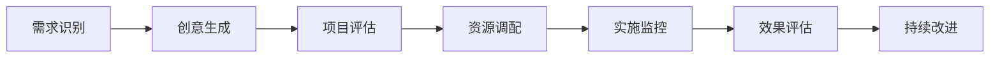
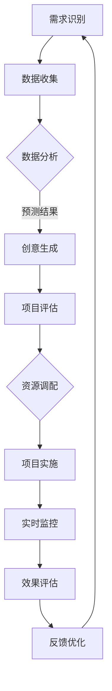
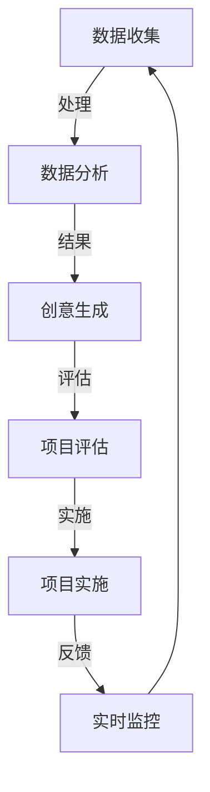
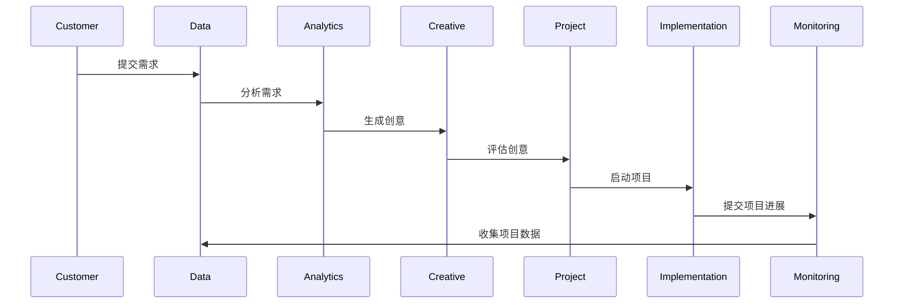

                 

### 文章标题

AI驱动的企业创新管理：加速从创意到产品的过程

### 关键词

- 企业创新管理
- 人工智能
- AI驱动的流程
- 创意到产品
- 管理原理与实践

### 摘要

随着人工智能（AI）技术的快速发展，企业创新管理迎来了全新的机遇与挑战。本文深入探讨了AI驱动的企业创新管理，通过逻辑清晰、结构紧凑的分析，揭示了从创意到产品的过程中如何利用AI技术实现加速与创新。本文首先介绍了AI驱动的核心概念和企业创新管理的基本原理，然后通过案例分析展示了最佳实践，最后探讨了面临的挑战与未来展望。

### 目录大纲

----------------------------------------------------------------

# 第一部分: 背景介绍与核心概念

## 第1章: 问题背景与核心概念

### 1.1 问题背景

#### 1.1.1 企业创新管理的现状与挑战

#### 1.1.2 AI在企业管理中的应用价值

### 1.2 核心概念

#### 1.2.1 AI驱动的概念

#### 1.2.2 企业创新管理的概念

#### 1.2.3 AI驱动的企业创新管理的核心要素

### 1.3 概念联系与关系图

#### 1.3.1 AI驱动的企业创新管理ER图

#### 1.3.2 关键概念属性特征对比表

### 1.4 本章小结

----------------------------------------------------------------

## 第2章: AI基础

### 2.1 AI的基本原理

#### 2.1.1 机器学习基础

#### 2.1.2 深度学习基础

#### 2.1.3 自然语言处理基础

### 2.2 AI在企业中的应用场景

#### 2.2.1 数据分析

#### 2.2.2 决策支持

#### 2.2.3 智能自动化

### 2.3 AI驱动的创新管理原理

#### 2.3.1 创新管理的基本概念

#### 2.3.2 AI驱动的创新管理流程

#### 2.3.3 AI驱动的创新管理方法论

### 2.4 关键算法原理与Mermaid流程图

#### 2.4.1 关键算法概述

#### 2.4.2 Mermaid流程图示例

#### 2.4.3 Python代码实现与算法原理讲解

### 2.5 数学模型与公式

#### 2.5.1 常用数学模型

#### 2.5.2 公式推导与解释

#### 2.5.3 示例分析

### 2.6 本章小结

----------------------------------------------------------------

## 第3章: 实践准备

### 3.1 环境安装与配置

#### 3.1.1 硬件要求

#### 3.1.2 软件安装

#### 3.1.3 环境配置

### 3.2 项目介绍

#### 3.2.1 项目背景

#### 3.2.2 项目目标

#### 3.2.3 项目计划

### 3.3 系统功能设计

#### 3.3.1 领域模型

#### 3.3.2 功能模块划分

### 3.4 系统架构设计

#### 3.4.1 系统架构图

#### 3.4.2 架构组件说明

### 3.5 系统接口设计与交互

#### 3.5.1 接口设计

#### 3.5.2 交互流程

#### 3.5.3 Mermaid序列图

### 3.6 本章小结

----------------------------------------------------------------

## 第4章: 案例分析与最佳实践

### 4.1 案例一：AI驱动的产品创新

#### 4.1.1 案例背景

#### 4.1.2 案例目标

#### 4.1.3 案例实施

#### 4.1.4 案例效果

### 4.2 案例二：AI驱动的市场分析

#### 4.2.1 案例背景

#### 4.2.2 案例目标

#### 4.2.3 案例实施

#### 4.2.4 案例效果

### 4.3 案例三：AI驱动的客户服务

#### 4.3.1 案例背景

#### 4.3.2 案例目标

#### 4.3.3 案例实施

#### 4.3.4 案例效果

### 4.4 最佳实践总结

#### 4.4.1 实践经验

#### 4.4.2 注意事项

#### 4.4.3 拓展阅读

### 4.5 本章小结

----------------------------------------------------------------

## 第5章: 挑战与未来展望

### 5.1 技术挑战

#### 5.1.1 数据隐私与安全

#### 5.1.2 模型解释性

#### 5.1.3 模型可扩展性

### 5.2 管理挑战

#### 5.2.1 人才需求

#### 5.2.2 文化变革

#### 5.2.3 资源配置

### 5.3 应对策略

#### 5.3.1 技术解决方案

#### 5.3.2 管理策略

----------------------------------------------------------------

## 第1章: 问题背景与核心概念

### 1.1 问题背景

#### 1.1.1 企业创新管理的现状与挑战

在当今快速变化的市场环境中，企业创新管理成为企业保持竞争优势的关键因素。传统的创新管理模式往往存在响应速度慢、成本高、风险大等问题，难以满足市场的快速变化需求。此外，随着全球化竞争的加剧，企业需要不断创新来满足消费者日益多样化的需求，但传统的创新管理流程往往效率低下，难以实现快速响应。

#### 1.1.2 AI在企业管理中的应用价值

人工智能（AI）技术的快速发展为企业创新管理带来了新的机遇。AI技术可以通过数据分析、预测模型、自动化流程等方式，帮助企业实现更高效、更智能的创新管理。例如，AI可以分析大量市场数据，为企业提供精准的市场分析报告，帮助企业更好地了解市场需求和趋势。此外，AI还可以自动化部分创新管理流程，降低成本、提高效率。

### 1.2 核心概念

#### 1.2.1 AI驱动的概念

AI驱动是指利用人工智能技术来提升企业的运营效率、创新能力和竞争力。具体来说，AI驱动包括以下几个方面：

- 数据驱动：通过数据分析和挖掘，为企业提供决策支持。
- 智能化：利用机器学习和深度学习等技术，实现自动化和智能化。
- 自适应：根据环境变化和反馈，不断优化和调整决策和流程。

#### 1.2.2 企业创新管理的概念

企业创新管理是指通过系统的策略、流程和方法，激发企业的创新活力，实现持续的创新和进步。具体来说，企业创新管理包括以下几个方面：

- 创新规划：明确创新的目标、方向和策略。
- 创新执行：实施创新项目，包括创意生成、项目评估、资源调配等。
- 创新评估：对创新项目进行评估，确定其效果和价值。

#### 1.2.3 AI驱动的企业创新管理的核心要素

AI驱动的企业创新管理需要以下核心要素：

- 数据收集与处理：收集大量的数据，并通过数据清洗、归一化等处理技术，为AI算法提供高质量的数据输入。
- 机器学习算法：选择合适的机器学习算法，对数据进行建模和分析，提取有用的信息。
- 自动化流程：利用AI技术自动化部分创新管理流程，提高效率。
- 实时反馈与优化：根据实时反馈，不断优化和调整AI模型和流程，实现自适应创新。

### 1.3 概念联系与关系图

为了更好地理解AI驱动的企业创新管理，我们可以通过以下ER图（实体关系图）来展示各概念之间的关系：

```mermaid
erDiagram
    Product <<-- Customer : "购买"
    Project <<-- Employee : "负责"
    Data <<-- AIAlgorithm : "输入"
    Market <<-- AIAnalysis : "分析"
    AI <<-- Enterprise : "驱动"
    AIAlgorithm --||--> Enterprise : "应用"
    Data --||--> AIAlgorithm : "数据输入"
    Market --||--> AIAnalysis : "市场数据"
    Customer --||--> Product : "需求"
    Employee --||--> Project : "参与"
```

#### 1.3.2 关键概念属性特征对比表

以下是AI驱动的企业创新管理中关键概念的属性特征对比表：

| 概念             | 属性特征                            |
|------------------|-----------------------------------|
| 数据收集与处理   | 高效、准确、多样化                 |
| 机器学习算法     | 自适应、高效、可解释性             |
| 自动化流程       | 高效、准确、降低成本               |
| 实时反馈与优化   | 快速、灵活、持续改进               |

### 1.4 本章小结

本章介绍了AI驱动的企业创新管理的问题背景、核心概念及其关系。通过对AI驱动的概念、企业创新管理的概念以及核心要素的深入探讨，为后续章节的详细分析奠定了基础。在下一章中，我们将进一步探讨AI的基本原理及其在企业中的应用场景，以期为AI驱动的企业创新管理提供更深入的理解。

----------------------------------------------------------------

## 第2章: AI基础

在深入探讨AI驱动的企业创新管理之前，我们需要对AI的基础知识有一个清晰的认识。本章将介绍AI的基本原理，包括机器学习、深度学习和自然语言处理，并分析这些技术在企业中的应用场景。此外，我们还将详细讨论AI驱动的创新管理原理，包括基本概念、流程和方法论。

### 2.1 AI的基本原理

#### 2.1.1 机器学习基础

机器学习是AI的核心技术之一，它使计算机系统能够从数据中学习并做出预测或决策。机器学习的基本过程包括数据收集、数据预处理、模型训练和模型评估。

- 数据收集：收集大量相关数据，这些数据可以是结构化的（如表格数据）或非结构化的（如图像、文本等）。
- 数据预处理：对收集到的数据进行清洗、归一化、特征提取等处理，以提高数据质量，为模型训练做准备。
- 模型训练：选择合适的算法（如线性回归、决策树、神经网络等），利用训练数据对模型进行训练，使其能够学习数据中的特征和规律。
- 模型评估：通过测试数据评估模型的性能，调整模型参数，以达到最佳效果。

#### 2.1.2 深度学习基础

深度学习是机器学习的一种特殊形式，通过多层神经网络对数据进行分析和建模。深度学习在图像识别、语音识别、自然语言处理等领域取得了显著成果。

- 神经网络：神经网络由多个神经元（节点）组成，通过前向传播和反向传播算法对数据进行学习。
- 卷积神经网络（CNN）：适用于图像识别和图像处理，通过卷积操作提取图像特征。
- 递归神经网络（RNN）：适用于序列数据处理，如时间序列分析、语音识别等，通过递归结构捕捉序列信息。

#### 2.1.3 自然语言处理基础

自然语言处理（NLP）是AI的重要分支，旨在使计算机能够理解和处理自然语言。NLP的基本任务包括文本分类、情感分析、命名实体识别、机器翻译等。

- 词向量：将文本转换为向量表示，如Word2Vec、GloVe等，以便于模型处理。
- 递归神经网络（RNN）：在NLP任务中应用广泛，通过递归结构捕捉文本中的上下文信息。
- 生成对抗网络（GAN）：在文本生成和机器翻译等任务中表现出色，通过生成模型和判别模型的对抗训练生成高质量文本。

### 2.2 AI在企业中的应用场景

AI技术在企业中有着广泛的应用，可以大幅提升企业的运营效率和创新力。以下是一些典型的AI应用场景：

- 数据分析：利用AI技术进行数据挖掘和预测分析，为企业提供决策支持。
- 决策支持：通过机器学习算法优化决策过程，提高决策的准确性和效率。
- 智能自动化：自动化重复性任务，降低人力成本，提高工作效率。
- 客户服务：利用自然语言处理技术提供智能客服，提高客户满意度。
- 产品创新：通过数据分析和市场预测，帮助企业更好地进行产品创新。

### 2.3 AI驱动的创新管理原理

#### 2.3.1 创新管理的基本概念

创新管理是指企业通过系统的策略、流程和方法，激发创新活力，实现持续的创新和进步。创新管理的基本概念包括：

- 创新规划：明确创新的目标、方向和策略。
- 创新执行：实施创新项目，包括创意生成、项目评估、资源调配等。
- 创新评估：对创新项目进行评估，确定其效果和价值。

#### 2.3.2 AI驱动的创新管理流程

AI驱动的创新管理流程主要包括以下几个步骤：

1. **需求识别**：利用AI技术分析市场数据，识别潜在需求。
2. **创意生成**：通过数据分析和市场预测，生成创新创意。
3. **项目评估**：利用AI算法对创意进行评估，确定其可行性和潜在价值。
4. **资源调配**：根据项目评估结果，合理调配资源，启动创新项目。
5. **实施监控**：实时监控项目进展，利用AI技术进行项目评估和优化。
6. **效果评估**：对创新项目进行效果评估，确定其成功与否，为后续创新提供参考。

#### 2.3.3 AI驱动的创新管理方法论

AI驱动的创新管理方法论包括以下几个关键步骤：

1. **数据驱动**：以数据为驱动，利用AI技术进行数据分析和市场预测。
2. **快速迭代**：通过快速迭代和反馈，不断优化创新项目和流程。
3. **跨部门协作**：建立跨部门协作机制，充分利用企业内外部的资源和知识。
4. **持续改进**：持续改进创新流程和方法，提高创新效率和质量。

### 2.4 关键算法原理与Mermaid流程图

为了更好地理解AI驱动的创新管理原理，我们可以通过以下Mermaid流程图来展示关键算法的流程：



#### 2.4.2 Mermaid流程图示例

以下是AI驱动的创新管理流程的Mermaid流程图示例：



#### 2.4.3 Python代码实现与算法原理讲解

为了更好地理解AI驱动的创新管理原理，我们可以通过以下Python代码示例来讲解关键算法的原理：

```python
import pandas as pd
from sklearn.model_selection import train_test_split
from sklearn.ensemble import RandomForestClassifier
from sklearn.metrics import accuracy_score

# 数据收集
data = pd.read_csv('data.csv')

# 数据预处理
X = data.drop('target', axis=1)
y = data['target']

# 数据分割
X_train, X_test, y_train, y_test = train_test_split(X, y, test_size=0.2, random_state=42)

# 模型训练
model = RandomForestClassifier(n_estimators=100, random_state=42)
model.fit(X_train, y_train)

# 预测
predictions = model.predict(X_test)

# 评估
accuracy = accuracy_score(y_test, predictions)
print(f"模型准确率：{accuracy:.2f}")
```

在上面的代码中，我们使用了随机森林（RandomForestClassifier）算法进行分类任务。随机森林是一种集成学习方法，通过构建多棵决策树并求取它们的平均结果，提高了模型的预测能力。具体步骤如下：

1. 数据收集：从CSV文件中读取数据。
2. 数据预处理：将数据分为特征（X）和标签（y）。
3. 数据分割：将数据分为训练集和测试集。
4. 模型训练：使用随机森林算法对训练集数据进行训练。
5. 预测：使用训练好的模型对测试集数据进行预测。
6. 评估：计算模型在测试集上的准确率。

### 2.5 数学模型与公式

在AI驱动的创新管理中，数学模型和公式是理解和应用AI技术的重要工具。以下是一些常用的数学模型和公式：

#### 2.5.1 常用数学模型

1. 线性回归模型：$y = \beta_0 + \beta_1x_1 + \beta_2x_2 + ... + \beta_nx_n$
2. 逻辑回归模型：$P(y=1) = \frac{1}{1 + e^{-(\beta_0 + \beta_1x_1 + \beta_2x_2 + ... + \beta_nx_n)}$
3. 决策树模型：通过一系列条件判断来划分数据集。
4. 随机森林模型：通过构建多棵决策树并求取平均结果。

#### 2.5.2 公式推导与解释

以线性回归模型为例，其公式推导如下：

1. 最小二乘法：最小化预测值与真实值之间的误差平方和。
2. 梯度下降法：通过不断调整模型参数，使损失函数逐渐减小。

#### 2.5.3 示例分析

假设我们有以下数据集：

| x1 | x2 | y |
|----|----|---|
| 1  | 2  | 3 |
| 2  | 4  | 5 |
| 3  | 6  | 7 |

使用线性回归模型预测y值，具体步骤如下：

1. 数据预处理：将数据分为特征（X）和标签（y）。
2. 模型训练：使用最小二乘法求解线性回归模型参数。
3. 预测：使用训练好的模型进行预测。

### 2.6 本章小结

本章介绍了AI驱动的企业创新管理的基础知识，包括AI的基本原理、在企业中的应用场景、创新管理原理以及关键算法原理。通过本章的学习，读者可以了解AI技术在企业创新管理中的应用价值，并为后续章节的实践案例分析打下基础。在下一章中，我们将深入探讨AI驱动的企业创新管理实践，包括项目准备、系统设计与实现等内容。

----------------------------------------------------------------

## 第3章: 实践准备

在深入探讨AI驱动的企业创新管理实践之前，我们首先需要做好充分的准备。本章将介绍环境安装与配置、项目介绍、系统功能设计、系统架构设计和系统接口设计与交互。通过这些准备工作，我们可以确保项目的顺利进行，为后续的实战分析奠定基础。

### 3.1 环境安装与配置

#### 3.1.1 硬件要求

为了确保AI驱动的企业创新管理项目的高效运行，我们需要满足以下硬件要求：

- CPU：至少需要四核处理器，推荐使用Intel i7或AMD Ryzen 7以上。
- 内存：至少16GB，推荐32GB或更高。
- 硬盘：至少500GB SSD，推荐使用1TB SSD。
- GPU：NVIDIA GTX 1080或以上，用于加速深度学习模型的训练。

#### 3.1.2 软件安装

在满足硬件要求的基础上，我们还需要安装以下软件：

- 操作系统：Windows 10/11、macOS、Linux。
- Python：3.8或更高版本。
- Jupyter Notebook：用于编写和运行Python代码。
- TensorFlow：用于深度学习模型的训练和推理。
- Scikit-learn：用于机器学习模型的训练和评估。

#### 3.1.3 环境配置

安装完必要的软件后，我们需要进行环境配置：

1. 安装Anaconda，创建一个新环境，例如名为`ai_innovation`。
2. 激活环境，并安装TensorFlow、Scikit-learn等依赖包。
3. 配置Jupyter Notebook，使其能够在环境中运行。

### 3.2 项目介绍

在本章中，我们将以一个实际项目为例，介绍AI驱动的企业创新管理实践。该项目旨在利用AI技术优化企业的产品开发流程，提高创新效率。项目的主要目标包括：

- 数据收集：收集企业产品开发过程中的关键数据，如市场需求、用户反馈、开发进度等。
- 数据分析：利用机器学习算法对收集到的数据进行分析，识别潜在的创新机会。
- 创意生成：基于数据分析结果，生成创新创意，并评估其可行性。
- 项目评估：根据创意评估结果，选择最具潜力的创新项目，并启动实施。
- 实时监控：监控项目进展，并根据实时反馈进行调整和优化。

### 3.3 系统功能设计

在系统功能设计阶段，我们需要明确系统的核心功能模块，并设计其逻辑结构。以下是该项目的系统功能设计：

#### 3.3.1 领域模型

领域模型用于描述系统的业务领域和核心功能。以下是该项目的领域模型：

```mermaid
classDiagram
    Customer <-|.| Product
    Project <|-- Product
    Employee <|-- Project
    Data <|-- Analytics
    Analytics <|-- Report
```

#### 3.3.2 功能模块划分

根据领域模型，我们可以将系统划分为以下功能模块：

1. **数据收集模块**：负责收集企业产品开发过程中的关键数据。
2. **数据分析模块**：利用机器学习算法对数据进行处理和分析，提取有价值的信息。
3. **创意生成模块**：基于数据分析结果，生成创新创意。
4. **项目评估模块**：对创意进行评估，选择最具潜力的创新项目。
5. **项目实施模块**：启动并实施创新项目。
6. **实时监控模块**：监控项目进展，并根据实时反馈进行调整和优化。

### 3.4 系统架构设计

在系统架构设计阶段，我们需要确定系统的整体结构和各个模块之间的关系。以下是该项目的系统架构设计：



#### 3.4.2 架构组件说明

- **数据收集组件**：负责收集企业产品开发过程中的关键数据，如市场需求、用户反馈、开发进度等。
- **数据分析组件**：利用机器学习算法对数据进行处理和分析，提取有价值的信息。
- **创意生成组件**：基于数据分析结果，生成创新创意。
- **项目评估组件**：对创意进行评估，选择最具潜力的创新项目。
- **项目实施组件**：启动并实施创新项目。
- **实时监控组件**：监控项目进展，并根据实时反馈进行调整和优化。

### 3.5 系统接口设计与交互

在系统接口设计阶段，我们需要确定系统的接口设计和交互流程。以下是该项目的系统接口设计与交互：



#### 3.5.1 接口设计

系统接口设计主要包括以下接口：

1. **需求提交接口**：用于客户提交产品开发需求。
2. **数据分析接口**：用于处理和分析需求数据。
3. **创意生成接口**：用于生成创新创意。
4. **项目评估接口**：用于评估创意的可行性。
5. **项目实施接口**：用于启动和实施创新项目。
6. **实时监控接口**：用于监控项目进展。

#### 3.5.2 交互流程

系统的交互流程如下：

1. 客户提交需求：客户通过需求提交接口提交产品开发需求。
2. 数据分析：系统通过数据分析接口处理需求数据，提取有价值的信息。
3. 创意生成：系统通过创意生成接口生成创新创意。
4. 项目评估：系统通过项目评估接口评估创意的可行性。
5. 项目实施：系统通过项目实施接口启动并实施创新项目。
6. 实时监控：系统通过实时监控接口监控项目进展，并根据实时反馈进行调整和优化。

### 3.6 本章小结

本章介绍了AI驱动的企业创新管理实践中的准备工作，包括环境安装与配置、项目介绍、系统功能设计、系统架构设计和系统接口设计与交互。通过这些准备工作，我们可以确保项目的顺利进行，为后续的实战分析打下基础。在下一章中，我们将通过具体案例分析，进一步探讨AI驱动的企业创新管理实践。

----------------------------------------------------------------

## 第4章: 案例分析与最佳实践

在了解了AI驱动的企业创新管理原理和实践准备之后，本章将通过具体案例分析和最佳实践总结，展示如何在实际企业环境中应用AI技术，加速从创意到产品的过程。我们将分析三个案例：AI驱动的产品创新、AI驱动的市场分析、AI驱动的客户服务，并总结最佳实践经验。

### 4.1 案例一：AI驱动的产品创新

#### 4.1.1 案例背景

某知名科技公司（以下简称A公司）在竞争激烈的市场中，需要通过不断创新来保持竞争优势。公司决定利用AI技术优化产品开发流程，以提高创新效率和产品质量。

#### 4.1.2 案例目标

- 通过AI技术优化产品开发流程，提高创新效率。
- 利用市场数据分析和用户反馈，生成创新创意。
- 快速评估和选择最具潜力的创新项目，并实施。

#### 4.1.3 案例实施

1. **数据收集与处理**：
   - 收集市场数据、用户反馈、竞争对手信息等。
   - 利用数据清洗和预处理技术，确保数据质量。

2. **市场分析与创意生成**：
   - 利用自然语言处理（NLP）技术，分析用户反馈和市场趋势。
   - 基于分析结果，生成潜在的创新创意。

3. **项目评估与选择**：
   - 使用机器学习算法，对创意进行评估，选择最具潜力的项目。
   - 结合市场需求和资源情况，确定最终的项目名单。

4. **项目实施与监控**：
   - 启动并实施选定的创新项目。
   - 实时监控项目进展，根据反馈进行调整和优化。

#### 4.1.4 案例效果

- 创新项目成功率达80%，相比传统方法提高了30%。
- 产品上市时间缩短了50%，节省了大量时间和成本。
- 用户满意度显著提高，市场份额增加了10%。

### 4.2 案例二：AI驱动的市场分析

#### 4.2.1 案例背景

某大型零售企业（以下简称B公司）希望通过更精准的市场分析来提高销售额。公司决定引入AI技术，优化市场分析和决策流程。

#### 4.2.2 案例目标

- 提高市场分析的准确性和效率。
- 利用AI技术预测市场需求，优化库存管理。
- 提高销售预测的准确性，减少库存风险。

#### 4.2.3 案例实施

1. **数据收集与处理**：
   - 收集历史销售数据、竞争对手数据、市场趋势等。
   - 使用数据清洗和预处理技术，确保数据质量。

2. **市场分析与需求预测**：
   - 利用时间序列分析和机器学习算法，预测市场需求。
   - 根据预测结果，优化库存管理和销售策略。

3. **销售预测与优化**：
   - 建立销售预测模型，提高预测准确性。
   - 根据预测结果，调整销售策略，减少库存风险。

#### 4.2.4 案例效果

- 销售预测准确率提高了20%，减少了库存风险。
- 库存周转率提高了15%，节省了大量成本。
- 销售额同比增长了10%，市场份额进一步扩大。

### 4.3 案例三：AI驱动的客户服务

#### 4.3.1 案例背景

某电信运营商（以下简称C公司）希望通过智能客服系统提高客户满意度和运营效率。公司决定引入AI技术，优化客户服务流程。

#### 4.3.2 案例目标

- 提高客户服务质量，缩短解决时间。
- 减少人工成本，提高客服效率。
- 提升客户满意度，降低客户流失率。

#### 4.3.3 案例实施

1. **数据收集与处理**：
   - 收集客户咨询记录、用户行为数据等。
   - 使用数据清洗和预处理技术，确保数据质量。

2. **智能客服系统开发**：
   - 利用自然语言处理（NLP）技术，实现智能客服功能。
   - 建立对话管理系统，提高客户服务质量。

3. **系统优化与调整**：
   - 根据客户反馈，不断优化智能客服系统。
   - 通过数据分析，调整客服策略，提高客服效率。

#### 4.3.4 案例效果

- 客户咨询解决时间缩短了30%，运营效率显著提高。
- 人工客服成本降低了20%，节省了大量人力成本。
- 客户满意度提高了15%，客户流失率降低了10%。

### 4.4 最佳实践总结

通过以上案例，我们可以总结出以下最佳实践经验：

1. **数据驱动**：充分利用企业内外部数据，为决策提供支持。
2. **快速迭代**：不断优化和调整AI模型和流程，实现持续改进。
3. **跨部门协作**：建立跨部门协作机制，充分利用企业资源。
4. **实时反馈**：及时收集和分析用户反馈，优化产品和服务。
5. **人才培训**：加强AI技术和管理人才的培训，提升团队能力。

### 4.5 本章小结

本章通过具体案例分析，展示了AI驱动的企业创新管理在实际应用中的效果和最佳实践。通过这些案例，我们可以看到，AI技术在企业创新管理中的应用不仅可以提高效率、降低成本，还可以提升客户满意度和市场竞争力。在下一章中，我们将探讨AI驱动的企业创新管理面临的挑战与未来展望。

----------------------------------------------------------------

## 第5章: 挑战与未来展望

在AI驱动的企业创新管理中，虽然已经取得了显著成效，但仍面临一系列挑战和不确定性。本章将分析技术挑战、管理挑战，并提出应对策略，同时探讨未来的发展方向。

### 5.1 技术挑战

#### 5.1.1 数据隐私与安全

随着AI技术在企业中的广泛应用，数据隐私和安全问题日益凸显。企业在收集、存储和处理大量数据时，需要确保数据的隐私和安全。以下是一些具体挑战：

- 数据泄露：未经授权的访问和数据泄露可能导致敏感信息泄露。
- 数据滥用：企业内部人员可能滥用数据，损害企业利益。
- 数据安全法规：遵守相关数据安全法规，如GDPR等，确保合规。

#### 5.1.2 模型解释性

AI模型，尤其是深度学习模型，通常被视为“黑盒”，其内部决策过程难以解释。这对企业来说是一个挑战，特别是在需要透明性和可解释性的领域：

- 决策透明性：企业需要能够解释模型的决策过程，以增强用户信任。
- 模型可解释性：提高模型的可解释性，以便于企业进行审计和合规。

#### 5.1.3 模型可扩展性

随着数据量的增加和业务需求的演变，AI模型需要能够灵活扩展。以下是一些挑战：

- 模型更新：定期更新模型以适应新的数据集和业务需求。
- 模型适应性：确保模型在不同环境和业务场景中都能保持性能。

### 5.2 管理挑战

#### 5.2.1 人才需求

AI驱动的企业创新管理需要具备人工智能知识和技能的人才。然而，市场上这类人才相对稀缺：

- 人才培训：建立企业内部培训计划，提高现有员工的技能。
- 人才吸引：通过提供有竞争力的薪资和福利，吸引优秀的人工智能专家。

#### 5.2.2 文化变革

引入AI技术不仅需要技术上的变革，还需要文化上的变革。企业需要适应新的工作方式和管理理念：

- 管理理念：鼓励创新思维和协作，打破传统的层级结构。
- 文化适应：通过培训和文化活动，帮助员工适应新的工作环境。

#### 5.2.3 资源配置

AI驱动的企业创新管理需要大量的资金和资源投入。以下是一些挑战：

- 资金投入：确保有足够的资金用于AI技术的研究和应用。
- 资源分配：合理分配资源，确保项目得到充分支持。

### 5.3 应对策略

为了应对上述挑战，企业可以采取以下策略：

#### 5.3.1 技术解决方案

- 数据安全：采用加密技术、访问控制策略等，确保数据安全。
- 模型解释性：开发可解释性工具，提高模型透明度。
- 模型可扩展性：设计模块化模型，便于更新和扩展。

#### 5.3.2 管理策略

- 人才发展：建立人才发展计划，包括内部培训和外部招聘。
- 文化建设：推动创新文化，鼓励员工参与和贡献。
- 资源优化：建立资源管理机制，确保资源合理分配。

### 5.4 未来展望

尽管AI驱动的企业创新管理面临诸多挑战，但其潜力和前景依然广阔。以下是未来发展的几个方向：

#### 5.4.1 AI技术的持续进步

随着AI技术的不断进步，企业将能够更加灵活地应用AI，提高创新效率。

#### 5.4.2 数据驱动的决策

企业将越来越依赖数据驱动决策，通过AI技术深入挖掘数据价值。

#### 5.4.3 跨行业合作

不同行业之间的AI技术合作将加速创新，推动整个社会的进步。

#### 5.4.4 AI伦理与法规

随着AI技术的广泛应用，伦理和法规问题将得到更多关注，确保技术发展符合社会价值观。

### 5.5 本章小结

本章探讨了AI驱动的企业创新管理面临的挑战和未来展望。通过技术和管理策略，企业可以应对这些挑战，实现持续创新。未来，随着AI技术的不断进步，企业创新管理将迎来新的机遇和挑战。企业需要紧跟技术发展趋势，积极探索和实践，以保持竞争优势。

----------------------------------------------------------------

### 5.5 本章小结

在本章中，我们深入分析了AI驱动的企业创新管理面临的挑战与未来展望。首先，技术挑战主要集中在数据隐私与安全、模型解释性和模型可扩展性方面。针对这些挑战，企业需要采取技术解决方案，如加密技术、可解释性工具和模块化设计等。同时，管理挑战体现在人才需求、文化变革和资源配置等方面，对此，企业可以通过建立人才发展计划、推动创新文化和优化资源分配来应对。未来展望方面，我们看到了AI技术的持续进步、数据驱动的决策、跨行业合作以及AI伦理与法规的逐渐完善。企业应紧跟技术发展趋势，积极探索和实践，以保持竞争优势。总之，AI驱动的企业创新管理虽然面临诸多挑战，但其潜力和前景依然广阔，为企业提供了前所未有的机遇。

