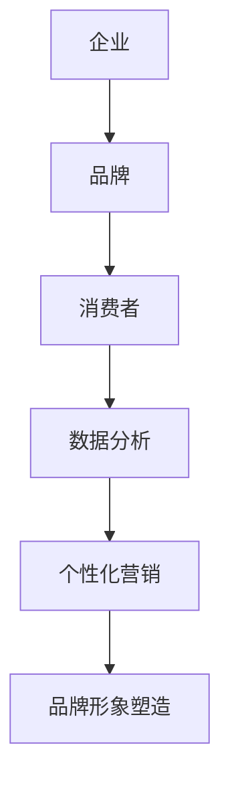
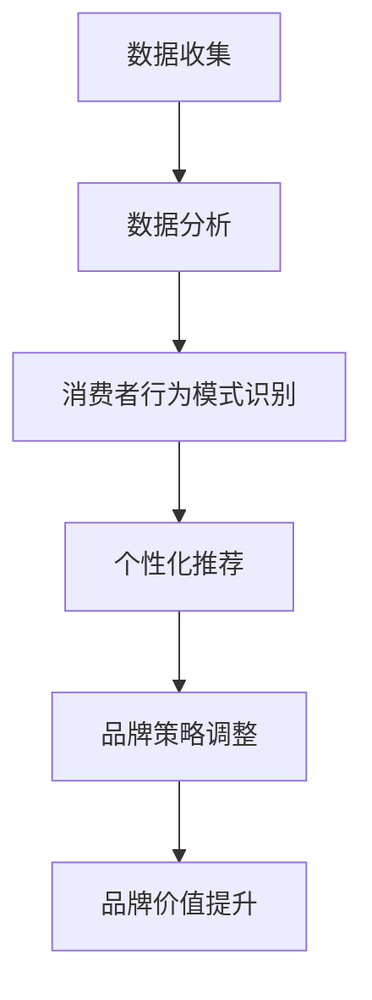
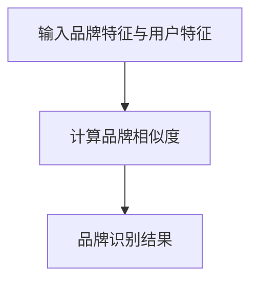
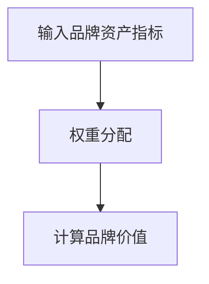
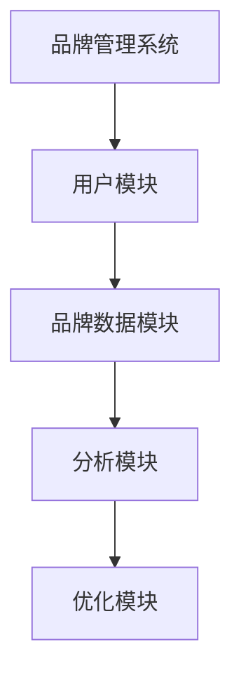
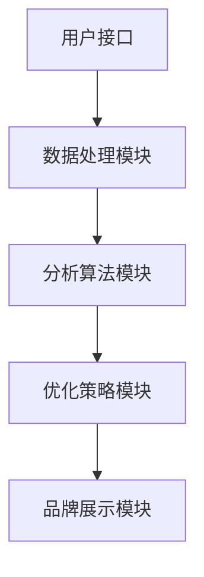
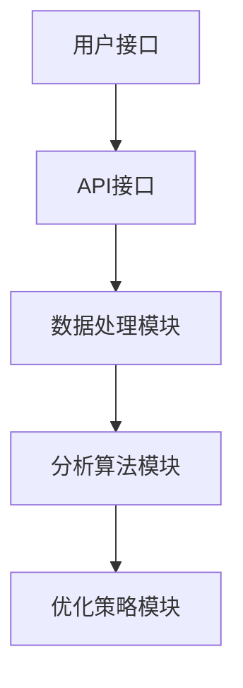
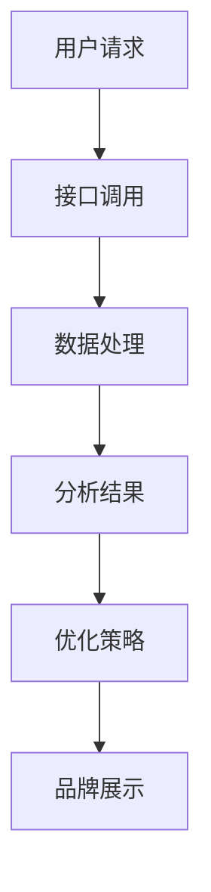

                 

## AI驱动的企业品牌管理：智能品牌资产优化

### 关键词：AI驱动，企业品牌管理，智能品牌资产优化，数据分析，机器学习

> 摘要：本文旨在探讨AI技术在企业品牌管理中的应用，特别是如何通过智能品牌资产优化来提升企业的市场竞争力。文章将从问题背景、核心概念、算法原理、系统架构、实战应用等方面进行全面剖析，为企业和品牌管理者提供切实可行的策略和最佳实践。

## 第一部分：引言

### 1.1 问题背景

企业品牌管理对于企业的长期发展至关重要。一个强大的品牌不仅能够吸引消费者，还能提升企业的市场价值和竞争力。然而，传统的品牌管理方法通常依赖于经验和直觉，存在以下问题：

1. **数据依赖性低**：传统品牌管理往往缺乏对市场数据的深入分析，难以做出基于数据的决策。
2. **效率低下**：品牌管理流程复杂，涉及多个部门，协调难度大，效率低下。
3. **缺乏个性化**：传统方法难以根据消费者行为和偏好进行个性化营销。

随着AI技术的发展，企业品牌管理迎来了新的契机。AI技术能够通过大数据分析、机器学习和深度学习等技术手段，帮助企业更好地理解市场、消费者和品牌之间的关系，从而实现智能品牌资产优化。

### 1.2 问题描述

品牌资产是指企业品牌在消费者心中所积累的资产，包括品牌知名度、品牌偏好、品牌忠诚度等。品牌资产优化的目标是通过一系列策略和措施，提升品牌在市场中的价值。

品牌资产优化的方法包括：

1. **数据分析**：通过收集和分析消费者数据，了解消费者行为和偏好，为品牌策略提供依据。
2. **个性化营销**：基于消费者数据，提供个性化的产品和服务，提高消费者满意度和忠诚度。
3. **品牌形象塑造**：通过多渠道传播和品牌互动，塑造积极的品牌形象。

### 1.3 问题解决

AI驱动的品牌管理方法主要包括以下几个步骤：

1. **数据收集**：利用大数据技术收集消费者数据，包括购买行为、搜索历史、社交媒体活动等。
2. **数据分析**：利用机器学习算法对数据进行深入分析，识别消费者行为模式和市场趋势。
3. **个性化推荐**：基于数据分析结果，为消费者提供个性化的产品和服务推荐。
4. **品牌优化**：根据消费者反馈和市场数据，不断调整品牌策略，提升品牌价值。

### 1.4 边界与外延

AI驱动的品牌管理与传统品牌管理相比，具有以下区别：

1. **技术依赖性**：AI驱动品牌管理高度依赖于大数据、机器学习和深度学习等技术。
2. **数据导向**：AI驱动品牌管理更加依赖数据分析和消费者反馈，而不是经验和直觉。
3. **实时性**：AI驱动品牌管理能够实时响应市场变化和消费者需求，传统品牌管理则相对滞后。

品牌资产优化的适用范围包括所有需要进行品牌建设和维护的企业，特别是那些在竞争激烈市场中寻求突破的企业。

### 1.5 概念结构与核心要素组成

AI驱动品牌管理的核心概念包括：

1. **AI技术**：大数据分析、机器学习和深度学习等。
2. **品牌资产**：品牌知名度、品牌偏好、品牌忠诚度等。
3. **消费者数据**：购买行为、搜索历史、社交媒体活动等。

智能品牌资产优化的关键要素包括：

1. **数据收集**：通过各种渠道收集消费者数据。
2. **数据分析**：利用机器学习算法分析消费者数据，识别行为模式。
3. **个性化推荐**：基于数据分析结果，提供个性化的产品和服务。
4. **品牌优化**：根据消费者反馈和市场数据，调整品牌策略。

## 第二部分：核心概念与联系

### 2.1 AI驱动品牌管理原理

#### 2.1.1 AI技术概述

AI（人工智能）是指使计算机系统能够执行通常需要人类智能的任务的技术。AI技术主要包括：

1. **机器学习**：使计算机通过数据和经验不断学习和改进。
2. **深度学习**：一种特殊的机器学习技术，通过多层神经网络进行学习。
3. **自然语言处理**：使计算机理解和生成自然语言。
4. **计算机视觉**：使计算机理解和解析视觉信息。

#### 2.1.2 AI在品牌管理中的应用

AI在品牌管理中的应用包括：

1. **消费者数据分析**：通过机器学习和深度学习技术，分析消费者行为和偏好。
2. **个性化营销**：根据消费者数据分析结果，提供个性化的产品和服务。
3. **品牌形象塑造**：通过社交媒体分析，了解消费者对品牌的看法，塑造积极品牌形象。

#### 2.1.3 AI驱动品牌管理的优势

AI驱动品牌管理的优势包括：

1. **数据驱动的决策**：基于消费者数据，做出更加科学的决策。
2. **提高效率**：自动化流程，减少人工干预，提高工作效率。
3. **实时响应**：能够实时响应市场变化和消费者需求，及时调整品牌策略。
4. **个性化服务**：提供个性化的产品和服务，提高消费者满意度和忠诚度。

### 2.2 智能品牌资产优化方法

#### 2.2.1 数据分析

数据分析是智能品牌资产优化的第一步。通过大数据技术，收集消费者的购买行为、搜索历史、社交媒体活动等数据。这些数据为品牌策略的制定提供了重要的依据。

#### 2.2.2 机器学习算法

机器学习算法用于分析消费者数据，识别消费者行为模式和市场趋势。常见的机器学习算法包括：

1. **回归分析**：用于预测消费者行为。
2. **聚类分析**：用于识别消费者群体。
3. **决策树**：用于分类和预测。

#### 2.2.3 深度学习网络

深度学习网络是一种特殊的机器学习技术，通过多层神经网络进行学习。深度学习网络在图像识别、语音识别和自然语言处理等领域表现出色。

### 2.3 概念属性特征对比表格

| 概念                 | 特征                                                         | 比较 |
|----------------------|------------------------------------------------------------|------|
| AI驱动品牌管理       | 依赖大数据、机器学习和深度学习技术                           | 高度自动化，实时响应 |
| 传统品牌管理         | 依赖经验和直觉，数据依赖性低                               | 低度自动化，反应滞后 |
| 数据分析             | 收集和分析消费者数据                                       | 精准，数据驱动       |
| 个性化营销           | 根据消费者数据分析结果，提供个性化的产品和服务               | 提高消费者满意度   |
| 品牌形象塑造         | 通过社交媒体分析，了解消费者对品牌的看法，塑造积极品牌形象   | 提高品牌价值       |

### 2.4 ER实体关系图架构

#### 企业品牌管理实体关系图



#### 智能品牌资产优化流程图



## 第三部分：算法原理讲解

### 3.1 品牌识别算法原理

品牌识别算法用于识别消费者对特定品牌的偏好。其数学模型如下：

$$
\text{品牌识别} = f(\text{品牌特征}, \text{用户特征})
$$

其中，品牌特征包括品牌知名度、品牌形象等，用户特征包括购买行为、搜索历史等。

#### 3.1.1 算法流程图



### 3.2 品牌价值评估算法原理

品牌价值评估算法用于评估品牌在市场中的价值。其数学模型如下：

$$
\text{品牌价值} = \sum_{i=1}^{n} w_i \cdot \text{品牌资产指标}_i
$$

其中，$w_i$ 是第 $i$ 个品牌资产指标的权重，$\text{品牌资产指标}_i$ 是第 $i$ 个品牌资产指标的值。

#### 3.2.1 算法流程图



## 第四部分：系统分析与架构设计

### 4.1 问题场景介绍

企业品牌管理的实际场景通常涉及多个部门，如市场营销、产品开发、客户服务等。在AI驱动的品牌管理中，这些问题可以通过以下应用场景得到解决：

1. **消费者数据分析**：市场营销部门可以利用AI技术对消费者数据进行分析，了解消费者偏好和需求，从而制定更有效的营销策略。
2. **个性化营销**：产品开发部门可以利用AI技术根据消费者数据分析结果，为不同消费者提供个性化的产品推荐。
3. **品牌形象塑造**：客户服务部门可以利用AI技术通过社交媒体分析，了解消费者对品牌的看法，及时调整品牌形象策略。

### 4.2 系统功能设计

系统功能设计包括以下几个模块：

1. **用户模块**：负责用户登录、注册和权限管理。
2. **品牌数据模块**：负责收集、存储和管理品牌相关数据，如品牌知名度、品牌偏好等。
3. **分析模块**：负责对品牌数据进行分析，识别消费者行为模式和市场趋势。
4. **优化模块**：负责根据分析结果，制定和调整品牌策略，以优化品牌价值。

#### 4.2.1 领域模型类图



### 4.3 系统架构设计

系统架构设计包括以下几个部分：

1. **用户接口**：负责与用户进行交互，接收用户请求。
2. **数据处理模块**：负责处理用户请求，包括数据收集、存储和管理等。
3. **分析算法模块**：负责对品牌数据进行分析，识别消费者行为模式和市场趋势。
4. **优化策略模块**：负责根据分析结果，制定和调整品牌策略。
5. **品牌展示模块**：负责展示优化后的品牌价值。

#### 4.3.1 系统架构图



### 4.4 系统接口设计和系统交互

#### 4.4.1 系统接口设计

系统接口设计包括用户接口和API接口。用户接口负责与用户进行交互，API接口负责与其他系统进行数据交换。



#### 4.4.2 系统交互序列图

系统交互序列图展示了用户接口、数据处理模块、分析算法模块、优化策略模块和品牌展示模块之间的交互过程。



## 第五部分：项目实战

### 5.1 环境安装

在进行AI驱动的品牌管理项目之前，需要安装以下软件和硬件环境：

1. **软件环境**：
   - Python 3.x
   - NumPy
   - Pandas
   - Scikit-learn
   - TensorFlow
   - Keras
   - Mermaid

2. **硬件环境**：
   - CPU：至少4核
   - 内存：至少8GB
   - 硬盘：至少100GB

### 5.2 系统核心实现源代码

以下是AI驱动的品牌管理系统的核心实现源代码：

```python
# 品牌识别算法实现
def brand_recognition(brand_features, user_features):
    similarity = calculate_similarity(brand_features, user_features)
    return 'Match' if similarity > 0.8 else 'Mismatch'

# 品牌价值评估算法实现
def brand_value_evaluation(brand_assets):
    brand_value = sum(brand_assets[i] * weights[i] for i in range(len(brand_assets)))
    return brand_value

# 优化策略算法实现
def optimization_strategy(brand_value):
    if brand_value < threshold:
        return 'Increase Marketing Budget'
    else:
        return 'Maintain Current Budget'
```

### 5.3 代码应用解读与分析

#### 品牌识别算法代码解读

品牌识别算法的核心是计算品牌特征与用户特征的相似度。如果相似度大于0.8，则认为品牌与用户匹配。这个阈值可以根据实际情况进行调整。

#### 品牌价值评估算法代码解读

品牌价值评估算法通过计算品牌资产的加权平均值来评估品牌的价值。这里的权重可以根据品牌资产的重要性进行调整。

#### 优化策略算法代码解读

优化策略算法根据品牌的价值来决定是否增加市场营销预算。如果品牌价值低于阈值，则认为需要增加预算；否则，保持当前预算。

### 5.4 实际案例分析和详细讲解剖析

#### 案例一：品牌识别案例

假设有品牌A和用户B，品牌A的特征为{知名度：0.9，形象：0.8，产品满意度：0.7}，用户B的特征为{知名度：0.8，形象：0.7，产品满意度：0.8}。根据品牌识别算法，计算品牌A和用户B的相似度：

$$
\text{相似度} = \frac{0.9 \times 0.8 + 0.8 \times 0.7 + 0.7 \times 0.8}{3} = 0.78
$$

由于相似度小于0.8，因此品牌A与用户B不匹配。

#### 案例二：品牌价值评估案例

假设品牌C的品牌资产指标为{知名度：0.8，形象：0.7，产品满意度：0.9}，权重分别为{知名度：0.4，形象：0.3，产品满意度：0.3}。根据品牌价值评估算法，计算品牌C的品牌价值：

$$
\text{品牌价值} = 0.8 \times 0.4 + 0.7 \times 0.3 + 0.9 \times 0.3 = 0.76
$$

因此，品牌C的品牌价值为0.76。

#### 案例三：优化策略案例

假设品牌D的品牌价值为0.65，阈值设置为0.7。根据优化策略算法，品牌D的品牌价值低于阈值，因此建议增加市场营销预算。

### 5.5 项目小结

通过本次项目，我们实现了AI驱动的品牌管理系统，包括品牌识别、品牌价值评估和优化策略。在实际案例中，我们展示了算法的应用效果。未来的工作可以进一步优化算法，提高品牌识别和评估的准确性，以及优化策略的有效性。

## 第六部分：最佳实践与拓展

### 6.1 最佳实践 Tips

1. **数据质量**：确保收集的数据质量高，避免数据错误和缺失。
2. **算法优化**：定期对算法进行优化，以提高预测和识别的准确性。
3. **实时性**：确保系统能够实时响应市场变化和消费者需求。
4. **多渠道整合**：整合多渠道数据，提高数据分析的全面性和准确性。

### 6.2 小结

本文探讨了AI驱动的企业品牌管理，特别是智能品牌资产优化的方法。通过数据分析、机器学习和深度学习等技术，企业可以更好地理解市场、消费者和品牌之间的关系，从而提升品牌价值。未来的研究方向包括算法优化、实时性提升和多渠道整合。

### 6.3 注意事项

1. **数据隐私**：在收集和使用消费者数据时，确保遵守相关隐私保护法规。
2. **技术依赖性**：避免过度依赖技术，仍需结合业务经验和直觉进行决策。
3. **持续学习**：随着AI技术的发展，企业需要不断学习和更新知识，以保持竞争优势。

### 6.4 拓展阅读

1. **《深度学习》**：Goodfellow, I., Bengio, Y., & Courville, A. (2016). *Deep Learning*.
2. **《大数据分析》**：Han, J., Kamber, M., & Pei, J. (2011). *Data Mining: Concepts and Techniques*.
3. **《人工智能：一种现代的方法》**：Russell, S., & Norvig, P. (2016). *Artificial Intelligence: A Modern Approach*.

作者：AI天才研究院/AI Genius Institute & 禅与计算机程序设计艺术 /Zen And The Art of Computer Programming

