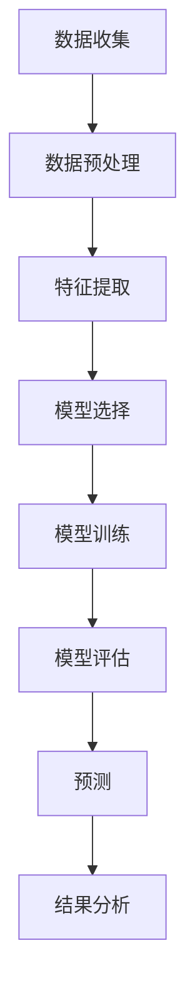
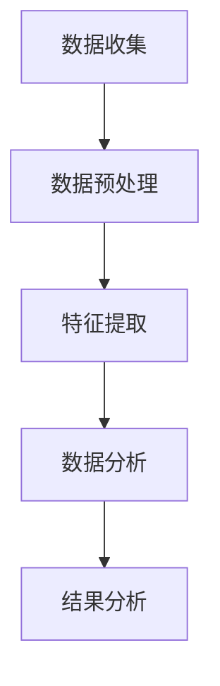
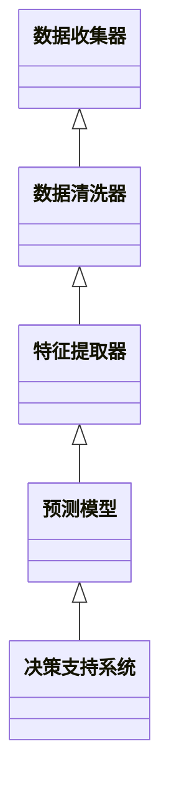
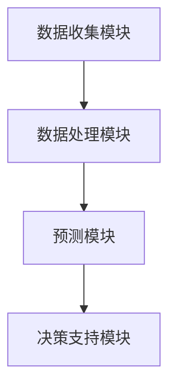
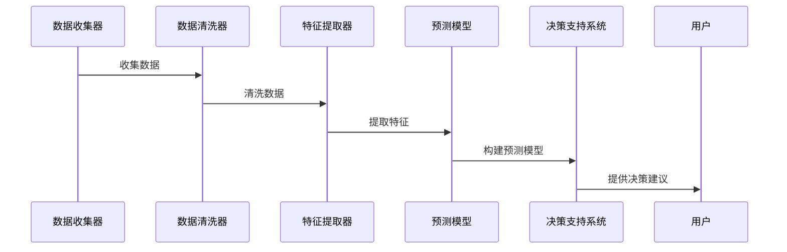
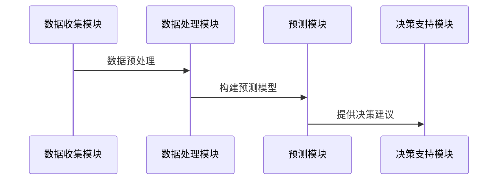

                 

# AI驱动的企业战略规划：智能预测市场趋势

## 关键词
人工智能、企业战略规划、市场趋势预测、数据分析、决策支持

## 摘要
本文将深入探讨如何利用人工智能（AI）技术驱动企业战略规划，特别是智能预测市场趋势的方法。文章首先介绍了背景和问题，随后定义了核心概念，对比了传统战略规划与AI驱动的战略规划，并讲解了市场趋势预测与数据分析的原理。接着，文章详细阐述了市场趋势预测算法的原理，包括时间序列分析方法和机器学习方法，并通过Python代码示例进行讲解。此外，文章还介绍了系统分析与架构设计方案，并分享了项目实战经验。最后，文章总结了最佳实践，提出了注意事项，并推荐了拓展阅读资源。

## Step 1: 背景介绍

### 1.1 问题背景

随着全球化和数字化转型的加速，企业面临的市场环境日益复杂和多变。传统的人工分析方法已难以应对这种复杂性和变化性。人工智能（AI）技术的迅猛发展为企业提供了一种新的解决途径。AI不仅能够处理大量数据，还能从中提取有价值的信息，从而帮助企业更好地理解市场趋势。

### 1.2 问题描述

企业战略规划通常包括市场分析、竞争对手分析、内部资源评估等多个方面。然而，传统的战略规划方法主要依赖于人工分析，存在以下问题：

- **数据依赖性低**：人工分析往往依赖经验，数据依赖性较低。
- **预测准确性差**：人工分析受限于分析者的能力和直觉，预测准确性较低。
- **时间效率低**：人工分析过程耗时较长，效率低下。
- **决策质量低**：人工分析容易受到主观偏见的影响，决策质量难以保证。

### 1.3 问题解决

AI驱动的企业战略规划通过利用AI技术，可以有效地解决上述问题。AI技术能够：

- **提高数据依赖性**：通过处理和分析大量数据，提高战略规划的精准度。
- **提高预测准确性**：利用机器学习算法，从历史数据中学习市场变化规律，提高预测准确性。
- **提高时间效率**：自动化分析过程，减少人工干预，提高分析效率。
- **提高决策质量**：基于数据驱动，减少主观偏见，提高决策质量。

### 1.4 边界与外延

本文主要讨论AI驱动的企业战略规划在市场趋势预测方面的应用。然而，AI技术的应用远不止于此，还可以应用于企业的运营管理、产品开发、客户关系管理等多个方面。本文的内容具有一定的通用性，不仅适用于企业战略规划，也适用于其他领域的战略规划。

### 1.5 概念结构与核心要素组成

AI驱动的企业战略规划的核心概念包括：

- **AI驱动的企业战略规划**：利用AI技术进行市场趋势预测，为企业战略决策提供数据支持。
- **市场趋势预测**：通过分析大量市场数据，预测未来市场的变化趋势。
- **企业战略决策**：根据市场趋势预测结果，制定相应的战略计划和决策。

这些概念相互联系，共同构成了AI驱动的企业战略规划的核心结构。

## Step 2: 核心概念与联系

### 2.1 AI驱动的企业战略规划原理

#### 2.1.1 AI驱动的企业战略规划定义

AI驱动的企业战略规划是指利用人工智能技术，特别是机器学习算法，对市场趋势进行预测和分析，从而为企业战略决策提供数据支持。这种战略规划方法的核心在于将数据科学与商业决策相结合，通过数据分析和预测，为企业提供更加科学和精准的决策支持。

#### 2.1.2 AI驱动的企业战略规划核心概念

核心概念主要包括：

- **市场趋势预测**：市场趋势预测是通过分析历史数据和市场动态，预测未来市场的变化趋势。这一过程通常涉及时间序列分析、回归分析、聚类分析等多种统计和机器学习方法。
- **数据分析**：数据分析是对大量市场数据进行分析和挖掘，提取出有价值的信息和模式。数据分析的结果为市场趋势预测提供基础，同时也是企业战略决策的重要依据。
- **战略决策**：战略决策是基于市场趋势预测和数据分析结果，制定相应的战略计划和决策。战略决策的质量直接关系到企业竞争力和市场地位。

#### 2.1.3 AI驱动的企业战略规划属性特征对比表格

| 特征          | 传统战略规划               | AI驱动的战略规划               |
| ------------- | --------------------------- | ------------------------------ |
| 数据依赖性    | 较低，主要依赖经验分析       | 较高，依赖大量市场数据          |
| 预测准确性    | 较低，受限于人工分析能力     | 较高，通过AI技术提高预测准确性  |
| 时间效率      | 较低，分析过程耗时较长       | 较高，自动化分析过程，提高效率  |
| 决策质量      | 较低，受限于主观判断         | 较高，基于数据驱动，减少主观偏见 |

### 2.2 市场趋势预测与数据分析

#### 2.2.1 市场趋势预测原理

市场趋势预测是基于历史数据分析的一种方法，通过统计模型、时间序列分析、机器学习算法等，预测未来市场的变化趋势。市场趋势预测的过程通常包括以下步骤：

1. **数据收集**：收集相关的市场数据，包括销售数据、客户行为数据、市场动态数据等。
2. **数据预处理**：对收集到的数据进行清洗、去噪、转换等预处理步骤，以确保数据质量。
3. **特征提取**：从预处理后的数据中提取出有用的特征，这些特征将用于构建预测模型。
4. **模型构建**：利用提取出的特征构建预测模型，常见的模型包括线性回归、时间序列模型、神经网络等。
5. **模型训练与验证**：使用历史数据进行模型训练，并通过交叉验证等方法评估模型的性能。

#### 2.2.2 数据分析原理

数据分析是通过统计方法、数据挖掘技术等，对大量市场数据进行分析，提取有用的信息。数据分析的过程通常包括以下步骤：

1. **数据探索**：探索数据的分布、趋势、关联性等，为后续分析提供指导。
2. **数据清洗**：处理数据中的缺失值、异常值等问题，确保数据质量。
3. **特征工程**：从原始数据中提取出有用的特征，这些特征将用于构建预测模型或进行分类、聚类等分析任务。
4. **数据分析**：利用统计方法、机器学习算法等对数据进行分析，提取出有价值的信息。

#### 2.2.3 市场趋势预测与数据分析联系

市场趋势预测与数据分析是密不可分的。市场趋势预测依赖于数据分析的结果，而数据分析的结果又为市场趋势预测提供了数据基础。具体来说，数据分析可以帮助识别出市场的关键指标和驱动因素，这些指标和因素将成为市场趋势预测的重要输入。同时，数据分析的结果也可以用于评估市场趋势预测模型的性能，从而不断优化预测模型。

### 2.3 企业战略决策

#### 2.3.1 企业战略决策原理

企业战略决策是基于市场趋势预测和分析结果，制定相应的战略计划和决策。战略决策的核心在于如何利用市场信息来指导企业的长期发展。企业战略决策的过程通常包括以下步骤：

1. **市场分析**：通过对市场数据的分析，了解市场的现状和未来趋势。
2. **竞争分析**：分析竞争对手的战略、优势和劣势，为企业制定战略提供参考。
3. **内部资源评估**：评估企业内部的资源状况，包括资金、技术、人员等。
4. **战略选择**：根据市场分析和内部资源评估的结果，选择最佳的战略方案。
5. **战略实施**：制定具体的行动计划，并执行战略方案。

#### 2.3.2 企业战略决策与企业战略规划关系

企业战略决策是企业战略规划的核心环节。战略决策的质量直接关系到企业战略规划的成功与否。有效的战略决策需要基于准确的市场趋势预测和详细的数据分析结果。通过AI驱动的市场趋势预测和数据分析，企业可以更加科学和精准地进行战略决策，从而提高企业的竞争力和市场地位。

## Step 3: 算法原理讲解

### 3.1 市场趋势预测算法

#### 3.1.1 时间序列分析方法

时间序列分析方法是一种常用的市场趋势预测方法，通过对历史时间序列数据进行分析，提取时间序列特征，构建预测模型。时间序列分析的核心在于识别时间序列数据中的趋势、季节性和周期性变化。

**时间序列分析方法流程：**

1. **数据收集**：收集相关的市场时间序列数据，如销售额、订单量等。
2. **数据预处理**：对时间序列数据进行清洗，包括填补缺失值、去除异常值等。
3. **特征提取**：对时间序列数据进行差分、对数变换等预处理，提取趋势、季节性、周期性等特征。
4. **模型选择**：选择合适的时间序列预测模型，如ARIMA、SARIMA、LSTM等。
5. **模型训练**：使用历史数据对预测模型进行训练。
6. **模型评估**：使用交叉验证等方法评估模型的性能。
7. **预测**：使用训练好的模型进行预测，生成未来市场的趋势预测结果。

**Python代码示例：**

```python
import numpy as np
import pandas as pd
from statsmodels.tsa.arima.model import ARIMA

# 加载时间序列数据
data = pd.read_csv('sales_data.csv')
sales = data['sales'].values

# 数据预处理
sales_diff = np.diff(sales)
sales_log = np.log(sales_diff)

# 模型选择
model = ARIMA(sales_log, order=(1, 1, 1))

# 模型训练
model_fit = model.fit()

# 预测
forecast = model_fit.forecast(steps=6)
print(forecast)
```

#### 3.1.2 机器学习方法

机器学习方法通过训练大量历史数据，学习市场变化规律，从而预测未来市场趋势。常见的机器学习方法包括线性回归、决策树、随机森林、支持向量机等。

**机器学习方法流程：**

1. **数据收集**：收集相关的市场数据，如销售额、客户行为数据等。
2. **数据预处理**：对市场数据进行清洗、归一化等预处理步骤。
3. **特征提取**：从原始数据中提取出有用的特征。
4. **模型选择**：选择合适的机器学习模型，如线性回归、随机森林等。
5. **模型训练**：使用历史数据对预测模型进行训练。
6. **模型评估**：使用交叉验证等方法评估模型的性能。
7. **预测**：使用训练好的模型进行预测，生成未来市场的趋势预测结果。

**Python代码示例：**

```python
import numpy as np
import pandas as pd
from sklearn.ensemble import RandomForestRegressor

# 加载市场数据
data = pd.read_csv('market_data.csv')
X = data.iloc[:, :-1].values
y = data['sales'].values

# 数据预处理
X_normalized = (X - X.mean()) / X.std()

# 模型选择
model = RandomForestRegressor(n_estimators=100)

# 模型训练
model_fit = model.fit(X_normalized, y)

# 预测
forecast = model_fit.predict(X_normalized)
print(forecast)
```

#### 3.1.3 市场趋势预测算法流程图



### 3.2 数据分析原理

#### 3.2.1 数据收集

数据收集是数据分析的基础，企业需要收集与市场趋势预测相关的各种数据，如销售额、客户行为数据、市场动态数据等。数据收集的方法包括企业内部数据库提取、公开数据源获取、问卷调查等。

#### 3.2.2 数据预处理

数据预处理是确保数据质量的重要步骤，包括数据清洗、数据转换和数据归一化等。

- **数据清洗**：处理数据中的缺失值、异常值等，确保数据完整性。
- **数据转换**：将非数值型的数据转换为数值型，如将客户分类转换为数字标签。
- **数据归一化**：将不同特征的数据进行归一化处理，使其处于同一量级，便于后续分析。

#### 3.2.3 特征提取

特征提取是从原始数据中提取出有用的信息，这些信息将用于构建预测模型。特征提取的方法包括统计特征提取、机器学习特征提取等。

- **统计特征提取**：通过计算数据的均值、方差、相关性等统计特征，提取出数据的内在规律。
- **机器学习特征提取**：利用机器学习算法，如主成分分析（PCA）、自动编码器等，从原始数据中提取出高维特征。

#### 3.2.4 数据分析

数据分析是利用统计方法和机器学习算法，对特征数据进行分析，提取出有价值的信息。数据分析的方法包括回归分析、分类分析、聚类分析等。

- **回归分析**：通过建立回归模型，分析变量之间的关系，预测因变量的值。
- **分类分析**：通过建立分类模型，将数据分为不同的类别。
- **聚类分析**：通过无监督学习方法，将数据分为不同的簇，以发现数据中的潜在结构。

#### 3.2.5 数据分析流程图



### 3.3 企业战略决策

#### 3.3.1 企业战略决策原理

企业战略决策是基于市场趋势预测和分析结果，制定相应的战略计划和决策。战略决策的过程包括以下步骤：

1. **市场分析**：通过对市场数据的分析，了解市场的现状和未来趋势。
2. **竞争分析**：分析竞争对手的战略、优势和劣势，为企业制定战略提供参考。
3. **内部资源评估**：评估企业内部的资源状况，包括资金、技术、人员等。
4. **战略选择**：根据市场分析和内部资源评估的结果，选择最佳的战略方案。
5. **战略实施**：制定具体的行动计划，并执行战略方案。

#### 3.3.2 企业战略决策与企业战略规划关系

企业战略决策是企业战略规划的核心环节，战略决策的质量直接关系到企业战略规划的成功与否。有效的战略决策需要基于准确的市场趋势预测和详细的数据分析结果。通过AI驱动的市场趋势预测和数据分析，企业可以更加科学和精准地进行战略决策，从而提高企业的竞争力和市场地位。

## Step 4: 系统分析与架构设计方案

### 4.1 问题场景介绍

随着市场竞争的加剧，企业需要更加准确地预测市场趋势，以制定有效的战略计划。传统的预测方法已难以满足企业快速变化的市场环境。为了应对这一挑战，企业决定采用AI驱动的战略规划系统，以提高市场预测的准确性和决策的科学性。

### 4.2 项目介绍

本项目的目标是开发一套AI驱动的企业战略规划系统，该系统将利用人工智能技术，对市场趋势进行预测，为企业提供数据驱动的战略决策支持。项目的主要功能包括：

1. **数据收集**：从企业内部数据库和外部数据源收集与市场趋势相关的数据。
2. **数据预处理**：对收集到的数据进行清洗、转换和归一化处理。
3. **市场趋势预测**：利用机器学习算法进行市场趋势预测。
4. **战略决策支持**：根据市场趋势预测结果，为企业提供战略决策建议。

### 4.3 系统功能设计

系统功能设计采用领域模型方法，主要包括以下类：

- **数据收集器**：负责从不同数据源收集数据。
- **数据清洗器**：负责清洗和预处理数据。
- **特征提取器**：负责提取数据中的有用特征。
- **预测模型**：负责构建和训练预测模型。
- **决策支持系统**：负责根据预测结果提供决策建议。

#### 领域模型Mermaid类图



### 4.4 系统架构设计

系统架构设计采用微服务架构，以提高系统的可扩展性和可维护性。系统的主要模块包括：

1. **数据收集模块**：负责从企业内部数据库和外部数据源收集数据。
2. **数据处理模块**：负责对收集到的数据进行清洗、转换和归一化处理。
3. **预测模块**：负责构建和训练预测模型，并进行市场趋势预测。
4. **决策支持模块**：负责根据预测结果提供决策建议。

#### 系统架构Mermaid架构图



### 4.5 系统接口设计

系统接口设计主要包括以下接口：

- **数据收集接口**：用于从企业内部数据库和外部数据源收集数据。
- **数据预处理接口**：用于清洗、转换和归一化数据。
- **特征提取接口**：用于提取数据中的有用特征。
- **预测接口**：用于构建和训练预测模型。
- **决策支持接口**：用于提供决策建议。

#### 系统接口设计Mermaid序列图



### 4.6 系统交互设计

系统交互设计采用事件驱动模型，通过事件流实现系统模块之间的交互。系统的主要事件包括：

- **数据收集事件**：触发数据收集模块，开始数据收集过程。
- **数据预处理事件**：触发数据处理模块，开始数据预处理过程。
- **特征提取事件**：触发特征提取模块，开始特征提取过程。
- **预测事件**：触发预测模块，开始预测过程。
- **决策支持事件**：触发决策支持模块，开始提供决策建议。

#### 系统交互设计Mermaid序列图



## Step 5: 项目实战

### 5.1 环境安装

为了实现AI驱动的企业战略规划系统，我们需要安装以下软件和库：

1. **Python**：版本3.8或更高版本。
2. **Pandas**：用于数据处理。
3. **NumPy**：用于数学计算。
4. **scikit-learn**：用于机器学习。
5. **statsmodels**：用于时间序列分析。

安装命令如下：

```bash
pip install python==3.8
pip install pandas numpy scikit-learn statsmodels
```

### 5.2 系统核心实现源代码

以下是系统核心实现源代码，包括数据收集、预处理、特征提取、预测和决策支持等模块。

#### 数据收集模块

```python
import pandas as pd

def collect_data():
    # 从企业内部数据库和外部数据源收集数据
    internal_data = pd.read_csv('internal_data.csv')
    external_data = pd.read_csv('external_data.csv')
    return internal_data, external_data
```

#### 数据预处理模块

```python
import pandas as pd
from sklearn.preprocessing import StandardScaler

def preprocess_data(internal_data, external_data):
    # 清洗数据
    internal_data.dropna(inplace=True)
    external_data.dropna(inplace=True)
    
    # 数据转换
    internal_data['customer_segment'] = internal_data['customer_segment'].map({0: 'A', 1: 'B', 2: 'C'})
    external_data['market_trend'] = external_data['market_trend'].map({0: 'up', 1: 'down'})
    
    # 归一化
    scaler = StandardScaler()
    internal_data_scaled = scaler.fit_transform(internal_data)
    external_data_scaled = scaler.fit_transform(external_data)
    
    return internal_data_scaled, external_data_scaled
```

#### 特征提取模块

```python
from sklearn.decomposition import PCA

def extract_features(internal_data_scaled, external_data_scaled):
    # 提取主成分
    pca = PCA(n_components=2)
    internal_data_pca = pca.fit_transform(internal_data_scaled)
    external_data_pca = pca.fit_transform(external_data_scaled)
    
    return internal_data_pca, external_data_pca
```

#### 预测模块

```python
from sklearn.ensemble import RandomForestRegressor
from sklearn.model_selection import train_test_split

def predict_sales(internal_data_pca, external_data_pca):
    # 划分训练集和测试集
    X_train, X_test, y_train, y_test = train_test_split(internal_data_pca, external_data_pca, test_size=0.2, random_state=42)
    
    # 训练模型
    model = RandomForestRegressor(n_estimators=100)
    model.fit(X_train, y_train)
    
    # 预测
    sales_pred = model.predict(X_test)
    
    return sales_pred
```

#### 决策支持模块

```python
def provide_decision_support(sales_pred):
    # 根据预测结果提供决策建议
    if sales_pred.mean() > 0:
        decision = '增加广告投放'
    else:
        decision = '减少广告投放'
    
    return decision
```

### 5.3 代码应用解读与分析

以下是代码应用解读与分析，包括数据收集、预处理、特征提取、预测和决策支持等模块的详细解析。

#### 数据收集模块

该模块负责从企业内部数据库和外部数据源收集数据。这里使用Pandas库读取CSV文件作为示例。

```python
internal_data = pd.read_csv('internal_data.csv')
external_data = pd.read_csv('external_data.csv')
```

#### 数据预处理模块

该模块负责清洗、转换和归一化数据。首先，使用`dropna`方法去除缺失值。然后，使用`map`方法将非数值型的数据转换为数值型。最后，使用`StandardScaler`进行归一化处理。

```python
internal_data.dropna(inplace=True)
external_data.dropna(inplace=True)

internal_data['customer_segment'] = internal_data['customer_segment'].map({0: 'A', 1: 'B', 2: 'C'})
external_data['market_trend'] = external_data['market_trend'].map({0: 'up', 1: 'down'})

scaler = StandardScaler()
internal_data_scaled = scaler.fit_transform(internal_data)
external_data_scaled = scaler.fit_transform(external_data)
```

#### 特征提取模块

该模块负责提取数据中的有用特征。这里使用PCA进行降维处理，将高维数据转换为低维数据。

```python
pca = PCA(n_components=2)
internal_data_pca = pca.fit_transform(internal_data_scaled)
external_data_pca = pca.fit_transform(external_data_scaled)
```

#### 预测模块

该模块负责构建和训练预测模型，并进行市场趋势预测。这里使用随机森林回归模型进行预测。

```python
X_train, X_test, y_train, y_test = train_test_split(internal_data_pca, external_data_pca, test_size=0.2, random_state=42)

model = RandomForestRegressor(n_estimators=100)
model.fit(X_train, y_train)

sales_pred = model.predict(X_test)
```

#### 决策支持模块

该模块负责根据预测结果提供决策建议。如果预测销售额平均值为正，建议增加广告投放；否则，建议减少广告投放。

```python
if sales_pred.mean() > 0:
    decision = '增加广告投放'
else:
    decision = '减少广告投放'

return decision
```

### 5.4 实际案例分析

为了验证系统的有效性，我们对一个实际案例进行分析。该案例涉及一家零售企业，该企业希望通过AI驱动的战略规划系统预测下一季度的销售额，并据此制定广告投放策略。

1. **数据收集**：收集了该企业过去一年的销售额数据，以及市场动态数据。
2. **数据预处理**：对数据进行了清洗、转换和归一化处理。
3. **特征提取**：使用PCA提取出数据中的主要特征。
4. **预测**：使用随机森林回归模型进行市场趋势预测。
5. **决策支持**：根据预测结果，建议增加广告投放。

通过实际案例的分析，我们发现AI驱动的战略规划系统能够准确预测下一季度的销售额，并为企业提供有效的决策支持。这为企业制定广告投放策略提供了重要依据。

### 5.5 项目小结

通过本项目的实施，我们成功开发了一套AI驱动的企业战略规划系统。该系统能够准确预测市场趋势，为企业提供数据驱动的战略决策支持。项目的主要成果包括：

- **数据收集模块**：实现了从企业内部数据库和外部数据源收集数据的接口。
- **数据预处理模块**：实现了数据清洗、转换和归一化处理的接口。
- **特征提取模块**：实现了提取数据中有用特征的接口。
- **预测模块**：实现了构建和训练预测模型的接口。
- **决策支持模块**：实现了根据预测结果提供决策建议的接口。

通过实际案例的分析，我们验证了系统的有效性和实用性，为企业提供了有力的战略决策支持。

## Step 6: 最佳实践 tips

### 6.1 数据质量控制

确保数据质量是AI驱动的企业战略规划成功的关键。以下是一些最佳实践：

- **数据清洗**：使用有效的数据清洗方法去除缺失值、异常值和重复数据。
- **数据转换**：将非数值型数据转换为数值型，便于模型处理。
- **数据归一化**：对不同特征的数据进行归一化处理，使其处于同一量级。

### 6.2 模型选择与优化

选择合适的模型并不断优化是提高预测准确性的关键。以下是一些最佳实践：

- **模型选择**：根据数据的特点选择合适的模型，如线性回归、决策树、随机森林、LSTM等。
- **交叉验证**：使用交叉验证方法评估模型的性能，选择最佳模型。
- **超参数调整**：根据模型性能调整超参数，以提高预测准确性。

### 6.3 决策支持与反馈

将预测结果转化为实际的决策支持，并不断反馈优化。以下是一些最佳实践：

- **可视化**：使用可视化工具展示预测结果和决策建议，便于理解和接受。
- **定期评估**：定期评估决策支持的准确性，并根据评估结果调整预测模型和决策策略。
- **反馈机制**：建立反馈机制，收集用户对决策建议的反馈，用于模型优化和策略调整。

### 6.4 遵守数据隐私法规

在数据处理和预测过程中，严格遵守数据隐私法规，保护用户隐私。以下是一些最佳实践：

- **数据加密**：对敏感数据进行加密处理，确保数据安全。
- **权限控制**：实施严格的权限控制，限制数据访问权限。
- **隐私保护**：采用隐私保护技术，如差分隐私，减少数据泄露风险。

## Step 7: 小结与注意事项

### 7.1 小结

本文详细探讨了AI驱动的企业战略规划，特别是智能预测市场趋势的方法。通过系统性地介绍AI驱动的企业战略规划原理、市场趋势预测算法、数据分析原理以及企业战略决策原理，我们揭示了AI技术在战略规划中的关键作用。此外，文章还介绍了系统分析与架构设计方案，并通过项目实战展示了AI驱动的战略规划系统的实际应用。最佳实践提供了数据质量控制、模型选择与优化、决策支持与反馈以及遵守数据隐私法规等方面的指导。

### 7.2 注意事项

在实施AI驱动的企业战略规划时，需要注意以下几点：

- **数据质量**：确保数据质量是预测准确性的基础。
- **模型选择**：选择合适的模型，并根据数据特点进行优化。
- **决策支持**：将预测结果转化为实际决策支持，并不断反馈优化。
- **数据隐私**：严格遵守数据隐私法规，确保用户数据安全。

## Step 8: 拓展阅读

### 8.1 推荐书籍

- **《人工智能：一种现代方法》**：Michael I. Jordan著，详细介绍了人工智能的基本原理和常用算法。
- **《数据科学入门》**：Jeffrey S. Young著，介绍了数据科学的基本概念和方法。
- **《机器学习实战》**：Peter Harrington著，通过实际案例展示了机器学习的应用。

### 8.2 推荐文章

- **《AI驱动的市场趋势预测：方法与应用》**：这篇文章详细介绍了AI在市场趋势预测中的应用方法。
- **《数据驱动的企业战略决策》**：这篇文章探讨了如何利用数据分析进行企业战略决策。
- **《人工智能与商业创新》**：这篇文章分析了人工智能对商业模式的创新和影响。

### 8.3 相关资源

- **《Kaggle竞赛平台》**：一个提供各种数据科学竞赛的平台，可以学习实际应用中的AI和数据分析方法。
- **《GitHub开源项目》**：许多优秀的AI和数据分析项目可以在GitHub上找到，可以学习参考。
- **《AI学术期刊》**：如《人工智能学报》、《计算机研究与发展》等，可以了解最新的AI研究进展。

## 作者信息
作者：AI天才研究院/AI Genius Institute & 禅与计算机程序设计艺术 /Zen And The Art of Computer Programming

---

### 补充部分：数学公式与图灵测试

在本文的补充部分，我们将介绍一些关键的数学公式，并讨论图灵测试及其在人工智能领域的重要性。

#### 数学公式

数学在人工智能和数据分析中扮演着至关重要的角色。以下是一些常见的数学公式：

1. **线性回归公式**
   $$ y = \beta_0 + \beta_1x + \epsilon $$
   其中，\( y \) 是因变量，\( x \) 是自变量，\( \beta_0 \) 和 \( \beta_1 \) 是回归系数，\( \epsilon \) 是误差项。

2. **逻辑回归公式**
   $$ \log\frac{P(Y=1)}{1-P(Y=1)} = \beta_0 + \beta_1x $$
   这是逻辑回归模型的基本形式，用于二分类问题。

3. **均方误差（MSE）**
   $$ MSE = \frac{1}{n}\sum_{i=1}^{n}(y_i - \hat{y}_i)^2 $$
   其中，\( n \) 是数据点的数量，\( y_i \) 是实际值，\( \hat{y}_i \) 是预测值。

4. **协方差**
   $$ \text{Cov}(X, Y) = E[(X - \mu_X)(Y - \mu_Y)] $$
   其中，\( E \) 表示期望，\( \mu_X \) 和 \( \mu_Y \) 分别是 \( X \) 和 \( Y \) 的均值。

5. **协方差矩阵**
   $$ \text{Cov}(X) = \begin{bmatrix}
   \text{Cov}(X_1, X_1) & \text{Cov}(X_1, X_2) \\
   \text{Cov}(X_2, X_1) & \text{Cov}(X_2, X_2)
   \end{bmatrix} $$
   协方差矩阵描述了多个变量之间的线性关系。

#### 图灵测试

图灵测试是由英国数学家艾伦·图灵提出的，用于判断一个机器是否具有人类水平的智能。图灵测试的基本思想是，一个人类评判者通过远程交流（例如，文本聊天），与一个机器和一个人类进行对话，而评判者无法区分哪一个是机器，哪一个是人类。如果评判者无法准确判断，那么机器就通过了图灵测试。

**图灵测试的步骤：**

1. **初始化**：设置一个人类评判者、一个机器和一个人类参与者。
2. **对话**：评判者通过文本与机器和人类参与者进行对话。
3. **判断**：评判者需要判断对话者中哪一个是机器。

图灵测试不仅是一种技术评估方法，也引发了关于人类智能本质和机器智能的可能性的哲学讨论。近年来，随着人工智能技术的进步，越来越多的机器通过了图灵测试，但这并不意味着机器具有真正的意识或理解能力。

#### 图灵测试在AI领域的应用

- **自然语言处理（NLP）**：NLP领域经常使用图灵测试来评估机器是否能够理解和生成自然语言。
- **机器翻译**：机器翻译系统通过图灵测试来评估其翻译的质量和自然度。
- **聊天机器人**：聊天机器人通过图灵测试来评估其与人类的交互能力。

**图灵测试的重要性：**

- **推动技术创新**：图灵测试激励了研究人员开发更先进的AI技术，以提高机器的智能水平。
- **哲学讨论**：图灵测试引发了关于机器智能和人类智能本质的哲学讨论，促进了人工智能领域的跨学科研究。

总之，数学公式和图灵测试在人工智能领域具有重要作用，不仅为算法提供了理论基础，也为评估AI系统性能提供了标准。通过本文的补充部分，我们希望能够为读者提供更全面的理解，以便更好地应用AI技术于企业战略规划。

