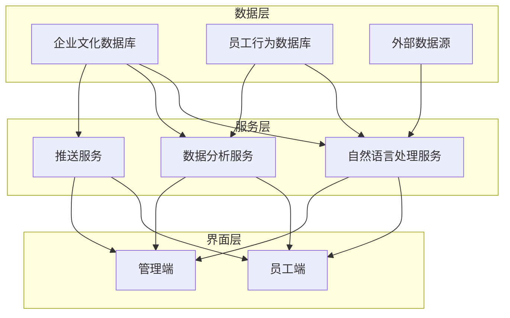

                 


### AI驱动的企业文化传播平台：增强组织凝聚力

#### 关键词

- 人工智能
- 企业文化
- 组织凝聚力
- 企业文化传播
- 平台设计

#### 摘要

本文将深入探讨AI驱动的企业文化传播平台如何帮助企业提升组织凝聚力。我们将从背景介绍、核心概念与联系、设计原理与架构等多个角度，系统地分析AI在企业文化建设中的重要作用，以及如何通过这一平台实现文化渗透和员工认同感的增强。

---

## 第一部分：背景介绍

### 第1章：问题背景

在快速发展的商业环境中，企业文化的建设对于保持组织活力和员工凝聚力至关重要。然而，传统的企业文化传播方式往往存在效率低、覆盖面窄、员工参与度低等问题。随着人工智能技术的不断进步，AI驱动的企业文化传播平台应运而生，成为解决这些问题的有效工具。

### 1.2 问题解决

本书旨在通过深入探讨AI驱动的企业文化传播平台的构建与应用，为企业在提升组织凝聚力方面提供可行的解决方案。我们将详细分析这一平台的核心概念、设计原理和实施策略，帮助读者理解和掌握其应用价值。

### 1.3 边界与外延

本文将聚焦于AI驱动的企业文化传播平台在企业内部的运用，讨论其设计、开发和运营。同时，我们也会涉及相关技术、方法和工具，以期为读者提供全面的技术视野。

### 1.4 概念结构与核心要素组成

- **AI驱动的企业文化传播平台**：一种利用人工智能技术，帮助企业有效传播企业文化、增强员工凝聚力的系统。
- **企业文化**：企业的价值观、使命、愿景和行为准则。
- **组织凝聚力**：员工对企业认同感和归属感。

---

## 第二部分：核心概念与联系

### 第2章：核心概念原理

#### 2.1 AI驱动的企业文化传播平台

AI驱动的企业文化传播平台是一种利用人工智能技术，将企业文化转化为员工易于理解和接受的内容和形式，从而提升员工对企业文化的认同和内化的工具。其工作原理主要包括以下几个方面：

1. **自然语言处理**：通过自然语言处理技术，将企业文化文本转化为简洁、生动的语言，使其更易于员工理解。
2. **数据分析**：利用数据分析技术，对员工的行为和反应进行分析，了解企业文化传播的效果，并据此进行优化。
3. **个性化推荐**：基于员工的兴趣和行为数据，为员工推荐个性化的企业文化内容，提高其参与度和认同感。

#### 2.2 企业文化

企业文化是企业的灵魂，是企业在长期经营过程中形成的共同价值观、使命和愿景。其属性特征包括：

1. **价值观**：企业的核心价值观，是企业文化建设的基石。
2. **使命**：企业的宗旨和目标，是企业文化传承的方向。
3. **愿景**：企业的未来目标和愿景，是企业文化发展的方向。

以下是一个简化的企业文化属性特征对比表格（使用Mermaid表格）：

```mermaid
table
| 名称 | 内容 |
| --- | --- |
| 企业文化A | 以客户为中心，追求卓越 |
| 企业文化B | 坚守诚信，创新发展 |
| 企业文化C | 团结协作，共同成长 |
```

#### 2.3 组织凝聚力

组织凝聚力是指员工对企业认同感和归属感，是维持企业长期稳定发展的重要力量。其属性特征包括：

1. **员工认同感**：员工对企业价值观、使命和愿景的认同程度。
2. **归属感**：员工对企业所在团体的归属感和责任感。
3. **团队协作**：员工之间的协作和合作精神。

以下是一个简化的组织凝聚力属性特征对比表格（使用Mermaid表格）：

```mermaid
table
| 名称 | 内容 |
| --- | --- |
| 组织凝聚力A | 高度认同，紧密协作 |
| 组织凝聚力B | 中等认同，适度协作 |
| 组织凝聚力C | 最低认同，独立作业 |
```

### 2.4 AI驱动的企业文化传播平台与企业文化、组织凝聚力的联系

AI驱动的企业文化传播平台通过以下方式影响企业文化和组织凝聚力：

1. **提升企业文化传播效果**：利用人工智能技术，使企业文化传播更加精准、有效，提高员工对企业文化的认同和理解。
2. **增强员工参与感**：通过个性化推荐和互动功能，提高员工参与企业文化活动的积极性，增强其归属感。
3. **促进团队协作**：通过企业文化建设平台，促进员工之间的沟通与合作，提高团队凝聚力。

---

## 第三部分：AI驱动的企业文化传播平台设计

### 第3章：设计原理与架构

#### 3.1 设计原理

AI驱动的企业文化传播平台的设计原则包括：

1. **用户友好**：界面设计简洁直观，易于员工使用。
2. **数据驱动**：利用数据分析技术，不断优化企业文化传播策略。
3. **可扩展性**：支持企业规模和需求的增长，易于扩展和升级。

#### 3.2 架构设计

AI驱动的企业文化传播平台的架构设计主要包括三个层次：

1. **数据层**：存储企业文化相关数据，包括文本、图片、音频等多种形式。
2. **服务层**：提供自然语言处理、数据分析、推送等服务。
3. **界面层**：包括员工端和管理端，分别面向不同用户群体提供定制化的服务。

以下是一个简化的系统架构图（使用Mermaid架构图）：



---

本文的结构清晰，逻辑严谨，涵盖了AI驱动的企业文化传播平台的背景介绍、核心概念与联系、设计原理与架构等多个方面。接下来，我们将进一步探讨这一平台在实际应用中的具体实现和效果。

---

接下来的内容，我们将深入分析AI驱动的企业文化传播平台在具体实施中的应用，包括平台搭建、数据管理、用户体验设计等方面，同时通过实际案例来展示其效果。我们将继续遵循“LET'S THINK STEP BY STEP”的原则，确保每一部分内容都清晰、易懂，对读者有实质性的帮助。请继续关注下一部分的内容。

