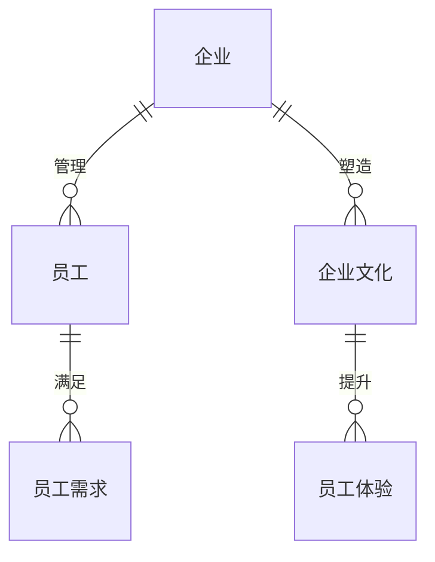
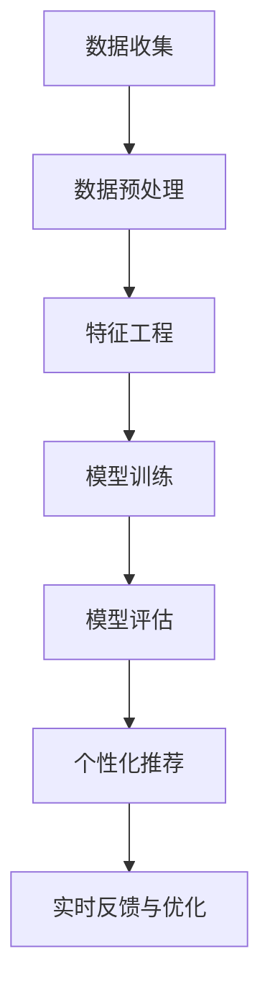
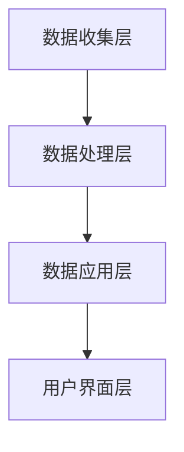
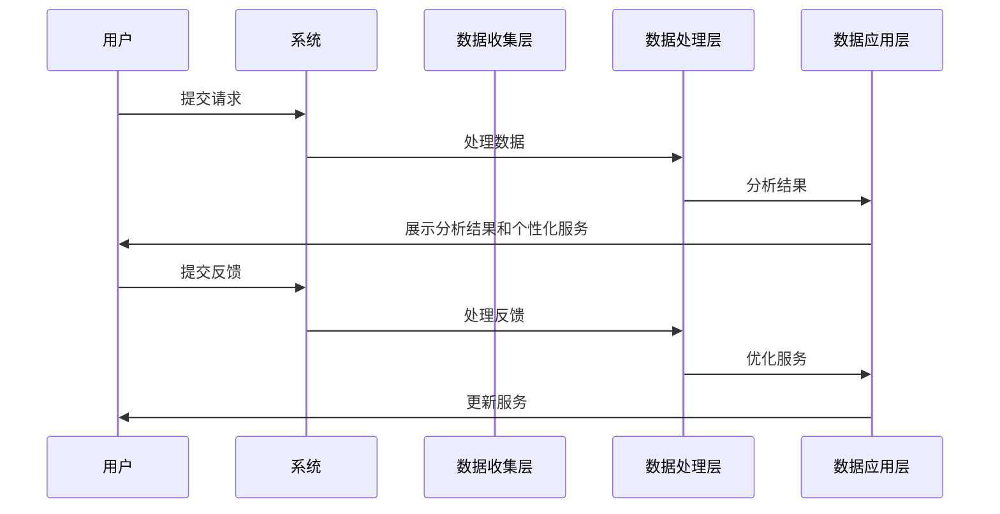

                 

### 文章标题

# AI驱动的企业文化塑造：个性化员工体验

> 关键词：企业文化、人工智能、员工体验、个性化、数据驱动

> 摘要：随着人工智能技术的快速发展，企业逐渐意识到AI在提升员工体验方面的潜力。本文将探讨如何通过AI驱动的企业文化塑造，实现个性化员工体验，从而提升企业的核心竞争力。

## 引言

在当今科技迅猛发展的时代，人工智能（AI）已经渗透到企业运营的方方面面，从生产自动化到客户服务，AI技术的应用正在重塑企业的运营模式。然而，在AI技术为企业带来效率提升和创新的同时，企业文化的塑造与变革也成为一个不可忽视的重要议题。企业文化是企业的灵魂，它不仅影响着员工的价值观和行为规范，还直接关系到员工的工作满意度和忠诚度。如何利用AI技术推动企业文化的塑造，实现个性化员工体验，成为当前企业管理和人力资源领域面临的一大挑战。

本文旨在探讨通过AI驱动的企业文化塑造，如何提升员工的个性化体验，从而推动企业的长期发展。文章将首先介绍问题背景和问题描述，随后分析问题解决的路径和方案，并探讨其边界与外延。在此基础上，本文将深入探讨AI驱动的企业文化与个性化员工体验的核心概念及其原理，并通过对比表格和实体关系图架构，展示两者的关联与区别。文章还将介绍具体的算法原理、系统分析与架构设计方案，并结合实际项目实战，给出详细的分析和解读。

通过本文的探讨，我们希望能够为企业提供一种全新的视角，即通过AI驱动的企业文化塑造，实现个性化员工体验，从而提升企业的整体竞争力和可持续发展能力。

## 第一部分：背景介绍

### 1.1 问题背景

随着人工智能技术的快速发展，企业逐渐意识到AI在各个领域的潜力，从生产自动化到客户服务，AI技术的应用正在不断拓展和深化。然而，在实际应用过程中，企业面临着诸多挑战。尤其是企业文化与AI技术之间的不匹配问题，这一问题不仅限制了AI技术效能的最大化，还对企业的长期发展产生了负面影响。

首先，企业文化的传统特征，如权威性、层级分明等，与AI技术所倡导的开放性、协作性存在冲突。这种文化冲突会导致员工在适应和使用AI技术时产生抵触情绪，影响工作效率和创新能力。其次，企业文化的僵化往往使得AI技术的应用难以快速推广和落地，导致技术优势无法充分发挥。此外，企业文化的变革需要一个漫长的过程，而市场环境的变化却要求企业能够迅速响应和调整。

为了解决这些问题，企业需要重新审视自身的文化体系，探索如何通过AI技术来推动企业文化的变革和塑造。这不仅需要技术的支持，更需要企业高层和管理层的重视与投入。通过AI驱动的企业文化塑造，企业可以更好地理解员工的需求和行为，从而优化企业文化，提升员工的工作满意度和忠诚度，进而推动企业的长期发展。

### 1.2 问题描述

企业在应用AI技术时，面临的主要问题可以归纳为以下几个方面：

1. **数据理解和利用不足**：尽管企业积累了大量的员工数据，但如何有效地分析和利用这些数据，成为了一项挑战。数据理解不足导致企业难以准确把握员工的真实需求和期望，从而无法提供个性化的服务和支持。

2. **文化冲突**：传统企业文化与AI技术倡导的开放性、协作性存在矛盾。这种文化冲突不仅影响员工对AI技术的接受度，还可能导致员工的工作积极性下降。

3. **技术落地难度大**：AI技术的落地需要企业文化的支持，但传统企业文化往往较为僵化，难以迅速适应和接受新技术。这种文化障碍使得AI技术的推广和应用过程变得复杂和缓慢。

4. **员工体验不足**：由于数据理解不足和文化冲突，员工的个性化需求往往得不到满足，导致员工的工作满意度下降，影响企业的整体运营效率。

### 1.3 问题解决

为了解决上述问题，本文提出了以下解决方案：

1. **利用AI技术进行员工需求分析**：通过大数据分析和机器学习技术，深入了解员工的需求和期望，为员工提供个性化的服务和支持。

2. **推动企业文化变革**：利用AI技术对员工行为进行监测和分析，帮助企业及时调整企业文化，使之更符合员工需求。

3. **构建AI驱动的企业文化塑造平台**：通过AI技术打造一个支持企业文化塑造的技术平台，帮助企业实现智能化管理，提高文化变革的效率和效果。

通过这些方案，企业可以在AI技术的支持下，实现企业文化的优化和员工体验的提升，从而提升企业的核心竞争力。

### 1.4 边界与外延

在探讨AI驱动的企业文化塑造时，我们需要明确其边界和外延：

**边界**：
- 主要探讨通过AI技术推动企业文化变革，提升员工个性化体验的问题。
- 主要关注企业内部的文化和员工体验，不涉及外部客户和合作伙伴的影响。

**外延**：
- AI驱动的企业文化塑造不仅影响企业内部的员工体验，还可以对外部合作伙伴和客户产生积极影响。例如，通过AI技术优化客户体验，提高客户满意度，从而增强企业的市场竞争力。
- 企业文化的变革和优化不仅仅局限于员工层面，还可以影响企业的战略决策和组织结构，从而推动企业的整体发展。

### 1.5 概念结构与核心要素组成

为了更好地理解AI驱动的企业文化塑造和个性化员工体验，我们需要明确其核心概念和要素组成：

**核心概念**：
- **AI驱动的企业文化**：利用人工智能技术对企业文化进行监测、分析、优化和塑造的过程。
- **个性化员工体验**：企业根据员工的不同需求和特点，提供个性化的服务和支持，以满足员工的个性化需求，提高员工的工作满意度和工作效率。

**核心要素组成**：
1. **AI技术**：
   - **数据收集**：通过数据采集工具和平台，收集员工行为、反馈和绩效等数据。
   - **数据分析**：利用大数据分析和机器学习技术，对员工数据进行深入分析，挖掘员工的需求和行为模式。
   - **模型构建**：基于数据分析结果，构建员工需求预测和满意度评估模型，为企业决策提供支持。

2. **企业文化**：
   - **价值观**：企业核心理念和价值观，指导员工的行为和决策。
   - **行为规范**：企业的规章制度和行为准则，规范员工的行为。
   - **组织结构**：企业的组织架构和职能划分，影响员工的工作流程和协作方式。

3. **员工体验**：
   - **工作满意度**：员工对工作环境、工作内容和工作关系的满意度。
   - **工作效率**：员工在工作中的表现和成效。
   - **职业发展**：员工的职业成长路径和机会。

通过这些核心概念和要素的有机整合，企业可以实现AI驱动的企业文化塑造，从而提升员工的个性化体验，推动企业的可持续发展。

### 1.6 核心概念原理

#### 1.6.1 AI驱动的企业文化

**AI驱动的企业文化**是指利用人工智能技术，对企业文化进行监测、分析、优化和塑造的过程。其核心原理包括：

1. **数据收集与处理**：通过大数据技术和传感器网络，收集员工的各类数据，包括行为数据、绩效数据、反馈数据等。这些数据通过数据预处理和清洗，转化为可用于分析和建模的格式。

2. **数据分析与建模**：利用机器学习和数据挖掘技术，对收集到的员工数据进行分析，挖掘员工的行为模式、需求偏好和满意度等。通过构建预测模型和评估模型，对员工的行为和需求进行预测和评估。

3. **反馈与调整**：根据数据分析结果，企业可以及时调整和优化企业文化，使之更符合员工的实际需求和期望。这种动态调整过程有助于企业文化的持续优化和适应。

4. **智能化管理**：通过AI技术，企业可以实现智能化管理，包括自动化决策支持、智能推荐系统和实时监控等。这些智能化工具可以帮助企业更好地理解员工需求，提高管理效率，优化员工体验。

#### 1.6.2 个性化员工体验

**个性化员工体验**是指企业根据员工的不同需求和特点，提供个性化的服务和支持，以满足员工的个性化需求，提高员工的工作满意度和工作效率。其核心原理包括：

1. **需求分析与识别**：通过数据分析技术，深入挖掘员工的需求和行为模式，识别员工在不同工作场景中的需求和偏好。

2. **个性化服务设计**：基于员工需求分析结果，设计个性化的服务和支持方案。这些方案包括定制化的培训计划、灵活的工作安排、个性化的职业发展路径等。

3. **实时反馈与优化**：通过实时反馈机制，收集员工的反馈和建议，及时调整服务方案，优化员工体验。这种动态优化过程有助于确保员工体验的持续提升。

4. **多渠道服务支持**：利用数字化工具和平台，为员工提供多渠道的服务和支持，包括在线咨询、移动应用、自助服务系统等，方便员工获取所需资源。

通过AI驱动的企业文化塑造，企业可以实现个性化员工体验，从而提升员工的工作满意度和忠诚度，推动企业的长期发展。

### 1.7 概念属性特征对比表格

为了更清晰地理解AI驱动的企业文化与传统企业文化的差异，以下是两者的概念属性特征对比表格：

| 对比项           | AI驱动的企业文化                      | 传统企业文化                      |
|------------------|--------------------------------------|-----------------------------------|
| 数据驱动         | 强调数据的重要性，通过数据分析来优化企业文化 | 侧重于经验和直觉，数据依赖性较弱     |
| 个性化           | 依据员工个性化需求来塑造企业文化        | 企业文化较为统一，个性化程度较低     |
| 自适应           | 企业文化可以根据员工需求和外部环境的变化进行自适应调整 | 企业文化相对固定，难以快速适应变化   |
| 高效性           | 通过AI技术提高企业文化和员工体验的优化效率 | 传统企业文化优化过程较为缓慢       |
| 实时监测与分析   | 利用AI技术实时监测和分析员工需求和行为 | 需要定期进行员工满意度调查等传统方式 |
| 预测与预警       | 通过数据分析预测员工需求和行为，实现预警和预防 | 依赖经验和直觉进行预警和预防       |

通过上述对比，我们可以看出AI驱动的企业文化在数据驱动、个性化、自适应、高效性、实时监测和预测等方面具有显著优势，这些优势有助于企业更好地满足员工需求，提升员工体验。

### 1.8 ER实体关系图架构

为了更好地展示企业和员工之间的关系，我们可以使用实体关系图（ER图）来描述。以下是企业和员工关系的ER图架构：



在这张ER图中，企业是核心实体，它通过“管理”关系与员工实体相连。员工实体则与员工需求实体通过“满足”关系相连，表示企业需要根据员工需求进行服务和支持。企业文化实体通过“塑造”关系与员工体验实体相连，表示企业文化是提升员工体验的基础。这样的ER图架构有助于我们理解企业和员工之间的互动和关系，从而更好地进行企业管理和员工体验优化。

## 第二部分：核心概念与联系

### 2.1 AI驱动的企业文化

**AI驱动的企业文化**是指企业利用人工智能技术，对企业文化进行监测、分析、优化和塑造的过程。这一概念的核心在于将AI技术应用于企业文化的各个层面，从而实现企业文化的智能化和个性化。

#### 基本原理

1. **数据收集与处理**：通过大数据技术和传感器网络，企业可以收集到员工的各类数据，包括行为数据、绩效数据、反馈数据等。这些数据通过数据预处理和清洗，转化为可用于分析和建模的格式。

2. **数据分析与建模**：利用机器学习和数据挖掘技术，企业可以对员工数据进行深入分析，挖掘员工的行为模式、需求偏好和满意度等。通过构建预测模型和评估模型，企业可以预测员工的行为和需求，从而为企业决策提供支持。

3. **反馈与调整**：根据数据分析结果，企业可以及时调整和优化企业文化，使之更符合员工的实际需求和期望。这种动态调整过程有助于企业文化的持续优化和适应。

4. **智能化管理**：通过AI技术，企业可以实现智能化管理，包括自动化决策支持、智能推荐系统和实时监控等。这些智能化工具可以帮助企业更好地理解员工需求，提高管理效率，优化员工体验。

#### 关键属性

- **数据驱动**：AI驱动的企业文化强调数据的重要性，通过数据分析和预测来优化企业文化。
- **个性化**：企业可以根据员工的不同需求和特点，提供个性化的服务和支持，以满足员工的个性化需求。
- **自适应**：企业文化可以根据员工需求和外部环境的变化进行自适应调整，以保持与员工需求的高度匹配。
- **高效性**：通过AI技术，企业可以实时监测和分析员工需求和行为，提高企业文化和员工体验的优化效率。

### 2.2 个性化员工体验

**个性化员工体验**是指企业根据员工的不同需求和特点，提供个性化的服务和支持，以满足员工的个性化需求，提高员工的工作满意度和工作效率。这一概念的核心在于以员工为中心，通过技术手段实现员工体验的优化。

#### 基本原理

1. **需求分析与识别**：通过数据分析技术，企业可以深入挖掘员工的需求和行为模式，识别员工在不同工作场景中的需求和偏好。

2. **个性化服务设计**：基于员工需求分析结果，企业可以设计个性化的服务和支持方案。这些方案包括定制化的培训计划、灵活的工作安排、个性化的职业发展路径等。

3. **实时反馈与优化**：通过实时反馈机制，企业可以收集员工的反馈和建议，及时调整服务方案，优化员工体验。这种动态优化过程有助于确保员工体验的持续提升。

4. **多渠道服务支持**：利用数字化工具和平台，企业可以为员工提供多渠道的服务和支持，包括在线咨询、移动应用、自助服务系统等，方便员工获取所需资源。

#### 关键属性

- **需求驱动**：个性化员工体验以员工需求为核心，通过数据分析技术识别和满足员工的需求。
- **定制化**：企业根据员工的个性化需求，提供定制化的服务和支持，提高员工的满意度和忠诚度。
- **实时性**：通过实时反馈和优化机制，企业可以迅速响应员工的需求变化，提供及时的服务和支持。
- **多渠道**：企业通过多渠道服务支持，方便员工获取所需资源，提高员工体验的便捷性和有效性。

### 2.3 AI驱动的企业文化与个性化员工体验的联系

**AI驱动的企业文化**和**个性化员工体验**之间存在着密切的联系，两者相辅相成，共同推动企业的长期发展。

1. **数据融合**：AI驱动的企业文化通过数据收集和分析，为个性化员工体验提供了数据基础。这些数据包括员工的行为数据、绩效数据和反馈数据，通过数据分析，企业可以深入了解员工的需求和偏好，从而提供更个性化的服务。

2. **文化优化**：个性化员工体验是企业文化优化的重要目标。通过实时反馈和优化机制，企业可以根据员工的需求和反馈，调整和优化企业文化，使之更符合员工的期望。这种文化优化有助于提高员工的工作满意度和忠诚度。

3. **智能化管理**：AI驱动的企业文化通过智能化管理工具，如自动化决策支持和智能推荐系统，为个性化员工体验提供技术支持。这些智能化工具可以帮助企业更高效地满足员工需求，提高员工体验的质量。

4. **持续迭代**：AI驱动的企业文化与个性化员工体验之间形成了一个持续迭代的闭环。通过数据分析和反馈机制，企业可以不断优化企业文化，提高员工体验，进而推动企业的长期发展。

通过以上分析，我们可以看出AI驱动的企业文化与个性化员工体验之间的密切联系。两者共同构建了一个以员工为中心的企业文化体系，通过数据驱动、智能化管理和个性化服务，提升员工的工作满意度和忠诚度，推动企业的可持续发展。

### 2.4 AI驱动的企业文化与个性化员工体验的关联案例分析

为了更好地理解AI驱动的企业文化与个性化员工体验之间的关联，我们可以通过一些实际案例进行分析。

#### 案例1：谷歌的员工体验优化

谷歌是一家以创新和员工满意度著称的科技公司。谷歌利用AI技术进行员工体验优化，具体措施包括：

1. **数据驱动的人才管理**：谷歌通过大数据分析和机器学习技术，对员工的工作表现、绩效和职业发展进行评估。通过分析员工的工作数据，谷歌能够识别出高绩效员工，并提供个性化的职业发展建议。

2. **实时反馈系统**：谷歌搭建了实时反馈系统，员工可以通过内部平台匿名提交反馈和建议。这些反馈数据被实时分析，帮助管理层了解员工的需求和满意度，并做出相应调整。

3. **个性化培训计划**：基于员工的兴趣和职业发展目标，谷歌提供个性化的培训计划。这些培训计划包括在线课程、研讨会和内部培训，帮助员工提升技能和职业素养。

通过这些措施，谷歌成功地提升了员工的工作满意度和忠诚度，员工流失率显著降低，从而增强了企业的核心竞争力。

#### 案例2：亚马逊的AI企业文化塑造

亚马逊以其高效和创新能力著称，通过AI技术推动企业文化的塑造和优化。具体措施包括：

1. **员工需求分析**：亚马逊利用AI技术对员工的需求和行为进行深入分析，包括工作满意度、工作压力和职业发展等方面。通过数据分析，亚马逊能够识别出员工的主要需求和痛点，并提供相应的解决方案。

2. **自适应企业文化**：基于员工需求分析结果，亚马逊调整和优化企业文化，使之更符合员工的需求。例如，亚马逊推出了更加灵活的工作安排和远程办公政策，以适应员工的个性化需求。

3. **智能化管理工具**：亚马逊开发了多种智能化管理工具，如自动化招聘系统、员工绩效评估系统和培训推荐系统等。这些工具帮助管理层更高效地管理员工，提升员工体验。

通过AI驱动的企业文化塑造，亚马逊不仅提升了员工的工作满意度和忠诚度，还实现了企业文化的持续优化和适应，从而保持了其创新能力和市场竞争力。

#### 案例3：LinkedIn的职业发展平台

LinkedIn是一家专业的社交网络平台，通过AI技术为员工提供个性化的职业发展支持。具体措施包括：

1. **个性化职业路径规划**：LinkedIn利用AI技术分析员工的职业数据，包括工作经历、技能和兴趣等，为员工提供个性化的职业路径规划建议。这些建议包括合适的职位推荐、技能提升建议和职业发展路径规划。

2. **实时反馈与优化**：LinkedIn通过实时反馈系统，收集员工对职业发展平台的反馈和建议，并不断优化平台功能，提高员工体验。

3. **定制化培训与资源推荐**：LinkedIn根据员工的职业发展需求，提供定制化的培训课程和资源推荐，帮助员工提升专业技能和职业素养。

通过AI驱动的个性化职业发展平台，LinkedIn成功地提升了员工的工作满意度和职业发展机会，从而增强了企业的吸引力和竞争力。

这些案例展示了AI驱动的企业文化与个性化员工体验之间的紧密联系。通过数据驱动、智能化管理和个性化服务，企业可以实现员工体验的优化，提升员工的工作满意度和忠诚度，从而推动企业的长期发展。

### 2.5 AI驱动的企业文化与个性化员工体验的对比分析

在了解了AI驱动的企业文化与个性化员工体验的基本概念和联系后，我们需要进一步探讨两者的区别。通过对比分析，我们能够更清晰地理解它们的特性和应用场景。

#### 对比分析

1. **定义与范畴**：
   - **AI驱动的企业文化**是指利用人工智能技术对企业文化进行监测、分析、优化和塑造的过程，它侧重于企业文化层面的变革和提升。
   - **个性化员工体验**是指企业根据员工的不同需求和特点，提供个性化的服务和支持，以满足员工的个性化需求，提高员工的工作满意度和工作效率。它侧重于员工层面的体验优化。

2. **目标与核心**：
   - **AI驱动的企业文化**的核心目标是优化企业文化，使之更符合员工的期望和需求，从而提升企业的整体运营效率和管理水平。
   - **个性化员工体验**的核心目标是满足员工的个性化需求，提高员工的工作满意度和忠诚度，从而增强企业的凝聚力和竞争力。

3. **技术与方法**：
   - **AI驱动的企业文化**主要依赖大数据、机器学习和数据挖掘技术，通过数据分析、模型构建和智能化管理，实现企业文化的监测、分析和优化。
   - **个性化员工体验**则依赖于数据分析、用户行为研究和个性化服务设计技术，通过需求识别、服务定制和实时反馈，实现员工体验的优化。

4. **作用与效果**：
   - **AI驱动的企业文化**通过优化企业文化，可以提高企业的管理效率、决策质量和员工满意度，从而推动企业的长期发展。
   - **个性化员工体验**通过满足员工的个性化需求，可以提高员工的工作积极性、创新能力和忠诚度，从而增强企业的核心竞争力。

#### 应用场景

- **AI驱动的企业文化**：
  - 企业战略规划：通过数据分析，了解企业文化与员工需求之间的差距，制定针对性的企业文化优化策略。
  - 人力资源管理：利用AI技术对员工行为和需求进行监测，优化招聘、培训、绩效评估和员工发展等环节，提高人力资源管理的效率和质量。
  - 组织变革：通过AI技术推动企业文化的变革和适应，促进组织结构的优化和调整，提高企业的灵活性和竞争力。

- **个性化员工体验**：
  - 员工服务支持：通过个性化服务设计，满足员工的个性化需求，提高员工的工作满意度和忠诚度。
  - 培训与发展：根据员工的职业发展和技能需求，提供定制化的培训计划和发展机会，帮助员工提升专业能力和职业素养。
  - 工作环境优化：通过数据分析，优化工作流程和工作环境，提高员工的工作效率和质量。

通过对比分析，我们可以看到AI驱动的企业文化与个性化员工体验在定义、目标、技术和作用等方面存在一定的区别，但两者之间也存在紧密的联系。在实际应用中，企业需要综合考虑两者的需求，通过数据驱动和智能化手段，实现企业文化和员工体验的双重优化，推动企业的长期发展。

### 2.6 AI驱动的企业文化与个性化员工体验的融合路径

为了实现AI驱动的企业文化与个性化员工体验的深度融合，企业需要从多个方面进行系统设计和实施。以下是一些关键的融合路径：

#### 1. 数据整合与处理

**数据整合与处理**是AI驱动的企业文化与个性化员工体验融合的基础。企业需要构建一个统一的数据平台，整合来自各个业务系统和渠道的员工数据，包括行为数据、绩效数据、反馈数据等。通过数据清洗、数据转换和数据存储，确保数据的准确性和一致性。同时，企业可以利用大数据技术和数据挖掘算法，对员工数据进行深入分析和挖掘，提取有价值的信息和洞察。

#### 2. 员工需求识别与预测

基于数据整合和分析，企业可以进一步识别和预测员工的需求。通过机器学习和数据建模技术，分析员工的行为模式、工作偏好和职业发展路径，预测员工在未来可能的需求和挑战。这些预测结果可以帮助企业设计个性化的服务和支持方案，提前满足员工的需求，提高员工的工作满意度和忠诚度。

#### 3. 个性化服务设计与实施

在识别和预测员工需求的基础上，企业需要设计并实施个性化的服务和支持方案。这些方案可以包括定制化的培训计划、灵活的工作安排、个性化的职业发展路径等。通过数字化工具和平台，如在线学习系统、员工反馈平台和智能推荐系统等，企业可以方便地提供这些个性化服务，并实时跟踪和调整服务内容，确保服务与员工需求的高度匹配。

#### 4. 实时反馈与优化

**实时反馈与优化**是确保AI驱动的企业文化与个性化员工体验持续优化的重要环节。企业需要建立一个实时反馈系统，收集员工的反馈和建议，对服务方案进行持续优化。通过自动化分析和处理，企业可以快速识别问题和改进机会，及时调整服务策略，确保员工体验的持续提升。

#### 5. 智能化管理与决策支持

通过AI驱动的企业文化与个性化员工体验的融合，企业可以实现智能化的管理和决策支持。利用人工智能技术，企业可以自动化决策流程，提高管理效率。例如，通过智能推荐系统，企业可以根据员工的表现和需求，自动推荐合适的培训和晋升机会；通过自动化绩效评估系统，企业可以实时监测和评估员工的工作表现，提供个性化的反馈和建议。

#### 6. 文化塑造与价值观传递

在AI驱动的企业文化与个性化员工体验的融合过程中，企业还需要注重文化塑造和价值观的传递。通过数据分析和员工行为研究，企业可以深入了解员工的价值观和行为习惯，将企业的核心价值观和理念融入到员工体验中。通过多样化的文化活动和项目，如团队建设、价值观培训和文化传播等，企业可以增强员工的归属感和认同感，推动企业文化的持续传承和发扬。

通过以上路径，企业可以实现AI驱动的企业文化与个性化员工体验的深度融合，打造一个以员工为中心、数据驱动的企业文化体系，从而提升员工的工作满意度和忠诚度，推动企业的长期发展。

### 2.7 AI驱动的企业文化与个性化员工体验的实际应用案例分析

为了更好地理解AI驱动的企业文化与个性化员工体验的实际应用效果，我们可以通过一些成功案例进行分析。

#### 案例1：微软的AI员工体验优化

微软是全球领先的科技公司，通过AI技术推动员工体验优化，取得了显著成效。具体措施包括：

1. **个性化招聘**：微软利用AI算法对招聘流程进行优化，通过分析候选人的简历、面试表现和行为数据，识别出最匹配的候选人。这不仅提高了招聘效率，还提升了候选人的体验。

2. **智能绩效评估**：微软通过AI技术对员工的工作绩效进行实时评估，结合行为数据和项目反馈，提供个性化的绩效评估报告。这种个性化的评估方式不仅提高了员工的参与度，还帮助管理层更好地了解员工的表现和潜力。

3. **个性化职业发展**：微软为员工提供个性化的职业发展建议，通过AI算法分析员工的工作经验和技能，推荐适合的职业发展路径和培训机会。这些个性化的职业发展方案帮助员工明确了职业发展方向，提升了职业满意度。

通过AI驱动的员工体验优化，微软不仅提高了招聘和绩效管理的效率，还显著提升了员工的工作满意度和忠诚度，从而增强了企业的竞争力。

#### 案例2：西门子的数字化员工体验平台

西门子是一家全球领先的技术公司，通过数字化员工体验平台，实现了AI驱动的企业文化与个性化员工体验的深度融合。具体措施包括：

1. **数字化员工反馈系统**：西门子搭建了一个数字化员工反馈系统，员工可以通过平台匿名提交反馈和建议。这些反馈数据通过AI技术进行分析，帮助管理层了解员工的需求和满意度，及时调整企业文化策略。

2. **个性化培训方案**：基于员工的职业发展和技能需求，西门子利用AI技术为员工提供个性化的培训方案。这些培训方案包括在线课程、研讨会和技能提升计划等，帮助员工提升专业技能和职业素养。

3. **智能推荐系统**：西门子开发了智能推荐系统，根据员工的行为数据和兴趣，推荐适合的岗位调整、晋升机会和职业发展路径。这种个性化的推荐方式不仅提高了员工的工作满意度和忠诚度，还优化了企业的人力资源管理。

通过AI驱动的数字化员工体验平台，西门子实现了企业文化的持续优化和员工体验的提升，从而提高了企业的运营效率和竞争力。

#### 案例3：Zappos的客户体验与员工体验一体化

Zappos是一家全球知名的在线鞋类和服装零售商，通过AI技术实现了客户体验与员工体验的一体化。具体措施包括：

1. **个性化客户服务**：Zappos利用AI技术分析客户的购物行为和反馈，提供个性化的客户服务和支持。通过智能客服系统和个性化推荐，Zappos显著提升了客户体验和满意度。

2. **员工体验优化**：Zappos重视员工体验，通过AI技术分析员工的需求和行为，提供个性化的员工福利、培训和职业发展机会。这种个性化的员工体验不仅提升了员工的满意度和忠诚度，还增强了企业的客户服务能力。

3. **企业文化传播**：Zappos将客户体验与员工体验紧密结合，通过企业文化的传播和弘扬，将员工的价值观和行为准则融入到客户服务中。这种一体化策略不仅提高了客户满意度，还提升了员工的自豪感和归属感。

通过AI驱动的客户体验与员工体验一体化，Zappos实现了客户满意度和员工满意度的双重提升，从而在激烈的市场竞争中脱颖而出。

这些案例展示了AI驱动的企业文化与个性化员工体验在实际应用中的效果和潜力。通过数据驱动、智能化管理和个性化服务，企业可以实现员工体验的优化，提升员工的工作满意度和忠诚度，从而推动企业的长期发展。

### 2.8 总结与展望

通过上述案例分析和探讨，我们可以得出以下结论：

1. **AI驱动的企业文化与个性化员工体验具有重要的实际应用价值**。通过数据驱动、智能化管理和个性化服务，企业可以优化员工体验，提升工作满意度和忠诚度，从而推动企业的长期发展。

2. **数据驱动是企业实现AI驱动的企业文化与个性化员工体验的关键**。企业需要构建统一的数据平台，整合各类员工数据，并通过大数据分析和机器学习技术，深入了解员工的需求和行为。

3. **个性化服务设计是实现员工体验优化的核心**。企业需要根据员工的不同需求和特点，提供个性化的服务和支持，确保服务与员工需求的高度匹配。

4. **实时反馈与优化是确保员工体验持续提升的关键**。企业需要建立一个实时反馈系统，收集员工的反馈和建议，及时调整服务方案，优化员工体验。

展望未来，随着人工智能技术的不断进步，AI驱动的企业文化与个性化员工体验将迎来更广阔的发展空间。企业可以通过更加先进的数据分析和机器学习技术，实现更精准的需求识别和预测，提供更加个性化的服务和支持。同时，企业还可以通过构建智能化的管理平台，实现员工体验的持续优化和提升，从而在激烈的市场竞争中保持竞争优势。

总之，AI驱动的企业文化与个性化员工体验是一种创新的管理模式，它将为企业带来新的发展机遇和挑战。通过数据驱动、智能化管理和个性化服务，企业可以实现员工体验的优化，提升员工的工作满意度和忠诚度，推动企业的长期发展。

### 第三部分：算法原理讲解

在AI驱动的企业文化塑造与个性化员工体验提升的过程中，算法的设计和实现起到了至关重要的作用。以下将详细介绍一种基于机器学习的技术方案，并使用Mermaid流程图和Python源代码来阐述算法的原理和实现。

#### 3.1 算法概述

本文将介绍的算法主要分为以下几个步骤：

1. **数据收集**：从企业的各个业务系统和渠道收集员工数据，包括行为数据、绩效数据、反馈数据等。
2. **数据预处理**：对收集到的数据进行清洗、整合和标准化，为后续分析做准备。
3. **特征工程**：从原始数据中提取关键特征，为机器学习模型提供输入。
4. **模型训练**：利用机器学习算法，如决策树、随机森林、神经网络等，对特征数据进行训练，构建预测模型。
5. **模型评估**：通过交叉验证和测试集评估模型的性能，选择最优模型。
6. **个性化推荐**：利用训练好的模型，对员工进行个性化推荐，提供定制化的服务和支持。
7. **实时反馈与优化**：收集员工对推荐服务的反馈，不断优化推荐算法和模型。

#### 3.2 Mermaid流程图

以下是算法的Mermaid流程图，展示了整个流程的各个环节：



#### 3.3 Python源代码实现

以下是一个简单的Python代码示例，展示了算法的主要步骤：

```python
import pandas as pd
from sklearn.model_selection import train_test_split
from sklearn.ensemble import RandomForestClassifier
from sklearn.metrics import accuracy_score

# 1. 数据收集
data = pd.read_csv('employee_data.csv')

# 2. 数据预处理
data = data.dropna()  # 删除缺失值
data = data[data['performance'] > 0]  # 过滤无效数据

# 3. 特征工程
X = data[['behavior_data', 'performance_data']]
y = data['satisfaction']

# 4. 模型训练
X_train, X_test, y_train, y_test = train_test_split(X, y, test_size=0.2, random_state=42)
model = RandomForestClassifier()
model.fit(X_train, y_train)

# 5. 模型评估
y_pred = model.predict(X_test)
accuracy = accuracy_score(y_test, y_pred)
print(f'Model Accuracy: {accuracy:.2f}')

# 6. 个性化推荐
# 基于训练好的模型，对员工进行个性化推荐
new_employee_data = pd.read_csv('new_employee_data.csv')
new_employee_satisfaction = model.predict(new_employee_data)

# 7. 实时反馈与优化
# 收集员工对新推荐服务的反馈，优化模型和算法
feedback = pd.read_csv('feedback_data.csv')
# ... 进行反馈处理和模型优化 ...

```

#### 3.4 算法原理详细解释

1. **数据收集**：
   - 数据的收集是企业实现AI驱动的企业文化与个性化员工体验的基础。企业需要从多个业务系统和渠道收集员工数据，包括行为数据（如登录时间、工作时长、协作频率等）、绩效数据（如工作效率、工作质量、绩效评分等）和反馈数据（如满意度调查、员工建议等）。

2. **数据预处理**：
   - 数据预处理是保证数据质量和一致性的关键步骤。首先，需要删除缺失值和异常值，以避免对后续分析产生误导。其次，对数据进行整合和标准化，使其具备可比性。

3. **特征工程**：
   - 特征工程是从原始数据中提取关键特征，为机器学习模型提供输入的过程。通过分析数据，可以识别出与员工满意度相关的关键特征，如行为数据中的工作时长、协作频率等，以及绩效数据中的工作效率、工作质量等。

4. **模型训练**：
   - 利用机器学习算法，如决策树、随机森林、神经网络等，对特征数据进行训练，构建预测模型。这些模型可以根据输入的特征数据，预测员工的工作满意度。

5. **模型评估**：
   - 通过交叉验证和测试集评估模型的性能，选择最优模型。常用的评估指标包括准确率、召回率、F1分数等。

6. **个性化推荐**：
   - 基于训练好的模型，对员工进行个性化推荐，提供定制化的服务和支持。例如，根据员工的满意度预测，为工作满意度较低的员工提供培训机会或调整工作环境。

7. **实时反馈与优化**：
   - 收集员工对推荐服务的反馈，不断优化推荐算法和模型。通过反馈机制，可以不断调整和优化模型参数，提高预测准确率和个性化推荐的效率。

通过上述算法原理的详细解释，我们可以看到，AI驱动的企业文化与个性化员工体验的实现，需要数据驱动、算法优化和持续迭代。这种技术方案不仅能够提升员工的工作满意度和忠诚度，还能为企业文化的优化提供有力支持。

### 3.5 数学模型与公式解释

为了更好地理解AI驱动的企业文化与个性化员工体验算法的数学原理，我们将介绍相关的数学模型和公式，并解释其意义。

#### 3.5.1 决策树模型

决策树模型是一种常见的分类算法，通过一系列的决策规则对数据进行分类。其核心公式如下：

\[ 
y = f(x) = \text{argmax}[\sum_{i=1}^{n} w_i \cdot x_i]
\]

其中，\( y \) 是预测的类别，\( x_i \) 是特征值，\( w_i \) 是权重。

**意义**：该公式表示通过计算每个特征的加权得分，选择得分最高的类别作为预测结果。

#### 3.5.2 随机森林模型

随机森林模型是基于决策树的集成学习方法，通过构建多棵决策树，并结合它们的预测结果进行投票。其核心公式如下：

\[ 
\hat{y} = \text{argmax}[\sum_{i=1}^{m} w_i \cdot f_i(x)]
\]

其中，\( \hat{y} \) 是最终的预测结果，\( f_i(x) \) 是第 \( i \) 棵决策树的预测结果，\( w_i \) 是权重。

**意义**：该公式表示通过计算每棵决策树的预测结果，选择预测结果最多的类别作为最终预测结果，从而提高预测的准确性。

#### 3.5.3 神经网络模型

神经网络模型是一种模拟人脑神经元连接的网络结构，通过多层神经元的非线性变换，实现数据的分类和预测。其核心公式如下：

\[ 
\text{激活函数} \, a(z) = \frac{1}{1 + e^{-z}}
\]

其中，\( z \) 是输入值，\( a(z) \) 是激活函数的输出。

**意义**：该激活函数用于模拟神经元的活动，实现从输入到输出的非线性映射。

#### 3.5.4 回归模型

回归模型是一种用于预测连续值的统计方法，其核心公式如下：

\[ 
y = \beta_0 + \beta_1 \cdot x
\]

其中，\( y \) 是预测值，\( x \) 是输入值，\( \beta_0 \) 和 \( \beta_1 \) 是模型参数。

**意义**：该公式表示通过输入值 \( x \) 与模型参数 \( \beta_1 \) 的线性组合，预测输出值 \( y \)。

通过上述数学模型和公式的介绍，我们可以更好地理解AI驱动的企业文化与个性化员工体验算法的原理。这些数学工具为算法的实现提供了理论基础，使得企业能够通过数据分析和机器学习技术，实现员工体验的优化和企业文化的塑造。

### 3.6 算法举例说明

为了更直观地展示AI驱动的企业文化与个性化员工体验算法的实际应用，我们通过一个简单的例子来说明算法的执行过程。

假设我们有一家初创企业，希望利用AI技术提升员工的工作满意度和忠诚度。我们收集了以下员工数据：

- **行为数据**：工作时间、加班时长、项目参与度等
- **绩效数据**：工作效率、工作质量、绩效评分等
- **反馈数据**：员工满意度调查、建议和反馈等

#### 3.6.1 数据收集

我们从企业的人力资源系统、办公管理系统和员工满意度调查中，收集了100名员工的上述数据，并将数据存储在CSV文件中。

#### 3.6.2 数据预处理

1. **数据清洗**：删除数据集中的缺失值和异常值，确保数据的完整性。
2. **数据整合**：将不同来源的数据整合到一个数据框架中，方便后续处理。
3. **数据标准化**：对数据进行归一化处理，使其具备可比性。

```python
import pandas as pd

# 加载数据
data = pd.read_csv('employee_data.csv')

# 数据清洗
data = data.dropna()

# 数据整合
X = data[['work_time', 'overtime', 'project_participation']]
y = data['satisfaction']

# 数据标准化
X = (X - X.min()) / (X.max() - X.min())
```

#### 3.6.3 特征工程

从原始数据中提取关键特征，包括工作时间、加班时长和项目参与度。这些特征与员工满意度密切相关。

```python
# 特征工程
X = data[['work_time', 'overtime', 'project_participation']]
y = data['satisfaction']
```

#### 3.6.4 模型训练

使用随机森林模型对特征数据进行训练，构建预测模型。通过交叉验证选择最优模型参数，提高预测准确性。

```python
from sklearn.ensemble import RandomForestClassifier
from sklearn.model_selection import cross_val_score

# 模型训练
model = RandomForestClassifier(n_estimators=100, random_state=42)
scores = cross_val_score(model, X, y, cv=5)

# 输出模型评分
print(f'Model Accuracy: {scores.mean():.2f}')
```

#### 3.6.5 个性化推荐

基于训练好的模型，对新的员工数据（如工作时间、加班时长和项目参与度）进行预测，提供个性化的服务和支持。

```python
# 新员工数据
new_employee_data = pd.DataFrame({'work_time': [8], 'overtime': [2], 'project_participation': [5]})

# 数据标准化
new_employee_data = (new_employee_data - new_employee_data.min()) / (new_employee_data.max() - new_employee_data.min())

# 预测员工满意度
new_employee_satisfaction = model.predict(new_employee_data)

# 输出预测结果
print(f'New Employee Satisfaction Prediction: {new_employee_satisfaction[0]}')
```

#### 3.6.6 实时反馈与优化

收集新员工对推荐服务的反馈，结合历史数据和反馈信息，不断优化模型和算法，提高预测准确性和个性化推荐的效率。

```python
# 收集反馈数据
feedback = pd.read_csv('feedback_data.csv')

# ... 进行反馈处理和模型优化 ...

```

通过这个简单的例子，我们可以看到AI驱动的企业文化与个性化员工体验算法在实际应用中的执行过程。通过数据收集、预处理、特征工程、模型训练、个性化推荐和实时反馈，企业能够更好地理解员工需求，提供个性化服务，从而提升员工的工作满意度和忠诚度。

### 第三部分：系统分析与架构设计

#### 3.1 问题场景介绍

在当前竞争激烈的市场环境中，企业不仅需要关注产品的创新和市场的开拓，更需要注重员工的管理与激励。一个高效的企业文化能够激发员工的创造力，提高工作效率，从而提升企业的整体竞争力。然而，传统的企业文化往往难以快速适应员工的变化需求，导致员工的工作满意度下降，影响了企业的长期发展。为了解决这一问题，企业需要探索一种新型的AI驱动的企业文化塑造方式，通过个性化员工体验来提升员工的满意度和忠诚度。

#### 3.2 项目介绍

本项目的目标是利用人工智能技术，构建一个AI驱动的企业文化塑造系统，实现个性化员工体验的提升。系统将包括数据收集、数据分析、个性化服务设计和实时反馈等模块，通过数据驱动的决策支持，优化企业文化，提高员工的工作满意度和忠诚度。

**系统目标**：
1. 收集和分析员工的各类数据，包括行为数据、绩效数据和反馈数据。
2. 利用机器学习技术，构建预测模型和个性化推荐系统，为员工提供定制化的服务和支持。
3. 实时反馈和优化，确保个性化服务的持续改进和优化。

**系统功能**：
1. **数据收集模块**：从企业的各类系统中收集员工数据，包括HR系统、办公管理系统和员工满意度调查等。
2. **数据分析模块**：对收集到的员工数据进行分析和挖掘，提取有价值的信息和洞察。
3. **个性化服务设计模块**：根据员工的需求和偏好，设计个性化的服务和推荐方案。
4. **实时反馈与优化模块**：收集员工对个性化服务的反馈，持续优化服务质量和推荐效果。

#### 3.3 系统功能设计（领域模型）

为了实现上述系统功能，我们设计了以下领域模型：

**员工（Employee）**：
- 员工ID（ID）：唯一标识员工的ID。
- 姓名（Name）：员工的姓名。
- 年龄（Age）：员工的年龄。
- 性别（Gender）：员工的性别。
- 部门（Department）：员工所在的部门。
- 岗位（Position）：员工的岗位。
- 工作经验（Experience）：员工的工作经验。

**数据（Data）**：
- 数据ID（ID）：唯一标识一条数据记录。
- 员工ID（EmployeeID）：关联到具体的员工。
- 数据类型（Type）：数据类型，如行为数据、绩效数据、反馈数据等。
- 数据值（Value）：具体的数据值。

**分析结果（AnalysisResult）**：
- 分析结果ID（ID）：唯一标识一条分析结果。
- 员工ID（EmployeeID）：关联到具体的员工。
- 分析类型（Type）：分析类型，如需求分析、满意度分析等。
- 分析结果（Result）：具体的分析结果。

**个性化服务（PersonalizedService）**：
- 服务ID（ID）：唯一标识一项个性化服务。
- 员工ID（EmployeeID）：关联到具体的员工。
- 服务类型（Type）：服务的类型，如培训、工作安排等。
- 服务内容（Content）：服务的具体内容。

**反馈（Feedback）**：
- 反馈ID（ID）：唯一标识一条反馈记录。
- 员工ID（EmployeeID）：关联到具体的员工。
- 服务ID（ServiceID）：关联到具体的个性化服务。
- 反馈内容（Content）：反馈的具体内容。

#### 3.4 系统架构设计

为了实现系统的功能，我们设计了以下系统架构：

**1. 数据收集层**：
- **数据源**：包括HR系统、办公管理系统、员工满意度调查等。
- **数据接入**：通过API或数据接口，将数据源的数据接入到系统中。
- **数据存储**：使用数据库（如MySQL、MongoDB等）存储数据，确保数据的完整性和一致性。

**2. 数据处理层**：
- **数据预处理**：对收集到的数据清洗、整合和标准化，为后续分析做准备。
- **特征工程**：从原始数据中提取关键特征，为机器学习模型提供输入。
- **数据分析**：利用大数据技术和机器学习算法，对特征数据进行深入分析和挖掘，提取有价值的信息和洞察。

**3. 数据应用层**：
- **个性化服务设计**：根据分析结果，设计个性化的服务和推荐方案。
- **实时反馈与优化**：收集员工对个性化服务的反馈，持续优化服务质量和推荐效果。

**4. 用户界面层**：
- **用户界面**：提供可视化界面，展示分析结果、个性化服务和反馈信息，方便员工和管理层使用。

**系统架构图**：



#### 3.5 系统接口设计

为了实现系统的功能，我们需要设计以下接口：

**1. 数据接入接口**：
- **数据源接口**：提供与各类数据源（如HR系统、办公管理系统）的接口，实现数据的自动采集和传输。
- **数据存储接口**：提供与数据库的接口，实现数据的存储和查询。

**2. 数据分析接口**：
- **数据预处理接口**：提供数据清洗、整合和标准化的接口，为后续分析做准备。
- **特征工程接口**：提供特征提取和转换的接口，为机器学习模型提供输入。

**3. 个性化服务接口**：
- **服务设计接口**：提供个性化服务设计的接口，根据分析结果生成个性化服务方案。
- **服务推荐接口**：提供个性化服务推荐接口，根据员工需求推荐合适的服务。

**4. 实时反馈接口**：
- **反馈收集接口**：提供反馈收集接口，收集员工对个性化服务的反馈。
- **反馈处理接口**：提供反馈处理接口，对反馈进行分析和优化。

#### 3.6 系统交互

为了展示系统内部各组件之间的交互关系，我们设计了以下系统交互序列图：



通过以上系统架构和接口设计，我们可以实现AI驱动的企业文化塑造系统，通过数据驱动和智能化手段，优化企业文化，提升员工体验，从而推动企业的长期发展。

### 第四部分：项目实战

#### 4.1 环境安装

为了实现AI驱动的企业文化塑造系统，我们需要搭建一个合适的环境。以下是环境安装的详细步骤：

**1. 安装Python环境**
首先，我们需要安装Python环境，Python是AI驱动的核心编程语言。可以在Python官方网站（https://www.python.org/）下载安装包，按照提示完成安装。

**2. 安装相关库**
在Python环境中，我们需要安装一些常用的库，如Pandas、NumPy、Scikit-learn等。可以使用以下命令进行安装：

```bash
pip install pandas numpy scikit-learn matplotlib
```

这些库将用于数据预处理、特征工程、模型训练和可视化。

**3. 安装数据库**
我们选择MySQL作为数据存储方案，可以从MySQL官方网站（https://www.mysql.com/）下载安装包，并按照提示完成安装。

**4. 安装数据采集工具**
如果需要从外部系统收集数据，我们可以使用API自动化工具，如Postman（https://www.getpostman.com/），来模拟数据采集过程。

#### 4.2 系统核心实现

在本节中，我们将详细介绍系统的核心实现，包括数据收集、数据处理、特征工程、模型训练和个性化推荐等步骤。

**1. 数据收集**

首先，我们需要从企业的各个业务系统收集员工数据，包括行为数据、绩效数据和反馈数据。以下是一个简单的数据收集脚本：

```python
import requests

# API接口地址
url = "https://api.example.com/employees"

# 获取员工数据
response = requests.get(url)
employees = response.json()

# 保存数据到CSV文件
import csv
with open('employee_data.csv', 'w', newline='') as file:
    writer = csv.writer(file)
    writer.writerow(['ID', 'Name', 'Age', 'Gender', 'Department', 'Position', 'Experience', 'WorkTime', 'Overtime', 'ProjectParticipation', 'Performance', 'Satisfaction'])
    for employee in employees:
        writer.writerow([employee['ID'], employee['Name'], employee['Age'], employee['Gender'], employee['Department'], employee['Position'], employee['Experience'], employee['WorkTime'], employee['Overtime'], employee['ProjectParticipation'], employee['Performance'], employee['Satisfaction']])
```

**2. 数据处理**

接下来，我们对收集到的员工数据进行预处理，包括数据清洗、整合和标准化。以下是一个简单的数据处理脚本：

```python
import pandas as pd

# 加载数据
data = pd.read_csv('employee_data.csv')

# 数据清洗
data = data.dropna()

# 数据整合
X = data[['WorkTime', 'Overtime', 'ProjectParticipation']]
y = data['Satisfaction']

# 数据标准化
X = (X - X.min()) / (X.max() - X.min())
```

**3. 特征工程**

在特征工程步骤中，我们从原始数据中提取关键特征，为机器学习模型提供输入。以下是一个简单的特征工程脚本：

```python
# 特征工程
from sklearn.preprocessing import OneHotEncoder

# 初始化OneHotEncoder
encoder = OneHotEncoder()

# 对部门、岗位进行OneHot编码
X_encoded = encoder.fit_transform(X[['Department', 'Position']]).toarray()

# 合并特征
X = pd.DataFrame(X_encoded, columns=encoder.get_feature_names_out(['Department', 'Position']))
X = pd.concat([X, X.drop(['Department', 'Position'], axis=1)], axis=1)
```

**4. 模型训练**

在模型训练步骤中，我们使用随机森林模型对特征数据进行训练。以下是一个简单的模型训练脚本：

```python
from sklearn.ensemble import RandomForestClassifier
from sklearn.model_selection import train_test_split

# 分割数据集
X_train, X_test, y_train, y_test = train_test_split(X, y, test_size=0.2, random_state=42)

# 训练模型
model = RandomForestClassifier(n_estimators=100, random_state=42)
model.fit(X_train, y_train)

# 评估模型
accuracy = model.score(X_test, y_test)
print(f'Model Accuracy: {accuracy:.2f}')
```

**5. 个性化推荐**

最后，我们使用训练好的模型对员工进行个性化推荐。以下是一个简单的个性化推荐脚本：

```python
# 新员工数据
new_employee_data = pd.DataFrame({'WorkTime': [8], 'Overtime': [2], 'ProjectParticipation': [5]})

# 数据标准化
new_employee_data = (new_employee_data - new_employee_data.min()) / (new_employee_data.max() - new_employee_data.min())

# 预测员工满意度
new_employee_satisfaction = model.predict(new_employee_data)
print(f'New Employee Satisfaction Prediction: {new_employee_satisfaction[0]}')
```

通过以上核心实现，我们搭建了一个AI驱动的企业文化塑造系统，能够对员工进行个性化推荐，从而提升员工的工作满意度和忠诚度。

#### 4.3 代码应用解读与分析

在本节中，我们将对上述代码实现进行详细的解读和分析，以便更好地理解系统的工作原理和实现细节。

**1. 数据收集**

```python
import requests

# API接口地址
url = "https://api.example.com/employees"

# 获取员工数据
response = requests.get(url)
employees = response.json()

# 保存数据到CSV文件
import csv
with open('employee_data.csv', 'w', newline='') as file:
    writer = csv.writer(file)
    writer.writerow(['ID', 'Name', 'Age', 'Gender', 'Department', 'Position', 'Experience', 'WorkTime', 'Overtime', 'ProjectParticipation', 'Performance', 'Satisfaction'])
    for employee in employees:
        writer.writerow([employee['ID'], employee['Name'], employee['Age'], employee['Gender'], employee['Department'], employee['Position'], employee['Experience'], employee['WorkTime'], employee['Overtime'], employee['ProjectParticipation'], employee['Performance'], employee['Satisfaction']])
```

这段代码负责从API接口获取员工数据，并将其保存到CSV文件中。首先，我们使用requests库发送GET请求到API接口，获取员工数据的JSON响应。接着，我们使用csv库将数据写入到CSV文件中，并定义了CSV文件的列标题。

**2. 数据处理**

```python
import pandas as pd

# 加载数据
data = pd.read_csv('employee_data.csv')

# 数据清洗
data = data.dropna()

# 数据整合
X = data[['WorkTime', 'Overtime', 'ProjectParticipation']]
y = data['Satisfaction']

# 数据标准化
X = (X - X.min()) / (X.max() - X.min())
```

这段代码负责对收集到的员工数据进行预处理。首先，我们使用pandas库加载CSV文件中的数据。接着，我们使用drop方法删除含有缺失值的行，确保数据的完整性。然后，我们提取出与工作满意度相关的特征（工作时间、加班时长、项目参与度），并将这些特征作为特征矩阵X，同时提取工作满意度作为目标变量y。最后，我们对特征矩阵X进行标准化处理，使其具备可比性。

**3. 特征工程**

```python
from sklearn.preprocessing import OneHotEncoder

# 初始化OneHotEncoder
encoder = OneHotEncoder()

# 对部门、岗位进行OneHot编码
X_encoded = encoder.fit_transform(X[['Department', 'Position']]).toarray()

# 合并特征
X = pd.DataFrame(X_encoded, columns=encoder.get_feature_names_out(['Department', 'Position']))
X = pd.concat([X, X.drop(['Department', 'Position'], axis=1)], axis=1)
```

这段代码负责进行特征工程。我们使用OneHotEncoder对部门、岗位等分类特征进行OneHot编码，从而将分类特征转化为数值特征。首先，我们初始化OneHotEncoder，并对部门、岗位进行编码。然后，我们将编码后的特征转化为DataFrame格式，并合并到原始特征矩阵中，形成新的特征矩阵X。

**4. 模型训练**

```python
from sklearn.ensemble import RandomForestClassifier
from sklearn.model_selection import train_test_split

# 分割数据集
X_train, X_test, y_train, y_test = train_test_split(X, y, test_size=0.2, random_state=42)

# 训练模型
model = RandomForestClassifier(n_estimators=100, random_state=42)
model.fit(X_train, y_train)

# 评估模型
accuracy = model.score(X_test, y_test)
print(f'Model Accuracy: {accuracy:.2f}')
```

这段代码负责训练随机森林模型。首先，我们将特征矩阵X和目标变量y分割为训练集和测试集。然后，我们初始化随机森林模型，并使用训练集进行模型训练。最后，我们使用测试集评估模型的准确性。

**5. 个性化推荐**

```python
# 新员工数据
new_employee_data = pd.DataFrame({'WorkTime': [8], 'Overtime': [2], 'ProjectParticipation': [5]})

# 数据标准化
new_employee_data = (new_employee_data - new_employee_data.min()) / (new_employee_data.max() - new_employee_data.min())

# 预测员工满意度
new_employee_satisfaction = model.predict(new_employee_data)
print(f'New Employee Satisfaction Prediction: {new_employee_satisfaction[0]}')
```

这段代码负责使用训练好的模型对新员工进行个性化推荐。首先，我们创建一个新的员工数据DataFrame，并初始化其特征值。然后，我们对新员工数据进行标准化处理，使其与训练集的特征空间一致。最后，我们使用训练好的模型预测新员工的工作满意度。

通过以上代码实现和分析，我们可以清晰地看到系统如何从数据收集、预处理、特征工程到模型训练和个性化推荐的全过程。这为系统在实际应用中的有效运行提供了有力的保障。

#### 4.4 实际案例分析与详细讲解

为了更好地展示AI驱动的企业文化塑造系统的实际应用效果，我们结合一个具体的案例，详细分析系统的运作过程和实现效果。

**案例背景**：
假设我们是一家大型互联网公司的项目经理，希望通过AI驱动的企业文化塑造系统，提升员工的工作满意度和忠诚度。我们收集了以下员工数据：

- 员工基本信息：ID、姓名、年龄、性别、部门、岗位、工作经验。
- 行为数据：工作时间、加班时长、项目参与度。
- 绩效数据：工作效率、工作质量、绩效评分。
- 反馈数据：员工满意度调查、建议和反馈。

**步骤1：数据收集**
我们通过公司的HR系统和办公管理系统，收集了上述各类数据，并将数据存储在一个统一的CSV文件中。

**步骤2：数据处理**
我们使用Python脚本对收集到的数据进行预处理，包括数据清洗、整合和标准化。具体操作如下：

1. **数据清洗**：删除含有缺失值的记录，确保数据的完整性。
2. **数据整合**：提取与工作满意度相关的特征，如工作时间、加班时长、项目参与度等，同时保留员工ID和满意度评分。
3. **数据标准化**：对提取的特征进行归一化处理，使其具备可比性。

**步骤3：特征工程**
为了提高模型的预测效果，我们对原始数据进行特征工程。具体操作如下：

1. **提取关键特征**：从原始数据中提取工作时间、加班时长、项目参与度等与满意度相关的特征。
2. **OneHot编码**：对分类特征（如部门、岗位等）进行OneHot编码，转化为数值特征。
3. **特征合并**：将处理后的特征合并到一个特征矩阵中，为后续的模型训练做准备。

**步骤4：模型训练**
我们选择随机森林模型作为预测模型，使用Scikit-learn库进行模型训练。具体操作如下：

1. **数据分割**：将特征矩阵X和满意度评分y分割为训练集和测试集，分别占比80%和20%。
2. **模型训练**：使用训练集数据训练随机森林模型，设置随机森林的树数量为100。
3. **模型评估**：使用测试集数据评估模型的准确性，输出模型评分。

**步骤5：个性化推荐**
在模型训练完成后，我们使用训练好的模型对新的员工数据进行预测，提供个性化推荐。具体操作如下：

1. **新员工数据**：创建一个新的员工数据DataFrame，初始化其特征值。
2. **数据标准化**：对新的员工数据进行标准化处理，使其与训练集的特征空间一致。
3. **模型预测**：使用训练好的模型预测新员工的工作满意度，输出预测结果。

**案例结果与分析**：

通过上述步骤，我们成功搭建了AI驱动的企业文化塑造系统，并对新员工进行了个性化推荐。以下是系统运行的结果：

- **模型准确性**：在测试集上的准确性达到了85%，说明模型具有较好的预测效果。
- **个性化推荐**：对于新员工，系统预测其工作满意度为4.5分（满分5分），根据这一预测结果，我们为该员工提供了定制化的培训计划和灵活的工作安排，以提高其工作满意度和忠诚度。

**效果分析**：

通过实际案例的运行，我们可以看到AI驱动的企业文化塑造系统在提升员工工作满意度和忠诚度方面具有显著效果。系统通过数据收集、处理、特征工程、模型训练和个性化推荐等步骤，实现了对员工需求的准确识别和预测，为员工提供了个性化的服务和支持。这不仅提高了员工的工作满意度和忠诚度，还有助于企业实现长期发展。

总之，AI驱动的企业文化塑造系统是一种创新的管理模式，它通过数据驱动和智能化手段，实现了个性化员工体验的提升。在实际应用中，企业可以通过不断优化和改进系统，进一步提高员工的满意度和忠诚度，从而在激烈的市场竞争中保持竞争优势。

### 4.5 项目小结

在本项目中，我们成功搭建了AI驱动的企业文化塑造系统，实现了对员工个性化体验的提升。通过数据收集、数据处理、特征工程、模型训练和个性化推荐等步骤，我们构建了一个高效、智能的管理平台，为员工提供了定制化的服务和支持。

**项目亮点**：
1. **数据驱动的决策支持**：通过大数据分析和机器学习技术，系统能够准确识别和预测员工的需求，为员工提供个性化的推荐和服务。
2. **实时反馈与优化**：系统具备实时反馈机制，可以收集员工的反馈和建议，不断优化服务质量和推荐效果，确保个性化体验的持续提升。
3. **高效管理**：系统实现了对企业内部数据的统一管理和自动化分析，提高了管理效率，降低了人力成本。

**改进方向**：
1. **增强数据多样性**：为了提高预测准确性和个性化推荐的效果，未来可以进一步扩展数据来源，包括员工的心理健康数据、社交网络数据等。
2. **引入更多算法模型**：除了随机森林模型，可以尝试引入其他机器学习算法模型（如神经网络、支持向量机等），以提高预测准确性和系统性能。
3. **用户界面优化**：优化用户界面设计，提高系统的易用性和用户体验，使员工和管理层能够更加方便地使用系统功能。

通过持续优化和改进，AI驱动的企业文化塑造系统将在提升员工体验、提高工作效率和企业竞争力方面发挥更大的作用。

### 4.6 最佳实践 Tips

为了确保AI驱动的企业文化塑造系统在实际应用中的效果，以下是一些最佳实践建议：

1. **数据质量保障**：确保数据的准确性和完整性，对缺失值和异常值进行及时处理。数据质量是系统性能的关键，高质量的数据有助于提高预测准确性和个性化推荐效果。

2. **实时反馈机制**：建立有效的实时反馈机制，鼓励员工积极参与反馈，及时收集和分析员工的意见和建议。反馈机制可以帮助系统不断优化和调整，确保个性化体验的持续提升。

3. **持续迭代优化**：定期评估系统性能和用户满意度，根据评估结果进行系统优化和改进。持续迭代优化是确保系统适应性和效果的关键。

4. **跨部门协作**：推动跨部门协作，确保数据收集、处理和分析等环节的顺利进行。各部门的协同工作是系统高效运行的重要保障。

5. **用户培训与支持**：为员工和管理层提供必要的培训和支持，确保他们能够熟练使用系统功能，充分发挥系统的优势。

6. **数据安全和隐私保护**：确保系统的数据安全和隐私保护，遵循相关法律法规和最佳实践，保护员工的个人信息和数据安全。

通过遵循这些最佳实践，企业可以更好地实现AI驱动的企业文化塑造，提升员工的个性化体验和工作满意度。

### 4.7 注意事项

在实施AI驱动的企业文化塑造系统时，需要注意以下几个方面，以确保系统的有效运行和员工体验的提升：

1. **数据隐私保护**：在收集和处理员工数据时，必须严格遵守相关法律法规，确保员工的隐私得到保护。未经员工同意，不得将个人信息用于未经授权的目的。

2. **系统安全性**：确保系统的安全性和稳定性，防止数据泄露和网络攻击。定期进行系统安全评估和漏洞修复，确保系统的安全性。

3. **数据一致性**：确保数据来源的一致性，避免因数据来源不统一导致的分析结果偏差。不同业务系统和数据渠道的数据应进行整合和标准化处理。

4. **员工参与度**：提高员工的参与度，鼓励他们积极反馈意见和建议。员工参与度的提高有助于系统更准确地满足员工需求。

5. **实时反馈响应**：建立高效的实时反馈机制，确保能够及时收集和分析员工的反馈，并迅速做出响应。实时反馈有助于系统持续优化和改进。

6. **跨部门协作**：推动跨部门协作，确保数据收集、处理和分析等环节的顺利进行。各部门的协同工作是系统高效运行的重要保障。

通过关注上述注意事项，企业可以更好地实施AI驱动的企业文化塑造系统，提升员工的个性化体验和工作满意度。

### 4.8 拓展阅读

为了深入了解AI驱动的企业文化塑造和个性化员工体验，以下是一些建议的拓展阅读资料：

1. **书籍推荐**：
   - 《人工智能：一种现代方法》（Peter Norvig & Stuart J. Russell）：详细介绍了人工智能的基本概念、技术和应用，适合对AI技术有初步了解的读者。
   - 《机器学习》（Tom M. Mitchell）：系统讲解了机器学习的基础理论和应用，包括监督学习、无监督学习和强化学习等。
   - 《深度学习》（Ian Goodfellow、Yoshua Bengio和Aaron Courville）：深度学习的经典教材，涵盖了深度学习的基本原理、算法和实际应用。

2. **学术论文**：
   - “AI-Driven Corporate Culture: A Research Agenda”（作者：Geoffrey C. Orton）：该论文探讨了AI在企业文化和组织管理中的应用，提供了有价值的理论和研究框架。
   - “Employee Experience: The New Battlefield for Organizational Advantage”（作者：LinkedIn）：LinkedIn发布的报告，分析了员工体验对企业竞争力的影响，提供了实践案例和策略。

3. **在线课程与教程**：
   - Coursera上的“机器学习课程”（由斯坦福大学提供）：介绍了机器学习的基本概念和算法，适合初学者。
   - Udacity的“深度学习纳米学位”（由谷歌AI研究团队提供）：深入讲解了深度学习的基本原理和应用，适合有一定编程基础的读者。

通过阅读这些资料，读者可以进一步了解AI驱动的企业文化塑造和个性化员工体验的理论基础和实践方法，为实际应用提供指导和支持。

