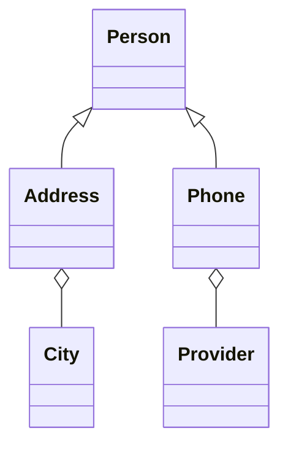

                 

当然，让我们一步步深入探讨《AI驱动的企业知识图谱：构建智能信息网络》这个主题。以下是文章的逐章剖析：

### 第一部分：知识图谱与AI概述

#### 第1章：知识图谱的概念与价值

**核心概念与联系**

知识图谱是一种结构化数据表示方法，它通过实体、属性和关系来描述现实世界中的信息和知识。知识图谱的核心概念包括：

- **实体**：知识图谱中的对象，如人、地点、物品等。
- **属性**：实体的特征描述，如人的姓名、年龄、职业等。
- **关系**：实体之间的关系，如朋友、工作于、属于等。

这些概念相互关联，共同构建了一个复杂的知识网络。

**核心概念原理、属性特征对比表格和ER实体关系图架构**

| 核心概念 | 描述 |  
| --- | --- |  
| 实体 | 知识图谱中的对象 |  
| 属性 | 实体的特征描述 |  
| 关系 | 实体之间的关系 |

下面是一个简单的ER实体关系图：

```mermaid
erDiagram
    Person ||--|{ Address : has }
    Person ||--|{ Phone : has }
    Address ||--|{ City : located_in }
    Phone ||--|{ Provider : uses }
```

**算法原理讲解**

知识图谱的构建通常涉及到图论算法，如：

- **图遍历**：用于查找实体之间的关系。
- **图嵌入**：将图中的实体和关系转换为向量表示。
- **图分类**：用于预测实体之间的关系。

下面是一个简单的图遍历算法的Python代码示例：

```python
def traverse_graph(graph, start_node):
    visited = set()
    stack = [start_node]

    while stack:
        node = stack.pop()
        if node not in visited:
            visited.add(node)
            stack.extend(graph[node])

    return visited
```

**数学模型和公式**

在知识图谱中，我们可以使用图论中的矩阵来表示实体之间的关系。例如，邻接矩阵 $A$ 可以表示两个实体之间的连接关系：

$$
A_{ij} =
\begin{cases}
1 & \text{如果实体 } i \text{ 与实体 } j \text{ 直接相关} \\
0 & \text{否则}
\end{cases}
$$

**系统分析与架构设计方案**

知识图谱系统的设计与实现需要考虑以下几个关键方面：

- **领域模型设计**：使用Mermaid类图来定义实体和它们之间的关系。
- **系统架构设计**：使用Mermaid架构图来定义系统的各个组成部分及其交互方式。
- **系统接口设计**：定义系统的API接口，使用Mermaid序列图来描述接口的使用流程。

下面是一个简单的领域模型类图的示例：



### 第2章：企业知识图谱的构建

**背景介绍**

在企业中，知识图谱的构建是数字化转型的关键步骤。它有助于企业更好地理解其数据，提高数据利用率，并支持智能决策。

**核心概念与联系**

- **数据源选择**：企业知识图谱的数据源可以是企业内部的数据仓库、外部数据源或社交媒体等。
- **构建方法**：企业知识图谱的构建方法包括数据采集、数据预处理、知识表示和知识存储。

**算法原理讲解**

数据采集通常涉及数据爬取、API调用和数据库查询等技术。数据预处理则包括数据清洗、数据转换和数据标准化等步骤。

**数学模型和公式**

数据清洗过程中可能会使用以下公式来处理缺失值：

$$
\hat{x}_{ij} =
\begin{cases}
x_{ij} & \text{如果 } x_{ij} \text{ 非缺失} \\
\text{平均值} & \text{如果 } x_{ij} \text{ 缺失}
\end{cases}
$$

**系统分析与架构设计方案**

企业知识图谱的系统架构通常包括以下几个部分：

- **数据采集模块**：负责从各种数据源获取数据。
- **数据处理模块**：负责清洗、转换和标准化数据。
- **知识表示模块**：负责构建知识图谱，包括实体、属性和关系的表示。
- **知识存储模块**：负责存储和管理知识图谱。

下面是一个简单的系统架构设计的Mermaid架构图示例：

```mermaid
subgraph 数据采集
    DataCollector1
    DataCollector2
    DataCollector3
end

subgraph 数据处理
    DataPreprocessor1
    DataPreprocessor2
    DataPreprocessor3
end

subgraph 知识表示
    KnowledgeRepresentor1
    KnowledgeRepresentor2
    KnowledgeRepresentor3
end

subgraph 知识存储
    KnowledgeStorage1
    KnowledgeStorage2
    KnowledgeStorage3
end

DataCollector1 -> DataPreprocessor1
DataCollector2 -> DataPreprocessor2
DataCollector3 -> DataPreprocessor3
DataPreprocessor1 -> KnowledgeRepresentor1
DataPreprocessor2 -> KnowledgeRepresentor2
DataPreprocessor3 -> KnowledgeRepresentor3
KnowledgeRepresentor1 -> KnowledgeStorage1
KnowledgeRepresentor2 -> KnowledgeStorage2
KnowledgeRepresentor3 -> KnowledgeStorage3
```

### 第3章：AI驱动下的知识图谱应用

**背景介绍**

AI技术的快速发展使得知识图谱的应用场景更加广泛，从数据分析到决策支持，再到智能客服和推荐系统，AI驱动的知识图谱在各行各业中发挥着重要作用。

**核心概念与联系**

- **数据分析**：知识图谱可以帮助企业更好地理解其数据，发现数据中的潜在模式。
- **决策支持系统**：知识图谱可以为企业的决策提供支持，如产品推荐、库存管理等。
- **智能客服**：知识图谱可以帮助智能客服系统更好地理解用户的提问，提供更准确的回答。
- **推荐系统**：知识图谱可以用于构建推荐系统，提高推荐的准确性。

**算法原理讲解**

以推荐系统为例，知识图谱可以用于构建图嵌入模型，将用户、物品和它们之间的关系表示为向量。这些向量可以用于计算用户和物品之间的相似度，从而实现推荐。

**数学模型和公式**

假设我们有一个知识图谱，其中每个实体（用户或物品）都有一个对应的向量表示。我们可以使用余弦相似度来计算两个实体之间的相似度：

$$
\text{similarity}(u, v) = \frac{u \cdot v}{\|u\| \|v\|}
$$

其中，$u$ 和 $v$ 是实体对应的向量表示，$\|u\|$ 和 $\|v\|$ 分别是它们的欧几里得范数。

**系统分析与架构设计方案**

推荐系统的架构通常包括以下几个部分：

- **用户表示模块**：负责将用户表示为向量。
- **物品表示模块**：负责将物品表示为向量。
- **推荐算法模块**：负责计算用户和物品之间的相似度，并提供推荐。
- **推荐结果展示模块**：负责将推荐结果展示给用户。

下面是一个简单的推荐系统架构设计的Mermaid架构图示例：

```mermaid
subgraph 用户表示
    UserRepresentor1
    UserRepresentor2
end

subgraph 物品表示
    ItemRepresentor1
    ItemRepresentor2
end

subgraph 推荐算法
    Recommender1
    Recommender2
end

subgraph 推荐结果展示
    ResultPresenter1
    ResultPresenter2
end

UserRepresentor1 -> Recommender1
UserRepresentor2 -> Recommender2
ItemRepresentor1 -> Recommender1
ItemRepresentor2 -> Recommender2
Recommender1 -> ResultPresenter1
Recommender2 -> ResultPresenter2
```

### 第4章：AI驱动的知识图谱案例分析

**背景介绍**

在本章节中，我们将分析几个实际案例，展示AI驱动的知识图谱在企业中的应用。

**核心概念与联系**

- **电商企业知识图谱**：如何利用知识图谱提升电商平台的用户体验和销售转化率。
- **金融企业知识图谱**：如何利用知识图谱提高金融服务的精准度和风险控制能力。
- **医疗健康企业知识图谱**：如何利用知识图谱优化医疗资源的分配和患者的诊疗过程。
- **制造业企业知识图谱**：如何利用知识图谱提高生产效率和质量控制。

**算法原理讲解**

每个案例中的知识图谱构建和应用都有其特定的算法原理。例如，在电商企业知识图谱中，推荐算法是一个重要的组成部分，而在金融企业知识图谱中，风险评估和欺诈检测是关键。

**数学模型和公式**

以电商企业知识图谱中的推荐算法为例，我们可以使用矩阵分解来建模用户和物品之间的交互：

$$
R = U \cdot V^T
$$

其中，$R$ 是用户和物品之间的评分矩阵，$U$ 是用户特征矩阵，$V$ 是物品特征矩阵。

**系统分析与架构设计方案**

每个案例中的系统架构都有所不同，但通常包括以下几个关键模块：

- **数据采集模块**：负责从各种数据源获取数据。
- **数据处理模块**：负责清洗、转换和标准化数据。
- **知识表示模块**：负责构建知识图谱，包括实体、属性和关系的表示。
- **推荐算法模块**：负责计算用户和物品之间的相似度，并提供推荐。
- **推荐结果展示模块**：负责将推荐结果展示给用户。

下面是一个简单的电商企业知识图谱架构设计的Mermaid架构图示例：

```mermaid
subgraph 数据采集
    DataCollector1
    DataCollector2
    DataCollector3
end

subgraph 数据处理
    DataPreprocessor1
    DataPreprocessor2
    DataPreprocessor3
end

subgraph 知识表示
    KnowledgeRepresentor1
    KnowledgeRepresentor2
    KnowledgeRepresentor3
end

subgraph 推荐算法
    Recommender1
    Recommender2
    Recommender3
end

subgraph 推荐结果展示
    ResultPresenter1
    ResultPresenter2
    ResultPresenter3
end

DataCollector1 -> DataPreprocessor1
DataCollector2 -> DataPreprocessor2
DataCollector3 -> DataPreprocessor3
DataPreprocessor1 -> KnowledgeRepresentor1
DataPreprocessor2 -> KnowledgeRepresentor2
DataPreprocessor3 -> KnowledgeRepresentor3
KnowledgeRepresentor1 -> Recommender1
KnowledgeRepresentor2 -> Recommender2
KnowledgeRepresentor3 -> Recommender3
Recommender1 -> ResultPresenter1
Recommender2 -> ResultPresenter2
Recommender3 -> ResultPresenter3
```

### 第5章：AI驱动的企业知识图谱发展前景

**背景介绍**

随着AI技术的不断进步和企业数字化转型的加速，AI驱动的企业知识图谱在未来将面临巨大的机遇和挑战。

**核心概念与联系**

- **发展趋势**：企业知识图谱将朝着更智能化、更自适应的方向发展。
- **挑战**：企业知识图谱的建设和维护将面临数据质量、隐私保护和技术落地等方面的挑战。

**算法原理讲解**

为了应对这些挑战，企业知识图谱可能会采用以下策略：

- **数据质量管理**：通过数据清洗、去重和一致性检查等手段提高数据质量。
- **隐私保护**：采用数据加密、匿名化和联邦学习等技术来保护用户隐私。
- **技术落地**：通过云计算、边缘计算和分布式存储等技术来实现知识图谱的大规模部署和应用。

**数学模型和公式**

以下是数据质量管理中的一些常用数学模型：

- **缺失值处理**：
  $$\hat{x}_{ij} =
  \begin{cases}
  x_{ij} & \text{如果 } x_{ij} \text{ 非缺失} \\
  \text{平均值} & \text{如果 } x_{ij} \text{ 缺失}
  \end{cases}$$
  
- **异常检测**：
  $$z_{ij} = \frac{x_{ij} - \bar{x}}{\sigma}$$
  其中，$\bar{x}$ 是平均值，$\sigma$ 是标准差。

**系统分析与架构设计方案**

未来，企业知识图谱的系统架构可能会更加复杂和灵活，以适应不断变化的需求。以下是可能的一个架构设计：

- **数据层**：负责存储和管理原始数据。
- **数据处理层**：负责数据清洗、转换和标准化。
- **知识表示层**：负责构建和存储知识图谱。
- **应用层**：提供各种应用服务，如推荐系统、决策支持系统和智能客服等。
- **管理层**：负责监控、维护和优化知识图谱系统。

下面是一个简单的未来企业知识图谱架构设计的Mermaid架构图示例：

```mermaid
subgraph 数据层
    DataLayer1
    DataLayer2
    DataLayer3
end

subgraph 数据处理层
    DataProcessingLayer1
    DataProcessingLayer2
    DataProcessingLayer3
end

subgraph 知识表示层
    KnowledgeRepresentationLayer1
    KnowledgeRepresentationLayer2
    KnowledgeRepresentationLayer3
end

subgraph 应用层
    ApplicationLayer1
    ApplicationLayer2
    ApplicationLayer3
end

subgraph 管理层
    ManagementLayer1
    ManagementLayer2
    ManagementLayer3
end

DataLayer1 -> DataProcessingLayer1
DataLayer2 -> DataProcessingLayer2
DataLayer3 -> DataProcessingLayer3
DataProcessingLayer1 -> KnowledgeRepresentationLayer1
DataProcessingLayer2 -> KnowledgeRepresentationLayer2
DataProcessingLayer3 -> KnowledgeRepresentationLayer3
KnowledgeRepresentationLayer1 -> ApplicationLayer1
KnowledgeRepresentationLayer2 -> ApplicationLayer2
KnowledgeRepresentationLayer3 -> ApplicationLayer3
ApplicationLayer1 -> ManagementLayer1
ApplicationLayer2 -> ManagementLayer2
ApplicationLayer3 -> ManagementLayer3
```

### 最佳实践 tips

- **数据质量管理**：确保数据源的质量，定期进行数据清洗和更新。
- **隐私保护**：严格遵守数据保护法规，采用先进的数据加密和隐私保护技术。
- **技术落地**：选择合适的硬件和软件平台，确保知识图谱系统的稳定性和可扩展性。

### 小结

本文系统地介绍了AI驱动的企业知识图谱的构建和应用。通过深入分析知识图谱的概念、原理、算法和实际案例，读者可以更好地理解知识图谱在企业中的应用价值和发展前景。

### 注意事项

- **技术选型**：选择合适的技术栈和工具，以支持知识图谱的构建和应用。
- **团队协作**：建立跨部门的协作机制，确保知识图谱项目的顺利推进。

### 拓展阅读

- [知识图谱技术综述](https://www.knowledge-graph.org/)
- [深度学习与知识图谱结合的研究进展](https://arxiv.org/abs/1905.09653)
- [企业知识图谱构建最佳实践](https://www.kdnuggets.com/2020/03/knowledge-graph-enterprise-practices.html)

---

**作者：AI天才研究院/AI Genius Institute & 禅与计算机程序设计艺术 /Zen And The Art of Computer Programming**

[本文](#第一部分：知识图谱与AI概述)详细探讨了知识图谱与AI的结合，以及如何构建和利用AI驱动的企业知识图谱。文章结构清晰，内容丰富，涵盖了知识图谱的核心概念、算法原理、系统架构设计和实际案例分析等内容。希望通过本文，读者可以更好地理解知识图谱的构建和应用，为企业的数字化转型提供有力支持。

