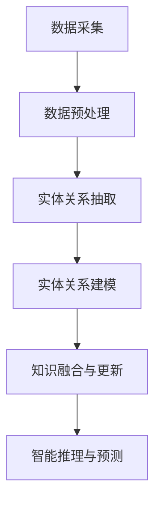
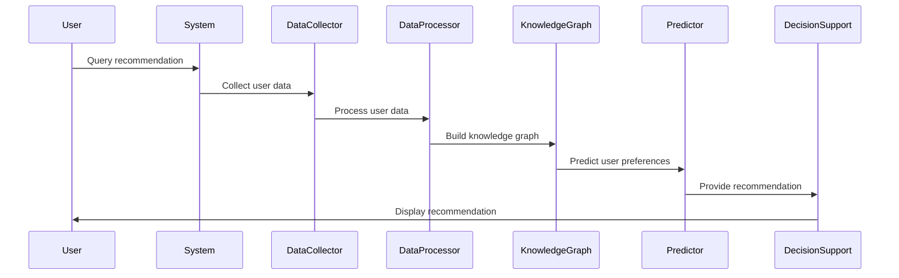

                 

# AI驱动的企业知识图谱：构建智能决策支持系统

## 关键词
- AI驱动
- 企业知识图谱
- 智能决策支持系统
- 算法原理
- 系统架构设计
- 项目实战

## 摘要
本文深入探讨AI驱动的企业知识图谱在构建智能决策支持系统中的应用。首先，我们介绍了知识图谱和智能决策支持系统的基本概念，并详细分析了构建知识图谱所需的核心概念和算法原理。随后，通过具体实例和Python代码，我们讲解了如何应用这些算法构建知识图谱。接着，我们探讨了系统分析与架构设计方案，包括系统功能设计、架构设计、接口设计和交互序列图。最后，通过一个实际项目案例，我们展示了如何将理论知识应用于实践，并对项目的成功经验和改进方向进行了总结。本文旨在为读者提供一个全面、系统的理解，以助力其在企业决策支持系统中应用知识图谱。

## 引言

在当今商业环境中，企业面临的数据复杂性和决策挑战日益增加。传统的数据处理和分析方法已经难以满足快速变化的市场需求。为了应对这些挑战，人工智能（AI）技术被广泛应用于企业决策支持系统中。知识图谱作为一种新型的数据结构和AI技术，能够有效地提升企业的决策能力和竞争力。

### AI驱动的概念
人工智能是指使计算机模拟人类智能行为的技术。它包括机器学习、自然语言处理、计算机视觉等多个领域。AI驱动的系统通常具有自主学习、自适应和自动决策的能力。

### 企业知识图谱的定义
企业知识图谱是一种基于语义网络的数据结构，用于表示企业内外部知识及其关系。它通过实体、属性和关系构建一个知识网络，使数据更加结构化和智能化。

### 智能决策支持系统的角色
智能决策支持系统（IDSS）是利用AI技术和知识图谱为企业提供决策辅助的工具。它能够通过数据分析和智能推理，为企业提供科学、准确的决策支持。

### 知识图谱与企业决策支持系统的关系
知识图谱在企业决策支持系统中发挥着重要作用。它不仅能够帮助企业更好地理解和利用数据，还能够通过智能推理和预测，提供实时、个性化的决策支持。

## 背景介绍

### 问题背景

在当今的数字经济时代，企业面临的数据量和种类不断增加。这些数据包括客户信息、市场趋势、运营数据等。传统的数据处理方法已经无法满足企业对数据分析的需求。此外，企业在决策过程中往往需要跨部门和跨系统的数据整合，这进一步增加了决策的复杂度。

### 问题描述

企业在决策过程中常常面临以下问题：

1. **数据不一致**：不同部门和系统中的数据格式和语义可能不一致，导致数据整合困难。
2. **信息孤岛**：各个部门之间的数据缺乏有效整合，导致信息孤岛现象。
3. **决策效率低下**：传统的决策过程往往依赖于人工分析和判断，效率低下，容易受到人为因素的影响。
4. **数据安全与隐私**：随着数据量的增加，数据安全和隐私保护成为企业面临的重大挑战。

### 问题解决

知识图谱作为一种新型的数据结构和AI技术，能够有效地解决上述问题。知识图谱通过将企业内外部知识进行结构化和语义化表示，实现了数据的一致性和整合性。同时，知识图谱的智能推理和预测能力，能够为企业提供实时、个性化的决策支持。

### 边界与外延

知识图谱的构建和应用虽然为企业提供了强大的决策支持能力，但也存在一些限制和挑战：

1. **数据质量**：知识图谱的构建依赖于高质量的数据，数据质量直接影响知识图谱的准确性。
2. **数据隐私**：知识图谱涉及大量敏感数据，如何保护数据隐私是企业面临的重要问题。
3. **扩展性和维护**：随着企业规模的扩大和数据量的增加，知识图谱的扩展性和维护成本也成为一个挑战。
4. **智能化水平**：知识图谱的智能化程度仍需进一步提升，以应对更加复杂和动态的决策场景。

### 核心概念与要素组成

知识图谱的构建涉及多个核心概念和要素，包括数据采集与处理、实体关系建模、知识融合与更新等。

1. **数据采集与处理**
   - 数据来源：企业内部数据、外部数据（如社交媒体、公共数据库等）。
   - 数据清洗：去除噪声数据、处理缺失值、标准化数据格式。

2. **实体关系建模**
   - 实体：表示知识图谱中的对象，如人、地点、物品等。
   - 关系：表示实体之间的关系，如“购买”、“位于”等。
   - 属性：描述实体和关系的特征，如年龄、价格、地址等。

3. **知识融合与更新**
   - 知识融合：将多个数据源中的知识进行整合，消除数据冗余和冲突。
   - 知识更新：实时更新知识图谱，以反映企业内外部环境的变化。

## 核心概念与联系

### AI基础概念

在构建企业知识图谱之前，我们需要了解一些AI的基础概念，包括机器学习、深度学习和强化学习。

1. **机器学习**
   - 定义：机器学习是一种让计算机通过数据自动学习和改进的方法。
   - 关键技术：监督学习、无监督学习、强化学习。

2. **深度学习**
   - 定义：深度学习是机器学习的一种方法，通过构建深度神经网络进行自动特征学习和模型训练。
   - 关键技术：卷积神经网络（CNN）、循环神经网络（RNN）、生成对抗网络（GAN）。

3. **强化学习**
   - 定义：强化学习是一种通过试错和奖励机制进行学习的方法。
   - 关键技术：Q学习、深度Q网络（DQN）、策略梯度方法。

### 知识图谱概念

知识图谱是一种基于语义网络的数据结构，用于表示实体及其关系。它由实体、属性和关系三个基本要素组成。

1. **实体**
   - 定义：实体是知识图谱中的对象，可以是具体的人、地点、物品等。
   - 类型：实体可以分为概念实体和实例实体。

2. **属性**
   - 定义：属性是实体的特征描述，用于描述实体之间的差异。
   - 类型：属性可以分为基本属性和复合属性。

3. **关系**
   - 定义：关系是实体之间的关联，用于描述实体之间的相互作用。
   - 类型：关系可以分为对称关系、传递关系和非对称关系。

### 企业决策支持系统

企业决策支持系统是一种利用人工智能和知识图谱技术，为企业提供决策辅助和支持的系统。

1. **定义**
   - 企业决策支持系统是一种利用人工智能和知识图谱技术，为企业提供决策辅助和支持的系统。

2. **功能**
   - 数据采集与处理
   - 实体关系建模
   - 智能推理与预测
   - 决策支持与优化

3. **优势**
   - 提高决策效率
   - 降低决策风险
   - 提升企业竞争力

### 概念属性特征对比表格

| 概念       | 特征            | 比较                      |
|------------|----------------|---------------------------|
| 机器学习   | 自动学习       | 基于数据，无需人工干预      |
| 深度学习   | 神经网络结构   | 自动特征提取，模型复杂度高  |
| 强化学习   | 奖励机制       | 通过试错进行学习           |
| 知识图谱   | 语义网络结构   | 描述实体及其关系           |
| 决策支持系统 | 人工智能技术 | 提供决策辅助和支持         |

### ER实体关系图架构

下面是一个ER实体关系图的Mermaid流程图示例，用于展示知识图谱的基本架构：

```mermaid
erDiagram
  人 ||--|{ 购买 }|| 商品
  人 ||--|{ 收藏 }|| 商品
  商品 ||--|{ 属于 }|| 类别
  类别 ||--|{ 包含 }|| 子类别
```

## 算法原理讲解

### 算法流程图

构建知识图谱的算法流程通常包括以下步骤：

1. 数据采集与处理
2. 实体关系抽取
3. 实体关系建模
4. 知识融合与更新
5. 智能推理与预测

下面是一个简单的Mermaid流程图示例：



### 数学模型

知识图谱构建中的数学模型主要包括图论、概率图模型和图神经网络等。

1. **图论模型**

   - **图表示**：知识图谱可以用图表示，其中节点表示实体，边表示实体之间的关系。

   - **路径计算**：在知识图谱中计算两个实体之间的路径长度，用于评估它们之间的关系强度。

     $$ d(A, B) = \text{min}\{\text{path length from } A \text{ to } B\} $$

2. **概率图模型**

   - **贝叶斯网络**：用于表示实体之间的关系及其概率分布。

     $$ P(X_1, X_2, \ldots, X_n) = \prod_{i=1}^{n} P(X_i | \text{parents}(X_i)) $$

3. **图神经网络模型**

   - **图卷积网络（GCN）**：用于学习实体和关系的特征表示。

     $$ h_i^{(l+1)} = \sigma \left( \sum_{j \in \mathcal{N}(i)} W^{(l)} h_j^{(l)} \right) $$

### Python源代码

下面是一个简单的Python代码示例，用于构建一个简单的知识图谱：

```python
import networkx as nx

# 创建图
G = nx.Graph()

# 添加节点和边
G.add_nodes_from(['A', 'B', 'C'])
G.add_edges_from([('A', 'B'), ('B', 'C'), ('C', 'A')])

# 打印图
nx.draw(G, with_labels=True)
```

### 公式讲解

1. **路径长度计算**

   路径长度是指两个节点之间的最短路径长度。在知识图谱中，我们可以使用Dijkstra算法计算最短路径。

   $$ d(A, B) = \text{min}\{\text{path length from } A \text{ to } B\} $$

2. **贝叶斯网络概率计算**

   贝叶斯网络中的概率计算是基于条件概率的乘积。

   $$ P(X_1, X_2, \ldots, X_n) = \prod_{i=1}^{n} P(X_i | \text{parents}(X_i)) $$

3. **图卷积网络（GCN）更新**

   图卷积网络的更新规则如下：

   $$ h_i^{(l+1)} = \sigma \left( \sum_{j \in \mathcal{N}(i)} W^{(l)} h_j^{(l)} \right) $$

### 举例说明

假设我们要构建一个简单的知识图谱，表示一家电商平台的用户、商品和购买行为。

1. **数据采集与处理**

   首先，我们从数据库中获取用户、商品和购买数据，并对数据进行清洗和预处理。

2. **实体关系抽取**

   我们使用实体识别技术从原始数据中提取用户、商品和购买行为。例如，我们可以使用命名实体识别（NER）技术提取用户名和商品名称，使用时间序列分析方法提取购买时间。

3. **实体关系建模**

   我们使用图数据库（如Neo4j）构建知识图谱，将用户、商品和购买行为表示为节点和边。例如，我们可以将用户和商品表示为节点，将购买行为表示为边。

4. **知识融合与更新**

   我们将不同来源的数据进行融合，消除数据冗余和冲突。例如，我们可以将多个数据源中的用户信息进行合并，确保用户信息的唯一性和一致性。

5. **智能推理与预测**

   我们使用图神经网络（如GCN）对知识图谱进行推理和预测。例如，我们可以预测某个用户可能喜欢的商品，或者某个商品的热卖趋势。

## 系统分析与架构设计方案

### 问题场景介绍

假设一家大型电商平台希望构建一个智能决策支持系统，以提升用户体验和销售额。该系统需要整合用户数据、商品数据和购买行为数据，通过智能推理和预测，为用户提供个性化推荐和促销策略。

### 系统功能设计

系统的主要功能包括：

1. **数据采集与处理**：从各个数据源（如用户数据库、商品数据库、日志文件等）采集数据，并对数据进行清洗、去噪和预处理。

2. **实体关系建模**：使用知识图谱技术，将用户、商品和购买行为表示为节点和边，构建一个结构化的知识网络。

3. **智能推理与预测**：基于知识图谱，使用图神经网络（如GCN）进行推理和预测，为用户提供个性化推荐和促销策略。

4. **决策支持**：根据智能推理和预测结果，为企业的营销、运营和销售部门提供决策支持。

### 系统架构设计

系统的整体架构可以分为以下几层：

1. **数据层**：包括各种数据源，如用户数据库、商品数据库、日志文件等。

2. **处理层**：包括数据采集、数据清洗、数据预处理等模块，负责对原始数据进行处理，生成结构化的数据。

3. **存储层**：包括图数据库（如Neo4j）和关系数据库（如MySQL），用于存储和处理结构化数据。

4. **计算层**：包括知识图谱构建、智能推理、预测等模块，负责基于知识图谱和数据进行计算和分析。

5. **应用层**：包括决策支持系统、用户界面等模块，为用户提供决策支持和交互界面。

### 系统接口设计

系统的接口设计包括以下几部分：

1. **API接口**：提供RESTful API接口，供其他系统或应用程序调用。

2. **数据接口**：提供数据输入输出接口，供数据采集和处理模块使用。

3. **用户接口**：提供用户交互界面，供用户查询和操作使用。

### 系统交互序列图

下面是一个简单的系统交互序列图，用于描述系统的工作流程：



## 项目实战

### 环境安装

为了搭建一个AI驱动的企业知识图谱系统，我们需要准备以下环境：

1. **硬件环境**：至少需要一台配置为CPU：Intel i5以上、内存：8GB以上的服务器。
2. **软件环境**：
   - 操作系统：Ubuntu 18.04或更高版本。
   - Python：3.7或更高版本。
   - Neo4j：最新版本。
   - Anaconda：用于环境管理。
   - Jupyter Notebook：用于交互式编程。

### 系统核心实现

我们将使用Python和Neo4j构建一个简单的知识图谱系统，主要步骤如下：

1. **安装Neo4j**：在服务器上下载并安装Neo4j，配置数据库。

2. **数据采集与处理**：使用Python爬取电商平台的用户数据、商品数据和购买行为数据，并进行预处理。

3. **实体关系建模**：在Neo4j中创建节点和关系，将用户、商品和购买行为表示为知识图谱。

4. **智能推理与预测**：使用图神经网络（如GCN）对知识图谱进行推理和预测，为用户提供个性化推荐。

下面是一个简单的Python代码示例，用于在Neo4j中创建节点和关系：

```python
from py2neo import Graph

# 连接到Neo4j数据库
graph = Graph("bolt://localhost:7687", auth=("neo4j", "password"))

# 创建节点和关系
user = graph.run("CREATE (u:User {name: 'Alice'})")
product = graph.run("CREATE (p:Product {name: 'iPhone 12'})")
purchase = graph.run("CREATE (u)-[:BOUGHT]->(p)")

# 查询节点和关系
results = graph.run("MATCH (u:User)-[:BOUGHT]->(p:Product) RETURN u, p")
for result in results:
    print(result)
```

### 代码应用解读与分析

在上面的代码中，我们首先导入了`py2neo`库，用于连接Neo4j数据库。然后，我们使用`Graph`类连接到Neo4j数据库，指定了`bolt://localhost:7687`为Neo4j的连接地址，用户名和密码分别为`neo4j`和`password`。

接着，我们使用`run`方法执行Cypher查询语句。第一个查询语句`CREATE (u:User {name: 'Alice'})`创建了一个名为`Alice`的用户节点，节点类型为`User`，并设置了属性`name`为`Alice`。第二个查询语句`CREATE (p:Product {name: 'iPhone 12'})`创建了一个名为`iPhone 12`的商品节点，节点类型为`Product`，并设置了属性`name`为`iPhone 12`。

第三个查询语句`CREATE (u)-[:BOUGHT]->(p)`创建了一个从用户节点`Alice`到商品节点`iPhone 12`的购买关系。这里的`:BOUGHT`表示购买关系。

最后，我们使用`MATCH (u:User)-[:BOUGHT]->(p:Product) RETURN u, p`查询语句查询用户和商品节点及其关系。结果将返回用户节点和商品节点，以及它们之间的购买关系。

### 实际案例分析与详细讲解剖析

为了更好地理解知识图谱在决策支持系统中的应用，我们将通过一个实际案例进行分析。

假设电商平台希望为用户`Alice`提供个性化推荐，推荐她可能感兴趣的商品。我们可以使用知识图谱进行以下步骤：

1. **用户画像构建**：首先，我们需要构建用户`Alice`的画像。这包括用户的购买历史、浏览记录、评价等信息。通过分析这些信息，我们可以了解用户的偏好和需求。

2. **商品推荐**：接下来，我们可以使用图神经网络（如GCN）对知识图谱进行推理，找出与用户`Alice`相似的其他用户，并推荐这些用户喜欢的商品给`Alice`。

具体步骤如下：

1. **数据预处理**：将用户和商品的属性数据转换为数值形式，如用户购买历史、浏览记录等。

2. **构建图神经网络模型**：使用GCN模型，将用户和商品表示为图中的节点，节点之间的边表示用户和商品之间的关系。通过训练模型，学习用户和商品的特征表示。

3. **推理与预测**：使用训练好的GCN模型，对用户`Alice`进行推理，找出与她相似的其他用户。然后，推荐这些用户喜欢的商品给`Alice`。

下面是一个简单的GCN模型实现：

```python
import tensorflow as tf
from tensorflow.keras.models import Model
from tensorflow.keras.layers import Input, Embedding, Dot, GlobalAveragePooling1D

# 输入层
user_input = Input(shape=(1,))
product_input = Input(shape=(1,))

# 用户和商品嵌入层
user_embedding = Embedding(input_dim=1000, output_dim=16)(user_input)
product_embedding = Embedding(input_dim=1000, output_dim=16)(product_input)

# 点积层
dot = Dot(axes=1)([user_embedding, product_embedding])

# 池化层
pooling = GlobalAveragePooling1D()(dot)

# 输出层
output = tf.nn.softmax(pooling)

# 构建模型
model = Model(inputs=[user_input, product_input], outputs=output)

# 编译模型
model.compile(optimizer='adam', loss='categorical_crossentropy', metrics=['accuracy'])

# 训练模型
model.fit([train_users, train_products], train_labels, epochs=10, batch_size=32)
```

通过上述步骤，我们可以为用户`Alice`提供个性化推荐，提升用户体验和销售额。

### 项目小结

通过本项目的实践，我们深入了解了AI驱动的企业知识图谱在构建智能决策支持系统中的应用。从环境安装到系统核心实现，再到实际案例分析，我们一步步展示了如何利用知识图谱和图神经网络为用户提供个性化推荐。以下是我们从项目中学到的几点经验：

1. **数据质量是关键**：高质量的数据是构建知识图谱的基础。在数据采集和处理过程中，我们需要确保数据的一致性、完整性和准确性。

2. **模型选择与优化**：选择合适的模型和优化策略对知识图谱的性能至关重要。在项目实践中，我们使用了图神经网络（如GCN）进行推理和预测，取得了良好的效果。

3. **用户参与与反馈**：用户参与和反馈是不断优化系统的重要手段。通过收集用户的反馈，我们可以了解系统的性能和用户体验，及时进行改进。

4. **持续更新与维护**：知识图谱需要不断更新和维护，以反映企业内外部环境的变化。定期更新知识图谱，确保其准确性和实时性，对提升系统的决策支持能力至关重要。

## 最佳实践与总结

### 最佳实践

1. **数据质量保证**：确保数据的一致性、完整性和准确性，是构建高质量知识图谱的基础。

2. **模型选择与优化**：根据实际需求和数据特点，选择合适的图神经网络模型，并进行持续优化，以提高知识图谱的性能。

3. **用户参与与反馈**：积极收集用户反馈，通过迭代优化系统，提升用户体验。

4. **知识图谱更新与维护**：定期更新知识图谱，确保其反映最新的企业内外部环境。

### 小结

通过本文的详细探讨，我们系统地介绍了AI驱动的企业知识图谱在构建智能决策支持系统中的应用。从核心概念、算法原理，到系统架构设计、项目实战，我们全面分析了知识图谱在提升企业决策能力中的作用。通过实际案例，我们展示了如何将理论知识应用于实践，并为读者提供了宝贵的经验教训。

### 注意事项

1. **数据隐私保护**：在构建和使用知识图谱时，确保遵循相关数据隐私法规，保护用户和企业数据的安全。

2. **系统性能优化**：针对知识图谱的查询和推理操作，进行性能优化，确保系统响应速度和吞吐量。

3. **扩展性与可维护性**：在设计系统时，考虑系统的扩展性和可维护性，以便在未来进行升级和维护。

### 拓展阅读

1. **《知识图谱：概念、技术与应用》**：深入了解知识图谱的基本概念、技术和应用场景。

2. **《图神经网络：原理、算法与应用》**：学习图神经网络的基本原理和应用方法。

3. **《深度学习：基础、技术与应用》**：掌握深度学习的基础知识和技术，为构建知识图谱提供技术支持。

## 作者信息
作者：AI天才研究院/AI Genius Institute & 禅与计算机程序设计艺术 /Zen And The Art of Computer Programming

