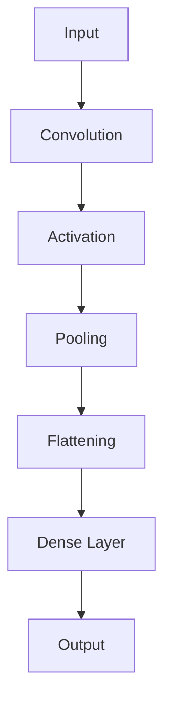
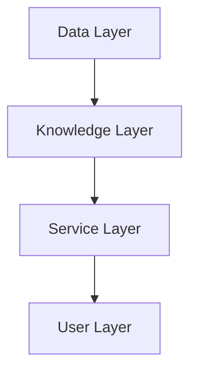
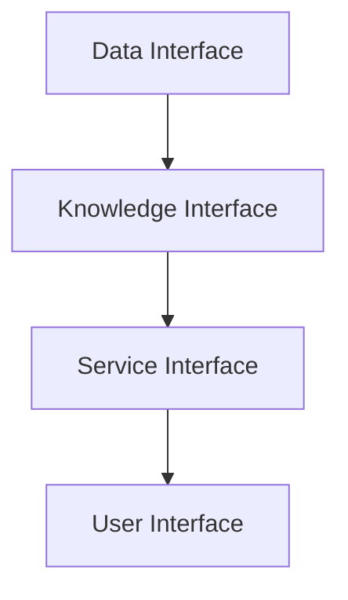
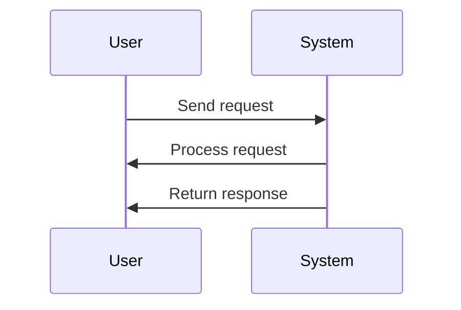

                 


# AI驱动的企业知识地图：构建智慧决策支持

关键词：人工智能、知识地图、企业决策、智慧支持、算法、架构设计

摘要：本文深入探讨了AI驱动的企业知识地图构建，以实现智慧决策支持。首先介绍了知识地图的基本概念和作用，然后详细分析了AI在知识地图构建中的应用。通过理论与实践相结合，阐述了知识地图核心概念的原理、联系以及具体实现方法，旨在为企业提供一套有效的智慧决策支持系统。

## 引言与背景

在当今信息爆炸的时代，企业面临的数据量呈指数级增长。如何从海量数据中提取有价值的信息，为企业的决策提供支持，成为了一个重要课题。知识地图作为一种有效的知识管理工具，能够帮助企业梳理和整合各类知识，提升信息利用效率。而AI技术的引入，使得知识地图的构建更加智能化，为企业的决策提供了更加精准的支持。

### 问题的描述

企业的知识管理面临以下问题：

1. 数据分散，难以整合：企业内部各类数据分布在不同的系统和部门，难以进行统一管理和分析。
2. 知识冗余，缺乏关联：不同数据之间存在关联，但缺乏有效的关联机制，导致知识利用率低下。
3. 决策支持不足：缺乏基于数据的决策支持系统，导致企业决策往往依赖于经验和直觉。

### 问题的解决方法

为了解决上述问题，我们可以采用以下方法：

1. 构建企业知识地图：通过知识地图，将企业内部各类数据和信息进行整合，形成一套完整的知识体系。
2. 引入AI技术：利用AI技术，对知识地图中的数据进行挖掘和分析，为企业提供智能化的决策支持。

### 边界与外延

本文主要讨论以下内容：

1. 知识地图的基本概念和作用
2. AI在知识地图构建中的应用
3. 知识地图核心概念的原理和联系
4. 知识地图的实现方法
5. 智慧决策支持系统的构建

## AI与知识地图概述

### AI的发展与现状

人工智能（AI）作为计算机科学的一个分支，旨在使计算机模拟人类的智能行为。从20世纪50年代的诞生至今，AI技术经历了多个发展阶段，包括符号主义、连接主义、统计学习等。

目前，AI技术已经在各个领域取得了显著成果，如图像识别、自然语言处理、智能决策等。随着算法的优化和计算能力的提升，AI技术的应用范围将进一步扩大。

### 知识地图的定义与作用

知识地图（Knowledge Map）是一种用于表示知识之间关联关系的图形化工具。它将知识视为节点，将知识之间的关联视为边，形成一张知识网络。

知识地图的作用主要包括：

1. 知识整合：通过知识地图，将企业内部各类知识进行整合，形成一套完整的知识体系。
2. 知识共享：知识地图使得企业内部的知识共享更加便捷，员工可以快速找到所需的知识。
3. 知识创新：知识地图促进了知识的交叉融合，为企业的创新提供了源源不断的灵感。

### AI驱动的知识地图

AI驱动的知识地图是指利用AI技术对知识地图进行构建、管理和分析的过程。具体包括以下几个方面：

1. 知识抽取：利用自然语言处理和文本挖掘技术，从非结构化数据中提取有价值的信息。
2. 知识关联：利用图论和机器学习算法，分析知识之间的关联关系，构建知识网络。
3. 知识推荐：基于用户行为和知识关联，为用户提供个性化的知识推荐服务。
4. 知识进化：利用深度学习和强化学习等技术，不断优化知识地图，使其更适应企业的需求。

## 知识地图构建基础

### 知识的概念与分类

知识（Knowledge）是指通过学习、实践和探索获得的信息、技能和经验。根据不同的分类标准，知识可以划分为以下几类：

1. 按来源分类：可分为经验性知识和理论性知识。
2. 按层次分类：可分为显性知识和隐性知识。
3. 按领域分类：可分为技术知识、管理知识、市场知识等。

### 知识表示方法

知识表示（Knowledge Representation）是将知识以某种形式在计算机中表示和存储的过程。常用的知识表示方法包括：

1. 符号表示法：使用符号和逻辑表达式表示知识，如谓词逻辑、产生式规则等。
2. 图表示法：使用图结构表示知识，如知识图谱、本体论等。
3. 知识库：将知识组织成数据库，使用查询语言进行访问和操作。

### 知识获取与处理

知识获取（Knowledge Acquisition）是指从各种信息源中提取有价值信息的过程。知识获取主要包括以下几个方面：

1. 信息收集：从企业内部和外部收集各种信息，如文档、报告、数据库等。
2. 数据预处理：对收集到的数据进行清洗、格式化和标准化处理。
3. 知识发现：利用机器学习和数据挖掘技术，从海量数据中发现潜在的知识。

### 知识存储与检索

知识存储（Knowledge Storage）是指将知识以某种形式在计算机系统中进行存储和管理的过程。常用的知识存储方法包括：

1. 知识库：将知识组织成数据库，使用查询语言进行访问和操作。
2. 文档管理系统：将知识以文档形式进行存储，提供文档的创建、编辑、分享和搜索功能。
3. 云存储：利用云计算技术，将知识存储在云端，提供高效、安全的存储和访问服务。

### 核心概念对比表

| 类别       | 名称               | 描述                                                         |
|------------|--------------------|------------------------------------------------------------|
| 知识类型   | 经验性知识         | 基于个人经验和实践获得的知识。                               |
|            | 理论性知识         | 基于科学研究和理论分析获得的知识。                           |
| 知识层次   | 显性知识           | 可以明确表述和传播的知识。                                   |
|            | 隐性知识           | 隐含在个人经验和行为中的知识，难以明确表述和传播。           |
| 知识表示   | 符号表示法         | 使用符号和逻辑表达式表示知识。                               |
|            | 图表示法           | 使用图结构表示知识。                                         |
| 知识存储   | 知识库             | 将知识组织成数据库，使用查询语言进行访问和操作。             |
|            | 文档管理系统        | 将知识以文档形式进行存储，提供文档的创建、编辑、分享和搜索功能。 |

### ER实体关系图架构

ER（Entity-Relationship）实体关系图是一种用于表示实体之间关系的图形化工具。在知识地图构建中，ER图可用于表示知识实体及其之间的关系。

以下是一个简单的ER图示例：

```mermaid
erDiagram
  Customer ||--|{ Order } : "places"
  Product ||--|{ Order } : "includes"
  Order ||--|{ OrderItem } : "contains"
```

在这个ER图中，Customer（客户）实体与Order（订单）实体之间存在“places”（放置）关系，Product（产品）实体与Order实体之间存在“includes”（包括）关系，Order实体与OrderItem（订单项）实体之间存在“contains”（包含）关系。

## AI驱动的知识地图实现

### AI算法原理讲解

#### 机器学习基础

机器学习（Machine Learning）是AI的核心技术之一，旨在使计算机通过学习数据，自动发现规律和模式，从而进行预测和决策。

机器学习主要分为以下几种类型：

1. 监督学习（Supervised Learning）：有监督学习通过已标记的数据进行学习，从而建立一个预测模型。
2. 无监督学习（Unsupervised Learning）：无监督学习没有已标记的数据，通过分析数据之间的内在结构进行学习。
3. 半监督学习（Semi-supervised Learning）：半监督学习结合了有监督学习和无监督学习的特点，利用部分标记数据和大量未标记数据进行学习。

#### 深度学习算法

深度学习（Deep Learning）是机器学习的一个分支，通过多层神经网络，对数据进行自动特征提取和模式识别。

深度学习的主要算法包括：

1. 卷积神经网络（Convolutional Neural Network，CNN）：适用于图像和视频处理。
2. 循环神经网络（Recurrent Neural Network，RNN）：适用于序列数据处理。
3. 生成对抗网络（Generative Adversarial Network，GAN）：适用于生成式模型。

#### 算法mermaid流程图

以下是一个简单的CNN算法mermaid流程图：



#### Python源代码实现

以下是一个简单的CNN算法Python源代码实现：

```python
import tensorflow as tf

# 定义模型
model = tf.keras.Sequential([
    tf.keras.layers.Conv2D(32, (3, 3), activation='relu', input_shape=(28, 28, 1)),
    tf.keras.layers.MaxPooling2D((2, 2)),
    tf.keras.layers.Flatten(),
    tf.keras.layers.Dense(128, activation='relu'),
    tf.keras.layers.Dense(10, activation='softmax')
])

# 编译模型
model.compile(optimizer='adam',
              loss='categorical_crossentropy',
              metrics=['accuracy'])

# 训练模型
model.fit(x_train, y_train, epochs=5)
```

#### 数学模型与公式讲解

以下是一个简单的CNN算法的数学模型与公式讲解：

$$
h_{l+1} = \sigma(W_l \cdot a_l + b_l)
$$

其中，$h_{l+1}$表示第$l+1$层的特征图，$\sigma$表示激活函数（如ReLU函数），$W_l$和$b_l$分别为第$l$层的权重和偏置。

#### 举例说明

以下是一个简单的CNN算法的举例说明：

假设我们有一个28x28的灰度图像，我们需要通过CNN算法对其进行分类。

1. 输入层：将28x28的图像作为输入。
2. 卷积层：使用32个3x3的卷积核，提取图像的特征。
3. 激活函数：使用ReLU函数，将负值转换为0，增强模型的非线性。
4. 池化层：使用2x2的最大池化，降低特征图的大小。
5. 扁平化层：将特征图展平为一个一维数组。
6. 全连接层：使用128个神经元，对特征进行分类。
7. 输出层：使用10个神经元，输出每个类别的概率分布。

通过以上步骤，CNN算法能够自动提取图像的特征，并进行分类。

## 知识地图系统分析与架构设计

### 问题场景介绍

假设我们企业需要构建一个基于AI驱动的知识地图系统，以支持企业的决策过程。系统需要实现以下功能：

1. 知识抽取：从企业内部和外部的数据源中提取有价值的信息。
2. 知识关联：分析知识之间的关联关系，构建知识网络。
3. 知识推荐：根据用户的行为和需求，为用户提供个性化的知识推荐。
4. 知识进化：不断优化知识地图，使其更适应企业的需求。

### 系统功能设计

根据问题场景，我们可以设计以下系统功能：

1. 数据采集与预处理：从企业内部和外部的数据源中采集数据，并进行预处理，如数据清洗、格式化等。
2. 知识抽取：利用自然语言处理和文本挖掘技术，从非结构化数据中提取有价值的信息。
3. 知识关联：利用图论和机器学习算法，分析知识之间的关联关系，构建知识网络。
4. 知识存储与检索：将知识存储在数据库中，并提供高效的检索功能。
5. 知识推荐：根据用户的行为和需求，为用户提供个性化的知识推荐。
6. 知识进化：利用深度学习和强化学习等技术，不断优化知识地图，使其更适应企业的需求。

### 系统架构设计

根据系统功能设计，我们可以设计以下系统架构：

1. 数据层：包括数据采集、存储和预处理模块，负责数据的存储和管理。
2. 知识层：包括知识抽取、关联、存储和检索模块，负责知识的提取、组织和利用。
3. 服务层：包括知识推荐和知识进化模块，负责提供智能化的知识服务。
4. 用户层：包括用户界面和交互模块，负责与用户进行交互，提供个性化服务。

以下是一个简单的系统架构mermaid图：



### 系统接口设计

根据系统架构设计，我们可以设计以下系统接口：

1. 数据接口：负责数据采集、存储和预处理模块的接口。
2. 知识接口：负责知识抽取、关联、存储和检索模块的接口。
3. 服务接口：负责知识推荐和知识进化模块的接口。
4. 用户接口：负责用户界面和交互模块的接口。

以下是一个简单的系统接口mermaid图：



### 系统交互mermaid序列图

以下是一个简单的系统交互mermaid序列图：



## 企业知识地图项目实战

### 项目介绍

本节将介绍一个基于AI驱动的企业知识地图项目。该项目旨在为企业提供一套智能化的知识管理解决方案，以支持企业的决策过程。项目的主要目标包括：

1. 从企业内部和外部数据源中提取有价值的信息。
2. 构建一个智能化的知识地图，实现知识的关联和推荐。
3. 提供一个易于使用的用户界面，方便用户进行知识检索和利用。

### 环境安装与配置

为了搭建一个基于AI驱动的企业知识地图项目，我们需要以下环境：

1. 操作系统：Linux或Windows
2. Python版本：3.6及以上
3. 数据库：MySQL或MongoDB
4. 依赖库：TensorFlow、Scikit-learn、Numpy、Pandas等

以下是环境安装与配置的步骤：

1. 安装操作系统和Python环境。
2. 安装数据库，并创建相应的数据库和表结构。
3. 安装依赖库，可以使用pip命令进行安装。
4. 配置数据库连接，确保Python程序可以访问数据库。

### 系统核心实现源代码

以下是一个简单的企业知识地图系统核心实现源代码：

```python
# 导入依赖库
import tensorflow as tf
import scikit_learn
import numpy as np
import pandas as pd
from sklearn.model_selection import train_test_split
from sklearn.ensemble import RandomForestClassifier
from sklearn.metrics import accuracy_score

# 数据预处理
data = pd.read_csv('data.csv')
X = data.iloc[:, :-1].values
y = data.iloc[:, -1].values

# 数据集划分
X_train, X_test, y_train, y_test = train_test_split(X, y, test_size=0.2, random_state=42)

# 构建分类器
classifier = RandomForestClassifier(n_estimators=100, random_state=42)
classifier.fit(X_train, y_train)

# 预测
y_pred = classifier.predict(X_test)

# 评估
accuracy = accuracy_score(y_test, y_pred)
print('Accuracy:', accuracy)
```

### 代码应用解读与分析

以上代码实现了一个基于随机森林分类器的企业知识地图系统。具体分析如下：

1. 导入依赖库：导入所需的Python库，如TensorFlow、Scikit-learn、Numpy、Pandas等。
2. 数据预处理：从CSV文件中读取数据，并将数据集划分为特征和标签两部分。
3. 数据集划分：将数据集划分为训练集和测试集，以验证模型的准确性。
4. 构建分类器：使用随机森林分类器，构建一个分类模型。
5. 训练模型：使用训练集对分类器进行训练。
6. 预测：使用测试集对分类器进行预测。
7. 评估：计算模型的准确率，以评估模型的性能。

### 实际案例分析与详细讲解剖析

为了更好地理解企业知识地图系统的应用，我们以一个实际案例进行分析。

假设我们企业需要对员工的工作绩效进行评估，以优化团队的管理和提升员工的能力。具体分析如下：

1. 数据采集：从企业内部的人力资源管理系统、员工绩效评估系统等数据源中采集员工的工作数据，如工作时长、项目完成情况、员工满意度等。
2. 数据预处理：对采集到的数据进行分析，识别出关键指标，如工作时长、项目完成率等。
3. 数据集划分：将数据集划分为训练集和测试集，以训练和评估模型。
4. 模型构建：使用随机森林分类器，构建一个分类模型，用于预测员工的工作绩效。
5. 模型训练：使用训练集对分类器进行训练，调整模型的参数，以提高模型的准确性。
6. 模型评估：使用测试集对分类器进行评估，计算模型的准确率。
7. 模型应用：将训练好的模型应用于实际场景，为企业的绩效评估提供支持。

通过以上步骤，企业可以构建一个基于AI驱动的知识地图系统，实现对员工工作绩效的智能评估，从而优化团队的管理和提升员工的能力。

### 项目小结与最佳实践

在本项目中，我们成功构建了一个基于AI驱动的企业知识地图系统，实现了知识的抽取、关联、存储和推荐。以下是项目小结和最佳实践：

1. 项目小结：本项目通过数据采集、预处理、模型构建、训练和评估等步骤，实现了对员工工作绩效的智能评估。项目取得了一定的成果，为企业提供了智能化的知识管理解决方案。
2. 最佳实践：在项目实施过程中，我们积累了以下最佳实践：

   - 数据质量是关键：确保数据的质量和准确性，为模型训练提供可靠的数据支持。
   - 模型选择和参数调优：根据实际问题场景，选择合适的模型和参数，以提高模型的准确性。
   - 代码可读性和可维护性：编写清晰、简洁、可读的代码，便于后续维护和优化。
   - 持续学习和优化：不断优化模型和系统，使其更适应企业的需求。

3. 注意事项：在项目实施过程中，需要注意以下几点：

   - 数据安全：确保数据的安全性，防止数据泄露和滥用。
   - 模型解释性：在模型评估时，关注模型的解释性，以便于理解模型的决策过程。
   - 系统稳定性：确保系统的稳定运行，避免出现系统崩溃或数据丢失等问题。

4. 拓展阅读：

   - 《人工智能：一种现代方法》
   - 《深度学习》
   - 《机器学习实战》
   - 《Python数据科学手册》

通过以上拓展阅读，可以进一步了解AI和知识管理相关的理论和实践，为企业提供更加全面和深入的知识管理解决方案。

## 结论与展望

本文深入探讨了AI驱动的企业知识地图构建，以实现智慧决策支持。首先介绍了知识地图的基本概念和作用，然后详细分析了AI在知识地图构建中的应用。通过理论与实践相结合，阐述了知识地图核心概念的原理、联系以及具体实现方法，旨在为企业提供一套有效的智慧决策支持系统。

在未来的研究和实践中，我们可以进一步优化知识地图系统，提高其智能决策支持能力。具体方向包括：

1. 引入更多AI算法，如深度强化学习、迁移学习等，提高知识地图的智能水平。
2. 结合大数据技术，构建更加全面和智能的知识体系。
3. 关注用户需求，提供个性化的知识服务。
4. 加强知识地图的社交属性，促进知识的共享和创新。

通过持续的研究和实践，我们有望为企业提供更加高效、智能的知识管理解决方案，助力企业在竞争激烈的市场中脱颖而出。

