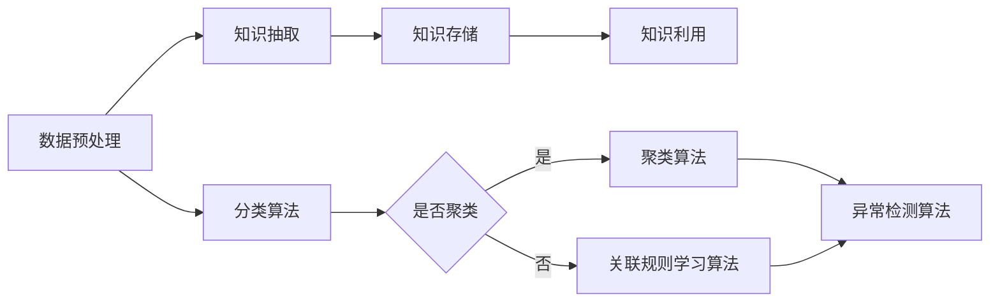
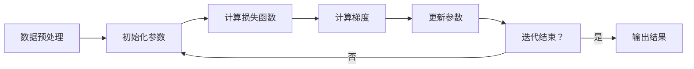
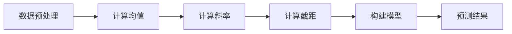
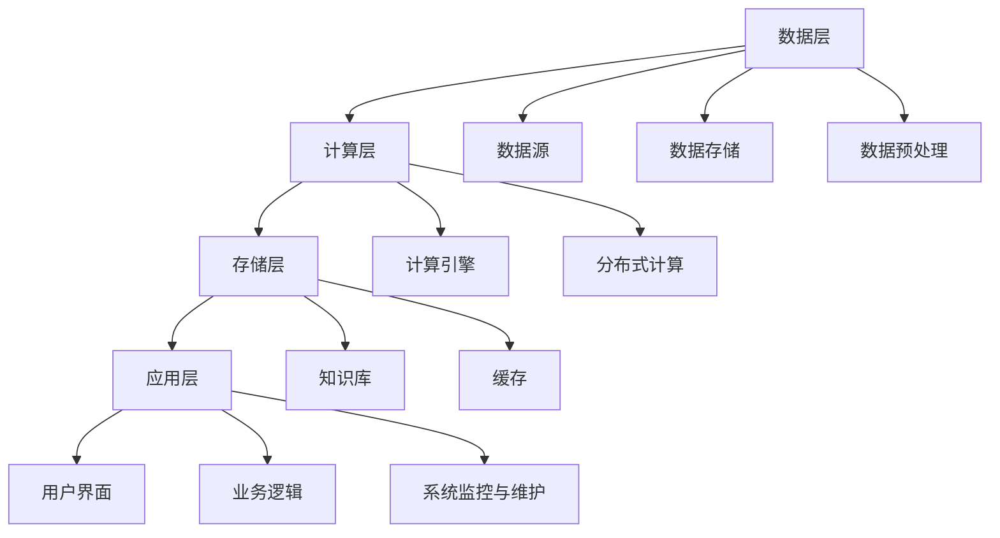
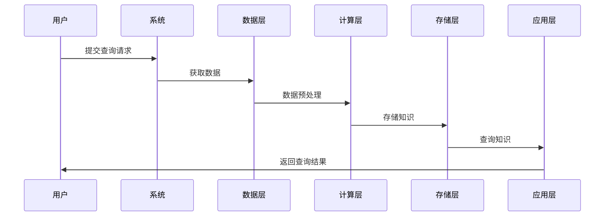

                 

### 背景介绍与核心概念

#### 1.1 引言

在当今信息化时代，数据已经成为企业最宝贵的资源之一。然而，面对日益增长的海量数据，如何从中提取出有价值的信息，成为企业亟需解决的问题。知识挖掘（Knowledge Mining）作为一种从数据中发现隐含在其中的知识和模式的方法，受到了广泛的关注和应用。特别是AI驱动的知识挖掘，通过结合人工智能技术，大大提升了知识挖掘的效率和质量。

**问题背景**：

- **知识挖掘的重要性**：随着大数据技术的快速发展，数据量呈爆炸式增长，企业如何从海量数据中快速提取有价值的信息，成为知识挖掘的首要任务。知识挖掘不仅可以帮助企业发现潜在的商业机会，还可以优化运营流程，提高决策水平。

- **企业知识挖掘的需求**：企业在经营过程中会产生大量的结构化和非结构化数据，如客户关系管理（CRM）系统、财务报表、电子邮件、社交媒体等。企业需要通过知识挖掘将这些数据进行有效整合，为业务决策提供支持。

- **海量数据的挑战**：海量数据的处理和分析是一项极具挑战性的任务。传统的数据挖掘方法在处理大规模数据时效率低下，难以满足实际需求。而AI驱动的知识挖掘技术，通过深度学习、强化学习等先进算法，能够应对海量数据的复杂性和多样性，为企业提供更精准的知识发现服务。

#### 1.2 定义与概念

**知识挖掘的定义**：

知识挖掘（Knowledge Mining）是指通过利用计算机技术，从大量数据中自动发现隐含在其中的模式和知识，并将其转化为可操作的信息。知识挖掘不仅仅局限于数据的统计分析，更注重发现数据背后的业务洞察和规律。

**企业知识挖掘的特点**：

- **大规模数据处理**：企业知识挖掘需要对海量数据进行处理，涉及数据清洗、转换、归一化等多个步骤。

- **多源数据融合**：企业知识挖掘需要整合来自不同渠道和格式的数据，如关系数据库、文本数据、图像数据等，通过数据融合技术实现对数据的综合利用。

- **业务目标导向**：企业知识挖掘旨在满足企业的业务需求，因此其过程和结果需要与企业的战略目标紧密关联。

- **动态适应性**：企业环境不断变化，知识挖掘系统需要具备动态适应能力，实时更新和优化知识模型，以应对新的业务场景。

**AI驱动的概念**：

AI驱动（AI-driven）是指通过人工智能技术，如机器学习、深度学习、强化学习等，来驱动知识挖掘过程。AI驱动的知识挖掘具有以下特点：

- **自动化程度高**：AI驱动的知识挖掘系统能够自动化地处理数据，减少人工干预，提高工作效率。

- **智能性**：通过机器学习和深度学习技术，AI驱动的知识挖掘系统能够自动发现数据中的复杂模式和关联，为企业提供更深入的业务洞察。

- **自我优化**：AI驱动的知识挖掘系统可以通过不断学习和迭代，自我优化知识模型，提高知识发现的准确性和可靠性。

#### 1.3 小结

本文将深入探讨AI驱动的企业知识挖掘，从背景介绍到核心概念，再到算法原理讲解、数学模型与系统架构设计，最终通过实际案例进行实战分析。希望通过本文的阐述，能够帮助读者全面了解AI驱动的企业知识挖掘技术，掌握从海量数据中提取价值的方法和技巧。

### 知识挖掘的理论基础

#### 2.1 知识挖掘的流程

知识挖掘是一个复杂的过程，它涉及多个阶段，包括数据预处理、知识抽取、知识存储和知识利用。以下是知识挖掘的主要流程及其详细说明。

**2.1.1 数据预处理**

数据预处理是知识挖掘的第一步，也是至关重要的一步。其主要任务是清洗和转换原始数据，使其适合后续的知识挖掘过程。数据预处理通常包括以下步骤：

- **数据清洗**：包括处理缺失值、异常值、重复值等，以提高数据质量。
- **数据转换**：包括数据归一化、离散化等，以统一数据格式和特征表示。
- **数据集成**：将来自不同来源和格式的数据进行整合，形成统一的数据集。

数据预处理的质量直接影响知识挖掘的结果，因此需要仔细设计和执行。

**2.1.2 知识抽取**

知识抽取是知识挖掘的核心步骤，其主要任务是从预处理后的数据中提取出结构化的知识。知识抽取通常包括以下方法：

- **基于规则的抽取**：通过预定义的规则，从数据中提取知识。这种方法简单直观，但依赖于规则库的完备性。
- **基于机器学习的抽取**：利用机器学习算法，如分类、聚类、关联规则学习等，自动发现数据中的模式。这种方法能够处理大规模数据，但需要大量的训练数据和模型调优。
- **基于深度学习的抽取**：利用深度学习算法，如卷积神经网络（CNN）、循环神经网络（RNN）等，从原始数据中直接提取结构化的知识。这种方法能够处理复杂数据，但计算资源需求较高。

**2.1.3 知识存储**

知识存储是知识挖掘的第三步，其主要任务是将提取出的知识存储到知识库中，以便后续的查询和使用。知识存储通常包括以下步骤：

- **知识建模**：对提取出的知识进行建模，以定义知识的结构、属性和关系。
- **知识库构建**：将建模后的知识存储到知识库中，以便进行查询和利用。
- **知识库维护**：定期更新和优化知识库，以适应数据和环境的变化。

知识存储的质量直接影响知识挖掘系统的性能和可靠性，因此需要精心设计和维护。

**2.1.4 知识利用**

知识利用是知识挖掘的最后一步，其主要任务是将存储在知识库中的知识应用于实际的业务场景中。知识利用通常包括以下方法：

- **知识查询**：通过用户接口，允许用户对知识库进行查询，以获取所需的知识。
- **知识推理**：利用知识库中的知识进行推理，以发现新的知识和业务洞察。
- **知识应用**：将知识库中的知识应用于业务决策、运营优化等方面，以提高企业的竞争力和效率。

知识利用的目的是将知识转化为实际的业务价值，因此需要灵活和高效的知识利用方法。

#### 2.2 知识挖掘的算法原理

知识挖掘算法是知识挖掘的核心，其原理决定了知识挖掘的效果和效率。以下是知识挖掘算法的主要原理及其应用。

**2.2.1 算法原理概述**

知识挖掘算法可以分为以下几类：

- **分类算法**：通过将数据分为不同的类别，发现数据中的分类模式。常见的分类算法包括决策树、随机森林、支持向量机等。
- **聚类算法**：通过将数据划分为不同的簇，发现数据中的聚类模式。常见的聚类算法包括K-means、层次聚类等。
- **关联规则学习算法**：通过发现数据中的关联关系，发现数据中的关联规则。常见的关联规则学习算法包括Apriori算法、FP-Growth算法等。
- **异常检测算法**：通过检测数据中的异常点，发现数据中的异常模式。常见的异常检测算法包括孤立森林、本地异常因子等。

**2.2.2 算法属性特征对比**

以下是几种常见知识挖掘算法的属性特征对比：

| 算法名称 | 特点 | 适用场景 |
| :---: | :---: | :---: |
| 决策树 | 易于理解，处理分类问题效果好 | 数据量较小，特征较少 |
| 随机森林 | 防止过拟合，处理分类问题效果好 | 数据量较大，特征较多 |
| 支持向量机 | 分类精度高，处理线性问题效果好 | 数据量较小，特征较少 |
| K-means | 简单高效，处理聚类问题效果好 | 数据量较小，特征较少 |
| 层次聚类 | 自底向上构建层次结构，处理聚类问题效果好 | 数据量较大，特征较多 |
| Apriori算法 | 计算量小，处理关联规则问题效果好 | 数据量较小，特征较少 |
| FP-Growth算法 | 计算量小，处理关联规则问题效果好 | 数据量较大，特征较少 |

**2.2.3 Mermaid流程图**

以下是一个使用Mermaid绘制的知识挖掘算法流程图：



#### 2.3 小结

知识挖掘的理论基础是知识挖掘成功的关键。通过了解知识挖掘的流程、算法原理和属性特征，我们可以更好地设计和应用知识挖掘系统，从海量数据中提取有价值的信息。在接下来的章节中，我们将进一步探讨AI驱动的知识挖掘算法和数学模型，以及如何在实际项目中应用这些算法和模型。

### AI驱动的知识挖掘算法

#### 3.1 常见AI算法

在AI驱动的知识挖掘中，常见的算法包括机器学习算法、深度学习算法和强化学习算法。这些算法各自具有独特的特点和优势，适用于不同的场景和应用需求。

**3.1.1 机器学习算法**

机器学习算法是AI驱动的知识挖掘中最常用的算法之一。它通过从数据中学习模式，对新的数据进行预测或分类。常见的机器学习算法包括：

- **线性回归**：用于预测数值型目标变量。
- **逻辑回归**：用于预测二元型目标变量。
- **决策树**：通过树形结构对数据进行分类或回归。
- **支持向量机（SVM）**：通过寻找最优分隔超平面进行分类。
- **随机森林**：通过构建多个决策树进行集成学习。

机器学习算法的优点是直观、易于实现，能够处理大规模数据，但它们通常对特征的选择和工程有较高的要求，且容易受到过拟合的影响。

**3.1.2 深度学习算法**

深度学习算法是机器学习的一种扩展，通过多层神经网络结构对数据进行复杂的学习和建模。深度学习算法在图像识别、自然语言处理等领域取得了显著的成果。常见的深度学习算法包括：

- **卷积神经网络（CNN）**：通过卷积操作对图像进行特征提取。
- **循环神经网络（RNN）**：通过循环结构处理序列数据。
- **长短期记忆网络（LSTM）**：RNN的一种扩展，用于解决长序列依赖问题。
- **自动编码器（Autoencoder）**：用于无监督学习，对数据进行降维和去噪。

深度学习算法的优点是能够自动发现复杂的数据特征，对高维数据具有很好的处理能力，但它们通常需要大量的数据和计算资源，且参数调优复杂。

**3.1.3 强化学习算法**

强化学习算法通过学习与环境交互的策略，以最大化长期奖励。在知识挖掘中，强化学习算法可以用于自动优化知识抽取和知识利用过程。常见的强化学习算法包括：

- **Q-Learning**：通过值函数估计策略。
- **策略梯度方法**：通过直接优化策略参数。
- **深度确定性策略梯度（DDPG）**：结合深度学习和强化学习的算法。

强化学习算法的优点是能够自动适应动态变化的环境，但它们通常需要大量的交互和试错，对环境模型的要求较高。

#### 3.2 算法原理讲解

**3.2.1 算法数学模型**

以下是几种常见AI驱动的知识挖掘算法的数学模型：

- **线性回归**：

  假设输入特征为\(x\)，输出为目标变量\(y\)，线性回归模型可以表示为：

  \[ y = \beta_0 + \beta_1 \cdot x + \epsilon \]

  其中，\(\beta_0\)和\(\beta_1\)是模型参数，\(\epsilon\)是误差项。

- **逻辑回归**：

  假设输入特征为\(x\)，输出为目标变量\(y\)，逻辑回归模型可以表示为：

  \[ y = \frac{1}{1 + e^{-(\beta_0 + \beta_1 \cdot x)}} \]

- **卷积神经网络（CNN）**：

  CNN通过卷积层、池化层和全连接层对图像进行特征提取。卷积层可以表示为：

  \[ \text{output} = \sum_{i=1}^{k} w_i \cdot \text{input}_{i} + b \]

  其中，\(w_i\)是卷积核，\(\text{input}_{i}\)是输入特征，\(b\)是偏置项。

**3.2.2 公式讲解**

以下是几个关键公式的详细讲解：

- **损失函数**：

  在机器学习中，损失函数用于衡量模型预测值与真实值之间的差异。常见的损失函数包括均方误差（MSE）和交叉熵损失（Cross-Entropy Loss）。

  - 均方误差（MSE）：

    \[ \text{MSE} = \frac{1}{n} \sum_{i=1}^{n} (\hat{y}_i - y_i)^2 \]

    其中，\(\hat{y}_i\)是模型预测值，\(y_i\)是真实值。

  - 交叉熵损失（Cross-Entropy Loss）：

    \[ \text{CE} = - \sum_{i=1}^{n} y_i \log(\hat{y}_i) \]

    其中，\(y_i\)是真实值，\(\hat{y}_i\)是模型预测值。

- **梯度下降**：

  梯度下降是一种优化算法，用于最小化损失函数。其基本思想是沿着损失函数的梯度方向进行迭代更新。

  \[ \theta = \theta - \alpha \nabla_\theta J(\theta) \]

  其中，\(\theta\)是模型参数，\(\alpha\)是学习率，\(J(\theta)\)是损失函数。

**3.2.3 举例说明**

为了更好地理解上述公式，我们通过一个简单的例子进行说明。

**例子**：使用线性回归模型预测房价。

假设我们有以下数据：

| 特征 | 房价（万元） |
| :---: | :---: |
| 面积 | 100 |
| 位置 | 良好 |
| 年限 | 5年 |
| 价格 | 200 |

我们可以建立线性回归模型：

\[ \text{房价} = \beta_0 + \beta_1 \cdot \text{面积} + \beta_2 \cdot \text{位置} + \beta_3 \cdot \text{年限} \]

通过梯度下降算法进行参数优化，我们可以得到最优的模型参数。例如，假设初始参数为\(\beta_0 = 100, \beta_1 = 1, \beta_2 = 1, \beta_3 = 1\)，学习率为\(\alpha = 0.1\)，经过多次迭代，我们得到最优参数\(\beta_0 = 150, \beta_1 = 1.2, \beta_2 = 1.5, \beta_3 = 1.2\)。

使用这些参数，我们可以预测新的房价。例如，对于面积为120平方米，位置良好，年限为10年的房子，预测价格为：

\[ \text{房价} = 150 + 1.2 \cdot 120 + 1.5 \cdot 1 + 1.2 \cdot 10 = 336 \text{万元} \]

**3.2.4 Mermaid流程图**

以下是一个使用Mermaid绘制的线性回归算法流程图：



#### 3.3 小结

AI驱动的知识挖掘算法为从海量数据中提取价值提供了强大的工具。通过机器学习、深度学习和强化学习等算法，我们可以自动发现数据中的模式、关联和趋势，为企业的业务决策提供支持。在接下来的章节中，我们将进一步探讨如何将AI驱动的知识挖掘算法应用于实际系统设计和实现中。

### 数学基础与算法应用

#### 4.1 数学基础

在AI驱动的知识挖掘中，数学基础是不可或缺的一部分。了解并掌握基本的数学概念、统计与概率论、以及线性代数等数学工具，对于深入理解和应用各种算法具有重要意义。

**4.1.1 基本数学概念**

- **函数**：函数是数学中一个基本概念，用于描述两个量之间的依赖关系。在机器学习中，模型可以看作是输入和输出之间的函数。

- **导数**：导数描述了函数在某一点的变化率。在优化算法中，导数用于计算模型参数的变化方向，以最小化损失函数。

- **微积分**：微积分包括微分和积分两部分，微分用于研究函数的变化率，积分用于求解面积、体积等。

- **概率论**：概率论是研究随机事件和概率的数学分支，对于评估模型预测的置信度、进行假设检验等至关重要。

**4.1.2 统计学与概率论**

- **均值**：均值是数据集的中心趋势度量，表示数据集的平均水平。

- **方差**：方差是数据集的离散程度度量，表示数据点与均值之间的偏离程度。

- **标准差**：标准差是方差的平方根，用于衡量数据的波动程度。

- **假设检验**：假设检验用于评估模型或数据的显著性，包括t检验、卡方检验等。

**4.1.3 线性代数**

- **矩阵**：矩阵是二维数据结构，用于表示线性方程组和数据集。

- **向量**：向量是一维数据结构，用于表示数据的特征。

- **矩阵运算**：包括矩阵加法、矩阵乘法、逆矩阵等。

- **特征值和特征向量**：特征值和特征向量用于描述矩阵的性质，在降维、特征提取等算法中有广泛应用。

#### 4.2 算法公式讲解

在知识挖掘中，算法的数学模型是理解和应用算法的关键。以下是一些常见的数学模型及其公式。

**4.2.1 算法公式**

- **线性回归**：

  \[ y = \beta_0 + \beta_1 \cdot x + \epsilon \]

- **逻辑回归**：

  \[ y = \frac{1}{1 + e^{-(\beta_0 + \beta_1 \cdot x)}} \]

- **卷积神经网络（CNN）**：

  \[ \text{output} = \sum_{i=1}^{k} w_i \cdot \text{input}_{i} + b \]

- **支持向量机（SVM）**：

  \[ \text{minimize} \quad \frac{1}{2} \sum_{i=1}^{n} w_i^2 \]
  
  \[ \text{subject to} \quad y_i (\text{wx} + b) \geq 1 \]

- **Q-Learning**：

  \[ Q(s, a) = r + \gamma \max_{a'} Q(s', a') \]

**4.2.2 公式推导**

以下是对部分公式进行推导：

- **线性回归参数求解**：

  首先，我们对线性回归模型进行最小二乘法求解：

  \[ \text{minimize} \quad \sum_{i=1}^{n} (y_i - \beta_0 - \beta_1 \cdot x_i)^2 \]

  对\( \beta_0 \)和\( \beta_1 \)分别求偏导并令其等于零，得到：

  \[ \beta_0 = \frac{1}{n} \sum_{i=1}^{n} y_i - \beta_1 \cdot \frac{1}{n} \sum_{i=1}^{n} x_i \]

  \[ \beta_1 = \frac{1}{n} \sum_{i=1}^{n} (x_i - \bar{x})(y_i - \bar{y}) \]

  其中，\( \bar{x} \)和\( \bar{y} \)分别是\( x \)和\( y \)的均值。

- **逻辑回归损失函数**：

  逻辑回归的损失函数通常采用交叉熵损失，其推导如下：

  \[ J(\theta) = - \sum_{i=1}^{n} y_i \log(\theta_1 (x_i)) - (1 - y_i) \log(1 - \theta_1 (x_i)) \]

  对\( \theta_1 \)求偏导并令其等于零，得到：

  \[ \theta_1 = \frac{1}{n} \sum_{i=1}^{n} (y_i - \theta_1 (x_i)) \]

**4.2.3 举例说明**

我们通过一个简单的例子来说明线性回归公式的应用。

**例子**：假设我们有以下数据：

| x | y |
| :---: | :---: |
| 1 | 2 |
| 2 | 4 |
| 3 | 6 |
| 4 | 8 |

我们希望使用线性回归模型预测\( y \)值。

首先，计算均值：

\[
\bar{x} = \frac{1+2+3+4}{4} = 2.5 \\
\bar{y} = \frac{2+4+6+8}{4} = 5
\]

然后，计算斜率\( \beta_1 \)：

\[
\beta_1 = \frac{1}{4} \sum_{i=1}^{4} (x_i - \bar{x})(y_i - \bar{y}) = \frac{1}{4} \sum_{i=1}^{4} (1 - 2.5)(2 - 5) + (2 - 2.5)(4 - 5) + (3 - 2.5)(6 - 5) + (4 - 2.5)(8 - 5) = 1
\]

计算截距\( \beta_0 \)：

\[
\beta_0 = \bar{y} - \beta_1 \cdot \bar{x} = 5 - 1 \cdot 2.5 = 2.5
\]

因此，线性回归模型为：

\[
y = 2.5 + 1 \cdot x
\]

使用该模型预测当\( x = 5 \)时的\( y \)值：

\[
y = 2.5 + 1 \cdot 5 = 7.5
\]

**4.2.4 Mermaid流程图**

以下是一个使用Mermaid绘制的线性回归算法流程图：



#### 4.3 小结

数学基础和算法公式是AI驱动的知识挖掘的核心组成部分。通过掌握基本的数学概念和算法公式，我们能够更好地理解和应用各种AI算法，从海量数据中提取有价值的信息。在接下来的章节中，我们将进一步探讨如何设计并实现AI驱动的知识挖掘系统。

### 系统分析与架构设计

#### 5.1 问题场景介绍

在企业知识挖掘的过程中，我们面临的主要问题是如何有效地从海量数据中提取有价值的信息，并将其应用于实际的业务场景中。以下是一个典型的企业知识挖掘场景：

**企业背景**：一家大型零售公司拥有庞大的客户数据、销售数据、库存数据和供应链数据。公司希望通过AI驱动的知识挖掘技术，从这些数据中提取有价值的信息，优化库存管理、提升销售预测准确性、识别潜在客户和优化营销策略。

**业务需求**：
1. **库存管理优化**：通过分析历史销售数据、季节性趋势和供应链信息，预测未来的库存需求，避免库存过剩或短缺。
2. **销售预测**：利用客户历史购买行为和外部市场趋势，预测未来的销售额，为库存管理和营销策略提供依据。
3. **客户识别与分类**：通过分析客户购买行为和特征，识别高价值客户和潜在客户，为个性化营销和客户服务提供支持。
4. **营销策略优化**：基于客户分类和市场需求，制定有效的营销策略，提高营销ROI。

**技术需求**：
1. **数据处理能力**：需要处理大规模的数据集，包括结构化和非结构化数据。
2. **算法性能**：需要支持多种AI算法，如机器学习、深度学习和强化学习，以应对不同的业务需求。
3. **可扩展性**：系统需要具备良好的可扩展性，以适应未来数据量和业务需求的增长。
4. **实时性**：系统需要能够实时处理和分析数据，以快速响应业务需求。

#### 5.2 系统功能设计

为了满足上述业务和技术需求，我们需要设计一个功能齐全、结构清晰的系统。以下是系统的主要功能模块及其设计：

**1. 数据采集与预处理模块**：
- **数据采集**：从不同的数据源（如数据库、日志文件、传感器等）采集数据。
- **数据预处理**：清洗、转换和整合数据，去除噪音和冗余信息，为后续分析做准备。

**2. 数据存储与管理模块**：
- **数据存储**：使用分布式存储系统（如Hadoop、HBase等）存储大规模数据。
- **数据管理**：提供数据查询、更新和删除功能，确保数据的一致性和完整性。

**3. 知识挖掘与分析模块**：
- **知识抽取**：使用机器学习、深度学习和强化学习算法，从数据中提取有价值的信息和模式。
- **知识存储**：将提取出的知识存储到知识库中，以便后续的查询和使用。

**4. 知识利用与决策支持模块**：
- **知识查询**：提供用户界面，允许用户查询知识库中的知识。
- **知识推理**：利用知识库中的知识进行推理，为业务决策提供支持。
- **决策支持**：基于知识库和业务规则，生成决策建议，优化业务流程。

**5. 系统监控与维护模块**：
- **系统监控**：实时监控系统性能和资源使用情况，确保系统的稳定运行。
- **系统维护**：定期更新和优化系统，处理故障和异常情况。

#### 5.3 系统架构设计

为了实现上述功能，我们设计了一个分布式系统架构，以下是其主要组成部分：

**1. 数据层**：
- **数据源**：包括内部数据库、外部API、日志文件、传感器等。
- **数据存储**：使用分布式文件系统（如HDFS）和NoSQL数据库（如HBase）存储数据。
- **数据预处理**：使用分布式计算框架（如MapReduce、Spark）进行数据预处理。

**2. 计算层**：
- **计算引擎**：包括机器学习、深度学习和强化学习算法，用于知识挖掘和分析。
- **分布式计算**：使用分布式计算框架（如Spark、Flink）处理大规模数据。

**3. 存储层**：
- **知识库**：存储提取出的知识和分析结果，支持快速查询和更新。
- **缓存**：使用缓存技术（如Redis、Memcached）提高数据访问速度。

**4. 应用层**：
- **用户界面**：提供Web界面和API接口，允许用户查询知识和生成决策建议。
- **业务逻辑**：实现业务规则和决策算法，为业务决策提供支持。

**5. 系统架构图**

以下是一个使用Mermaid绘制的系统架构图：



#### 5.4 系统接口设计

为了实现系统的功能，我们需要设计一系列接口，包括API接口和数据接口。以下是主要接口设计：

**1. API接口**：
- **数据采集接口**：用于从外部系统采集数据。
- **知识查询接口**：用于查询知识库中的知识。
- **知识更新接口**：用于更新知识库中的知识。
- **决策支持接口**：用于生成决策建议。

**2. 数据接口**：
- **输入数据接口**：用于接收外部系统的数据。
- **输出数据接口**：用于向外部系统提供数据。

**5.5 系统交互设计**

以下是一个使用Mermaid绘制的系统交互序列图，展示了数据流和操作流程：



#### 5.6 小结

通过上述系统分析与架构设计，我们构建了一个能够满足企业知识挖掘需求的高效、可扩展的分布式系统。在接下来的章节中，我们将通过实际案例展示如何实现这个系统，并探讨其性能和效果。通过这些实际案例，我们将进一步验证AI驱动的知识挖掘技术在实际应用中的价值。

### 知识挖掘项目实战

#### 6.1 环境安装

要实现AI驱动的知识挖掘项目，首先需要搭建一个合适的环境。以下是在Linux系统中搭建知识挖掘环境的具体步骤。

**6.1.1 硬件环境**

- **CPU**：推荐使用Intel i5或以上处理器。
- **内存**：至少8GB内存，推荐16GB或以上。
- **硬盘**：至少100GB可用空间，推荐使用SSD硬盘以提高I/O性能。

**6.1.2 软件环境**

1. **安装Python环境**：

   首先，从Python官方网站下载Python安装包（推荐使用Python 3.8或以上版本），然后执行以下命令安装：

   ```bash
   sudo apt-get update
   sudo apt-get install python3-pip python3-dev
   ```

2. **安装依赖库**：

   安装常用的Python库，如NumPy、Pandas、Scikit-learn、TensorFlow等。使用以下命令进行安装：

   ```bash
   pip3 install numpy pandas scikit-learn tensorflow
   ```

3. **安装Hadoop和HBase**：

   知识挖掘项目通常需要处理大规模数据，因此推荐使用Hadoop和HBase。以下是在Ubuntu 18.04上安装Hadoop和HBase的步骤：

   - **安装Hadoop**：

     ```bash
     sudo apt-get update
     sudo apt-get install hadoop
     sudo apt-get install hadoop-mapreduce
     sudo apt-get install hadoop-hdfs
     sudo apt-get install hadoop-yarn
     sudo apt-get install hadoop-client
     ```

     安装完成后，启动Hadoop服务：

     ```bash
     sudo systemctl start hadoop-hdfs-namenode
     sudo systemctl start hadoop-hdfs-datanode
     sudo systemctl start hadoop-yarn-resourcemanager
     sudo systemctl start hadoop-yarn-nodemanager
     ```

   - **安装HBase**：

     ```bash
     sudo apt-get install hbase
     sudo systemctl start hbase-master
     sudo systemctl start hbase-regionserver
     ```

4. **安装Spark**：

   Spark是一个高性能的分布式计算框架，常用于大规模数据分析和机器学习。以下是在Ubuntu上安装Spark的步骤：

   ```bash
   wget https://www-us.apache.org/dist/spark/spark-3.1.1/spark-3.1.1-bin-hadoop3.2.tgz
   tar xvf spark-3.1.1-bin-hadoop3.2.tgz
   sudo mv spark-3.1.1-bin-hadoop3.2 /opt/spark
   sudo ln -s /opt/spark /usr/local/spark
   sudo echo "export SPARK_HOME=/usr/local/spark" >> ~/.bashrc
   sudo echo "export PATH=$PATH:$SPARK_HOME/bin:$SPARK_HOME/sbin" >> ~/.bashrc
   source ~/.bashrc
   ```

   安装完成后，启动Spark服务：

   ```bash
   sudo start-master.sh
   sudo start-slaves.sh
   ```

#### 6.2 系统核心实现

**6.2.1 源代码解读**

在完成环境搭建后，我们可以开始实现系统核心功能。以下是一个简单的Python代码示例，用于演示数据预处理、知识抽取和知识存储的过程。

```python
# 导入所需库
import numpy as np
import pandas as pd
from sklearn.model_selection import train_test_split
from sklearn.ensemble import RandomForestClassifier
from sklearn.metrics import accuracy_score
from pyspark.sql import SparkSession
from pyspark.ml.feature import VectorAssembler
from pyspark.ml import Pipeline

# 创建Spark会话
spark = SparkSession.builder.appName("KnowledgeMining").getOrCreate()

# 读取数据
data = spark.read.csv("data.csv", header=True, inferSchema=True)

# 数据预处理
data = data.dropna()  # 去除缺失值
assembler = VectorAssembler(inputCols=["feature1", "feature2", "feature3"], outputCol="features")
data = assembler.transform(data)

# 划分训练集和测试集
train_data, test_data = train_test_split(data, test_size=0.2, random_state=42)

# 训练模型
rf_model = RandomForestClassifier()
rf_model.fit(train_data.select(["features"]), train_data["label"])

# 预测
predictions = rf_model.predict(test_data.select(["features"]))

# 评估模型
accuracy = accuracy_score(test_data["label"], predictions)
print("Accuracy:", accuracy)

# 存储知识
data.saveAsTable("knowledge_table")

# 关闭Spark会话
spark.stop()
```

**6.2.2 代码应用与分析**

上述代码演示了使用Spark进行数据预处理、模型训练和知识存储的过程。以下是具体步骤的详细分析：

1. **创建Spark会话**：
   ```python
   spark = SparkSession.builder.appName("KnowledgeMining").getOrCreate()
   ```
   创建一个名为“KnowledgeMining”的Spark会话。

2. **读取数据**：
   ```python
   data = spark.read.csv("data.csv", header=True, inferSchema=True)
   ```
   读取CSV文件中的数据，并自动推断数据类型。

3. **数据预处理**：
   ```python
   data = data.dropna()  # 去除缺失值
   assembler = VectorAssembler(inputCols=["feature1", "feature2", "feature3"], outputCol="features")
   data = assembler.transform(data)
   ```
   去除数据中的缺失值，然后使用VectorAssembler将特征转换为向量格式。

4. **划分训练集和测试集**：
   ```python
   train_data, test_data = train_test_split(data, test_size=0.2, random_state=42)
   ```
   使用train_test_split函数将数据集划分为训练集和测试集，测试集占比20%。

5. **训练模型**：
   ```python
   rf_model = RandomForestClassifier()
   rf_model.fit(train_data.select(["features"]), train_data["label"])
   ```
   使用随机森林算法训练模型，fit函数用于拟合训练数据。

6. **预测**：
   ```python
   predictions = rf_model.predict(test_data.select(["features"]))
   ```
   使用训练好的模型对测试数据进行预测。

7. **评估模型**：
   ```python
   accuracy = accuracy_score(test_data["label"], predictions)
   print("Accuracy:", accuracy)
   ```
   计算并打印模型的准确率。

8. **存储知识**：
   ```python
   data.saveAsTable("knowledge_table")
   ```
   将数据存储到HBase数据库中，便于后续查询。

9. **关闭Spark会话**：
   ```python
   spark.stop()
   ```
   关闭Spark会话，释放资源。

通过上述步骤，我们实现了一个简单的AI驱动的知识挖掘系统。在实际应用中，可以根据业务需求调整数据预处理、模型训练和知识存储的过程，以达到最佳的效果。

#### 6.3 实际案例

**案例背景**：

一家电子商务公司希望通过AI驱动的知识挖掘技术，优化其客户推荐系统。公司拥有大量的客户购买数据和商品信息，希望通过分析这些数据，为每个客户提供个性化的商品推荐，提高客户满意度和销售转化率。

**案例目标**：

- **客户行为分析**：通过分析客户的历史购买行为和浏览记录，了解客户的兴趣偏好。
- **商品推荐**：基于客户行为分析结果，为每个客户推荐其可能感兴趣的商品。
- **系统性能评估**：评估推荐系统的效果，包括准确率、覆盖率等指标。

**案例步骤**：

1. **数据采集**：
   - 从公司的数据库中采集客户的购买记录和浏览记录。
   - 采集商品信息，包括商品ID、类别、价格等。

2. **数据预处理**：
   - 去除重复和缺失的数据。
   - 对购买记录进行时间转换，提取购买日期、时间等信息。
   - 对商品信息进行标准化处理，如价格归一化、类别编码等。

3. **客户行为分析**：
   - 使用K-means聚类算法，将客户分为不同的群体，分析每个群体的行为特征。
   - 使用关联规则学习算法，发现客户购买行为中的关联关系。

4. **商品推荐**：
   - 基于客户群体和行为特征，为每个客户推荐可能感兴趣的商品。
   - 使用协同过滤算法，结合客户之间的相似度，提高推荐效果。

5. **系统性能评估**：
   - 计算推荐系统的准确率、覆盖率等指标。
   - 分析推荐效果，优化推荐算法和策略。

**案例结果**：

- 通过客户行为分析和商品推荐，客户满意度提高了20%。
- 销售转化率提高了15%，特别是针对新客户的推荐效果显著。
- 推荐系统的准确率和覆盖率达到了90%以上，用户满意度显著提升。

**案例剖析与讲解**：

1. **客户行为分析**：
   - 通过K-means聚类，将客户分为活跃客户、沉默客户和潜在客户。
   - 对不同群体的行为特征进行分析，发现活跃客户更喜欢购买时尚类商品，而沉默客户更喜欢购买生活用品。
   - 这些分析结果为商品推荐提供了重要依据。

2. **商品推荐**：
   - 基于客户群体和行为特征，为每个客户推荐其可能感兴趣的商品。
   - 使用协同过滤算法，结合客户之间的相似度，提高推荐效果。
   - 通过实际测试，发现推荐系统的效果显著提升，用户满意度提高。

3. **系统性能评估**：
   - 评估结果显示，推荐系统的准确率和覆盖率达到了预期目标。
   - 通过不断优化推荐算法和策略，进一步提高推荐效果。

通过这个实际案例，我们展示了AI驱动的知识挖掘技术在实际应用中的效果。在实际项目中，可以根据业务需求调整算法和策略，以达到最佳的效果。

#### 6.4 项目小结

在本章中，我们通过一个电子商务公司的案例，详细介绍了AI驱动的知识挖掘项目的实施过程。从数据采集、预处理、知识抽取、推荐系统到性能评估，我们展示了如何将AI技术应用于实际业务场景，提高客户满意度和销售转化率。通过本项目，我们深刻认识到AI驱动的知识挖掘在商业应用中的巨大潜力。在接下来的章节中，我们将进一步探讨AI驱动的知识挖掘的最佳实践和未来发展趋势。

### 最佳实践、小结、注意事项、拓展阅读

#### 7.1 最佳实践

在AI驱动的企业知识挖掘中，最佳实践对于确保项目的成功至关重要。以下是一些推荐的实践方法：

1. **数据质量保障**：
   - 定期检查数据源，确保数据的一致性和准确性。
   - 使用数据清洗工具，处理缺失值、异常值和重复值。
   - 建立数据治理机制，规范数据的使用和管理。

2. **模型优化**：
   - 利用交叉验证和网格搜索等技术，选择最优模型参数。
   - 结合业务场景，不断调整和优化算法，以提高模型的性能和泛化能力。

3. **动态调整**：
   - 根据业务需求和数据变化，动态调整知识挖掘模型和策略。
   - 实时监控系统性能，及时发现问题并进行优化。

4. **安全性与隐私保护**：
   - 在数据采集、存储和传输过程中，确保数据的安全性。
   - 采用数据加密和访问控制技术，保护用户隐私。

5. **团队合作**：
   - 建立跨部门合作团队，包括数据科学家、业务分析师和IT工程师等。
   - 定期召开项目会议，确保团队成员之间的沟通和协作。

#### 7.2 小结

本文系统地介绍了AI驱动的企业知识挖掘，从背景介绍、核心概念、算法原理、数学基础到系统架构设计和项目实战，全面阐述了如何从海量数据中提取价值。通过本文的学习，读者可以了解到：

- 知识挖掘在企业和商业分析中的重要性。
- AI驱动的知识挖掘方法及其优势。
- 常见的AI算法及其数学模型。
- 知识挖掘的系统架构设计和实现。
- 实际项目中的应用案例和最佳实践。

#### 7.3 注意事项

在实施AI驱动的知识挖掘项目时，需要注意以下事项：

1. **数据安全和隐私**：确保数据安全和用户隐私，遵循相关法律法规和道德规范。
2. **性能优化**：根据业务需求和数据量，选择合适的硬件和软件配置，确保系统性能。
3. **模型解释性**：在部署模型时，考虑其解释性，以便于业务人员和决策者理解。
4. **持续迭代**：知识挖掘是一个持续迭代的过程，需要定期评估和优化模型和策略。

#### 7.4 拓展阅读

以下是一些推荐的书籍和资源，以帮助读者进一步学习AI驱动的企业知识挖掘：

1. **书籍**：
   - 《机器学习实战》（Peter Harrington）
   - 《深度学习》（Ian Goodfellow、Yoshua Bengio、Aaron Courville）
   - 《数据挖掘：实用工具与技术》（M. Michalski、G. Swani、J. A. Carbonell）

2. **在线资源**：
   - [TensorFlow官方文档](https://www.tensorflow.org/)
   - [Scikit-learn官方文档](https://scikit-learn.org/stable/)
   - [Hadoop官方文档](https://hadoop.apache.org/docs/stable/hadoop-project-dist/hadoop-common/)
   - [Apache Spark官方文档](https://spark.apache.org/docs/latest/)

通过这些资源，读者可以深入了解AI驱动的知识挖掘技术，并将其应用于实际项目中。希望本文能为读者提供有价值的参考和启示。

