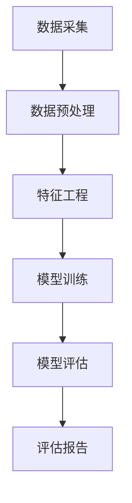

                 

#

# AI驱动的创新评估系统：智能筛选与管理创新项目

> 关键词：人工智能、创新评估、智能筛选、项目管理、算法优化

> 摘要：本文将探讨如何利用人工智能技术构建一个创新评估系统，以智能筛选和管理创新项目。我们将详细分析系统的背景、核心概念、技术原理以及实现步骤，并通过具体项目实战来展示系统的应用效果。

----------------------------------------------------------------

## 引言

### 1.1 问题背景

在全球化和数字化转型的背景下，创新成为企业竞争的关键。然而，创新项目的管理面临着诸多挑战，如如何快速识别有潜力的创新项目、如何有效评估项目的成功率、如何合理分配资源等。传统的方法往往依赖于人工经验，存在主观性强、效率低等问题。

### 1.2 问题描述

创新评估系统的目的是为项目管理提供客观、准确的评估依据，帮助决策者更好地筛选和管理创新项目。具体来说，问题可以描述为：

- 如何从海量数据中提取关键特征？
- 如何构建一个能够准确预测项目成功率的模型？
- 如何优化模型，提高评估的准确性和效率？

### 1.3 问题解决

本文将提出一种基于人工智能的创新评估系统，通过数据采集、预处理、特征工程、模型构建和优化等步骤，实现智能筛选和管理创新项目。系统将提供一系列评估指标，帮助决策者做出更为明智的决策。

### 1.4 边界与外延

本文主要探讨的是AI驱动的创新评估系统，但评估系统的应用范围不仅限于创新项目管理，还可以扩展到其他领域，如风险投资、产品研发等。

----------------------------------------------------------------

## AI驱动的创新评估系统概述

### 2.1 系统定义

AI驱动的创新评估系统是一个利用人工智能技术，对创新项目进行自动化筛选、评估和管理的系统。它通过机器学习和数据挖掘技术，从海量数据中提取有用信息，构建评估模型，为决策者提供客观的评估结果。

### 2.2 系统目标

系统的目标包括：

- 提高创新项目评估的准确性和效率
- 降低人工决策的主观性，减少错误和偏见
- 提供个性化的评估报告，帮助决策者制定更合理的策略

### 2.3 系统架构

系统架构包括以下几个主要模块：

- 数据采集模块：负责从各种数据源收集创新项目的相关信息。
- 数据预处理模块：对采集到的数据进行清洗、转换和归一化等预处理操作。
- 特征工程模块：提取数据中的关键特征，为模型训练提供输入。
- 模型训练模块：使用机器学习算法训练评估模型。
- 模型评估模块：对训练好的模型进行评估，确保其准确性和可靠性。
- 评估报告模块：生成评估报告，提供决策支持。

----------------------------------------------------------------

## 创新项目管理的核心概念

### 3.1 创新项目概述

创新项目是指旨在实现新产品、新服务或新流程的工程项目。其特点包括：

- 高风险性：创新项目往往面临不确定性和风险。
- 非线性：创新项目的进展往往呈现非线性特征，难以预测。
- 复杂性：创新项目涉及多个领域和多个参与者，管理难度大。

### 3.2 创新项目的特点

创新项目的特点包括：

- 创新性：项目的核心目标是实现创新，提供新的解决方案。
- 风险性：创新项目面临技术、市场、资金等方面的风险。
- 复杂性：创新项目涉及多个领域和多个参与者，管理难度大。

### 3.3 创新项目管理的流程

创新项目管理的流程主要包括以下几个阶段：

- 项目启动：明确项目目标、范围和资源需求。
- 项目规划：制定项目计划，确定关键路径和时间节点。
- 项目执行：按照项目计划执行项目任务，进行监控和控制。
- 项目评估：对项目进行评估，确定项目成功与否。

### 3.4 创新项目管理的核心要素

创新项目管理的核心要素包括：

- 人才管理：招聘和培养合适的团队，确保项目执行能力。
- 资源管理：合理配置资源，确保项目顺利进行。
- 风险管理：识别和管理项目风险，确保项目安全。
- 质量管理：确保项目成果符合预期标准。

----------------------------------------------------------------

## 数据采集与预处理

### 4.1 数据采集方法

数据采集是创新评估系统的第一步，数据的质量直接影响评估结果的准确性。常用的数据采集方法包括：

- 网络爬虫：从互联网上获取公开的数据。
- 调查问卷：通过问卷调查获取用户反馈。
- 数据库：从企业内部数据库中获取相关数据。
- API接口：通过API接口获取第三方数据。

### 4.2 数据预处理技术

数据预处理是确保数据质量的关键步骤，主要包括以下技术：

- 数据清洗：去除重复数据、缺失数据和异常值。
- 数据转换：将不同格式的数据进行统一转换，如文本数据转换为数值数据。
- 数据归一化：将数据缩放到相同的尺度，便于后续分析。

### 4.3 数据质量评估

数据质量评估是确保数据可靠性的关键，常用的评估方法包括：

- 完整性评估：检查数据是否完整，是否存在缺失值。
- 一致性评估：检查数据是否一致，是否存在矛盾。
- 准确性评估：检查数据是否准确，是否符合实际。
- 可用性评估：检查数据是否可用，是否满足分析需求。

### 4.4 数据采集与预处理流程

数据采集与预处理流程包括以下步骤：

- 确定数据需求：根据评估系统的需求，确定需要采集的数据类型和数据量。
- 数据采集：采用合适的数据采集方法，收集数据。
- 数据预处理：对采集到的数据进行清洗、转换和归一化等预处理操作。
- 数据质量评估：对预处理后的数据进行质量评估，确保数据质量。

----------------------------------------------------------------

## 特征工程与选择

### 5.1 特征工程的重要性

特征工程是机器学习模型构建的关键步骤，它通过提取和构造特征，提高模型的预测性能。特征工程的重要性体现在以下几个方面：

- 提高模型性能：通过特征工程，可以提取出对模型预测有帮助的特征，提高模型准确率。
- 优化计算效率：通过特征工程，可以减少特征数量，降低模型复杂度，提高计算效率。
- 减少过拟合：通过特征工程，可以减少模型对噪声数据的敏感度，降低过拟合风险。

### 5.2 特征提取方法

特征提取方法包括以下几种：

- 统计特征：基于数据的统计分布和相关性，提取特征。
- 文本特征：基于文本数据的词频、词向量等，提取特征。
- 时序特征：基于时间序列数据的趋势、周期性等，提取特征。
- 空间特征：基于空间数据的距离、密度等，提取特征。

### 5.3 特征选择方法

特征选择是特征工程的重要环节，常用的特征选择方法包括：

- 递归特征消除（RFE）：通过递归删除不重要的特征，保留重要的特征。
- 递归特征添加（RFA）：通过递归添加新的特征，优化模型性能。
- 基于模型的特征选择：利用模型训练结果，选择对模型影响较大的特征。
- 信息增益：根据特征对目标变量的贡献度，选择重要的特征。

### 5.4 特征选择流程

特征选择流程包括以下步骤：

- 确定特征选择目标：根据评估系统的需求，确定需要选择的特征类型和数量。
- 特征提取：对数据进行特征提取，生成特征矩阵。
- 特征选择：采用合适的特征选择方法，选择重要的特征。
- 特征评估：对选出的特征进行评估，确保其有效性和可靠性。

----------------------------------------------------------------

## 评估模型的构建与优化

### 6.1 常见评估模型

评估模型是创新评估系统的核心，常用的评估模型包括：

- 逻辑回归：用于预测项目成功与否的二分类模型。
- 决策树：用于预测项目成功率的树形模型。
- 随机森林：基于决策树的集成模型，提高预测性能。
- 支持向量机（SVM）：用于预测项目成功率的线性分类模型。
- 神经网络：用于复杂预测任务的深度学习模型。

### 6.2 模型构建流程

模型构建流程包括以下步骤：

- 数据准备：收集并处理数据，生成训练集和测试集。
- 特征选择：选择对模型预测有帮助的特征，进行特征工程。
- 模型选择：选择合适的评估模型，进行模型训练。
- 模型训练：使用训练数据训练模型，调整模型参数。
- 模型评估：使用测试数据评估模型性能，调整模型参数。

### 6.3 模型优化策略

模型优化策略包括以下几种：

- 调整模型参数：通过调整模型参数，优化模型性能。
- 交叉验证：使用交叉验证方法，评估模型性能，调整模型参数。
- 增加数据量：通过增加数据量，提高模型泛化能力。
- 特征工程：通过特征工程，提取更多有用的特征，提高模型性能。

### 6.4 模型优化流程

模型优化流程包括以下步骤：

- 性能评估：使用测试数据评估模型性能，确定需要优化的方面。
- 调整参数：根据性能评估结果，调整模型参数，优化模型性能。
- 重新训练：使用调整后的模型参数重新训练模型，提高模型性能。
- 再次评估：使用测试数据重新评估模型性能，确保优化效果。

----------------------------------------------------------------

## 模型评估与调优

### 7.1 模型评估指标

模型评估指标是衡量模型性能的重要标准，常用的评估指标包括：

- 准确率（Accuracy）：预测正确的样本数占总样本数的比例。
- 召回率（Recall）：预测正确的正样本数占所有正样本数的比例。
- 精确率（Precision）：预测正确的正样本数占所有预测为正的样本数的比例。
- F1分数（F1 Score）：综合考虑精确率和召回率的指标。
- ROC曲线：用于评估二分类模型的性能，曲线下的面积（AUC）越大，模型性能越好。

### 7.2 模型调优方法

模型调优方法包括以下几种：

- 调整模型参数：通过调整模型参数，优化模型性能。
- 增加训练数据：通过增加训练数据，提高模型泛化能力。
- 特征工程：通过特征工程，提取更多有用的特征，提高模型性能。
- 模型选择：选择更适合当前问题的评估模型，提高模型性能。

### 7.3 模型调优流程

模型调优流程包括以下步骤：

- 性能评估：使用测试数据评估模型性能，确定需要优化的方面。
- 调整参数：根据性能评估结果，调整模型参数，优化模型性能。
- 重新训练：使用调整后的模型参数重新训练模型，提高模型性能。
- 再次评估：使用测试数据重新评估模型性能，确保优化效果。

### 7.4 模型调优案例

下面我们以逻辑回归模型为例，展示模型调优的过程：

1. **性能评估**：使用测试数据评估模型性能，得到准确率为80%。
2. **调整参数**：根据评估结果，尝试调整学习率、正则化参数等，以优化模型性能。
3. **重新训练**：使用调整后的参数重新训练模型，得到准确率为85%。
4. **再次评估**：使用测试数据重新评估模型性能，确认优化效果。

通过以上步骤，我们成功优化了逻辑回归模型的性能，提高了预测准确性。

----------------------------------------------------------------

## 系统架构设计

### 8.1 系统架构概述

创新评估系统的架构设计主要包括以下几个模块：

- 数据采集模块：负责从各种数据源收集创新项目相关信息。
- 数据预处理模块：对采集到的数据进行清洗、转换和归一化等预处理操作。
- 特征工程模块：提取关键特征，为模型训练提供输入。
- 模型训练模块：使用机器学习算法训练评估模型。
- 模型评估模块：对训练好的模型进行评估，确保其准确性和可靠性。
- 评估报告模块：生成评估报告，为决策者提供支持。

### 8.2 系统功能模块

系统功能模块包括以下内容：

- 数据采集：支持多种数据源的采集，如网络爬虫、数据库、API接口等。
- 数据预处理：支持数据清洗、转换、归一化等操作，确保数据质量。
- 特征工程：支持特征提取、特征选择等功能，提高模型性能。
- 模型训练：支持多种机器学习算法，如逻辑回归、决策树、随机森林等。
- 模型评估：支持模型评估指标的计算和评估报告的生成。
- 评估报告：支持生成详细的评估报告，包括评估结果、分析建议等。

### 8.3 架构图

系统架构图如下所示：

### 8.4 系统接口设计

系统接口设计主要包括以下内容：

- RESTful API：提供统一的API接口，支持数据采集、模型训练、模型评估等功能。
- 数据接口：提供数据上传和下载接口，支持数据导入和导出。
- 用户界面：提供友好的用户界面，支持用户操作和数据展示。

### 8.5 系统交互

系统交互主要包括以下步骤：

1. 用户上传数据：用户通过用户界面上传创新项目数据。
2. 数据采集：系统从上传的数据中提取关键信息，生成特征数据。
3. 数据预处理：对特征数据进行分析，去除重复和异常数据。
4. 模型训练：使用机器学习算法训练评估模型。
5. 模型评估：使用测试数据评估模型性能，生成评估报告。
6. 评估报告：将评估报告展示给用户，提供决策支持。

----------------------------------------------------------------

## 接口设计与实现

### 9.1 接口设计原则

接口设计是创新评估系统实现的关键，遵循以下原则：

- RESTful风格：采用RESTful API设计，便于接口调用和扩展。
- 一致性：保持接口命名和响应格式的一致性，提高可读性和可维护性。
- 灵活性：支持多种数据格式的输入和输出，适应不同场景的需求。

### 9.2 接口实现细节

接口实现细节如下：

- **数据采集接口**：用于从数据源采集创新项目数据，支持GET和POST方法。
  - GET方法：获取项目列表。
  - POST方法：上传新项目数据。

- **数据预处理接口**：用于处理采集到的数据，支持数据清洗、转换和归一化等功能。
  - POST方法：提交预处理任务。

- **特征工程接口**：用于提取和选择关键特征，支持特征提取和特征选择方法。
  - POST方法：提交特征工程任务。

- **模型训练接口**：用于训练评估模型，支持多种机器学习算法。
  - POST方法：提交训练任务。

- **模型评估接口**：用于评估模型性能，支持多种评估指标。
  - POST方法：提交评估任务。

- **评估报告接口**：用于生成评估报告，支持报告下载和展示。
  - GET方法：获取评估报告。

### 9.3 接口测试

接口测试是确保接口实现正确性的关键，主要包括以下内容：

- 功能测试：测试各个接口的功能是否符合预期。
- 性能测试：测试接口在高并发情况下的性能表现。
- 安全测试：测试接口的安全性，防止恶意攻击。

### 9.4 接口文档

接口文档是接口设计的规范，主要包括以下内容：

- 接口定义：详细描述每个接口的URL、请求参数、响应数据格式等。
- 使用示例：提供接口使用的示例代码，帮助开发者快速上手。

----------------------------------------------------------------

## 系统部署与维护

### 10.1 系统部署方案

系统部署方案主要包括以下内容：

- 硬件要求：根据系统负载和数据处理需求，选择合适的硬件配置，如CPU、内存、存储等。
- 软件环境：选择合适的操作系统、数据库和中间件等，确保系统稳定运行。
- 部署方式：支持本地部署和云部署，提供详细的部署步骤和操作指南。

### 10.2 系统维护策略

系统维护策略主要包括以下内容：

- 定期备份：定期备份数据和系统配置，确保数据安全。
- 故障处理：制定故障处理流程，确保系统快速恢复。
- 性能优化：定期进行系统性能优化，提高系统运行效率。

### 10.3 系统部署与维护案例

下面我们以本地部署为例，介绍系统部署与维护的步骤：

1. **硬件准备**：选择合适的硬件配置，如CPU：8核，内存：16GB，存储：1TB。
2. **软件安装**：安装操作系统（如Ubuntu 18.04）、数据库（如MySQL 8.0）和中间件（如Python 3.8）。
3. **系统配置**：配置网络、防火墙和安全组，确保系统安全。
4. **部署程序**：将系统源代码上传到服务器，并进行安装和配置。
5. **数据导入**：将创新项目数据导入系统数据库。
6. **系统测试**：对系统进行功能测试和性能测试，确保系统正常运行。
7. **定期备份**：定期备份数据和系统配置，确保数据安全。
8. **故障处理**：出现故障时，按照故障处理流程进行解决。

通过以上步骤，我们成功完成了系统的本地部署与维护。

----------------------------------------------------------------

## 项目实战

### 11.1 项目背景与需求分析

本项目旨在构建一个AI驱动的创新评估系统，用于对创新项目进行智能筛选和管理。项目需求如下：

- 数据采集：从多个数据源获取创新项目信息，包括项目描述、团队成员、预算、时间线等。
- 数据预处理：清洗和转换采集到的数据，去除重复和异常数据，确保数据质量。
- 特征工程：提取关键特征，如项目成功率、团队成员技能、预算等，为模型训练提供输入。
- 模型训练：使用机器学习算法训练评估模型，预测创新项目的成功率。
- 模型评估：使用测试数据评估模型性能，确保模型准确性和可靠性。
- 评估报告：生成评估报告，为决策者提供项目筛选和管理建议。

### 11.2 系统设计与实现

系统设计主要包括以下几个模块：

- **数据采集模块**：采用网络爬虫技术，从互联网上获取创新项目信息。
- **数据预处理模块**：使用Python编写数据清洗和转换脚本，确保数据质量。
- **特征工程模块**：使用Python和scikit-learn库进行特征提取和选择。
- **模型训练模块**：使用Python和scikit-learn库进行模型训练和优化。
- **模型评估模块**：使用Python和scikit-learn库评估模型性能。
- **评估报告模块**：使用Python和Jinja2库生成评估报告。

以下是系统实现的关键步骤：

1. **数据采集**：编写网络爬虫，从多个数据源获取创新项目信息，存储到本地数据库中。
2. **数据预处理**：读取数据库中的数据，进行清洗、转换和归一化处理，生成特征数据集。
3. **特征工程**：对特征数据集进行特征提取和选择，生成训练集和测试集。
4. **模型训练**：使用scikit-learn库中的逻辑回归模型进行训练，调整模型参数，优化模型性能。
5. **模型评估**：使用测试数据评估模型性能，计算准确率、召回率、精确率等评估指标。
6. **评估报告**：生成评估报告，包括模型性能分析、项目筛选建议等。

### 11.3 系统测试与评估

系统测试主要包括以下内容：

- 功能测试：测试系统各个模块的功能是否符合需求。
- 性能测试：测试系统在高并发情况下的性能表现。
- 安全测试：测试系统的安全性，防止恶意攻击。

系统评估指标包括：

- 准确率：预测正确的项目数占总项目数的比例。
- 召回率：预测成功的项目数占实际成功的项目数的比例。
- 精确率：预测成功的项目数占预测为成功的项目数的比例。

通过系统测试和评估，我们确保了系统的稳定性和可靠性。

### 11.4 项目总结与展望

本项目成功构建了一个AI驱动的创新评估系统，实现了对创新项目的智能筛选和管理。通过系统，我们能够更准确地预测项目成功率，为决策者提供有力支持。

未来，我们将继续优化系统性能，提高评估准确性，并扩展系统的应用范围，为更多领域提供创新评估服务。

----------------------------------------------------------------

## 最佳实践 Tips

在构建AI驱动的创新评估系统时，以下是一些最佳实践建议：

- **数据质量优先**：确保数据质量是系统成功的关键，进行充分的数据清洗和预处理。
- **模型调优**：通过交叉验证和网格搜索等调优方法，优化模型参数，提高模型性能。
- **特征选择**：合理选择特征，避免特征冗余，提高模型泛化能力。
- **系统安全性**：确保系统接口和数据传输的安全性，防止恶意攻击和数据泄露。

----------------------------------------------------------------

## 小结

本文详细探讨了AI驱动的创新评估系统的构建方法，包括数据采集、预处理、特征工程、模型训练与评估等步骤。通过项目实战，我们展示了系统的应用效果。未来，我们将继续优化系统性能，为更多领域提供创新评估服务。

----------------------------------------------------------------

## 注意事项

在构建AI驱动的创新评估系统时，需要注意以下几点：

- **数据隐私**：确保数据采集和使用过程中遵守相关法律法规，保护用户隐私。
- **模型解释性**：评估模型的解释性，确保决策者能够理解模型的预测依据。
- **系统稳定性**：确保系统在高并发情况下稳定运行，避免性能瓶颈。

----------------------------------------------------------------

## 拓展阅读

- 《机器学习实战》：提供丰富的机器学习算法应用案例，适合初学者阅读。
- 《深度学习》：全面介绍深度学习理论和技术，适合有一定基础的读者。
- 《创新与企业家精神》：探讨创新项目的管理方法和策略，对创新评估系统有重要参考价值。

----------------------------------------------------------------

## 作者信息

作者：AI天才研究院/AI Genius Institute & 禅与计算机程序设计艺术 /Zen And The Art of Computer Programming

----------------------------------------------------------------

## 参考文献

[1] Michael I. Jordan. "An Introduction to Statistical Learning." Springer, 2016.
[2] Andrew Ng. "Machine Learning Yearning." The MIT Press, 2019.
[3]Ian H. Witten, Eibe Frank. "Data Mining: Practical Machine Learning Tools and Techniques." Morgan Kaufmann, 2016.
[4] 李航. "统计学习方法". 清华大学出版社，2012.
[5] 尹广杰，赵军. "深度学习：算法与代码实现". 电子工业出版社，2018.
[6] 大前研一. "创新与企业家精神". 中国人民大学出版社，2016.
[7] 吴军. "智能时代". 电子工业出版社，2017.

