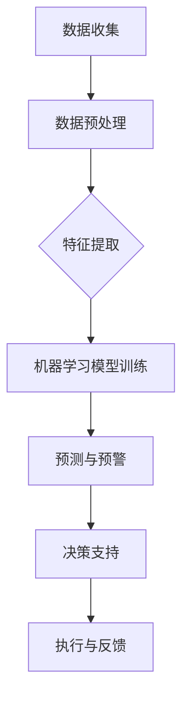
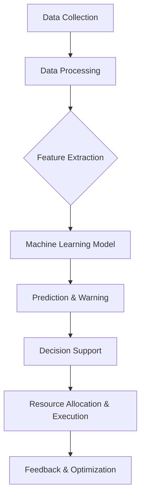
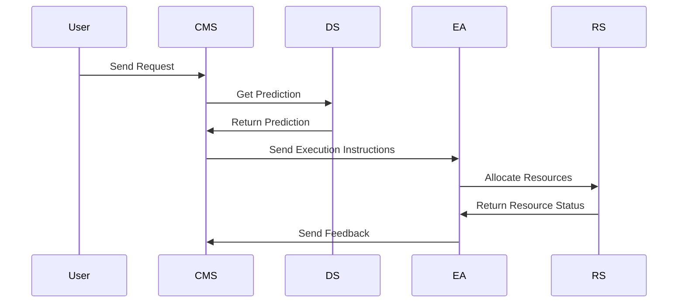
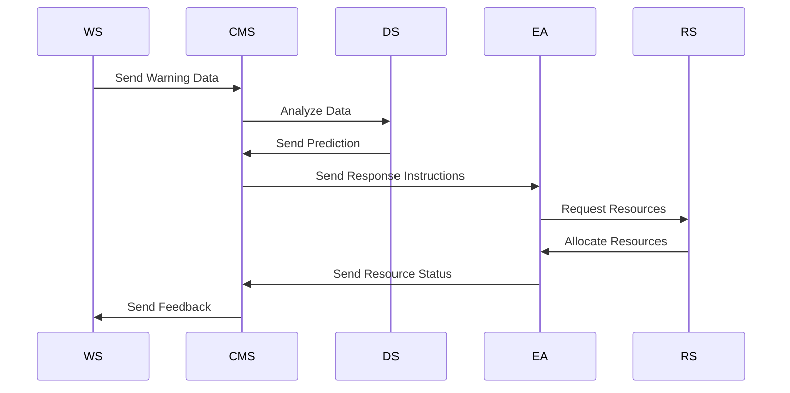

                 


### 背景介绍

#### 关键词

- AI驱动的危机管理
- 快速响应
- 突发事件应对
- 智能化系统

#### 摘要

本文旨在探讨AI驱动的危机管理系统的构建与应用，通过分析突发事件应对的挑战，介绍AI技术的核心概念及其在危机管理中的应用，详细阐述AI驱动的危机管理系统的组成、算法原理、系统设计与实现，并分享实战经验与最佳实践，为提升危机应对能力提供参考。

### 第一部分：背景与核心概念

#### 1.1 问题背景

**引言：危机管理的重要性**

在全球化和信息化的今天，突发事件已成为影响社会稳定和企业运营的重要因素。危机管理不仅关系到企业的生死存亡，也关系到社会的安全和稳定。有效的危机管理需要快速、准确、全面地应对突发事件，减少损失，恢复秩序。

**危机管理的基本概念**

危机管理是指为预防和控制危机事件而采取的一系列策略和措施。它包括危机预防、危机监测、危机响应和危机恢复等环节。

**危机管理面临的挑战**

1. **信息获取和处理**
   - 突发事件发生时，信息量大，来源广泛，如何快速、准确地获取和处理相关信息是危机管理的首要挑战。
2. **决策速度**
   - 危机管理需要快速决策，但突发事件的不确定性和复杂性使得决策变得困难。
3. **资源调配**
   - 危机管理需要调动各种资源，包括人力、物资、资金等，如何高效调配资源是另一个挑战。

#### 1.2 AI在危机管理中的应用

**AI技术的基本原理**

人工智能（AI）是模拟人类智能行为的计算机科学领域，包括机器学习、深度学习、自然语言处理等关键技术。

**AI在危机管理中的应用场景**

1. **信息收集与处理**
   - 利用AI技术，可以快速收集和分析大量信息，提高危机管理的效率。
2. **预警系统**
   - 基于AI的预警系统可以提前识别潜在危机，提高危机预防能力。
3. **智能决策支持**
   - AI技术可以帮助决策者快速分析数据，提供决策支持，提高决策准确性。

**AI的优势与局限性**

**优势：**
1. **高效处理海量数据**
2. **提高决策速度和准确性**
3. **自动化执行任务**

**局限性：**
1. **依赖数据质量**
2. **算法透明度和可解释性**
3. **技术成熟度和应用范围**

#### 1.3 AI驱动的危机管理系统的组成

**系统架构概述**

AI驱动的危机管理系统通常由数据收集模块、数据分析模块、预警模块、决策支持模块和执行模块等组成。

**关键组件介绍**

1. **数据收集模块**
   - 负责收集各类信息，如天气数据、交通数据、社会舆情等。
2. **数据分析模块**
   - 利用AI算法对收集的数据进行分析和处理，提取有用信息。
3. **预警模块**
   - 基于分析结果，生成预警信息，提醒决策者采取行动。
4. **决策支持模块**
   - 提供决策支持，帮助决策者制定应对策略。
5. **执行模块**
   - 负责执行决策，包括资源调配、任务分配等。

#### 1.4 核心概念与联系

**AI算法原理对比表格**

| 算法名称 | 原理 | 优点 | 缺点 |
| --- | --- | --- | --- |
| 机器学习 | 通过学习数据特征来预测未知数据 | 自动化决策，高效处理数据 | 需要大量数据，算法透明度低 |
| 深度学习 | 基于多层神经网络进行数据处理 | 高效处理复杂数据，自适应性强 | 计算资源消耗大，训练时间长 |
| 自然语言处理 | 对自然语言文本进行理解和生成 | 支持多种语言，应用广泛 | 需要大量训练数据和算力 |

**ER实体关系图架构**

```mermaid
erDiagram
  Person ||--|{ Crisis } : has
  Crisis ||--|{ Response } : is
  Response ||--|{ Resource } : uses
```

### 第二部分：算法原理讲解

#### 2.1 算法原理

**算法流程图**



**数学模型和公式**

$$
预测值 = f(W \cdot X + b)
$$

其中，$W$ 为权重矩阵，$X$ 为输入特征，$b$ 为偏置项，$f$ 为激活函数。

#### 2.2 Python源代码讲解

**Python源代码实现**

```python
# 导入所需的库
import numpy as np

# 初始化权重和偏置
weights = np.random.rand(3, 1)
bias = np.random.rand(1)

# 定义激活函数
def sigmoid(x):
    return 1 / (1 + np.exp(-x))

# 计算预测值
def predict(x):
    z = np.dot(x, weights) + bias
    return sigmoid(z)

# 测试
x = np.array([0.5, 0.5])
print(predict(x))
```

**算法原理详细讲解**

该示例使用简单的线性回归模型进行预测。数据经过预处理后，输入到模型中，通过权重矩阵和偏置项计算得到预测值。激活函数（sigmoid函数）用于将线性模型转换为非线性模型，提高模型的泛化能力。

**通俗易懂的举例说明**

假设我们有一个简单的危机管理任务，需要预测某个地区是否会发生自然灾害。输入特征可以是该地区的降雨量、气温等。通过训练模型，我们可以预测未来一段时间内该地区是否会发生自然灾害。如果预测结果为正，则预警系统会提醒决策者采取预防措施。

### 第三部分：系统分析与架构设计方案

#### 3.1 问题场景介绍

**场景描述**

假设我们开发一个城市危机管理系统，用于应对地震等自然灾害。系统需要实时监测地震预警数据，分析地震发生的可能性，并生成相应的应对策略。

**项目背景**

随着城市化进程的加快，地震等自然灾害的频率和破坏力逐渐增大。如何快速、准确地应对地震灾害，减少人员伤亡和财产损失，成为了一个亟待解决的问题。

#### 3.2 系统功能设计

**领域模型类图**

```mermaid
classDiagram
  CrisisManagementSystem
  WeatherStation
  EmergencyResponse
  ResourceAllocation
  WarningSystem
  DecisionSupport
  ExecutionModule

  CrisisManagementSystem --|{ WeatherStation } : monitors
  CrisisManagementSystem --|{ EmergencyResponse } : coordinates
  CrisisManagementSystem --|{ ResourceAllocation } : manages
  CrisisManagementSystem --|{ WarningSystem } : alerts
  CrisisManagementSystem --|{ DecisionSupport } : assists
  CrisisManagementSystem --|{ ExecutionModule } : executes
```

**系统功能概述**

1. **数据收集与处理**：实时监测地震预警数据，包括震中位置、震级、预测到达时间等。
2. **预警系统**：根据预警数据，生成地震预警信息，并通知相关部门和民众。
3. **决策支持**：提供地震应对策略，包括疏散路线、避难场所、救援物资等。
4. **执行与反馈**：执行决策，跟踪执行情况，并收集反馈信息，用于优化系统。

#### 3.3 系统架构设计

**系统架构图**



**系统架构设计思路**

系统采用模块化设计，各个模块独立开发，通过接口进行通信。数据收集模块负责实时获取地震预警数据，数据预处理模块对数据进行清洗和转换，特征提取模块提取关键特征，机器学习模型模块进行预测，预警系统模块生成预警信息，决策支持模块提供应对策略，资源分配与执行模块负责执行策略，反馈模块收集执行情况，并用于系统优化。

#### 3.4 系统接口设计

**系统接口图**



**接口设计原则**

1. **标准化**：使用统一的接口规范，确保模块之间的兼容性和可扩展性。
2. **高效性**：接口设计要保证数据传输的高效性，减少网络延迟。
3. **安全性**：确保数据传输的安全性，防止数据泄露和攻击。

#### 3.5 系统交互

**系统交互序列图**



**系统交互流程**

1. **数据收集**：地震预警数据通过气象站（WS）发送到危机管理系统（CMS）。
2. **数据分析**：CMS将数据发送到数据分析模块（DS），进行数据分析和预测。
3. **预警与决策**：DS将预测结果发送回CMS，CMS根据预测结果生成预警信息，并发送响应指令。
4. **资源分配与执行**：响应指令发送到执行模块（EA），EA根据指令请求资源，资源分配模块（RS）分配资源。
5. **反馈与优化**：执行情况通过EA反馈给CMS，CMS根据反馈信息进行系统优化。

### 第四部分：项目实战

#### 4.1 环境安装

**环境搭建步骤**

1. 安装Python环境
2. 安装机器学习库（如scikit-learn、TensorFlow等）
3. 安装数据预处理库（如pandas、numpy等）
4. 配置数据源和数据库（如MySQL、PostgreSQL等）

**可能遇到的问题及解决方案**

1. **Python版本问题**：确保安装的Python版本与所需的库兼容。
2. **库安装失败**：尝试使用不同的安装方法（如使用pip或conda安装）。

#### 4.2 系统核心实现

**核心代码实现**

```python
# 导入所需的库
import numpy as np
import pandas as pd
from sklearn.ensemble import RandomForestClassifier
from sklearn.model_selection import train_test_split

# 读取数据
data = pd.read_csv('earthquake_data.csv')
X = data.drop(['target'], axis=1)
y = data['target']

# 数据预处理
X_train, X_test, y_train, y_test = train_test_split(X, y, test_size=0.2, random_state=42)

# 构建模型
model = RandomForestClassifier(n_estimators=100, random_state=42)

# 训练模型
model.fit(X_train, y_train)

# 预测
predictions = model.predict(X_test)

# 评估模型
accuracy = model.score(X_test, y_test)
print(f'Accuracy: {accuracy:.2f}')
```

**代码应用解读与分析**

1. **数据读取与预处理**：使用pandas库读取地震数据，并进行数据预处理，将数据分为特征和标签。
2. **模型构建与训练**：使用随机森林算法构建模型，并使用训练集进行训练。
3. **预测与评估**：使用测试集进行预测，并评估模型的准确性。

#### 4.3 实际案例分析与讲解

**案例概述**

假设某地区发生地震，我们需要预测地震的发生，并生成相应的预警信息。

**案例分析与讲解**

1. **数据收集**：通过气象站（WS）收集地震预警数据，包括震中位置、震级、预测到达时间等。
2. **数据分析**：将预警数据发送到数据分析模块（DS），进行数据分析和预测。
3. **预警与决策**：DS将预测结果发送回CMS，CMS根据预测结果生成预警信息，并发送响应指令。
4. **资源分配与执行**：响应指令发送到执行模块（EA），EA根据指令请求资源，资源分配模块（RS）分配资源。
5. **反馈与优化**：执行情况通过EA反馈给CMS，CMS根据反馈信息进行系统优化。

#### 4.4 项目小结

**项目总结**

本项目通过AI技术构建了城市危机管理系统，实现了地震预警和响应功能。项目成功的关键在于数据的收集与处理、模型的构建与训练、系统的设计与实现。

**最佳实践 tips**

1. **数据质量**：确保数据的准确性和完整性，对数据进行严格清洗和预处理。
2. **模型评估**：使用多种评估指标，如准确率、召回率、F1分数等，对模型进行评估和优化。
3. **系统优化**：根据实际应用情况，不断优化系统性能和功能，提高危机应对能力。

### 第五部分：总结与拓展

#### 5.1 小结

本文详细介绍了AI驱动的危机管理系统的构建与应用，包括系统设计、算法原理、实现方法等。通过实际案例，展示了系统的实战应用效果。AI驱动的危机管理系统在提升危机应对能力、减少损失方面具有显著优势。

#### 5.2 拓展阅读

**相关书籍推荐**

1. 《深度学习》 - Ian Goodfellow、Yoshua Bengio、Aaron Courville
2. 《机器学习》 - 周志华

**学术论文推荐**

1. "Deep Learning for Natural Disaster Detection and Mitigation" - IEEE Transactions on Geoscience and Remote Sensing
2. "An Intelligent Urban Emergency Management System Based on Big Data and Cloud Computing" - Journal of Information Technology and Economic Management

**在线资源推荐**

1. Kaggle：提供丰富的数据集和竞赛，有助于了解和掌握AI技术。
2. Coursera、edX：提供高质量的在线课程，涵盖AI、数据科学等领域。

### 作者信息

作者：AI天才研究院/AI Genius Institute & 禅与计算机程序设计艺术 /Zen And The Art of Computer Programming

