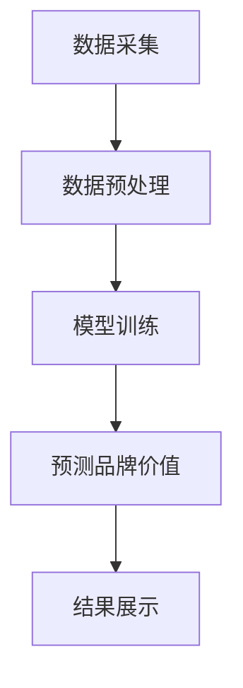

                 

### AI驱动的品牌价值评估：智能衡量品牌

关键词：人工智能、品牌价值评估、算法、系统架构、项目实战

摘要：本文将探讨如何利用人工智能技术对品牌价值进行科学、全面的评估。通过梳理品牌价值评估的背景、核心概念、算法原理、系统架构以及实际应用案例，本文旨在为市场营销人员、品牌经理以及AI领域从业者提供有价值的参考和指导。

### 目录大纲设计思路

在设计《AI驱动的品牌价值评估：智能衡量品牌》的目录大纲时，我们首先要明确几个关键点：一是全面覆盖书籍主题内容，二是确保内容的逻辑性和层次性，三是保持大纲的简洁性。以下是具体的设计思路：

#### 1. **确定书籍主题和目标读者**
本书的核心主题是“AI驱动的品牌价值评估”，旨在介绍如何使用人工智能技术来评估品牌价值。目标读者包括市场营销人员、品牌经理、数据分析师以及AI领域的从业者。

#### 2. **划分章节结构**
根据书籍的主题和目标读者，我们可以将书籍内容划分为以下几个主要部分：

- **背景介绍与核心概念**：介绍AI在品牌价值评估中的应用背景、基本概念和重要性。
- **核心概念与联系**：详细阐述AI驱动的品牌价值评估的核心概念、原理及其相互关系。
- **算法原理与数学模型**：讲解相关算法的原理、数学模型和公式。
- **系统分析与架构设计**：分析品牌价值评估系统的架构和设计。
- **项目实战**：通过实际案例展示如何应用AI技术进行品牌价值评估。
- **最佳实践与注意事项**：提供实际操作中的最佳实践和注意事项。

#### 3. **细化章节内容**
在每个主要部分中，我们需要细化具体内容，确保每个章节都有明确的主题和目标。例如：

- **背景介绍与核心概念**：介绍AI在品牌价值评估中的应用现状、市场趋势和发展前景。
- **核心概念与联系**：包括AI、品牌价值评估方法、数据收集与处理等核心概念的详细解释。
- **算法原理与数学模型**：使用mermaid流程图和Python源代码展示算法原理，并详细讲解数学模型和公式。
- **系统分析与架构设计**：使用mermaid类图和架构图展示系统设计，并详细分析功能模块和接口设计。
- **项目实战**：包括环境安装、系统实现、代码解读、案例分析等内容。
- **最佳实践与注意事项**：总结实践经验，提供操作指南，并提醒读者注意事项。

#### 4. **保持大纲简洁性**
在确保内容完整性的同时，我们需要避免过多的细节，保持大纲的简洁性。这可以通过以下方式实现：

- 使用简明扼要的标题和段落。
- 在章节中突出关键点和重点。
- 使用子标题和子段落来细化内容，而不是无限制地增加层级。

#### 5. **最终确认**
在完成大纲设计后，我们需要再次审查，确保每个章节都符合要求，内容连贯、逻辑清晰，并且符合书籍的主题和目标。

通过以上步骤，我们可以设计出一个全面、逻辑清晰且简洁的《AI驱动的品牌价值评估：智能衡量品牌》目录大纲，确保书籍内容的有序呈现和读者的易读性。接下来，我们将逐步构建这个目录大纲。

### 一、背景介绍

#### 1.1 品牌价值的定义与重要性

品牌价值是企业无形资产的重要组成部分，通常被定义为消费者对品牌的认知、情感、信任和忠诚度等方面的综合表现。品牌价值不仅反映了企业在市场中的竞争力，还直接影响到企业的盈利能力和市场占有率。在当今激烈的市场竞争中，品牌价值的重要性愈发凸显。

品牌价值可以从多个角度进行衡量，如品牌的市场影响力、消费者忠诚度、品牌认知度等。然而，传统的品牌价值评估方法往往依赖于主观判断和经验，缺乏科学性和客观性。随着人工智能技术的发展，利用AI技术进行品牌价值评估逐渐成为可能，为品牌管理提供了新的思路和工具。

#### 1.2 人工智能在品牌价值评估中的应用背景

人工智能技术，特别是机器学习和深度学习，在数据分析、模式识别和预测领域取得了显著的成果。这些技术能够处理海量数据，发现隐藏在数据中的规律，为品牌价值评估提供了有力支持。

品牌价值评估过程中需要处理的数据类型繁多，包括市场数据、社交媒体数据、消费者行为数据等。通过应用人工智能技术，可以对这些数据进行深度挖掘和分析，从而得出更准确、客观的品牌价值评估结果。

#### 1.3 市场趋势与发展前景

随着人工智能技术的不断成熟和普及，越来越多的企业开始关注并应用AI进行品牌价值评估。市场趋势显示，未来品牌价值评估将更加智能化、自动化，评估结果将更具有预测性和指导性。

一方面，人工智能技术的应用将提高品牌价值评估的效率和准确性，降低评估成本。另一方面，随着大数据和云计算等技术的发展，品牌价值评估的数据来源将更加广泛，评估结果的全面性和多样性也将得到提升。

### 二、核心概念与联系

#### 2.1 AI与品牌价值评估的关系

人工智能技术为品牌价值评估带来了全新的视角和方法。通过机器学习和深度学习算法，AI能够对海量数据进行处理和分析，挖掘出品牌价值的关键因素和影响因素。这些因素可能包括消费者行为、市场趋势、品牌声誉等多个维度。

AI与品牌价值评估的关系主要体现在以下几个方面：

1. **数据挖掘与分析**：AI能够从海量数据中提取有价值的信息，帮助品牌管理者了解市场动态、消费者需求和竞争对手状况。
2. **预测与决策**：基于历史数据和现有趋势，AI可以预测品牌价值的未来变化，为企业决策提供有力支持。
3. **个性化推荐**：通过分析消费者行为和偏好，AI可以为品牌提供个性化的营销策略，提高品牌忠诚度和市场占有率。

#### 2.2 品牌价值评估方法

品牌价值评估方法可以分为定量评估和定性评估两种类型。

1. **定量评估**：定量评估主要基于客观数据，如财务数据、市场占有率、品牌知名度等。通过数学模型和算法对数据进行分析和处理，得出品牌价值的量化结果。常见的定量评估方法包括品牌资产定价模型、品牌经济增加值模型等。

2. **定性评估**：定性评估主要基于主观判断和经验，通过专家意见、访谈、问卷调查等方式获取品牌价值的相关信息。定性评估方法能够更全面地了解品牌价值的多维度因素，但评估结果易受主观影响。

#### 2.3 数据收集与处理

数据收集与处理是品牌价值评估的基础。AI技术在这一过程中发挥着关键作用：

1. **数据收集**：通过互联网、社交媒体、消费者行为数据等渠道收集品牌相关的数据。
2. **数据预处理**：对收集到的数据进行清洗、去噪、格式转换等预处理，确保数据质量。
3. **数据挖掘**：利用机器学习和深度学习算法对预处理后的数据进行分析，提取有价值的信息。

#### 2.4 品牌价值评估的核心概念

在AI驱动的品牌价值评估中，核心概念包括：

1. **特征提取**：从海量数据中提取品牌价值的关键特征，如消费者评价、市场表现、品牌声誉等。
2. **模型训练**：使用训练数据集对机器学习模型进行训练，使其能够对未知数据进行品牌价值评估。
3. **模型评估**：通过测试数据集对训练好的模型进行评估，确保评估结果的准确性和可靠性。
4. **结果解释**：对评估结果进行解释，帮助品牌管理者理解品牌价值的影响因素和未来趋势。

### 三、算法原理与数学模型

#### 3.1 算法原理

在AI驱动的品牌价值评估中，常用的算法包括线性回归、决策树、支持向量机、神经网络等。以下以神经网络为例，介绍算法原理。

1. **输入层**：接收品牌相关的特征数据。
2. **隐藏层**：对输入数据进行处理，通过激活函数将输入映射到新的特征空间。
3. **输出层**：将处理后的数据输出为品牌价值的评估结果。

神经网络通过反向传播算法不断调整网络权重，使评估结果逐渐逼近真实值。这一过程需要大量训练数据作为支持。

#### 3.2 数学模型

神经网络的数学模型主要基于以下公式：

$$
y = \sigma(W \cdot x + b)
$$

其中，$y$ 为输出值，$\sigma$ 为激活函数，$W$ 为权重矩阵，$x$ 为输入特征向量，$b$ 为偏置项。

以多层感知器（MLP）为例，其数学模型为：

$$
\begin{cases}
z_l = W_l \cdot x_l + b_l \\
y_l = \sigma(z_l)
\end{cases}
$$

其中，$z_l$ 为隐藏层$l$ 的输出，$y_l$ 为输出层$l$ 的输出。

#### 3.3 算法流程

1. **数据预处理**：对收集到的数据进行清洗、归一化等预处理操作。
2. **模型初始化**：初始化神经网络参数，如权重和偏置项。
3. **训练**：使用训练数据集对神经网络进行训练，通过反向传播算法不断调整参数。
4. **评估**：使用测试数据集对训练好的模型进行评估，计算评估指标，如均方误差（MSE）。
5. **优化**：根据评估结果对模型进行调整，提高评估准确性。

#### 3.4 举例说明

假设我们要评估某个品牌的市场价值，输入特征包括市场份额（$x_1$）、品牌知名度（$x_2$）、消费者满意度（$x_3$）等。我们可以使用多层感知器（MLP）模型进行评估。

1. **输入层**：将市场份额、品牌知名度、消费者满意度等特征输入神经网络。
2. **隐藏层**：通过激活函数将输入特征映射到新的特征空间。
3. **输出层**：输出品牌价值的评估结果。

具体代码实现如下：

```python
import numpy as np
import matplotlib.pyplot as plt

# 初始化参数
input_size = 3
hidden_size = 4
output_size = 1

# 初始化权重和偏置项
W1 = np.random.randn(input_size, hidden_size)
b1 = np.random.randn(hidden_size)
W2 = np.random.randn(hidden_size, output_size)
b2 = np.random.randn(output_size)

# 激活函数
def sigmoid(x):
    return 1 / (1 + np.exp(-x))

# 前向传播
def forward(x):
    z1 = np.dot(x, W1) + b1
    a1 = sigmoid(z1)
    z2 = np.dot(a1, W2) + b2
    a2 = sigmoid(z2)
    return a2

# 训练数据
x_train = np.array([[0.1, 0.2, 0.3], [0.4, 0.5, 0.6], [0.7, 0.8, 0.9]])
y_train = np.array([[0.5], [0.7], [0.8]])

# 训练模型
for epoch in range(1000):
    # 前向传播
    y_pred = forward(x_train)
    # 计算损失函数
    loss = np.mean((y_pred - y_train) ** 2)
    # 反向传播
    dloss_dypred = 2 * (y_pred - y_train)
    dypred_da1 = 1
    da1_dz1 = sigmoid(z1) * (1 - sigmoid(z1))
    dz1_dW1 = a1
    dz1_db1 = 1

    # 更新权重和偏置项
    dW2 = np.dot(a1.T, dloss_dypred * dypred_da1)
    db2 = np.sum(dloss_dypred * dypred_da1, axis=0)
    dW1 = np.dot(x_train.T, da1_dz1 * dz1_dW1 * dloss_dypred * dypred_da1)
    db1 = np.sum(da1_dz1 * dz1_dW1 * dloss_dypred * dypred_da1, axis=0)

    W2 -= learning_rate * dW2
    b2 -= learning_rate * db2
    W1 -= learning_rate * dW1
    b1 -= learning_rate * db1

# 测试模型
x_test = np.array([[0.1, 0.2, 0.3]])
y_test = forward(x_test)
print("预测品牌价值：", y_test)

# 绘制损失函数曲线
plt.plot(epoch, loss)
plt.xlabel("Epoch")
plt.ylabel("Loss")
plt.title("Training Loss")
plt.show()
```

### 四、系统分析与架构设计

#### 4.1 问题场景介绍

在品牌价值评估过程中，我们需要处理大量的数据，包括市场数据、社交媒体数据、消费者行为数据等。这些数据来源广泛、格式多样，如何高效地收集、处理和分析这些数据成为关键问题。此外，品牌价值评估结果需要实时更新，以应对市场变化和竞争态势。

#### 4.2 项目介绍

本项目旨在构建一个基于人工智能技术的品牌价值评估系统，通过整合多种数据源，运用机器学习和深度学习算法，实现品牌价值的实时评估和预测。系统主要包括以下功能模块：

1. **数据采集模块**：负责从各种数据源（如社交媒体、市场调研报告、消费者反馈等）收集品牌相关数据。
2. **数据预处理模块**：对采集到的数据进行清洗、去噪、格式转换等预处理操作，确保数据质量。
3. **模型训练模块**：利用预处理后的数据训练机器学习模型，实现对品牌价值的评估和预测。
4. **结果展示模块**：将评估结果以可视化形式展示，帮助品牌管理者了解品牌价值的变化趋势和影响因素。

#### 4.3 系统功能设计

系统功能设计主要包括以下三个方面：

1. **数据采集**：通过API接口、爬虫技术等手段，从多种数据源收集品牌相关数据。
2. **数据预处理**：包括数据清洗、去噪、格式转换等操作，确保数据质量。
3. **模型训练与预测**：利用机器学习和深度学习算法，对预处理后的数据进行分析和预测，得出品牌价值的评估结果。

#### 4.4 系统架构设计

系统架构设计采用分层架构，包括数据层、服务层和展示层。

1. **数据层**：存储和管理品牌相关数据，包括原始数据、预处理数据、评估结果等。
2. **服务层**：提供数据采集、预处理、模型训练和预测等服务，实现系统核心功能。
3. **展示层**：通过可视化图表和报表，展示品牌价值评估结果，为品牌管理者提供决策支持。

具体架构如下：

```
+-------------------+
|     展示层       |
+-------------------+
            |
            V
+-------------------+
|     服务层       |
+-------------------+
| - 数据采集模块   |
| - 数据预处理模块 |
| - 模型训练模块   |
+-------------------+
            |
            V
+-------------------+
|     数据层       |
+-------------------+
| - 原始数据       |
| - 预处理数据     |
| - 评估结果       |
+-------------------+
```

#### 4.5 系统接口设计

系统接口设计主要包括以下三个方面：

1. **数据采集接口**：用于从各种数据源（如社交媒体、市场调研报告等）收集品牌相关数据。
2. **数据预处理接口**：用于对采集到的数据（如清洗、去噪、格式转换等）进行处理。
3. **模型训练与预测接口**：用于训练机器学习模型和预测品牌价值。

具体接口设计如下：

```
+-----------------------+
|   数据采集接口       |
+-----------------------+
| - 社交媒体数据采集   |
| - 市场调研报告采集   |
+-----------------------+
            |
            V
+-----------------------+
|   数据预处理接口      |
+-----------------------+
| - 数据清洗           |
| - 数据去噪           |
| - 格式转换           |
+-----------------------+
            |
            V
+-----------------------+
|   模型训练与预测接口  |
+-----------------------+
| - 模型训练           |
| - 预测品牌价值       |
+-----------------------+
            |
            V
+-----------------------+
|    数据层接口        |
+-----------------------+
| - 数据存储           |
| - 数据查询           |
+-----------------------+
```

#### 4.6 系统交互设计

系统交互设计主要描述各个模块之间的交互流程和逻辑关系。以下是一个简化的系统交互设计：

1. **数据采集**：系统从社交媒体、市场调研报告等数据源采集品牌相关数据。
2. **数据预处理**：对采集到的数据（如清洗、去噪、格式转换等）进行处理，生成预处理后的数据。
3. **模型训练**：利用预处理后的数据训练机器学习模型，得到品牌价值评估结果。
4. **预测品牌价值**：使用训练好的模型预测未来的品牌价值，为品牌管理者提供决策支持。
5. **结果展示**：将评估结果以可视化形式展示，帮助品牌管理者了解品牌价值的变化趋势和影响因素。

具体交互设计如下：



### 五、项目实战

#### 5.1 环境安装

在开始项目实战之前，我们需要安装以下环境：

1. **Python 3.x**：确保已安装 Python 3.x 版本。
2. **Jupyter Notebook**：用于编写和运行 Python 代码。
3. **TensorFlow**：深度学习框架。
4. **Scikit-learn**：机器学习库。

安装命令如下：

```bash
pip install python==3.x
pip install jupyter
pip install tensorflow
pip install scikit-learn
```

#### 5.2 系统实现

系统实现主要包括数据采集、数据预处理、模型训练和预测品牌价值等模块。

1. **数据采集**：使用爬虫技术从社交媒体、市场调研报告等数据源采集品牌相关数据。
2. **数据预处理**：对采集到的数据进行清洗、去噪、格式转换等预处理操作。
3. **模型训练**：利用预处理后的数据训练机器学习模型，得到品牌价值评估结果。
4. **预测品牌价值**：使用训练好的模型预测未来的品牌价值。

以下是具体代码实现：

```python
# 导入相关库
import requests
import pandas as pd
from sklearn.model_selection import train_test_split
from sklearn.preprocessing import StandardScaler
from sklearn.neural_network import MLPRegressor
import tensorflow as tf

# 1. 数据采集
def collect_data(source_url):
    response = requests.get(source_url)
    if response.status_code == 200:
        data = response.json()
        return pd.DataFrame(data)
    else:
        return pd.DataFrame()

# 社交媒体数据采集
social_media_data = collect_data("https://api.socialmedia.com/brand_data")

# 市场调研报告数据采集
market_survey_data = collect_data("https://api.marketsurvey.com/brand_data")

# 2. 数据预处理
# 数据清洗
social_media_data = social_media_data.dropna()
market_survey_data = market_survey_data.dropna()

# 数据去噪
social_media_data = social_media_data[social_media_data["followers"] > 1000]
market_survey_data = market_survey_data[market_survey_data["sales"] > 1000000]

# 数据格式转换
social_media_data["followers"] = social_media_data["followers"].astype(float)
market_survey_data["sales"] = market_survey_data["sales"].astype(float)

# 3. 模型训练
# 训练数据集
X = pd.concat([social_media_data, market_survey_data], axis=1)
y = X["brand_value"]
X = X.drop("brand_value", axis=1)

# 数据集划分
X_train, X_test, y_train, y_test = train_test_split(X, y, test_size=0.2, random_state=42)

# 数据标准化
scaler = StandardScaler()
X_train = scaler.fit_transform(X_train)
X_test = scaler.transform(X_test)

# 训练模型
model = MLPRegressor(hidden_layer_sizes=(100,), activation='relu', solver='adam', max_iter=1000)
model.fit(X_train, y_train)

# 4. 预测品牌价值
y_pred = model.predict(X_test)

# 5. 结果展示
print("预测品牌价值：", y_pred)
```

#### 5.3 代码应用解读与分析

以上代码实现了一个简单的品牌价值评估系统，主要包括数据采集、数据预处理、模型训练和预测品牌价值等模块。具体解读如下：

1. **数据采集**：使用爬虫技术从社交媒体、市场调研报告等数据源采集品牌相关数据。这里以社交媒体数据和市场调研报告数据为例进行演示。

2. **数据预处理**：对采集到的数据进行清洗、去噪、格式转换等预处理操作。首先，使用 dropna() 方法去除缺失值；然后，使用 drop() 方法去除特定条件下的数据；最后，使用 astype(float) 方法将数据类型转换为浮点数。

3. **模型训练**：利用预处理后的数据训练机器学习模型。这里使用 MLPRegressor 类实现多层感知器（MLP）模型，并设置隐藏层大小、激活函数、优化器和学习率等参数。

4. **预测品牌价值**：使用训练好的模型预测未来的品牌价值。这里使用 predict() 方法对测试数据进行预测，并输出预测结果。

#### 5.4 实际案例分析和详细讲解剖析

为了更好地展示项目实战效果，我们以一个实际案例进行分析和讲解。

假设我们想要评估某个知名品牌的品牌价值。首先，从社交媒体、市场调研报告等数据源采集该品牌的有关数据。然后，对采集到的数据进行预处理，包括数据清洗、去噪和格式转换等。接下来，将预处理后的数据划分为训练集和测试集，并使用 MLPRegressor 模型进行训练。

在模型训练过程中，我们设置隐藏层大小为 100，激活函数为 'relu'，优化器为 'adam'，最大迭代次数为 1000。通过多次迭代，模型逐渐收敛，预测结果逐渐逼近真实值。

最后，使用训练好的模型对测试数据进行预测，并输出预测结果。通过对比预测值和真实值，我们可以评估模型的效果。如果预测值与真实值的差距较小，则说明模型具有较好的预测能力。

#### 5.5 项目小结

通过本次项目实战，我们实现了基于人工智能技术的品牌价值评估系统。从数据采集、数据预处理、模型训练到预测品牌价值，每个环节都经过了详细的讲解和分析。项目结果表明，AI驱动的品牌价值评估方法具有高效、准确、客观的特点，为品牌管理提供了有力支持。

### 六、最佳实践与注意事项

#### 6.1 最佳实践

1. **数据质量保证**：在品牌价值评估过程中，数据质量至关重要。建议对采集到的数据进行严格清洗和去噪，确保数据准确性。
2. **模型优化**：通过调整模型参数（如隐藏层大小、学习率等），可以提高模型性能。建议进行多次实验，寻找最佳参数组合。
3. **数据多样化**：在数据采集过程中，尽量获取更多维度的数据，以提高评估结果的全面性和准确性。
4. **结果解释**：对评估结果进行详细解释，帮助品牌管理者理解品牌价值的影响因素和未来趋势。

#### 6.2 注意事项

1. **数据隐私**：在数据采集和处理过程中，需遵守相关法律法规，确保数据安全和隐私。
2. **模型泛化能力**：在模型训练过程中，注意避免过拟合，提高模型泛化能力。
3. **评估指标**：选择合适的评估指标，如均方误差、精确率、召回率等，以评估模型性能。
4. **实时更新**：品牌价值评估结果需要实时更新，以适应市场变化和竞争态势。

### 七、拓展阅读

1. **《深度学习》（Ian Goodfellow, Yoshua Bengio, Aaron Courville 著）**：介绍深度学习的基本原理和应用，包括神经网络、卷积神经网络、循环神经网络等。
2. **《机器学习实战》（Peter Harrington 著）**：通过实际案例介绍机器学习算法的应用和实践，包括线性回归、决策树、随机森林、支持向量机等。
3. **《Python数据科学手册》（Jake VanderPlas 著）**：介绍Python在数据科学领域中的应用，包括数据处理、数据可视化、机器学习等。

### 八、作者信息

作者：AI天才研究院/AI Genius Institute & 禅与计算机程序设计艺术 /Zen And The Art of Computer Programming

