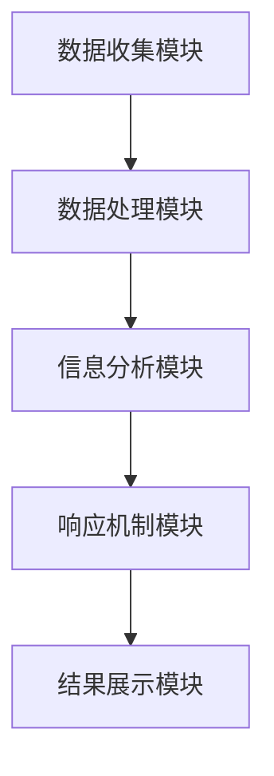

                 

# AI驱动的声誉监控系统：实时把握品牌形象

## 关键词：AI，声誉监控，品牌形象，自然语言处理，机器学习

## 摘要：

在数字时代，品牌的声誉对企业至关重要。AI驱动的声誉监控系统通过高效的数据收集、处理、分析和响应机制，帮助企业在互联网上实时监测品牌形象，及时应对负面信息。本文将深入探讨AI驱动的声誉监控系统的工作原理、实现方法及其在实践中的应用。

## 第一部分：引言

### 1.1 问题背景

随着社交媒体和网络媒体的迅速发展，品牌声誉的传播速度和影响力日益增大。一个负面的评论或报道可能会迅速在互联网上扩散，对品牌造成严重的损害。因此，实时监控品牌声誉，及时应对负面信息，成为企业管理和品牌建设中的重要任务。

### 1.2 问题描述

AI驱动的声誉监控系统需要处理海量的互联网数据，从中提取与品牌相关的信息，并实时分析这些信息的情感倾向和影响力。这是一个复杂的任务，涉及到数据收集、处理、分析和响应等多个环节。

### 1.3 问题解决

构建一个高效的AI驱动的声誉监控系统，需要综合运用自然语言处理、机器学习、数据挖掘等技术。通过这些技术的结合，系统能够准确理解和分析用户评论、新闻报道等，以便及时发现问题并采取措施。

### 1.4 边界与外延

本文主要探讨AI驱动的声誉监控系统在企业中的应用，但相关技术原理和方法同样适用于其他领域的声誉管理。

### 1.5 概念结构与核心要素组成

AI驱动的声誉监控系统主要包括以下几个核心要素：

1. 数据收集：从互联网上获取与品牌相关的信息。
2. 数据处理：对收集到的数据进行清洗、分类和标注。
3. 信息分析：利用自然语言处理技术对处理后的数据进行深入分析。
4. 响应机制：根据分析结果，制定并执行相应的响应策略。

### 1.6 本章小结

本章简要介绍了AI驱动的声誉监控系统的研究背景、问题描述、问题解决方法以及系统的核心要素。接下来，本书将深入探讨这些核心要素的具体实现和优化方法。

## 第二部分：AI驱动的声誉监控系统核心概念

### 2.1 AI驱动的声誉监控系统原理

#### 2.1.1 自然语言处理技术

自然语言处理（NLP）是AI驱动的声誉监控系统中的关键技术之一。它涉及到将自然语言文本转化为计算机可处理的格式，并对文本进行语义分析。

##### 2.1.1.1 词向量表示

词向量表示是将词汇映射到高维空间中的向量，常见的模型包括Word2Vec和GloVe。

- **Word2Vec模型**：通过神经网络训练，将词汇映射到向量空间，使得语义相似的词汇在空间中靠近。

  $$ v_{word} = \text{Word2Vec}(s_{word}) $$

- **GloVe模型**：基于全局矩阵因式分解的方法，学习词汇的语义表示。

  $$ v_{word} = \text{GloVe}(s_{word}) $$

##### 2.1.1.2 语义分析

语义分析涉及到对文本进行情感分析、实体识别、关系抽取等任务。

- **分布式语义表示**：通过词向量表示，文本中的词汇可以被转化为向量表示，从而可以进行相似度计算和聚类分析。

  $$ \text{Semantic Similarity}(w_1, w_2) = \text{cosine}(v_{w_1}, v_{w_2}) $$

- **文本分类与情感分析**：利用分类算法，对文本进行情感极性分类，判断文本是正面、中性还是负面。

  $$ \text{Sentiment Analysis}(t) = \text{Classify}(t) $$

#### 2.1.2 机器学习算法

机器学习算法在声誉监控系统中扮演着重要角色，用于数据分类、聚类和预测等任务。

##### 2.1.2.1 监督学习

监督学习算法通过已有标签的数据训练模型，然后对新数据进行分类或预测。

- **支持向量机（SVM）**：通过最大化分类边界，对数据进行分类。

  $$ \text{SVM}(x) = \text{sign}(\sum_{i=1}^{n}\alpha_i y_i \text{kernel}(x, x_i)) $$

- **决策树（Decision Tree）**：通过树形结构对数据进行分类。

  $$ \text{Decision Tree}(x) = \text{classify}(\text{root}, x) $$

##### 2.1.2.2 无监督学习

无监督学习算法不需要标签数据，用于聚类和降维等任务。

- **K-means聚类**：将数据点分成K个簇，使得簇内距离最小，簇间距离最大。

  $$ c_k = \text{argmin}_{c}\sum_{x \in S_k} \|x - c\|^2 $$

- **自编码器（Autoencoder）**：通过编码器和解码器对数据进行降维和重构。

  $$ x = \text{Decoder}(\text{Encoder}(x)) $$

#### 2.1.3 数据挖掘技术

数据挖掘技术用于从大量数据中发现有价值的信息。

##### 2.1.3.1 关联规则挖掘

关联规则挖掘用于发现数据之间的关联关系。

- **Apriori算法**：通过支持度和置信度计算关联规则。

  $$ \text{Support}(A \rightarrow B) = \frac{\text{support}(A \cap B)}{\text{support}(A)} $$
  $$ \text{Confidence}(A \rightarrow B) = \frac{\text{support}(A \cap B)}{\text{support}(A)} $$

##### 2.1.3.2 时序数据挖掘

时序数据挖掘用于分析时间序列数据，识别趋势和周期性。

- **时间序列分析**：通过自回归模型（AR）、移动平均模型（MA）等对时间序列数据进行建模。

  $$ y_t = c + \phi_1 y_{t-1} + \phi_2 y_{t-2} + ... + \phi_p y_{t-p} + \epsilon_t $$

- **聚类分析**：通过对时间序列数据进行聚类，识别相似的时间序列模式。

  $$ \text{Cluster}(T) = \text{Cluster}(t_1, t_2, ..., t_n) $$

### 2.2 核心概念属性特征对比表格

| 概念 | 描述 | 特征对比 |
| --- | --- | --- |
| 自然语言处理 | 处理人类语言数据的技术 | 输出格式为文本，可进行语义分析 |
| 机器学习 | 利用数据自动改进模型的技术 | 可分为监督学习和无监督学习 |
| 数据挖掘 | 从大量数据中发现有价值信息的技术 | 常用于关联规则挖掘和时序数据挖掘 |

### 2.3 ER实体关系图架构

```mermaid
erDiagram
  Product ||--|{ Review }|-- Customer
  Review ||--|{ Comment }|-- Review
  Customer ||--|{ Order }|-- Shop
```

### 2.4 本章小结

本章介绍了AI驱动的声誉监控系统核心概念，包括自然语言处理、机器学习和数据挖掘技术，以及它们的属性特征对比和ER实体关系图架构。这些概念将为后续章节的具体实现提供理论基础。

## 第三部分：AI驱动的声誉监控系统实现与优化

### 3.1 系统设计与实现

#### 3.1.1 系统架构设计

系统的架构设计是构建AI驱动的声誉监控系统的关键步骤。系统架构设计需要综合考虑数据收集、处理、分析和响应等各个环节，确保系统的高效性和可靠性。



#### 3.1.2 系统功能设计

系统的功能设计包括以下模块：

- **数据收集模块**：从社交媒体、新闻网站等渠道收集与品牌相关的数据。
- **数据处理模块**：对收集到的数据进行清洗、去重和分类。
- **信息分析模块**：利用自然语言处理和机器学习技术对处理后的数据进行分析，识别负面评论和潜在风险。
- **响应机制模块**：根据分析结果，制定并执行相应的响应策略，如发布澄清声明或调整营销策略。
- **结果展示模块**：将分析结果以图表、报告等形式展示给用户。

### 3.1.3 系统实现

系统的实现涉及到以下几个方面：

1. **数据收集**：使用API接口从社交媒体和新闻网站收集数据。
2. **数据处理**：使用Python等编程语言对收集到的数据进行处理，如清洗、去重和分类。
3. **信息分析**：使用自然语言处理和机器学习技术对处理后的数据进行分析。
4. **响应机制**：根据分析结果，制定并执行相应的响应策略。
5. **结果展示**：使用图表和报告等形式展示分析结果。

### 3.1.4 系统优化

系统的优化是提高其性能和效率的关键。优化方法包括：

1. **数据预处理**：优化数据收集和预处理过程，减少冗余数据和噪声。
2. **模型选择**：根据数据特点和业务需求选择合适的模型和算法。
3. **并行计算**：利用并行计算技术提高数据处理和分析的效率。
4. **缓存机制**：使用缓存机制减少数据重复处理，提高系统响应速度。

### 3.1.5 系统测试与评估

系统的测试与评估是确保系统质量和性能的重要步骤。测试方法包括：

1. **单元测试**：对系统的各个模块进行单元测试，确保每个模块的功能正确。
2. **集成测试**：对系统的整体功能进行测试，确保各个模块之间的协作顺畅。
3. **性能测试**：对系统的性能进行测试，评估系统的响应时间和吞吐量。
4. **用户测试**：邀请用户对系统进行测试，收集用户反馈，改进系统。

### 3.1.6 系统部署

系统的部署是将系统部署到实际环境中，使其能够为用户提供服务。部署方法包括：

1. **本地部署**：将系统部署到本地服务器上，供本地用户使用。
2. **云部署**：将系统部署到云服务器上，实现远程访问和弹性扩展。
3. **容器化部署**：使用Docker等容器技术，将系统容器化，实现快速部署和迁移。

### 3.1.7 系统维护

系统的维护是确保系统稳定运行和持续改进的重要工作。维护方法包括：

1. **故障处理**：及时处理系统故障，确保系统正常运行。
2. **功能更新**：根据用户需求和业务发展，更新系统功能和界面。
3. **性能优化**：定期对系统进行性能优化，提高系统效率和稳定性。
4. **安全监控**：监控系统安全，防止恶意攻击和数据泄露。

### 3.1.8 系统案例分析

通过具体案例，分析AI驱动的声誉监控系统在实际应用中的效果和挑战。

1. **案例背景**：介绍案例的企业背景和品牌形象。
2. **系统应用**：介绍系统在该案例中的应用和效果。
3. **挑战与应对**：分析系统在实际应用中面临的挑战和解决方案。
4. **效果评估**：评估系统应用后的效果，包括品牌形象的提升和用户满意度。

### 3.1.9 系统总结

通过对系统的设计和实现进行总结，包括系统的主要功能、性能和优缺点，为后续系统改进提供参考。

### 3.1.10 本章小结

本章介绍了AI驱动的声誉监控系统的设计与实现，包括系统架构设计、功能设计、实现方法、优化方法和案例分析。这些内容为构建高效的AI驱动的声誉监控系统提供了理论基础和实践指导。

## 第四部分：AI驱动的声誉监控系统最佳实践

### 4.1 最佳实践

在实施AI驱动的声誉监控系统时，以下最佳实践可以帮助企业更好地利用技术优势，提高品牌声誉管理效果。

1. **全面收集数据**：确保数据来源的多样性和全面性，包括社交媒体、新闻报道、论坛评论等。
2. **精细化处理数据**：对收集到的数据进行精细化处理，如去重、分类和情感分析，提高信息分析准确性。
3. **动态调整模型**：根据数据特点和市场变化，动态调整模型参数，提高系统适应性。
4. **快速响应**：建立快速响应机制，确保在负面信息出现时，能够及时采取措施，降低损害。

### 4.2 小结

本章总结了AI驱动的声誉监控系统的最佳实践，强调了全面数据收集、精细化数据处理、动态模型调整和快速响应的重要性。这些实践有助于企业更好地利用AI技术，提升品牌声誉管理效果。

### 4.3 注意事项

在实施AI驱动的声誉监控系统时，需要注意以下几点：

1. **数据隐私**：确保数据收集和使用遵守相关法律法规，保护用户隐私。
2. **系统安全性**：加强系统安全性，防止数据泄露和恶意攻击。
3. **持续更新**：定期更新系统和算法，确保其适应性和准确性。
4. **用户培训**：对相关人员开展系统培训，提高其操作技能和业务理解。

### 4.4 拓展阅读

为了深入了解AI驱动的声誉监控系统，推荐以下拓展阅读：

1. **《自然语言处理综述》**：了解自然语言处理的基本原理和应用。
2. **《机器学习实战》**：掌握机器学习算法在实际应用中的实现和优化。
3. **《数据挖掘：实用工具和技术》**：学习数据挖掘的基本方法和应用。

## 作者信息

作者：AI天才研究院/AI Genius Institute & 禅与计算机程序设计艺术 /Zen And The Art of Computer Programming

## 本章小结

本文系统地介绍了AI驱动的声誉监控系统的核心概念、实现方法和最佳实践。通过深入探讨数据收集、处理、分析和响应机制，本文为构建高效的声誉监控系统提供了理论基础和实践指导。在未来的研究中，可以进一步探讨系统的自适应性和智能化，以提高品牌声誉管理的效果。

