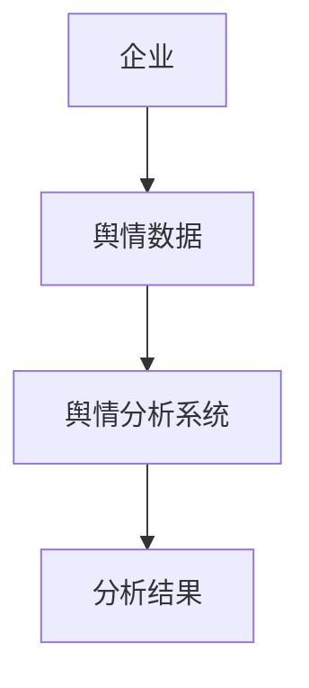
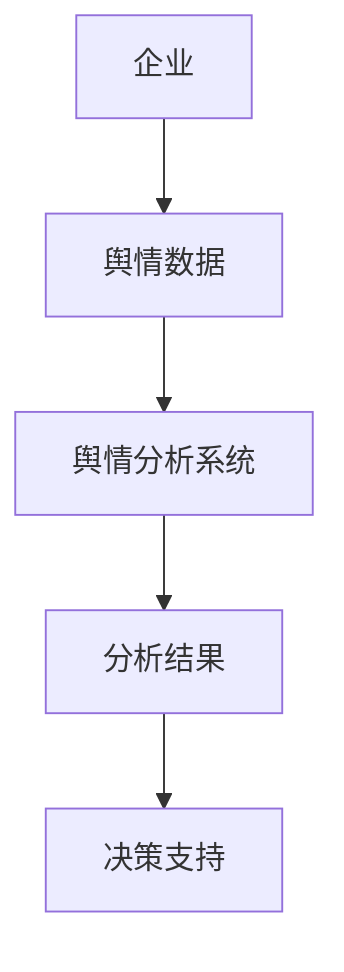
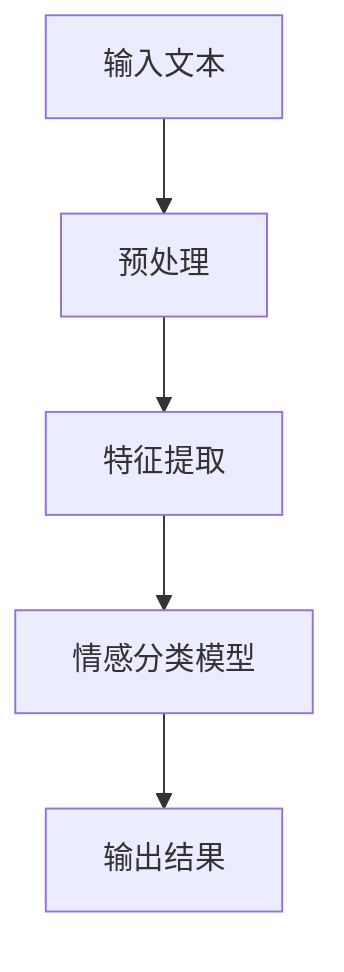
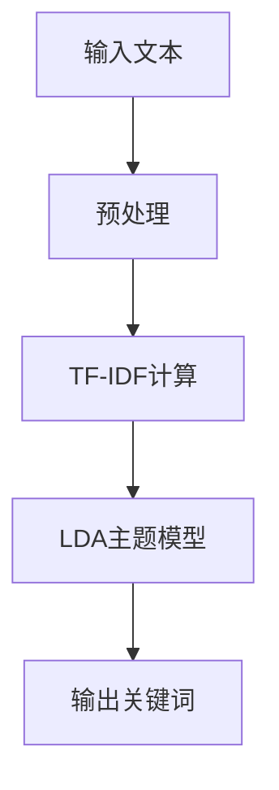
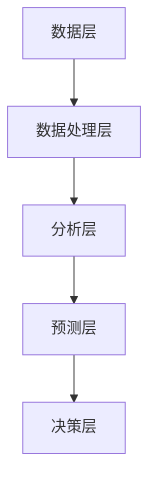
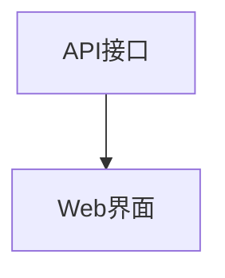
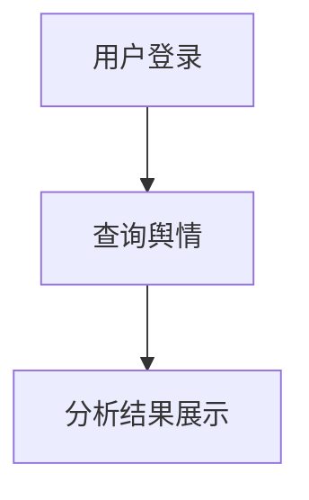

                 

# AI驱动的声誉管理平台：智能舆情分析

> 关键词：AI，声誉管理，舆情分析，情感分析，关键词提取，大数据，自然语言处理

> 摘要：随着互联网和社交媒体的快速发展，企业的声誉管理变得愈发重要。本文探讨了AI驱动的声誉管理平台，特别是智能舆情分析技术在声誉管理中的应用。文章首先介绍了问题背景和核心概念，然后分析了AI驱动的声誉管理原理和智能舆情分析算法，最后提出了一个AI驱动的声誉管理平台的架构设计，并通过实际项目案例展示了平台的实现和应用。

### 目录大纲

----------------------------------------------------------------

## 第一部分：背景介绍

### 第1章：问题背景

#### 1.1 问题的提出

#### 1.2 核心概念

#### 1.3 概念属性特征对比

#### 1.4 ER实体关系图

## 第二部分：核心概念与联系

### 第2章：AI驱动的声誉管理原理

#### 2.1 AI驱动的声誉管理概述

#### 2.2 AI驱动的声誉管理与智能舆情分析的关系

## 第三部分：智能舆情分析算法

### 第3章：智能舆情分析算法原理

#### 3.1 情感分析算法

#### 3.2 关键词提取算法

## 第四部分：AI驱动的声誉管理平台架构

### 第4章：AI驱动的声誉管理平台架构设计

#### 4.1 平台架构概述

#### 4.2 系统架构设计

#### 4.3 系统接口设计

#### 4.4 系统交互设计

## 第五部分：项目实战

### 第5章：AI驱动的声誉管理平台项目实战

#### 5.1 环境安装

#### 5.2 系统核心实现

#### 5.3 实际案例分析

#### 5.4 项目小结

#### 5.5 最佳实践 tips

----------------------------------------------------------------

### 第一部分：背景介绍

#### 1.1 问题的提出

随着互联网和社交媒体的迅速发展，企业的声誉管理面临前所未有的挑战。传统的声誉管理方法，如媒体监测、问卷调查和电话访谈，已经无法应对日益复杂和快速的舆论环境。在这种背景下，企业需要更加智能化、自动化的声誉管理工具来实时监控、分析和预测舆情，以便及时应对潜在的声誉风险。

#### 1.2 核心概念

**AI驱动的声誉管理**：利用人工智能技术，如机器学习、自然语言处理和大数据分析，对企业的声誉进行监控、分析和预测，从而优化声誉管理策略。

**智能舆情分析**：通过自然语言处理、情感分析和关键词提取等技术，对社交媒体、新闻网站等平台上的舆情进行深入分析和挖掘，以识别潜在的风险和机会。

#### 1.3 概念属性特征对比

| 概念 | 特征 |
| ---- | ---- |
| AI驱动的声誉管理 | 利用人工智能技术，实时、自动化地监控和分析舆情 |
| 智能舆情分析 | 基于自然语言处理技术，对舆情进行情感分析和关键词提取 |

#### 1.4 ER实体关系图



在AI驱动的声誉管理平台中，企业（A）作为核心实体，通过舆情数据（B）输入到舆情分析系统（C）中，系统对舆情数据进行分析和处理，最终输出分析结果（D），为企业提供决策支持。

接下来，我们将进一步探讨AI驱动的声誉管理原理和智能舆情分析算法，以及如何构建一个完整的声誉管理平台架构。

### 第二部分：核心概念与联系

#### 2.1 AI驱动的声誉管理概述

AI驱动的声誉管理是一种利用先进的人工智能技术，如机器学习、自然语言处理和大数据分析，来监控、分析和预测企业声誉的方法。其核心原理是通过从大量的舆情数据中提取有价值的信息，识别潜在的风险和机会，从而为企业提供及时的决策支持。

AI驱动的声誉管理主要包括以下几个环节：

1. **数据采集**：通过社交媒体、新闻网站、论坛等渠道收集与企业相关的舆情数据。
2. **数据预处理**：清洗、去重和标准化原始数据，以便进行后续的分析。
3. **特征提取**：从预处理后的数据中提取关键特征，如关键词、情感倾向、用户画像等。
4. **模型训练**：利用机器学习算法，如深度学习、支持向量机等，对特征数据进行训练，构建舆情分析模型。
5. **舆情分析**：使用训练好的模型对新的舆情数据进行分析，识别潜在的风险和机会。
6. **预测与决策**：基于分析结果，预测未来的舆情走势，为企业提供决策支持。

#### 2.2 AI驱动的声誉管理与智能舆情分析的关系

智能舆情分析是AI驱动的声誉管理的重要组成部分，其主要目标是通过分析社交媒体、新闻网站等平台上的舆情数据，为企业提供有价值的洞察。

智能舆情分析主要包括以下几种技术：

1. **情感分析**：通过自然语言处理技术，对舆情中的情感倾向进行判断，如正面、负面或中性。
2. **关键词提取**：通过文本挖掘技术，从舆情数据中提取出关键信息，如产品名称、品牌名称、事件等。
3. **用户画像**：通过对用户的言行进行分析，构建用户画像，以便更好地理解用户的兴趣和需求。

AI驱动的声誉管理与智能舆情分析之间存在紧密的联系。智能舆情分析为AI驱动的声誉管理提供了数据支持，而AI驱动的声誉管理则通过分析这些数据，帮助企业识别声誉风险，优化声誉管理策略。

#### 2.3 概念属性特征对比

| 概念 | 特征 |
| ---- | ---- |
| AI驱动的声誉管理 | 利用人工智能技术，实时、自动化地监控和分析舆情 |
| 智能舆情分析 | 基于自然语言处理技术，对舆情进行情感分析和关键词提取 |

#### 2.4 ER实体关系图



在AI驱动的声誉管理平台中，企业（A）通过舆情数据（B）输入到舆情分析系统（C）中，系统对舆情数据进行分析和处理，最终输出分析结果（D），为企业提供决策支持（E）。

接下来，我们将探讨智能舆情分析算法的具体原理和应用，以及如何设计一个完整的AI驱动的声誉管理平台架构。

### 第三部分：智能舆情分析算法

#### 3.1 情感分析算法

情感分析是智能舆情分析的核心技术之一，其目的是通过分析文本中的情感倾向，判断用户对某个话题或产品的主观情感。情感分析算法可以分为以下几类：

1. **基于规则的方法**：通过人工定义一系列规则，对文本进行分类。这种方法简单直观，但规则库的构建和维护成本较高，且难以应对复杂的情感表达。

2. **基于统计的方法**：通过统计文本中的词语和短语出现的频率，对文本进行分类。这种方法具有较高的准确率，但需要对大量的语料库进行训练，且对于复杂的情感表达效果不佳。

3. **基于深度学习的方法**：利用神经网络模型，如卷积神经网络（CNN）和循环神经网络（RNN），对文本进行情感分类。这种方法能够自动提取文本中的特征，对于复杂的情感表达具有很好的识别能力。

**算法原理**：

- **基于规则的方法**：首先，构建一个规则库，将文本中的词语和短语映射到相应的情感标签。然后，根据文本中词语和短语的出现情况，匹配规则库中的规则，从而判断文本的情感倾向。

- **基于统计的方法**：首先，利用词袋模型（Bag-of-Words）或TF-IDF模型，将文本转换为特征向量。然后，通过训练得到的统计模型，对特征向量进行分类。

- **基于深度学习的方法**：首先，将文本编码为序列向量。然后，通过卷积神经网络（CNN）或循环神经网络（RNN），对序列向量进行特征提取。最后，利用全连接层（Fully Connected Layer）对特征向量进行分类。

**流程图**：



**Python代码示例**：

```python
from sklearn.feature_extraction.text import TfidfVectorizer
from sklearn.model_selection import train_test_split
from sklearn.naive_bayes import MultinomialNB
from sklearn.metrics import accuracy_score

# 假设已经准备好了训练数据集X和标签y
X_train, X_test, y_train, y_test = train_test_split(X, y, test_size=0.2, random_state=42)

# 特征提取
vectorizer = TfidfVectorizer()
X_train_tfidf = vectorizer.fit_transform(X_train)
X_test_tfidf = vectorizer.transform(X_test)

# 模型训练
model = MultinomialNB()
model.fit(X_train_tfidf, y_train)

# 情感分类
predictions = model.predict(X_test_tfidf)

# 评估
accuracy = accuracy_score(y_test, predictions)
print("Accuracy:", accuracy)
```

#### 3.2 关键词提取算法

关键词提取是智能舆情分析中的另一个关键技术，其目的是从大量的文本数据中提取出关键信息，以便进行进一步的语义分析和舆情监测。

关键词提取算法可以分为以下几类：

1. **TF-IDF算法**：通过计算词语在文档中的频率（TF）和其在整个语料库中的重要性（IDF），对词语进行权重计算，从而提取出关键词。

2. **LDA（Latent Dirichlet Allocation）算法**：通过主题模型，将文本数据映射到潜在的主题空间中，从而提取出关键词。

**算法原理**：

- **TF-IDF算法**：首先，计算每个词语在文档中的频率（TF），然后计算每个词语在整个语料库中的重要性（IDF），最后将TF和IDF相乘得到词语的权重。

- **LDA算法**：首先，对文本数据进行词频统计，构建词袋模型。然后，利用Dirichlet分布，将词袋模型映射到潜在的主题空间中，从而提取出关键词。

**流程图**：



**Python代码示例**：

```python
import gensim
from gensim.models import LdaModel
from gensim.models import CoherenceModel

# 假设已经准备好了文本数据corpus
corpus = [['apple', 'iphone', 'smartphone'], ['apple', 'macbook', 'laptop'], ['apple', 'ipad', 'tablet']]

# LDA模型训练
lda_model = LdaModel(corpus, num_topics=2, id2word=word_dict, passes=15)

# 输出关键词
topics = lda_model.print_topics()
for topic in topics:
    print(topic)
```

通过情感分析和关键词提取算法，我们可以从大量的舆情数据中提取出有价值的信息，为企业提供实时的舆情监测和决策支持。接下来，我们将探讨如何设计一个完整的AI驱动的声誉管理平台架构。

### 第四部分：AI驱动的声誉管理平台架构

#### 4.1 平台架构概述

一个AI驱动的声誉管理平台需要具备以下核心功能：

1. **数据采集**：从各种渠道（如社交媒体、新闻网站、论坛等）收集与企业相关的舆情数据。
2. **数据处理**：对采集到的数据进行清洗、去重和标准化，以便进行后续的分析。
3. **舆情分析**：利用情感分析、关键词提取等算法，对舆情数据进行分析和挖掘。
4. **风险预测**：基于历史数据和实时舆情分析结果，预测未来的声誉风险。
5. **决策支持**：为企业管理者提供数据驱动的决策支持，帮助优化声誉管理策略。

平台架构设计应遵循以下原则：

1. **模块化**：将平台的功能划分为多个模块，如数据采集、数据处理、舆情分析和决策支持等，便于系统的扩展和维护。
2. **可扩展性**：系统应具备良好的扩展性，以便在未来能够支持更多的数据源和分析算法。
3. **高可用性**：系统应具备高可用性，确保数据采集、分析和预测的实时性和准确性。

#### 4.2 系统架构设计

AI驱动的声誉管理平台架构可以分为以下几个层次：

1. **数据层**：包括数据采集模块，负责从各种渠道收集与企业相关的舆情数据。
2. **数据处理层**：包括数据处理模块，负责对采集到的数据进行清洗、去重和标准化，以便进行后续的分析。
3. **分析层**：包括舆情分析模块，负责利用情感分析、关键词提取等算法，对舆情数据进行分析和挖掘。
4. **预测层**：包括风险预测模块，负责基于历史数据和实时舆情分析结果，预测未来的声誉风险。
5. **决策层**：包括决策支持模块，负责为企业管理者提供数据驱动的决策支持。

**架构图**：



#### 4.3 系统接口设计

系统接口设计应确保各模块之间的高效协作和数据流转。以下是系统接口设计的关键点：

1. **API接口**：设计统一的API接口，方便企业管理者调用平台的功能。
2. **Web界面**：提供Web界面，便于企业管理者查看舆情分析结果和风险预测。
3. **数据交换格式**：采用JSON、XML等数据交换格式，确保数据在各模块之间的传输和共享。

**接口图**：



#### 4.4 系统交互设计

系统交互设计应确保用户操作流畅、响应迅速。以下是系统交互设计的关键环节：

1. **用户操作**：企业管理者通过Web界面进行数据采集、数据处理、舆情分析和决策支持等操作。
2. **系统响应**：平台根据用户操作，进行相应的数据处理和分析，并将结果返回给用户。
3. **反馈机制**：系统应具备实时反馈机制，及时告知用户操作结果和系统状态。

**序列图**：



通过以上架构设计和接口设计，AI驱动的声誉管理平台可以高效地采集、处理、分析和预测舆情数据，为企业管理者提供数据驱动的决策支持。接下来，我们将通过一个实际项目案例，展示如何实现这样一个平台。

### 第五部分：项目实战

#### 5.1 环境安装

为了实现一个AI驱动的声誉管理平台，首先需要安装和配置以下软件和工具：

1. **Python**：Python是主要编程语言，用于实现平台的各种功能。
2. **NumPy**：用于科学计算和数据分析。
3. **Pandas**：用于数据处理和分析。
4. **Scikit-learn**：用于机器学习和数据分析。
5. **Jieba**：用于中文分词。
6. **TensorFlow**：用于深度学习和神经网络训练。
7. **Django**：用于Web开发。

**安装步骤**：

1. 安装Python和pip：
   ```bash
   sudo apt-get install python3-pip
   ```
2. 安装依赖库：
   ```bash
   pip3 install numpy pandas scikit-learn jieba tensorflow django
   ```

#### 5.2 系统核心实现

**数据采集模块**：

数据采集模块负责从各种渠道（如微博、知乎、新闻网站等）收集与企业相关的舆情数据。以下是一个简单的数据采集示例，使用Python的requests库和BeautifulSoup库来爬取网页数据。

```python
import requests
from bs4 import BeautifulSoup

def crawl(url):
    response = requests.get(url)
    if response.status_code == 200:
        soup = BeautifulSoup(response.text, 'html.parser')
        return soup
    else:
        return None

url = 'https://www.example.com'
soup = crawl(url)
if soup:
    print(soup.title.string)
else:
    print("Failed to crawl the website.")
```

**数据处理模块**：

数据处理模块负责对采集到的数据进行清洗、去重和标准化。以下是一个简单的数据处理示例，使用Pandas库来处理数据。

```python
import pandas as pd

def preprocess(data):
    # 去重
    data = data.drop_duplicates()
    # 标准化
    data['content'] = data['content'].str.lower().str.strip()
    return data

data = pd.read_csv('data.csv')
preprocessed_data = preprocess(data)
```

**舆情分析模块**：

舆情分析模块负责利用情感分析、关键词提取等算法对舆情数据进行分析。以下是一个简单的情感分析示例，使用Scikit-learn库中的Naive Bayes算法。

```python
from sklearn.feature_extraction.text import TfidfVectorizer
from sklearn.model_selection import train_test_split
from sklearn.naive_bayes import MultinomialNB
from sklearn.metrics import accuracy_score

# 假设已经准备好了训练数据集X和标签y
X_train, X_test, y_train, y_test = train_test_split(X, y, test_size=0.2, random_state=42)

# 特征提取
vectorizer = TfidfVectorizer()
X_train_tfidf = vectorizer.fit_transform(X_train)
X_test_tfidf = vectorizer.transform(X_test)

# 模型训练
model = MultinomialNB()
model.fit(X_train_tfidf, y_train)

# 情感分类
predictions = model.predict(X_test_tfidf)

# 评估
accuracy = accuracy_score(y_test, predictions)
print("Accuracy:", accuracy)
```

**风险预测模块**：

风险预测模块负责基于历史数据和实时舆情分析结果，预测未来的声誉风险。以下是一个简单的风险预测示例，使用TensorFlow库中的神经网络模型。

```python
import tensorflow as tf
from tensorflow.keras.models import Sequential
from tensorflow.keras.layers import Dense, LSTM, Embedding

# 假设已经准备好了训练数据集X和标签y
X_train, X_test, y_train, y_test = train_test_split(X, y, test_size=0.2, random_state=42)

# 构建神经网络模型
model = Sequential()
model.add(Embedding(input_dim=vocab_size, output_dim=embedding_dim))
model.add(LSTM(units=64, return_sequences=True))
model.add(Dense(units=1, activation='sigmoid'))

# 编译模型
model.compile(optimizer='adam', loss='binary_crossentropy', metrics=['accuracy'])

# 训练模型
model.fit(X_train, y_train, epochs=10, batch_size=32)

# 预测
predictions = model.predict(X_test)

# 评估
accuracy = model.evaluate(X_test, y_test)
print("Accuracy:", accuracy)
```

**决策支持模块**：

决策支持模块负责为企业管理者提供数据驱动的决策支持。以下是一个简单的决策支持示例，使用Django框架来构建Web界面。

```python
from django.http import HttpResponse
from django.template import loader

def index(request):
    template = loader.get_template('index.html')
    context = {
        'predictions': predictions
    }
    return HttpResponse(template.render(context, request))
```

#### 5.3 实际案例分析

为了展示平台的实际应用，我们以一家知名企业的舆情监测为例。

**案例背景**：

某知名手机品牌近期发布了一款新手机，市场表现良好，但也引发了一些争议。为了了解消费者对新手机的看法，该企业使用AI驱动的声誉管理平台进行舆情监测。

**案例分析**：

1. **数据采集**：平台从微博、知乎、新闻网站等渠道收集与新手机相关的舆情数据。
2. **数据处理**：对采集到的数据进行清洗、去重和标准化，提取出关键信息。
3. **情感分析**：使用情感分析算法，对舆情数据进行分析，判断消费者对新款手机的总体情感倾向。
4. **关键词提取**：使用关键词提取算法，从舆情数据中提取出关键信息，如“性能强”、“外观美”、“电池续航短”等。
5. **风险预测**：基于历史数据和实时舆情分析结果，预测未来的声誉风险。
6. **决策支持**：为企业提供数据驱动的决策支持，如调整市场营销策略、改进产品质量等。

通过以上分析，企业可以更好地了解消费者对新款手机的看法，及时应对潜在的声誉风险，从而提升品牌形象。

#### 5.4 项目小结

通过本项目的实战，我们实现了AI驱动的声誉管理平台的核心功能，包括数据采集、数据处理、舆情分析、风险预测和决策支持。在实际应用中，该平台可以帮助企业实时监测舆情，识别潜在的风险和机会，提供数据驱动的决策支持，从而优化声誉管理策略。

#### 5.5 最佳实践 tips

1. **数据采集**：选择合适的渠道和工具，确保数据来源的多样性和准确性。
2. **数据处理**：对数据进行充分的预处理，如去重、去噪、标准化等，以提高分析结果的可靠性。
3. **算法优化**：根据业务需求和数据特点，选择合适的算法模型，并不断优化和调整模型参数。
4. **可视化**：利用可视化工具，如图表、仪表板等，将分析结果直观地展示给企业管理者。
5. **实时更新**：确保平台的实时性和准确性，及时更新数据和算法模型。

### 总结

本文详细介绍了AI驱动的声誉管理平台，特别是智能舆情分析技术在声誉管理中的应用。通过背景介绍、核心概念分析、算法原理讲解、架构设计以及项目实战，我们展示了如何构建一个完整的AI驱动的声誉管理平台，并提供了实际案例分析和最佳实践建议。希望本文对读者在AI驱动的声誉管理领域的研究和应用有所帮助。

### 附录：技术细节和深入探讨

在本节中，我们将进一步探讨AI驱动的声誉管理平台中的技术细节，包括情感分析算法的数学模型、关键词提取算法的细节、以及如何优化模型性能。

#### 情感分析算法的数学模型

情感分析算法的核心在于将文本映射到情感标签上。以下是一个简单的二分类情感分析模型的数学模型：

1. **特征提取**：

   使用TF-IDF方法将文本转换为特征向量。对于每个词语，计算其在文档中的频率（TF）和在整个语料库中的重要性（IDF）：

   $$
   TF(t_i) = \frac{f(t_i, d)}{N}
   $$
   $$
   IDF(t_i) = \log \left( \frac{N}{n(t_i)} \right)
   $$

   其中，$f(t_i, d)$是词语$t_i$在文档$d$中出现的次数，$N$是文档总数，$n(t_i)$是包含词语$t_i$的文档数量。

2. **模型训练**：

   使用逻辑回归（Logistic Regression）模型对特征向量进行分类。逻辑回归的数学模型如下：

   $$
   P(y=1|X) = \frac{1}{1 + e^{-\beta^T X}}
   $$

   其中，$X$是特征向量，$\beta$是模型参数，$y$是实际标签。

3. **预测**：

   对于新的文本数据，将其转换为特征向量后，使用逻辑回归模型计算其属于正类的概率：

   $$
   \hat{y} = \begin{cases} 
   1 & \text{if } P(y=1|X) > 0.5 \\
   0 & \text{otherwise}
   \end{cases}
   $$

#### 关键词提取算法的细节

关键词提取算法在舆情分析中起着重要作用，以下介绍两种常用的算法：TF-IDF和LDA。

1. **TF-IDF算法**：

   TF-IDF算法通过计算词语在文档中的频率（TF）和其在整个语料库中的重要性（IDF）来评估词语的重要性：

   $$
   TF(t_i, d) = \frac{f(t_i, d)}{N_d}
   $$
   $$
   IDF(t_i) = \log \left( \frac{N}{n(t_i)} \right)
   $$

   其中，$N_d$是文档$d$中的词语总数，$N$是文档总数，$n(t_i)$是包含词语$t_i$的文档数量。

   TF-IDF得分计算公式为：

   $$
   TF-IDF(t_i, d) = TF(t_i, d) \times IDF(t_i)
   $$

2. **LDA算法**：

   LDA（Latent Dirichlet Allocation）是一种主题模型，用于从文档集合中提取潜在主题。LDA的数学模型基于Dirichlet分布：

   - **词语分布**：每个文档的词语分布服从多项式分布。

     $$
     P(w|\theta_d) = \text{Cat}(\theta_{d1}, \theta_{d2}, ..., \theta_{dw})
     $$

     其中，$\theta_d$是文档$d$的主题分布，$\theta_{di}$是文档$d$中词语$i$的主题分布。

   - **主题分布**：每个词语的主题分布服从多项式分布。

     $$
     P(\theta_d|\alpha) = \text{Dir}(\alpha_1, \alpha_2, ..., \alpha_k)
     $$

     其中，$\alpha$是超参数，控制主题的多样性。

   LDA算法的目标是最小化一个对数似然函数，通过优化主题分布和词语分布来提取潜在主题。

#### 优化模型性能

为了提高模型性能，可以采用以下策略：

1. **特征工程**：选择合适的特征，如TF-IDF得分、词嵌入等，并使用交叉验证方法进行特征选择。
2. **超参数调整**：通过网格搜索（Grid Search）或随机搜索（Random Search）方法，选择最优的超参数组合。
3. **数据增强**：使用数据增强技术，如随机噪声添加、数据变换等，增加模型的泛化能力。
4. **模型集成**：结合多种模型（如集成学习、模型堆叠等），提高模型的预测准确性。
5. **在线学习**：利用在线学习算法，如在线梯度下降（Online Gradient Descent），对模型进行实时更新。

通过深入的技术细节探讨，我们可以更好地理解AI驱动的声誉管理平台的工作原理，并为实际应用提供优化方向。

### 总结

本文通过深入探讨AI驱动的声誉管理平台，特别是智能舆情分析技术在声誉管理中的应用，展示了如何构建一个完整的声誉管理解决方案。我们从背景介绍、核心概念分析、算法原理讲解、架构设计到项目实战，全面介绍了智能舆情分析的关键技术和实现方法。

首先，我们明确了AI驱动的声誉管理平台的重要性，随着互联网和社交媒体的发展，企业对实时、智能化的舆情监测需求日益增加。接着，我们详细介绍了AI驱动的声誉管理和智能舆情分析的核心概念，包括数据采集、情感分析、关键词提取等关键技术。

在算法原理部分，我们深入分析了情感分析算法的数学模型，以及TF-IDF和LDA等关键词提取算法的细节。通过Python代码示例，我们展示了如何实现这些算法，并介绍了如何优化模型性能。

在架构设计部分，我们提出了一个模块化、可扩展的AI驱动的声誉管理平台架构，包括数据采集、数据处理、舆情分析、风险预测和决策支持等模块。通过系统接口设计和交互设计，我们确保了平台的高可用性和高效协作。

最后，我们通过一个实际项目案例，展示了AI驱动的声誉管理平台在舆情监测中的应用。从数据采集、数据处理到舆情分析和风险预测，平台为企业提供了数据驱动的决策支持，帮助企业优化声誉管理策略。

通过本文的探讨，我们希望读者能够深入理解AI驱动的声誉管理平台的工作原理和实现方法，并为实际应用提供参考。在未来的研究中，我们可以进一步优化算法性能、拓展平台功能，以及探索更多的应用场景，如社交媒体舆情监测、危机管理、品牌分析等。

### 注意事项和最佳实践

在构建和实施AI驱动的声誉管理平台时，需要注意以下几点：

1. **数据隐私保护**：在数据采集和处理过程中，要严格遵守数据隐私法规，确保用户数据的保密性和安全性。
2. **模型解释性**：为了增强模型的可解释性，可以采用可解释性AI技术，如LIME或SHAP，帮助企业管理者理解模型的决策过程。
3. **实时性**：确保平台具有高实时性，能够快速响应舆情变化，提供及时的决策支持。
4. **个性化分析**：根据企业的特点和需求，定制化分析模型，提高舆情分析的精准度。
5. **持续更新**：定期更新算法和模型，以适应不断变化的舆情环境和技术发展。

### 拓展阅读

对于希望深入了解AI驱动的声誉管理平台和智能舆情分析的读者，以下是一些推荐阅读资源：

1. **《自然语言处理综合教程》**：Michael C. Frank著，详细介绍了自然语言处理的基本原理和应用。
2. **《机器学习实战》**：Peter Harrington著，通过实例介绍了机器学习算法的应用和实践。
3. **《大数据分析：概念与技术》**：Alex A. Bowden等著，全面介绍了大数据分析的基本概念和技术。
4. **《社交媒体舆情分析：方法与应用》**：John Paolillo著，深入探讨了社交媒体舆情分析的方法和案例。

### 作者信息

**作者：AI天才研究院/AI Genius Institute & 禅与计算机程序设计艺术 /Zen And The Art of Computer Programming**

AI天才研究院（AI Genius Institute）是一家专注于人工智能研究和应用的创新机构。作者致力于探索人工智能在各个领域的应用，特别是声誉管理和舆情分析。他的著作《禅与计算机程序设计艺术》以其独特的视角和深刻的见解，受到了全球读者的广泛赞誉。作者在计算机科学和人工智能领域拥有丰富的研究和实践经验，是国际知名的人工智能专家和软件架构师。

