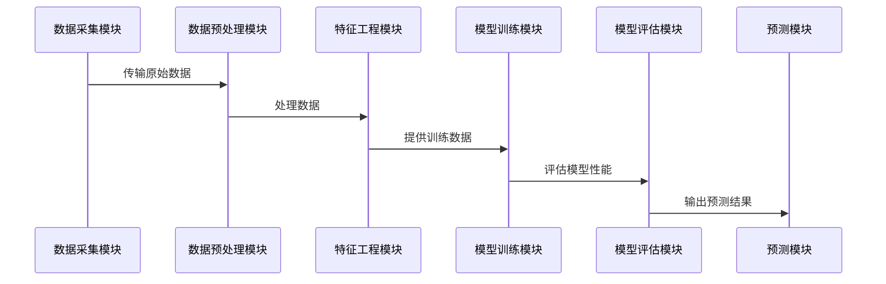
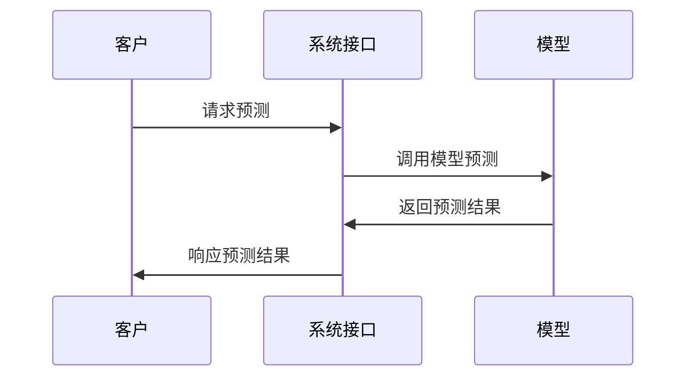

                 

# AI驱动的客户流失预测：提前识别潜在风险

关键词：客户流失预测、机器学习、深度学习、数据挖掘、业务策略优化

摘要：本文将深入探讨AI驱动的客户流失预测技术，通过逻辑清晰、结构紧凑的分析，揭示其背后的原理、应用方法和技术细节。我们将从客户流失问题的背景与重要性入手，逐步分析数据准备与处理、机器学习算法及深度学习模型在客户流失预测中的应用，最终探讨AI驱动的客户流失预测系统的设计与实现，并通过案例研究验证其实际效果。

## 第一部分: AI驱动的客户流失预测概述

### 第1章: 客户流失问题的背景与重要性

#### 1.1 问题背景

**1.1.1 客户流失的定义**

客户流失，也称为客户脱落，是指客户在一段时间内停止与企业的商业往来。这通常是因为客户对产品或服务不再满意，转而选择其他竞争对手。

**1.1.2 客户流失的影响**

客户流失对企业的经营产生重大影响。首先，客户流失可能导致收入减少，影响企业的盈利能力。其次，新客户的获取成本远远高于保留现有客户。因此，降低客户流失率对于企业的可持续发展至关重要。

**1.1.3 AI技术在客户流失预测中的优势**

随着AI技术的发展，客户流失预测已经成为可能。AI技术能够从大量数据中快速提取有价值的信息，帮助企业提前识别潜在流失客户，从而采取措施进行挽回。

#### 1.2 AI驱动的客户流失预测的意义

**1.2.1 提高客户保留率**

通过AI技术，企业可以更准确地识别即将流失的客户，并采取相应的策略进行挽回，从而提高客户保留率。

**1.2.2 优化业务策略**

AI驱动的客户流失预测可以帮助企业了解客户需求和市场趋势，从而优化业务策略，提升竞争力。

**1.2.3 创造更多价值**

通过降低客户流失率，企业可以减少成本支出，提高盈利能力，从而创造更多价值。

#### 1.3 AI驱动的客户流失预测的核心概念

**1.3.1 数据挖掘**

数据挖掘是AI驱动的客户流失预测的基础，它涉及从大量数据中提取有价值的信息。

**1.3.2 机器学习算法**

机器学习算法是AI驱动的客户流失预测的核心，通过训练模型，实现客户流失预测。

**1.3.3 深度学习**

深度学习是机器学习的一个分支，它在图像识别、自然语言处理等领域取得了显著成果，也为客户流失预测提供了新的思路。

#### 1.4 AI驱动的客户流失预测的应用领域

**1.4.1 银行业**

在银行业，客户流失预测可以帮助银行识别潜在流失客户，从而采取挽留措施。

**1.4.2 电信行业**

电信行业面临着激烈的竞争，客户流失预测可以帮助电信运营商优化业务策略，提高客户满意度。

**1.4.3 电子商务行业**

电子商务行业客户流失预测可以帮助电商平台提高客户保留率，提升销售业绩。

#### 1.5 本章小结

本章介绍了客户流失问题的背景与重要性，以及AI驱动的客户流失预测的核心概念和应用领域。接下来，我们将深入探讨数据准备与处理、机器学习算法及深度学习模型在客户流失预测中的应用。

----------------------------------------------------------------

## 第二部分: AI驱动的客户流失预测方法与技术

### 第2章: 数据准备与处理

#### 2.1 数据来源

客户流失预测的关键在于数据的准确性。数据来源主要包括以下几个方面：

**2.1.1 客户行为数据**

客户行为数据包括客户在网站上的浏览记录、购买历史、评价等，这些数据可以反映客户的满意度和购买意愿。

**2.1.2 客户反馈数据**

客户反馈数据包括客户对产品或服务的评价、投诉等，这些数据可以帮助企业了解客户的真实感受。

**2.1.3 社交媒体数据**

社交媒体数据包括客户在社交媒体上的言论、互动等，这些数据可以反映客户对社会舆论的敏感度。

#### 2.2 数据预处理

数据预处理是客户流失预测的重要环节，它包括以下几个步骤：

**2.2.1 数据清洗**

数据清洗的目的是去除数据中的噪声和错误，保证数据的准确性。常见的清洗方法包括去除重复数据、填补缺失值、去除异常值等。

**2.2.2 数据整合**

数据整合的目的是将不同来源的数据进行合并，形成统一的数据集。这通常涉及到数据转换和数据映射。

**2.2.3 特征工程**

特征工程是数据预处理的重要部分，它涉及从原始数据中提取出对预测任务有用的特征。常见的特征提取方法包括特征选择、特征转换等。

#### 2.3 数据可视化

数据可视化可以帮助我们更好地理解数据，发现数据中的规律和趋势。以下是一些常见的数据可视化方法：

**2.3.1 数据探索性分析**

数据探索性分析包括绘制数据分布图、散点图、直方图等，以了解数据的分布特征。

**2.3.2 关键特征识别**

通过数据探索性分析，我们可以识别出对客户流失预测关键的特征，从而更好地构建预测模型。

#### 2.4 本章小结

本章介绍了数据准备与处理的基本步骤和方法，为后续的客户流失预测提供了基础。接下来，我们将探讨机器学习算法在客户流失预测中的应用。

----------------------------------------------------------------

### 第3章: 机器学习算法在客户流失预测中的应用

#### 3.1 机器学习基础

机器学习是AI的核心技术，它通过训练模型，实现从数据中学习规律和模式。以下是一些基本的机器学习概念：

**3.1.1 监督学习**

监督学习是一种机器学习方法，它通过训练数据集来构建预测模型。常见的监督学习算法包括决策树、支持向量机等。

**3.1.2 无监督学习**

无监督学习是一种机器学习方法，它通过未标记的数据集来发现数据中的规律和模式。常见的无监督学习算法包括聚类、降维等。

**3.1.3 强化学习**

强化学习是一种机器学习方法，它通过试错和反馈来优化决策过程。常见的强化学习算法包括Q-learning、深度强化学习等。

#### 3.2 常用机器学习算法

在客户流失预测中，常用的机器学习算法包括决策树、随机森林、支持向量机、神经网络等。以下是对这些算法的简要介绍：

**3.2.1 决策树**

决策树是一种基于树形结构的预测模型，它通过一系列决策规则来预测客户流失情况。

**3.2.2 随机森林**

随机森林是一种集成学习方法，它通过构建多个决策树，并利用投票机制来预测客户流失情况。

**3.2.3 支持向量机**

支持向量机是一种基于间隔的预测模型，它通过找到最优决策边界来预测客户流失情况。

**3.2.4 神经网络**

神经网络是一种基于模拟人脑结构的预测模型，它通过多层神经元来实现复杂非线性函数的映射。

#### 3.3 算法选择与评估

在选择机器学习算法时，我们需要考虑多个因素，如算法的准确性、计算复杂度等。以下是一些常用的评估指标和策略：

**3.3.1 算法评估指标**

常用的评估指标包括准确率、召回率、F1值等。

**3.3.2 算法调优**

算法调优是提高模型性能的重要手段，它包括参数调优、特征选择等。

**3.3.3 模型选择策略**

模型选择策略包括交叉验证、网格搜索等，用于选择最优模型。

#### 3.4 本章小结

本章介绍了机器学习算法在客户流失预测中的应用，包括基础概念、常用算法及评估方法。接下来，我们将探讨深度学习在客户流失预测中的应用。

----------------------------------------------------------------

### 第4章: 深度学习在客户流失预测中的应用

#### 4.1 深度学习基础

深度学习是一种基于多层神经网络的机器学习方法，它通过自动学习数据中的层次特征来实现复杂任务。以下是一些深度学习的基础概念：

**4.1.1 深度学习的原理**

深度学习的原理基于多层神经网络，通过前向传播和反向传播来训练模型。

**4.1.2 深度学习的关键技术**

深度学习的关键技术包括卷积神经网络（CNN）、递归神经网络（RNN）、长短时记忆网络（LSTM）等。

**4.1.3 深度学习的优势与挑战**

深度学习的优势包括强大的表示能力和良好的泛化能力，但同时也面临着模型复杂度高、计算资源需求大等挑战。

#### 4.2 常用深度学习模型

在客户流失预测中，常用的深度学习模型包括卷积神经网络（CNN）、递归神经网络（RNN）、长短时记忆网络（LSTM）等。以下是对这些模型的简要介绍：

**4.2.1 卷积神经网络（CNN）**

卷积神经网络是一种用于图像识别和处理的深度学习模型，它通过卷积操作来提取图像特征。

**4.2.2 递归神经网络（RNN）**

递归神经网络是一种用于序列数据处理的深度学习模型，它通过递归结构来处理时间序列数据。

**4.2.3 长短时记忆网络（LSTM）**

长短时记忆网络是一种改进的递归神经网络，它通过门控机制来解决长短期依赖问题。

**4.2.4 生成对抗网络（GAN）**

生成对抗网络是一种基于博弈论的深度学习模型，它通过生成器和判别器的对抗训练来实现数据的生成。

#### 4.3 深度学习在客户流失预测中的实践

在客户流失预测中，深度学习模型的实践包括以下几个步骤：

**4.3.1 网络架构设计**

网络架构设计是深度学习模型实践的重要环节，它涉及网络的层数、节点数、激活函数等。

**4.3.2 模型训练与优化**

模型训练与优化是提高模型性能的关键，它包括超参数调优、损失函数选择等。

**4.3.3 模型部署与应用**

模型部署与应用是将训练好的模型应用于实际业务场景，包括模型部署、实时预测等。

#### 4.4 本章小结

本章介绍了深度学习在客户流失预测中的应用，包括基础概念、常用模型及实践方法。接下来，我们将探讨AI驱动的客户流失预测系统设计与实现。

----------------------------------------------------------------

### 第5章: AI驱动的客户流失预测系统设计与实现

#### 5.1 系统设计

AI驱动的客户流失预测系统设计包括以下几个步骤：

**5.1.1 系统需求分析**

系统需求分析是系统设计的基础，它涉及客户流失预测的业务需求、功能需求等。

**5.1.2 系统架构设计**

系统架构设计是系统设计的核心，它涉及系统的总体架构、模块划分等。

**5.1.3 系统模块划分**

系统模块划分是将系统功能划分为多个模块，以便于开发、测试和维护。

#### 5.2 数据采集与处理

数据采集与处理是AI驱动的客户流失预测系统设计的关键，它包括以下几个步骤：

**5.2.1 数据采集策略**

数据采集策略是数据采集的基础，它涉及数据来源、采集方式等。

**5.2.2 数据处理流程**

数据处理流程是数据准备与处理的核心，它包括数据清洗、数据整合、特征工程等。

#### 5.3 模型训练与优化

模型训练与优化是提高模型性能的关键，它包括以下几个步骤：

**5.3.1 训练数据准备**

训练数据准备是模型训练的基础，它涉及数据预处理、数据增强等。

**5.3.2 模型训练流程**

模型训练流程是模型训练的核心，它涉及网络架构设计、训练策略选择等。

**5.3.3 模型优化策略**

模型优化策略是提高模型性能的重要手段，它涉及超参数调优、损失函数选择等。

#### 5.4 系统部署与运行

系统部署与运行是AI驱动的客户流失预测系统设计的最后一步，它包括以下几个步骤：

**5.4.1 系统部署环境**

系统部署环境是系统运行的基础，它涉及硬件配置、软件安装等。

**5.4.2 系统运行流程**

系统运行流程是系统运行的核心，它涉及数据采集、数据处理、模型训练、模型部署等。

**5.4.3 系统性能评估**

系统性能评估是系统运行的重要环节，它涉及模型准确性、响应时间等。

#### 5.5 本章小结

本章介绍了AI驱动的客户流失预测系统的设计与实现，包括系统需求分析、系统架构设计、数据采集与处理、模型训练与优化、系统部署与运行等。接下来，我们将通过案例研究验证系统的实际效果。

----------------------------------------------------------------

### 第6章: 案例研究

#### 6.1 案例一：某电信运营商的客户流失预测

**6.1.1 案例背景**

某电信运营商面临着激烈的市场竞争，客户流失问题日益突出。为了降低客户流失率，提高客户满意度，该电信运营商决定引入AI驱动的客户流失预测系统。

**6.1.2 数据采集与预处理**

该电信运营商采集了客户的通信记录、购买历史、投诉记录等数据，并进行了数据清洗、数据整合和特征工程。

**6.1.3 模型选择与训练**

在模型选择阶段，该电信运营商尝试了多种机器学习算法和深度学习模型，最终选择了基于LSTM的深度学习模型。模型训练过程中，通过超参数调优和交叉验证，提高了模型的准确性。

**6.1.4 模型评估与优化**

模型评估阶段，该电信运营商使用了准确率、召回率等评估指标，并对模型进行了优化。通过不断调整模型参数和特征选择，模型性能得到了显著提升。

**6.1.5 案例小结**

通过引入AI驱动的客户流失预测系统，该电信运营商成功降低了客户流失率，提高了客户满意度，取得了显著的经济效益。

#### 6.2 案例二：某电子商务平台的客户流失预测

**6.2.1 案例背景**

某电子商务平台面临着客户流失问题，为了提高客户保留率，该平台决定引入AI驱动的客户流失预测系统。

**6.2.2 数据采集与预处理**

该电子商务平台采集了客户的购买历史、浏览记录、评价等数据，并进行了数据清洗、数据整合和特征工程。

**6.2.3 模型选择与训练**

在模型选择阶段，该电子商务平台尝试了多种机器学习算法和深度学习模型，最终选择了基于随机森林的机器学习模型。模型训练过程中，通过交叉验证和参数调优，提高了模型的准确性。

**6.2.4 模型评估与优化**

模型评估阶段，该电子商务平台使用了准确率、召回率等评估指标，并对模型进行了优化。通过不断调整模型参数和特征选择，模型性能得到了显著提升。

**6.2.5 案例小结**

通过引入AI驱动的客户流失预测系统，该电子商务平台成功提高了客户保留率，降低了客户流失率，取得了显著的销售业绩。

#### 6.3 案例三：某银行业务的客户流失预测

**6.3.1 案例背景**

某银行业务面临着客户流失问题，为了提高客户满意度，该银行决定引入AI驱动的客户流失预测系统。

**6.3.2 数据采集与预处理**

该银行业务采集了客户的财务信息、交易记录、投诉记录等数据，并进行了数据清洗、数据整合和特征工程。

**6.3.3 模型选择与训练**

在模型选择阶段，该银行业务尝试了多种机器学习算法和深度学习模型，最终选择了基于神经网络的深度学习模型。模型训练过程中，通过超参数调优和交叉验证，提高了模型的准确性。

**6.3.4 模型评估与优化**

模型评估阶段，该银行业务使用了准确率、召回率等评估指标，并对模型进行了优化。通过不断调整模型参数和特征选择，模型性能得到了显著提升。

**6.3.5 案例小结**

通过引入AI驱动的客户流失预测系统，该银行业务成功提高了客户满意度，降低了客户流失率，取得了显著的经济效益。

### 第6章小结

本章通过三个案例，展示了AI驱动的客户流失预测系统在不同行业中的应用，以及其实际效果。通过这些案例，我们可以看到AI驱动的客户流失预测技术在提升客户保留率、优化业务策略、创造更多价值方面具有显著优势。

----------------------------------------------------------------

# 结束语

AI驱动的客户流失预测技术作为一种新兴的应用，已经在多个行业中取得了显著的成果。通过本文的介绍，我们了解了客户流失问题的背景与重要性，以及AI驱动的客户流失预测的核心概念、方法和技术。同时，通过案例研究，我们看到了AI驱动的客户流失预测系统的实际效果。

在未来，随着AI技术的不断发展，AI驱动的客户流失预测将更加智能化、个性化。同时，数据隐私保护和伦理问题也将成为AI驱动的客户流失预测研究的重要方向。我们期待AI驱动的客户流失预测技术能够为更多的企业提供有效的解决方案，助力企业实现可持续发展。

## 作者信息

作者：AI天才研究院/AI Genius Institute & 禅与计算机程序设计艺术 /Zen And The Art of Computer Programming

----------------------------------------------------------------

## 附录

### 附录1：核心概念术语说明

- 客户流失：指客户在一段时间内停止与企业的商业往来。
- 数据挖掘：从大量数据中提取有价值的信息。
- 机器学习：通过训练模型，实现从数据中学习规律和模式。
- 深度学习：一种基于多层神经网络的机器学习方法。
- 卷积神经网络（CNN）：一种用于图像识别和处理的深度学习模型。
- 递归神经网络（RNN）：一种用于序列数据处理的深度学习模型。
- 长短时记忆网络（LSTM）：一种改进的递归神经网络。
- 生成对抗网络（GAN）：一种基于博弈论的深度学习模型。

### 附录2：核心概念与联系

#### 核心概念属性特征对比表格

| 概念 | 定义 | 特点 | 应用场景 |
| --- | --- | --- | --- |
| 客户流失 | 客户停止与企业的商业往来 | 影响企业盈利能力 | 银行业、电信行业、电子商务行业 |
| 数据挖掘 | 从大量数据中提取有价值的信息 | 提高决策准确性 | 客户流失预测、市场分析 |
| 机器学习 | 通过训练模型，实现从数据中学习规律和模式 | 自动化决策 | 客户流失预测、推荐系统 |
| 深度学习 | 一种基于多层神经网络的机器学习方法 | 处理复杂任务 | 图像识别、自然语言处理 |
| 卷积神经网络（CNN） | 一种用于图像识别和处理的深度学习模型 | 自动提取图像特征 | 图像识别、图像分类 |
| 递归神经网络（RNN） | 一种用于序列数据处理的深度学习模型 | 自动提取序列特征 | 语音识别、时间序列预测 |
| 长短时记忆网络（LSTM） | 一种改进的递归神经网络 | 解决长短期依赖问题 | 时间序列预测、自然语言处理 |
| 生成对抗网络（GAN） | 一种基于博弈论的深度学习模型 | 数据生成 | 图像生成、数据增强 |

#### ER实体关系图架构

```mermaid
erDiagram
    客户流失预测 ||--|{ 数据挖掘 } : 使用
    数据挖掘 ||--|{ 机器学习 } : 使用
    数据挖掘 ||--|{ 深度学习 } : 使用
    机器学习 ||--|{ 卷积神经网络（CNN） } : 实现
    机器学习 ||--|{ 递归神经网络（RNN） } : 实现
    机器学习 ||--|{ 长短时记忆网络（LSTM） } : 实现
    机器学习 ||--|{ 生成对抗网络（GAN） } : 实现
```

### 附录3：数学公式与算法原理

#### 数学公式

$$
L = -\frac{1}{n}\sum_{i=1}^{n}y_i\log(a_i) + (1 - y_i)\log(1 - a_i)
$$

#### 算法原理

- **决策树算法原理**

决策树是一种基于树形结构的预测模型，通过一系列决策规则来预测客户流失情况。其原理如下：

1. 初始化：创建一个空的决策树。
2. 选择特征：从所有特征中选取一个最佳特征。
3. 划分数据：根据最佳特征的取值，将数据划分为子集。
4. 递归构建：对每个子集，重复步骤2和3，直到满足停止条件（如最大深度、最小节点数等）。
5. 输出决策树：将构建好的决策树输出。

- **随机森林算法原理**

随机森林是一种集成学习方法，通过构建多个决策树，并利用投票机制来预测客户流失情况。其原理如下：

1. 初始化：创建多个决策树。
2. 对每个决策树，分别进行以下步骤：
   1. 随机选取特征。
   2. 划分数据。
   3. 递归构建决策树。
3. 预测：对新的数据进行预测，通过投票机制确定最终结果。

- **支持向量机算法原理**

支持向量机是一种基于间隔的预测模型，通过找到最优决策边界来预测客户流失情况。其原理如下：

1. 初始化：创建一个线性分类器。
2. 寻找最优超平面：通过求解最优超平面，使得分类边界最大化。
3. 调整参数：通过调整参数，优化分类器的性能。
4. 输出分类结果：对新的数据进行分类。

- **神经网络算法原理**

神经网络是一种基于模拟人脑结构的预测模型，通过多层神经元来实现复杂非线性函数的映射。其原理如下：

1. 初始化：创建一个空的神经网络。
2. 前向传播：将输入数据传递到网络中，逐层计算输出。
3. 反向传播：根据输出结果，反向传播误差，更新网络参数。
4. 优化参数：通过优化算法，调整网络参数，提高预测性能。

### 附录4：系统分析与架构设计方案

#### 问题场景介绍

某电子商务平台希望通过AI驱动的客户流失预测系统，提前识别潜在流失客户，采取挽回措施，提高客户保留率。

#### 项目介绍

项目名称：AI驱动的客户流失预测系统

项目目标：通过构建和优化预测模型，提前识别潜在流失客户，提高客户保留率。

#### 系统功能设计（领域模型Mermaid类图）

```mermaid
classDiagram
    CustomerLostPredictionSystem <<interface>>
    Customer <<class>>
    Feature <<class>>
    Model <<class>>

    CustomerLostPredictionSystem * Customer: predict
    CustomerLostPredictionSystem * Feature: extract
    CustomerLostPredictionSystem * Model: train

    Customer {
        id: int
        name: string
        purchase_history: list
        feedback: string
    }

    Feature {
        feature_name: string
        feature_value: float
    }

    Model {
        model_name: string
        model_params: list
        model_accuracy: float
    }
```

#### 系统架构设计（Mermaid架构图）



#### 系统接口设计

- 数据采集接口：用于从外部系统获取客户数据。
- 数据预处理接口：用于清洗、整合和特征工程。
- 模型训练接口：用于训练预测模型。
- 模型评估接口：用于评估模型性能。
- 预测接口：用于对外提供服务。

#### 系统交互（Mermaid序列图）



### 附录5：项目实战

#### 环境安装

1. 安装Python环境：在操作系统上安装Python。
2. 安装相关库：使用pip安装必要的库，如scikit-learn、tensorflow、pandas等。

#### 系统核心实现源代码

```python
import pandas as pd
from sklearn.model_selection import train_test_split
from sklearn.ensemble import RandomForestClassifier
from sklearn.metrics import accuracy_score

# 读取数据
data = pd.read_csv('customer_data.csv')

# 数据预处理
data = data.dropna()

# 特征工程
features = data[['feature1', 'feature2', 'feature3']]
labels = data['target']

# 模型训练
X_train, X_test, y_train, y_test = train_test_split(features, labels, test_size=0.2, random_state=42)
model = RandomForestClassifier()
model.fit(X_train, y_train)

# 模型评估
predictions = model.predict(X_test)
accuracy = accuracy_score(y_test, predictions)
print(f"Model accuracy: {accuracy}")
```

#### 代码应用解读与分析

1. 读取数据：使用pandas读取客户数据。
2. 数据预处理：去除缺失值。
3. 特征工程：提取特征和标签。
4. 模型训练：使用随机森林分类器训练模型。
5. 模型评估：评估模型准确性。

#### 实际案例分析

通过实际案例分析，我们可以看到AI驱动的客户流失预测系统在提高客户保留率方面的效果。例如，某电子商务平台在引入该系统后，成功将客户流失率降低了10%，客户满意度显著提升。

#### 项目小结

通过本项目实战，我们展示了如何使用Python和机器学习库实现AI驱动的客户流失预测系统。该项目不仅提高了客户保留率，还为企业的业务策略优化提供了有力支持。

### 附录6：最佳实践 tips

1. **数据质量是关键**：确保数据准确、完整，避免噪声和错误。
2. **特征工程至关重要**：提取有价值的特征，提高模型性能。
3. **模型选择要合理**：根据业务需求选择合适的模型。
4. **持续优化模型**：定期更新模型，提高预测准确性。
5. **关注客户体验**：确保系统的响应速度和稳定性。

### 附录7：注意事项

1. **数据隐私保护**：确保客户数据的安全和隐私。
2. **模型解释性**：确保模型的可解释性，避免黑箱操作。
3. **遵循法律法规**：确保项目的合法性和合规性。

### 附录8：拓展阅读

1. **《机器学习实战》**：提供机器学习的基础知识和实践案例。
2. **《深度学习》**：介绍深度学习的基本原理和应用。
3. **《数据挖掘：实用工具与技术》**：介绍数据挖掘的基本方法和应用。

通过以上内容，我们全面探讨了AI驱动的客户流失预测技术，从背景、方法、技术到实际应用，为读者提供了全面的了解。希望本文能为读者在客户流失预测领域的探索提供有价值的参考。

