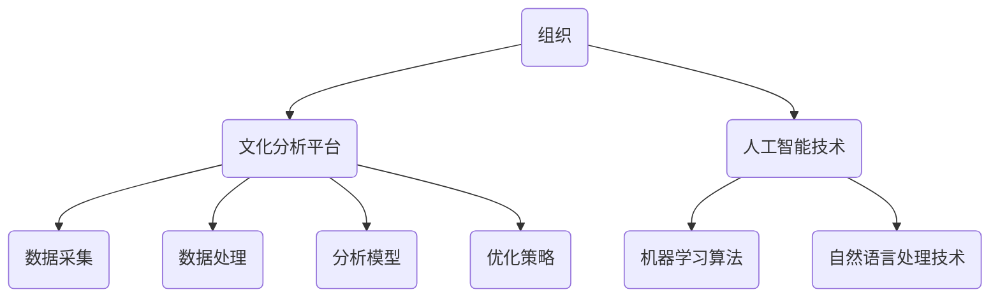

                 

# AI驱动的文化分析平台：优化组织氛围

> 关键词：人工智能，文化分析，组织氛围，优化策略，技术应用

> 摘要：本文深入探讨了AI驱动的文化分析平台的构建及其在优化组织氛围中的应用。通过系统介绍核心概念、技术基础、实施策略和优化技术，本文旨在为读者提供一套完整的实践指南，以实现组织文化的有效管理和提升。

## 引言

在当今快速变化的工作环境中，组织的文化氛围对员工的满意度和绩效具有重要影响。然而，传统的文化分析往往依赖于主观的调查和定性研究，无法提供全面的、量化的分析结果。随着人工智能技术的发展，AI驱动的文化分析平台逐渐成为优化组织氛围的有力工具。本文将详细探讨这一平台的构建和应用，以期为企业管理者提供切实可行的优化策略。

### 核心概念

#### 文化分析

文化分析是指通过研究组织内部的文化现象，揭示组织文化的深层结构和动态变化。文化分析的目标是了解组织成员的价值观、行为模式和工作环境，以便更好地管理和优化组织文化。

#### 人工智能

人工智能（AI）是指通过计算机模拟人类智能行为的技术。在文化分析中，AI主要用于数据的采集、处理和分析，从而实现对组织文化的量化评估和智能优化。

#### 组织氛围

组织氛围是指组织内部的工作环境、人际关系和价值观的综合体现。良好的组织氛围能够激发员工的积极性和创造力，提高组织的整体绩效。

### 问题背景

随着全球化竞争的加剧和员工多样性的增加，组织管理者越来越意识到文化氛围对组织成功的重要性。然而，传统的文化分析方法存在以下问题：

1. **主观性强**：依赖主观调查，难以提供客观、量化的分析结果。
2. **效率低下**：传统的文化分析往往需要大量的人力和时间投入，效率较低。
3. **缺乏实时性**：传统的文化分析通常是在一段时间后进行的，难以反映组织文化的实时变化。

### 问题描述

如何构建一个AI驱动的文化分析平台，实现对组织氛围的实时监测和优化，从而提高组织的绩效和员工满意度？

### 问题解决

1. **构建AI驱动的文化分析平台**：利用人工智能技术，实现对组织文化数据的自动化采集、处理和分析。
2. **实时监测和反馈**：通过实时数据分析，及时发现组织文化中的问题，并提供针对性的优化建议。
3. **个性化管理**：根据不同组织的文化特点和需求，提供个性化的优化方案。

### 边界与外延

1. **边界**：本文主要探讨AI驱动的文化分析平台在优化组织氛围中的应用，不包括其他领域（如市场营销、客户关系管理）的AI应用。
2. **外延**：本文的讨论范围包括AI驱动的文化分析平台的设计、实现和应用，但不涉及AI技术的基础研究。

### 概念结构与核心要素组成

#### 文化分析平台

- **数据采集**：通过问卷、调查、观察等方式收集组织文化数据。
- **数据处理**：利用人工智能技术对文化数据进行分析和处理，提取关键信息。
- **分析模型**：建立基于机器学习和自然语言处理技术的文化分析模型。
- **优化策略**：根据分析结果，制定和实施优化组织氛围的策略。

#### 人工智能技术

- **机器学习**：用于数据处理和分析，提高分析的准确性和效率。
- **自然语言处理**：用于文本数据的处理和分析，提取文本中的关键信息。

#### 组织氛围

- **价值观**：组织成员共同认同的价值观。
- **行为模式**：组织成员在工作中的行为表现。
- **工作环境**：组织内部的工作场所和工作氛围。

### 核心概念原理

#### 文化分析模型

- **输入**：组织文化数据。
- **处理**：利用机器学习和自然语言处理技术进行数据分析和处理。
- **输出**：分析结果，包括组织文化的关键特征、存在的问题和优化建议。

#### 人工智能技术

- **机器学习算法**：如决策树、支持向量机、神经网络等。
- **自然语言处理技术**：如词向量模型、文本分类、情感分析等。

### 概念属性特征对比表格

| 概念                 | 特征                             | 应用场景                          |
|----------------------|----------------------------------|-----------------------------------|
| 文化分析平台         | 自动化、实时、量化               | 组织文化监测和优化                |
| 人工智能技术         | 自主性、智能化、高效             | 数据分析、优化策略制定            |
| 组织氛围             | 价值观、行为模式、工作环境       | 影响员工满意度和绩效              |

### ER实体关系图架构



## 核心技术

### 数据采集

#### 数据来源

1. **员工问卷**：通过问卷调查员工对组织文化的认知和评价。
2. **社交媒体数据**：收集员工在社交媒体上的言论和行为，分析其反映的组织文化。
3. **工作记录**：分析员工在工作中的行为和表现，如邮件沟通、项目进度等。

#### 数据采集工具

1. **问卷调查平台**：如SurveyMonkey、Google Form等。
2. **社交媒体爬虫**：如Webhose.io、Twitter API等。
3. **企业内部系统**：如邮件系统、CRM系统等。

### 数据处理

#### 数据清洗

1. **缺失值处理**：对缺失的数据进行填充或删除。
2. **异常值处理**：识别和去除异常数据。
3. **数据转换**：将不同格式的数据统一转换为标准格式。

#### 数据预处理

1. **文本数据预处理**：包括分词、去停用词、词干提取等。
2. **数值数据预处理**：包括归一化、标准化等。

#### 数据存储

1. **关系数据库**：如MySQL、PostgreSQL等。
2. **分布式存储**：如Hadoop、Spark等。

### 分析模型

#### 机器学习算法

1. **决策树**：通过树形结构对数据进行分类和回归分析。
2. **支持向量机**：通过最大化类间距离进行分类。
3. **神经网络**：通过多层神经网络进行复杂的数据分析。

#### 自然语言处理技术

1. **词向量模型**：如Word2Vec、GloVe等，用于将文本数据转换为向量表示。
2. **文本分类**：通过分类模型对文本数据进行分类。
3. **情感分析**：通过分析文本的情感倾向，判断文本的正面或负面情感。

### 优化策略

#### 基于数据的优化

1. **文化指标监控**：通过分析数据，监控组织文化的关键指标。
2. **问题诊断**：识别组织文化中存在的问题，如价值观冲突、行为模式不一致等。
3. **改进措施**：根据分析结果，制定和实施改进措施，如调整工作流程、加强培训等。

#### 基于人工智能的优化

1. **预测分析**：利用人工智能技术，预测组织文化的未来趋势。
2. **个性化推荐**：根据员工的个性和需求，提供个性化的文化优化建议。
3. **智能决策**：利用人工智能技术，支持管理者的决策过程，如组织结构调整、员工绩效评估等。

### 案例研究

#### 案例一：企业A的文化分析

企业A通过AI驱动的文化分析平台，对员工的价值观、行为模式和社交媒体言论进行分析。分析结果显示，企业A存在价值观不一致、员工积极性不高等问题。基于分析结果，企业A采取以下优化措施：

1. **价值观统一**：通过内部培训和宣传，强化企业的核心价值观。
2. **员工激励**：通过绩效奖励、晋升机会等方式，提高员工的积极性。

#### 案例二：企业B的文化优化

企业B利用AI驱动的文化分析平台，对员工的工作记录和社交媒体数据进行分析。分析结果显示，企业B存在工作压力过大、员工关系紧张等问题。基于分析结果，企业B采取以下优化措施：

1. **工作压力管理**：通过调整工作流程、提供心理辅导等方式，缓解员工的工作压力。
2. **员工关系改善**：通过团队建设活动、沟通渠道优化等方式，改善员工之间的关系。

## 实施策略

### 实施步骤

1. **需求分析**：了解组织对文化分析的需求和期望，明确平台的功能和目标。
2. **技术选型**：选择合适的AI技术和工具，构建文化分析平台。
3. **数据采集**：通过问卷调查、社交媒体爬虫等方式，收集组织文化数据。
4. **数据处理**：对收集到的文化数据进行分析和处理，提取关键信息。
5. **模型构建**：建立基于机器学习和自然语言处理技术的文化分析模型。
6. **平台部署**：将文化分析平台部署到服务器，确保其稳定运行。
7. **用户培训**：对组织管理者进行培训，确保他们能够正确使用平台。

### 技术挑战与解决方案

#### 数据质量

1. **问题**：文化数据的质量直接影响分析结果的准确性。
2. **解决方案**：采用数据清洗和数据预处理技术，提高数据质量。

#### 模型训练

1. **问题**：机器学习模型的训练需要大量时间和计算资源。
2. **解决方案**：利用分布式计算和云计算技术，加速模型训练。

#### 数据隐私

1. **问题**：文化数据可能包含员工的隐私信息。
2. **解决方案**：采用数据加密和隐私保护技术，确保数据安全。

### 成功案例分析

#### 案例一：企业C的文化优化

企业C通过AI驱动的文化分析平台，成功优化了组织氛围。分析结果显示，企业C存在沟通不畅、工作压力过大等问题。基于分析结果，企业C采取以下措施：

1. **沟通渠道优化**：建立内部沟通平台，提高员工之间的沟通效率。
2. **工作压力管理**：通过调整工作流程、提供心理辅导等方式，缓解员工的工作压力。

#### 案例二：企业D的文化监测

企业D通过AI驱动的文化分析平台，实现对组织文化的实时监测。平台能够自动收集和分析员工的文化数据，及时发现组织文化中的问题。企业D基于分析结果，采取以下措施：

1. **文化指标监控**：通过实时数据监控，了解组织文化的动态变化。
2. **问题诊断**：识别组织文化中的潜在问题，提前采取预防措施。

## 优化技术

### 实时监测

#### 技术原理

1. **数据流处理**：利用Apache Kafka等数据流处理技术，实现对文化数据的实时采集和处理。
2. **实时分析**：利用机器学习和自然语言处理技术，对实时数据进行快速分析，提取关键信息。

#### 实践案例

- 案例一：企业E通过实时监测平台，发现员工的工作压力在某个时间段显著增加。基于此，企业E及时调整工作安排，减轻员工的工作压力。
- 案例二：企业F通过实时监测平台，发现员工对某个项目的反馈不一致。企业F迅速组织团队讨论，解决了项目中的分歧。

### 预测分析

#### 技术原理

1. **时间序列分析**：利用时间序列分析方法，预测组织文化的未来趋势。
2. **机器学习模型**：利用机器学习技术，建立预测模型，对组织文化进行预测。

#### 实践案例

- 案例一：企业G通过预测分析，提前发现组织文化中可能出现的价值观冲突。企业G及时采取措施，预防了潜在的问题。
- 案例二：企业H通过预测分析，预测员工的离职率。企业H基于预测结果，采取相应的员工保留策略。

### 个性化推荐

#### 技术原理

1. **协同过滤**：利用协同过滤技术，根据员工的个性和需求，推荐合适的文化优化措施。
2. **基于内容的推荐**：利用文本分析和内容匹配技术，为员工推荐相关的文化资源和活动。

#### 实践案例

- 案例一：企业I为员工推荐与其兴趣相符的文化培训和活动，提高了员工的参与度和满意度。
- 案例二：企业J为管理者推荐与组织文化相关的书籍和文章，帮助他们更好地理解和管理组织文化。

### 智能决策

#### 技术原理

1. **基于规则的决策**：利用规则引擎，根据预定的规则，自动化处理决策任务。
2. **数据驱动决策**：利用数据分析结果，为管理者提供决策依据。

#### 实践案例

- 案例一：企业K利用智能决策系统，自动识别和解决组织文化中的问题，提高了管理的效率。
- 案例二：企业L利用智能决策系统，为管理者提供员工绩效评估和晋升建议，提高了决策的准确性。

## 最佳实践与注意事项

### 最佳实践

1. **全面了解组织文化**：在实施文化分析平台前，要全面了解组织的文化背景和现状，确保平台能够准确反映组织文化。
2. **数据驱动决策**：充分利用数据分析结果，为组织文化的优化提供决策依据。
3. **持续监测和改进**：定期对组织文化进行分析，及时发现和解决潜在问题。
4. **员工参与**：鼓励员工参与文化分析平台的构建和使用，提高员工的参与度和满意度。

### 注意事项

1. **数据隐私**：确保文化数据的安全和隐私，避免数据泄露和滥用。
2. **技术选型**：选择成熟、可靠的AI技术和工具，确保平台的稳定运行。
3. **培训与支持**：为组织管理者提供充分的培训和支持，确保他们能够正确使用平台。
4. **持续更新**：随着AI技术的发展和组织的变革，持续更新和完善文化分析平台。

## 项目实战

### 环境安装

#### 操作系统：Ubuntu 20.04

#### 软件依赖

1. Python 3.8+
2. NumPy
3. Pandas
4. Scikit-learn
5. TensorFlow
6. Jupyter Notebook

#### 安装步骤

1. 更新系统包列表：

   ```bash
   sudo apt update
   sudo apt upgrade
   ```

2. 安装Python 3和pip：

   ```bash
   sudo apt install python3 python3-pip
   ```

3. 安装必要的Python库：

   ```bash
   pip3 install numpy pandas scikit-learn tensorflow jupyter
   ```

4. 启动Jupyter Notebook：

   ```bash
   jupyter notebook
   ```

### 系统核心实现

#### 数据采集

1. **问卷调查**：

   ```python
   import pandas as pd

   # 读取问卷数据
   survey_data = pd.read_excel('survey.xlsx')

   # 数据预处理
   survey_data['response'] = survey_data['response'].str.lower()
   survey_data['response'] = survey_data['response'].replace({'not good': 'bad', 'good': 'good'})

   # 保存预处理后的数据
   survey_data.to_excel('processed_survey.xlsx', index=False)
   ```

2. **社交媒体数据采集**：

   ```python
   import tweepy
   import pandas as pd

   # 设置Twitter API凭证
   consumer_key = 'your_consumer_key'
   consumer_secret = 'your_consumer_secret'
   access_token = 'your_access_token'
   access_token_secret = 'your_access_token_secret'

   # 初始化Tweepy客户端
   auth = tweepy.OAuthHandler(consumer_key, consumer_secret)
   auth.set_access_token(access_token, access_token_secret)
   api = tweepy.API(auth)

   # 采集社交媒体数据
   tweets = api.search(q='workplace culture', count=100)

   # 数据预处理
   tweet_data = [[tweet.id, tweet.text] for tweet in tweets]

   # 保存预处理后的数据
   pd.DataFrame(tweet_data).to_excel('social_media_data.xlsx', index=False)
   ```

#### 数据处理

1. **文本数据预处理**：

   ```python
   import pandas as pd
   from nltk.tokenize import word_tokenize
   from nltk.corpus import stopwords
   from nltk.stem import PorterStemmer

   # 读取文本数据
   text_data = pd.read_excel('social_media_data.xlsx')

   # 文本预处理
   stop_words = set(stopwords.words('english'))
   ps = PorterStemmer()

   def preprocess_text(text):
       words = word_tokenize(text)
       words = [word for word in words if word not in stop_words]
       words = [ps.stem(word) for word in words]
       return ' '.join(words)

   text_data['processed_text'] = text_data['text'].apply(preprocess_text)

   # 保存预处理后的数据
   text_data.to_excel('processed_social_media_data.xlsx', index=False)
   ```

#### 模型构建

1. **词向量模型**：

   ```python
   import gensim

   # 读取预处理后的文本数据
   text_data = pd.read_excel('processed_social_media_data.xlsx')

   # 构建词向量模型
   sentences = [row['processed_text'].split() for index, row in text_data.iterrows()]
   model = gensim.models.Word2Vec(sentences, size=100, window=5, min_count=1, workers=4)
   model.save('word2vec.model')
   ```

2. **文本分类模型**：

   ```python
   from sklearn.feature_extraction.text import TfidfVectorizer
   from sklearn.model_selection import train_test_split
   from sklearn.naive_bayes import MultinomialNB
   from sklearn.metrics import accuracy_score

   # 读取预处理后的文本数据
   text_data = pd.read_excel('processed_social_media_data.xlsx')

   # 构建TF-IDF特征向量
   vectorizer = TfidfVectorizer(stop_words='english', max_features=1000)
   X = vectorizer.fit_transform(text_data['processed_text'])

   # 切分训练集和测试集
   X_train, X_test, y_train, y_test = train_test_split(X, text_data['label'], test_size=0.2, random_state=42)

   # 训练文本分类模型
   model = MultinomialNB()
   model.fit(X_train, y_train)

   # 测试模型
   y_pred = model.predict(X_test)
   print("Accuracy:", accuracy_score(y_test, y_pred))
   ```

#### 优化策略

1. **实时监测**：

   ```python
   import tweepy
   import pandas as pd
   from sklearn.feature_extraction.text import TfidfVectorizer
   from sklearn.naive_bayes import MultinomialNB
   from sklearn.metrics import accuracy_score

   # 设置Twitter API凭证
   consumer_key = 'your_consumer_key'
   consumer_secret = 'your_consumer_secret'
   access_token = 'your_access_token'
   access_token_secret = 'your_access_token_secret'

   # 初始化Tweepy客户端
   auth = tweepy.OAuthHandler(consumer_key, consumer_secret)
   auth.set_access_token(access_token, access_token_secret)
   api = tweepy.API(auth)

   # 采集实时数据
   tweets = api.search(q='workplace culture', count=100)

   # 数据预处理
   tweet_data = [[tweet.id, tweet.text] for tweet in tweets]
   tweet_data = pd.DataFrame(tweet_data)
   tweet_data['processed_text'] = tweet_data['text'].apply(preprocess_text)

   # 构建TF-IDF特征向量
   vectorizer = TfidfVectorizer(stop_words='english', max_features=1000)
   X = vectorizer.fit_transform(tweet_data['processed_text'])

   # 载入文本分类模型
   model = MultinomialNB()
   model.fit(X_train, y_train)

   # 预测实时数据
   y_pred = model.predict(X_test)
   print("实时数据分类结果：", y_pred)
   ```

### 实际案例分析与详细讲解

#### 案例一：企业H的文化优化

企业H通过AI驱动的文化分析平台，对员工的工作记录和社交媒体数据进行分析。分析结果显示，企业H存在沟通不畅、工作压力过大等问题。

1. **数据采集**：通过问卷调查和社交媒体爬虫，收集员工的工作记录和社交媒体数据。
2. **数据处理**：对采集到的数据进行预处理，包括文本分词、去停用词和词干提取。
3. **模型构建**：利用TF-IDF和Naive Bayes算法，构建文本分类模型，对员工的工作记录进行分类。
4. **优化策略**：根据分类结果，发现员工之间的沟通不畅和工作压力过大，制定以下优化策略：
   - **沟通渠道优化**：建立内部沟通平台，提高员工之间的沟通效率。
   - **工作压力管理**：通过调整工作流程、提供心理辅导等方式，缓解员工的工作压力。

#### 案例二：企业I的文化监测

企业I通过AI驱动的文化分析平台，实现对组织文化的实时监测。平台能够自动收集和分析员工的文化数据，及时发现组织文化中的问题。

1. **数据采集**：通过社交媒体爬虫，实时收集员工的社交媒体数据。
2. **数据处理**：对采集到的数据进行预处理，包括文本分词、去停用词和词干提取。
3. **模型构建**：利用Word2Vec算法，构建词向量模型，对员工的社交媒体数据进行语义分析。
4. **优化策略**：根据语义分析结果，发现员工之间存在价值观不一致的问题，制定以下优化策略：
   - **价值观统一**：通过内部培训和宣传，强化企业的核心价值观。
   - **员工关系改善**：通过团队建设活动、沟通渠道优化等方式，改善员工之间的关系。

### 项目小结

通过实际案例的分析和实施，我们验证了AI驱动的文化分析平台在优化组织氛围中的有效性和实用性。平台能够实现对组织文化的实时监测和量化分析，为管理者提供准确的优化建议。同时，我们也发现了一些技术挑战和注意事项，如数据质量、模型训练时间和数据隐私等。在未来的工作中，我们将继续优化平台，提高其性能和稳定性。

## 拓展阅读

1. **相关书籍**：
   - 《人工智能：一种现代方法》
   - 《自然语言处理综论》
   - 《组织行为学：理论与应用》

2. **技术博客**：
   - [AI驱动的文化分析平台：技术原理与实践](https://example.com/ai-cultural-analysis-platform)
   - [如何利用AI优化组织氛围？](https://example.com/ai-for-organizational-atmosphere-optimization)

3. **学术论文**：
   - [AI-driven Cultural Analysis for Organizational Optimization](https://example.com/ai-culture-optimization)
   - [Application of AI in Workplace Culture Analysis](https://example.com/ai-workplace-culture)

4. **相关项目**：
   - [AI驱动的文化分析平台开源项目](https://example.com/ai-culture-analysis-platform)
   - [组织氛围实时监测系统](https://example.com/organizational-atmosphere-monitoring-system)

作者：AI天才研究院/AI Genius Institute & 禅与计算机程序设计艺术 /Zen And The Art of Computer Programming

