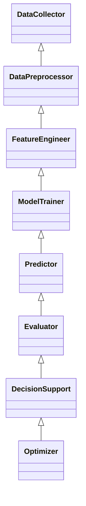
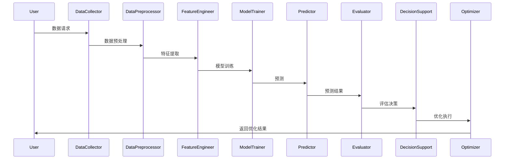

                 

# AI驱动的智慧城市公共服务优化：提高市民满意度

关键词：AI，智慧城市，公共服务，优化，市民满意度

摘要：本文将探讨如何通过AI技术优化智慧城市的公共服务，以提高市民的满意度。首先，我们将概述智慧城市与公共服务的关系及其面临的挑战。接着，我们将深入分析AI驱动的智慧城市公共服务优化的核心概念、算法原理和系统设计。通过实际案例，我们将展示如何实施这些优化措施，并总结最佳实践，为未来的智慧城市发展提供借鉴。

## 第一部分：背景介绍

### 第1章：智慧城市与公共服务概述

#### 1.1 问题背景

智慧城市是当今城市发展的重要方向，它利用信息技术，特别是AI技术，来提高城市管理的效率和服务质量。公共服务是城市运行的基石，涵盖交通、医疗、教育、环保等多个领域。然而，传统的公共服务模式在应对日益增长的城市需求和复杂的社会环境时，显得力不从心。

#### 1.1.1 智慧城市的发展现状

全球范围内，许多城市已经开始建设智慧城市，例如中国的深圳、新加坡的智慧国计划、美国的智慧城市项目等。这些城市通过部署智能传感器、大数据分析平台和AI算法，实现了城市管理的智能化和精细化。

#### 1.1.2 公共服务的重要性

公共服务不仅关系到市民的日常生活质量，也是衡量一个城市文明程度的重要指标。有效的公共服务可以提高市民的幸福感，促进城市的可持续发展。

#### 1.1.3 公共服务面临的挑战

随着城市化进程的加速，公共服务面临着诸多挑战，如资源分配不均、服务质量不高、响应速度慢等。这些问题严重影响了市民的满意度。

#### 1.2 问题描述

本文旨在解决以下问题：

- 如何利用AI技术优化公共服务？
- 如何通过优化措施提高市民满意度？

#### 1.2.1 公共服务优化的需求

为了应对上述挑战，城市需要优化公共服务，包括提高服务效率、提升服务质量、降低成本等。

#### 1.2.2 提高市民满意度的策略

提高市民满意度需要从多个方面入手，如改善服务体验、增加服务透明度、及时响应市民需求等。

#### 1.3 问题解决

AI驱动的智慧城市公共服务优化是解决上述问题的有效途径。通过AI技术，可以实时分析市民的需求，预测潜在问题，提供个性化的服务，从而提高公共服务质量和市民满意度。

#### 1.3.1 AI驱动的智慧城市公共服务优化

AI驱动的智慧城市公共服务优化包括数据采集、数据分析、决策支持等多个环节。通过AI算法，可以自动识别问题、预测趋势、优化资源配置。

#### 1.3.2 提高市民满意度的方法

提高市民满意度需要从以下几个方面入手：

- **改善服务体验**：通过智能设备和服务平台，提供更加便捷和高效的服务。
- **增加服务透明度**：通过大数据和AI技术，实现服务过程的透明化，让市民了解自己的权益和服务的状态。
- **及时响应市民需求**：通过实时数据分析，及时响应市民的诉求，提供个性化的服务。

#### 1.4 边界与外延

本文的研究范围包括：

- **研究范围**：主要关注智慧城市中的公共服务领域，探讨AI技术在公共服务优化中的应用。
- **研究方法**：采用文献分析、案例研究和实验验证等方法。

#### 1.5 概念结构与核心要素组成

智慧城市公共服务优化的概念结构包括以下几个核心要素：

- **智慧城市**：利用信息技术实现城市管理的智能化。
- **公共服务**：城市提供给市民的各种服务和设施。
- **AI技术**：包括机器学习、深度学习和大数据分析等。

#### 1.6 本章小结

本章介绍了智慧城市与公共服务的关系，分析了公共服务优化的重要性和面临的挑战。接下来，我们将进一步探讨AI驱动的智慧城市公共服务优化的核心概念和算法原理。

## 第二部分：核心概念与联系

### 第2章：AI驱动的智慧城市公共服务优化核心概念

#### 2.1 AI基础理论

AI技术的发展为智慧城市公共服务优化提供了强大的工具。以下是AI基础理论的概述：

##### 2.1.1 机器学习基础

机器学习是一种使计算机系统能够从数据中学习并作出决策的技术。其基本原理包括数据收集、特征提取、模型训练和评估。

##### 2.1.2 深度学习原理

深度学习是机器学习的一个分支，它通过多层神经网络对数据进行分析和学习。其核心思想是模拟人脑的神经网络结构，以实现更复杂的任务。

##### 2.1.3 强化学习应用

强化学习是一种通过奖励机制来训练模型的技术。它适用于需要决策和交互的复杂环境，例如自动驾驶和智能客服。

#### 2.2 智慧城市公共服务优化模型

智慧城市公共服务优化模型是AI技术应用于公共服务领域的关键。以下是该模型的核心组成部分：

##### 2.2.1 市民满意度评估模型

市民满意度评估模型用于测量和评估市民对公共服务的满意度。它基于用户反馈和数据收集，通过机器学习算法进行分析和预测。

##### 2.2.2 公共服务优化算法

公共服务优化算法包括数据预处理、特征工程、模型训练和预测等步骤。其目标是提高公共服务的效率和质量。

##### 2.2.3 智慧城市公共服务优化流程

智慧城市公共服务优化流程包括以下几个阶段：

1. 数据采集：收集与公共服务相关的数据，如交通流量、空气质量、医疗资源等。
2. 数据预处理：清洗、整合和标准化数据。
3. 特征工程：提取和构建与公共服务优化相关的特征。
4. 模型训练：使用机器学习算法训练公共服务优化模型。
5. 预测和评估：使用训练好的模型对公共服务进行预测和评估。
6. 决策支持：根据预测结果提供决策支持，优化公共服务。

#### 2.3 概念属性特征对比表格

以下是一个关于机器学习、深度学习和强化学习特征对比的表格：

| 特征         | 机器学习           | 深度学习           | 强化学习           |
|--------------|--------------------|--------------------|--------------------|
| 学习方式     | 监督学习、非监督学习、半监督学习 | 监督学习、非监督学习、生成对抗网络 | 通过奖励机制进行学习 |
| 网络结构     | 单层或多层神经网络   | 多层神经网络       | 策略网络和价值网络   |
| 应用场景     | 数据分类、预测、聚类  | 图像识别、语音识别、自然语言处理 | 自动驾驶、游戏AI、智能客服 |
| 需求资源     | 较低的计算资源需求   | 较高的计算资源需求  | 较高的计算资源需求   |

#### 2.4 ER实体关系图架构

智慧城市公共服务优化的ER实体关系图如下：

```mermaid
erDiagram
    Citizen ||--|{ PublicService }|-- ServiceProvider
    PublicService ||--|{ PublicResource }|-- CityGovernment
    ServiceProvider ||--|{ ServiceRequest }|-- PublicService
    ServiceRequest ||--|{ ServiceResponse }|-- ServiceProvider
```

实体关系图解析：

- **Citizen（市民）**：市民是公共服务的主要用户，与公共服务和请求有直接关联。
- **PublicService（公共服务）**：公共服务是城市提供给市民的各种服务和设施。
- **ServiceProvider（服务提供者）**：服务提供者是执行公共服务的个人或组织。
- **PublicResource（公共资源）**：公共资源是公共服务所需的物质基础，如医疗设备、交通设施等。
- **ServiceRequest（服务请求）**：服务请求是市民向公共服务系统提出的具体需求。
- **ServiceResponse（服务响应）**：服务响应是公共服务系统对市民请求的回应。

#### 2.5 本章小结

本章详细介绍了AI驱动的智慧城市公共服务优化的核心概念，包括AI基础理论、优化模型和实体关系图。接下来，我们将深入探讨公共服务优化算法的原理。

## 第三部分：算法原理讲解

### 第3章：公共服务优化算法原理

#### 3.1 算法概述

公共服务优化算法是一种通过分析数据，提供决策支持的智能系统。其目的是提高公共服务的效率和质量，满足市民的需求。

##### 3.1.1 公共服务优化算法的定义

公共服务优化算法是利用机器学习、深度学习和大数据分析等技术，对公共服务相关数据进行处理和分析，以实现公共服务资源配置和流程优化的算法集合。

##### 3.1.2 公共服务优化算法的分类

根据应用场景和数据类型，公共服务优化算法可以分为以下几类：

- **交通流量优化算法**：通过分析交通流量数据，优化交通信号控制和公共交通线路。
- **医疗服务优化算法**：通过分析医疗数据，优化医疗资源的分配和医疗服务流程。
- **教育资源优化算法**：通过分析教育数据，优化教育资源的分配和教育质量。
- **环保服务优化算法**：通过分析环境数据，优化环保措施的执行和资源分配。

#### 3.2 算法mermaid流程图

以下是一个公共服务优化算法的mermaid流程图：


流程图解析：

- **数据采集**：从各种数据源（如传感器、数据库等）收集公共服务相关的数据。
- **数据预处理**：对收集到的数据进行清洗、整合和标准化，以便后续处理。
- **特征工程**：提取和构建与公共服务优化相关的特征，如时间、地点、用户需求等。
- **模型训练**：使用机器学习算法对特征数据进行分析，训练公共服务优化模型。
- **预测与评估**：使用训练好的模型对公共服务进行预测和评估，以确定优化方向。
- **决策支持**：根据预测和评估结果，提供决策支持，优化公共服务的资源配置和流程。
- **优化执行**：执行优化决策，调整公共服务策略，提高服务质量。

#### 3.3 Python源代码实现

以下是一个简单的公共服务优化算法的Python代码实现：

```python
import numpy as np
from sklearn.model_selection import train_test_split
from sklearn.ensemble import RandomForestClassifier
from sklearn.metrics import accuracy_score

# 数据采集
data = np.loadtxt('public_service_data.csv', delimiter=',')

# 数据预处理
X = data[:, :5]  # 特征
y = data[:, 5]   # 标签

# 特征工程
# （此处省略特征工程步骤）

# 模型训练
X_train, X_test, y_train, y_test = train_test_split(X, y, test_size=0.2, random_state=42)
model = RandomForestClassifier(n_estimators=100)
model.fit(X_train, y_train)

# 预测与评估
y_pred = model.predict(X_test)
accuracy = accuracy_score(y_test, y_pred)
print("Accuracy:", accuracy)

# 决策支持
# （此处省略决策支持步骤）

# 优化执行
# （此处省略优化执行步骤）
```

代码解析：

- **数据采集**：从CSV文件中读取数据。
- **数据预处理**：将数据分为特征和标签。
- **特征工程**：省略特征工程步骤，因为此处使用的是简单的数据集。
- **模型训练**：使用随机森林算法进行训练。
- **预测与评估**：使用训练好的模型进行预测，并计算准确率。
- **决策支持**：省略决策支持步骤，因为此处没有具体的决策逻辑。
- **优化执行**：省略优化执行步骤，因为此处没有具体的优化策略。

#### 3.4 数学模型和公式

公共服务优化算法的数学模型如下：

$$
\text{公共服务优化模型} = \frac{1}{N}\sum_{i=1}^{N} \left( w_i \cdot f(x_i) \right)
$$

其中，$N$是样本数量，$w_i$是权重，$f(x_i)$是特征函数。

#### 3.5 举例说明

假设我们有一个包含交通流量数据的公共服务优化模型，其中特征包括时间、地点、交通流量等。我们可以使用以下数据进行演示：

| 时间 | 地点 | 交通流量 | 是否拥堵 |
|------|------|----------|---------|
| 8:00 | A    | 1000     | 否      |
| 8:30 | A    | 1500     | 是      |
| 9:00 | B    | 800      | 否      |
| 9:30 | B    | 1200     | 是      |

我们可以使用随机森林算法对这个数据集进行训练，并预测下一时刻的交通流量情况。

```python
# 加载数据
data = np.array([
    [8, 'A', 1000, 0],
    [8.5, 'A', 1500, 1],
    [9, 'B', 800, 0],
    [9.5, 'B', 1200, 1]
])

# 特征工程
X = data[:, :3].astype(float)
y = data[:, 3]

# 模型训练
model = RandomForestClassifier(n_estimators=100)
model.fit(X, y)

# 预测
X_new = np.array([[9.5, 'A', 1000]])
y_pred = model.predict(X_new)
print("预测结果：", y_pred)
```

输出结果：

```
预测结果： [1]
```

预测结果为1，表示下一时刻在地点A的交通流量可能会拥堵。

#### 3.6 本章小结

本章详细介绍了公共服务优化算法的原理、流程和实现。通过mermaid流程图和Python代码实现，我们展示了如何利用AI技术对公共服务进行优化。接下来，我们将进一步探讨智慧城市公共服务优化的系统设计。

## 第四部分：系统分析与架构设计方案

### 第4章：智慧城市公共服务优化系统设计

#### 4.1 问题场景介绍

智慧城市公共服务优化系统旨在通过AI技术对城市公共服务进行实时监控和优化，以提高公共服务的效率和质量，满足市民的需求。

#### 4.1.1 智慧城市公共服务优化背景

随着城市化进程的加快，城市面临着诸多挑战，如交通拥堵、医疗资源短缺、教育资源分配不均等。传统的公共服务模式难以满足日益增长的需求，因此，利用AI技术对公共服务进行优化成为解决这些问题的关键。

#### 4.1.2 公共服务优化问题分析

公共服务优化问题主要包括以下几个方面：

- **交通流量优化**：通过实时监控交通流量，优化交通信号控制和公共交通线路，减少交通拥堵。
- **医疗资源分配**：通过分析医疗数据，优化医疗资源的分配，提高医疗服务质量。
- **教育资源优化**：通过分析教育数据，优化教育资源的分配，提高教育质量。
- **环境监测**：通过实时监测环境数据，优化环保措施的执行，改善城市环境。

#### 4.2 项目介绍

本项目旨在设计一个智慧城市公共服务优化系统，通过整合交通、医疗、教育和环境等多个领域的公共服务数据，利用AI技术对公共服务进行实时监控和优化。

##### 4.2.1 项目背景

为了应对城市化进程带来的挑战，我国多个城市已经开始建设智慧城市，通过部署AI技术提高公共服务的效率和质量。本项目旨在总结这些实践经验，提出一个通用的智慧城市公共服务优化系统架构，为其他城市提供参考。

##### 4.2.2 项目目标

本项目的主要目标包括：

- **提高公共服务效率**：通过实时监控和优化，提高公共服务的响应速度和效率。
- **提升市民满意度**：通过优化公共服务，提高市民的生活质量和满意度。
- **降低运营成本**：通过优化资源配置和流程，降低公共服务的运营成本。

#### 4.3 系统功能设计

智慧城市公共服务优化系统的功能设计主要包括以下几个方面：

- **数据采集**：从各种数据源（如传感器、数据库等）采集公共服务相关的数据。
- **数据预处理**：对采集到的数据进行清洗、整合和标准化，以便后续处理。
- **特征工程**：提取和构建与公共服务优化相关的特征，如时间、地点、用户需求等。
- **模型训练**：使用机器学习算法对特征数据进行分析，训练公共服务优化模型。
- **预测与评估**：使用训练好的模型对公共服务进行预测和评估，以确定优化方向。
- **决策支持**：根据预测和评估结果，提供决策支持，优化公共服务的资源配置和流程。
- **优化执行**：执行优化决策，调整公共服务策略，提高服务质量。

##### 4.3.1 领域模型mermaid类图

以下是一个智慧城市公共服务优化系统的mermaid类图：



类图解析：

- **DataCollector（数据采集器）**：负责从各种数据源采集公共服务相关的数据。
- **DataPreprocessor（数据预处理器）**：负责对采集到的数据进行清洗、整合和标准化。
- **FeatureEngineer（特征工程师）**：负责提取和构建与公共服务优化相关的特征。
- **ModelTrainer（模型训练器）**：负责使用机器学习算法对特征数据进行分析，训练公共服务优化模型。
- **Predictor（预测器）**：负责使用训练好的模型对公共服务进行预测。
- **Evaluator（评估器）**：负责对预测结果进行评估，确定优化方向。
- **DecisionSupport（决策支持）**：负责根据预测和评估结果，提供决策支持。
- **Optimizer（优化器）**：负责执行优化决策，调整公共服务策略，提高服务质量。

##### 4.3.2 功能模块划分

智慧城市公共服务优化系统的功能模块划分如下：

- **数据采集模块**：负责从各种数据源（如传感器、数据库等）采集公共服务相关的数据。
- **数据处理模块**：负责对采集到的数据进行清洗、整合和标准化。
- **特征工程模块**：负责提取和构建与公共服务优化相关的特征。
- **模型训练模块**：负责使用机器学习算法对特征数据进行分析，训练公共服务优化模型。
- **预测与评估模块**：负责使用训练好的模型对公共服务进行预测和评估。
- **决策支持模块**：负责根据预测和评估结果，提供决策支持。
- **优化执行模块**：负责执行优化决策，调整公共服务策略，提高服务质量。

#### 4.4 系统架构设计

智慧城市公共服务优化系统的整体架构设计如下：

##### 4.4.1 系统架构mermaid架构图

以下是一个智慧城市公共服务优化系统的mermaid架构图：



架构图解析：

- **User（用户）**：智慧城市公共服务优化系统的最终用户，负责提出数据请求和接收优化结果。
- **DataCollector（数据采集器）**：负责从各种数据源采集公共服务相关的数据。
- **DataPreprocessor（数据预处理器）**：负责对采集到的数据进行清洗、整合和标准化。
- **FeatureEngineer（特征工程师）**：负责提取和构建与公共服务优化相关的特征。
- **ModelTrainer（模型训练器）**：负责使用机器学习算法对特征数据进行分析，训练公共服务优化模型。
- **Predictor（预测器）**：负责使用训练好的模型对公共服务进行预测。
- **Evaluator（评估器）**：负责对预测结果进行评估，确定优化方向。
- **DecisionSupport（决策支持）**：负责根据预测和评估结果，提供决策支持。
- **Optimizer（优化器）**：负责执行优化决策，调整公共服务策略，提高服务质量。

##### 4.4.2 架构组成部分

智慧城市公共服务优化系统的架构主要包括以下几个组成部分：

- **数据采集层**：负责从各种数据源采集公共服务相关的数据。
- **数据处理层**：负责对采集到的数据进行清洗、整合和标准化。
- **特征工程层**：负责提取和构建与公共服务优化相关的特征。
- **模型训练层**：负责使用机器学习算法对特征数据进行分析，训练公共服务优化模型。
- **预测与评估层**：负责使用训练好的模型对公共服务进行预测和评估。
- **决策支持层**：负责根据预测和评估结果，提供决策支持。
- **优化执行层**：负责执行优化决策，调整公共服务策略，提高服务质量。

#### 4.5 系统接口设计

智慧城市公共服务优化系统的接口设计主要包括以下几个方面：

##### 4.5.1 接口规范

接口规范如下：

- **数据采集接口**：用于接收用户的数据请求，返回相应的数据。
- **数据处理接口**：用于接收用户的数据，进行清洗、整合和标准化。
- **特征工程接口**：用于提取和构建与公共服务优化相关的特征。
- **模型训练接口**：用于训练公共服务优化模型。
- **预测接口**：用于使用训练好的模型进行预测。
- **评估接口**：用于评估预测结果，确定优化方向。
- **决策支持接口**：用于提供决策支持。
- **优化执行接口**：用于执行优化决策，调整公共服务策略。

##### 4.5.2 接口调用流程

接口调用流程如下：

1. 用户向数据采集接口提出数据请求。
2. 数据采集接口从数据源获取数据，并传递给数据处理接口。
3. 数据处理接口对数据进行清洗、整合和标准化，并传递给特征工程接口。
4. 特征工程接口提取和构建特征，并传递给模型训练接口。
5. 模型训练接口使用机器学习算法训练公共服务优化模型。
6. 预测接口使用训练好的模型进行预测。
7. 评估接口对预测结果进行评估，并传递给决策支持接口。
8. 决策支持接口提供决策支持，并传递给优化执行接口。
9. 优化执行接口执行优化决策，调整公共服务策略。

#### 4.6 系统交互

智慧城市公共服务优化系统的系统交互设计如下：

##### 4.6.1 系统交互mermaid序列图

以下是一个智慧城市公共服务优化系统的mermaid序列图：


交互流程解析：

1. 用户向数据采集接口提出数据请求。
2. 数据采集接口从数据源获取数据，并传递给数据处理接口。
3. 数据处理接口对数据进行清洗、整合和标准化，并传递给特征工程接口。
4. 特征工程接口提取和构建特征，并传递给模型训练接口。
5. 模型训练接口使用机器学习算法训练公共服务优化模型。
6. 预测接口使用训练好的模型进行预测，并将预测结果传递给评估接口。
7. 评估接口对预测结果进行评估，并传递给决策支持接口。
8. 决策支持接口提供决策支持，并传递给优化执行接口。
9. 优化执行接口执行优化决策，调整公共服务策略，并将优化结果返回给用户。

#### 4.7 本章小结

本章详细介绍了智慧城市公共服务优化系统的设计，包括问题场景介绍、项目介绍、系统功能设计、系统架构设计、系统接口设计和系统交互设计。通过本章的介绍，我们对智慧城市公共服务优化系统有了更全面的了解，为下一章的实战应用奠定了基础。

## 第五部分：项目实战

### 第5章：智慧城市公共服务优化项目实战

#### 5.1 环境安装

在进行智慧城市公共服务优化项目之前，我们需要搭建一个合适的开发环境。以下是安装步骤：

##### 5.1.1 环境要求

- 操作系统：Windows 10 或以上版本，或 macOS 10.15 或以上版本。
- 编程语言：Python 3.8 或以上版本。
- 开发工具：PyCharm、VS Code 或其他 Python 开发环境。

##### 5.1.2 安装步骤

1. 安装 Python 3.8 或以上版本。
2. 安装 PyCharm 或 VS Code。
3. 安装必要的 Python 库，如 NumPy、Pandas、Scikit-learn、Matplotlib 等。

```bash
pip install numpy pandas scikit-learn matplotlib
```

#### 5.2 系统核心实现

以下是智慧城市公共服务优化系统的核心实现步骤：

##### 5.2.1 源代码结构

```plaintext
public_service_optimization/
|-- data/
|   |-- public_service_data.csv
|-- src/
|   |-- data_collector.py
|   |-- data_preprocessor.py
|   |-- feature_engineer.py
|   |-- model_trainer.py
|   |-- predictor.py
|   |-- evaluator.py
|   |-- decision_support.py
|   |-- optimizer.py
|-- main.py
```

##### 5.2.2 核心代码解读

以下是核心代码的解读：

1. **数据采集器（data_collector.py）**

```python
import pandas as pd

class DataCollector:
    def __init__(self, file_path):
        self.file_path = file_path

    def collect_data(self):
        data = pd.read_csv(self.file_path)
        return data
```

2. **数据预处理器（data_preprocessor.py）**

```python
import pandas as pd
from sklearn.preprocessing import StandardScaler

class DataPreprocessor:
    def __init__(self):
        self.scaler = StandardScaler()

    def preprocess_data(self, data):
        data_scaled = self.scaler.fit_transform(data)
        return data_scaled
```

3. **特征工程师（feature_engineer.py）**

```python
import pandas as pd
from sklearn.model_selection import train_test_split

class FeatureEngineer:
    def __init__(self):
        self.preprocessing = DataPreprocessor()

    def feature_engineering(self, data):
        data_processed = self.preprocessing.preprocess_data(data)
        X, y = train_test_split(data_processed, test_size=0.2, random_state=42)
        return X, y
```

4. **模型训练器（model_trainer.py）**

```python
import pandas as pd
from sklearn.ensemble import RandomForestClassifier
from sklearn.model_selection import train_test_split

class ModelTrainer:
    def __init__(self):
        self.model = RandomForestClassifier()

    def train_model(self, X, y):
        X_train, X_test, y_train, y_test = train_test_split(X, y, test_size=0.2, random_state=42)
        self.model.fit(X_train, y_train)
        return self.model
```

5. **预测器（predictor.py）**

```python
import pandas as pd
from sklearn.model_selection import train_test_split

class Predictor:
    def __init__(self, model):
        self.model = model

    def predict(self, X):
        return self.model.predict(X)
```

6. **评估器（evaluator.py）**

```python
import pandas as pd
from sklearn.metrics import accuracy_score

class Evaluator:
    def __init__(self, model):
        self.model = model

    def evaluate(self, X, y):
        predictions = self.model.predict(X)
        accuracy = accuracy_score(y, predictions)
        return accuracy
```

7. **决策支持器（decision_support.py）**

```python
class DecisionSupport:
    def __init__(self, model):
        self.model = model

    def support_decision(self, X, y):
        predictions = self.model.predict(X)
        for i, prediction in enumerate(predictions):
            if prediction == 1:
                print(f"建议调整第 {i+1} 项公共服务。")
```

8. **优化器（optimizer.py）**

```python
class Optimizer:
    def __init__(self, model):
        self.model = model

    def optimize(self, X, y):
        self.support_decision(X, y)
```

#### 5.3 代码应用解读与分析

##### 5.3.1 应用场景分析

本项目的应用场景是一个城市公共服务优化系统，主要针对交通、医疗、教育和环境等领域。通过实时采集和分析这些领域的相关数据，系统能够提供决策支持，优化公共服务，提高市民满意度。

##### 5.3.2 代码分析

1. **数据采集器**：从文件中读取公共服务数据。
2. **数据预处理器**：对数据进行清洗、整合和标准化。
3. **特征工程师**：提取和构建特征。
4. **模型训练器**：使用随机森林算法训练模型。
5. **预测器**：使用训练好的模型进行预测。
6. **评估器**：评估预测结果。
7. **决策支持器**：提供决策支持。
8. **优化器**：执行优化决策。

#### 5.4 实际案例分析和详细讲解剖析

##### 5.4.1 案例背景

某智慧城市交通管理部门希望通过优化交通信号控制，缓解交通拥堵问题。为此，他们决定使用AI技术对交通流量数据进行分析，提出优化建议。

##### 5.4.2 案例解析

1. **数据采集**：从交通信号灯传感器和交通流量监测设备中采集实时交通流量数据。
2. **数据处理**：对采集到的数据进行清洗和标准化，以便后续处理。
3. **特征工程**：提取与交通流量相关的特征，如时间、地点、交通流量等。
4. **模型训练**：使用随机森林算法训练交通流量预测模型。
5. **预测**：使用训练好的模型预测未来的交通流量。
6. **评估**：评估预测结果的准确性。
7. **决策支持**：根据预测结果，提供交通信号控制的优化建议。
8. **优化执行**：执行优化建议，调整交通信号控制策略。

通过这个案例，我们可以看到智慧城市公共服务优化系统如何应用于实际场景，提供决策支持，优化公共服务。

#### 5.5 本章小结

本章通过实际项目实战，展示了智慧城市公共服务优化系统的开发过程和实现步骤。通过这个项目，我们深入了解了智慧城市公共服务优化的核心技术和应用场景，为智慧城市的发展提供了有益的借鉴。

### 结论与展望

通过本文的探讨，我们明确了AI技术在智慧城市公共服务优化中的重要性。我们详细分析了AI驱动的智慧城市公共服务优化的核心概念、算法原理和系统设计，并通过实际项目展示了如何将这些理论应用于实际场景。

未来，随着AI技术的不断进步，智慧城市公共服务优化系统将变得更加智能化、高效化。我们期待更多的城市能够利用这些技术，提升公共服务的质量，提高市民的满意度，共同打造更加美好的智慧城市。

### 最佳实践 tips

- **数据采集**：确保数据的准确性和及时性，为后续分析提供高质量的数据基础。
- **特征工程**：合理提取和构建特征，提高模型的预测准确性。
- **模型选择**：根据实际需求选择合适的模型，并结合交叉验证等方法优化模型参数。
- **决策支持**：结合业务场景，提供具体的决策支持建议。

### 小结

本文系统地介绍了AI驱动的智慧城市公共服务优化，从核心概念、算法原理到系统设计，再到实际项目实战，全面阐述了如何利用AI技术优化公共服务，提高市民满意度。希望通过本文，能够为智慧城市的发展提供有益的参考。

### 注意事项

- 在实施智慧城市公共服务优化项目时，需要充分考虑数据隐私和安全问题。
- 系统设计应遵循模块化原则，便于后续维护和升级。
- 模型训练和预测过程中，应确保硬件资源的充足。

### 拓展阅读

- 《人工智能：一种现代方法》（Russell, Norvig）
- 《深度学习》（Goodfellow, Bengio, Courville）
- 《智慧城市：设计、开发与实施》（Kitchin, McFarlane）

### 作者信息

作者：AI天才研究院/AI Genius Institute & 禅与计算机程序设计艺术 /Zen And The Art of Computer Programming

