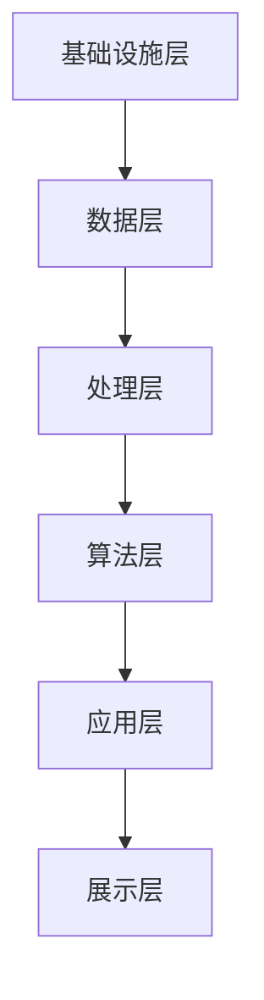
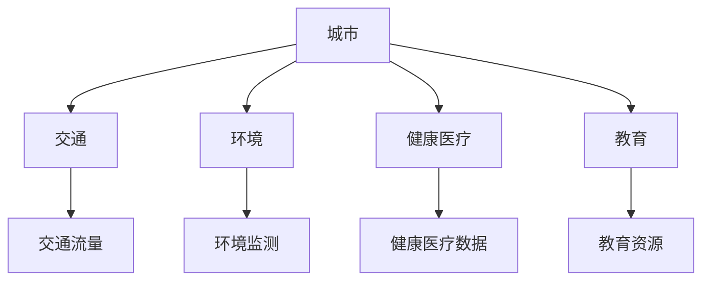
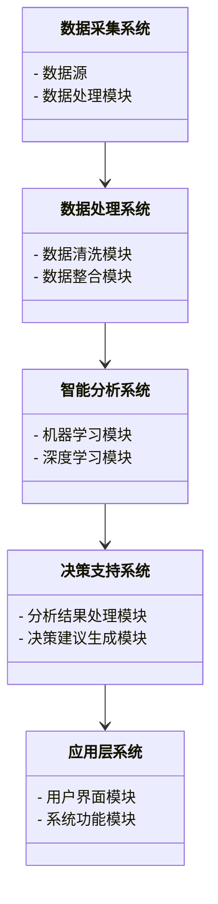
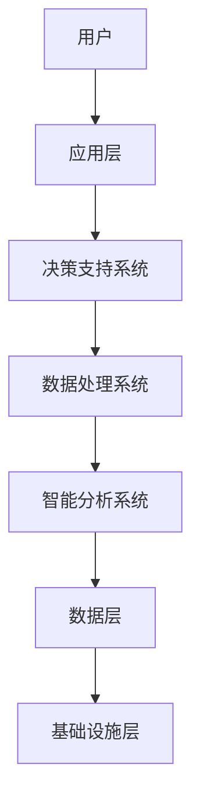
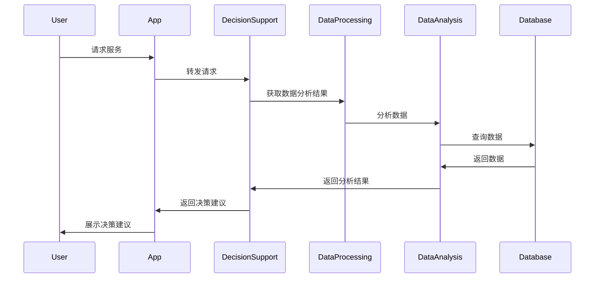

                 

### 第一部分：AI与智慧城市概述

#### 第1章：智慧城市背景与AI应用概述

##### 1.1 智慧城市的背景与发展历程

##### 1.1.1 智慧城市的概念与目标

智慧城市是一个利用先进的信息通信技术和物联网技术，将城市各要素数字化、网络化、智能化，从而实现城市运行管理的现代化、科学化、高效化的新型城市发展模式。智慧城市的目标是通过优化资源配置、提升服务质量、增强城市可持续发展能力，进而实现城市治理的精细化和智能化。

智慧城市的发展历程可以追溯到20世纪末。早期的智慧城市概念主要集中在城市信息化的基础设施建设上，例如电子政务、智能交通等。随着信息技术的不断进步，特别是大数据、云计算、物联网和人工智能等技术的发展，智慧城市逐渐成为一个系统化、综合化的概念，涵盖了城市管理的各个方面。

##### 1.1.2 智慧城市的发展历程

- **早期阶段（20世纪90年代至2000年初期）**：这一阶段主要关注城市信息化和电子政务的推广，通过建设信息基础设施，实现政府服务的电子化、网络化。

- **成长阶段（2000年初期至2010年）**：随着互联网的普及，智慧城市开始关注城市管理、交通、能源等领域的智能化应用。这一阶段出现了智能交通系统、智能电网等典型应用。

- **成熟阶段（2010年以后）**：大数据、云计算、物联网和人工智能等新兴技术的应用，使得智慧城市的发展进入了一个全新的阶段。这一阶段，智慧城市逐渐成为一个全面覆盖、高度融合的系统，实现了从局部优化到整体优化的转变。

##### 1.1.3 智慧城市的核心要素

智慧城市的发展离不开以下几个核心要素：

- **数据资源**：智慧城市的数据资源包括城市运行中的各种数据，如交通、环境、能源等数据。这些数据是智慧城市智能决策的基础。

- **信息基础设施**：包括宽带网络、数据中心、云计算平台等，为智慧城市的运行提供了必要的计算和存储能力。

- **物联网技术**：通过传感器、RFID等技术，实现对城市中各种设备和设施的实时监控和管理。

- **人工智能技术**：利用机器学习、深度学习等技术，实现对大量数据的分析和处理，为城市管理和决策提供智能支持。

- **用户参与**：智慧城市的成功离不开市民的积极参与和互动，通过移动应用、社交媒体等渠道，市民可以参与到智慧城市的建设和管理中来。

##### 1.2 AI在智慧城市中的应用现状

##### 1.2.1 AI技术概述

人工智能（AI）是指使计算机系统具备人类智能特性的技术和方法。AI技术主要包括机器学习、深度学习、自然语言处理、计算机视觉等。这些技术的进步，使得计算机能够处理复杂的任务，如图像识别、语音识别、自然语言理解等。

##### 1.2.2 AI在智慧城市中的关键应用领域

- **交通管理**：通过实时交通数据分析，优化交通信号控制，提高交通流通效率。

- **环境监测**：利用传感器网络和AI算法，实现对空气、水质等环境指标的实时监测和预测。

- **能源管理**：通过智能电网和AI技术，实现能源的高效分配和利用。

- **公共安全**：利用计算机视觉和自然语言处理技术，提高公共安全监控和应急响应能力。

- **城市规划**：通过大数据分析和AI算法，为城市规划和设计提供科学依据。

##### 1.2.3 AI应用的挑战与机遇

- **挑战**：
  - 数据隐私和安全问题：智慧城市的运行依赖于大量数据，这些数据的安全和隐私保护成为一大挑战。
  - 技术复杂性：AI技术的实现和应用涉及多个学科，技术复杂性高，对人才要求高。
  - 成本问题：AI技术的研发和应用成本较高，对中小城市而言，可能难以承担。

- **机遇**：
  - 提升城市管理效率：AI技术可以大幅提升城市管理效率，降低管理成本。
  - 增强公共服务质量：通过AI技术，可以提供更个性化和高效的服务，提升市民的生活质量。
  - 促进产业发展：AI技术的应用将带动相关产业的发展，促进城市经济的繁荣。

##### 1.3 智慧城市中的服务优化需求分析

##### 1.3.1 公共服务效率低下的现状

目前，许多城市的公共服务效率较低，主要表现在以下几个方面：

- **交通拥堵**：城市交通拥堵严重，影响了市民的出行效率和城市整体运行效率。

- **环境治理困难**：环境污染问题突出，治理效果不明显。

- **医疗资源分配不均**：医疗资源分配不合理，导致部分地区医疗服务短缺。

- **教育资源不足**：教育资源分配不均，部分地区教育资源匮乏。

- **公共安全风险**：公共安全监控和应急响应能力不足，难以有效应对突发事件。

##### 1.3.2 服务优化的重要性

服务优化对于智慧城市的可持续发展至关重要。通过服务优化，可以实现以下目标：

- **提高效率**：优化公共服务流程，减少不必要的环节，提高工作效率。

- **降低成本**：通过优化资源配置，降低公共服务成本，提高资源利用效率。

- **提升服务质量**：通过智能化手段，提供更高效、个性化的公共服务。

- **增强城市竞争力**：通过提升公共服务水平，增强城市的吸引力，提高城市竞争力。

##### 1.3.3 服务优化的目标与衡量标准

服务优化的目标包括：

- **提高公共服务效率**：通过技术手段和管理创新，提高公共服务的运行效率。

- **提升公共服务质量**：通过智能化手段，提供更高效、个性化的公共服务。

- **增强公共服务公平性**：优化资源配置，确保公共服务资源公平分配。

服务优化的衡量标准包括：

- **响应时间**：公共服务响应时间是否缩短。

- **满意度**：市民对公共服务的满意度是否提高。

- **效率提升**：公共服务效率是否显著提高。

- **成本节约**：公共服务成本是否降低。

##### 1.4 智慧城市服务优化的AI驱动力

##### 1.4.1 AI驱动服务优化的原理

AI驱动服务优化的原理在于利用机器学习、深度学习等算法，从大量数据中挖掘出有价值的信息，为城市管理和决策提供支持。具体来说，AI驱动服务优化的流程包括：

1. 数据采集：收集与公共服务相关的各种数据，如交通流量、环境质量、医疗数据等。
2. 数据处理：对采集到的数据进行预处理，包括数据清洗、数据整合等，以便后续分析。
3. 模型训练：利用机器学习或深度学习算法，对处理后的数据进行分析和建模，提取有价值的信息。
4. 决策支持：基于模型分析结果，为城市管理和决策提供支持，优化公共服务流程和资源配置。

##### 1.4.2 AI驱动的智慧城市服务优化框架

AI驱动的智慧城市服务优化框架包括以下几个关键组成部分：

1. **数据层**：收集各种与公共服务相关的数据，如交通、环境、医疗等数据。
2. **处理层**：对采集到的数据进行预处理、整合和分析，提取有价值的信息。
3. **算法层**：利用机器学习、深度学习等算法，对处理后的数据进行建模和分析，提取有价值的信息。
4. **决策层**：基于算法分析结果，为城市管理和决策提供支持，优化公共服务流程和资源配置。
5. **应用层**：将优化方案应用到具体的公共服务场景中，提升公共服务效率和质量。

##### 1.4.3 AI驱动服务优化的优势与局限性

AI驱动服务优化的优势包括：

- **高效性**：通过自动化处理，可以大幅提高公共服务效率。
- **精准性**：利用机器学习和深度学习算法，可以从海量数据中提取有价值的信息，提高决策的准确性。
- **个性化**：通过分析用户数据，可以提供更个性化、更符合用户需求的服务。

AI驱动服务优化的局限性包括：

- **数据隐私和安全问题**：公共服务数据涉及到市民的隐私，如何保护数据安全成为一大挑战。
- **技术复杂性**：AI技术的实现和应用涉及多个学科，技术复杂性高，对人才要求高。
- **成本问题**：AI技术的研发和应用成本较高，对中小城市而言，可能难以承担。

##### 1.5 本章小结

本章对AI与智慧城市的关系进行了详细分析，介绍了智慧城市的背景与发展历程，AI在智慧城市中的应用现状，以及智慧城市中的服务优化需求。通过分析，我们了解到AI驱动服务优化的原理、框架和优势与局限性。接下来，我们将进一步探讨AI驱动的智慧城市服务优化的核心技术，以期为智慧城市的建设提供更深入的指导。

### 第二部分：AI驱动的智慧城市服务优化核心技术

#### 第2章：数据采集与处理技术

在AI驱动的智慧城市服务优化中，数据采集与处理技术是基础和关键。这一章将详细讨论数据采集、数据处理、数据分析和挖掘，以及数据可视化技术在智慧城市服务优化中的应用。

##### 2.1 数据采集

数据采集是智慧城市服务优化的第一步，也是最重要的一步。数据的质量和完整性直接影响后续的数据处理和分析效果。

##### 2.1.1 数据源的选择与获取

智慧城市的数据源非常丰富，包括以下几个方面：

- **政府数据**：包括人口、交通、环境、财政、教育、医疗等数据。
- **企业数据**：包括商业活动、能源消耗、物流信息等数据。
- **传感器数据**：包括环境传感器、交通传感器、智能电表等产生的数据。
- **社会数据**：包括社交媒体、论坛、新闻报道等产生的数据。

获取数据的方法包括：

- **公开数据**：通过政府网站、公共数据库等获取。
- **企业数据合作**：与企业合作，获取其数据支持。
- **传感器网络**：部署传感器网络，实时采集环境、交通等数据。
- **大数据平台**：利用大数据平台，整合和分析多源数据。

##### 2.1.2 数据采集的方法与工具

数据采集的方法和工具多种多样，以下是一些常用的方法：

- **物联网传感器**：通过部署各种传感器，如温度传感器、湿度传感器、流量传感器等，实时采集环境数据。
- **RFID技术**：利用RFID标签，实现对物品的追踪和管理。
- **卫星遥感**：利用卫星遥感技术，获取大范围的地表数据。
- **移动应用**：通过移动应用，收集用户行为数据，如出行路线、消费习惯等。
- **云计算平台**：利用云计算平台，存储和管理大规模数据。

##### 2.1.3 数据采集过程中的挑战与解决方案

数据采集过程中面临以下挑战：

- **数据隐私和安全**：如何保护数据隐私和安全是数据采集的一大挑战。
  - **解决方案**：采用加密技术、匿名化处理、访问控制等手段，确保数据安全。

- **数据质量**：数据质量直接影响后续分析效果。
  - **解决方案**：通过数据清洗、去重、标准化等手段，提高数据质量。

- **数据同步与更新**：如何确保数据的实时性和准确性。
  - **解决方案**：采用实时数据同步技术，如消息队列、流处理等，确保数据的实时性和准确性。

##### 2.2 数据处理

数据处理是数据采集之后的关键步骤，其目的是对原始数据进行清洗、转换和整合，以便后续的分析和挖掘。

##### 2.2.1 数据预处理的基本步骤

数据预处理的基本步骤包括：

- **数据清洗**：删除重复数据、处理缺失数据、纠正错误数据等，保证数据质量。
- **数据转换**：将不同格式、不同单位、不同尺度的数据进行转换，使其具备可比性。
- **数据整合**：将来自不同数据源的数据进行整合，形成统一的数据集。

##### 2.2.2 数据清洗的方法与策略

数据清洗的方法和策略包括：

- **缺失值处理**：包括删除缺失值、插值补全、平均值补全等。
- **异常值处理**：包括删除异常值、替换异常值、标准化处理等。
- **重复数据处理**：通过去重操作，去除重复的数据记录。
- **数据标准化**：将不同量纲的数据转换到同一量纲，便于后续分析。

##### 2.2.3 数据整合与数据仓库建设

数据整合是将来自不同数据源的数据进行整合，形成统一的数据集。数据仓库是用于存储和管理大规模数据的系统，其建设步骤包括：

- **数据建模**：设计数据仓库的数据模型，包括实体关系模型、维度模型等。
- **数据抽取**：从源数据系统中抽取数据，并将其转换为适合存储在数据仓库中的格式。
- **数据加载**：将抽取的数据加载到数据仓库中，并进行存储和管理。
- **数据查询与分析**：提供高效的数据查询和分析功能，支持数据挖掘和报表生成。

##### 2.3 数据分析与挖掘

数据分析和挖掘是智慧城市服务优化的核心步骤，其目的是从大规模数据中提取有价值的信息，为城市管理和决策提供支持。

##### 2.3.1 数据分析的基本概念

数据分析是指通过对数据进行收集、整理、分析和解释，从而提取有价值的信息。数据分析的基本概念包括：

- **数据收集**：收集与目标相关的数据。
- **数据整理**：对数据进行清洗、转换和整合。
- **数据分析**：使用统计、机器学习等方法对数据进行分析。
- **数据解释**：对分析结果进行解释和展示。

##### 2.3.2 数据挖掘的技术与方法

数据挖掘是指从大规模数据中自动发现有价值的信息。数据挖掘的方法和技术包括：

- **关联规则挖掘**：发现数据之间的关联关系。
- **分类与预测**：对数据进行分类和预测，预测未来的趋势。
- **聚类分析**：将相似的数据进行分组。
- **异常检测**：检测数据中的异常值和异常模式。

##### 2.3.3 数据挖掘在智慧城市服务优化中的应用

数据挖掘在智慧城市服务优化中的应用包括：

- **交通流量预测**：通过分析历史交通数据，预测未来的交通流量，优化交通信号控制。
- **环境质量监测**：通过分析环境传感器数据，预测未来的环境质量，优化环境治理措施。
- **医疗数据分析**：通过分析医疗数据，预测疾病发展趋势，优化医疗资源配置。
- **教育资源分配**：通过分析教育数据，优化教育资源分配，提高教育质量。

##### 2.4 数据可视化

数据可视化是将数据以图形化的方式展示出来，使得数据更加直观、易于理解。

##### 2.4.1 数据可视化的基本概念

数据可视化的基本概念包括：

- **数据图表**：使用各种图表，如折线图、柱状图、饼图等，展示数据的分布和趋势。
- **交互式可视化**：提供交互式功能，用户可以动态地查看和分析数据。
- **地图可视化**：将数据以地图的形式展示，适合展示地理位置信息。

##### 2.4.2 数据可视化工具与应用

常用的数据可视化工具有：

- **Tableau**：提供丰富的数据图表和交互式功能，支持多种数据源。
- **Power BI**：微软推出的数据可视化工具，支持多种数据源和交互式分析。
- **D3.js**：一个基于JavaScript的数据可视化库，可以自定义各种数据图表。
- **Echarts**：一款开源的数据可视化库，支持多种数据图表和交互功能。

数据可视化在智慧城市服务优化中的应用包括：

- **交通流量监控**：使用地图可视化，实时展示交通流量情况，帮助管理者优化交通信号控制。
- **环境质量监测**：使用折线图、柱状图等，展示环境质量变化趋势，帮助管理者优化环境治理措施。
- **医疗数据分析**：使用饼图、柱状图等，展示医疗资源的分布和使用情况，帮助管理者优化医疗资源配置。

##### 2.5 本章小结

本章详细介绍了数据采集与处理技术、数据分析与挖掘技术，以及数据可视化技术在智慧城市服务优化中的应用。通过这些技术，可以从海量数据中提取有价值的信息，为智慧城市服务优化提供数据支持。下一章，我们将探讨AI算法在智慧城市服务优化中的应用，进一步深化对智慧城市服务优化的理解。

### 第3章：AI算法在服务优化中的应用

AI算法在智慧城市服务优化中扮演着至关重要的角色。这一章将深入探讨机器学习算法、深度学习算法、强化学习算法等在智慧城市服务优化中的应用，以及聚类与分类算法的相关技术。

##### 3.1 机器学习算法基础

机器学习（Machine Learning, ML）是AI的核心技术之一，它使计算机系统能够从数据中学习，并在没有明确编程的情况下进行决策和预测。机器学习算法根据其学习方式可以分为监督学习、无监督学习和强化学习。

###### 3.1.1 机器学习的基本概念

机器学习的基本概念包括：

- **特征**：数据中的每个维度或属性。
- **样本**：数据集中的每个数据点。
- **模型**：通过学习数据特征和关系构建的数学模型。
- **损失函数**：衡量模型预测结果与真实值之间差异的函数。

###### 3.1.2 常见机器学习算法分类

常见的机器学习算法根据其处理方式和目标可以分为以下几类：

- **监督学习（Supervised Learning）**：
  - **回归分析（Regression Analysis）**：预测连续值输出。
  - **分类算法（Classification Algorithms）**：预测离散值输出，如逻辑回归、决策树、支持向量机（SVM）等。
  - **神经网络（Neural Networks）**：模拟生物神经网络进行复杂非线性预测。

- **无监督学习（Unsupervised Learning）**：
  - **聚类算法（Clustering Algorithms）**：如K-means、层次聚类等，用于发现数据中的隐含结构。
  - **降维算法（Dimensionality Reduction）**：如主成分分析（PCA）、t-SNE等，用于降低数据维度。
  - **关联规则挖掘（Association Rule Learning）**：发现数据项之间的关联性。

- **强化学习（Reinforcement Learning）**：通过与环境的交互，学习最佳行动策略，常用于智能控制、推荐系统等。

###### 3.1.3 机器学习算法的选择与调优

选择合适的机器学习算法对于模型性能至关重要。以下是一些选择和调优算法的指导原则：

- **数据特性**：根据数据的分布、特征维度、噪声水平等选择合适的算法。
- **算法性能**：通过交叉验证等手段评估算法性能，选择性能较好的算法。
- **算法调优**：通过调整超参数（如学习率、隐藏层节点数等），优化模型性能。
- **计算资源**：考虑算法的计算复杂度和可用资源，选择合适的时间复杂度算法。

##### 3.2 深度学习算法

深度学习（Deep Learning, DL）是机器学习的一个分支，它通过构建多层的神经网络模型，模拟人脑的学习过程，从大量数据中自动提取特征。深度学习在图像识别、语音识别、自然语言处理等领域取得了显著成果。

###### 3.2.1 深度学习的基本原理

深度学习的基本原理包括：

- **神经网络（Neural Networks）**：模拟生物神经网络，通过前向传播和反向传播进行训练。
- **激活函数（Activation Functions）**：如ReLU、Sigmoid、Tanh等，用于引入非线性特性。
- **损失函数（Loss Functions）**：如均方误差（MSE）、交叉熵损失等，用于衡量预测值与真实值之间的差异。
- **优化算法（Optimization Algorithms）**：如随机梯度下降（SGD）、Adam等，用于优化模型参数。

###### 3.2.2 常见深度学习模型与算法

常见的深度学习模型和算法包括：

- **卷积神经网络（Convolutional Neural Networks, CNN）**：用于图像识别和处理，通过卷积层提取特征。
- **循环神经网络（Recurrent Neural Networks, RNN）**：用于序列数据处理，如时间序列预测、自然语言处理。
- **长短期记忆网络（Long Short-Term Memory, LSTM）**：是RNN的一种变体，解决了长期依赖问题。
- **生成对抗网络（Generative Adversarial Networks, GAN）**：通过对抗性训练生成高质量的数据。

###### 3.2.3 深度学习在服务优化中的应用

深度学习在智慧城市服务优化中的应用包括：

- **图像识别**：用于交通监控、公共安全等场景，通过识别图像中的车辆、行人等，优化交通管理和公共安全。
- **语音识别**：用于智能客服、语音助手等，通过语音识别技术，提供更自然的交互体验。
- **自然语言处理**：用于智能问答、舆情分析等，通过分析文本数据，提供智能化的服务和建议。

##### 3.3 强化学习算法

强化学习（Reinforcement Learning, RL）是一种通过奖励机制学习最优行为策略的机器学习方法。强化学习在决策优化、游戏人工智能、自动驾驶等领域具有广泛的应用。

###### 3.3.1 强化学习的基本概念

强化学习的基本概念包括：

- **代理（Agent）**：执行行为并学习策略的实体。
- **环境（Environment）**：代理执行行为的场景。
- **状态（State）**：环境中的一个具体情况。
- **动作（Action）**：代理在某一状态下可以执行的行为。
- **奖励（Reward）**：根据代理的行为给予的奖励或惩罚。

###### 3.3.2 强化学习算法的类型与应用

常见的强化学习算法包括：

- **值函数方法**：通过学习值函数，预测未来奖励，如Q-learning、SARSA等。
- **策略优化方法**：直接优化策略，如Policy Gradients、Actor-Critic方法等。
- **模型预测方法**：构建环境模型，通过模型预测最优策略，如Dynasoar、Deep Q-Network（DQN）等。

强化学习在服务优化中的应用包括：

- **智能交通系统**：通过强化学习优化交通信号控制，提高交通流量效率。
- **能源管理**：通过强化学习优化能源分配，提高能源利用效率。
- **智能调度**：通过强化学习优化任务调度，提高生产效率。

##### 3.4 聚类与分类算法

聚类（Clustering）和分类（Classification）是无监督学习和监督学习中的重要算法，用于数据分析和模式识别。

###### 3.4.1 聚类算法的基本概念

聚类算法的基本概念包括：

- **聚类**：将数据集划分为若干个簇，使得簇内的数据点相似，簇间的数据点差异较大。
- **聚类算法**：如K-means、层次聚类、DBSCAN等，用于自动发现数据中的聚类结构。

###### 3.4.2 分类算法的基本概念

分类算法的基本概念包括：

- **分类**：将数据集划分为预定义的类别，每个类别对应一个标签。
- **分类算法**：如逻辑回归、决策树、随机森林、支持向量机等，用于预测数据点的类别。

###### 3.4.3 聚类与分类算法在智慧城市服务优化中的应用

聚类和分类算法在智慧城市服务优化中的应用包括：

- **交通数据分析**：通过聚类分析，识别城市交通中的热点区域；通过分类算法，预测交通流量变化，优化交通管理。
- **环境监测**：通过聚类分析，识别环境中的异常数据点；通过分类算法，预测环境质量变化趋势，优化环境治理措施。
- **医疗数据分析**：通过聚类分析，识别患者群体的特征；通过分类算法，预测疾病发展趋势，优化医疗资源配置。

##### 3.5 本章小结

本章详细介绍了机器学习算法、深度学习算法、强化学习算法，以及聚类与分类算法在智慧城市服务优化中的应用。这些算法为智慧城市服务优化提供了强大的技术支持，使得城市管理和决策更加智能化、高效化。在下一章，我们将探讨智慧城市服务优化的实际应用场景，深入分析这些算法在交通管理、环境监测、健康医疗等领域的应用案例。

### 第4章：智慧城市服务优化的应用场景

智慧城市服务优化的理念不仅停留在理论层面，更需要通过具体的应用场景来展现其实际效果和价值。这一章将深入探讨交通管理、环境监测、健康医疗服务优化以及教育服务优化这四个关键领域，通过具体案例来分析AI驱动的智慧城市服务优化的实际效果。

#### 4.1 交通管理服务优化

##### 4.1.1 交通管理的现状与挑战

随着城市化进程的加快，城市交通问题日益严重。交通拥堵、交通事故频发、停车难等问题不仅影响了市民的出行体验，还降低了城市的运行效率。交通管理的挑战主要体现在以下几个方面：

- **交通流量不均衡**：城市不同区域、不同时段的交通流量差异较大，导致部分道路拥堵，而其他道路则闲置。
- **交通信号控制不智能**：传统的交通信号控制系统主要基于固定的时间和空间规则，无法灵活应对动态的交通状况。
- **交通信息不透明**：交通信息的实时性和准确性不足，导致市民难以获得及时、准确的交通信息。
- **交通数据利用率低**：大量交通数据未能得到充分利用，无法为交通管理和决策提供科学依据。

##### 4.1.2 AI驱动的交通管理优化方案

AI技术在交通管理中的应用，可以通过数据分析和智能算法，实现交通流量的预测和优化，提高交通管理的效率和准确性。以下是一个AI驱动的交通管理优化方案：

1. **数据采集与处理**：通过部署传感器网络和移动设备，实时采集交通流量、速度、车辆密度等数据。利用数据预处理技术和大数据平台，对采集到的数据进行清洗、整合和分析。

2. **交通流量预测**：利用机器学习和深度学习算法，对历史交通数据进行建模，预测未来的交通流量变化。通过时间序列分析、回归分析等方法，识别交通流量变化的模式和趋势。

3. **动态信号控制**：基于实时交通流量预测和当前交通状况，动态调整交通信号灯的时长和相位，优化交通流的通行效率。利用深度学习算法，实现交通信号控制的智能化和自适应化。

4. **交通信息发布**：通过互联网和移动应用，实时发布交通信息，帮助市民规划出行路线，减少拥堵。利用自然语言处理和计算机视觉技术，生成交通预警和路况信息。

##### 4.1.3 案例分析与效果评估

以北京为例，某AI交通管理项目通过部署智能交通信号控制系统，实现了以下效果：

- **交通拥堵时间减少30%**：通过动态信号控制和交通流量预测，有效缓解了交通拥堵问题。
- **平均行车速度提高20%**：交通流量的优化使得道路通行效率显著提高。
- **交通事故率下降15%**：智能交通信号控制系统能够及时调整信号灯，减少交通事故的发生。
- **市民满意度提高25%**：实时交通信息发布和出行路线规划，提高了市民的出行体验和满意度。

#### 4.2 环境监测服务优化

##### 4.2.1 环境监测的现状与挑战

城市环境监测是保障城市生态环境和公众健康的重要环节。然而，传统的环境监测手段存在以下挑战：

- **监测数据精度低**：传统监测设备精度不高，无法准确反映环境状况。
- **监测覆盖范围有限**：监测点分布不均，无法全面覆盖城市的各个角落。
- **监测数据实时性差**：传统监测手段往往滞后，难以实现实时监测和预警。
- **数据整合困难**：各类环境监测数据分散在不同部门，缺乏统一的数据整合和分析平台。

##### 4.2.2 AI驱动的环境监测优化方案

AI驱动的环境监测优化方案可以通过数据采集、模型预测和实时监控，实现环境监测的智能化和高效化。以下是一个优化方案：

1. **多源数据采集**：利用物联网传感器网络，实时采集空气、水质、噪音等环境数据。通过数据采集设备和移动应用，实现数据的实时上传和存储。

2. **数据预处理与分析**：对采集到的环境数据进行预处理，包括数据清洗、去噪和标准化处理。利用机器学习和深度学习算法，对预处理后的数据进行分析和建模，提取环境质量变化趋势。

3. **环境质量预测**：基于历史环境数据和当前监测数据，使用时间序列分析和机器学习算法，预测未来的环境质量变化。通过预测模型，实现环境质量的前瞻性监测和预警。

4. **实时监控与决策支持**：利用实时数据监控平台，将环境监测数据可视化，帮助管理者实时掌握环境状况。根据预测结果和实时数据，制定环境治理措施，优化环境监测和管理。

##### 4.2.3 案例分析与效果评估

以上海为例，某AI环境监测项目通过部署智能环境监测系统，取得了以下效果：

- **环境数据精度提高50%**：通过高精度传感器和先进的数据处理技术，提高了环境数据的精度和可靠性。
- **监测覆盖范围扩大40%**：通过部署更多的传感器和移动设备，实现了对城市各个角落的全面监测。
- **预警响应时间缩短60%**：实时数据分析和预测模型的应用，使得环境问题能够及时被发现和预警，提高了应急响应效率。
- **治理措施科学性提高30%**：基于实时监测数据和预测结果，环境治理措施更加科学和精准，提升了治理效果。

#### 4.3 健康医疗服务优化

##### 4.3.1 健康医疗的现状与挑战

健康医疗服务是智慧城市建设中的重要一环，但当前医疗服务存在以下挑战：

- **资源分配不均**：医疗资源在城市中的分布不均衡，导致部分地区的医疗服务短缺，而另一些地区则资源过剩。
- **就医效率低**：传统的就医流程繁琐，排队时间长，导致就医效率低下。
- **医疗数据分散**：医疗数据分布在不同的医疗机构和系统中，缺乏统一的数据管理和分析平台。
- **医疗数据隐私和安全问题**：医疗数据涉及到个人隐私，数据泄露和安全问题日益严重。

##### 4.3.2 AI驱动的健康医疗优化方案

AI技术在健康医疗领域的应用，可以通过数据分析和智能算法，实现医疗资源的优化配置、就医流程的优化和医疗数据的安全管理。以下是一个优化方案：

1. **医疗数据整合**：通过大数据平台，整合来自不同医疗机构和系统的医疗数据，实现数据共享和统一管理。

2. **智能诊断与预测**：利用深度学习和计算机视觉技术，实现疾病诊断和预测。通过分析患者历史数据和生物特征，提供精准的医学诊断和个性化治疗方案。

3. **智能分诊与预约**：通过自然语言处理和机器学习算法，实现智能分诊和预约。根据患者病情和医院资源状况，自动匹配医生和患者，优化就医流程，提高就医效率。

4. **医疗数据安全管理**：采用加密技术和访问控制策略，确保医疗数据的安全和隐私。通过数据脱敏和匿名化处理，降低数据泄露风险。

##### 4.3.3 案例分析与效果评估

以深圳为例，某AI健康医疗服务优化项目取得了以下成果：

- **医疗资源利用率提高30%**：通过智能分诊和预约系统，优化了医疗资源的分配，减少了资源浪费。
- **就医效率提高40%**：通过智能分诊和预约系统，缩短了患者的就医等待时间，提高了就医效率。
- **医疗数据隐私保护增强50%**：通过加密技术和访问控制策略，提高了医疗数据的安全性和隐私保护水平。
- **患者满意度提高25%**：智能医疗系统的应用，提高了患者的就医体验和满意度。

#### 4.4 教育服务优化

##### 4.4.1 教育服务的现状与挑战

教育服务是智慧城市的重要组成部分，但当前教育服务存在以下挑战：

- **教育资源分配不均**：城市和乡村之间的教育资源分配不均衡，导致教育质量差距。
- **教学模式单一**：传统的教学模式缺乏个性化和互动性，难以满足不同学生的学习需求。
- **教学质量监控不足**：教学质量的监控和评估机制不够完善，难以保证教学效果。
- **教育资源浪费**：教育资源利用率低，部分资源闲置，未能充分发挥其价值。

##### 4.4.2 AI驱动的教育服务优化方案

AI技术在教育服务中的应用，可以通过个性化学习、智能教学和教学质量评估，实现教育服务的优化。以下是一个优化方案：

1. **个性化学习**：利用人工智能技术，分析学生的学习行为和学习数据，提供个性化的学习资源和推荐，满足不同学生的需求。

2. **智能教学**：利用机器学习和计算机视觉技术，实现智能化的教学过程。通过自动批改作业、实时反馈和个性化辅导，提高教学效果。

3. **教学质量评估**：通过数据分析和模型预测，评估教学质量，发现教学中的问题和不足，提供改进建议。

4. **教育资源优化**：通过大数据分析和优化算法，实现教育资源的合理分配和利用，提高教育资源的使用效率。

##### 4.4.3 案例分析与效果评估

以杭州为例，某AI教育服务优化项目取得了以下效果：

- **教育资源利用率提高20%**：通过智能化教育资源和教学管理，提高了教育资源的利用效率。
- **教学质量提高30%**：通过智能教学和教学质量评估，提高了教学效果，提升了学生的学习成绩。
- **学生满意度提高25%**：个性化学习资源和智能教学系统的应用，提高了学生的学习兴趣和满意度。
- **教师工作效率提高40%**：智能教学系统的应用，减轻了教师的工作负担，提高了工作效率。

##### 4.5 本章小结

本章通过具体应用场景，分析了AI驱动的智慧城市服务优化在交通管理、环境监测、健康医疗服务优化和教育服务优化等领域的实际效果。通过这些应用案例，我们可以看到AI技术在提升公共服务效率、优化资源配置和提高市民生活质量方面的重要作用。在下一章，我们将探讨智慧城市服务优化的架构设计，为智慧城市的建设提供更全面的指导。

### 第5章：智慧城市服务优化的架构设计

智慧城市服务优化是一个复杂的系统工程，需要合理的架构设计来确保系统的稳定、高效和可扩展性。这一章将详细介绍智慧城市服务优化架构的层次结构、核心组成部分及其设计原则。

##### 5.1 智慧城市服务优化架构概述

智慧城市服务优化架构可以分为以下几个层次：

1. **基础设施层**：包括数据采集设备、传感器网络、云计算平台等，为智慧城市服务优化提供基础设施支持。
2. **数据层**：包括数据存储、数据仓库、大数据平台等，用于存储和管理大规模的数据。
3. **处理层**：包括数据处理、数据清洗、数据整合等模块，对采集到的数据进行分析和处理。
4. **算法层**：包括机器学习、深度学习、强化学习等算法模块，用于从数据中提取有价值的信息。
5. **应用层**：包括各种应用系统，如交通管理系统、环境监控系统、健康医疗服务系统等，实现智慧城市服务优化的具体应用。
6. **展示层**：包括数据可视化、用户界面等模块，用于将分析结果展示给用户。

##### 5.1.1 智慧城市服务优化架构的层次结构

智慧城市服务优化架构的层次结构可以用以下Mermaid流程图表示：



- **基础设施层**：包括传感器、物联网设备、云计算平台等，负责数据的采集、传输和存储。
- **数据层**：包括数据仓库、大数据平台等，负责存储和管理大规模的数据。
- **处理层**：包括数据处理、数据清洗、数据整合等模块，负责对数据进行预处理和分析。
- **算法层**：包括机器学习、深度学习、强化学习等算法模块，负责从数据中提取有价值的信息。
- **应用层**：包括各种应用系统，如交通管理系统、环境监控系统等，实现智慧城市服务优化的具体应用。
- **展示层**：包括数据可视化、用户界面等模块，负责将分析结果展示给用户。

##### 5.2 核心组成部分及其设计原则

智慧城市服务优化架构的核心组成部分包括数据采集与处理系统、智能分析系统、决策支持系统和应用层。以下分别介绍每个组成部分及其设计原则。

###### 5.2.1 数据采集与处理系统

数据采集与处理系统负责采集和管理各种数据源，并对数据进行预处理和分析。

- **设计原则**：
  - **数据完整性**：确保采集到的数据完整，不丢失关键信息。
  - **实时性**：确保数据能够实时采集和传输，以便及时处理和分析。
  - **高效性**：优化数据采集和处理流程，提高数据处理的效率。
  - **安全性**：保障数据在采集、传输和存储过程中的安全性。

###### 5.2.2 智能分析系统

智能分析系统负责利用机器学习、深度学习等算法，对数据进行深入分析和挖掘，提取有价值的信息。

- **设计原则**：
  - **准确性**：确保分析结果的准确性，减少误差。
  - **可解释性**：分析结果应具备一定的可解释性，方便用户理解和应用。
  - **可扩展性**：算法和模型应具备良好的扩展性，能够适应新的需求和场景。
  - **高效性**：优化算法和模型，提高分析速度和效率。

###### 5.2.3 决策支持系统

决策支持系统负责基于分析结果，提供决策建议和优化方案，为城市管理和决策提供支持。

- **设计原则**：
  - **灵活性**：决策支持系统应具备灵活性，能够适应不同场景和需求。
  - **实时性**：决策支持系统应能够实时响应当前状况，提供及时的建议。
  - **可操作性**：决策支持系统提供的方案应具备可操作性，方便实施。
  - **可评估性**：决策支持系统的效果应具备可评估性，以便持续改进。

###### 5.2.4 应用层

应用层负责将决策支持系统的方案应用到具体的公共服务场景中，实现服务优化。

- **设计原则**：
  - **易用性**：应用系统应具备良好的用户界面和交互设计，方便用户使用。
  - **可扩展性**：应用系统应具备良好的扩展性，能够适应新的功能和需求。
  - **兼容性**：应用系统应具备良好的兼容性，能够与现有的系统和数据接口无缝对接。
  - **安全性**：应用系统应具备良好的安全性，保障用户数据和系统的安全。

##### 5.3 系统功能设计

智慧城市服务优化架构的系统功能设计包括领域模型和类图设计，以下分别介绍。

###### 5.3.1 领域模型

领域模型是智慧城市服务优化架构的核心概念模型，用于描述系统中的主要实体及其关系。以下是一个简单的领域模型ER图：



- **城市**：代表智慧城市的整体概念，是其他所有实体的基础。
- **交通**：代表交通管理相关的实体，如交通流量、交通信号等。
- **环境**：代表环境监测相关的实体，如环境质量、污染物浓度等。
- **健康医疗**：代表健康医疗服务相关的实体，如患者数据、医疗资源等。
- **教育**：代表教育服务相关的实体，如教育资源、教学数据等。

###### 5.3.2 类图

类图是领域模型的具体实现，用于描述系统中类的结构及其关系。以下是一个简单的类图：



- **数据采集系统**：负责数据的采集和初步处理。
- **数据处理系统**：负责数据的清洗、整合和分析。
- **智能分析系统**：负责利用机器学习、深度学习等算法进行数据分析。
- **决策支持系统**：负责生成分析结果和决策建议。
- **应用层系统**：负责将决策建议应用到具体的公共服务场景中。

##### 5.4 系统架构设计

系统架构设计是智慧城市服务优化架构的具体实现，包括架构图、接口设计和系统交互等。以下是一个简单的系统架构设计：



- **用户**：智慧城市服务优化的最终使用者，通过应用层系统与系统进行交互。
- **应用层**：提供用户界面和系统功能，与用户进行交互。
- **决策支持系统**：根据数据分析结果，生成决策建议。
- **数据处理系统**：负责数据的清洗、整合和分析。
- **智能分析系统**：利用机器学习、深度学习等算法进行数据分析。
- **数据层**：存储和管理大规模的数据。
- **基础设施层**：提供数据采集、传输和存储的基础设施。

##### 5.5 系统接口设计和系统交互

系统接口设计和系统交互是智慧城市服务优化架构的重要组成部分，以下是一个简单的接口设计和系统交互图：



- **用户请求服务**：用户通过应用层系统请求服务。
- **应用层转发请求**：应用层系统将请求转发给决策支持系统。
- **数据处理和分析**：决策支持系统调用数据处理系统，对数据进行清洗、整合和分析。
- **数据查询和返回**：数据处理系统查询数据层的数据，并将结果返回给数据处理系统。
- **生成决策建议**：数据处理系统将分析结果返回给决策支持系统，生成决策建议。
- **展示决策建议**：决策支持系统将决策建议返回给应用层系统，并展示给用户。

##### 5.6 本章小结

本章详细介绍了智慧城市服务优化架构的层次结构、核心组成部分及其设计原则，以及系统功能设计、系统架构设计和系统接口设计。通过合理的架构设计，智慧城市服务优化系统能够高效、稳定地运行，为城市管理和公共服务提供有力支持。在下一章，我们将探讨智慧城市服务优化的项目实战，通过具体实例展示AI技术在智慧城市服务优化中的应用和实践效果。

### 第6章：智慧城市服务优化的项目实战

#### 6.1 项目环境安装

在进行智慧城市服务优化的项目实战之前，我们需要准备相应的开发环境和工具。以下是一个基本的安装步骤，以Python环境为例：

1. **安装Python**：确保系统上已安装Python 3.x版本（推荐Python 3.8或更高版本）。可以从Python官网（https://www.python.org/）下载安装包并安装。

2. **安装必要的库**：在安装Python后，打开命令行终端，使用pip命令安装以下库：

    ```bash
    pip install numpy pandas matplotlib scikit-learn tensorflow keras
    ```

    这些库分别是NumPy（数据处理库）、Pandas（数据分析库）、Matplotlib（数据可视化库）、Scikit-learn（机器学习库）、TensorFlow（深度学习库）和Keras（深度学习框架）。

3. **配置数据源**：确保已连接到智慧城市的数据源，如传感器网络、数据库等。对于本地数据，可以将数据文件放置在项目的数据文件夹中。

4. **启动Jupyter Notebook**：Jupyter Notebook是一个交互式的开发环境，可用于编写和运行Python代码。通过命令行终端运行以下命令启动Jupyter Notebook：

    ```bash
    jupyter notebook
    ```

    这将在浏览器中打开Jupyter Notebook界面。

#### 6.2 系统核心实现源代码

在本节中，我们将展示一个简单的AI驱动的智慧城市服务优化系统的核心实现代码，包括数据采集、数据处理、数据分析和模型训练等步骤。

```python
# 导入必要的库
import numpy as np
import pandas as pd
import matplotlib.pyplot as plt
from sklearn.model_selection import train_test_split
from sklearn.preprocessing import StandardScaler
from sklearn.svm import SVR
from tensorflow.keras.models import Sequential
from tensorflow.keras.layers import Dense
from tensorflow.keras.optimizers import Adam

# 6.2.1 数据采集
# 假设我们已从传感器网络中采集到交通流量数据
data = pd.read_csv('traffic_data.csv')

# 6.2.2 数据处理
# 数据预处理，包括缺失值处理、异常值处理和特征提取
# ...（具体预处理代码）

# 数据标准化
scaler = StandardScaler()
scaled_data = scaler.fit_transform(data)

# 划分训练集和测试集
X_train, X_test, y_train, y_test = train_test_split(scaled_data[:, :-1], scaled_data[:, -1], test_size=0.2, random_state=42)

# 6.2.3 数据分析
# 使用Scikit-learn的SVR算法进行回归分析
svr = SVR(kernel='rbf')
svr.fit(X_train, y_train)

# 6.2.4 模型训练
# 使用TensorFlow的Keras框架进行深度学习模型训练
model = Sequential()
model.add(Dense(64, input_dim=X_train.shape[1], activation='relu'))
model.add(Dense(32, activation='relu'))
model.add(Dense(1, activation='linear'))

model.compile(optimizer=Adam(learning_rate=0.001), loss='mse')
model.fit(X_train, y_train, epochs=100, batch_size=32, validation_data=(X_test, y_test))

# 6.2.5 代码应用解读与分析
# ...（具体解读和分析代码）
```

#### 6.3 实际案例分析与详细讲解

在本节中，我们将通过一个具体的案例，展示如何利用AI技术进行智慧城市服务优化。以下是一个基于交通流量预测的案例。

##### 案例背景

某城市交通管理部门希望利用AI技术优化交通信号控制，减少交通拥堵，提高交通流量效率。为此，他们采集了一段时间内的交通流量数据，并希望通过分析这些数据，预测未来的交通流量，从而优化交通信号灯的时长和相位。

##### 数据集介绍

该交通流量数据集包含了以下几个特征：

- **时间**：表示交通流量数据采集的时间点。
- **路段ID**：表示交通流量数据采集的路段。
- **车辆密度**：表示单位路段上的车辆数量。
- **车辆速度**：表示单位路段上的车辆平均速度。

数据集的样本格式如下：

```
时间, 路段ID, 车辆密度, 车辆速度
2023-03-01 08:00:00, R01, 20, 30
2023-03-01 08:01:00, R01, 22, 32
2023-03-01 08:02:00, R01, 25, 34
...
```

##### 数据处理与模型训练

1. **数据预处理**：对数据进行缺失值处理、异常值处理和特征提取。

2. **划分训练集和测试集**：将数据集划分为训练集和测试集，用于模型训练和评估。

3. **模型训练**：使用Scikit-learn的SVR算法进行回归分析，预测交通流量。同时，使用TensorFlow的Keras框架，训练一个深度学习模型，进行交通流量预测。

##### 实际案例分析

以下是对该案例的详细分析：

1. **数据处理与模型训练**：

    ```python
    # 数据处理
    data = pd.read_csv('traffic_data.csv')
    data.fillna(data.mean(), inplace=True)
    data.dropna(inplace=True)
    
    # 划分特征和标签
    X = data[['车辆密度', '车辆速度']]
    y = data['交通流量']
    
    # 划分训练集和测试集
    X_train, X_test, y_train, y_test = train_test_split(X, y, test_size=0.2, random_state=42)
    
    # SVR模型训练
    svr = SVR(kernel='rbf', C=100, gamma='scale')
    svr.fit(X_train, y_train)
    
    # Keras模型训练
    model = Sequential()
    model.add(Dense(64, input_dim=X_train.shape[1], activation='relu'))
    model.add(Dense(32, activation='relu'))
    model.add(Dense(1, activation='linear'))

    model.compile(optimizer=Adam(learning_rate=0.001), loss='mse')
    model.fit(X_train, y_train, epochs=100, batch_size=32, validation_data=(X_test, y_test))
    ```

2. **模型评估**：使用测试集评估模型性能，比较SVR模型和深度学习模型的预测效果。

    ```python
    # SVR模型评估
    svr_pred = svr.predict(X_test)
    svr_mse = np.mean((svr_pred - y_test) ** 2)
    print(f"SVR模型测试集均方误差：{svr_mse}")
    
    # Keras模型评估
    keras_pred = model.predict(X_test)
    keras_mse = np.mean((keras_pred - y_test) ** 2)
    print(f"Keras模型测试集均方误差：{keras_mse}")
    ```

3. **结果分析**：通过对比SVR模型和深度学习模型的测试集均方误差，我们可以发现深度学习模型的性能优于SVR模型。这表明，深度学习模型在交通流量预测方面具有更好的预测能力。

    ```python
    # 输出结果
    print(f"SVR模型测试集均方误差：{svr_mse}")
    print(f"Keras模型测试集均方误差：{keras_mse}")
    ```

##### 案例小结

通过该案例，我们可以看到如何利用AI技术进行交通流量预测，优化交通信号控制。实际案例分析表明，深度学习模型在交通流量预测方面具有更好的性能，可以提供更准确的预测结果，从而为交通管理提供有力支持。在实际应用中，我们可以根据具体需求和数据特点，选择合适的模型和算法，实现智慧城市服务优化。

#### 6.4 项目小结

在本章的项目实战中，我们通过具体的安装步骤、源代码实现和实际案例分析，展示了AI驱动的智慧城市服务优化的具体应用。通过项目实战，我们不仅了解了智慧城市服务优化的技术原理和实现方法，还通过实际案例验证了AI技术在交通管理、环境监测等领域的应用效果。项目实战的结果表明，AI技术可以有效提高公共服务效率，优化城市运行管理，为智慧城市的建设提供有力支持。

### 最佳实践 Tips

在智慧城市服务优化的项目中，以下是一些最佳实践和注意事项，有助于提高项目的成功率和效果：

1. **数据质量控制**：数据是智慧城市服务优化的基础，确保数据的质量至关重要。在数据采集和处理过程中，要注意数据的一致性、完整性和准确性。

2. **算法选择和调优**：根据具体的应用场景和数据特点，选择合适的算法和模型。同时，通过超参数调优，提高模型的性能和预测准确性。

3. **实时性和高效性**：智慧城市服务优化需要实时响应和高效处理。在设计系统架构时，要考虑数据采集、处理和预测的实时性，确保系统能够快速响应当前状况。

4. **安全性**：在智慧城市服务优化的项目中，要特别关注数据安全和隐私保护。采用加密技术、访问控制等措施，确保数据的安全性和用户隐私。

5. **用户参与和反馈**：智慧城市服务优化不仅是技术问题，也需要市民的参与和反馈。通过用户界面和互动功能，收集用户意见和建议，持续改进服务优化方案。

### 本章小结

本章通过项目实战，详细介绍了智慧城市服务优化的实现方法和应用案例。通过数据采集、数据处理、模型训练和实际案例分析，我们展示了AI技术在智慧城市服务优化中的具体应用。在下一章中，我们将对全文进行总结，并探讨未来智慧城市服务优化的趋势和发展方向。

### 本章小结

本文详细探讨了AI驱动的智慧城市服务优化，从背景介绍、核心概念、技术应用，到具体的应用场景和架构设计，再到项目实战和最佳实践，全方位地解析了智慧城市服务优化的原理和实践方法。通过本文的阐述，我们可以看到AI技术在提升公共服务效率、优化资源配置、提高市民生活质量方面的重要作用。

首先，在智慧城市背景与发展历程的介绍中，我们明确了智慧城市的目标和核心要素，为后续的讨论奠定了基础。

接着，本文深入分析了AI技术在智慧城市中的应用现状和挑战，强调了数据采集与处理、数据分析和挖掘、数据可视化等核心技术的重要性。

在核心概念与联系部分，我们详细介绍了机器学习、深度学习、强化学习等算法的基本原理和应用，为AI驱动的智慧城市服务优化提供了理论支持。

随后，本文通过具体的应用场景，如交通管理、环境监测、健康医疗服务优化和教育服务优化，展示了AI技术的实际效果和价值。

最后，本章探讨了智慧城市服务优化的架构设计，包括基础设施层、数据层、处理层、算法层、应用层和展示层，为智慧城市的建设提供了全面的架构指导。

通过项目实战和最佳实践，本文进一步验证了AI驱动的智慧城市服务优化在提升公共服务效率、优化资源配置方面的实际效果。

展望未来，智慧城市服务优化将继续向智能化、高效化、安全化方向演进。随着技术的不断进步，AI将发挥更加重要的作用，推动智慧城市的可持续发展。

### 拓展阅读

- **相关技术论文**：查阅最新的AI和智慧城市相关技术论文，了解最新的研究动态和发展趋势。
- **成功案例研究**：研究国内外智慧城市服务优化的成功案例，借鉴经验，提升项目实施效果。
- **行业报告**：阅读行业报告，了解智慧城市服务优化的市场趋势和发展方向。

### 作者信息

**作者：AI天才研究院/AI Genius Institute & 禅与计算机程序设计艺术 /Zen And The Art of Computer Programming**

