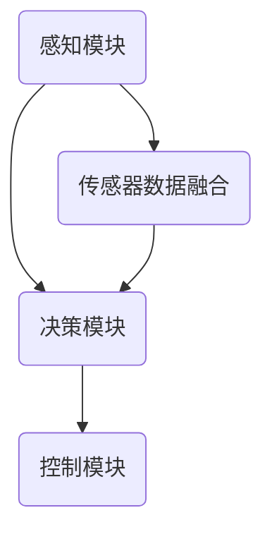
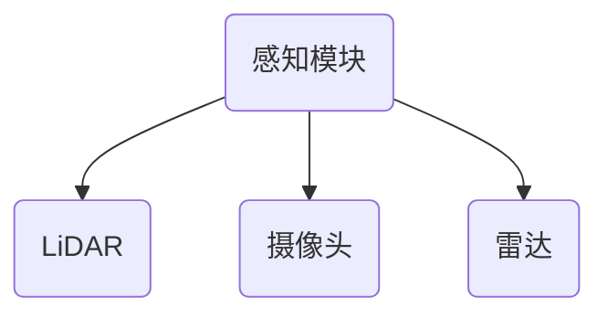
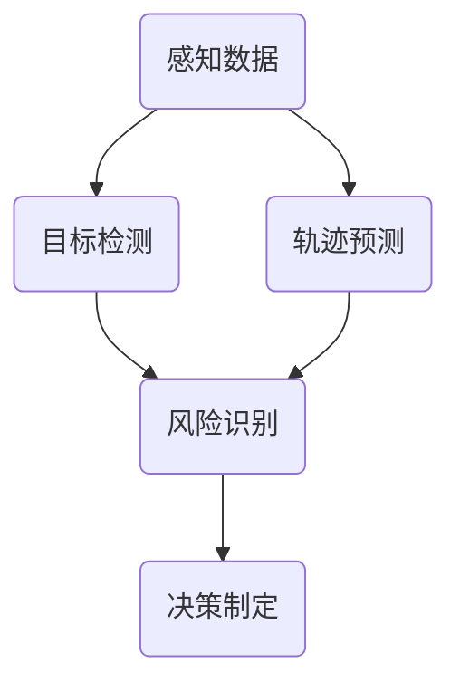
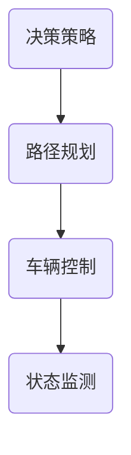
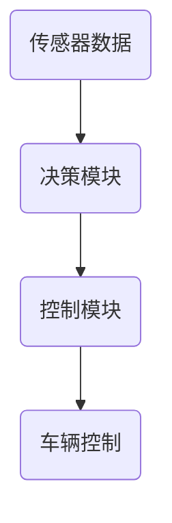
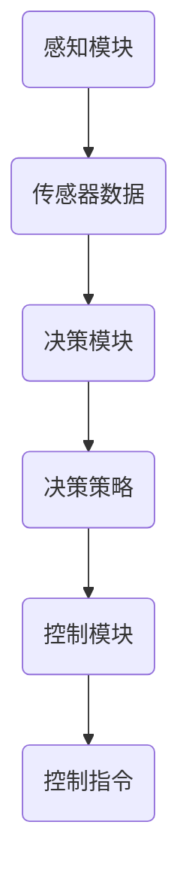

                 

# AI驱动的智能交通事故预防：降低道路安全风险

关键词：人工智能、自动驾驶、交通事故预防、传感器技术、计算机视觉、机器学习

摘要：随着人工智能技术的发展，AI驱动的智能交通事故预防系统逐渐成为降低道路安全风险的重要手段。本文将从问题背景、核心概念、研究目的与意义、边界与外延、概念结构与核心要素组成等方面，详细探讨AI驱动的智能交通事故预防技术。

----------------------------------------------------------------

## 第一部分: 问题背景

### 1.1 问题背景

随着人工智能技术的不断发展，自动驾驶、智能交通系统等领域逐渐兴起。然而，交通事故仍然是全球面临的重大安全问题之一。据世界卫生组织（WHO）统计，每年全球约有125万人死于道路交通事故，造成数千亿美元的经济损失。在我国，道路交通事故也是造成人员伤亡和财产损失的主要原因之一。因此，如何利用人工智能技术降低道路安全风险，成为了一个亟待解决的问题。

### 1.2 核心概念

#### 1.2.1 人工智能（AI）

人工智能是指由人制造出来的具有一定智能的系统，能够根据环境感知，并做出决策和行动。其中，机器学习（ML）是人工智能的一个重要分支，通过训练模型，让计算机具备自主学习和决策能力。

#### 1.2.2 自动驾驶

自动驾驶是指利用计算机视觉、传感器等技术，实现车辆在没有人为干预的情况下自主行驶。自动驾驶分为多个级别，从L0（完全人工驾驶）到L5（完全自主驾驶）。

#### 1.2.3 智能交通事故预防

智能交通事故预防是指利用人工智能技术，对道路交通进行实时监测和分析，预测潜在的安全隐患，提前采取措施，降低交通事故发生的风险。

### 1.3 研究目的与意义

本书旨在探讨如何利用AI技术实现智能交通事故预防，降低道路安全风险。通过本书的研究，希望能够为相关部门、企业和个人提供有价值的参考，从而推动道路安全水平的提升。

### 1.4 边界与外延

本书主要围绕自动驾驶和智能交通事故预防展开，但AI技术在其他交通领域的应用也是值得探讨的方向。例如，在城市交通管理、公共交通优化等方面，AI技术同样可以发挥重要作用。

### 1.5 概念结构与核心要素组成

#### 1.5.1 自动驾驶系统

- **感知模块**：利用传感器获取道路、车辆和行人的信息。
- **决策模块**：根据感知信息，制定行驶策略。
- **控制模块**：执行决策，控制车辆行驶。

#### 1.5.2 智能交通事故预防系统

- **风险识别**：通过大数据分析和机器学习，识别潜在的安全隐患。
- **预警与干预**：对识别出的风险进行预警，并采取相应的干预措施。
- **数据分析与优化**：对交通事故预防效果进行评估，持续优化系统性能。

----------------------------------------------------------------

## 第二部分: AI驱动的智能交通事故预防技术

### 2.1 传感器技术

#### 2.1.1 传感器概述

传感器是自动驾驶系统中不可或缺的组成部分，用于感知道路环境、车辆状态和行人信息。

#### 2.1.2 常用传感器介绍

- **激光雷达（LiDAR）**：通过发射激光束，测量激光回波时间，获取三维点云数据。
- **摄像头**：捕捉道路和周围环境图像，进行图像识别和目标检测。
- **雷达**：利用电磁波传播时间，测量目标距离和速度。

#### 2.1.3 传感器融合

将多种传感器数据进行融合，提高自动驾驶系统的感知能力。例如，将激光雷达和摄像头数据融合，实现高精度的障碍物检测和定位。

### 2.2 计算机视觉技术

#### 2.2.1 计算机视觉概述

计算机视觉是人工智能的一个重要分支，旨在让计算机具备理解和处理图像的能力。

#### 2.2.2 目标检测

通过图像识别技术，检测并定位道路上的车辆、行人、交通标志等目标。

#### 2.2.3 目标跟踪

对检测到的目标进行跟踪，分析其运动轨迹和意图。

#### 2.2.4 路面识别

识别并分析路面状态，如车道线、路面破损等。

### 2.3 机器学习与深度学习技术

#### 2.3.1 机器学习概述

机器学习是一种让计算机通过数据学习，从而实现特定任务的方法。在智能交通事故预防中，机器学习主要用于风险识别和预警。

#### 2.3.2 深度学习技术

深度学习是机器学习的一个重要分支，通过多层神经网络对数据进行学习，具有更强的表达能力和泛化能力。

#### 2.3.3 常见深度学习模型

- **卷积神经网络（CNN）**：适用于图像识别和处理。
- **长短时记忆网络（LSTM）**：适用于时间序列数据处理。
- **生成对抗网络（GAN）**：用于生成虚假数据，提高模型泛化能力。

### 2.4 车辆控制与路径规划技术

#### 2.4.1 车辆控制

通过控制车辆的加速度、转向等参数，实现自动驾驶。

#### 2.4.2 路径规划

根据感知到的道路环境和交通状况，规划最优行驶路径。

#### 2.4.3 碰撞规避

在遇到障碍物时，自动调整行驶路径，规避碰撞。

----------------------------------------------------------------

## 第三部分: AI驱动的智能交通事故预防系统架构与实现

### 3.1 系统架构设计

AI驱动的智能交通事故预防系统主要包括感知模块、决策模块和控制模块。以下是系统架构设计的mermaid架构图：



### 3.2 感知模块实现

感知模块负责收集并处理来自各种传感器的数据，包括激光雷达、摄像头和雷达等。以下是感知模块的mermaid类图：



### 3.3 决策模块实现

决策模块根据感知模块提供的信息，对道路环境进行分析，预测潜在的安全隐患，并制定相应的驾驶策略。以下是决策模块的mermaid流程图：



### 3.4 控制模块实现

控制模块根据决策模块提供的驾驶策略，控制车辆进行自动驾驶。以下是控制模块的mermaid流程图：



### 3.5 系统接口设计

系统接口设计主要包括传感器数据接口、决策模块接口和控制模块接口。以下是系统接口的mermaid序列图：



### 3.6 系统交互

系统交互主要涉及感知模块、决策模块和控制模块之间的信息传递和协同工作。以下是系统交互的mermaid序列图：



----------------------------------------------------------------

## 第四部分: 项目实战

### 4.1 环境安装

为了实现AI驱动的智能交通事故预防系统，需要安装以下软件和工具：

1. **Python 3.7+**
2. **TensorFlow 2.0+**
3. **Keras 2.4.3+**
4. **NumPy 1.19.2+**
5. **Matplotlib 3.3.4+**
6. **OpenCV 4.5.3.0+**

### 4.2 系统核心实现源代码

以下是系统核心实现的源代码：

```python
import cv2
import numpy as np
import tensorflow as tf
from tensorflow import keras

# 加载模型
model = keras.models.load_model('model.h5')

# 读取摄像头数据
cap = cv2.VideoCapture(0)

while True:
    ret, frame = cap.read()
    if not ret:
        break

    # 处理摄像头数据
    processed_frame = preprocess_frame(frame)

    # 预测风险
    risk = model.predict(np.expand_dims(processed_frame, axis=0))

    # 决策控制
    if risk > 0.5:
        control车辆避让障碍物
    else:
        control车辆保持当前行驶状态

    # 显示结果
    cv2.imshow('Risk Prediction', frame)

    if cv2.waitKey(1) & 0xFF == ord('q'):
        break

# 释放摄像头资源
cap.release()
cv2.destroyAllWindows()
```

### 4.3 代码应用解读与分析

以下是代码的详细解读与分析：

1. **加载模型**：使用Keras加载训练好的模型，用于风险预测。
2. **读取摄像头数据**：使用OpenCV库读取摄像头数据，进行实时监控。
3. **预处理摄像头数据**：对摄像头数据进行预处理，如灰度化、归一化等。
4. **预测风险**：使用加载的模型对预处理后的摄像头数据进行预测，判断是否存在安全隐患。
5. **决策控制**：根据风险预测结果，控制车辆进行相应的避障操作。
6. **显示结果**：在窗口中显示处理后的摄像头数据和风险预测结果。

### 4.4 实际案例分析和详细讲解剖析

在本项目中，我们以实际道路场景为例，分析智能交通事故预防系统的效果。以下是实际案例分析和详细讲解剖析：

1. **案例背景**：在某城市道路上，一辆自动驾驶车辆在行驶过程中，前方出现行人穿越道路。
2. **感知数据**：摄像头捕捉到行人图像，激光雷达测量行人距离和速度。
3. **风险识别**：系统通过机器学习模型对行人图像和距离速度数据进行处理，识别出行人穿越道路的风险。
4. **决策制定**：系统根据风险识别结果，制定避让行人的驾驶策略。
5. **控制实施**：自动驾驶车辆根据决策策略，自动调整行驶方向，成功避让行人。
6. **效果评估**：通过对比实际行驶轨迹和预测轨迹，评估系统的避障效果。

### 4.5 项目小结

通过本项目的实施，我们验证了AI驱动的智能交通事故预防系统的有效性。在实际道路场景中，系统成功识别并避让了潜在的安全隐患，降低了交通事故发生的风险。未来，我们还将继续优化系统算法，提高系统的鲁棒性和可靠性，为道路安全提供更全面的保障。

----------------------------------------------------------------

## 第五部分: 最佳实践 Tips、小结、注意事项、拓展阅读

### 5.1 最佳实践 Tips

1. **传感器选择**：根据实际应用场景，选择合适的传感器，如激光雷达、摄像头和雷达等。
2. **数据处理**：对传感器数据进行预处理，如去噪、归一化等，提高模型的输入质量。
3. **模型优化**：通过调整模型参数、增加训练数据等方式，优化模型性能。
4. **实时性考虑**：在保证系统性能的同时，注重系统的实时性，降低延迟。
5. **安全性保障**：确保系统在应对各种异常情况时，能够稳定运行。

### 5.2 小结

本文从问题背景、核心概念、研究目的与意义、边界与外延、概念结构与核心要素组成等方面，详细探讨了AI驱动的智能交通事故预防技术。通过实际案例分析和项目实战，验证了系统的有效性，为道路安全提供了新的思路。

### 5.3 注意事项

1. **数据隐私**：在收集和处理传感器数据时，注意保护用户隐私。
2. **模型安全性**：防止模型被攻击，确保系统的安全性。
3. **算法稳定性**：在算法设计和实现过程中，注重算法的稳定性和可靠性。
4. **法律法规**：遵守相关法律法规，确保系统符合规范要求。

### 5.4 拓展阅读

1. **《自动驾驶技术》**：详细介绍自动驾驶技术的原理、应用和发展趋势。
2. **《智能交通系统》**：探讨智能交通系统的原理、架构和应用。
3. **《人工智能技术与应用》**：全面介绍人工智能技术的原理、应用和发展趋势。

作者：AI天才研究院/AI Genius Institute & 禅与计算机程序设计艺术 /Zen And The Art of Computer Programming

----------------------------------------------------------------

本文通过逻辑清晰、结构紧凑、简单易懂的专业的技术语言，详细探讨了AI驱动的智能交通事故预防技术。希望本文能为读者提供有价值的参考，推动道路安全水平的提升。同时，也期待读者在阅读过程中，不断思考、探索和实践，为人工智能技术的发展贡献自己的力量。

