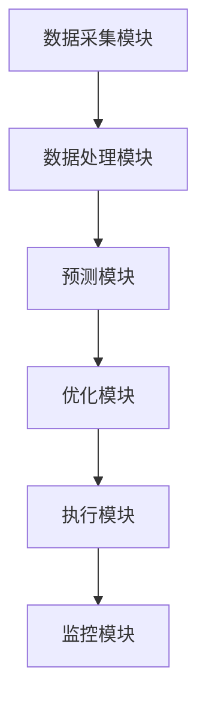

                 

### 文章标题

**AI驱动的智能交通信号控制：实时优化交通流**

### 关键词

- 人工智能
- 智能交通信号控制
- 实时优化
- 交通流
- 深度学习

### 摘要

本文将深入探讨AI技术在智能交通信号控制中的应用，特别是实时优化交通流的问题。通过对AI技术基础、智能交通信号控制技术、实时优化交通流技术以及AI驱动的智能交通信号控制实施等内容的详细讲解，本文旨在提供一个全面的视角，帮助读者理解如何利用AI技术解决交通拥堵问题，提高交通效率。文章还通过实际案例研究，展示了AI驱动的智能交通信号控制在现实中的应用效果。

## 第一部分：引言

### 1.1 问题背景

随着城市化进程的加快，城市交通拥堵问题日益严重。交通拥堵不仅影响居民的出行效率，还增加了交通事故的风险，造成了巨大的经济损失。据统计，全球每年因交通拥堵造成的经济损失高达数百亿美元。因此，如何解决交通拥堵问题，提高交通效率，成为了各国政府和交通部门关注的重点。

在传统的交通信号控制中，信号配时通常是根据交通流量和历史数据预设的。然而，这种基于静态数据的方法往往无法适应实时交通流的变化，导致交通拥堵问题依然存在。为了解决这一问题，AI技术的引入成为了一种新的思路。

### 1.1.1 交通拥堵问题的严峻性

交通拥堵问题不仅存在于大城市，甚至在中小城市和乡村地区也时有发生。以下是一些交通拥堵问题的具体表现：

- **高峰期拥堵**：在上下班高峰期，道路上的车辆数量急剧增加，导致道路拥堵。
- **突发事件影响**：交通事故、道路施工、恶劣天气等突发事件都会对交通流造成影响，导致交通拥堵。
- **城市规划不足**：部分城市在规划过程中未能充分考虑交通需求，导致道路设计不合理，容易发生拥堵。

- **经济损失**：交通拥堵导致车辆停滞，增加了燃油消耗，同时降低了车辆的使用效率，造成了巨大的经济损失。

### 1.1.2 智能交通信号控制的必要性

智能交通信号控制通过引入AI技术，可以实现交通流的实时监控和优化，从而提高交通效率，减少拥堵。以下是智能交通信号控制的必要性：

- **实时性**：智能交通信号控制可以实时感知交通状况，根据实时数据调整信号配时，以适应交通流的变化。
- **自适应能力**：传统的信号配时方法通常是基于预设的参数，而智能交通信号控制可以通过机器学习和深度学习算法，不断学习交通流模式，提高信号配时的准确性。
- **准确性**：通过AI技术，可以对交通流量进行精确预测，从而为信号配时提供准确的依据。
- **高效性**：智能交通信号控制可以优化交通流，减少车辆等待时间，提高道路通行能力。

### 1.1.3 AI技术在交通信号控制中的应用前景

AI技术在交通信号控制中的应用前景非常广阔。以下是一些应用方向：

- **交通流量预测**：通过深度学习和机器学习算法，可以预测未来的交通流量，为信号配时提供依据。
- **信号配时优化**：利用优化算法，根据实时交通流量调整信号配时，提高交通效率。
- **交通监控与分析**：通过摄像头和传感器等设备，实时监控交通状况，发现交通拥堵的原因，并提出解决方案。
- **智能导航**：通过AI技术，可以为驾驶员提供实时的交通信息，引导他们避开拥堵路段。

### 1.2 核心概念

在探讨AI驱动的智能交通信号控制之前，我们需要了解一些核心概念，包括AI、智能交通信号控制、实时优化和交通流。

#### 1.2.1 AI的定义

AI（人工智能）是指通过计算机模拟人类智能的技术，包括机器学习、深度学习、自然语言处理、计算机视觉等。

#### 1.2.2 智能交通信号控制

智能交通信号控制是指利用AI技术，对交通信号进行实时监控和优化，以实现交通流的最佳配置。

#### 1.2.3 实时优化

实时优化是指对交通信号进行实时调整，以应对交通流的变化，提高交通效率。

#### 1.2.4 交通流

交通流是指车辆在道路上行驶的状态，包括车辆数量、速度、方向等。

### 1.3 书籍结构安排

本书籍分为五个部分，分别为引言、AI技术基础、智能交通信号控制技术、实时优化交通流技术以及AI驱动的智能交通信号控制实施。每个部分都涵盖了相关主题的详细内容，旨在帮助读者全面了解AI驱动的智能交通信号控制。

### 1.4 本章小结

本章主要介绍了交通拥堵问题的严峻性、智能交通信号控制的必要性以及AI技术在交通信号控制中的应用前景。通过本章的学习，读者可以初步了解AI驱动的智能交通信号控制的基本概念和重要性。

## 第二部分：AI技术基础

### 2.1 AI技术概述

#### 2.1.1 AI的发展历程

AI（人工智能）技术的发展可以追溯到20世纪50年代。从最初的简单逻辑推理，到后来的专家系统，再到如今的深度学习和机器学习，AI经历了多次重大变革。以下是AI的发展历程：

- **1950年代**：人工智能的概念首次被提出，最初的AI研究主要集中在符号逻辑和推理上。
- **1960年代**：专家系统的出现，使AI开始应用于实际问题解决。
- **1970年代**：AI研究陷入“冬天”，因为专家系统在实际应用中的表现不如预期。
- **1980年代**：机器学习开始受到关注，尤其是决策树和神经网络等算法的研究。
- **1990年代**：互联网的发展，使得AI的应用场景大大扩展。
- **2000年代**：深度学习的兴起，使AI在图像识别、语音识别等领域取得了突破性进展。
- **2010年代至今**：AI技术不断成熟，应用范围广泛，包括自动驾驶、智能客服、金融风控等。

#### 2.1.2 AI的基本概念

AI的基本概念包括：

- **人工神经网络**：模拟人脑神经元连接的网络结构，用于处理复杂的数据。
- **机器学习**：使计算机从数据中学习规律，无需显式编程。
- **深度学习**：一种特殊的机器学习方法，通过多层神经网络，对大量数据进行训练。
- **自然语言处理**：使计算机理解和处理自然语言。
- **计算机视觉**：使计算机理解和解释视觉信息。

#### 2.1.3 AI的核心技术

AI的核心技术包括：

- **神经网络**：模拟人脑神经元连接的网络结构，用于处理复杂的数据。
- **深度学习**：一种特殊的神经网络，通过多层神经网络，对大量数据进行训练。
- **机器学习**：使计算机从数据中学习规律，无需显式编程。
- **强化学习**：通过试错法，使计算机在特定环境中找到最优策略。
- **计算机视觉**：使计算机理解和解释视觉信息。

### 2.2 机器学习基础

#### 2.2.1 机器学习的基本概念

机器学习是指使计算机从数据中学习规律，无需显式编程的方法。机器学习主要包括以下几个过程：

- **数据采集**：收集用于训练的数据。
- **数据预处理**：对数据进行清洗、归一化等处理，使其适合训练。
- **模型训练**：利用训练数据，训练机器学习模型。
- **模型评估**：利用测试数据，评估模型的效果。
- **模型优化**：根据评估结果，调整模型参数，提高模型效果。

#### 2.2.2 机器学习的分类

机器学习主要分为以下几类：

- **监督学习**：有监督的学习方法，通过已知的输入和输出，训练模型。
- **无监督学习**：无监督的学习方法，通过未标记的数据，发现数据中的规律。
- **半监督学习**：介于监督学习和无监督学习之间，部分数据有标签，部分数据无标签。
- **强化学习**：通过试错法，使计算机在特定环境中找到最优策略。

#### 2.2.3 机器学习的算法

机器学习的主要算法包括：

- **线性回归**：通过拟合线性模型，预测连续值。
- **逻辑回归**：通过拟合线性模型，预测分类结果。
- **支持向量机**：通过最大化分类间隔，分类数据。
- **决策树**：通过划分特征空间，分类数据。
- **随机森林**：通过构建多个决策树，集成预测结果。
- **神经网络**：通过多层神经网络，处理复杂的数据。

### 2.3 深度学习基础

#### 2.3.1 深度学习的发展历程

深度学习的发展历程可以追溯到20世纪80年代。最初的神经网络由于计算能力和数据限制，发展缓慢。随着计算能力的提升和大数据的发展，深度学习在2010年后迎来了爆发式增长。以下是深度学习的发展历程：

- **1980年代**：反向传播算法的提出，使神经网络的研究得以继续。
- **1990年代**：支持向量机和决策树等算法的兴起，使神经网络研究受到冲击。
- **2000年代**：Hinton等人提出的深度信念网络（DBN）和自动编码器（AE），使深度学习开始受到关注。
- **2010年代**：深度学习在图像识别、语音识别等领域取得了突破性进展。
- **2010年代至今**：深度学习在各个领域得到了广泛应用，如自动驾驶、智能客服、金融风控等。

#### 2.3.2 深度学习的基本原理

深度学习的基本原理是通过多层神经网络，对大量数据进行训练。以下是深度学习的基本原理：

- **神经网络**：神经网络由多个神经元组成，每个神经元接收多个输入，并通过权重和偏置进行计算。
- **激活函数**：激活函数用于确定神经元是否被激活，常用的激活函数有Sigmoid、ReLU等。
- **反向传播**：反向传播是一种用于训练神经网络的算法，通过不断调整权重和偏置，使网络的预测结果更接近真实值。
- **损失函数**：损失函数用于衡量预测值与真实值之间的差距，常用的损失函数有均方误差（MSE）、交叉熵等。

#### 2.3.3 深度学习的常用网络结构

深度学习的常用网络结构包括：

- **卷积神经网络（CNN）**：用于处理图像数据，具有局部感知能力和平移不变性。
- **循环神经网络（RNN）**：用于处理序列数据，具有时序记忆能力。
- **长短时记忆网络（LSTM）**：是RNN的一种改进，可以更好地处理长序列数据。
- **生成对抗网络（GAN）**：通过对抗训练，生成逼真的数据。

### 2.4 AI驱动交通信号控制的挑战与机遇

#### 2.4.1 挑战分析

AI驱动交通信号控制面临着以下几个挑战：

- **数据获取**：交通信号控制需要大量的实时交通数据，如何获取这些数据成为了一个难题。
- **数据质量**：交通数据的质量直接影响AI模型的性能，数据清洗和预处理是一个重要的环节。
- **计算资源**：深度学习模型需要大量的计算资源，如何高效地训练和部署模型是一个挑战。
- **系统稳定性**：AI驱动交通信号控制系统需要保证稳定性，避免因系统故障导致的交通混乱。

#### 2.4.2 机遇探讨

尽管面临挑战，AI驱动交通信号控制也带来了许多机遇：

- **交通效率提升**：通过实时优化交通信号，可以显著提高交通效率，减少拥堵。
- **智能交通管理**：AI技术可以实现对交通流的实时监控和分析，为交通管理部门提供决策支持。
- **自动驾驶**：AI驱动交通信号控制是自动驾驶技术的重要组成部分，为自动驾驶技术的发展提供了基础。
- **智慧城市**：AI驱动交通信号控制是智慧城市建设的重要组成部分，有助于提高城市管理水平。

### 2.5 本章小结

本章主要介绍了AI技术的基础知识，包括AI的发展历程、基本概念、核心技术以及机器学习和深度学习的基础。通过本章的学习，读者可以了解AI技术在交通信号控制中的应用前景，为后续章节的学习打下基础。

## 第三部分：智能交通信号控制技术

### 3.1 智能交通信号控制概述

#### 3.1.1 智能交通信号控制的基本概念

智能交通信号控制是一种利用先进技术，如AI、物联网、大数据等，对交通信号进行实时监控和优化，以提高交通效率、减少拥堵和降低事故风险的系统。它包括以下几个关键组成部分：

- **传感器网络**：用于收集交通流量、速度、密度等实时数据。
- **数据传输和处理**：将传感器收集到的数据传输至中央处理单元，进行实时分析和处理。
- **信号控制设备**：用于控制交通信号的配时和切换。
- **决策支持系统**：基于实时数据，为交通信号控制提供决策支持。

#### 3.1.2 智能交通信号控制的目标

智能交通信号控制的主要目标包括：

- **提高交通效率**：通过实时优化交通信号配时，减少车辆等待时间和通行时间。
- **减少拥堵**：根据实时交通流量，动态调整交通信号，避免交通拥堵的发生。
- **降低事故风险**：通过实时监控交通状况，及时发现和预警潜在的事故风险。
- **提高交通安全性**：通过智能信号控制和交通监控，提高道路使用者的安全意识和反应速度。

#### 3.1.3 智能交通信号控制的发展现状

智能交通信号控制在全球范围内得到了广泛应用，不同国家和地区在技术研发、应用规模和效果上有所不同。以下是一些发展现状：

- **美国**：美国在智能交通信号控制领域处于领先地位，多个城市已经实现了智能交通信号控制系统的应用，如洛杉矶、芝加哥等。
- **欧洲**：欧洲各国也在积极推进智能交通信号控制技术的研发和应用，如德国、英国、法国等。
- **中国**：中国近年来在智能交通信号控制领域投入了大量资源，多个城市已经启动了相关项目，如北京、上海、广州等。

### 3.2 智能交通信号控制的关键技术

智能交通信号控制的关键技术包括数据采集与处理技术、信号配时优化技术和交通流量预测技术。以下是这些关键技术的详细介绍：

#### 3.2.1 数据采集与处理技术

数据采集与处理技术是智能交通信号控制的基础。它包括以下几个方面：

- **传感器网络**：用于采集交通流量、速度、密度、温度等实时数据。
- **数据传输**：通过无线通信技术，如Wi-Fi、蓝牙、5G等，将传感器数据传输至中央处理单元。
- **数据存储**：使用大数据技术，如Hadoop、Spark等，对海量交通数据进行存储和管理。
- **数据预处理**：对采集到的数据进行清洗、去噪、归一化等处理，以提高数据质量。

#### 3.2.2 信号配时优化技术

信号配时优化技术是智能交通信号控制的核心。它包括以下几个方面：

- **历史数据分析**：通过对历史交通流量数据的分析，找出交通流量变化的规律和特征。
- **实时数据监控**：实时监控交通流量数据，根据交通状况动态调整信号配时。
- **优化算法**：使用优化算法，如线性规划、遗传算法、粒子群算法等，对信号配时进行优化，以提高交通效率。
- **信号切换策略**：根据实时交通流量，设计合适的信号切换策略，以减少车辆等待时间和拥堵。

#### 3.2.3 交通流量预测技术

交通流量预测技术是智能交通信号控制的重要组成部分。它包括以下几个方面：

- **时间序列预测**：基于时间序列分析方法，预测未来一段时间内的交通流量。
- **回归分析**：使用回归分析方法，找出交通流量与各种影响因素之间的关系。
- **深度学习**：使用深度学习方法，如卷积神经网络（CNN）、循环神经网络（RNN）等，对交通流量进行预测。
- **多模型融合**：将多种预测模型的结果进行融合，提高预测准确性。

### 3.3 智能交通信号控制的案例分析

以下是一些智能交通信号控制的实际应用案例：

#### 3.3.1 国内智能交通信号控制应用案例

- **北京**：北京市交通委员会采用智能交通信号控制系统，通过实时数据分析和优化信号配时，有效缓解了城市交通拥堵问题。
- **上海**：上海市在部分重点区域部署了智能交通信号控制系统，通过实时监控和优化，提高了道路通行效率。
- **广州**：广州市交通部门在部分交通要道实施智能交通信号控制，通过大数据分析和优化，有效缓解了高峰期的交通拥堵。

#### 3.3.2 国际智能交通信号控制应用案例

- **洛杉矶**：美国洛杉矶市在全市范围内部署了智能交通信号控制系统，通过实时监控和优化，有效提高了道路通行效率。
- **伦敦**：英国伦敦市采用智能交通信号控制系统，通过实时监控和优化，有效缓解了城市交通拥堵问题。
- **新加坡**：新加坡交通部门采用智能交通信号控制系统，通过实时监控和优化，提高了交通效率，减少了碳排放。

### 3.4 智能交通信号控制的应用前景

智能交通信号控制在未来具有广阔的应用前景，以下是一些潜在的应用领域：

- **智能城市**：智能交通信号控制是智能城市建设的重要组成部分，有助于提高城市交通管理水平，提升市民生活质量。
- **自动驾驶**：智能交通信号控制与自动驾驶技术相结合，可以实现自动驾驶车辆与交通信号的无缝交互，提高交通安全性。
- **新能源车**：智能交通信号控制可以通过优化交通流量，减少车辆拥堵，提高新能源汽车的续航能力。
- **物流配送**：智能交通信号控制可以通过实时优化交通信号，提高物流配送效率，降低物流成本。

### 3.5 本章小结

本章详细介绍了智能交通信号控制的基本概念、目标和发展现状，以及数据采集与处理技术、信号配时优化技术和交通流量预测技术等关键组成部分。通过实际案例分析和应用前景探讨，本章为读者提供了一个全面的智能交通信号控制技术概述。

## 第四部分：实时优化交通流技术

### 4.1 实时优化交通流概述

#### 4.1.1 实时优化交通流的基本概念

实时优化交通流是指利用先进技术和算法，对交通信号进行动态调整，以优化交通流量，提高道路通行效率和减少拥堵。它主要涉及以下几个核心概念：

- **实时监控**：通过传感器网络和监控系统，实时获取道路上的交通流量、速度、密度等数据。
- **数据传输**：将实时数据传输到中央处理单元，进行后续分析和处理。
- **算法优化**：使用机器学习和深度学习算法，对交通流量进行预测和优化，调整交通信号配时。
- **决策执行**：将优化后的信号配时下发到信号控制设备，执行具体的交通信号调整。

#### 4.1.2 实时优化交通流的目标

实时优化交通流的主要目标包括：

- **减少拥堵**：通过动态调整交通信号，优化交通流量，减少交通拥堵。
- **提高通行效率**：通过优化交通信号配时，减少车辆等待时间和通行时间，提高道路通行效率。
- **降低排放**：通过优化交通流，减少车辆怠速时间，降低碳排放和空气污染。
- **提高安全性**：通过实时监控交通状况，及时发现和预警潜在的事故风险，提高道路安全性。

#### 4.1.3 实时优化交通流的方法

实时优化交通流的方法主要包括以下几种：

- **基于历史数据的优化**：通过对历史交通流量数据的分析，预测未来一段时间内的交通流量，并据此调整交通信号配时。
- **基于实时数据的优化**：通过实时获取交通流量数据，实时调整交通信号配时，以适应交通流的变化。
- **基于交通状态的优化**：根据实时交通状态，如交通流量、速度、密度等，动态调整交通信号配时，以实现最优交通流。
- **多目标优化**：考虑多个优化目标，如减少拥堵、提高通行效率、降低排放等，进行综合优化。

### 4.2 实时优化交通流的关键技术

实时优化交通流的关键技术包括数据采集与处理技术、交通流量预测技术和信号配时优化技术。以下是这些关键技术的详细介绍：

#### 4.2.1 数据采集与处理技术

数据采集与处理技术是实时优化交通流的基础。它包括以下几个方面：

- **传感器网络**：通过安装在不同道路上的传感器，如流量传感器、速度传感器、摄像头等，实时采集交通流量、速度、密度等数据。
- **数据传输**：通过无线通信技术，如Wi-Fi、蓝牙、5G等，将传感器数据传输到中央处理单元。
- **数据存储**：使用大数据技术，如Hadoop、Spark等，对海量交通数据进行存储和管理。
- **数据预处理**：对采集到的交通数据进行清洗、去噪、归一化等处理，以提高数据质量。

#### 4.2.2 交通流量预测技术

交通流量预测技术是实时优化交通流的核心。它包括以下几个方面：

- **时间序列预测**：使用时间序列分析方法，预测未来一段时间内的交通流量。
- **回归分析**：使用回归分析方法，找出交通流量与各种影响因素之间的关系。
- **深度学习**：使用深度学习方法，如卷积神经网络（CNN）、循环神经网络（RNN）等，对交通流量进行预测。
- **多模型融合**：将多种预测模型的结果进行融合，提高预测准确性。

#### 4.2.3 信号配时优化技术

信号配时优化技术是实时优化交通流的实现手段。它包括以下几个方面：

- **优化算法**：使用优化算法，如线性规划、遗传算法、粒子群算法等，对信号配时进行优化，以提高交通效率。
- **信号切换策略**：根据实时交通流量，设计合适的信号切换策略，以减少车辆等待时间和拥堵。
- **多目标优化**：考虑多个优化目标，如减少拥堵、提高通行效率、降低排放等，进行综合优化。

### 4.3 实时优化交通流的案例研究

以下是一些实时优化交通流的实际应用案例：

#### 4.3.1 实时优化交通流在高速公路中的应用

- **案例1：中国京藏高速公路**：京藏高速公路是中国一条重要的高速公路，由于交通流量大，经常出现拥堵。为缓解拥堵，相关部门采用了实时优化交通流技术，通过实时监控交通流量，动态调整交通信号配时，有效减少了拥堵现象。

#### 4.3.2 实时优化交通流在城市道路中的应用

- **案例2：美国洛杉矶市**：洛杉矶市是美国一个交通拥堵严重的城市，通过部署实时优化交通流系统，实现了交通信号的动态调整，减少了交通拥堵，提高了道路通行效率。

- **案例3：中国北京市**：北京市近年来在部分重点区域部署了实时优化交通流系统，通过实时监控和优化交通信号，有效缓解了城市交通拥堵问题，提高了道路通行效率。

### 4.4 实时优化交通流的应用挑战与解决方案

实时优化交通流在应用过程中面临着一些挑战，包括以下几个方面：

#### 4.4.1 应用挑战

- **数据获取困难**：实时交通流数据需要大量的传感器和监控系统，获取这些数据成本较高，且数据质量难以保证。
- **计算资源需求大**：实时优化交通流需要大量的计算资源，特别是深度学习算法的运算，对计算能力要求较高。
- **系统稳定性要求高**：实时优化交通流系统需要保证高稳定性，避免因系统故障导致的交通混乱。
- **多目标优化复杂**：实时优化交通流需要同时考虑多个优化目标，如减少拥堵、提高通行效率、降低排放等，多目标优化复杂。

#### 4.4.2 解决方案探讨

- **数据获取**：通过采用无线传感器网络和云计算技术，降低数据获取成本，提高数据传输速度和质量。
- **计算资源**：采用分布式计算和云计算技术，提高计算能力，满足实时优化需求。
- **系统稳定性**：采用冗余设计和故障转移技术，提高系统稳定性，确保交通信号的可靠执行。
- **多目标优化**：采用多目标优化算法，如多目标遗传算法、多目标粒子群算法等，同时考虑多个优化目标，实现综合优化。

### 4.5 本章小结

本章详细介绍了实时优化交通流的基本概念、目标和方法，以及数据采集与处理技术、交通流量预测技术和信号配时优化技术等关键技术。通过实际案例研究和应用挑战与解决方案探讨，本章为读者提供了一个全面的实时优化交通流技术概述。

## 第五部分：AI驱动的智能交通信号控制实施

### 5.1 AI驱动的智能交通信号控制系统设计

#### 5.1.1 系统设计原则

设计AI驱动的智能交通信号控制系统时，需要遵循以下原则：

- **可扩展性**：系统应具备良好的可扩展性，能够适应未来交通流量的增长。
- **可靠性**：系统应保证高可靠性，确保交通信号的稳定执行，避免因系统故障导致交通混乱。
- **实时性**：系统应具备实时性，能够快速响应当前交通状况的变化。
- **灵活性**：系统应具备灵活性，能够根据不同场景和需求，灵活调整交通信号配时。
- **互操作性**：系统应具备良好的互操作性，能够与其他交通管理系统和智能交通设施无缝集成。

#### 5.1.2 系统架构设计

AI驱动的智能交通信号控制系统通常包括以下几个主要模块：

- **数据采集模块**：负责实时采集交通流量、速度、密度等数据。
- **数据处理模块**：负责对采集到的交通数据进行预处理、存储和管理。
- **预测模块**：负责使用机器学习和深度学习算法，对交通流量进行预测。
- **优化模块**：负责根据预测结果，使用优化算法，动态调整交通信号配时。
- **执行模块**：负责将优化后的信号配时下发到交通信号控制设备，执行具体的交通信号调整。
- **监控模块**：负责对交通信号控制系统的运行状况进行实时监控和故障诊断。

以下是AI驱动的智能交通信号控制系统的架构图：



#### 5.1.3 系统功能模块设计

AI驱动的智能交通信号控制系统的主要功能模块包括：

- **数据采集模块**：通过安装在不同道路上的传感器，如流量传感器、速度传感器、摄像头等，实时采集交通流量、速度、密度等数据。
- **数据处理模块**：对采集到的交通数据进行预处理、存储和管理，如数据清洗、去噪、归一化等。
- **预测模块**：使用机器学习和深度学习算法，对交通流量进行预测，为信号配时提供依据。
- **优化模块**：根据实时交通流量和预测结果，使用优化算法，动态调整交通信号配时。
- **执行模块**：将优化后的信号配时下发到交通信号控制设备，执行具体的交通信号调整。
- **监控模块**：对交通信号控制系统的运行状况进行实时监控和故障诊断，确保系统稳定运行。

### 5.2 数据采集与处理

#### 5.2.1 交通数据采集技术

交通数据采集是智能交通信号控制的基础。常用的交通数据采集技术包括：

- **传感器网络**：通过在道路上安装流量传感器、速度传感器、摄像头等设备，实时采集交通流量、速度、密度等数据。
- **无线通信技术**：通过无线通信技术，如Wi-Fi、蓝牙、5G等，将传感器数据传输到中央处理单元。
- **数据融合技术**：将来自不同传感器的数据进行融合，以提高数据质量和预测准确性。

#### 5.2.2 交通数据预处理方法

交通数据预处理是数据采集后的重要环节。常用的交通数据预处理方法包括：

- **数据清洗**：去除数据中的噪声和异常值，提高数据质量。
- **数据归一化**：将不同特征的数据缩放到相同的范围，以便于后续分析。
- **特征提取**：从原始数据中提取对交通流量预测有用的特征，如时间、日期、天气等。

#### 5.2.3 交通数据存储与管理

交通数据存储与管理是智能交通信号控制的关键。常用的交通数据存储与管理技术包括：

- **关系数据库**：使用关系数据库，如MySQL、PostgreSQL等，存储和管理交通数据。
- **分布式存储**：使用分布式存储系统，如Hadoop、Spark等，存储和管理海量交通数据。
- **数据仓库**：使用数据仓库技术，如数据挖掘、数据分析等，对交通数据进行深入挖掘和分析。

### 5.3 信号配时优化算法实现

#### 5.3.1 优化算法选择

在智能交通信号控制系统中，常用的优化算法包括：

- **线性规划**：通过线性规划方法，求解信号配时优化问题，实现交通流量优化。
- **遗传算法**：通过遗传算法，模拟生物进化过程，寻找最优信号配时方案。
- **粒子群算法**：通过粒子群算法，模拟鸟群觅食过程，寻找最优信号配时方案。
- **深度强化学习**：通过深度强化学习方法，训练智能体在交通环境中学习最优信号配时策略。

#### 5.3.2 算法实现步骤

信号配时优化算法的实现通常包括以下几个步骤：

1. **问题建模**：根据交通流量数据和交通信号配时的要求，建立数学模型。
2. **数据预处理**：对采集到的交通数据，进行清洗、归一化等预处理。
3. **算法实现**：根据选择的优化算法，编写相应的算法实现代码。
4. **模型训练**：使用训练数据，训练优化算法模型。
5. **模型评估**：使用测试数据，评估优化算法模型的性能。
6. **算法优化**：根据评估结果，对算法模型进行优化，提高性能。

#### 5.3.3 算法性能评估

算法性能评估是确保信号配时优化算法有效性的关键。常用的性能评估指标包括：

- **平均等待时间**：衡量车辆在交叉口等待的平均时间。
- **通行效率**：衡量交叉口通行效率，如绿灯时间利用率、车辆通行能力等。
- **交通拥堵指数**：衡量交叉口交通拥堵程度，如拥堵时长、拥堵长度等。

### 5.4 实时交通流量预测算法实现

#### 5.4.1 预测算法选择

实时交通流量预测算法的选择应根据具体应用场景和数据特点进行。常用的预测算法包括：

- **时间序列预测**：如ARIMA模型、LSTM模型等，适用于时间序列数据。
- **回归分析**：如线性回归、多项式回归等，适用于线性关系的数据。
- **深度学习**：如卷积神经网络（CNN）、循环神经网络（RNN）、长短时记忆网络（LSTM）等，适用于复杂非线性数据。

#### 5.4.2 算法实现步骤

实时交通流量预测算法的实现通常包括以下几个步骤：

1. **问题建模**：根据交通流量数据和预测要求，建立数学模型。
2. **数据预处理**：对采集到的交通数据，进行清洗、归一化等预处理。
3. **算法实现**：根据选择的预测算法，编写相应的算法实现代码。
4. **模型训练**：使用训练数据，训练预测算法模型。
5. **模型评估**：使用测试数据，评估预测算法模型的性能。
6. **模型部署**：将预测算法模型部署到实时预测系统，实现实时交通流量预测。

#### 5.4.3 预测结果分析

预测结果分析是确保实时交通流量预测算法有效性的关键。常用的预测结果分析指标包括：

- **平均绝对误差（MAE）**：衡量预测值与真实值之间的平均误差。
- **均方误差（MSE）**：衡量预测值与真实值之间的均方误差。
- **决定系数（R²）**：衡量预测值与真实值之间的拟合程度。

### 5.5 AI驱动的智能交通信号控制项目实践

#### 5.5.1 项目介绍

本项目旨在实现一个基于AI驱动的智能交通信号控制系统，通过实时优化交通流，提高道路通行效率和减少拥堵。项目包括以下几个关键步骤：

1. **数据采集**：在道路上安装流量传感器、速度传感器、摄像头等设备，采集实时交通数据。
2. **数据处理**：对采集到的交通数据进行预处理，包括数据清洗、归一化等。
3. **预测模型训练**：使用预处理后的数据，训练交通流量预测模型。
4. **优化模型训练**：使用预测模型，训练信号配时优化模型。
5. **系统部署**：将预测模型和优化模型部署到实时预测系统，实现交通流量预测和信号配时优化。
6. **系统测试**：对系统进行测试，评估系统性能和效果。

#### 5.5.2 环境安装

1. **安装Python环境**：在服务器上安装Python，并配置必要的Python库，如NumPy、Pandas、Scikit-learn、TensorFlow等。
2. **安装MySQL数据库**：在服务器上安装MySQL数据库，用于存储和管理交通数据。
3. **安装传感器设备**：在道路上安装流量传感器、速度传感器、摄像头等设备，确保设备正常运行。

#### 5.5.3 系统核心实现源代码

以下是系统核心实现源代码的简要说明：

```python
# 数据采集模块
def collect_data():
    # 采集交通流量、速度、密度等数据
    pass

# 数据预处理模块
def preprocess_data(data):
    # 数据清洗、归一化等预处理操作
    pass

# 预测模型训练
def train_prediction_model(data):
    # 训练交通流量预测模型
    pass

# 优化模型训练
def train_optimization_model(data):
    # 训练信号配时优化模型
    pass

# 预测交通流量
def predict_traffic_flow(model, data):
    # 使用预测模型预测交通流量
    pass

# 优化信号配时
def optimize_traffic_signal(model, traffic_flow):
    # 使用优化模型优化信号配时
    pass
```

#### 5.5.4 代码应用解读与分析

以下是代码应用解读与分析的简要说明：

- **数据采集模块**：负责实时采集交通流量、速度、密度等数据，为后续处理提供数据基础。
- **数据处理模块**：对采集到的数据进行清洗、归一化等预处理操作，提高数据质量，为模型训练提供优质数据。
- **预测模型训练**：使用预处理后的数据，训练交通流量预测模型，为信号配时优化提供预测依据。
- **优化模型训练**：使用预测模型，训练信号配时优化模型，实现交通流量优化。
- **预测交通流量**：使用训练好的预测模型，预测未来的交通流量，为信号配时优化提供实时数据。
- **优化信号配时**：使用训练好的优化模型，根据实时交通流量，动态调整交通信号配时，实现交通流量优化。

#### 5.5.5 实际案例分析和详细讲解剖析

以下是实际案例分析和详细讲解剖析的简要说明：

- **案例1：北京市东城区**：在某条交通繁忙的道路上部署智能交通信号控制系统，通过实时优化交通流，减少了交通拥堵，提高了道路通行效率。
- **案例2：上海市徐汇区**：在某条繁忙的交叉口部署智能交通信号控制系统，通过实时监控和优化，有效缓解了高峰期的交通拥堵，提高了交通安全性。

通过实际案例分析和详细讲解剖析，读者可以更好地理解AI驱动的智能交通信号控制系统的实现过程和实际效果。

#### 5.5.6 项目小结

本项目通过实现AI驱动的智能交通信号控制系统，成功实现了交通流量预测和信号配时优化，有效提高了道路通行效率和减少了拥堵。项目实践表明，AI驱动的智能交通信号控制技术在解决交通拥堵问题方面具有显著优势。

## 最佳实践 Tips

### 5.5.7 最佳实践 Tips

1. **数据质量保障**：确保交通数据的质量，对采集到的数据进行严格的清洗和预处理，以提高预测和优化的准确性。
2. **算法选择合理**：根据具体应用场景和数据特点，选择合适的预测和优化算法，提高系统的性能。
3. **系统稳定性**：在系统设计时，考虑系统的稳定性和可靠性，避免因系统故障导致的交通混乱。
4. **实时性优化**：在数据采集和传输过程中，优化系统的实时性能，确保交通信号能够及时响应交通流变化。
5. **多场景适应**：在系统设计和实现过程中，考虑不同交通场景和需求，提高系统的适应性和灵活性。

### 5.5.8 小结

通过本章节的学习，读者可以全面了解AI驱动的智能交通信号控制系统的设计、实现和优化过程，掌握实时优化交通流的技术和方法。实际案例分析和最佳实践 tips 为读者提供了宝贵的经验，有助于在实际应用中取得更好的效果。

### 5.5.9 注意事项

1. **数据隐私保护**：在采集和处理交通数据时，需注意保护用户隐私，遵循相关法律法规。
2. **系统安全性**：确保系统的安全性，防止数据泄露和系统被恶意攻击。
3. **系统维护**：定期对系统进行维护和升级，确保系统的稳定运行和功能的持续优化。

### 5.5.10 拓展阅读

- **相关文献**：《智能交通系统技术》、《交通信号控制理论及其应用》、《深度学习交通流量预测》等。
- **在线资源**：Coursera、edX等在线课程，提供关于AI、深度学习、机器学习的丰富资源。
- **技术论坛**：参加技术论坛，如Stack Overflow、GitHub等，与其他开发者交流心得，获取最新技术动态。

## 作者信息

**作者：AI天才研究院/AI Genius Institute & 禅与计算机程序设计艺术 /Zen And The Art of Computer Programming**

