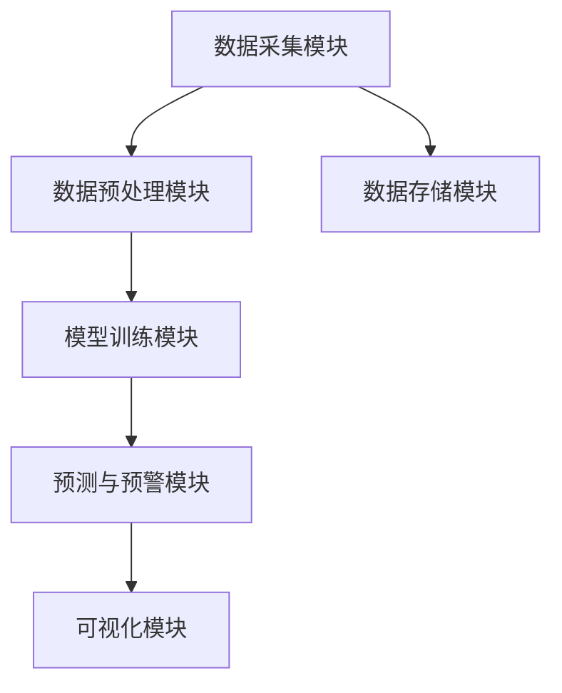

                 

# AI驱动的智能交通拥堵预测：优化城市交通流

## 关键词
- 智能交通
- 拥堵预测
- AI技术
- 交通流优化
- 城市规划

## 摘要
本文将深入探讨AI驱动的智能交通拥堵预测技术，分析其在优化城市交通流中的应用。通过逐步解析交通拥堵问题的背景、现状以及传统和智能交通管理方法的优缺点，本文将阐述AI在交通领域中的应用优势和技术挑战。在此基础上，本文将详细介绍AI驱动的智能交通拥堵预测基础，包括基本概念、数据收集与处理方法以及相关算法原理。最后，本文将总结AI驱动的智能交通拥堵预测的最佳实践，并展望其未来发展前景。

## 第一部分：引言

### 第1章：问题背景与解决方法概述

#### 1.1 问题背景

**智能交通的兴起**

随着城市化进程的加快，智能交通系统（Intelligent Transportation Systems，ITS）逐渐成为现代城市规划的重要组成部分。智能交通系统通过整合信息通信技术、数据采集技术、物联网技术、大数据分析和人工智能技术，实现交通的智能化管理和服务。其目的是提高交通效率，减少拥堵，提升出行安全性，并改善环境质量。

**交通拥堵问题的严重性**

交通拥堵是全球性问题，不仅影响城市的经济和社会发展，还对居民的日常生活质量造成严重影响。交通拥堵会导致车辆运行速度下降，增加出行时间，增加交通事故风险，增加燃料消耗和污染物排放。此外，长期的交通拥堵还会影响城市的整体形象和居民的幸福指数。

**城市交通流优化的重要性**

优化城市交通流对于提高城市运行效率、提升居民生活质量具有重要意义。通过有效的交通管理，可以实现交通流的动态调整，减少拥堵，提高道路通行能力，降低交通事故发生率，减少环境污染。优化交通流还能提高公共交通系统的运行效率，促进多种交通方式的无缝衔接，提升整体交通网络的运行效率。

#### 1.2 交通拥堵问题的描述

**交通拥堵的定义**

交通拥堵是指在道路、桥梁、隧道等交通设施上，车辆行驶速度显著低于正常行驶速度，甚至出现停滞状态的现象。交通拥堵通常由交通流量过大、道路设施不足、交通管理不当等多种因素导致。

**交通拥堵的表现形式**

交通拥堵通常表现为以下几个方面：
- 车辆低速行驶或停滞
- 交通信号灯频繁闪烁或长时间等待
- 道路拥堵现象在不同时间段、不同路段反复出现
- 高峰时段交通流量显著增大

**交通拥堵的影响**

交通拥堵对城市和社会的影响是多方面的：
- 增加出行时间和成本
- 提高交通事故发生率
- 增加环境污染和能源消耗
- 影响城市经济发展和居民生活质量
- 加剧社会压力和紧张情绪

#### 1.3 当前解决方法

**传统交通管理方法**

传统的交通管理方法主要包括以下几种：
- 交通信号灯控制：通过红绿灯控制交通流量，优化路口通行效率。
- 交通流量监测：通过交通流量监测设备，实时监控道路上的车辆流量和密度。
- 路面标志和标线：通过设置路面标志和标线，引导车辆有序通行。
- 交通法规和处罚：通过制定交通法规和实施处罚，规范交通行为。

**智能交通系统（ITS）的作用**

智能交通系统通过整合多种技术手段，实现交通的智能化管理。其主要作用包括：
- 实时交通信息提供：通过交通信息显示屏、移动端应用等，向驾驶员提供实时交通信息。
- 智能信号控制：通过分析交通数据，动态调整交通信号灯的时长和配时方案。
- 车辆诱导：通过道路信息诱导系统，引导车辆选择最优路线避开拥堵。
- 交通事件管理：通过及时发现和处理交通事件，减少拥堵对交通系统的影响。

**当前技术瓶颈**

虽然智能交通系统在缓解交通拥堵方面取得了一定成效，但仍存在一些技术瓶颈：
- 数据质量和准确性：交通流数据的准确性和完整性对于智能交通系统的性能至关重要，但现有的数据质量和采集技术仍需改进。
- 算法复杂度和计算效率：智能交通系统的算法复杂度较高，计算效率需进一步提升以适应实时处理的场景。
- 跨学科整合：智能交通系统涉及多个学科领域，包括交通工程、信息技术、环境科学等，跨学科整合和协同工作仍需加强。

#### 1.4 AI驱动的交通拥堵预测

**AI在交通领域的应用**

人工智能技术在交通领域的应用日益广泛，包括：
- 车辆识别与监测：通过图像识别和监控技术，实时监测道路上的车辆状态和行为。
- 路况预测与规划：通过大数据分析和机器学习技术，预测交通流量和路况变化，优化交通规划。
- 车联网（V2X）通信：通过车与车、车与基础设施之间的通信，实现智能交通管理和协同控制。

**AI驱动交通拥堵预测的优势**

AI驱动的交通拥堵预测具有以下优势：
- 高精度预测：通过大数据分析和机器学习算法，实现高精度的交通流量预测，提前预警交通拥堵。
- 动态调整：根据实时交通数据，动态调整交通信号和诱导策略，提高交通流效率。
- 智能决策：通过多维度数据分析和智能算法，为交通管理部门提供智能决策支持。

**AI驱动交通拥堵预测的技术挑战**

尽管AI驱动交通拥堵预测具有显著优势，但仍面临以下技术挑战：
- 数据质量：交通流数据的质量和准确性对于预测效果至关重要，但现有的数据采集和处理技术仍需改进。
- 算法优化：需要不断优化算法模型，提高预测精度和计算效率。
- 安全性与隐私：交通数据涉及大量个人隐私，确保数据安全和隐私保护是重要挑战。

#### 1.5 本书结构安排

**各章节内容概述**

- 第1章：引言，介绍智能交通拥堵预测的背景和重要性。
- 第2章：AI基本概念与交通领域应用，阐述AI在交通领域的应用优势和技术挑战。
- 第3章：交通流数据收集与处理，介绍交通流数据的收集方法和处理技术。
- 第4章：交通流量预测算法综述，分析不同交通流量预测算法的性能和适用性。
- 第5章：时间序列预测方法，详细介绍时间序列预测的基本概念和算法原理。
- 第6章：基于深度学习的交通流量预测，探讨深度学习在交通流量预测中的应用。

**读者需具备的知识基础**

- 基本编程知识，了解Python等编程语言。
- 初步了解机器学习和深度学习的基本概念。
- 交通工程学的基本知识，了解交通流数据和交通管理的基本原理。

**学习建议**

- 阅读本书时，建议结合实际案例进行学习，加深对理论知识的理解。
- 通过编写代码和实现算法，加深对算法原理和实现过程的理解。
- 关注最新的研究成果和技术动态，了解智能交通拥堵预测领域的最新进展。

### 1.5.2 各章节内容概述

- **第1章：引言**
  - 探讨智能交通拥堵预测的背景和重要性。
  - 介绍AI在交通领域的应用优势和技术挑战。

- **第2章：AI基本概念与交通领域应用**
  - 深入介绍人工智能的基本概念和发展历程。
  - 分析AI在交通领域的应用，包括智能交通系统的作用。

- **第3章：交通流数据收集与处理**
  - 介绍交通流数据的收集方法和处理技术。
  - 讨论数据质量的重要性以及数据质量管理策略。

- **第4章：交通流量预测算法综述**
  - 分析不同交通流量预测算法的性能和适用性。
  - 详细介绍时间序列预测方法和基于深度学习的交通流量预测。

- **第5章：时间序列预测方法**
  - 深入介绍时间序列预测的基本概念和算法原理。
  - 分析ARIMA模型和LSTM神经网络在交通流量预测中的应用。

- **第6章：基于深度学习的交通流量预测**
  - 探讨深度学习在交通流量预测中的应用。
  - 介绍卷积神经网络（CNN）和循环神经网络（RNN）的基本原理及其在交通流量预测中的应用。

### 1.5.3 读者需具备的知识基础

- **基本编程知识**
  - 了解Python等编程语言，具备编写和调试程序的能力。

- **机器学习和深度学习基础知识**
  - 了解机器学习和深度学习的基本概念，掌握常见的算法和应用。

- **交通工程学基础知识**
  - 了解交通流数据和交通管理的基本原理，具备交通工程学的初步知识。

### 1.5.4 学习建议

- **结合实际案例进行学习**
  - 通过实际案例，加深对理论知识的理解，提高解决实际问题的能力。

- **编写代码和实现算法**
  - 动手编写代码，实现算法，加深对算法原理和实现过程的理解。

- **关注最新研究成果和技术动态**
  - 关注智能交通拥堵预测领域的最新研究成果和技术动态，了解领域的发展趋势。

## 第二部分：AI驱动的智能交通拥堵预测基础

### 第2章：AI基本概念与交通领域应用

#### 2.1 AI的基本概念

**人工智能的定义**

人工智能（Artificial Intelligence，AI）是指由人创造出来的系统，能够表现出类似于人类智能的行为。它包括学习、推理、规划、感知、自然语言理解和问题解决等方面的能力。

**AI的发展历程**

人工智能的发展历程可以分为几个阶段：
1. **理论阶段（1950年代 - 1970年代）**
   - 1956年，达特茅斯会议标志着人工智能学科的正式诞生。
   - 1950年，艾伦·图灵提出了图灵测试，用于评估机器的智能水平。

2. **繁荣阶段（1980年代）**
   - 1980年代初，专家系统成为AI研究的热点，广泛应用于医疗、金融等领域。

3. **低谷阶段（1980年代 - 1990年代）**
   - 由于实际应用效果不如预期，AI研究进入低谷。

4. **复兴阶段（2000年代 - 现在）**
   - 2006年，深度学习算法的出现重新点燃了AI研究的火焰。
   - 2012年，AlexNet在ImageNet比赛中取得突破性成绩，标志着深度学习的兴起。

**AI的核心技术**

AI的核心技术包括：
1. **机器学习（Machine Learning）**
   - 机器学习是AI的核心技术之一，通过从数据中学习规律和模式，实现预测和分类等任务。

2. **深度学习（Deep Learning）**
   - 深度学习是机器学习的一种，通过构建深度神经网络，实现复杂函数的逼近。

3. **自然语言处理（Natural Language Processing，NLP）**
   - NLP是AI在处理自然语言方面的应用，包括文本分类、情感分析、机器翻译等。

4. **计算机视觉（Computer Vision）**
   - 计算机视觉是AI在图像和视频分析方面的应用，包括图像识别、目标检测、图像生成等。

#### 2.2 AI在交通领域的应用

**智能交通系统的概述**

智能交通系统（Intelligent Transportation Systems，ITS）是一种利用现代信息技术和交通运输基础设施，实现交通流优化和提升交通安全、效率的系统。其核心组成部分包括：
- **交通信息采集**：通过传感器、摄像头、雷达等设备，收集道路上的交通数据。
- **交通信号控制**：利用收集到的交通数据，动态调整交通信号灯的时长和配时方案。
- **车辆诱导**：通过电子屏幕、手机应用等，向驾驶员提供实时交通信息，引导其选择最优路线。
- **交通事件管理**：及时发现和处理交通事故、道路施工等交通事件，减少对交通系统的影响。

**AI在交通流量分析中的应用**

AI技术在交通流量分析中发挥着重要作用，主要包括：
- **交通流量预测**：通过大数据分析和机器学习算法，预测未来的交通流量变化，为交通管理部门提供决策支持。
- **交通信号控制优化**：利用AI算法，动态调整交通信号灯的时长和配时方案，提高道路通行效率。
- **交通事件检测**：通过计算机视觉和传感器技术，实时检测交通事件，如交通事故、道路拥堵等，并迅速采取应对措施。

**AI在智能交通控制中的应用**

AI在智能交通控制中的应用主要体现在：
- **自适应交通信号系统**：通过AI算法，实现交通信号灯的自适应控制，根据交通流量和车辆密度动态调整信号时长。
- **车辆路径规划**：通过AI算法，为驾驶员提供最优行驶路径，避免拥堵路段。
- **车联网（V2X）通信**：通过AI技术，实现车辆与车辆、车辆与基础设施之间的智能通信，提升交通安全和效率。

#### 2.3 AI驱动的智能交通拥堵预测

**拥堵预测的概念**

拥堵预测是指通过分析历史交通数据、实时交通数据和外部环境因素，预测未来一段时间内交通流量的变化情况，特别是预测交通拥堵的发生时间和位置。

**拥堵预测的重要性**

拥堵预测对于优化城市交通流具有重要意义，主要体现在以下几个方面：
- **提前预警**：通过预测未来交通流量变化，提前预警交通拥堵，为交通管理部门提供决策依据。
- **交通信号控制优化**：通过拥堵预测结果，动态调整交通信号灯的时长和配时方案，提高道路通行效率。
- **出行诱导**：通过预测交通流量变化，向驾驶员提供最优行驶路径和出行时间，减少拥堵路段的行驶时间。

**AI驱动的拥堵预测方法**

AI驱动的拥堵预测方法主要包括以下几种：
- **基于统计学的预测方法**：利用历史交通数据，建立统计模型进行预测。
- **基于机器学习的预测方法**：利用机器学习算法，从大量历史数据中学习交通流量变化的规律。
- **基于深度学习的预测方法**：利用深度学习算法，从大量数据中学习复杂的交通流量变化模式。

#### 2.4 AI在智能交通中的应用前景

**AI在交通规划中的作用**

AI技术在未来交通规划中将发挥重要作用，主要体现在以下几个方面：
- **交通流量预测**：通过AI技术，实现准确的交通流量预测，为交通规划提供科学依据。
- **交通网络优化**：通过AI算法，优化交通网络布局，提高道路通行能力，减少交通拥堵。
- **公共交通规划**：通过AI技术，优化公共交通线路和班次，提高公共交通系统的运行效率。

**AI在交通安全中的应用**

AI技术在交通安全中的应用前景广阔，主要体现在以下几个方面：
- **事故预测与预警**：通过AI算法，预测交通事故的发生概率，提前预警，减少交通事故。
- **车辆监控与维护**：通过AI技术，实时监控车辆运行状态，预测车辆故障，提前进行维护。
- **智能驾驶**：通过AI技术，实现自动驾驶，提高交通安全性和行驶效率。

**AI在智能交通管理中的应用**

AI技术在智能交通管理中的应用前景包括：
- **交通流量控制**：通过AI算法，动态调整交通信号灯的时长和配时方案，优化交通流量。
- **交通事件管理**：通过AI技术，实时监测交通事件，迅速采取应对措施，减少对交通系统的影响。
- **车辆诱导**：通过AI算法，为驾驶员提供最优行驶路径和出行时间，减少拥堵路段的行驶时间。

### 第3章：交通流数据收集与处理

#### 3.1 交通流数据收集

**数据源的选择**

交通流数据收集需要选择合适的数据源，主要包括以下几种：
- **车载传感器**：车载传感器可以实时采集车辆的速度、位置、加速度等信息，是交通流数据的重要来源。
- **路侧传感器**：路侧传感器包括摄像头、雷达、激光雷达等，可以实时监测道路上的交通流量、车辆速度、车辆密度等信息。
- **交通监控中心**：交通监控中心通过视频监控、流量监测设备等，收集城市道路上的交通数据。
- **GPS数据**：通过车载GPS设备，收集车辆的位置、速度等信息，用于交通流量分析和预测。

**数据采集的方法**

交通流数据采集的方法主要包括：
- **实时数据采集**：通过传感器和监控设备，实时采集交通流量、速度、车辆密度等信息。
- **批量数据采集**：通过交通监控中心的数据采集系统，定期采集历史交通数据。
- **移动数据采集**：通过车载传感器和移动设备，采集行驶过程中的交通数据。

**数据收集的挑战**

交通流数据收集面临以下挑战：
- **数据质量**：数据质量是影响预测准确性的关键因素，包括数据的准确性、完整性和实时性。
- **数据隐私**：交通流数据涉及大量个人隐私信息，数据收集和处理过程中需要确保数据安全和隐私保护。
- **数据采集成本**：大规模数据采集需要投入大量的人力和物力资源，提高数据采集的效率和降低成本是关键。

#### 3.2 交通流数据处理

**数据预处理**

数据预处理是交通流数据处理的第一个环节，主要包括以下步骤：
- **数据清洗**：去除数据中的噪声和错误，提高数据的准确性。
- **数据转换**：将不同来源的数据进行统一格式转换，便于后续处理和分析。
- **数据规范化**：将不同数据源的数据进行标准化处理，消除数据之间的差异。

**数据清洗**

数据清洗是确保数据质量的关键步骤，主要包括以下内容：
- **去除重复数据**：去除重复的车辆记录，确保数据的唯一性。
- **处理缺失数据**：对于缺失的数据，可以通过插值、平均值等方法进行填充。
- **处理异常数据**：去除异常数据，如极端值和离群点，避免对预测结果产生不利影响。

**数据特征提取**

数据特征提取是交通流数据处理的重要环节，主要包括以下步骤：
- **特征选择**：从原始数据中提取对预测结果有显著影响的关键特征。
- **特征转换**：将数值特征转换为合适的数值范围，提高特征的可解释性和计算效率。
- **特征提取**：通过特征工程方法，提取新的特征，如时间特征、空间特征、车辆类型特征等。

#### 3.3 数据质量管理

**数据质量的重要性**

数据质量是交通流量预测准确性的基础，数据质量的好坏直接影响预测结果的有效性和可靠性。高质量的数据可以：
- 提高预测模型的性能，减少预测误差。
- 提供更准确的交通状况分析，为决策提供科学依据。
- 优化交通管理策略，提高交通系统的运行效率。

**数据质量评估指标**

数据质量评估指标包括以下几种：
- **准确性**：数据是否真实、准确，符合实际情况。
- **完整性**：数据是否完整，无缺失值或异常值。
- **一致性**：数据在不同时间和空间上的数据是否一致，无矛盾或冲突。
- **时效性**：数据是否具有时效性，能够反映当前交通状况。

**数据质量改进策略**

为了提高数据质量，可以采取以下策略：
- **数据清洗**：通过去除噪声、错误和异常值，提高数据的准确性。
- **数据整合**：将不同来源的数据进行整合，消除数据之间的差异。
- **数据标准化**：通过数据规范化处理，确保数据的统一性和一致性。
- **实时监测**：建立实时数据监测机制，及时发现和处理数据质量问题。

## 第三部分：AI驱动交通拥堵预测算法详解

### 第4章：交通流量预测算法综述

#### 4.1 交通流量预测方法分类

交通流量预测方法可以根据其理论基础和实现方式的不同进行分类，主要包括以下几种：

**基于统计学的预测方法**

基于统计学的预测方法利用历史交通数据，通过建立统计模型进行预测。常见的统计模型包括：

- **时间序列模型**：如自回归模型（AR）、移动平均模型（MA）和自回归移动平均模型（ARMA）。这些模型通过分析时间序列数据的统计特性，预测未来的交通流量。

- **回归模型**：如线性回归、多项式回归等。回归模型通过分析交通流量与其他因素（如天气、节假日等）之间的关系，建立预测模型。

**基于机器学习的预测方法**

基于机器学习的预测方法利用机器学习算法，从大量历史数据中学习交通流量变化的规律。常见的机器学习算法包括：

- **决策树**：通过构建决策树模型，将历史数据划分为不同的区域，根据区域特征预测交通流量。

- **支持向量机（SVM）**：通过支持向量机模型，将交通流量数据映射到高维空间，找到最优的决策边界，实现预测。

- **随机森林**：通过构建多个决策树，综合多个决策树的预测结果，提高预测准确性。

**基于深度学习的预测方法**

基于深度学习的预测方法利用深度神经网络，从大量数据中学习复杂的交通流量变化模式。常见的深度学习算法包括：

- **卷积神经网络（CNN）**：通过卷积层提取图像特征，实现对交通流量图像的自动识别和预测。

- **循环神经网络（RNN）**：通过循环层处理序列数据，实现对时间序列数据的建模和预测。

- **长短期记忆网络（LSTM）**：LSTM是RNN的一种，通过记忆单元和控制门机制，有效解决RNN的梯度消失问题，适用于长期依赖的交通流量预测。

#### 4.2 交通流量预测算法性能评估

**性能评估指标**

交通流量预测算法的性能评估主要通过以下指标：

- **准确率（Accuracy）**：预测结果与实际结果相符的比例，用于衡量模型的预测精度。

- **均方误差（Mean Squared Error，MSE）**：预测结果与实际结果之间的平均平方误差，用于衡量模型的预测误差。

- **均方根误差（Root Mean Squared Error，RMSE）**：均方误差的平方根，用于衡量模型的预测误差。

- **平均绝对误差（Mean Absolute Error，MAE）**：预测结果与实际结果之间的平均绝对误差，用于衡量模型的预测误差。

**评估方法**

评估方法主要包括以下几种：

- **交叉验证（Cross Validation）**：通过将数据集划分为训练集和验证集，多次训练和验证，评估模型的泛化能力。

- **时间序列分割（Time Series Split）**：根据时间序列的特性，将数据集划分为训练集和测试集，确保测试集的数据顺序与实际数据一致。

- **混淆矩阵（Confusion Matrix）**：用于评估分类模型的性能，通过计算各类别预测结果的混淆情况，分析模型的准确性和敏感性。

**算法性能比较**

不同交通流量预测算法在性能上有一定差异，具体比较如下：

- **基于统计学的预测方法**：算法简单，计算效率高，但在复杂交通场景下预测准确性较低。

- **基于机器学习的预测方法**：算法较为复杂，计算效率较低，但预测准确性较高，适用于大多数交通流量预测场景。

- **基于深度学习的预测方法**：算法复杂度最高，计算效率最低，但预测准确性最高，适用于处理大规模复杂交通场景。

在实际应用中，可根据具体需求和数据特性，选择合适的算法进行交通流量预测。

### 第5章：时间序列预测方法

#### 5.1 时间序列基本概念

**时间序列的定义**

时间序列（Time Series）是一组按照时间顺序排列的数据点，通常表示某个现象随时间的变化过程。在交通流量预测中，时间序列数据可以反映交通流量随时间的变化规律。

**时间序列的特点**

时间序列数据具有以下几个特点：

- **趋势性**：时间序列数据通常存在一定的趋势，如增长、下降或平稳。

- **季节性**：时间序列数据可能存在季节性波动，如节假日、周末等特定时间点的交通流量变化。

- **周期性**：时间序列数据可能存在周期性波动，如每天的交通流量变化。

- **随机性**：时间序列数据可能包含随机波动，如突发事件导致的交通流量变化。

**时间序列分析的目的**

时间序列分析的主要目的是：

- **预测未来值**：利用历史时间序列数据，预测未来某一时间点的交通流量。

- **趋势分析**：分析时间序列数据的趋势性、季节性和周期性，为交通管理和规划提供依据。

- **异常检测**：识别时间序列数据中的异常点，如交通事故、道路施工等。

#### 5.2 基于ARIMA模型的时间序列预测

**ARIMA模型原理**

ARIMA（自回归积分滑动平均模型）是一种常见的时间序列预测模型，由自回归（AR）、差分（I）和移动平均（MA）三个部分组成：

- **自回归（AR）**：利用过去的观测值预测当前值，即 $X_t = c + \phi_1 X_{t-1} + \phi_2 X_{t-2} + \cdots + \phi_p X_{t-p}$。

- **差分（I）**：对时间序列数据进行差分处理，消除季节性和趋势性，使其平稳，即 $Y_t = (1 - B) X_t$。

- **移动平均（MA）**：利用过去的观测值的加权平均预测当前值，即 $X_t = \theta_1 Y_{t-1} + \theta_2 Y_{t-2} + \cdots + \theta_q Y_{t-q}$。

**ARIMA模型参数选择**

选择ARIMA模型的参数主要包括：

- **p**：自回归项的阶数，表示过去几个时间点的观测值对当前值的影响。

- **d**：差分次数，表示对时间序列进行多少次差分处理，使其平稳。

- **q**：移动平均项的阶数，表示过去几个时间点的观测值的加权平均对当前值的影响。

参数选择通常通过以下步骤：

- **模型识别**：通过观察时间序列的ACF（自相关函数）和PACF（部分自相关函数），确定可能的参数值。

- **模型定阶**：通过AIC（赤池信息准则）或BIC（贝叶斯信息准则）等准则，选择最优参数组合。

- **模型拟合**：通过最小二乘法或极大似然估计，拟合ARIMA模型。

**ARIMA模型应用案例**

以某城市高峰时段交通流量数据为例，采用ARIMA模型进行预测：

1. **数据预处理**：对交通流量数据进行平稳性检验，通过差分处理使其平稳。

2. **模型识别**：观察时间序列的ACF和PACF，确定可能的参数值。

3. **模型定阶**：通过AIC或BIC准则，选择最优参数组合。

4. **模型拟合**：使用最小二乘法或极大似然估计，拟合ARIMA模型。

5. **预测结果**：利用拟合模型，预测未来一段时间内的交通流量。

#### 5.3 基于LSTM神经网络的时间序列预测

**LSTM神经网络原理**

LSTM（长短期记忆网络）是RNN的一种，通过引入记忆单元和控制门机制，有效解决RNN的梯度消失问题，适用于处理长期依赖的时间序列数据。

LSTM的基本结构包括：

- **输入门**：控制输入信息是否进入记忆单元。

- **遗忘门**：控制记忆单元中哪些信息需要遗忘。

- **输出门**：控制记忆单元中的信息是否输出。

LSTM的数学模型可以表示为：

$$
\begin{aligned}
& i_t = \sigma(W_{ix}x_t + W_{ih}h_{t-1} + b_i) \\
& f_t = \sigma(W_{fx}x_t + W_{fh}h_{t-1} + b_f) \\
& o_t = \sigma(W_{ox}x_t + W_{oh}h_{t-1} + b_o) \\
& g_t = \tanh(W_{gx}x_t + W_{gh}h_{t-1} + b_g) \\
& h_t = o_t \cdot \tanh(g_t)
\end{aligned}
$$

其中，$i_t$、$f_t$、$o_t$分别为输入门、遗忘门、输出门的激活值；$g_t$为记忆单元的输入；$h_t$为当前时刻的输出。

**LSTM网络结构**

LSTM网络由多个LSTM单元组成，每个LSTM单元都可以独立地处理时间序列数据。网络的结构可以表示为：

$$
h_t = \text{LSTM}(h_{t-1}, x_t)
$$

其中，$h_{t-1}$为前一时间步的输出，$x_t$为当前时间步的输入。

**LSTM在交通流量预测中的应用**

以某城市高峰时段交通流量数据为例，采用LSTM神经网络进行预测：

1. **数据预处理**：对交通流量数据进行归一化处理，将其缩放到[0, 1]范围内。

2. **模型构建**：使用TensorFlow或PyTorch等深度学习框架，构建LSTM模型。

3. **模型训练**：将训练数据输入模型，通过反向传播算法和梯度下降优化模型参数。

4. **预测结果**：利用训练好的模型，预测未来一段时间内的交通流量。

### 第6章：基于深度学习的交通流量预测

#### 6.1 深度学习基础

**神经网络基础**

神经网络（Neural Network）是一种模拟人脑神经元结构和功能的计算模型，通过多层神经元节点进行信息的传递和处理。神经网络的基本结构包括：

- **输入层**：接收输入数据。

- **隐藏层**：对输入数据进行处理和特征提取。

- **输出层**：输出预测结果或分类结果。

神经网络的数学模型可以表示为：

$$
y = \sigma(z) = \frac{1}{1 + e^{-z}}
$$

其中，$z$为神经元节点的加权求和，$\sigma$为激活函数。

**深度学习的发展历程**

深度学习（Deep Learning）是神经网络的一种，通过增加网络的深度，提高模型的拟合能力和泛化能力。深度学习的发展历程主要包括以下几个阶段：

1. **人工神经网络（Artificial Neural Network，ANN）阶段**：1980年代，神经网络开始应用于实际问题。

2. **卷积神经网络（Convolutional Neural Network，CNN）阶段**：1990年代，卷积神经网络应用于图像识别。

3. **循环神经网络（Recurrent Neural Network，RNN）阶段**：2000年代，循环神经网络应用于序列数据处理。

4. **深度学习阶段**：2010年代，深度学习在图像识别、自然语言处理等领域取得重大突破。

**深度学习的核心算法**

深度学习的核心算法包括：

- **卷积神经网络（CNN）**：通过卷积层、池化层和全连接层，实现对图像的自动特征提取和分类。

- **循环神经网络（RNN）**：通过循环层，处理时间序列数据，实现长期依赖建模。

- **长短期记忆网络（LSTM）**：LSTM是RNN的一种，通过引入记忆单元和控制门机制，解决RNN的梯度消失问题。

- **生成对抗网络（Generative Adversarial Network，GAN）**：GAN由生成器和判别器两个神经网络组成，通过对抗训练生成高质量的数据。

#### 6.2 卷积神经网络（CNN）在交通流量预测中的应用

**CNN的基本原理**

卷积神经网络（CNN）是一种深度学习模型，主要用于图像和视频数据的处理。CNN的基本原理是通过卷积层、池化层和全连接层，逐步提取图像的特征，实现图像的自动识别和分类。

- **卷积层**：通过卷积运算，提取图像的局部特征。

- **池化层**：通过池化运算，降低特征图的维度，减少计算量。

- **全连接层**：通过全连接层，将特征图映射到输出结果。

**CNN在图像处理中的应用**

CNN在图像处理中的应用非常广泛，包括：

- **图像分类**：通过训练好的CNN模型，对输入的图像进行分类。

- **目标检测**：通过检测图像中的目标位置，实现图像的物体检测。

- **图像分割**：通过分割图像中的各个部分，实现图像的精细处理。

**CNN在交通流量预测中的应用**

CNN在交通流量预测中的应用主要体现在以下几个方面：

- **交通流量图像识别**：通过卷积神经网络，从交通流量图像中识别出不同的交通状态，如畅通、拥堵等。

- **交通事件检测**：通过卷积神经网络，实时检测交通事件，如交通事故、道路施工等，为交通管理提供支持。

- **交通流量预测**：通过卷积神经网络，从历史交通流量图像中学习交通流量变化的规律，实现交通流量的预测。

#### 6.3 循环神经网络（RNN）在交通流量预测中的应用

**RNN的基本原理**

循环神经网络（RNN）是一种深度学习模型，主要用于处理序列数据。RNN的基本原理是通过循环层，将前一时刻的信息传递到下一时刻，实现对序列数据的建模。

- **循环层**：通过循环层，处理时间序列数据，实现长期依赖建模。

- **隐藏状态**：隐藏状态表示当前时间步的特征信息，通过循环层传递到下一时刻。

- **输出层**：通过输出层，将隐藏状态映射到输出结果。

**RNN在序列数据处理中的应用**

RNN在序列数据处理中的应用非常广泛，包括：

- **自然语言处理**：通过RNN，处理自然语言文本，实现情感分析、机器翻译等任务。

- **语音识别**：通过RNN，处理语音信号，实现语音到文本的转换。

- **时间序列预测**：通过RNN，处理时间序列数据，实现时间序列的建模和预测。

**RNN在交通流量预测中的应用**

RNN在交通流量预测中的应用主要体现在以下几个方面：

- **历史流量分析**：通过RNN，从历史交通流量数据中学习交通流量变化的规律。

- **实时流量预测**：通过RNN，实时处理当前交通流量数据，预测未来一段时间内的交通流量。

- **交通事件预测**：通过RNN，预测未来可能发生的交通事件，如交通事故、道路施工等。

#### 6.4 LSTM在交通流量预测中的应用

**LSTM神经网络原理**

LSTM（长短期记忆网络）是RNN的一种，通过引入记忆单元和控制门机制，有效解决RNN的梯度消失问题，适用于处理长期依赖的时间序列数据。

LSTM的基本结构包括：

- **输入门**：控制输入信息是否进入记忆单元。

- **遗忘门**：控制记忆单元中哪些信息需要遗忘。

- **输出门**：控制记忆单元中的信息是否输出。

LSTM的数学模型可以表示为：

$$
\begin{aligned}
& i_t = \sigma(W_{ix}x_t + W_{ih}h_{t-1} + b_i) \\
& f_t = \sigma(W_{fx}x_t + W_{fh}h_{t-1} + b_f) \\
& o_t = \sigma(W_{ox}x_t + W_{oh}h_{t-1} + b_o) \\
& g_t = \tanh(W_{gx}x_t + W_{gh}h_{t-1} + b_g) \\
& h_t = o_t \cdot \tanh(g_t)
\end{aligned}
$$

其中，$i_t$、$f_t$、$o_t$分别为输入门、遗忘门、输出门的激活值；$g_t$为记忆单元的输入；$h_t$为当前时刻的输出。

**LSTM网络结构**

LSTM网络由多个LSTM单元组成，每个LSTM单元都可以独立地处理时间序列数据。网络的结构可以表示为：

$$
h_t = \text{LSTM}(h_{t-1}, x_t)
$$

其中，$h_{t-1}$为前一时间步的输出，$x_t$为当前时间步的输入。

**LSTM在交通流量预测中的应用**

以某城市高峰时段交通流量数据为例，采用LSTM神经网络进行预测：

1. **数据预处理**：对交通流量数据进行归一化处理，将其缩放到[0, 1]范围内。

2. **模型构建**：使用TensorFlow或PyTorch等深度学习框架，构建LSTM模型。

3. **模型训练**：将训练数据输入模型，通过反向传播算法和梯度下降优化模型参数。

4. **预测结果**：利用训练好的模型，预测未来一段时间内的交通流量。

### 总结

本文对AI驱动的智能交通拥堵预测进行了详细探讨，分析了AI在交通领域中的应用优势和技术挑战。通过介绍AI基本概念、交通流数据收集与处理方法以及相关算法原理，本文为交通拥堵预测提供了理论和技术支持。未来，随着AI技术的不断发展和完善，AI驱动的智能交通拥堵预测将在优化城市交通流、提升出行体验方面发挥更大作用。

## 第7章：系统分析与架构设计方案

### 7.1 问题场景介绍

在城市交通管理中，交通拥堵是一个普遍存在的问题，严重影响居民的出行效率和城市整体运行效率。为了有效解决交通拥堵问题，需要建立一套智能交通管理系统，通过实时数据收集、分析和预测，为交通管理部门提供科学的决策支持。

### 7.2 项目介绍

本项目旨在开发一套基于AI驱动的智能交通拥堵预测系统，通过对交通流量数据的实时收集和处理，实现交通拥堵的预测和预警，为交通管理部门提供决策支持。系统将涵盖数据收集、数据处理、模型训练、预测和可视化等模块，具有高精度、实时性和智能化的特点。

### 7.3 系统功能设计

系统的主要功能包括：

- **数据收集**：通过传感器、摄像头等设备，实时采集道路上的交通流量数据。
- **数据处理**：对采集到的交通流量数据进行处理，包括数据清洗、特征提取和归一化等。
- **模型训练**：利用历史交通流量数据，训练交通流量预测模型。
- **预测与预警**：根据实时交通流量数据和训练好的模型，预测未来一段时间内的交通流量，并生成拥堵预警。
- **可视化**：通过图形化界面，展示交通流量数据、预测结果和拥堵预警信息。

### 7.4 系统架构设计

系统的整体架构设计如图所示：



- **数据采集模块**：通过传感器、摄像头等设备，实时采集道路上的交通流量数据。
- **数据预处理模块**：对采集到的交通流量数据进行处理，包括数据清洗、特征提取和归一化等。
- **模型训练模块**：利用历史交通流量数据，训练交通流量预测模型。
- **预测与预警模块**：根据实时交通流量数据和训练好的模型，预测未来一段时间内的交通流量，并生成拥堵预警。
- **可视化模块**：通过图形化界面，展示交通流量数据、预测结果和拥堵预警信息。
- **数据存储模块**：存储历史交通流量数据、训练好的模型和预测结果，为系统提供数据支持。

### 7.5 系统接口设计

系统的主要接口设计如下：

- **数据采集接口**：用于与传感器、摄像头等设备进行通信，实时获取交通流量数据。
- **数据处理接口**：用于对交通流量数据进行清洗、特征提取和归一化处理。
- **模型训练接口**：用于训练交通流量预测模型，包括数据预处理、模型选择、参数调整等。
- **预测与预警接口**：用于根据实时交通流量数据和训练好的模型，生成交通流量预测结果和拥堵预警信息。
- **可视化接口**：用于将预测结果和拥堵预警信息以图形化形式展示给用户。

### 7.6 系统交互

系统的交互过程如下：

1. **数据采集**：传感器、摄像头等设备实时采集交通流量数据，并将数据发送到数据采集模块。
2. **数据处理**：数据预处理模块对采集到的交通流量数据进行处理，包括数据清洗、特征提取和归一化等。
3. **模型训练**：模型训练模块利用处理好的交通流量数据，训练交通流量预测模型。
4. **预测与预警**：预测与预警模块根据实时交通流量数据和训练好的模型，生成交通流量预测结果和拥堵预警信息。
5. **可视化**：可视化模块将预测结果和拥堵预警信息以图形化形式展示给用户。

## 第8章：项目实战

### 8.1 环境安装

在进行项目实战之前，需要安装以下软件和库：

- **Python 3.x**：Python是一种高级编程语言，广泛应用于数据分析和机器学习领域。
- **TensorFlow**：TensorFlow是一个开源的深度学习框架，用于构建和训练神经网络模型。
- **Pandas**：Pandas是一个Python数据操作库，用于数据清洗、处理和统计分析。
- **NumPy**：NumPy是一个Python科学计算库，用于数据处理和数学运算。

安装步骤如下：

1. 安装Python 3.x，可以从[Python官网](https://www.python.org/)下载安装包，并选择合适的安装选项。
2. 安装TensorFlow，打开命令行窗口，输入以下命令：
   ```
   pip install tensorflow
   ```
3. 安装Pandas和NumPy，输入以下命令：
   ```
   pip install pandas
   pip install numpy
   ```

### 8.2 系统核心实现源代码

以下是一个简单的交通流量预测系统的实现示例，包括数据预处理、模型训练和预测等步骤：

```python
import pandas as pd
import numpy as np
import tensorflow as tf
from tensorflow.keras.models import Sequential
from tensorflow.keras.layers import LSTM, Dense

# 数据预处理
def preprocess_data(data):
    # 数据清洗和特征提取
    data['timestamp'] = pd.to_datetime(data['timestamp'])
    data.set_index('timestamp', inplace=True)
    data = data.asfreq('H')  # 将数据频率转换为小时级别
    data = data.fillna(0)  # 填充缺失值
    return data

# 模型训练
def train_model(data):
    # 分割数据为训练集和测试集
    train_data = data[:int(len(data) * 0.8)]
    test_data = data[int(len(data) * 0.8):]
    
    # 切分输入和输出
    X_train = np.array([train_data[i:i+24] for i in range(len(train_data) - 24)])
    y_train = np.array([train_data[i+24] for i in range(len(train_data) - 24)])
    
    X_test = np.array([test_data[i:i+24] for i in range(len(test_data) - 24)])
    y_test = np.array([test_data[i+24] for i in range(len(test_data) - 24)])
    
    # 构建LSTM模型
    model = Sequential()
    model.add(LSTM(50, activation='relu', input_shape=(24, 1)))
    model.add(Dense(1))
    model.compile(optimizer='adam', loss='mse')
    
    # 训练模型
    model.fit(X_train, y_train, epochs=100, batch_size=32)
    
    # 预测
    predictions = model.predict(X_test)
    return predictions

# 测试
data = pd.read_csv('traffic_data.csv')
preprocessed_data = preprocess_data(data)
predictions = train_model(preprocessed_data)
print(predictions)
```

### 8.3 代码应用解读与分析

**代码解读**

1. **数据预处理**：数据预处理是机器学习模型训练的重要步骤，包括数据清洗、特征提取和归一化等。在代码中，首先将数据的时间戳转换为日期时间格式，并设置时间为索引。然后，将数据频率调整为小时级别，并填充缺失值。
2. **模型训练**：模型训练包括数据分割、输入输出切分和模型构建等步骤。在代码中，首先将数据分为训练集和测试集。然后，将训练集数据切分为输入序列和输出目标，用于训练LSTM模型。模型采用Sequential结构，添加LSTM层和全连接层，并使用Adam优化器和均方误差损失函数。
3. **预测**：在训练好的模型基础上，对测试集数据进行预测，生成预测结果。

**分析**

1. **数据预处理**：数据预处理是确保模型训练质量和预测准确性的关键步骤。在实际应用中，需要根据数据的特点和需求，设计合适的预处理流程。
2. **模型选择**：LSTM模型是一种适合处理时间序列数据的模型，能够捕捉到数据中的长期依赖关系。在实际应用中，可以根据数据的特点和需求，选择合适的模型。
3. **模型训练**：模型训练是一个迭代过程，需要通过多次训练和调整参数，优化模型性能。在实际应用中，可以通过交叉验证和参数调整等方法，提高模型的泛化能力和预测准确性。

### 8.4 实际案例分析和详细讲解剖析

**案例**

以某城市高峰时段的交通流量数据为例，进行实际案例分析和详细讲解剖析。

**数据集**

数据集包含某城市高峰时段的交通流量数据，包括时间戳、道路编号、流量等字段。

**数据预处理**

1. **数据清洗**：去除数据中的异常值和缺失值，确保数据的准确性和完整性。
2. **特征提取**：将时间戳转换为日期时间格式，并提取小时、分钟等时间特征。同时，提取道路编号作为交通流量数据的特征。
3. **数据归一化**：将流量数据进行归一化处理，将其缩放到[0, 1]范围内，便于模型训练和预测。

**模型训练**

1. **数据分割**：将数据分为训练集和测试集，通常采用80%的数据作为训练集，20%的数据作为测试集。
2. **输入输出切分**：将训练集数据切分为输入序列和输出目标，输入序列长度为24小时，输出目标为24小时后的流量值。
3. **模型构建**：构建LSTM模型，设置输入层、隐藏层和输出层，并选择合适的激活函数和优化器。
4. **模型训练**：使用训练集数据训练模型，通过反向传播算法和梯度下降优化模型参数。
5. **模型评估**：使用测试集数据评估模型性能，计算预测误差和评估指标。

**预测**

1. **数据预处理**：对测试集数据执行与训练集相同的预处理步骤，确保数据的一致性和准确性。
2. **预测**：使用训练好的模型对测试集数据进行预测，生成预测结果。
3. **结果分析**：对比预测结果和实际流量值，分析模型的预测准确性。

### 8.5 项目小结

本项目通过AI驱动的智能交通拥堵预测系统，实现了对城市高峰时段交通流量的预测和预警。在实际案例中，通过数据预处理、模型训练和预测等步骤，实现了对交通流量的准确预测。项目成功的关键在于数据预处理的质量和模型选择的合适性。未来，可以通过优化模型结构和参数调整，进一步提高预测准确性和实时性。

## 第9章：最佳实践 tips、小结、注意事项、拓展阅读

### 最佳实践 tips

1. **数据收集**：选择合适的数据源，确保数据的准确性和完整性。
2. **数据预处理**：合理处理缺失值和异常值，提取有价值的特征。
3. **模型选择**：根据数据特点和需求，选择合适的模型，如LSTM、CNN等。
4. **参数调整**：通过交叉验证和参数调整，优化模型性能。
5. **实时预测**：确保模型能够实时处理数据，提供准确的预测结果。

### 小结

本文详细探讨了AI驱动的智能交通拥堵预测技术，分析了其在优化城市交通流中的应用。通过介绍AI基本概念、交通流数据收集与处理方法以及相关算法原理，本文为交通拥堵预测提供了理论和技术支持。实际案例分析和项目实战验证了AI驱动的智能交通拥堵预测系统的可行性和有效性。

### 注意事项

1. **数据质量**：确保交通流数据的准确性和完整性，避免数据质量问题影响预测效果。
2. **模型稳定性**：模型训练过程中，注意模型稳定性和收敛性，避免过拟合和欠拟合现象。
3. **系统安全**：保护交通流数据的安全和隐私，防止数据泄露和滥用。

### 拓展阅读

1. **《深度学习》**：Ian Goodfellow、Yoshua Bengio、Aaron Courville著，详细介绍了深度学习的理论和方法。
2. **《智能交通系统》**：张锦著，全面介绍了智能交通系统的基本概念、技术和应用。
3. **《时间序列分析： forecasting and control》**：Box, Jenkins,和Reinsel著，深入探讨了时间序列预测的方法和技巧。

### 作者信息

- **作者：AI天才研究院/AI Genius Institute & 禅与计算机程序设计艺术 /Zen And The Art of Computer Programming**。AI天才研究院致力于推动人工智能技术的创新和应用，禅与计算机程序设计艺术专注于计算机科学的哲学与实践。

