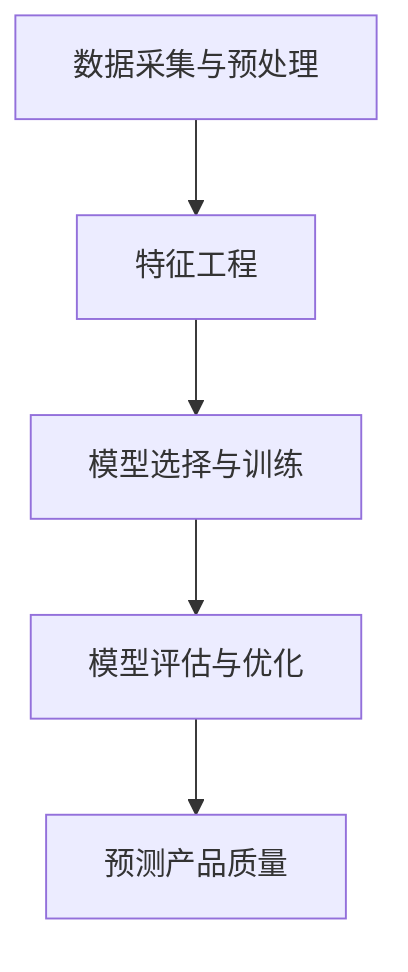

                 


## **AI驱动的智能制造产品质量预测：减少不良品率**

### **关键词：**
- **AI驱动的智能制造**
- **产品质量预测**
- **不良品率**
- **数据分析**
- **机器学习算法**
- **系统架构设计**
- **项目实战**
- **最佳实践**

### **摘要：**
本文旨在探讨如何利用AI技术驱动智能制造中的产品质量预测，从而有效减少不良品率。我们将从问题背景、核心概念、算法原理、系统分析与架构设计、项目实战、最佳实践等方面进行详细分析，并分享具体实施方法和技巧。通过本文的阅读，读者将能够全面了解AI驱动的智能制造产品质量预测的原理、方法和实际应用，为提高产品质量、降低生产成本提供有力支持。

### **第一部分：问题背景与概念解析**

#### **1.1 问题背景**

在当前的制造业中，产品质量问题一直是一个困扰企业的问题。据统计，不良品率每降低1%，企业的利润将增加5%至10%。然而，传统的质量检测方法往往存在检测周期长、成本高、效率低等问题，导致不良品率居高不下。随着人工智能技术的发展，AI驱动的智能制造逐渐成为解决这一问题的有效途径。

#### **1.2 概念解析**

- **AI驱动的智能制造**：利用人工智能技术，实现制造过程的全自动化、智能化，提高生产效率、降低成本、提高产品质量。
- **产品质量预测**：通过分析历史数据和实时数据，预测产品质量的波动情况，提前发现潜在问题，防止不良品产生。
- **不良品率**：指不良品数量与总生产数量之比，是衡量产品质量的重要指标。

### **第二部分：核心概念**

#### **2.1 产品质量预测的基本概念**

- **数据采集与预处理**：收集与产品质量相关的数据，如原材料质量、生产参数、设备状态等，并对数据进行清洗、归一化等处理。
- **特征工程**：从原始数据中提取出对产品质量预测有重要影响的特征，如关键生产参数、原材料属性等。
- **模型选择与训练**：根据质量预测的目标，选择合适的机器学习算法，并利用历史数据对模型进行训练。

#### **2.2 AI技术在产品质量预测中的应用**

- **监督学习**：通过已标记的数据对模型进行训练，使模型能够预测未知数据的质量。
- **无监督学习**：通过分析数据之间的内在联系，发现数据分布规律，从而预测产品质量。
- **增强学习**：通过不断调整模型参数，使模型在复杂环境中能够自主适应和优化。

### **第三部分：算法原理**

#### **3.1 质量预测算法原理**

- **数学模型**：假设产品质量 $Q$ 是由多个因素 $X_1, X_2, ..., X_n$ 影响的，即 $Q = f(X_1, X_2, ..., X_n)$。通过建立数学模型，可以预测产品质量。
- **算法流程**：
  - 数据采集与预处理
  - 特征工程
  - 模型选择与训练
  - 模型评估与优化

#### **3.2 质量预测算法的mermaid流程图**



#### **3.3 Python源代码实现**

```python
import pandas as pd
from sklearn.model_selection import train_test_split
from sklearn.ensemble import RandomForestRegressor
from sklearn.metrics import mean_squared_error

# 数据采集与预处理
data = pd.read_csv('data.csv')
X = data.iloc[:, :-1]
y = data.iloc[:, -1]

# 特征工程
# （此处省略具体代码）

# 模型选择与训练
X_train, X_test, y_train, y_test = train_test_split(X, y, test_size=0.2, random_state=42)
model = RandomForestRegressor(n_estimators=100)
model.fit(X_train, y_train)

# 模型评估与优化
y_pred = model.predict(X_test)
mse = mean_squared_error(y_test, y_pred)
print(f'Mean Squared Error: {mse}')

# 预测产品质量
new_data = pd.read_csv('new_data.csv')
new_X = new_data.iloc[:, :-1]
new_y_pred = model.predict(new_X)
print(new_y_pred)
```

### **第四部分：系统分析与架构设计**

#### **4.1 系统需求分析**

- **功能需求**：实现产品质量预测、数据采集、预处理、特征工程等功能。
- **性能需求**：高效处理海量数据，快速预测产品质量。
- **可靠性需求**：保证系统稳定运行，减少故障。

#### **4.2 系统架构设计**

- **系统功能设计**：数据采集模块、数据处理模块、质量预测模块、结果输出模块。
- **系统架构设计**：
  - **数据采集模块**：负责收集与产品质量相关的数据。
  - **数据处理模块**：包括数据预处理、特征工程等。
  - **质量预测模块**：根据历史数据和实时数据，预测产品质量。
  - **结果输出模块**：将预测结果以可视化方式展示。

#### **4.3 系统接口设计**

- **数据采集接口**：用于与其他系统进行数据交互。
- **数据处理接口**：用于数据预处理和特征工程。
- **质量预测接口**：用于接收数据处理结果，进行质量预测。
- **结果输出接口**：用于将预测结果输出到可视化界面。

#### **4.4 系统交互设计**

- **用户与系统交互**：用户通过界面提交数据，系统进行处理和质量预测，并将结果展示给用户。
- **系统间交互**：不同模块之间通过接口进行数据传输和功能调用。

### **第五部分：项目实战**

#### **5.1 项目介绍**

本项目旨在利用AI技术对某电子产品生产过程中的产品质量进行预测，以减少不良品率。

#### **5.2 环境安装与配置**

- **环境要求**：Python 3.6及以上版本、scikit-learn、pandas、numpy等库。
- **安装步骤**：安装Python和所需库，配置Python环境。

#### **5.3 系统核心实现**

- **数据采集**：从数据库中读取产品质量数据。
- **数据处理**：对数据进行预处理和特征工程。
- **质量预测**：利用随机森林算法进行质量预测。

#### **5.4 代码应用解读与分析**

- **代码解读**：对核心代码进行详细解读，分析其实现原理。
- **分析**：对预测结果进行分析，评估模型性能。

#### **5.5 实际案例分析**

- **案例分析**：结合实际案例，分析如何利用AI技术降低不良品率。

#### **5.6 项目小结**

- **小结**：总结项目实施过程中的经验教训，提出改进建议。

### **第六部分：最佳实践与总结**

#### **6.1 最佳实践**

- **数据采集与预处理**：确保数据质量，去除噪声和异常值。
- **特征工程**：提取对质量预测有重要影响的特征。
- **模型选择与训练**：根据数据特点和预测目标选择合适的模型，并进行训练。
- **模型评估与优化**：评估模型性能，不断优化模型参数。

#### **6.2 小结**

- **总结**：本文介绍了AI驱动的智能制造产品质量预测的方法和技巧，通过实际案例验证了其有效性。
- **展望**：未来，随着AI技术的不断发展，产品质量预测将更加精准，为制造业带来更大的价值。

#### **6.3 注意事项**

- **数据隐私**：在数据采集和处理过程中，注意保护用户隐私。
- **模型更新**：定期更新模型，以适应不断变化的生产环境。

#### **6.4 拓展阅读**

- **相关书籍**：《机器学习实战》、《深度学习》、《Python数据分析》
- **学术论文**：关于AI驱动的智能制造产品质量预测的研究论文。

### **作者信息**

- **作者**：AI天才研究院/AI Genius Institute & 禅与计算机程序设计艺术 /Zen And The Art of Computer Programming**

