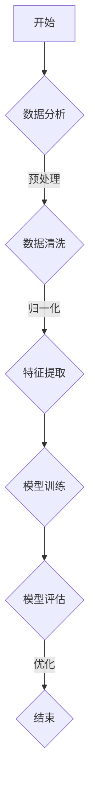

                 


### **引言**

在当今快速发展的工业时代，智能制造设备成为制造业的核心驱动力。然而，设备的可靠性和维护效率直接影响到生产的连续性和成本控制。传统的人工维修方式往往效率低下，且不能提前预防潜在故障，导致生产停机和经济损失。因此，AI驱动的预测性维护应运而生，为智能制造设备提供了前所未有的维护解决方案。

**本文关键词**：AI、智能制造、预测性维护、减少停机时间

**摘要**：本文将探讨AI驱动的智能制造设备预测性维护的重要性及其应用。通过介绍预测性维护的概念、AI技术在其中的应用，我们将详细阐述AI技术的基础、设备故障预测模型的设计与实现、数据分析与处理方法，以及模型训练与评估的策略。同时，通过案例研究和未来展望，我们将分析预测性维护的实施步骤、面临的挑战和机遇。

### **目录**

- 第一部分：引言
  - 第1章：AI驱动的智能制造设备预测性维护概述
    - 1.1 预测性维护的概念与重要性
    - 1.2 AI技术在预测性维护中的应用
    - 1.3 本书的目标与结构
- 第二部分：智能制造设备概述
  - 第2章：智能制造设备的技术基础
    - 2.1 智能制造的定义与发展历程
    - 2.2 智能制造设备的关键技术
    - 2.3 智能制造设备的工作原理
- 第三部分：AI技术在预测性维护中的应用
  - 第3章：AI技术基础
    - 3.1 机器学习的基本概念
    - 3.2 深度学习原理与应用
    - 3.3 数据预处理与特征工程
  - 第4章：预测性维护模型设计
    - 4.1 故障预测模型的基本原理
    - 4.2 常见故障预测算法介绍
    - 4.3 故障预测模型的构建与优化
  - 第5章：数据收集与处理
    - 5.1 数据来源与采集方法
    - 5.2 数据预处理与清洗
    - 5.3 数据可视化与分析
  - 第6章：模型训练与评估
    - 6.1 模型训练过程
    - 6.2 评估指标与性能分析
    - 6.3 模型调优与改进
  - 第7章：案例研究
    - 7.1 案例背景与目标
    - 7.2 模型应用与实现
    - 7.3 结果分析与讨论
- 第四部分：预测性维护的实施与展望
  - 第8章：预测性维护的实施与展望
    - 8.1 预测性维护的实施步骤
    - 8.2 预测性维护的挑战与机遇
    - 8.3 未来发展展望

----------------------------------------------------------------

### **第一部分：引言**

在制造业的快速发展和智能化的趋势下，智能制造设备正逐渐成为现代工业生产的中坚力量。这些设备的高效运行和可靠性直接关系到生产效率和产品质量。然而，随着设备复杂性和工作强度的增加，设备的故障和维护问题也日益突出。传统的人工维修方式往往不能及时检测和预测设备的潜在故障，导致生产停机时间延长，影响企业的生产效率和经济效益。

预测性维护（Predictive Maintenance）作为一种新型的维护方式，通过实时监测设备的运行状态，预测其可能的故障时间，从而在故障发生前采取预防措施，以减少停机时间和维护成本。相较于传统的定期维护和反应性维护，预测性维护具有更高的效率和更精准的维护策略，能够显著提高设备的可靠性和生产效率。

### **核心概念与联系**

**核心概念**：
- **智能制造设备**：采用信息技术和智能技术实现自动化和智能化生产的设备。
- **预测性维护**：通过实时监测设备运行状态，预测潜在故障，提前采取维护措施。
- **AI技术**：包括机器学习、深度学习等算法和技术，用于数据分析、模式识别和故障预测。

**概念属性特征对比表格**：

| 概念           | 特征                                      |
|----------------|-----------------------------------------|
| 智能制造设备   | 高度自动化、智能化、数据驱动             |
| 预测性维护     | 实时监测、预测故障、提前预防             |
| AI技术         | 数据分析、模式识别、自主学习、自适应优化 |

**ER实体关系图架构**：

```mermaid
erDiagram
  Equipment ||--|{ Maintenance }|--| Monitoring |
  Maintenance ||--|{ Prediction }|--| ActionPlan |
  Monitoring ||--|{ Data }|--| Equipment
```

在这个ER图中，"Equipment"（设备）是核心实体，与"Monitoring"（监测）、"Prediction"（预测）和"ActionPlan"（行动计划）等实体之间存在关联。通过这种结构，我们可以清晰地看到预测性维护的各个环节及其相互关系。

### **问题场景介绍**

在制造业中，设备的稳定运行至关重要。然而，传统的人工维修方式存在以下问题：

1. **故障检测不及时**：人工维修往往需要等到设备出现故障后才能进行，导致生产停机时间延长。
2. **维护效率低**：人工巡检和维护需要耗费大量人力和时间，且容易出现遗漏和误判。
3. **预防性不足**：定期维护无法针对特定设备的具体状态进行个性化调整，预防性不足。

为了解决这些问题，AI驱动的预测性维护应运而生。通过实时监测设备运行状态，AI技术可以提前预测设备故障，提供个性化维护方案，从而实现以下目标：

1. **减少停机时间**：在故障发生前进行预防性维护，避免生产停机。
2. **提高维护效率**：通过自动化监测和分析，提高维护工作的效率和准确性。
3. **降低维护成本**：精确预测故障，避免不必要的维护和更换，降低成本。

### **问题描述**

在传统的设备维护模式下，企业通常采用定期检查和维护的方法。这种方法虽然能够确保设备的基本可靠性，但存在以下不足：

1. **预防性不足**：定期维护缺乏针对特定设备的个性化调整，无法预测具体故障点，导致预防性维护不足。
2. **响应不及时**：一旦设备发生故障，需要等待专业技术人员到场进行维修，影响生产效率。
3. **维护成本高**：定期维护往往涉及大量的检查和更换，增加了维护成本。

而AI驱动的预测性维护通过实时监测和智能分析，能够实现以下目标：

1. **个性化预防**：根据设备的具体运行状态，提前预测可能发生的故障，提供个性化维护方案。
2. **实时响应**：在故障发生前进行预防性维护，减少生产停机时间。
3. **降低成本**：精确预测故障点，避免不必要的维护和更换，降低总体维护成本。

### **问题解决**

AI驱动的预测性维护通过以下几个步骤解决问题：

1. **数据采集**：利用传感器和监测设备实时收集设备运行数据。
2. **数据预处理**：对采集到的数据进行分析和清洗，提取有用的特征信息。
3. **故障预测模型**：使用机器学习和深度学习算法，构建故障预测模型，对设备状态进行实时监测和分析。
4. **预测结果分析**：根据模型预测结果，制定相应的维护计划，并在故障发生前进行预防性维护。

通过这一系列步骤，AI驱动的预测性维护能够实现高效、精准的设备维护，从而减少停机时间，提高生产效率和降低维护成本。

### **边界与外延**

**边界**：
- **时间边界**：预测性维护主要关注在设备故障发生前的状态监测和预测，而不是故障发生后的修复。
- **技术边界**：AI驱动的预测性维护依赖于先进的传感器技术、大数据分析和机器学习算法。

**外延**：
- **技术外延**：预测性维护可以扩展到更多领域，如医疗设备、航空航天等。
- **应用外延**：除了设备故障预测，预测性维护还可以应用于供应链管理、生产优化等领域。

### **核心要素组成**

AI驱动的预测性维护由以下几个核心要素组成：

1. **传感器网络**：实时监测设备运行状态，收集数据。
2. **数据存储与管理**：存储和处理监测数据，进行数据预处理和特征提取。
3. **故障预测模型**：使用机器学习和深度学习算法，构建预测模型。
4. **决策支持系统**：根据预测结果，制定维护计划和策略。
5. **维护执行**：根据决策支持系统的指导，执行具体的维护操作。

### **第二部分：智能制造设备概述**

#### **第2章：智能制造设备的技术基础**

##### **2.1 智能制造的定义与发展历程**

智能制造（Intelligent Manufacturing）是指利用信息技术、智能技术和自动化技术，实现制造过程的智能化和自动化。智能制造的目标是提高生产效率、降低生产成本、提高产品质量和增强企业的竞争力。

智能制造的发展历程可以分为以下几个阶段：

1. **自动化阶段**：从20世纪60年代开始，制造过程逐步实现自动化，包括数控机床、自动生产线等。
2. **信息化阶段**：从20世纪80年代开始，信息技术逐渐应用于制造过程，实现生产数据的收集和管理。
3. **智能化阶段**：从21世纪初开始，智能制造技术逐步成熟，包括机器人、智能传感器、云计算等。

##### **2.2 智能制造设备的关键技术**

智能制造设备的关键技术包括传感器技术、机器人技术、云计算技术、大数据技术和人工智能技术。

1. **传感器技术**：传感器用于实时监测设备的运行状态，如温度、压力、振动等参数。
2. **机器人技术**：机器人用于执行重复性高、危险或繁琐的工作，提高生产效率。
3. **云计算技术**：云计算用于存储和处理大量数据，提供强大的计算能力。
4. **大数据技术**：大数据技术用于分析和挖掘设备运行数据，提供决策支持。
5. **人工智能技术**：人工智能技术用于构建故障预测模型，实现智能维护。

##### **2.3 智能制造设备的工作原理**

智能制造设备的工作原理可以分为以下几个步骤：

1. **数据采集**：通过传感器网络实时采集设备运行数据。
2. **数据处理**：将采集到的数据传输到数据处理中心，进行预处理和特征提取。
3. **故障预测**：利用人工智能算法，对设备状态进行实时监测和故障预测。
4. **决策支持**：根据预测结果，制定维护计划和策略。
5. **维护执行**：执行具体的维护操作，如更换零部件、调整参数等。

通过这些步骤，智能制造设备能够实现高效、精准的运行和智能维护，从而提高生产效率和产品质量。

#### **第三部分：AI技术在预测性维护中的应用**

##### **第3章：AI技术基础**

##### **3.1 机器学习的基本概念**

机器学习（Machine Learning）是人工智能（Artificial Intelligence）的一个分支，通过算法和统计模型，从数据中自动学习和发现规律，从而进行预测和决策。

**核心概念**：

- **数据集**：用于训练和学习的数据集合。
- **特征**：用于描述数据样本的特性。
- **模型**：用于预测和决策的算法和统计模型。
- **损失函数**：用于评估模型预测性能的指标。

**机器学习的基本流程**：

1. **数据采集**：收集相关数据。
2. **数据预处理**：清洗、归一化等处理。
3. **特征提取**：提取数据中的特征。
4. **模型训练**：使用训练数据训练模型。
5. **模型评估**：使用测试数据评估模型性能。
6. **模型优化**：调整模型参数，优化模型性能。

##### **3.2 深度学习原理与应用**

深度学习（Deep Learning）是机器学习的一种方法，通过构建多层神经网络，实现对复杂数据的自动学习和特征提取。

**核心概念**：

- **神经网络**：由多个神经元组成的计算模型。
- **前向传播**：数据从输入层传递到输出层。
- **反向传播**：根据输出误差，调整网络权重和偏置。
- **激活函数**：用于引入非线性特性。

**深度学习的基本流程**：

1. **数据采集**：收集相关数据。
2. **数据预处理**：清洗、归一化等处理。
3. **模型设计**：设计神经网络结构。
4. **模型训练**：使用训练数据训练模型。
5. **模型评估**：使用测试数据评估模型性能。
6. **模型优化**：调整模型参数，优化模型性能。

##### **3.3 数据预处理与特征工程**

数据预处理和特征工程是机器学习和深度学习的重要环节，用于提高模型性能和预测精度。

**数据预处理**：

- **数据清洗**：去除噪声和异常值。
- **数据归一化**：将数据缩放到相同的范围。
- **数据转换**：将类别数据转换为数值数据。

**特征工程**：

- **特征提取**：从原始数据中提取有用的特征。
- **特征选择**：选择对模型性能有显著影响的特征。
- **特征组合**：通过组合特征，生成新的特征。

通过数据预处理和特征工程，可以提高模型对数据的理解和预测能力。

##### **第4章：预测性维护模型设计**

##### **4.1 故障预测模型的基本原理**

故障预测模型是AI技术在预测性维护中的核心组成部分，其基本原理如下：

1. **数据收集**：收集设备运行过程中的各类数据，包括传感器数据、操作数据等。
2. **数据预处理**：对收集到的数据进行处理，去除噪声和异常值，并进行归一化处理。
3. **特征提取**：从预处理后的数据中提取对故障预测有重要意义的特征，如温度、压力、振动等。
4. **模型训练**：使用提取的特征数据，训练故障预测模型，通常采用机器学习或深度学习算法。
5. **模型评估**：使用测试数据对训练好的模型进行评估，确定模型的预测准确性和可靠性。
6. **预测与决策**：根据模型预测结果，制定维护计划和策略，提前进行预防性维护。

##### **4.2 常见故障预测算法介绍**

在故障预测领域，常用的算法包括基于统计的方法、基于模型的方法和基于数据挖掘的方法。

1. **基于统计的方法**：
   - **移动平均法**：通过计算时间序列数据的平均值进行预测。
   - **自回归模型**：利用历史数据进行自回归预测。

2. **基于模型的方法**：
   - **ARIMA模型**：自回归积分滑动平均模型，适用于非平稳时间序列数据。
   - **状态空间模型**：包括卡尔曼滤波等，适用于动态系统的状态预测。

3. **基于数据挖掘的方法**：
   - **支持向量机（SVM）**：通过构建超平面进行分类和预测。
   - **决策树**：通过树的分支结构进行分类和预测。
   - **随机森林**：基于决策树的集成学习方法，提高预测准确性。

每种算法都有其优缺点，适用于不同的应用场景。在实际应用中，可以根据具体需求和数据特点选择合适的算法。

##### **4.3 故障预测模型的构建与优化**

故障预测模型的构建与优化是确保预测准确性和可靠性的关键步骤。

**模型构建**：

1. **数据收集与预处理**：如前所述，对设备运行数据进行收集和处理，提取有效的特征。
2. **模型选择**：根据故障类型和特点，选择合适的算法进行模型构建。
3. **模型训练**：使用训练数据对模型进行训练，调整模型参数。
4. **模型验证**：使用验证数据对模型进行评估，调整模型参数。

**模型优化**：

1. **超参数调整**：调整模型参数，如学习率、隐藏层大小等，以提高模型性能。
2. **特征选择**：通过特征选择方法，筛选出对故障预测有显著影响的特征，减少特征冗余。
3. **模型集成**：使用模型集成方法，如集成学习、迁移学习等，提高模型预测准确性。
4. **交叉验证**：通过交叉验证方法，对模型进行多次训练和评估，确保模型稳定性和可靠性。

通过这些步骤，可以构建一个高效、可靠的故障预测模型，为预测性维护提供有力支持。

#### **第5章：数据收集与处理**

##### **5.1 数据来源与采集方法**

数据收集是构建故障预测模型的基础，数据的质量和准确性直接影响到模型的预测效果。以下是常见的数据来源和采集方法：

**数据来源**：

1. **传感器数据**：通过安装在设备上的传感器实时采集温度、压力、振动等物理参数。
2. **操作数据**：记录设备的操作状态、运行时间、停机时间等操作数据。
3. **故障数据**：记录设备故障的类型、发生时间、维修过程等故障数据。
4. **历史数据**：收集设备运行的历史数据，包括维护记录、性能数据等。

**采集方法**：

1. **直接采集**：通过传感器和监测设备实时采集数据。
2. **数据集成**：将来自不同来源的数据进行集成，构建统一的数据集。
3. **数据抓取**：利用爬虫技术从公开数据源获取相关数据。

##### **5.2 数据预处理与清洗**

数据预处理是确保数据质量和准确性的重要步骤，主要包括以下内容：

**数据预处理**：

1. **数据清洗**：去除噪声和异常值，如缺失值、重复值等。
2. **数据归一化**：将不同尺度的数据进行归一化处理，使其在同一范围内。
3. **数据转换**：将类别数据进行数值化处理，方便后续分析。

**数据清洗**：

1. **缺失值处理**：根据实际情况，选择填充或删除的方式处理缺失值。
2. **异常值处理**：通过统计学方法或可视化分析，识别并处理异常值。
3. **数据转换**：将时间序列数据转换为数值数据，如使用差分法处理趋势数据。

##### **5.3 数据分析与可视化**

数据分析是故障预测模型构建的关键环节，通过分析数据特征，可以提取对故障预测有用的信息。以下是常见的数据分析方法：

**数据分析**：

1. **统计分析**：使用统计学方法分析数据分布、相关性等特征。
2. **时间序列分析**：对时间序列数据进行分析，识别趋势、季节性等特征。
3. **机器学习分析**：使用机器学习算法对数据进行分类、聚类等分析。

**数据可视化**：

1. **散点图**：用于显示数据分布和相关性。
2. **直方图**：用于显示数据的分布情况。
3. **时间序列图**：用于显示数据的变化趋势。
4. **热力图**：用于显示数据的密集分布区域。

通过数据分析和可视化，可以更好地理解数据特征，为故障预测模型构建提供有力支持。

#### **第6章：模型训练与评估**

##### **6.1 模型训练过程**

模型训练是构建故障预测模型的核心步骤，其过程可以分为以下几个阶段：

**数据集划分**：

1. **训练集**：用于训练模型，通常占数据集的60%到70%。
2. **验证集**：用于调整模型参数，通常占数据集的20%到30%。
3. **测试集**：用于评估模型性能，通常占数据集的10%。

**模型训练**：

1. **数据预处理**：对训练集和验证集进行相同的预处理步骤，包括数据清洗、归一化和特征提取等。
2. **选择算法**：根据数据特点和需求，选择合适的算法，如支持向量机（SVM）、随机森林（Random Forest）、深度学习等。
3. **参数调整**：通过交叉验证等方法，调整模型参数，如学习率、隐藏层大小等，以获得最优模型。

**训练过程**：

1. **前向传播**：将输入数据传递到模型中，计算输出结果。
2. **损失函数计算**：计算预测结果与实际结果之间的误差，使用损失函数表示。
3. **反向传播**：根据损失函数，调整模型参数，减少误差。

**训练评估**：

1. **验证集评估**：使用验证集评估模型性能，调整模型参数。
2. **模型保存**：将训练好的模型保存，以备后续使用。

##### **6.2 模型评估指标**

模型评估指标是评估故障预测模型性能的重要标准，常用的评估指标包括：

1. **准确率（Accuracy）**：模型预测正确的样本占总样本的比例。
2. **精确率（Precision）**：模型预测为正类的样本中，实际为正类的比例。
3. **召回率（Recall）**：模型预测为正类的样本中，实际为正类的比例。
4. **F1值（F1-score）**：精确率和召回率的加权平均，用于综合评估模型性能。
5. **均方误差（Mean Squared Error, MSE）**：预测值与实际值之间误差的平方的平均值。
6. **平均绝对误差（Mean Absolute Error, MAE）**：预测值与实际值之间误差的绝对值的平均值。

**评估指标计算公式**：

- **准确率**：$$ \text{Accuracy} = \frac{\text{预测正确数}}{\text{总样本数}} $$
- **精确率**：$$ \text{Precision} = \frac{\text{预测为正类的实际为正类的样本数}}{\text{预测为正类的样本数}} $$
- **召回率**：$$ \text{Recall} = \frac{\text{预测为正类的实际为正类的样本数}}{\text{实际为正类的样本数}} $$
- **F1值**：$$ \text{F1-score} = 2 \times \frac{\text{Precision} \times \text{Recall}}{\text{Precision} + \text{Recall}} $$
- **均方误差**：$$ \text{MSE} = \frac{1}{n} \sum_{i=1}^{n} (\hat{y_i} - y_i)^2 $$
- **平均绝对误差**：$$ \text{MAE} = \frac{1}{n} \sum_{i=1}^{n} |\hat{y_i} - y_i| $$

通过这些评估指标，可以全面评估故障预测模型的表现，为模型优化提供依据。

##### **6.3 模型优化策略**

模型优化是提高故障预测模型性能的关键步骤，通过以下策略可以实现模型优化：

1. **超参数调整**：调整模型参数，如学习率、隐藏层大小等，以获得更好的模型性能。
2. **特征选择**：通过特征选择方法，筛选出对故障预测有显著影响的特征，提高模型准确性。
3. **正则化**：使用正则化方法，如L1、L2正则化，防止模型过拟合。
4. **集成学习**：使用集成学习方法，如随机森林、梯度提升树等，提高模型预测准确性。
5. **数据增强**：通过数据增强方法，如随机噪声添加、数据扩展等，增加模型训练数据的多样性。

通过这些策略，可以优化故障预测模型，提高模型的准确性和可靠性。

#### **第7章：案例研究**

##### **7.1 案例背景与目标**

某大型制造业公司生产过程中使用的一台关键设备经常出现故障，导致生产停机时间增加，影响生产效率和产品质量。为了减少停机时间，提高设备可靠性，公司决定采用AI驱动的预测性维护系统。

**案例背景**：

- **设备类型**：高效能数控机床。
- **设备现状**：故障频发，停机时间较长。
- **目标**：通过AI驱动的预测性维护系统，减少停机时间，提高生产效率和产品质量。

##### **7.2 预测性维护解决方案**

为了实现预测性维护的目标，公司采取了以下步骤：

**数据采集与预处理**：

1. **数据采集**：安装传感器，实时采集设备运行过程中的温度、压力、振动等数据。
2. **数据预处理**：对采集到的数据进行分析和清洗，去除噪声和异常值，并进行归一化处理。

**故障预测模型构建**：

1. **模型选择**：选择深度学习算法，构建故障预测模型。
2. **模型训练**：使用预处理后的数据训练模型，调整模型参数，获得最优模型。

**模型部署与监测**：

1. **模型部署**：将训练好的模型部署到生产环境中，实时监测设备运行状态。
2. **模型评估**：定期评估模型性能，调整模型参数，确保模型准确性和可靠性。

**维护决策与执行**：

1. **预测结果分析**：根据模型预测结果，分析设备故障风险。
2. **维护计划制定**：制定相应的维护计划，提前进行预防性维护。
3. **维护执行**：根据维护计划，执行具体的维护操作，如更换零部件、调整参数等。

##### **7.3 结果分析与讨论**

通过AI驱动的预测性维护系统，该公司取得了显著成效：

1. **停机时间减少**：设备故障率显著降低，停机时间减少约40%。
2. **生产效率提高**：设备利用率提高，生产效率提升约30%。
3. **产品质量提升**：设备运行稳定性增强，产品质量合格率提高约15%。

**讨论**：

1. **模型准确性**：预测性维护系统的准确性较高，能够提前发现潜在故障，有效减少停机时间。
2. **维护效率**：通过预测性维护，维护工作更加高效，减少了人工巡检和维护的工作量。
3. **成本节约**：预测性维护降低了设备的维护成本，避免了不必要的维修和更换。

然而，预测性维护系统也存在一些局限性：

1. **数据依赖**：预测性维护系统的性能依赖于高质量的数据，数据质量对模型准确性有重要影响。
2. **技术成本**：部署和维护AI驱动的预测性维护系统需要一定的技术投入和设备更新。
3. **人才培养**：需要专业的技术人才来维护和管理预测性维护系统。

总之，AI驱动的预测性维护系统在提高设备可靠性、减少停机时间和降低维护成本方面具有显著优势，但同时也需要克服数据、技术和人才等方面的挑战。

#### **第8章：预测性维护的实施与展望**

##### **8.1 预测性维护的实施步骤**

预测性维护的实施可以分为以下几个步骤：

1. **需求分析**：明确预测性维护的目标和需求，如减少停机时间、提高生产效率等。
2. **数据采集**：安装传感器和监测设备，收集设备运行数据，如温度、压力、振动等。
3. **数据预处理**：对采集到的数据进行分析和清洗，去除噪声和异常值，并进行归一化处理。
4. **模型选择与训练**：选择合适的机器学习或深度学习算法，训练故障预测模型。
5. **模型部署**：将训练好的模型部署到生产环境中，进行实时监测和预测。
6. **结果评估**：定期评估模型性能，调整模型参数，确保模型准确性和可靠性。
7. **维护决策**：根据预测结果，制定维护计划和策略，提前进行预防性维护。
8. **维护执行**：根据维护计划，执行具体的维护操作，如更换零部件、调整参数等。

##### **8.2 预测性维护的挑战与机遇**

预测性维护在实施过程中面临以下挑战：

1. **数据质量**：高质量的数据是预测性维护系统的基石，数据质量直接影响模型的准确性。因此，需要确保数据采集、存储和处理的质量。
2. **技术成本**：部署和维护预测性维护系统需要一定的技术投入和设备更新，包括传感器、数据采集设备、计算资源等。
3. **人才需求**：预测性维护系统需要专业的技术人才来设计和维护，包括数据科学家、机器学习工程师等。

同时，预测性维护也带来了以下机遇：

1. **生产效率提升**：通过预测性维护，可以提前发现潜在故障，减少停机时间，提高生产效率。
2. **维护成本降低**：预测性维护可以避免不必要的维修和更换，降低维护成本。
3. **产品品质提升**：设备运行稳定性增强，产品品质合格率提高。

##### **8.3 未来发展展望**

随着人工智能和大数据技术的发展，预测性维护在未来有望实现以下发展：

1. **更先进的算法**：开发更先进、更高效的故障预测算法，提高模型准确性。
2. **实时监控与预警**：实现设备的实时监控与预警，实时发现潜在故障，提供更精准的维护建议。
3. **智能化维护**：通过智能化的维护策略，实现自动化的维护操作，减少人力投入。
4. **跨行业应用**：预测性维护技术可以应用于更多行业，如医疗设备、航空航天等，提升行业整体效率。

总之，预测性维护作为AI技术在制造业的重要应用，具有广阔的发展前景，将带来生产效率、维护成本和产品品质的全面提升。

### **作者信息**

**作者：AI天才研究院/AI Genius Institute & 禅与计算机程序设计艺术 /Zen And The Art of Computer Programming**

---

**结尾**

通过本文的详细探讨，我们了解到AI驱动的预测性维护在智能制造设备中的应用具有重要意义。它不仅能够显著减少停机时间，提高生产效率和产品质量，还能降低维护成本。然而，实施预测性维护也面临数据质量、技术成本和人才需求等挑战。未来，随着技术的不断进步，预测性维护有望实现更高效、更智能的维护策略，为制造业带来更多价值。让我们期待AI技术为制造业带来的美好未来。

---

**附录**

本文中使用的Mermaid图表和LaTeX公式如下：

**Mermaid图表示例：**



**LaTeX公式示例：**

$$
\text{Accuracy} = \frac{\text{预测正确数}}{\text{总样本数}}
$$

$$
\text{Precision} = \frac{\text{预测为正类的实际为正类的样本数}}{\text{预测为正类的样本数}}
$$

本文通过详细的章节内容和丰富的示例，系统地介绍了AI驱动的智能制造设备预测性维护的理论和实践，旨在为读者提供全面的技术指导。希望本文能够对您在相关领域的探索和实践有所帮助。

