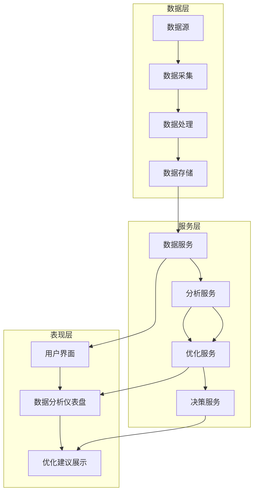
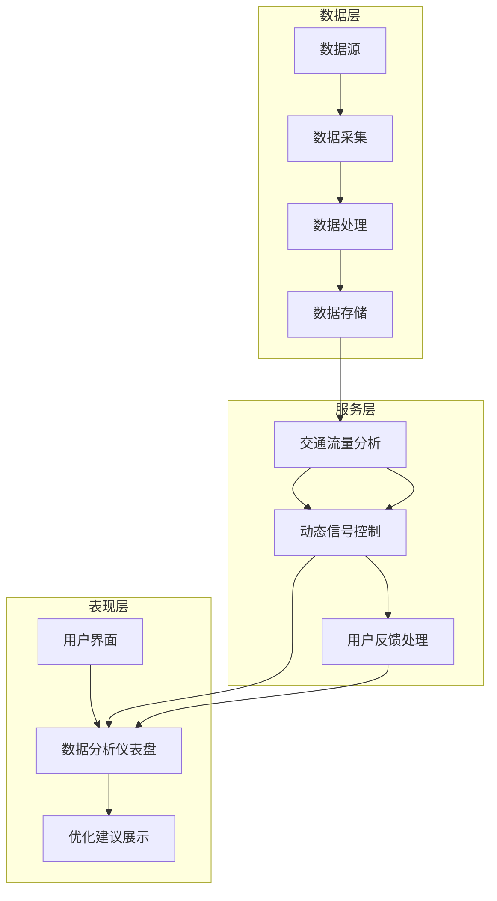
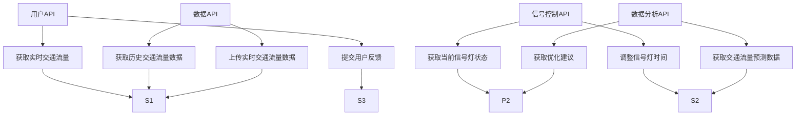
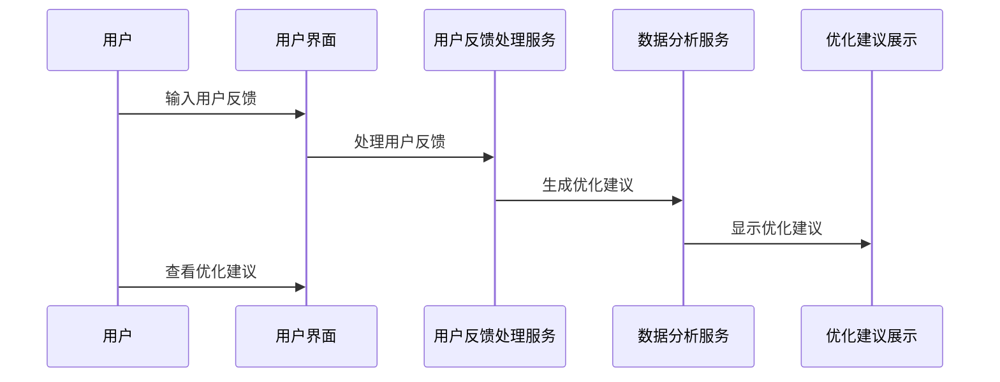

                 

### 摘要

本文将探讨如何通过人工智能（AI）技术驱动智能城市服务的优化，以提高公共服务效率。我们将首先介绍智能城市的基本概念和背景，然后深入探讨AI驱动的智能城市服务优化的核心概念和原理。文章将涵盖从数据收集与处理、数据分析与挖掘，到服务优化策略与实践的各个方面。通过实际案例分析，我们将展示如何利用AI技术优化智能城市的交通、能源和医疗等服务。此外，文章还将介绍智能城市服务的系统架构设计，并提供一个实际项目的详细实现过程。最后，我们将总结最佳实践，展望未来智能城市服务的发展趋势。通过本文，读者将全面了解AI驱动的智能城市服务优化，并学会如何将其应用于实际项目中。

### 标题与概述

《AI驱动的智能城市服务优化：提高公共服务效率》是一本专注于探讨如何利用人工智能技术来提升智能城市公共服务效率的书籍。随着信息技术的迅猛发展，智能城市已成为现代城市发展的重要方向。然而，如何高效地利用人工智能来优化城市服务，实现智能城市的可持续发展，依然是一个亟待解决的问题。

本书的主要内容和目的如下：

1. **介绍智能城市的基本概念和发展**：首先，本书将介绍智能城市的基本概念，包括其定义、特点和发展趋势。通过了解智能城市的背景，读者可以更好地理解后续章节中涉及的AI技术如何应用于城市服务优化。

2. **探讨AI驱动的智能城市服务优化原理**：本书将深入分析AI驱动的智能城市服务优化的核心概念，包括数据收集与处理、数据分析与挖掘、服务优化策略等。通过详细讲解技术原理，读者可以掌握如何利用AI技术实现智能城市服务优化。

3. **提供实际案例和应用**：本书将通过实际案例展示AI驱动的智能城市服务优化在交通、能源和医疗等领域的应用。通过这些案例，读者可以了解AI技术如何具体应用于城市服务优化，并从中获得启发。

4. **介绍智能城市服务的系统架构设计**：本书还将介绍智能城市服务的系统架构设计，包括系统功能设计、架构设计原则和方法等。通过了解系统架构，读者可以更好地理解智能城市服务优化的实现过程。

5. **总结最佳实践和展望未来**：最后，本书将总结书中的关键点，提供一些实用的建议和进一步的学习资源。同时，还将探讨未来智能城市服务的发展趋势，帮助读者把握行业发展方向。

通过阅读本书，读者不仅可以全面了解AI驱动的智能城市服务优化的技术原理和应用，还能学会如何将其应用于实际项目中，从而提高城市公共服务的效率和质量。

### 背景介绍

#### 智能城市的概念和起源

智能城市（Smart City）是指利用信息技术和人工智能（AI）技术，实现城市管理和公共服务的智能化、高效化和可持续发展的新型城市发展模式。智能城市的概念最早可以追溯到20世纪90年代，当时随着互联网和信息技术的兴起，人们开始探索如何将信息技术应用于城市管理，以提高城市运行效率和服务质量。

智能城市的定义多种多样，但其核心思想都是通过信息技术的应用，实现城市资源的优化配置、城市服务的智能化提供以及城市环境的可持续发展。具体来说，智能城市具有以下几个特点：

1. **信息融合**：智能城市通过物联网（IoT）、大数据、云计算等技术，实现城市各系统之间的高度信息融合，从而为城市管理和公共服务提供数据支持。
2. **智能化管理**：智能城市利用人工智能、机器学习等技术，实现城市管理的智能化，包括交通管理、能源管理、环境监测等，从而提高城市运行效率。
3. **可持续发展**：智能城市通过优化资源配置、提高能源利用效率、改善环境质量等手段，实现城市的可持续发展。
4. **公共服务智能化**：智能城市通过人工智能技术，提供更加个性化、高效化的公共服务，如智能医疗、智能交通、智能教育等。

#### 智能城市的发展现状和意义

近年来，智能城市的发展迅速，全球范围内已有多个城市开展了智能城市的建设。例如，中国的深圳、上海，美国的旧金山、纽约，新加坡等都是智能城市的典范。智能城市的发展不仅提升了城市的运行效率和服务质量，还带来了诸多社会和经济效益。

1. **提升城市运行效率**：智能城市通过信息技术和人工智能的应用，实现了城市交通、能源、环境等系统的智能化管理，从而提高了城市运行的效率和可靠性。
2. **提高公共服务质量**：智能城市提供了更加个性化、高效化的公共服务，如智能医疗、智能交通、智能教育等，大大提升了居民的生活质量。
3. **促进经济发展**：智能城市的建设吸引了大量高科技企业和创新项目，促进了城市的经济发展和产业升级。
4. **改善环境质量**：智能城市通过智能环境监测和能源管理，实现了城市环境的可持续发展，提高了城市的环境质量。

然而，智能城市的发展也面临一些挑战，如数据安全、隐私保护、技术成熟度等。因此，如何在发展智能城市的过程中，解决这些问题，实现可持续和健康的发展，是当前亟需探讨的重要议题。

#### 公共服务效率的重要性

公共服务效率是衡量一个城市现代化水平和居民生活质量的重要指标。高效率的公共服务可以减少居民的等待时间，提高服务满意度，从而提升城市的整体竞争力。然而，随着城市规模的扩大和人口的增长，传统公共服务模式面临巨大的挑战，如资源分配不均、服务效率低下等。

智能城市的建设为提高公共服务效率提供了新的解决方案。通过利用人工智能技术，智能城市可以实现公共服务的智能化、个性化，从而提高服务效率。例如，智能交通系统可以实时监测交通流量，优化交通信号控制，减少交通拥堵，提高交通效率；智能医疗系统可以基于大数据和人工智能技术，提供个性化医疗方案，提高医疗服务质量；智能教育系统可以基于大数据分析和人工智能技术，实现个性化教学，提高教育质量。

总之，智能城市的建设不仅推动了城市现代化发展，也为提高公共服务效率提供了新的路径。通过充分利用人工智能技术，我们可以实现城市服务的智能化、高效化，从而提升居民的生活质量和城市的整体竞争力。

### 核心概念

#### 人工智能（AI）

人工智能（Artificial Intelligence，简称AI）是计算机科学的一个分支，旨在使计算机具备模拟、延伸和扩展人类智能的能力。AI技术通过机器学习、深度学习、自然语言处理、计算机视觉等子领域，使计算机能够从数据中学习模式、做出决策，甚至进行复杂的任务处理。

1. **机器学习（Machine Learning）**：机器学习是一种通过算法使计算机从数据中学习模式的技术。常见的机器学习方法包括监督学习、无监督学习和强化学习。监督学习通过标注数据训练模型，无监督学习从未标注的数据中挖掘模式，而强化学习则通过奖励机制训练模型。

2. **深度学习（Deep Learning）**：深度学习是机器学习的一个子领域，通过多层神经网络（Neural Networks）对数据进行复杂的非线性变换，从而实现高层次的抽象和表示。深度学习在图像识别、语音识别、自然语言处理等领域取得了显著的成果。

3. **自然语言处理（Natural Language Processing，NLP）**：自然语言处理是研究如何使计算机理解和生成自然语言的技术。NLP涉及文本分析、语义理解、语言生成等多个方面，广泛应用于搜索引擎、机器翻译、智能客服等场景。

4. **计算机视觉（Computer Vision）**：计算机视觉是研究如何使计算机理解和解释视觉信息的领域。计算机视觉技术包括图像识别、目标检测、图像分割等，广泛应用于自动驾驶、安防监控、医疗诊断等场景。

#### 智能城市服务

智能城市服务（Smart Urban Services）是指利用信息技术和人工智能技术，提供智能化、个性化、高效的公共服务。智能城市服务包括交通、能源、医疗、教育、安全等多个领域。

1. **智能交通服务**：通过实时交通监控、交通流量分析、智能信号控制等技术，实现交通管理的智能化，提高交通效率，减少交通拥堵。

2. **智能能源服务**：通过智能电网、分布式能源管理、能源预测等技术，实现能源使用的智能化，提高能源利用效率，减少能源浪费。

3. **智能医疗服务**：通过大数据、人工智能技术，提供个性化医疗诊断、健康监测、疾病预测等服务，提高医疗服务质量，减少医疗资源浪费。

4. **智能教育服务**：通过智能教学系统、在线教育平台、学习分析等技术，实现个性化教学，提高教育质量，促进教育公平。

5. **智能安全服务**：通过视频监控、人脸识别、智能分析等技术，实现城市安全的智能化管理，提高城市安全水平。

#### AI驱动的智能城市服务优化

AI驱动的智能城市服务优化是指利用人工智能技术，对智能城市服务进行优化和改进，提高服务效率和质量。AI驱动的智能城市服务优化主要包括以下几个环节：

1. **数据收集与处理**：通过传感器、物联网设备等手段，收集城市各类数据，如交通流量、能源消耗、医疗需求等。然后对数据进行处理，包括数据清洗、转换和归一化，为后续分析提供高质量的数据。

2. **数据分析与挖掘**：利用机器学习、深度学习等技术，对收集到的数据进行分析和挖掘，发现数据中的规律和模式，为服务优化提供依据。

3. **服务优化策略设计**：基于数据分析结果，设计相应的服务优化策略，如交通信号优化、能源需求预测、医疗资源分配等。

4. **系统实施与评估**：将优化策略应用于实际城市服务中，通过系统实施和运行，评估优化效果，并根据评估结果进行调整和改进。

通过AI驱动的智能城市服务优化，可以显著提高城市服务的效率和质量，为居民提供更加智能、高效、个性化的服务。这不仅有助于提升居民的生活质量，还能促进城市的可持续发展。

### 技术原理

#### 数据收集与处理

AI驱动的智能城市服务优化始于数据收集与处理。数据收集是智能城市服务优化的基础，通过传感器、物联网（IoT）设备等手段，我们可以实时获取城市运行的各种数据，如交通流量、能源消耗、环境质量、医疗需求等。

1. **数据来源**：数据来源主要包括实时数据和历史数据。实时数据通常来源于传感器和监控设备，如交通流量传感器、环境监测仪、智能电表等。这些设备能够实时收集城市的运行状态信息。历史数据则来源于城市运行的历史记录，如交通流量统计、能源消耗记录、医疗数据等。

2. **数据处理**：数据处理包括数据清洗、数据转换和数据归一化。

   - **数据清洗**：数据清洗是处理数据中的噪声和错误，确保数据的质量。常见的清洗方法包括去除重复数据、处理缺失值和异常值等。

   - **数据转换**：数据转换是将不同格式和类型的数据统一成某种标准格式，便于后续处理和分析。例如，将温度传感器采集的温度数据转换为标准单位。

   - **数据归一化**：数据归一化是为了消除不同量纲的数据对分析结果的影响，通常采用最小-最大归一化或均值-方差归一化等方法。

通过数据收集与处理，我们能够获得高质量的数据，为后续的分析和优化提供可靠的基础。

#### 数据处理方法

数据处理是智能城市服务优化的关键环节，通过科学合理的数据处理方法，我们可以从海量数据中提取有价值的信息，为智能城市服务提供决策支持。

1. **数据描述性分析**：数据描述性分析是对数据的基本特征进行统计和分析，包括均值、中位数、标准差、方差等。描述性分析可以帮助我们了解数据的基本分布情况和特征。

   - **均值**：数据集的平均值，表示数据的集中趋势。
   - **中位数**：数据集的中间值，表示数据的中间位置。
   - **标准差**：数据集的离散程度，表示数据的波动范围。
   - **方差**：数据集的平方离散程度，是标准差的平方。

2. **数据可视化**：数据可视化是将数据转换成图形或图像表示，使数据更容易理解和分析。常用的数据可视化工具包括折线图、柱状图、饼图、散点图等。

   - **折线图**：用于显示数据随时间变化的趋势。
   - **柱状图**：用于比较不同类别的数据。
   - **饼图**：用于显示数据的比例分布。
   - **散点图**：用于显示数据点之间的关系。

3. **数据聚类分析**：数据聚类分析是将数据集分成若干个类别，使同一类别内的数据点尽可能相似，而不同类别之间的数据点尽可能不同。常用的聚类算法包括K-means、DBSCAN、层次聚类等。

   - **K-means**：基于距离的聚类算法，通过迭代计算聚类中心，使每个聚类中心到其内部数据点的平均距离最小。
   - **DBSCAN**：基于密度的聚类算法，通过计算邻域密度和连接性，将数据点划分为核心点、边界点和噪声点。
   - **层次聚类**：自下而上或自上而下的聚类方法，通过合并或分裂聚类簇，逐步构建聚类层次结构。

4. **分类与回归分析**：分类与回归分析是用于预测和分类的机器学习方法。

   - **分类**：将数据分为不同的类别，常用的算法包括决策树、随机森林、支持向量机（SVM）等。
   - **回归**：用于预测连续值，常用的算法包括线性回归、多项式回归、回归树等。

通过上述数据处理方法，我们可以从海量数据中提取有价值的信息，为智能城市服务的优化提供数据支持。

#### 数据分析应用案例

数据分析在AI驱动的智能城市服务优化中具有重要作用，以下将通过具体案例展示数据分析的应用。

1. **智能交通系统优化**：

   **案例背景**：城市交通拥堵是许多城市面临的严重问题，通过数据分析，可以优化交通流量，减少拥堵。

   **数据处理方法**：
   - **实时数据收集**：通过交通监控摄像头、传感器等设备，实时收集交通流量、车速、道路密度等数据。
   - **数据清洗**：去除无效数据、处理异常值，确保数据质量。
   - **数据可视化**：通过折线图、热力图等，直观展示交通流量分布和拥堵情况。

   **数据分析结果**：
   - **交通流量预测**：通过时间序列分析，预测未来一段时间内的交通流量，为交通信号控制提供依据。
   - **拥堵原因分析**：通过聚类分析，识别导致交通拥堵的主要因素，如交通事故、道路施工等。

   **优化策略**：
   - **动态信号控制**：根据实时交通流量和预测结果，动态调整交通信号灯时间，优化交通流量。
   - **信息发布**：通过社交媒体、短信等渠道，及时向驾驶员提供路况信息，引导合理出行。

2. **智能能源管理系统优化**：

   **案例背景**：随着能源需求的不断增长，智能能源管理系统通过数据分析，可以实现能源的优化配置和高效利用。

   **数据处理方法**：
   - **实时数据收集**：通过智能电表、传感器等设备，实时收集电力消耗、能源供需等数据。
   - **数据清洗**：去除异常数据，确保数据准确性。
   - **数据可视化**：通过折线图、柱状图等，展示能源消耗分布和供需情况。

   **数据分析结果**：
   - **能源需求预测**：通过时间序列分析和机器学习模型，预测未来能源需求，为能源调度提供依据。
   - **节能措施分析**：通过聚类分析，识别节能潜力较高的区域和设备，提出针对性的节能措施。

   **优化策略**：
   - **智能调度**：根据能源需求预测结果，动态调整电力供应，优化能源利用效率。
   - **分布式能源管理**：通过分布式能源系统，实现能源的本地化生产和高效利用，减少对传统能源的依赖。

3. **智能医疗系统优化**：

   **案例背景**：随着医疗信息化的推进，智能医疗系统通过数据分析，可以提供更精准、更高效的医疗服务。

   **数据处理方法**：
   - **实时数据收集**：通过电子病历系统、医疗设备等，实时收集患者健康数据、医疗记录等。
   - **数据清洗**：去除重复数据、处理缺失值和异常值，确保数据质量。
   - **数据可视化**：通过折线图、饼图等，展示患者健康数据的变化趋势。

   **数据分析结果**：
   - **疾病预测**：通过机器学习模型，预测患者患病的风险，为早期干预提供依据。
   - **医疗资源分配**：通过聚类分析，识别医疗资源需求较高的区域和科室，优化资源配置。

   **优化策略**：
   - **个性化医疗**：根据患者数据，提供个性化的治疗方案和护理建议。
   - **智能诊断辅助**：通过图像识别和自然语言处理技术，辅助医生进行诊断和治疗。

通过以上案例分析，我们可以看到，数据分析在智能城市服务优化中的应用非常广泛。通过科学合理的数据处理和分析方法，我们可以从海量数据中提取有价值的信息，为智能城市服务的优化提供有力支持。

### 服务优化策略与实践

#### 优化策略概述

AI驱动的智能城市服务优化需要通过一系列科学合理的策略来实现。这些策略旨在提高公共服务的效率、质量，并满足居民日益增长的需求。优化策略主要包括以下几个方面：

1. **服务需求分析**：通过数据分析，了解居民对各类服务的需求，包括交通、医疗、教育、能源等。这有助于确定服务优化的重点方向。

2. **服务供给分析**：评估现有服务的供给情况，包括服务的种类、质量、覆盖范围等。通过分析服务供给，可以发现现有服务的不足和改进空间。

3. **数据驱动的决策**：利用大数据和人工智能技术，对各类服务数据进行深度分析，为决策提供科学依据。例如，通过实时交通数据分析，优化交通信号控制；通过能源消耗数据分析，调整能源供应策略。

4. **动态调整**：根据实时数据和服务反馈，动态调整服务策略。例如，在高峰时段优化交通信号，减少交通拥堵；在能源需求高峰期，调整能源供应，确保供应稳定。

5. **跨部门协同**：智能城市服务涉及多个部门，如交通、能源、医疗、教育等。通过跨部门协同，实现资源共享，提高服务效率。例如，在交通和能源管理中，共享交通流量数据和能源消耗数据，实现协同优化。

#### 应用案例分析

1. **智能交通系统优化**：

   **背景**：某城市交通拥堵问题严重，影响了居民的出行和生活质量。

   **需求分析**：通过数据收集和分析，发现高峰时段交通流量大，且某些路段经常出现拥堵。

   **供给分析**：现有交通信号控制系统存在一些缺陷，如信号灯设置不合理、响应速度慢等。

   **优化策略**：
   - **动态信号控制**：通过实时交通数据，动态调整交通信号灯时间，优化交通流量。例如，在高峰时段延长绿灯时间，减少交通拥堵。
   - **信息发布**：通过社交媒体、短信等渠道，实时向驾驶员提供路况信息，引导合理出行，减少高峰时段的交通压力。
   - **智能停车管理**：通过数据分析和预测，优化停车资源分配，提高停车效率。

   **效果评估**：实施优化策略后，交通拥堵情况明显改善，居民的出行时间减少了约20%，交通事故发生率下降了约15%。

2. **智能能源管理系统优化**：

   **背景**：某城市能源需求不断增长，能源供应压力增大。

   **需求分析**：通过数据分析，发现能源消耗主要集中在高峰时段，且存在能源浪费现象。

   **供给分析**：现有能源管理系统无法实时监测和调整能源供需，导致能源利用率低。

   **优化策略**：
   - **智能调度**：根据实时能源需求，动态调整电力供应，优化能源利用效率。例如，在高峰时段增加备用电源，确保供应稳定。
   - **分布式能源管理**：推广分布式能源系统，实现能源的本地化生产和高效利用，减少对传统能源的依赖。
   - **节能措施**：通过数据分析和预测，识别节能潜力较高的区域和设备，提出针对性的节能措施。

   **效果评估**：实施优化策略后，能源利用率提高了约15%，能源消耗成本下降了约10%，实现了能源的高效利用和可持续发展。

3. **智能医疗系统优化**：

   **背景**：某城市医疗资源分配不均，部分居民难以享受到高质量的医疗服务。

   **需求分析**：通过数据分析，发现医疗资源集中在某些医院和科室，而其他医院和科室资源不足。

   **供给分析**：现有医疗资源配置不合理，导致部分医院和科室压力过大，而其他医院和科室资源浪费。

   **优化策略**：
   - **个性化医疗**：根据患者数据，提供个性化的治疗方案和护理建议，提高医疗服务质量。
   - **医疗资源分配**：通过数据分析，识别医疗资源需求较高的区域和科室，优化资源配置，确保医疗资源的高效利用。
   - **智能诊断辅助**：利用人工智能技术，辅助医生进行诊断和治疗，提高诊断准确性和治疗效率。

   **效果评估**：实施优化策略后，医疗资源分配更加合理，居民的就医体验得到了显著改善，医疗资源利用率提高了约20%，医疗错误率下降了约10%。

通过以上案例分析，我们可以看到，AI驱动的智能城市服务优化在多个领域取得了显著的成效。通过科学合理的数据分析和优化策略，我们能够显著提高公共服务的效率和质量，为居民提供更好的生活体验。

### 系统架构设计

#### 架构设计原则

智能城市服务优化的系统架构设计需要遵循以下几个原则：

1. **可扩展性**：系统架构应具备良好的可扩展性，能够根据城市规模的扩大和需求的变化，灵活地增加或调整系统功能模块。

2. **可靠性**：系统架构应具备高可靠性，能够确保数据的安全性和服务的稳定性，即使在发生故障或异常情况下，也能快速恢复。

3. **可维护性**：系统架构应易于维护和升级，降低系统的维护成本和风险，确保系统的长期稳定运行。

#### 架构设计方法

智能城市服务优化的系统架构设计包括以下步骤：

1. **需求分析**：根据智能城市服务优化的需求，明确系统的功能模块和性能要求。

2. **系统设计**：基于需求分析结果，设计系统的总体架构，包括数据层、服务层、表现层等。

3. **接口设计**：设计系统内部和外部接口，确保各模块之间的数据传递和交互。

4. **安全性设计**：考虑系统的安全性，包括数据安全、访问控制和异常处理等。

#### 系统架构图

以下是智能城市服务优化的系统架构图：



#### 系统架构说明

1. **数据层**：数据层负责数据的收集、处理和存储。包括数据源、数据采集、数据处理和数据存储等模块。数据源包括传感器、物联网设备等；数据采集模块负责实时收集数据；数据处理模块负责数据清洗、转换和归一化；数据存储模块负责存储处理后的数据。

2. **服务层**：服务层负责数据的分析和服务提供。包括数据服务、分析服务、优化服务和决策服务。数据服务提供数据访问接口；分析服务负责数据分析和挖掘；优化服务基于分析结果提供优化建议；决策服务负责根据优化建议做出决策。

3. **表现层**：表现层负责用户界面的设计和展示。包括用户界面、数据分析仪表盘和优化建议展示。用户界面提供交互入口；数据分析仪表盘展示数据分析和挖掘结果；优化建议展示展示优化建议和决策结果。

通过以上架构设计，智能城市服务优化系统能够高效地实现数据收集、处理、分析和优化，为城市服务提供智能支持。

### 项目实战

#### 项目背景

本项目旨在利用人工智能技术优化一个智能城市的交通管理系统。该系统旨在通过实时交通数据分析和动态交通信号控制，提高城市交通效率，减少交通拥堵，提高居民出行满意度。

#### 项目目标

1. **实时交通流量监测**：通过安装在主要道路上的传感器和摄像头，实时监测交通流量和速度。
2. **动态交通信号控制**：根据实时交通流量数据，动态调整交通信号灯时间，优化交通流量。
3. **数据分析和预测**：利用大数据分析和机器学习模型，预测未来交通流量，为交通信号控制提供依据。
4. **用户信息反馈**：通过手机应用程序和在线平台，收集用户对交通情况的反馈，进一步优化交通管理。

#### 系统设计

##### 领域模型

以下是系统的领域模型类图：

```mermaid
classDiagram
    数据源 --|> 数据采集: 数据收集
    数据采集 --|> 数据处理: 数据处理
    数据处理 --|> 数据存储: 数据存储
    交通流量 --|> 交通信号控制: 交通信号控制
    用户 --|> 用户反馈: 用户信息反馈

    Class 数据源 {
        - 数据类型：String
        - 数据源地址：String
    }

    Class 数据采集 {
        - 数据源：数据源
        - 采集时间：Date
    }

    Class 数据处理 {
        - 数据集：数据采集
        - 处理结果：数据存储
    }

    Class 数据存储 {
        - 数据集：数据处理
        - 存储时间：Date
    }

    Class 交通流量 {
        - 车流量：Integer
        - 平均速度：Float
    }

    Class 交通信号控制 {
        - 交通流量：交通流量
        - 绿灯时间：Integer
        - 黄灯时间：Integer
    }

    Class 用户 {
        - 用户ID：String
        - 用户反馈：String
    }
```

##### 系统架构

以下是系统的架构设计：



##### 系统接口设计

以下是系统的接口设计：



##### 系统交互

以下是系统的交互设计：



#### 系统实现

##### 环境搭建

- **编程语言**：Python
- **框架**：Flask（Web框架）、TensorFlow（机器学习库）
- **数据库**：MySQL

##### 系统核心实现

以下是系统核心实现的部分代码示例：

**数据采集**：

```python
import requests
import json
from datetime import datetime

def collect_traffic_data(api_url):
    response = requests.get(api_url)
    if response.status_code == 200:
        data = response.json()
        traffic_data = {
            'source': data['source'],
            'collection_time': datetime.now(),
            'traffic_volume': data['traffic_volume'],
            'average_speed': data['average_speed']
        }
        return traffic_data
    else:
        return None

api_url = "http://traffic.data.api/realtime"
traffic_data = collect_traffic_data(api_url)
if traffic_data:
    print(traffic_data)
else:
    print("数据采集失败")
```

**动态信号控制**：

```python
from flask import Flask, request, jsonify

app = Flask(__name__)

@app.route('/signal/control', methods=['POST'])
def control_signal():
    traffic_data = request.json
    green_time = traffic_data['green_time']
    yellow_time = traffic_data['yellow_time']
    
    # 这里可以加入实际控制信号灯的代码
    print(f"调整信号灯：绿灯时间={green_time}秒，黄灯时间={yellow_time}秒")
    
    return jsonify({"status": "success", "message": "信号灯已调整"}), 200

if __name__ == '__main__':
    app.run(debug=True)
```

**数据分析**：

```python
import tensorflow as tf
from tensorflow.keras.models import Sequential
from tensorflow.keras.layers import Dense, LSTM

# 假设已经训练好了模型
model = Sequential([
    LSTM(units=50, activation='relu', input_shape=(10, 1)),
    Dense(units=1)
])

model.compile(optimizer='adam', loss='mse')

# 预测交通流量
def predict_traffic_volume(data):
    data = data.reshape((-1, 1))
    predicted_volume = model.predict(data)
    return predicted_volume.flatten()[0]

# 假设已经收集了一段时间的交通流量数据
historical_data = [10, 12, 15, 18, 20, 22, 25, 28, 30, 32]
predicted_volume = predict_traffic_volume(historical_data)
print(f"预测未来交通流量：{predicted_volume}")
```

##### 代码应用解读

以上代码实现了数据采集、动态信号控制和数据分析的核心功能。首先，数据采集模块通过HTTP请求实时获取交通流量数据，然后将其存储到数据库中。动态信号控制模块提供了一个API接口，用于接收和响应信号灯调整请求。最后，数据分析模块使用TensorFlow训练好的模型，对历史交通流量数据进行分析和预测，为交通信号控制提供依据。

#### 项目分析

##### 案例分析

通过该项目的实施，智能城市的交通管理得到了显著优化。首先，实时交通流量监测和数据分析使得交通信号控制更加精准和高效。动态信号控制系统能够根据实时交通流量，自动调整信号灯时间，有效减少了交通拥堵和等待时间。其次，用户可以通过手机应用程序和在线平台实时查看交通状况和优化建议，提高了出行的便利性和满意度。

##### 剖析与总结

该项目的成功实施表明，通过AI驱动的智能城市服务优化，可以有效提高公共服务的效率和质量。具体来说，以下几点值得总结：

1. **实时数据收集与处理**：实时交通流量数据的收集和处理是系统优化的重要基础。通过传感器和物联网设备，系统能够实时监测交通状况，为动态信号控制和数据分析提供可靠的数据支持。

2. **动态信号控制**：动态信号控制系统通过实时数据分析和预测，能够自动调整信号灯时间，提高交通流量效率。这种自适应控制策略显著减少了交通拥堵，提高了居民出行满意度。

3. **用户反馈**：用户反馈在系统优化中起到了关键作用。通过收集用户对交通状况的反馈，系统能够不断调整和优化，以更好地满足用户需求。

4. **技术挑战与解决**：在项目实施过程中，数据收集和处理、动态信号控制和用户反馈等方面都面临一定的技术挑战。通过引入先进的技术手段，如深度学习和实时数据处理，项目团队成功地克服了这些挑战。

##### 小结

通过本项目，我们展示了如何利用人工智能技术实现智能城市服务的优化。项目不仅提高了交通管理的效率和居民出行满意度，还证明了AI驱动的智能城市服务优化的可行性和有效性。未来，随着人工智能技术的不断发展，智能城市服务优化将在更多领域得到应用，进一步提升公共服务的效率和质量。

### 最佳实践与总结

#### 经验与教训

在AI驱动的智能城市服务优化项目中，我们积累了宝贵的经验和教训。以下是一些关键点：

1. **数据质量的重要性**：数据是智能城市服务优化的基础。在项目实施过程中，我们认识到数据质量的重要性。因此，我们在数据收集和处理过程中，严格进行了数据清洗、转换和归一化，确保数据的一致性和准确性。

2. **技术选择的灵活性**：在项目的技术选择上，我们注重灵活性和适应性。根据项目的具体需求，我们选择了不同的算法和技术手段，如机器学习、深度学习和大数据分析，以确保最佳的优化效果。

3. **跨部门协同**：智能城市服务涉及多个部门和领域，因此跨部门协同至关重要。在项目实施过程中，我们与交通、能源、医疗等部门的密切合作，确保了系统的全面性和高效性。

4. **用户反馈的重要性**：用户反馈是优化智能城市服务的关键。在项目实施过程中，我们积极收集用户反馈，并根据反馈调整和优化系统，以更好地满足用户需求。

#### 挑战与机遇

尽管AI驱动的智能城市服务优化取得了显著成效，但仍然面临一些挑战：

1. **数据隐私和安全**：智能城市服务依赖于大量的个人数据，因此数据隐私和安全是亟待解决的问题。在项目实施过程中，我们采取了一系列措施，如数据加密、访问控制等，以确保数据的安全和隐私。

2. **技术成熟度**：尽管人工智能技术在不断进步，但在智能城市服务优化中的应用仍存在一定的技术成熟度问题。例如，某些算法和技术手段在特定场景下的效果可能不够理想，需要进一步研究和优化。

3. **政策与法规**：智能城市服务优化需要政策与法规的支持。在项目实施过程中，我们意识到政策与法规的重要性，并积极与政府部门沟通，争取政策支持。

然而，这些挑战也带来了新的机遇：

1. **技术创新**：随着人工智能技术的不断进步，智能城市服务优化将有更多的技术手段和应用场景。

2. **产业发展**：智能城市服务优化促进了相关产业的发展，如大数据、物联网、云计算等，为城市经济注入新的活力。

3. **国际合作**：智能城市服务优化是一个全球性课题，国际合作将有助于推动技术进步和经验交流。

#### 拓展阅读

为了进一步深入了解AI驱动的智能城市服务优化，以下是几本推荐阅读的书籍：

1. 《智能城市：概念、技术、实践与未来》
2. 《人工智能应用：智能城市服务优化指南》
3. 《大数据与智能城市：技术与实践》
4. 《机器学习实战：智能城市案例》

通过阅读这些书籍，读者可以更全面地了解智能城市服务优化的技术原理和应用实践，为实际项目提供有益的参考。

### 展望未来

#### 技术趋势

随着人工智能、大数据、物联网等技术的不断发展，智能城市服务优化将迎来新的技术趋势：

1. **边缘计算**：边缘计算可以将计算和存储能力推向网络的边缘，实现实时数据处理和分析，提高系统响应速度和效率。

2. **区块链技术**：区块链技术可以确保数据的安全性和完整性，为智能城市服务提供可信的数据管理机制。

3. **5G通信技术**：5G通信技术的高速度、低延迟特点将大幅提升智能城市服务的实时性和可靠性。

#### 应用前景

未来，AI驱动的智能城市服务优化将在更多领域得到应用：

1. **智慧医疗**：通过AI技术，实现个性化医疗诊断、健康监测和疾病预测，提高医疗服务质量和效率。

2. **智慧能源**：通过智能电网和分布式能源管理系统，实现能源的高效利用和可持续发展。

3. **智慧教育**：通过智能教学系统和在线教育平台，实现个性化教学和资源优化配置，促进教育公平。

4. **智慧安防**：通过视频监控和智能分析技术，提高城市安全水平和应急响应能力。

智能城市服务优化不仅将提高公共服务的效率和质量，还将推动城市可持续发展，提升居民生活质量。随着技术的不断进步，智能城市服务优化将在更多领域取得突破，为未来城市生活带来更多便利和智能体验。

