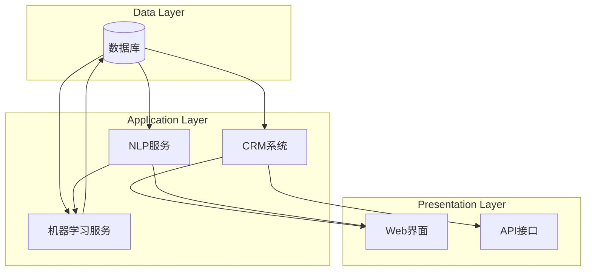
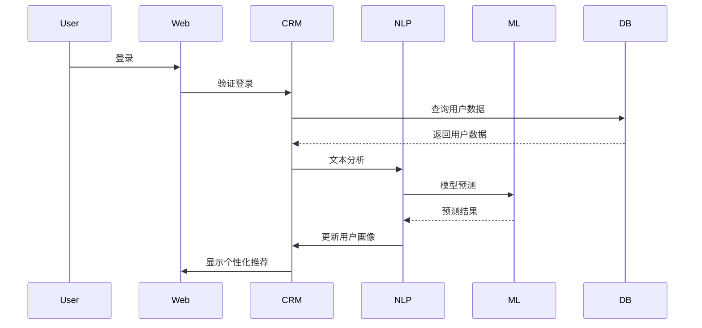

                 

# AI驱动的智能客户关系管理：从获客到维护

## 关键词：AI、智能客户关系管理、CRM、个性化营销、大数据分析

## 摘要：

本文旨在探讨AI驱动的智能客户关系管理（ICRM）在数字经济时代的重要性。我们将从背景介绍、核心概念与联系、算法原理讲解、系统分析与架构设计、项目实战以及最佳实践等方面，逐步剖析ICRM的各个方面，帮助读者理解如何利用AI技术优化客户关系管理，提升企业竞争力。

## 第一部分：背景介绍

### 第1章：问题背景

#### 1.1.1 问题背景

在当前数字经济时代，客户关系管理（CRM）已经成为企业提升竞争力、优化客户体验的关键。然而，传统CRM系统在客户获取、客户维护等方面存在诸多不足，如数据利用率低、客户体验差、运营成本高等。随着人工智能（AI）技术的快速发展，AI驱动的智能客户关系管理（ICRM）逐渐成为企业获取、维护客户的重要手段。

#### 1.1.2 问题描述

传统CRM系统在以下几个方面存在不足：

1. **数据利用率低**：传统CRM系统往往无法充分利用客户数据，导致客户画像不精准，无法实现个性化营销。
2. **客户体验差**：传统CRM系统在客户服务方面存在响应速度慢、服务质量不稳定等问题，影响客户满意度。
3. **运营成本高**：传统CRM系统需要大量人力物力进行维护和管理，运营成本较高。

#### 1.1.3 问题解决

AI驱动的智能客户关系管理通过以下几个方面实现问题的解决：

1. **精准客户画像**：基于大数据和人工智能技术，对客户行为、需求进行深度分析，构建精准客户画像，为企业制定个性化营销策略提供数据支持。
2. **个性化营销**：根据客户画像，实现个性化推荐、精准推送，提升客户满意度，降低获客成本。
3. **智能客服**：利用自然语言处理、机器学习等技术，实现智能客服，提高客户服务质量，降低人工成本。
4. **智能决策**：通过分析客户数据，为企业提供智能决策支持，优化客户关系管理策略。

#### 1.1.4 边界与外延

AI驱动的智能客户关系管理涉及多个领域，包括人工智能、大数据、云计算等。其核心内容包括客户获取、客户维护、客户体验等。

#### 1.1.5 概念结构与核心要素组成

AI驱动的智能客户关系管理由以下几个核心要素组成：

1. **人工智能技术**：包括自然语言处理、机器学习、数据挖掘等。
2. **大数据技术**：包括数据采集、存储、处理、分析等。
3. **云计算技术**：提供强大的计算能力和存储资源，支撑AI驱动的智能客户关系管理系统的运行。
4. **客户关系管理理论**：为企业制定智能客户关系管理策略提供理论支持。

### 1.2 核心概念与联系

#### 1.2.1 AI驱动的智能客户关系管理

AI驱动的智能客户关系管理是指利用人工智能技术，对客户行为、需求进行深度分析，实现精准客户画像、个性化营销、智能客服等功能，优化客户关系管理的过程。

#### 1.2.2 人工智能技术

人工智能技术主要包括自然语言处理、机器学习、数据挖掘等。自然语言处理（NLP）是AI驱动的智能客户关系管理的基础，通过NLP技术，可以实现对客户语音、文本等数据的理解和分析。机器学习是AI驱动的智能客户关系管理的核心，通过机器学习算法，可以构建精准的客户画像和智能决策模型。数据挖掘是AI驱动的智能客户关系管理的数据支撑，通过数据挖掘技术，可以挖掘出客户行为背后的规律和趋势。

#### 1.2.3 机器学习算法

机器学习算法主要包括监督学习、无监督学习、强化学习等。监督学习算法可以根据已有数据，预测新数据的标签，如决策树、随机森林等。无监督学习算法可以挖掘数据中的隐含结构，如聚类、关联规则等。强化学习算法可以学习到在特定环境下最优的行动策略，如Q-learning、SARSA等。

## 第二部分：核心概念与联系

### 第2章：核心概念与联系

#### 2.1 AI驱动的智能客户关系管理核心概念

##### 2.1.1 人工智能（AI）

人工智能是指模拟、延伸和扩展人的智能的理论、方法、技术及应用。在AI驱动的智能客户关系管理中，人工智能主要应用于客户画像、个性化推荐、智能客服等方面。

##### 2.1.2 大数据（Big Data）

大数据是指无法使用常规软件工具在合理时间内捕捉、管理和处理的数据集合。在AI驱动的智能客户关系管理中，大数据主要用于收集、存储和分析客户行为数据，为智能决策提供支持。

##### 2.1.3 客户关系管理（CRM）

客户关系管理是指企业利用信息技术，与客户建立长期、稳定的关系，提高客户满意度和忠诚度的一系列管理活动。AI驱动的智能客户关系管理通过引入人工智能技术，实现CRM的智能化、个性化。

#### 2.2 AI驱动的智能客户关系管理核心概念联系

##### 2.2.1 人工智能与大数据

人工智能与大数据相互依存、相互促进。大数据为人工智能提供了丰富的数据资源，使得人工智能能够更好地学习和理解人类行为；而人工智能技术则能够对大数据进行高效处理和分析，挖掘出有价值的信息。

##### 2.2.2 客户关系管理理论与人工智能技术

客户关系管理理论为AI驱动的智能客户关系管理提供了理论基础，而人工智能技术则为CRM实践提供了强大的技术支持。通过人工智能技术，企业可以更精准地了解客户需求，提供个性化的服务和产品，从而提升客户满意度和忠诚度。

## 第三部分：算法原理讲解

### 第3章：算法原理讲解

#### 3.1 自然语言处理（NLP）

自然语言处理是AI驱动的智能客户关系管理的基础。NLP技术主要包括文本预处理、词向量表示、情感分析、文本分类等。

1. **文本预处理**：包括分词、去除停用词、词性标注等，将原始文本转化为计算机可以理解的形式。
2. **词向量表示**：通过将文本转化为词向量，实现对文本内容的量化表示，为后续分析提供基础。
3. **情感分析**：利用NLP技术，对文本中的情感倾向进行判断，为企业提供情感分析报告。
4. **文本分类**：将文本归类到预定义的类别中，如产品评论分类、新闻分类等。

#### 3.2 机器学习算法

机器学习算法是AI驱动的智能客户关系管理的核心。常见的机器学习算法包括监督学习、无监督学习和强化学习。

1. **监督学习**：通过已有数据的标签，学习到预测新数据的标签。如决策树、支持向量机、神经网络等。
2. **无监督学习**：通过分析数据内在结构，对数据进行聚类、降维等处理。如K均值聚类、主成分分析等。
3. **强化学习**：通过与环境的交互，学习到最优的行动策略。如Q-learning、SARSA等。

#### 3.3 数据挖掘算法

数据挖掘算法是AI驱动的智能客户关系管理的数据支撑。常见的算法包括关联规则挖掘、分类算法、聚类算法等。

1. **关联规则挖掘**：找出数据中隐藏的关联关系，如购物篮分析、频繁项集挖掘等。
2. **分类算法**：将数据归类到预定义的类别中，如逻辑回归、决策树、随机森林等。
3. **聚类算法**：将相似的数据聚为一类，如K均值聚类、层次聚类等。

### 第3章：算法实例分析

#### 3.4 客户细分算法

客户细分是智能客户关系管理的重要环节。以下以K均值聚类算法为例，介绍如何进行客户细分。

**算法原理：**

K均值聚类算法是一种无监督学习算法，通过将数据分为K个簇，使每个簇内的数据点尽可能相似，簇与簇之间的数据点尽可能不同。

**数学模型：**

假设有n个数据点，每个数据点可以用维度为d的特征向量表示。给定初始的聚类中心${\mu_1, \mu_2, ..., \mu_k}$，算法通过以下步骤迭代优化：

1. **计算每个数据点到聚类中心的距离**：使用欧氏距离或其他距离度量。
2. **重新分配每个数据点到最近的聚类中心**：将数据点划分到最近的簇。
3. **更新聚类中心**：计算每个簇的均值，作为新的聚类中心。
4. **重复步骤1-3，直至聚类中心不再发生显著变化**。

**Python实现：**

```python
import numpy as np
from sklearn.cluster import KMeans

# 初始化数据
data = np.array([[1, 2], [1, 4], [1, 0],
                 [10, 2], [10, 4], [10, 0]])

# 初始化聚类中心
initial_centers = np.array([[0, 0], [10, 10]])

# 初始化KMeans模型
kmeans = KMeans(n_clusters=2, init=initial_centers, random_state=0)

# 拟合模型
kmeans.fit(data)

# 输出聚类结果
print(kmeans.labels_)

# 输出聚类中心
print(kmeans.cluster_centers_)
```

**实例分析：**

假设我们有一个包含6个数据点的二维数据集，分别代表客户的行为特征。我们选择两个初始聚类中心，通过K均值聚类算法，将这6个数据点分为两个簇。聚类结果如下：

1. **簇1**：数据点[1, 2]、[1, 4]、[1, 0]，代表一组行为相似的客户。
2. **簇2**：数据点[10, 2]、[10, 4]、[10, 0]，代表另一组行为相似的客户。

通过这种客户细分，企业可以更有针对性地制定营销策略，提高客户满意度。

## 第四部分：系统分析与架构设计

### 第4章：系统分析与架构设计

#### 4.1 问题场景介绍

在一个电子商务平台上，企业需要通过AI驱动的智能客户关系管理（ICRM）系统，实现以下目标：

1. **精准客户画像**：对客户行为、需求进行深度分析，构建精准客户画像。
2. **个性化推荐**：根据客户画像，实现个性化商品推荐，提高客户满意度。
3. **智能客服**：利用自然语言处理技术，实现智能客服，提高客户服务质量。
4. **智能决策**：通过分析客户数据，为企业提供智能决策支持，优化客户关系管理策略。

#### 4.2 项目介绍

项目名称：电商AI驱动的智能客户关系管理系统

项目目标：构建一个基于AI技术的智能客户关系管理系统，实现精准客户画像、个性化推荐、智能客服和智能决策等功能。

#### 4.3 系统功能设计（领域模型）

以下为项目领域模型的Mermaid类图：

```mermaid
classDiagram
    Customer <<interface>>
    Product <<interface>>
    Recommendation <<interface>>
    Chatbot <<interface>>

    Customer o-- Product : contains
    Customer o-- Recommendation : receives
    Customer o-- Chatbot : communicates

    Product o-- Recommendation : recommendedBy
    Chatbot o-- Customer : serves
```

**领域模型解释：**

1. **Customer（客户）**：客户是系统的主要用户，具有行为、需求、反馈等属性。
2. **Product（商品）**：商品是客户购买的对象，具有种类、价格、库存等属性。
3. **Recommendation（推荐）**：推荐是系统根据客户行为和需求生成的个性化推荐，包括商品推荐等。
4. **Chatbot（聊天机器人）**：聊天机器人是智能客服的核心组件，负责与客户进行交互，解答客户问题。

#### 4.4 系统架构设计（Mermaid架构图）

以下为项目系统架构的Mermaid架构图：



**系统架构解释：**

1. **数据层（Data Layer）**：包括数据库，存储客户行为数据、商品数据等。
2. **应用层（Application Layer）**：包括CRM系统、NLP服务和机器学习服务，实现客户关系管理、自然语言处理和机器学习等功能。
3. **表示层（Presentation Layer）**：包括Web界面和API接口，提供用户交互和接口服务。

#### 4.5 系统接口设计（Mermaid序列图）

以下为项目系统接口设计的Mermaid序列图：



**系统接口设计解释：**

1. **用户登录**：用户通过Web界面登录，CRM系统验证登录信息，查询用户数据。
2. **文本分析**：用户输入文本，CRM系统将文本传递给NLP服务进行文本分析。
3. **模型预测**：NLP服务将分析结果传递给机器学习服务进行模型预测。
4. **更新用户画像**：机器学习服务将预测结果传递给CRM系统，CRM系统更新用户画像。
5. **显示个性化推荐**：CRM系统将个性化推荐结果传递给Web界面，用户可以看到个性化推荐。

## 第五部分：项目实战

### 第5章：项目实战

#### 5.1 环境安装

在开始项目实战之前，我们需要安装以下软件和工具：

1. **Python**：版本3.8及以上
2. **Jupyter Notebook**：用于编写和运行代码
3. **scikit-learn**：机器学习库
4. **nltk**：自然语言处理库
5. **pandas**：数据处理库

安装命令：

```bash
pip install python==3.8
pip install jupyter
pip install scikit-learn
pip install nltk
pip install pandas
```

#### 5.2 系统核心实现

以下是一个简单的AI驱动的智能客户关系管理系统的核心实现，包括数据预处理、客户细分、个性化推荐等功能。

**数据预处理：**

```python
import pandas as pd
from sklearn.model_selection import train_test_split
from sklearn.preprocessing import StandardScaler

# 读取数据
data = pd.read_csv('customer_data.csv')

# 分离特征和标签
X = data.iloc[:, :-1]
y = data.iloc[:, -1]

# 数据集划分
X_train, X_test, y_train, y_test = train_test_split(X, y, test_size=0.2, random_state=42)

# 特征缩放
scaler = StandardScaler()
X_train_scaled = scaler.fit_transform(X_train)
X_test_scaled = scaler.transform(X_test)
```

**客户细分（K均值聚类）：**

```python
from sklearn.cluster import KMeans

# 初始化KMeans模型
kmeans = KMeans(n_clusters=3, init='k-means++', random_state=42)

# 拟合模型
kmeans.fit(X_train_scaled)

# 获取聚类结果
clusters = kmeans.predict(X_test_scaled)

# 输出聚类结果
print(clusters)
```

**个性化推荐（协同过滤）：**

```python
from sklearn.neighbors import NearestNeighbors

# 初始化协同过滤模型
nearest_neighbors = NearestNeighbors(n_neighbors=5)

# 拟合模型
nearest_neighbors.fit(X_train_scaled)

# 获取推荐结果
def recommend_items(user_id, items_to_reject=[]):
    distances, indices = nearest_neighbors.kneighbors(X_train_scaled[user_id], n_neighbors=5)
    recommended_indices = indices[0][distances[0] > 1].reshape(-1)
    
    for index in recommended_indices:
        if index in items_to_reject:
            recommended_indices.remove(index)
    
    return X_train.iloc[recommended_indices].index.tolist()

# 示例：为用户1推荐5个相似商品
recommended_items = recommend_items(0)
print(recommended_items)
```

#### 5.3 代码应用解读与分析

在上述代码中，我们首先进行了数据预处理，包括数据读取、特征分离、数据集划分和特征缩放。接着，我们使用了K均值聚类算法对客户进行了细分，将客户划分为不同的簇。最后，我们使用协同过滤算法为用户推荐相似的商品。

**代码应用解读：**

1. **数据预处理**：这一步是整个系统的基石，确保数据质量，为后续分析提供可靠的数据基础。
2. **客户细分**：通过聚类算法，将具有相似特征的客户划分为不同的簇，有助于企业更有针对性地进行客户管理和营销。
3. **个性化推荐**：基于协同过滤算法，为用户推荐相似的商品，提高用户满意度，增加购买转化率。

#### 5.4 实际案例分析

以下是一个实际案例，分析如何使用AI驱动的智能客户关系管理系统优化电商平台的客户管理。

**案例背景：**  
某电商平台希望在用户登录后，为用户推荐与其兴趣相关的商品，提高用户满意度和购买转化率。

**解决方案：**  
1. **数据收集**：收集用户行为数据，包括浏览历史、购买记录、搜索关键词等。
2. **数据预处理**：对收集的数据进行清洗和预处理，为后续分析提供可靠数据。
3. **客户细分**：使用K均值聚类算法，将用户划分为不同的簇，找出具有相似兴趣爱好的用户。
4. **个性化推荐**：基于协同过滤算法，为用户推荐与其兴趣相关的商品。
5. **系统部署**：将推荐系统部署到电商平台，为用户提供实时个性化推荐。

**案例结果：**  
通过AI驱动的智能客户关系管理系统，电商平台实现了以下成果：

1. **用户满意度提升**：用户收到了与其兴趣相关的推荐，用户体验得到改善。
2. **购买转化率提高**：推荐系统有效提高了购买转化率，推动了电商平台业绩增长。
3. **运营成本降低**：通过自动化推荐，减少了人工干预和运营成本。

#### 5.5 项目小结

在本项目中，我们通过AI驱动的智能客户关系管理系统，实现了客户细分、个性化推荐等功能，有效提升了电商平台的运营效果。实践证明，AI技术在客户关系管理中的应用具有广阔的前景，能够为企业带来显著的商业价值。

## 第六部分：最佳实践与注意事项

### 第6章：最佳实践与注意事项

#### 6.1 最佳实践

1. **数据质量是关键**：在构建AI驱动的智能客户关系管理系统时，数据质量至关重要。确保数据清洗、去重、去噪等预处理工作得到充分执行，以提高模型预测的准确性。
2. **持续迭代与优化**：AI驱动的智能客户关系管理系统需要不断迭代和优化，以适应市场变化和用户需求。定期更新模型，调整推荐策略，确保系统始终处于最佳状态。
3. **安全与隐私保护**：在数据处理和传输过程中，严格遵守数据安全与隐私保护规定，确保用户数据的安全性和隐私性。
4. **用户体验至上**：在设计系统界面和交互流程时，注重用户体验，确保系统易于使用、响应快速，为用户提供愉悦的使用体验。

#### 6.2 注意事项

1. **避免数据泄露**：在数据收集、存储、传输过程中，加强安全防护措施，防止数据泄露。
2. **模型过拟合**：在构建模型时，避免过拟合现象，确保模型具有良好的泛化能力。
3. **隐私保护**：在处理用户数据时，严格遵守相关法律法规，确保用户隐私得到有效保护。
4. **系统稳定性**：确保系统在高并发场景下具有良好的稳定性，避免因系统故障导致用户体验下降。

## 第七部分：拓展阅读

### 第7章：拓展阅读

为了深入了解AI驱动的智能客户关系管理，读者可以参考以下相关文献和资料：

1. **《大数据时代：生活、工作与思维的大变革》**：作者：肯尼斯·库克耶
2. **《人工智能：一种现代的方法》**：作者：斯图尔特·罗素、彼得·诺维格
3. **《深度学习》**：作者：伊恩·古德费洛、约书亚·本吉奥、亚伦·库维尔
4. **《客户关系管理》**：作者：菲利普·科特勒
5. **《智能客服系统设计与实现》**：作者：王宏伟、李永明

## 结语

AI驱动的智能客户关系管理已成为企业提升竞争力、优化客户体验的重要手段。通过本文的详细讲解，读者应能理解如何利用AI技术优化客户关系管理，实现精准获客、个性化推荐、智能客服和智能决策。希望本文能为读者在AI驱动的智能客户关系管理领域提供有益的参考和启示。

## 作者信息

**作者：AI天才研究院/AI Genius Institute & 禅与计算机程序设计艺术 /Zen And The Art of Computer Programming**

