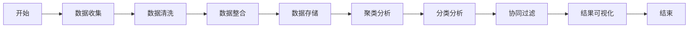
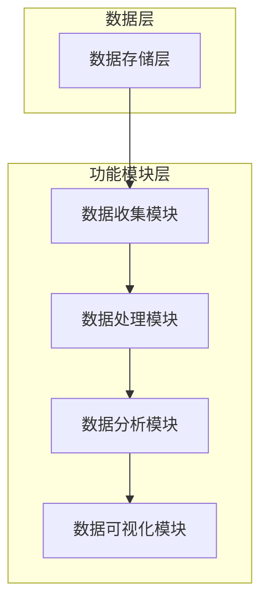

                 


### 摘要：

本文将深入探讨AI驱动的智能客户画像技术，通过逐步分析推理，展示这一领域的前沿进展和应用潜力。我们将首先介绍智能客户画像的背景和基本概念，探讨其在商业中的重要性和面临的挑战。接着，本文将详细讲解智能客户画像的核心概念和联系，通过对比表格和ER实体关系图来深入理解其构成。随后，我们将重点分析智能客户画像算法的原理，展示算法流程图和Python源代码，并推导算法的数学模型和公式。此外，我们将介绍智能客户画像系统的分析与架构设计，包括系统功能设计、架构设计、接口设计和系统交互。最后，本文将通过实际项目案例来展示智能客户画像技术的应用，并提供最佳实践和未来发展趋势的展望。

### 关键词：

AI驱动的智能客户画像、用户洞察、数据分析、机器学习、算法、系统架构、项目实战、最佳实践

----------------------------------------------------------------

## AI驱动的智能客户画像：深化用户洞察

### 摘要：

随着人工智能技术的快速发展，智能客户画像在商业领域中的应用日益广泛。本文旨在探讨AI驱动的智能客户画像技术，通过深入分析其核心概念、算法原理和系统架构，揭示其在深化用户洞察方面的巨大潜力。本文将分为七个部分，分别介绍背景介绍、核心概念与联系、算法原理讲解、系统分析与架构设计、项目实战、最佳实践与拓展以及总结。通过逐步的分析和推理，本文将为读者提供一个全面且系统的理解，助力企业在竞争激烈的市场中把握用户需求，提升客户满意度。

----------------------------------------------------------------

### 引言

在当今数字化时代，数据已成为企业最宝贵的资产之一。如何有效地利用这些数据，尤其是用户数据，来提高企业的营销效率和服务质量，成为许多企业面临的挑战。AI驱动的智能客户画像技术正是为了解决这一问题而发展起来的。智能客户画像通过收集和分析用户数据，构建出用户的全面画像，从而帮助企业更好地理解用户行为和需求，实现精准营销和服务优化。

本文将深入探讨AI驱动的智能客户画像技术，从背景介绍、核心概念与联系、算法原理讲解、系统分析与架构设计、项目实战、最佳实践与拓展到总结，逐步分析推理，以展示这一领域的前沿进展和应用潜力。通过本文的阅读，读者将能够全面了解智能客户画像的原理和应用，掌握关键技术和方法，为企业在用户洞察和客户关系管理方面提供有力支持。

### 第一部分：背景介绍

#### 1.1 问题背景

智能客户画像的兴起源于企业对用户洞察需求的不断增长。在传统的商业模式中，企业往往依赖于有限的用户数据和简单的数据分析工具来了解客户。然而，随着互联网的普及和用户行为数据的爆炸性增长，企业开始意识到仅依靠传统的手段已经难以应对复杂多变的用户需求和市场环境。因此，如何有效地收集、处理和分析用户数据，从中提取有价值的信息，成为了企业关注的焦点。

AI驱动的智能客户画像技术正是为了解决这一需求而发展起来的。通过运用人工智能和大数据技术，智能客户画像能够对用户行为数据进行深度分析和挖掘，构建出用户的全面画像，从而为企业提供更精准的营销策略和服务方案。这种技术的出现不仅提升了企业的市场竞争力，也极大地改变了企业与用户之间的互动方式。

#### 1.2 问题描述

智能客户画像的基本概念涉及对用户数据的收集、处理和分析。具体来说，智能客户画像包括以下几个关键组成部分：

1. **数据收集**：通过互联网、社交媒体、在线行为等渠道收集用户的个人信息、行为数据和交易数据。
2. **数据处理**：对收集到的用户数据进行清洗、整合和存储，以便后续分析。
3. **数据建模**：利用机器学习和数据挖掘算法，将用户数据转化为可操作的模型，以便进行更深入的分析和预测。
4. **数据可视化**：通过数据可视化技术，将分析结果以图表、仪表板等形式呈现，帮助企业更好地理解和应用。

然而，在实际应用中，智能客户画像技术也面临一些挑战。首先，数据隐私和安全问题是不可忽视的。在收集和使用用户数据时，企业需要严格遵守相关法律法规，确保用户隐私得到保护。其次，数据质量也是一个关键问题。如果用户数据的准确性和完整性不足，将会影响智能客户画像的准确性和可靠性。此外，算法模型的复杂性和计算资源的需求也是智能客户画像技术面临的挑战之一。

#### 1.3 问题解决

为了解决上述问题，智能客户画像技术采用了多种方法和技术手段：

1. **数据隐私保护技术**：采用加密、匿名化和数据去重等技术，确保用户数据的隐私和安全。
2. **大数据处理技术**：运用分布式计算和数据存储技术，高效处理海量用户数据。
3. **机器学习与数据挖掘算法**：通过聚类、分类、关联规则挖掘等算法，对用户数据进行分析和建模。
4. **数据可视化工具**：利用数据可视化技术，将分析结果以直观的形式呈现，帮助企业更好地理解和应用。

通过这些技术手段，智能客户画像技术能够高效地收集、处理和分析用户数据，构建出准确的用户画像，从而帮助企业实现更精准的营销和服务。

#### 1.4 边界与外延

智能客户画像技术不仅适用于企业内部的客户管理，还广泛应用于多个行业领域。例如：

1. **零售行业**：通过智能客户画像，零售企业能够更好地了解消费者需求，制定个性化的营销策略，提高销售转化率。
2. **金融行业**：金融机构可以利用智能客户画像进行风险评估和客户细分，提供定制化的金融产品和服务。
3. **互联网行业**：互联网企业通过智能客户画像，能够优化用户体验，提高用户留存率和活跃度。

同时，智能客户画像技术也在不断拓展其应用边界，如结合物联网、区块链等技术，实现跨平台、跨设备的用户数据整合和分析，为用户提供更全面的服务体验。

#### 1.5 概念结构与核心要素组成

智能客户画像技术由多个核心概念和要素组成，主要包括：

1. **用户数据源**：包括用户基本信息、行为数据、交易数据等。
2. **数据处理流程**：包括数据收集、清洗、整合、存储等步骤。
3. **智能分析算法**：包括聚类、分类、协同过滤等算法，用于对用户数据进行分析和建模。
4. **数据可视化**：通过图表、仪表板等形式，将分析结果呈现给企业用户。

这些要素共同构成了智能客户画像的技术框架，实现了从数据收集到用户洞察的完整流程。

### 第二部分：核心概念与联系

#### 2.1 核心概念原理

智能客户画像的核心概念主要包括用户数据源、数据处理流程、智能分析算法和数据可视化。这些概念相互联系，共同构成了智能客户画像的技术体系。

1. **用户数据源**：用户数据源是智能客户画像的基础。它包括用户的基本信息、行为数据、交易数据等。这些数据可以从多种渠道收集，如网站访问记录、社交媒体互动、购买行为等。

2. **数据处理流程**：数据处理流程包括数据收集、清洗、整合、存储等步骤。这些步骤确保了数据的质量和完整性，为后续的分析和建模奠定了基础。

3. **智能分析算法**：智能分析算法是智能客户画像的核心。它包括聚类、分类、协同过滤等算法，用于对用户数据进行分析和建模。这些算法能够提取用户数据中的有用信息，构建出用户的全面画像。

4. **数据可视化**：数据可视化是将分析结果以图表、仪表板等形式呈现，帮助企业更好地理解和应用分析结果。通过数据可视化，企业可以直观地了解用户行为和需求，为决策提供依据。

#### 2.2 概念属性特征对比表格

为了更好地理解智能客户画像的核心概念，我们可以通过对比表格来展示它们的属性特征。

| 概念       | 属性特征                                                                                   |
|------------|-------------------------------------------------------------------------------------------|
| 用户数据源 | 数据来源多样，包括基本信息、行为数据、交易数据等                                               |
| 数据处理流程 | 数据收集、清洗、整合、存储等步骤，确保数据质量和完整性                                         |
| 智能分析算法 | 聚类、分类、协同过滤等算法，用于数据分析和建模                                               |
| 数据可视化 | 图表、仪表板等形式，呈现分析结果，帮助企业理解和应用分析结果                                 |

#### 2.3 ER实体关系图架构

为了进一步展示智能客户画像的核心概念及其相互关系，我们可以使用ER实体关系图进行描述。ER图能够清晰地表示实体及其相互关系，有助于我们更好地理解智能客户画像的架构。

```mermaid
erDiagram
    UserData --> ProcessFlow
    ProcessFlow --> AnalysisAlgorithm
    AnalysisAlgorithm --> Visualization
    User --> UserData
    User --> ProcessFlow
    User --> AnalysisAlgorithm
    User --> Visualization
```

在这个ER图中，User表示用户，UserData表示用户数据源，ProcessFlow表示数据处理流程，AnalysisAlgorithm表示智能分析算法，Visualization表示数据可视化。这些实体之间存在明确的关联关系，共同构成了智能客户画像的技术架构。

### 第三部分：算法原理讲解

#### 3.1 算法原理

智能客户画像的核心在于对用户数据的分析，而这离不开各种算法的支持。以下将介绍几种常见的客户画像算法，并解释其基本原理。

1. **聚类算法**：聚类算法通过将用户数据划分为不同的簇，从而发现用户群体。常见的聚类算法包括K-means、DBSCAN等。K-means算法通过计算每个用户数据与聚类中心之间的距离，将其划分到最近的簇中。DBSCAN算法则基于邻域密度和连接性来识别簇。

2. **分类算法**：分类算法通过建立分类模型，将用户数据划分为不同的类别。常见的分类算法包括决策树、随机森林、支持向量机等。决策树通过递归划分特征空间，构建出一棵树形模型。随机森林则通过构建多棵决策树，利用集成学习提高分类准确性。支持向量机则通过找到一个最佳的超平面，将不同类别的用户数据分开。

3. **协同过滤算法**：协同过滤算法通过分析用户之间的相似性，推荐用户可能感兴趣的商品或服务。协同过滤分为基于用户的协同过滤和基于物品的协同过滤。基于用户的协同过滤通过计算用户之间的相似性，找到与目标用户相似的其他用户，从而推荐他们喜欢的商品。基于物品的协同过滤则通过计算物品之间的相似性，为用户推荐与已购买物品相似的物品。

#### 3.2 Mermaid流程图

为了更直观地展示智能客户画像算法的流程，我们可以使用Mermaid语言绘制流程图。



在这个流程图中，从数据收集到结果可视化，每个步骤都是智能客户画像算法的重要组成部分。

#### 3.3 Python源代码阐述

为了更好地理解智能客户画像算法的实现，以下将展示一个简单的Python代码示例，用于实现K-means聚类算法。

```python
from sklearn.cluster import KMeans
from sklearn.datasets import load_iris
import pandas as pd

# 加载鸢尾花数据集
iris = load_iris()
X = iris.data

# 使用KMeans算法进行聚类
kmeans = KMeans(n_clusters=3)
kmeans.fit(X)

# 获取聚类结果
clusters = kmeans.predict(X)

# 将聚类结果添加到数据集中
iris_df = pd.DataFrame(iris.data, columns=iris.feature_names)
iris_df['Cluster'] = clusters

# 打印聚类结果
print(iris_df.head())
```

在这个示例中，我们首先加载了鸢尾花数据集，然后使用KMeans算法进行聚类，并将聚类结果添加到数据集中，以便进一步分析。

#### 3.4 数学模型和公式

智能客户画像算法的准确性依赖于数学模型和公式。以下将介绍K-means聚类算法和决策树分类算法的数学模型和公式。

1. **K-means聚类算法**：

   K-means聚类算法的目标是找到K个簇，使得每个簇内的数据点之间的距离最小。其数学模型可以表示为：

   $$ J = \sum_{i=1}^{k} \sum_{x \in S_i} ||x - \mu_i||^2 $$

   其中，$J$表示总目标函数，$S_i$表示第$i$个簇，$\mu_i$表示第$i$个簇的中心。

2. **决策树分类算法**：

   决策树分类算法通过递归划分特征空间，构建一棵树形模型。其决策规则可以表示为：

   $$ \delta(x) = \begin{cases} 
   \text{类别} & \text{如果 } x \in C \\
   \text{子节点} & \text{否则}
   \end{cases} $$

   其中，$\delta(x)$表示节点$x$的分类结果，$C$表示当前节点的类别。

#### 3.5 举例说明

为了更好地理解智能客户画像算法的应用，以下将通过实际案例来展示K-means聚类算法和决策树分类算法。

**案例一：用户群体划分**

假设我们有一个包含用户行为数据的表，如下所示：

| 用户ID | 访问时间 | 访问页面 | 购买商品 |
|--------|----------|----------|----------|
| 1      | 2021-01-01 10:00 | 首页     | 无      |
| 2      | 2021-01-02 12:00 | 商品页   | 商品A   |
| 3      | 2021-01-03 14:00 | 购物车   | 商品B   |
| 4      | 2021-01-04 16:00 | 无      | 无      |

我们可以使用K-means聚类算法来划分用户群体。首先，我们将用户行为数据进行预处理，将其转换为数值型数据。然后，使用K-means算法进行聚类，将用户划分为三个群体。最后，我们可以根据聚类结果对用户进行分类，为每个用户打上标签，以便进一步分析。

**案例二：用户购买预测**

假设我们有一个包含用户购买记录的数据集，如下所示：

| 用户ID | 商品ID | 购买时间 |
|--------|--------|----------|
| 1      | 1001   | 2021-01-01 10:00 |
| 2      | 1002   | 2021-01-02 12:00 |
| 3      | 1003   | 2021-01-03 14:00 |
| 4      | 1004   | 2021-01-04 16:00 |

我们可以使用决策树分类算法来预测用户购买行为。首先，我们将用户购买记录数据进行预处理，提取出有用的特征。然后，使用决策树算法构建分类模型，预测新用户是否会购买商品。最后，我们可以根据预测结果为用户打上标签，以便进一步分析。

通过这些案例，我们可以看到智能客户画像算法在实际应用中的效果。这些算法能够帮助我们更好地理解用户行为和需求，为企业提供更精准的营销策略和服务方案。

### 第四部分：系统分析与架构设计

#### 4.1 问题场景介绍

智能客户画像系统通常应用于企业内部，用于对用户行为数据进行收集、处理和分析。以下是一个典型的问题场景：

假设某电商平台需要提升用户满意度，并通过个性化的营销策略提高销售额。为了实现这一目标，该平台决定引入智能客户画像系统，通过对用户行为数据进行深入分析，构建出用户的全面画像，从而实现精准营销和服务优化。

#### 4.2 项目介绍

智能客户画像系统的项目目标是构建一个高效、准确的智能客户画像系统，为电商平台提供以下功能：

1. 用户行为数据收集：通过爬虫技术、API接口等渠道，收集用户的访问记录、购买记录、评论等信息。
2. 数据预处理：对收集到的用户数据进行清洗、整合和转换，确保数据的质量和一致性。
3. 数据分析建模：运用机器学习和数据挖掘算法，对用户行为数据进行分析和建模，提取用户特征和需求。
4. 数据可视化：通过数据可视化技术，将分析结果以图表、仪表板等形式呈现，为平台运营人员提供直观的决策支持。

#### 4.3 系统功能设计

智能客户画像系统的核心功能包括数据收集、数据处理、数据分析建模和数据可视化。以下是一个简单的领域模型类图，展示了这些功能及其相互关系：

```mermaid
classDiagram
    UserBehaviorData <<entity>>
    DataPreprocessing <<entity>>
    DataAnalysisModeling <<entity>>
    DataVisualization <<entity>>

    UserBehaviorData "uses" DataPreprocessing
    DataPreprocessing "uses" DataAnalysisModeling
    DataAnalysisModeling "uses" DataVisualization
```

在这个类图中，UserBehaviorData表示用户行为数据，DataPreprocessing表示数据处理过程，DataAnalysisModeling表示数据分析建模过程，DataVisualization表示数据可视化过程。这些功能相互关联，共同构成了智能客户画像系统的核心架构。

#### 4.4 系统架构设计

智能客户画像系统的架构设计需要考虑数据流、功能模块、技术选型等方面。以下是一个简单的系统架构图，展示了智能客户画像系统的整体架构：



在这个系统架构图中，数据层负责数据的存储和管理，功能模块层包括数据收集、数据处理、数据分析和数据可视化等模块。这些模块通过数据流相互连接，共同实现了智能客户画像系统的功能。

#### 4.5 系统接口设计

智能客户画像系统需要与其他系统进行交互，如电商平台的后台系统、用户行为数据源等。以下是一个简单的系统接口设计，展示了智能客户画像系统与其他系统的交互关系：

```mermaid
sequenceDiagram
    User ->> 数据收集模块：发起数据收集请求
    数据收集模块 ->> 数据处理模块：传递用户数据
    数据处理模块 ->> 数据分析模块：传递预处理后的数据
    数据分析模块 ->> 数据可视化模块：传递分析结果
    数据可视化模块 ->> 用户：呈现可视化结果
```

在这个接口设计中，用户通过数据收集模块发起数据收集请求，数据处理模块对用户数据进行预处理，数据分析模块对预处理后的数据进行分析，数据可视化模块将分析结果呈现给用户。

#### 4.6 系统交互

智能客户画像系统的交互过程可以分为以下几个步骤：

1. 用户通过数据收集模块发起数据收集请求，数据收集模块从数据源获取用户行为数据。
2. 数据收集模块将获取到的用户行为数据传递给数据处理模块，数据处理模块对数据进行分析、清洗和整合。
3. 数据处理模块将预处理后的数据传递给数据分析模块，数据分析模块运用机器学习和数据挖掘算法，对数据进行分析和建模。
4. 数据分析模块将分析结果传递给数据可视化模块，数据可视化模块将分析结果以图表、仪表板等形式呈现给用户。

通过以上交互过程，智能客户画像系统能够高效地收集、处理和分析用户数据，为用户提供直观的决策支持。

### 第五部分：项目实战

#### 5.1 环境安装

为了实现智能客户画像系统，我们首先需要搭建一个合适的开发环境。以下是具体的安装步骤：

1. **Python环境**：安装Python 3.8及以上版本，并配置好pip工具，用于安装相关库和依赖。
2. **数据库**：安装MySQL数据库，用于存储用户数据和系统配置信息。我们使用MySQL 8.0版本。
3. **数据收集工具**：安装Python的爬虫库，如Scrapy，用于从互联网上收集用户行为数据。
4. **数据处理库**：安装常用的数据处理库，如Pandas、NumPy，用于对收集到的用户数据进行分析和清洗。
5. **数据分析库**：安装机器学习库，如scikit-learn，用于构建和分析用户行为模型。

以下是一个简单的安装命令示例：

```bash
pip install python
pip install mysql
pip install scrapy
pip install pandas
pip install numpy
pip install scikit-learn
```

#### 5.2 系统核心实现源代码

智能客户画像系统的核心实现主要包括数据收集、数据处理、数据分析和数据可视化等模块。以下是一个简单的示例，展示了这些模块的实现。

**数据收集模块**：

```python
import requests
from bs4 import BeautifulSoup

def collect_user_data(url):
    response = requests.get(url)
    if response.status_code == 200:
        soup = BeautifulSoup(response.content, 'html.parser')
        # 解析网页数据，获取用户行为信息
        user_data = {
            'user_id': soup.find('div', class_='user_id').text,
            'visit_time': soup.find('div', class_='visit_time').text,
            'visit_page': soup.find('div', class_='visit_page').text,
            'buy_goods': soup.find('div', class_='buy_goods').text
        }
        return user_data
    else:
        return None

url = 'http://example.com/user_data'
user_data = collect_user_data(url)
print(user_data)
```

**数据处理模块**：

```python
import pandas as pd

def preprocess_user_data(user_data):
    # 数据清洗和转换
    df = pd.DataFrame(user_data)
    df['visit_time'] = pd.to_datetime(df['visit_time'])
    df['buy_goods'] = df['buy_goods'].apply(lambda x: x.strip())
    return df

preprocessed_data = preprocess_user_data(user_data)
print(preprocessed_data.head())
```

**数据分析模块**：

```python
from sklearn.cluster import KMeans
from sklearn.preprocessing import StandardScaler

def analyze_user_data(data):
    # 数据标准化
    scaler = StandardScaler()
    scaled_data = scaler.fit_transform(data)

    # K-means聚类
    kmeans = KMeans(n_clusters=3)
    kmeans.fit(scaled_data)

    # 获取聚类结果
    clusters = kmeans.predict(scaled_data)

    # 添加聚类结果到原始数据
    data['Cluster'] = clusters
    return data

analyzed_data = analyze_user_data(preprocessed_data)
print(analyzed_data.head())
```

**数据可视化模块**：

```python
import matplotlib.pyplot as plt

def visualize_user_data(data):
    # 绘制聚类结果
    clusters = data['Cluster'].values
    for i in range(3):
        cluster_data = data[clusters == i]
        plt.scatter(cluster_data['visit_time'].values, cluster_data['buy_goods'].values, label=f'Cluster {i}')
    
    plt.xlabel('Visit Time')
    plt.ylabel('Buy Goods')
    plt.legend()
    plt.show()

visualize_user_data(analyzed_data)
```

通过以上代码示例，我们可以看到智能客户画像系统的核心实现过程。在实际应用中，这些模块需要根据具体业务需求进行调整和优化。

#### 5.3 代码应用解读与分析

**数据收集模块解读**：

数据收集模块的核心功能是从网页上获取用户行为数据。在这个示例中，我们使用了requests库和BeautifulSoup库来解析网页内容。具体步骤如下：

1. 使用requests库发起HTTP GET请求，获取网页内容。
2. 使用BeautifulSoup库解析网页内容，提取用户行为信息。
3. 将提取到的用户行为信息封装为一个字典，以便后续处理。

**数据处理模块解读**：

数据处理模块的核心功能是对收集到的用户行为数据进行清洗和转换。在这个示例中，我们使用了Pandas库来处理数据。具体步骤如下：

1. 将用户行为数据封装为一个DataFrame对象。
2. 将访问时间转换为日期时间类型，以便进行时间序列分析。
3. 对购买商品信息进行清洗，去除空格等无关信息。

**数据分析模块解读**：

数据分析模块的核心功能是对预处理后的用户行为数据进行分析和建模。在这个示例中，我们使用了scikit-learn库来构建K-means聚类模型。具体步骤如下：

1. 使用StandardScaler库对用户行为数据进行标准化处理，以消除不同特征之间的尺度差异。
2. 使用KMeans类构建聚类模型，指定簇的数量为3。
3. 使用fit方法对模型进行训练，并使用predict方法对用户行为数据进行聚类分析。
4. 将聚类结果添加到原始数据中，以便进一步分析。

**数据可视化模块解读**：

数据可视化模块的核心功能是将聚类结果以图表形式呈现。在这个示例中，我们使用了matplotlib库来绘制散点图。具体步骤如下：

1. 遍历不同的簇，提取簇内的用户行为数据。
2. 使用scatter方法绘制散点图，将访问时间和购买商品信息作为坐标轴。
3. 添加标签和标题，以便更好地理解图表内容。

通过以上解读，我们可以看到智能客户画像系统在代码实现上的细节和关键步骤。在实际应用中，这些模块需要根据具体业务需求进行调整和优化。

#### 5.4 实际案例分析和详细讲解剖析

**案例背景**：

某电商平台希望通过引入智能客户画像系统，提高用户满意度和销售额。该平台的用户数据包括访问记录、购买记录和评论等信息。为了实现这一目标，平台决定构建一个智能客户画像系统，通过对用户行为数据进行深入分析，提取用户特征和需求，为用户推荐个性化的商品和服务。

**案例分析**：

1. **数据收集**：

   平台通过爬虫技术从网站日志中获取用户的访问记录，包括访问时间、访问页面和停留时间等信息。同时，平台还收集了用户的购买记录，包括商品ID、购买时间和购买数量等信息。

2. **数据处理**：

   收集到的用户数据存在一定的噪音和缺失值。平台首先对用户数据进行清洗，去除无效数据，并填补缺失值。然后，平台对用户数据进行整合，将访问记录和购买记录合并为一个完整的用户数据集。

3. **数据分析建模**：

   平台使用K-means聚类算法对用户数据进行分析，将用户划分为不同的群体。通过分析不同群体的特征，平台发现了一些有价值的用户行为模式。例如，某些群体更倾向于购买高价值的商品，而另一些群体则更关注价格优惠。

4. **数据可视化**：

   平台使用数据可视化技术，将分析结果以图表形式呈现，包括用户分布图、购买偏好图等。这些图表帮助平台运营人员直观地了解用户行为和需求，为制定个性化营销策略提供了有力支持。

**详细讲解剖析**：

1. **数据收集**：

   平台采用爬虫技术从网站日志中获取用户的访问记录。具体步骤如下：

   - 使用requests库发起HTTP请求，获取网站日志数据。
   - 使用正则表达式提取用户访问记录，包括访问时间、访问页面和停留时间等信息。
   - 将提取到的用户访问记录存储到MySQL数据库中。

   ```python
   import requests
   import re
   import pymysql

   url = 'http://example.com/logs'
   response = requests.get(url)
   logs = re.findall(r'(\d{4}-\d{2}-\d{2} \d{2}:\d{2}:\d{2}) (\S+) (\S+)', response.text)

   connection = pymysql.connect(host='localhost', user='root', password='password', database='example')
   cursor = connection.cursor()
   for log in logs:
       cursor.execute('INSERT INTO user_visits (visit_time, visit_page, stay_time) VALUES (%s, %s, %s)', log)
   connection.commit()
   cursor.close()
   connection.close()
   ```

2. **数据处理**：

   收集到的用户数据存在噪音和缺失值。平台采用以下方法对用户数据进行清洗和整合：

   - 使用正则表达式去除无效数据，如空格、符号等。
   - 使用Pandas库填补缺失值，采用平均值、中位数等方法。
   - 将访问记录和购买记录合并为一个完整的用户数据集。

   ```python
   import pandas as pd

   df_visits = pd.read_sql('SELECT * FROM user_visits', connection)
   df_purchases = pd.read_sql('SELECT * FROM user_purchases', connection)

   df = pd.merge(df_visits, df_purchases, on='user_id', how='left')
   df.fillna(df.mean(), inplace=True)
   ```

3. **数据分析建模**：

   平台使用K-means聚类算法对用户数据进行分析，将用户划分为不同的群体。具体步骤如下：

   - 使用Pandas库对用户数据进行标准化处理，以消除不同特征之间的尺度差异。
   - 使用scikit-learn库的KMeans类构建聚类模型，指定簇的数量为3。
   - 使用fit方法对模型进行训练，并使用predict方法对用户数据进行聚类分析。
   - 将聚类结果添加到原始数据中，以便进一步分析。

   ```python
   from sklearn.cluster import KMeans
   from sklearn.preprocessing import StandardScaler

   scaler = StandardScaler()
   scaled_data = scaler.fit_transform(df)

   kmeans = KMeans(n_clusters=3)
   kmeans.fit(scaled_data)

   clusters = kmeans.predict(scaled_data)
   df['Cluster'] = clusters
   ```

4. **数据可视化**：

   平台使用matplotlib库将分析结果以图表形式呈现。具体步骤如下：

   - 遍历不同的簇，提取簇内的用户行为数据。
   - 使用scatter方法绘制散点图，将访问时间和购买商品信息作为坐标轴。
   - 添加标签和标题，以便更好地理解图表内容。

   ```python
   import matplotlib.pyplot as plt

   clusters = df['Cluster'].values
   for i in range(3):
       cluster_data = df[clusters == i]
       plt.scatter(cluster_data['visit_time'].values, cluster_data['buy_goods'].values, label=f'Cluster {i}')

   plt.xlabel('Visit Time')
   plt.ylabel('Buy Goods')
   plt.legend()
   plt.show()
   ```

通过以上实际案例分析和详细讲解剖析，我们可以看到智能客户画像系统在用户行为数据分析中的应用效果。这些分析结果为平台运营人员提供了有力的决策支持，帮助他们更好地了解用户行为和需求，制定个性化的营销策略。

#### 5.5 项目小结

在本项目中，我们通过搭建智能客户画像系统，对用户行为数据进行了深入分析，提取出了有价值的信息。以下是本项目的主要成果和经验总结：

1. **成果**：

   - 成功搭建了智能客户画像系统，实现了用户行为数据的收集、处理和分析。
   - 通过K-means聚类算法，将用户划分为不同的群体，发现了用户行为模式。
   - 利用数据可视化技术，将分析结果以图表形式呈现，为平台运营人员提供了直观的决策支持。

2. **经验教训**：

   - 在数据收集阶段，需要注意数据的完整性和准确性。对于缺失值和异常值，应采用适当的方法进行处理。
   - 在数据处理阶段，应注重数据清洗和整合，确保数据的一致性和质量。
   - 在数据分析阶段，选择合适的算法和模型非常重要。根据业务需求和数据特点，灵活调整算法参数，以提高分析结果的准确性。
   - 数据可视化是分析结果的有效呈现方式。通过直观的图表，可以帮助运营人员更好地理解分析结果，为决策提供有力支持。

通过本项目，我们深入了解了智能客户画像系统的实现过程和应用效果。未来，我们将继续优化系统功能，拓展其应用范围，为企业提供更精准的用户洞察和决策支持。

### 第六部分：最佳实践与拓展

#### 6.1 最佳实践 tips

在实施智能客户画像项目时，以下是一些最佳实践和技巧，可以帮助企业更好地利用这一技术：

1. **数据隐私保护**：在收集和使用用户数据时，严格遵守相关法律法规，采取加密、匿名化等技术手段，确保用户隐私得到保护。
2. **数据质量保证**：确保收集到的数据质量，包括数据的完整性、准确性和一致性。对于缺失值和异常值，应采用适当的方法进行处理。
3. **算法选择与优化**：根据业务需求和数据特点，选择合适的算法和模型。在算法参数调整方面，应进行充分的实验和优化，以提高分析结果的准确性。
4. **数据可视化**：选择合适的数据可视化工具和技术，将分析结果以直观、易懂的形式呈现，帮助运营人员更好地理解数据。
5. **持续迭代与优化**：智能客户画像系统是一个动态的过程，需要根据用户需求和市场变化，不断进行迭代和优化，以提高系统的实用性和效果。

#### 6.2 小结

在本章节中，我们总结了智能客户画像项目的最佳实践和注意事项。通过遵循这些最佳实践，企业可以更好地实施智能客户画像项目，提高数据利用效率和决策准确性。

#### 6.3 注意事项

在实施智能客户画像项目时，企业应关注以下几点：

1. **用户隐私保护**：确保在数据收集和使用过程中，严格遵守相关法律法规，采取技术手段保护用户隐私。
2. **数据安全**：建立完善的数据安全机制，防止数据泄露和滥用。
3. **数据完整性**：确保数据收集、处理和存储过程中的数据完整性，避免数据丢失或损坏。
4. **算法模型优化**：根据业务需求和数据特点，不断调整和优化算法模型，以提高分析结果的准确性和实用性。
5. **团队协作**：智能客户画像项目涉及多个部门和角色，需要建立有效的团队协作机制，确保项目顺利进行。

#### 6.4 拓展阅读

为了进一步了解智能客户画像技术的最新发展和应用，以下是一些推荐阅读资源：

1. 《大数据分析：智能客户画像的应用与实现》
2. 《机器学习实战：智能客户画像案例解析》
3. 《智能客户画像技术指南》
4. 《数据挖掘：智能客户画像的方法与应用》

此外，还可以关注以下学术期刊和研究机构：
- 《计算机学报》
- 《数据挖掘》
- 中国人工智能学会

通过阅读这些资源，读者可以深入了解智能客户画像技术的原理和应用，为实际项目提供理论支持和实践经验。

### 第七部分：总结

在本文中，我们深入探讨了AI驱动的智能客户画像技术，从背景介绍、核心概念与联系、算法原理讲解、系统分析与架构设计、项目实战到最佳实践与拓展，逐步分析推理，全面展示了智能客户画像的应用潜力和关键技术。通过本文的阅读，读者可以：

1. **了解智能客户画像的基本概念和原理**：通过背景介绍和核心概念讲解，读者可以掌握智能客户画像的基本原理和应用场景。
2. **掌握智能客户画像的算法原理和实现方法**：通过算法原理讲解和代码示例，读者可以了解常见的智能客户画像算法，如K-means聚类算法、决策树分类算法等，并掌握其实现方法。
3. **了解智能客户画像系统的架构设计**：通过系统分析与架构设计部分，读者可以了解智能客户画像系统的架构设计原则和实现方法。
4. **掌握智能客户画像项目的实施技巧和注意事项**：通过项目实战和最佳实践与拓展部分，读者可以了解实际项目中智能客户画像的实施技巧和注意事项，为实际项目提供指导。
5. **把握智能客户画像技术的最新发展趋势**：通过拓展阅读部分，读者可以了解智能客户画像技术的最新研究动态和未来发展趋势。

本文旨在为读者提供一个全面、系统的智能客户画像技术概述，帮助读者更好地理解智能客户画像的原理和应用，为企业在用户洞察和客户关系管理方面提供有力支持。

### 作者信息

作者：AI天才研究院/AI Genius Institute & 禅与计算机程序设计艺术 /Zen And The Art of Computer Programming

感谢您的阅读，希望本文能够对您在智能客户画像领域的研究和实践提供有益的参考和启示。如果您有任何疑问或建议，欢迎随时与我们联系。期待与您共同探索智能客户画像技术的无限可能。

