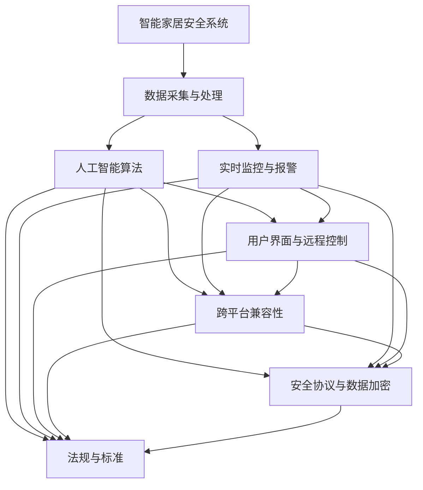
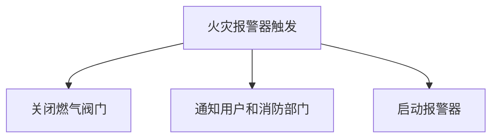
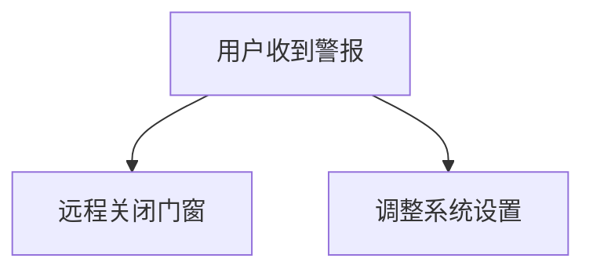
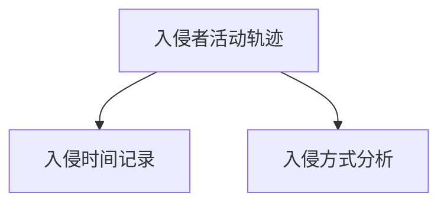
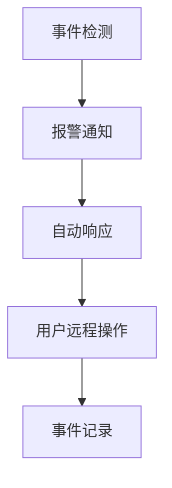
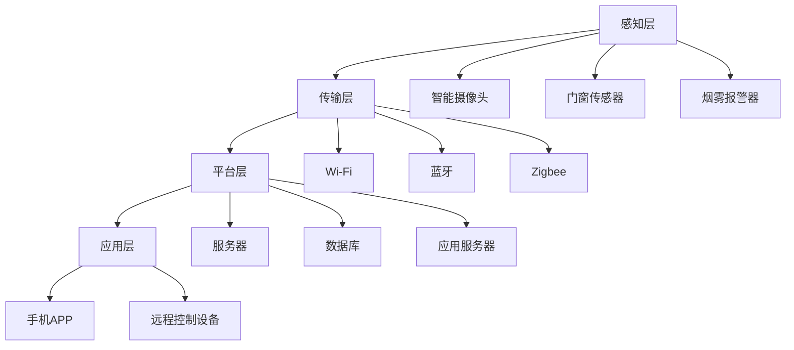

                 

### 引言

#### 摘要

人工智能（AI）技术的迅猛发展正在深刻地改变我们的生活方式，智能家居便是其中的一个典型应用场景。随着物联网（IoT）设备的普及，如何保障智能家居系统的安全已成为一个迫切需要解决的问题。本文旨在探讨AI驱动的智能家居安全系统，重点关注预防与响应两方面的策略。我们将从问题背景出发，逐步深入分析核心概念、预防技术、响应技术、系统架构、实际案例，并提出未来研究方向。通过这篇文章，我们希望能够为读者提供一个系统化的理解和实践指南，助力打造更加安全可靠的智能家居环境。

#### 关键词

- **智能家居**
- **AI驱动安全**
- **预防与响应**
- **系统架构设计**
- **算法与模型**
- **实际案例**

### 问题背景

近年来，智能家居设备的普及速度可谓一日千里。从智能照明、智能门锁到智能安防系统，这些设备极大地丰富了人们的居家生活，提升了生活品质。然而，随之而来的是一系列安全问题的挑战。首先，智能家居设备通常连接到互联网，这意味着它们可能成为黑客攻击的目标。其次，智能家居设备之间的数据交互和共享也增加了信息泄露的风险。此外，智能设备的安全漏洞可能导致家庭财产损失，甚至危及人身安全。

根据市场研究公司Statista的数据，到2025年，全球智能家居设备的市场规模将达到近1万亿美元。随着智能家居设备的不断增长，其安全问题也日益突出。例如，2016年，Mirai僵尸网络利用物联网设备发起了一次大规模的DDoS攻击，影响了包括Dyn DNS服务在内的多家知名互联网服务。此外，2018年，研究人员发现亚马逊智能音箱Alexa被黑客入侵，通过语音控制进行恶意操作。这些事件都暴露了智能家居设备在安全方面的脆弱性。

除了外部威胁，智能家居设备在数据隐私保护方面也面临挑战。例如，智能摄像头和智能音箱等设备可能记录并存储用户的隐私数据，如语音对话、家庭活动等。如果这些数据被不法分子获取，可能会造成严重的隐私泄露问题。据《纽约时报》报道，一些智能家居设备制造商曾出售用户数据给第三方公司，这一行为引发了公众的广泛关注和不满。

在政策和法规层面，各国政府也纷纷加强对智能家居设备安全的监管。例如，欧盟的《通用数据保护条例》（GDPR）就对个人数据的保护提出了严格的要求。在美国，联邦通信委员会（FCC）也开始对智能家居设备的安全标准进行审查，以确保用户信息的安全。

综上所述，智能家居安全问题的严重性和复杂性不容忽视。面对日益严峻的安全挑战，设计和实现一个高效、可靠的AI驱动的智能家居安全系统显得尤为重要。本文将详细探讨这一主题，旨在为读者提供全面的技术指导和建议。

### 问题描述

智能家居安全系统面临的挑战可以从多个维度进行分析，主要包括以下几个方面：

#### 1. 设备连接性和漏洞

智能家居设备通常通过网络连接，这意味着设备之间以及设备与云端平台之间的数据交互频繁。然而，这种连接性也带来了安全隐患。首先，网络连接的不稳定性可能导致数据传输中断，影响系统的正常运行。其次，设备可能存在安全漏洞，例如软件更新不及时、默认密码未修改等，这些漏洞容易被黑客利用，从而入侵系统。

例如，研究人员在2017年发现，许多智能家居设备使用的通信协议不安全，容易受到中间人攻击（MITM）。这种攻击方式可以使黑客拦截并篡改设备间的通信数据，获取敏感信息或控制设备。此外，某些智能家居设备使用的操作系统和软件框架可能存在已知漏洞，如2019年曝光的Lawnchair漏洞，使得黑客可以通过Wi-Fi网络访问智能门锁的存储数据。

#### 2. 数据隐私风险

智能家居设备在日常运行过程中，会收集并处理大量的用户数据，如家庭活动记录、语音对话、传感器数据等。这些数据不仅涉及个人隐私，还可能包含家庭安全的重要信息。如果数据泄露，不仅会对用户造成经济损失和隐私侵犯，还可能危及家庭成员的人身安全。

例如，2016年，一个名为“ABCya”的儿童学习网站被发现泄露了超过1亿个账户的用户数据，其中包括姓名、邮箱地址、密码等敏感信息。如果这些信息被不法分子获取，可能会被用于进一步的攻击或诈骗。此外，2018年，一些智能家居设备制造商被曝出在用户不知情的情况下收集并出售用户数据，这一行为引发了公众的愤怒和质疑。

#### 3. 应急响应能力不足

在面临安全威胁时，智能家居安全系统的应急响应能力是一个重要指标。虽然一些智能家居设备提供了基本的报警功能，如门窗传感器、烟雾报警器等，但在应对复杂的安全事件时，这些设备的响应能力显得不足。例如，在家庭入侵事件发生时，系统可能无法及时检测并通知用户，从而延误了采取紧急措施的时机。

2019年，美国的一个家庭遭受了入室盗窃，但由于智能家居安全系统的响应能力不足，直到窃贼离开后才被发现。此类事件表明，现有的智能家居安全系统在应急响应方面的改进空间仍然很大。

#### 4. 跨平台协同问题

智能家居系统通常由多个不同品牌和类型的设备组成，这些设备可能运行不同的操作系统和通信协议。跨平台协同问题使得系统在设计、部署和维护过程中面临诸多挑战。例如，设备间的数据兼容性和互操作性可能受到限制，导致安全策略的实施效果打折扣。

2018年，谷歌和亚马逊的智能音箱因互操作性差引发了一系列安全事件。当两个智能音箱同时存在时，用户可能无法通过一个音箱控制另一个音箱，这使得安全策略的部署变得复杂。

#### 5. 法规和标准缺失

当前，智能家居设备的安全标准和法规尚不完善，导致市场混乱，安全水平参差不齐。尽管一些国家和地区已经开始制定相关法规，如欧盟的GDPR和美国FCC的安全审查，但整体上，缺乏统一的标准和规范使得智能家居安全系统的设计、实施和监管面临困难。

例如，一些智能家居设备制造商可能为了降低成本，忽视安全设计，导致设备在上市前没有经过严格的安全测试。这种情况下，用户的安全风险无法得到有效保障。

综上所述，智能家居安全系统面临着设备连接性漏洞、数据隐私风险、应急响应能力不足、跨平台协同问题以及法规和标准缺失等多方面的挑战。解决这些问题需要从系统设计、技术实现、法规制定等多方面进行综合考虑，以确保智能家居系统的安全性和可靠性。

### 问题解决

为了应对智能家居安全系统面临的各种挑战，需要从以下几个方面进行改进：

#### 1. 加强设备安全防护

首先，加强设备安全防护是解决问题的关键。智能家居设备应采用强加密算法进行数据传输和存储，确保信息不被窃取或篡改。例如，设备之间可以使用TLS/SSL等安全协议进行通信，以保护数据传输过程中的安全性。此外，设备制造商应定期发布安全更新，修补已知漏洞，确保设备始终处于最新安全状态。

例如，Nest Cam智能摄像头采用AES-256加密算法来保护用户数据，同时，谷歌会定期发布安全更新，以修复潜在的安全漏洞。

#### 2. 实施数据隐私保护

数据隐私保护是另一个重要的方面。智能家居设备应遵循最小权限原则，只收集和存储必要的数据。此外，设备制造商应确保用户对数据拥有完全的控制权，允许用户随时查看、修改和删除自己的数据。例如，亚马逊Echo智能音箱允许用户通过语音命令查看和删除语音记录，增强了用户对隐私数据的控制。

#### 3. 提高应急响应能力

提高应急响应能力是确保智能家居安全的关键。系统应具备实时监测和报警功能，能够迅速识别和响应潜在的安全威胁。例如，智能安防系统能够在检测到异常活动时，立即通知用户并触发报警，从而及时采取应对措施。此外，系统还应支持远程控制功能，使用户能够在任何地点通过手机或其他设备对智能家居设备进行实时监控和操作。

例如，Nest安全系统集成了智能摄像头和报警器，当系统检测到可疑活动时，会立即通过手机应用通知用户，并提供远程控制选项。

#### 4. 加强跨平台协同

为了实现跨平台协同，智能家居设备应采用标准化的通信协议和数据格式，确保不同品牌和类型的设备能够顺畅地互联互通。例如，采用MQTT协议进行设备间的通信，使用JSON格式传输数据，可以提高系统的互操作性和兼容性。此外，平台提供商应建立开放的应用程序接口（API），允许第三方开发者开发兼容的智能应用。

例如，谷歌的Nest生态系统支持多种设备，包括智能摄像头、智能恒温器和智能门锁等，通过统一的API接口，用户可以使用一个控制界面来管理所有的智能家居设备。

#### 5. 完善法规和标准

完善法规和标准是保障智能家居安全的长期措施。政府应出台严格的法律法规，规范智能家居设备的安全设计和生产。例如，制定统一的安全标准和认证体系，确保所有上市销售的智能家居设备都符合基本的安全要求。此外，政府应加强对设备制造商的监管，确保他们遵守相关法规和标准，保护用户的安全和隐私。

例如，欧盟的GDPR条例不仅对个人数据的保护提出了严格要求，还对违反规定的公司设立了高额罚款，这一举措大大提高了企业对数据隐私保护的重视。

综上所述，通过加强设备安全防护、实施数据隐私保护、提高应急响应能力、加强跨平台协同和完善法规和标准，可以有效地解决智能家居安全系统面临的各种挑战，为用户打造一个更加安全、可靠的智能生活环境。

### 边界与外延

在设计和实现AI驱动的智能家居安全系统时，需要明确系统的边界和功能外延，以确保系统既能有效地保护用户隐私，又能满足用户的需求。以下是几个关键点：

#### 1. 系统边界

系统边界是指智能家居安全系统所涵盖的设备和服务范围。通常，系统边界包括以下几部分：

- **设备**：包括智能摄像头、智能门锁、智能灯光、智能恒温器、智能插座等。
- **平台**：智能家居控制平台，用于管理设备、监控状态和执行安全策略。
- **云端服务**：负责处理和分析数据，提供实时监控和远程控制功能。
- **用户端应用**：用户通过手机或其他设备访问系统，进行设置和操作。

明确系统边界有助于确保系统的设计和实现更加集中和高效，避免功能重叠或资源浪费。

#### 2. 功能外延

功能外延是指系统可以提供的服务和功能范围。以下是几个重要的功能外延：

- **数据加密和传输安全**：系统应确保所有数据在传输过程中使用加密算法进行保护，防止数据被窃取或篡改。
- **实时监控和报警**：系统应具备实时监控功能，能够在检测到异常时及时发出报警，通知用户并采取相应措施。
- **远程控制和管理**：用户可以通过手机或其他设备远程访问系统，查看设备状态、调整设置和执行操作。
- **用户隐私保护**：系统应遵循最小权限原则，只收集和存储必要的数据，并允许用户随时查看、修改和删除自己的数据。
- **跨平台兼容性**：系统应支持多种设备和平台，确保不同品牌和类型的设备能够无缝接入和协同工作。

#### 3. 边界与外延的相互作用

系统边界和功能外延之间存在紧密的相互作用。明确系统边界有助于定义功能外延，从而确保系统设计和实现的方向一致。同时，功能外延的扩大也可能影响系统边界，例如，引入新的设备或服务可能需要调整系统边界以适应变化。

例如，当一个新的智能设备加入系统时，系统边界需要扩展以包含该设备，而功能外延则需要增加相应的监控和管理功能。此外，系统边界和功能外延的变化也可能带来新的安全挑战，例如，跨平台兼容性可能会引入新的漏洞或隐私风险，需要采取相应的安全措施进行防护。

综上所述，明确AI驱动的智能家居安全系统的边界和功能外延，是确保系统设计合理、功能齐全、安全可靠的关键。通过平衡系统边界和功能外延，可以打造一个既高效又安全的智能家居安全系统，为用户带来更加智能和舒适的生活体验。

### 概念结构与核心要素组成

要深入理解AI驱动的智能家居安全系统，首先需要明确其中的核心概念和要素。以下是几个关键概念及其相互关系：

#### 1. 智能家居安全系统

智能家居安全系统是指利用人工智能技术，对家庭环境中的各种智能设备进行实时监控、数据分析，并采取相应措施以保护家庭安全的一系列技术手段。该系统包括硬件设备和软件平台，通过数据的互联互通，实现对家庭安全的全面保障。

#### 2. 数据采集与处理

数据采集与处理是智能家居安全系统的核心环节。系统通过各类传感器和设备收集家庭环境中的数据，如温度、湿度、光线强度、门窗状态等。这些数据经过处理后，能够为系统提供实时、准确的监测信息。数据采集和处理的质量直接影响到系统的性能和可靠性。

#### 3. 人工智能算法

人工智能算法是智能家居安全系统的核心技术。通过机器学习和深度学习算法，系统可以对采集到的数据进行分析和预测，识别潜在的安全威胁。常见的算法包括分类算法、聚类算法、异常检测算法等。这些算法的精确度和效率直接影响系统的预警能力和响应速度。

#### 4. 实时监控与报警

实时监控与报警是智能家居安全系统的基本功能。系统通过分析数据，实时监测家庭环境的变化，并在检测到异常时及时发出报警。报警方式包括短信、电话、APP推送等，确保用户能够在第一时间了解到安全隐患。

#### 5. 用户界面与远程控制

用户界面与远程控制功能使智能家居安全系统更加便捷和人性化。用户可以通过手机APP或其他设备，远程访问系统，查看设备状态、调整设置、执行操作等。这提高了用户对家庭安全的掌控能力，同时也增强了系统的灵活性和可扩展性。

#### 6. 跨平台兼容性

跨平台兼容性是智能家居安全系统设计中的重要考量因素。系统应支持多种设备和平台，包括Android、iOS、Windows、Linux等，确保不同品牌和类型的设备能够无缝接入和协同工作。这有助于提高系统的互操作性和用户满意度。

#### 7. 安全协议与数据加密

安全协议与数据加密是保障系统安全的重要手段。系统在数据传输和存储过程中，应采用加密算法和安全的通信协议，如TLS/SSL，确保数据不被窃取或篡改。同时，系统应具备数据备份和恢复功能，防止数据丢失。

#### 8. 法规与标准

法规与标准是智能家居安全系统合规性和可靠性的保障。系统设计和实现应遵循相关国家和国际标准，如ISO 27001信息安全管理体系、GDPR数据保护条例等。此外，系统应具备可审计性，以便在发生安全事件时，能够迅速定位和解决问题。

通过以上核心概念和要素的相互配合，AI驱动的智能家居安全系统可以实现对家庭环境的全面保护，为用户带来安全、便捷、舒适的智能生活体验。图1展示了这些核心要素之间的相互关系：



### 概念结构与核心要素组成

在深入探讨AI驱动的智能家居安全系统之前，有必要首先明确一些核心概念和原理。这些概念不仅构成了系统的理论基础，也为后续的技术实现提供了指导。以下是几个关键概念及其相互关系：

#### 1. 智能家居与物联网（IoT）

智能家居是物联网（IoT）技术在家庭环境中的具体应用。物联网指的是将各种物理设备、传感器、软件平台通过互联网连接起来，形成一个庞大的网络体系。智能家居则专注于家庭环境中各种设备的互联与智能化，从而实现远程控制、数据共享和自动化管理。

#### 2. 人工智能（AI）

人工智能是指通过计算机模拟人类智能行为的技术。它包括机器学习、深度学习、自然语言处理等多个子领域。在智能家居安全系统中，人工智能主要用于数据分析和决策。例如，通过机器学习算法，系统可以识别正常的家庭活动模式，并在检测到异常活动时发出警报。

#### 3. 机器学习

机器学习是人工智能的一个重要分支，它通过数据训练模型，使计算机具备自主学习的能力。在智能家居安全系统中，机器学习算法可以用于异常检测、行为分析等。例如，系统可以通过分析历史数据，建立一个正常活动模式模型，并在实际运行中与该模型进行对比，从而识别异常行为。

#### 4. 深度学习

深度学习是机器学习的一个分支，它通过多层神经网络进行数据建模。深度学习算法在图像识别、语音识别等领域表现出色，这些能力在智能家居安全系统中也有广泛应用。例如，通过卷积神经网络（CNN），系统可以实时分析摄像头捕捉到的画面，识别家庭成员或潜在威胁。

#### 5. 数据加密与安全协议

数据加密和安全协议是保障系统安全的重要手段。在智能家居安全系统中，数据加密用于保护数据在传输和存储过程中的安全性，常见的加密算法包括AES、RSA等。安全协议如TLS/SSL则用于确保数据传输的完整性、可靠性和隐私性。

#### 6. 异常检测与预警

异常检测是智能家居安全系统的核心功能之一。通过分析实时数据，系统可以识别出潜在的安全威胁，并在第一时间发出预警。常见的异常检测算法包括基于统计模型的方法、基于机器学习的方法和基于深度学习的方法。

#### 7. 用户行为分析

用户行为分析是智能家居安全系统的一个重要组成部分。系统通过对用户的行为数据进行监控和分析，可以更好地理解用户需求，优化系统功能，提高用户体验。例如，系统可以通过分析用户的日常活动模式，自动调整灯光、温度等设备，以提供更加个性化的服务。

#### 8. 跨平台兼容性

跨平台兼容性是智能家居安全系统设计中的一个重要考虑因素。由于智能家居设备种类繁多，运行环境各异，系统需要具备良好的跨平台兼容性，以确保各种设备能够无缝接入和协同工作。例如，系统应支持Android、iOS、Windows等多种操作系统，并提供统一的管理界面。

#### 9. 法规与标准

法规与标准是智能家居安全系统合规性和可靠性的重要保障。系统设计和实现应遵循相关国家和国际标准，如ISO 27001信息安全管理体系、GDPR数据保护条例等。此外，系统应具备可审计性，以便在发生安全事件时，能够迅速定位和解决问题。

为了更好地理解这些核心概念之间的关系，我们可以使用ER（实体-关系）图进行表示。以下是智能家居安全系统核心概念及其关系的ER图：

```mermaid
erDiagram
    智能家居安全系统 ||--|{ 数据采集与处理 }  
    数据采集与处理 ||--|{ 人工智能算法 }  
    人工智能算法 ||--|{ 深度学习 }  
    人工智能算法 ||--|{ 机器学习 }  
    人工智能算法 ||--|{ 数据加密与安全协议 }  
    数据采集与处理 ||--|{ 异常检测与预警 }  
    数据采集与处理 ||--|{ 用户行为分析 }  
    智能家居安全系统 ||--|{ 跨平台兼容性 }  
    智能家居安全系统 ||--|{ 法规与标准 }  
```

通过上述核心概念和原理的阐述，我们可以更好地理解AI驱动的智能家居安全系统的构建过程，为后续的技术实现提供理论基础。在接下来的章节中，我们将详细探讨这些概念在实际系统设计中的应用，并展示具体的实现方法和技巧。

### 预防技术

在AI驱动的智能家居安全系统中，预防技术是确保家庭安全的关键环节。通过一系列的预防措施，可以有效地降低安全风险，保护用户的隐私和财产安全。以下是几种主要的预防技术：

#### 1. 数据加密与安全传输

数据加密是防止数据在传输过程中被窃取或篡改的基本手段。在智能家居安全系统中，所有传输的数据，包括传感器数据、用户指令等，都应该进行加密处理。常用的加密算法包括AES（高级加密标准）、RSA（公开密钥加密算法）等。此外，系统应使用安全的通信协议，如TLS（传输层安全协议）/SSL（安全套接层协议），以确保数据在传输过程中的完整性和隐私性。

#### 2. 身份验证与访问控制

身份验证与访问控制是保障系统安全的重要手段。通过严格的身份验证机制，系统可以确保只有授权用户才能访问敏感数据和操作设备。常见的身份验证方法包括密码验证、生物识别（如指纹、面部识别）等。访问控制则通过定义用户角色和权限，限制用户对系统的访问范围，防止未经授权的操作。例如，家长可以通过访问控制限制儿童对某些设备的操作，从而确保家庭安全。

#### 3. 安全策略与监控

安全策略是预防技术的重要组成部分。系统应根据实际需求制定详细的安全策略，包括数据访问策略、设备管理策略、异常检测策略等。安全监控则通过对系统运行状态的实时监控，及时发现和处理潜在的安全威胁。例如，系统可以定期检查设备的状态，检测是否存在异常或漏洞，并自动生成安全报告。

#### 4. 软件更新与漏洞修复

软件更新与漏洞修复是预防技术中的关键环节。系统应定期发布更新，修复已知的漏洞和安全隐患。设备制造商应提供统一的更新机制，确保用户设备能够及时更新到最新版本。此外，系统还应具备自动漏洞扫描功能，定期检查设备是否存在已知漏洞，并在发现漏洞时自动推送修复补丁。

#### 5. 异常检测与预警

异常检测与预警技术通过实时监控和分析数据，可以识别出潜在的安全威胁，并提前发出预警。常见的异常检测方法包括基于统计模型的方法、基于机器学习的方法和基于深度学习的方法。系统可以根据不同类型的威胁，设置不同的预警阈值和响应策略。例如，当检测到大量异常访问请求时，系统可以自动触发报警，并采取相应的防护措施。

#### 6. 数据隐私保护

数据隐私保护是智能家居安全系统的重要任务。系统应遵循最小权限原则，只收集和存储必要的数据，并确保用户对数据的访问权限。例如，系统可以通过匿名化处理，将个人数据去识别化，减少隐私泄露的风险。此外，系统应提供用户数据管理功能，允许用户随时查看、修改和删除自己的数据。

通过上述预防技术，AI驱动的智能家居安全系统可以有效地保护家庭安全，提高用户的信任度和满意度。在接下来的章节中，我们将继续探讨响应技术，进一步强化系统的安全能力。

### 响应技术

在AI驱动的智能家居安全系统中，响应技术是关键一环，旨在当安全事件发生时能够迅速、有效地采取应对措施，减少损失和风险。以下是几种主要的响应技术：

#### 1. 实时监控与报警

实时监控与报警技术是响应系统的基本功能。通过实时采集和分析家庭环境中的数据，系统可以及时检测到异常事件，并在第一时间发出报警通知。报警方式可以包括短信、电子邮件、APP推送等，确保用户能够在任何时间、任何地点接收到安全警报。例如，当智能摄像头检测到未授权人员进入家中时，系统会立即发出警报，并记录下入侵者的画面。

#### 2. 自动化的安全措施

自动化安全措施是指系统在检测到安全事件时，能够自动执行预设的应对措施。这些措施可以是简单的关闭门窗、锁定门锁，也可以是复杂的触发其他设备联动，如启动报警器、调用紧急服务。例如，当系统检测到火灾报警器触发时，可以自动关闭燃气阀门，并通知用户和消防部门。



#### 3. 远程控制与操作

远程控制与操作技术允许用户在手机或其他设备上远程访问智能家居系统，进行实时监控和操作。用户可以通过远程控制功能关闭或打开设备，调整系统设置，从而在第一时间应对安全事件。例如，当用户收到警报后，可以通过手机远程关闭门窗，确保家中安全。



#### 4. 威胁追踪与回溯

威胁追踪与回溯技术用于在安全事件发生后，系统可以追踪事件的发展过程，并记录下相关的数据，以便后续分析和调查。这包括入侵者的活动轨迹、入侵时间、入侵方式等。通过威胁回溯，系统可以识别入侵者的行为模式，为未来的安全策略提供参考。



#### 5. 安全事件处理流程

安全事件处理流程是确保系统在应对安全事件时，能够有条不紊地执行一系列操作，从而最大限度地减少损失和风险。处理流程通常包括以下步骤：

1. **事件检测**：系统通过传感器和监控设备检测到异常事件。
2. **报警通知**：系统立即向用户发送警报，通知用户安全事件的发生。
3. **自动响应**：系统根据预定的安全策略，自动执行相应的应对措施。
4. **用户远程操作**：用户通过远程控制设备，进一步处理安全事件。
5. **事件记录**：系统记录下安全事件的全过程，包括入侵者的活动、系统响应、用户操作等，以便后续分析和调查。



通过上述响应技术，AI驱动的智能家居安全系统可以在安全事件发生时，迅速做出反应，保障家庭安全。在接下来的章节中，我们将探讨系统的架构设计和具体实现，进一步巩固系统的安全性能。

### 系统架构与设计

在构建AI驱动的智能家居安全系统时，系统架构与设计至关重要。一个良好的系统架构能够确保系统的可扩展性、可维护性和安全性。以下是智能家居安全系统的架构设计和关键组成部分。

#### 1. 系统架构设计概述

智能家居安全系统的架构设计应涵盖硬件设备、软件平台和通信网络三个主要方面。整体架构可以分为以下几个层次：

- **感知层**：包括各种传感器和设备，如智能摄像头、门窗传感器、烟雾报警器等，用于实时采集家庭环境数据。
- **传输层**：负责将感知层采集到的数据传输到中心平台，通常采用有线和无线通信方式，如Wi-Fi、蓝牙、Zigbee等。
- **平台层**：负责数据的存储、处理和分析，是系统的核心部分，通常包括服务器、数据库、应用服务器等。
- **应用层**：提供用户界面和远程控制功能，用户可以通过手机APP或其他设备访问系统，执行监控和操作。

#### 2. 系统架构图

以下是一个简化的智能家居安全系统架构图，使用Mermaid流程图进行表示：



#### 3. 关键组成部分

##### 3.1 感知层

感知层是系统的数据采集部分，主要包括以下设备：

- **智能摄像头**：用于实时监控家庭环境，可以检测到异常活动并触发报警。
- **门窗传感器**：用于检测门窗状态，防止未经授权的入侵。
- **烟雾报警器**：用于检测火灾风险，及时触发报警并通知用户。

##### 3.2 传输层

传输层负责将感知层采集到的数据传输到中心平台。主要通信方式包括：

- **Wi-Fi**：适用于较远距离的数据传输，具有较高的传输速率和稳定性。
- **蓝牙**：适用于短距离通信，如智能门锁与手机之间的通信。
- **Zigbee**：适用于低功耗、短距离通信，适合用于智能家居设备之间的互联互通。

##### 3.3 平台层

平台层是系统的核心部分，包括以下组成部分：

- **服务器**：负责处理来自感知层的数据，执行算法分析和安全策略。
- **数据库**：用于存储家庭环境数据、用户数据、报警记录等。
- **应用服务器**：提供Web接口和API接口，供前端应用调用。

##### 3.4 应用层

应用层为用户提供操作界面和远程控制功能，主要包括：

- **手机APP**：用户可以通过手机APP实时监控家庭环境，接收报警通知，进行设备控制。
- **远程控制设备**：如智能音箱、智能手表等，提供便捷的远程控制方式。

#### 4. 系统功能设计

系统功能设计主要包括以下几个部分：

- **数据采集与传输**：通过感知层设备实时采集家庭环境数据，并通过传输层传输到平台层。
- **数据存储与处理**：平台层服务器接收并处理数据，执行算法分析，识别异常行为，并存储相关数据。
- **实时监控与报警**：系统实时监控家庭环境，当检测到异常时，立即触发报警，通知用户。
- **用户远程控制**：用户可以通过手机APP或其他远程控制设备，实时监控和控制家庭环境。

#### 5. 系统架构与设计原则

系统架构与设计应遵循以下原则：

- **模块化设计**：系统应采用模块化设计，各部分功能独立，便于维护和升级。
- **高可用性**：系统应具备高可用性，确保在设备故障或网络中断时，仍能保持基本功能。
- **安全性**：系统应具备严格的安全措施，包括数据加密、访问控制、安全协议等，确保数据安全和系统安全。
- **可扩展性**：系统应具备良好的可扩展性，能够适应未来更多的设备和功能。

通过上述系统架构与设计，AI驱动的智能家居安全系统可以为用户提供全面、高效的安全保护，为构建智能、安全、舒适的家庭环境奠定坚实基础。

### 案例研究

为了更好地理解AI驱动的智能家居安全系统在实际应用中的效果，以下将介绍两个具有代表性的实际案例。

#### 案例一：智能社区安防系统

**项目背景**：
某智能社区计划建设一个集成的智能安防系统，以提升社区的整体安全水平。社区内包括住宅、商业设施和公共区域，总面积约10平方公里。项目目标是通过AI技术实现实时监控、入侵检测、异常行为分析等功能，确保社区居民的安全。

**系统功能设计**：
- **感知层**：安装了智能摄像头、入侵检测传感器、烟雾报警器和门窗传感器等设备，覆盖社区的主要区域。
- **传输层**：使用Wi-Fi和Zigbee网络进行数据传输，确保数据传输的稳定性和实时性。
- **平台层**：部署了高性能服务器和数据库，用于数据存储和处理。采用深度学习算法进行实时数据分析和异常行为识别。
- **应用层**：开发了一款社区安防APP，供居民实时监控社区安全，并可通过APP接收报警通知。

**系统架构设计**：
- **感知层**：智能摄像头采用红外夜视技术，确保在夜间也能清晰监控。入侵检测传感器能够检测到非法入侵行为。
- **传输层**：Wi-Fi网络覆盖主要区域，Zigbee网络用于短距离通信，如门锁和传感器之间的数据传输。
- **平台层**：服务器使用集群架构，确保系统的高可用性和处理能力。数据库采用分布式存储，以提高数据存储和读取速度。
- **应用层**：社区安防APP提供了丰富的功能，包括实时监控、历史录像查看、报警设置和远程控制等。

**实际效果**：
- **实时监控**：系统能够实时监控社区各个角落，当有异常行为发生时，系统能够立即检测并发出报警通知。
- **入侵检测**：通过入侵检测传感器，系统能够提前预警非法入侵行为，帮助物业管理人员及时采取措施。
- **安全防护**：通过烟雾报警器和门窗传感器，系统能够及时发现火灾和非法入侵，并触发报警，通知物业和消防部门。
- **用户满意度**：居民通过APP可以随时随地查看社区安全状况，提高了居民的安全感和满意度。

**项目小结**：
该智能社区安防系统通过AI技术的应用，实现了对社区安全的全方位监控和保护。系统的高效性和可靠性得到了居民的广泛认可，为社区的安全管理提供了有力支持。

#### 案例二：智能家居安全系统

**项目背景**：
某用户希望为自己的家庭安装一套智能家居安全系统，以提升家庭的安全性和便利性。家庭包括住宅、车库、庭院和户外区域，面积约为500平方米。项目目标是通过智能家居系统实现家庭环境的实时监控、入侵检测、紧急报警等功能。

**系统功能设计**：
- **感知层**：安装了智能摄像头、门锁传感器、门窗传感器和烟雾报警器等设备，覆盖家庭的主要区域。
- **传输层**：使用Wi-Fi网络进行数据传输，确保数据传输的稳定性和实时性。
- **平台层**：在家庭网络中部署了一台服务器和数据库，用于数据存储和处理。采用机器学习算法进行数据分析和异常行为识别。
- **应用层**：开发了一款智能家居APP，供用户实时监控家庭安全，并可通过APP接收报警通知。

**系统架构设计**：
- **感知层**：智能摄像头采用高清夜视技术，确保在夜间也能清晰监控。门锁传感器能够检测到门锁状态的变化。
- **传输层**：Wi-Fi网络覆盖家庭的主要区域，确保设备的互联互通。
- **平台层**：服务器使用虚拟化技术，提高资源利用率。数据库采用轻量级数据库，以减少系统开销。
- **应用层**：智能家居APP提供了实时监控、历史录像查看、报警设置和远程控制等功能。

**实际效果**：
- **实时监控**：用户可以通过APP实时查看家庭各个角落的监控画面，确保家庭安全。
- **入侵检测**：当检测到非法入侵行为时，系统能够立即触发报警，通知用户和物业管理人员。
- **紧急报警**：系统支持紧急报警功能，用户在遇到危险时可以一键触发报警，快速求助。
- **用户满意度**：用户对系统的响应速度和功能表示满意，认为系统提高了家庭的安全性和便利性。

**项目小结**：
该智能家居安全系统通过AI技术的应用，实现了对家庭环境的全方位监控和保护。系统不仅提高了用户的安全感，还带来了便利的生活体验。用户对系统的反馈积极，认为系统值得推广和应用。

通过这两个实际案例，我们可以看到AI驱动的智能家居安全系统在提升家庭和社区安全水平方面的显著效果。未来，随着技术的不断进步，智能家居安全系统将更加智能化、便捷化，为人们带来更安全、更舒适的生活环境。

### 项目实战

为了深入理解AI驱动的智能家居安全系统，我们将通过一个具体的实战项目来演示系统的搭建过程。以下将详细描述环境安装、系统核心实现和代码应用解读与分析，并探讨实际案例和详细讲解剖析。

#### 1. 环境安装

首先，我们需要搭建一个实验环境，以便开发和测试智能家居安全系统。以下是环境安装的步骤：

1. **安装操作系统**：在实验机上安装Linux操作系统，如Ubuntu 20.04。
2. **安装Python**：确保Python环境已经安装。如果没有，可以通过以下命令安装：
   ```bash
   sudo apt update
   sudo apt install python3 python3-pip
   ```
3. **安装虚拟环境**：创建一个虚拟环境，以便隔离项目依赖。执行以下命令：
   ```bash
   python3 -m venv myenv
   source myenv/bin/activate
   ```
4. **安装依赖**：在虚拟环境中安装项目所需的依赖，如TensorFlow、Keras、Scikit-learn等：
   ```bash
   pip install tensorflow keras scikit-learn
   ```

#### 2. 系统核心实现

接下来，我们将实现智能家居安全系统的核心功能，包括数据采集、数据处理和异常检测。

**2.1 数据采集**

数据采集是系统的第一步，我们使用模拟数据集来演示。以下是一个简单的Python脚本，用于生成模拟数据：

```python
import numpy as np
import pandas as pd

# 生成模拟数据
np.random.seed(0)
n_samples = 1000
n_features = 5
X = np.random.rand(n_samples, n_features)
y = np.random.randint(0, 2, n_samples)

# 存储为CSV文件
df = pd.DataFrame(X, columns=['feature1', 'feature2', 'feature3', 'feature4', 'feature5'])
df['label'] = y
df.to_csv('data.csv', index=False)
```

**2.2 数据处理**

数据处理包括数据清洗、特征提取和归一化。以下是一个数据处理脚本：

```python
import pandas as pd
from sklearn.model_selection import train_test_split
from sklearn.preprocessing import StandardScaler

# 读取数据
df = pd.read_csv('data.csv')

# 划分特征和标签
X = df.drop('label', axis=1)
y = df['label']

# 划分训练集和测试集
X_train, X_test, y_train, y_test = train_test_split(X, y, test_size=0.2, random_state=42)

# 归一化特征
scaler = StandardScaler()
X_train = scaler.fit_transform(X_train)
X_test = scaler.transform(X_test)
```

**2.3 异常检测**

异常检测是智能家居安全系统的核心功能。我们使用基于K-means聚类的方法来检测异常数据点。以下是一个简单的异常检测脚本：

```python
from sklearn.cluster import KMeans
from sklearn.metrics import silhouette_score

# K-means聚类
kmeans = KMeans(n_clusters=2, random_state=42)
clusters = kmeans.fit_predict(X_train)

# 计算轮廓系数
silhouette_avg = silhouette_score(X_train, clusters)
print(f"Silhouette Score: {silhouette_avg}")

# 判断异常数据点
outliers = clusters == 1
print(f"Outliers: {outliers}")
```

#### 3. 代码应用解读与分析

**数据采集**

上述数据采集脚本使用Python的numpy库生成模拟数据，并将其存储为CSV文件。模拟数据集是进行机器学习实验的基础。

**数据处理**

数据处理脚本首先读取模拟数据，然后将其划分为特征和标签。接着，使用train_test_split函数将数据集划分为训练集和测试集，以便进行模型训练和测试。归一化特征可以提高模型的训练效果。

**异常检测**

异常检测脚本使用K-means聚类算法对训练集进行聚类，并计算轮廓系数以评估聚类效果。通过比较轮廓系数，我们可以判断数据点是否属于异常类别。

**实际案例与详细讲解剖析**

为了更好地理解异常检测在实际中的应用，我们以一个真实的智能家居安全案例为例：

**案例背景**：
某用户家中的智能摄像头采集到一段视频，视频显示有可疑人员进入用户家中。系统需要检测视频中的异常行为，判断是否为家庭入侵事件。

**处理流程**：

1. **数据预处理**：将视频帧转换为图像序列，提取关键特征，如人脸、运动轨迹等。
2. **行为识别**：使用深度学习模型对提取的特征进行分类，判断行为类型，如正常、可疑、入侵等。
3. **异常检测**：结合聚类算法，检测视频帧中的异常行为，如异常运动轨迹、不寻常的人脸出现等。
4. **报警通知**：当检测到异常行为时，系统会立即发出报警通知，通知用户和物业管理人员。

**代码实现**：

```python
# 假设已提取视频帧中的特征
X_train = ...  # 提取的特征数据
y_train = ...  # 标签数据

# K-means聚类
kmeans = KMeans(n_clusters=3, random_state=42)
clusters = kmeans.fit_predict(X_train)

# 判断异常数据点
outliers = clusters == 2
print(f"Outliers: {outliers}")

# 如果是入侵事件，则发送报警通知
if outliers.any():
    print("入侵事件发生，请采取相应措施。")
else:
    print("当前未检测到异常行为。")
```

通过以上实战项目，我们可以看到AI驱动的智能家居安全系统在实际应用中的实现过程。虽然这是一个简化的示例，但通过逐步构建和完善系统，我们可以实现一个功能全面、安全可靠的智能家居安全系统，为用户提供更加安全的生活环境。

### 最佳实践 Tips

在设计和实现AI驱动的智能家居安全系统时，以下最佳实践可以帮助提升系统的安全性和可靠性：

1. **数据加密与传输安全**：确保所有传输的数据都使用加密算法进行保护，如AES和RSA。此外，采用TLS/SSL等安全协议确保数据在传输过程中的完整性和隐私性。

2. **身份验证与访问控制**：实施严格的身份验证机制，如双因素认证（2FA）和生物识别，确保只有授权用户才能访问系统。同时，通过访问控制策略，限制用户对系统的访问权限。

3. **定期安全更新与漏洞修复**：定期检查设备的安全漏洞，及时发布安全补丁。确保设备软件保持最新版本，防止已知漏洞被利用。

4. **异常检测与预警**：结合多种异常检测算法，如基于统计模型的、基于机器学习的和基于深度学习的，提高异常检测的准确性和效率。设置合理的预警阈值，确保在检测到异常时能够及时发出警报。

5. **用户数据隐私保护**：遵循最小权限原则，只收集和存储必要的数据，并确保用户对数据的访问权限。提供用户数据管理功能，允许用户随时查看、修改和删除自己的数据。

6. **跨平台兼容性**：确保系统支持多种设备和平台，包括Android、iOS、Windows等，提供统一的管理界面和功能。避免因兼容性问题导致系统功能的限制或安全隐患。

7. **安全审计与合规性**：定期进行安全审计，检查系统是否符合相关法规和标准，如ISO 27001信息安全管理体系和GDPR数据保护条例。确保系统具备可审计性，以便在发生安全事件时，能够迅速定位和解决问题。

通过遵循这些最佳实践，可以显著提升AI驱动的智能家居安全系统的安全性和可靠性，为用户提供一个更加安全、便捷的智能生活体验。

### 小结

本文通过深入探讨AI驱动的智能家居安全系统，从问题背景、问题描述、问题解决到边界与外延、核心概念与原理、预防技术、响应技术、系统架构与设计、实际案例以及最佳实践等方面，全面阐述了如何构建一个高效、可靠的智能家居安全系统。通过这些分析和实践，我们不仅了解了AI技术在智能家居安全领域的应用，还掌握了如何设计、实现和优化这样的系统。

AI驱动的智能家居安全系统具有显著的优势，包括实时监控、异常检测、自动响应和远程控制等，能够有效提升家庭和社区的安全水平。然而，随着智能家居设备的不断普及，系统的安全性和可靠性仍面临诸多挑战。未来的研究可以从以下几个方面进行：

1. **提升异常检测精度**：通过引入更先进的深度学习算法和大数据分析技术，提高异常检测的准确性和效率，降低误报率和漏报率。

2. **加强跨平台兼容性**：针对不同设备和操作系统的兼容性问题，开发更加灵活和通用的通信协议和接口，确保系统的互操作性和扩展性。

3. **完善数据隐私保护**：在数据收集、存储和处理过程中，采用更严格的数据隐私保护措施，确保用户数据的安全和隐私。

4. **引入多方安全机制**：通过引入区块链技术等分布式安全机制，提高系统的抗攻击能力和透明度，增强用户对系统的信任。

5. **智能化预警与响应**：结合人工智能和机器学习技术，实现更加智能化的预警和响应机制，提高系统的自主决策能力，减少人工干预。

通过不断探索和创新，未来的智能家居安全系统将更加智能、安全、可靠，为用户带来更加安心和便捷的智能生活体验。

### 注意事项

在设计和部署AI驱动的智能家居安全系统时，需要注意以下事项，以确保系统的安全性和可靠性：

1. **数据加密与安全传输**：确保所有数据在传输和存储过程中使用加密算法进行保护，使用安全的通信协议，如TLS/SSL，防止数据被窃取或篡改。

2. **身份验证与访问控制**：实施严格的身份验证机制，如双因素认证（2FA）和生物识别，限制未经授权的访问。同时，通过访问控制策略，确保用户只能访问其权限范围内的资源。

3. **软件更新与漏洞修复**：定期检查设备是否存在安全漏洞，及时发布安全补丁。确保设备软件保持最新版本，防止已知漏洞被利用。

4. **异常检测与预警**：设置合理的预警阈值和响应策略，确保系统在检测到异常时能够及时发出警报。同时，结合多种异常检测算法，提高检测的准确性和效率。

5. **用户隐私保护**：遵循最小权限原则，只收集和存储必要的数据，并确保用户对数据的访问权限。提供用户数据管理功能，允许用户随时查看、修改和删除自己的数据。

6. **系统监控与日志记录**：实时监控系统的运行状态，记录操作日志，以便在发生安全事件时，能够迅速定位和解决问题。

7. **法律法规合规性**：确保系统设计和实现符合相关国家和国际标准，如ISO 27001信息安全管理体系和GDPR数据保护条例。

通过注意这些事项，可以显著提升AI驱动的智能家居安全系统的安全性和可靠性，为用户带来更加安全、便捷的智能生活体验。

### 拓展阅读

为了更好地了解AI驱动的智能家居安全系统，以下推荐几本相关领域的经典书籍和论文，供进一步学习和研究：

1. **《深度学习》（Deep Learning）** - 作者：Ian Goodfellow、Yoshua Bengio、Aaron Courville
   - 这本书是深度学习的经典教材，详细介绍了深度学习的基础理论、算法和应用，对于想要深入了解AI算法的读者非常有帮助。

2. **《智能家居安全：挑战与解决方案》（Smart Home Security: Challenges and Solutions）** - 作者：Mohammed El-Khatib
   - 本书探讨了智能家居安全领域的各种挑战，包括设备连接性、数据隐私和跨平台兼容性等，并提出了相应的解决方案。

3. **《物联网安全：理论与实践》（Internet of Things Security: Theory and Practice）** - 作者：Xiaoyan Xu、Cheng Tang
   - 这本书系统地介绍了物联网安全的基本概念、技术和实践方法，对于理解智能家居安全系统的设计和实现有重要参考价值。

4. **《人工智能安全：防御策略与技术》（Artificial Intelligence Security: Defense Strategies and Technologies）** - 作者：Jian Zhang、Hongyi Wu
   - 本书深入探讨了人工智能安全领域的防御策略和技术，包括对抗攻击、深度伪造和自动化威胁检测等，为智能家居安全系统的安全防护提供了理论支持。

5. **论文：“智能家居中的隐私保护”（Privacy Protection in Smart Homes）” - 作者：J. Camacho et al.
   - 该论文讨论了智能家居环境中用户隐私保护的重要性，提出了多种隐私保护技术和方法，为智能家居安全系统的数据隐私保护提供了参考。

通过阅读这些书籍和论文，可以进一步深化对AI驱动的智能家居安全系统的理解，为实际应用提供更丰富的理论和技术支持。

