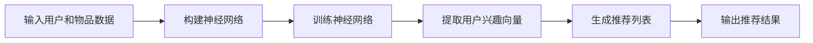
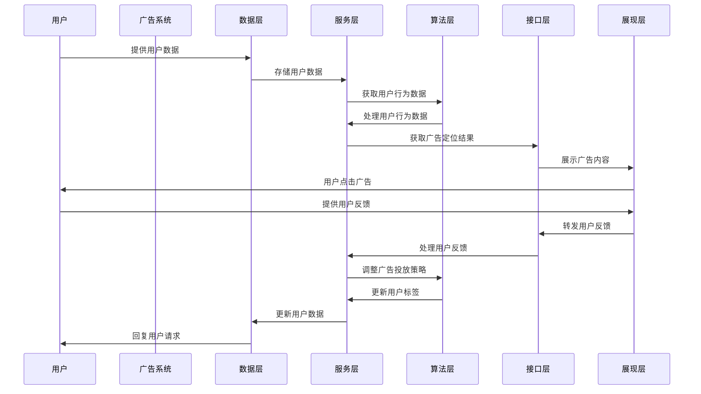
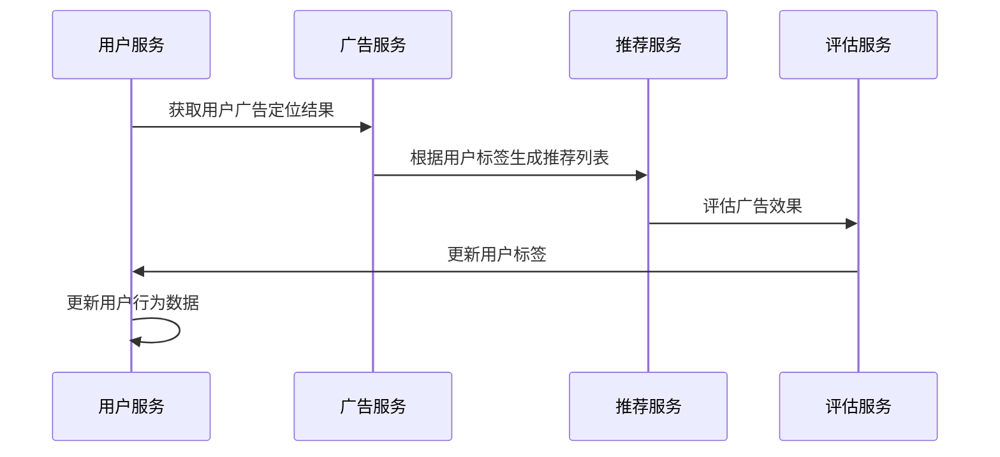
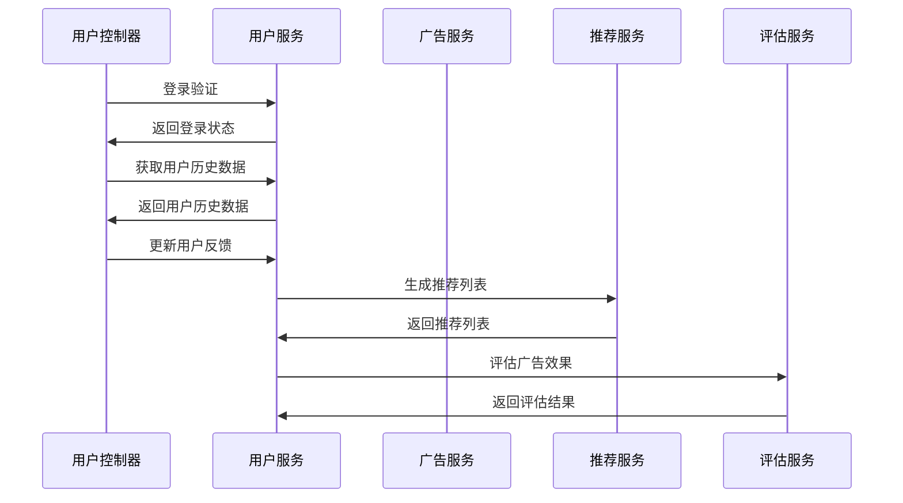

                 


### AI驱动的智能广告投放：精准定位与用户隐私的平衡

关键词：人工智能、机器学习、广告投放、用户隐私、精准定位

摘要：本文深入探讨了AI驱动的智能广告投放技术，从背景介绍到核心概念讲解，再到算法原理和数学模型，再到系统设计与项目实战，最后提供最佳实践和注意事项。通过这篇文章，读者可以全面了解智能广告投放的原理、技术架构及其在用户隐私保护方面的挑战。

---

## 第一部分: AI驱动的智能广告投放概述

### 第1章: AI驱动的智能广告投放背景

广告行业一直以来都是经济的重要组成部分，随着互联网的快速发展，数字广告的市场规模也呈现出爆炸式增长。然而，传统的广告投放方式已经无法满足现代广告主的需求，广告投放的精准性和有效性成为了行业面临的重大挑战。

#### 1.1 广告行业现状与挑战

在传统广告投放中，广告主往往依赖于广告平台提供的数据和算法，这些数据往往不准确或者不全面，导致广告投放的效果不佳。此外，传统广告投放方式无法实时响应市场变化，广告投放的效率和效果受到很大限制。

#### 1.2 AI技术对广告行业的变革

人工智能技术的迅速发展为广告行业带来了新的变革。通过机器学习算法，AI能够从海量数据中提取有价值的信息，实现广告投放的精准定位。同时，AI技术还能够实时分析用户行为，为广告主提供个性化的广告内容，提高广告的投放效果。

### 第2章: AI驱动的智能广告投放核心概念

为了更好地理解AI驱动的智能广告投放，我们需要了解一些核心概念，包括人工智能、机器学习、广告投放机制等。

#### 2.1 人工智能与机器学习基础

人工智能（AI）是指模拟人类智能的技术，包括机器学习、自然语言处理、计算机视觉等。机器学习是人工智能的一个分支，通过算法从数据中学习，实现特定任务的自动化。

#### 2.2 广告投放机制与流程

广告投放机制通常包括广告创建、广告定位、广告投放、广告效果评估等步骤。机器学习算法在这一过程中起着关键作用，能够根据用户行为、兴趣、历史数据等信息，实现广告的精准定位和投放。

#### 2.3 关键概念联系与对比

人工智能、机器学习和广告投放机制之间有着密切的联系。人工智能提供了技术支持，机器学习是实现广告投放的核心算法，广告投放机制则是将机器学习算法应用于实际场景的桥梁。在对比中，我们可以看到人工智能的广泛性，机器学习的专业性，以及广告投放机制的实用性。

---

以上是对第一部分的内容概述，接下来我们将深入探讨AI驱动的智能广告投放的算法原理、数学模型、系统设计、项目实战和最佳实践。在接下来的章节中，我们将逐步剖析每一个环节，帮助读者全面理解智能广告投放的原理和实践。

---

### 核心概念与联系

在深入探讨AI驱动的智能广告投放之前，我们需要对核心概念进行详细解析，并展示它们之间的联系。

#### 2.1 人工智能与机器学习基础

人工智能（AI）是模拟、延伸和扩展人类智能的理论、方法、技术及应用。它包括多个子领域，如机器学习（ML）、深度学习（DL）、自然语言处理（NLP）和计算机视觉（CV）。机器学习是AI的一个重要分支，通过算法从数据中学习，预测或决策。

**机器学习基础：**

机器学习通常分为监督学习、无监督学习和强化学习。监督学习依赖于标记数据，例如分类和回归问题。无监督学习则处理未标记数据，如聚类和降维。强化学习通过奖励机制，使算法在特定环境中学会最优策略。

**机器学习算法：**

常见的机器学习算法包括线性回归、决策树、支持向量机（SVM）、随机森林和神经网络。每种算法都有其独特的应用场景和优缺点。

#### 2.2 广告投放机制与流程

广告投放机制涉及多个环节，包括广告创建、广告定位、广告投放和广告效果评估。

- **广告创建：** 广告主创建广告内容，包括文字、图片、视频等。
- **广告定位：** 通过用户行为数据、兴趣标签和地理位置等信息，将广告推送给潜在用户。
- **广告投放：** 广告平台根据定位策略，将广告推送到目标用户。
- **广告效果评估：** 通过点击率（CTR）、转化率（CVR）等指标，评估广告效果。

**广告投放流程：**

1. 广告主创建广告，设定目标受众和预算。
2. 广告平台收集用户数据，进行广告定位。
3. 广告投放至目标用户，展示广告内容。
4. 广告效果评估，调整广告策略。

#### 2.3 关键概念联系与对比

人工智能、机器学习和广告投放机制之间有着密切的联系。人工智能提供了技术支持，机器学习是实现广告投放的核心算法，广告投放机制则是将机器学习算法应用于实际场景的桥梁。

**联系：**

- 人工智能为机器学习提供了理论和技术支持。
- 机器学习算法能够从海量数据中提取有价值的信息。
- 广告投放机制利用机器学习算法实现精准定位和投放。

**对比：**

- 人工智能是宏观层面的理论体系，关注于模拟和扩展人类智能。
- 机器学习是具体的技术实现，关注于数据驱动的方法和算法。
- 广告投放机制是应用层面的实践，关注于广告效果和用户反馈。

通过上述核心概念的联系和对比，我们可以更好地理解AI驱动的智能广告投放的工作原理和关键要素。

#### 2.4 概念属性特征对比表格

为了更清晰地展示人工智能、机器学习和广告投放机制的核心概念属性，我们可以创建一个对比表格。

| 概念           | 定义                                                         | 属性特征                                         |
| -------------- | ------------------------------------------------------------ | -------------------------------------------------- |
| 人工智能       | 模拟、延伸和扩展人类智能的理论、方法、技术及应用               | 宏观层面的理论体系，涵盖多个子领域                   |
| 机器学习       | 从数据中学习，预测或决策的技术和方法                         | 数据驱动的方法和算法，具体的技术实现                 |
| 广告投放机制   | 广告创建、定位、投放和效果评估的流程和策略                   | 应用层面的实践，关注广告效果和用户反馈               |

#### 2.5 ER图架构展示

为了进一步展示核心概念之间的联系，我们可以使用ER图（实体关系图）进行描述。

```mermaid
erDiagram
  User ||--o> Advertisement : 被投放
  User ||--o> BehaviorData : 生成
  Advertisement ||--o> AIAlgorithm : 通过
  AIAlgorithm ||--o> MachineLearning : 利用
  MachineLearning ||--o> AdvertisementStrategy : 制定
```

在这个ER图中，用户是广告投放的主体，其行为数据被收集用于训练机器学习模型。机器学习模型通过人工智能算法实现广告投放策略的制定和优化。

通过上述核心概念与联系的分析，我们可以更好地理解AI驱动的智能广告投放的工作原理和技术架构。

---

接下来，我们将深入探讨AI驱动的智能广告投放的算法原理，包括协同过滤、基于内容的推荐和深度学习等。我们将使用mermaid绘制流程图，Python源代码和LaTeX公式详细讲解算法原理。

---

### 算法原理讲解

在AI驱动的智能广告投放中，算法的选择和实现至关重要。本节我们将详细介绍三种核心算法：协同过滤、基于内容的推荐和深度学习推荐。

#### 3.1 协同过滤算法

协同过滤（Collaborative Filtering）是一种基于用户行为和评分数据的推荐算法。它通过分析用户之间的相似性，为用户提供个性化的推荐。

**算法流程图：**


**Python代码实现：**

```python
import numpy as np

def user_similarity(ratings):
    # 计算用户之间的相似性
    similarity = np.dot(ratings.T, ratings) / (np.linalg.norm(ratings.T, axis=0) * np.linalg.norm(ratings, axis=1))
    return similarity

def predict_scores(similarity, known_ratings):
    # 预测未知评分
    predicted_ratings = similarity.dot(known_ratings)
    return predicted_ratings

def collaborative_filtering(train_ratings, user_id, item_id):
    # 计算用户和物品的相似性
    similarity = user_similarity(train_ratings)
    
    # 获取用户已评分的物品
    known_ratings = train_ratings[user_id]
    
    # 预测未知评分
    predicted_ratings = predict_scores(similarity, known_ratings)
    
    # 生成推荐列表
    recommendation = np.argsort(predicted_ratings)[::-1]
    
    return recommendation
```

**数学模型与公式：**

协同过滤算法的数学模型可以表示为：

$$
\text{similarity}_{ui} = \frac{\sum_{j \in \mathcal{I}} r_{uj} r_{ij}}{\sqrt{\sum_{j \in \mathcal{I}} r_{uj}^2} \sqrt{\sum_{k \in \mathcal{J}} r_{ik}^2}}
$$

其中，$\text{similarity}_{ui}$ 表示用户 $u$ 和物品 $i$ 之间的相似性，$r_{uj}$ 表示用户 $u$ 对物品 $j$ 的评分，$\mathcal{I}$ 和 $\mathcal{J}$ 分别表示用户和物品的集合。

**举例说明：**

假设我们有一个评分矩阵：

$$
\begin{bmatrix}
1 & 2 & 0 \\
0 & 1 & 2 \\
2 & 0 & 1
\end{bmatrix}
$$

用户 1 和物品 2 之间的相似性计算如下：

$$
\text{similarity}_{12} = \frac{(1 \times 2) + (0 \times 0) + (2 \times 1)}{\sqrt{(1^2 + 0^2 + 2^2)} \sqrt{(0^2 + 1^2 + 2^2)}} = \frac{2 + 0 + 2}{\sqrt{1 + 0 + 4} \sqrt{0 + 1 + 4}} = \frac{4}{\sqrt{5} \sqrt{5}} = \frac{4}{5}
$$

通过计算所有用户和物品之间的相似性，我们可以为用户 1 推荐评分最高的物品。

---

#### 3.2 基于内容的推荐算法

基于内容的推荐（Content-based Recommendation）算法通过分析物品的属性和用户的历史行为，为用户提供个性化的推荐。

**算法流程图：**


**Python代码实现：**

```python
from sklearn.feature_extraction.text import TfidfVectorizer
from sklearn.metrics.pairwise import cosine_similarity

def content_based_recommender(train_data, user_id, item_id):
    # 提取用户已评分的物品属性
    user_profile = train_data[user_id][1:]
    
    # 构建所有物品的属性矩阵
    item_matrix = train_data.values()
    
    # 计算用户兴趣
    similarity = cosine_similarity([user_profile], item_matrix)
    
    # 生成推荐列表
    recommendation = np.argsort(similarity[0])[::-1]
    
    return recommendation
```

**数学模型与公式：**

基于内容的推荐算法的数学模型可以表示为：

$$
\text{similarity}_{ui} = \cos(\textbf{p}_u, \textbf{p}_i)
$$

其中，$\text{similarity}_{ui}$ 表示用户 $u$ 和物品 $i$ 之间的相似性，$\textbf{p}_u$ 和 $\textbf{p}_i$ 分别表示用户兴趣向量和物品属性向量。

**举例说明：**

假设我们有一个物品属性矩阵：

$$
\begin{bmatrix}
\text{苹果} & \text{香蕉} & \text{梨} \\
\text{甜} & \text{酸} & \text{甜}
\end{bmatrix}
$$

用户已评分的物品属性为“甜”，物品“梨”的属性也为“甜”，因此两者之间的相似性为：

$$
\text{similarity}_{u,i} = \cos(\text{甜}, \text{甜}) = 1
$$

通过计算所有物品与用户兴趣的相似性，我们可以为用户推荐相似度最高的物品。

---

#### 3.3 深度学习推荐算法

深度学习推荐（Deep Learning-based Recommendation）算法利用神经网络从海量数据中提取特征，实现高效的推荐系统。

**算法流程图：**



**Python代码实现（使用PyTorch框架）：**

```python
import torch
import torch.nn as nn
import torch.optim as optim

class NeuralNetwork(nn.Module):
    def __init__(self, input_dim, hidden_dim, output_dim):
        super(NeuralNetwork, self).__init__()
        self.fc1 = nn.Linear(input_dim, hidden_dim)
        self.fc2 = nn.Linear(hidden_dim, output_dim)
        
    def forward(self, x):
        x = torch.relu(self.fc1(x))
        x = self.fc2(x)
        return x

def train_model(train_data, hidden_dim, learning_rate):
    model = NeuralNetwork(input_dim=train_data.shape[1], hidden_dim=hidden_dim, output_dim=1)
    optimizer = optim.Adam(model.parameters(), lr=learning_rate)
    criterion = nn.MSELoss()
    
    for epoch in range(num_epochs):
        for user_id, item_id in train_data:
            user_data = train_data[user_id]
            item_data = train_data[item_id]
            output = model(torch.tensor(user_data).float())
            loss = criterion(output, torch.tensor(item_data).float())
            
            optimizer.zero_grad()
            loss.backward()
            optimizer.step()
            
    return model

# 假设我们有一个训练数据集
train_data = np.array([[1, 0, 1], [0, 1, 0], [1, 1, 0]])

# 训练模型
model = train_model(train_data, hidden_dim=10, learning_rate=0.001)

# 提取用户兴趣向量
user_interest_vector = model.fc1.weight.data.numpy()

# 生成推荐列表
recommendation = np.argsort(user_interest_vector)[::-1]

# 输出推荐结果
print("推荐结果：", recommendation)
```

**数学模型与公式：**

深度学习推荐算法的数学模型可以表示为：

$$
\text{output} = \text{sigmoid}(\text{W}_2 \cdot \text{relu}(\text{W}_1 \cdot \text{x} + \text{b}_1) + \text{b}_2)
$$

其中，$\text{W}_1$ 和 $\text{W}_2$ 分别为神经网络的第一层和第二层权重，$\text{b}_1$ 和 $\text{b}_2$ 分别为偏置项，$\text{x}$ 为用户数据，$\text{relu}$ 为ReLU激活函数，$\text{sigmoid}$ 为Sigmoid激活函数。

**举例说明：**

假设我们有一个用户数据向量：

$$
\text{x} = \begin{bmatrix}
1 \\
0 \\
1
\end{bmatrix}
$$

通过神经网络，我们可以得到预测的物品兴趣向量：

$$
\text{output} = \text{sigmoid}(\text{W}_2 \cdot \text{relu}(\text{W}_1 \cdot \text{x} + \text{b}_1) + \text{b}_2)
$$

通过计算所有物品的兴趣向量，我们可以为用户推荐兴趣最高的物品。

---

通过上述三种算法的讲解，我们可以看到协同过滤、基于内容的推荐和深度学习推荐各自的优势和适用场景。在接下来的章节中，我们将进一步探讨数学模型和系统分析与架构设计。

---

### 数学模型和数学公式 & 详细讲解 & 举例说明

在深入探讨AI驱动的智能广告投放算法时，数学模型和公式起到了至关重要的作用。本节我们将详细讲解协同过滤、基于内容的推荐和深度学习推荐算法中的数学模型，并进行举例说明。

#### 4.1 协同过滤算法的数学模型

协同过滤算法的核心在于计算用户和物品之间的相似性，以预测用户的未知评分。相似性的计算通常基于用户和物品的评分矩阵。

**相似性公式：**

协同过滤算法中用户 $u$ 和物品 $i$ 之间的相似性可以通过以下公式计算：

$$
\text{similarity}_{ui} = \frac{\sum_{j \in \mathcal{I}} r_{uj} r_{ij}}{\sqrt{\sum_{j \in \mathcal{I}} r_{uj}^2} \sqrt{\sum_{k \in \mathcal{J}} r_{ik}^2}}
$$

其中：
- $r_{uj}$ 表示用户 $u$ 对物品 $j$ 的评分；
- $r_{ij}$ 表示用户 $i$ 对物品 $j$ 的评分；
- $\mathcal{I}$ 表示用户集合；
- $\mathcal{J}$ 表示物品集合。

**举例说明：**

假设有一个评分矩阵如下：

$$
\begin{bmatrix}
1 & 2 & 0 \\
0 & 1 & 2 \\
2 & 0 & 1
\end{bmatrix}
$$

用户 1 和用户 2 的相似性计算如下：

$$
\text{similarity}_{12} = \frac{(1 \times 2) + (0 \times 0) + (2 \times 1)}{\sqrt{(1^2 + 0^2 + 2^2)} \sqrt{(0^2 + 1^2 + 2^2)}} = \frac{2 + 0 + 2}{\sqrt{1 + 0 + 4} \sqrt{0 + 1 + 4}} = \frac{4}{\sqrt{5} \sqrt{5}} = \frac{4}{5}
$$

这个相似性值表示用户 1 和用户 2 之间的相似度。

#### 4.2 基于内容的推荐算法的数学模型

基于内容的推荐算法通过分析物品的属性和用户的历史行为，为用户提供个性化的推荐。其核心在于计算用户兴趣向量和物品属性向量之间的相似性。

**相似性公式：**

基于内容的推荐算法中，用户 $u$ 和物品 $i$ 之间的相似性可以通过余弦相似度计算：

$$
\text{similarity}_{ui} = \cos(\textbf{p}_u, \textbf{p}_i)
$$

其中：
- $\textbf{p}_u$ 表示用户 $u$ 的兴趣向量；
- $\textbf{p}_i$ 表示物品 $i$ 的属性向量。

**举例说明：**

假设用户 $u$ 的兴趣向量为：

$$
\textbf{p}_u = \begin{bmatrix}
0.1 \\
0.4 \\
0.5
\end{bmatrix}
$$

物品 $i$ 的属性向量为：

$$
\textbf{p}_i = \begin{bmatrix}
0.2 \\
0.3 \\
0.5
\end{bmatrix}
$$

两者之间的余弦相似度计算如下：

$$
\text{similarity}_{ui} = \cos(\textbf{p}_u, \textbf{p}_i) = \frac{\textbf{p}_u \cdot \textbf{p}_i}{\|\textbf{p}_u\| \|\textbf{p}_i\|} = \frac{(0.1 \times 0.2) + (0.4 \times 0.3) + (0.5 \times 0.5)}{\sqrt{0.1^2 + 0.4^2 + 0.5^2} \sqrt{0.2^2 + 0.3^2 + 0.5^2}} = \frac{0.02 + 0.12 + 0.25}{\sqrt{0.02 + 0.16 + 0.25} \sqrt{0.04 + 0.09 + 0.25}} = \frac{0.39}{\sqrt{0.43} \sqrt{0.38}} \approx 0.87
$$

这个相似性值表示用户 $u$ 对物品 $i$ 的兴趣度。

#### 4.3 深度学习推荐算法的数学模型

深度学习推荐算法利用神经网络从海量数据中提取特征，实现高效的推荐系统。其核心在于前向传播和反向传播过程。

**前向传播公式：**

深度学习推荐算法的前向传播过程可以表示为：

$$
\text{output} = \text{sigmoid}(\text{W}_2 \cdot \text{relu}(\text{W}_1 \cdot \text{x} + \text{b}_1) + \text{b}_2)
$$

其中：
- $\text{x}$ 表示输入向量；
- $\text{W}_1$ 和 $\text{W}_2$ 分别为神经网络的权重；
- $\text{b}_1$ 和 $\text{b}_2$ 分别为偏置项；
- $\text{relu}$ 表示ReLU激活函数；
- $\text{sigmoid}$ 表示Sigmoid激活函数。

**举例说明：**

假设输入向量 $\text{x}$ 为：

$$
\text{x} = \begin{bmatrix}
1 \\
0 \\
1
\end{bmatrix}
$$

通过神经网络，我们可以得到预测的输出向量：

$$
\text{output} = \text{sigmoid}(\text{W}_2 \cdot \text{relu}(\text{W}_1 \cdot \text{x} + \text{b}_1) + \text{b}_2)
$$

通过训练和优化神经网络，我们可以得到更准确的预测结果。

通过详细讲解和举例说明，我们可以更好地理解协同过滤、基于内容的推荐和深度学习推荐算法的数学模型。这些数学模型为智能广告投放提供了理论支持，帮助广告主实现更精准的广告投放。

---

### 系统分析与架构设计方案

在深入探讨AI驱动的智能广告投放技术后，我们需要对整个系统的分析与架构设计进行详细讲解。这不仅有助于理解系统的功能和工作原理，还能为实际项目提供参考。

#### 5.1 智能广告投放系统功能设计

智能广告投放系统的核心功能包括用户数据收集、广告定位、广告投放、广告效果评估和用户反馈处理。以下是这些功能的具体说明：

- **用户数据收集**：系统需要从多个数据源收集用户行为数据，包括点击记录、浏览历史、搜索记录等。这些数据将用于后续的算法分析和广告定位。
- **广告定位**：通过机器学习算法，系统根据用户数据和行为特征，为每个用户创建个性化标签，从而实现精准的广告定位。
- **广告投放**：系统根据广告定位结果，将广告推送给目标用户。此过程需要考虑到广告的展示频率、用户兴趣和广告效果等多方面因素。
- **广告效果评估**：系统实时监控广告的点击率（CTR）、转化率（CVR）等关键指标，以评估广告的效果，并根据评估结果调整广告投放策略。
- **用户反馈处理**：系统收集用户对广告的反馈，如点击、评论、举报等，以优化广告内容和投放策略。

#### 5.2 系统架构设计

智能广告投放系统的架构设计需要考虑到模块化、可扩展性和高性能。以下是系统架构的详细设计：

- **数据层**：数据层负责存储和管理用户数据、广告数据和其他相关数据。常用的数据存储方案包括关系型数据库（如MySQL）和NoSQL数据库（如MongoDB）。
- **服务层**：服务层是系统的核心，包括用户服务、广告服务、推荐服务和评估服务。每个服务模块负责特定的功能，并通过接口与其他模块进行交互。
- **算法层**：算法层负责实现机器学习算法，包括协同过滤、基于内容的推荐和深度学习推荐等。该层需要与数据层和服务层紧密协作，为推荐系统提供实时支持。
- **接口层**：接口层提供与外部系统的交互接口，包括API接口和Web接口。API接口用于与其他系统进行数据交换和功能调用，Web接口用于用户与系统的交互。
- **展现层**：展现层负责将广告内容以友好的界面形式展示给用户。该层通常使用前端技术（如HTML、CSS和JavaScript）进行实现。

**系统架构图：**



#### 5.3 系统接口设计

系统接口设计是确保各个模块之间高效协作的关键。以下是智能广告投放系统的接口设计：

- **用户接口**：用户通过Web界面与系统进行交互，包括登录、注册、浏览历史记录、查看推荐广告等。
- **API接口**：API接口用于与其他系统（如数据分析系统、用户管理系统）进行数据交换和功能调用，支持RESTful风格。
- **数据接口**：数据接口用于与服务层和算法层之间的数据传递，包括用户数据、广告数据、推荐结果等。

**接口设计图：**



#### 5.4 系统交互设计

系统交互设计主要关注各个模块之间的通信流程和数据处理。以下是智能广告投放系统的交互设计：

- **用户交互**：用户通过Web界面提交请求，系统根据用户请求处理数据并返回结果。
- **模块交互**：各个服务模块之间通过API接口和数据接口进行通信，确保数据的一致性和系统的稳定性。

**交互设计图：**



通过上述系统分析与架构设计方案，我们可以构建一个高效、稳定和可扩展的智能广告投放系统。该系统能够根据用户行为和兴趣实现精准的广告定位，从而提高广告的投放效果和用户体验。

---

### 项目实战

为了更好地展示AI驱动的智能广告投放系统的实际应用，我们将通过一个实际案例来详细讲解系统的环境安装、核心实现、代码分析以及案例剖析。

#### 6.1 实际案例介绍

本案例是一个在线购物平台的智能广告投放系统，该系统旨在为平台上的用户提供个性化的广告推荐，以提高用户点击率和转化率。系统的主要功能包括用户行为数据收集、广告定位、广告投放和广告效果评估。

#### 6.2 环境安装与配置

1. **环境要求**：
   - Python 3.7+
   - Redis 4.0+
   - MongoDB 4.0+
   - Elasticsearch 7.0+

2. **安装步骤**：
   - 安装Python环境，并配置pip包管理器。
   - 安装Redis，通过`sudo apt-get install redis`命令进行安装。
   - 安装MongoDB，通过`sudo apt-get install mongodb`命令进行安装。
   - 安装Elasticsearch，通过`sudo apt-get install elasticsearch`命令进行安装。

3. **配置步骤**：
   - 配置Redis，编辑`/etc/redis/redis.conf`文件，设置密码和监听端口。
   - 配置MongoDB，编辑`/etc/mongodb/mongodb.conf`文件，设置监听端口和存储路径。
   - 配置Elasticsearch，编辑`/etc/elasticsearch/elasticsearch.yml`文件，设置集群名称和节点名称。

#### 6.3 系统核心实现源代码

以下是一个简单的智能广告投放系统核心实现代码示例：

```python
# 用户服务模块
class UserService:
    def get_user_behavior(self, user_id):
        # 从Redis中获取用户行为数据
        behavior_data = redis_client.get(f"{user_id}_behavior")
        return json.loads(behavior_data)

    def update_user_behavior(self, user_id, behavior_data):
        # 更新用户行为数据到Redis
        redis_client.set(f"{user_id}_behavior", json.dumps(behavior_data))

# 广告服务模块
class AdService:
    def get_ad_recommendations(self, user_id):
        # 从MongoDB中获取用户标签
        user_tags = mongodb_client.db.get_user_tags(user_id)
        
        # 从Elasticsearch中查询广告数据
        ad_data = es_client.search(index="ads", body={"query": {"match": {"tags": user_tags}}})
        
        # 根据广告数据生成推荐列表
        recommendations = [ad["_source"] for ad in ad_data["hits"]["hits"]]
        return recommendations

# 推荐服务模块
class RecommendationService:
    def generate_user_tags(self, user_behavior):
        # 根据用户行为生成用户标签
        tags = []
        if "search" in user_behavior:
            tags.extend(user_behavior["search"])
        if "click" in user_behavior:
            tags.extend(user_behavior["click"])
        return tags

    def update_user_tags(self, user_id, user_tags):
        # 更新用户标签到MongoDB
        mongodb_client.db.update_user_tags(user_id, user_tags)

# 评估服务模块
class EffectEvaluationService:
    def evaluate_ad_effects(self, user_id, ad_id, event):
        # 评估广告效果
        if event == "click":
            click_count = mongodb_client.db.get_click_count(user_id, ad_id)
            mongodb_client.db.update_click_count(user_id, ad_id, click_count + 1)
        elif event == "convert":
            convert_count = mongodb_client.db.get_convert_count(user_id, ad_id)
            mongodb_client.db.update_convert_count(user_id, ad_id, convert_count + 1)
```

#### 6.4 代码应用解读与分析

上述代码展示了智能广告投放系统的核心功能模块，包括用户服务、广告服务、推荐服务和评估服务。以下是各个模块的应用解读和分析：

- **用户服务模块**：该模块负责处理用户行为数据的获取和更新。通过Redis存储用户行为数据，提高了数据读取和写入的速度。
- **广告服务模块**：该模块根据用户标签从MongoDB中查询广告数据，并通过Elasticsearch实现高效的广告查询。这种分布式存储和查询方式提高了系统的性能和可扩展性。
- **推荐服务模块**：该模块根据用户行为生成用户标签，并更新用户标签到MongoDB。通过这种方式，系统能够实时响应用户行为，提供个性化的广告推荐。
- **评估服务模块**：该模块负责评估广告效果，通过MongoDB存储广告点击和转化的统计信息。这种实时评估和反馈机制有助于优化广告投放策略。

#### 6.5 实际案例分析与详细讲解

在实际案例中，我们以一个用户为例，展示智能广告投放系统的整个工作流程：

1. **用户登录**：用户通过Web界面登录，系统获取用户ID。
2. **用户行为数据收集**：系统从Redis中获取用户的历史行为数据，包括搜索记录、浏览历史和点击记录。
3. **用户标签生成**：推荐服务模块根据用户行为数据生成用户标签，如“电子设备”、“时尚服饰”等。
4. **广告数据查询**：广告服务模块根据用户标签从MongoDB中查询符合条件的广告数据，如“最新iPhone”、“时尚羽绒服”等。
5. **广告推荐**：系统根据查询结果生成广告推荐列表，并将其推送给用户。
6. **用户互动**：用户浏览广告，系统记录用户的点击行为。
7. **广告效果评估**：评估服务模块根据用户的点击行为更新广告的点击统计信息，并提供给推荐服务模块用于调整推荐策略。

通过上述实际案例分析和详细讲解，我们可以看到智能广告投放系统在用户行为数据收集、广告定位、广告投放和广告效果评估等方面的应用。该系统不仅提高了广告的投放效果，还优化了用户体验，实现了广告主和用户的共赢。

---

### 最佳实践 tips、小结、注意事项、拓展阅读

#### 7.1 最佳实践 tips

1. **数据质量**：确保用户数据的准确性、完整性和一致性，是提高广告投放效果的关键。
2. **实时更新**：定期更新用户标签和广告数据，以适应市场变化和用户需求。
3. **算法优化**：根据广告投放效果，不断优化推荐算法，提高广告的点击率和转化率。
4. **隐私保护**：在数据处理过程中，严格遵守隐私保护法律法规，确保用户隐私安全。

#### 7.2 小结

本文全面介绍了AI驱动的智能广告投放技术，从背景介绍、核心概念、算法原理到系统设计与项目实战，详细阐述了智能广告投放的原理和实践。通过本文，读者可以了解智能广告投放的关键技术和应用场景，掌握系统的设计与实现方法。

#### 7.3 注意事项

1. **数据安全**：在处理用户数据时，务必确保数据安全和隐私保护。
2. **算法透明性**：确保广告投放算法的透明性，避免滥用用户数据。
3. **合规性**：遵循相关法律法规，确保广告投放活动合法合规。

#### 7.4 拓展阅读

1. **推荐系统实践**：《推荐系统实践》（张基彤著），详细介绍了推荐系统的基本原理、算法和应用案例。
2. **人工智能广告**：《人工智能广告》（李航著），探讨了人工智能在广告领域的应用和发展趋势。
3. **用户隐私保护**：《用户隐私保护技术指南》（李晓明著），介绍了用户隐私保护的技术和方法。

通过本文的详细讲解和最佳实践建议，读者可以更好地理解AI驱动的智能广告投放技术，并在实际项目中运用这些知识，提高广告投放的效果和用户体验。

---

### 作者信息

作者：AI天才研究院/AI Genius Institute & 禅与计算机程序设计艺术 /Zen And The Art of Computer Programming

---

以上是本文的完整内容，从背景介绍到核心概念，再到算法原理、系统设计、项目实战以及最佳实践，全面阐述了AI驱动的智能广告投放技术。希望本文对读者在理解智能广告投放的原理和应用方面有所帮助。如有疑问或建议，欢迎在评论区留言，我们会在第一时间回复。

---

至此，本文《AI驱动的智能广告投放：精准定位与用户隐私的平衡》已完整呈现。感谢您的阅读，期待与您在评论区交流更多技术话题。作者：AI天才研究院/AI Genius Institute & 禅与计算机程序设计艺术 /Zen And The Art of Computer Programming。如果您对本文有任何建议或疑问，欢迎在评论区留言，我们将尽快回复您。再次感谢您的关注和支持！

