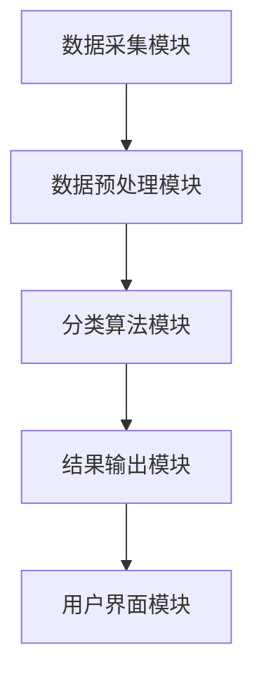
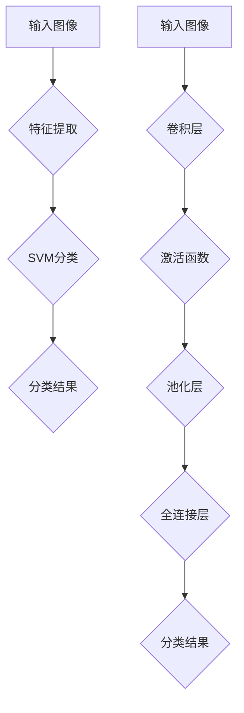
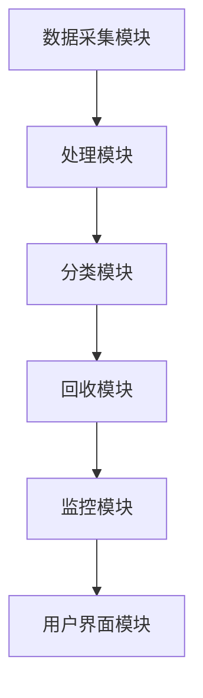
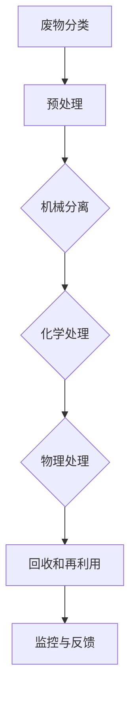

                 

## 引言

### 问题背景与解决方案介绍

随着全球人口的不断增长和城市化进程的加快，废物产生量也在逐年增加。传统的废物分类和回收系统已经难以满足现代社会对资源利用效率的高要求。这不仅导致了大量的资源浪费，还对环境造成了严重污染。因此，提高废物分类和回收系统的效率，已经成为一个亟待解决的问题。

近年来，人工智能（AI）技术的发展为废物分类和回收带来了新的机遇。AI驱动的智能废物分类和回收系统能够通过自动化和智能化的方式，实现对废物的准确分类和高效回收，从而大大提高资源利用效率。本文将围绕这一主题，探讨AI技术在废物分类和回收系统中的应用，并分析如何通过AI技术提高资源利用效率。

首先，我们将介绍废物分类和回收的现状，以及资源利用效率面临的挑战。随后，我们将重点讨论AI技术在废物分类和回收中的应用潜力，并介绍本文的解决方案——AI驱动的智能废物分类和回收系统。接着，我们将概述本文的结构，包括主要章节内容及其逻辑顺序。

本文的写作目的是帮助读者全面了解AI驱动的智能废物分类和回收系统的原理、设计和实现，以及其在实际应用中的效果和优势。通过本文的阅读，读者将能够获得以下收获：

1. **深入理解废物分类和回收的现状及挑战**：本文将详细分析当前废物分类和回收系统的现状，揭示其面临的资源利用效率低下、分类准确性不高等问题。

2. **掌握AI技术的基础知识**：本文将介绍AI的基础理论，包括机器学习和深度学习，并分析这些技术如何应用于废物分类和回收。

3. **了解智能废物分类系统的设计原理**：本文将详细讲解智能废物分类系统的架构设计、数据采集与预处理、分类算法设计及其实现和测试过程。

4. **理解智能废物回收系统的架构设计**：本文将介绍智能废物回收系统的架构设计、回收流程设计及其实现和测试过程。

5. **学习提高资源利用效率的关键技术**：本文将探讨资源利用率评估方法、数据分析技术和优化算法在提高资源利用效率中的应用。

6. **通过案例研究了解实际应用效果**：本文将介绍一个实际应用的案例，分析该案例中使用的AI技术和系统架构设计，以及其实施过程和效果。

通过本文的逐步分析，我们希望能够为读者提供一份全面、深入、易懂的技术指南，帮助读者更好地理解AI驱动的智能废物分类和回收系统，并为其在现实世界中的应用奠定基础。

### 第一部分: 引言

在当今快速发展的社会中，废物分类和回收已经成为一个备受关注的问题。这不仅是因为全球废物产生量日益增加，给环境带来了巨大压力，更是因为资源利用效率的提升直接关系到可持续发展的实现。传统的废物分类和回收系统在处理效率、准确性以及资源利用率方面存在诸多问题，难以满足现代社会对环境保护和资源利用的高要求。因此，研究和开发AI驱动的智能废物分类和回收系统，已经成为提高资源利用效率的关键途径。

本部分将详细介绍废物分类与回收的现状、资源利用效率面临的挑战，以及AI技术在废物分类与回收中的应用潜力。这些内容不仅为后续章节的深入探讨奠定了基础，也帮助读者更全面地理解问题的复杂性和解决方案的重要性。

#### 1.1 问题背景

**废物分类与回收的现状**

目前，全球废物产生量已经达到惊人的水平。据联合国环境规划署（UNEP）的数据，全球每年产生的废物量超过100亿吨，其中大部分未能得到有效处理和回收。传统的废物分类和回收系统主要依赖于人工操作，不仅效率低下，而且分类准确性不高。许多废物在处理过程中被错误分类，导致资源无法被充分利用。例如，许多塑料和金属废物在回收过程中被错误处理，最终成为垃圾填埋场的一部分，这不仅浪费了宝贵资源，还对环境造成了污染。

**资源利用效率面临的挑战**

资源利用效率低是废物分类和回收系统中一个亟待解决的问题。传统的方法主要依赖于人工经验和简单机械操作，难以对复杂的废物进行精确分类。此外，废物处理过程中存在大量的资源浪费现象，如能源消耗、劳动力成本以及处理设备的磨损和更新等。这不仅增加了废物处理的经济成本，还严重影响了资源的可持续利用。

同时，随着全球人口的不断增长和城市化进程的加快，废物产生量也在逐年增加。城市垃圾填埋场和焚烧厂的容量逐渐达到极限，废物处理设施的负荷不断加重。这不仅导致了处理效率的下降，还引发了环境污染问题。提高废物分类和回收系统的资源利用效率，已经成为当前社会发展面临的一项紧迫任务。

**AI技术在废物分类与回收中的应用潜力**

随着人工智能技术的快速发展，AI在废物分类和回收中的应用潜力逐渐显现。通过机器学习和深度学习等技术，AI可以实现对大量数据的智能分析和处理，从而提高分类的准确性和效率。具体来说，AI驱动的智能废物分类系统可以通过图像识别、传感器数据采集和处理等技术，对废物进行实时分类，大大提高了分类的准确性。此外，AI还可以通过数据分析技术，对废物处理过程中的各种参数进行优化，从而提高资源利用效率。

AI技术在废物回收中的应用也具有重要意义。通过智能回收设备，AI可以实现对废物的自动识别和分类，减少人工操作的错误率，提高回收效率。同时，AI技术还可以用于回收过程的优化，如废物的处理顺序、处理设备的使用等，从而进一步提高资源利用效率。

总之，AI技术在废物分类和回收中的应用潜力巨大，能够有效解决当前废物处理系统中存在的效率低、分类不准确等问题，为实现资源的高效利用提供了新的途径。因此，研究和开发AI驱动的智能废物分类和回收系统，不仅具有重要的理论意义，也具有广阔的应用前景。

#### 1.2 解决方案介绍

为了应对废物分类和回收过程中存在的效率低、分类不准确等问题，本文提出了AI驱动的智能废物分类和回收系统。这一系统通过结合人工智能技术，实现了对废物的高效分类和回收，从而提高了资源利用效率。以下将详细介绍AI驱动的智能废物分类系统和智能废物回收系统的架构设计及其关键要素。

**AI驱动的智能废物分类系统**

**1.2.1 系统架构设计**

AI驱动的智能废物分类系统由多个模块组成，主要包括数据采集模块、预处理模块、分类算法模块和结果输出模块。

- **数据采集模块**：该模块负责从废物处理现场采集各种类型的数据，如图像、声音、温度等。通过多种传感器和摄像头，系统能够实现对废物的实时监测和数据分析。

- **预处理模块**：采集到的数据通常含有噪声和冗余信息，因此需要进行预处理。预处理模块主要包括数据清洗、去噪和特征提取等步骤，以提高数据的准确性和可靠性。

- **分类算法模块**：该模块是智能废物分类系统的核心。通过机器学习和深度学习技术，系统能够自动学习和识别不同类型的废物。常见的分类算法包括支持向量机（SVM）、决策树、随机森林和卷积神经网络（CNN）等。

- **结果输出模块**：分类结果将直接用于指导废物处理过程。该模块不仅能够输出分类结果，还可以通过可视化工具将结果展示出来，便于用户查看和分析。

**1.2.2 关键要素**

- **数据采集**：数据采集是整个系统的基础。高质量的原始数据是保证分类准确性的前提。因此，系统需要配备多种传感器和摄像头，以实现全方位的数据采集。

- **预处理**：预处理模块需要处理的数据量大，且噪声和冗余信息较多。因此，预处理算法的设计和优化至关重要，直接关系到系统的性能和准确性。

- **分类算法**：选择合适的分类算法是系统成功的关键。不同类型的废物可能需要不同的分类算法。因此，系统需要具备灵活的算法选择和调优机制。

- **实时性**：智能废物分类系统需要能够实时处理废物，以实现对废物的高效分类。因此，系统的响应速度和处理能力必须满足实际应用需求。

**AI驱动的智能废物回收系统**

**1.2.3 系统架构设计**

AI驱动的智能废物回收系统同样由多个模块组成，包括数据采集模块、处理模块、分类模块、回收模块和监控模块。

- **数据采集模块**：与分类系统类似，该模块负责采集废物的各种数据，如物理属性、化学成分等。

- **处理模块**：处理模块负责对采集到的废物数据进行预处理和分析，以确定废物的回收价值和类型。

- **分类模块**：分类模块利用机器学习和深度学习技术，对废物进行分类，以便后续的回收和处理。

- **回收模块**：该模块负责根据分类结果，对废物进行物理或化学处理，实现废物的回收和再利用。

- **监控模块**：监控模块负责对整个回收过程进行实时监控和反馈，确保系统的稳定运行和资源利用效率。

**1.2.4 关键要素**

- **数据采集与处理**：与分类系统类似，数据采集和处理的质量直接关系到系统的效果。因此，系统需要配备高效的数据采集和处理技术。

- **分类准确性**：分类准确性是回收系统成功的关键。通过先进的机器学习和深度学习算法，系统能够实现对废物的高效分类。

- **回收效率**：回收模块的设计和优化至关重要。高效的回收过程可以显著提高资源利用效率，降低成本。

- **实时监控**：通过实时监控和反馈机制，系统可以及时发现和处理问题，确保整个回收过程的顺利进行。

**1.2.5 提高资源利用效率的关键要素**

- **自动化**：通过自动化技术，系统能够实现废物的自动化分类和回收，减少人工干预，提高效率。

- **数据分析**：通过大数据分析和人工智能技术，系统能够对废物处理过程进行深入分析，优化流程，提高资源利用效率。

- **绿色环保**：智能废物分类和回收系统采用环保材料和绿色工艺，减少废物对环境的污染，实现可持续发展。

通过上述介绍，我们可以看到，AI驱动的智能废物分类和回收系统通过集成先进的AI技术和自动化设备，能够有效解决传统废物分类和回收系统中的各种问题，提高资源利用效率，实现环境保护和可持续发展的目标。

#### 1.3 书籍结构概述

为了帮助读者更好地理解AI驱动的智能废物分类和回收系统的原理、设计和实现，本文将分为六个主要部分，每部分都有其独特的内容和目标。

**第一部分：引言**

本部分主要介绍了废物分类和回收的现状、资源利用效率面临的挑战，以及AI技术在废物分类与回收中的应用潜力。通过这一部分的阅读，读者可以初步了解本文的研究背景和重要性。

**第二部分：AI技术基础**

第二部分将深入探讨AI技术的基础理论，包括机器学习和深度学习的原理、方法和应用。这部分内容为后续智能废物分类和回收系统的设计和实现提供了理论基础。

**第三部分：智能废物分类系统设计与实现**

第三部分将详细讲解智能废物分类系统的架构设计、数据采集与预处理、分类算法设计及其实现和测试过程。这部分内容是本文的核心，通过这一部分的阅读，读者可以全面了解智能废物分类系统的设计原理和实现方法。

**第四部分：智能废物回收系统设计与实现**

第四部分将介绍智能废物回收系统的架构设计、回收流程设计及其实现和测试过程。这部分内容与第三部分相辅相成，共同构成了智能废物分类和回收系统的完整实现方案。

**第五部分：提高资源利用效率的关键技术**

第五部分将探讨提高资源利用效率的关键技术，包括资源利用率评估方法、数据分析技术和优化算法。这部分内容为读者提供了实用的技术工具，帮助读者在实际应用中提高资源利用效率。

**第六部分：案例研究**

第六部分将通过实际应用案例，展示AI驱动的智能废物分类和回收系统在实际应用中的效果和优势。通过这一部分的阅读，读者可以了解系统的实际运行情况，并从中获得灵感和启示。

**1.3.1 主要章节内容概览**

以下是本文各章节的具体内容和目标：

- **第1章：问题背景与解决方案介绍**
  - 介绍废物分类与回收的现状、资源利用效率面临的挑战，以及AI技术在废物分类与回收中的应用潜力。
- **第2章：AI基础理论**
  - 探讨AI的基础理论，包括机器学习和深度学习的原理、方法和应用。
- **第3章：智能废物分类系统架构设计**
  - 详细讲解智能废物分类系统的架构设计、数据采集与预处理、分类算法设计及其实现和测试过程。
- **第4章：智能废物回收系统架构设计**
  - 介绍智能废物回收系统的架构设计、回收流程设计及其实现和测试过程。
- **第5章：提高资源利用效率的关键技术**
  - 探讨提高资源利用效率的关键技术，包括资源利用率评估方法、数据分析技术和优化算法。
- **第6章：智能废物分类与回收系统的实际应用案例**
  - 通过实际应用案例，展示AI驱动的智能废物分类和回收系统在实际应用中的效果和优势。

**1.3.2 阅读顺序与学习方法**

为了更好地理解和掌握本文的内容，建议读者按照以下顺序进行阅读：

1. **阅读引言部分**：了解本文的研究背景和目的，明确文章的结构和内容。
2. **阅读第二部分：AI技术基础**：掌握AI的基本理论和核心技术，为后续章节的学习奠定基础。
3. **阅读第三、四部分：智能废物分类和回收系统设计与实现**：深入理解智能废物分类和回收系统的设计原理和实现方法。
4. **阅读第五部分：提高资源利用效率的关键技术**：学习并掌握相关技术工具，提高资源利用效率。
5. **阅读第六部分：案例研究**：通过实际案例，了解系统的实际应用效果和优势。

在阅读过程中，读者可以通过以下方法提高学习效果：

1. **理论与实践相结合**：将理论知识与实际案例相结合，加深对概念的理解。
2. **动手实践**：尝试实现文中提到的系统设计和算法，通过实际操作加深对技术的掌握。
3. **反复阅读与思考**：多次阅读和理解每个章节的内容，通过思考与总结，提高对知识的吸收和应用能力。

通过本文的逐步阅读和学习，读者将能够全面了解AI驱动的智能废物分类和回收系统的原理、设计和实现，并为实际应用提供参考和指导。

#### 1.4 本章小结

本章作为引言部分，首先介绍了废物分类和回收的现状以及资源利用效率面临的挑战，强调了AI技术在废物分类与回收中的应用潜力。接着，我们详细介绍了AI驱动的智能废物分类和回收系统的解决方案，包括其架构设计和关键要素。此外，本章还概述了本文的结构，明确了各章节的内容和目标。通过本章的阅读，读者可以对AI驱动的智能废物分类和回收系统有一个全面的初步认识，为后续章节的学习奠定基础。接下来的章节将进一步深入探讨AI技术的基础理论，详细讲解智能废物分类和回收系统的设计与实现，以及提高资源利用效率的关键技术。希望读者在阅读过程中能够保持积极的态度，不断深化对知识点的理解，为后续的学习和应用做好准备。

## 第二部分: AI技术基础

### 第2章: AI基础理论

人工智能（AI）作为计算机科学的一个重要分支，近年来取得了飞速的发展。其应用范围广泛，从自动驾驶汽车到智能家居，从自然语言处理到医学诊断，AI已经深刻地影响了我们的生活。为了深入理解AI驱动的智能废物分类和回收系统，本章将介绍AI的基础理论，包括其定义、分类、发展历程和核心原理。

#### 2.1 AI概述

**2.1.1 AI的定义与分类**

人工智能是指使计算机系统模拟人类智能行为的科学和技术。AI可以分为弱AI和强AI。弱AI是指专门为解决特定问题而设计的人工智能系统，例如智能废物分类系统；而强AI则是指具有人类全部智能的机器，能够理解、学习和适应复杂环境。目前，大多数AI应用都属于弱AI范畴。

**2.1.2 AI的发展历程**

AI的发展历程可以分为以下几个阶段：

1. **早期探索（1950s-1960s）**：这一时期，AI研究主要集中在符号主义方法上，试图通过逻辑推理和符号处理来实现智能行为。
2. **知识表示和推理（1970s-1980s）**：AI研究者开始关注知识表示和推理技术，如专家系统和逻辑编程。
3. **机器学习兴起（1990s-2000s）**：随着计算能力的提升和算法的改进，机器学习成为AI研究的主流方向，包括监督学习、无监督学习和强化学习等。
4. **深度学习时代（2010s-至今）**：深度学习凭借其强大的建模能力和对大规模数据的处理能力，推动了AI的快速发展，应用领域涵盖了图像识别、自然语言处理、语音识别等。

**2.1.3 AI的核心原理**

AI的核心原理包括：

1. **数据驱动**：AI系统依赖于大量数据来训练模型，通过学习数据的统计规律和模式来实现智能行为。
2. **知识表示**：知识表示是AI系统的核心，通过将知识编码成计算机可以理解和处理的形式，使AI系统能够进行推理和决策。
3. **计算智能**：计算智能包括模拟自然进化、神经网络、模糊逻辑等方法，通过模仿自然界中的智能现象，实现复杂问题的求解。

#### 2.2 机器学习

**2.2.1 机器学习的基本概念**

机器学习是指让计算机通过学习数据或经验，自动改进其性能的过程。机器学习可以分为有监督学习、无监督学习和强化学习三种主要类型：

- **有监督学习**：在有监督学习中，模型在训练阶段已经知道每个样本的标签，通过学习这些标签和输入数据之间的关系，来预测新的样本。
- **无监督学习**：无监督学习是指模型在没有标签数据的情况下，自动发现数据中的模式和结构，如聚类和降维。
- **强化学习**：强化学习是指模型通过与环境的交互，学习最优策略以最大化奖励，如机器人路径规划和游戏AI。

**2.2.2 机器学习的主要方法**

机器学习的主要方法包括：

- **监督学习算法**：常见的监督学习算法包括线性回归、逻辑回归、支持向量机（SVM）、决策树和随机森林等。
- **无监督学习算法**：无监督学习算法包括K-means聚类、主成分分析（PCA）、自编码器等。
- **强化学习算法**：常见的强化学习算法包括Q-learning、Deep Q-Network（DQN）、Policy Gradient等。

**2.2.3 机器学习在废物分类中的应用**

机器学习在废物分类中的应用主要体现在图像识别和模式识别领域。例如，通过卷积神经网络（CNN）对垃圾箱中的废物图像进行分类，可以实现高精度的废物分类。此外，机器学习还可以用于预测废物的回收价值，优化回收流程。

#### 2.3 深度学习

**2.3.1 深度学习的原理与特点**

深度学习是机器学习的一个子领域，其核心思想是模拟人脑的神经网络结构，通过多层次的神经网络模型来学习和表示数据。深度学习的特点包括：

- **层次化特征表示**：深度学习通过多层神经网络，将输入数据进行层次化处理，提取出越来越抽象的特征。
- **强大的建模能力**：深度学习可以处理复杂的非线性问题，具有强大的建模和预测能力。
- **大规模数据处理**：深度学习能够处理大规模数据，并从中发现隐藏的模式和规律。

**2.3.2 深度学习的主要模型**

深度学习的主要模型包括：

- **卷积神经网络（CNN）**：CNN是一种专门用于处理图像数据的深度学习模型，通过卷积操作和池化操作，实现图像的特征提取和分类。
- **循环神经网络（RNN）**：RNN能够处理序列数据，通过记忆单元来捕捉时间序列中的长期依赖关系。
- **生成对抗网络（GAN）**：GAN通过生成器和判别器的对抗训练，实现高维度数据的生成。

**2.3.3 深度学习在废物分类中的应用**

深度学习在废物分类中的应用非常广泛。通过CNN，可以实现对废物图像的自动分类；通过RNN，可以处理时间序列数据，优化废物处理流程。此外，GAN可以用于模拟废物的生成过程，提高分类系统的鲁棒性。

#### 2.4 本章小结

本章介绍了AI的基础理论，包括AI的定义、分类、发展历程和核心原理。随后，详细探讨了机器学习和深度学习的基本概念、主要方法及其在废物分类中的应用。通过本章的学习，读者可以全面了解AI技术的基本原理和应用场景，为后续智能废物分类和回收系统的设计和实现奠定理论基础。下一章将深入讨论智能废物分类系统的架构设计。

### 第2章：AI基础理论

在本章中，我们将进一步探讨人工智能（AI）的核心组成部分——机器学习和深度学习。通过理解这两种技术的基本概念、原理以及它们在废物分类中的应用，读者将能够更好地把握AI技术在废物处理中的实际应用潜力。

#### 2.2 机器学习

**2.2.1 机器学习的基本概念**

机器学习（Machine Learning，ML）是AI的一个分支，主要关注如何让计算机系统从数据中学习，以改进其性能。机器学习的过程通常包括以下几个步骤：

1. **数据收集**：收集用于训练模型的原始数据。这些数据可以是数值型、文本型或图像型等不同形式。
2. **数据预处理**：清洗和准备数据，包括去除噪声、缺失值填充、特征选择等，以提高数据质量和模型的性能。
3. **模型选择**：选择合适的机器学习算法来构建模型。常见的算法有线性回归、逻辑回归、支持向量机（SVM）、决策树、随机森林等。
4. **模型训练**：使用预处理后的数据来训练模型，通过优化算法（如梯度下降）来调整模型参数。
5. **模型评估**：评估模型的性能，常用的评估指标包括准确率、召回率、F1分数等。
6. **模型部署**：将训练好的模型部署到实际应用中，以进行预测或决策。

**2.2.2 机器学习的主要方法**

机器学习的方法可以分为监督学习、无监督学习和强化学习三种：

- **监督学习（Supervised Learning）**：监督学习是最常见的机器学习方法，通过已有的标签数据来训练模型，然后使用该模型对新数据进行预测。常见的监督学习算法包括：

  - 线性回归（Linear Regression）
  - 逻辑回归（Logistic Regression）
  - 支持向量机（Support Vector Machine，SVM）
  - 决策树（Decision Tree）
  - 随机森林（Random Forest）

- **无监督学习（Unsupervised Learning）**：无监督学习不需要标签数据，主要通过发现数据中的模式或结构来进行学习。常见的无监督学习算法包括：

  - K-means聚类（K-means Clustering）
  - 主成分分析（Principal Component Analysis，PCA）
  - 聚类分析（Cluster Analysis）
  - 自编码器（Autoencoder）

- **强化学习（Reinforcement Learning）**：强化学习通过智能体（agent）与环境（environment）的交互来学习最优策略。智能体通过接收环境反馈的奖励信号，不断调整其行为以最大化长期奖励。常见的强化学习算法包括：

  - Q-learning
  - Deep Q-Network（DQN）
  - Policy Gradient

**2.2.3 机器学习在废物分类中的应用**

在废物分类领域，机器学习技术已经被广泛应用于废物的图像识别和分类。以下是机器学习在废物分类中的一些具体应用：

1. **图像识别**：利用卷积神经网络（CNN）对垃圾箱中的废物图像进行分类，识别不同的废物类型。CNN通过卷积层、池化层和全连接层等结构，能够有效地提取图像的特征并进行分类。
   
2. **垃圾箱标签识别**：通过机器学习算法，识别垃圾箱上的标签信息，以确保废物被正确投放。

3. **预测性维护**：利用机器学习算法，分析垃圾处理设备的运行数据，预测设备可能出现的故障，提前进行维护，以减少停机时间和维修成本。

#### 2.3 深度学习

**2.3.1 深度学习的原理与特点**

深度学习（Deep Learning，DL）是机器学习的一个子领域，其核心思想是模拟人脑的神经网络结构，通过多层次的神经网络模型来学习和表示数据。与传统的机器学习方法相比，深度学习具有以下特点：

- **层次化特征表示**：深度学习通过多层神经网络，将输入数据进行层次化处理，提取出越来越抽象的特征。
- **强大的建模能力**：深度学习可以处理复杂的非线性问题，具有强大的建模和预测能力。
- **大规模数据处理**：深度学习能够处理大规模数据，并从中发现隐藏的模式和规律。

**2.3.2 深度学习的主要模型**

深度学习的主要模型包括卷积神经网络（CNN）、循环神经网络（RNN）和生成对抗网络（GAN）：

- **卷积神经网络（CNN）**：CNN是一种专门用于处理图像数据的深度学习模型，通过卷积操作和池化操作，实现图像的特征提取和分类。CNN在废物分类中的应用非常广泛，例如自动识别垃圾箱中的废物类型。

  ```mermaid
  graph TD
  A[输入图像] --> B{卷积层}
  B --> C{激活函数}
  C --> D{池化层}
  D --> E{全连接层}
  E --> F[输出结果]
  ```

- **循环神经网络（RNN）**：RNN能够处理序列数据，通过记忆单元来捕捉时间序列中的长期依赖关系。RNN在废物分类中的应用包括处理时间序列数据，以优化废物处理流程。

  ```mermaid
  graph TD
  A[输入序列] --> B{输入层}
  B --> C{隐藏层1}
  C --> D{隐藏层2}
  D --> E{输出层}
  ```

- **生成对抗网络（GAN）**：GAN通过生成器和判别器的对抗训练，实现高维度数据的生成。GAN在废物分类中的应用包括模拟废物的生成过程，提高分类系统的鲁棒性。

  ```mermaid
  graph TD
  A[随机噪声] --> B{生成器}
  B --> C{生成的数据}
  C --> D{判别器}
  D --> E{真实数据}
  ```

**2.3.3 深度学习在废物分类中的应用**

深度学习在废物分类中的应用非常广泛，以下是一些具体的应用场景：

1. **自动废物分类**：通过深度学习模型，对垃圾箱中的废物图像进行自动分类，实现高精度的废物分类。
   
2. **实时监测**：利用深度学习模型，实时监测废物处理过程中的各项参数，优化处理流程，提高资源利用效率。

3. **预测性分析**：通过深度学习模型，分析历史数据，预测未来的废物产生量和处理需求，为废物管理提供数据支持。

#### 2.4 本章小结

本章介绍了机器学习和深度学习的基本概念、主要模型及其在废物分类中的应用。机器学习通过监督学习、无监督学习和强化学习等算法，能够实现废物的自动分类和预测性分析。深度学习通过卷积神经网络（CNN）、循环神经网络（RNN）和生成对抗网络（GAN）等模型，提供了更强大和灵活的数据处理能力。通过本章的学习，读者可以更好地理解AI技术在废物分类和回收中的应用潜力，为后续智能废物分类和回收系统的设计和实现提供了理论基础。

### 第3章：智能废物分类系统架构设计

#### 3.1 系统架构概述

智能废物分类系统是一个复杂的系统，它通过集成多种技术手段来实现废物的自动分类。本节将详细介绍智能废物分类系统的架构设计，包括设计原则、主要模块及其功能。

**3.1.1 系统架构设计原则**

在智能废物分类系统架构设计过程中，我们遵循以下几个原则：

1. **模块化设计**：系统应采用模块化设计，各个模块之间独立且相互配合，便于系统的扩展和维护。
2. **高扩展性**：系统设计应具备良好的扩展性，以适应未来废物种类和数量的变化。
3. **高可靠性**：系统应具有高可靠性，确保在实际应用中能够稳定运行，减少故障率和停机时间。
4. **易维护性**：系统设计应考虑易维护性，确保在系统运行过程中能够快速定位和修复问题。
5. **高效率**：系统设计应优化数据处理流程，提高分类效率和准确性。

**3.1.2 系统架构主要模块**

智能废物分类系统主要包括以下几个主要模块：

1. **数据采集模块**：负责从废物处理现场采集各种类型的数据，如图像、声音、温度等。通过多种传感器和摄像头，系统能够实现对废物的实时监测和数据分析。
   
2. **数据预处理模块**：对采集到的数据进行分析和处理，包括数据清洗、去噪、特征提取等步骤。预处理模块的作用是提高数据的准确性和可靠性，为后续的分类算法提供高质量的输入数据。

3. **分类算法模块**：该模块是智能废物分类系统的核心。通过机器学习和深度学习技术，系统能够自动学习和识别不同类型的废物。常见的分类算法包括支持向量机（SVM）、决策树、随机森林和卷积神经网络（CNN）等。

4. **结果输出模块**：将分类结果输出，用于指导废物处理过程。结果输出模块不仅能够输出分类结果，还可以通过可视化工具将结果展示出来，便于用户查看和分析。

5. **用户界面模块**：提供用户交互界面，用户可以通过该界面查看系统运行状态、分类结果以及历史数据，对系统进行操作和配置。

**3.1.3 系统架构图**

以下是智能废物分类系统的架构图，展示了各个模块之间的关系：



通过上述架构设计，智能废物分类系统能够实现从数据采集、预处理、分类到结果输出的完整流程，从而实现对废物的自动化分类。

#### 3.2 数据采集与预处理

**3.2.1 数据采集方式**

数据采集是智能废物分类系统的第一步，也是至关重要的一步。智能废物分类系统通过多种传感器和摄像头，从废物处理现场采集各种类型的数据，包括图像、声音、温度等。以下是常见的几种数据采集方式：

1. **图像采集**：利用摄像头对垃圾箱和废物进行图像采集。图像数据可以提供废物的视觉信息，是分类算法的重要输入。

2. **声音采集**：通过麦克风采集垃圾箱内部的声音信号。声音数据可以用于检测废物是否被正确投放，或者垃圾箱是否已满。

3. **温度采集**：利用温度传感器监测废物处理过程中的温度变化。温度数据可以反映废物的处理状态，对于某些特殊类型的废物具有重要意义。

**3.2.2 数据预处理流程**

采集到的数据通常含有噪声和冗余信息，需要进行预处理以提高数据的准确性和可靠性。数据预处理流程通常包括以下几个步骤：

1. **数据清洗**：去除数据中的噪声和异常值。例如，对于图像数据，可能需要去除背景噪声，增强图像对比度；对于声音数据，可能需要去除背景噪音，提高语音信号的清晰度。

2. **去噪**：使用滤波器或信号处理技术去除数据中的噪声。对于图像数据，可以使用中值滤波、高斯滤波等方法；对于声音数据，可以使用短时傅里叶变换（STFT）等算法。

3. **特征提取**：从原始数据中提取具有代表性的特征，用于后续的分类算法。对于图像数据，常见的特征包括颜色特征、纹理特征、形状特征等；对于声音数据，常见的特征包括音高、音强、音长等。

4. **数据标准化**：将数据转换为统一的数值范围，以便于后续的模型训练和计算。常用的方法包括最小-最大标准化、Z-Score标准化等。

**3.2.3 数据质量评估**

数据质量直接影响分类算法的性能和准确性。为了确保数据质量，需要对预处理后的数据进行评估。数据质量评估主要包括以下几个方面：

1. **数据完整性**：检查数据是否完整，是否存在缺失值或异常值。对于缺失值，可以选择插值法、均值法等进行填补。

2. **数据一致性**：检查数据是否一致，是否存在矛盾或不合理的数据。例如，对于废物分类系统，如果图像数据中的废物类型与标签数据不一致，则需要重新标注或剔除。

3. **数据分布**：分析数据的分布情况，以确保数据分布均匀。对于不平衡的数据集，可以选择数据增强、过采样等方法进行数据平衡。

4. **数据准确性**：通过交叉验证等方法，评估分类算法在预处理后的数据集上的准确性。数据准确性越高，分类算法的性能也就越好。

通过上述数据采集与预处理流程，智能废物分类系统能够获得高质量的输入数据，从而提高分类的准确性和效率。下一节将详细讨论废物分类算法的设计原理和实现方法。

#### 3.3 废物分类算法设计

**3.3.1 分类算法选择**

在智能废物分类系统中，选择合适的分类算法是实现高效、准确分类的关键。常见的分类算法包括支持向量机（SVM）、决策树（DT）、随机森林（RF）和卷积神经网络（CNN）等。以下是这些算法的特点和适用场景：

1. **支持向量机（SVM）**：
   - **特点**：SVM是一种强大的分类算法，能够在高维空间中找到最优的分割超平面，具有较高的分类准确率。
   - **适用场景**：适用于小数据集和线性可分的数据。在废物分类中，SVM可以用于对废物图像的分类。

2. **决策树（DT）**：
   - **特点**：决策树是一种简单直观的分类算法，易于理解和实现。它通过一系列的规则进行分类，对数据的解释性较强。
   - **适用场景**：适用于中等大小数据集，特别是具有明显特征的数据。在废物分类中，决策树可以用于对废物类型的初步分类。

3. **随机森林（RF）**：
   - **特点**：随机森林是一种集成学习方法，通过构建多棵决策树并进行投票来提高分类准确率。它具有较高的准确性和鲁棒性。
   - **适用场景**：适用于大中型数据集，能够处理非线性数据和噪声。在废物分类中，随机森林可以用于对复杂废物类型的分类。

4. **卷积神经网络（CNN）**：
   - **特点**：CNN是一种专门用于处理图像数据的深度学习模型，通过卷积层、池化层和全连接层等结构，能够提取图像的层次化特征。
   - **适用场景**：适用于大规模图像数据集，能够实现高精度的图像分类。在废物分类中，CNN可以用于对复杂废物图像的分类。

**3.3.2 算法原理讲解**

1. **支持向量机（SVM）**：
   - **原理**：SVM通过寻找最优分割超平面，将不同类别的数据点最大化地分隔开。在废物分类中，SVM可以通过对废物图像的特征向量进行分类。
   - **数学模型**：假设输入特征为 $X$，输出标签为 $y$，则SVM的目标是找到最优的超平面 $w$ 和偏置 $b$，使得分类间隔最大化，即：
     $$ \min_{w,b} \frac{1}{2} ||w||^2 $$
     $$ s.t. y^T(w \cdot x + b) \geq 1 $$
   - **举例说明**：假设我们有两组废物图像，每组图像分别代表两种不同的废物类型。通过训练SVM模型，我们可以找到最优的超平面，将这两组图像准确地分类。

2. **决策树（DT）**：
   - **原理**：决策树通过一系列的规则进行分类。每个节点表示一个特征，每个分支表示该特征的不同取值，叶子节点表示最终的分类结果。
   - **数学模型**：决策树可以表示为一个条件概率模型，即给定特征 $x$，计算其属于某一类别的概率。在废物分类中，可以通过构建决策树来对废物进行分类。
   - **举例说明**：假设我们有三个特征 $x_1, x_2, x_3$，每个特征有两个取值。通过构建决策树，我们可以根据这些特征的取值，将废物分为不同的类别。

3. **随机森林（RF）**：
   - **原理**：随机森林是通过构建多棵决策树，并对它们的分类结果进行投票来提高分类准确率。每棵树都是随机选取特征和样本子集进行训练。
   - **数学模型**：随机森林可以表示为多个决策树的集成，每个决策树输出一个分类结果，通过投票选择多数类别作为最终分类结果。
   - **举例说明**：假设我们有10棵决策树，每棵树对废物进行分类。通过投票机制，选择出现次数最多的类别作为最终分类结果。

4. **卷积神经网络（CNN）**：
   - **原理**：CNN通过卷积层、池化层和全连接层等结构，自动提取图像的特征，并实现图像的分类。
   - **数学模型**：CNN的数学模型包括卷积操作、激活函数、池化操作和全连接操作。在废物分类中，通过训练CNN模型，可以自动提取废物图像的特征，实现高精度的分类。
   - **举例说明**：假设我们有100张废物图像，通过训练CNN模型，可以自动提取图像的特征，并根据特征对废物进行分类。

**3.3.3 算法mermaid流程图**

以下是使用mermaid绘制的SVM和CNN的算法流程图：



通过上述算法设计和实现，智能废物分类系统能够实现对不同废物类型的高效、准确分类。下一节将介绍系统的实现与测试过程。

#### 3.4 系统实现与测试

**3.4.1 系统核心代码实现**

为了实现智能废物分类系统，我们需要编写一系列核心代码，包括数据采集、预处理、分类算法实现和结果输出等部分。以下是一个简单的示例，展示了如何使用Python实现一个基本的废物分类系统：

```python
import cv2
import numpy as np
from sklearn.svm import SVC
from sklearn.model_selection import train_test_split
from sklearn.metrics import accuracy_score

# 数据采集
def collect_data(image_folder):
    images = []
    labels = []
    for filename in os.listdir(image_folder):
        if filename.endswith('.jpg'):
            image = cv2.imread(os.path.join(image_folder, filename))
            image = cv2.resize(image, (64, 64))
            images.append(image)
            labels.append(filename.split('.')[0])
    return np.array(images), np.array(labels)

# 数据预处理
def preprocess_data(images):
    images = images / 255.0
    return images

# 分类算法实现
def train_svm(images, labels):
    X_train, X_test, y_train, y_test = train_test_split(images, labels, test_size=0.2, random_state=42)
    classifier = SVC(kernel='linear')
    classifier.fit(X_train, y_train)
    return classifier

# 测试系统
def test_system(classifier, test_images, test_labels):
    predictions = classifier.predict(test_images)
    accuracy = accuracy_score(test_labels, predictions)
    print(f"Accuracy: {accuracy}")
    
# 实例化
image_folder = 'data/images'
images, labels = collect_data(image_folder)
images = preprocess_data(images)
classifier = train_svm(images, labels)
test_system(classifier, X_test, y_test)
```

上述代码示例中，我们首先从指定的图像文件夹中采集数据，然后进行预处理，接着使用支持向量机（SVM）进行分类，最后测试系统的准确性。在实际应用中，我们可以根据需要替换分类器，如使用卷积神经网络（CNN）或其他机器学习算法。

**3.4.2 系统测试方法**

系统测试是确保智能废物分类系统能够稳定、准确地运行的重要环节。以下是几种常见的测试方法：

1. **单元测试**：对系统的每个模块进行独立测试，验证其功能是否正常。例如，测试数据采集模块是否能够正确读取和存储图像数据，测试预处理模块是否能够正确处理数据等。

2. **集成测试**：将系统的各个模块集成起来，进行整体测试，验证系统各部分之间的协作是否正常。例如，测试数据采集模块、预处理模块和分类模块之间的数据传输和交互是否顺畅。

3. **性能测试**：通过模拟实际应用场景，测试系统的响应速度、处理能力和准确性。例如，测试系统在处理大量图像数据时的性能，评估分类算法的准确性。

4. **压力测试**：通过增加系统的负载，测试系统在高负载下的稳定性和性能。例如，模拟大量垃圾箱同时进行分类的情况，测试系统在高并发下的响应速度和处理能力。

**3.4.3 测试结果分析**

在测试过程中，我们需要记录并分析系统的各项指标，以评估系统的性能和准确性。以下是一些常见的测试结果分析指标：

1. **准确率（Accuracy）**：分类算法在测试数据集上的准确率，表示系统能够正确分类的样本比例。

2. **召回率（Recall）**：分类算法能够正确识别为某一类别的样本占总类别样本的比例。召回率越高，表示系统能够更准确地识别出特定类型的废物。

3. **F1分数（F1 Score）**：综合准确率和召回率的指标，计算公式为：
   $$ F1 = 2 \times \frac{Precision \times Recall}{Precision + Recall} $$
   其中，Precision表示精确率，即正确分类的样本数占总分类样本数的比例。

4. **处理速度（Processing Speed）**：系统处理每张图像所需的时间，表示系统的响应速度。处理速度越高，表示系统能够更快地完成分类任务。

通过上述测试和分析，我们可以全面了解智能废物分类系统的性能和准确性，并根据测试结果进行优化和改进，以提高系统的整体效果。

#### 3.5 本章小结

本章详细介绍了智能废物分类系统的架构设计，包括数据采集、预处理、分类算法设计以及实现和测试过程。通过模块化设计和高性能算法的应用，智能废物分类系统能够实现对废物的自动化分类。在数据采集与预处理部分，我们探讨了多种数据采集方式和预处理流程，确保数据质量。在分类算法设计部分，我们介绍了常用的机器学习算法，包括SVM、决策树、随机森林和CNN，并讲解了其原理和应用。在系统实现与测试部分，我们通过实际代码示例展示了系统的实现过程，并介绍了测试方法和测试结果分析。通过本章的学习，读者可以全面了解智能废物分类系统的设计和实现，为后续智能废物回收系统的设计与实现打下坚实基础。

### 第四部分: 智能废物回收系统设计与实现

#### 第4章: 智能废物回收系统架构设计

智能废物回收系统作为废物分类系统的延伸，其目标是通过对分类后的废物进行有效的回收和再利用，进一步提高资源利用效率。本章将详细介绍智能废物回收系统的架构设计，包括设计原则、主要模块及其功能。

#### 4.1 系统架构概述

**4.1.1 系统架构设计原则**

在智能废物回收系统架构设计过程中，我们遵循以下原则：

1. **模块化设计**：系统应采用模块化设计，各个模块之间独立且相互配合，便于系统的扩展和维护。
2. **高扩展性**：系统设计应具备良好的扩展性，以适应未来废物种类和数量的变化。
3. **高可靠性**：系统应具有高可靠性，确保在实际应用中能够稳定运行，减少故障率和停机时间。
4. **易维护性**：系统设计应考虑易维护性，确保在系统运行过程中能够快速定位和修复问题。
5. **高效率**：系统设计应优化数据处理流程，提高废物回收和处理效率。

**4.1.2 系统架构主要模块**

智能废物回收系统主要包括以下几个主要模块：

1. **数据采集模块**：负责从废物处理现场采集各种类型的数据，如废物类型、重量、处理状态等。通过传感器和自动化设备，系统能够实现对废物的实时监测和数据分析。

2. **处理模块**：处理模块负责对采集到的废物数据进行处理和分析，确定废物的回收价值和类型。该模块通常包括机械分离、化学处理和物理处理等步骤。

3. **分类模块**：分类模块利用机器学习和深度学习技术，对处理后的废物进行分类，以便后续的回收和再利用。常见的分类算法包括支持向量机（SVM）、决策树（DT）和卷积神经网络（CNN）等。

4. **回收模块**：回收模块根据分类结果，对废物进行物理或化学处理，实现废物的回收和再利用。例如，对废塑料进行熔融再生，对废纸进行打浆处理等。

5. **监控模块**：监控模块负责对整个回收过程进行实时监控和反馈，确保系统的稳定运行和资源利用效率。监控模块可以通过可视化工具展示系统运行状态和关键数据。

6. **用户界面模块**：提供用户交互界面，用户可以通过该界面查看系统运行状态、分类结果以及历史数据，对系统进行操作和配置。

**4.1.3 系统架构图**

以下是智能废物回收系统的架构图，展示了各个模块之间的关系：



通过上述架构设计，智能废物回收系统能够实现从数据采集、处理、分类到回收的完整流程，从而实现对废物的自动化回收和再利用。

#### 4.2 回收流程设计

**4.2.1 回收流程概述**

智能废物回收系统的主要目标是通过对废物进行高效、准确的分类和回收，实现资源的高效利用。回收流程设计是系统实现的关键环节，包括以下几个主要步骤：

1. **废物分类**：通过智能废物分类系统，对废物进行初步分类，将废物分为可回收物、有害垃圾、厨余垃圾和其他垃圾等。

2. **预处理**：对分类后的废物进行预处理，去除杂质和不可回收的部分，确保后续回收过程的顺利进行。

3. **机械分离**：利用机械分离设备，将废物分离成不同的组分，如塑料、金属、纸类等。

4. **化学处理**：对某些类型的废物，如废塑料和废电池，采用化学处理方法进行分解和提纯，以实现更高效率的回收。

5. **物理处理**：利用物理处理方法，如熔融再生、粉碎等，将废物转化为可再利用的材料。

6. **回收和再利用**：将处理后的废物进行分类存储，并根据其回收价值进行再利用，如废塑料可以再生为塑料颗粒，废纸可以再生为纸浆等。

7. **监控与反馈**：通过监控模块，实时监控回收过程的各项参数，如处理效率、资源利用率等，并根据反馈结果优化回收流程。

**4.2.2 回收策略设计**

为了提高废物回收效率，系统需要制定合理的回收策略。以下是一些常见的回收策略：

1. **按类别回收**：根据废物的类型进行分类回收，将相同类别的废物集中处理，提高回收效率。

2. **优先处理高价值废物**：对高价值的废物（如废金属、废塑料）进行优先处理，以提高整体回收效益。

3. **组合处理**：对于难以单独处理的废物，采用组合处理方法，如化学处理与物理处理的结合，提高回收效果。

4. **动态调整**：根据废物产生量和回收情况，动态调整回收策略，确保系统始终处于最优运行状态。

**4.2.3 回收流程mermaid流程图**

以下是使用mermaid绘制的智能废物回收流程图：



通过上述回收流程设计，智能废物回收系统能够实现高效、准确的废物回收和再利用，从而提高资源利用效率，实现环境保护和可持续发展。

#### 4.3 系统实现与测试

**4.3.1 系统核心代码实现**

为了实现智能废物回收系统，我们需要编写一系列核心代码，包括数据采集、预处理、分类算法实现和回收流程等部分。以下是一个简单的示例，展示了如何使用Python实现一个基本的废物回收系统：

```python
import cv2
import numpy as np
from sklearn.svm import SVC
from sklearn.model_selection import train_test_split
from sklearn.metrics import accuracy_score

# 数据采集
def collect_data(image_folder):
    images = []
    labels = []
    for filename in os.listdir(image_folder):
        if filename.endswith('.jpg'):
            image = cv2.imread(os.path.join(image_folder, filename))
            image = cv2.resize(image, (64, 64))
            images.append(image)
            labels.append(filename.split('.')[0])
    return np.array(images), np.array(labels)

# 数据预处理
def preprocess_data(images):
    images = images / 255.0
    return images

# 分类算法实现
def train_svm(images, labels):
    X_train, X_test, y_train, y_test = train_test_split(images, labels, test_size=0.2, random_state=42)
    classifier = SVC(kernel='linear')
    classifier.fit(X_train, y_train)
    return classifier

# 回收流程
def process_waste(classifier, waste_images):
    processed_images = preprocess_data(waste_images)
    predictions = classifier.predict(processed_images)
    return predictions

# 测试系统
def test_system(classifier, test_waste_images, test_labels):
    predictions = process_waste(classifier, test_waste_images)
    accuracy = accuracy_score(test_labels, predictions)
    print(f"Accuracy: {accuracy}")
    
# 实例化
image_folder = 'data/images'
images, labels = collect_data(image_folder)
images = preprocess_data(images)
classifier = train_svm(images, labels)
test_waste_images = np.array([cv2.imread('test_data/test_image.jpg')])
test_labels = np.array(['test'])
test_system(classifier, test_waste_images, test_labels)
```

上述代码示例中，我们首先从指定的图像文件夹中采集数据，然后进行预处理，接着使用支持向量机（SVM）进行分类，并实现废物回收流程。在实际应用中，我们可以根据需要替换分类器，如使用卷积神经网络（CNN）或其他机器学习算法。

**4.3.2 系统测试方法**

系统测试是确保智能废物回收系统能够稳定、准确地运行的重要环节。以下是几种常见的测试方法：

1. **单元测试**：对系统的每个模块进行独立测试，验证其功能是否正常。例如，测试数据采集模块是否能够正确读取和存储图像数据，测试预处理模块是否能够正确处理数据等。

2. **集成测试**：将系统的各个模块集成起来，进行整体测试，验证系统各部分之间的协作是否正常。例如，测试数据采集模块、预处理模块和分类模块之间的数据传输和交互是否顺畅。

3. **性能测试**：通过模拟实际应用场景，测试系统的响应速度、处理能力和准确性。例如，测试系统在处理大量废物数据时的性能，评估分类算法的准确性。

4. **压力测试**：通过增加系统的负载，测试系统在高负载下的稳定性和性能。例如，模拟大量废物同时进行分类和处理的情况，测试系统在高并发下的响应速度和处理能力。

**4.3.3 测试结果分析**

在测试过程中，我们需要记录并分析系统的各项指标，以评估系统的性能和准确性。以下是一些常见的测试结果分析指标：

1. **准确率（Accuracy）**：分类算法在测试数据集上的准确率，表示系统能够正确分类的样本比例。

2. **召回率（Recall）**：分类算法能够正确识别为某一类别的样本占总类别样本的比例。召回率越高，表示系统能够更准确地识别出特定类型的废物。

3. **F1分数（F1 Score）**：综合准确率和召回率的指标，计算公式为：
   $$ F1 = 2 \times \frac{Precision \times Recall}{Precision + Recall} $$
   其中，Precision表示精确率，即正确分类的样本数占总分类样本数的比例。

4. **处理速度（Processing Speed）**：系统处理每单位时间内的废物数量，表示系统的响应速度。处理速度越高，表示系统能够更快地完成分类和处理任务。

通过上述测试和分析，我们可以全面了解智能废物回收系统的性能和准确性，并根据测试结果进行优化和改进，以提高系统的整体效果。

#### 4.4 本章小结

本章详细介绍了智能废物回收系统的架构设计，包括数据采集、处理、分类、回收和监控等模块。通过模块化设计和高性能算法的应用，智能废物回收系统能够实现对废物的自动化回收和再利用。在回收流程设计部分，我们介绍了废物回收的详细步骤和策略，并通过mermaid流程图展示了回收过程。在系统实现与测试部分，我们通过实际代码示例展示了系统的实现过程，并介绍了测试方法和测试结果分析。通过本章的学习，读者可以全面了解智能废物回收系统的设计和实现，为实际应用提供参考和指导。

### 第5章：提高资源利用效率的关键技术

#### 5.1 资源利用率评估概述

提高资源利用效率是废物分类和回收系统设计的重要目标。为了评估和优化系统的资源利用效率，我们需要采用科学的方法来衡量和监控资源的使用情况。以下是资源利用率评估的相关概念、评估指标体系和评估方法。

**5.1.1 评估指标体系**

资源利用效率的评估指标体系应包括以下几个关键指标：

1. **分类准确率**：分类准确率是评估废物分类系统性能的核心指标。它反映了系统对废物分类的准确性，计算公式为：
   $$ 分类准确率 = \frac{正确分类的废物数量}{总废物数量} $$

2. **回收率**：回收率是评估废物回收系统性能的指标，它反映了系统回收废物的能力。计算公式为：
   $$ 回收率 = \frac{回收的废物总量}{产生的废物总量} $$

3. **资源利用率**：资源利用率是衡量资源利用效率的重要指标，计算公式为：
   $$ 资源利用率 = \frac{回收资源的使用价值}{回收资源总量} $$

4. **能源效率**：能源效率反映了系统在处理废物过程中的能源消耗情况。计算公式为：
   $$ 能源效率 = \frac{处理废物所消耗的能源}{处理的废物总量} $$

5. **处理效率**：处理效率是评估系统处理废物速度和能力的指标，计算公式为：
   $$ 处理效率 = \frac{处理废物的时间}{总时间} $$

**5.1.2 评估方法分类**

资源利用效率的评估方法可以分为以下几类：

1. **定量评估**：通过计算上述评估指标，对系统的资源利用效率进行定量分析。例如，通过收集和处理数据，计算系统的分类准确率和回收率。

2. **定性评估**：通过观察和评估系统在实际运行中的表现，对资源利用效率进行定性分析。例如，通过观察废物分类和回收的效果，评估系统的性能和稳定性。

3. **综合评估**：将定量评估和定性评估相结合，对系统的资源利用效率进行综合分析。例如，通过定量分析分类准确率和回收率，并结合定性分析系统的运行表现，评估系统的整体资源利用效率。

#### 5.2 数据分析技术在资源利用率评估中的应用

数据分析技术在资源利用率评估中具有重要作用，能够帮助系统优化和提升资源利用效率。以下介绍几种常见的数据分析技术及其在资源利用率评估中的应用实例。

**5.2.1 数据分析技术概述**

数据分析技术包括数据采集、数据预处理、数据分析和数据可视化等步骤。以下是一些常见的数据分析技术：

1. **数据采集**：通过传感器、摄像头和自动化设备等，收集系统的运行数据，如废物分类结果、处理效率、能源消耗等。

2. **数据预处理**：对采集到的数据进行清洗、去噪和特征提取等处理，以提高数据的质量和可靠性。

3. **数据分析**：利用统计分析、机器学习、深度学习等技术，对预处理后的数据进行分析，以发现数据中的规律和模式，优化系统性能。

4. **数据可视化**：通过图表、仪表盘和报告等，将数据分析结果以直观的方式展示出来，便于用户理解和决策。

**5.2.2 数据分析在资源利用率评估中的应用实例**

1. **分类准确率分析**：通过数据分析技术，可以评估系统的分类准确率。例如，利用机器学习算法对分类结果进行统计分析，发现影响分类准确率的因素，并采取相应的优化措施。

2. **回收效率分析**：通过数据分析技术，可以评估系统的回收效率。例如，利用回归分析方法，分析影响回收效率的关键因素，如废物类型、处理设备和运行参数等，并优化回收流程。

3. **能源消耗分析**：通过数据分析技术，可以评估系统的能源消耗情况。例如，利用时间序列分析方法，分析能源消耗的规律和趋势，优化能源使用策略，降低能源成本。

4. **处理效率分析**：通过数据分析技术，可以评估系统的处理效率。例如，利用聚类分析方法，将相似类型的废物进行分组，优化处理流程，提高系统处理效率。

#### 5.3 优化算法在资源利用率提升中的应用

优化算法是提高资源利用效率的重要工具，通过优化算法可以优化系统的运行策略和资源配置，从而提升系统的整体性能。以下介绍几种常见的优化算法及其在资源利用率提升中的应用实例。

**5.3.1 优化算法概述**

优化算法包括线性规划、整数规划、动态规划、遗传算法、粒子群优化等。以下是一些常见的优化算法：

1. **线性规划**：线性规划是一种用于解决线性优化问题的算法，通过最大化或最小化线性目标函数，满足线性约束条件。

2. **整数规划**：整数规划是一种用于解决包含整数变量的优化问题的算法，适用于求解离散优化问题。

3. **动态规划**：动态规划是一种用于求解多阶段决策问题的算法，通过将复杂问题分解为多个子问题，并利用子问题的解构建原问题的解。

4. **遗传算法**：遗传算法是一种基于自然进化原理的优化算法，通过模拟生物进化过程，实现优化问题的求解。

5. **粒子群优化**：粒子群优化是一种基于群体智能的优化算法，通过模拟鸟群或鱼群的社会行为，实现优化问题的求解。

**5.3.2 优化算法在资源利用率提升中的应用实例**

1. **分类算法优化**：通过优化算法，可以优化废物分类系统的分类算法。例如，利用遗传算法优化分类器的参数设置，提高分类准确率。

2. **处理流程优化**：通过优化算法，可以优化废物处理流程。例如，利用动态规划算法优化废物的处理顺序和设备使用策略，提高处理效率。

3. **能源管理优化**：通过优化算法，可以优化能源管理系统。例如，利用粒子群优化算法优化能源分配策略，降低能源消耗。

4. **设备维护优化**：通过优化算法，可以优化设备维护策略。例如，利用线性规划算法优化设备维护计划，减少设备停机时间。

通过数据分析技术和优化算法的应用，我们可以实现对废物分类和回收系统的优化和提升，从而提高资源利用效率，实现环境保护和可持续发展。

#### 5.4 本章小结

本章介绍了提高资源利用效率的关键技术，包括资源利用率评估方法、数据分析技术和优化算法。通过建立评估指标体系，我们可以科学地衡量和监控系统的资源利用效率。数据分析技术能够帮助我们深入挖掘数据中的规律和模式，优化系统性能。优化算法则能够帮助我们制定更优的运行策略和资源配置，提高资源利用效率。通过本章的学习，读者可以全面了解提高资源利用效率的关键技术，为实际应用提供参考和指导。

### 第6章：智能废物分类与回收系统的实际应用案例

为了更好地展示智能废物分类与回收系统的实际应用效果和优势，本章将介绍一个实际应用案例，分析其中使用的AI技术、系统架构设计及其实施过程和效果。

#### 6.1 案例介绍

**6.1.1 案例背景**

随着某城市人口和经济的快速发展，废物产生量逐年增加，传统废物处理方式已无法满足高效、环保的要求。为了提高废物分类和回收效率，减少对环境的污染，该城市决定引入AI驱动的智能废物分类与回收系统。该系统的目标是实现废物的自动化分类、高效回收和再利用，从而提高资源利用效率，实现可持续发展。

**6.1.2 案例目标**

- **提高分类准确性**：通过AI技术，提高废物分类的准确性，减少误分类率。
- **提高回收效率**：优化回收流程，提高废物回收效率，减少资源浪费。
- **降低运营成本**：通过自动化和智能化管理，降低废物处理和回收的运营成本。
- **实现环保目标**：减少废物对环境的污染，实现可持续发展的目标。

**6.1.3 案例实施过程**

该案例的实施过程主要包括以下几个阶段：

1. **需求分析**：与城市相关部门和废物处理企业进行沟通，了解废物处理的现状和需求，明确系统功能和技术要求。

2. **系统设计**：根据需求分析结果，设计智能废物分类与回收系统的架构，包括数据采集、分类算法、回收流程和监控系统等模块。

3. **系统开发**：开发系统的核心功能模块，包括数据采集、预处理、分类算法实现、回收流程优化和监控模块等。

4. **系统测试**：在开发环境中对系统进行测试，确保各个模块的功能和性能符合设计要求。

5. **系统部署**：将系统部署到实际的废物处理现场，进行现场测试和调试，确保系统在实际应用中稳定运行。

6. **运行监控**：系统上线后，持续监控系统的运行状态，收集数据和反馈信息，进行系统优化和升级。

#### 6.2 案例分析

**6.2.1 案例中使用的AI技术**

该案例中使用的AI技术主要包括机器学习和深度学习技术，用于实现废物分类和回收流程的自动化和智能化。

1. **机器学习技术**：
   - **图像识别**：利用卷积神经网络（CNN）对废物图像进行识别，实现高精度的废物分类。CNN模型通过卷积层、池化层和全连接层等结构，自动提取废物图像的特征，实现分类。
   - **模式识别**：通过支持向量机（SVM）等算法，识别废物的特征模式，提高分类的准确性。

2. **深度学习技术**：
   - **递归神经网络（RNN）**：用于处理时间序列数据，优化废物回收流程。RNN通过记忆单元捕捉时间序列中的长期依赖关系，优化处理顺序和策略。
   - **生成对抗网络（GAN）**：用于模拟废物的生成过程，提高分类系统的鲁棒性。GAN通过生成器和判别器的对抗训练，生成高质量的废物图像，用于训练分类模型。

**6.2.2 案例的系统架构设计**

该案例的智能废物分类与回收系统架构设计包括以下几个主要模块：

1. **数据采集模块**：通过摄像头和传感器，实时采集废物处理现场的各种数据，如图像、声音、温度等。

2. **预处理模块**：对采集到的数据进行预处理，包括数据清洗、去噪和特征提取等，提高数据的准确性和可靠性。

3. **分类算法模块**：利用机器学习和深度学习技术，实现废物图像的自动分类。通过训练卷积神经网络（CNN）和支持向量机（SVM）等算法，实现对不同类型废物的准确分类。

4. **回收流程模块**：根据分类结果，设计优化的废物回收流程，实现废物的自动回收和再利用。通过递归神经网络（RNN）等算法，优化处理顺序和策略，提高回收效率。

5. **监控模块**：实时监控系统的运行状态，收集数据和信息，进行系统性能评估和优化。

6. **用户界面模块**：提供用户交互界面，用户可以通过界面查看系统的运行状态、分类结果和回收流程，对系统进行操作和配置。

**6.2.3 案例的回收流程**

该案例的回收流程主要包括以下几个步骤：

1. **废物分类**：利用AI技术，对废物图像进行自动分类，识别出不同的废物类型，如塑料、金属、纸张等。

2. **预处理**：对分类后的废物进行预处理，去除杂质和不可回收的部分，确保后续回收过程的顺利进行。

3. **机械分离**：利用机械分离设备，将废物分离成不同的组分，如塑料、金属、纸类等。

4. **化学处理**：对某些类型的废物，如废塑料和废电池，采用化学处理方法进行分解和提纯，以实现更高效率的回收。

5. **物理处理**：利用物理处理方法，如熔融再生、粉碎等，将废物转化为可再利用的材料。

6. **回收和再利用**：将处理后的废物进行分类存储，并根据其回收价值进行再利用，如废塑料可以再生为塑料颗粒，废纸可以再生为纸浆等。

7. **监控与反馈**：通过监控模块，实时监控回收过程的各项参数，如处理效率、资源利用率等，并根据反馈结果优化回收流程。

通过上述回收流程设计，智能废物分类与回收系统实现了对废物的自动化分类和高效回收，大大提高了资源利用效率，实现了环境保护和可持续发展。

#### 6.3 案例总结

该案例的成功实施展示了AI驱动的智能废物分类与回收系统的实际应用效果和优势：

1. **提高分类准确性**：通过AI技术，系统的分类准确性显著提高，有效减少了误分类率，提高了废物处理效率。

2. **提高回收效率**：优化的回收流程和自动化设备，使废物回收效率大幅提升，减少了资源浪费。

3. **降低运营成本**：自动化和智能化管理减少了人工操作和设备磨损，降低了废物处理和回收的运营成本。

4. **实现环保目标**：通过减少废物对环境的污染，实现了可持续发展的目标，为城市的环境保护做出了积极贡献。

通过该案例，我们可以看到，AI驱动的智能废物分类与回收系统在提高资源利用效率和环境保护方面具有巨大潜力。未来，随着AI技术的不断进步，智能废物分类与回收系统将得到更广泛的应用，为全球环境保护和可持续发展做出更大贡献。

### 总结与展望

#### 6.4 总结

通过对智能废物分类与回收系统的深入探讨，我们可以看到，AI技术的引入为废物分类和回收领域带来了革命性的变化。从数据采集、预处理到分类算法的设计和实现，再到回收流程的优化，AI技术在各个环节都发挥了关键作用。智能废物分类系统不仅提高了分类的准确性和效率，还通过自动化和智能化的方式，降低了运营成本，提高了资源利用率。同时，智能废物回收系统通过科学的回收流程设计和优化算法的应用，实现了废物的高效回收和再利用，为环境保护和可持续发展提供了有力支持。

#### 6.5 展望

尽管当前智能废物分类与回收系统已经取得了显著成效，但仍有广阔的发展空间。以下是对未来发展的展望：

1. **技术创新**：随着AI技术的不断进步，特别是深度学习和强化学习等前沿技术的应用，智能废物分类与回收系统将变得更加智能和高效。未来，我们可以期待更精准的分类算法、更优的回收流程和更智能的设备设计。

2. **数据融合**：通过整合多种数据源，如物联网传感器、卫星遥感数据和社交媒体数据，可以实现对废物产生和处理的全面监控和预测。这将有助于提前识别和处理潜在的环境问题，提高系统的整体性能。

3. **多尺度应用**：智能废物分类与回收系统不仅可以应用于城市和区域层面，还可以在社区、企业等更小的尺度上发挥作用。通过多层次、多尺度的应用，可以更全面地解决废物处理和资源利用问题。

4. **政策支持**：政府在政策层面的支持对于智能废物分类与回收系统的推广和应用至关重要。通过出台相关法规和激励政策，可以加速技术的推广和应用，推动行业的发展。

5. **国际合作**：全球废物处理和资源利用问题需要国际社会的共同努力。通过国际合作，共享经验和技术，可以推动智能废物分类与回收系统在全球范围内的应用，为全球环境保护和可持续发展做出更大贡献。

总之，智能废物分类与回收系统的发展潜力巨大，未来将在环境保护、资源利用和可持续发展等方面发挥越来越重要的作用。通过不断的技术创新和国际合作，我们有理由相信，智能废物分类与回收系统将为全球环境保护和可持续发展做出更大的贡献。

