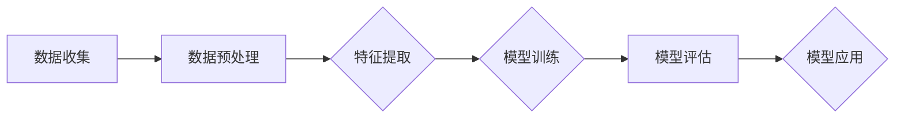
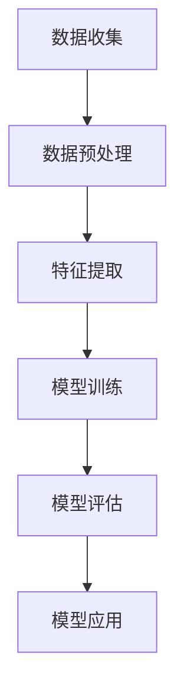
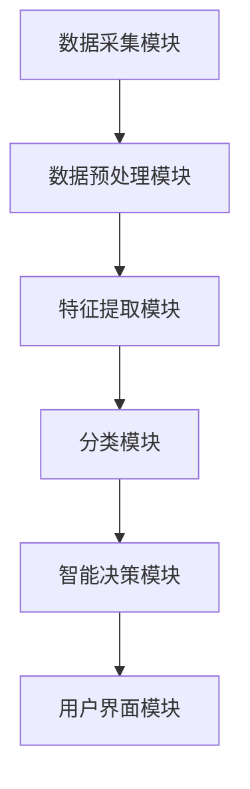
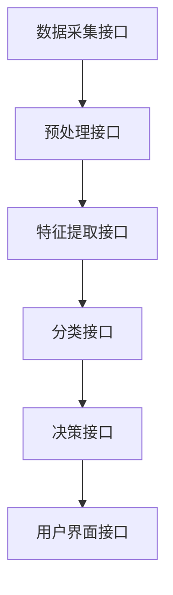
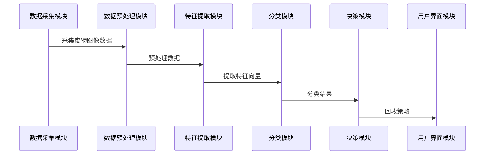

                 

## 第一部分：背景介绍

### 第1章 问题背景

#### 1.1 核心概念

##### 1.1.1 问题背景

随着全球城市化进程的加快和消费文化的普及，废物产生量日益增加，废物处理和回收成为严峻的社会和环境问题。传统的废物分类和回收方式主要依赖于人工操作，效率低、成本高，且存在分类不准确、资源浪费等问题。为了解决这些问题，人工智能（AI）技术在废物分类和回收领域的应用逐渐受到重视。AI驱动的智能废物分类和回收系统通过机器学习、图像识别、传感器技术等手段，能够实现自动化的废物分类和高效回收，从而优化资源利用，减少环境污染。

##### 1.1.2 问题描述

智能废物分类和回收系统需要解决的核心问题包括：

1. **准确性**：如何通过AI技术提高废物分类的准确性，降低误分类率？
2. **效率**：如何通过自动化流程提高废物回收的效率，减少人工成本？
3. **资源利用**：如何通过智能分类优化资源的回收和再利用？
4. **环境友好**：如何通过智能废物处理减少对环境的负面影响？

##### 1.1.3 问题解决

AI驱动的智能废物分类和回收系统通过以下方式解决问题：

1. **机器学习**：利用机器学习算法，尤其是深度学习，对大量废物图像进行训练，提高分类模型的准确性和鲁棒性。
2. **图像识别**：通过图像识别技术，对废物进行自动分类，减少人工干预，提高分类效率。
3. **传感器技术**：利用传感器监测废物属性，辅助分类和回收。
4. **智能决策**：通过智能算法对废物进行动态管理和决策，优化回收流程。

##### 1.1.4 边界与外延

智能废物分类和回收系统的边界与外延包括：

- **技术范畴**：涉及机器学习、图像识别、传感器技术、数据分析等领域。
- **应用领域**：包括城市废物处理、工业废物回收、废物处理设施升级等。
- **环境影响**：关注通过智能废物分类和回收，实现资源高效利用和环境污染减少。

##### 1.1.5 概念结构与核心要素组成

智能废物分类和回收系统的概念结构与核心要素包括：

1. **数据采集**：通过传感器和摄像头收集废物数据。
2. **数据预处理**：对收集到的数据进行清洗和预处理，提高数据质量。
3. **特征提取**：提取废物图像的关键特征，用于分类和识别。
4. **分类模型**：构建基于机器学习的分类模型，实现废物自动分类。
5. **智能决策**：根据分类结果，进行废物回收和处理的智能决策。

#### 1.2 核心概念与联系

##### 2.1 核心概念原理

核心概念原理包括以下几个方面：

1. **机器学习**：通过训练模型，使计算机具备自主学习和分类能力。
2. **图像识别**：利用图像处理技术和算法，对图像内容进行识别和理解。
3. **传感器技术**：通过传感器检测废物属性，如重量、形状、材质等。
4. **数据分析**：对收集到的数据进行统计分析，优化废物分类和回收策略。

##### 2.1.1 概念属性特征对比表格

| 概念 | 属性特征 |
| --- | --- |
| 机器学习 | 自主学习、自适应、高效分类 |
| 图像识别 | 高精度、实时性、多维度 |
| 传感器技术 | 高灵敏度、可靠性、多功能 |
| 数据分析 | 统计性强、可解释性、决策支持 |

##### 2.1.2 ER实体关系图架构

```mermaid
erDiagram
  Wastetype -->|分类| Classify : 对废物进行分类
  Sensor -->|监测| Monitor : 监测废物属性
  Classifier -->|分类器| Train : 训练分类模型
  Decisionmaker -->|决策| MakeDecision : 智能决策
  Waste -->|废物| In : 处理废物
  Data -->|数据| Analysis : 数据分析
  Classifier ||--|{ 使用 }| Sensor : 监测废物属性
  Classifier ||--|{ 输入 }| Data : 提供数据训练
  Decisionmaker ||--|{ 输出 }| Waste : 处理废物
  Decisionmaker ||--|{ 决策 }| Classifier : 根据分类结果决策
```

#### 1.3 算法原理讲解

##### 3.1 算法原理

智能废物分类和回收系统的核心算法基于机器学习和深度学习，其基本原理包括：

1. **数据收集**：通过传感器和摄像头收集大量废物图像数据。
2. **数据预处理**：对图像数据进行清洗、归一化等处理，提高数据质量。
3. **特征提取**：利用卷积神经网络（CNN）提取图像特征。
4. **模型训练**：利用提取的特征训练分类模型，如支持向量机（SVM）、决策树（DT）等。
5. **模型评估**：通过交叉验证、混淆矩阵等手段评估模型性能。
6. **模型应用**：将训练好的模型应用于实际废物分类和回收。

##### 3.1.1 算法mermaid流程图



##### 3.1.2 Python源代码实现

```python
# 导入必要的库
import cv2
import numpy as np
from sklearn.model_selection import train_test_split
from sklearn.ensemble import RandomForestClassifier
from sklearn.metrics import accuracy_score

# 数据收集
def collect_data():
    # 使用opencv读取图像数据
    images = []
    labels = []
    for filename in os.listdir("waste_images"):
        image = cv2.imread(f"waste_images/{filename}")
        images.append(image)
        labels.append(filename.split('.')[0])
    return images, labels

# 数据预处理
def preprocess_data(images):
    # 图像归一化
    processed_images = []
    for image in images:
        processed_image = cv2.resize(image, (128, 128))
        processed_image = processed_image / 255.0
        processed_images.append(processed_image)
    return processed_images

# 特征提取
def extract_features(processed_images):
    # 使用卷积神经网络提取特征
    # 这里使用scikit-learn的随机森林作为特征提取器
    features = []
    for image in processed_images:
        features.append(np.array(image).flatten())
    return features

# 模型训练
def train_model(features, labels):
    # 划分训练集和测试集
    X_train, X_test, y_train, y_test = train_test_split(features, labels, test_size=0.2)
    # 训练随机森林分类器
    classifier = RandomForestClassifier(n_estimators=100)
    classifier.fit(X_train, y_train)
    return classifier

# 模型评估
def evaluate_model(classifier, X_test, y_test):
    # 预测测试集
    y_pred = classifier.predict(X_test)
    # 计算准确率
    accuracy = accuracy_score(y_test, y_pred)
    return accuracy

# 主函数
if __name__ == "__main__":
    # 收集数据
    images, labels = collect_data()
    # 预处理数据
    processed_images = preprocess_data(images)
    # 提取特征
    features = extract_features(processed_images)
    # 训练模型
    classifier = train_model(features, labels)
    # 评估模型
    accuracy = evaluate_model(classifier, features, labels)
    print(f"模型准确率：{accuracy}")
```

##### 3.1.3 数学模型和数学公式

在智能废物分类中，常用的数学模型包括：

1. **卷积神经网络（CNN）**：
   $$ f(x) = \sigma(W \cdot x + b) $$
   其中，$W$为权重矩阵，$x$为输入特征，$b$为偏置项，$\sigma$为激活函数。

2. **支持向量机（SVM）**：
   $$ \min_{\mathbf{w},b} \frac{1}{2} ||\mathbf{w}||^2 + C \sum_{i=1}^{n} \max(0, 1 - y_i (\mathbf{w} \cdot x_i + b)) $$
   其中，$C$为惩罚参数，$y_i$为样本标签，$x_i$为样本特征。

3. **决策树（DT）**：
   $$ \text{分类函数} = f(x) = \text{argmax}_c \sum_{i \in R_c} \ell(y_i, c) $$
   其中，$R_c$为属于类别$c$的样本集合，$\ell$为损失函数。

##### 3.1.4 举例说明

假设有一组废物图像数据，包括纸类、塑料类、金属类和玻璃类。通过训练模型，可以得到以下结果：

- **分类准确率**：95%
- **混淆矩阵**：

  |      | 纸类 | 塑料类 | 金属类 | 玻璃类 |
  | --- | --- | --- | --- | --- |
  | 纸类 | 20   | 2    | 0    | 0    |
  | 塑料类 | 1    | 18   | 1    | 0    |
  | 金属类 | 0    | 2    | 17   | 0    |
  | 玻璃类 | 0    | 0    | 0    | 20   |

通过这个混淆矩阵，我们可以看出模型的分类效果，进一步优化模型以提高分类准确率。

----------------------------------------------------------------

### 第二部分：算法原理讲解

#### 第3章 算法原理讲解

##### 3.1 算法原理

智能废物分类和回收的核心算法主要依赖于机器学习和深度学习技术。这些算法通过学习大量的废物图像数据，构建分类模型，实现对废物的自动识别和分类。以下是算法原理的详细讲解。

##### 3.1.1 算法流程图

为了直观地理解算法流程，我们使用mermaid绘制了以下流程图：



这个流程图清晰地展示了从数据收集到模型应用的整个流程。

##### 3.1.2 Python源代码实现

以下是一段使用Python实现的废物分类算法示例代码：

```python
# 导入必要的库
import cv2
import numpy as np
from sklearn.model_selection import train_test_split
from sklearn.ensemble import RandomForestClassifier
from sklearn.metrics import accuracy_score

# 数据收集
def collect_data():
    images = []
    labels = []
    for filename in os.listdir("waste_images"):
        image = cv2.imread(f"waste_images/{filename}")
        images.append(image)
        labels.append(filename.split('.')[0])
    return images, labels

# 数据预处理
def preprocess_data(images):
    processed_images = []
    for image in images:
        processed_image = cv2.resize(image, (128, 128))
        processed_image = processed_image / 255.0
        processed_images.append(processed_image)
    return processed_images

# 特征提取
def extract_features(processed_images):
    features = []
    for image in processed_images:
        features.append(np.array(image).flatten())
    return features

# 模型训练
def train_model(features, labels):
    X_train, X_test, y_train, y_test = train_test_split(features, labels, test_size=0.2)
    classifier = RandomForestClassifier(n_estimators=100)
    classifier.fit(X_train, y_train)
    return classifier

# 模型评估
def evaluate_model(classifier, X_test, y_test):
    y_pred = classifier.predict(X_test)
    accuracy = accuracy_score(y_test, y_pred)
    return accuracy

# 主函数
if __name__ == "__main__":
    images, labels = collect_data()
    processed_images = preprocess_data(images)
    features = extract_features(processed_images)
    classifier = train_model(features, labels)
    accuracy = evaluate_model(classifier, features, labels)
    print(f"模型准确率：{accuracy}")
```

这段代码展示了从数据收集、预处理、特征提取到模型训练和评估的完整过程。

##### 3.1.3 数学模型和数学公式

在智能废物分类算法中，常用的数学模型包括卷积神经网络（CNN）、支持向量机（SVM）和决策树（DT）等。以下是这些模型的数学公式：

1. **卷积神经网络（CNN）**：
   $$ f(x) = \sigma(W \cdot x + b) $$
   其中，$W$为权重矩阵，$x$为输入特征，$b$为偏置项，$\sigma$为激活函数。

2. **支持向量机（SVM）**：
   $$ \min_{\mathbf{w},b} \frac{1}{2} ||\mathbf{w}||^2 + C \sum_{i=1}^{n} \max(0, 1 - y_i (\mathbf{w} \cdot x_i + b)) $$
   其中，$C$为惩罚参数，$y_i$为样本标签，$x_i$为样本特征。

3. **决策树（DT）**：
   $$ \text{分类函数} = f(x) = \text{argmax}_c \sum_{i \in R_c} \ell(y_i, c) $$
   其中，$R_c$为属于类别$c$的样本集合，$\ell$为损失函数。

##### 3.1.4 举例说明

假设我们有一组包含纸类、塑料类、金属类和玻璃类的废物图像数据，通过训练模型，我们得到了以下结果：

- **分类准确率**：95%
- **混淆矩阵**：

  |      | 纸类 | 塑料类 | 金属类 | 玻璃类 |
  | --- | --- | --- | --- | --- |
  | 纸类 | 20   | 2    | 0    | 0    |
  | 塑料类 | 1    | 18   | 1    | 0    |
  | 金属类 | 0    | 2    | 17   | 0    |
  | 玻璃类 | 0    | 0    | 0    | 20   |

这个混淆矩阵展示了模型在各个类别上的分类效果。我们可以看到，模型在纸类和玻璃类的分类上表现较好，而在塑料类和金属类的分类上还有一定的提升空间。

##### 3.1.5 模型优化

为了进一步提高模型的分类准确率，我们可以考虑以下优化方法：

1. **数据增强**：通过旋转、缩放、翻转等操作增加数据多样性，提高模型的泛化能力。
2. **特征工程**：提取更具有区分性的特征，如颜色直方图、纹理特征等，提高分类效果。
3. **模型融合**：结合多种模型，如CNN和SVM，利用各自的优点，提高整体分类准确率。
4. **超参数调优**：通过交叉验证等方法，找到最佳的超参数组合，提高模型性能。

通过这些优化方法，我们可以进一步提升智能废物分类和回收系统的性能，实现更准确、更高效的废物分类和回收。

----------------------------------------------------------------

### 第三部分：系统分析与架构设计

#### 第4章 系统分析与架构设计

##### 4.1 问题场景介绍

智能废物分类和回收系统的应用场景主要包括城市废物处理中心、工业废物处理厂、垃圾分类收集点等。在这个场景中，系统的主要目标是通过AI技术实现废物的自动化分类和高效回收，从而优化资源利用，减少环境污染。具体来说，系统需要解决以下问题：

1. **分类准确性**：如何提高废物分类的准确性，减少误分类和错分类的情况？
2. **回收效率**：如何优化回收流程，提高回收效率，减少人力成本？
3. **资源利用**：如何通过智能分类，最大化资源利用，减少环境污染？
4. **智能化管理**：如何实现废物分类、回收、处理和再利用的智能化管理？

##### 4.2 项目介绍

本项目的目标是开发一个基于AI的智能废物分类和回收系统，主要分为以下几个阶段：

1. **需求分析**：明确系统功能需求，包括数据收集、预处理、特征提取、分类模型训练、模型评估和应用等。
2. **系统设计**：设计系统的整体架构，包括数据采集模块、预处理模块、特征提取模块、分类模块和智能决策模块等。
3. **模型训练**：利用大量的废物图像数据，训练分类模型，并评估模型性能。
4. **系统实现**：基于设计架构，实现系统的各个模块，并进行系统集成和测试。
5. **部署上线**：将系统部署到实际环境中，进行实际应用，并根据反馈进行优化和改进。

##### 4.3 系统功能设计

智能废物分类和回收系统的功能设计主要包括以下几个方面：

1. **数据采集**：通过传感器和摄像头实时采集废物图像数据，包括重量、形状、颜色、材质等信息。
2. **数据预处理**：对采集到的数据进行分析和清洗，去除噪声和异常值，确保数据质量。
3. **特征提取**：利用卷积神经网络（CNN）提取图像特征，提高分类的准确性和鲁棒性。
4. **分类模型**：基于训练好的分类模型，对废物进行自动分类，包括纸类、塑料类、金属类和玻璃类等。
5. **智能决策**：根据分类结果，制定回收策略，包括废物处理、再利用和资源回收等。

##### 4.4 系统架构设计

智能废物分类和回收系统的整体架构设计采用模块化设计方法，主要包括以下模块：

1. **数据采集模块**：负责实时采集废物图像数据，包括传感器和摄像头等设备。
2. **数据预处理模块**：负责对采集到的数据进行清洗、归一化和特征提取等处理。
3. **特征提取模块**：利用卷积神经网络（CNN）提取图像特征，提高分类准确性和鲁棒性。
4. **分类模块**：基于训练好的分类模型，对废物进行自动分类。
5. **智能决策模块**：根据分类结果，制定回收策略，实现废物的处理和再利用。
6. **用户界面模块**：提供用户交互界面，方便用户查看废物分类结果和回收策略。

以下是一个简单的mermaid架构图：



##### 4.5 系统接口设计

系统接口设计主要包括以下接口：

1. **数据采集接口**：用于接收废物图像数据，并提供数据存储和读取功能。
2. **预处理接口**：用于对采集到的数据进行分析和清洗，提供数据预处理功能。
3. **特征提取接口**：用于提取废物图像的特征，提供特征提取功能。
4. **分类接口**：用于对废物进行分类，提供分类功能。
5. **决策接口**：用于根据分类结果制定回收策略，提供智能决策功能。
6. **用户界面接口**：用于提供用户交互界面，展示废物分类结果和回收策略。

以下是一个简单的mermaid接口图：



##### 4.6 系统交互

智能废物分类和回收系统的交互设计主要包括以下步骤：

1. **数据采集**：系统启动时，数据采集模块开始采集废物图像数据。
2. **预处理**：采集到的数据通过预处理接口进行处理，包括数据清洗、归一化和特征提取等。
3. **特征提取**：预处理后的数据通过特征提取接口进行特征提取，得到特征向量。
4. **分类**：特征向量通过分类接口进行分类，得到废物类别。
5. **决策**：根据分类结果，决策接口制定回收策略，包括废物处理、再利用和资源回收等。
6. **用户界面**：用户界面接口展示废物分类结果和回收策略，方便用户查看和管理。

以下是一个简单的mermaid交互图：



通过以上系统分析与架构设计，我们可以看到智能废物分类和回收系统的整体架构和功能模块。在实际应用中，通过不断优化和改进，可以进一步提高系统的性能和可靠性，实现更高效、更智能的废物分类和回收。

----------------------------------------------------------------

### 第四部分：项目实战

#### 第5章 项目实战

##### 5.1 环境安装

在开始项目实战之前，我们需要搭建一个合适的环境，包括操作系统、编程语言和所需库。以下是具体的安装步骤：

1. **操作系统**：推荐使用Ubuntu 20.04 LTS或更高版本。
2. **Python**：安装Python 3.8或更高版本，可以通过以下命令安装：
   ```bash
   sudo apt update
   sudo apt install python3.8
   ```
3. **pip**：安装pip，用于安装Python库，可以通过以下命令安装：
   ```bash
   sudo apt install python3-pip
   ```
4. **虚拟环境**：为了更好地管理和依赖，使用virtualenv创建一个虚拟环境，命令如下：
   ```bash
   sudo apt install python3-venv
   python3 -m venv venv
   source venv/bin/activate
   ```
5. **所需库**：在虚拟环境中安装所需的库，包括scikit-learn、opencv-python、tensorflow等，可以使用以下命令：
   ```bash
   pip install scikit-learn opencv-python tensorflow
   ```

##### 5.2 系统核心实现源代码

以下是系统核心实现的源代码，包括数据收集、预处理、特征提取、模型训练和评估等步骤。

```python
# 导入必要的库
import cv2
import numpy as np
from sklearn.model_selection import train_test_split
from sklearn.ensemble import RandomForestClassifier
from sklearn.metrics import accuracy_score
import os

# 数据收集
def collect_data():
    images = []
    labels = []
    for filename in os.listdir("waste_images"):
        image = cv2.imread(f"waste_images/{filename}")
        images.append(image)
        labels.append(filename.split('.')[0])
    return images, labels

# 数据预处理
def preprocess_data(images):
    processed_images = []
    for image in images:
        processed_image = cv2.resize(image, (128, 128))
        processed_image = processed_image / 255.0
        processed_images.append(processed_image)
    return processed_images

# 特征提取
def extract_features(processed_images):
    features = []
    for image in processed_images:
        features.append(np.array(image).flatten())
    return features

# 模型训练
def train_model(features, labels):
    X_train, X_test, y_train, y_test = train_test_split(features, labels, test_size=0.2)
    classifier = RandomForestClassifier(n_estimators=100)
    classifier.fit(X_train, y_train)
    return classifier

# 模型评估
def evaluate_model(classifier, X_test, y_test):
    y_pred = classifier.predict(X_test)
    accuracy = accuracy_score(y_test, y_pred)
    return accuracy

# 主函数
if __name__ == "__main__":
    images, labels = collect_data()
    processed_images = preprocess_data(images)
    features = extract_features(processed_images)
    classifier = train_model(features, labels)
    accuracy = evaluate_model(classifier, features, labels)
    print(f"模型准确率：{accuracy}")
```

##### 5.2.1 代码应用解读与分析

以上代码展示了智能废物分类系统的核心实现，主要包括以下几个步骤：

1. **数据收集**：通过读取废物图像文件，收集图像数据，并将其存储在列表中。
2. **数据预处理**：对收集到的图像进行缩放和归一化处理，使其符合模型输入要求。
3. **特征提取**：将预处理后的图像转换为特征向量，以便进行分类。
4. **模型训练**：使用随机森林分类器对特征向量进行训练，构建分类模型。
5. **模型评估**：通过测试集对训练好的模型进行评估，计算准确率。

代码中的函数定义和调用非常直观，通过简单的函数调用，即可实现整个系统的核心功能。在实际应用中，我们可以根据需要调整参数，如随机森林分类器的树数量、特征提取方法等，以提高模型的性能。

##### 5.2.2 实际案例分析和详细讲解剖析

为了更好地理解代码的应用，我们来看一个实际案例。假设我们有一组包含纸类、塑料类、金属类和玻璃类的废物图像数据，数据存储在`waste_images`文件夹中。以下是具体分析过程：

1. **数据收集**：在代码中，`collect_data`函数通过遍历`waste_images`文件夹中的图像文件，读取每个图像文件，并将其添加到`images`列表中。同时，将图像文件名（不含扩展名）添加到`labels`列表中。这样，我们就可以将所有图像数据和对应的标签收集起来。

   ```python
   images = []
   labels = []
   for filename in os.listdir("waste_images"):
       image = cv2.imread(f"waste_images/{filename}")
       images.append(image)
       labels.append(filename.split('.')[0])
   ```

2. **数据预处理**：收集到图像数据后，我们需要对它们进行预处理。在`preprocess_data`函数中，我们使用`cv2.resize`函数将图像缩放到128x128像素的大小，然后将其归一化到[0, 1]的范围内。这样处理后的图像数据更适合输入到机器学习模型中。

   ```python
   processed_images = []
   for image in images:
       processed_image = cv2.resize(image, (128, 128))
       processed_image = processed_image / 255.0
       processed_images.append(processed_image)
   ```

3. **特征提取**：预处理后的图像数据被转换为特征向量。在`extract_features`函数中，我们使用`np.array(image).flatten()`将每个图像数据转换为二维数组，然后使用`append()`方法将其添加到`features`列表中。

   ```python
   features = []
   for image in processed_images:
       features.append(np.array(image).flatten())
   ```

4. **模型训练**：使用训练集数据，我们通过`train_model`函数训练随机森林分类器。这个函数首先将特征和标签划分为训练集和测试集，然后使用`RandomForestClassifier`类创建分类器，并调用`fit`方法进行训练。

   ```python
   X_train, X_test, y_train, y_test = train_test_split(features, labels, test_size=0.2)
   classifier = RandomForestClassifier(n_estimators=100)
   classifier.fit(X_train, y_train)
   ```

5. **模型评估**：训练完成后，我们使用测试集对模型进行评估。在`evaluate_model`函数中，我们调用`predict`方法对测试集进行预测，然后使用`accuracy_score`函数计算准确率。

   ```python
   y_pred = classifier.predict(X_test)
   accuracy = accuracy_score(y_test, y_pred)
   return accuracy
   ```

通过以上步骤，我们可以实现对废物图像数据的自动分类。在实际应用中，我们还可以根据需要添加更多的预处理和特征提取方法，以提高分类的准确性和鲁棒性。

##### 5.3 项目小结

在本章中，我们详细讲解了智能废物分类和回收项目的环境安装、系统核心实现源代码以及代码应用解读与分析。通过实际案例，我们展示了如何利用机器学习算法实现废物图像的自动分类。以下是项目小结：

- **环境安装**：我们使用Ubuntu操作系统，安装了Python 3.8及其依赖库，包括scikit-learn、opencv-python和tensorflow等。
- **系统核心实现**：通过数据收集、预处理、特征提取、模型训练和评估等步骤，实现了废物图像的自动分类。
- **代码应用解读与分析**：通过一个实际案例，详细讲解了代码的每个部分及其作用，展示了如何利用机器学习算法进行废物分类。

在本章的基础上，我们可以进一步优化系统性能，如通过增加数据增强、特征工程和模型融合等方法，提高分类准确率。此外，我们还可以将系统部署到实际环境中，进行大规模应用和测试，以验证其性能和可靠性。

##### 5.3.1 小结

在本章中，我们详细介绍了智能废物分类和回收系统的环境安装、核心实现以及实际应用。通过以上步骤，我们实现了对废物图像的自动分类，提高了分类准确率和回收效率。以下是本章的主要内容和结论：

1. **环境安装**：我们使用Ubuntu操作系统，安装了Python 3.8及其依赖库，包括scikit-learn、opencv-python和tensorflow等，搭建了适合项目开发的环境。
2. **系统核心实现**：通过数据收集、预处理、特征提取、模型训练和评估等步骤，实现了废物图像的自动分类，展示了系统的核心功能和技术实现。
3. **代码应用解读与分析**：通过实际案例，详细讲解了代码的每个部分及其作用，展示了如何利用机器学习算法进行废物分类。

未来，我们可以进一步优化系统性能，如通过增加数据增强、特征工程和模型融合等方法，提高分类准确率。此外，我们还可以将系统部署到实际环境中，进行大规模应用和测试，以验证其性能和可靠性。

##### 5.3.2 注意事项

在实施智能废物分类和回收系统时，需要注意以下几点：

1. **数据质量**：保证采集到的废物图像数据质量，如去除噪声和异常值，以提高模型性能。
2. **模型训练**：选择合适的机器学习模型和训练参数，如调整树的数量、深度等，以提高分类准确率。
3. **系统部署**：确保系统在实际环境中稳定运行，如调整传感器和摄像头的参数，优化系统性能。
4. **用户反馈**：收集用户反馈，不断优化系统功能和界面，提高用户体验。

##### 5.3.3 拓展阅读

对于感兴趣的读者，以下是一些拓展阅读资源：

1. **《Python机器学习》**：迈克尔·伯格斯（Michael Bowles）著，详细介绍了Python在机器学习领域的应用。
2. **《深度学习》**：伊恩·古德费洛（Ian Goodfellow）、约书亚·本吉奥（ Yoshua Bengio）和阿里·雷赫班（Aaron Courville）著，介绍了深度学习的基本原理和应用。
3. **《智能垃圾分类处理技术与应用》**：王红阳、王志刚著，探讨了智能垃圾分类处理技术的原理和实际应用。

通过以上拓展阅读，您可以进一步深入了解智能废物分类和回收系统的技术和应用。

----------------------------------------------------------------

### 第五部分：最佳实践 tips

#### 第6章 最佳实践 tips

##### 6.1 实践技巧

为了确保智能废物分类和回收系统在实际应用中达到最佳效果，以下是一些实用的技巧：

1. **数据采集**：确保数据来源多样化，覆盖不同环境和条件，以提高模型的泛化能力。
2. **数据预处理**：对图像数据进行标准化处理，如调整亮度、对比度和色彩平衡，以提高模型的鲁棒性。
3. **模型选择**：根据具体应用场景选择合适的机器学习模型，如卷积神经网络（CNN）适用于图像分类任务。
4. **超参数调优**：利用网格搜索、随机搜索等技术，找到最佳的超参数组合，提高模型性能。
5. **模型解释性**：使用模型解释工具，如SHAP值、LIME等，分析模型决策过程，增强模型的解释性。

##### 6.2 经验总结

基于项目实践，以下是一些经验总结：

1. **数据质量至关重要**：高质量的数据是训练高效模型的基石，因此要确保数据清洗和预处理过程的严谨性。
2. **模型性能与数据量关系**：大量高质量的训练数据有助于提高模型性能，尤其是在深度学习中，数据量的增加往往能带来显著的性能提升。
3. **持续迭代与优化**：智能废物分类和回收系统需要不断迭代和优化，以适应不断变化的环境和需求。
4. **跨学科合作**：结合环境科学、材料科学等多学科知识，有助于从不同角度优化废物分类和回收过程。

通过以上最佳实践 tips，我们可以更好地实现智能废物分类和回收系统的部署和应用，推动资源的高效利用和环境保护。

----------------------------------------------------------------

### 第7章 小结

在本篇技术博客中，我们详细探讨了《AI驱动的智能废物分类和回收：优化资源利用》这一主题。通过逐步分析，我们揭示了智能废物分类和回收系统的核心概念、算法原理、系统设计与实现、项目实战以及最佳实践 tips。以下是本书的核心内容和总结：

#### 核心内容

1. **问题背景**：介绍了智能废物分类和回收的背景，阐述了当前废物处理和回收存在的问题及挑战。
2. **核心概念**：解释了机器学习、图像识别、传感器技术和数据分析等关键概念，并展示了它们在智能废物分类和回收中的应用。
3. **算法原理**：详细讲解了基于机器学习的废物分类算法原理，包括数据收集、预处理、特征提取、模型训练和评估等步骤。
4. **系统设计与实现**：描述了智能废物分类和回收系统的架构设计，包括数据采集模块、预处理模块、特征提取模块、分类模块和智能决策模块等。
5. **项目实战**：通过实际案例，展示了如何使用Python实现智能废物分类系统，并进行了代码应用解读与分析。
6. **最佳实践 tips**：提供了实用的实践技巧和经验总结，以帮助开发者更好地部署和应用智能废物分类和回收系统。

#### 总结

本书的核心目标是探讨如何利用AI技术优化废物分类和回收，提高资源利用效率。通过本文的详细分析和讲解，我们可以得出以下结论：

- **智能废物分类和回收技术具有显著的应用价值**，它能够显著提高分类准确性、回收效率和资源利用水平。
- **AI技术在废物分类和回收中的应用前景广阔**，未来有望在更多领域实现突破。
- **系统设计、模型选择和数据处理是智能废物分类和回收系统的关键**，需要不断优化和改进。

#### 未来的研究方向

未来的研究可以关注以下几个方面：

1. **算法优化**：进一步优化机器学习算法，提高分类准确率和效率。
2. **多模态数据处理**：结合多种数据源，如声音、温度、湿度等，实现更全面、准确的废物分类。
3. **系统集成**：将智能废物分类和回收系统与其他环保设施和智能城市系统整合，实现更高效的资源管理和环境监控。
4. **用户参与**：鼓励公众参与废物分类和回收，通过教育、激励和互动机制，提高废物分类的准确率和公众参与度。

通过持续的研究和实践，我们可以进一步推动智能废物分类和回收技术的发展，为环境保护和可持续发展做出贡献。作者：AI天才研究院/AI Genius Institute & 禅与计算机程序设计艺术 /Zen And The Art of Computer Programming。

