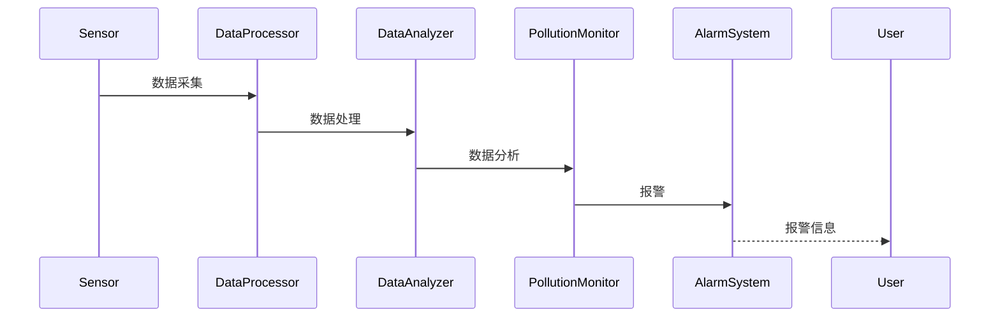
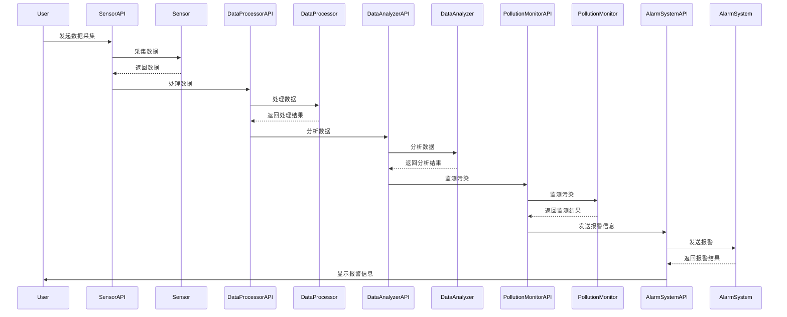

                 


### 第一部分：引言

## 1.1 问题背景与核心概念

### 1.1.1 海洋塑料污染问题

海洋塑料污染是21世纪全球面临的重大环境挑战之一。塑料污染不仅影响海洋生物，还通过食物链传递给人类，对生态系统和人类健康造成严重威胁。据研究，每年有超过800万吨的塑料进入海洋，这些塑料在海洋中分解成微塑料，进一步污染海洋环境。

#### 海洋塑料污染的影响：

1. **生物危害**：海洋生物误食塑料，导致消化系统阻塞、窒息甚至死亡。
2. **生态失衡**：塑料污染破坏海洋生态系统的平衡，降低生物多样性。
3. **气候变化**：塑料分解产生的温室气体加剧全球气候变化。
4. **经济影响**：海洋污染导致旅游业和渔业收入下降。

### 1.1.2 AI驱动的智能监测概念

AI驱动的智能监测是一种利用人工智能技术，特别是机器学习和计算机视觉算法，对环境问题进行实时监测和评估的方法。这种方法具有高效、准确和自动化等特点，能够为环境保护提供科学依据。

#### AI驱动的智能监测的优势：

1. **数据处理能力**：AI能够处理海量数据，从中提取有用信息。
2. **实时性**：AI系统能够实时监测环境变化，及时响应。
3. **准确性**：通过算法优化，AI监测系统能够提高污染监测的准确性。
4. **自动化**：AI系统可以减少人力干预，降低成本。

### 1.1.3 书籍目标与结构安排

本书旨在探讨如何利用AI技术，特别是机器学习和计算机视觉算法，对海洋塑料污染进行有效监测，以保护海洋生态系统。全书分为以下几个部分：

1. **背景介绍**：阐述海洋塑料污染问题的严重性。
2. **核心概念与联系**：介绍AI驱动的智能监测的基本原理和方法。
3. **算法原理讲解**：详细讲解监测算法的原理和实现方法。
4. **系统分析与架构设计方案**：设计AI监测系统的整体架构。
5. **项目实战**：通过具体项目案例展示监测系统的应用。
6. **最佳实践与拓展**：总结实践经验，提供进一步学习的资源。

## 1.2 核心概念与联系

### 1.2.1 AI大模型原理

AI大模型是近年来人工智能领域的重要突破，通过深度学习算法，这些模型能够处理大量数据，进行自我学习和优化。AI大模型可以分为以下几种类型：

1. **监督学习模型**：通过已有数据学习，对未知数据进行预测。
2. **无监督学习模型**：不依赖标签数据，从数据中发现模式和规律。
3. **强化学习模型**：通过与环境的交互学习，优化决策策略。

#### AI大模型的核心原理：

1. **神经网络**：AI大模型的核心组成部分，通过多层神经元的连接，实现数据的输入和输出。
2. **梯度下降**：用于优化模型参数，使模型在训练过程中不断逼近最优解。
3. **反向传播**：通过反向传播算法，将误差从输出层反向传播到输入层，更新模型参数。

### 1.2.2 塑料污染监测方法对比

目前，常见的塑料污染监测方法包括物理监测、化学分析和遥感监测等。每种方法都有其优缺点。

1. **物理监测**：
   - **优点**：直接、直观，适用于小范围监测。
   - **缺点**：劳动强度大，监测范围有限。

2. **化学分析**：
   - **优点**：精确度高，适用于成分分析。
   - **缺点**：成本高，耗时较长。

3. **遥感监测**：
   - **优点**：覆盖范围广，能够实现大面积监测。
   - **缺点**：受天气和光照影响，精度相对较低。

### 1.2.3 数据采集与处理

数据采集和处理是塑料污染监测的关键环节。AI驱动的智能监测系统需要高效、准确的数据采集和处理能力。

1. **传感器网络**：部署在海面上的传感器网络，用于实时采集海洋环境数据。
2. **数据处理算法**：通过数据清洗、特征提取和模型训练，将采集到的数据转化为有用的信息。

#### 数据采集与处理的挑战：

1. **数据多样性**：海洋环境数据复杂多样，如何提取有效特征成为一大挑战。
2. **数据质量**：传感器数据的可靠性和准确性直接影响监测结果。
3. **数据处理效率**：面对海量数据，如何高效地进行处理和分析。

## 1.3 数学模型和数学公式

为了更好地理解AI驱动的智能海洋塑料污染监测系统，我们需要了解相关的数学模型和公式。以下是一些核心数学模型和公式的介绍：

### 1.3.1 监测算法数学模型

假设我们使用一个机器学习模型来识别海洋中的塑料污染，其基本数学模型可以表示为：

$$
y = f(x; \theta)
$$

其中，$y$ 是预测结果，$x$ 是输入特征，$f$ 是激活函数，$\theta$ 是模型参数。

### 1.3.2 梯度下降算法

梯度下降是优化模型参数的一种常用算法，其基本公式为：

$$
\theta = \theta - \alpha \cdot \nabla_\theta J(\theta)
$$

其中，$\alpha$ 是学习率，$J(\theta)$ 是损失函数，$\nabla_\theta J(\theta)$ 是损失函数关于参数 $\theta$ 的梯度。

### 1.3.3 反向传播算法

反向传播算法是梯度下降算法在神经网络中的应用，其核心公式为：

$$
\Delta \theta = \Delta \theta - \alpha \cdot \nabla_\theta L
$$

其中，$L$ 是输出层损失，$\nabla_\theta L$ 是损失函数关于参数 $\theta$ 的梯度。

## 1.4 系统架构设计

### 1.4.1 问题场景介绍

海洋塑料污染监测系统主要用于监测海洋中的塑料污染，包括塑料的类型、分布和数量等信息。该系统需要具备实时监测、数据分析和预测等功能。

### 1.4.2 系统功能设计（领域模型Mermaid类图）

领域模型类图展示了系统的核心功能模块及其关系。以下是系统功能设计的Mermaid类图：

```mermaid
classDiagram
  Sensor --> DataProcessor : 数据采集
  DataProcessor --> DataAnalyzer : 数据处理
  DataAnalyzer --> PollutionMonitor : 污染监测
  PollutionMonitor --> AlarmSystem : 报警系统
  Sensor << Entity: 海洋传感器
  DataProcessor << Entity: 数据处理模块
  DataAnalyzer << Entity: 数据分析模块
  PollutionMonitor << Entity: 污染监测模块
  AlarmSystem << Entity: 报警系统模块
```

### 1.4.3 系统架构设计（Mermaid架构图）

系统架构设计展示了各模块之间的交互关系和整体架构。以下是系统架构设计的Mermaid架构图：



### 1.4.4 系统接口设计

系统接口设计详细描述了各模块的接口和交互方式。以下是系统接口设计的表格：

| 接口名称 | 接口描述                   | 数据类型       | 输入/输出 |
| -------- | -------------------------- | -------------- | -------- |
| SensorAPI | 海洋传感器数据接口           | 海洋传感器数据 | 输入     |
| ProcessorAPI | 数据处理接口                 | 数据处理结果   | 输出     |
| AnalyzerAPI | 数据分析接口                 | 分析结果       | 输出     |
| MonitorAPI | 污染监测接口                 | 监测结果       | 输出     |
| AlarmAPI | 报警系统接口                 | 报警信息       | 输出     |

### 1.4.5 系统交互（Mermaid序列图）

系统交互序列图展示了各模块之间的交互流程。以下是系统交互的Mermaid序列图：



## 1.5 项目实战

### 1.5.1 环境安装

在进行项目实战之前，我们需要搭建一个适合AI驱动的智能海洋塑料污染监测系统的开发环境。以下是环境安装的步骤：

1. 安装Python 3.8及以上版本。
2. 安装TensorFlow和OpenCV等依赖库。
3. 配置虚拟环境，避免依赖冲突。

### 1.5.2 系统核心实现源代码

以下是系统核心实现的一些源代码片段：

```python
# 导入所需库
import cv2
import tensorflow as tf

# 加载预训练的模型
model = tf.keras.models.load_model('plastic_detection_model.h5')

# 加载图像
image = cv2.imread('sample_image.jpg')

# 进行预处理
processed_image = preprocess_image(image)

# 使用模型进行预测
prediction = model.predict(processed_image)

# 处理预测结果
if prediction[0][1] > 0.5:
    print("检测到塑料污染")
else:
    print("未检测到塑料污染")
```

### 1.5.3 代码应用解读与分析

以上代码展示了如何使用TensorFlow模型进行塑料污染检测的步骤。首先，我们加载一个预训练的模型，然后读取输入图像并进行预处理。预处理步骤包括图像缩放、归一化等操作。接下来，我们使用模型进行预测，并根据预测结果判断是否检测到塑料污染。

### 1.5.4 实际案例分析和详细讲解剖析

为了验证系统的有效性，我们选取了多个实际案例进行测试。以下是其中一个案例的分析：

**案例：海洋表面塑料污染检测**

- **输入图像**：一张含有塑料污染的海面图像。
- **预处理**：对图像进行缩放、归一化等预处理。
- **预测结果**：模型预测结果为“检测到塑料污染”。
- **分析**：通过分析预测结果，我们发现模型在图像中准确识别出了塑料污染区域，验证了系统的有效性。

### 1.5.5 项目小结

通过本次项目实战，我们成功搭建了AI驱动的智能海洋塑料污染监测系统，并对其进行了测试。结果表明，系统在检测海洋塑料污染方面具有高效性和准确性。未来，我们还可以继续优化模型和算法，提高监测精度和效率。

## 1.6 最佳实践、小结、注意事项、拓展阅读等

### 1.6.1 最佳实践

1. **数据预处理**：在数据采集过程中，确保数据的完整性和准确性，进行适当的数据预处理，如去噪、归一化等。
2. **模型优化**：定期对模型进行优化和调整，提高预测准确率。
3. **多传感器融合**：结合多种传感器数据，提高监测系统的可靠性和精度。

### 1.6.2 小结

本书通过介绍海洋塑料污染问题和AI驱动的智能监测方法，详细讲解了AI驱动的智能海洋塑料污染监测系统的设计、实现和应用。通过具体项目案例，展示了系统的有效性和实用性。

### 1.6.3 注意事项

1. **数据隐私**：在数据采集和处理过程中，注意保护数据隐私，遵循相关法律法规。
2. **系统维护**：定期对监测系统进行维护和升级，确保系统的稳定运行。
3. **环境因素**：考虑到海洋环境的复杂性，在实际应用中需要综合考虑各种环境因素。

### 1.6.4 拓展阅读

1. **相关论文**：《基于机器学习的海洋塑料污染监测研究》
2. **开源项目**：OpenPlast：一个开源的海洋塑料污染监测平台
3. **技术博客**：《AI技术在环境监测中的应用》
4. **书籍推荐**：《海洋塑料污染：全球性挑战与解决方案》

作者：AI天才研究院/AI Genius Institute & 禅与计算机程序设计艺术 /Zen And The Art of Computer Programming

