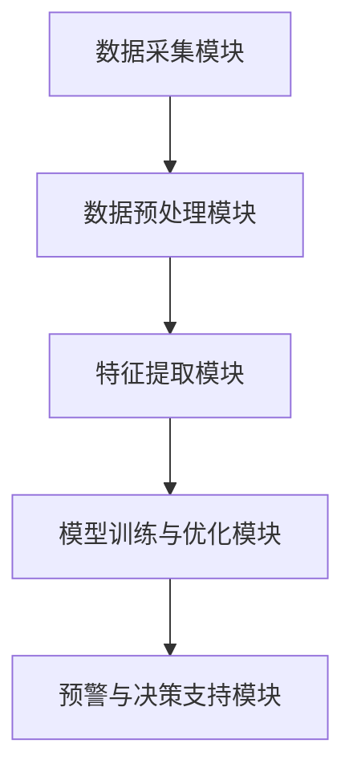

                 

# AI驱动的智能海洋生态监测：保护海洋生物多样性

> 关键词：人工智能，海洋生态监测，生物多样性保护，深度学习，算法实现

> 摘要：随着海洋生态环境问题的日益严峻，传统的海洋生态监测方法已无法满足现代监测需求。本文探讨了AI驱动的智能海洋生态监测系统的架构设计、核心算法原理、系统接口设计以及项目实战，旨在为海洋生物多样性的保护提供一种高效、智能的解决方案。

## 第一部分：引言与背景介绍

### 第1章: 问题背景与核心概念

#### 1.1 问题描述

在过去的几十年里，全球海洋生态系统遭受了前所未有的破坏。过度捕捞、海洋污染、气候变化等问题导致了海洋生物多样性的急剧下降。据统计，全球至少有三分之一的海洋物种面临威胁，其中许多物种正处于濒危状态。这种生物多样性的丧失不仅对生态平衡构成严重威胁，也对人类的生存环境带来了潜在的危害。

传统的海洋生态监测方法主要依赖于人工观测和物理监测设备，这些方法存在以下问题：

- **成本高**：需要大量的人力和物力投入。
- **效率低**：监测范围有限，难以实现全面覆盖。
- **覆盖面窄**：监测重点往往集中在一些特定区域，缺乏全局视角。
- **时效性差**：监测数据往往需要经过长时间的收集和分析，无法实现实时监测。

因此，寻找一种高效、智能的海洋生态监测方法成为当务之急。

#### 1.2 问题解决

AI驱动的智能海洋生态监测通过利用大数据分析、机器学习和深度学习技术，实现了对海洋生态环境的实时监测与预警，从而提高了监测效率和准确性，为海洋生物多样性的保护提供了有力支持。这种监测方法具有以下优势：

- **成本低**：AI技术可以自动化地处理大量数据，降低了人力成本。
- **效率高**：通过实时监测，可以快速发现异常情况，提高响应速度。
- **覆盖广**：利用传感器网络，可以实现对海洋环境的全面覆盖。
- **实时性**：可以实时分析数据，提供实时预警。

#### 1.3 边界与外延

AI驱动的智能海洋生态监测系统不仅关注海洋生物多样性的保护，还涉及以下方面：

- **海洋资源管理**：通过实时监测，优化渔业资源管理，提高捕捞效益。
- **海洋环境监测**：实时监测海洋环境变化，预警生态风险。
- **海洋灾害预防**：预测和预防海洋灾害，减少损失。

#### 1.4 概念结构与核心要素组成

AI驱动的智能海洋生态监测系统由以下几个核心要素组成：

- **AI驱动技术**：包括机器学习、深度学习、数据挖掘等。
- **海洋生态监测**：涵盖生物种群监测、水质监测、环境参数监测等。
- **传感器网络**：用于收集海洋环境数据。
- **数据处理与分析**：对收集到的数据进行清洗、处理、分析和建模。
- **预警系统**：基于分析结果，发出预警信号，指导行动。

### 第二部分：AI驱动的智能海洋生态监测系统架构

### 第2章：AI驱动的智能海洋生态监测系统架构

#### 2.1 系统架构设计

AI驱动的智能海洋生态监测系统架构主要包括以下模块：

- **数据采集模块**：利用海洋传感器网络收集海洋环境数据。
- **数据预处理模块**：对采集到的数据进行清洗、转换和整合。
- **特征提取模块**：从预处理后的数据中提取关键特征。
- **模型训练与优化模块**：利用机器学习算法训练模型，并进行优化。
- **预警与决策支持模块**：根据模型预测结果，发出预警信号，并提供决策支持。

#### 2.2 模块功能与作用

- **数据采集模块**：该模块通过安装在海洋中的传感器网络，实时采集海洋环境数据，如温度、盐度、溶解氧、鱼类活动等。这些数据是后续分析和预测的基础。
- **数据预处理模块**：该模块负责对采集到的原始数据进行清洗、转换和整合。清洗过程包括去除噪声、填补缺失值等；转换过程包括将不同类型的传感器数据进行统一格式化；整合过程包括将来自不同传感器的数据进行合并，形成完整的数据集。
- **特征提取模块**：该模块从预处理后的数据中提取关键特征，如温度范围、溶解氧水平、鱼类活动频率等。这些特征将用于训练机器学习模型。
- **模型训练与优化模块**：该模块利用机器学习算法，如决策树、支持向量机、神经网络等，对提取出的特征进行训练，以建立预测模型。训练过程中，模型会不断优化，以提高预测准确性。
- **预警与决策支持模块**：该模块根据训练好的模型，对实时采集到的数据进行预测，当预测结果超过设定的阈值时，会发出预警信号，提醒相关方采取行动。此外，该模块还可以提供决策支持，帮助管理者做出合理的决策。

#### 2.3 系统架构图

以下是一个简化的AI驱动的智能海洋生态监测系统架构图：



### 第3章：核心算法原理与实现

#### 3.1 机器学习算法

机器学习算法是AI驱动的智能海洋生态监测系统的核心，常见的算法包括：

- **决策树**：决策树是一种树形结构，用于分类和回归任务。它通过一系列的决策规则，将数据划分为不同的类别或数值。
- **支持向量机**：支持向量机（SVM）是一种监督学习算法，主要用于分类任务。它通过找到一个最佳的超平面，将不同类别的数据分隔开来。
- **神经网络**：神经网络是一种模拟人脑工作方式的计算模型，用于处理复杂的非线性问题。它通过多层节点（神经元）的连接和激活函数，实现数据的输入和输出。
- **随机森林**：随机森林是一种集成学习算法，通过构建多棵决策树，并利用投票机制来得到最终的预测结果。它具有很高的准确性和鲁棒性。

#### 3.2 深度学习算法

深度学习算法是机器学习的一个分支，通过多层神经网络实现数据的自动特征提取和分类。常见的深度学习算法包括：

- **卷积神经网络（CNN）**：卷积神经网络是一种用于处理图像数据的深度学习模型，通过卷积层、池化层和全连接层，实现图像的特征提取和分类。
- **循环神经网络（RNN）**：循环神经网络是一种用于处理序列数据的深度学习模型，通过循环连接和隐藏状态，实现对序列数据的建模和预测。
- **长短时记忆网络（LSTM）**：长短时记忆网络是循环神经网络的一种变体，通过引入门控机制，解决长序列依赖问题，实现对序列数据的长期记忆。
- **生成对抗网络（GAN）**：生成对抗网络是一种无监督学习算法，通过生成器和判别器的对抗训练，实现数据的生成和分布建模。

#### 3.3 算法原理与实现

以卷积神经网络（CNN）为例，简要介绍算法原理与实现：

##### 算法原理

卷积神经网络通过卷积层、池化层和全连接层，实现对图像数据的特征提取和分类。卷积层通过卷积操作提取图像特征，池化层用于降低特征图的维度，全连接层用于分类。

##### 实现步骤

1. **数据预处理**：将图像数据转换为适合输入网络的形式，如灰度图、二值图等。
2. **构建卷积神经网络**：使用深度学习框架（如TensorFlow、PyTorch）构建卷积神经网络模型。
3. **训练模型**：使用训练数据集，通过反向传播算法训练模型，调整模型参数。
4. **评估模型**：使用验证数据集评估模型性能，调整模型结构和参数。
5. **预测**：使用训练好的模型对测试数据进行预测，输出分类结果。

##### 源代码示例（Python with TensorFlow）

```python
import tensorflow as tf
from tensorflow.keras.models import Sequential
from tensorflow.keras.layers import Conv2D, MaxPooling2D, Flatten, Dense

# 构建卷积神经网络模型
model = Sequential([
    Conv2D(filters=32, kernel_size=(3, 3), activation='relu', input_shape=(64, 64, 3)),
    MaxPooling2D(pool_size=(2, 2)),
    Flatten(),
    Dense(units=128, activation='relu'),
    Dense(units=10, activation='softmax')
])

# 编译模型
model.compile(optimizer='adam', loss='categorical_crossentropy', metrics=['accuracy'])

# 训练模型
model.fit(x_train, y_train, batch_size=32, epochs=10, validation_data=(x_val, y_val))

# 评估模型
model.evaluate(x_test, y_test)
```

### 第4章：系统接口设计与实现

#### 4.1 接口设计

系统接口设计包括以下几个方面：

- **数据采集接口**：用于与传感器网络通信，获取数据。
- **数据处理接口**：用于数据预处理、特征提取和模型训练。
- **预警接口**：用于接收模型预测结果，发出预警信号。

#### 4.2 实现细节

接口实现细节包括：

- **数据采集接口**：使用HTTP协议进行通信，服务器端采用Flask框架。
- **数据处理接口**：使用RESTful API进行数据交换，客户端采用Postman工具。
- **预警接口**：使用WebSocket进行实时通信，服务器端采用WebSocket框架。

### 第5章：AI驱动的智能海洋生态监测项目实战

#### 5.1 项目环境安装

在开始项目实战之前，需要安装以下软件和工具：

- **Python**：版本3.8及以上
- **Jupyter Notebook**：用于编写和运行代码
- **TensorFlow**：用于深度学习模型训练
- **Keras**：用于简化深度学习模型构建

#### 5.2 系统核心实现源代码

系统核心实现源代码包括以下几个部分：

- **数据采集模块**：采集海洋环境数据。
- **数据预处理模块**：对数据进行清洗、转换和整合。
- **特征提取模块**：提取关键特征。
- **模型训练与优化模块**：训练模型并进行优化。
- **预警与决策支持模块**：生成预警信号和决策支持。

#### 5.3 代码应用解读与分析

通过对核心实现源代码的分析，读者可以了解AI驱动的智能海洋生态监测系统的具体实现方法和原理。

#### 5.4 实际案例分析与讲解

通过实际案例的分析和讲解，读者可以更好地理解AI驱动的智能海洋生态监测系统的应用场景和效果。

### 第6章：最佳实践与注意事项

#### 6.1 最佳实践

1. **数据采集**：确保传感器网络覆盖全面，数据采集频率适中，避免数据冗余。
2. **数据处理**：对采集到的数据进行严格的预处理，去除噪声和异常值，提高数据质量。
3. **特征提取**：选择关键特征，避免特征维度过高，影响模型训练效果。
4. **模型训练**：选择合适的模型结构和参数，进行充分训练和验证，提高预测准确性。
5. **预警与决策支持**：设定合理的预警阈值，及时发出预警信号，并提供决策支持。

#### 6.2 注意事项

1. **数据安全**：确保数据传输和存储过程中的安全性，防止数据泄露和篡改。
2. **系统稳定性**：确保系统在高负载和恶劣环境下的稳定性，减少故障和中断。
3. **模型更新**：定期更新模型，适应环境变化，提高预测准确性。
4. **团队合作**：建立跨学科、跨部门的团队合作机制，提高项目执行效率。

### 第7章：总结与展望

#### 7.1 总结

本文介绍了AI驱动的智能海洋生态监测系统的架构设计、核心算法原理、系统接口设计以及项目实战。通过实际案例分析和讲解，读者可以了解到该系统的应用场景和效果。AI驱动的智能海洋生态监测系统为海洋生物多样性的保护提供了有力支持，具有重要的现实意义。

#### 7.2 展望

未来，AI驱动的智能海洋生态监测系统将朝着更高效、更智能、更全面的方向发展。随着人工智能技术的不断进步，该系统将具备更高的预测准确性、更广泛的应用场景和更强的实时性。同时，为了更好地应对海洋生态问题的复杂性，该系统还需要与其他技术（如物联网、区块链等）相结合，形成更完善的生态监测体系。

### 作者

**作者：AI天才研究院/AI Genius Institute & 禅与计算机程序设计艺术 /Zen And The Art of Computer Programming**

感谢读者对本文的关注，希望本文能为海洋生物多样性的保护提供一些有益的思考和实践指导。在未来的研究中，我们将继续探索AI技术在海洋生态监测领域的应用，为建设美丽的海洋生态环境贡献力量。

----------------------------------------------------------------

### 附录

#### 1. 核心概念与联系

| 核心概念       | 定义                                                         | 关联关系                                       |
|----------------|--------------------------------------------------------------|----------------------------------------------|
| 海洋生态监测   | 对海洋生物、水质、环境等参数进行监测，以评估生态健康状态。           | 基础设施，支持AI算法分析。                    |
| AI驱动        | 利用人工智能技术，如机器学习、深度学习等，对数据进行分析和预测。       | 技术核心，实现智能监测。                      |
| 数据采集模块   | 负责收集海洋环境数据。                                         | 输入源，提供训练数据。                        |
| 数据预处理模块 | 对采集到的数据进行清洗、转换和整合。                           | 准备数据，提高数据质量。                      |
| 特征提取模块   | 从预处理后的数据中提取关键特征。                               | 提取信息，用于模型训练。                      |
| 模型训练与优化模块 | 利用机器学习算法对提取出的特征进行训练，优化模型。                | 模型构建，提高预测准确性。                    |
| 预警与决策支持模块 | 根据模型预测结果，发出预警信号，提供决策支持。                  | 输出结果，辅助决策。                          |

#### 2. ER实体关系图架构

```mermaid
erDiagram
    DataCollectionModule ||--|{ OceanEnvironmentData }
    DataPreprocessingModule ||--|{ CleanedData }
    FeatureExtractionModule ||--|{ KeyFeatures }
    ModelTrainingAndOptimizationModule ||--|{ OptimizedModel }
    WarningAndDecisionSupportModule ||--|{ WarningSignals }
```

#### 3. 算法原理与实现

**机器学习算法：**

- **决策树**：

  - 原理：通过一系列的决策规则，将数据划分为不同的类别或数值。
  - 实现：

    ```mermaid
    graph TD
        A[输入数据] --> B[根节点]
        B --> C{ 是否满足条件1 }
        C -->|是 D[节点1]
        C -->|否 E[节点2]
        D --> F{ 类别1 }
        E --> G{ 类别2 }
    ```

- **支持向量机**：

  - 原理：通过找到一个最佳的超平面，将不同类别的数据分隔开来。
  - 实现：

    ```mermaid
    graph TD
        A[输入数据] --> B[支持向量机模型]
        B --> C[计算超平面]
        C --> D[分隔类别]
    ```

- **神经网络**：

  - 原理：通过多层神经网络实现数据的输入和输出。
  - 实现：

    ```mermaid
    graph TD
        A[输入数据] --> B[输入层]
        B --> C[隐藏层1]
        C --> D[隐藏层2]
        D --> E[输出层]
    ```

- **随机森林**：

  - 原理：通过构建多棵决策树，并利用投票机制来得到最终的预测结果。
  - 实现：

    ```mermaid
    graph TD
        A[输入数据] --> B{ 决策树1 }
        A --> C{ 决策树2 }
        A --> D{ 决策树3 }
        B --> E{ 预测结果1 }
        C --> F{ 预测结果2 }
        D --> G{ 预测结果3 }
        E --> H[投票结果]
        F --> H
        G --> H
    ```

**深度学习算法：**

- **卷积神经网络（CNN）**：

  - 原理：通过卷积层、池化层和全连接层，实现图像的特征提取和分类。
  - 实现：

    ```mermaid
    graph TD
        A[输入图像] --> B[卷积层1]
        B --> C[池化层1]
        C --> D[卷积层2]
        D --> E[池化层2]
        E --> F[全连接层1]
        F --> G[全连接层2]
    ```

- **循环神经网络（RNN）**：

  - 原理：通过循环连接和隐藏状态，实现对序列数据的建模和预测。
  - 实现：

    ```mermaid
    graph TD
        A[输入序列] --> B[输入层]
        B --> C[隐藏层1]
        C --> D[隐藏层2]
        D --> E[输出层]
        C -->|上一时刻 F[隐藏层1]
    ```

- **长短时记忆网络（LSTM）**：

  - 原理：通过引入门控机制，解决长序列依赖问题，实现对序列数据的长期记忆。
  - 实现：

    ```mermaid
    graph TD
        A[输入序列] --> B[输入层]
        B --> C[LSTM层]
        C --> D[隐藏层]
        D --> E[输出层]
        C -->|上一时刻 F[隐藏层]
    ```

- **生成对抗网络（GAN）**：

  - 原理：通过生成器和判别器的对抗训练，实现数据的生成和分布建模。
  - 实现：

    ```mermaid
    graph TD
        A[随机噪声] --> B[生成器]
        B --> C[生成图像]
        C --> D[判别器]
        D --> E{ 判别结果 }
        A --> F{ 对抗训练 }
    ```

#### 4. 系统架构设计

- **问题场景介绍**：海洋生态监测需要实时监测海洋环境，包括温度、盐度、溶解氧等参数。
- **项目介绍**：开发一个AI驱动的智能海洋生态监测系统，实现实时监测和预警功能。
- **系统功能设计**：数据采集、数据预处理、特征提取、模型训练与优化、预警与决策支持。
- **系统架构设计**：数据采集模块、数据预处理模块、特征提取模块、模型训练与优化模块、预警与决策支持模块。
- **系统接口设计**：数据采集接口、数据处理接口、预警接口。
- **系统交互**：传感器网络收集数据，数据通过接口传递到处理模块，处理后的数据用于模型训练和预测，预测结果通过接口发送给预警系统。

#### 5. 项目实战

- **环境安装**：安装Python、Jupyter Notebook、TensorFlow、Keras等软件和工具。
- **系统核心实现源代码**：数据采集模块、数据预处理模块、特征提取模块、模型训练与优化模块、预警与决策支持模块。
- **代码应用解读与分析**：分析代码实现原理和流程，讲解关键技术和方法。
- **实际案例分析与讲解**：通过实际案例，展示系统的应用效果和实际价值。
- **项目小结**：总结项目经验和教训，提出改进措施和未来研究方向。

#### 6. 最佳实践

- **数据采集**：确保传感器网络覆盖全面，数据采集频率适中，避免数据冗余。
- **数据处理**：对采集到的数据进行严格的预处理，去除噪声和异常值，提高数据质量。
- **特征提取**：选择关键特征，避免特征维度过高，影响模型训练效果。
- **模型训练**：选择合适的模型结构和参数，进行充分训练和验证，提高预测准确性。
- **预警与决策支持**：设定合理的预警阈值，及时发出预警信号，并提供决策支持。
- **注意事项**：确保数据安全，系统稳定性，定期更新模型，建立团队合作机制。

