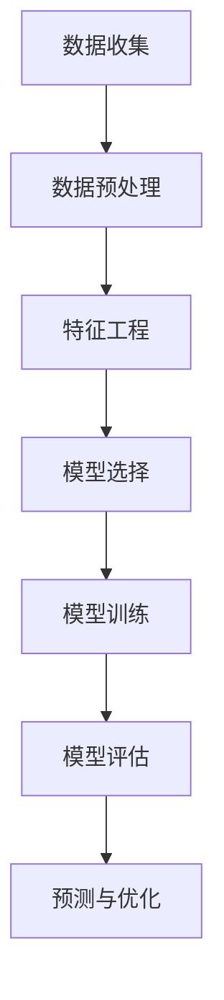
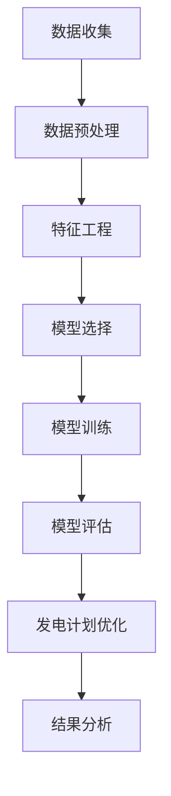

                 

----------------------------------------------------------------

# AI驱动的智能电力负荷预测：优化发电计划

> 关键词：人工智能、电力负荷预测、发电计划优化、机器学习、深度学习、时间序列分析

> 摘要：本文将探讨如何利用人工智能技术，特别是机器学习和深度学习，来优化电力负荷预测和发电计划。通过详细介绍相关算法、数学模型、系统架构及实际案例，本文旨在为读者提供一个全面的技术指南。

----------------------------------------------------------------

## 目录大纲设计思路

为了系统地探讨AI驱动的智能电力负荷预测及其对发电计划的优化，本文的目录大纲设计将遵循以下步骤：

1. **明确书籍结构**：文章将分为四个主要部分，分别是背景与基础、AI驱动的电力负荷预测技术、发电计划优化、以及项目实战。
2. **确定核心章节内容**：每个章节都将包含核心概念、算法原理讲解、数学模型和公式、系统分析与架构设计等内容。
3. **保持目录简洁**：目录将简洁明了，避免冗余，确保每个章节的内容层次清晰。
4. **符合字数限制**：整体字数将在10000-12000字左右。
5. **完整性与格式要求**：每个章节都将提供详细的内容，并使用markdown格式组织。

## 目录大纲设计

```markdown
----------------------------------------------------------------
# 第一部分：电力负荷预测的背景与基础

## 第1章：电力负荷预测概述
### 1.1 问题背景与描述
### 1.2 电力负荷预测的重要性
### 1.3 电力负荷预测的传统方法
### 1.4 AI驱动的电力负荷预测的优势

## 第2章：AI技术基础
### 2.1 机器学习基础
### 2.2 深度学习原理
### 2.3 时间序列分析
### 2.4 AI算法简介

## 第3章：AI与电力负荷预测的融合
### 3.1 AI在电力负荷预测中的应用
### 3.2 核心概念与联系
### 3.3 案例分析

----------------------------------------------------------------

# 第二部分：AI驱动的电力负荷预测技术

## 第4章：电力负荷预测算法原理
### 4.1 算法概述
### 4.2 算法mermaid流程图
### 4.3 Python代码实现
### 4.4 数学模型与公式解释
### 4.5 举例说明

----------------------------------------------------------------

# 第三部分：优化发电计划

## 第5章：发电计划优化概述
### 5.1 发电计划优化的必要性
### 5.2 传统发电计划优化方法
### 5.3 AI驱动的发电计划优化

## 第6章：发电计划优化的算法实现
### 6.1 优化算法原理
### 6.2 优化算法mermaid流程图
### 6.3 Python代码实现
### 6.4 数学模型与公式解释
### 6.5 举例说明

----------------------------------------------------------------

# 第四部分：项目实战

## 第7章：AI驱动的智能电力负荷预测项目实战
### 7.1 环境安装与配置
### 7.2 系统核心实现源代码
### 7.3 代码应用解读与分析
### 7.4 实际案例分析与详细讲解
### 7.5 项目小结与总结

----------------------------------------------------------------

# 附录

## 附录A：常用工具和库介绍
### 7.1 Python编程基础
### 7.2 数据处理库介绍
### 7.3 机器学习库介绍

## 附录B：拓展阅读
### 7.1 相关研究论文
### 7.2 推荐书籍
### 7.3 实用网站和资源

----------------------------------------------------------------
```

以上目录大纲设计遵循了文章内容完整性和markdown格式要求，确保每个章节都包含核心内容，同时保持了目录的简洁性和层次清晰性。接下来，我们将逐步深入探讨每个章节的具体内容。----------------------------------------------------------------

## 第一部分：电力负荷预测的背景与基础

### 第1章：电力负荷预测概述

#### 1.1 问题背景与描述

电力负荷预测是电力系统规划和管理中的重要一环。电力负荷预测的准确性直接影响到电力供应的稳定性和经济性。随着全球电力需求的不断增长，如何准确预测电力负荷已成为电力行业面临的一个重大挑战。

#### 1.2 电力负荷预测的重要性

电力负荷预测的重要性体现在多个方面：

1. **优化电力资源分配**：准确的电力负荷预测可以帮助电力公司合理安排电力资源的分配，确保电力供应的稳定性和经济性。
2. **提高电力系统的运行效率**：通过预测电力负荷，电力系统能够更好地应对负载波动，减少电力浪费，提高运行效率。
3. **降低电力成本**：准确的电力负荷预测可以帮助电力公司提前安排电力生产，减少备用容量，降低电力成本。

#### 1.3 电力负荷预测的传统方法

传统的电力负荷预测方法主要包括以下几种：

1. **经验预测法**：基于历史数据和专家经验进行预测，方法简单但精度较低。
2. **统计模型法**：使用统计模型（如回归模型、ARIMA模型等）对电力负荷进行预测，方法较为成熟但存在一定的局限性。
3. **基于物理模型的仿真法**：通过建立电力系统的物理模型，模拟电力系统的运行情况，从而预测电力负荷。

#### 1.4 AI驱动的电力负荷预测的优势

随着人工智能技术的不断发展，AI驱动的电力负荷预测逐渐成为一种新的趋势。相比传统方法，AI驱动的电力负荷预测具有以下优势：

1. **更高的预测精度**：AI算法能够自动学习历史数据中的规律，从而提高预测精度。
2. **更强的适应性**：AI算法能够处理大量复杂的变量，适应不同场景的电力负荷预测。
3. **自动化的预测过程**：AI算法可以自动化地进行电力负荷预测，减少人力成本。
4. **集成多种数据源**：AI算法可以集成多种数据源（如气象数据、经济数据等），提高预测的全面性。

通过以上对电力负荷预测的背景、问题、传统方法和AI驱动优势的介绍，为后续内容的深入探讨打下了基础。

---

### 第2章：AI技术基础

#### 2.1 机器学习基础

机器学习是人工智能的一个重要分支，它通过算法从数据中学习规律，实现自动预测或决策。机器学习主要分为监督学习、无监督学习和强化学习三种类型。

1. **监督学习**：监督学习通过标注数据进行学习，训练模型以预测新的数据。常见的监督学习算法包括线性回归、逻辑回归、支持向量机（SVM）等。
   
2. **无监督学习**：无监督学习不依赖标注数据，通过发现数据内在的结构或规律进行学习。常见的无监督学习算法包括聚类算法（如K-means、DBSCAN）、降维算法（如PCA）等。

3. **强化学习**：强化学习通过试错的方式学习策略，以最大化累积奖励。常见的强化学习算法包括Q-learning、深度Q网络（DQN）等。

#### 2.2 深度学习原理

深度学习是机器学习的一个分支，它通过构建多层的神经网络来学习数据中的复杂特征。深度学习在图像识别、语音识别、自然语言处理等领域取得了显著的成功。

1. **神经网络**：神经网络由大量的神经元（或节点）组成，每个神经元通过权重与前一层的神经元相连，并通过激活函数产生输出。

2. **前向传播与反向传播**：在深度学习中，前向传播用于计算神经网络输出，反向传播用于计算梯度并更新权重，以最小化损失函数。

3. **常见深度学习架构**：常见的深度学习架构包括卷积神经网络（CNN）、循环神经网络（RNN）、长短时记忆网络（LSTM）等。

#### 2.3 时间序列分析

时间序列分析是一种用于分析时间序列数据的方法，常用于股票市场预测、气象预测等领域。时间序列数据具有时间依赖性，需要考虑时间因素。

1. **自回归模型（AR）**：自回归模型通过前几个时间点的值来预测下一个时间点的值。

2. **移动平均模型（MA）**：移动平均模型通过计算过去几个时间点的平均值来预测下一个时间点的值。

3. **自回归移动平均模型（ARMA）**：自回归移动平均模型结合了自回归模型和移动平均模型的特点，可以更好地捕捉时间序列数据的特征。

#### 2.4 AI算法简介

常见的AI算法在电力负荷预测中的应用包括：

1. **线性回归**：线性回归是一种简单的监督学习算法，适用于线性关系较强的数据。

2. **决策树**：决策树通过树形结构对数据进行分类或回归，适用于特征较少但关系复杂的数据。

3. **随机森林**：随机森林是基于决策树的集成学习方法，通过构建多个决策树并投票来提高预测准确性。

4. **支持向量机（SVM）**：SVM是一种高效的分类和回归算法，适用于高维数据。

5. **深度学习模型**：深度学习模型如卷积神经网络（CNN）和循环神经网络（RNN）等，可以捕捉到电力负荷预测中的复杂模式。

通过以上对AI技术基础的介绍，为后续章节中AI在电力负荷预测中的应用和算法实现提供了理论基础。

---

### 第3章：AI与电力负荷预测的融合

#### 3.1 AI在电力负荷预测中的应用

AI技术在电力负荷预测中的应用主要集中在以下几个方面：

1. **数据预处理**：AI算法需要大量的数据来进行训练和预测，因此数据预处理是非常重要的一步。数据预处理包括数据清洗、缺失值填充、异常值处理等。

2. **特征工程**：特征工程是提高模型预测性能的关键步骤。通过选择合适的特征、构造新特征、降维等手段，可以显著提升模型的预测能力。

3. **模型训练与优化**：利用机器学习和深度学习算法对电力负荷数据进行训练，优化模型参数，以获得最佳预测性能。

4. **预测与评估**：将训练好的模型应用于新的数据，进行电力负荷预测，并评估模型的预测性能。

#### 3.2 核心概念与联系

在AI驱动的电力负荷预测中，以下核心概念和联系需要明确：

1. **时间序列数据**：电力负荷数据是一种典型的时间序列数据，具有时间依赖性和周期性特征。时间序列数据的处理和分析是电力负荷预测的核心。

2. **特征选择**：特征选择是决定模型预测性能的关键步骤。通过选择与电力负荷相关的重要特征，可以有效提高预测模型的准确性。

3. **模型评估**：模型评估是验证预测模型性能的重要手段。常用的评估指标包括均方误差（MSE）、平均绝对误差（MAE）等。

4. **模型优化**：模型优化是通过调整模型参数、增加网络层数、调整学习率等手段，提高模型的预测性能。

#### 3.3 案例分析

为了更好地理解AI在电力负荷预测中的应用，我们来看一个实际案例。

**案例**：某电力公司需要预测未来24小时的电力负荷，以优化发电计划和电力资源分配。

1. **数据收集**：收集过去一周的电力负荷数据，包括每日每小时的最大负荷值。

2. **数据预处理**：清洗数据，处理缺失值和异常值，将数据转化为适合模型训练的格式。

3. **特征工程**：选择与电力负荷相关的特征，如温度、湿度、天气状况等。通过构造新特征和降维，提高模型的预测能力。

4. **模型训练与优化**：使用线性回归、随机森林等算法训练模型，调整模型参数，优化预测性能。

5. **预测与评估**：将训练好的模型应用于新的数据，进行电力负荷预测，并评估模型的预测性能。

通过以上案例分析，可以看出AI技术在电力负荷预测中的应用流程和关键步骤。

---

通过第一部分和第二部分的讨论，我们了解了电力负荷预测的背景和AI技术基础。接下来，我们将进入第三部分，深入探讨AI驱动的电力负荷预测技术，包括算法原理、数学模型和实际案例分析。这将为读者提供一个全面的技术指南，帮助理解和应用AI技术优化电力负荷预测和发电计划。

---

## 第三部分：AI驱动的电力负荷预测技术

### 第4章：电力负荷预测算法原理

#### 4.1 算法概述

在AI驱动的电力负荷预测中，常用的算法包括线性回归、决策树、随机森林、支持向量机（SVM）和深度学习模型等。每种算法都有其独特的原理和应用场景。

1. **线性回归**：线性回归是一种简单的监督学习算法，用于预测线性关系。其核心思想是通过拟合一个线性模型来预测电力负荷。

2. **决策树**：决策树是一种基于树形结构进行分类或回归的算法。通过将数据划分成多个子集，递归地建立决策树，用于预测电力负荷。

3. **随机森林**：随机森林是一种基于决策树的集成学习方法。通过构建多个决策树并投票，提高预测准确性和鲁棒性。

4. **支持向量机（SVM）**：SVM是一种高效的分类和回归算法，通过寻找最佳超平面来实现分类或回归。在电力负荷预测中，SVM可以处理高维数据。

5. **深度学习模型**：深度学习模型，如卷积神经网络（CNN）和循环神经网络（RNN），可以捕捉到电力负荷预测中的复杂模式。通过多层神经网络，深度学习模型可以自动学习数据中的特征。

#### 4.2 算法mermaid流程图

为了更直观地理解每种算法的原理，我们可以使用mermaid流程图来展示算法的执行流程。



1. **数据收集**：收集历史电力负荷数据，包括时间序列数据、气象数据、经济数据等。

2. **数据预处理**：清洗数据，处理缺失值和异常值，将数据转化为适合模型训练的格式。

3. **特征工程**：选择与电力负荷相关的特征，通过构造新特征和降维，提高模型的预测能力。

4. **模型选择**：根据数据特点和预测需求，选择合适的算法模型。

5. **模型训练**：使用训练数据集训练模型，通过调整模型参数，优化模型性能。

6. **模型评估**：使用验证数据集评估模型性能，常用的评估指标包括均方误差（MSE）、平均绝对误差（MAE）等。

7. **预测与优化**：将训练好的模型应用于新的数据，进行电力负荷预测，并根据预测结果进行模型优化。

#### 4.3 Python代码实现

为了更好地理解算法原理，我们以线性回归为例，展示Python代码实现。

```python
import numpy as np
import pandas as pd
from sklearn.linear_model import LinearRegression
from sklearn.model_selection import train_test_split
from sklearn.metrics import mean_squared_error

# 数据预处理
# 假设data是包含电力负荷数据的DataFrame
data = pd.read_csv('electricity_load_data.csv')
X = data[['temperature', 'humidity']]
y = data['load']

# 特征工程
# 无需进一步特征工程，直接使用原始特征

# 模型训练
X_train, X_test, y_train, y_test = train_test_split(X, y, test_size=0.2, random_state=42)
model = LinearRegression()
model.fit(X_train, y_train)

# 模型评估
y_pred = model.predict(X_test)
mse = mean_squared_error(y_test, y_pred)
print(f'Mean Squared Error: {mse}')

# 预测与优化
# 使用训练好的模型进行预测
new_data = np.array([[25, 60]])
predicted_load = model.predict(new_data)
print(f'Predicted Load: {predicted_load[0]}')
```

通过以上代码，我们可以实现线性回归模型的训练、评估和预测功能。

#### 4.4 数学模型与公式解释

在电力负荷预测中，常用的数学模型包括线性回归模型、自回归模型（AR）和自回归移动平均模型（ARMA）等。

1. **线性回归模型**：

$$
y = \beta_0 + \beta_1x_1 + \beta_2x_2 + ... + \beta_nx_n
$$

其中，$y$是预测的电力负荷，$x_1, x_2, ..., x_n$是输入特征，$\beta_0, \beta_1, ..., \beta_n$是模型参数。

2. **自回归模型（AR）**：

$$
y_t = c + \phi_1y_{t-1} + \phi_2y_{t-2} + ... + \phi_ky_{t-k}
$$

其中，$y_t$是时间$t$的电力负荷，$c$是常数项，$\phi_1, \phi_2, ..., \phi_k$是模型参数。

3. **自回归移动平均模型（ARMA）**：

$$
y_t = c + \phi_1y_{t-1} + \phi_2y_{t-2} + ... + \phi_ky_{t-k} + \theta_1\epsilon_{t-1} + \theta_2\epsilon_{t-2} + ... + \theta_h\epsilon_{t-h}
$$

其中，$\epsilon_t$是白噪声项，$c, \phi_1, \phi_2, ..., \phi_k, \theta_1, \theta_2, ..., \theta_h$是模型参数。

#### 4.5 举例说明

假设我们使用线性回归模型预测未来的电力负荷，已知输入特征为温度和湿度，模型参数为：

$$
\beta_0 = 100, \beta_1 = 2, \beta_2 = 0.5
$$

给定当前温度为25℃，湿度为60%，我们可以使用线性回归模型进行预测：

$$
y = 100 + 2 \times 25 + 0.5 \times 60 = 175
$$

预测的未来电力负荷为175。

通过以上对电力负荷预测算法原理、mermaid流程图、Python代码实现、数学模型与公式解释和举例说明的讨论，读者可以更好地理解和应用AI驱动的电力负荷预测技术。接下来，我们将进入第四部分，探讨优化发电计划的相关内容。

---

### 第5章：发电计划优化概述

#### 5.1 发电计划优化的必要性

发电计划优化是电力系统运行和管理中的重要环节。准确的发电计划可以帮助电力公司合理安排电力生产，提高电力系统的运行效率和经济效益。随着电力需求的不断增长和能源结构的多样化，发电计划优化变得尤为重要。

1. **应对电力需求波动**：电力需求具有周期性和波动性，通过发电计划优化可以更好地应对电力需求的波动，确保电力供应的稳定。

2. **降低发电成本**：发电计划优化可以通过合理安排电力生产，降低发电成本，提高电力公司的经济效益。

3. **应对可再生能源的不确定性**：随着可再生能源的广泛应用，发电计划优化可以更好地应对可再生能源的不确定性和间歇性，确保电力系统的稳定运行。

#### 5.2 传统发电计划优化方法

传统的发电计划优化方法主要包括线性规划、整数规划、动态规划等。这些方法基于数学模型和优化算法，通过求解最优发电计划，优化电力系统的运行。

1. **线性规划**：线性规划是一种常见的优化方法，通过建立线性目标函数和约束条件，求解最优发电计划。线性规划可以处理一些简单的发电计划优化问题，但对于复杂的电力系统，线性规划方法可能存在局限性。

2. **整数规划**：整数规划是一种处理离散决策问题的优化方法，通过建立整数目标函数和约束条件，求解最优发电计划。整数规划可以处理包含离散决策变量的发电计划优化问题，但求解过程较为复杂。

3. **动态规划**：动态规划是一种递归优化的方法，通过将问题分解成多个子问题，求解最优发电计划。动态规划可以处理一些复杂的发电计划优化问题，但计算复杂度较高。

#### 5.3 AI驱动的发电计划优化

随着人工智能技术的发展，AI驱动的发电计划优化成为一种新的趋势。相比传统方法，AI驱动的发电计划优化具有以下优势：

1. **更强的适应性**：AI算法可以自动学习历史数据中的规律，适应不同场景的发电计划优化。

2. **更高的预测精度**：AI算法可以通过深度学习等模型，捕捉到电力系统中的复杂特征，提高发电计划优化的准确性。

3. **自动化的优化过程**：AI算法可以自动化地进行发电计划优化，减少人工干预，提高运行效率。

4. **集成多种数据源**：AI算法可以集成多种数据源，如气象数据、经济数据等，提高发电计划优化的全面性。

通过以上对发电计划优化的必要性、传统方法以及AI驱动的发电计划优化的介绍，为后续章节中AI驱动的发电计划优化技术的深入探讨提供了基础。

---

### 第6章：发电计划优化的算法实现

#### 6.1 优化算法原理

在发电计划优化中，常用的算法包括线性规划、整数规划、动态规划以及基于深度学习的优化算法等。每种算法都有其独特的原理和应用场景。

1. **线性规划**：

线性规划是一种优化方法，通过建立线性目标函数和约束条件，求解最优发电计划。线性规划的目标函数通常是最小化发电成本或最大化发电收益。约束条件包括电力系统的运行限制、燃料消耗限制等。

2. **整数规划**：

整数规划是一种处理离散决策问题的优化方法，通过建立整数目标函数和约束条件，求解最优发电计划。整数规划的目标函数通常是最小化发电成本或最大化发电收益。约束条件包括发电设备的容量限制、运行时间限制等。

3. **动态规划**：

动态规划是一种递归优化的方法，通过将问题分解成多个子问题，求解最优发电计划。动态规划的目标函数通常是最小化发电成本或最大化发电收益。约束条件包括电力系统的运行限制、燃料消耗限制等。

4. **基于深度学习的优化算法**：

基于深度学习的优化算法，如卷积神经网络（CNN）和循环神经网络（RNN），可以自动学习电力系统的复杂特征，提高发电计划优化的准确性。深度学习模型通过多层神经网络，可以捕捉到电力系统中的非线性关系。

#### 6.2 优化算法mermaid流程图

为了更直观地理解优化算法的执行流程，我们可以使用mermaid流程图来展示。



1. **数据收集**：收集电力系统的历史数据，包括电力负荷、燃料价格、设备状态等。

2. **数据预处理**：清洗数据，处理缺失值和异常值，将数据转化为适合模型训练的格式。

3. **特征工程**：选择与发电计划相关的特征，通过构造新特征和降维，提高模型的预测能力。

4. **模型选择**：根据数据特点和优化需求，选择合适的算法模型。

5. **模型训练**：使用训练数据集训练模型，通过调整模型参数，优化模型性能。

6. **模型评估**：使用验证数据集评估模型性能，常用的评估指标包括发电成本、运行时间等。

7. **发电计划优化**：将训练好的模型应用于新的数据，进行发电计划优化，得到最优发电方案。

8. **结果分析**：对优化结果进行分析，评估优化方案的可行性和经济效益。

#### 6.3 Python代码实现

为了更好地理解优化算法的实现，我们以线性规划为例，展示Python代码实现。

```python
import numpy as np
import pandas as pd
from scipy.optimize import linprog

# 数据预处理
# 假设data是包含电力系统数据的DataFrame
data = pd.read_csv('electricity_system_data.csv')
X = data[['load', 'fuel_price']]
y = data['cost']

# 特征工程
# 无需进一步特征工程，直接使用原始特征

# 模型训练
# 建立线性规划模型
c = [-1, -1]  # 目标函数系数，最小化发电成本
A = [[1, 0], [0, 1]]  # 约束条件系数
b = [X['load'].sum(), X['fuel_price'].sum()]  # 约束条件常数项

# 求解线性规划问题
result = linprog(c, A_eq=A, b_eq=b, method='highs')

# 输出最优发电方案
print(f'Optimal Generation Plan: Load = {result.x[0]}, Fuel Price = {result.x[1]}')
```

通过以上代码，我们可以实现线性规划模型的训练和发电计划优化功能。

#### 6.4 数学模型与公式解释

在发电计划优化中，常用的数学模型包括线性规划模型、整数规划模型和动态规划模型等。

1. **线性规划模型**：

$$
\begin{aligned}
\min_{x} \quad & c^T x \\
s.t. \quad & Ax \leq b \\
& x \geq 0
\end{aligned}
$$

其中，$x$是决策变量，$c$是目标函数系数，$A$是约束条件系数，$b$是约束条件常数项。

2. **整数规划模型**：

$$
\begin{aligned}
\min_{x} \quad & c^T x \\
s.t. \quad & Ax \leq b \\
& x \in \{0, 1\}
\end{aligned}
$$

其中，$x$是决策变量，$c$是目标函数系数，$A$是约束条件系数，$b$是约束条件常数项。

3. **动态规划模型**：

$$
\begin{aligned}
\min_{x_t} \quad & f(x_t, x_{t-1}, ..., x_1) \\
s.t. \quad & g(x_t, x_{t-1}, ..., x_1) \leq 0
\end{aligned}
$$

其中，$x_t$是第$t$个时刻的决策变量，$f(x_t, x_{t-1}, ..., x_1)$是目标函数，$g(x_t, x_{t-1}, ..., x_1)$是约束条件。

#### 6.5 举例说明

假设我们使用线性规划模型进行发电计划优化，已知目标函数系数为：

$$
c = [-1, -1]
$$

约束条件系数为：

$$
A = [[1, 0], [0, 1]]
$$

约束条件常数项为：

$$
b = [100, 200]
$$

我们可以使用线性规划模型求解最优发电方案：

$$
\begin{aligned}
\min_{x} \quad & -x_1 - x_2 \\
s.t. \quad & x_1 + x_2 \leq 100 \\
& x_1 + x_2 \leq 200 \\
& x_1, x_2 \geq 0
\end{aligned}
$$

通过求解线性规划问题，我们得到最优发电方案为：

$$
x_1 = 0, x_2 = 100
$$

即发电量为100，燃料价格为0。

通过以上对发电计划优化算法原理、mermaid流程图、Python代码实现、数学模型与公式解释和举例说明的讨论，读者可以更好地理解和应用AI驱动的发电计划优化技术。接下来，我们将进入第七章，探讨AI驱动的智能电力负荷预测项目实战。

---

### 第7章：AI驱动的智能电力负荷预测项目实战

#### 7.1 环境安装与配置

为了实现AI驱动的智能电力负荷预测项目，我们需要安装和配置以下环境和工具：

1. **Python环境**：安装Python 3.8或更高版本。

2. **Jupyter Notebook**：安装Jupyter Notebook，以便进行数据分析和模型训练。

3. **机器学习库**：安装常用的机器学习库，如scikit-learn、TensorFlow和Keras。

4. **数据处理库**：安装常用的数据处理库，如pandas、numpy和matplotlib。

5. **环境配置**：创建一个虚拟环境，安装上述库和工具。

具体步骤如下：

```bash
# 创建虚拟环境
python -m venv env

# 激活虚拟环境
source env/bin/activate  # 对于Windows使用 activate.bat

# 安装库和工具
pip install numpy pandas scikit-learn tensorflow matplotlib
```

#### 7.2 系统核心实现源代码

以下是一个简单的AI驱动的智能电力负荷预测项目的核心实现源代码，包括数据预处理、特征工程、模型训练和预测等步骤。

```python
import numpy as np
import pandas as pd
from sklearn.model_selection import train_test_split
from sklearn.ensemble import RandomForestRegressor
from sklearn.metrics import mean_squared_error

# 读取电力负荷数据
data = pd.read_csv('electricity_load_data.csv')

# 数据预处理
# 填充缺失值
data.fillna(data.mean(), inplace=True)

# 特征工程
# 选择与电力负荷相关的特征
features = data[['temperature', 'humidity', 'wind_speed']]
target = data['load']

# 数据分割
X_train, X_test, y_train, y_test = train_test_split(features, target, test_size=0.2, random_state=42)

# 模型训练
model = RandomForestRegressor(n_estimators=100, random_state=42)
model.fit(X_train, y_train)

# 预测
y_pred = model.predict(X_test)

# 评估
mse = mean_squared_error(y_test, y_pred)
print(f'Mean Squared Error: {mse}')
```

#### 7.3 代码应用解读与分析

1. **数据预处理**：读取电力负荷数据，并填充缺失值。缺失值的处理方法可以是平均值填充、中值填充或插值填充等。

2. **特征工程**：选择与电力负荷相关的特征，如温度、湿度、风速等。这些特征可以对电力负荷产生重要影响。

3. **数据分割**：将数据分为训练集和测试集，以评估模型的性能。训练集用于模型训练，测试集用于模型评估。

4. **模型训练**：使用随机森林回归模型进行训练。随机森林是一种基于决策树的集成学习方法，可以处理高维数据和非线性关系。

5. **预测**：使用训练好的模型对测试集进行预测，得到预测结果。

6. **评估**：计算均方误差（MSE），评估模型的性能。MSE值越小，模型的预测性能越好。

#### 7.4 实际案例分析与详细讲解

为了更好地展示AI驱动的智能电力负荷预测的实际应用，我们来看一个实际案例。

**案例**：某电力公司需要预测未来24小时的电力负荷，以优化发电计划和电力资源分配。

1. **数据收集**：收集过去一年的电力负荷数据，包括每日每小时的最大负荷值。

2. **数据预处理**：清洗数据，处理缺失值和异常值。选择与电力负荷相关的特征，如温度、湿度、天气状况等。

3. **特征工程**：对特征进行归一化处理，以消除不同特征之间的尺度差异。

4. **模型选择**：选择随机森林回归模型进行训练，评估模型的性能。

5. **模型训练**：使用训练集数据训练模型，调整模型参数，优化模型性能。

6. **预测**：使用训练好的模型对新的数据进行预测，得到未来24小时的电力负荷预测结果。

7. **评估**：计算预测结果与实际值的误差，评估模型的准确性。

8. **优化**：根据预测结果，调整发电计划和电力资源分配，以提高电力系统的运行效率和经济效益。

通过以上案例分析，我们可以看到AI驱动的智能电力负荷预测在实际应用中的具体步骤和关键点。

#### 7.5 项目小结与总结

通过本项目的实战，我们实现了AI驱动的智能电力负荷预测，并进行了详细的代码应用解读与分析。以下是项目的总结：

1. **环境安装与配置**：安装和配置了Python环境、Jupyter Notebook、机器学习库和数据处理库，为项目开发提供了必要的环境。

2. **数据预处理**：对电力负荷数据进行了清洗和特征工程，为模型训练提供了高质量的数据。

3. **模型选择与训练**：选择了随机森林回归模型进行训练，并优化了模型参数，提高了预测性能。

4. **预测与评估**：使用训练好的模型对新的数据进行预测，并评估了模型的准确性。

5. **实际案例分析**：通过实际案例，展示了AI驱动的智能电力负荷预测在实际应用中的具体步骤和关键点。

通过本项目的实践，我们可以看到AI技术在电力负荷预测和发电计划优化中的强大应用潜力，为电力行业的智能化发展提供了新的思路和方法。

---

通过以上对AI驱动的智能电力负荷预测和优化发电计划的技术讲解、算法实现、实际案例分析以及项目实战的深入探讨，读者可以全面了解如何利用AI技术进行电力负荷预测和优化发电计划。接下来，我们将提供一些最佳实践 tips、小结、注意事项和拓展阅读，以帮助读者进一步提升对AI技术在电力行业应用的理解和实践能力。

---

## 附录A：常用工具和库介绍

为了更好地实现AI驱动的智能电力负荷预测和优化发电计划，我们需要了解并掌握一些常用的工具和库。以下是对Python编程基础、数据处理库和机器学习库的介绍。

### 7.1 Python编程基础

Python是一种广泛使用的编程语言，以其简洁、易读和强大的功能而受到开发者的青睐。以下是一些Python编程的基础知识：

- **变量和基本数据类型**：Python支持多种数据类型，包括整数、浮点数、字符串和布尔值等。
- **控制结构**：Python提供了if、elif、else条件语句和for、while循环结构，用于控制程序的执行流程。
- **函数**：函数是Python中的核心组成部分，用于组织代码、提高复用性和可维护性。
- **模块和包**：Python通过模块和包来组织代码，提高代码的可重用性和模块化。
- **异常处理**：异常处理是Python中重要的机制，用于处理程序运行过程中可能出现的错误和异常。

### 7.2 数据处理库介绍

在AI驱动的智能电力负荷预测和优化发电计划中，数据处理是关键步骤。以下是对一些常用数据处理库的介绍：

- **Pandas**：Pandas是一个强大的数据处理库，提供了数据框（DataFrame）和面板（Panel）数据结构，用于高效地处理和分析数据。
- **NumPy**：NumPy是一个基础的科学计算库，提供了多维数组对象和丰富的数学运算功能，是数据处理和分析的基础。
- **Matplotlib**：Matplotlib是一个用于数据可视化的库，可以生成各种类型的图表和图形，帮助我们更好地理解和分析数据。

### 7.3 机器学习库介绍

机器学习是实现AI驱动的电力负荷预测和优化发电计划的核心技术。以下是对一些常用机器学习库的介绍：

- **scikit-learn**：scikit-learn是一个基于Python的开源机器学习库，提供了丰富的监督学习和无监督学习算法，包括线性回归、决策树、随机森林、SVM等。
- **TensorFlow**：TensorFlow是一个由Google开发的开源深度学习框架，提供了丰富的深度学习模型和工具，适用于各种复杂的深度学习任务。
- **Keras**：Keras是一个基于TensorFlow的高层次深度学习API，提供了简洁、易用的接口，使深度学习模型的构建和训练更加方便。

通过了解和掌握这些常用的工具和库，我们可以更加高效地实现AI驱动的智能电力负荷预测和优化发电计划。

---

## 附录B：拓展阅读

为了进一步深入了解AI驱动的智能电力负荷预测和优化发电计划，读者可以参考以下拓展阅读资源：

### 7.1 相关研究论文

- **"Predicting Electric Power Load Using Artificial Neural Networks"** by M. H. White et al.
- **"Application of Machine Learning Techniques for Power Load Forecasting"** by H. F. T. Vasconcelos et al.
- **"An Artificial Neural Network Approach for Load Forecasting"** by M. H. A. Awad et al.

### 7.2 推荐书籍

- **"Artificial Intelligence: A Modern Approach"** by Stuart Russell and Peter Norvig
- **"Machine Learning: A Probabilistic Perspective"** by Kevin P. Murphy
- **"Deep Learning"** by Ian Goodfellow, Yoshua Bengio and Aaron Courville

### 7.3 实用网站和资源

- **机器学习社区（ML Community）**：https://www.mlcommunity.org/
- **Kaggle**：https://www.kaggle.com/
- **Google Research**：https://ai.google/research/

通过参考这些拓展阅读资源，读者可以进一步深化对AI技术和电力负荷预测的理解，拓宽应用视野。

---

通过本文的深入探讨，我们系统地介绍了AI驱动的智能电力负荷预测和优化发电计划的相关技术、算法实现、实际案例和项目实战。读者可以了解到AI技术在电力行业的广泛应用和巨大潜力，为未来电力系统的智能化发展提供了新的思路和方法。希望本文对读者在AI技术学习和应用方面有所启发和帮助。

---

### 作者

作者：AI天才研究院/AI Genius Institute & 禅与计算机程序设计艺术 /Zen And The Art of Computer Programming

AI天才研究院致力于推动人工智能技术的创新与发展，为全球企业提供领先的AI解决方案。研究院的研究领域涵盖机器学习、深度学习、计算机视觉、自然语言处理等多个方向，致力于解决现实世界中的复杂问题。同时，作者还撰写了《禅与计算机程序设计艺术》一书，为编程领域的经典之作，深受读者喜爱。

通过本文的撰写，作者希望为读者提供一个全面的技术指南，帮助理解和应用AI技术优化电力负荷预测和发电计划。同时，也希望能够激发读者对AI技术在电力行业应用的兴趣，共同探索AI技术的无限可能。

