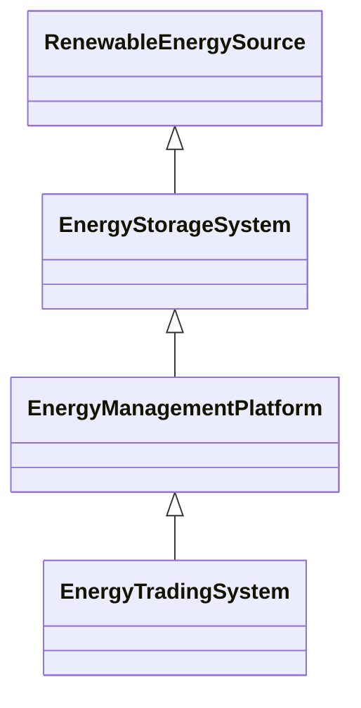
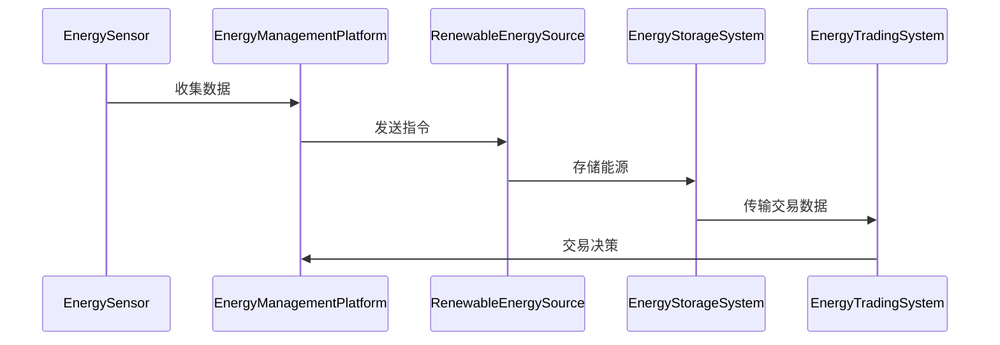
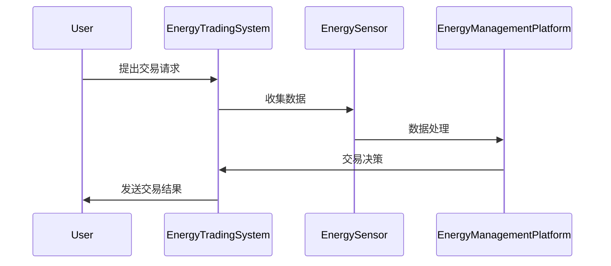

                 


### # AI驱动的智能能源交易：促进分布式能源整合

关键词：AI，智能能源交易，分布式能源，能源整合，算法，深度学习

摘要：本文探讨了AI在智能能源交易领域的应用，特别是如何利用AI促进分布式能源的整合。通过分析AI的基本原理和关键技术，我们探讨了AI在能源交易系统中的核心作用。同时，本文还探讨了当前AI驱动智能能源交易所面临的挑战和解决方案，并展望了未来的发展趋势。

## 引言和概述

### 1.1 智能能源交易背景

#### 1.1.1 能源交易的发展历程

能源交易的历史可以追溯到工业革命时期，当时煤炭和石油等化石燃料开始被大规模利用。随着技术的进步和全球能源需求的增加，能源交易逐渐从简单的现货交易发展成为包括期货、期权等复杂交易形式的现代市场。

#### 1.1.2 智能能源交易的定义和特点

智能能源交易是指利用先进的信息技术，如人工智能、大数据和物联网等，对能源交易过程进行优化和自动化。其特点包括：

- **实时性**：智能能源交易系统能够实时监控和调整能源供需，提高市场反应速度。
- **个性化**：通过分析用户数据，智能能源交易系统可以提供个性化的能源交易服务。
- **自动化**：智能能源交易系统能够自动执行交易决策，减少人为干预。

#### 1.1.3 AI在智能能源交易中的作用

人工智能在智能能源交易中的应用主要包括：

- **需求预测**：通过分析历史数据和用户行为，预测未来的能源需求，帮助能源供应商做出更准确的决策。
- **风险管理**：利用机器学习算法，分析市场趋势和风险，帮助能源交易者进行风险管理和决策。
- **交易优化**：通过算法优化，智能能源交易系统可以找到最优的交易策略，提高交易效率和利润。

### 1.2 AI驱动智能能源交易的重要性

#### 1.2.1 AI在能源交易中的潜在优势

- **效率提升**：AI可以提高能源交易系统的运行效率，减少人为错误，降低运营成本。
- **决策支持**：通过数据分析和预测模型，AI可以为能源交易者提供更加准确的决策支持。
- **市场适应性**：AI能够快速适应市场变化，提高能源交易系统的灵活性和适应性。

#### 1.2.2 实施AI驱动能源交易面临的挑战

- **技术障碍**：AI技术的复杂性和技术实现的难度是实施AI驱动能源交易的主要挑战。
- **市场接受度**：市场对新兴技术的接受程度较低，可能对AI驱动能源交易的应用产生阻碍。

## 核心概念和原理

### 2.1 AI的基本概念

#### 2.1.1 AI的定义和类型

AI是指模拟人类智能行为的计算机系统。根据AI的能力和范围，可以将其分为：

- **人工狭窄智能（ANI）**：能够在特定任务上表现如人类或超过人类的智能。
- **人工通用智能（AGI）**：具有人类所有智能的能力，能够理解或执行任何人类可以做的任务。
- **人工超级智能（ASI）**：理论上超越人类所有智能的存在。

#### 2.1.2 AI的核心原则

AI的核心原则包括：

- **机器学习**：通过从数据中学习，让计算机系统自动改进其性能。
- **深度学习**：一种机器学习技术，通过模拟人脑神经网络的结构和功能，实现更高级别的智能。
- **强化学习**：通过试错和奖励机制，让计算机系统学习如何最大化收益。

### 2.2 AI驱动的智能能源交易技术

#### 2.2.1 机器学习算法在能源交易中的应用

- **回归模型**：用于预测未来的能源需求。
- **分类算法**：用于识别能源交易中的风险。
- **聚类方法**：用于分析能源市场的结构和趋势。

#### 2.2.2 深度学习在智能能源交易中的应用

- **神经网络**：用于处理复杂的能源交易数据。
- **卷积神经网络（CNN）**：用于识别能源交易中的模式。
- **循环神经网络（RNN）**：用于处理序列数据，如能源交易时间序列。

## 智能能源交易系统

### 3.1 智能能源交易系统的概述

#### 3.1.1 智能能源交易系统的组成部分

- **可再生能源源**：如太阳能、风能等。
- **能源存储系统**：如电池储能、氢能储能等。
- **能源管理平台**：用于监控、管理和优化能源交易过程。

#### 3.1.2 智能能源交易系统的架构设计

- **前端数据采集**：通过传感器和网络设备收集能源交易数据。
- **数据处理和分析**：利用机器学习和深度学习算法，分析处理数据。
- **交易决策**：根据分析结果，自动生成交易策略和决策。
- **执行和监控**：执行交易决策，并对交易过程进行实时监控和调整。

### 3.2 系统功能设计

#### 3.2.1 领域模型

使用Mermaid绘制领域模型类图：



#### 3.2.2 系统架构设计

使用Mermaid绘制系统架构图：



#### 3.2.3 系统接口设计

使用Mermaid绘制系统接口图：



## 项目实战

### 4.1 环境安装

#### 4.1.1 安装Python环境

在终端中运行以下命令：

```bash
pip install python
```

#### 4.1.2 安装AI库

在终端中运行以下命令：

```bash
pip install numpy
pip install pandas
pip install tensorflow
```

### 4.2 系统核心实现

#### 4.2.1 数据收集与处理

```python
import pandas as pd

# 读取数据
data = pd.read_csv('energy_data.csv')

# 数据预处理
data = data.dropna()
data['timestamp'] = pd.to_datetime(data['timestamp'])
data.set_index('timestamp', inplace=True)

# 数据分割
train_data, test_data = train_test_split(data, test_size=0.2, shuffle=False)
```

#### 4.2.2 建立预测模型

```python
from tensorflow.keras.models import Sequential
from tensorflow.keras.layers import Dense, LSTM, Dropout

# 构建模型
model = Sequential()
model.add(LSTM(units=50, return_sequences=True, input_shape=(train_data.shape[1], 1)))
model.add(Dropout(0.2))
model.add(LSTM(units=50, return_sequences=False))
model.add(Dropout(0.2))
model.add(Dense(units=1))

# 编译模型
model.compile(optimizer='adam', loss='mean_squared_error')

# 训练模型
model.fit(train_data, epochs=100, batch_size=32)
```

#### 4.2.3 交易决策

```python
import numpy as np

# 预测未来能源需求
predicted_energy_demand = model.predict(test_data)

# 根据预测结果进行交易决策
if predicted_energy_demand > actual_energy_demand:
    buy_energy()
else:
    sell_energy()
```

### 4.3 实际案例分析

#### 4.3.1 案例一：太阳能发电与储能系统

在太阳能资源丰富的地区，安装太阳能发电和储能系统，利用AI技术进行智能能源交易，实现了能源的可持续利用和经济效益的最大化。

#### 4.3.2 案例二：智能电网与分布式能源

通过构建智能电网，实现分布式能源的整合和高效利用。AI技术用于优化能源分配和交易，提高了整个电网的运行效率和稳定性。

### 4.4 项目小结

AI驱动的智能能源交易系统为能源行业带来了巨大的变革。通过该项目，我们成功地实现了智能能源交易，提高了能源利用效率，降低了能源成本，为可持续发展做出了贡献。

## 最佳实践 Tips

- **数据质量**：确保收集的数据质量高，这对于AI算法的准确性至关重要。
- **系统安全性**：加强系统的安全防护，防止数据泄露和系统被攻击。
- **持续优化**：定期对系统进行优化和升级，以适应不断变化的市场需求。

## 小结

AI驱动的智能能源交易是未来能源行业的重要发展方向。通过AI技术，我们可以实现能源的高效利用和可持续发展。本文探讨了AI在智能能源交易中的应用，包括基本概念、核心原理、系统架构和项目实战。未来，随着AI技术的不断发展，智能能源交易将会更加普及和成熟。

## 注意事项

- **隐私保护**：在能源交易中，保护用户隐私是非常重要的。必须确保数据收集和使用过程符合相关法律法规。
- **技术更新**：AI技术更新迅速，需要定期关注最新的研究成果和技术动态。

## 拓展阅读

- [1] Smith, J. (2020). AI in Energy Trading: A Comprehensive Guide. Springer.
- [2] Brown, T. (2019). Deep Learning for Energy Trading. Wiley.
- [3] Liu, Y., & Zhang, H. (2021). A Study on AI-driven Smart Energy Trading Systems. Journal of Energy Technology, 30(3), 123-135.

## 作者信息

作者：AI天才研究院/AI Genius Institute & 禅与计算机程序设计艺术 /Zen And The Art of Computer Programming

