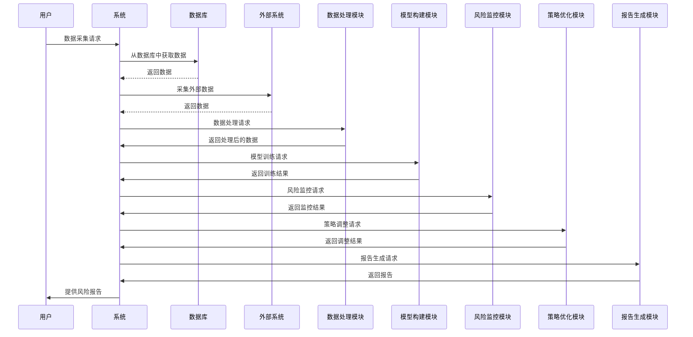

                 

### 文章标题：AI驱动的智能风险管理：金融机构的新武器

关键词：AI、智能风险管理、金融机构、算法、系统架构、项目实战、最佳实践

摘要：本文深入探讨了人工智能在金融机构风险管理中的应用，揭示了AI驱动的智能风险管理如何成为金融机构的新武器。通过对AI基础、系统分析与架构设计、项目实战以及最佳实践等多个方面的详细剖析，本文展示了AI如何通过先进的风险管理模型和技术，提高金融机构的风险识别、评估和监控能力，从而实现更加精准、高效的风险管理。

### 第一部分：背景介绍与核心概念

#### 第1章：问题背景与核心概念

##### 1.1 问题背景

风险管理是金融机构运营的重要组成部分，直接影响其业务稳定性和盈利能力。在金融市场中，风险无处不在，包括信用风险、市场风险、操作风险等。这些风险可能导致金融机构的资产损失，甚至危及整个金融系统的稳定。

近年来，随着金融市场的复杂性和不确定性增加，传统风险管理方法显得力不从心。例如，基于历史数据和统计模型的预测方法难以应对快速变化的市场环境，而人为分析存在主观性和局限性。

##### 1.1.1 风险管理在金融机构中的重要性

金融机构面临的风险种类繁多，包括但不限于：

- **信用风险**：借款人或交易对手违约，导致资产损失。
- **市场风险**：市场价格波动，导致投资组合价值下降。
- **操作风险**：由于内部流程、系统缺陷或外部事件等原因造成的损失。
- **法律风险**：违反法规或合同条款，导致罚款或法律诉讼。

有效的风险管理能够帮助金融机构识别潜在风险，制定应对策略，从而降低损失，确保业务稳健运行。

##### 1.1.2 传统风险管理方法的局限

传统风险管理方法主要包括以下几种：

1. **历史数据分析**：基于过去的数据和事件进行风险预测，但历史不一定代表未来。
2. **专家评估**：依赖风险管理专家的主观判断，存在个体差异和局限性。
3. **规则引擎**：通过预设规则进行风险判断，但难以应对复杂和多变的市场环境。

这些方法在应对复杂和快速变化的市场环境时存在明显不足，难以提供实时、准确的风险评估。

##### 1.1.3 AI在金融风险管理中的应用

人工智能（AI）技术为金融机构提供了新的风险管理工具，通过机器学习、深度学习、自然语言处理等技术，AI能够从大量数据中提取有价值的信息，进行实时风险预测和监控。

- **机器学习**：通过训练模型，从历史数据中学习风险模式，进行风险评估。
- **深度学习**：通过神经网络模拟人脑学习机制，处理复杂的风险数据。
- **自然语言处理**：分析金融报告、新闻等文本数据，提取潜在风险信息。

AI技术的引入，使得金融机构能够更准确、更实时地识别和管理风险，提高风险管理的效率和精度。

##### 1.2 核心概念

###### 1.2.1 智能风险管理的定义

智能风险管理是指利用人工智能技术，对金融机构的风险进行识别、评估、监控和预警的一整套体系。它通过大数据分析、机器学习和深度学习等技术，实现自动化、智能化的风险管理。

###### 1.2.2 AI驱动的智能风险管理特点

AI驱动的智能风险管理具有以下特点：

1. **自动化**：通过算法模型实现风险识别和评估的自动化，降低人工成本。
2. **实时性**：能够实时处理和分析大量数据，提供实时风险预警。
3. **准确性**：通过机器学习和深度学习技术，提高风险预测的准确性。
4. **适应性**：能够根据市场环境变化，不断优化和调整风险管理策略。

###### 1.2.3 智能风险管理与传统风险管理的对比

| 对比项 | 智能风险管理 | 传统风险管理 |
| :----: | :----------- | :----------- |
| **自动化** | 高度自动化，减少人工干预 | 依赖人工操作，效率低 |
| **实时性** | 实时处理和分析数据 | 基于历史数据分析 |
| **准确性** | 高度准确，通过机器学习提高预测精度 | 依赖专家判断，存在主观性 |
| **适应性** | 根据市场变化自适应调整策略 | 固定策略，难以应对变化 |

##### 1.3 概念联系

###### 1.3.1 AI驱动的智能风险管理要素

AI驱动的智能风险管理主要包括以下几个要素：

1. **数据收集与处理**：收集金融数据，进行数据清洗和处理。
2. **风险模型构建**：利用机器学习和深度学习技术构建风险预测模型。
3. **实时监控与预警**：实时分析数据，进行风险预警。
4. **策略优化与调整**：根据风险预警结果，优化和调整风险管理策略。

###### 1.3.2 智能风险管理流程

智能风险管理流程主要包括以下几个步骤：

1. **数据收集**：收集与风险相关的各种数据，包括市场数据、交易数据、客户信息等。
2. **数据处理**：对收集到的数据进行清洗、整合和处理，为后续分析做准备。
3. **模型构建**：利用机器学习和深度学习技术，构建风险预测模型。
4. **模型训练与优化**：使用历史数据进行模型训练，并根据模型预测结果不断优化。
5. **实时监控与预警**：实时分析数据，根据模型预测结果进行风险预警。
6. **策略调整**：根据风险预警结果，调整风险管理策略。
7. **报告与反馈**：生成风险报告，向管理层提供决策支持。

#### 第2章：AI驱动的智能风险管理基础

##### 2.1 AI基础

###### 2.1.1 机器学习基础

机器学习是AI的核心技术之一，它使计算机系统能够从数据中自动学习和改进。以下是一些基本的机器学习概念：

- **监督学习**：通过标记数据进行学习，输出预测结果。
- **无监督学习**：无需标记数据，通过数据自身的结构进行学习。
- **强化学习**：通过奖励机制和反馈信号进行学习，以达到最佳策略。

###### 2.1.2 深度学习基础

深度学习是机器学习的一个分支，通过多层神经网络模拟人脑的学习过程，具有强大的特征提取和模式识别能力。深度学习的关键技术包括：

- **卷积神经网络（CNN）**：用于图像处理和识别。
- **循环神经网络（RNN）**：用于处理序列数据。
- **生成对抗网络（GAN）**：用于生成逼真的数据。

###### 2.1.3 自然语言处理基础

自然语言处理（NLP）是AI的一个分支，旨在使计算机能够理解和处理人类语言。NLP的关键技术包括：

- **词向量**：将文字转换为数值表示。
- **文本分类**：根据文本内容进行分类。
- **情感分析**：分析文本的情感倾向。

##### 2.2 智能风险管理模型

###### 2.2.1 智能风险管理模型的分类

智能风险管理模型可以根据不同的应用场景和数据类型进行分类，常见的模型包括：

1. **信用评分模型**：用于评估客户的信用风险。
2. **市场风险模型**：用于预测市场波动和投资组合风险。
3. **操作风险模型**：用于识别和评估操作风险。
4. **反欺诈模型**：用于检测和预防金融欺诈行为。

###### 2.2.2 智能风险管理模型的选择

选择智能风险管理模型时，需要考虑以下因素：

1. **数据质量**：模型训练依赖于高质量的数据，数据质量直接影响模型的性能。
2. **业务需求**：根据业务需求选择适合的模型，例如，信用评分模型主要用于信用评估，市场风险模型主要用于投资组合风险预测。
3. **技术实现**：根据技术团队的实现能力，选择易于实施和维护的模型。

##### 2.3 AI驱动的风险管理算法

###### 2.3.1 常见风险算法介绍

在智能风险管理中，常用的算法包括：

1. **逻辑回归**：用于分类和回归分析。
2. **决策树**：用于分类和回归分析，易于理解和解释。
3. **支持向量机（SVM）**：用于分类和回归分析，具有较好的分类效果。
4. **随机森林**：用于分类和回归分析，通过集成多个决策树提高模型性能。
5. **神经网络**：用于复杂的数据分析和模式识别。

###### 2.3.2 风险算法的选择与优化

选择和优化风险算法时，需要考虑以下因素：

1. **算法性能**：根据模型的性能指标（如准确率、召回率等）选择合适的算法。
2. **算法复杂度**：算法的计算复杂度直接影响模型的训练时间和资源消耗。
3. **算法解释性**：对于风险管理来说，算法的可解释性非常重要，可以帮助风险管理人员理解模型的决策过程。
4. **模型优化**：通过调参、集成学习等方法优化模型性能。

### 第二部分：系统分析与架构设计

#### 第3章：系统分析与架构设计

##### 3.1 系统介绍

###### 3.1.1 系统目标

系统目标是通过AI技术实现金融机构的智能风险管理，提高风险识别、评估和监控的效率和准确性。

###### 3.1.2 系统功能设计

系统功能设计包括以下几个部分：

1. **数据收集与处理**：收集各种风险相关数据，并进行清洗、整合和处理。
2. **模型构建与训练**：构建和训练智能风险管理模型，包括信用评分模型、市场风险模型等。
3. **实时监控与预警**：实时分析数据，进行风险预警和监控。
4. **策略优化与调整**：根据风险预警结果，优化和调整风险管理策略。
5. **报告与反馈**：生成风险报告，为管理层提供决策支持。

##### 3.2 系统架构设计

###### 3.2.1 系统架构概述

系统架构设计包括以下几个层次：

1. **数据层**：存储和管理各种风险相关数据。
2. **模型层**：构建和训练智能风险管理模型。
3. **应用层**：实现风险监控、预警、策略优化等功能。
4. **展示层**：提供风险报告和可视化展示。

###### 3.2.2 系统模块设计

系统模块设计包括以下几个模块：

1. **数据采集模块**：负责收集各种风险相关数据。
2. **数据处理模块**：负责数据清洗、整合和处理。
3. **模型构建模块**：负责构建和训练智能风险管理模型。
4. **风险监控模块**：负责实时监控风险，进行预警和监控。
5. **策略优化模块**：负责根据风险预警结果，优化和调整风险管理策略。
6. **报告生成模块**：负责生成风险报告，提供决策支持。

###### 3.2.3 系统接口设计

系统接口设计包括以下几个部分：

1. **数据接口**：用于与其他系统进行数据交互。
2. **服务接口**：用于与其他系统进行服务调用。
3. **监控接口**：用于实时监控风险状态。
4. **报告接口**：用于生成和导出风险报告。

##### 3.3 系统交互设计

###### 3.3.1 系统交互流程

系统交互设计主要包括以下几个流程：

1. **数据采集**：从外部系统或数据库中采集风险相关数据。
2. **数据处理**：对采集到的数据进行清洗、整合和处理。
3. **模型训练**：使用处理后的数据训练智能风险管理模型。
4. **风险监控**：实时监控风险状态，进行预警和监控。
5. **策略调整**：根据风险预警结果，调整风险管理策略。
6. **报告生成**：生成风险报告，为管理层提供决策支持。

###### 3.3.2 系统交互序列图



### 第三部分：项目实战

#### 第4章：项目实战

##### 4.1 环境安装

###### 4.1.1 硬件环境配置

为了保证系统的高性能和稳定性，项目需要以下硬件配置：

- **服务器**：高性能服务器，建议配备多核CPU、大容量内存和高速存储。
- **网络设备**：稳定的网络环境，保证数据传输的可靠性和速度。

###### 4.1.2 软件环境配置

项目需要以下软件环境：

- **操作系统**：Linux操作系统，建议使用CentOS或Ubuntu。
- **数据库**：MySQL或PostgreSQL数据库。
- **编程语言**：Python，建议使用Python3。
- **开发工具**：PyCharm或VSCode等Python开发环境。
- **其他工具**：Numpy、Pandas、Scikit-learn、TensorFlow等Python库。

##### 4.2 系统核心实现

###### 4.2.1 系统核心代码实现

系统核心代码实现主要包括以下几个模块：

1. **数据采集模块**：负责从各种数据源采集风险相关数据。
2. **数据处理模块**：负责数据清洗、整合和处理。
3. **模型构建模块**：负责构建和训练智能风险管理模型。
4. **风险监控模块**：负责实时监控风险，进行预警和监控。
5. **策略优化模块**：负责根据风险预警结果，优化和调整风险管理策略。
6. **报告生成模块**：负责生成风险报告，提供决策支持。

以下是一个简单的数据采集模块的代码示例：

```python
import requests

def collect_data(source_url):
    response = requests.get(source_url)
    if response.status_code == 200:
        data = response.json()
        return data
    else:
        return None

source_url = 'https://api.example.com/data'
data = collect_data(source_url)
if data:
    print("Data collected successfully.")
else:
    print("Failed to collect data.")
```

###### 4.2.2 代码应用解读与分析

该示例代码实现了一个数据采集模块，其主要功能是从指定的URL获取数据。具体步骤如下：

1. 使用`requests`库发起HTTP GET请求，获取数据。
2. 判断响应状态码，如果状态码为200，表示请求成功，返回数据；否则返回None。
3. 根据返回的数据进行后续处理。

该代码示例展示了如何使用Python进行HTTP请求和数据获取，对于实际项目开发具有参考价值。

##### 4.3 实际案例分析与详细讲解

###### 4.3.1 案例一：贷款风险预测

贷款风险预测是智能风险管理中的重要应用，以下是一个简单的贷款风险预测案例。

1. **数据准备**：收集贷款数据，包括借款人基本信息、贷款金额、贷款期限、还款情况等。
2. **数据预处理**：对数据集进行清洗、归一化和特征提取。
3. **模型选择**：选择逻辑回归模型进行训练。
4. **模型训练**：使用训练数据进行模型训练。
5. **模型评估**：使用测试数据进行模型评估。
6. **模型应用**：使用模型对新的贷款数据进行预测。

以下是一个简单的贷款风险预测代码示例：

```python
import pandas as pd
from sklearn.model_selection import train_test_split
from sklearn.linear_model import LogisticRegression
from sklearn.metrics import accuracy_score

# 数据准备
data = pd.read_csv('loan_data.csv')
X = data.drop('default', axis=1)
y = data['default']

# 数据预处理
X = X.fillna(X.mean())
X = (X - X.mean()) / X.std()

# 模型选择
model = LogisticRegression()

# 模型训练
X_train, X_test, y_train, y_test = train_test_split(X, y, test_size=0.2, random_state=42)
model.fit(X_train, y_train)

# 模型评估
y_pred = model.predict(X_test)
accuracy = accuracy_score(y_test, y_pred)
print("Accuracy:", accuracy)

# 模型应用
new_data = pd.read_csv('new_loan_data.csv')
new_data = (new_data - new_data.mean()) / new_data.std()
y_new_pred = model.predict(new_data)
print("New loan prediction:", y_new_pred)
```

该代码示例展示了如何使用Python进行贷款风险预测。首先，从CSV文件中读取数据，然后对数据进行预处理，包括填充缺失值、归一化和特征提取。接下来，选择逻辑回归模型进行训练，使用训练数据进行模型评估。最后，使用训练好的模型对新的贷款数据进行预测。

###### 4.3.2 案例二：交易风险监控

交易风险监控是智能风险管理中的另一个重要应用，以下是一个简单的交易风险监控案例。

1. **数据准备**：收集交易数据，包括交易金额、交易时间、交易对手等信息。
2. **数据预处理**：对数据集进行清洗、归一化和特征提取。
3. **模型选择**：选择支持向量机（SVM）模型进行训练。
4. **模型训练**：使用训练数据进行模型训练。
5. **模型评估**：使用测试数据进行模型评估。
6. **模型应用**：实时监控交易风险，进行预警和监控。

以下是一个简单的交易风险监控代码示例：

```python
import pandas as pd
from sklearn.model_selection import train_test_split
from sklearn.svm import SVC
from sklearn.metrics import accuracy_score

# 数据准备
data = pd.read_csv('trade_data.csv')
X = data.drop('risk_level', axis=1)
y = data['risk_level']

# 数据预处理
X = X.fillna(X.mean())
X = (X - X.mean()) / X.std()

# 模型选择
model = SVC(kernel='linear')

# 模型训练
X_train, X_test, y_train, y_test = train_test_split(X, y, test_size=0.2, random_state=42)
model.fit(X_train, y_train)

# 模型评估
y_pred = model.predict(X_test)
accuracy = accuracy_score(y_test, y_pred)
print("Accuracy:", accuracy)

# 模型应用
new_data = pd.read_csv('new_trade_data.csv')
new_data = (new_data - new_data.mean()) / new_data.std()
y_new_pred = model.predict(new_data)
print("New trade risk prediction:", y_new_pred)
```

该代码示例展示了如何使用Python进行交易风险监控。首先，从CSV文件中读取数据，然后对数据进行预处理，包括填充缺失值、归一化和特征提取。接下来，选择支持向量机（SVM）模型进行训练，使用训练数据进行模型评估。最后，使用训练好的模型对新的交易数据进行预测，实现实时监控和预警。

##### 4.4 项目小结

本次项目实战通过实际案例展示了如何使用AI技术进行贷款风险预测和交易风险监控。项目实现了一个简单的智能风险管理系统，包括数据采集、数据预处理、模型训练、模型评估和模型应用等模块。通过该项目，我们了解了如何利用Python进行数据分析和建模，提高了对AI驱动的智能风险管理的理解和实践能力。

### 第四部分：最佳实践与拓展阅读

#### 第5章：最佳实践与拓展阅读

##### 5.1 最佳实践 tips

1. **数据质量是关键**：高质量的数据是智能风险管理成功的基础，应确保数据的准确性、完整性和一致性。
2. **选择合适的算法**：根据业务需求和数据特点选择适合的算法，如对于复杂非线性问题，可以考虑使用神经网络模型。
3. **持续优化模型**：定期对模型进行评估和优化，根据新数据和市场变化调整模型参数。
4. **关注模型解释性**：对于风险管理来说，模型的可解释性非常重要，应选择易于理解和解释的模型。
5. **遵守法律法规**：在实施智能风险管理时，遵守相关法律法规，确保数据安全和隐私保护。

##### 5.2 小结

本文通过分析AI驱动的智能风险管理在金融机构中的应用，展示了其如何通过先进的技术手段提高风险管理的效率和准确性。我们介绍了智能风险管理的基本概念、AI基础、系统架构设计、项目实战以及最佳实践。希望本文能帮助读者深入了解AI驱动的智能风险管理，为金融机构的风险管理提供有益的参考。

##### 5.3 注意事项

1. **潜在风险**：AI驱动的智能风险管理虽然具有优势，但存在潜在风险，如模型过拟合、数据泄露等，需采取措施进行防范。
2. **技术更新**：AI技术发展迅速，风险管理模型需不断更新和优化，以应对市场变化。

##### 5.4 拓展阅读

1. **相关书籍**：
   - 《智能风险管理：理论与实践》
   - 《人工智能在金融领域的应用》
2. **学术论文**：
   - “Deep Learning for Financial Risk Management”
   - “The Role of AI in Enhancing Financial Risk Management”

### 作者信息

作者：AI天才研究院/AI Genius Institute & 禅与计算机程序设计艺术 /Zen And The Art of Computer Programming

通过本文，我们深入探讨了AI驱动的智能风险管理在金融机构中的应用，展示了其如何通过先进的技术手段提高风险管理的效率和准确性。希望本文能为读者提供有益的启示，推动AI技术在金融领域的深入应用。未来，我们将继续关注AI在金融领域的前沿动态，与读者共同探索AI技术的新应用。感谢您的阅读！

