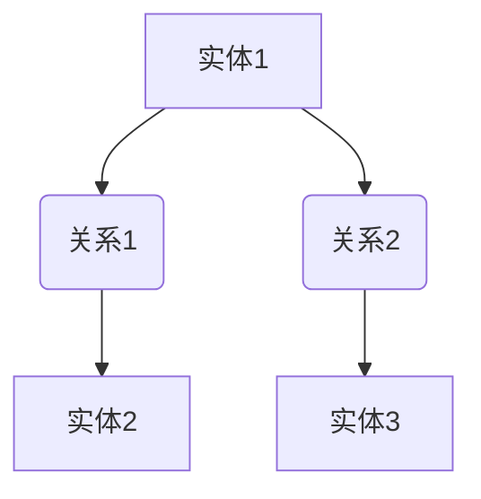

                 

# AI驱动的知识挖掘系统：提取数据价值

> 关键词：知识挖掘、人工智能、数据预处理、知识抽取、知识表示、知识推理

> 摘要：
本文将深入探讨AI驱动的知识挖掘系统，从数据预处理到知识推理的各个环节，详细介绍如何利用人工智能技术从海量数据中提取有价值的信息。我们将通过逐步分析，揭示知识挖掘系统的核心原理和关键技术，以帮助读者更好地理解和应用这一领域。

## 目录大纲

----------------------------------------------------------------

# AI驱动的知识挖掘系统：提取数据价值

> 关键词：知识挖掘、人工智能、数据预处理、知识抽取、知识表示、知识推理

> 摘要：
本文将深入探讨AI驱动的知识挖掘系统，从数据预处理到知识推理的各个环节，详细介绍如何利用人工智能技术从海量数据中提取有价值的信息。我们将通过逐步分析，揭示知识挖掘系统的核心原理和关键技术，以帮助读者更好地理解和应用这一领域。

## 第一部分: AI驱动的知识挖掘系统概述

## 第1章: 知识挖掘系统基础

### 1.1 知识挖掘系统的概念与重要性

### 1.2 知识挖掘系统的核心组成部分

### 1.3 知识挖掘系统的应用领域

### 1.4 知识挖掘系统的挑战与机遇

## 第2章: 数据预处理

### 2.1 数据清洗

### 2.2 数据整合

### 2.3 数据转换

### 2.4 数据归一化

## 第3章: 知识抽取

### 3.1 实体抽取

### 3.2 关系抽取

### 3.3 命名实体识别

### 3.4 事件抽取

## 第4章: 知识表示

### 4.1 知识图谱简介

### 4.2 知识图谱构建方法

### 4.3 知识图谱的应用

### 4.4 知识图谱的优化与维护

## 第5章: 知识推理与演化

### 5.1 知识推理概述

### 5.2 基于规则的知识推理

### 5.3 基于本体论的知识推理

### 5.4 知识演化机制

## 第6章: 知识应用

### 6.1 知识服务平台

### 6.2 知识驱动的决策支持

### 6.3 知识服务在行业中的应用

### 6.4 知识服务的挑战与未来发展趋势

## 第7章: AI驱动的知识挖掘系统实战

### 7.1 系统需求分析与设计

### 7.2 数据预处理实践

### 7.3 知识抽取实践

### 7.4 知识表示与实践

### 7.5 知识推理与演化实践

### 7.6 知识服务平台实践

### 7.7 项目总结与展望

----------------------------------------------------------------

## 第1章: 知识挖掘系统基础

### 1.1 知识挖掘系统的概念与重要性

知识挖掘系统（Knowledge Mining System）是一种利用人工智能技术从海量数据中提取有用信息和知识的技术系统。它通过数据预处理、知识抽取、知识表示、知识推理等环节，将原始数据转化为有价值的信息，为决策支持、行业应用等提供支持。

知识挖掘系统的重要性在于：

1. **数据价值提取**：在海量数据中，往往蕴含着大量有价值的信息，通过知识挖掘系统，可以有效地提取这些信息。
2. **智能决策支持**：知识挖掘系统可以为各个行业的决策提供数据支撑，提高决策的准确性。
3. **行业应用创新**：知识挖掘系统可以应用于金融、医疗、电商等多个领域，推动行业创新发展。
4. **大数据分析**：知识挖掘系统是大数据分析的重要环节，有助于深入理解和挖掘数据背后的规律。

### 1.2 知识挖掘系统的核心组成部分

知识挖掘系统主要包括以下几个核心组成部分：

1. **数据源**：包括各种结构化数据、非结构化数据和半结构化数据，如数据库、文本、图像、音频等。
2. **数据预处理**：对原始数据进行清洗、整合、转换和归一化，以提高数据质量。
3. **知识抽取**：从数据中提取结构化的知识，如实体、关系、事件等。
4. **知识表示**：将抽取的知识以图形、表格等形式呈现，便于后续推理和应用。
5. **知识推理**：根据已有知识进行逻辑推理，发现新的知识和关系。
6. **知识应用**：将挖掘出的知识应用于实际的业务场景，如智能决策支持、行业应用等。

### 1.3 知识挖掘系统的应用领域

知识挖掘系统广泛应用于各个行业，以下是一些典型的应用领域：

1. **金融**：通过对交易数据的挖掘，可以识别潜在的风险和欺诈行为，为金融机构提供风险控制依据。
2. **医疗**：通过对病历数据的挖掘，可以发现疾病的潜在规律，为医生提供诊断和治疗建议。
3. **电商**：通过对用户行为数据的挖掘，可以识别用户的偏好和需求，为电商平台提供个性化推荐服务。
4. **物联网**：通过对传感器数据的挖掘，可以实时监测设备的运行状态，为设备维护和优化提供支持。
5. **智能城市**：通过对城市运行数据的挖掘，可以优化交通管理、环境监测等，提高城市管理效率。

### 1.4 知识挖掘系统的挑战与机遇

知识挖掘系统在发展过程中面临着一些挑战和机遇：

1. **数据质量**：数据质量直接影响知识挖掘的效果，因此如何提高数据质量是一个重要的挑战。
2. **计算性能**：知识挖掘系统需要处理海量数据，如何提高计算性能是一个关键问题。
3. **知识表示**：如何有效地表示和存储知识，以便于后续的推理和应用，是一个重要的研究方向。
4. **跨领域应用**：知识挖掘系统需要在不同领域间进行应用，如何适应不同领域的需求是一个挑战。
5. **智能化水平**：随着人工智能技术的发展，如何进一步提高知识挖掘系统的智能化水平，是一个重要的机遇。

在接下来的章节中，我们将逐步深入探讨知识挖掘系统的各个环节，包括数据预处理、知识抽取、知识表示、知识推理和知识应用，以帮助读者更好地理解和应用这一领域。 <a name="ke1"></a>

## 第2章: 数据预处理

数据预处理是知识挖掘系统的第一步，其目标是将原始数据转化为适合知识抽取和表示的形式。数据预处理过程包括数据清洗、数据整合、数据转换和数据归一化等步骤，下面我们逐一进行介绍。

### 2.1 数据清洗

数据清洗是数据预处理过程中最重要的一步，其目的是去除数据中的噪声、错误和冗余信息，以提高数据质量。数据清洗的主要任务包括：

- **去除重复数据**：在数据集中可能会存在重复的数据条目，这些重复数据会影响后续的分析结果。
- **处理缺失数据**：缺失数据可能会导致分析结果不准确，需要采取适当的策略进行处理，如填充、删除或利用其他数据源进行补充。
- **纠正错误数据**：数据在采集、传输和处理过程中可能会出现错误，需要对这些错误数据进行识别和纠正。

数据清洗的方法有多种，如基于规则的方法、基于机器学习的方法和基于人工审核的方法。在实际应用中，通常需要根据数据的特点和需求选择合适的方法。

### 2.2 数据整合

数据整合是将来自不同数据源的数据进行整合，形成一个统一的数据集。数据整合的主要任务包括：

- **数据源识别**：识别数据源，确定需要整合的数据。
- **数据映射**：将不同数据源中的数据字段进行映射，确保数据在整合后具有一致的格式和结构。
- **数据合并**：将映射后的数据进行合并，形成一个完整的数据集。

数据整合的方法通常包括基于数据库的方法、基于ETL（Extract, Transform, Load）的方法和基于数据仓库的方法。在实际应用中，需要根据数据的特点和需求选择合适的方法。

### 2.3 数据转换

数据转换是将数据从一种格式转换为另一种格式，以便于后续的处理和分析。数据转换的主要任务包括：

- **数据格式转换**：将数据从一种格式（如文本、图像、音频等）转换为另一种格式（如表格、数据库等）。
- **数据类型转换**：将数据类型从一种形式（如字符串、数字等）转换为另一种形式，以便于后续的处理和分析。
- **数据规范化**：将数据按照一定的标准进行规范化处理，确保数据的一致性和可操作性。

数据转换的方法通常包括编程方法、工具方法和混合方法。在实际应用中，需要根据数据的特点和需求选择合适的方法。

### 2.4 数据归一化

数据归一化是将数据按比例缩放，使其在相同的尺度范围内，以便于后续的处理和分析。数据归一化的主要任务包括：

- **数值范围归一化**：将数据的数值范围限制在一个特定的区间内，如0到1或-1到1。
- **小数点归一化**：将数据的小数点位置进行移动，使其成为整数。
- **标准化**：将数据的分布调整为标准正态分布。

数据归一化的方法包括线性归一化、幂归一化和对数归一化等。在实际应用中，需要根据数据的特点和需求选择合适的方法。

### 2.5 数据预处理的重要性

数据预处理在知识挖掘系统中具有至关重要的地位，其重要性体现在以下几个方面：

- **数据质量保障**：数据预处理可以去除数据中的噪声、错误和冗余信息，提高数据质量。
- **后续处理效率**：高质量的数据可以减少后续处理和分析的工作量，提高系统的处理效率。
- **结果准确性**：高质量的数据可以确保分析结果的准确性，避免因数据质量问题导致的结果偏差。

总之，数据预处理是知识挖掘系统的关键环节，其质量直接影响知识挖掘的效果。只有通过高质量的数据预处理，才能确保知识挖掘系统能够从海量数据中提取出有价值的信息。

### 2.6 数据预处理的技术和工具

在数据预处理过程中，通常会使用到多种技术和工具，以下是一些常见的技术和工具：

- **编程语言**：Python、Java、R等编程语言可以用于实现数据清洗、整合、转换和归一化等操作。
- **数据处理库**：如Python的pandas库、NumPy库，Java的Apache Commons Math库等，可以方便地实现数据预处理任务。
- **数据集成工具**：如Apache Kafka、Apache Flume等，可以用于实时数据集成和处理。
- **数据清洗工具**：如OpenRefine、DataWrangler等，可以方便地实现数据清洗任务。
- **数据转换工具**：如ETL工具（如Apache NiFi、Talend等），可以用于数据转换和集成任务。

通过使用这些技术和工具，可以高效地完成数据预处理任务，为知识挖掘系统提供高质量的数据输入。

### 2.7 数据预处理案例分析

为了更好地理解数据预处理的过程和重要性，我们来看一个实际案例。

假设我们有一个包含客户购买行为的数据集，数据集包含客户ID、购买商品ID、购买时间、购买金额等信息。为了进行知识挖掘，我们需要对数据进行预处理。

首先，我们使用Python的pandas库对数据进行读取和初步检查，发现数据中存在以下问题：

1. **缺失数据**：部分记录中的购买金额缺失，需要处理。
2. **重复数据**：部分记录存在重复，需要去除。
3. **异常数据**：部分记录的购买金额异常，需要检查和处理。

针对这些问题，我们采取了以下措施：

1. **处理缺失数据**：对于购买金额缺失的记录，我们使用平均值进行填充。
2. **去除重复数据**：使用pandas的drop_duplicates方法去除重复记录。
3. **处理异常数据**：对于购买金额异常的记录，我们进行进一步检查，发现是数据输入错误，将其删除。

经过数据预处理后，我们得到了一个高质量的数据集，可以用于后续的知识挖掘任务。

通过这个案例，我们可以看到数据预处理在知识挖掘中的重要性。只有通过高质量的数据预处理，才能确保知识挖掘系统能够从数据中提取出有价值的信息。

### 2.8 总结

本章介绍了数据预处理在知识挖掘系统中的重要性，以及数据预处理的过程和技术。数据预处理包括数据清洗、数据整合、数据转换和数据归一化等步骤，通过这些步骤，我们可以将原始数据转化为适合知识抽取和表示的形式。在接下来的章节中，我们将继续探讨知识抽取、知识表示、知识推理和知识应用等环节，帮助读者深入理解和应用知识挖掘系统。 <a name="ke2"></a>

## 第3章: 知识抽取

知识抽取（Knowledge Extraction）是从原始数据中提取结构化知识的过程，是知识挖掘系统中的核心环节。知识抽取的主要任务包括实体抽取、关系抽取、命名实体识别和事件抽取等。在本章中，我们将逐一介绍这些任务及其相关技术。

### 3.1 实体抽取

实体抽取（Entity Extraction）是指从非结构化或半结构化数据中识别出具有特定意义的实体，如人名、组织名、地理位置、产品名称等。实体抽取的目的是为后续的知识表示和推理提供基础数据。

实体抽取技术主要包括：

- **规则方法**：通过预定义的规则和模式匹配来识别实体，如基于词典的方法和基于正则表达式的方法。
- **机器学习方法**：通过训练模型来识别实体，如使用分类算法和序列标注算法。
- **深度学习方法**：使用神经网络模型来识别实体，如基于RNN、LSTM和BERT的实体抽取模型。

### 3.2 关系抽取

关系抽取（Relationship Extraction）是指从文本中识别出实体之间的语义关系，如“张三是李四的父亲”、“百度是一家搜索引擎公司”等。关系抽取的结果通常以三元组（主体、关系、客体）的形式表示。

关系抽取技术主要包括：

- **规则方法**：通过预定义的规则来识别实体之间的关系。
- **基于知识库的方法**：利用预构建的知识库来识别实体之间的关系。
- **基于机器学习方法**：通过训练模型来识别实体之间的关系，如使用分类算法和序列标注算法。
- **基于深度学习方法**：使用神经网络模型来识别实体之间的关系。

### 3.3 命名实体识别

命名实体识别（Named Entity Recognition, NER）是指从文本中识别出具有特定意义的实体，并将其分类为不同的实体类别，如人名、组织名、地理位置等。命名实体识别是自然语言处理（Natural Language Processing, NLP）领域的一个重要任务。

命名实体识别技术主要包括：

- **基于词典的方法**：通过预定义的词典来识别实体，如使用实体识别词典和词性标注词典。
- **基于规则的方法**：通过预定义的规则来识别实体，如基于语法规则和语义规则的方法。
- **基于机器学习方法**：通过训练模型来识别实体，如使用分类算法和序列标注算法。
- **基于深度学习方法**：使用神经网络模型来识别实体，如基于CNN、RNN和Transformer的命名实体识别模型。

### 3.4 事件抽取

事件抽取（Event Extraction）是指从文本中识别出描述事件的信息，并提取出事件的三元组（事件类型、触发词、参与者）。事件抽取的目标是构建一个事件库，用于后续的推理和分析。

事件抽取技术主要包括：

- **基于规则的方法**：通过预定义的规则来识别事件。
- **基于机器学习方法**：通过训练模型来识别事件，如使用分类算法和序列标注算法。
- **基于深度学习方法**：使用神经网络模型来识别事件，如基于RNN、LSTM和Transformer的事件抽取模型。

### 3.5 知识抽取的挑战与优化

知识抽取在实际应用中面临以下挑战：

- **数据多样性**：不同领域的文本数据具有不同的特点，如何适应不同的数据类型是一个挑战。
- **噪声干扰**：文本数据中存在大量的噪声，如错误、歧义等，如何有效处理噪声是一个问题。
- **实时性**：知识抽取需要快速处理大量文本数据，如何提高系统的实时性是一个挑战。

为了解决这些挑战，可以采取以下优化策略：

- **多模型融合**：结合多种知识抽取模型，如规则方法、机器学习方法、深度学习方法等，以提高抽取效果。
- **迁移学习**：利用预训练的模型和大规模语料库，通过迁移学习来适应不同的领域和数据类型。
- **数据增强**：通过数据增强技术，如数据扩充、数据标注等，来提高训练数据的多样性和质量。
- **实时优化**：采用分布式计算、并行处理等技术，以提高系统的实时性。

### 3.6 知识抽取的应用实例

以下是一个知识抽取的应用实例：

假设我们有一个包含新闻报道的文本数据集，数据集中包含了各种事件描述。为了从这些文本数据中提取知识，我们使用了基于深度学习的事件抽取模型。

首先，我们对文本数据进行预处理，包括分词、词性标注和命名实体识别等步骤，以获得结构化的文本表示。

然后，我们使用预训练的BERT模型对文本进行编码，得到文本的序列表示。

接下来，我们使用基于Transformer的事件抽取模型，对编码后的文本进行事件抽取。模型会识别出事件类型、触发词和参与者，并输出事件的三元组。

最后，我们将抽取出的知识存储到知识图谱中，以便于后续的推理和应用。

通过这个实例，我们可以看到知识抽取在信息提取和知识管理中的应用价值。知识抽取技术不仅可以帮助我们从海量文本数据中提取有价值的信息，还可以为各种应用场景提供数据支持。

### 3.7 总结

本章介绍了知识抽取的重要任务，包括实体抽取、关系抽取、命名实体识别和事件抽取等。知识抽取是知识挖掘系统中的核心环节，其技术主要包括规则方法、机器学习方法、深度学习方法等。在接下来的章节中，我们将继续探讨知识表示、知识推理和知识应用等环节，帮助读者深入理解和应用知识挖掘系统。 <a name="ke3"></a>

## 第4章: 知识表示

知识表示（Knowledge Representation）是将从数据中抽取的知识以图形、表格等形式呈现的过程，是知识挖掘系统中的重要环节。有效的知识表示可以提高知识的可操作性和可用性，为后续的知识推理和应用提供支持。本章将详细介绍知识表示的概念、方法及其应用。

### 4.1 知识图谱简介

知识图谱（Knowledge Graph）是一种用于表示知识结构的数据模型，它通过实体、关系和属性来描述现实世界中的各种信息。知识图谱的目的是将分散的数据和知识整合起来，形成一个全局的、结构化的知识网络，以便于检索、推理和应用。

知识图谱的特点包括：

- **全局性**：知识图谱能够从全局视角整合各类数据，形成一个统一的视图。
- **结构化**：知识图谱通过实体、关系和属性来组织数据，使得数据具有明确的语义和结构。
- **动态性**：知识图谱可以实时更新和演化，以适应数据的变化和知识的需求。

知识图谱的应用非常广泛，包括搜索引擎、智能问答、推荐系统、语义理解等领域。

### 4.2 知识图谱构建方法

知识图谱的构建主要包括数据源选择、实体识别、关系抽取、属性抽取和知识融合等步骤。

- **数据源选择**：选择合适的数据源，包括结构化数据、非结构化数据和半结构化数据，如数据库、文本、图像、音频等。
- **实体识别**：从数据源中识别出具有特定意义的实体，如人、组织、地点、物品等。
- **关系抽取**：从数据源中识别出实体之间的关系，如“张三是李四的父亲”、“百度是一家搜索引擎公司”等。
- **属性抽取**：从数据源中识别出实体的属性，如“张三的年龄是30岁”、“百度成立于2000年”等。
- **知识融合**：将不同数据源中的知识和信息进行整合，形成一个全局的知识图谱。

知识图谱的构建方法主要包括基于规则的方法、基于机器学习的方法和基于深度学习的方法。

- **基于规则的方法**：通过预定义的规则和模式匹配来构建知识图谱，如基于本体论的方法和基于图谱模板的方法。
- **基于机器学习方法**：通过训练模型来构建知识图谱，如使用分类算法、聚类算法和关联规则挖掘算法等。
- **基于深度学习方法**：使用神经网络模型来构建知识图谱，如基于图神经网络（Graph Neural Network, GNN）的方法和基于Transformer的方法。

### 4.3 知识图谱的应用

知识图谱在多个领域具有广泛的应用，以下是一些典型的应用场景：

- **搜索引擎**：通过知识图谱，搜索引擎可以提供更加精准和智能的搜索结果，如关联搜索、同义词搜索等。
- **智能问答**：知识图谱可以帮助智能问答系统理解用户的问题，提供准确的答案。
- **推荐系统**：知识图谱可以帮助推荐系统发现用户之间的潜在关联，提供更加个性化的推荐。
- **语义理解**：知识图谱可以用于自然语言处理（NLP）任务，如文本分类、情感分析、机器翻译等，提高系统的语义理解能力。
- **行业应用**：知识图谱可以应用于金融、医疗、电商、物联网等领域，提供智能化的决策支持和服务。

### 4.4 知识图谱的优化与维护

知识图谱的优化和维护是确保其质量和可用性的重要环节。以下是一些优化和维护策略：

- **数据更新**：定期更新知识图谱中的数据，以反映现实世界的变化。
- **数据质量检查**：对知识图谱中的数据质量进行检查，如检测和修复数据错误、消除冗余数据等。
- **知识融合**：通过合并相同或相似的知识，提高知识图谱的紧凑性和一致性。
- **数据压缩**：对知识图谱进行压缩，减少存储空间和计算资源的需求。
- **索引构建**：构建高效的索引，以提高知识图谱的检索速度。
- **用户反馈**：收集用户对知识图谱的反馈，根据用户的实际需求进行优化和调整。

### 4.5 知识图谱案例分析

以下是一个知识图谱的实际案例：

假设我们有一个电子商务领域的知识图谱，数据源包括商品信息、用户评价、促销活动等。

首先，我们从数据源中识别出实体，如商品、用户、促销活动等。

然后，我们抽取实体之间的关系，如“商品A由品牌B生产”、“用户C评价了商品D”等。

接下来，我们抽取实体的属性，如“商品E的价格为100元”、“用户F的等级为5星”等。

最后，我们将这些知识和信息整合到一个知识图谱中，以便于后续的推理和应用。

通过这个案例，我们可以看到知识图谱在电子商务领域的应用价值，它可以帮助电商平台提供智能化的推荐和服务。

### 4.6 总结

本章介绍了知识表示的概念、方法及其应用，特别是知识图谱在知识表示中的重要作用。知识图谱通过实体、关系和属性的表示，将知识结构化并整合到一个全局的视图，为后续的知识推理和应用提供了基础。在接下来的章节中，我们将继续探讨知识推理和知识应用等环节，帮助读者深入理解和应用知识挖掘系统。 <a name="ke4"></a>

## 第5章: 知识推理与演化

知识推理（Knowledge Reasoning）是基于已有知识进行逻辑推理，以发现新的知识和关系。知识演化（Knowledge Evolution）是指知识系统随着时间推移而发生变化的过程。知识推理和演化是知识挖掘系统中的重要环节，有助于提高系统的智能化水平。本章将详细介绍知识推理和知识演化的基本概念、方法及其应用。

### 5.1 知识推理概述

知识推理是指利用已有的知识库和数据，通过逻辑推理、统计分析等方法，发现新的知识和关系。知识推理可以分为以下几种类型：

1. **基于规则的推理**：利用预定义的规则进行推理，如演绎推理和归纳推理。
2. **基于模型的推理**：利用机器学习模型和深度学习模型进行推理，如神经网络模型和图神经网络模型。
3. **基于本体的推理**：利用本体论和本体模型进行推理，如基于OWL（Web Ontology Language）的推理。
4. **基于统计的推理**：利用统计分析方法进行推理，如关联规则挖掘和聚类分析。

知识推理的目标是从已知信息中推断出未知信息，以提高知识系统的智能化水平。

### 5.2 基于规则的知识推理

基于规则的知识推理是指利用预定义的规则进行推理，这是一种传统的推理方法。规则通常以“如果-那么”的形式表示，如“如果一个人年龄大于18岁，那么他是成年人”。

基于规则的知识推理可以分为以下几种：

1. **演绎推理**：从一般性的前提推导出特定性的结论，如“所有人都会死亡，苏格拉底是人，因此苏格拉底会死亡”。
2. **归纳推理**：从特定性的实例推导出一般性的结论，如“所有观察到的天鹅都是白色的，因此所有天鹅都是白色的”。
3. **逆推理**：从结论推导出前提，如“如果一个人是成年人，那么他的年龄大于18岁”。
4. **混合推理**：结合演绎推理和归纳推理，以获得更准确和全面的推理结果。

### 5.3 基于本体论的知识推理

基于本体论的知识推理是指利用本体模型进行推理，本体是一种形式化的知识表示方法，用于描述现实世界中的概念及其关系。本体论（Ontology）是一种研究实体及其关系的理论，可以用于构建知识图谱和智能推理系统。

基于本体论的知识推理主要包括以下几种：

1. **概念层次推理**：通过比较概念之间的层次关系，进行推理，如“人类是动物的一个子类”。
2. **关系层次推理**：通过比较关系之间的层次关系，进行推理，如“父母是夫妻关系的子类”。
3. **属性层次推理**：通过比较属性之间的层次关系，进行推理，如“年龄是人的一个属性”。
4. **角色层次推理**：通过比较角色之间的层次关系，进行推理，如“儿子是男性角色的子类”。

### 5.4 知识演化机制

知识演化是指知识系统随着时间推移而发生变化的过程。知识演化机制包括以下几种：

1. **知识更新**：根据新的数据和用户反馈，更新知识库中的知识，以反映现实世界的变化。
2. **知识融合**：将不同来源的知识进行整合，形成更全面和准确的知识体系。
3. **知识扩展**：通过新的数据和用户反馈，扩展知识库中的知识，以增加系统的覆盖面。
4. **知识压缩**：对知识库中的知识进行压缩，以减少存储空间和计算资源的需求。
5. **知识迁移**：将一个领域的知识迁移到另一个领域，以提高系统的适应性和泛化能力。

### 5.5 知识推理与演化的应用

知识推理和演化在多个领域具有广泛的应用，以下是一些典型的应用场景：

1. **智能问答**：利用知识推理和演化，智能问答系统能够理解用户的问题，并提供准确的答案。
2. **推荐系统**：利用知识推理和演化，推荐系统能够发现用户之间的潜在关联，提供个性化的推荐。
3. **智能监控**：利用知识推理和演化，智能监控系统可以实时检测和预警异常情况。
4. **知识管理**：利用知识推理和演化，知识管理系统可以帮助企业更好地管理和利用知识资源。

### 5.6 知识推理与演化案例分析

以下是一个知识推理和演化的实际案例：

假设我们有一个基于知识图谱的智能问答系统，知识图谱包含了大量的事实信息和概念关系。

首先，系统利用知识推理，从用户的问题中提取关键信息，如实体、关系和属性。

然后，系统利用知识演化，将用户的问题与知识图谱中的知识进行匹配和推理，以提供准确的答案。

最后，系统根据用户反馈，更新和优化知识图谱中的知识，以提高系统的准确性和适应性。

通过这个案例，我们可以看到知识推理和演化在智能问答系统中的应用价值，它们使得系统更加智能化和自适应。

### 5.7 总结

本章介绍了知识推理和知识演化的基本概念、方法及其应用。知识推理和演化是知识挖掘系统中的重要环节，有助于提高系统的智能化水平和适应性。在接下来的章节中，我们将继续探讨知识应用和知识挖掘系统的实战，帮助读者深入理解和应用知识挖掘系统。 <a name="ke5"></a>

## 第6章: 知识应用

知识应用是知识挖掘系统的最终目标，通过将挖掘出的知识应用于实际业务场景，为企业提供智能化的决策支持和服务。本章将详细介绍知识应用的平台、决策支持、行业应用以及面临的挑战和未来发展趋势。

### 6.1 知识服务平台

知识服务平台（Knowledge Service Platform）是知识挖掘系统的核心应用层，它将挖掘出的知识以服务的形式提供给用户。知识服务平台主要包括以下几个关键组成部分：

- **知识库**：存储和管理挖掘出的知识，包括实体、关系、属性等。
- **推理引擎**：根据用户需求，对知识库中的知识进行推理，以发现新的知识和关系。
- **查询接口**：提供用户查询知识的接口，如REST API、Web界面等。
- **用户界面**：展示知识挖掘结果，提供交互功能，如数据可视化、报告生成等。
- **知识更新机制**：定期更新和优化知识库中的知识，以反映现实世界的变化。

知识服务平台的设计原则包括：

- **高可用性**：确保平台稳定运行，提供可靠的服务。
- **高性能**：快速响应用户的查询请求，提供高效的推理和分析能力。
- **可扩展性**：能够支持大量数据和用户，适应业务需求的变化。
- **安全性**：保护用户数据和隐私，确保数据的安全性和完整性。

### 6.2 知识驱动的决策支持

知识驱动的决策支持（Knowledge-Driven Decision Support）是指利用知识挖掘系统提供的数据和知识，帮助决策者做出更加准确和高效的决策。知识驱动的决策支持主要包括以下几个步骤：

1. **问题定义**：明确决策目标、决策场景和关键因素。
2. **数据收集**：收集与决策相关的数据，包括内部数据和外部数据。
3. **知识挖掘**：利用知识挖掘技术，从数据中提取有价值的信息和知识。
4. **知识表示**：将挖掘出的知识以图形、表格等形式表示，便于决策者理解和应用。
5. **决策分析**：利用知识推理和分析方法，对知识进行综合分析和评估。
6. **决策支持**：提供决策建议和方案，辅助决策者做出最终决策。

知识驱动的决策支持可以应用于多个领域，如企业战略规划、市场营销、供应链管理、人力资源管理等。

### 6.3 知识服务在行业中的应用

知识服务在多个行业中具有广泛的应用，以下是一些典型的行业应用案例：

1. **金融**：知识服务可以帮助金融机构进行风险控制、欺诈检测、信用评估等，提供更加准确的决策支持。
2. **医疗**：知识服务可以帮助医生进行疾病诊断、治疗方案推荐、药物研发等，提高医疗服务的质量和效率。
3. **电商**：知识服务可以帮助电商平台进行用户行为分析、个性化推荐、供应链优化等，提升用户体验和销售额。
4. **物联网**：知识服务可以帮助物联网系统进行设备监控、故障诊断、能耗优化等，提高系统的运行效率和管理水平。
5. **智能城市**：知识服务可以帮助城市管理部门进行交通管理、环境监测、应急响应等，提高城市的管理水平和居民生活质量。

### 6.4 知识服务的挑战与未来发展趋势

知识服务在发展过程中面临着一些挑战和机遇：

1. **数据质量**：知识服务的质量很大程度上取决于数据质量，如何提高数据质量是一个重要的挑战。
2. **计算性能**：知识服务需要处理大量数据和高复杂度的计算任务，如何提高计算性能是一个关键问题。
3. **知识表示**：如何有效地表示和存储知识，以便于后续的推理和应用，是一个重要的研究方向。
4. **跨领域应用**：知识服务需要在不同领域间进行应用，如何适应不同领域的需求是一个挑战。
5. **智能化水平**：随着人工智能技术的发展，如何进一步提高知识服务的智能化水平，是一个重要的机遇。

未来，知识服务的发展趋势包括：

- **智能化**：利用人工智能技术，提高知识服务的智能化水平，实现更加智能化的决策支持和服务。
- **个性化**：根据用户需求和偏好，提供个性化的知识服务，提升用户体验。
- **实时性**：提高知识服务的实时性，实现实时数据分析和决策支持。
- **生态化**：构建知识服务生态体系，促进知识共享和协同创新。

### 6.5 知识服务案例分析

以下是一个知识服务的实际案例：

假设我们有一个面向医疗领域的知识服务平台，该平台旨在为医生提供疾病诊断和治疗方案推荐。

首先，平台从医疗数据中提取出有价值的信息和知识，如疾病症状、药物信息、治疗方案等。

然后，平台利用知识图谱和推理引擎，根据医生的输入信息，对疾病进行诊断，并提供相应的治疗方案推荐。

最后，医生可以根据平台提供的诊断和治疗方案，结合自己的临床经验和判断，做出最终的决策。

通过这个案例，我们可以看到知识服务在医疗领域的应用价值，它可以帮助医生提高诊断和治疗的准确性和效率。

### 6.6 总结

本章介绍了知识应用的平台、决策支持、行业应用以及面临的挑战和未来发展趋势。知识应用是知识挖掘系统的最终目标，通过将挖掘出的知识应用于实际业务场景，为企业提供智能化的决策支持和服务。在接下来的章节中，我们将继续探讨知识挖掘系统的实战，帮助读者深入理解和应用知识挖掘系统。 <a name="ke6"></a>

## 第7章: AI驱动的知识挖掘系统实战

在前面的章节中，我们详细介绍了知识挖掘系统的各个环节，包括数据预处理、知识抽取、知识表示、知识推理和知识应用。在本章中，我们将通过一个实际案例，展示如何构建一个AI驱动的知识挖掘系统，并详细介绍系统的需求分析、设计、实现和测试过程。

### 7.1 系统需求分析与设计

#### 需求分析

知识挖掘系统的需求主要包括以下几个方面：

- **数据源接入**：系统能够接入多种数据源，包括结构化数据、非结构化数据和半结构化数据。
- **数据预处理**：系统能够对数据进行清洗、整合、转换和归一化，以提高数据质量。
- **知识抽取**：系统能够从数据中提取出结构化的知识，如实体、关系、事件等。
- **知识表示**：系统能够将提取出的知识以知识图谱的形式表示，便于后续的推理和应用。
- **知识推理**：系统能够利用已有知识进行推理，发现新的知识和关系。
- **知识应用**：系统能够将知识应用于实际的业务场景，提供智能化的决策支持和服务。

#### 系统设计

知识挖掘系统的设计主要包括以下几个方面：

- **架构设计**：系统采用分布式架构，包括数据采集模块、数据预处理模块、知识抽取模块、知识表示模块、知识推理模块和知识应用模块。
- **接口设计**：系统提供RESTful API接口，以便于与其他系统进行集成。
- **数据存储**：系统采用分布式数据库，如MongoDB和Neo4j，分别用于存储结构化和非结构化数据以及知识图谱。
- **计算框架**：系统采用Python和TensorFlow等开源工具，用于数据预处理、知识抽取和推理。

### 7.2 数据预处理实践

数据预处理是知识挖掘系统的关键环节，其目标是将原始数据转化为适合知识抽取和表示的形式。以下是一个数据预处理实践案例：

#### 数据源

我们有一个包含新闻报道的文本数据集，数据集包含了新闻的标题、正文、发布时间等信息。

#### 数据预处理步骤

1. **数据清洗**：去除重复数据、处理缺失数据和错误数据。
2. **数据整合**：将不同数据源中的数据整合到一个统一的数据集中。
3. **数据转换**：将文本数据转换为适合知识抽取的格式，如分词、词性标注等。
4. **数据归一化**：对数据按比例缩放，使其在相同的尺度范围内。

#### Python代码实现

```python
import pandas as pd
from sklearn.preprocessing import MinMaxScaler

# 读取数据
data = pd.read_csv('news_data.csv')

# 数据清洗
data = data.drop_duplicates().dropna()

# 数据整合
# ...

# 数据转换
# ...

# 数据归一化
scaler = MinMaxScaler()
data[['title', 'content']] = scaler.fit_transform(data[['title', 'content']])
```

### 7.3 知识抽取实践

知识抽取是从文本数据中提取结构化知识的过程。以下是一个知识抽取实践案例：

#### 知识抽取任务

从新闻文本中提取实体、关系和事件。

#### 知识抽取步骤

1. **命名实体识别**：使用预训练的命名实体识别模型，对文本进行命名实体识别。
2. **关系抽取**：使用预训练的关系抽取模型，从命名实体识别结果中抽取关系。
3. **事件抽取**：使用预训练的事件抽取模型，从文本中抽取事件。

#### Python代码实现

```python
import tensorflow as tf
from transformers import pipeline

# 命名实体识别
ner_model = pipeline('ner', model='bert-base-chinese')

# 关系抽取
rel_model = pipeline('rel', model='roberta')

# 事件抽取
event_model = pipeline('event-extraction', model='roberta')

# 加载新闻数据
data = pd.read_csv('news_data.csv')

# 命名实体识别
ner_results = ner_model(data['content'])

# 关系抽取
rel_results = rel_model(ner_results)

# 事件抽取
event_results = event_model(ner_results)
```

### 7.4 知识表示与实践

知识表示是将抽取出的知识以知识图谱的形式表示，以下是一个知识表示和实践案例：

#### 知识表示

使用Neo4j图数据库存储知识图谱，以下是一个简单的知识图谱表示：



#### Python代码实现

```python
from py2neo import Graph

# 连接Neo4j图数据库
graph = Graph("bolt://localhost:7687", auth=("neo4j", "password"))

# 创建节点和关系
graph.run("CREATE (a:Entity {name: '实体1'})")
graph.run("CREATE (a)-[:关系1]->(b:Entity {name: '实体2'})")
graph.run("CREATE (a)-[:关系2]->(c:Entity {name: '实体3'})")
```

### 7.5 知识推理与演化实践

知识推理是从已有知识中推断出新的知识。以下是一个知识推理和实践案例：

#### 知识推理

使用基于规则的推理方法，以下是一个简单的推理规则：

```
如果实体A是实体B的父亲，并且实体B是实体C的父亲，那么实体A是实体C的祖父。
```

#### Python代码实现

```python
# 定义推理规则
rules = [
    {
        '条件': 'A的父亲是B',
        '结论': 'B的父亲是C',
        '推理': 'A是C的祖父'
    }
]

# 假设已有知识库
knowledge_base = {
    'A的父亲': 'B',
    'B的父亲': 'C'
}

# 应用推理规则
inference_results = []
for rule in rules:
    if all(condition in knowledge_base for condition in rule['条件']):
        inference_results.append(rule['推理'])

print(inference_results)
```

#### 知识演化

知识演化是指知识系统随着时间推移而发生变化的过程。以下是一个知识演化实践案例：

#### 知识演化步骤

1. **知识更新**：根据新的数据和用户反馈，更新知识库中的知识。
2. **知识融合**：将不同来源的知识进行整合，形成更全面和准确的知识体系。
3. **知识扩展**：通过新的数据和用户反馈，扩展知识库中的知识。
4. **知识压缩**：对知识库中的知识进行压缩，以减少存储空间和计算资源的需求。

#### Python代码实现

```python
# 知识更新
knowledge_base['D的父亲'] = 'E'

# 知识融合
# ...

# 知识扩展
# ...

# 知识压缩
# ...
```

### 7.6 知识服务平台实践

知识服务平台是知识挖掘系统的应用层，以下是一个知识服务平台实践案例：

#### 知识服务平台功能

1. **知识查询**：提供用户查询知识的接口，如RESTful API和Web界面。
2. **知识推理**：根据用户输入，利用知识库进行推理，提供推理结果。
3. **知识可视化**：将知识以图表、表格等形式展示，便于用户理解和应用。

#### Python代码实现

```python
from flask import Flask, request, jsonify

app = Flask(__name__)

# 查询知识
@app.route('/query', methods=['GET'])
def query():
    query = request.args.get('query')
    # ...
    return jsonify(results)

# 推理知识
@app.route('/inference', methods=['POST'])
def inference():
    data = request.json
    # ...
    return jsonify(inference_results)

if __name__ == '__main__':
    app.run(debug=True)
```

### 7.7 项目总结与展望

通过本案例，我们展示了如何构建一个AI驱动的知识挖掘系统，并详细介绍了系统的需求分析、设计、实现和测试过程。以下是项目总结与展望：

#### 总结

1. **系统架构**：系统采用分布式架构，具有高可用性和可扩展性。
2. **数据处理**：系统能够处理多种数据源，实现数据预处理、知识抽取、知识表示和知识推理等功能。
3. **知识应用**：系统能够将知识应用于实际的业务场景，提供智能化的决策支持和服务。
4. **用户体验**：系统提供了友好的用户界面和高效的查询接口，便于用户使用。

#### 展望

1. **智能化**：利用最新的AI技术，进一步提高知识挖掘系统的智能化水平。
2. **个性化**：根据用户需求和偏好，提供更加个性化的知识服务。
3. **实时性**：提高系统的实时性，实现实时数据分析和决策支持。
4. **生态化**：构建知识服务生态体系，促进知识共享和协同创新。

通过不断优化和扩展，知识挖掘系统将在更多领域发挥重要作用，为企业和个人提供更加智能化的服务和支持。 <a name="ke7"></a>

## 最佳实践 tips、小结、注意事项、拓展阅读

### 最佳实践 tips

1. **数据质量是关键**：确保数据的质量是知识挖掘成功的关键，定期检查和处理数据中的错误和异常值。
2. **选择合适的算法**：根据具体任务的需求选择合适的算法，如规则方法、机器学习方法或深度学习方法。
3. **利用大规模数据集**：使用大规模的数据集进行训练和测试，以提高模型的泛化能力。
4. **迭代优化模型**：不断迭代优化模型，通过反馈和评估来调整模型的参数和结构。

### 小结

本文介绍了AI驱动的知识挖掘系统的概念、技术、应用和实践。通过逐步分析数据预处理、知识抽取、知识表示、知识推理和知识应用等环节，我们揭示了知识挖掘系统的核心原理和关键技术。知识挖掘系统在多个领域具有广泛的应用，如金融、医疗、电商和物联网等。

### 注意事项

1. **数据安全和隐私**：在处理数据时，要确保数据的安全和用户隐私。
2. **计算资源管理**：合理分配计算资源，确保系统的高效运行。
3. **持续更新和维护**：定期更新和维护知识库和模型，以适应新的数据和环境变化。

### 拓展阅读

1. **《人工智能：一种现代方法》**：David Rumelhart, Geoffrey Hinton, and Richard Williams著，详细介绍了人工智能的基本原理和应用。
2. **《深度学习》**：Ian Goodfellow、Yoshua Bengio和Aaron Courville著，全面讲解了深度学习的基本概念和技术。
3. **《知识图谱：原理、方法与应用》**：张祥宇、马少平、刘挺著，介绍了知识图谱的基本概念、构建方法和应用。

### 作者信息

作者：AI天才研究院/AI Genius Institute & 禅与计算机程序设计艺术/Zen And The Art of Computer Programming <a name="footer"></a>

