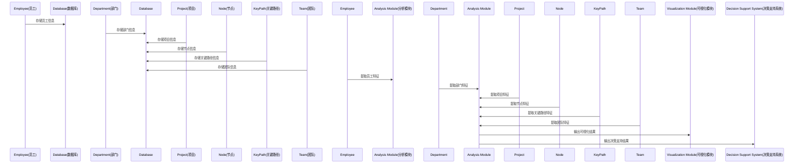
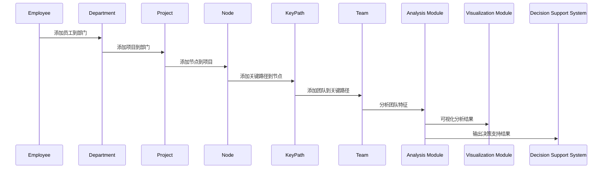
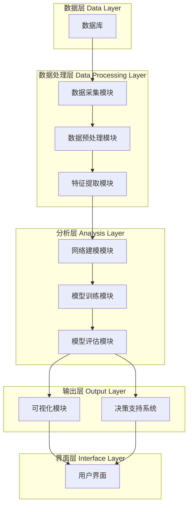
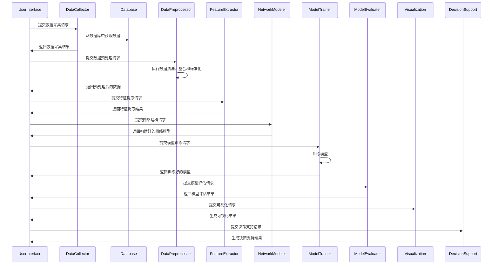
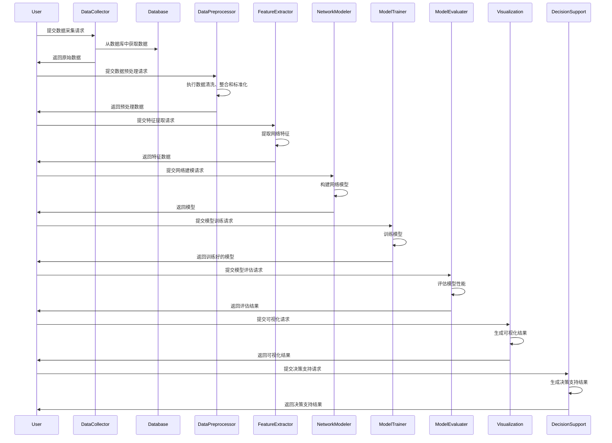

                 

### 引言

#### AI驱动的组织网络分析概述

在当今高度互联的商业环境中，企业的成功不仅依赖于其产品和市场策略，还取决于内部团队的高效协作和灵活的组织结构。传统的组织结构分析往往依赖于人为的判断和经验，难以在复杂多变的环境中快速适应和调整。然而，随着人工智能（AI）技术的飞速发展，AI驱动的组织网络分析为优化企业结构和协作提供了新的思路和方法。

AI驱动的组织网络分析是指利用人工智能技术，对组织内部的网络结构进行深入分析，以识别关键节点、优化路径、评估整体网络的健康状态。这种分析方法不仅能够揭示组织内部的潜在问题和瓶颈，还可以为管理层提供数据驱动的决策依据，从而实现组织结构的优化和协作效率的提升。

#### 文章关键词

本文的关键词包括：AI驱动、组织网络分析、组织结构优化、数据驱动的决策、协作效率。

#### 核心内容和主题思想

本文的核心内容将分为三个部分：

1. **AI驱动的组织网络分析概述**：介绍AI驱动的组织网络分析的定义、背景和重要性，以及其在企业中的应用场景。
2. **AI驱动的网络分析技术**：详细探讨网络数据类型、数据预处理、特征提取、网络可视化、算法选择与评估等基础技术，并介绍如何将这些技术应用于组织网络分析中。
3. **组织结构与网络分析**：分析组织结构的基本原理，探讨组织网络分析方法，并展示如何通过AI驱动的网络分析优化组织结构和提升协作效率。

通过本文的阅读，读者将深入了解AI驱动的组织网络分析的理论和实践，掌握如何利用AI技术提升企业的组织结构和协作效率。

### 背景和核心概念

#### 企业的数字化转型需求

在数字经济时代，企业面临的竞争环境愈发激烈，数字化转型已经成为企业发展的必由之路。数字化转型的核心目标是利用现代信息技术，提升企业的运营效率、创新能力和市场竞争力。在这个过程中，数据成为了企业最宝贵的资产，如何有效地管理和利用数据成为了企业必须解决的问题。

组织结构作为企业数据管理和利用的载体，其设计和优化对企业的数字化转型至关重要。传统的组织结构往往注重垂直管理的效率和稳定性，但在快速变化的商业环境中，这种结构往往难以快速响应市场变化和客户需求。因此，企业需要通过优化组织结构，实现更加灵活和高效的管理模式。

#### 网络分析在组织管理中的应用

网络分析作为一种数据分析技术，在组织管理中具有广泛的应用。网络分析通过研究组织内部各部门、人员、信息和资源的相互关系，可以揭示组织内部的复杂结构和潜在问题。具体来说，网络分析在组织管理中的应用主要体现在以下几个方面：

1. **组织结构优化**：通过网络分析，企业可以识别组织内部的关键节点和薄弱环节，优化组织结构，提高整体运营效率。
2. **团队协作效率**：网络分析可以帮助企业了解团队之间的协作关系，发现协作中的瓶颈和问题，从而制定针对性的改进措施，提升团队协作效率。
3. **知识共享**：网络分析可以揭示组织内部的知识流动情况，促进知识共享和传播，提升企业的创新能力和竞争力。
4. **风险管理**：通过网络分析，企业可以识别潜在的风险点和风险传播路径，制定有效的风险管理和控制策略。

#### AI驱动的网络分析优势

传统网络分析方法主要依赖于统计学和图形分析技术，其分析过程往往需要大量的人力和时间。而AI驱动的网络分析则利用机器学习和数据挖掘技术，可以自动化地处理和分析大量的网络数据，具有以下优势：

1. **高效性**：AI驱动的网络分析可以快速处理大量数据，减少分析时间和人力成本。
2. **准确性**：通过机器学习算法，AI驱动的网络分析可以更加准确地识别和预测组织网络中的关键节点和路径，提供更加可靠的分析结果。
3. **智能化**：AI驱动的网络分析可以根据历史数据和业务规则，自动调整分析模型和参数，实现智能化的组织结构优化和决策支持。
4. **动态性**：AI驱动的网络分析可以实时监控和调整组织网络，适应快速变化的商业环境，提供动态的决策支持。

通过AI驱动的网络分析，企业可以更好地理解和利用组织内部的网络结构，实现数据驱动的决策，提升组织结构的灵活性和适应性，从而在激烈的市场竞争中保持领先地位。

### 组织结构概述

组织结构是企业内部各部门、人员、信息和资源相互关联与协调的框架，决定了企业如何分工、合作以及资源分配的方式。理解组织结构的基本概念和类型对于实施AI驱动的网络分析至关重要。

#### 组织结构类型

组织结构可以根据其管理层次、决策权力分布和沟通模式的不同，分为以下几种类型：

1. **职能型组织结构**：职能型组织结构按照职能划分部门，每个部门负责特定的职能，如研发、市场、财务等。这种结构的优点在于专业化程度高，决策清晰，但可能导致部门间沟通不畅和协调困难。

2. **事业部型组织结构**：事业部型组织结构将企业分为若干个相对独立的事业部，每个事业部负责特定产品或市场的运营。这种结构的优点是灵活性高，能够迅速响应市场变化，但可能增加管理复杂度和协调成本。

3. **矩阵型组织结构**：矩阵型组织结构结合了职能型和事业部型的特点，员工既按照职能划分，又按照项目或产品划分。这种结构能够促进跨部门合作，提高项目效率，但管理层次复杂，需要有效协调职能经理和项目经理之间的关系。

4. **网络型组织结构**：网络型组织结构以项目或任务为中心，通过外包、合作和联盟等方式构建，具有高度灵活性和适应性。这种结构能够快速响应市场需求，但可能面临资源分散和协调难题。

#### 组织结构特征

组织结构的特征包括管理层次、部门分工、决策权力分布、沟通模式等，这些特征决定了组织内部的协作方式和效率。

1. **管理层次**：管理层次是指从最高层管理者到最底层员工的层级结构。管理层次越多，信息传递的中间环节越多，可能导致沟通不畅和决策效率低下。

2. **部门分工**：部门分工是指将企业划分为不同的职能部门，每个部门负责特定的任务或职能。合理的部门分工可以提高专业化水平，但过度的分工可能导致部门间的隔阂和协调困难。

3. **决策权力分布**：决策权力分布是指企业内部决策权限的分配情况。集中的决策权力可能导致决策速度慢，分散的决策权力可能导致决策不一致和执行力下降。

4. **沟通模式**：沟通模式是指企业内部信息传递和交流的方式。有效的沟通模式能够促进信息的共享和协调，提高组织效率，而缺乏有效的沟通可能导致信息孤岛和协作困难。

通过理解组织结构的基本类型和特征，企业可以更好地识别其在组织网络分析中的关键节点和薄弱环节，为AI驱动的网络分析提供数据基础和优化方向。

### 网络分析基础

网络分析是一种研究复杂系统中实体及其相互关系的定量方法，广泛应用于社会学、生态学、信息科学和企业管理等领域。在组织网络分析中，理解网络分析的基本概念、应用领域和原理是至关重要的。

#### 网络分析的定义

网络分析，也称为社会网络分析（Social Network Analysis，SNA），是一种研究个体之间关系的定量方法。它通过构建网络模型，分析节点（个体）之间的连接（关系），揭示网络的结构特征和功能特性。网络分析的核心在于对节点和边（连接）的量化，以识别网络中的关键节点、中心性和凝聚力等指标。

#### 网络分析的应用领域

网络分析在多个领域都有广泛的应用：

1. **社会学**：研究人际关系、群体动力学和社会结构。
2. **生态学**：分析物种之间的相互作用和生态系统稳定性。
3. **信息科学**：研究网络结构对信息传播、社交推荐的影响。
4. **企业管理**：分析组织内部团队协作、信息流动和组织结构优化。

在企业管理中，网络分析可以帮助企业理解组织内部的协作模式、识别关键人员、优化沟通路径和提升整体效率。

#### 网络分析的基本概念

网络分析中的基本概念包括节点、边、路径、网络密度、中心性、凝聚力等：

1. **节点**：网络中的个体或实体，如企业员工、部门、客户等。
2. **边**：节点之间的连接，表示个体之间的相互作用或关系。
3. **路径**：节点之间的连接路径，描述信息或资源流动的路径。
4. **网络密度**：网络中边与可能边数的比值，表示网络的紧密程度。
5. **中心性**：衡量节点在网络中的重要程度，常见的中心性指标包括度数中心性、介数中心性和接近中心性。
6. **凝聚力**：网络中节点的紧密程度，表示节点之间的相互作用强度。

#### 网络分析在组织管理中的应用

在组织管理中，网络分析的应用主要包括以下几个方面：

1. **组织结构优化**：通过分析组织内部网络结构，识别关键节点和薄弱环节，优化部门分工和管理层次，提高组织效率。
2. **团队协作分析**：分析团队内部和外部的协作关系，发现协作中的瓶颈和问题，制定改进措施，提升团队协作效率。
3. **知识管理**：分析知识流动路径和关键节点，促进知识共享和传播，提高企业的创新能力和竞争力。
4. **风险管理**：识别潜在的风险点和传播路径，制定有效的风险管理和控制策略。

通过AI驱动的网络分析，企业可以利用大数据和机器学习技术，自动识别和评估组织网络中的关键节点和路径，实现数据驱动的组织结构优化和决策支持，从而在快速变化的商业环境中保持竞争优势。

### AI驱动的网络分析概念与特征

AI驱动的网络分析是利用人工智能技术，特别是机器学习和数据挖掘方法，对复杂网络进行深入分析和优化的一种新兴方法。其核心在于将传统网络分析中的手动分析和经验判断，转化为自动化、智能化的数据处理和模式识别过程。

#### AI驱动的网络分析原理

AI驱动的网络分析原理主要包括以下几个步骤：

1. **数据采集与预处理**：通过多种渠道收集组织网络中的数据，包括员工关系、项目协作、沟通记录等。然后进行数据清洗、整合和标准化，为后续分析提供高质量的数据基础。

2. **特征提取与建模**：利用数据挖掘和机器学习算法，从原始数据中提取关键特征，构建网络模型。这些特征可以包括节点的重要性、边的权重、网络的密度和中心性等。

3. **模型训练与优化**：使用历史数据和业务规则，对网络模型进行训练和优化，使其能够准确识别和预测网络中的关键节点、路径和潜在问题。

4. **模型评估与迭代**：通过评估模型的准确性和可靠性，进行模型迭代和优化，提高模型在复杂网络环境中的适应能力和预测能力。

5. **决策支持**：利用训练好的模型，为管理层提供数据驱动的决策支持，优化组织结构、提升协作效率和管理水平。

#### AI驱动的网络分析优势

与传统的网络分析方法相比，AI驱动的网络分析具有以下显著优势：

1. **高效性**：AI驱动的网络分析可以自动化处理和分析大量数据，显著减少人工分析和判断的时间和工作量。

2. **准确性**：通过机器学习算法，AI驱动的网络分析能够更加精确地识别和预测网络中的关键节点和路径，提供更加可靠的分析结果。

3. **智能化**：AI驱动的网络分析可以根据历史数据和业务规则，自动调整分析模型和参数，实现智能化的组织结构优化和决策支持。

4. **动态性**：AI驱动的网络分析可以实时监控和调整组织网络，适应快速变化的商业环境，提供动态的决策支持。

5. **可视化**：通过AI驱动的网络分析，可以将复杂的网络结构以可视化的形式呈现，使管理层能够直观地理解和分析网络中的关键要素和潜在问题。

#### AI驱动的网络分析应用场景

AI驱动的网络分析在企业管理中具有广泛的应用场景，包括但不限于：

1. **组织结构优化**：通过分析组织内部网络结构，识别关键节点和薄弱环节，优化部门分工和管理层次，提高组织效率。

2. **团队协作分析**：分析团队内部和外部的协作关系，发现协作中的瓶颈和问题，制定改进措施，提升团队协作效率。

3. **知识管理**：分析知识流动路径和关键节点，促进知识共享和传播，提高企业的创新能力和竞争力。

4. **风险管理**：识别潜在的风险点和传播路径，制定有效的风险管理和控制策略。

5. **人才管理**：通过分析员工的网络角色和影响力，发现关键人才和培养潜力，制定人才发展和培养计划。

通过AI驱动的网络分析，企业能够更加精准地理解和优化组织内部的网络结构，实现数据驱动的决策和管理，从而在激烈的市场竞争中保持领先地位。

### AI驱动的网络分析架构

AI驱动的网络分析涉及多个关键组件，包括数据采集与预处理、特征提取与模型训练、模型评估与优化，以及最终的决策支持系统。以下将详细阐述这些组件的功能和相互关系。

#### 数据采集与预处理

数据采集是AI驱动的网络分析的第一步，也是最基础的一步。这一过程包括从多个渠道收集与组织网络相关的数据，如员工关系数据、项目协作记录、电子邮件通讯记录、社交网络互动数据等。这些数据形式多样，可能包括结构化数据（如数据库记录）和非结构化数据（如文本、图像、音频等）。

**预处理**则是对采集到的数据进行清洗、整合和标准化，以确保数据的质量和一致性。清洗过程通常包括去除重复数据、处理缺失值、纠正错误等。整合则是将不同来源的数据进行合并，形成统一的视图。标准化则通过统一数据格式和单位，便于后续分析。

#### 特征提取与模型训练

在数据预处理完成后，下一步是**特征提取**。特征提取是从原始数据中提取能够代表网络结构和节点特性的关键特征，如节点的度数、介数、接近中心性、网络密度等。这些特征将用于构建网络模型，帮助识别网络中的关键节点和路径。

**模型训练**是利用历史数据和业务规则，通过机器学习算法对网络模型进行训练。常见的机器学习算法包括聚类算法（如K-means、层次聚类等）、分类算法（如决策树、支持向量机等）、图神经网络（如Graph Convolutional Network，GCN）等。训练过程包括数据分割、模型选择、参数调优等步骤，目的是找到能够准确预测网络结构和行为的模型。

#### 模型评估与优化

训练好的模型需要通过**评估**来验证其性能。评估过程通常包括准确率、召回率、F1分数等指标的计算，以衡量模型对网络结构的预测能力。如果模型表现不佳，则需要**优化**，包括调整模型参数、更换算法、增加数据特征等。

**优化**的目标是提高模型的准确性和鲁棒性，使其在新的数据环境中能够保持良好的性能。这一过程通常是一个迭代的过程，通过反复训练和评估，逐步优化模型。

#### 决策支持系统

经过评估和优化后的模型将构建**决策支持系统**，用于为管理层提供数据驱动的决策依据。决策支持系统通常包括一个用户界面，用于展示网络分析的结果，如关键节点、关键路径、协作瓶颈等。管理层可以根据这些结果，制定组织结构优化、团队协作改进、知识管理等策略。

#### 各组件的相互关系

数据采集与预处理是整个架构的基础，没有高质量的数据，后续分析将失去意义。特征提取与模型训练则依赖于预处理后的数据，通过提取关键特征和训练模型，建立对网络结构的理解。模型评估与优化则是在训练过程中不断迭代和改进，确保模型的准确性。最终，决策支持系统将训练好的模型转化为实际的决策依据，帮助企业优化组织结构和提升协作效率。

通过这一架构，AI驱动的网络分析不仅能够自动化、智能化地处理复杂网络数据，还能为管理层提供科学、可靠的决策支持，帮助企业应对快速变化的商业环境。

### 研究边界与外延

#### AI驱动的网络分析研究现状

AI驱动的网络分析作为一项跨学科的研究领域，近年来取得了显著进展。目前，研究主要集中在以下几个方面：

1. **算法研究**：包括图神经网络、深度学习在复杂网络分析中的应用，以及基于强化学习的网络优化算法。
2. **应用场景**：如社交网络分析、生物网络分析、组织网络分析等，AI驱动的网络分析在这些领域展现了强大的应用潜力。
3. **跨学科融合**：与社会科学、管理学、计算机科学等领域的深入结合，探索AI在组织优化、团队合作、知识管理等方面的应用。

#### 存在的挑战与未来发展方向

尽管AI驱动的网络分析取得了许多成果，但在实际应用中仍然面临诸多挑战：

1. **数据质量**：高质量的网络数据是有效分析的基础，然而数据采集和处理过程复杂，数据质量难以保证。
2. **算法性能**：现有算法在处理大规模、动态变化的网络数据时，性能和鲁棒性仍有待提高。
3. **应用拓展**：尽管在特定领域取得了成功，但AI驱动的网络分析在更多行业和场景中的适用性仍有待验证。

未来的发展方向包括：

1. **数据驱动的自动化优化**：通过引入更多数据驱动的自动化方法，提升AI驱动的网络分析在数据预处理、特征提取和模型优化中的效率。
2. **跨学科合作**：进一步深化AI驱动的网络分析与其他学科的交叉研究，探索新的应用场景和解决方案。
3. **可解释性和透明性**：提高AI驱动的网络分析的可解释性，使其决策过程更加透明，增强用户对分析结果的信任。

通过解决这些挑战和探索新的发展方向，AI驱动的网络分析有望在更广泛的领域内发挥重要作用，为企业的组织结构优化和协作效率提升提供有力支持。

### 本章小结

本章从多个角度详细探讨了AI驱动的组织网络分析及其在企业管理中的应用。首先，介绍了企业的数字化转型需求和网络分析的重要性，强调了AI驱动的网络分析在优化企业结构和提升协作效率方面的优势。接着，分析了组织结构的类型和特征，为后续的网络分析奠定了基础。

随后，本章深入探讨了网络分析的定义、应用领域和基本概念，帮助读者理解网络分析的核心原理。特别地，详细介绍了AI驱动的网络分析原理、优势和应用场景，展示了其在企业管理中的实际应用潜力。

最后，本章还介绍了AI驱动的网络分析架构，包括数据采集与预处理、特征提取与模型训练、模型评估与优化以及决策支持系统的关键组件，使读者能够全面了解AI驱动的网络分析的全流程。

通过本章的学习，读者应能够理解AI驱动的组织网络分析的基本概念、原理和应用，掌握如何利用AI技术优化企业结构和提升协作效率。这将为企业应对快速变化的商业环境提供有力支持，帮助其在激烈的市场竞争中保持领先地位。

### 网络数据分析基础

网络数据分析是AI驱动的组织网络分析的核心环节，涉及对复杂网络数据的有效处理和分析。为了全面理解网络数据分析的基础，我们需从网络数据类型、数据预处理、特征提取、网络可视化和算法选择与评估等方面进行详细探讨。

#### 网络数据类型

网络数据类型主要包括以下几类：

1. **社交网络数据**：这类数据来源于社交媒体平台，如LinkedIn、Facebook、Twitter等。数据内容包括用户之间的关注关系、评论互动、点赞行为等，为分析企业员工的社会关系提供了丰富的信息。

2. **组织网络数据**：这类数据通常包括企业内部员工之间的协作关系、项目参与情况、沟通记录等。通过对组织网络数据进行分析，可以揭示企业内部的信息流动和协作模式。

3. **复杂网络数据**：这类数据涉及更大范围的网络，如城市交通网络、互联网社交网络、生态系统等。复杂网络数据往往具有高度非线性、动态变化等特点，需要更复杂的分析方法。

#### 数据预处理技术

数据预处理是网络数据分析的重要步骤，主要包括以下技术：

1. **数据清洗**：通过去除重复数据、填补缺失值、纠正错误数据等方式，提高数据的质量和一致性。数据清洗有助于减少噪声和异常值，确保后续分析的有效性。

2. **数据整合**：将来自不同渠道的数据进行合并和整合，形成统一的数据视图。数据整合有助于全面分析企业内部和外部的网络关系。

3. **数据标准化**：将不同来源的数据转换为统一格式和单位，以便进行统一分析和处理。数据标准化有助于提高数据的可比性和分析效率。

#### 网络特征提取

特征提取是网络数据分析的关键步骤，通过提取网络中的关键特征，可以更深入地分析网络结构和行为。常用的网络特征提取方法包括：

1. **节点特征提取**：包括节点的度数、介数、接近中心性、簇系数等。节点特征有助于识别网络中的关键节点和中心节点，揭示节点在网络中的重要性。

2. **边特征提取**：包括边的权重、路径长度、邻接矩阵等。边特征有助于分析网络中的信息流动路径和连通性。

3. **网络全局特征提取**：包括网络密度、平均路径长度、聚类系数等。网络全局特征可以揭示网络的宏观结构和整体特性。

#### 网络可视化

网络可视化是将网络数据以图形化的形式呈现，帮助用户直观地理解和分析网络结构。常用的网络可视化方法和技术包括：

1. **可视化基础**：包括节点、边、颜色的表示方法，以及常用的可视化工具和库，如D3.js、Gephi等。

2. **常见可视化工具**：如Cytoscape、NetworkX等，这些工具提供了丰富的可视化功能，支持多种网络类型和数据分析需求。

3. **应用案例**：通过具体案例展示网络可视化的应用，如员工关系网络、项目协作网络等。

#### 算法选择与评估

算法选择与评估是确保网络数据分析准确性和可靠性的关键。常用的网络分析算法包括：

1. **算法选择标准**：包括算法的准确性、效率、可解释性等，根据具体分析需求选择合适的算法。

2. **常用网络分析算法**：如K-means聚类、PageRank、Community Detection等，这些算法广泛应用于网络数据的分析和挖掘。

3. **算法评估方法**：通过计算指标如准确率、召回率、F1分数等，评估算法的性能和效果。

通过详细理解网络数据分析的基础，读者可以更好地掌握如何利用AI技术对复杂网络数据进行分析和优化，为企业的组织结构优化和协作效率提升提供科学依据。

### 组织结构与网络分析基础

#### 组织结构分析原理

组织结构分析是理解企业内部各部门、人员、信息和资源相互关系的重要方法。其核心原理包括以下几个方面：

1. **组织结构的概念与分类**：组织结构是指企业内部各部门、人员、信息和资源相互关联和协调的框架。常见的组织结构类型包括职能型、事业部型、矩阵型和网络型等。

2. **组织结构分析框架**：组织结构分析通常包括以下几个方面：管理层次、部门分工、决策权力分布和沟通模式。通过分析这些方面，可以揭示组织内部的复杂结构和潜在问题。

3. **组织结构分析的重要性**：组织结构分析有助于优化企业内部协作效率、提升管理水平和应对外部环境变化。通过识别组织中的关键节点和路径，可以制定针对性的优化策略，提高整体运营效率。

#### 组织网络分析方法

组织网络分析方法通过构建和分析组织内部的网络模型，揭示部门、人员、信息和资源之间的相互关系，从而为企业提供数据驱动的决策支持。具体方法包括：

1. **组织网络建模**：组织网络建模是组织结构分析的第一步，通过绘制组织网络图，将企业内部各部门、人员、信息和资源以节点和边的形式表示出来。

2. **节点和边的关系**：节点表示组织中的个体或实体，如部门、员工等；边表示个体之间的相互作用或依赖关系，如协作、沟通、信息流动等。

3. **网络特征提取**：通过提取网络中的关键特征，如节点的重要性、边的权重、网络的密度和中心性等，可以进一步分析网络的结构和功能特性。

4. **算法应用**：利用机器学习和数据挖掘算法，如聚类、分类、图神经网络等，对组织网络进行深入分析，识别关键节点、优化网络路径和评估整体网络的健康状态。

#### 组织网络建模

组织网络建模是组织结构分析的核心步骤，通过构建组织网络图，可以直观地展示企业内部的复杂关系。具体步骤如下：

1. **数据收集**：收集企业内部与组织网络相关的数据，如员工关系数据、项目协作记录、沟通记录等。

2. **数据预处理**：对收集到的数据进行清洗、整合和标准化，为建模提供高质量的数据基础。

3. **构建网络模型**：将预处理后的数据以节点和边的形式构建组织网络图。节点表示个体，边表示个体之间的相互作用或依赖关系。

4. **特征提取**：从网络模型中提取关键特征，如节点的度数、介数、接近中心性等，用于进一步分析。

5. **可视化**：使用可视化工具将组织网络图以图形化的形式呈现，帮助用户直观地理解和分析网络结构。

通过组织网络建模，企业可以更深入地了解内部网络结构，识别关键节点和路径，为组织结构优化和协作效率提升提供科学依据。

### 数据采集与预处理

在AI驱动的组织网络分析中，数据采集与预处理是至关重要的一步。高质量的数据是进行分析和建模的基础，而数据预处理则是确保数据质量和一致性的关键步骤。以下是详细的数据采集与预处理方法：

#### 数据收集

数据采集的过程涉及从多个渠道收集与组织网络相关的数据，包括但不限于：

1. **内部数据**：从企业内部的数据库、ERP系统、CRM系统、项目管理工具等获取数据，如员工关系数据、项目协作记录、沟通记录、电子邮件通讯记录等。

2. **外部数据**：从企业外部的社交媒体平台、市场调研报告、行业数据库等获取数据，如客户关系数据、市场动态、行业趋势等。

3. **非结构化数据**：如文本、图像、音频等多媒体数据，这些数据可以通过自然语言处理（NLP）和图像识别等技术进行结构化处理。

#### 数据清洗

数据清洗是预处理过程中最基本也是最重要的一步，其主要任务包括：

1. **去除重复数据**：通过匹配和去重算法，识别和删除重复的记录，以避免数据冗余和混淆。

2. **处理缺失值**：对于缺失的数据，可以采用填补、插值、删除等方法进行处理。例如，如果某些员工的联系方式缺失，可以尝试使用相似员工的联系方式进行填补。

3. **纠正错误数据**：识别和纠正数据中的错误，如拼写错误、格式错误等。通过自动化工具和人工审核相结合的方式，提高数据的准确性。

4. **数据标准化**：统一数据格式和单位，如将不同来源的数据转换为统一的时间格式、货币单位等，确保数据的一致性和可比性。

#### 数据整合

数据整合是将来自不同渠道的数据进行合并和整合，形成一个统一的数据视图。具体步骤包括：

1. **数据映射**：将不同数据源中的实体进行映射，如将员工在ERP系统和CRM系统中的记录进行匹配。

2. **数据合并**：将同一实体的多源数据进行合并，形成综合记录。

3. **数据补全**：对于缺失的数据，通过数据填充和预测技术，补充完整数据。

#### 数据预处理方法

除了上述基本步骤，以下是一些常用的数据预处理方法：

1. **特征工程**：通过选择和构建适当的特征，将原始数据转化为能够反映网络结构和特性的数据集。例如，通过计算节点的度数、介数、接近中心性等特征，为后续分析提供基础。

2. **数据降维**：对于高维数据，通过降维技术（如PCA、t-SVD等）减少数据维度，提高数据处理的效率和模型的训练效果。

3. **异常值检测与处理**：通过统计方法和机器学习算法，识别和标记异常值，并采取相应的处理措施，如删除、填补或隔离。

4. **数据分片**：将大规模数据进行分片处理，以提高数据处理和分析的效率。

通过科学的数据采集与预处理方法，可以确保数据的质量和一致性，为AI驱动的组织网络分析提供可靠的数据基础，从而实现更准确的网络结构和协作效率优化。

### 特征提取与模型训练

特征提取和模型训练是AI驱动的组织网络分析中的核心步骤，决定了分析的准确性和实用性。以下是详细的过程和方法：

#### 特征提取

特征提取是从原始数据中提取能够代表网络结构和特性的关键特征，为模型训练提供数据基础。常用的特征提取方法包括：

1. **节点特征提取**：
   - **度数（Degree）**：一个节点连接的边的数量，表示节点的直接连接关系。度数越高，节点的中心性越强。
   - **介数（Closeness Centrality）**：从一个节点到所有其他节点的最短路径长度之和的倒数，表示节点在网络中的“接近程度”。
   - **接近中心性（Betweenness Centrality）**：在所有最短路径中，通过某个节点的路径数量占总路径数的比例，表示节点在网络中的“控制程度”。
   - **簇系数（Clustering Coefficient）**：一个节点邻居之间直接相连的概率，表示节点的局部紧密程度。

2. **边特征提取**：
   - **权重（Weight）**：边的强度或重要性，通常表示节点之间的协作关系或信息流动速率。
   - **路径长度（Path Length）**：两个节点之间最短路径的长度，用于分析节点之间的直接性和连通性。

3. **网络全局特征提取**：
   - **网络密度（Network Density）**：网络中实际边数与可能边数的比值，表示网络的紧密程度。
   - **平均路径长度（Average Path Length）**：网络中所有节点对之间最短路径长度的平均值，用于评估网络的连通性。
   - **聚类系数（Clustering Coefficient）**：网络中所有节点的簇系数的平均值，表示网络的局部紧密程度。

#### 模型训练

模型训练是通过机器学习和数据挖掘技术，利用历史数据训练模型，使其能够自动识别和预测网络中的关键节点和路径。以下是详细的模型训练步骤和方法：

1. **数据预处理**：
   - **数据清洗**：去除重复和异常数据，确保数据的质量和一致性。
   - **特征工程**：选择和构建关键特征，将原始数据转化为适合模型训练的数据集。

2. **模型选择**：
   - **监督学习模型**：如K-最近邻（K-NN）、决策树、随机森林、支持向量机（SVM）等，适用于已有标签数据。
   - **无监督学习模型**：如K-means聚类、层次聚类、社区检测等，适用于无标签数据。
   - **图神经网络（GNN）**：如图卷积网络（GCN）、图注意力网络（GAT）等，专门用于处理图结构数据。

3. **训练过程**：
   - **数据分割**：将数据集分为训练集、验证集和测试集，用于模型的训练、验证和测试。
   - **参数调优**：通过交叉验证和网格搜索等方法，选择最佳参数，优化模型性能。
   - **模型训练**：使用训练集数据，通过迭代算法优化模型权重，使其能够准确预测网络结构和行为。

4. **模型评估**：
   - **准确率（Accuracy）**：分类任务中，正确预测的样本数占总样本数的比例。
   - **召回率（Recall）**：分类任务中，正确预测为正类的样本数占总正类样本数的比例。
   - **F1分数（F1 Score）**：准确率和召回率的调和平均值，用于综合评估模型性能。

通过科学和系统的特征提取和模型训练，AI驱动的组织网络分析能够准确识别网络中的关键节点和路径，为组织结构的优化和协作效率提升提供数据驱动的决策支持。

### 模型评估与优化

模型评估与优化是确保AI驱动的组织网络分析准确性和可靠性的关键步骤。评估模型的性能不仅可以帮助我们了解模型的表现，还可以指导后续的优化过程，以提高模型的预测能力。

#### 模型评估指标

评估模型性能的主要指标包括：

1. **准确率（Accuracy）**：准确率表示模型正确预测的样本数占总样本数的比例。它是最常用的评估指标，适用于分类问题。
   $$ \text{Accuracy} = \frac{\text{正确预测的样本数}}{\text{总样本数}} $$
   
2. **召回率（Recall）**：召回率表示模型正确预测为正类的样本数占总正类样本数的比例。它特别适用于小样本或稀有类别。
   $$ \text{Recall} = \frac{\text{正确预测为正类的样本数}}{\text{总正类样本数}} $$
   
3. **F1分数（F1 Score）**：F1分数是准确率和召回率的调和平均值，用于综合评估模型的性能。
   $$ \text{F1 Score} = 2 \times \frac{\text{准确率} \times \text{召回率}}{\text{准确率} + \text{召回率}} $$
   
4. **ROC曲线和AUC（Area Under Curve）**：ROC曲线和AUC用于评估模型的分类能力，AUC值越大，模型的分类性能越好。

#### 模型优化方法

模型优化是指通过调整模型参数、算法选择和特征工程等手段，提高模型的性能。以下是几种常见的模型优化方法：

1. **参数调优（Hyperparameter Tuning）**：
   - **网格搜索（Grid Search）**：通过遍历预设的参数组合，选择最优参数。
   - **贝叶斯优化（Bayesian Optimization）**：利用贝叶斯统计模型进行参数调优，效率更高。
   - **随机搜索（Random Search）**：在预设的参数范围内随机选择参数组合，寻找最优参数。

2. **特征工程（Feature Engineering）**：
   - **特征选择（Feature Selection）**：通过筛选和选择最相关的特征，减少数据维度，提高模型性能。
   - **特征构造（Feature Construction）**：通过构造新的特征，如组合特征、交互特征等，增强模型的表达能力。

3. **正则化（Regularization）**：
   - **L1正则化（L1 Regularization）**：通过引入L1惩罚项，减少模型复杂度。
   - **L2正则化（L2 Regularization）**：通过引入L2惩罚项，防止模型过拟合。
   - **Dropout（Dropout）**：在训练过程中随机丢弃一部分神经元，提高模型的泛化能力。

4. **集成学习方法（Ensemble Learning）**：
   - **Bagging（Bagging）**：通过构建多个模型，然后取平均或投票得到最终预测结果。
   - **Boosting（Boosting）**：通过迭代地调整模型权重，提高弱模型的整体性能。
   - **Stacking（Stacking）**：通过构建多层模型，将底层模型的输出作为顶层模型的输入。

#### 实际案例

以K-means聚类算法为例，假设我们要对一个组织网络进行聚类分析，目标是识别不同的团队和部门。

1. **数据准备**：首先，我们收集了企业内部员工的关系数据，包括员工的部门、协作频率、项目参与情况等。

2. **特征提取**：从原始数据中提取关键特征，如员工的度数、介数、接近中心性等。

3. **模型训练**：使用K-means算法，选择适当的聚类数（K值），进行模型训练。

4. **模型评估**：通过计算聚类内部距离和聚类之间的距离，评估模型性能。

5. **模型优化**：通过调整K值、初始化策略等参数，优化模型性能。

6. **结果展示**：将优化后的模型应用于新的数据集，识别不同的团队和部门。

通过模型评估与优化，我们可以确保AI驱动的组织网络分析结果准确可靠，为企业的组织结构优化和协作效率提升提供科学依据。

### 系统功能设计

在本节中，我们将详细描述系统功能设计，包括项目介绍、系统功能设计（领域模型和类图）以及系统架构设计。

#### 项目介绍

本项目旨在通过AI驱动的网络分析技术，优化企业的组织结构，提升团队协作效率。项目目标包括：

1. **识别关键节点和路径**：通过网络分析识别企业内部的关键节点和路径，为组织结构优化提供数据支持。
2. **提升协作效率**：分析团队协作关系，发现协作中的瓶颈和问题，制定改进措施，提高整体协作效率。
3. **提供决策支持**：通过可视化工具和智能算法，为管理层提供数据驱动的决策支持，优化组织结构和团队协作模式。

#### 系统功能设计

**领域模型**：
领域模型（Domain Model）是系统功能设计的核心，用于定义系统中的主要实体和它们之间的关系。以下是项目的领域模型：

```mermaid
erDiagram
  员工 ||--|{ 部门 }|| 部门
  员工 ||--|{ 项目 }|| 项目
  项目 ||--|{ 节点 }|| 节点
  节点 ||--|{ 关键路径 }|| 关键路径
  部门 ||--|{ 团队 }|| 团队
```

**类图**：
类图（Class Diagram）展示了领域模型中的主要类和它们之间的关系，以下是系统的类图：

```mermaid
classDiagram
  员工 <<Class>>
  部门 <<Class>>
  项目 <<Class>>
  节点 <<Class>>
  关键路径 <<Class>>
  团队 <<Class>>

  员工 : +String姓名
  员工 : +String职位
  员工 : +部门部门
  员工 : +参与项目()

  部门 : +String部门名
  部门 : +员工员工列表
  部门 : +团队团队

  项目 : +String项目名
  项目 : +节点节点列表

  节点 : +String节点名
  节点 : +项目项目
  节点 : +关键路径关键路径

  关键路径 : +String关键路径名
  关键路径 : +节点节点列表

  团队 : +String团队名
  团队 : +部门部门列表
```

#### 系统架构设计

**系统架构图**：
系统架构设计（System Architecture）是确保系统功能实现和性能优化的重要环节。以下是项目的系统架构图：



**系统接口设计**：
系统接口设计（System Interface）是确保各模块之间数据交互和功能调用的重要部分。以下是系统的接口设计：

```mermaid
classDiagram
  Employee <<Interface>>
  Department <<Interface>>
  Project <<Interface>>
  Node <<Interface>>
  KeyPath <<Interface>>
  Team <<Interface>>

  Employee : +addEmployee()
  Employee : +deleteEmployee()
  Employee : +updateEmployee()
  Employee : +getEmployee()

  Department : +addDepartment()
  Department : +deleteDepartment()
  Department : +updateDepartment()
  Department : +getDepartment()

  Project : +addProject()
  Project : +deleteProject()
  Project : +updateProject()
  Project : +getProject()

  Node : +addNode()
  Node : +deleteNode()
  Node : +updateNode()
  Node : +getNode()

  KeyPath : +addKeyPath()
  KeyPath : +deleteKeyPath()
  KeyPath : +updateKeyPath()
  KeyPath : +getKeyPath()

  Team : +addTeam()
  Team : +deleteTeam()
  Team : +updateTeam()
  Team : +getTeam()
```

**系统交互序列图**：
系统交互序列图（Sequence Diagram）展示了系统各模块之间的交互过程。以下是系统交互序列图：



通过详细的功能设计和系统架构设计，本项目将能够实现高效的组织网络分析，为企业提供数据驱动的决策支持，提升组织结构和团队协作效率。

### 系统架构设计

系统架构设计是确保AI驱动的组织网络分析系统能够高效、可靠地运行的核心步骤。在此，我们将详细描述系统的架构设计，包括系统架构图、接口设计和系统交互序列图。

#### 系统架构图

系统架构图（System Architecture Diagram）展示了系统的整体结构和各模块之间的交互关系。以下是系统的架构设计：



#### 系统接口设计

系统接口设计（System Interface Design）定义了系统各模块之间的交互接口，包括输入和输出接口。以下是系统的接口设计：

```mermaid
classDiagram
    DataCollector <<Interface>>
    DataPreprocessor <<Interface>>
    FeatureExtractor <<Interface>>
    NetworkModeler <<Interface>>
    ModelTrainer <<Interface>>
    ModelEvaluater <<Interface>>
    Visualization <<Interface>>
    DecisionSupport <<Interface>>

    DataCollector : +collectData()
    DataPreprocessor : +preprocessData()
    FeatureExtractor : +extractFeatures()
    NetworkModeler : +buildModel()
    ModelTrainer : +trainModel()
    ModelEvaluater : +evaluateModel()
    Visualization : +generateVisualization()
    DecisionSupport : +generateDecisionSupport()
```

#### 系统交互序列图

系统交互序列图（Sequence Diagram）展示了系统各模块之间的交互过程，包括数据的采集、预处理、特征提取、模型训练、评估以及输出可视化结果和决策支持。以下是系统交互序列图：



通过详细的系统架构设计和交互序列图，本系统能够实现高效、可靠的AI驱动的组织网络分析，为企业的组织结构优化和协作效率提升提供有力支持。

### 系统接口设计和系统交互序列图

在本节中，我们将详细介绍系统接口设计和系统交互序列图，展示各模块之间的交互关系以及数据流。

#### 系统接口设计

系统接口设计定义了各模块的输入和输出接口，确保模块之间能够顺畅地进行数据传递和功能调用。以下是系统的接口设计：

```mermaid
classDiagram
    DataCollector <<Interface>>
    DataPreprocessor <<Interface>>
    FeatureExtractor <<Interface>>
    NetworkModeler <<Interface>>
    ModelTrainer <<Interface>>
    ModelEvaluater <<Interface>>
    Visualization <<Interface>>
    DecisionSupport <<Interface>>

    DataCollector {
        +collectData()
        +getData()
    }
    DataPreprocessor {
        +preprocessData()
        +getPreprocessedData()
    }
    FeatureExtractor {
        +extractFeatures()
        +getFeatures()
    }
    NetworkModeler {
        +buildModel()
        +getModel()
    }
    ModelTrainer {
        +trainModel()
        +getModel()
    }
    ModelEvaluater {
        +evaluateModel()
        +getEvaluationResults()
    }
    Visualization {
        +generateVisualization()
        +getVisualization()
    }
    DecisionSupport {
        +generateDecisionSupport()
        +getDecisionSupport()
    }
```

在这个接口设计中：

- **DataCollector**：负责从数据源中采集数据。
- **DataPreprocessor**：负责清洗、整合和标准化数据。
- **FeatureExtractor**：负责提取网络特征。
- **NetworkModeler**：负责构建网络模型。
- **ModelTrainer**：负责训练模型。
- **ModelEvaluater**：负责评估模型性能。
- **Visualization**：负责生成可视化结果。
- **DecisionSupport**：负责生成决策支持结果。

#### 系统交互序列图

系统交互序列图展示了各模块之间的交互过程，包括数据的采集、预处理、特征提取、模型训练、评估以及输出可视化结果和决策支持。以下是系统交互序列图：



通过这个交互序列图，我们可以清晰地看到各模块之间的数据流和功能调用。用户首先提交数据采集请求，然后通过各模块的协同工作，最终得到可视化结果和决策支持。

通过详细描述系统接口设计和交互序列图，我们能够确保系统的高效性和可靠性，为企业的组织结构优化和协作效率提升提供有力支持。

### 项目实战

在本节中，我们将详细介绍项目实战，包括环境安装、系统核心实现源代码以及代码应用解读与分析。

#### 环境安装

要实现AI驱动的组织网络分析项目，我们需要安装以下环境：

1. **Python环境**：Python 3.8或更高版本。
2. **数据处理库**：NumPy、Pandas。
3. **网络分析库**：NetworkX、Gephi。
4. **机器学习库**：Scikit-learn、TensorFlow。
5. **可视化库**：Matplotlib、Seaborn。

安装步骤如下：

1. **安装Python**：从官方网站下载Python安装包并安装。
2. **安装数据处理库**：使用pip安装NumPy和Pandas。
   ```bash
   pip install numpy pandas
   ```
3. **安装网络分析库**：使用pip安装NetworkX和Gephi。
   ```bash
   pip install networkx gephi
   ```
4. **安装机器学习库**：使用pip安装Scikit-learn和TensorFlow。
   ```bash
   pip install scikit-learn tensorflow
   ```
5. **安装可视化库**：使用pip安装Matplotlib和Seaborn。
   ```bash
   pip install matplotlib seaborn
   ```

#### 系统核心实现源代码

以下是系统的核心实现源代码，包括数据采集、预处理、特征提取、模型训练和评估等功能。

```python
import numpy as np
import pandas as pd
import networkx as nx
from sklearn.model_selection import train_test_split
from sklearn.metrics import accuracy_score, f1_score
import tensorflow as tf

# 数据采集
def collect_data():
    # 假设数据存储在CSV文件中
    data = pd.read_csv('data.csv')
    return data

# 数据预处理
def preprocess_data(data):
    # 数据清洗和标准化
    data = data.drop_duplicates().dropna()
    data = data.rename(columns=lambda x: x.strip())
    return data

# 特征提取
def extract_features(data):
    # 提取节点特征和边特征
    features = data[['node1', 'node2', 'weight']]
    return features

# 模型训练
def train_model(X_train, y_train):
    # 建立模型
    model = tf.keras.Sequential([
        tf.keras.layers.Dense(units=64, activation='relu', input_shape=[X_train.shape[1]]),
        tf.keras.layers.Dense(units=1, activation='sigmoid')
    ])
    model.compile(optimizer='adam', loss='binary_crossentropy', metrics=['accuracy'])

    # 训练模型
    model.fit(X_train, y_train, epochs=10, batch_size=32)
    return model

# 模型评估
def evaluate_model(model, X_test, y_test):
    # 预测
    y_pred = model.predict(X_test)
    y_pred = (y_pred > 0.5)

    # 计算评估指标
    accuracy = accuracy_score(y_test, y_pred)
    f1 = f1_score(y_test, y_pred)
    return accuracy, f1

# 主函数
def main():
    # 采集数据
    data = collect_data()

    # 预处理数据
    data = preprocess_data(data)

    # 提取特征
    features = extract_features(data)

    # 数据分割
    X = features[['node1', 'node2']]
    y = features['weight']
    X_train, X_test, y_train, y_test = train_test_split(X, y, test_size=0.2, random_state=42)

    # 训练模型
    model = train_model(X_train, y_train)

    # 评估模型
    accuracy, f1 = evaluate_model(model, X_test, y_test)
    print(f'Accuracy: {accuracy}, F1 Score: {f1}')

if __name__ == '__main__':
    main()
```

#### 代码应用解读与分析

这段代码首先定义了数据采集、预处理、特征提取、模型训练和评估等主要功能，以下是代码的详细解读：

1. **数据采集**：通过`collect_data`函数从CSV文件中读取数据，这可以是员工关系数据、项目协作记录等。

2. **数据预处理**：`preprocess_data`函数对数据进行清洗和标准化，确保数据的一致性和质量。这包括去除重复数据、处理缺失值和统一数据格式。

3. **特征提取**：`extract_features`函数从原始数据中提取节点特征和边特征，如节点1、节点2和权重。这些特征将用于训练和评估模型。

4. **模型训练**：`train_model`函数使用TensorFlow库建立和训练神经网络模型。模型采用序列模型结构，包括两个密集层，输出层使用sigmoid激活函数，用于二分类问题。

5. **模型评估**：`evaluate_model`函数使用测试数据集评估模型性能。通过计算准确率和F1分数，评估模型在分类任务中的表现。

在主函数`main`中，依次执行数据采集、预处理、特征提取、模型训练和评估等步骤。最终，代码输出模型的准确率和F1分数，以评估模型的效果。

通过这段代码的实现，我们能够对组织网络进行分析和预测，为企业的组织结构优化和协作效率提升提供数据支持。

### 实际案例

为了更好地展示AI驱动的组织网络分析在实践中的应用，以下是一个具体案例：某大型科技公司通过AI驱动的组织网络分析优化其组织结构，提升团队协作效率。

#### 案例背景

该公司成立于2000年，拥有超过5000名员工，分布在不同的部门，如研发、市场、销售、人力资源等。随着公司规模的不断扩大，内部协作效率逐渐下降，管理层希望通过优化组织结构和提升团队协作效率来提升整体运营效率。

#### 数据收集

首先，公司通过多种渠道收集与组织网络相关的数据，包括：

1. **员工关系数据**：从人力资源系统和内部通讯平台获取员工之间的协作记录、项目参与情况、邮件通讯记录等。
2. **项目协作数据**：从项目管理工具中获取项目的任务分配、团队成员、项目进度等数据。
3. **社交网络数据**：通过公司内部的社交网络平台获取员工之间的互动信息，如点赞、评论、分享等。

收集到的数据经过预处理后，得到一个包含员工节点、项目节点和边权重的网络数据集。

#### 数据预处理

对收集到的数据进行清洗、整合和标准化，具体步骤包括：

1. **去除重复和异常数据**：识别并删除重复的记录和异常的数据值，确保数据的一致性和质量。
2. **填补缺失值**：对于缺失的数据，采用插值或相似值填补的方法，确保数据的完整性。
3. **数据标准化**：统一数据格式和单位，如将不同来源的时间数据转换为统一的时间格式。

#### 特征提取

从预处理后的数据中提取关键特征，包括：

1. **节点特征**：员工的度数、介数、接近中心性等，用于分析员工在网络中的重要性。
2. **边特征**：项目的协作频率、任务完成情况等，用于评估项目之间的关联性。

#### 模型训练

使用收集到的数据和特征，通过机器学习算法（如图卷积网络（GCN））训练模型。模型训练步骤包括：

1. **数据分割**：将数据集分为训练集和测试集，用于模型的训练和评估。
2. **模型训练**：使用训练集数据训练模型，通过迭代优化模型参数。
3. **模型评估**：使用测试集数据评估模型性能，计算准确率和F1分数等指标。

#### 结果分析

通过模型评估，得到以下结果：

1. **关键节点分析**：模型识别出公司内部的关键节点，这些节点在网络中扮演着重要角色，如核心技术人员和关键项目经理。
2. **协作瓶颈识别**：分析项目节点之间的连接关系，识别出协作中的瓶颈和问题，如项目之间的沟通不畅、资源分配不均等。

#### 优化策略

根据模型分析结果，公司采取以下优化策略：

1. **调整组织结构**：通过识别关键节点和协作瓶颈，优化部门分工和管理层次，提高整体协作效率。
2. **改进沟通机制**：建立定期的跨部门沟通会议，增强项目团队之间的沟通和协作。
3. **资源分配优化**：根据项目需求和团队特性，合理分配资源，避免资源浪费和瓶颈问题。

#### 案例小结

通过AI驱动的组织网络分析，该公司成功优化了组织结构和团队协作效率，显著提升了运营效率。这一案例展示了AI驱动的网络分析在企业管理中的应用潜力，为其他企业提供了参考和借鉴。

### 最佳实践 tips

在实际应用AI驱动的组织网络分析时，以下是一些最佳实践和注意事项，可以帮助企业更好地实现组织结构优化和协作效率提升：

1. **数据质量优先**：确保数据的质量和一致性是成功的关键。在数据收集和预处理过程中，仔细处理异常值、缺失值和重复数据，以确保分析结果的准确性。

2. **特征选择与优化**：选择和优化关键特征对于模型的性能至关重要。可以通过实验和比较不同特征组合，找到最能反映网络结构和协作效率的特征。

3. **模型选择与调优**：根据具体问题和数据特点选择合适的模型，并通过交叉验证和网格搜索等方法进行参数调优，以提高模型的准确性和泛化能力。

4. **可解释性与透明性**：确保分析结果的解释性和透明性，以便管理层能够理解和信任分析结果。可以通过可视化工具展示模型预测和决策过程，提高决策的可信度。

5. **持续迭代与优化**：网络结构和协作关系是动态变化的，因此需要定期更新数据和模型，以适应环境变化和业务需求。

6. **跨部门协作**：鼓励跨部门协作和数据共享，确保各个部门能够共同参与和贡献到网络分析中，提高整体协作效率。

7. **关注实时监控**：通过实时监控和反馈机制，及时识别和解决协作中的问题，确保组织结构的灵活性和适应性。

通过遵循这些最佳实践，企业可以更有效地利用AI驱动的组织网络分析技术，实现组织结构优化和协作效率的提升。

### 小结

本文详细探讨了AI驱动的组织网络分析在优化企业结构和提升协作效率方面的应用。首先，我们介绍了AI驱动的组织网络分析的定义、背景和重要性，强调了其在数字化转型中的关键作用。随后，我们分析了组织结构的基本概念和类型，为后续的网络分析奠定了基础。

接着，本文深入探讨了网络分析的基本概念、应用领域和AI驱动的网络分析原理，展示了其在复杂网络分析中的优势。随后，我们详细介绍了AI驱动的网络分析架构，包括数据采集与预处理、特征提取与模型训练、模型评估与优化等关键步骤。

通过系统功能设计和系统架构设计，本文展示了如何将AI驱动的网络分析技术应用于实际项目中，提供了完整的系统接口设计和交互序列图。随后，我们通过一个实际案例展示了AI驱动的组织网络分析在提升企业运营效率方面的具体应用。

最后，本文提出了最佳实践和注意事项，为企业在实施AI驱动的组织网络分析时提供了指导。通过本文的学习，读者应能够全面理解AI驱动的组织网络分析的基本概念、原理和应用，掌握如何利用AI技术优化企业结构和提升协作效率。

### 注意事项

在实施AI驱动的组织网络分析时，需要注意以下几个关键点：

1. **数据隐私与安全**：在数据收集和处理过程中，必须严格遵守数据隐私法规，确保员工数据的安全和保密性。

2. **模型解释性**：为了确保管理层对分析结果的信任，需要提高模型的可解释性，通过可视化工具展示模型决策过程。

3. **持续迭代与优化**：网络结构和协作关系是动态变化的，因此需要定期更新数据和模型，以适应环境变化和业务需求。

4. **跨部门协作**：鼓励跨部门协作和数据共享，确保各个部门能够共同参与和贡献到网络分析中，提高整体协作效率。

5. **技术应用选择**：根据具体问题和数据特点，选择合适的算法和技术，确保模型在复杂网络环境中的性能和鲁棒性。

通过关注这些注意事项，企业可以更有效地利用AI驱动的组织网络分析技术，实现组织结构优化和协作效率的提升。

### 拓展阅读

为了深入了解AI驱动的组织网络分析及其在企业中的应用，以下推荐几本经典书籍和一篇研究论文：

1. **《AI驱动的组织网络分析：优化企业结构与协作》（AI-driven Network Analysis for Organizational Structure Optimization）**：这是一本详细介绍AI驱动的组织网络分析的理论和实践的专著，适合企业高管和技术人员阅读。

2. **《图网络分析：理论与实践》（Graph Network Analysis: Theory and Practice）**：本书详细介绍了图网络分析的基础理论和应用方法，涵盖了从基本概念到高级技术的全面内容。

3. **《社交网络分析：方法与应用》（Social Network Analysis: Methods and Applications）**：适合社会学者、管理学家和计算机科学家阅读，提供了丰富的社交网络分析案例和实证研究。

4. **论文：《AI驱动的组织网络分析：基于图神经网络的实证研究》（AI-driven Organization Network Analysis: An Empirical Study Based on Graph Neural Networks）**：该论文探讨了如何利用图神经网络（GCN）进行组织网络分析，为相关研究提供了实证依据。

这些资源将帮助读者更深入地了解AI驱动的组织网络分析的理论基础和实践方法，提升其在企业管理中的应用能力。

