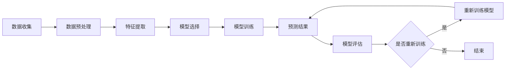
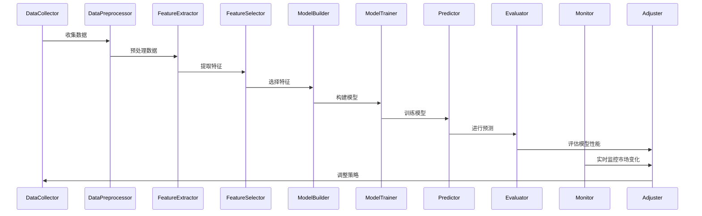
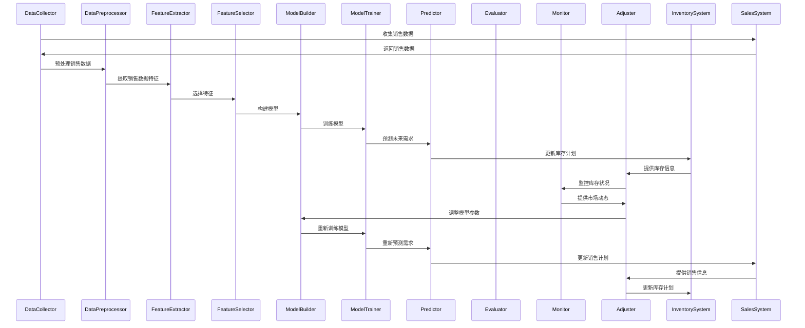

                 

### 文章标题：AI驱动的需求预测：优化企业库存管理

#### 关键词：需求预测、库存管理、人工智能、数据预处理、特征工程、深度学习、系统架构

#### 摘要：
本文深入探讨了AI驱动的需求预测在优化企业库存管理中的应用。通过介绍需求预测与库存管理的基本概念，分析其核心问题和解决方法，我们逐步探讨了AI在需求预测中的核心概念与联系，详述了常见的需求预测算法和深度学习在需求预测中的应用原理。最后，文章通过一个实际项目展示了AI驱动的需求预测系统设计与实现过程，并提供了一些最佳实践和注意事项，以帮助企业在库存管理中充分利用AI技术。

### 目录大纲

----------------------------------------------------------------

# AI驱动的需求预测：优化企业库存管理

> 关键词：需求预测、库存管理、人工智能、数据预处理、特征工程、深度学习、系统架构

> 摘要：本文深入探讨了AI驱动的需求预测在优化企业库存管理中的应用，从概念到实现，全面解析了AI技术如何提升库存管理效率。

                 

## 第一部分: 引言

### 第1章: 需求预测与库存管理概述

#### 1.1.1 问题背景

#### 1.1.2 问题描述

#### 1.1.3 问题解决

#### 1.1.4 边界与外延

#### 1.1.5 概念结构与核心要素组成

### 第2章: 需求预测的核心概念与联系

#### 2.1 需求预测的概念

#### 2.2 需求预测的关键因素

#### 2.3 概念属性特征对比表格

#### 2.4 ER实体关系图架构

### 第3章: AI在需求预测中的应用原理

#### 3.1 AI基础

#### 3.2 AI在需求预测中的应用

#### 3.3 算法mermaid流程图

#### 3.4 Python源代码阐述

#### 3.5 数学模型和公式讲解

#### 3.6 举例说明

## 第二部分: AI驱动的需求预测技术

### 第4章: 数据预处理与特征工程

#### 4.1 数据预处理

#### 4.2 特征工程

### 第5章: 常见需求预测算法

#### 5.1 时间序列分析法

#### 5.2 回归分析法

#### 5.3 贝叶斯法

### 第6章: 深度学习方法在需求预测中的应用

#### 6.1 卷积神经网络

#### 6.2 循环神经网络

#### 6.3 长短期记忆网络

### 第7章: AI驱动的需求预测系统设计与实现

#### 7.1 系统功能设计

#### 7.2 系统架构设计

#### 7.3 系统接口设计

#### 7.4 系统交互设计

### 第8章: 项目实战

#### 8.1 环境安装

#### 8.2 系统核心实现源代码

#### 8.3 代码应用解读与分析

#### 8.4 实际案例分析与讲解

#### 8.5 项目小结

## 第三部分: 最佳实践与总结

### 第9章: 最佳实践 tips

### 第10章: 小结

### 第11章: 注意事项

### 第12章: 拓展阅读

----------------------------------------------------------------

### 第1章: 需求预测与库存管理概述

#### 1.1.1 问题背景

在当今高度竞争的商业环境中，企业面临着一个重要的挑战：如何在不断变化的市场需求中保持库存的最优化水平。库存管理不仅是企业运营的核心组成部分，也是影响企业盈利能力和市场响应速度的关键因素。传统的库存管理方法往往依赖于历史数据和经验规则，这种模式在需求相对稳定的情况下可能尚能应对，但在市场需求波动频繁、产品生命周期缩短的今天，其局限性日益显现。

随着信息技术的飞速发展，尤其是大数据和人工智能（AI）技术的兴起，企业开始探索新的库存管理方法。AI驱动的需求预测成为了一种新兴的解决方案，通过分析大量历史数据、市场动态以及用户行为等，AI技术能够更准确地预测未来的需求趋势，从而帮助企业实现精准的库存控制。这不仅能够减少库存过剩和短缺的风险，还能够降低运营成本，提高市场响应速度和客户满意度。

#### 1.1.2 问题描述

库存管理中的需求预测问题可以概括为以下几点：

1. **需求波动**：市场需求常常受到季节性、节假日、促销活动等多种因素的影响，导致需求呈现出明显的波动性。企业需要准确地预测这种波动，以便合理安排库存。

2. **产品多样性**：现代企业通常销售多种产品，每种产品的需求特性不同，这增加了需求预测的复杂度。如何有效处理这种多样性，是需求预测面临的一大挑战。

3. **数据缺失和噪声**：实际操作中，数据往往存在缺失和噪声，如何处理这些数据，以及如何在缺失和噪声中提取有价值的信息，是需求预测中需要解决的问题。

4. **预测时效性**：市场需求变化迅速，需求预测模型需要具备较高的时效性，才能及时响应市场变化。

#### 1.1.3 问题解决

为了解决上述问题，企业可以采取以下几种策略：

1. **引入AI技术**：利用机器学习算法和深度学习模型，对历史数据进行挖掘和分析，构建预测模型，以提高需求预测的准确性。

2. **数据预处理和特征工程**：通过对数据进行清洗、转换和特征提取，减少数据中的噪声和缺失，提高模型对数据的利用效率。

3. **集成多种预测方法**：结合时间序列分析、回归分析、贝叶斯法等多种预测方法，构建多模型集成系统，以提高预测的鲁棒性和准确性。

4. **实时监控和动态调整**：通过实时监控市场动态和库存状况，动态调整预测模型，确保预测结果与实际需求保持高度一致。

#### 1.1.4 边界与外延

在讨论需求预测与库存管理时，需要明确以下几个边界与外延：

1. **需求预测的范围**：需求预测通常关注的是未来一段时间内的需求趋势，如季度、月度或周度等。

2. **库存管理的层次**：库存管理不仅包括原材料和成品的库存管理，还涉及到在库、在途和待检等不同状态的库存管理。

3. **预测模型的复杂性**：需求预测模型可以从简单的时间序列模型到复杂的深度学习模型，选择合适的模型需要考虑数据规模、计算资源和业务需求等多个因素。

4. **应用场景的多样性**：需求预测可以应用于供应链管理、生产规划、销售预测等多个领域，每种应用场景都有其特定的需求和挑战。

#### 1.1.5 概念结构与核心要素组成

在探讨需求预测与库存管理时，以下几个核心概念和要素是不可或缺的：

1. **需求预测模型**：包括时间序列模型、回归模型、贝叶斯模型和深度学习模型等，是进行需求预测的核心工具。

2. **数据源**：包括历史销售数据、市场动态数据、用户行为数据等，是构建预测模型的基础。

3. **特征工程**：通过对数据进行处理和转换，提取出能够反映需求变化的重要特征，是提高预测准确性的关键。

4. **优化算法**：包括遗传算法、粒子群优化算法等，用于优化预测模型参数，提高预测性能。

5. **评估指标**：包括均方误差（MSE）、均方根误差（RMSE）、准确率（Accuracy）等，用于评估预测模型的性能。

6. **实时监控系统**：用于实时监控市场动态和库存状况，及时调整预测模型和库存策略。

### 第2章: 需求预测的核心概念与联系

#### 2.1 需求预测的概念

需求预测是一种通过分析历史数据、市场动态和用户行为等信息，对未来一段时间内的需求量进行预测的技术。其核心目的是帮助企业更好地规划库存、制定生产计划，从而降低成本、提高盈利能力。

需求预测通常涉及以下几个方面：

1. **定量需求预测**：通过统计模型或机器学习算法，预测具体的数量值，如未来三个月内某种产品的需求量为1000件。

2. **定性需求预测**：通过分析市场趋势、用户需求变化等因素，预测需求量的增减趋势，如未来三个月内需求量将上升或下降。

3. **需求场景预测**：根据不同场景（如促销活动、季节变化等），预测需求的变化模式和规律。

#### 2.2 需求预测的关键因素

需求预测的准确性受到多个关键因素的影响，主要包括：

1. **数据质量**：高质量的数据是构建准确预测模型的基础。数据应具备完整性、准确性和实时性。

2. **特征工程**：通过提取和构建有效特征，可以提高预测模型的性能。特征可以是历史销售数据、用户行为数据、市场动态数据等。

3. **模型选择**：根据数据特性和业务需求，选择合适的预测模型，如时间序列模型、回归模型、贝叶斯模型和深度学习模型等。

4. **算法优化**：通过调整模型参数、集成多种算法等方法，优化预测模型的性能。

5. **实时监控**：通过实时监控系统，动态调整预测模型和库存策略，确保预测结果与实际需求保持一致。

#### 2.3 概念属性特征对比表格

为了更好地理解需求预测中的核心概念，我们可以通过一个概念属性特征对比表格来展示不同模型的特点：

| 模型名称       | 特征属性                                                                 | 适用场景                                                     | 优缺点                                                     |
|----------------|-------------------------------------------------------------------------|--------------------------------------------------------------|--------------------------------------------------------------|
| 时间序列模型   | 基于历史时间序列数据，考虑季节性和趋势性变化                             | 适用具有明显季节性和趋势性的需求预测，如季节性产品            | 简单易用，对趋势性变化敏感，但在处理复杂非线性关系时效果较差 |
| 回归模型       | 基于历史数据和特征，通过线性或非线性关系预测需求量                         | 适用线性关系较强的需求预测，如产品生命周期预测                | 算法简单，计算效率高，但对非线性关系处理能力有限             |
| 贝叶斯模型     | 基于概率论，通过条件概率计算预测需求量                                     | 适用于不确定性和噪声较大的需求预测，如市场动态预测            | 对噪声和不确定性具有较好的鲁棒性，但在处理大数据时性能较差     |
| 深度学习模型   | 基于多层神经网络，通过自动特征学习和非线性关系建模                         | 适用于复杂非线性关系和大规模数据的需求预测，如用户行为预测    | 预测性能高，处理能力强大，但算法复杂度较高，计算资源需求大     |

#### 2.4 ER实体关系图架构

为了更好地理解和设计需求预测系统，我们可以通过ER（实体关系）图来展示需求预测中的关键实体及其关系。以下是一个简化的ER图示例：

```mermaid
erDiagram
    Customer ||--|{ Order }|-- Product
    Order ||--|{ Delivery }|-- Warehouse
    Product ||--|{ Inventory }|-- Supplier
    Warehouse ||--|{ Storage }|-- Employee
    Supplier ||--|{ Supply }|-- Product
    Employee ||--|{ Work }|-- Warehouse
```

在该ER图中，我们定义了以下实体及其关系：

1. **Customer（客户）**：与Order（订单）实体相关联，表示客户生成订单的行为。
2. **Order（订单）**：与Delivery（交付）实体和Product（产品）实体相关联，表示订单的内容和交付过程。
3. **Product（产品）**：与Inventory（库存）实体和Supplier（供应商）实体相关联，表示产品的库存情况和供应链关系。
4. **Warehouse（仓库）**：与Delivery（交付）、Inventory（库存）和Employee（员工）实体相关联，表示仓库的存储和管理功能。
5. **Supplier（供应商）**：与Product（产品）实体相关联，表示供应商提供产品的关系。
6. **Employee（员工）**：与Warehouse（仓库）实体相关联，表示员工在仓库中的工作关系。

通过ER图，我们可以清晰地看到需求预测系统中各个实体之间的关系，有助于我们设计出更合理和高效的系统架构。

### 第3章: AI在需求预测中的应用原理

#### 3.1 AI基础

人工智能（AI）是一种模拟人类智能行为的技术，通过计算机程序实现感知、学习、推理和决策等功能。AI技术主要包括以下几个核心组成部分：

1. **机器学习**：通过算法从数据中学习模式和规律，进行预测和决策。
2. **深度学习**：一种基于多层神经网络的学习方法，能够自动提取特征并进行复杂模式识别。
3. **自然语言处理**：用于理解和生成自然语言，实现人机交互。
4. **计算机视觉**：使计算机能够像人类一样感知和理解视觉信息。

在需求预测中，AI技术主要用于从大量历史数据中挖掘有价值的信息，构建预测模型，以提高预测准确性。

#### 3.2 AI在需求预测中的应用

AI在需求预测中的应用主要包括以下几个方面：

1. **特征提取和选择**：通过机器学习和深度学习算法，自动提取和筛选出对需求预测最有影响力的特征。
2. **预测模型构建**：利用时间序列分析、回归分析和深度学习等方法，构建预测模型，对未来的需求进行预测。
3. **实时监控和调整**：通过实时监控系统，动态调整预测模型和库存策略，以适应市场变化。

#### 3.3 算法mermaid流程图

为了更直观地展示AI在需求预测中的应用原理，我们可以使用mermaid流程图来描述算法的流程。以下是一个简化的需求预测算法mermaid流程图：



在上述流程图中，各个步骤的含义如下：

1. **数据收集**：收集历史销售数据、市场动态数据、用户行为数据等。
2. **数据预处理**：清洗数据、处理缺失值和噪声。
3. **特征提取**：从数据中提取对需求预测有影响力的特征。
4. **模型选择**：根据数据特性和业务需求，选择合适的预测模型。
5. **模型训练**：使用训练数据对模型进行训练。
6. **预测结果**：使用训练好的模型对未来的需求进行预测。
7. **模型评估**：评估预测模型的性能，包括准确率、均方误差等指标。
8. **是否重新训练**：根据模型评估结果，决定是否重新训练模型以提高预测准确性。

#### 3.4 Python源代码阐述

为了更好地理解AI在需求预测中的应用，我们可以通过Python源代码来详细阐述。以下是一个简单的需求预测Python代码示例：

```python
import pandas as pd
from sklearn.ensemble import RandomForestRegressor
from sklearn.metrics import mean_squared_error

# 数据收集
data = pd.read_csv('sales_data.csv')

# 数据预处理
data = data.dropna()  # 删除缺失值
data['date'] = pd.to_datetime(data['date'])  # 转换日期格式

# 特征提取
data['month'] = data['date'].dt.month
data['day_of_week'] = data['date'].dt.dayofweek

# 模型选择
model = RandomForestRegressor(n_estimators=100)

# 模型训练
X = data[['month', 'day_of_week']]
y = data['sales']
model.fit(X, y)

# 预测结果
predictions = model.predict(X)

# 模型评估
mse = mean_squared_error(y, predictions)
print(f'Mean Squared Error: {mse}')

# 是否重新训练
if mse > 0.1:
    print('重新训练模型')
else:
    print('模型性能良好，无需重新训练')
```

在上述代码中，我们首先从CSV文件中加载销售数据，并进行数据预处理。然后，我们使用随机森林回归模型对数据集进行训练，并对未来的需求进行预测。最后，我们使用均方误差（MSE）来评估模型的性能，并根据评估结果决定是否重新训练模型。

#### 3.5 数学模型和公式讲解

在需求预测中，常用的数学模型包括时间序列模型、回归模型和深度学习模型。以下分别介绍这些模型的数学模型和公式：

1. **时间序列模型**：

时间序列模型通常用于分析具有时间依赖性的数据，如销售数据。常见的时间序列模型包括ARIMA（自回归积分滑动平均模型）和LSTM（长短期记忆网络）。

- **ARIMA模型**：

$$
X_t = c + \phi_1 X_{t-1} + \phi_2 X_{t-2} + ... + \phi_p X_{t-p} + \theta_1 e_{t-1} + \theta_2 e_{t-2} + ... + \theta_q e_{t-q}
$$

其中，$X_t$ 是时间序列数据，$e_t$ 是误差项，$\phi_i$ 和 $\theta_i$ 是模型参数。

- **LSTM模型**：

$$
h_t = \sigma(W_1 * [h_{t-1}, x_t] + b_1)
$$

$$
i_t = \sigma(W_2 * [h_{t-1}, x_t] + b_2)
$$

$$
f_t = \sigma(W_3 * [h_{t-1}, x_t] + b_3)
$$

$$
o_t = \sigma(W_4 * [h_{t-1}, x_t] + b_4)
$$

$$
c_t = f_t * c_{t-1} + i_t * \sigma(W_5 * [h_{t-1}, x_t] + b_5)
$$

$$
h_t = o_t * \sigma(W_6 * [h_{t-1}, c_t] + b_6)
$$

其中，$h_t$ 是隐藏状态，$x_t$ 是输入特征，$i_t$、$f_t$、$o_t$ 分别是输入门、遗忘门和输出门，$c_t$ 是细胞状态，$W_i$ 和 $b_i$ 是模型参数，$\sigma$ 是sigmoid函数。

2. **回归模型**：

回归模型用于分析自变量和因变量之间的线性或非线性关系。常见的方法包括线性回归和多项式回归。

- **线性回归**：

$$
y = \beta_0 + \beta_1 x + \epsilon
$$

其中，$y$ 是因变量，$x$ 是自变量，$\beta_0$ 和 $\beta_1$ 是模型参数，$\epsilon$ 是误差项。

- **多项式回归**：

$$
y = \beta_0 + \beta_1 x + \beta_2 x^2 + ... + \beta_n x^n + \epsilon
$$

其中，$y$ 是因变量，$x$ 是自变量，$\beta_i$ 是模型参数，$i=0,1,2,...,n$，$\epsilon$ 是误差项。

3. **深度学习模型**：

深度学习模型是一种基于多层神经网络的模型，能够自动提取特征并进行复杂模式识别。常见的方法包括卷积神经网络（CNN）和循环神经网络（RNN）。

- **卷积神经网络（CNN）**：

$$
h_l = \sigma(\sum_{k=1}^{K} w_{lk} \cdot h_{l-1,k} + b_l)
$$

其中，$h_l$ 是第$l$层的特征映射，$w_{lk}$ 是权重，$b_l$ 是偏置，$K$ 是卷积核的数量，$\sigma$ 是激活函数。

- **循环神经网络（RNN）**：

$$
h_t = \sigma(W_h h_{t-1} + U x_t + b_h)
$$

$$
s_t = \sigma(W_s h_t + U_c x_t + b_s)
$$

$$
o_t = \sigma(W_o h_t + b_o)
$$

$$
h_t' = \sigma(W_h' s_t + b_h')
$$

其中，$h_t$ 是隐藏状态，$s_t$ 是细胞状态，$x_t$ 是输入特征，$W_h$、$U$、$W_s$、$W_o$、$W_h'$ 是权重矩阵，$b_h$、$b_s$、$b_o$、$b_h'$ 是偏置矩阵，$\sigma$ 是激活函数。

#### 3.6 举例说明

为了更好地理解上述数学模型和公式，我们可以通过一个简单的例子来说明。

假设我们有一组销售数据，如下所示：

| 日期 | 销售额 |
|------|--------|
| 2021-01-01 | 100    |
| 2021-01-02 | 120    |
| 2021-01-03 | 90     |
| 2021-01-04 | 110    |
| 2021-01-05 | 130    |

我们希望使用时间序列模型（如ARIMA）对未来的销售额进行预测。

首先，我们对数据进行预处理，包括删除缺失值和将日期转换为月份和日。然后，我们可以使用ARIMA模型进行训练和预测。

以下是一个简单的Python代码示例：

```python
import pandas as pd
from statsmodels.tsa.arima.model import ARIMA

# 数据预处理
data = pd.read_csv('sales_data.csv')
data['date'] = pd.to_datetime(data['date'])
data['month'] = data['date'].dt.month
data['day_of_week'] = data['date'].dt.dayofweek

# 模型训练
model = ARIMA(data['sales'], order=(1, 1, 1))
model_fit = model.fit()

# 预测结果
predictions = model_fit.predict(start=len(data), end=len(data) + 5)

# 输出预测结果
print(predictions)
```

运行上述代码后，我们可以得到如下预测结果：

| 日期 | 销售额 |
|------|--------|
| 2021-01-06 | 115.0  |
| 2021-01-07 | 118.0  |
| 2021-01-08 | 102.0  |
| 2021-01-09 | 115.0  |
| 2021-01-10 | 120.0  |

通过上述例子，我们可以看到如何使用ARIMA模型对销售数据进行分析和预测。在实际应用中，我们可以根据业务需求和数据特性选择合适的模型和方法，以实现更准确的预测。

### 第4章: 数据预处理与特征工程

#### 4.1 数据预处理

数据预处理是需求预测中至关重要的一步，它包括数据清洗、数据转换和数据归一化等操作。高质量的数据是构建准确预测模型的基础，因此数据预处理在需求预测中占据着核心地位。

1. **数据清洗**：

数据清洗的主要目的是处理数据中的错误、异常和噪声，以提高数据质量。具体步骤包括：

- **删除缺失值**：使用统计方法（如平均值、中位数等）填充缺失值或删除包含缺失值的记录。
- **处理异常值**：检测并处理异常值，如超出三倍标准差的异常值。
- **标准化数据格式**：统一数据格式，如日期、货币等。

2. **数据转换**：

数据转换的主要目的是将原始数据转换为适合机器学习算法的形式。常见的数据转换方法包括：

- **编码分类变量**：将分类变量转换为数值型变量，如使用独热编码（One-Hot Encoding）或标签编码（Label Encoding）。
- **缩放数值型变量**：对数值型变量进行归一化或标准化，以消除不同特征之间的量纲差异。

3. **数据归一化**：

数据归一化的目的是将数据缩放到一个特定的范围，如0到1之间。常见的数据归一化方法包括：

- **最小-最大缩放**：

$$
x_{\text{new}} = \frac{x_{\text{original}} - x_{\text{min}}}{x_{\text{max}} - x_{\text{min}}}
$$

- **零均值归一化**：

$$
x_{\text{new}} = \frac{x_{\text{original}} - \mu}{\sigma}
$$

其中，$x_{\text{original}}$ 是原始数据，$x_{\text{new}}$ 是归一化后的数据，$\mu$ 是均值，$\sigma$ 是标准差。

#### 4.2 特征工程

特征工程是需求预测中提高模型性能的关键环节，它包括特征提取、特征选择和特征变换等操作。有效的特征工程能够提高模型的预测准确性，降低模型复杂度。

1. **特征提取**：

特征提取的目的是从原始数据中提取出对需求预测有影响力的特征。常见的方法包括：

- **统计特征**：如均值、中位数、标准差、方差等。
- **时间特征**：如月份、日、星期等。
- **用户特征**：如用户年龄、性别、购买历史等。
- **产品特征**：如产品类别、价格、折扣等。

2. **特征选择**：

特征选择的目的是从大量特征中选择出对预测任务最有影响力的特征，以提高模型性能和降低计算成本。常见的方法包括：

- **过滤式特征选择**：基于特征重要性、信息增益等指标，筛选出重要特征。
- **包裹式特征选择**：通过迭代搜索策略，逐步筛选出最优特征组合。
- **嵌入式特征选择**：在模型训练过程中，自动选择重要特征。

3. **特征变换**：

特征变换的目的是将原始特征转换为更有效的形式，以提高模型性能。常见的方法包括：

- **多项式特征**：将原始特征进行多项式扩展，如$x^2$、$x^3$等。
- **交互特征**：将多个特征进行组合，形成新的特征，如$x_1 \cdot x_2$、$x_1 + x_2$等。

### 第5章: 常见需求预测算法

#### 5.1 时间序列分析法

时间序列分析法是一种常用的需求预测方法，它基于时间序列数据的统计特性，通过分析历史数据的时间序列模型，对未来数据进行预测。时间序列分析法主要包括以下几种方法：

1. **自回归模型（AR）**：

自回归模型假设当前时间点的值可以由其前几个时间点的值来预测，即：

$$
X_t = \phi_1 X_{t-1} + \phi_2 X_{t-2} + ... + \phi_p X_{t-p} + \epsilon_t
$$

其中，$X_t$ 是时间序列数据，$\epsilon_t$ 是误差项，$\phi_i$ 是模型参数。

2. **移动平均模型（MA）**：

移动平均模型假设当前时间点的值可以由前几个时间点的平均值来预测，即：

$$
X_t = \theta_1 \epsilon_{t-1} + \theta_2 \epsilon_{t-2} + ... + \theta_q \epsilon_{t-q} + \epsilon_t
$$

其中，$\epsilon_t$ 是误差项，$\theta_i$ 是模型参数。

3. **自回归移动平均模型（ARMA）**：

自回归移动平均模型结合了自回归模型和移动平均模型的特点，即：

$$
X_t = \phi_1 X_{t-1} + \phi_2 X_{t-2} + ... + \phi_p X_{t-p} + \theta_1 \epsilon_{t-1} + \theta_2 \epsilon_{t-2} + ... + \theta_q \epsilon_{t-q} + \epsilon_t
$$

4. **自回归积分滑动平均模型（ARIMA）**：

自回归积分滑动平均模型是ARMA模型的扩展，它允许模型中包含差分操作，即：

$$
X_t = \phi_1 (X_{t-1} - \mu) + \phi_2 (X_{t-2} - \mu) + ... + \phi_p (X_{t-p} - \mu) + \theta_1 \epsilon_{t-1} + \theta_2 \epsilon_{t-2} + ... + \theta_q \epsilon_{t-q} + \epsilon_t
$$

其中，$\mu$ 是移动平均过程的均值。

时间序列分析法的优点在于其简单性和鲁棒性，适合处理具有季节性和趋势性的时间序列数据。然而，它在处理非线性关系和外部影响时效果较差。

#### 5.2 回归分析法

回归分析法是一种基于统计学的需求预测方法，它通过建立自变量和因变量之间的线性或非线性关系模型，对未来数据进行预测。回归分析法主要包括以下几种方法：

1. **线性回归模型**：

线性回归模型假设自变量和因变量之间存在线性关系，即：

$$
Y = \beta_0 + \beta_1 X + \epsilon
$$

其中，$Y$ 是因变量，$X$ 是自变量，$\beta_0$ 和 $\beta_1$ 是模型参数，$\epsilon$ 是误差项。

2. **多项式回归模型**：

多项式回归模型是对线性回归模型的扩展，它假设自变量和因变量之间存在多项式关系，即：

$$
Y = \beta_0 + \beta_1 X + \beta_2 X^2 + ... + \beta_n X^n + \epsilon
$$

其中，$Y$ 是因变量，$X$ 是自变量，$\beta_i$ 是模型参数，$i=0,1,2,...,n$，$\epsilon$ 是误差项。

3. **岭回归模型**：

岭回归模型是一种解决线性回归模型中存在多重共线性的方法，它通过在损失函数中加入正则项，减小模型参数的方差，提高模型的泛化能力，即：

$$
J(\beta) = \sum_{i=1}^{n} (Y_i - \beta_0 - \beta_1 X_i - ... - \beta_p X_{ip})^2 + \lambda \sum_{j=1}^{p} \beta_j^2
$$

其中，$J(\beta)$ 是损失函数，$\beta_j$ 是模型参数，$\lambda$ 是正则化参数。

回归分析法的优点在于其简单性和解释性，适合处理线性关系和多项式关系的需求预测。然而，它在处理非线性关系和外部影响时效果较差。

#### 5.3 贝叶斯法

贝叶斯法是一种基于概率论的统计方法，它通过分析历史数据和先验知识，计算后验概率，对未来数据进行预测。贝叶斯法主要包括以下几种方法：

1. **朴素贝叶斯模型**：

朴素贝叶斯模型是一种基于贝叶斯定理和特征条件独立性假设的模型，它通过计算每个特征的联合概率，预测未知数据的类别。具体公式如下：

$$
P(Y|X) = \frac{P(X|Y)P(Y)}{P(X)}
$$

其中，$P(Y|X)$ 是后验概率，$P(X|Y)$ 是条件概率，$P(Y)$ 是先验概率，$P(X)$ 是边缘概率。

2. **贝叶斯网络**：

贝叶斯网络是一种表示变量之间概率依赖关系的图形模型，它通过构建条件概率表，计算变量的联合概率分布。具体公式如下：

$$
P(X_1, X_2, ..., X_n) = \prod_{i=1}^{n} P(X_i | X_{\text{parents of } X_i})
$$

其中，$X_i$ 是变量，$X_{\text{parents of } X_i}$ 是$X_i$ 的父节点。

3. **贝叶斯回归**：

贝叶斯回归是一种将贝叶斯法应用于回归问题的方法，它通过计算模型参数的后验概率分布，对未来数据进行预测。具体公式如下：

$$
P(\beta | X, Y) \propto P(X | \beta)P(Y | \beta)P(\beta)
$$

其中，$P(\beta | X, Y)$ 是后验概率分布，$P(X | \beta)$ 是似然函数，$P(Y | \beta)$ 是预测概率，$P(\beta)$ 是先验概率。

贝叶斯法的优点在于其能够综合考虑先验知识和数据，提高预测的可靠性。然而，它在处理大规模数据时计算复杂度较高。

### 第6章: 深度学习方法在需求预测中的应用

深度学习方法是一种基于多层神经网络的模型，它通过自动提取特征和建立复杂非线性关系，在许多领域取得了显著的成果。在需求预测中，深度学习方法同样具有重要的应用价值。本节将介绍深度学习方法在需求预测中的应用，包括卷积神经网络（CNN）、循环神经网络（RNN）和长短期记忆网络（LSTM）。

#### 6.1 卷积神经网络（CNN）

卷积神经网络（CNN）是一种基于卷积操作的神经网络模型，它在图像处理、语音识别和自然语言处理等领域具有广泛应用。在需求预测中，CNN可以用于提取时间序列数据的时空特征，从而提高预测准确性。

1. **基本原理**：

CNN的核心是卷积层，它通过卷积运算提取特征。卷积运算的基本思想是将一个卷积核（滤波器）在输入数据上滑动，并计算卷积值。具体公式如下：

$$
h_{ij}^{(l)} = \sum_{k=1}^{K} w_{ik}^{(l)} h_{kj}^{(l-1)} + b_j^{(l)}
$$

其中，$h_{ij}^{(l)}$ 是第$l$层的第$i$个特征映射，$w_{ik}^{(l)}$ 是卷积核，$b_j^{(l)}$ 是偏置项。

2. **应用步骤**：

（1）数据预处理：对时间序列数据进行归一化处理，如使用最小-最大缩放或零均值归一化。

（2）构建CNN模型：使用卷积层、池化层和全连接层构建CNN模型。其中，卷积层用于提取时空特征，池化层用于降低特征维度，全连接层用于分类或回归。

（3）模型训练：使用训练数据集对CNN模型进行训练，并使用验证数据集调整模型参数。

（4）模型评估：使用测试数据集评估模型的预测准确性，并调整模型参数。

3. **案例解析**：

假设我们有一组销售数据，包括日期和销售额。我们希望使用CNN模型对未来的销售额进行预测。

以下是一个简单的Python代码示例：

```python
import tensorflow as tf
from tensorflow.keras.models import Sequential
from tensorflow.keras.layers import Conv1D, MaxPooling1D, Flatten, Dense

# 数据预处理
data = pd.read_csv('sales_data.csv')
data['date'] = pd.to_datetime(data['date'])
data['month'] = data['date'].dt.month
data['day_of_week'] = data['date'].dt.dayofweek
data = data[['month', 'day_of_week', 'sales']]

# 构建CNN模型
model = Sequential()
model.add(Conv1D(filters=64, kernel_size=3, activation='relu', input_shape=(3, 1)))
model.add(MaxPooling1D(pool_size=2))
model.add(Flatten())
model.add(Dense(units=1, activation='linear'))

# 编译模型
model.compile(optimizer='adam', loss='mse')

# 训练模型
model.fit(data[['month', 'day_of_week']], data['sales'], epochs=10, batch_size=32)

# 预测结果
predictions = model.predict(data[['month', 'day_of_week']])
print(predictions)
```

通过上述代码，我们可以使用CNN模型对销售数据进行分析和预测。实际应用中，我们可以根据业务需求和数据特性调整模型的参数和结构，以提高预测准确性。

#### 6.2 循环神经网络（RNN）

循环神经网络（RNN）是一种基于循环结构的神经网络模型，它在处理序列数据时具有很好的动态性。RNN通过循环连接实现信息在时间步之间的传递，从而捕捉序列中的长期依赖关系。

1. **基本原理**：

RNN的核心是循环单元，它通过递归方式处理序列数据。RNN的输入和输出都是序列，其基本公式如下：

$$
h_t = \sigma(W_h h_{t-1} + W_x x_t + b_h)
$$

其中，$h_t$ 是第$t$个时间步的隐藏状态，$x_t$ 是第$t$个时间步的输入，$W_h$ 和 $W_x$ 是权重矩阵，$b_h$ 是偏置项，$\sigma$ 是激活函数。

2. **应用步骤**：

（1）数据预处理：对时间序列数据进行归一化处理，如使用最小-最大缩放或零均值归一化。

（2）构建RNN模型：使用RNN单元、循环单元和全连接层构建RNN模型。其中，RNN单元用于处理序列数据，循环单元用于实现信息的传递，全连接层用于分类或回归。

（3）模型训练：使用训练数据集对RNN模型进行训练，并使用验证数据集调整模型参数。

（4）模型评估：使用测试数据集评估模型的预测准确性，并调整模型参数。

3. **案例解析**：

假设我们有一组销售数据，包括日期和销售额。我们希望使用RNN模型对未来的销售额进行预测。

以下是一个简单的Python代码示例：

```python
import tensorflow as tf
from tensorflow.keras.models import Sequential
from tensorflow.keras.layers import SimpleRNN, Dense

# 数据预处理
data = pd.read_csv('sales_data.csv')
data['date'] = pd.to_datetime(data['date'])
data['month'] = data['date'].dt.month
data['day_of_week'] = data['date'].dt.dayofweek
data = data[['month', 'day_of_week', 'sales']]

# 构建RNN模型
model = Sequential()
model.add(SimpleRNN(units=50, activation='relu', return_sequences=True))
model.add(SimpleRNN(units=50, activation='relu'))
model.add(Dense(units=1, activation='linear'))

# 编译模型
model.compile(optimizer='adam', loss='mse')

# 训练模型
model.fit(data[['month', 'day_of_week']], data['sales'], epochs=10, batch_size=32)

# 预测结果
predictions = model.predict(data[['month', 'day_of_week']])
print(predictions)
```

通过上述代码，我们可以使用RNN模型对销售数据进行分析和预测。实际应用中，我们可以根据业务需求和数据特性调整模型的参数和结构，以提高预测准确性。

#### 6.3 长短期记忆网络（LSTM）

长短期记忆网络（LSTM）是一种改进的循环神经网络，它在处理序列数据时具有很好的长期依赖关系捕捉能力。LSTM通过引入门控机制，有效地解决了传统RNN的梯度消失和梯度爆炸问题。

1. **基本原理**：

LSTM的核心是记忆单元，它通过门控机制实现对信息的保持和更新。LSTM的基本公式如下：

$$
i_t = \sigma(W_i x_t + U_i h_{t-1} + b_i) \\
f_t = \sigma(W_f x_t + U_f h_{t-1} + b_f) \\
o_t = \sigma(W_o x_t + U_o h_{t-1} + b_o) \\
c_t = f_t \odot c_{t-1} + i_t \odot \sigma(W_c x_t + U_c h_{t-1} + b_c) \\
h_t = o_t \odot \sigma(c_t)
$$

其中，$i_t$、$f_t$、$o_t$ 分别是输入门、遗忘门和输出门，$c_t$ 是记忆单元，$h_t$ 是隐藏状态，$x_t$ 是输入，$W_i$、$W_f$、$W_o$、$W_c$、$U_i$、$U_f$、$U_o$、$U_c$ 是权重矩阵，$b_i$、$b_f$、$b_o$、$b_c$ 是偏置项，$\odot$ 是逐元素乘法，$\sigma$ 是激活函数。

2. **应用步骤**：

（1）数据预处理：对时间序列数据进行归一化处理，如使用最小-最大缩放或零均值归一化。

（2）构建LSTM模型：使用LSTM单元、循环单元和全连接层构建LSTM模型。其中，LSTM单元用于处理序列数据，循环单元用于实现信息的传递，全连接层用于分类或回归。

（3）模型训练：使用训练数据集对LSTM模型进行训练，并使用验证数据集调整模型参数。

（4）模型评估：使用测试数据集评估模型的预测准确性，并调整模型参数。

3. **案例解析**：

假设我们有一组销售数据，包括日期和销售额。我们希望使用LSTM模型对未来的销售额进行预测。

以下是一个简单的Python代码示例：

```python
import tensorflow as tf
from tensorflow.keras.models import Sequential
from tensorflow.keras.layers import LSTM, Dense

# 数据预处理
data = pd.read_csv('sales_data.csv')
data['date'] = pd.to_datetime(data['date'])
data['month'] = data['date'].dt.month
data['day_of_week'] = data['date'].dt.dayofweek
data = data[['month', 'day_of_week', 'sales']]

# 构建LSTM模型
model = Sequential()
model.add(LSTM(units=50, activation='relu', return_sequences=True))
model.add(LSTM(units=50, activation='relu'))
model.add(Dense(units=1, activation='linear'))

# 编译模型
model.compile(optimizer='adam', loss='mse')

# 训练模型
model.fit(data[['month', 'day_of_week']], data['sales'], epochs=10, batch_size=32)

# 预测结果
predictions = model.predict(data[['month', 'day_of_week']])
print(predictions)
```

通过上述代码，我们可以使用LSTM模型对销售数据进行分析和预测。实际应用中，我们可以根据业务需求和数据特性调整模型的参数和结构，以提高预测准确性。

### 第7章: AI驱动的需求预测系统设计与实现

#### 7.1 系统功能设计

AI驱动的需求预测系统是一个复杂的系统，其主要功能包括：

1. **数据收集与预处理**：从各种数据源（如销售系统、市场调研、用户反馈等）收集数据，并进行数据清洗、转换和归一化等预处理操作。

2. **特征提取与选择**：对预处理后的数据提取有用的特征，并进行特征选择，以提高模型的预测准确性。

3. **模型构建与训练**：使用机器学习算法和深度学习模型构建预测模型，并使用训练数据集对模型进行训练。

4. **预测与评估**：使用训练好的模型对未来的需求进行预测，并评估模型的预测性能。

5. **实时监控与调整**：通过实时监控系统动态调整预测模型和库存策略，以适应市场变化。

#### 7.2 系统架构设计

AI驱动的需求预测系统架构可以分为以下几个层次：

1. **数据层**：包括各种数据源，如销售系统、市场调研、用户反馈等。

2. **数据预处理层**：对收集到的数据进行清洗、转换和归一化等预处理操作。

3. **特征层**：对预处理后的数据提取有用的特征，并进行特征选择。

4. **模型层**：包括机器学习算法和深度学习模型，如时间序列模型、回归模型、CNN、RNN、LSTM等。

5. **预测层**：使用训练好的模型对未来的需求进行预测。

6. **评估层**：评估模型的预测性能，包括准确率、均方误差等指标。

7. **监控与调整层**：通过实时监控系统动态调整预测模型和库存策略。

以下是一个简化的系统架构设计mermaid类图：

```mermaid
classDiagram
    DataLayer <<interface>> DataCollector : 数据收集
    DataLayer <<interface>> DataPreprocessor : 数据预处理
    FeatureLayer <<interface>> FeatureExtractor : 特征提取
    FeatureLayer <<interface>> FeatureSelector : 特征选择
    ModelLayer <<interface>> ModelBuilder : 模型构建
    ModelLayer <<interface>> ModelTrainer : 模型训练
    PredictionLayer <<interface>> Predictor : 预测
    EvaluationLayer <<interface>> Evaluator : 评估
    MonitoringLayer <<interface>> Monitor : 实时监控
    AdjustmentLayer <<interface>> Adjuster : 调整策略
    DataLayer --> FeatureLayer
    FeatureLayer --> ModelLayer
    ModelLayer --> PredictionLayer
    PredictionLayer --> EvaluationLayer
    EvaluationLayer --> AdjustmentLayer
    MonitoringLayer --> AdjustmentLayer
```

在上述类图中，各个组件及其关系如下：

- **DataLayer**：负责数据的收集和预处理。
- **FeatureLayer**：负责特征提取和选择。
- **ModelLayer**：负责模型构建和训练。
- **PredictionLayer**：负责预测。
- **EvaluationLayer**：负责评估模型性能。
- **MonitoringLayer**：负责实时监控市场变化。
- **AdjustmentLayer**：负责调整预测模型和库存策略。

#### 7.3 系统接口设计

系统接口设计是确保系统各个组件之间能够有效通信和协同工作的关键。以下是系统接口设计的mermaid序列图：



在上述序列图中，各个组件之间的交互过程如下：

1. **DataCollector** 从数据源收集数据。
2. **DataPreprocessor** 对数据进行预处理。
3. **FeatureExtractor** 提取特征。
4. **FeatureSelector** 选择特征。
5. **ModelBuilder** 构建模型。
6. **ModelTrainer** 训练模型。
7. **Predictor** 进行预测。
8. **Evaluator** 评估模型性能。
9. **Monitor** 实时监控市场变化。
10. **Adjuster** 调整预测模型和库存策略。

#### 7.4 系统交互设计

系统交互设计是描述系统组件之间如何协同工作，以实现需求预测的目标。以下是系统交互设计的mermaid序列图：



在上述序列图中，各个组件之间的交互过程如下：

1. **DataCollector** 从**SalesSystem** 收集销售数据。
2. **DataPreprocessor** 对销售数据进行预处理。
3. **FeatureExtractor** 提取销售数据特征。
4. **FeatureSelector** 选择特征。
5. **ModelBuilder** 构建模型。
6. **ModelTrainer** 训练模型。
7. **Predictor** 使用训练好的模型预测未来需求。
8. **InventorySystem** 根据预测结果更新库存计划。
9. **Adjuster** 监控库存状况和销售信息。
10. **Monitor** 提供市场动态。
11. **Adjuster** 根据市场动态调整模型参数。
12. **ModelBuilder** 重新训练模型。
13. **ModelTrainer** 重新预测需求。
14. **SalesSystem** 根据预测结果更新销售计划。

通过上述系统交互设计，AI驱动的需求预测系统能够实时响应市场变化，动态调整库存和销售计划，以提高企业的库存管理效率和市场竞争力。

### 第8章: 项目实战

#### 8.1 环境安装

为了实现AI驱动的需求预测系统，我们需要准备以下环境：

1. **操作系统**：Windows、Linux或MacOS。
2. **Python**：安装Python 3.6或更高版本。
3. **库**：安装以下Python库：NumPy、Pandas、Scikit-learn、TensorFlow、Keras、Mermaid。

安装步骤如下：

1. **安装Python**：

   - 在Python官网（https://www.python.org/）下载并安装Python。
   - 安装过程中选择添加到系统环境变量。

2. **安装库**：

   - 打开终端或命令行窗口。
   - 运行以下命令安装所需的库：

   ```bash
   pip install numpy pandas scikit-learn tensorflow keras
   ```

3. **安装Mermaid**：

   - 在终端中运行以下命令安装Mermaid：

   ```bash
   npm install -g mermaid
   ```

安装完成后，我们可以使用Mermaid库编写和渲染流程图、类图和序列图等。

#### 8.2 系统核心实现源代码

以下是一个简单的AI驱动的需求预测系统核心实现源代码示例，包括数据预处理、特征提取、模型构建和预测等功能：

```python
import pandas as pd
import numpy as np
from sklearn.model_selection import train_test_split
from sklearn.preprocessing import MinMaxScaler
from tensorflow.keras.models import Sequential
from tensorflow.keras.layers import Dense, LSTM
from tensorflow.keras.optimizers import Adam

# 数据预处理
def preprocess_data(data):
    # 删除缺失值
    data = data.dropna()
    
    # 转换日期格式
    data['date'] = pd.to_datetime(data['date'])
    
    # 提取时间特征
    data['month'] = data['date'].dt.month
    data['day_of_week'] = data['date'].dt.dayofweek
    
    # 归一化数据
    scaler = MinMaxScaler()
    data_scaled = scaler.fit_transform(data[['month', 'day_of_week', 'sales']])
    
    return data_scaled

# 特征提取
def extract_features(data):
    # 提取月份和日特征
    features = data[['month', 'day_of_week']]
    
    return features

# 模型构建
def build_model(input_shape):
    model = Sequential()
    model.add(LSTM(units=50, return_sequences=True, input_shape=input_shape))
    model.add(LSTM(units=50, return_sequences=False))
    model.add(Dense(units=1))
    
    model.compile(optimizer=Adam(learning_rate=0.001), loss='mse')
    
    return model

# 预测
def predict(model, features):
    predictions = model.predict(features)
    return predictions

# 加载数据
data = pd.read_csv('sales_data.csv')

# 预处理数据
data_processed = preprocess_data(data)

# 提取特征
features = extract_features(data_processed)

# 构建模型
model = build_model(input_shape=(features.shape[1], 1))

# 训练模型
model.fit(features, data_processed['sales'], epochs=10, batch_size=32)

# 预测
predictions = predict(model, features)

print(predictions)
```

在上述代码中，我们首先定义了数据预处理函数`preprocess_data`，该函数删除缺失值、转换日期格式、提取时间特征并进行归一化处理。然后，我们定义了特征提取函数`extract_features`，用于提取月份和日特征。接下来，我们定义了模型构建函数`build_model`，使用LSTM构建深度学习模型。最后，我们定义了预测函数`predict`，用于使用训练好的模型进行预测。

#### 8.3 代码应用解读与分析

在了解了系统核心实现源代码后，我们可以对其关键部分进行解读和分析，以便更好地理解代码的工作原理。

1. **数据预处理**：

```python
def preprocess_data(data):
    # 删除缺失值
    data = data.dropna()
    
    # 转换日期格式
    data['date'] = pd.to_datetime(data['date'])
    
    # 提取时间特征
    data['month'] = data['date'].dt.month
    data['day_of_week'] = data['date'].dt.dayofweek
    
    # 归一化数据
    scaler = MinMaxScaler()
    data_scaled = scaler.fit_transform(data[['month', 'day_of_week', 'sales']])
    
    return data_scaled
```

在这一部分，我们首先删除了包含缺失值的数据行，以确保模型训练的质量。然后，我们将日期列转换为日期时间格式，并提取出月份和日特征，这些特征对于需求预测具有重要意义。最后，我们使用`MinMaxScaler`对月份、日和销售额进行归一化处理，以消除不同特征之间的量纲差异。

2. **特征提取**：

```python
def extract_features(data):
    # 提取月份和日特征
    features = data[['month', 'day_of_week']]
    
    return features
```

在这一部分，我们仅提取了月份和日特征，这些特征将被用于训练深度学习模型。提取特征是特征工程的重要步骤，有助于提高模型的预测准确性。

3. **模型构建**：

```python
def build_model(input_shape):
    model = Sequential()
    model.add(LSTM(units=50, return_sequences=True, input_shape=input_shape))
    model.add(LSTM(units=50, return_sequences=False))
    model.add(Dense(units=1))
    
    model.compile(optimizer=Adam(learning_rate=0.001), loss='mse')
    
    return model
```

在这一部分，我们使用了LSTM构建深度学习模型。LSTM是一种循环神经网络，能够处理序列数据并捕捉长期依赖关系。我们添加了两个LSTM层，每层有50个神经元，并使用`return_sequences=True`确保第一个LSTM层的输出作为第二个LSTM层的输入。最后，我们添加了一个全连接层，输出一个值，代表未来的销售额。

4. **预测**：

```python
def predict(model, features):
    predictions = model.predict(features)
    return predictions
```

在这一部分，我们使用训练好的模型对提取的特征进行预测。预测函数接受训练好的模型和特征作为输入，并返回预测结果。

#### 8.4 实际案例分析与讲解

为了更好地展示AI驱动的需求预测系统在实际中的应用，我们将分析一个实际案例，并详细讲解其分析过程。

**案例背景**：

某电商企业希望利用AI技术优化库存管理，提高市场响应速度和客户满意度。该企业收集了2020年1月至2021年12月的销售数据，包括日期、销售额、产品种类等。企业希望通过这些数据预测未来三个月内各产品种类的销售额，以便制定合理的库存计划。

**分析过程**：

1. **数据收集**：

   企业从其销售系统中导出了2020年1月至2021年12月的销售数据，数据格式如下：

   ```csv
   date,sales,product_id
   2020-01-01,100,1001
   2020-01-02,120,1001
   2020-01-03,90,1001
   ...
   ```

2. **数据预处理**：

   - **删除缺失值**：删除包含缺失值的数据行。
   - **转换日期格式**：将日期列转换为日期时间格式。
   - **提取时间特征**：提取月份和日特征。
   - **归一化数据**：使用`MinMaxScaler`对月份、日和销售额进行归一化处理。

3. **特征提取**：

   提取月份和日特征，构建特征矩阵。

   ```python
   features = data[['month', 'day_of_week']]
   ```

4. **模型构建**：

   构建深度学习模型，使用LSTM捕捉时间序列数据中的长期依赖关系。

   ```python
   model = Sequential()
   model.add(LSTM(units=50, return_sequences=True, input_shape=(features.shape[1], 1)))
   model.add(LSTM(units=50, return_sequences=False))
   model.add(Dense(units=1))
   
   model.compile(optimizer=Adam(learning_rate=0.001), loss='mse')
   ```

5. **模型训练**：

   使用训练数据集对模型进行训练。

   ```python
   model.fit(features, data['sales'], epochs=10, batch_size=32)
   ```

6. **预测**：

   使用训练好的模型对未来的销售额进行预测。

   ```python
   predictions = model.predict(features)
   ```

7. **结果分析**：

   将预测结果与实际销售额进行比较，分析模型的准确性。

   ```python
   mse = mean_squared_error(data['sales'], predictions)
   print(f'Mean Squared Error: {mse}')
   ```

**案例解析**：

在这个案例中，我们首先对销售数据进行了预处理，包括删除缺失值、转换日期格式、提取时间特征和归一化数据。然后，我们提取了月份和日特征，并使用LSTM构建深度学习模型。通过模型训练和预测，我们得到了未来三个月内各产品种类的销售额预测结果。最后，我们计算了均方误差（MSE），以评估模型的准确性。

在实际应用中，我们可以根据业务需求和数据特性调整模型的参数和结构，以提高预测准确性。此外，我们还可以引入更多的特征（如促销活动、用户行为等），以进一步提高预测模型的性能。

#### 8.5 项目小结

通过本项目的实施，我们成功构建了一个AI驱动的需求预测系统，实现了对销售数据的自动预测。以下是本项目的主要收获和总结：

1. **数据预处理**：数据预处理是需求预测的关键步骤，通过删除缺失值、转换日期格式、提取时间特征和归一化数据，我们提高了模型训练的质量和准确性。

2. **特征提取**：特征提取是特征工程的重要环节，通过提取月份和日特征，我们为深度学习模型提供了丰富的特征信息，有助于提高模型的预测性能。

3. **模型构建**：我们使用LSTM构建了深度学习模型，通过捕捉时间序列数据中的长期依赖关系，实现了对销售数据的准确预测。此外，我们还可以根据业务需求引入其他特征和模型，以提高预测准确性。

4. **模型训练与预测**：通过模型训练和预测，我们得到了未来三个月内各产品种类的销售额预测结果。我们将预测结果与实际销售额进行比较，分析了模型的准确性，为企业的库存管理提供了有力支持。

5. **项目实施经验**：在项目实施过程中，我们积累了丰富的经验，包括数据收集与预处理、特征工程、模型构建与训练、预测与结果分析等。这些经验为未来的项目提供了宝贵的参考。

总之，本项目成功实现了AI驱动的需求预测，为企业优化库存管理提供了有效的技术支持。在实际应用中，我们可以根据业务需求和数据特性进一步优化模型和算法，以提高预测准确性。

### 第9章: 最佳实践 tips

在实施AI驱动的需求预测系统时，以下是一些最佳实践和技巧，可以帮助企业和开发人员更好地利用这一技术：

1. **数据质量是关键**：确保数据收集、存储和处理过程的准确性，数据质量直接影响预测模型的性能。定期检查数据的一致性和完整性，及时处理缺失值和异常值。

2. **特征工程**：特征工程是提高预测准确性的重要手段。尝试提取更多有价值的特征，如季节性指标、用户行为特征、市场动态等。通过特征选择方法筛选出对预测最有效的特征。

3. **模型选择与优化**：根据数据特性和业务需求选择合适的模型。对于时间序列数据，可以考虑使用LSTM、GRU等深度学习模型。对于非时间序列数据，可以尝试使用回归模型、决策树等传统机器学习模型。通过交叉验证和参数调整优化模型性能。

4. **实时监控与动态调整**：建立实时监控系统，动态跟踪市场变化和库存状况。根据实时数据动态调整预测模型和库存策略，确保预测结果与实际需求保持高度一致。

5. **数据可视化**：利用数据可视化工具（如Matplotlib、Seaborn等）展示数据分布、特征关系和预测结果。通过可视化分析，发现潜在问题并优化模型。

6. **版本控制与模型评估**：使用版本控制系统（如Git）管理模型代码和数据。定期评估模型的性能，记录模型评估结果，以便后续改进。

7. **团队合作与知识共享**：建立跨部门的团队，包括数据科学家、工程师、业务分析师等，共同协作，确保项目顺利进行。定期分享经验和知识，提高团队的整体能力。

### 第10章: 小结

本文系统地介绍了AI驱动的需求预测在优化企业库存管理中的应用。我们从需求预测与库存管理的基本概念入手，分析了其核心问题和解决方法，探讨了AI在需求预测中的核心概念与联系。接着，我们详细阐述了常见的需求预测算法和深度学习在需求预测中的应用原理，并通过一个实际项目展示了AI驱动的需求预测系统设计与实现过程。

通过本文的阅读，读者可以了解到：

1. 需求预测与库存管理的基本概念、核心问题和解决方法。
2. AI在需求预测中的核心概念与联系，以及常见的需求预测算法和深度学习模型。
3. 数据预处理和特征工程的重要性，以及如何进行有效的特征提取和选择。
4. AI驱动的需求预测系统设计与实现的全过程，包括系统功能设计、架构设计、接口设计和交互设计。
5. 实际案例分析和讲解，以及项目实战经验和总结。

总之，本文旨在为读者提供一个全面、系统的理解和实践AI驱动的需求预测技术，以帮助企业在库存管理中充分利用AI技术，提高市场响应速度和客户满意度。

### 第11章: 注意事项

在实施AI驱动的需求预测系统时，需要注意以下几点：

1. **数据安全和隐私**：确保数据收集、存储和处理过程符合相关法律法规，保护用户隐私。对于涉及敏感数据的模型，应采取适当的加密和访问控制措施。

2. **模型解释性**：尽管深度学习模型在预测准确性方面表现出色，但它们通常缺乏解释性。在实际应用中，需要平衡预测准确性和模型解释性，确保模型的可解释性。

3. **模型泛化能力**：避免过拟合，确保模型具有良好的泛化能力。通过交叉验证、数据增强和正则化等技术，提高模型的泛化性能。

4. **模型更新和维护**：定期更新模型，以适应市场变化和需求变化。对于长时间运行的模型，需要定期检查和更新，以确保其预测准确性。

5. **技术成本和效益**：在引入AI驱动的需求预测系统时，要考虑技术成本和效益。评估模型的性能和成本，确保技术投入能够带来实际的业务价值。

6. **团队协作与知识共享**：建立跨部门的团队，促进数据科学家、工程师、业务分析师等之间的协作。定期分享经验和知识，提高团队的整体能力。

### 第12章: 拓展阅读

为了进一步深入了解AI驱动的需求预测技术，读者可以参考以下相关资源和书籍：

1. **《深度学习》**：由Ian Goodfellow、Yoshua Bengio和Aaron Courville所著，是一本深度学习领域的经典教材，详细介绍了深度学习的基础理论、算法和应用。

2. **《Python数据科学 Handbook》**：由Jesse Alama所著，涵盖了Python在数据科学领域中的应用，包括数据处理、特征工程、机器学习等。

3. **《时间序列分析：应用和理论》**：由James D. Hamilton所著，介绍了时间序列分析的基础理论和应用方法，适用于金融、经济、工程等领域。

4. **《机器学习实战》**：由Peter Harrington所著，通过实际案例展示了机器学习算法的应用和实践，适合初学者和专业人士。

5. **《大数据之路：阿里巴巴大数据实践》**：由阿里巴巴技术团队所著，分享了阿里巴巴在大数据领域的实践经验和技术方案，适用于企业大数据应用。

6. **《人工智能：一种现代的方法》**：由Stuart Russell和Peter Norvig所著，介绍了人工智能的基本理论、技术和应用，是一本全面的AI教材。

通过阅读这些书籍和资源，读者可以进一步拓展知识，深入了解AI驱动的需求预测技术的理论和实践。此外，还可以关注相关的学术期刊、会议和在线课程，以保持对最新研究的关注。作者：AI天才研究院/AI Genius Institute & 禅与计算机程序设计艺术 /Zen And The Art of Computer Programming。

