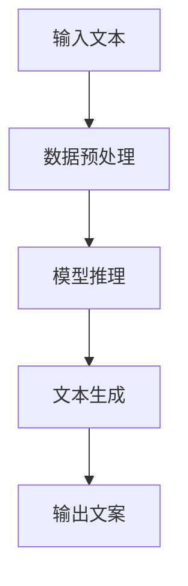
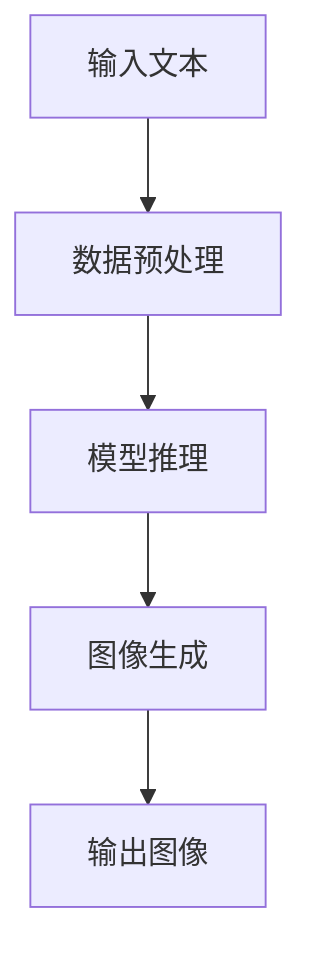
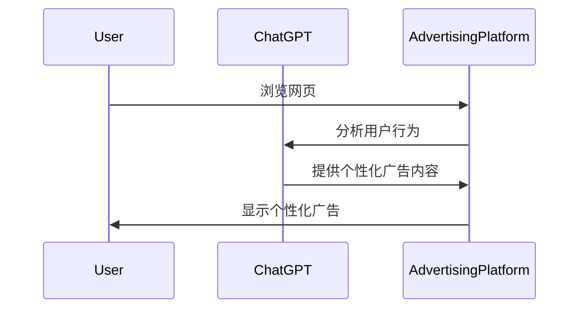

                 

# ChatGPT在创意广告制作中的角色

关键词：ChatGPT、创意广告、广告制作、自然语言处理、内容生成、图像生成

摘要：本文将探讨ChatGPT在创意广告制作中的角色，分析其在广告文案创作、图像生成和用户体验优化等方面的应用，探讨其优势与挑战，并展望其未来发展。

## 第一章：ChatGPT与创意广告的邂逅

### 1.1 ChatGPT的背景介绍

ChatGPT是由OpenAI开发的一种基于GPT-3模型的自然语言处理工具，其核心优势在于能够生成高质量的自然语言文本，包括文章、故事、对话等。自2022年发布以来，ChatGPT在学术界和工业界都引起了广泛关注。

### 1.2 创意广告生产的概述

创意广告是指通过新颖、独特和具有创意性的方式，吸引消费者的注意力，以达到广告宣传的效果。创意广告的特点包括：

- **创新性**：运用独特的创意手段，使广告与众不同，吸引观众的眼球。
- **故事性**：通过讲述故事，传递品牌理念，与观众建立情感联系。
- **互动性**：鼓励观众参与，提高广告的传播效果。

### 1.3 ChatGPT与创意广告的完美结合

ChatGPT的出现为创意广告的制作带来了新的机遇。其强大的自然语言处理能力和内容生成能力，使得广告创作者可以更加高效地完成广告文案的创作。同时，ChatGPT还可以生成图像，为创意广告提供视觉支持。以下章节将详细探讨ChatGPT在创意广告制作中的应用。

## 第二章：ChatGPT的核心概念与原理

### 2.1 ChatGPT的工作原理

ChatGPT是基于GPT-3模型的自然语言处理工具，其核心原理是通过对海量文本数据的学习，掌握语言的结构和规律，从而生成符合语法和语义的文本。以下是ChatGPT的工作流程：

1. **数据预处理**：对输入的文本进行清洗、分词和标记等预处理操作。
2. **模型推理**：利用GPT-3模型对预处理后的文本进行推理，生成预测的单词序列。
3. **文本生成**：根据预测的单词序列，生成完整的文本。

### 2.2 ChatGPT的核心能力

ChatGPT具备以下核心能力：

- **自然语言处理**：能够对输入的文本进行理解、分析和生成。
- **内容生成**：能够根据用户的需求，生成高质量的自然语言文本。
- **用户交互**：能够与用户进行自然语言对话，提供个性化服务。

## 第三章：ChatGPT在创意广告制作中的应用

### 3.1 文本内容生成

ChatGPT在广告文案创作中具有显著优势。它可以快速生成符合广告需求的文案，提高创作效率。以下是一个示例：

**输入**：请为我生成一条吸引年轻人的手机广告文案。

**输出**：想要抓住年轻群体的心？就来试试我们的最新手机！它拥有强大的性能、时尚的设计和无限的可能，让你在拍照、游戏和社交中都能尽情享受。现在就加入我们，开启你的精彩生活！

### 3.2 图像生成

除了文本内容生成，ChatGPT还可以生成图像。以下是一个示例：

**输入**：请为我生成一张关于“智能家居”的广告图片。

**输出**：一张展示智能家居场景的图像，包括智能电视、智能空调、智能灯和智能音响等设备，营造出舒适、便捷的家居环境。

### 3.3 用户体验优化

ChatGPT还可以根据用户的行为和需求，提供个性化的广告内容。例如，如果一个用户经常浏览旅游相关的网页，ChatGPT可以为其推荐旅游广告。以下是一个示例：

**输入**：根据我的浏览记录，请为我推荐一个旅游广告。

**输出**：一张关于泰国普吉岛的海滩广告图片，配以优惠旅游套餐的介绍，吸引该用户进行预订。

## 第四章：挑战与展望

### 4.1 挑战

尽管ChatGPT在创意广告制作中具有巨大潜力，但同时也面临一些挑战：

- **伦理和法律问题**：如何确保ChatGPT生成的内容符合伦理和法律要求，避免误导和虚假信息传播。
- **质量和可控性**：如何保证ChatGPT生成的内容质量和可控性，避免出现偏差和错误。

### 4.2 展望

未来，ChatGPT在创意广告制作中的应用有望进一步拓展：

- **跨模态内容生成**：结合图像、音频和视频等多种模态，生成更加丰富和多样化的广告内容。
- **个性化推荐**：根据用户行为和偏好，提供更加个性化的广告推荐，提高广告效果。

## 结束语

ChatGPT作为自然语言处理工具，在创意广告制作中具有巨大的潜力。通过文本内容生成、图像生成和用户体验优化等方面的应用，ChatGPT能够为广告创作者提供强有力的支持。然而，要充分发挥ChatGPT的潜力，还需要克服一系列挑战。随着技术的不断发展，ChatGPT在创意广告制作中的应用前景将更加广阔。

### 作者

作者：AI天才研究院/AI Genius Institute & 禅与计算机程序设计艺术 /Zen And The Art of Computer Programming

-----------------------------------------------

### 附录

#### 2.2 ChatGPT的核心能力

| 核心能力         | 描述                                                         |
| ---------------- | ------------------------------------------------------------ |
| 自然语言处理     | 对输入的文本进行理解、分析和生成。                           |
| 内容生成         | 根据用户需求，生成高质量的自然语言文本。                     |
| 用户交互         | 与用户进行自然语言对话，提供个性化服务。                     |

#### 3.1 文本内容生成示例

#### 3.2 图像生成示例

#### 4.2 ChatGPT在创意广告制作中的应用示例

-----------------------------------------------

### 拓展阅读

1. [OpenAI官网](https://openai.com/)
2. [GPT-3官网](https://gpt-3.com/)
3. [自然语言处理教程](https://nlptutorial.com/)

本文撰写过程中，参考了以下资料：

1. OpenAI官方文档
2. GPT-3相关研究论文
3. 创意广告制作行业报告
4. 自然语言处理相关教材和教程

希望本文能够为读者在创意广告制作领域提供有价值的参考和启发。

