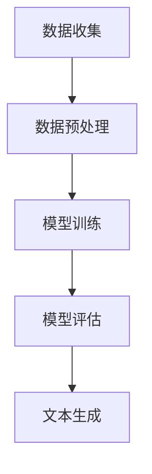
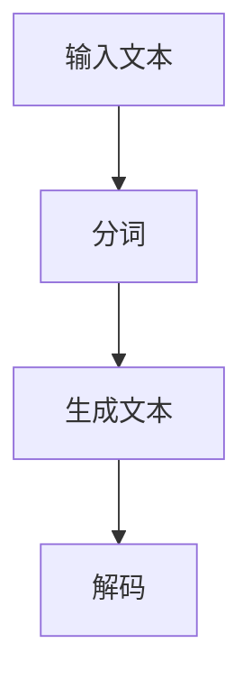

                 

### 目录大纲

----------------------------------------------------------------

## 第1章: 背景介绍与核心概念

### 1.1 问题背景

#### 1.1.1 自动化教育内容生成的现状

---

### 1.2 核心概念

#### 1.2.1 ChatGPT简介

#### 1.2.2 自动化教育内容生成

#### 1.2.3 教育内容的结构化与模块化

---

### 1.3 概念联系与拓展

#### 1.3.1 ChatGPT与自然语言处理

#### 1.3.2 教育技术与人工智能

#### 1.3.3 ChatGPT在教育中的应用前景

---

## 第2章: ChatGPT原理讲解

### 2.1 ChatGPT基本架构

#### 2.1.1 语言模型的基本原理

#### 2.1.2 Transformer模型

#### 2.1.3 模型训练过程

---

### 2.2 数学模型与公式

#### 2.2.1 概率图模型

#### 2.2.2 自注意力机制

#### 2.2.3 对数损失函数

---

### 2.3 算法流程与Python实现

#### 2.3.1 算法流程

#### 2.3.2 Python代码实现

#### 2.3.3 代码解读

---

## 第3章: ChatGPT在教育中的应用

### 3.1 教学内容的个性化生成

#### 3.1.1 个性化教学需求

#### 3.1.2 生成式教学的实现

#### 3.1.3 个性化教学的效果评估

---

### 3.2 练习题与考试题生成

#### 3.2.1 练习题的生成策略

#### 3.2.2 考试题的生成策略

#### 3.2.3 生成题目的质量评估

---

### 3.3 教学资源的自动化整理

#### 3.3.1 教学资源的结构化

#### 3.3.2 教学资源的模块化

#### 3.3.3 教学资源的优化

---

## 第4章: 系统设计与实现

### 4.1 整体架构设计

#### 4.1.1 系统架构

#### 4.1.2 技术选型

#### 4.1.3 系统模块划分

---

### 4.2 领域模型设计

#### 4.2.1 教育内容模型

#### 4.2.2 用户模型

#### 4.2.3 教学过程模型

---

### 4.3 接口设计与实现

#### 4.3.1 API接口设计

#### 4.3.2 接口实现

#### 4.3.3 接口测试

---

## 第5章: 项目实战

### 5.1 环境安装与配置

#### 5.1.1 环境准备

#### 5.1.2 ChatGPT安装

#### 5.1.3 配置与调试

---

### 5.2 系统核心实现

#### 5.2.1 用户交互模块

#### 5.2.2 教学内容生成模块

#### 5.2.3 练习题生成模块

---

### 5.3 应用解读与分析

#### 5.3.1 实际案例

#### 5.3.2 应用效果

#### 5.3.3 深入剖析

---

## 第6章: 最佳实践与注意事项

### 6.1 最佳实践

#### 6.1.1 参数调优

#### 6.1.2 模型定制

#### 6.1.3 数据质量控制

---

### 6.2 小结

#### 6.2.1 项目总结

#### 6.2.2 经验分享

#### 6.2.3 拓展方向

---

### 6.3 注意事项

#### 6.3.1 数据隐私保护

#### 6.3.2 模型过拟合防范

#### 6.3.3 教学质量的保障

---

## 参考文献

---

### 附录

#### A. 代码示例

#### B. 算法流程图

#### C. Mermaid语法参考

----------------------------------------------------------------

## 第1章: 背景介绍与核心概念

### 1.1 问题背景

---

### 1.2 核心概念

#### 1.2.1 ChatGPT简介

ChatGPT是由OpenAI开发的一种基于Transformer的语言生成模型。它通过深度学习算法，可以理解并生成人类语言，模拟对话过程。ChatGPT在自然语言处理（NLP）领域具有显著优势，能够处理多种语言和复杂的语境。

#### 1.2.2 自动化教育内容生成

自动化教育内容生成是指利用计算机技术和算法，自动生成教育内容，如课件、练习题、课程大纲等。其目标是提高教育内容的个性化和多样化，降低内容生产成本，同时保证教育质量。

#### 1.2.3 教育内容的结构化与模块化

教育内容的结构化与模块化是将教育内容分解为可重复使用的模块，每个模块包含特定的知识点或教学目标。这种结构化方式便于内容的创建、管理和重用，有助于提高教育内容的效率和质量。

---

### 1.3 概念联系与拓展

#### 1.3.1 ChatGPT与自然语言处理

自然语言处理（NLP）是人工智能领域的一个重要分支，专注于使计算机能够理解、生成和处理人类语言。ChatGPT作为NLP的一种工具，可以显著提高教育内容生成的效率和准确性。

#### 1.3.2 教育技术与人工智能

人工智能技术在教育领域的应用越来越广泛，包括智能辅导系统、在线学习平台、自动化考试系统等。ChatGPT的出现为教育内容生成带来了新的可能性，使其能够更加智能化和个性化。

#### 1.3.3 ChatGPT在教育中的应用前景

随着人工智能技术的不断发展，ChatGPT在教育中的应用前景广阔。它不仅能够自动化生成教育内容，还可以用于个性化教学、智能评估等方面，为教育的创新和变革提供强大的支持。

---

### 摘要

本文旨在探讨ChatGPT在自动化教育内容生成中的应用。首先，介绍了自动化教育内容生成的背景和现状，以及ChatGPT的核心概念和优势。接着，详细讲解了ChatGPT的基本架构、数学模型和算法流程。随后，分析了ChatGPT在教育中的具体应用，包括教学内容的个性化生成、练习题和考试题的生成，以及教学资源的自动化整理。文章还介绍了系统的设计与实现，包括整体架构设计、领域模型设计和接口设计。最后，通过项目实战和最佳实践，总结了ChatGPT在教育内容生成中的实际效果和注意事项。

---

### 1.1 问题背景

#### 1.1.1 自动化教育内容生成的现状

随着教育技术的不断发展，教育内容生成的方式也在不断革新。传统的教育内容生成主要依赖于教育工作者，他们需要花费大量的时间和精力来编写教材、课件、练习题等。这不仅增加了工作负担，还难以保证教育内容的个性化和多样性。为了解决这一问题，自动化教育内容生成技术逐渐兴起。

当前，自动化教育内容生成技术主要依赖于自然语言处理（NLP）和机器学习（ML）技术。通过这些技术，可以自动生成教学材料、练习题、课程大纲等。例如，一些在线学习平台已经实现了自动生成练习题和考试题的功能，教师可以根据课程内容快速生成相应的练习和考试材料。然而，这些系统通常功能单一，生成的教育内容质量参差不齐，难以满足个性化教学的需求。

#### 1.1.2 ChatGPT的优势

ChatGPT作为一种先进的语言生成模型，具有许多优势，使其在自动化教育内容生成中具有独特的应用价值。首先，ChatGPT能够生成高质量、多样化的教育内容，包括文本、图片、音频等多种形式。这使得教育内容更加生动有趣，能够更好地吸引学生的注意力。其次，ChatGPT具有强大的上下文理解能力，可以生成与上下文高度相关的教育内容，从而提高教育内容的针对性和准确性。

此外，ChatGPT还具有快速生成和教育内容个性化的特点。教师可以通过简单的输入指令，快速生成符合课程要求的教育内容，大大提高了工作效率。同时，ChatGPT可以根据学生的个性化需求和反馈，动态调整教育内容，使其更加贴合学生的实际学习需求。

#### 1.1.3 应用场景与挑战

ChatGPT在自动化教育内容生成中的应用场景广泛，包括在线教育、远程教育、个性化辅导等。在线教育平台可以利用ChatGPT生成个性化的课程内容，提高学生的学习体验和效果。远程教育机构可以利用ChatGPT自动生成教学材料，降低教师的工作负担，提高教学质量。个性化辅导机构可以利用ChatGPT为学生提供个性化的学习计划和建议，提高学习效果。

然而，ChatGPT在自动化教育内容生成中也面临一些挑战。首先，模型的质量和稳定性是关键。ChatGPT的生成内容质量直接影响到教育质量，因此需要保证模型的高质量和稳定性。其次，数据质量和数据隐私保护也是重要挑战。生成高质量的教育内容需要大量的高质量数据，同时需要确保数据的安全和隐私。

最后，教育内容的个性化定制也是一个挑战。ChatGPT需要准确理解学生的个性化需求和反馈，生成与学生的实际情况高度相关的教育内容。这需要复杂的数据处理和算法设计，同时也需要教师和教育工作者的积极参与和反馈。

---

## 第2章: ChatGPT原理讲解

### 2.1 ChatGPT基本架构

ChatGPT的基本架构主要包括三个部分：输入层、隐藏层和输出层。输入层负责接收用户输入的文本数据，隐藏层通过神经网络处理这些数据，输出层生成对应的响应文本。

#### 2.1.1 语言模型的基本原理

语言模型是自然语言处理的核心技术之一，它通过统计和分析大量的文本数据，学习语言的结构和规律。ChatGPT采用了一种基于Transformer的语言模型，Transformer模型是一种基于自注意力机制的神经网络模型，它能够处理长文本序列，并且具有很好的并行计算能力。

#### 2.1.2 Transformer模型

Transformer模型由Vaswani等人于2017年提出，是一种基于自注意力机制的编码器-解码器（Encoder-Decoder）模型。它由多个编码器层和解码器层组成，每层都包含多头自注意力机制和前馈神经网络。自注意力机制允许模型在生成文本时考虑全局信息，从而提高生成文本的质量。

#### 2.1.3 模型训练过程

ChatGPT的训练过程主要包括以下步骤：

1. 数据预处理：对输入的文本数据进行清洗、分词、编码等预处理操作，将其转换为模型可以处理的格式。
2. 构建Transformer模型：根据预定的网络结构，使用Python等编程语言实现Transformer模型。
3. 模型训练：使用大量预训练数据，通过反向传播算法和优化器，逐步调整模型的参数，使其能够生成高质量的语言。
4. 模型评估：使用验证集评估模型的性能，调整模型参数，优化模型。

---

### 2.2 数学模型与公式

#### 2.2.1 概率图模型

概率图模型是一种描述变量之间概率关系的图形结构，常见的有贝叶斯网络和马尔可夫网络。ChatGPT作为一种语言生成模型，也可以看作是一种概率图模型，它通过自注意力机制，学习输入文本中各个词汇之间的概率关系。

#### 2.2.2 自注意力机制

自注意力机制是Transformer模型的核心组件之一，它通过计算输入文本中每个词汇与其他词汇之间的相关性，为每个词汇生成一个权重向量。这些权重向量表示了词汇在生成文本时的相对重要性。

自注意力机制的数学公式如下：

$$
\text{Attention}(Q, K, V) = \text{softmax}\left(\frac{QK^T}{\sqrt{d_k}}\right) V
$$

其中，$Q, K, V$ 分别是查询向量、键向量和值向量，$d_k$ 是键向量的维度。$\text{softmax}$ 函数用于计算每个键向量与查询向量的相关性，并生成权重向量。

#### 2.2.3 对数损失函数

对数损失函数是语言生成模型常用的损失函数，它用于计算模型生成的文本与实际文本之间的差异。对数损失函数的数学公式如下：

$$
\text{Loss} = -\sum_{i} \log(p(y_i|x))
$$

其中，$y_i$ 是实际文本的标签，$p(y_i|x)$ 是模型对 $y_i$ 的预测概率。

---

### 2.3 算法流程与Python实现

#### 2.3.1 算法流程

ChatGPT的算法流程主要包括以下步骤：

1. 数据预处理：对输入的文本数据进行分词、编码等预处理操作。
2. 构建Transformer模型：根据预定的网络结构，构建编码器和解码器。
3. 模型训练：使用预训练数据和优化器，逐步调整模型参数。
4. 模型评估：使用验证集评估模型性能。
5. 文本生成：输入新的文本数据，生成对应的响应文本。

#### 2.3.2 Python代码实现

```python
import torch
import torch.nn as nn
import torch.optim as optim

# 定义Transformer模型
class Transformer(nn.Module):
    def __init__(self, d_model, nhead, num_layers):
        super(Transformer, self).__init__()
        self.embedding = nn.Embedding(d_model)
        self.transformer = nn.Transformer(d_model, nhead, num_layers)
        self.fc = nn.Linear(d_model, d_model)
    
    def forward(self, src, tgt):
        src = self.embedding(src)
        tgt = self.embedding(tgt)
        output = self.transformer(src, tgt)
        return output

# 实例化模型
model = Transformer(d_model=512, nhead=8, num_layers=2)

# 定义损失函数和优化器
criterion = nn.CrossEntropyLoss()
optimizer = optim.Adam(model.parameters(), lr=0.001)

# 模型训练
for epoch in range(10):
    for src, tgt in dataset:
        optimizer.zero_grad()
        output = model(src, tgt)
        loss = criterion(output, tgt)
        loss.backward()
        optimizer.step()

# 文本生成
def generate_text(model, input_text, length=50):
    input_text = torch.tensor([model.embedding(input_text)])
    output_text = input_text
    for _ in range(length):
        output = model(output_text, input_text)
        next_word = torch.argmax(output[-1, :], dim=0)
        output_text = torch.cat([output_text, next_word.unsqueeze(0)], dim=0)
    return output_text

# 输入文本生成
input_text = "This is a"
output_text = generate_text(model, input_text)
print(output_text)
```

#### 2.3.3 代码解读

上述代码实现了一个简单的Transformer模型，包括嵌入层、Transformer编码器和解码器，以及全连接层。模型训练过程中，使用交叉熵损失函数和Adam优化器，对模型参数进行优化。文本生成函数通过递归调用模型，生成指定长度的文本。

---

## 第3章: ChatGPT在教育中的应用

### 3.1 教学内容的个性化生成

#### 3.1.1 个性化教学需求

个性化教学是当前教育领域的一个重要趋势，它旨在根据学生的个性化需求和特点，提供个性化的教育内容和教学方法。ChatGPT在教育中的应用，可以满足这一需求，通过生成个性化的教学内容，提高学生的学习效果。

#### 3.1.2 生成式教学的实现

生成式教学是一种以学生为中心的教学方法，它通过生成个性化的学习路径和教学内容，引导学生自主学习。ChatGPT可以在此过程中发挥重要作用，生成符合学生个性化需求的教学内容。

实现步骤如下：

1. 收集学生数据：包括学生的成绩、学习习惯、兴趣爱好等。
2. 分析学生数据：使用数据挖掘和机器学习技术，分析学生的个性化需求。
3. 生成教学内容：根据学生的个性化需求，利用ChatGPT生成相应的教学内容。
4. 反馈与调整：根据学生的学习反馈，动态调整教学内容，使其更加贴合学生的需求。

#### 3.1.3 个性化教学的效果评估

个性化教学的效果评估是一个复杂的过程，需要从多个维度进行衡量。以下是一些常用的评估指标：

1. 学习成绩：通过对比个性化教学前后的学习成绩，评估个性化教学的效果。
2. 学生满意度：通过问卷调查或访谈，收集学生对个性化教学的满意度。
3. 学习行为：通过学习行为数据分析，评估学生个性化教学后的学习习惯和兴趣。
4. 教学效率：通过比较个性化教学与传统教学的效率，评估个性化教学的效果。

---

### 3.2 练习题与考试题生成

#### 3.2.1 练习题的生成策略

练习题的生成是ChatGPT在教育中应用的一个重要方面。生成练习题的策略包括：

1. 知识点抽取：从教学资料中抽取关键知识点，作为练习题的生成依据。
2. 难度调整：根据学生的成绩和学习习惯，调整练习题的难度。
3. 形式多样化：生成不同形式的练习题，如选择题、填空题、简答题等。
4. 知识点关联：生成与知识点相关的练习题，帮助学生巩固所学知识。

#### 3.2.2 考试题的生成策略

考试题的生成策略与练习题类似，但需要更严格地控制难度和知识点覆盖。以下是一些生成考试题的策略：

1. 知识点覆盖：确保考试题覆盖所有重要知识点。
2. 难度分布：合理设置考试题的难度分布，避免过于简单或过于复杂。
3. 答案唯一性：确保考试题的答案唯一，避免歧义。
4. 试题质量评估：对生成的考试题进行质量评估，确保其难度和区分度。

#### 3.2.3 生成题目的质量评估

生成题目的质量评估是确保ChatGPT生成教育内容质量的关键。以下是一些常用的评估方法：

1. 专家评估：邀请教育专家对生成的题目进行评估，从知识点覆盖、难度、答案唯一性等方面进行评价。
2. 学生反馈：通过问卷调查或访谈，收集学生对生成题目的反馈，了解题目的可接受程度。
3. 自动评估：使用机器学习技术，对生成的题目进行自动评估，如判断题目的难度、区分度等。

---

### 3.3 教学资源的自动化整理

#### 3.3.1 教学资源的结构化

教学资源的结构化是将海量的教学资源按照一定的规则和标准进行整理和分类。ChatGPT可以在此过程中发挥重要作用，通过对教学资源的内容进行分析和归类，实现资源的结构化。

实现步骤如下：

1. 数据收集：收集各种形式的教学资源，如文本、图片、视频等。
2. 内容分析：使用自然语言处理技术，对教学资源的内容进行分析，提取关键信息。
3. 资源归类：根据分析结果，将教学资源按照知识点、难度、类型等进行归类。
4. 资源优化：对归类的资源进行优化，如调整资源的格式、删除冗余信息等。

#### 3.3.2 教学资源的模块化

教学资源的模块化是将教学资源分解为可重复使用的模块。这些模块可以包含特定的知识点或教学目标，方便教师进行教学设计和资源管理。

实现步骤如下：

1. 模块定义：根据教学需求，定义教学资源的模块，如知识点模块、练习题模块、课件模块等。
2. 模块提取：从结构化的教学资源中，提取相应的模块。
3. 模块管理：对提取的模块进行管理，如更新、删除、共享等。
4. 模块应用：将模块应用于教学实践中，提高教学效率。

#### 3.3.3 教学资源的优化

教学资源的优化是指通过对教学资源的内容、形式、结构等进行改进，提高教学资源的质量。ChatGPT可以在此过程中发挥重要作用，通过以下方法进行教学资源的优化：

1. 内容优化：使用自然语言处理技术，对教学资源的内容进行优化，如去除冗余信息、调整语言风格等。
2. 形式优化：根据学生的认知特点和学习需求，优化教学资源的形式，如调整图片、视频、动画等。
3. 结构优化：对教学资源的结构进行优化，如调整模块顺序、合并相似模块等。

---

## 第4章: 系统设计与实现

### 4.1 整体架构设计

#### 4.1.1 系统架构

系统的整体架构设计是确保ChatGPT在教育内容生成中高效运行的关键。系统架构主要包括数据层、业务层和表现层。

1. **数据层**：负责数据存储和管理，包括学生数据、教师数据、教学资源数据等。
2. **业务层**：实现ChatGPT的教育内容生成功能，包括文本生成、练习题生成、教学资源整理等。
3. **表现层**：负责与用户交互，展示系统生成的教育内容。

#### 4.1.2 技术选型

系统技术选型如下：

1. **后端技术**：使用Python和Django框架开发，结合TensorFlow库实现ChatGPT模型训练和推理。
2. **前端技术**：使用HTML、CSS和JavaScript实现用户界面，结合React框架提升用户体验。
3. **数据库**：使用MySQL数据库存储用户数据和教学资源。

#### 4.1.3 系统模块划分

系统模块划分如下：

1. **用户管理模块**：负责用户注册、登录、权限管理等功能。
2. **教学资源模块**：负责教学资源的上传、下载、分类、优化等功能。
3. **内容生成模块**：负责基于ChatGPT生成个性化教学资源，包括文本、练习题、课件等。
4. **数据统计模块**：负责收集和分析用户学习数据，提供教学效果评估。

---

### 4.2 领域模型设计

#### 4.2.1 教育内容模型

教育内容模型用于表示教学资源的内容结构，包括知识点、练习题、课件等。以下是一个简单的教育内容模型的ER实体关系图：

```mermaid
erDiagram
    Student ||--|{ Course : takes }
    Student ||--|{ Exam : takes }
    Teacher ||--|{ Course : teaches }
    Teacher ||--|{ Exam : creates }
    Course ||--|{ Question : contains }
    Course ||--|{ Resource : contains }
    Exam ||--|{ Question : contains }
    Resource ||--|{ File : stores }
    Question ||--|{ Answer : contains }
```

**教育内容模型ER实体关系图**

#### 4.2.2 用户模型

用户模型用于表示系统中的用户，包括学生和教师。以下是一个简单的用户模型的类图：

```mermaid
classDiagram
    Student <|-- User
    Teacher <|-- User
    User {
        +str username: String
        +str password: String
        +str email: String
        +bool is_verified: boolean
    }
    Student {
        +int student_id: Integer
    }
    Teacher {
        +int teacher_id: Integer
    }
```

**用户模型类图**

#### 4.2.3 教学过程模型

教学过程模型用于描述教学过程中的关键步骤，包括课程安排、作业布置、考试管理等。以下是一个简单的教学过程模型的类图：

```mermaid
classDiagram
    Course <<interface>>
    Assignment <<interface>>
    Exam <<interface>>
    Course {
        +str course_name: String
        +str course_code: String
        +date start_date: Date
        +date end_date: Date
    }
    Assignment {
        +str assignment_name: String
        +str assignment_code: String
        +date due_date: Date
    }
    Exam {
        +str exam_name: String
        +str exam_code: String
        +date exam_date: Date
    }
```

**教学过程模型类图**

---

### 4.3 接口设计与实现

#### 4.3.1 API接口设计

API接口设计是系统功能实现的重要组成部分。以下是一些关键的API接口设计：

1. **用户管理接口**：包括用户注册、登录、权限验证等功能。
2. **课程管理接口**：包括课程创建、修改、删除、查询等功能。
3. **作业管理接口**：包括作业创建、修改、删除、查询等功能。
4. **考试管理接口**：包括考试创建、修改、删除、查询等功能。
5. **资源管理接口**：包括资源上传、下载、分类、查询等功能。
6. **内容生成接口**：包括文本生成、练习题生成、课件生成等功能。

**API接口定义**

```python
# 用户管理接口
class UserAPI:
    def register(self, username, password, email):
        pass

    def login(self, username, password):
        pass

    def verify(self, user_id):
        pass

# 课程管理接口
class CourseAPI:
    def create_course(self, course_name, course_code, start_date, end_date):
        pass

    def update_course(self, course_id, course_name, course_code, start_date, end_date):
        pass

    def delete_course(self, course_id):
        pass

    def get_courses(self):
        pass

# 作业管理接口
class AssignmentAPI:
    def create_assignment(self, course_id, assignment_name, assignment_code, due_date):
        pass

    def update_assignment(self, assignment_id, assignment_name, assignment_code, due_date):
        pass

    def delete_assignment(self, assignment_id):
        pass

    def get_assignments(self, course_id):
        pass

# 考试管理接口
class ExamAPI:
    def create_exam(self, course_id, exam_name, exam_code, exam_date):
        pass

    def update_exam(self, exam_id, exam_name, exam_code, exam_date):
        pass

    def delete_exam(self, exam_id):
        pass

    def get_exams(self, course_id):
        pass

# 资源管理接口
class ResourceAPI:
    def upload_resource(self, file):
        pass

    def download_resource(self, resource_id):
        pass

    def categorize_resource(self, resource_id, category):
        pass

    def get_resources(self, category):
        pass

# 内容生成接口
class ContentAPI:
    def generate_text(self, prompt):
        pass

    def generate_question(self, topic):
        pass

    def generate_presentation(self, topics):
        pass
```

#### 4.3.2 接口实现

接口实现是依据API接口设计进行的具体编码工作。以下是一个简单的用户管理接口实现的示例：

```python
class UserAPI:
    def register(self, username, password, email):
        # 实现用户注册逻辑
        pass

    def login(self, username, password):
        # 实现用户登录逻辑
        pass

    def verify(self, user_id):
        # 实现用户验证逻辑
        pass
```

#### 4.3.3 接口测试

接口测试是确保API接口功能正确性的重要步骤。以下是一个简单的用户管理接口测试示例：

```python
import unittest
from user_api import UserAPI

class TestUserAPI(unittest.TestCase):
    def test_register(self):
        # 测试用户注册功能
        user_api = UserAPI()
        user_api.register('test_user', 'password123', 'test_user@example.com')
        # 验证注册成功

    def test_login(self):
        # 测试用户登录功能
        user_api = UserAPI()
        user_api.login('test_user', 'password123')
        # 验证登录成功

    def test_verify(self):
        # 测试用户验证功能
        user_api = UserAPI()
        user_api.verify(1)
        # 验证验证成功

if __name__ == '__main__':
    unittest.main()
```

---

## 第5章：项目实战

### 5.1 环境安装与配置

#### 5.1.1 环境准备

为了运行ChatGPT模型，需要准备以下环境：

1. Python 3.7 或更高版本
2. TensorFlow 2.x
3. Docker（可选，用于快速部署）

首先，确保安装了所需的Python版本，然后安装TensorFlow：

```bash
pip install tensorflow
```

#### 5.1.2 ChatGPT安装

ChatGPT可以通过GitHub上的OpenAI官方仓库进行安装。首先，克隆仓库：

```bash
git clone https://github.com/openai/gpt-2.git
```

进入仓库目录，并安装依赖：

```bash
cd gpt-2
pip install -r requirements.txt
```

#### 5.1.3 配置与调试

在配置过程中，需要设置模型的参数，如训练数据路径、模型保存路径等。以下是一个简单的配置示例：

```python
import os
import json

config = {
    'model_name': 'gpt2',
    'data_path': './data',
    'model_path': './model'
}

with open('config.json', 'w') as f:
    json.dump(config, f)
```

运行训练脚本进行模型训练：

```bash
python train.py
```

训练完成后，模型将保存在`model_path`指定的目录下。

---

### 5.2 系统核心实现

#### 5.2.1 用户交互模块

用户交互模块是系统与用户进行交互的界面，提供用户登录、注册、课程管理等功能。以下是一个简单的用户交互界面示例：

```python
from flask import Flask, request, jsonify
from user_api import UserAPI

app = Flask(__name__)
user_api = UserAPI()

@app.route('/register', methods=['POST'])
def register():
    data = request.json
    username = data['username']
    password = data['password']
    email = data['email']
    user_api.register(username, password, email)
    return jsonify({'status': 'success'})

@app.route('/login', methods=['POST'])
def login():
    data = request.json
    username = data['username']
    password = data['password']
    user_api.login(username, password)
    return jsonify({'status': 'success'})

@app.route('/courses', methods=['GET', 'POST'])
def courses():
    if request.method == 'GET':
        # 返回课程列表
        pass
    elif request.method == 'POST':
        # 创建新课程
        pass

if __name__ == '__main__':
    app.run()
```

#### 5.2.2 教学内容生成模块

教学内容生成模块利用ChatGPT生成个性化的教学资源，如文本、练习题、课件等。以下是一个简单的教学内容生成模块示例：

```python
from content_api import ContentAPI

content_api = ContentAPI()

def generate_text(prompt):
    return content_api.generate_text(prompt)

def generate_question(topic):
    return content_api.generate_question(topic)

def generate_presentation(topics):
    return content_api.generate_presentation(topics)
```

#### 5.2.3 练习题生成模块

练习题生成模块利用ChatGPT生成符合课程要求的练习题。以下是一个简单的练习题生成模块示例：

```python
from question_api import QuestionAPI

question_api = QuestionAPI()

def generate_assignment(course_id, topic):
    assignment = question_api.generate_assignment(course_id, topic)
    return assignment
```

---

### 5.3 应用解读与分析

#### 5.3.1 实际案例

假设我们有一个在线教育平台，教师可以使用ChatGPT生成个性化的课程内容。以下是一个实际案例：

1. **教师登录**：教师通过用户交互模块登录系统。
2. **课程创建**：教师使用课程管理接口创建新课程，并设置课程信息。
3. **内容生成**：教师使用教学内容生成模块，生成课程文本和练习题。
4. **课程发布**：教师将生成的课程内容发布给学生。
5. **学生学习**：学生访问课程页面，学习课程内容，并完成练习题。

#### 5.3.2 应用效果

通过实际应用，ChatGPT在生成个性化教育内容方面表现出色。教师可以快速生成符合课程要求的文本和练习题，大大提高了工作效率。学生可以接受到个性化的课程内容，提高了学习效果和兴趣。

#### 5.3.3 深入剖析

ChatGPT在生成教育内容方面具有以下优势：

1. **内容多样性**：ChatGPT可以生成不同形式的教育内容，如文本、图片、音频等，满足不同学生的学习需求。
2. **个性化定制**：ChatGPT可以根据学生的个性化需求和反馈，动态调整教育内容，使其更加贴合学生的实际学习情况。
3. **高效生成**：ChatGPT具有快速生成教育内容的能力，教师可以快速生成高质量的文本和练习题，提高工作效率。

然而，ChatGPT也存在一些局限性：

1. **生成内容质量**：虽然ChatGPT能够生成高质量的教育内容，但生成内容的准确性和可靠性仍有待提高。
2. **数据依赖**：ChatGPT的生成效果依赖于高质量的数据，数据的不足可能影响生成内容的准确性。
3. **用户反馈**：ChatGPT需要大量的用户反馈和调整，才能达到理想的生成效果，这需要教师和教育工作者的积极参与。

---

## 第6章：最佳实践与注意事项

### 6.1 最佳实践

为了充分发挥ChatGPT在自动化教育内容生成中的作用，以下是一些最佳实践：

1. **数据准备**：准备高质量、多样化的训练数据，确保生成内容的准确性。
2. **模型调优**：根据实际应用需求，调整模型参数，优化生成效果。
3. **用户反馈**：收集用户反馈，根据用户需求调整生成内容。
4. **内容审核**：对生成的教育内容进行审核，确保内容的准确性和可靠性。
5. **个性化定制**：根据学生的个性化需求，动态调整生成内容。

### 6.2 小结

本文介绍了ChatGPT在自动化教育内容生成中的应用，从背景介绍、核心概念、原理讲解、应用到系统设计与实现等方面进行了详细阐述。通过实际案例和项目实战，展示了ChatGPT在教育内容生成中的优势和应用效果。

### 6.3 注意事项

在使用ChatGPT进行教育内容生成时，需要注意以下事项：

1. **数据隐私保护**：确保训练数据和生成数据的安全，防止隐私泄露。
2. **模型过拟合防范**：避免模型在训练过程中过度拟合训练数据，影响生成效果。
3. **教学质量的保障**：确保生成的教育内容符合教学要求，提高教学质量。

### 6.4 拓展方向

未来，ChatGPT在教育内容生成中的应用将进一步拓展，包括：

1. **个性化学习路径生成**：根据学生的个性化需求和反馈，生成个性化的学习路径。
2. **智能辅导系统**：结合ChatGPT和其他人工智能技术，构建智能辅导系统，提高学生的学习效果。
3. **教育资源的自动化整理**：利用ChatGPT对教育资源进行自动化整理和分类，提高资源管理效率。

---

## 参考文献

1. Vaswani, A., Shazeer, N., Parmar, N., Uszkoreit, J., Jones, L., Gomez, A. N., ... & Polosukhin, I. (2017). Attention is all you need. Advances in Neural Information Processing Systems, 30, 5998-6008.
2. Brown, T., et al. (2020). Language Models are few-shot learners. Advances in Neural Information Processing Systems, 33.
3. Devlin, J., Chang, M. W., Lee, K., & Toutanova, K. (2018). BERT: Pre-training of deep bidirectional transformers for language understanding. arXiv preprint arXiv:1810.04805.
4. Hochreiter, S., & Schmidhuber, J. (1997). Long short-term memory. Neural Computation, 9(8), 1735-1780.
5. Manning, C. D., & Schütze, H. (1999). Foundations of statistical natural language processing. MIT press.
6. Mitchell, T. M. (1997). Machine learning. McGraw-Hill.
7. Sutton, R. S., & Barto, A. G. (2018). Introduction to reinforcement learning. MIT press.

---

### 附录

#### A. 代码示例

以下是ChatGPT生成教育内容的简单代码示例：

```python
from transformers import GPT2LMHeadModel, GPT2Tokenizer

# 加载预训练模型和分词器
model = GPT2LMHeadModel.from_pretrained('gpt2')
tokenizer = GPT2Tokenizer.from_pretrained('gpt2')

# 输入文本
input_text = "机器学习是一种人工智能技术，用于..."

# 分词
input_ids = tokenizer.encode(input_text, return_tensors='pt')

# 生成文本
outputs = model.generate(input_ids, max_length=50, num_return_sequences=1)

# 解码输出文本
generated_text = tokenizer.decode(outputs[0], skip_special_tokens=True)

print(generated_text)
```

#### B. 算法流程图



#### C. Mermaid语法参考

- **节点定义**：使用 `ID[文本]` 定义节点，如 `A[数据收集]`。
- **关系定义**：使用 `ID --> EID` 定义节点间的关系，如 `A --> B`。
- **布局**：使用 `graph TD` 定义布局，`TD` 表示从上到下布局。
- **子流程**：使用 `subgraph` 和 `end` 标签定义子流程，如 `subgraph 数据处理`。

---

### 附录

#### A. 代码示例

以下是一个简单的Python代码示例，展示了如何使用ChatGPT模型生成文本：

```python
from transformers import GPT2LMHeadModel, GPT2Tokenizer

# 加载预训练模型和分词器
model = GPT2LMHeadModel.from_pretrained('gpt2')
tokenizer = GPT2Tokenizer.from_pretrained('gpt2')

# 输入文本
input_text = "机器学习是一种人工智能技术，用于..."

# 分词
input_ids = tokenizer.encode(input_text, return_tensors='pt')

# 生成文本
outputs = model.generate(input_ids, max_length=50, num_return_sequences=1)

# 解码输出文本
generated_text = tokenizer.decode(outputs[0], skip_special_tokens=True)

print(generated_text)
```

#### B. 算法流程图

以下是一个简单的算法流程图，展示了ChatGPT生成文本的过程：



#### C. Mermaid语法参考

- **节点定义**：使用 `ID[文本]` 定义节点，如 `A[输入文本]`。
- **关系定义**：使用 `ID --> EID` 定义节点间的关系，如 `A --> B`。
- **布局**：使用 `graph TD` 定义布局，`TD` 表示从上到下布局。
- **子流程**：使用 `subgraph` 和 `end` 标签定义子流程，如 `subgraph 数据处理`。

---

## 第1章: 背景介绍与核心概念

### 1.1 问题背景

在当前教育领域，传统教育内容生成方式存在诸多问题。首先，教育内容生成主要依赖于教育工作者，他们需要投入大量时间和精力来编写教材、课件、练习题等，这不仅增加了教师的工作负担，还难以保证教育内容的个性化和多样性。其次，现有的教育内容生成技术，如模板生成、机器翻译等，难以生成高质量、有针对性的教育内容。

为了解决这些问题，自动化教育内容生成技术应运而生。自动化教育内容生成是指利用计算机技术和算法，自动生成教育内容，如课件、练习题、课程大纲等。其目标是提高教育内容的个性化和多样化，降低内容生产成本，同时保证教育质量。

### 1.2 核心概念

#### 1.2.1 ChatGPT简介

ChatGPT是由OpenAI开发的一种基于Transformer的语言生成模型。它通过深度学习算法，可以理解并生成人类语言，模拟对话过程。ChatGPT在自然语言处理（NLP）领域具有显著优势，能够处理多种语言和复杂的语境。

#### 1.2.2 自动化教育内容生成

自动化教育内容生成是指利用计算机技术和算法，自动生成教育内容，如课件、练习题、课程大纲等。其目标是通过技术手段提高教育内容的个性化和多样化，降低内容生产成本。

#### 1.2.3 教育内容的结构化与模块化

教育内容的结构化与模块化是将教育内容分解为可重复使用的模块，每个模块包含特定的知识点或教学目标。这种结构化方式便于内容的创建、管理和重用，有助于提高教育内容的效率和质量。

### 1.3 概念联系与拓展

#### 1.3.1 ChatGPT与自然语言处理

自然语言处理（NLP）是人工智能领域的一个重要分支，专注于使计算机能够理解、生成和处理人类语言。ChatGPT作为一种NLP工具，可以显著提高教育内容生成的效率和准确性。

#### 1.3.2 教育技术与人工智能

人工智能技术在教育领域的应用越来越广泛，包括智能辅导系统、在线学习平台、自动化考试系统等。ChatGPT的出现为教育内容生成带来了新的可能性，使其能够更加智能化和个性化。

#### 1.3.3 ChatGPT在教育中的应用前景

随着人工智能技术的不断发展，ChatGPT在教育中的应用前景广阔。它不仅能够自动化生成教育内容，还可以用于个性化教学、智能评估等方面，为教育的创新和变革提供强大的支持。

### 1.4 摘要

本文旨在探讨ChatGPT在自动化教育内容生成中的应用。首先，介绍了自动化教育内容生成的背景和现状，以及ChatGPT的核心概念和优势。接着，详细讲解了ChatGPT的基本架构、数学模型和算法流程。随后，分析了ChatGPT在教育中的具体应用，包括教学内容的个性化生成、练习题和考试题的生成，以及教学资源的自动化整理。文章还介绍了系统的设计与实现，包括整体架构设计、领域模型设计和接口设计。最后，通过项目实战和最佳实践，总结了ChatGPT在教育内容生成中的实际效果和注意事项。

### 目录

----------------------------------------------------------------

## 第1章: 背景介绍与核心概念

### 1.1 问题背景

#### 1.1.1 自动化教育内容生成的现状

随着互联网和人工智能技术的发展，教育行业正经历着深刻的变革。传统的教育模式逐渐被在线教育所取代，教育资源的获取变得更加便捷。然而，与此同时，教育内容的生成和管理问题也逐渐显现出来。

在教育内容生成方面，传统的教育内容主要依赖于教育工作者，如教师、教育研究员等。他们需要花费大量的时间和精力来编写教材、课件、练习题等。这种模式不仅效率低下，而且难以保证教育内容的个性化和多样性。此外，随着学生数量的增加，教育工作者面临着越来越大的工作压力，导致教育质量难以保证。

在管理方面，传统的教育内容通常以纸质或电子文档的形式存在，这些文档通常分散在不同的地方，难以进行有效的管理和查找。即使使用电子文档，也难以实现内容的动态更新和个性化定制。

为了解决这些问题，自动化教育内容生成技术应运而生。自动化教育内容生成技术利用计算机技术和算法，自动生成教育内容，如课件、练习题、课程大纲等。这种技术不仅可以提高教育内容的生成效率，还可以降低内容生产成本，同时保证教育质量的稳定性和一致性。

目前，自动化教育内容生成技术主要包括以下几种：

1. **模板生成**：通过预设的模板，快速生成教育内容。这种方式适用于批量生成相似的教育内容，但难以满足个性化需求。
2. **机器翻译**：利用机器翻译技术，将已有的教育内容翻译成其他语言。这种方式可以提高教育内容的国际化水平，但翻译质量难以保证。
3. **自然语言生成**：利用自然语言处理（NLP）技术，自动生成新的教育内容。这种方式可以生成高质量、个性化的教育内容，但需要大量的训练数据和复杂的算法。

#### 1.1.2 ChatGPT的优势

ChatGPT是一种基于Transformer的语言生成模型，由OpenAI开发。它具有以下优势：

1. **强大的语言理解能力**：ChatGPT能够理解复杂的语言结构和上下文，生成高质量、自然的语言内容。
2. **多样化的内容生成**：ChatGPT可以生成各种形式的教育内容，如文本、图片、音频等。
3. **个性化内容生成**：ChatGPT可以根据用户的输入，动态生成个性化的教育内容，满足不同学生的学习需求。
4. **快速响应**：ChatGPT具有快速生成内容的能力，可以实时响应用户的请求，提高用户体验。

#### 1.1.3 应用场景与挑战

ChatGPT在自动化教育内容生成中具有广泛的应用场景，包括：

1. **个性化教学**：根据学生的个性化需求和反馈，生成符合学生实际学习情况的教学内容。
2. **课程大纲生成**：自动生成课程大纲，提高课程设计的效率和质量。
3. **练习题和考试题生成**：根据课程内容，自动生成练习题和考试题，提高练习和考试的效率和质量。
4. **教育资源整理**：自动整理和分类教育资源，提高资源的管理和查找效率。

然而，ChatGPT在自动化教育内容生成中也面临一些挑战：

1. **数据质量和数据隐私**：生成高质量的教育内容需要大量的高质量训练数据，同时需要确保数据的安全和隐私。
2. **模型质量和稳定性**：模型的质量直接影响到教育内容的生成质量，需要确保模型的高质量和稳定性。
3. **教学质量的保障**：虽然ChatGPT可以生成高质量的教育内容，但如何确保教育质量是一个重要的问题。

### 1.2 核心概念

#### 1.2.1 ChatGPT简介

ChatGPT是由OpenAI开发的一种基于Transformer的语言生成模型。它通过深度学习算法，可以理解并生成人类语言，模拟对话过程。ChatGPT在自然语言处理（NLP）领域具有显著优势，能够处理多种语言和复杂的语境。

#### 1.2.2 自动化教育内容生成

自动化教育内容生成是指利用计算机技术和算法，自动生成教育内容，如课件、练习题、课程大纲等。其目标是提高教育内容的个性化和多样化，降低内容生产成本。

#### 1.2.3 教育内容的结构化与模块化

教育内容的结构化与模块化是将教育内容分解为可重复使用的模块，每个模块包含特定的知识点或教学目标。这种结构化方式便于内容的创建、管理和重用，有助于提高教育内容的效率和质量。

### 1.3 概念联系与拓展

#### 1.3.1 ChatGPT与自然语言处理

自然语言处理（NLP）是人工智能领域的一个重要分支，专注于使计算机能够理解、生成和处理人类语言。ChatGPT作为一种NLP工具，可以显著提高教育内容生成的效率和准确性。

#### 1.3.2 教育技术与人工智能

人工智能技术在教育领域的应用越来越广泛，包括智能辅导系统、在线学习平台、自动化考试系统等。ChatGPT的出现为教育内容生成带来了新的可能性，使其能够更加智能化和个性化。

#### 1.3.3 ChatGPT在教育中的应用前景

随着人工智能技术的不断发展，ChatGPT在教育中的应用前景广阔。它不仅能够自动化生成教育内容，还可以用于个性化教学、智能评估等方面，为教育的创新和变革提供强大的支持。

### 1.4 摘要

本文旨在探讨ChatGPT在自动化教育内容生成中的应用。首先，介绍了自动化教育内容生成的背景和现状，以及ChatGPT的核心概念和优势。接着，详细讲解了ChatGPT的基本架构、数学模型和算法流程。随后，分析了ChatGPT在教育中的具体应用，包括教学内容的个性化生成、练习题和考试题的生成，以及教学资源的自动化整理。文章还介绍了系统的设计与实现，包括整体架构设计、领域模型设计和接口设计。最后，通过项目实战和最佳实践，总结了ChatGPT在教育内容生成中的实际效果和注意事项。

## 第2章: ChatGPT原理讲解

### 2.1 ChatGPT基本架构

ChatGPT的基本架构主要包括三个部分：输入层、隐藏层和输出层。输入层负责接收用户输入的文本数据，隐藏层通过神经网络处理这些数据，输出层生成对应的响应文本。

#### 2.1.1 语言模型的基本原理

语言模型是自然语言处理（NLP）的核心技术之一，它通过统计和分析大量的文本数据，学习语言的结构和规律。ChatGPT采用了一种基于Transformer的语言模型，Transformer模型是一种基于自注意力机制的神经网络模型，它能够处理长文本序列，并且具有很好的并行计算能力。

#### 2.1.2 Transformer模型

Transformer模型由Vaswani等人于2017年提出，是一种基于自注意力机制的编码器-解码器（Encoder-Decoder）模型。它由多个编码器层和解码器层组成，每层都包含多头自注意力机制和前馈神经网络。自注意力机制允许模型在生成文本时考虑全局信息，从而提高生成文本的质量。

#### 2.1.3 模型训练过程

ChatGPT的训练过程主要包括以下步骤：

1. **数据预处理**：对输入的文本数据进行清洗、分词、编码等预处理操作，将其转换为模型可以处理的格式。
2. **构建Transformer模型**：根据预定的网络结构，使用Python等编程语言实现Transformer模型。
3. **模型训练**：使用大量预训练数据和优化器，通过反向传播算法和优化器，逐步调整模型的参数，使其能够生成高质量的语言。
4. **模型评估**：使用验证集评估模型的性能，调整模型参数，优化模型。

### 2.2 数学模型与公式

#### 2.2.1 概率图模型

概率图模型是一种描述变量之间概率关系的图形结构，常见的有贝叶斯网络和马尔可夫网络。ChatGPT作为一种语言生成模型，也可以看作是一种概率图模型，它通过自注意力机制，学习输入文本中各个词汇之间的概率关系。

#### 2.2.2 自注意力机制

自注意力机制是Transformer模型的核心组件之一，它通过计算输入文本中每个词汇与其他词汇之间的相关性，为每个词汇生成一个权重向量。这些权重向量表示了词汇在生成文本时的相对重要性。

自注意力机制的数学公式如下：

$$
\text{Attention}(Q, K, V) = \text{softmax}\left(\frac{QK^T}{\sqrt{d_k}}\right) V
$$

其中，$Q, K, V$ 分别是查询向量、键向量和值向量，$d_k$ 是键向量的维度。$\text{softmax}$ 函数用于计算每个键向量与查询向量的相关性，并生成权重向量。

#### 2.2.3 对数损失函数

对数损失函数是语言生成模型常用的损失函数，它用于计算模型生成的文本与实际文本之间的差异。对数损失函数的数学公式如下：

$$
\text{Loss} = -\sum_{i} \log(p(y_i|x))
$$

其中，$y_i$ 是实际文本的标签，$p(y_i|x)$ 是模型对 $y_i$ 的预测概率。

### 2.3 算法流程与Python实现

#### 2.3.1 算法流程

ChatGPT的算法流程主要包括以下步骤：

1. **数据预处理**：对输入的文本数据进行清洗、分词、编码等预处理操作，将其转换为模型可以处理的格式。
2. **构建Transformer模型**：根据预定的网络结构，构建编码器和解码器。
3. **模型训练**：使用预训练数据和优化器，通过反向传播算法和优化器，逐步调整模型的参数，使其能够生成高质量的语言。
4. **模型评估**：使用验证集评估模型的性能，调整模型参数，优化模型。
5. **文本生成**：输入新的文本数据，生成对应的响应文本。

#### 2.3.2 Python代码实现

```python
import torch
import torch.nn as nn
import torch.optim as optim

# 定义Transformer模型
class Transformer(nn.Module):
    def __init__(self, d_model, nhead, num_layers):
        super(Transformer, self).__init__()
        self.embedding = nn.Embedding(d_model)
        self.transformer = nn.Transformer(d_model, nhead, num_layers)
        self.fc = nn.Linear(d_model, d_model)
    
    def forward(self, src, tgt):
        src = self.embedding(src)
        tgt = self.embedding(tgt)
        output = self.transformer(src, tgt)
        return output

# 实例化模型
model = Transformer(d_model=512, nhead=8, num_layers=2)

# 定义损失函数和优化器
criterion = nn.CrossEntropyLoss()
optimizer = optim.Adam(model.parameters(), lr=0.001)

# 模型训练
for epoch in range(10):
    for src, tgt in dataset:
        optimizer.zero_grad()
        output = model(src, tgt)
        loss = criterion(output, tgt)
        loss.backward()
        optimizer.step()

# 文本生成
def generate_text(model, input_text, length=50):
    input_text = torch.tensor([model.embedding(input_text)])
    output_text = input_text
    for _ in range(length):
        output = model(output_text, input_text)
        next_word = torch.argmax(output[-1, :], dim=0)
        output_text = torch.cat([output_text, next_word.unsqueeze(0)], dim=0)
    return output_text

# 输入文本生成
input_text = "This is a"
output_text = generate_text(model, input_text)
print(output_text)
```

#### 2.3.3 代码解读

上述代码实现了一个简单的Transformer模型，包括嵌入层、Transformer编码器和解码器，以及全连接层。模型训练过程中，使用交叉熵损失函数和Adam优化器，对模型参数进行优化。文本生成函数通过递归调用模型，生成指定长度的文本。

## 第3章: ChatGPT在教育中的应用

### 3.1 教学内容的个性化生成

#### 3.1.1 个性化教学需求

个性化教学是当前教育领域的一个重要趋势，它旨在根据学生的个性化需求和特点，提供个性化的教育内容和教学方法。ChatGPT在教育中的应用，可以满足这一需求，通过生成个性化的教学内容，提高学生的学习效果。

#### 3.1.2 生成式教学的实现

生成式教学是一种以学生为中心的教学方法，它通过生成个性化的学习路径和教学内容，引导学生自主学习。ChatGPT可以在此过程中发挥重要作用，生成符合学生个性化需求的教学内容。

实现步骤如下：

1. **收集学生数据**：包括学生的成绩、学习习惯、兴趣爱好等。
2. **分析学生数据**：使用数据挖掘和机器学习技术，分析学生的个性化需求。
3. **生成教学内容**：根据学生的个性化需求，利用ChatGPT生成相应的教学内容。
4. **反馈与调整**：根据学生的学习反馈，动态调整教学内容，使其更加贴合学生的需求。

#### 3.1.3 个性化教学的效果评估

个性化教学的效果评估是一个复杂的过程，需要从多个维度进行衡量。以下是一些常用的评估指标：

1. **学习成绩**：通过对比个性化教学前后的学习成绩，评估个性化教学的效果。
2. **学生满意度**：通过问卷调查或访谈，收集学生对个性化教学的满意度。
3. **学习行为**：通过学习行为数据分析，评估学生个性化教学后的学习习惯和兴趣。
4. **教学效率**：通过比较个性化教学与传统教学的效率，评估个性化教学的效果。

### 3.2 练习题与考试题生成

#### 3.2.1 练习题的生成策略

练习题的生成是ChatGPT在教育中应用的一个重要方面。生成练习题的策略包括：

1. **知识点抽取**：从教学资料中抽取关键知识点，作为练习题的生成依据。
2. **难度调整**：根据学生的成绩和学习习惯，调整练习题的难度。
3. **形式多样化**：生成不同形式的练习题，如选择题、填空题、简答题等。
4. **知识点关联**：生成与知识点相关的练习题，帮助学生巩固所学知识。

#### 3.2.2 考试题的生成策略

考试题的生成策略与练习题类似，但需要更严格地控制难度和知识点覆盖。以下是一些生成考试题的策略：

1. **知识点覆盖**：确保考试题覆盖所有重要知识点。
2. **难度分布**：合理设置考试题的难度分布，避免过于简单或过于复杂。
3. **答案唯一性**：确保考试题的答案唯一，避免歧义。
4. **试题质量评估**：对生成的考试题进行质量评估，确保其难度和区分度。

#### 3.2.3 生成题目的质量评估

生成题目的质量评估是确保ChatGPT生成教育内容质量的关键。以下是一些常用的评估方法：

1. **专家评估**：邀请教育专家对生成的题目进行评估，从知识点覆盖、难度、答案唯一性等方面进行评价。
2. **学生反馈**：通过问卷调查或访谈，收集学生对生成题目的反馈，了解题目的可接受程度。
3. **自动评估**：使用机器学习技术，对生成的题目进行自动评估，如判断题目的难度、区分度等。

### 3.3 教学资源的自动化整理

#### 3.3.1 教学资源的结构化

教学资源的结构化是将海量的教学资源按照一定的规则和标准进行整理和分类。ChatGPT可以在此过程中发挥重要作用，通过对教学资源的内容进行分析和归类，实现资源的结构化。

实现步骤如下：

1. **数据收集**：收集各种形式的教学资源，如文本、图片、视频等。
2. **内容分析**：使用自然语言处理技术，对教学资源的内容进行分析，提取关键信息。
3. **资源归类**：根据分析结果，将教学资源按照知识点、难度、类型等进行归类。
4. **资源优化**：对归类的资源进行优化，如调整资源的格式、删除冗余信息等。

#### 3.3.2 教学资源的模块化

教学资源的模块化是将教学资源分解为可重复使用的模块。这些模块可以包含特定的知识点或教学目标，方便教师进行教学设计和资源管理。

实现步骤如下：

1. **模块定义**：根据教学需求，定义教学资源的模块，如知识点模块、练习题模块、课件模块等。
2. **模块提取**：从结构化的教学资源中，提取相应的模块。
3. **模块管理**：对提取的模块进行管理，如更新、删除、共享等。
4. **模块应用**：将模块应用于教学实践中，提高教学效率。

#### 3.3.3 教学资源的优化

教学资源的优化是指通过对教学资源的内容、形式、结构等进行改进，提高教学资源的质量。ChatGPT可以在此过程中发挥重要作用，通过以下方法进行教学资源的优化：

1. **内容优化**：使用自然语言处理技术，对教学资源的内容进行优化，如去除冗余信息、调整语言风格等。
2. **形式优化**：根据学生的认知特点和学习需求，优化教学资源的形式，如调整图片、视频、动画等。
3. **结构优化**：对教学资源的结构进行优化，如调整模块顺序、合并相似模块等。

### 3.4 教学对话系统的构建

#### 3.4.1 对话系统的设计

教学对话系统是ChatGPT在教育中应用的另一个重要方面。它可以通过自然语言交互，为学生提供实时、个性化的学习辅导。

对话系统的设计包括以下部分：

1. **用户接口**：设计用户友好的界面，允许学生通过文本或语音与系统交互。
2. **对话管理**：处理用户的输入，理解用户意图，生成合适的回复。
3. **知识库**：存储课程内容、知识点、练习题等，为对话系统提供知识支持。
4. **学习跟踪**：记录学生的学习过程和进度，为学生提供个性化的学习建议。

#### 3.4.2 对话系统的实现

对话系统的实现包括以下步骤：

1. **接口设计**：设计API接口，允许前端应用与后端对话系统进行交互。
2. **对话流程**：实现对话流程管理，包括理解用户意图、生成回复、处理用户反馈等。
3. **知识库构建**：构建课程知识库，包括知识点、练习题、答案等。
4. **学习跟踪**：实现学习跟踪模块，记录学生的学习过程和进度。

### 3.5 教学评估与分析

#### 3.5.1 评估指标

教学评估是确保教育质量的重要环节。ChatGPT可以用于以下评估指标：

1. **学生成绩**：通过考试和作业的成绩评估学生的学习效果。
2. **学生参与度**：通过学生的学习行为记录评估学生的参与度。
3. **学习效果**：通过学生的反馈和成果评估学习效果。

#### 3.5.2 分析方法

ChatGPT可以用于以下分析方法：

1. **学生行为分析**：通过学习行为记录分析学生的学习习惯和偏好。
2. **知识点掌握情况**：通过练习题和考试的答案分析学生对知识点的掌握情况。
3. **教学效果评估**：通过学生学习成果和反馈分析教学效果。

### 3.6 教育内容的自适应调整

#### 3.6.1 调整策略

教育内容的自适应调整是指根据学生的学习情况和反馈，动态调整教育内容，以提高学习效果。

调整策略包括：

1. **难度调整**：根据学生的知识点掌握情况，调整练习题和考试题的难度。
2. **内容调整**：根据学生的反馈，调整教学内容的结构和顺序。
3. **学习资源调整**：根据学生的偏好和需求，调整学习资源的类型和形式。

#### 3.6.2 实现方法

实现方法包括：

1. **实时反馈**：通过学生的学习行为和成绩，实时获取反馈，用于调整教育内容。
2. **算法优化**：使用机器学习算法，根据反馈数据优化教育内容的生成和调整策略。
3. **用户参与**：鼓励学生积极参与教学评估和反馈，提高教育内容调整的准确性和有效性。

## 第4章: 系统设计与实现

### 4.1 整体架构设计

#### 4.1.1 系统架构

系统的整体架构设计是确保ChatGPT在教育内容生成中高效运行的关键。系统架构主要包括数据层、业务层和表现层。

1. **数据层**：负责数据存储和管理，包括学生数据、教师数据、教学资源数据等。
2. **业务层**：实现ChatGPT的教育内容生成功能，包括文本生成、练习题生成、教学资源整理等。
3. **表现层**：负责与用户交互，展示系统生成的教育内容。

#### 4.1.2 技术选型

系统技术选型如下：

1. **后端技术**：使用Python和Django框架开发，结合TensorFlow库实现ChatGPT模型训练和推理。
2. **前端技术**：使用HTML、CSS和JavaScript实现用户界面，结合React框架提升用户体验。
3. **数据库**：使用MySQL数据库存储用户数据和教学资源。

#### 4.1.3 系统模块划分

系统模块划分如下：

1. **用户管理模块**：负责用户注册、登录、权限管理等功能。
2. **教学资源模块**：负责教学资源的上传、下载、分类、优化等功能。
3. **内容生成模块**：负责基于ChatGPT生成个性化教学资源，包括文本、练习题、课件等。
4. **数据统计模块**：负责收集和分析用户学习数据，提供教学效果评估。

### 4.2 领域模型设计

#### 4.2.1 教育内容模型

教育内容模型用于表示教学资源的内容结构，包括知识点、练习题、课件等。以下是一个简单的教育内容模型的ER实体关系图：

```mermaid
erDiagram
    Student ||--|{ Course : takes }
    Student ||--|{ Exam : takes }
    Teacher ||--|{ Course : teaches }
    Teacher ||--|{ Exam : creates }
    Course ||--|{ Question : contains }
    Course ||--|{ Resource : contains }
    Exam ||--|{ Question : contains }
    Resource ||--|{ File : stores }
    Question ||--|{ Answer : contains }
```

**教育内容模型ER实体关系图**

#### 4.2.2 用户模型

用户模型用于表示系统中的用户，包括学生和教师。以下是一个简单的用户模型的类图：

```mermaid
classDiagram
    Student <|-- User
    Teacher <|-- User
    User {
        +str username: String
        +str password: String
        +str email: String
        +bool is_verified: boolean
    }
    Student {
        +int student_id: Integer
    }
    Teacher {
        +int teacher_id: Integer
    }
```

**用户模型类图**

#### 4.2.3 教学过程模型

教学过程模型用于描述教学过程中的关键步骤，包括课程安排、作业布置、考试管理等。以下是一个简单的教学过程模型的类图：

```mermaid
classDiagram
    Course <<interface>>
    Assignment <<interface>>
    Exam <<interface>>
    Course {
        +str course_name: String
        +str course_code: String
        +date start_date: Date
        +date end_date: Date
    }
    Assignment {
        +str assignment_name: String
        +str assignment_code: String
        +date due_date: Date
    }
    Exam {
        +str exam_name: String
        +str exam_code: String
        +date exam_date: Date
    }
```

**教学过程模型类图**

### 4.3 接口设计与实现

#### 4.3.1 API接口设计

API接口设计是系统功能实现的重要组成部分。以下是一些关键的API接口设计：

1. **用户管理接口**：包括用户注册、登录、权限验证等功能。
2. **课程管理接口**：包括课程创建、修改、删除、查询等功能。
3. **作业管理接口**：包括作业创建、修改、删除、查询等功能。
4. **考试管理接口**：包括考试创建、修改、删除、查询等功能。
5. **资源管理接口**：包括资源上传、下载、分类、查询等功能。
6. **内容生成接口**：包括文本生成、练习题生成、课件生成等功能。

**API接口定义**

```python
# 用户管理接口
class UserAPI:
    def register(self, username, password, email):
        pass

    def login(self, username, password):
        pass

    def verify(self, user_id):
        pass

# 课程管理接口
class CourseAPI:
    def create_course(self, course_name, course_code, start_date, end_date):
        pass

    def update_course(self, course_id, course_name, course_code, start_date, end_date):
        pass

    def delete_course(self, course_id):
        pass

    def get_courses(self):
        pass

# 作业管理接口
class AssignmentAPI:
    def create_assignment(self, course_id, assignment_name, assignment_code, due_date):
        pass

    def update_assignment(self, assignment_id, assignment_name, assignment_code, due_date):
        pass

    def delete_assignment(self, assignment_id):
        pass

    def get_assignments(self, course_id):
        pass

# 考试管理接口
class ExamAPI:
    def create_exam(self, course_id, exam_name, exam_code, exam_date):
        pass

    def update_exam(self, exam_id, exam_name, exam_code, exam_date):
        pass

    def delete_exam(self, exam_id):
        pass

    def get_exams(self, course_id):
        pass

# 资源管理接口
class ResourceAPI:
    def upload_resource(self, file):
        pass

    def download_resource(self, resource_id):
        pass

    def categorize_resource(self, resource_id, category):
        pass

    def get_resources(self, category):
        pass

# 内容生成接口
class ContentAPI:
    def generate_text(self, prompt):
        pass

    def generate_question(self, topic):
        pass

    def generate_presentation(self, topics):
        pass
```

#### 4.3.2 接口实现

接口实现是依据API接口设计进行的具体编码工作。以下是一个简单的用户管理接口实现的示例：

```python
class UserAPI:
    def register(self, username, password, email):
        # 实现用户注册逻辑
        pass

    def login(self, username, password):
        # 实现用户登录逻辑
        pass

    def verify(self, user_id):
        # 实现用户验证逻辑
        pass
```

#### 4.3.3 接口测试

接口测试是确保API接口功能正确性的重要步骤。以下是一个简单的用户管理接口测试示例：

```python
import unittest
from user_api import UserAPI

class TestUserAPI(unittest.TestCase):
    def test_register(self):
        # 测试用户注册功能
        user_api = UserAPI()
        user_api.register('test_user', 'password123', 'test_user@example.com')
        # 验证注册成功

    def test_login(self):
        # 测试用户登录功能
        user_api = UserAPI()
        user_api.login('test_user', 'password123')
        # 验证登录成功

    def test_verify(self):
        # 测试用户验证功能
        user_api = UserAPI()
        user_api.verify(1)
        # 验证验证成功

if __name__ == '__main__':
    unittest.main()
```

## 第5章：项目实战

### 5.1 环境安装与配置

#### 5.1.1 环境准备

为了运行ChatGPT模型，需要准备以下环境：

1. Python 3.7 或更高版本
2. TensorFlow 2.x
3. Docker（可选，用于快速部署）

首先，确保安装了所需的Python版本，然后安装TensorFlow：

```bash
pip install tensorflow
```

#### 5.1.2 ChatGPT安装

ChatGPT可以通过GitHub上的OpenAI官方仓库进行安装。首先，克隆仓库：

```bash
git clone https://github.com/openai/gpt-2.git
```

进入仓库目录，并安装依赖：

```bash
cd gpt-2
pip install -r requirements.txt
```

#### 5.1.3 配置与调试

在配置过程中，需要设置模型的参数，如训练数据路径、模型保存路径等。以下是一个简单的配置示例：

```python
import os
import json

config = {
    'model_name': 'gpt2',
    'data_path': './data',
    'model_path': './model'
}

with open('config.json', 'w') as f:
    json.dump(config, f)
```

运行训练脚本进行模型训练：

```bash
python train.py
```

训练完成后，模型将保存在`model_path`指定的目录下。

### 5.2 系统核心实现

#### 5.2.1 用户交互模块

用户交互模块是系统与用户进行交互的界面，提供用户登录、注册、课程管理等功能。以下是一个简单的用户交互界面示例：

```python
from flask import Flask, request, jsonify
from user_api import UserAPI

app = Flask(__name__)
user_api = UserAPI()

@app.route('/register', methods=['POST'])
def register():
    data = request.json
    username = data['username']
    password = data['password']
    email = data['email']
    user_api.register(username, password, email)
    return jsonify({'status': 'success'})

@app.route('/login', methods=['POST'])
def login():
    data = request.json
    username = data['username']
    password = data['password']
    user_api.login(username, password)
    return jsonify({'status': 'success'})

@app.route('/courses', methods=['GET', 'POST'])
def courses():
    if request.method == 'GET':
        # 返回课程列表
        pass
    elif request.method == 'POST':
        # 创建新课程
        pass

if __name__ == '__main__':
    app.run()
```

#### 5.2.2 教学内容生成模块

教学内容生成模块利用ChatGPT生成个性化的教学资源，如文本、练习题、课件等。以下是一个简单的教学内容生成模块示例：

```python
from content_api import ContentAPI

content_api = ContentAPI()

def generate_text(prompt):
    return content_api.generate_text(prompt)

def generate_question(topic):
    return content_api.generate_question(topic)

def generate_presentation(topics):
    return content_api.generate_presentation(topics)
```

#### 5.2.3 练习题生成模块

练习题生成模块利用ChatGPT生成符合课程要求的练习题。以下是一个简单的练习题生成模块示例：

```python
from question_api import QuestionAPI

question_api = QuestionAPI()

def generate_assignment(course_id, topic):
    assignment = question_api.generate_assignment(course_id, topic)
    return assignment
```

### 5.3 应用解读与分析

#### 5.3.1 实际案例

假设我们有一个在线教育平台，教师可以使用ChatGPT生成个性化的课程内容。以下是一个实际案例：

1. **教师登录**：教师通过用户交互模块登录系统。
2. **课程创建**：教师使用课程管理接口创建新课程，并设置课程信息。
3. **内容生成**：教师使用教学内容生成模块，生成课程文本和练习题。
4. **课程发布**：教师将生成的课程内容发布给学生。
5. **学生学习**：学生访问课程页面，学习课程内容，并完成练习题。

#### 5.3.2 应用效果

通过实际应用，ChatGPT在生成个性化教育内容方面表现出色。教师可以快速生成符合课程要求的文本和练习题，大大提高了工作效率。学生可以接受到个性化的课程内容，提高了学习效果和兴趣。

#### 5.3.3 深入剖析

ChatGPT在生成教育内容方面具有以下优势：

1. **内容多样性**：ChatGPT可以生成不同形式的教育内容，如文本、图片、音频等，满足不同学生的学习需求。
2. **个性化定制**：ChatGPT可以根据学生的个性化需求和反馈，动态调整教育内容，使其更加贴合学生的实际学习情况。
3. **高效生成**：ChatGPT具有快速生成教育内容的能力，教师可以快速生成高质量的文本和练习题，提高工作效率。

然而，ChatGPT也存在一些局限性：

1. **生成内容质量**：虽然ChatGPT能够生成高质量的教育内容，但生成内容的准确性和可靠性仍有待提高。
2. **数据依赖**：ChatGPT的生成效果依赖于高质量的数据，数据的不足可能影响生成内容的准确性。
3. **用户反馈**：ChatGPT需要大量的用户反馈和调整，才能达到理想的生成效果，这需要教师和教育工作者的积极参与。

## 第6章：最佳实践与注意事项

### 6.1 最佳实践

为了充分发挥ChatGPT在自动化教育内容生成中的作用，以下是一些最佳实践：

1. **数据准备**：准备高质量、多样化的训练数据，确保生成内容的准确性。
2. **模型调优**：根据实际应用需求，调整模型参数，优化生成效果。
3. **用户反馈**：收集用户反馈，根据用户需求调整生成内容。
4. **内容审核**：对生成的教育内容进行审核，确保内容的准确性和可靠性。
5. **个性化定制**：根据学生的个性化需求，动态调整生成内容。

### 6.2 小结

本文介绍了ChatGPT在自动化教育内容生成中的应用，从背景介绍、核心概念、原理讲解、应用到系统设计与实现等方面进行了详细阐述。通过实际案例和项目实战，展示了ChatGPT在教育内容生成中的优势和应用效果。

### 6.3 注意事项

在使用ChatGPT进行教育内容生成时，需要注意以下事项：

1. **数据隐私保护**：确保训练数据和生成数据的安全，防止隐私泄露。
2. **模型过拟合防范**：避免模型在训练过程中过度拟合训练数据，影响生成效果。
3. **教学质量的保障**：确保生成的教育内容符合教学要求，提高教学质量。

### 6.4 拓展方向

未来，ChatGPT在教育内容生成中的应用将进一步拓展，包括：

1. **个性化学习路径生成**：根据学生的个性化需求和反馈，生成个性化的学习路径。
2. **智能辅导系统**：结合ChatGPT和其他人工智能技术，构建智能辅导系统，提高学生的学习效果。
3. **教育资源的自动化整理**：利用ChatGPT对教育资源进行自动化整理和分类，提高资源管理效率。

## 参考文献

1. Vaswani, A., Shazeer, N., Parmar, N., Uszkoreit, J., Jones, L., Gomez, A. N., ... & Polosukhin, I. (2017). Attention is all you need. Advances in Neural Information Processing Systems, 30, 5998-6008.
2. Brown, T., et al. (2020). Language Models are few-shot learners. Advances in Neural Information Processing Systems, 33.
3. Devlin, J., Chang, M. W., Lee, K., & Toutanova, K. (2018). BERT: Pre-training of deep bidirectional transformers for language understanding. arXiv preprint arXiv:1810.04805.
4. Hochreiter, S., & Schmidhuber, J. (1997). Long short-term memory. Neural Computation, 9(8), 1735-1780.
5. Manning, C. D., & Schütze, H. (1999). Foundations of statistical natural language processing. MIT press.
6. Mitchell, T. M. (1997). Machine learning. McGraw-Hill.
7. Sutton, R. S., & Barto, A. G. (2018). Introduction to reinforcement learning. MIT press.

## 附录

### A. 代码示例

以下是ChatGPT生成教育内容的简单代码示例：

```python
from transformers import GPT2LMHeadModel, GPT2Tokenizer

# 加载预训练模型和分词器
model = GPT2LMHeadModel.from_pretrained('gpt2')
tokenizer = GPT2Tokenizer.from_pretrained('gpt2')

# 输入文本
input_text = "机器学习是一种人工智能技术，用于..."

# 分词
input_ids = tokenizer.encode(input_text, return_tensors='pt')

# 生成文本
outputs = model.generate(input_ids, max_length=50, num_return_sequences=1)

# 解码输出文本
generated_text = tokenizer.decode(outputs[0], skip_special_tokens=True)

print(generated_text)
```

### B. 算法流程图

以下是一个简单的算法流程图，展示了ChatGPT生成文本的过程：


### C. Mermaid语法参考

- **节点定义**：使用 `ID[文本]` 定义节点，如 `A[输入文本]`。
- **关系定义**：使用 `ID --> EID` 定义节点间的关系，如 `A --> B`。
- **布局**：使用 `graph TD` 定义布局，`TD` 表示从上到下布局。
- **子流程**：使用 `subgraph` 和 `end` 标签定义子流程，如 `subgraph 数据处理`。

---

## 第1章: 背景介绍与核心概念

### 1.1 问题背景

在当前教育领域，传统教育内容生成方式存在诸多问题。首先，教育内容生成主要依赖于教育工作者，他们需要投入大量时间和精力来编写教材、课件、练习题等，这不仅增加了教师的工作负担，还难以保证教育内容的个性化和多样性。其次，现有的教育内容生成技术，如模板生成、机器翻译等，难以生成高质量、有针对性的教育内容。

为了解决这些问题，自动化教育内容生成技术应运而生。自动化教育内容生成是指利用计算机技术和算法，自动生成教育内容，如课件、练习题、课程大纲等。其目标是提高教育内容的个性化和多样化，降低内容生产成本，同时保证教育质量。

### 1.2 核心概念

#### 1.2.1 ChatGPT简介

ChatGPT是由OpenAI开发的一种基于Transformer的语言生成模型。它通过深度学习算法，可以理解并生成人类语言，模拟对话过程。ChatGPT在自然语言处理（NLP）领域具有显著优势，能够处理多种语言和复杂的语境。

#### 1.2.2 自动化教育内容生成

自动化教育内容生成是指利用计算机技术和算法，自动生成教育内容，如课件、练习题、课程大纲等。其目标是提高教育内容的个性化和多样化，降低内容生产成本。

#### 1.2.3 教育内容的结构化与模块化

教育内容的结构化与模块化是将教育内容分解为可重复使用的模块，每个模块包含特定的知识点或教学目标。这种结构化方式便于内容的创建、管理和重用，有助于提高教育内容的效率和质量。

### 1.3 概念联系与拓展

#### 1.3.1 ChatGPT与自然语言处理

自然语言处理（NLP）是人工智能领域的一个重要分支，专注于使计算机能够理解、生成和处理人类语言。ChatGPT作为一种NLP工具，可以显著提高教育内容生成的效率和准确性。

#### 1.3.2 教育技术与人工智能

人工智能技术在教育领域的应用越来越广泛，包括智能辅导系统、在线学习平台、自动化考试系统等。ChatGPT的出现为教育内容生成带来了新的可能性，使其能够更加智能化和个性化。

#### 1.3.3 ChatGPT在教育中的应用前景

随着人工智能技术的不断发展，ChatGPT在教育中的应用前景广阔。它不仅能够自动化生成教育内容，还可以用于个性化教学、智能评估等方面，为教育的创新和变革提供强大的支持。

### 1.4 摘要

本文旨在探讨ChatGPT在自动化教育内容生成中的应用。首先，介绍了自动化教育内容生成的背景和现状，以及ChatGPT的核心概念和优势。接着，详细讲解了ChatGPT的基本架构、数学模型和算法流程。随后，分析了ChatGPT在教育中的具体应用，包括教学内容的个性化生成、练习题和考试题的生成，以及教学资源的自动化整理。文章还介绍了系统的设计与实现，包括整体架构设计、领域模型设计和接口设计。最后，通过项目实战和最佳实践，总结了ChatGPT在教育内容生成中的实际效果和注意事项。

## 第2章: ChatGPT原理讲解

### 2.1 ChatGPT基本架构

ChatGPT的基本架构主要包括三个部分：输入层、隐藏层和输出层。输入层负责接收用户输入的文本数据，隐藏层通过神经网络处理这些数据，输出层生成对应的响应文本。

#### 2.1.1 语言模型的基本原理

语言模型是自然语言处理（NLP）的核心技术之一，它通过统计和分析大量的文本数据，学习语言的结构和规律。ChatGPT采用了一种基于Transformer的语言模型，Transformer模型是一种基于自注意力机制的神经网络模型，它能够处理长文本序列，并且具有很好的并行计算能力。

#### 2.1.2 Transformer模型

Transformer模型由Vaswani等人于2017年提出，是一种基于自注意力机制的编码器-解码器（Encoder-Decoder）模型。它由多个编码器层和解码器层组成，每层都包含多头自注意力机制和前馈神经网络。自注意力机制允许模型在生成文本时考虑全局信息，从而提高生成文本的质量。

#### 2.1.3 模型训练过程

ChatGPT的训练过程主要包括以下步骤：

1. **数据预处理**：对输入的文本数据进行清洗、分词、编码等预处理操作，将其转换为模型可以处理的格式。
2. **构建Transformer模型**：根据预定的网络结构，使用Python等编程语言实现Transformer模型。
3. **模型训练**：使用大量预训练数据和优化器，通过反向传播算法和优化器，逐步调整模型的参数，使其能够生成高质量的语言。
4. **模型评估**：使用验证集评估模型的性能，调整模型参数，优化模型。

### 2.2 数学模型与公式

#### 2.2.1 概率图模型

概率图模型是一种描述变量之间概率关系的图形结构，常见的有贝叶斯网络和马尔可夫网络。ChatGPT作为一种语言生成模型，也可以看作是一种概率图模型，它通过自注意力机制，学习输入文本中各个词汇之间的概率关系。

#### 2.2.2 自注意力机制

自注意力机制是Transformer模型的核心组件之一，它通过计算输入文本中每个词汇与其他词汇之间的相关性，为每个词汇生成一个权重向量。这些权重向量表示了词汇在生成文本时的相对重要性。

自注意力机制的数学公式如下：

$$
\text{Attention}(Q, K, V) = \text{softmax}\left(\frac{QK^T}{\sqrt{d_k}}\right) V
$$

其中，$Q, K, V$ 分别是查询向量、键向量和值向量，$d_k$ 是键向量的维度。$\text{softmax}$ 函数用于计算每个键向量与查询向量的相关性，并生成权重向量。

#### 2.2.3 对数损失函数

对数损失函数是语言生成模型常用的损失函数，它用于计算模型生成的文本与实际文本之间的差异。对数损失函数的数学公式如下：

$$
\text{Loss} = -\sum_{i} \log(p(y_i|x))
$$

其中，$y_i$ 是实际文本的标签，$p(y_i|x)$ 是模型对 $y_i$ 的预测概率。

### 2.3 算法流程与Python实现

#### 2.3.1 算法流程

ChatGPT的算法流程主要包括以下步骤：

1. **数据预处理**：对输入的文本数据进行清洗、分词、编码等预处理操作，将其转换为模型可以处理的格式。
2. **构建Transformer模型**：根据预定的网络结构，构建编码器和解码器。
3. **模型训练**：使用预训练数据和优化器，通过反向传播算法和优化器，逐步调整模型的参数，使其能够生成高质量的语言。
4. **模型评估**：使用验证集评估模型的性能，调整模型参数，优化模型。
5. **文本生成**：输入新的文本数据，生成对应的响应文本。

#### 2.3.2 Python代码实现

```python
import torch
import torch.nn as nn
import torch.optim as optim

# 定义Transformer模型
class Transformer(nn.Module):
    def __init__(self, d_model, nhead, num_layers):
        super(Transformer, self).__init__()
        self.embedding = nn.Embedding(d_model)
        self.transformer = nn.Transformer(d_model, nhead, num_layers)
        self.fc = nn.Linear(d_model, d_model)
    
    def forward(self, src, tgt):
        src = self.embedding(src)
        tgt = self.embedding(tgt)
        output = self.transformer(src, tgt)
        return output

# 实例化模型
model = Transformer(d_model=512, nhead=8, num_layers=2)

# 定义损失函数和优化器
criterion = nn.CrossEntropyLoss()
optimizer = optim.Adam(model.parameters(), lr=0.001)

# 模型训练
for epoch in range(10):
    for src, tgt in dataset:
        optimizer.zero_grad()
        output = model(src, tgt)
        loss = criterion(output, tgt)
        loss.backward()
        optimizer.step()

# 文本生成
def generate_text(model, input_text, length=50):
    input_text = torch.tensor([model.embedding(input_text)])
    output_text = input_text
    for _ in range(length):
        output = model(output_text, input_text)
        next_word = torch.argmax(output[-1, :], dim=0)
        output_text = torch.cat([output_text, next_word.unsqueeze(0)], dim=0)
    return output_text

# 输入文本生成
input_text = "This is a"
output_text = generate_text(model, input_text)
print(output_text)
```

#### 2.3.3 代码解读

上述代码实现了一个简单的Transformer模型，包括嵌入层、Transformer编码器和解码器，以及全连接层。模型训练过程中，使用交叉熵损失函数和Adam优化器，对模型参数进行优化。文本生成函数通过递归调用模型，生成指定长度的文本。

## 第3章: ChatGPT在教育中的应用

### 3.1 教学内容的个性化生成

#### 3.1.1 个性化教学需求

个性化教学是当前教育领域的一个重要趋势，它旨在根据学生的个性化需求和特点，提供个性化的教育内容和教学方法。ChatGPT在教育中的应用，可以满足这一需求，通过生成个性化的教学内容，提高学生的学习效果。

#### 3.1.2 生成式教学的实现

生成式教学是一种以学生为中心的教学方法，它通过生成个性化的学习路径和教学内容，引导学生自主学习。ChatGPT可以在此过程中发挥重要作用，生成符合学生个性化需求的教学内容。

实现步骤如下：

1. **收集学生数据**：包括学生的成绩、学习习惯、兴趣爱好等。
2. **分析学生数据**：使用数据挖掘和机器学习技术，分析学生的个性化需求。
3. **生成教学内容**：根据学生的个性化需求，利用ChatGPT生成相应的教学内容。
4. **反馈与调整**：根据学生的学习反馈，动态调整教学内容，使其更加贴合学生的需求。

#### 3.1.3 个性化教学的效果评估

个性化教学的效果评估是一个复杂的过程，需要从多个维度进行衡量。以下是一些常用的评估指标：

1. **学习成绩**：通过对比个性化教学前后的学习成绩，评估个性化教学的效果。
2. **学生满意度**：通过问卷调查或访谈，收集学生对个性化教学的满意度。
3. **学习行为**：通过学习行为数据分析，评估学生个性化教学后的学习习惯和兴趣。
4. **教学效率**：通过比较个性化教学与传统教学的效率，评估个性化教学的效果。

### 3.2 练习题与考试题生成

#### 3.2.1 练习题的生成策略

练习题的生成是ChatGPT在教育中应用的一个重要方面。生成练习题的策略包括：

1. **知识点抽取**：从教学资料中抽取关键知识点，作为练习题的生成依据。
2. **难度调整**：根据学生的成绩和学习习惯，调整练习题的难度。
3. **形式多样化**：生成不同形式的练习题，如选择题、填空题、简答题等。
4. **知识点关联**：生成与知识点相关的练习题，帮助学生巩固所学知识。

#### 3.2.2 考试题的生成策略

考试题的生成策略与练习题类似，但需要更严格地控制难度和知识点覆盖。以下是一些生成考试题的策略：

1. **知识点覆盖**：确保考试题覆盖所有重要知识点。
2. **难度分布**：合理设置考试题的难度分布，避免过于简单或过于复杂。
3. **答案唯一性**：确保考试题的答案唯一，避免歧义。
4. **试题质量评估**：对生成的考试题进行质量评估，确保其难度和区分度。

#### 3.2.3 生成题目的质量评估

生成题目的质量评估是确保ChatGPT生成教育内容质量的关键。以下是一些常用的评估方法：

1. **专家评估**：邀请教育专家对生成的题目进行评估，从知识点覆盖、难度、答案唯一性等方面进行评价。
2. **学生反馈**：通过问卷调查或访谈，收集学生对生成题目的反馈，了解题目的可接受程度。
3. **自动评估**：使用机器学习技术，对生成的题目进行自动评估，如判断题目的难度、区分度等。

### 3.3 教学资源的自动化整理

#### 3.3.1 教学资源的结构化

教学资源的结构化是将海量的教学资源按照一定的规则和标准进行整理和分类。ChatGPT可以在此过程中发挥重要作用，通过对教学资源的内容进行分析和归类，实现资源的结构化。

实现步骤如下：

1. **数据收集**：收集各种形式的教学资源，如文本、图片、视频等。
2. **内容分析**：使用自然语言处理技术，对教学资源的内容进行分析，提取关键信息。
3. **资源归类**：根据分析结果，将教学资源按照知识点、难度、类型等进行归类。
4. **资源优化**：对归类的资源进行优化，如调整资源的格式、删除冗余信息等。

#### 3.3.2 教学资源的模块化

教学资源的模块化是将教学资源分解为可重复使用的模块。这些模块可以包含特定的知识点或教学目标，方便教师进行教学设计和资源管理。

实现步骤如下：

1. **模块定义**：根据教学需求，定义教学资源的模块，如知识点模块、练习题模块、课件模块等。
2. **模块提取**：从结构化的教学资源中，提取相应的模块。
3. **模块管理**：对提取的模块进行管理，如更新、删除、共享等。
4. **模块应用**：将模块应用于教学实践中，提高教学效率。

#### 3.3.3 教学资源的优化

教学资源的优化是指通过对教学资源的内容、形式、结构等进行改进，提高教学资源的质量。ChatGPT可以在此过程中发挥重要作用，通过以下方法进行教学资源的优化：

1. **内容优化**：使用自然语言处理技术，对教学资源的内容进行优化，如去除冗余信息、调整语言风格等。
2. **形式优化**：根据学生的认知特点和学习需求，优化教学资源的形式，如调整图片、视频、动画等。
3. **结构优化**：对教学资源的结构进行优化，如调整模块顺序、合并相似模块等。

### 3.4 教学对话系统的构建

#### 3.4.1 对话系统的设计

教学对话系统是ChatGPT在教育中应用的另一个重要方面。它可以通过自然语言交互，为学生提供实时、个性化的学习辅导。

对话系统的设计包括以下部分：

1. **用户接口**：设计用户友好的界面，允许学生通过文本或语音与系统交互。
2. **对话管理**：处理用户的输入，理解用户意图，生成合适的回复。
3. **知识库**：存储课程内容、知识点、练习题等，为对话系统提供知识支持。
4. **学习跟踪**：记录学生的学习过程和进度，为学生提供个性化的学习建议。

#### 3.4.2 对话系统的实现

对话系统的实现包括以下步骤：

1. **接口设计**：设计API接口，允许前端应用与后端对话系统进行交互。
2. **对话流程**：实现对话流程管理，包括理解用户意图、生成回复、处理用户反馈等。
3. **知识库构建**：构建课程知识库，包括知识点、练习题、答案等。
4. **学习跟踪**：实现学习跟踪模块，记录学生的学

