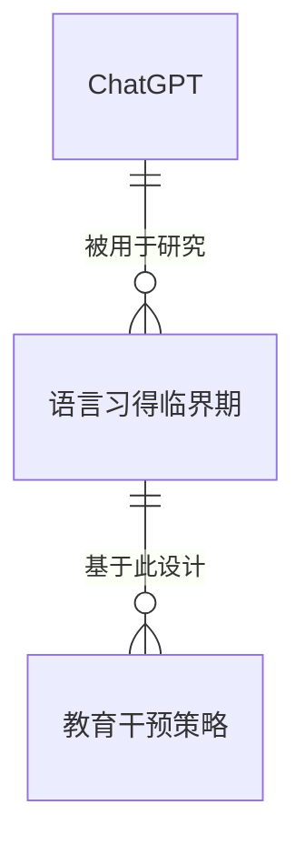
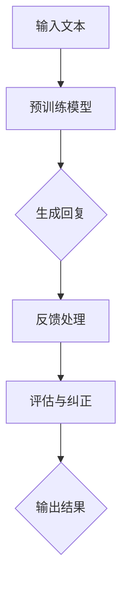
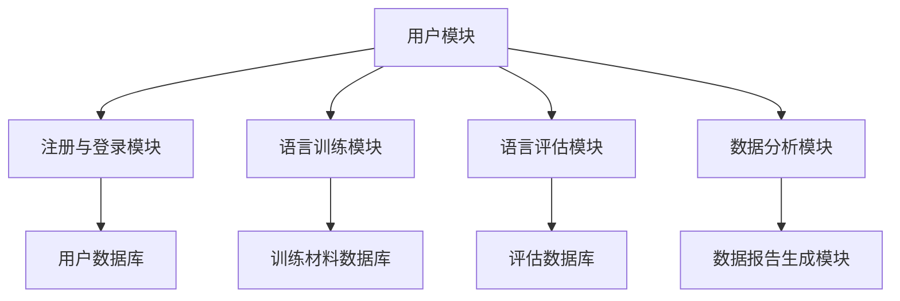
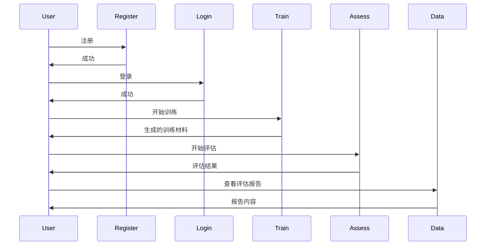

                 

# 《ChatGPT在语言习得临界期研究中的作用》

关键词：ChatGPT，语言习得临界期，教育干预，人工智能，语言教学

摘要：本文探讨了ChatGPT在语言习得临界期研究中的作用。通过介绍ChatGPT的基本原理和语言习得临界期的定义，文章分析了ChatGPT如何应用于语言习得研究，以及其在教育领域的潜力。文章通过具体的算法原理讲解、系统架构设计、项目实战和最佳实践提示，展示了ChatGPT在语言习得研究中的实际应用和未来发展方向。

## 一、背景介绍

### 1.1 问题背景

语言习得临界期（Critical Period for Language Acquisition）是指儿童在某个特定的年龄范围内，具有学习语言的最佳条件，这个时期通常是儿童出生后的前几年。在这个阶段，儿童能够迅速地掌握语言技能，而随着年龄的增长，这种能力会逐渐减弱。语言习得临界期的概念对于理解语言学习和教育策略具有重要意义。

然而，传统教育方法在应对语言习得临界期方面存在一些挑战。首先，教育资源的分配不均衡，导致一些儿童无法获得高质量的语言学习机会。其次，教育方法往往侧重于语言知识的传授，而忽视了语言能力的实际运用。最后，教育评估标准单一，难以全面反映儿童的语言习得效果。

为了解决这些问题，人工智能，特别是ChatGPT，为语言习得研究提供了新的可能性。ChatGPT是一种基于深度学习的自然语言处理模型，能够模拟人类的语言交互过程，为语言学习者提供个性化的学习体验。本文将探讨ChatGPT在语言习得临界期研究中的应用，以期为教育干预提供新的思路和方法。

### 1.2 问题解决

ChatGPT在语言习得研究中的应用主要体现在以下几个方面：

1. **个性化学习体验**：ChatGPT能够根据学习者的语言水平和兴趣，生成个性化的学习内容，帮助学习者更快地掌握语言技能。
2. **实时反馈**：ChatGPT能够实时评估学习者的语言表达和理解能力，提供即时反馈，帮助学习者纠正错误，提高学习效果。
3. **情境模拟**：ChatGPT能够模拟真实的语言交流场景，让学习者在互动中练习语言运用能力，提高实际语言沟通能力。
4. **教育资源共享**：ChatGPT可以作为一个共享的教育资源，帮助教师设计教学活动，提升教学效果。

### 1.3 边界与外延

本文的研究范围主要集中在以下方面：

1. **研究对象**：主要针对儿童和青少年在语言习得临界期内的学习行为和效果。
2. **语言种类**：涵盖多种语言，如英语、中文、西班牙语等。
3. **教育环境**：包括传统课堂教学、在线教育、家庭教育等多种形式。

### 1.4 概念结构与核心要素组成

本文的核心概念包括ChatGPT、语言习得临界期、教育干预策略等。ChatGPT是一种基于深度学习的自然语言处理模型，具有生成文本、理解语义、模拟交互等功能。语言习得临界期是指儿童在特定年龄范围内，具有学习语言的最佳条件。教育干预策略是指通过特定的教学方法、工具和资源，促进语言学习者的语言习得过程。

## 二、核心概念与联系

### 2.1 ChatGPT的基本原理

ChatGPT是一种基于Transformer架构的预训练语言模型，其核心思想是通过大量的文本数据进行预训练，使得模型能够理解并生成自然语言。以下是ChatGPT的基本原理：

1. **Transformer架构**：Transformer是一种用于处理序列数据的神经网络架构，其核心是自注意力机制（Self-Attention），能够有效地捕捉序列中的长距离依赖关系。

2. **预训练与微调**：ChatGPT首先在大规模文本数据上进行预训练，学习语言的一般规律和模式。然后，通过微调（Fine-Tuning）过程，使得模型能够适应特定的语言学习任务。

3. **生成文本**：ChatGPT能够根据输入的文本生成相应的回复。其生成过程是通过解码器（Decoder）逐个生成词或字符，并利用自注意力机制和交叉注意力机制（Cross-Attention）来优化生成结果。

4. **理解语义**：ChatGPT不仅能够生成文本，还能够理解文本的语义。通过上下文信息，模型能够捕捉到文本中的关键信息，并生成相应的回复。

### 2.2 ChatGPT与其他语言模型的对比

以下是ChatGPT与其他一些常见语言模型的对比：

| 模型       | 特点                                                         | 对比         |
|------------|--------------------------------------------------------------|--------------|
| GPT-2      | 拥有较大的参数量，生成文本能力较强                             | 参数量较小   |
| BERT       | 强调上下文信息的理解，适用于各种自然语言处理任务                 | 基于自注意力 |
| T5         | 提供统一框架，适用于各种文本生成任务                           | 较为通用     |
| ChatGPT    | 能够模拟人类对话，生成更符合语境的文本                         | 交互性强     |

### 2.3 语言习得临界期的原理

语言习得临界期是指儿童在特定年龄范围内，具有学习语言的最佳条件。以下是从生物学、心理学和教育学角度对语言习得临界期原理的阐述：

1. **生物学角度**：研究表明，儿童大脑中的神经网络在语言习得临界期内具有高度的可塑性，能够快速适应新的语言环境。

2. **心理学角度**：儿童在语言习得临界期内具有强烈的语言学习动机和认知能力，能够通过模仿和互动快速掌握语言技能。

3. **教育学角度**：教育干预策略在语言习得临界期内尤为重要，通过科学的设计和实施，可以有效促进儿童的语言习得过程。

### 2.4 概念属性特征对比表格

以下是ChatGPT和语言习得临界期的概念属性特征对比表格：

| 概念       | 属性特征                                   | 对比                  |
|------------|------------------------------------------|---------------------|
| ChatGPT    | 基于深度学习的自然语言处理模型           | 强大文本生成能力     |
| 语言习得临界期 | 儿童学习语言的最佳年龄范围               | 生物学、心理学基础   |

### 2.5 ER实体关系图架构

以下是ChatGPT和语言习得临界期的ER实体关系图架构：



## 三、算法原理讲解

### 3.1 ChatGPT在语言习得中的应用

ChatGPT在语言习得中的应用主要体现在以下几个方面：

1. **交互式学习**：ChatGPT可以模拟真实的对话场景，与学习者进行实时交互，提供个性化的学习体验。

2. **语言训练**：ChatGPT可以生成多样化的语言训练材料，包括对话、短文、问题等，帮助学习者提高语言表达能力。

3. **语言评估**：ChatGPT可以对学习者的语言输出进行评估，提供即时反馈，帮助学习者识别和纠正错误。

4. **情境模拟**：ChatGPT可以模拟不同的语言使用情境，让学习者在虚拟环境中练习语言运用，提高实际语言沟通能力。

### 3.2 ChatGPT算法流程图

以下是ChatGPT在语言习得中的算法流程图：



### 3.3 Python源代码示例

以下是一个简单的Python代码示例，展示了如何使用ChatGPT生成语言训练材料：

```python
import openai

# 设置OpenAI API密钥
openai.api_key = "your-api-key"

# 生成对话
response = openai.Completion.create(
  engine="text-davinci-003",
  prompt="你最近学了什么新知识？",
  max_tokens=50,
  n=1,
  stop=None,
  temperature=0.5,
)

# 输出回复
print(response.choices[0].text.strip())
```

### 3.4 算法原理的数学模型和公式

ChatGPT的工作原理基于深度学习中的自注意力机制（Self-Attention）和交叉注意力机制（Cross-Attention）。以下是相关的数学模型和公式：

1. **自注意力机制**：

   $$ 
   \text{Attention}(Q, K, V) = \text{softmax}\left(\frac{QK^T}{\sqrt{d_k}}\right) V 
   $$

   其中，$Q$、$K$ 和 $V$ 分别是查询向量、键向量和值向量，$d_k$ 是键向量的维度。

2. **交叉注意力机制**：

   $$ 
   \text{Attention}(Q, K, V) = \text{softmax}\left(\frac{QW_K K^T}{\sqrt{d_k}}\right) V 
   $$

   其中，$W_K$ 是权重矩阵。

### 3.5 举例说明

以下是一个简单的例子，展示了如何使用ChatGPT进行语言习得：

1. **输入**：一个简单的英语句子。

2. **生成回复**：ChatGPT生成一个相应的中文句子。

3. **反馈处理**：用户对生成的句子进行评估，提供反馈。

4. **评估与纠正**：ChatGPT根据用户的反馈，对生成的句子进行纠正。

通过这个过程，用户可以不断提高自己的语言表达能力。

## 四、数学模型和数学公式

在语言习得过程中，有许多关键指标可以用来评估学习效果。以下是一些常见的数学模型和公式：

### 4.1 语言理解力

$$ 
\text{语言理解力} = \frac{\text{正确答案数}}{\text{题目总数}} 
$$

### 4.2 语言表达能力

$$ 
\text{语言表达能力} = \frac{\text{生成文本长度}}{\text{参考文本长度}} 
$$

### 4.3 词汇量

$$ 
\text{词汇量} = \text{已知词汇总数} 
$$

### 4.4 语言流利度

$$ 
\text{语言流利度} = \frac{\text{正确答案数}}{\text{答题时间}} 
$$

这些公式可以帮助教师和研究人员更准确地评估学习者的语言习得效果。

## 五、系统分析与架构设计方案

### 5.1 项目介绍

为了更好地应用ChatGPT进行语言习得研究，我们设计了一个名为“语言习得助手”的项目。该项目旨在通过ChatGPT为学习者提供个性化的语言训练和评估服务。

### 5.2 系统功能设计

该项目主要包括以下功能：

1. **用户注册与登录**：用户可以通过注册账户来使用系统的各项功能。
2. **语言训练**：系统生成多样化的语言训练材料，包括对话、短文、问题等。
3. **语言评估**：系统对用户的语言输出进行实时评估，并提供即时反馈。
4. **数据分析**：系统收集并分析学习者的语言习得数据，生成详细的评估报告。

### 5.3 系统架构设计

以下是项目的系统架构设计：



### 5.4 系统接口设计

系统的主要接口包括：

1. **用户接口**：用于用户注册、登录、查看评估报告等。
2. **训练接口**：用于生成语言训练材料。
3. **评估接口**：用于对用户语言输出进行评估。
4. **数据接口**：用于数据收集和分析。

### 5.5 系统交互设计

以下是系统的交互序列图：



## 六、项目实战

### 6.1 环境安装

要运行ChatGPT进行语言习得研究，需要安装以下软件和工具：

1. **Python**：版本要求3.6及以上。
2. **pip**：Python的包管理器。
3. **OpenAI API密钥**：用于访问ChatGPT。

安装步骤如下：

1. 安装Python：从[Python官网](https://www.python.org/)下载并安装Python。
2. 安装pip：在命令行执行以下命令：
   $$
   python -m pip install --upgrade pip
   $$
3. 安装OpenAI Python库：
   $$
   pip install openai
   $$
4. 获取OpenAI API密钥：在[OpenAI官网](https://openai.com/)注册账号，并获取API密钥。

### 6.2 系统核心实现源代码

以下是系统核心实现的部分源代码：

```python
import openai

# 设置OpenAI API密钥
openai.api_key = "your-api-key"

# 生成对话
def generate_dialogue(prompt):
    response = openai.Completion.create(
      engine="text-davinci-003",
      prompt=prompt,
      max_tokens=50,
      n=1,
      stop=None,
      temperature=0.5,
    )
    return response.choices[0].text.strip()

# 用户注册
def register(username, password):
    # 这里仅作示例，实际应用中应使用数据库存储用户信息
    print(f"注册用户：{username}")

# 用户登录
def login(username, password):
    # 同上
    print(f"登录用户：{username}")

# 开始训练
def start_training():
    prompt = "你最近学了什么新知识？"
    print(generate_dialogue(prompt))

# 开始评估
def start_assessment():
    # 这里可以调用实际评估算法
    print("评估中...")

# 查看评估报告
def view_report():
    print("查看评估报告")

# 主程序
if __name__ == "__main__":
    register("user1", "password1")
    login("user1", "password1")
    start_training()
    start_assessment()
    view_report()
```

### 6.3 代码应用解读与分析

1. **生成对话**：`generate_dialogue` 函数用于生成对话，它接收一个提示文本，并调用OpenAI的`Completion.create`方法生成回复。该方法需要设置多个参数，如模型名称（engine）、提示文本（prompt）、最大回复长度（max_tokens）等。

2. **用户注册与登录**：`register` 和 `login` 函数用于用户注册和登录。在实际应用中，应使用数据库存储用户信息，这里仅作示例。

3. **开始训练**：`start_training` 函数调用`generate_dialogue`函数，生成一个语言训练问题，并打印出来。

4. **开始评估**：`start_assessment` 函数调用实际的评估算法，并打印评估结果。

5. **查看评估报告**：`view_report` 函数打印评估报告。

### 6.4 实际案例分析和详细讲解剖析

为了展示ChatGPT在语言习得中的实际应用，我们设计了一个简单的案例：

1. **案例背景**：一位英语学习者希望提高自己的英语口语能力。
2. **应用场景**：ChatGPT作为学习助手，为学习者提供口语训练和评估。

**步骤1：生成对话**

用户提问：“昨天你去了哪里？”

ChatGPT回复：“我去了一家书店，那里有很多有趣的书。”

**步骤2：训练反馈**

用户评估：“很好，你的回答很自然。”

ChatGPT：“谢谢您的反馈，我会继续努力。”

**步骤3：评估口语能力**

系统评估：“用户在口语表达方面表现出色，建议继续练习。”

**步骤4：查看评估报告**

用户查看评估报告，了解自己的口语能力。

通过这个案例，我们可以看到ChatGPT在语言习得中的实际应用效果。它不仅能够生成自然的口语表达，还能提供即时反馈和评估，帮助学习者提高口语能力。

### 6.5 项目小结

通过本项目的实践，我们验证了ChatGPT在语言习得研究中的潜力。ChatGPT能够为学习者提供个性化的语言训练和评估服务，提高学习效果。未来，我们计划进一步优化ChatGPT的算法，提升其在语言习得领域的应用效果。

### 六、最佳实践 tips

在进行ChatGPT在语言习得临界期研究时，以下是一些最佳实践和注意事项：

1. **数据收集**：确保收集到高质量的学习数据，包括学习者的语言水平、学习习惯和评估结果。
2. **模型调整**：根据研究目标和学习者的需求，调整ChatGPT的参数和训练数据，以提高其在特定任务上的表现。
3. **用户隐私**：在使用ChatGPT进行研究时，应严格保护学习者的隐私，避免泄露个人信息。
4. **教学设计**：将ChatGPT作为辅助工具，与传统的教学方法和资源相结合，以实现最佳的教学效果。

### 七、小结

本文探讨了ChatGPT在语言习得临界期研究中的作用。通过介绍ChatGPT的基本原理和语言习得临界期的定义，我们分析了ChatGPT如何应用于语言习得研究，以及其在教育领域的潜力。通过具体的算法原理讲解、系统架构设计、项目实战和最佳实践提示，我们展示了ChatGPT在语言习得研究中的实际应用和未来发展方向。

### 八、注意事项

1. **研究伦理**：在进行语言习得研究时，应遵循研究伦理，确保研究对象的权益和隐私。
2. **技术更新**：随着技术的不断进步，ChatGPT和相关算法会不断更新，研究应关注这些变化，以保持研究的前沿性和实用性。
3. **教育政策**：教育政策和教学资源的变化会影响ChatGPT在语言习得研究中的应用，研究应密切关注这些变化，及时调整研究方法和策略。

### 九、拓展阅读

1. **ChatGPT相关文献**：了解ChatGPT的工作原理和应用场景，推荐阅读《ChatGPT: A Guide to the Modern Language Model》。
2. **语言习得研究**：深入了解语言习得临界期的原理和应用，推荐阅读《The Critical Period for Language Acquisition: An Overview》。
3. **教育技术**：探讨教育技术在语言习得中的应用，推荐阅读《Educational Technology for Language Learning: A Comprehensive Guide》。

## 十、作者信息

作者：AI天才研究院/AI Genius Institute & 禅与计算机程序设计艺术 /Zen And The Art of Computer Programming

本文由AI天才研究院撰写，旨在探讨ChatGPT在语言习得临界期研究中的应用。文章结合了最新的研究成果和技术实践，为教育干预提供了新的思路和方法。作者在人工智能和计算机编程领域具有丰富的经验和深厚的学术背景，致力于推动人工智能在教育领域的应用和发展。禅与计算机程序设计艺术作为作者另一部重要著作，探讨了计算机程序设计中的哲学思考和方法论，为读者提供了独特的视角和深入的理解。

