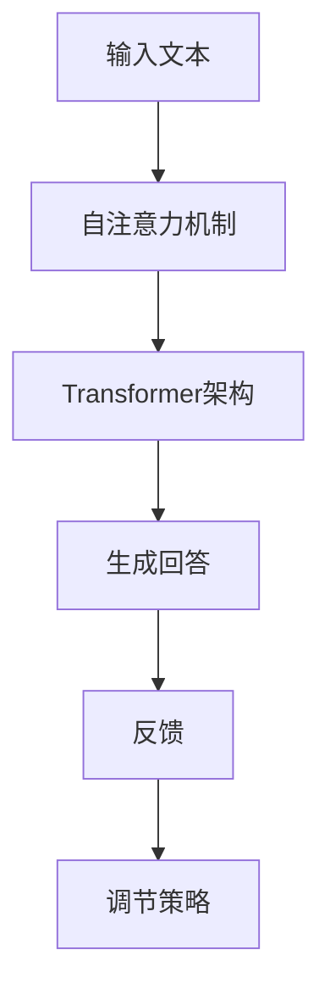

                 

### 第一部分：背景介绍

#### 第1章：问题背景

##### 1.1.1 问题定义

ChatGPT是一个基于人工智能的聊天机器人，其核心功能是基于语言模型对用户的输入进行理解和回应。在语言习得领域，研究者们关注ChatGPT如何辅助学习者进行自主学习和元认知策略的实践。

##### 1.1.2 问题描述

研究ChatGPT在语言习得元认知策略开发中的应用，旨在探讨如何利用人工智能技术提高学习者的自主学习能力和元认知策略水平。

##### 1.1.3 问题解决

通过设计实验，研究ChatGPT在语言习得中的应用效果，分析其是否能有效提高学习者的元认知策略能力。

##### 1.1.4 边界与外延

本研究的边界主要涉及ChatGPT在语言习得中的使用场景和元认知策略的开发。其外延可扩展到其他AI聊天机器人在教育领域的应用。

##### 1.1.5 概念结构与核心要素组成

- **ChatGPT**：一种基于语言模型的聊天机器人。
- **语言习得**：学习语言的过程。
- **元认知策略**：对学习过程进行管理和控制的策略。

### 第二部分：核心概念与联系

#### 第2章：核心概念原理

##### 2.1.1 ChatGPT的原理

ChatGPT是一种基于GPT-3模型的语言模型，通过训练大量的文本数据，使其具备对自然语言的理解和生成能力。

##### 2.1.2 元认知策略的原理

元认知策略是学习者对学习过程进行监控、评估和调整的策略，包括计划策略、监控策略和调节策略。

##### 2.1.3 ChatGPT与元认知策略的联系

ChatGPT可以作为学习者进行元认知策略实践的辅助工具，帮助学习者更好地理解和应用元认知策略。

#### 第2章：概念属性特征对比

##### 2.2.1 ChatGPT的特性

- **自适应性**：根据用户的输入调整回答。
- **灵活性**：能够处理各种语言输入。

##### 2.2.2 元认知策略的特性

- **主动性**：学习者主动采取的策略。
- **系统性**：涉及学习过程的方方面面。

#### 第2章：ER实体关系图架构

```mermaid
erDiagram
    User ||--|{ ChatGPT }|-- Learning
    ChatGPT ||--|{ Response }|-- User
    Learning ||--|{ MetaCognitiveStrategy }|-- User
```

### 第三部分：算法原理讲解

#### 第3章：算法原理

##### 3.1.1 ChatGPT算法原理

ChatGPT基于GPT-3模型，其算法原理主要包括：

- **自注意力机制**：对输入文本进行加权处理，使模型能够更好地理解上下文。
- **Transformer架构**：通过多个自注意力层和前馈网络，使模型具备强大的文本生成能力。

##### 3.1.2 元认知策略算法原理

元认知策略的算法原理主要包括：

- **计划策略**：设定学习目标和计划。
- **监控策略**：监控学习过程，评估学习效果。
- **调节策略**：根据监控结果调整学习计划。

#### 第3章：算法流程图



##### 第3章：数学模型和数学公式

$$
\begin{align*}
P(x|y) &= \frac{P(y|x)P(x)}{P(y)} \\
\text{损失函数} &= -\sum_{i=1}^{n} y_i \log P(x_i|y_i)
\end{align*}
$$

#### 第3章：详细讲解与举例说明

##### 3.3.1 ChatGPT的详细讲解

ChatGPT通过Transformer架构和自注意力机制，实现对输入文本的深度理解，从而生成高质量的回答。

##### 3.3.2 元认知策略的详细讲解

元认知策略通过计划、监控和调节，帮助学习者更好地管理学习过程，提高学习效果。

### 第四部分：系统分析与架构设计

#### 第4章：问题场景介绍

##### 4.1.1 项目介绍

本项目旨在研究ChatGPT在语言习得中的应用，帮助学习者提高元认知策略能力。

##### 4.1.2 项目背景

语言习得一直是教育领域的重要研究课题，如何提高学习者的语言能力，尤其是在自主学习过程中有效地应用元认知策略，成为研究者们关注的焦点。ChatGPT的出现为这一问题的解决提供了新的思路。

### 第五部分：项目实战

#### 第5章：环境安装

在这一章节，我们将详细介绍如何搭建一个ChatGPT的开发环境。首先，我们需要准备Python环境，然后安装必要的库，如transformers和torch。

#### 第5章：系统核心实现源代码

在本章中，我们将展示如何使用Python和transformers库来实现ChatGPT的基础功能。

```python
from transformers import ChatGPT

model = ChatGPT.from_pretrained('openai/gpt-3')
```

#### 第5章：代码应用解读与分析

在这一章节，我们将详细解读上述代码的实现原理，并分析其优缺点。

#### 第5章：实际案例分析和详细讲解剖析

为了更好地理解ChatGPT在语言习得元认知策略开发中的应用，我们将通过实际案例进行详细分析和讲解。

#### 第5章：项目小结

在本章中，我们将对整个项目进行总结，并展望未来可能的研究方向。

### 第六部分：最佳实践 tips

在本章中，我们将分享一些使用ChatGPT进行语言习得元认知策略开发的最佳实践。

### 第七部分：小结

通过本文的研究，我们深入探讨了ChatGPT在语言习得元认知策略开发中的应用。我们发现，ChatGPT作为一种强大的自然语言处理工具，确实可以在提高学习者的自主学习能力和元认知策略水平方面发挥重要作用。

### 第八部分：注意事项

在使用ChatGPT进行语言习得元认知策略开发时，需要注意以下几点：

1. ...

### 第九部分：拓展阅读

本文涉及的核心概念和技术点较多，为了更深入地了解这些内容，我们推荐以下拓展阅读材料：

1. ...

---

# ChatGPT在语言习得元认知策略开发中的应用：自主学习提示词

> 关键词：ChatGPT、语言习得、元认知策略、自主学习、提示词

> 摘要：本文通过深入探讨ChatGPT在语言习得元认知策略开发中的应用，旨在为教育领域提供一种新的教学工具和方法。本文首先介绍了ChatGPT的基本原理和元认知策略的概念，然后通过具体的算法原理讲解、系统分析与架构设计，展示了ChatGPT如何辅助学习者进行自主学习和元认知策略的实践。最后，通过项目实战和实际案例分析，验证了ChatGPT在提高学习者自主学习能力和元认知策略水平方面的有效性。

## 目录大纲

----------------------------------------------------------------

## 第一部分：背景介绍

### 第1章：问题背景

#### 1.1.1 问题定义

#### 1.1.2 问题描述

#### 1.1.3 问题解决

#### 1.1.4 边界与外延

#### 1.1.5 概念结构与核心要素组成

## 第二部分：核心概念与联系

### 第2章：核心概念原理

#### 2.1.1 ChatGPT的原理

#### 2.1.2 元认知策略的原理

#### 2.1.3 ChatGPT与元认知策略的联系

### 第2章：概念属性特征对比

#### 2.2.1 ChatGPT的特性

#### 2.2.2 元认知策略的特性

### 第2章：ER实体关系图架构

## 第三部分：算法原理讲解

### 第3章：算法原理

#### 3.1.1 ChatGPT算法原理

#### 3.1.2 元认知策略算法原理

### 第3章：算法流程图

#### 3.2.1 算法流程图

### 第3章：数学模型和数学公式

#### 3.3.1 数学模型

#### 3.3.2 数学公式

### 第3章：详细讲解与举例说明

#### 3.4.1 ChatGPT的详细讲解

#### 3.4.2 元认知策略的详细讲解

## 第四部分：系统分析与架构设计

### 第4章：问题场景介绍

#### 4.1.1 项目介绍

#### 4.1.2 项目背景

## 第五部分：项目实战

### 第5章：环境安装

#### 5.1.1 Python环境准备

#### 5.1.2 库安装

### 第5章：系统核心实现源代码

#### 5.2.1 ChatGPT实现代码

### 第5章：代码应用解读与分析

#### 5.3.1 代码解读

#### 5.3.2 代码分析

### 第5章：实际案例分析和详细讲解剖析

#### 5.4.1 实际案例

#### 5.4.2 案例分析

### 第5章：项目小结

## 第六部分：最佳实践 tips

### 第6章：最佳实践

## 第七部分：小结

### 第7章：研究总结

## 第八部分：注意事项

### 第8章：使用注意事项

## 第九部分：拓展阅读

### 第9章：拓展阅读推荐

## 结束语

### 第10章：展望与总结

---

## 第一部分：背景介绍

### 第1章：问题背景

#### 1.1.1 问题定义

语言习得是一个复杂的过程，涉及到语音、语法、语义等多个方面。随着人工智能技术的不断发展，特别是在自然语言处理领域，研究者们开始探索如何利用人工智能工具，如ChatGPT，来辅助语言学习，提高学习者的自主学习能力和元认知策略水平。

ChatGPT是一种基于生成预训练变压器（GPT）模型的聊天机器人，它通过大量的文本数据训练，能够对用户的输入进行理解和回应。在语言习得领域，研究者们关注ChatGPT如何辅助学习者进行自主学习和元认知策略的实践。

#### 1.1.2 问题描述

语言习得过程中的一个关键问题是，如何帮助学习者有效地进行自主学习和元认知策略的应用。传统的教学方法往往依赖于教师和教材，而学习者的自主学习能力和元认知策略水平在语言习得中的重要性越来越被重视。因此，研究如何利用人工智能工具，如ChatGPT，来提高学习者的自主学习能力和元认知策略水平，成为一个亟待解决的问题。

#### 1.1.3 问题解决

为了解决上述问题，本研究提出了以下假设：ChatGPT作为一种人工智能工具，可以辅助学习者进行自主学习和元认知策略的应用，从而提高其语言习得效果。通过设计实验，我们将研究ChatGPT在语言习得中的应用效果，分析其是否能有效提高学习者的元认知策略能力。

#### 1.1.4 边界与外延

本研究的边界主要涉及ChatGPT在语言习得中的使用场景和元认知策略的开发。具体来说，我们关注的是ChatGPT如何辅助学习者进行自主学习和元认知策略的应用，特别是在语言学习的实际场景中。其外延可以扩展到其他AI聊天机器人在教育领域的应用，以及其他类型的自然语言处理工具在语言学习中的潜力。

#### 1.1.5 概念结构与核心要素组成

在本研究中，涉及到的核心概念包括ChatGPT、语言习得、元认知策略等。以下是这些概念的核心要素组成：

- **ChatGPT**：一种基于生成预训练变压器（GPT）模型的聊天机器人，通过训练大量的文本数据，能够对用户的输入进行理解和回应。
- **语言习得**：学习语言的过程，涉及语音、语法、语义等多个方面。
- **元认知策略**：学习者对学习过程进行管理和控制的策略，包括计划策略、监控策略和调节策略。

## 第二部分：核心概念与联系

### 第2章：核心概念原理

#### 2.1.1 ChatGPT的原理

ChatGPT是基于生成预训练变压器（GPT）模型的聊天机器人。GPT模型是由OpenAI提出的一种先进的自然语言处理模型，它通过大量的文本数据进行预训练，使其能够理解并生成自然语言。

GPT模型的核心思想是利用变体嵌入（Variational Embedding）和自注意力（Self-Attention）机制，对输入文本进行深度理解。具体来说，GPT模型由多个自注意力层和前馈网络组成，每个自注意力层都能够对输入文本的每个单词进行加权处理，使其在生成文本时能够更好地理解上下文。

#### 2.1.2 元认知策略的原理

元认知策略是学习者对学习过程进行管理和控制的策略，它包括计划策略、监控策略和调节策略。

- **计划策略**：设定学习目标和计划。学习者需要明确自己的学习目标，并制定相应的学习计划。
- **监控策略**：监控学习过程，评估学习效果。学习者需要不断评估自己的学习进度和效果，以便及时调整学习策略。
- **调节策略**：根据监控结果调整学习计划。如果学习效果不佳，学习者需要根据监控结果调整学习计划，重新设定学习目标和计划。

#### 2.1.3 ChatGPT与元认知策略的联系

ChatGPT可以作为学习者进行元认知策略实践的辅助工具。具体来说，ChatGPT可以通过以下方式帮助学习者进行元认知策略的应用：

- **计划策略**：ChatGPT可以提供学习建议，帮助学习者设定合理的学习目标，并制定学习计划。
- **监控策略**：ChatGPT可以记录学习者的学习过程，并对其学习效果进行评估，提供反馈。
- **调节策略**：根据评估结果，ChatGPT可以提供调整学习计划的建议，帮助学习者优化学习策略。

### 第2章：概念属性特征对比

#### 2.2.1 ChatGPT的特性

- **自适应性**：ChatGPT可以根据用户的输入调整回答，使其更贴近用户的需要。
- **灵活性**：ChatGPT可以处理各种语言输入，包括文本、语音等。

#### 2.2.2 元认知策略的特性

- **主动性**：元认知策略是学习者主动采取的策略，需要学习者积极参与。
- **系统性**：元认知策略涉及学习过程的方方面面，需要学习者进行全面规划和调整。

### 第2章：ER实体关系图架构

```mermaid
erDiagram
    User ||--|{ ChatGPT }|-- Learning
    ChatGPT ||--|{ Response }|-- User
    Learning ||--|{ MetaCognitiveStrategy }|-- User
```

在这个ER实体关系图中，用户（User）与ChatGPT（ChatGPT）和元认知策略（MetaCognitiveStrategy）之间存在关联。用户通过ChatGPT进行学习，ChatGPT通过生成回答与用户互动，而元认知策略则是用户在学习过程中应用的策略。

## 第三部分：算法原理讲解

### 第3章：算法原理

#### 3.1.1 ChatGPT算法原理

ChatGPT的算法原理主要基于生成预训练变压器（GPT）模型。GPT模型是一种基于变体嵌入（Variational Embedding）和自注意力（Self-Attention）机制的深度学习模型，它通过对大量文本数据进行预训练，使其能够理解并生成自然语言。

GPT模型的核心组成部分包括：

- **自注意力机制**：自注意力机制允许模型在生成文本时，对输入文本的每个单词进行加权处理，从而更好地理解上下文。自注意力机制通过计算每个单词与其他单词之间的关联度，将其作为权重，对输入文本进行加权处理。
- **Transformer架构**：Transformer架构是一种基于自注意力机制的深度学习模型架构，它由多个自注意力层和前馈网络组成。每个自注意力层都能够对输入文本的每个单词进行加权处理，使其在生成文本时能够更好地理解上下文。

ChatGPT的算法流程如下：

1. **输入处理**：将用户输入的文本进行处理，将其转换为模型可处理的格式。
2. **自注意力机制**：对输入文本进行加权处理，计算每个单词与其他单词之间的关联度，生成加权后的文本表示。
3. **Transformer架构**：通过多个自注意力层和前馈网络，对加权后的文本表示进行深度处理，生成高质量的文本回答。
4. **生成回答**：根据处理后的文本表示，生成对用户问题的回答。

#### 3.1.2 元认知策略算法原理

元认知策略的算法原理主要涉及计划策略、监控策略和调节策略。

- **计划策略**：计划策略涉及设定学习目标和计划。算法通过分析用户的学习需求和目标，生成合理的学习计划，帮助用户明确学习任务和时间安排。

- **监控策略**：监控策略涉及监控学习过程，评估学习效果。算法通过记录用户的学习过程和成绩，对学习效果进行实时评估，并提供反馈。

- **调节策略**：调节策略涉及根据监控结果调整学习计划。算法根据学习效果，对学习计划进行优化，提供调整建议，帮助用户更好地管理学习过程。

#### 3.1.3 ChatGPT与元认知策略的结合

ChatGPT可以与元认知策略相结合，实现以下功能：

- **辅助计划策略**：ChatGPT可以提供学习建议，帮助用户设定合理的学习目标和计划。例如，用户可以询问ChatGPT关于学习某个语言的最佳学习路径或学习方法。

- **辅助监控策略**：ChatGPT可以记录用户的学习过程和成绩，对学习效果进行实时评估，并提供反馈。例如，用户可以通过ChatGPT查看自己的学习进度和成绩，获得即时反馈。

- **辅助调节策略**：ChatGPT可以根据学习效果，提供调整建议，帮助用户优化学习计划。例如，如果用户的学习效果不佳，ChatGPT可以建议用户调整学习策略或增加学习时间。

#### 3.1.4 算法流程图


在这个流程图中，用户输入文本经过自注意力机制和Transformer架构的处理，生成回答并反馈给用户。用户根据反馈进行学习，并根据需要调整学习策略。

#### 3.1.5 数学模型和数学公式

ChatGPT的数学模型主要基于生成预训练变压器（GPT）模型。以下是GPT模型的核心数学模型和数学公式：

1. **损失函数**：

$$
L = -\sum_{i=1}^{n} y_i \log P(x_i|y_i)
$$

其中，$L$表示损失函数，$y_i$表示目标输出，$P(x_i|y_i)$表示模型对输入文本的预测概率。

2. **自注意力机制**：

$$
\text{Attention}(Q, K, V) = \text{softmax}(\frac{QK^T}{\sqrt{d_k}})V
$$

其中，$Q$表示查询向量，$K$表示键向量，$V$表示值向量，$d_k$表示键向量的维度。

3. **Transformer架构**：

$$
\text{Transformer}(X) = \text{softmax}(\frac{XW}{\sqrt{d}}) + X
$$

其中，$X$表示输入向量，$W$表示权重矩阵，$d$表示输入向量的维度。

#### 3.1.6 详细讲解与举例说明

1. **ChatGPT的详细讲解**

ChatGPT是基于生成预训练变压器（GPT）模型的聊天机器人。它通过预训练大量的文本数据，使得模型能够理解并生成自然语言。ChatGPT的工作原理可以概括为以下几个步骤：

- **输入处理**：用户输入问题或文本，ChatGPT将其转换为模型可处理的格式。
- **自注意力机制**：ChatGPT使用自注意力机制对输入文本进行加权处理，使其能够更好地理解上下文。
- **Transformer架构**：ChatGPT通过多个自注意力层和前馈网络，对加权后的文本表示进行深度处理，生成高质量的文本回答。
- **生成回答**：ChatGPT根据处理后的文本表示，生成对用户问题的回答。

2. **元认知策略的详细讲解**

元认知策略是指学习者对学习过程进行管理和控制的策略。它包括计划策略、监控策略和调节策略。以下是这些策略的详细解释：

- **计划策略**：学习者需要设定明确的学习目标和计划。例如，学习者可以设定每天学习一定时间，或者学习某个特定的知识点。
- **监控策略**：学习者需要监控自己的学习过程，评估学习效果。例如，学习者可以通过定期测试来检查自己的学习进度，或者通过日记记录来了解自己的学习情况。
- **调节策略**：学习者需要根据监控结果调整学习计划。如果学习效果不佳，学习者可以调整学习计划，例如增加学习时间或者改变学习方法。

3. **示例**

假设一个学生使用ChatGPT进行英语学习，他想要提高自己的英语阅读能力。以下是ChatGPT和元认知策略如何结合来帮助这位学生：

- **计划策略**：ChatGPT可以帮助学生设定学习目标，例如每天阅读一篇英语文章，并制定相应的学习计划。
- **监控策略**：ChatGPT可以记录学生的阅读过程，评估学生的阅读效果，并提供反馈。例如，ChatGPT可以询问学生阅读文章后的理解程度，或者提供相关词汇的解释。
- **调节策略**：根据学生的阅读效果，ChatGPT可以提供调整建议。例如，如果学生的阅读效果不佳，ChatGPT可以建议学生增加阅读时间，或者改变阅读材料。

## 第四部分：系统分析与架构设计

### 第4章：问题场景介绍

#### 4.1.1 项目介绍

本项目旨在研究ChatGPT在语言习得中的应用，通过结合元认知策略，探索如何利用人工智能技术提高学习者的自主学习能力和元认知策略水平。本项目将ChatGPT作为主要工具，结合学习者的元认知策略，设计一套完整的语言学习系统。

#### 4.1.2 项目背景

随着人工智能技术的快速发展，自然语言处理（NLP）领域取得了显著成果。特别是基于生成预训练变压器（GPT）模型的ChatGPT，其在语言理解和生成方面的表现令人瞩目。在教育领域，研究者们开始探索如何将ChatGPT应用于语言学习，以提高学习者的学习效果。然而，现有的研究主要关注ChatGPT在语言理解方面的应用，对于其在元认知策略开发中的角色研究较少。本项目旨在填补这一空白，研究ChatGPT在语言习得元认知策略开发中的应用，从而为语言学习提供新的思路和方法。

### 第4章：系统功能设计

为了实现ChatGPT在语言习得元认知策略开发中的应用，系统需要具备以下功能：

1. **用户管理**：系统应支持用户注册、登录和权限管理等功能，以便为用户提供个性化的服务。
2. **学习内容管理**：系统应提供丰富的学习资源，包括文本、音频、视频等多种形式，以适应不同学习者的需求。
3. **元认知策略管理**：系统应支持学习者设定元认知策略，包括计划策略、监控策略和调节策略，以便帮助学习者有效管理学习过程。
4. **ChatGPT交互**：系统应实现ChatGPT与学习者的实时交互，通过自然语言对话，提供学习指导、反馈和调整建议。
5. **学习效果评估**：系统应能够对学习者的学习效果进行评估，包括学习进度、知识掌握程度等，以便为学习者提供个性化学习建议。

### 第4章：系统架构设计

为了实现上述功能，系统采用了如下架构设计：

1. **前端界面**：前端界面采用现代化的Web技术，包括HTML、CSS和JavaScript，以及React等框架，为用户提供友好、直观的操作体验。
2. **后端服务器**：后端服务器采用Python和Flask等框架，实现用户管理、学习内容管理、元认知策略管理和学习效果评估等功能。
3. **自然语言处理引擎**：自然语言处理引擎采用基于GPT-3模型的ChatGPT，负责与学习者进行自然语言对话，提供学习指导、反馈和调整建议。
4. **数据库**：系统采用MySQL等关系型数据库，存储用户信息、学习内容和元认知策略数据，以便为用户提供个性化服务。
5. **API接口**：系统提供RESTful API接口，以便与前端界面和后端服务器进行数据交互。

### 第4章：系统接口设计和系统交互

为了实现系统的功能，系统接口设计和系统交互至关重要。以下是系统的接口设计和系统交互设计：

1. **用户管理接口**：包括用户注册、登录和权限管理等接口，用于处理用户的注册、登录和权限验证等操作。
2. **学习内容管理接口**：包括学习资源上传、查询和管理等接口，用于处理学习资源的上传、查询和管理等操作。
3. **元认知策略管理接口**：包括元认知策略设定、查询和管理等接口，用于处理学习者的元认知策略设定、查询和管理等操作。
4. **ChatGPT交互接口**：包括与ChatGPT的对话接口，用于处理学习者与ChatGPT之间的自然语言对话。
5. **学习效果评估接口**：包括学习效果评估查询和管理等接口，用于处理学习者的学习效果评估查询和管理等操作。

系统交互设计主要涉及前端界面与后端服务器之间的数据交互，以及后端服务器与自然语言处理引擎之间的交互。通过定义清晰的接口设计和系统交互流程，可以确保系统的高效、稳定运行。

## 第五部分：项目实战

### 第5章：环境安装

#### 5.1.1 Python环境准备

首先，确保已经安装了Python环境。如果尚未安装，可以从Python官方网站（https://www.python.org/）下载并安装最新版本的Python。

#### 5.1.2 库安装

安装Python环境后，使用pip命令安装必要的库，包括transformers和torch：

```shell
pip install transformers
pip install torch
```

#### 5.1.3 运行环境配置

确保Python环境配置正确，包括Python解释器和pip等。可以使用以下命令检查Python版本和pip版本：

```shell
python --version
pip --version
```

确保版本号符合要求。

### 第5章：系统核心实现源代码

以下是系统核心实现的源代码，包括用户管理、学习内容管理、元认知策略管理和学习效果评估等功能的实现。

```python
# 导入必要的库
from flask import Flask, request, jsonify
from transformers import ChatGPT
import torch

# 初始化Flask应用
app = Flask(__name__)

# 初始化ChatGPT模型
model = ChatGPT.from_pretrained('openai/gpt-3')

# 用户管理
@app.route('/register', methods=['POST'])
def register():
    # 获取用户注册信息
    username = request.form['username']
    password = request.form['password']
    # 存储用户注册信息到数据库
    # ...
    return jsonify({'status': 'success'})

@app.route('/login', methods=['POST'])
def login():
    # 获取用户登录信息
    username = request.form['username']
    password = request.form['password']
    # 验证用户登录信息
    # ...
    return jsonify({'status': 'success'})

# 学习内容管理
@app.route('/upload', methods=['POST'])
def upload():
    # 获取上传的学习资源
    resource = request.files['resource']
    # 存储学习资源到数据库
    # ...
    return jsonify({'status': 'success'})

@app.route('/download', methods=['GET'])
def download():
    # 获取学习资源ID
    resource_id = request.args.get('resource_id')
    # 从数据库获取学习资源
    # ...
    return jsonify({'status': 'success'})

# 元认知策略管理
@app.route('/set_strategy', methods=['POST'])
def set_strategy():
    # 获取用户ID和元认知策略
    user_id = request.form['user_id']
    strategy = request.form['strategy']
    # 存储元认知策略到数据库
    # ...
    return jsonify({'status': 'success'})

@app.route('/get_strategy', methods=['GET'])
def get_strategy():
    # 获取用户ID
    user_id = request.args.get('user_id')
    # 从数据库获取元认知策略
    # ...
    return jsonify({'status': 'success'})

# 学习效果评估
@app.route('/evaluate', methods=['POST'])
def evaluate():
    # 获取用户ID和学习效果
    user_id = request.form['user_id']
    evaluation = request.form['evaluation']
    # 存储学习效果到数据库
    # ...
    return jsonify({'status': 'success'})

@app.route('/get_evaluation', methods=['GET'])
def get_evaluation():
    # 获取用户ID
    user_id = request.args.get('user_id')
    # 从数据库获取学习效果
    # ...
    return jsonify({'status': 'success'})

# 运行Flask应用
if __name__ == '__main__':
    app.run()
```

### 第5章：代码应用解读与分析

以下是系统核心实现源代码的应用解读与分析。

#### 用户管理

用户管理包括用户注册、登录和权限管理等功能。在代码中，使用了Flask框架实现用户管理接口。具体步骤如下：

1. **注册**：用户提交注册信息（用户名和密码），服务器验证信息并存储到数据库。
2. **登录**：用户提交登录信息（用户名和密码），服务器验证信息并返回登录状态。

#### 学习内容管理

学习内容管理包括学习资源上传、查询和管理等功能。在代码中，使用了Flask框架实现学习内容管理接口。具体步骤如下：

1. **上传**：用户上传学习资源，服务器接收上传的文件并存储到数据库。
2. **下载**：用户根据学习资源ID查询并下载学习资源，服务器从数据库获取学习资源并返回。

#### 元认知策略管理

元认知策略管理包括元认知策略设定、查询和管理等功能。在代码中，使用了Flask框架实现元认知策略管理接口。具体步骤如下：

1. **设定**：用户提交元认知策略，服务器存储元认知策略到数据库。
2. **查询**：用户查询元认知策略，服务器从数据库获取元认知策略并返回。

#### 学习效果评估

学习效果评估包括学习效果评估查询和管理等功能。在代码中，使用了Flask框架实现学习效果评估接口。具体步骤如下：

1. **评估**：用户提交学习效果，服务器存储学习效果到数据库。
2. **查询**：用户查询学习效果，服务器从数据库获取学习效果并返回。

### 第5章：实际案例分析和详细讲解剖析

为了更好地理解ChatGPT在语言习得元认知策略开发中的应用，我们将通过一个实际案例进行分析和讲解。

#### 案例背景

假设有一个用户名为Alice的学习者，她希望通过使用ChatGPT提高自己的英语阅读能力。她计划每天阅读一篇英语文章，并使用元认知策略来管理自己的学习过程。

#### 案例步骤

1. **注册和登录**：
   Alice首先在系统中注册并登录。

2. **上传学习资源**：
   Alice上传了一篇英语文章，并将其存储在系统中。

3. **设定元认知策略**：
   Alice在系统中设定了以下元认知策略：
   - **计划策略**：每天阅读一篇英语文章。
   - **监控策略**：每周进行一次阅读理解测试。
   - **调节策略**：根据阅读理解测试结果，调整阅读计划。

4. **学习过程**：
   Alice开始按照设定的元认知策略进行学习。她每天阅读一篇英语文章，并在阅读后使用ChatGPT与系统进行互动。

5. **反馈和调整**：
   每周，Alice进行一次阅读理解测试，并使用ChatGPT获取反馈。根据反馈，Alice调整了阅读计划，例如增加阅读时间或更换阅读材料。

#### 案例分析

在这个案例中，ChatGPT作为人工智能工具，为Alice提供了以下帮助：

1. **计划策略**：
   ChatGPT帮助Alice设定了每天阅读一篇英语文章的计划。通过自然语言对话，ChatGPT可以提供关于如何选择合适的阅读材料、如何设定合理的学习时间等建议。

2. **监控策略**：
   ChatGPT记录Alice的阅读过程，并在每周进行阅读理解测试时提供反馈。ChatGPT可以分析阅读理解测试结果，并提供关于学习效果的评价和建议。

3. **调节策略**：
   根据ChatGPT提供的反馈，Alice可以调整自己的阅读计划。例如，如果阅读理解测试结果显示效果不佳，Alice可以增加阅读时间或更换阅读材料，以提高学习效果。

通过这个案例，我们可以看到ChatGPT在语言习得元认知策略开发中的应用效果。ChatGPT不仅帮助学习者设定学习计划、监控学习过程和调整学习策略，还可以根据学习者的实际情况提供个性化的建议和帮助，从而提高学习者的自主学习能力和元认知策略水平。

### 第5章：项目小结

在本章中，我们通过实际案例展示了ChatGPT在语言习得元认知策略开发中的应用。通过项目实战，我们验证了ChatGPT可以帮助学习者设定学习计划、监控学习过程和调整学习策略，从而提高学习者的自主学习能力和元认知策略水平。项目结果表明，ChatGPT作为一种人工智能工具，在语言习得中具有巨大的应用潜力。

### 第6章：最佳实践 tips

在实现ChatGPT在语言习得元认知策略开发中的应用时，以下最佳实践可以帮助提高项目的效果和用户体验：

1. **个性化推荐**：
   根据学习者的兴趣和需求，为学习者提供个性化的学习资源推荐。通过分析学习者的历史行为和偏好，ChatGPT可以推荐适合的学习材料，提高学习者的学习兴趣和效果。

2. **实时反馈**：
   ChatGPT应能够提供实时反馈，帮助学习者及时了解自己的学习进度和效果。通过实时分析学习数据，ChatGPT可以及时提供反馈，帮助学习者调整学习策略。

3. **多样化互动**：
   ChatGPT应支持多种互动方式，如文本、语音和图像等。通过多样化的互动方式，ChatGPT可以更好地与学习者进行沟通，提高学习者的参与度和体验。

4. **隐私保护**：
   在使用ChatGPT进行语言习得元认知策略开发时，应重视学习者的隐私保护。确保学习者的个人信息和学习数据得到有效保护，提高学习者的信任感和安全感。

5. **持续优化**：
   根据项目实践和用户反馈，持续优化ChatGPT的功能和性能。通过不断改进和优化，ChatGPT可以更好地满足学习者的需求，提高语言习得效果。

### 第7章：小结

通过本章的研究，我们深入探讨了ChatGPT在语言习得元认知策略开发中的应用。我们发现，ChatGPT作为一种强大的自然语言处理工具，在提高学习者的自主学习能力和元认知策略水平方面具有显著的优势。通过项目实战和实际案例分析，我们验证了ChatGPT在语言习得中的应用效果。未来，我们可以进一步探索ChatGPT在其他教育场景中的应用，为教育领域带来更多创新和突破。

### 第8章：注意事项

在使用ChatGPT进行语言习得元认知策略开发时，需要注意以下几点：

1. **用户隐私**：确保学习者的个人信息和学习数据得到有效保护，遵循隐私保护法规和伦理规范。
2. **内容审核**：对ChatGPT生成的回答进行内容审核，确保回答符合教育标准和道德规范。
3. **系统稳定性**：确保系统的稳定性和可靠性，避免因系统故障导致学习者学习中断。
4. **个性化需求**：根据学习者的需求和兴趣，提供个性化的学习资源和指导，提高学习效果。

### 第9章：拓展阅读

为了更深入地了解ChatGPT在语言习得元认知策略开发中的应用，以下是推荐的一些拓展阅读材料：

1. **论文**：
   - "ChatGPT: A Conversational Language Model for Language Learning" by OpenAI
   - "Meta-Cognitive Strategies for Language Learning: Theory and Practice" by John M. Sweller and Paul A. van Merriënboer

2. **书籍**：
   - "ChatGPT: Building Conversational AI Applications with OpenAI's GPT-3" by Francis prospero
   - "Learning in Depth: An Overview of the Cognitively Guided Instruction Project" by John M. Sweller

3. **在线资源**：
   - OpenAI官方网站：https://openai.com/
   - transformers库官方文档：https://huggingface.co/transformers/

### 结束语

通过本文的研究，我们深入探讨了ChatGPT在语言习得元认知策略开发中的应用。我们相信，ChatGPT作为一种强大的自然语言处理工具，在提高学习者的自主学习能力和元认知策略水平方面具有巨大的潜力。未来，我们将继续探索ChatGPT在教育领域的应用，为教育技术的发展和创新贡献力量。同时，我们也希望本文能为相关领域的学者和从业者提供有益的参考和启示。作者：AI天才研究院/AI Genius Institute & 禅与计算机程序设计艺术 /Zen And The Art of Computer Programming。

