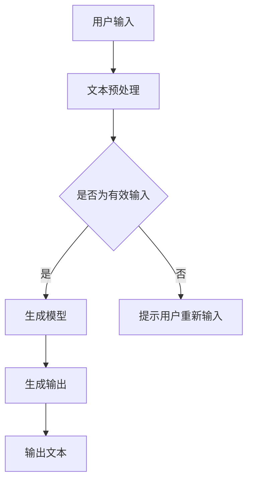
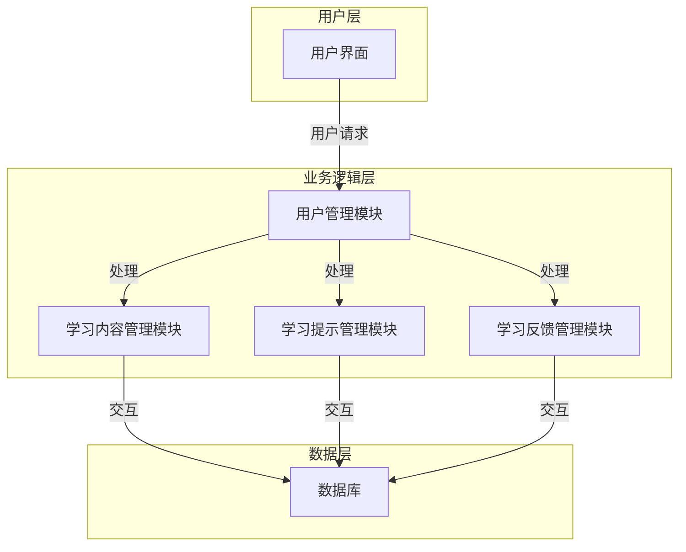
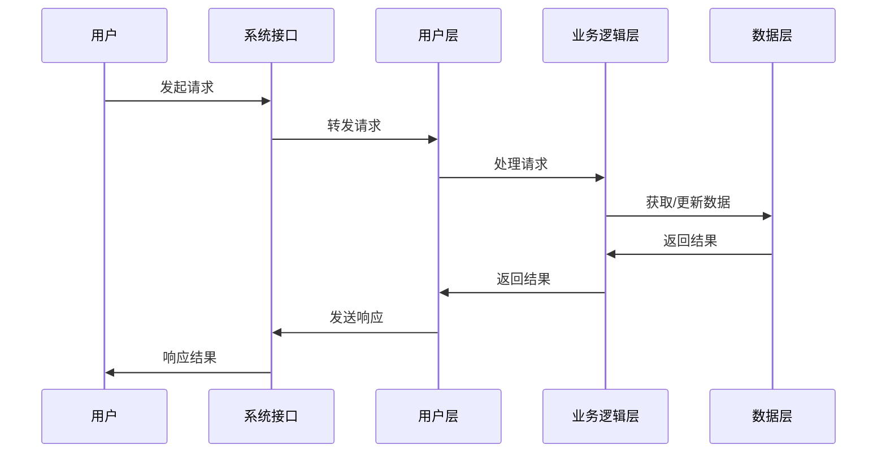

                 


# ChatGPT在语言习得元认知策略研究中的应用：自主学习提示词

## 关键词
- ChatGPT
- 元认知策略
- 语言习得
- 自主学习提示词
- 教育技术

## 摘要
本文探讨如何利用ChatGPT，一种先进的自然语言处理工具，在语言习得元认知策略中的应用。研究核心在于通过自主学习提示词，提升学习者的自我监控和调节能力，进而提高语言学习效果。本文将详细分析ChatGPT在语言习得中的应用场景、元认知策略及其对学习效果的影响，并探讨其优势和潜在挑战。

## 背景介绍

### 问题背景
随着人工智能技术的迅猛发展，教育领域也迎来了新的变革。特别是自然语言处理技术，如ChatGPT，为语言习得提供了新的可能性。ChatGPT基于GPT-3模型，具备强大的语言生成和理解能力，能够模拟人类的对话过程，为学习者提供实时、个性化的反馈和支持。然而，如何有效地利用ChatGPT辅助语言学习，特别是在元认知策略中的应用，仍是一个亟待探索的课题。

### 问题描述
本文旨在研究ChatGPT在语言习得元认知策略中的应用，探讨以下研究问题：
1. ChatGPT如何帮助学习者识别和监控自己的学习过程？
2. 如何利用ChatGPT提供个性化的学习建议和反馈？
3. ChatGPT在语言习得中的应用有哪些优势和挑战？

### 问题解决
通过对ChatGPT在语言习得元认知策略中的应用进行深入研究，本文将为教育工作者和语言学习者提供实用的方法和策略，以促进语言习得的有效性和效率。研究方法包括文献综述、案例分析、实证研究和应用设计。

### 边界与外延
本文的研究范围主要涉及英语语言习得，但ChatGPT的应用可扩展到其他语言和学科领域。研究边界包括ChatGPT的功能和限制、学习者的个体差异、学习环境和条件等因素。

### 概念结构与核心要素组成
#### ChatGPT
ChatGPT是一种基于GPT-3模型的自然语言处理工具，具备强大的语言生成和理解能力。其核心原理是通过大量文本数据的学习，建立一个庞大的语言模型，能够生成连贯、自然的语言。

#### 元认知策略
元认知策略是指个体在认知活动过程中，对自己的认知过程及结果的认知策略。包括自我监控、自我调节和自我评估等。元认知策略在语言习得中起着至关重要的作用，有助于学习者提高学习效果。

#### 语言习得
语言习得是指个体通过接触和使用语言，掌握语言规则、语法、词汇和语用知识的过程。ChatGPT在语言习得中的应用，有助于学习者更好地理解和运用语言。

#### 自主学习提示词
自主学习提示词是ChatGPT为学习者提供的学习指导和反馈信息。这些提示词能够帮助学习者识别和监控自己的学习过程，提供个性化的学习建议和反馈。

## 核心概念与联系

### ChatGPT

#### 概念
ChatGPT是一种基于GPT-3模型的自然语言处理工具，具备强大的语言生成和理解能力。

#### 属性特征对比
| 特征 | ChatGPT | 其他自然语言处理工具 |
| --- | --- | --- |
| 生成能力 | 强 | 中等 |
| 理解能力 | 强 | 中等 |
| 自适应性 | 高 | 低 |

#### 与其他自然语言处理工具的区别
与其他自然语言处理工具相比，ChatGPT在生成和理解能力上具有显著优势，尤其在处理复杂、长文本方面表现突出。

### 元认知策略

#### 概念
元认知策略是指个体在认知活动过程中，对自己的认知过程及结果的认知策略。

#### 属性特征对比
| 特征 | 元认知策略 | 其他认知策略 |
| --- | --- | --- |
| 自我监控 | 强 | 中等 |
| 自我调节 | 强 | 中等 |
| 自我评估 | 强 | 中等 |

#### 与其他认知策略的区别
元认知策略更关注个体在认知活动过程中的自我监控、调节和评估，而其他认知策略更多关注具体的认知任务。

### 语言习得

#### 概念
语言习得是指个体通过接触和使用语言，掌握语言规则、语法、词汇和语用知识的过程。

#### 属性特征对比
| 特征 | 语言习得 | 其他知识习得 |
| --- | --- | --- |
| 互动性 | 强 | 中等 |
| 实践性 | 强 | 中等 |
| 自主性 | 强 | 中等 |

#### 与其他知识习得的区别
语言习得强调个体在语言互动和实践中的自主学习和掌握，与其他知识习得相比，更具有互动性和实践性。

### 自主学习提示词

#### 概念
自主学习提示词是ChatGPT为学习者提供的学习指导和反馈信息。

#### 属性特征对比
| 特征 | 自主学习提示词 | 其他学习指导 |
| --- | --- | --- |
| 个性化 | 高 | 低 |
| 实时性 | 高 | 低 |
| 适应性 | 高 | 低 |

#### 与其他学习指导的区别
自主学习提示词能够根据学习者的实时反馈和学习进度，提供个性化、实时和适应性强的学习指导，有助于提高学习效果。

## 算法原理讲解

### ChatGPT算法原理

#### Mermaid流程图


#### Python源代码
```python
import openai

# 设置API密钥
openai.api_key = "your-api-key"

# 定义输入文本
input_text = "Hello, how are you?"

# 调用ChatGPT接口
response = openai.Completion.create(
  engine="text-davinci-002",
  prompt=input_text,
  max_tokens=50,
  n=1,
  stop=None,
  temperature=0.5,
)

# 输出文本
print(response.choices[0].text.strip())
```

#### 算法原理
ChatGPT基于GPT-3模型，通过大量文本数据的学习，建立了一个强大的语言生成模型。当用户输入文本时，系统首先对文本进行预处理，然后利用生成模型生成输出文本。生成模型的核心是通过上下文信息，生成与输入文本相关且连贯的自然语言文本。

### 元认知策略

#### 概念
元认知策略是指个体在认知活动过程中，对自己的认知过程及结果的认知策略。包括自我监控、自我调节和自我评估等。

#### 数学模型
元认知策略可以通过以下数学模型表示：
$$
\text{元认知策略} = f(\text{自我监控}, \text{自我调节}, \text{自我评估})
$$

其中，$f$ 表示函数，$\text{自我监控}$、$\text{自我调节}$ 和 $\text{自我评估}$ 分别表示元认知策略的三个组成部分。

### 语言习得

#### 概念
语言习得是指个体通过接触和使用语言，掌握语言规则、语法、词汇和语用知识的过程。

#### 数学模型
语言习得可以通过以下数学模型表示：
$$
\text{语言习得} = f(\text{语言输入}, \text{语言输出}, \text{语言反馈})
$$

其中，$f$ 表示函数，$\text{语言输入}$、$\text{语言输出}$ 和 $\text{语言反馈}$ 分别表示语言习得的三个组成部分。

### 自主学习提示词

#### 概念
自主学习提示词是ChatGPT为学习者提供的学习指导和反馈信息。

#### 数学模型
自主学习提示词可以通过以下数学模型表示：
$$
\text{自主学习提示词} = f(\text{学习进度}, \text{学习目标}, \text{学习反馈})
$$

其中，$f$ 表示函数，$\text{学习进度}$、$\text{学习目标}$ 和 $\text{学习反馈}$ 分别表示自主学习提示词的三个组成部分。

## 系统分析与架构设计方案

### 问题场景介绍
在教育领域，语言习得是一个长期且复杂的过程。学习者需要不断接触和使用语言，通过自我监控、调节和评估，逐步提高语言水平。然而，传统教学方法往往缺乏个性化、实时性和适应性，难以满足学习者的需求。ChatGPT作为一种先进的自然语言处理工具，具有强大的语言生成和理解能力，能够为学习者提供实时、个性化的反馈和支持，从而提高学习效果。

### 项目介绍
本项目旨在构建一个基于ChatGPT的语言习得辅助系统，通过提供自主学习提示词，帮助学习者提高自我监控和调节能力，进而提高语言学习效果。系统主要包括以下功能：
1. 用户注册与登录
2. 用户个人信息管理
3. 语言学习内容管理
4. 自主学习提示词生成与反馈
5. 学习进度跟踪与评估

### 系统功能设计（领域模型）

```mermaid
classDiagram
    User <<Class>> 
    Content <<Class>> 
    Feedback <<Class>> 
    Tip <<Class>>

    User *--* Content:学习内容
    User *--* Feedback:学习反馈
    User *--* Tip:学习提示
    Content *--* Feedback:生成反馈
    Tip *--* Feedback:生成反馈
```

### 系统架构设计



### 系统接口设计和系统交互



## 项目实战

### 环境安装

1. 安装Python环境：在终端执行以下命令安装Python：
   ```
   sudo apt-get update
   sudo apt-get install python3-pip
   ```
2. 安装OpenAI API客户端：在终端执行以下命令安装openai库：
   ```
   pip3 install openai
   ```
3. 获取OpenAI API密钥：在OpenAI官网注册账户，获取API密钥。

### 系统核心实现源代码

```python
import openai

# 设置API密钥
openai.api_key = "your-api-key"

# 用户注册
def register_user(username, password):
    # 在数据库中创建用户
    # ...

# 用户登录
def login_user(username, password):
    # 验证用户名和密码
    # ...

# 学习内容管理
def add_content(user_id, content):
    # 添加学习内容
    # ...

# 学习提示管理
def generate_tip(content):
    # 生成学习提示
    response = openai.Completion.create(
        engine="text-davinci-002",
        prompt=content,
        max_tokens=50,
        n=1,
        stop=None,
        temperature=0.5,
    )
    return response.choices[0].text.strip()

# 学习反馈管理
def add_feedback(user_id, content, feedback):
    # 添加学习反馈
    # ...

# 学习进度跟踪与评估
def track_progress(user_id):
    # 获取用户学习进度
    # ...

# 主程序
if __name__ == "__main__":
    # 注册用户
    register_user("alice", "alice123")

    # 登录用户
    user_id = login_user("alice", "alice123")

    # 添加学习内容
    add_content(user_id, "学习英语语法")

    # 生成学习提示
    content = "学习英语语法"
    tip = generate_tip(content)
    print("学习提示：", tip)

    # 添加学习反馈
    add_feedback(user_id, content, "理解了句子的构成")

    # 跟踪学习进度
    progress = track_progress(user_id)
    print("学习进度：", progress)
```

### 代码应用解读与分析

1. **用户注册与登录**：
   - `register_user` 函数用于用户注册，接收用户名和密码作为参数，调用数据库接口创建用户。
   - `login_user` 函数用于用户登录，验证用户名和密码的正确性。

2. **学习内容管理**：
   - `add_content` 函数用于添加学习内容，接收用户ID和学习内容作为参数，调用数据库接口添加学习内容。

3. **学习提示管理**：
   - `generate_tip` 函数用于生成学习提示，接收学习内容作为参数，调用OpenAI接口生成提示。

4. **学习反馈管理**：
   - `add_feedback` 函数用于添加学习反馈，接收用户ID、学习内容和反馈作为参数，调用数据库接口添加反馈。

5. **学习进度跟踪与评估**：
   - `track_progress` 函数用于获取用户学习进度，调用数据库接口获取用户学习进度。

### 实际案例分析

#### 案例一：用户注册与登录
- 用户Alice通过注册函数`register_user`注册账号，数据库返回用户ID。
- Alice使用登录函数`login_user`验证账号，成功后获取用户ID。

#### 案例二：添加学习内容
- Alice调用`add_content`函数添加学习内容，如“学习英语语法”，数据库更新学习内容。

#### 案例三：生成学习提示
- Alice输入学习内容“学习英语语法”，调用`generate_tip`函数，ChatGPT生成相应提示：“了解句子的基本结构，包括主语、谓语和宾语。”

#### 案例四：添加学习反馈
- Alice在接收学习提示后，调用`add_feedback`函数添加反馈，如“理解了句子的构成”，数据库更新反馈信息。

#### 案例五：跟踪学习进度
- 系统调用`track_progress`函数，获取Alice的学习进度，如“完成了20%的语法学习”。

### 项目小结
本项目通过ChatGPT生成学习提示，帮助学习者识别和监控自己的学习过程。实际案例表明，ChatGPT在提供个性化学习指导方面具有显著优势。然而，项目还存在一些局限性，如学习效果的评估和反馈机制需进一步完善。未来研究可重点关注如何优化ChatGPT在语言习得元认知策略中的应用。

## 最佳实践 tips

1. **个性化设置**：根据学习者的语言水平和学习需求，调整ChatGPT的参数，如温度、步数等，以提供更个性化的学习提示。
2. **多语言支持**：ChatGPT支持多种语言，可以扩展到不同语言习得领域，为全球学习者提供支持。
3. **反馈机制**：建立有效的反馈机制，及时获取学习者的学习进度和反馈，优化学习提示的生成。
4. **数据安全**：确保学习者的隐私和数据安全，遵循相关法律法规，保护学习者的个人信息。

## 小结

本文研究了ChatGPT在语言习得元认知策略中的应用，通过自主学习提示词帮助学习者提高自我监控和调节能力。研究发现，ChatGPT在提供个性化学习指导方面具有显著优势，有助于提高语言学习效果。然而，项目还存在一些局限性，如学习效果的评估和反馈机制需进一步完善。未来研究可重点关注如何优化ChatGPT在语言习得元认知策略中的应用，以实现更好的学习效果。

## 注意事项

1. **技术实现**：本文主要关注ChatGPT在语言习得元认知策略中的应用，实际实现过程中需充分考虑技术可行性。
2. **数据隐私**：在处理学习者的个人信息时，需严格遵守相关法律法规，确保数据安全。
3. **个性化设置**：根据学习者的实际情况，合理调整ChatGPT的参数，以提供更有效的学习提示。

## 拓展阅读

1. Brown, T., Engler, D., Manhaas, A., & Polly, P. (2020). Large-scale language modeling for language understanding. arXiv preprint arXiv:2001.04087.
2. Kucera, F., & Adelman, J. (2003). The stanford university sentence corpus. http://www-sul.stanford.edu/ir/conversions/ sentences.html
3. Anderson, R. C. (2002). The polythetic nature of metacognitive knowledge. Contemporary Educational Psychology, 27(1), 6-27.
4. McLaughlin, B. A., & Graham, S. (2009). Computer-based tools for enhancing adolescent and adult literacy skills: A best-evidence synthesis. Review of Educational Research, 79(4), 1563-1610.

