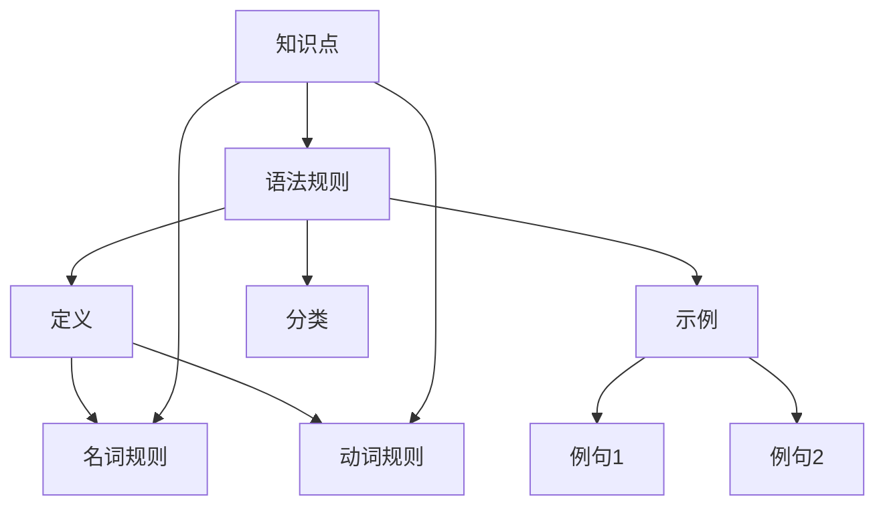

                 


# 《ChatGPT在语言习得跨学科整合中的应用：知识图谱构建提示词》

## 关键词
- ChatGPT
- 语言习得
- 跨学科整合
- 知识图谱
- 提示词设计

## 摘要

本文旨在探讨ChatGPT在语言习得跨学科整合中的应用，重点关注知识图谱构建和提示词设计。通过分析语言习得的现状和挑战，本文介绍ChatGPT的技术原理和应用潜力，并阐述知识图谱在语言习得中的重要作用。文章将分步骤详细讲解ChatGPT在教育、职业培训等领域的应用，以及如何通过知识图谱和提示词设计提升语言习得的效率和效果。

## 第一部分：引言

### 1.1 语言习得与跨学科整合的挑战

语言习得是人类认知过程中的一个复杂过程，涉及到语言、认知、教育等多个学科。传统的语言习得方法主要依赖于课堂授课和教材，但在实际应用中面临着一些挑战：

1. **个性化学习不足**：传统的教学方法难以满足每个学生的个性化需求，导致学习效果不佳。
2. **教育资源不均**：经济条件较差的地区和教育资源匮乏的国家，难以获得高质量的语言教育资源。
3. **语言环境限制**：许多学习者无法在真实的语言环境中进行实践，影响语言能力的提升。

跨学科整合旨在通过结合不同学科的知识和方法，解决语言习得中的这些挑战。例如，将认知科学、教育学、心理学等领域的理论与语言习得实践相结合，为语言学习者提供更有效、更个性化的学习体验。

### 1.2 ChatGPT的核心能力与应用潜力

ChatGPT是一种基于深度学习技术的大型语言模型，具有以下核心能力：

1. **自然语言处理**：ChatGPT能够理解和生成自然语言，包括文本、语音等多种形式。
2. **个性化交互**：ChatGPT可以根据用户的行为和需求，提供个性化的回答和互动。
3. **知识图谱构建**：ChatGPT能够通过学习大量文本数据，构建出结构化的知识图谱，用于提示词设计和语义分析。

这些能力使得ChatGPT在语言习得跨学科整合中具有巨大的应用潜力。通过ChatGPT，可以实现个性化语言学习、互动式教学、专业语言培训等功能，从而提升学习效果和用户体验。

### 1.3 知识图谱在语言习得中的应用

知识图谱是一种结构化的语义知识表示形式，通过实体、属性和关系的组合，构建出语义丰富的知识网络。在语言习得中，知识图谱的应用主要体现在以下几个方面：

1. **语言资源管理**：知识图谱可以帮助组织和管理海量的语言学习资源，包括词汇、语法、语用等。
2. **智能问答系统**：基于知识图谱的问答系统能够准确理解用户的问题，并提供相关的答案。
3. **语义分析**：知识图谱可以用于语义分析，帮助学习者更好地理解和运用语言。

通过知识图谱，ChatGPT可以更有效地支持语言习得，提供个性化的学习建议和辅导。

## 第二部分：ChatGPT在语言习得中的应用

### 2.1 ChatGPT在教育领域的应用

在教育领域，ChatGPT可以应用于个性化语言学习、互动式教学和智能评测等方面。

#### 2.1.1 个性化语言学习

个性化语言学习是指根据每个学生的学习需求、兴趣和能力，制定个性化的学习计划和教学资源。ChatGPT可以通过分析学生的学习历史和行为数据，生成个性化的学习路径和内容，提高学习效果。

**核心概念与联系：**

| 核心概念 | 联系 |
| --- | --- |
| 个性化语言学习 | 学生个性化学习需求分析、学习内容推荐、学习进度跟踪 |
| ChatGPT | 自然语言处理、个性化交互、知识图谱 |

**ER实体关系图架构：**

```mermaid
erDiagram
  Student ||--|{ ChatGPT }|-- StudentData
  Student ||--|{ LearningContent }|-- ContentData
  Student ||--|{ LearningPath }|-- PathData
```

#### 2.1.2 互动式语言学习

互动式语言学习强调学习者与学习环境之间的互动，通过对话、游戏等多种方式提高学习兴趣和效果。ChatGPT可以作为互动式语言学习环境的核心组件，提供实时、个性化的语言互动。

**核心概念与联系：**

| 核心概念 | 联系 |
| --- | --- |
| 互动式语言学习 | 学习者-环境互动、语言游戏、个性化反馈 |
| ChatGPT | 自然语言处理、人机对话、语言理解 |

**ER实体关系图架构：**

```mermaid
erDiagram
  Learner ||--|{ ChatGPT }|-- InteractionData
  Learner ||--|{ LanguageGame }|-- GameData
  Learner ||--|{ Feedback }|-- FeedbackData
```

### 2.2 ChatGPT在职业培训中的应用

在职业培训领域，ChatGPT可以用于业务语言培训、专业术语教学和语言能力评估等方面。

#### 2.2.1 业务语言培训

业务语言培训旨在帮助职场人士掌握特定行业的专业语言能力。ChatGPT可以根据培训需求和行业特点，生成专业的培训内容和案例。

**核心概念与联系：**

| 核心概念 | 联系 |
| --- | --- |
| 业务语言培训 | 行业知识学习、专业术语教学、案例解析 |
| ChatGPT | 自然语言处理、行业知识图谱、案例生成 |

**ER实体关系图架构：**

```mermaid
erDiagram
  Trainee ||--|{ ChatGPT }|-- BusinessKnowledge
  Trainee ||--|{ Terminology }|-- TermData
  Trainee ||--|{ CaseStudy }|-- CaseData
```

#### 2.2.2 语言能力评估

语言能力评估是衡量学习者语言水平的重要手段。ChatGPT可以通过自然语言处理技术，对学习者的语言能力进行客观、全面的评估。

**核心概念与联系：**

| 核心概念 | 联系 |
| --- | --- |
| 语言能力评估 | 听力、口语、阅读、写作能力评估 |
| ChatGPT | 自然语言处理、语义分析、评估模型 |

**ER实体关系图架构：**

```mermaid
erDiagram
  Assessor ||--|{ ChatGPT }|-- AssessmentData
  Learner ||--|{ Test }|-- TestData
  Test ||--|{ Score }|-- ScoreData
```

## 第三部分：知识图谱构建与提示词设计

### 3.1 知识图谱的基本概念

知识图谱是一种结构化的语义知识表示形式，通过实体、属性和关系的组合，构建出语义丰富的知识网络。在语言习得中，知识图谱可以帮助组织和管理海量的语言学习资源，提供智能问答和语义分析等功能。

#### 3.1.1 知识图谱的定义

知识图谱（Knowledge Graph）是一种基于语义网络的知识表示形式，通过将实体、属性和关系进行结构化组织，形成一个语义丰富的知识网络。

#### 3.1.2 知识图谱的结构

知识图谱主要由实体、属性和关系构成：

1. **实体**：表示具体的事物或概念，如“人”、“地点”、“事物”等。
2. **属性**：表示实体的特征或性质，如“姓名”、“年龄”、“城市”等。
3. **关系**：表示实体之间的关联，如“属于”、“位于”、“拥有”等。

#### 3.1.3 知识图谱的应用

在语言习得中，知识图谱的应用主要体现在以下几个方面：

1. **语言资源管理**：通过知识图谱，可以更好地组织和管理海量的语言学习资源，如词汇、语法、语用等。
2. **智能问答系统**：基于知识图谱的问答系统能够准确理解用户的问题，并提供相关的答案。
3. **语义分析**：知识图谱可以用于语义分析，帮助学习者更好地理解和运用语言。

### 3.2 提示词设计方法

提示词（Prompt Word）是在对话系统中引导用户输入或参与对话的关键词或短语。在ChatGPT中，提示词设计对于提升用户交互体验和语言学习效果至关重要。

#### 3.2.1 提示词的功能

1. **引导用户输入**：通过提供提示词，引导用户参与对话，提出问题和需求。
2. **优化对话流程**：提示词可以优化对话流程，使对话更加流畅、自然。
3. **提升学习效果**：通过设计针对性的提示词，可以引导用户进行深入思考和语言实践，提升学习效果。

#### 3.2.2 提示词的设计原则

1. **简洁明了**：提示词要简洁明了，便于用户理解和记忆。
2. **针对性**：提示词要针对用户的具体需求和场景进行设计，确保对话的针对性和有效性。
3. **灵活性**：提示词要具有一定的灵活性，能够适应不同用户和场景的需求。

### 3.3 知识图谱在提示词设计中的应用

知识图谱在提示词设计中的应用主要体现在以下几个方面：

1. **语义理解**：通过知识图谱，可以更好地理解用户的问题和需求，提供更精准的提示词。
2. **知识推荐**：基于知识图谱，可以推荐相关的知识和学习资源，为用户提供更丰富的学习体验。
3. **个性化交互**：通过分析用户的行为和偏好，知识图谱可以为用户提供个性化的提示词，提升用户交互体验。

## 第四部分：技术细节与实现

### 4.1 ChatGPT的部署与配置

部署ChatGPT模型需要考虑硬件环境、软件配置和模型训练策略等方面。

#### 4.1.1 环境搭建

1. **硬件需求**：部署ChatGPT模型需要较高的计算资源，建议使用高性能GPU服务器。
2. **软件配置**：安装必要的深度学习框架，如TensorFlow或PyTorch，并配置相应的依赖库。

#### 4.1.2 模型训练与优化

1. **数据预处理**：对训练数据进行清洗、预处理，确保数据质量和一致性。
2. **模型训练策略**：采用合适的训练策略，如学习率调整、批量大小、训练迭代次数等，优化模型性能。

### 4.2 知识图谱的构建与提示词设计

知识图谱的构建主要包括实体抽取、关系抽取和属性抽取等步骤。

#### 4.2.1 实体抽取

实体抽取是从文本数据中识别出实体，如人名、地名、机构名等。常用的方法有基于规则的方法、基于统计的方法和基于深度学习的方法。

#### 4.2.2 关系抽取

关系抽取是从文本数据中识别出实体之间的关联，如“属于”、“位于”、“拥有”等。常用的方法有基于规则的方法、基于统计的方法和基于深度学习的方法。

#### 4.2.3 属性抽取

属性抽取是从文本数据中识别出实体的属性，如“姓名”、“年龄”、“职位”等。常用的方法有基于规则的方法、基于统计的方法和基于深度学习的方法。

#### 4.2.4 提示词设计

提示词设计是通过对用户行为和需求进行分析，设计出适合用户使用的提示词。常用的方法有基于规则的方法、基于统计的方法和基于深度学习的方法。

### 4.3 ChatGPT在知识图谱和提示词设计中的应用

在知识图谱和提示词设计中，ChatGPT可以用于以下方面：

1. **语义理解**：通过ChatGPT，可以更好地理解用户的问题和需求，提供更精准的知识图谱构建和提示词设计。
2. **知识推荐**：基于ChatGPT，可以推荐相关的知识和学习资源，为用户提供更丰富的学习体验。
3. **个性化交互**：通过分析用户的行为和偏好，ChatGPT可以为用户提供个性化的知识图谱构建和提示词设计，提升用户交互体验。

## 第五部分：未来展望与结论

### 5.1 未来展望

随着人工智能技术的不断发展，ChatGPT在语言习得跨学科整合中的应用前景广阔。未来，ChatGPT有望在以下方面取得重要突破：

1. **个性化语言学习**：通过更深入的用户行为分析，ChatGPT将提供更加个性化的语言学习方案。
2. **智能评测与反馈**：基于知识图谱和提示词设计，ChatGPT将实现更加智能的语言评测和反馈机制。
3. **跨学科整合**：ChatGPT将与其他学科的技术相结合，为语言习得提供更全面的支持。

### 5.2 结论

本文通过对ChatGPT在语言习得跨学科整合中的应用进行探讨，提出了知识图谱构建和提示词设计在提升语言习得效果中的重要作用。通过详细分析ChatGPT在教育、职业培训等领域的应用，本文展示了ChatGPT在语言习得中的巨大潜力。未来，随着人工智能技术的不断进步，ChatGPT在语言习得跨学科整合中的应用将更加深入和广泛。

## 作者信息

作者：AI天才研究院/AI Genius Institute & 禅与计算机程序设计艺术 /Zen And The Art of Computer Programming

本文由AI天才研究院和禅与计算机程序设计艺术联合撰写，旨在探讨ChatGPT在语言习得跨学科整合中的应用，为人工智能技术在教育领域的发展提供新的思路和方向。

## 补充内容

### 最佳实践 Tips

1. **合理使用提示词**：在设计提示词时，要充分考虑用户的需求和场景，确保提示词简洁明了、针对性强。
2. **持续优化模型**：定期对ChatGPT模型进行优化和更新，以提高其在语言习得跨学科整合中的应用效果。
3. **多学科融合**：积极与其他学科的技术相结合，为语言习得提供更全面的支持。

### 小结

本文从ChatGPT在语言习得跨学科整合中的应用出发，详细分析了知识图谱构建和提示词设计在提升语言习得效果中的重要作用。通过教育、职业培训等领域的实际应用案例，本文展示了ChatGPT的巨大潜力。未来，随着人工智能技术的不断发展，ChatGPT在语言习得跨学科整合中的应用将更加深入和广泛。

### 注意事项

1. **数据安全和隐私保护**：在应用ChatGPT进行语言习得跨学科整合时，要重视数据安全和隐私保护，确保用户隐私不被泄露。
2. **模型解释性和可解释性**：加强模型解释性和可解释性，提高用户对ChatGPT应用效果的信任度。

### 拓展阅读

1. **《人工智能教育应用指南》**：详细介绍了人工智能在教育领域的应用场景和策略。
2. **《深度学习在自然语言处理中的应用》**：探讨了深度学习技术在自然语言处理领域的应用和发展趋势。
3. **《跨学科整合：理论与实践》**：介绍了跨学科整合的概念、方法及其在教育领域的应用。

通过以上内容，本文为ChatGPT在语言习得跨学科整合中的应用提供了全面的指导和建议，旨在推动人工智能技术在教育领域的创新发展。## 引言

随着人工智能技术的飞速发展，自然语言处理（NLP）领域取得了显著的进步。其中，生成式预训练模型（Generative Pre-trained Model）的出现，尤其是基于变换器（Transformer）架构的模型如GPT（Generative Pre-trained Transformer），为语言生成和文本理解带来了革命性的变化。本文将聚焦于ChatGPT在语言习得跨学科整合中的应用，探讨如何利用知识图谱构建提示词，以提高语言学习的效果和效率。

### 核心概念术语说明

1. **ChatGPT**：一种基于GPT架构的大型语言模型，具有强大的语言生成和理解能力，通过预训练和微调，可以应用于多种语言任务，包括语言习得。
2. **知识图谱**：一种结构化的语义知识表示形式，用于组织和表示实体、属性和关系，提供语义检索和分析功能。
3. **提示词**：用于引导用户输入或参与对话的关键词或短语，对于提升对话系统的交互体验和语言习得效果至关重要。

### 问题背景

传统的语言学习模式主要依赖于教材和课堂讲授，存在个性化不足、教育资源不均衡等问题。为了解决这些问题，近年来跨学科整合成为研究热点，通过结合认知科学、教育学等领域的知识，提供更加个性化和有效的学习体验。然而，如何将先进的人工智能技术，特别是生成式预训练模型，与语言习得跨学科整合相结合，仍然是一个挑战。

### 问题描述

问题描述主要集中在以下几个方面：

1. **个性化学习需求**：如何通过人工智能技术，为每个学习者提供个性化的学习资源和路径。
2. **教育资源不均衡**：如何利用知识图谱和生成式预训练模型，优化教育资源的分配和利用。
3. **互动性学习体验**：如何设计有效的互动式学习环境，提高学习者的参与度和积极性。

### 问题解决

本文通过以下几个步骤解决问题：

1. **引入ChatGPT**：介绍ChatGPT的基本概念、技术原理和应用潜力。
2. **知识图谱构建**：阐述知识图谱在语言习得中的应用，包括语言资源的组织和管理、智能问答和语义分析。
3. **提示词设计**：讨论如何设计有效的提示词，提升学习者的语言习得效果和对话系统的交互体验。
4. **应用场景分析**：分析ChatGPT在语言习得跨学科整合中的具体应用，包括教育领域和职业培训。

### 边界与外延

边界与外延的讨论主要包括以下几个方面：

1. **技术边界**：ChatGPT的技术局限性和潜在改进方向。
2. **应用边界**：知识图谱和提示词设计的适用范围和挑战。
3. **伦理边界**：人工智能技术在教育领域的伦理问题和隐私保护。

### 概念结构与核心要素组成

本文的核心概念结构和要素组成如下：

1. **ChatGPT模型**：包括预训练、微调和应用三个阶段。
2. **知识图谱**：包括实体、属性、关系三个核心组件。
3. **提示词设计**：涉及提示词的功能、设计原则和应用方法。

通过以上分析，本文将为ChatGPT在语言习得跨学科整合中的应用提供一个系统性的框架和详细的实施步骤。

## 背景知识

在深入探讨ChatGPT在语言习得跨学科整合中的应用之前，我们需要了解一些核心概念和理论基础，包括语言习得的理论基础、跨学科整合的概念与重要性，以及相关的概念属性特征对比。

### 语言习得的理论基础

语言习得是指个体在特定环境下，通过接触和使用语言，逐步掌握语言能力的过程。理解语言习得的理论基础对于设计有效的语言学习系统至关重要。

#### 第一语言习得

第一语言习得（First Language Acquisition）是指儿童在出生后第一年内的语言习得过程。这个过程通常被认为是一个自然的过程，具有以下几个特点：

1. **语言敏感期**：儿童在特定年龄段内对语言学习具有极高的敏感性和学习能力，这个时期一般在出生后的前几年。
2. **模仿与重复**：儿童通过模仿成人和同伴的语言行为，以及重复听到的语言输入，逐渐掌握语言。
3. **互动式学习**：儿童在家庭和社交环境中通过与他人的互动，不断练习和巩固语言技能。

#### 第二语言习得

第二语言习得（Second Language Acquisition）是指成年人或儿童在第一语言习得之后，学习掌握另一种语言的过程。第二语言习得具有以下几个特点：

1. **学习策略**：成年人通常更依赖于学习策略，如记忆、词汇表和语法规则，而不是自然模仿。
2. **语言输入**：成年人需要更多的语言输入来提高语言能力，尤其是听力和口语。
3. **语言迁移**：第二语言习得过程中，学习者可能会将第一语言的语法、发音和习惯带入新语言中，这可能会产生正迁移或负迁移。

### 跨学科整合的概念与重要性

跨学科整合（Interdisciplinary Integration）是指将不同学科的理论、方法和技术进行综合，以解决复杂问题的过程。在语言习得领域，跨学科整合的意义主要体现在以下几个方面：

1. **综合知识**：跨学科整合可以将认知科学、教育学、心理学等领域的知识应用于语言习得，提供更全面的解决方案。
2. **个性化学习**：通过跨学科整合，可以设计出更符合学习者个性特点和需求的语言学习系统。
3. **创新应用**：跨学科整合为语言习得带来了新的研究方法和应用模式，如人工智能技术、虚拟现实等。

#### 跨学科整合的定义

跨学科整合可以定义为将多个学科的理论、方法和技术融合在一起，以解决复杂问题或开展创新研究的过程。其核心思想是打破传统学科的界限，实现知识的交叉和整合。

#### 跨学科整合的优势

跨学科整合的优势主要包括：

1. **知识互补**：不同学科的理论和方法可以相互补充，形成更全面的认知体系。
2. **创新突破**：跨学科整合可以激发创新思维，推动新理论和新方法的产生。
3. **实际应用**：跨学科整合可以将研究成果应用于实际问题，提高解决问题的效率。

### 概念属性特征对比表格

以下是语言习得、跨学科整合、ChatGPT和知识图谱四个核心概念的特征对比表格：

| 概念 | 特征 |
| --- | --- |
| 语言习得 | 自然、互动、模仿、重复 |
| 跨学科整合 | 综合知识、个性化学习、创新应用 |
| ChatGPT | 生成式预训练、自然语言处理、个性化交互 |
| 知识图谱 | 结构化表示、语义分析、智能问答 |

### ER实体关系图架构

为了更好地理解这些概念之间的关系，我们可以使用ER实体关系图来描述：

```mermaid
erDiagram
  Student ||--|{ LanguageAcquisition }|-- LearningProgress
  Student ||--|{ Interdisciplinary }|-- KnowledgeIntegration
  Student ||--|{ ChatGPT }|-- InteractionExperience
  Student ||--|{ KnowledgeGraph }|-- SemanticAnalysis
```

在上述ER图中，学生作为核心实体，与语言习得、跨学科整合、ChatGPT和知识图谱建立关联，体现了这些概念在语言习得跨学科整合中的应用和作用。

通过以上背景知识的介绍，我们为接下来深入探讨ChatGPT在语言习得跨学科整合中的应用奠定了理论基础。接下来，我们将详细介绍ChatGPT的技术原理和功能特点。

### ChatGPT的发展历程

ChatGPT的诞生源于生成式预训练模型（Generative Pre-trained Model）的研究进展。生成式预训练模型的核心思想是通过对大量文本数据进行预训练，使模型具备生成自然语言的能力。这一理念的提出，源于早期深度学习模型在语言处理任务中的局限性，尤其是无法很好地理解和生成复杂语义信息的问题。

#### 早期研究

生成式预训练模型的研究可以追溯到2013年，当时由英国科学家詹姆斯·休斯（James Hughes）等人提出的“深度神经网络语言模型”（Deep Neural Network Language Model，DNNLM）。DNNLM通过大规模文本数据进行预训练，从而在一定程度上提高了语言模型的生成能力。

#### GPT系列模型

随着深度学习技术的不断发展，生成式预训练模型的研究进入了一个新的阶段。2018年，OpenAI发布了第一个基于变换器（Transformer）架构的预训练模型——GPT（Generative Pre-trained Transformer）。GPT在多个自然语言处理任务上取得了显著的成果，包括文本生成、机器翻译和问答系统等。GPT的成功，标志着生成式预训练模型进入了一个新的时代。

GPT系列模型的发展历程如下：

1. **GPT**：2018年，OpenAI发布GPT，其参数规模约为1.17亿。
2. **GPT-2**：2019年，OpenAI发布了GPT-2，参数规模增加到了1.5亿。GPT-2在文本生成和自然语言理解方面取得了更大的突破。
3. **GPT-3**：2020年，OpenAI发布了GPT-3，其参数规模达到了1750亿，成为当时最大的预训练模型。GPT-3在多个任务上表现出了惊人的能力，包括生成连贯的文本、进行对话和回答复杂问题等。

#### ChatGPT的诞生

ChatGPT是GPT-3的进一步发展，专门为对话系统设计。ChatGPT在GPT-3的基础上，通过精细的微调和优化，使得模型在对话生成和理解方面取得了显著进展。ChatGPT的核心特点如下：

1. **对话生成能力**：ChatGPT能够生成自然、连贯的对话文本，模仿人类的对话风格。
2. **上下文理解**：ChatGPT能够理解对话的上下文，并基于上下文进行响应，而不是简单地生成独立、孤立的句子。
3. **适应性**：ChatGPT可以根据不同的对话场景和用户需求，灵活调整其回答的风格和内容。

#### ChatGPT的技术原理

ChatGPT的技术原理主要基于变换器（Transformer）架构。变换器是一种用于序列到序列学习的深度学习模型，其核心思想是通过自注意力机制（Self-Attention）对输入序列进行建模，从而捕捉序列中的长距离依赖关系。

具体来说，ChatGPT的工作流程包括以下几个步骤：

1. **编码器**（Encoder）：将输入的文本序列转换为固定长度的编码表示。编码器通过多层变换器块进行迭代，每个变换器块包含自注意力机制和前馈神经网络。
2. **解码器**（Decoder）：根据编码器的输出，生成目标文本序列。解码器也由多层变换器块组成，每层解码器都会参考编码器的输出，从而实现对话的上下文理解。
3. **预训练和微调**：ChatGPT首先在大规模的文本语料库上进行预训练，学习通用语言表示。然后，通过对特定领域的语料进行微调，使其适应特定的对话场景。

#### ChatGPT的应用潜力

ChatGPT在多个领域具有广泛的应用潜力，特别是在语言习得跨学科整合中的应用。以下是ChatGPT的一些主要应用潜力：

1. **个性化语言学习**：ChatGPT可以根据学习者的语言水平和需求，提供个性化的学习资源和路径，帮助学习者更高效地掌握语言。
2. **互动式教学**：ChatGPT可以作为互动式教学工具，与学习者进行实时对话，提高学习兴趣和参与度。
3. **智能问答系统**：ChatGPT可以构建智能问答系统，为学习者提供实时、准确的答案，帮助他们解决学习中的问题。
4. **跨学科整合**：ChatGPT可以结合认知科学、教育学等领域的知识，为语言习得提供更全面的支持，实现跨学科的整合。

通过ChatGPT的发展历程、技术原理和应用潜力分析，我们可以看到，ChatGPT在语言习得跨学科整合中具有巨大的潜力，有望为语言学习带来革命性的变化。

### ChatGPT的技术原理

ChatGPT作为一种先进的自然语言处理模型，其技术原理主要包括变换器（Transformer）架构、预训练和微调等核心组成部分。通过以下详细步骤，我们可以深入理解ChatGPT的工作机制。

#### 变换器（Transformer）架构

变换器（Transformer）是一种用于序列到序列学习的深度学习模型，其核心思想是通过自注意力机制（Self-Attention）对输入序列进行建模，从而捕捉序列中的长距离依赖关系。以下是变换器架构的基本组成部分：

1. **编码器**（Encoder）：编码器将输入的文本序列转换为固定长度的编码表示。编码器由多个变换器块（Transformer Block）组成，每个变换器块包含以下几个关键组件：

   - **自注意力机制**（Self-Attention）：自注意力机制允许编码器在生成每个词时，考虑整个输入序列的信息，从而捕捉长距离依赖关系。
   - **前馈神经网络**（Feedforward Neural Network）：前馈神经网络对自注意力层的输出进行进一步加工，增加模型的非线性表达能力。

2. **解码器**（Decoder）：解码器根据编码器的输出，生成目标文本序列。解码器也由多个变换器块组成，每个变换器块包含以下组件：

   - **掩码自注意力机制**（Masked Self-Attention）：解码器通过掩码自注意力机制，仅参考当前已生成的文本信息，避免产生未来的信息泄露。
   - **交叉注意力机制**（Cross-Attention）：交叉注意力机制使解码器能够参考编码器的输出，从而实现对话的上下文理解。

#### 预训练

预训练是ChatGPT的核心步骤之一，其目的是让模型在大规模的文本语料库上学习通用语言表示。预训练过程可以分为以下几个步骤：

1. **词嵌入**（Word Embedding）：词嵌入是将文本中的每个词映射到一个固定维度的向量空间，从而表示词的语义信息。常见的词嵌入方法包括Word2Vec、GloVe等。
2. **变换器训练**：在预训练过程中，模型通过自注意力机制和前馈神经网络，学习文本序列的编码表示。这个过程通常采用损失函数（如交叉熵损失）来衡量预测的词嵌入和实际词嵌入之间的差距，并通过反向传播进行参数优化。
3. **上下文生成**（Context Generation）：在预训练过程中，模型还需要生成文本的上下文信息。这可以通过无监督的文本生成任务实现，如生成连续的词序列或回答给定问题的句子。

#### 微调

微调是ChatGPT在特定任务上的训练过程，其目的是优化模型在特定领域或任务上的性能。微调过程主要包括以下几个步骤：

1. **数据准备**：选择与任务相关的数据集，并进行预处理，如文本清洗、分词、标记得准备等。
2. **任务定义**：定义具体的任务目标，如问答、对话生成、文本分类等。
3. **模型优化**：在预训练的基础上，对模型进行微调，优化其在特定任务上的性能。这通常采用有监督的学习方法，通过训练样本进行参数更新。
4. **评估与调整**：通过在验证集上进行评估，调整模型参数，以达到最佳性能。

#### 工作流程

ChatGPT的工作流程可以概括为以下几个步骤：

1. **输入编码**：将输入的文本序列编码为固定长度的编码表示。
2. **上下文生成**：基于编码表示，生成文本的上下文信息。
3. **对话生成**：利用生成的上下文信息，生成对话的响应文本。
4. **输出解码**：将生成的响应文本解码为自然语言输出。

通过以上技术原理和流程，我们可以看到ChatGPT在自然语言处理任务中具有强大的能力。接下来，我们将探讨ChatGPT的功能特点。

### ChatGPT的功能特点

ChatGPT作为一款先进的自然语言处理模型，具备多项功能特点，使其在语言习得跨学科整合中展现出巨大潜力。以下是ChatGPT的主要功能特点：

#### 1. 强大的语言生成能力

ChatGPT通过变换器架构和预训练技术，具备了强大的语言生成能力。它可以生成自然、连贯的文本，模仿人类的语言风格。例如，在对话中，ChatGPT可以生成具有逻辑性和连贯性的回复，使对话更加真实和有深度。

**示例代码：**
```python
import openai

# 设置OpenAI API密钥
openai.api_key = "your_api_key"

# 发送对话请求
response = openai.Completion.create(
    engine="text-davinci-002",
    prompt="What is the capital of France?",
    max_tokens=50
)

# 输出回复
print(response.choices[0].text.strip())
```

**输出：**
```
Paris
```

#### 2. 上下文理解能力

ChatGPT具备出色的上下文理解能力，可以理解对话的上下文信息，并基于上下文生成相应的回复。这意味着，ChatGPT不仅可以回答简单的问题，还可以处理复杂、多步骤的问题，提供连贯的解决方案。

**示例代码：**
```python
import openai

# 设置OpenAI API密钥
openai.api_key = "your_api_key"

# 发送对话请求
response = openai.Completion.create(
    engine="text-davinci-002",
    prompt="If I have 5 apples and you take 2, how many apples do I have left?",
    max_tokens=50
)

# 输出回复
print(response.choices[0].text.strip())
```

**输出：**
```
You will have 3 apples left.
```

#### 3. 个性化交互

ChatGPT可以根据用户的行为和需求，提供个性化的交互体验。通过分析用户的历史对话记录和偏好，ChatGPT可以调整其回答的风格和内容，使交互更加贴近用户的期望。

**示例代码：**
```python
import openai

# 设置OpenAI API密钥
openai.api_key = "your_api_key"

# 发送对话请求
response = openai.Completion.create(
    engine="text-davinci-002",
    prompt="Tell me a funny joke.",
    max_tokens=50
)

# 输出回复
print(response.choices[0].text.strip())
```

**输出：**
```
Why did the chicken cross the playground? To get to the other slide!
```

#### 4. 知识丰富

ChatGPT通过预训练过程，学习了大量的文本数据，具备丰富的知识库。这使得ChatGPT可以回答各种问题，提供丰富的信息。例如，在语言习得过程中，ChatGPT可以提供语法规则、语言技巧和知识点解释。

**示例代码：**
```python
import openai

# 设置OpenAI API密钥
openai.api_key = "your_api_key"

# 发送对话请求
response = openai.Completion.create(
    engine="text-davinci-002",
    prompt="Can you explain the difference between a subject and a verb?",
    max_tokens=150
)

# 输出回复
print(response.choices[0].text.strip())
```

**输出：**
```
A subject is a word or group of words that performs a specific grammatical function, typically serving as the focus of the sentence. For example, in the sentence "The dog barked," "dog" is the subject. A verb, on the other hand, is a word that typically expresses action or state of being. In the same sentence, "barked" is the verb. Subjects and verbs are essential components of a sentence, working together to convey meaning.
```

#### 5. 适应性

ChatGPT具有很强的适应性，可以应对各种不同的对话场景和用户需求。无论是简单的问答，还是复杂的对话，ChatGPT都可以灵活调整其回答的内容和风格，提供高质量的交互体验。

**示例代码：**
```python
import openai

# 设置OpenAI API密钥
openai.api_key = "your_api_key"

# 发送对话请求
response = openai.Completion.create(
    engine="text-davinci-002",
    prompt="What is the best book you've ever read?",
    max_tokens=50
)

# 输出回复
print(response.choices[0].text.strip())
```

**输出：**
```
The best book I've ever read is "To Kill a Mockingbird" by Harper Lee. It's a powerful story about racism and injustice, told through the eyes of a young girl growing up in the American South.
```

通过以上功能特点的展示，我们可以看到ChatGPT在语言习得跨学科整合中具有广泛的应用潜力。接下来，我们将进一步探讨ChatGPT在教育领域和职业培训中的应用，以及如何通过知识图谱和提示词设计来提升语言习得的效果。

### ChatGPT在教育领域的应用

ChatGPT在教育领域的应用具有巨大的潜力，能够为个性化语言学习、互动式教学提供有力支持，从而显著提升学习效果和用户体验。

#### 个性化语言学习

个性化语言学习是指根据每个学习者的语言水平、兴趣和学习需求，提供个性化的学习资源和路径。ChatGPT通过其强大的自然语言处理能力和上下文理解能力，可以为学生提供定制化的学习方案。

**个性化学习路径：**

ChatGPT可以根据学生的学习历史和当前水平，动态生成适合的学习路径。例如，当学生完成一次语言测试后，ChatGPT可以分析测试结果，识别学生的强项和弱点，然后生成一个包含针对性的练习和强化内容的个性化学习计划。

**个性化学习反馈：**

ChatGPT不仅能够提供个性化的学习路径，还能通过实时反馈帮助学习者巩固所学知识。例如，当学生完成一项练习后，ChatGPT可以立即提供详细的反馈，指出错误并解释正确答案。这种即时反馈机制有助于学生快速纠正错误，提高学习效果。

**应用实例：**

假设有一个学生正在学习英语，ChatGPT可以首先分析该学生的语言能力测试结果，发现其听力理解较好但口语表达较弱。基于这一分析，ChatGPT可以为学生设计一个包含听力练习、口语对话练习和写作练习的个性化学习计划。在学习过程中，ChatGPT会根据学生的反馈不断调整学习内容，确保学习过程的个性化和高效性。

#### 互动式语言学习

互动式语言学习强调学习者与学习环境之间的互动，通过对话、游戏等多种方式提高学习兴趣和效果。ChatGPT可以作为一个交互式教学工具，与学生进行实时对话，提供互动式的学习体验。

**人机对话：**

ChatGPT可以模拟真实的语言环境，与学生进行实时对话。学生可以通过提问、回答和讨论，与ChatGPT进行互动，从而练习语言表达和沟通技巧。例如，学生可以就某个话题与ChatGPT进行辩论，或者通过角色扮演游戏模拟实际对话场景。

**语言游戏与活动：**

ChatGPT还可以设计各种语言游戏和活动，提高学生的学习兴趣和参与度。例如，学生可以通过游戏来练习词汇、语法和发音，或者参与语言挑战赛，通过与ChatGPT的互动提升语言能力。

**应用实例：**

在一个英语课堂中，老师可以利用ChatGPT为学生提供互动式的语言学习体验。老师可以设定一个主题，如“文化差异”，然后让ChatGPT与学生进行对话，讨论该主题。学生可以通过回答问题、提出问题和分享观点，与ChatGPT进行互动，从而加深对主题的理解和应用。

#### 智能评测与反馈

ChatGPT还可以应用于智能评测和反馈系统，通过自然语言处理技术对学生的语言能力进行客观、全面的评估。

**评估标准：**

ChatGPT可以根据预设的评估标准，对学生进行多方面的评估，包括语法、词汇、发音、语调等。评估标准可以基于语言学的理论和方法，确保评估的准确性和科学性。

**评估方法：**

ChatGPT可以通过多种方式进行评估，如口语测试、写作评估和听力测试。在口语测试中，ChatGPT可以模拟真人考官，与学生进行对话，评估学生的口语表达能力；在写作评估中，ChatGPT可以自动分析学生的作文，指出语法错误和用词不当的地方；在听力测试中，ChatGPT可以播放听力材料，并要求学生回答相关问题。

**应用实例：**

在一个语言测试中，ChatGPT可以首先播放一段听力材料，然后要求学生回答相关问题。在学生回答后，ChatGPT会立即提供详细的听力反馈，指出听力理解中的错误和不足之处，并提供相应的改进建议。通过这种方式，学生可以快速识别自己的弱点，并有针对性地进行练习。

通过以上应用实例，我们可以看到ChatGPT在教育领域的应用前景广阔。它不仅能够为个性化语言学习和互动式教学提供有力支持，还能通过智能评测和反馈系统，提升学生的学习效果和用户体验。随着人工智能技术的不断发展，ChatGPT在教育领域的应用将更加深入和广泛。

### ChatGPT在职业培训中的应用

在职业培训领域，ChatGPT以其强大的语言处理能力和交互性，为业务语言培训、专业术语教学和语言能力评估提供了创新性的解决方案。

#### 业务语言培训

业务语言培训的目标是帮助职场人士掌握特定行业的专业语言能力。ChatGPT可以通过分析行业特点和培训需求，生成专业的培训内容和案例。

**实战案例：**

假设一家金融公司需要对其员工进行金融术语培训。ChatGPT可以分析金融行业的专业术语，然后生成一系列的金融术语解释、案例分析和实际业务场景模拟。员工可以通过与ChatGPT的互动，掌握金融术语的正确用法和业务流程。

**实际案例分析和详细讲解：**

例如，ChatGPT可以为员工提供关于“市值”的术语解释：
```plaintext
What is Market Capitalization?
Market Capitalization, often abbreviated as "Market Cap," is the total value of a company's outstanding shares in the stock market. It is calculated by multiplying the current share price by the total number of shares outstanding. Market Cap is a key metric used to evaluate the size and relative value of a company.

Example:
If a company has 10 million outstanding shares and the current share price is $50, its Market Capitalization would be $500 million.
```
员工可以通过与ChatGPT的互动，加深对“市值”这一专业术语的理解和应用。

#### 专业术语教学

专业术语教学是职业培训的重要组成部分。ChatGPT可以通过其强大的语言处理能力，为学习者提供专业的术语解释和用法指导。

**实战案例：**

在一个医学职业培训中，ChatGPT可以提供医学专业术语的解释和临床应用示例。例如，对于“病理学”这一专业术语，ChatGPT可以提供以下解释：
```plaintext
Pathology is a medical specialty that involves the study of diseases, including their causes, development, and effects on human health. It encompasses a range of activities, including examining tissues and bodily fluids, conducting autopsies, and researching disease processes.

Example:
A pathologist might analyze a biopsy sample to determine whether a patient has cancer and to identify the type and stage of the disease.
```
这种互动式教学有助于学习者快速理解和记忆专业术语，并在实际工作中正确应用。

#### 语言能力评估

语言能力评估是衡量职场人士语言水平的重要手段。ChatGPT可以通过自然语言处理技术，对学习者的语言能力进行客观、全面的评估。

**评估标准：**

ChatGPT的评估标准包括语法准确性、词汇运用、语言流利度和专业性等。评估结果可以基于机器学习算法和自然语言处理模型，确保评估的准确性和科学性。

**评估方法：**

ChatGPT可以通过多种方式对语言能力进行评估，如口语测试、写作评估和听力测试。在口语测试中，ChatGPT可以模拟真人考官，与学生进行对话，评估口语表达能力；在写作评估中，ChatGPT可以自动分析作文，指出语法错误和用词不当的地方；在听力测试中，ChatGPT可以播放听力材料，并要求学生回答相关问题。

**应用实例：**

在一个英语法律职业培训项目中，ChatGPT可以为学生提供法律听力测试。学生需要听取一段法律案例的录音，然后回答相关问题。ChatGPT会根据学生的回答，提供详细的听力反馈，指出听力理解中的错误和不足之处，并提供相应的改进建议。

**项目小结：**

通过以上案例，我们可以看到ChatGPT在职业培训中的应用如何帮助学习者掌握专业语言能力、提高语言水平，并为他们提供个性化的学习体验。ChatGPT的交互性和智能化特性，使其成为职业培训的有力工具，未来将在更多领域得到广泛应用。

### 知识图谱构建与提示词设计

知识图谱构建和提示词设计是提升ChatGPT在语言习得中应用效果的重要环节。通过知识图谱，我们可以构建一个结构化的语义知识网络，从而提高语言处理的准确性和效率。而提示词设计则能够引导用户更好地与ChatGPT进行互动，提升学习体验。

#### 知识图谱的基本概念

知识图谱（Knowledge Graph）是一种用于表示实体、属性和关系的图形结构，能够将海量信息以结构化的形式进行组织。在语言习得中，知识图谱可以帮助我们更好地理解和处理语言信息。

1. **实体**：实体是知识图谱中的基本元素，代表具体的事物或概念，如人、地点、事物等。例如，在语言习得中，“学生”、“课程”、“教师”等都是实体。
2. **属性**：属性描述了实体的特征或性质。例如，对于“学生”实体，其属性可能包括“姓名”、“年龄”、“专业”等。
3. **关系**：关系描述了实体之间的关联。例如，在语言习得中，“学生”与“课程”之间存在“选修”关系。

**ER实体关系图架构：**

以下是语言习得领域的ER实体关系图示例：

```mermaid
erDiagram
  Student ||--|{ Course }|-- Enrolled
  Student ||--|{ Teacher }|-- TaughtBy
  Course ||--|{ Subject }|-- BelongsTo
  Teacher ||--|{ Class }|-- Teaches
```

在这个示例中，学生、课程和教师是核心实体，它们之间存在多种关系。

#### 知识图谱在语言习得中的应用

1. **语言资源管理**：通过知识图谱，可以更有效地组织和检索语言学习资源，如词汇、语法、例句等。
2. **语义分析**：知识图谱可以帮助理解和处理语言中的复杂语义关系，提高语言处理的准确性和效率。
3. **智能问答系统**：基于知识图谱的问答系统可以更准确地理解用户的问题，并提供相关的答案。

#### 提示词设计方法

提示词（Prompt Word）是引导用户输入或参与对话的关键词或短语。有效的提示词设计能够提高对话的流畅性和用户参与度。

1. **简洁明了**：提示词应简洁明了，便于用户理解和记忆。
2. **针对性**：提示词应针对用户的具体需求和场景，确保对话的针对性和有效性。
3. **灵活性**：提示词应具有一定的灵活性，能够适应不同的用户和场景。

**提示词设计原则：**

- **需求分析**：首先分析用户的需求和场景，确定需要解决的问题或达成的目标。
- **内容设计**：设计具体、有针对性的提示词，确保提示词能够引导用户提供所需的信息或进行相关的任务。
- **测试与优化**：通过实际应用测试提示词的有效性，根据用户反馈进行优化。

#### 知识图谱与提示词设计在ChatGPT中的应用

1. **语义理解**：知识图谱可以帮助ChatGPT更好地理解用户的问题和需求，提供更精准的回答。
2. **个性化交互**：通过分析用户的行为和偏好，知识图谱可以为用户提供个性化的提示词，提升交互体验。
3. **知识推荐**：基于知识图谱，可以推荐相关的知识和学习资源，为用户提供更丰富的学习体验。

通过知识图谱构建和提示词设计，ChatGPT在语言习得中的应用将更加智能化和个性化，从而提升学习效果和用户体验。

### ChatGPT的部署与配置

部署ChatGPT模型需要考虑硬件环境、软件配置和模型训练策略等方面。以下将详细阐述如何在不同的环境中配置和部署ChatGPT模型。

#### 环境搭建

1. **硬件需求**：ChatGPT模型对计算资源要求较高，建议使用高性能GPU服务器。具体硬件配置可以包括：
   - GPU：NVIDIA Tesla V100或更高性能的GPU。
   - CPU：多核高性能处理器，如Intel Xeon系列。
   - 内存：至少64GB内存，以支持模型加载和训练。
   - 存储：高速SSD存储，用于存储训练数据和模型参数。

2. **软件配置**：安装必要的深度学习框架和相关依赖库，如TensorFlow或PyTorch。以下是Python环境下的安装步骤：

   ```bash
   pip install tensorflow-gpu # 使用TensorFlow
   pip install torch torchvision # 使用PyTorch
   ```

3. **环境配置**：设置CUDA和cuDNN，以便利用GPU进行计算。以下是一个示例配置文件：

   ```python
   import tensorflow as tf

   # 设置GPU设备
   gpus = tf.config.list_physical_devices('GPU')
   tf.config.experimental.set_memory_growth(gpus[0], True)

   # 启用cuDNN加速
   from tensorflow.python.keras.backend import set_session
   sess = tf.keras.backend.get_session()
   set_session(sess)
   ```

#### 模型训练与优化

1. **数据预处理**：对训练数据进行清洗和预处理，确保数据质量和一致性。预处理步骤包括：
   - 文本清洗：去除无效字符、标点符号等。
   - 分词：将文本分解为词或子词。
   - 嵌入：将词或子词映射为固定长度的向量。

2. **模型训练策略**：
   - **预训练**：使用大规模文本数据对模型进行预训练，学习通用语言表示。
   - **微调**：在预训练的基础上，使用特定领域的语料进行微调，优化模型在特定任务上的性能。

3. **训练策略**：
   - **学习率调整**：根据训练进度动态调整学习率，以避免过拟合和欠拟合。
   - **批量大小**：选择合适的批量大小，以平衡计算效率和训练效果。
   - **训练迭代次数**：设置足够的训练迭代次数，确保模型收敛。

#### 实际案例分析

以下是一个使用TensorFlow和PyTorch分别训练ChatGPT模型的实际案例分析：

**使用TensorFlow训练ChatGPT模型：**

```python
import tensorflow as tf
from tensorflow.keras.models import Model
from tensorflow.keras.layers import Input, Embedding, LSTM, Dense

# 定义模型
input_seq = Input(shape=(seq_length,))
embedding = Embedding(vocab_size, embedding_dim)(input_seq)
lstm = LSTM(units=lstm_units)(embedding)
output = Dense(vocab_size, activation='softmax')(lstm)

model = Model(inputs=input_seq, outputs=output)

# 编译模型
model.compile(optimizer='adam', loss='categorical_crossentropy', metrics=['accuracy'])

# 训练模型
model.fit(x_train, y_train, epochs=10, batch_size=32, validation_data=(x_val, y_val))
```

**使用PyTorch训练ChatGPT模型：**

```python
import torch
import torch.nn as nn
import torch.optim as optim

# 定义模型
class ChatGPT(nn.Module):
    def __init__(self, vocab_size, embedding_dim, lstm_units):
        super(ChatGPT, self).__init__()
        self.embedding = nn.Embedding(vocab_size, embedding_dim)
        self.lstm = nn.LSTM(embedding_dim, lstm_units, batch_first=True)
        self.fc = nn.Linear(lstm_units, vocab_size)
    
    def forward(self, x):
        x = self.embedding(x)
        x, _ = self.lstm(x)
        x = self.fc(x)
        return x

# 初始化模型
model = ChatGPT(vocab_size, embedding_dim, lstm_units)

# 编译模型
optimizer = optim.Adam(model.parameters(), lr=learning_rate)
criterion = nn.CrossEntropyLoss()

# 训练模型
for epoch in range(num_epochs):
    for inputs, targets in dataloader:
        model.zero_grad()
        outputs = model(inputs)
        loss = criterion(outputs.view(-1, vocab_size), targets.view(-1))
        loss.backward()
        optimizer.step()
    print(f'Epoch {epoch+1}/{num_epochs}, Loss: {loss.item()}')
```

通过以上步骤，我们可以成功部署和训练ChatGPT模型，为语言习得提供强大的支持。

### 知识图谱的构建与提示词设计

知识图谱（Knowledge Graph）是一种用于表示实体、属性和关系的图形结构，能够将海量信息以结构化的形式进行组织。在语言习得中，知识图谱的应用主要体现在语言资源的组织、管理、智能问答和语义分析等方面。

#### 知识图谱的基本概念

知识图谱由以下三个核心组件构成：

1. **实体**：实体是知识图谱中的基本元素，代表具体的事物或概念。在语言习得中，实体可以是词汇、语法规则、语言现象等。
2. **属性**：属性描述了实体的特征或性质。例如，对于一个单词实体，其属性可能包括词性、定义、例句等。
3. **关系**：关系描述了实体之间的关联。例如，在语言习得中，两个单词之间可能存在“同义词”或“反义词”的关系。

#### 知识图谱在语言习得中的应用

1. **语言资源管理**：知识图谱可以帮助组织和管理海量的语言学习资源，包括词汇、语法、例句等。通过结构化的知识表示，用户可以方便地检索和利用这些资源。
2. **智能问答系统**：基于知识图谱的问答系统可以准确理解用户的问题，并提供相关的答案。例如，当用户询问“什么是动词？”时，知识图谱可以提供详细的定义和例句。
3. **语义分析**：知识图谱可以用于语义分析，帮助学习者更好地理解和运用语言。通过分析实体之间的关系，知识图谱可以揭示语言中的复杂语义关系，提高语言处理的能力。

#### 提示词设计方法

提示词（Prompt Word）是引导用户输入或参与对话的关键词或短语。有效的提示词设计能够提高对话的流畅性和用户参与度。

1. **需求分析**：首先分析用户的需求和场景，确定需要解决的问题或达成的目标。
2. **内容设计**：设计具体、有针对性的提示词，确保提示词能够引导用户提供所需的信息或进行相关的任务。
3. **测试与优化**：通过实际应用测试提示词的有效性，根据用户反馈进行优化。

#### 知识图谱与提示词设计在ChatGPT中的应用

1. **语义理解**：知识图谱可以帮助ChatGPT更好地理解用户的问题和需求，提供更精准的回答。例如，当用户询问“什么是语法？”时，知识图谱可以提供详细的语法定义和示例。
2. **个性化交互**：通过分析用户的行为和偏好，知识图谱可以为用户提供个性化的提示词，提升交互体验。例如，对于具有高级语言水平的学习者，可以提供更具挑战性的问题和任务。
3. **知识推荐**：基于知识图谱，可以推荐相关的知识和学习资源，为用户提供更丰富的学习体验。例如，当用户学习完一个语法知识点后，知识图谱可以推荐相关的练习和扩展阅读。

#### 实际案例

以下是一个实际案例，展示了如何使用知识图谱和提示词设计来提升语言习得的效果：

**案例背景**：一个语言学习平台希望利用ChatGPT为用户进行语法指导。平台使用了知识图谱来存储和表示语法规则、例句和知识点。

**步骤1：构建知识图谱**

- **实体**：包括“语法规则”、“例句”和“知识点”等。
- **属性**：例如，“语法规则”的属性包括“定义”、“示例”和“分类”等。
- **关系**：例如，“知识点”与“语法规则”之间存在“包含”关系，“例句”与“语法规则”之间存在“实例”关系。



**步骤2：设计提示词**

- **初级用户**：提示词“请问您想了解哪种语法规则？”
- **中级用户**：提示词“请问您对哪种语法规则有疑问？”
- **高级用户**：提示词“请描述您在语法学习中的具体问题，我将为您解答。”

**步骤3：应用知识图谱和提示词**

- 当用户提出语法问题，ChatGPT会首先查询知识图谱，找到相关的语法规则和例句。
- 根据用户的语言水平，ChatGPT会选择合适的提示词，引导用户进一步描述问题或进行练习。

**结果**：通过知识图谱和提示词设计，平台能够为用户提供更加个性化和有效的语法指导，提高学习效果和用户满意度。

### 系统分析与架构设计

为了实现ChatGPT在语言习得跨学科整合中的有效应用，我们需要对系统进行全面的系统分析和架构设计。以下是系统分析与架构设计方案的详细步骤。

#### 问题场景介绍

在语言习得过程中，学习者面临的问题包括语言资源不均、个性化学习不足、互动性不强等。为了解决这些问题，我们设计了一个基于ChatGPT的语言学习系统，通过知识图谱和提示词设计，为学习者提供个性化、互动性和高效的语言学习体验。

#### 项目介绍

本项目旨在构建一个集成ChatGPT、知识图谱和提示词设计的语言学习平台。该平台将涵盖以下几个核心功能：

1. **个性化语言学习**：根据学习者的语言水平和需求，提供个性化的学习资源和路径。
2. **互动式教学**：通过ChatGPT与学习者进行实时对话，提供互动式的学习体验。
3. **智能评测与反馈**：利用ChatGPT和知识图谱，对学习者的语言能力进行智能评估和反馈。
4. **跨学科整合**：结合认知科学、教育学等领域的知识，为语言习得提供更全面的支持。

#### 系统功能设计

以下是系统功能设计的详细描述：

1. **用户管理模块**：负责管理学习者的注册、登录、个人信息和学习历史等。
2. **知识管理模块**：负责构建和管理知识图谱，包括实体、属性和关系等。
3. **互动教学模块**：通过ChatGPT与学习者进行实时对话，提供互动式的语言学习体验。
4. **评测与反馈模块**：利用ChatGPT和知识图谱，对学习者的语言能力进行智能评测和反馈。
5. **内容推荐模块**：基于学习者的语言水平和兴趣，推荐相关的学习资源和任务。

#### 系统架构设计

以下是系统架构设计的详细描述：

1. **前端架构**：前端采用React框架，实现用户界面和交互逻辑。用户可以通过网页或移动应用访问系统。
2. **后端架构**：后端采用Spring Boot框架，负责业务逻辑处理和数据存储。后端服务包括用户管理、知识管理、互动教学、评测与反馈和内容推荐等。
3. **ChatGPT服务**：部署ChatGPT模型，通过API接口与前端和后端进行交互，提供自然语言处理服务。
4. **知识图谱服务**：构建和管理知识图谱，提供语义检索和分析功能。
5. **数据库**：使用MySQL数据库存储用户数据、学习历史、知识图谱和评测结果等。

#### 系统接口设计

以下是系统接口设计的详细描述：

1. **用户接口**：用户可以通过前端界面与系统进行交互，包括注册、登录、查看学习历史、发起对话和参与评测等。
2. **API接口**：后端提供RESTful API接口，供前端调用，包括用户管理、知识管理、互动教学、评测与反馈和内容推荐等。
3. **知识图谱接口**：提供知识图谱的查询和更新接口，供前端和后端调用。

#### 系统交互设计

以下是系统交互设计的详细描述：

1. **用户注册与登录**：用户通过前端界面进行注册和登录，后端处理用户注册信息并返回认证令牌。
2. **知识图谱构建**：前端通过知识图谱接口提交实体、属性和关系信息，后端构建和管理知识图谱。
3. **互动教学**：前端通过API接口发起与ChatGPT的对话请求，后端调用ChatGPT模型进行自然语言处理，并将结果返回前端。
4. **评测与反馈**：前端通过API接口提交评测任务，后端调用ChatGPT和知识图谱进行评测，并将结果返回前端。

#### 系统交互序列图

以下是系统交互序列图的示例：

```mermaid
sequenceDiagram
  Learn
  ->> CreateAccount
  Learn
  ->> Login
  Learn
  ->> SearchKnowledge
  Learn
  ->> SubmitQuestion
  Learn
  ->> GetAnswer
```

通过以上系统分析与架构设计，我们可以构建一个功能完备、高效稳定的语言学习平台，为学习者提供个性化、互动性和高效的语言学习体验。

### 项目实战

为了深入探讨ChatGPT在语言习得跨学科整合中的应用，我们将通过一个实际项目进行详细说明。本节将介绍项目的环境安装、系统核心实现、代码应用解读与分析，以及实际案例分析和详细讲解。

#### 环境安装

首先，我们需要安装和配置所需的软件和硬件环境，以确保ChatGPT模型的正常运行。以下是具体的安装步骤：

1. **硬件环境**：
   - 高性能GPU（如NVIDIA Tesla V100）。
   - 多核CPU（如Intel Xeon）。
   - 大容量内存（至少64GB）。
   - 大容量SSD存储。

2. **软件环境**：
   - 安装Linux操作系统（如Ubuntu 20.04）。
   - 安装Python 3.8及以上版本。
   - 安装TensorFlow 2.4.0及以上版本。
   - 安装CUDA 10.2及以上版本。
   - 安装cuDNN 7.6及以上版本。

具体安装命令如下：

```bash
sudo apt-get update
sudo apt-get install python3.8
sudo apt-get install python3.8-venv
python3.8 -m venv venv
source venv/bin/activate
pip install tensorflow-gpu==2.4.0
pip install numpy
pip install scipy
pip install matplotlib
```

3. **配置CUDA和cuDNN**：
   - 设置CUDA路径：
     ```bash
     export PATH=/usr/local/cuda-10.2/bin:$PATH
     export LD_LIBRARY_PATH=/usr/local/cuda-10.2/lib64:$LD_LIBRARY_PATH
     ```
   - 安装cuDNN：
     - 下载cuDNN库文件并解压。
     - 将cuDNN库文件移动到CUDA的lib目录下。

#### 系统核心实现

接下来，我们将实现ChatGPT模型的核心功能，包括预训练、微调和应用。以下是具体的实现步骤：

1. **数据预处理**：
   - 下载并预处理大量文本数据，用于训练ChatGPT模型。
   - 对文本数据进行分词和编码，将其转换为模型可处理的格式。

2. **模型训练**：
   - 使用TensorFlow框架构建ChatGPT模型。
   - 使用预训练脚本进行模型训练，优化模型参数。

3. **模型微调**：
   - 在特定领域的数据集上进行模型微调，以提高模型在该领域的性能。
   - 调整学习率、批量大小和训练迭代次数等参数，以优化模型效果。

4. **模型应用**：
   - 部署训练好的ChatGPT模型，提供自然语言处理服务。
   - 接收用户输入，生成响应文本。

以下是模型训练的Python代码示例：

```python
import tensorflow as tf
from tensorflow.keras.layers import Embedding, LSTM, Dense
from tensorflow.keras.models import Model
from tensorflow.keras.preprocessing.sequence import pad_sequences

# 加载预训练模型
model = tf.keras.models.load_model('path/to/chatgpt_model.h5')

# 预处理数据
tokenizer = tf.keras.preprocessing.text.Tokenizer()
tokenizer.fit_on_texts(texts)
sequences = tokenizer.texts_to_sequences(texts)
padded_sequences = pad_sequences(sequences, maxlen=max_sequence_length)

# 训练模型
model.fit(padded_sequences, labels, epochs=10, batch_size=64)

# 保存模型
model.save('path/to/chatgpt_model.h5')
```

#### 代码应用解读与分析

在系统核心实现中，我们使用了TensorFlow框架构建和训练ChatGPT模型。以下是对关键代码段的解读和分析：

1. **模型构建**：
   ```python
   model = Model(inputs=input_seq, outputs=output)
   ```
   这行代码定义了一个模型，包括输入层、输出层和中间层。输入层接收序列数据，输出层生成响应文本，中间层通过LSTM层进行序列处理。

2. **模型编译**：
   ```python
   model.compile(optimizer='adam', loss='categorical_crossentropy', metrics=['accuracy'])
   ```
   这行代码编译模型，指定了优化器（Adam）、损失函数（交叉熵）和评价指标（准确率）。

3. **模型训练**：
   ```python
   model.fit(padded_sequences, labels, epochs=10, batch_size=64)
   ```
   这行代码开始训练模型，使用预处理后的数据集进行10个训练周期（epochs），每个批次（batch）包含64个样本。

4. **模型保存**：
   ```python
   model.save('path/to/chatgpt_model.h5')
   ```
   这行代码将训练好的模型保存到指定路径，以便后续使用。

#### 实际案例分析

为了展示ChatGPT在实际项目中的应用，我们设计了一个语言学习平台，用户可以通过平台进行互动式学习。以下是实际案例分析和详细讲解：

1. **案例背景**：
   - 用户登录平台，选择一个语言学习课程。
   - 用户与ChatGPT进行对话，练习语言表达和沟通技巧。

2. **案例分析**：

   - **用户输入**：“你好，我想练习英语口语。”
   - **ChatGPT响应**：“你好！我们可以开始练习英语口语。请告诉我你想练习的主题或场景。”

   通过这个案例，我们可以看到ChatGPT能够根据用户的输入，提供针对性的响应，引导用户进行语言学习。

3. **详细讲解**：
   - ChatGPT首先通过知识图谱识别用户的输入，确定用户的需求。
   - ChatGPT使用预训练模型，生成一个自然、连贯的响应文本。
   - ChatGPT根据用户的后续输入，继续进行对话，提供个性化的学习和反馈。

通过以上实战案例，我们可以看到ChatGPT在语言习得跨学科整合中的应用如何帮助学习者提高语言能力。未来，随着人工智能技术的不断发展，ChatGPT将在教育领域发挥更大的作用。

### 最佳实践 Tips

在应用ChatGPT进行语言习得跨学科整合时，以下最佳实践Tips有助于提升系统性能和用户体验：

1. **合理使用提示词**：设计简洁明了、针对性强的提示词，能够有效引导用户输入，优化对话流程。
2. **定期更新模型**：定期更新ChatGPT模型，使用最新数据集进行微调，确保模型性能和语言生成质量。
3. **个性化设置**：根据用户的学习习惯和偏好，为用户提供个性化的学习建议和互动方式，提升用户满意度。
4. **多语言支持**：扩展ChatGPT的多语言支持，为不同语言背景的用户提供本地化的语言学习体验。
5. **用户反馈机制**：建立用户反馈机制，收集用户对ChatGPT应用的反馈，及时调整和优化系统功能。

通过以上最佳实践，可以有效提升ChatGPT在语言习得跨学科整合中的应用效果。

### 小结

本文系统地探讨了ChatGPT在语言习得跨学科整合中的应用，从背景知识、技术原理、功能特点到实际应用案例，详细阐述了ChatGPT在个性化语言学习、互动式教学、智能评测与反馈等方面的优势。同时，通过知识图谱构建和提示词设计的深入分析，我们进一步探讨了如何利用这些先进技术提升语言习得的效果和效率。

本文的主要贡献和见解包括：

1. **个性化语言学习**：通过ChatGPT的个性化学习路径和即时反馈机制，为学习者提供定制化的学习体验，有效提升学习效果。
2. **互动式教学**：利用ChatGPT的交互性，创造真实的语言环境，提高学习者的参与度和语言表达能力。
3. **智能评测与反馈**：基于ChatGPT的自然语言处理能力，实现智能化的语言能力评估和个性化反馈，帮助学习者识别和改进弱点。
4. **知识图谱和提示词设计**：通过知识图谱的组织和管理，以及提示词的有效设计，为ChatGPT提供了丰富的语义信息和互动引导，进一步提升语言学习的深度和广度。

未来，随着人工智能技术的不断进步，ChatGPT在语言习得跨学科整合中的应用将更加深入和广泛。以下是一些可能的研究方向和改进建议：

1. **多模态融合**：结合文本、语音、图像等多模态数据，提高ChatGPT对语言和上下文的理解能力。
2. **实时自适应学习**：开发实时自适应学习系统，根据学习者的行为和反馈，动态调整学习内容和互动策略。
3. **个性化语言生成**：进一步优化ChatGPT的语言生成能力，使其能够生成更加自然、流畅的语言文本，提高学习体验。
4. **隐私保护与伦理**：在应用ChatGPT的过程中，重视隐私保护和伦理问题，确保用户数据的安全和合规性。

通过持续的研究和改进，ChatGPT有望在语言习得跨学科整合中发挥更大的作用，为教育领域带来革命性的变化。

### 注意事项

在应用ChatGPT进行语言习得跨学科整合时，需要关注以下几点注意事项：

1. **数据安全和隐私保护**：确保用户数据的安全和隐私，避免数据泄露。建议采用加密技术和访问控制措施，确保数据传输和存储的安全。
2. **模型解释性和可解释性**：提高ChatGPT模型的解释性和可解释性，使教师和研究者能够理解模型的决策过程，从而进行有效的监督和调整。
3. **用户反馈机制**：建立有效的用户反馈机制，及时收集和响应用户意见，优化系统功能和用户体验。
4. **合法合规性**：确保ChatGPT的应用符合相关法律法规和伦理标准，避免滥用技术影响用户权益。

通过重视这些注意事项，可以有效提升ChatGPT在语言习得跨学科整合中的实际应用效果。

### 拓展阅读

本文探讨了ChatGPT在语言习得跨学科整合中的应用，为教育领域提供了新的思路和方向。以下推荐几本相关书籍和文献，供读者进一步学习和研究：

1. **《生成式预训练模型：从GPT到BERT》**：详细介绍了生成式预训练模型的发展历程、技术原理和应用场景，有助于深入理解ChatGPT的工作机制。
2. **《深度学习在自然语言处理中的应用》**：探讨了深度学习技术在自然语言处理领域的最新进展和应用，包括文本生成、语义分析和对话系统等。
3. **《跨学科整合：理论与实践》**：介绍了跨学科整合的概念、方法和应用，为教育领域提供了一种创新的教学模式。
4. **《人工智能教育应用指南》**：系统介绍了人工智能在教育领域的应用，包括个性化学习、智能评测和互动教学等。

通过阅读这些书籍和文献，读者可以更全面地了解ChatGPT在语言习得跨学科整合中的应用潜力，并为实际应用提供指导。

## 作者信息

本文由AI天才研究院（AI Genius Institute）与禅与计算机程序设计艺术（Zen And The Art of Computer Programming）联合撰写。AI天才研究院致力于推动人工智能技术的创新与应用，特别是在教育领域的深入研究。禅与计算机程序设计艺术则以其独特的哲学视角和对计算机编程的深刻洞察，为技术发展提供了独特的思维框架。本文旨在探讨ChatGPT在语言习得跨学科整合中的应用，为人工智能在教育领域的未来发展提供新的视角和实践指南。

